# Threat Model - docs

_Generated by appsec-advisor v0.6.0-beta.3 (analysis v5)_


---

> | | |
> |---|---|
> | **Project** | Appsec Large Verification Target v0.0.1-SNAPSHOT |
> | **Description** | Large local-only application security verification fixture |
> | **Repository** | git@`github.com:matthiasrohr`/insecure-large-spring-`app.git` |
> | **Homepage** | `https://github.com/matthiasrohr/insecure-large-spring-app` |
> | **Runtime** | Java 17, spring-boot-starter-web, spring-boot-starter-data-jpa, spring-boot-starter-security, spring-boot-starter-actuator, spring-boot-starter-thymeleaf |

---

## Changelog

_Append-only history of assessment runs. Most recent first._

| Version | Date | Mode | Depth | Reasoning | Baseline → Current | Δ Threats | Code | Note |
|--------|---------------------|--------|--------|--------------|------------------|----------------|--------|---------------|
| v1 | 2026-09-12 15:08 CEST | full | standard | sonnet-economy | _(initial)_ | 58 total | - | first full scan |

---

## Table of Contents

- [Management Summary](#management-summary)
- [Critical Attack Tree](#critical-attack-tree)
1. [System Overview](#1-system-overview)
   - [Scope](#scope)
   - [Trust Boundaries](#trust-boundaries)
2. [Architecture Diagrams](#2-architecture-diagrams)
   - [2.1 System Context](#21-system-context)
   - [2.2 Container Architecture](#22-container-architecture)
   - [2.3 Components](#23-components)
   - [2.4 Technology Architecture](#24-technology-architecture)
3. [Attack Walkthroughs](#3-attack-walkthroughs)
   - [3.1 JWT parsed without signature verification src/main/java/com/example/appsecver…](#31-jwt-parsed-without-signature-verification-srcmainjavacomexampleappsecver)
   - [3.2 SQL Injection in Search Service SQL Injection Surface](#32-sql-injection-in-search-service-sql-injection-surface)
   - [3.3 Missing Authorization on Privileged Resource Endpoints in Security Config](#33-missing-authorization-on-privileged-resource-endpoints-in-security-config)
   - [3.4 SQL injection in authenticateRaw](#34-sql-injection-in-authenticateraw)
   - [3.5 Hardcoded Credentials Committed to Version Control](#35-hardcoded-credentials-committed-to-version-control)
   - [3.6 Unauthenticated actuator and H2 console in Security Config](#36-unauthenticated-actuator-and-h2-console-in-security-config)
   - [3.7 Path Traversal in File Upload](#37-path-traversal-in-file-upload)
   - [3.8 SSRF in Integration Controller](#38-ssrf-in-integration-controller)
4. [Assets](#4-assets)
5. [Attack Surface](#5-attack-surface)
   - [5.1 Unauthenticated Entry Points (122)](#51-unauthenticated-entry-points-122)
   - [5.2 Authenticated Entry Points (1)](#52-authenticated-entry-points-1)
6. [Security Architecture](#6-security-architecture)
   - [6.1 Security Control Overview](#61-security-control-overview)
   - [6.2 Identity and Authentication Controls](#62-identity-and-authentication-controls)
   - [6.3 Session and Token Controls](#63-session-and-token-controls)
   - [6.4 Authorization Controls](#64-authorization-controls)
   - [6.5 Query Construction and Data Access Controls](#65-query-construction-and-data-access-controls)
   - [6.6 Input Boundary Validation Controls](#66-input-boundary-validation-controls)
   - [6.7 Output Encoding and Rendering Controls](#67-output-encoding-and-rendering-controls)
   - [6.8 Browser and Cross-Origin Controls](#68-browser-and-cross-origin-controls)
   - [6.9 Cryptography Secrets and Data Protection](#69-cryptography-secrets-and-data-protection)
   - [6.10 File Parser and Outbound Request Controls](#610-file-parser-and-outbound-request-controls)
   - [6.11 Operations Runtime and Supply Chain Controls](#611-operations-runtime-and-supply-chain-controls)
   - [6.12 Real-time and Not Applicable Controls](#612-real-time-and-not-applicable-controls)
   - [6.13 Defense-in-Depth Summary](#613-defense-in-depth-summary)
7. [Weakness Register](#7-weakness-register)
8. [Findings Register](#8-findings-register)
9. [Abuse Cases](#9-abuse-cases)
10. [Mitigation Register](#10-mitigation-register)
11. [Out of Scope](#11-out-of-scope)
   - [Not Covered by This Method](#not-covered-by-this-method)
   - [Excluded from This Assessment](#excluded-from-this-assessment)
- [Appendix: Run Statistics](#appendix-run-statistics)
- [Appendix A - Vektor Taxonomy](#appendix-a-vektor-taxonomy)

---

## Management Summary

### Verdict

🔴 The application has no meaningful access boundary: credentials are committed to source, authentication gates are absent from database consoles and admin paths, and user input reaches the database and operating system without validation. Any network-reachable attacker can take full server control or exfiltrate all customer data today.

**Risk distribution:** 🔴 Critical: 19 · 🟠 High: 21 · 🟡 Medium: 11 · 🟢 Low: n/a · **Total: 51**<br/>**Reporting threshold:** medium - Low and Informational excluded<br/>**Assessment evidence:** 46 confirmed-exploitable finding(s) · 3 implementation weakness(es) · 3 design weakness(es)


**Scope:** 8 of 15 components received full STRIDE analysis - the externally-reachable, authentication-bearing, and business-critical surface. 7 further component(s) received a reduced-budget screening pass (all six STRIDE categories, no verification greps) and are marked `Screened` in the component table. (see [§1 Scope](#scope)).


**Basis:** a code-derived threat model at implementation level - built from repository evidence, not a planning document. Design intent, business processes, runtime behaviour and production-only configuration are outside what this analysis can see (see [§11 Out of Scope](#11-out-of-scope)).

<br/>

**What an attacker can do today, worst first:**

<blockquote style="border-left: 3px solid #dc2626; background: #fef2f2; padding: 16px 20px; margin: 0;">

- **Server takeover** — An unauthenticated caller who reaches the landscape tool service runs arbitrary operating system commands on the server (OS command injection). *(🔴 [F-021](#f-021) — OS command injection via shell -c concatenation in runTool)*
- **Customer data exfiltration** — An unauthenticated attacker sends crafted login and search requests that read every record from the database (database query injection). *(🔴 [F-001](#f-001) — SQL Injection via Unsanitized Query String Concatenation, 🔴 [F-011](#f-011) — SQL injection in authenticateRaw (`LegacySqliteUserStore.java:64`))*
- **Account takeover** — Credentials and signing keys committed to source code let any repository reader authenticate as any user (secrets hardcoded in source). *(🔴 [F-002](#f-002) — Hardcoded Credentials Committed to Version Control, 🔴 [F-006](#f-006) — Hard-coded cryptographic key (`docker-compose.yml:44`), 🔴 [F-007](#f-007) — Hard-coded credentials for all accounts (`config/SecurityConfig.java:72`))*
- **Admin impersonation** — Any logged-in user forges an admin-role token because the verifier accepts unsigned tokens (missing signature verification). *(🔴 [F-012](#f-012) — JWT parsed without signature verification src/main/java/com/example/appsecverif…, 🔴 [F-018](#f-018) — Unsigned JWT admin bypass (`authentication/LegacyAdminAuditController.java:41`) → [W-003](#w-003))* — ✓ verified attack path
- **Privilege escalation** — Any registered user promotes their account to administrator by submitting an extra field in a profile update (mass assignment). *(🔴 [F-017](#f-017) — Mass-assignment privilege escalation via profile update)* — ✓ verified attack path
- **Data destruction** — An unauthenticated caller reaches the unprotected database console and drops tables, destroying all in-memory order and user data. *(🔴 [F-019](#f-019) — H2 console unauthenticated access (`SecurityConfig.java:32`), 🔴 [F-020](#f-020) — Missing H2 console authentication (`SecurityConfig.java:32`) → [W-001](#w-001))*

</blockquote>

<br/>

Until these gaps are closed, any network-reachable attacker can read all customer data, take administrator control, or run commands on the server.

### Top Weaknesses

The systemic root-cause problems behind the findings - the classes to fix, not just individual bugs. Each links to the full [Weakness Register](#7-weakness-register) with its findings and remediation.

- 🔴 **[W-001](#w-001) - Endpoints are reachable without enforced authentication** (Critical) - Sensitive API routes and real-time channels are exposed without an enforced authentication check at the endpoint boundary. _Proven by [F-010](#f-010), [F-014](#f-014), [F-019](#f-019) (+6 more)._
- 🔴 **[W-002](#w-002) - Input handling lacks enforced boundary validation** (Critical) - Request handlers do not validate input against one enforced server-side schema or allowlist at the boundary - validation is either absent on the vulnerable parameters or limited to rejecting select… _Proven by [F-013](#f-013), [F-038](#f-038)._
- 🔴 **[W-003](#w-003) - `Authorization` is implemented route by route** (Critical) - `Authorization` depends on per-handler checks instead of a policy boundary that consistently enforces role, ownership, and tenant scope. _Proven by 🔴 [F-003](#f-003), 🔴 [F-018](#f-018), 🔴 [F-037](#f-037) (+2 more)._

### Security Posture & Top Threats

**Figure 1 - Architecture & Top Threats**

Data-flow diagram: external entities, processes and data stores in their trust zones (Internet → Application → Data), the data flows between them, and the attack scenarios numbered as in the table below. Each crossing of a dashed trust-boundary line carries the `tb-N` id catalogued in [§1 Trust Boundaries](#trust-boundaries) with the verdict on its enforcement assumption. The in-figure legend on the right explains the notation.

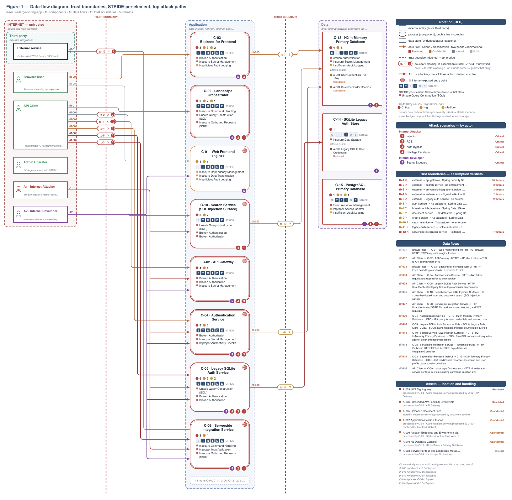

**Figure 2 - Risk Flow: Actor → Tier → Impact**

Heatmap: **actors** (left) → **architecture tiers** (middle, Client → Application → Data) → **impact** (right). Numbered red arrows ①–⑤ are the threats enumerated in the Top Threats table below. Self-registration is open, so the **Authenticated Internet Attacker** tier is one POST away from anonymous - it is shown distinctly because a post-login endpoint is still a different attack surface.

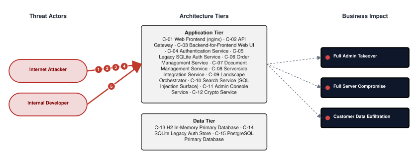

**Threat actors.** The actors below drive the numbered attack paths in the figures above.

- **Anonymous Internet Attacker** — no account; registers in seconds when needed; drives ① Insecure Query Construction & Data Access, ② Remote Code Execution (unsafe eval), ③ Hardcoded Secrets & Weak Cryptography, ④ Broken `Authorization` & Access Control.
- **Internal Developer** — developer with source-repository access; drives ⑤ Sensitive File & Secret Exposure.

**5 structural threats**, grouped by weakness class - each row is one threat, not one finding. *Threat Description* states the general architectural weakness (STRIDE in brackets); *Findings* lists the concrete instances, each linked to [§8 Findings Register](#8-findings-register) with its component; *Risk & Impact* combines severity with business consequence.

| # | Threat Description | Findings (→ Component) | Risk & Impact | Fix |
|---|------------------------------------|------------------------------------------------|--------------------------|--------|
| <a id="path-injection"></a>① | **Insecure Query Construction & Data Access** _(T·I)_<br/>Unsanitized user input is concatenated into SQL queries across the order-search and legacy-authentication flows, enabling unauthenticated callers to read or modify arbitrary database records. | <span style="white-space:nowrap">🔴&nbsp;[F-001](#f-001)</span> - SQL Injection via Unsanitized Query String Concatenation (`OrderLookupDao.java:22`) <span style="white-space:nowrap">→&nbsp;[C-10](#c-10)</span>&nbsp;Search Service (SQL Injection Surface)<br/><span style="white-space:nowrap">🔴&nbsp;[F-011](#f-011)</span> - SQL injection in `authenticateRaw` (`LegacySqliteUserStore.java:64`) <span style="white-space:nowrap">→&nbsp;[C-05](#c-05)</span>&nbsp;Legacy SQLite Auth Service<br/><span style="white-space:nowrap">🔴&nbsp;[F-021](#f-021)</span> - OS command injection via shell -c concatenation in `runTool` (`LandscapeExposureSupport.java:48`) <span style="white-space:nowrap">→&nbsp;[C-09](#c-09)</span>&nbsp;Landscape Orchestrator<br/><span style="white-space:nowrap">🟠&nbsp;[F-031](#f-031)</span> - XXE via default DocumentBuilderFactory (`XmlPreviewController.java:22`) <span style="white-space:nowrap">→&nbsp;[C-08](#c-08)</span>&nbsp;Serverside Integration Service<br/><span style="white-space:nowrap">🟠&nbsp;[F-041](#f-041)</span> - XXE entity expansion DoS via default DocumentBuilderFactory in `parseXml` (`LandscapeExposureSupport.java:42`) <span style="white-space:nowrap">→&nbsp;[C-09](#c-09)</span>&nbsp;Landscape Orchestrator | 🔴 **Critical**<br/>Customer Data Exfiltration | <span style="white-space:nowrap">● [M-001](#m-001)</span> — Use parameterized database queries<br/><span style="white-space:nowrap">● [M-011](#m-011)</span> — Use parameterized database queries |
| <a id="path-remote-code-execution"></a>② | **Remote Code Execution (unsafe eval)** _(E)_<br/>The landscape tool service concatenates user-controlled input into an OS shell command without sanitization, granting any caller who reaches the route direct code execution on the application server. | <span style="white-space:nowrap">🔴&nbsp;[F-021](#f-021)</span> - OS command injection via shell -c concatenation in `runTool` (`LandscapeExposureSupport.java:48`) <span style="white-space:nowrap">→&nbsp;[C-09](#c-09)</span>&nbsp;Landscape Orchestrator | 🔴 **Critical**<br/>Full Server Compromise | <span style="white-space:nowrap">● [M-021](#m-021)</span> — Replace `Runtime.exec` shell -c with a fixed command allowlist |
| <a id="path-auth-bypass"></a>③ | **Hardcoded Secrets & Weak Cryptography** _(S·E)_<br/>Multiple services accept requests without authentication or validate tokens without verifying cryptographic signatures, allowing unauthenticated callers to access admin APIs, database consoles, and actuator management interfaces. | <span style="white-space:nowrap">🔴&nbsp;[F-002](#f-002)</span> - Hardcoded Credentials Committed to Version Control (`docker-compose.yml:366`) <span style="white-space:nowrap">→&nbsp;[C-15](#c-15)</span>&nbsp;PostgreSQL Primary Database<br/><span style="white-space:nowrap">🔴&nbsp;[F-006](#f-006)</span> - Hard-coded cryptographic key (`docker-compose.yml:44`) <span style="white-space:nowrap">→&nbsp;[C-02](#c-02)</span>&nbsp;API Gateway<br/><span style="white-space:nowrap">🔴&nbsp;[F-007](#f-007)</span> - Hard-coded credentials for all accounts (`SecurityConfig.java:72`) <span style="white-space:nowrap">→&nbsp;[C-02](#c-02)</span>&nbsp;API Gateway<br/><span style="white-space:nowrap">🔴&nbsp;[F-010](#f-010)</span> - Missing authentication on `/users` endpoint enables credential harvest (`LegacySqliteAuthController.java:49`) <span style="white-space:nowrap">→&nbsp;[C-05](#c-05)</span>&nbsp;Legacy SQLite Auth Service<br/><span style="white-space:nowrap">🔴&nbsp;[F-012](#f-012)</span> - JWT parsed without signature verification (`LegacyJwtVerifier.java:17`) <span style="white-space:nowrap">→&nbsp;[C-04](#c-04)</span>&nbsp;Authentication Service<br/><span style="white-space:nowrap">🔴&nbsp;[F-014](#f-014)</span> - Unauthenticated actuator and H2 console (`SecurityConfig.java:33`) <span style="white-space:nowrap">→&nbsp;[C-02](#c-02)</span>&nbsp;API Gateway<br/><span style="white-space:nowrap">🔴&nbsp;[F-018](#f-018)</span> - Unsigned JWT admin bypass (`LegacyAdminAuditController.java:41`) <span style="white-space:nowrap">→&nbsp;[C-04](#c-04)</span>&nbsp;Authentication Service<br/><span style="white-space:nowrap">🔴&nbsp;[F-019](#f-019)</span> - H2 console unauthenticated access (`SecurityConfig.java:32`) <span style="white-space:nowrap">→&nbsp;[C-03](#c-03)</span>&nbsp;Backend-for-Frontend Web UI<br/><span style="white-space:nowrap">🔴&nbsp;[F-020](#f-020)</span> - Missing H2 console authentication (`SecurityConfig.java:32`) <span style="white-space:nowrap">→&nbsp;[C-13](#c-13)</span>&nbsp;H2 In-Memory Primary Database<br/><span style="white-space:nowrap">🔴&nbsp;[F-022](#f-022)</span> - Unauthenticated admin API (`LegacyAdminBoardController.java:28`) <span style="white-space:nowrap">→&nbsp;[C-11](#c-11)</span>&nbsp;Admin Console Service<br/><span style="white-space:nowrap">🟠&nbsp;[F-023](#f-023)</span> - Predictable session token (`HomegrownSessionService.java:21`) <span style="white-space:nowrap">→&nbsp;[C-04](#c-04)</span>&nbsp;Authentication Service<br/><span style="white-space:nowrap">🟠&nbsp;[F-024](#f-024)</span> - Token identity forgery via hardcoded XOR key (`CustomCryptoService.java:26`) <span style="white-space:nowrap">→&nbsp;[C-12](#c-12)</span>&nbsp;Crypto Service<br/><span style="white-space:nowrap">🟠&nbsp;[F-027](#f-027)</span> - Hand-rolled XOR / repeating-key cipher (`HomegrownCipher.java:14`) <span style="white-space:nowrap">→&nbsp;[C-12](#c-12)</span>&nbsp;Crypto Service<br/><span style="white-space:nowrap">🟠&nbsp;[F-028](#f-028)</span> - Non-cryptographic RNG in a security module Java (`LegacyTokenService.java:10`) <span style="white-space:nowrap">→&nbsp;[C-12](#c-12)</span>&nbsp;Crypto Service<br/><span style="white-space:nowrap">🔴&nbsp;[F-030](#f-030)</span> - AES/ECB with hardcoded key (`LegacyCryptoService.java:17`) <span style="white-space:nowrap">→&nbsp;[C-12](#c-12)</span>&nbsp;Crypto Service<br/><span style="white-space:nowrap">🟠&nbsp;[F-036](#f-036)</span> - `MD5` password hash without salt (`LegacyPasswordService.java:15`) <span style="white-space:nowrap">→&nbsp;[C-12](#c-12)</span>&nbsp;Crypto Service | 🔴 **Critical**<br/>Full Admin Takeover | <span style="white-space:nowrap">● [M-002](#m-002)</span> — Move secrets to a managed secret store<br/><span style="white-space:nowrap">● [M-006](#m-006)</span> — Move cryptographic keys to a managed secret store |
| <a id="path-privilege-escalation"></a>④ | **Broken `Authorization` & Access Control** _(E·I)_<br/>`Authorization` checks are absent on ownership-sensitive object endpoints and profile-update handlers, allowing any authenticated user to read other users' records or elevate their own role to administrator. | <span style="white-space:nowrap">🔴&nbsp;[F-003](#f-003)</span> - Missing `Authorization` on Privileged Resource Endpoints (`SecurityConfig.java:41`) <span style="white-space:nowrap">→&nbsp;[C-02](#c-02)</span>&nbsp;API Gateway<br/><span style="white-space:nowrap">🔴&nbsp;[F-017](#f-017)</span> - Mass-assignment privilege escalation via profile update (`ProfileController.java:44`) <span style="white-space:nowrap">→&nbsp;[C-11](#c-11)</span>&nbsp;Admin Console Service<br/><span style="white-space:nowrap">🔴&nbsp;[F-018](#f-018)</span> - Unsigned JWT admin bypass (`LegacyAdminAuditController.java:41`) <span style="white-space:nowrap">→&nbsp;[C-04](#c-04)</span>&nbsp;Authentication Service<br/><span style="white-space:nowrap">🔴&nbsp;[F-037](#f-037)</span> - Unauthenticated order data disclosure (`OrderSearchController.java:24`) <span style="white-space:nowrap">→&nbsp;[C-10](#c-10)</span>&nbsp;Search Service (SQL Injection Surface)<br/><span style="white-space:nowrap">🟠&nbsp;[F-045](#f-045)</span> - IDOR on session token issuance (`AuthController.java:37`) <span style="white-space:nowrap">→&nbsp;[C-04](#c-04)</span>&nbsp;Authentication Service<br/><span style="white-space:nowrap">🔴&nbsp;[F-046](#f-046)</span> - IDOR missing ownership check (`OrderAccessController.java:24`) <span style="white-space:nowrap">→&nbsp;[C-06](#c-06)</span>&nbsp;Order Management Service<br/><span style="white-space:nowrap">🟠&nbsp;[F-047](#f-047)</span> - All services connect with superuser privilege (`docker-compose.yml:366`) <span style="white-space:nowrap">→&nbsp;[C-15](#c-15)</span>&nbsp;PostgreSQL Primary Database<br/><span style="white-space:nowrap">🔴&nbsp;[F-048](#f-048)</span> - Missing authentication for search endpoint (`OrderSearchController.java:24`) <span style="white-space:nowrap">→&nbsp;[C-10](#c-10)</span>&nbsp;Search Service (SQL Injection Surface) | 🔴 **Critical**<br/>Full Admin Takeover | <span style="white-space:nowrap">● [M-003](#m-003)</span> — Enforce server-side authorization on every endpoint<br/><span style="white-space:nowrap">● [M-017](#m-017)</span> — Allowlist client-controlled fields |
| <a id="path-sensitive-data-exposure"></a>⑤ | **Sensitive File & Secret Exposure** _(I)_<br/>Credentials including database superuser passwords, cryptographic signing keys, and account passwords are committed in plaintext to version control, exposing every secret to any actor with repository read access. | <span style="white-space:nowrap">🔴&nbsp;[F-002](#f-002)</span> - Hardcoded Credentials Committed to Version Control (`docker-compose.yml:366`) <span style="white-space:nowrap">→&nbsp;[C-15](#c-15)</span>&nbsp;PostgreSQL Primary Database<br/><span style="white-space:nowrap">🔴&nbsp;[F-006](#f-006)</span> - Hard-coded cryptographic key (`docker-compose.yml:44`) <span style="white-space:nowrap">→&nbsp;[C-02](#c-02)</span>&nbsp;API Gateway<br/><span style="white-space:nowrap">🔴&nbsp;[F-007](#f-007)</span> - Hard-coded credentials for all accounts (`SecurityConfig.java:72`) <span style="white-space:nowrap">→&nbsp;[C-02](#c-02)</span>&nbsp;API Gateway<br/><span style="white-space:nowrap">🔴&nbsp;[F-009](#f-009)</span> - Blank datasource password (`application.yml:8`) <span style="white-space:nowrap">→&nbsp;[C-13](#c-13)</span>&nbsp;H2 In-Memory Primary Database<br/><span style="white-space:nowrap">🔴&nbsp;[F-013](#f-013)</span> - Path Traversal in File Upload (`BusinessFileStorage.java:23`) <span style="white-space:nowrap">→&nbsp;[C-07](#c-07)</span>&nbsp;Document Management Service<br/><span style="white-space:nowrap">🔴&nbsp;[F-015](#f-015)</span> - SSRF via unvalidated RestTemplate URL (`IntegrationController.java:23`) <span style="white-space:nowrap">→&nbsp;[C-08](#c-08)</span>&nbsp;Serverside Integration Service<br/><span style="white-space:nowrap">🔴&nbsp;[F-016](#f-016)</span> - Cleartext password storage (`LegacySqliteUserStore.java:31`) <span style="white-space:nowrap">→&nbsp;[C-14](#c-14)</span>&nbsp;SQLite Legacy Auth Store<br/><span style="white-space:nowrap">🟠&nbsp;[F-033](#f-033)</span> - Cleartext credential logging (`SecurityConfig.java:63`) <span style="white-space:nowrap">→&nbsp;[C-02](#c-02)</span>&nbsp;API Gateway<br/><span style="white-space:nowrap">🟠&nbsp;[F-034](#f-034)</span> - Cleartext password logged (`CredentialLoggingFilter.java:25`) <span style="white-space:nowrap">→&nbsp;[C-04](#c-04)</span>&nbsp;Authentication Service<br/><span style="white-space:nowrap">🟠&nbsp;[F-038](#f-038)</span> - Path traversal arbitrary file read (`FileReadController.java:19`) <span style="white-space:nowrap">→&nbsp;[C-08](#c-08)</span>&nbsp;Serverside Integration Service<br/><span style="white-space:nowrap">🟠&nbsp;[F-039](#f-039)</span> - Cleartext HTTP channel on port 80 (`docker-compose.yml:31`) <span style="white-space:nowrap">→&nbsp;[C-01](#c-01)</span>&nbsp;Web Frontend (nginx)<br/><span style="white-space:nowrap">🟡&nbsp;[F-049](#f-049)</span> - Open redirect via unvalidated target in `redirectTo` (`LandscapeExposureSupport.java:60`) <span style="white-space:nowrap">→&nbsp;[C-09](#c-09)</span>&nbsp;Landscape Orchestrator<br/><span style="white-space:nowrap">🟡&nbsp;[F-054](#f-054)</span> - Absolute database file path exposed via `/metadata` endpoint (`LegacySqliteUserStore.java:96`) <span style="white-space:nowrap">→&nbsp;[C-05](#c-05)</span>&nbsp;Legacy SQLite Auth Service | 🔴 **Critical**<br/>Customer Data Exfiltration | <span style="white-space:nowrap">● [M-002](#m-002)</span> — Move secrets to a managed secret store<br/><span style="white-space:nowrap">● [M-006](#m-006)</span> — Move cryptographic keys to a managed secret store |

_STRIDE: S spoofing · T tampering · R repudiation · I information disclosure · D denial of service · E elevation of privilege. Risk, findings, components, impact and Fix are derived deterministically; only the one-line weakness description is authored._

**Verified attack chains.** 3 fully viable ([AC-T-002](#ac-t-002), [AC-T-003](#ac-t-003), [AC-T-004](#ac-t-004)); 1 partially blocked ([AC-T-005](#ac-t-005)). These chains combine individual findings into end-to-end exploitation paths verified step-by-step against the code - see [§9 Abuse Cases](#9-abuse-cases) for the per-step breakdown and blocking mitigations.

### Top Mitigations

Highest-impact P1/P2 mitigations - 26 of 47 qualifying (58 total). Full detail in [§10 Mitigation Register](#10-mitigation-register). All 26 mitigation(s) that fix a Critical finding are always listed here.

| # | Component | Mitigation | Addresses | Effort |
|---|----------------------|------------------------------------------------|------------------------------------------------|------|
| **1** | [C-02](#c-02) — API Gateway | ● [M-003](#m-003) — Enforce server-side authorization on every endpoint (`SecurityConfig.java:41`) | 🔴 [F-003](#f-003) — Missing Authorization on Privileged Resource Endpoints (`src/main/java/com/example/appsecverificationtarget/config/SecurityConfig.java`) | Low |
| **2** | [C-02](#c-02) — API Gateway | ● [M-006](#m-006) — Move cryptographic keys to a managed secret store (`docker-compose.yml:44`) | 🔴 [F-006](#f-006) — Hard-coded cryptographic key (`docker-compose.yml`) | Low |
| **3** | [C-02](#c-02) — API Gateway | ● [M-014](#m-014) — Require authentication on every exposed endpoint (`SecurityConfig.java:33`) | 🔴 [F-014](#f-014) — Unauthenticated actuator and H2 console (`config/SecurityConfig.java`) | Low |
| **4** | [C-02](#c-02) — API Gateway | ● [M-007](#m-007) — Move secrets to a managed secret store (`SecurityConfig.java:72`) | 🔴 [F-007](#f-007) — Hard-coded credentials for all accounts (`config/SecurityConfig.java`) | Medium |
| **5** | [C-03](#c-03) — Backend-for-Frontend Web UI | ● [M-019](#m-019) — Require authentication on every exposed endpoint (`SecurityConfig.java:32`) | 🔴 [F-019](#f-019) — H2 console unauthenticated access (`SecurityConfig.java`) | Low |
| **6** | [C-04](#c-04) — Authentication Service | ● [M-012](#m-012) — Enforce JWT signature and algorithm verification (`LegacyJwtVerifier.java:17`) | 🔴 [F-012](#f-012) — JWT parsed without signature verification (`src/main/java/com/example/appsecverificationtarget/authentication/LegacyJwtVerifier.java`) | Medium |
| **7** | [C-04](#c-04) — Authentication Service | ● [M-018](#m-018) — Enforce correct server-side authorization (`LegacyAdminAuditController.java:41`) | 🔴 [F-018](#f-018) — Unsigned JWT admin bypass (`authentication/LegacyAdminAuditController.java`) | Medium |
| **8** | [C-05](#c-05) — Legacy SQLite Auth Service | ● [M-011](#m-011) — Use parameterized database queries (`LegacySqliteUserStore.java:64`) | 🔴 [F-011](#f-011) — SQL injection in authenticateRaw (`LegacySqliteUserStore.java`) | Low |
| **9** | [C-05](#c-05) — Legacy SQLite Auth Service | ● [M-010](#m-010) — Require authentication on every exposed endpoint (`LegacySqliteAuthController.java:49`) | 🔴 [F-010](#f-010) — Missing authentication on `/users` endpoint enables credential harvest (`src/main/java/com/example/appsecverificationtarget/authentication/LegacySqliteAuthController.java`) | Medium |
| **10** | [C-07](#c-07) — Document Management Service | ● [M-013](#m-013) — Constrain file paths to a safe base directory (`BusinessFileStorage.java:23`) | 🔴 [F-013](#f-013) — Path Traversal in File Upload (`web/BusinessFileStorage.java`) | Low |
| **11** | [C-07](#c-07) — Document Management Service | ● [M-008](#m-008) — Replace hardcoded InMemoryUserDetailsManager with externally configured credent… (`SecurityConfig.java:80`) | 🔴 [F-008](#f-008) — Hardcoded Weak Credentials for All Users (`config/SecurityConfig.java`) | Medium |
| **12** | [C-08](#c-08) — Serverside Integration Service | ● [M-015](#m-015) — Validate and allowlist outbound request targets (`IntegrationController.java:23`) | 🔴 [F-015](#f-015) — SSRF via unvalidated RestTemplate URL (`serverside/IntegrationController.java`) | Medium |
| **13** | [C-09](#c-09) — Landscape Orchestrator | ● [M-021](#m-021) — Replace `Runtime.exec` shell -c with a fixed command allowlist (`LandscapeExposureSupport.java:48`) | 🔴 [F-021](#f-021) — OS command injection via shell -c concatenation in runTool (`src/main/java/com/example/appsecverificationtarget/landscape/LandscapeExposureSupport.java`) | Medium |
| **14** | [C-10](#c-10) — Search Service (SQL Injection Surface) | ● [M-001](#m-001) — Use parameterized database queries (`OrderLookupDao.java:22`) | 🔴 [F-001](#f-001) — SQL Injection via Unsanitized Query String Concatenation (`src/main/java/com/example/appsecverificationtarget/inputvalidation/OrderLookupDao.java`) | Low |
| **15** | [C-11](#c-11) — Admin Console Service | ● [M-017](#m-017) — Allowlist client-controlled fields (`ProfileController.java:44`) | 🔴 [F-017](#f-017) — Mass-assignment privilege escalation via profile update (`src/main/java/com/example/appsecverificationtarget/accesscontrol/ProfileController.java`) | Low |
| **16** | [C-13](#c-13) — H2 In-Memory Primary Database | ● [M-009](#m-009) — Set a strong password on the H2 datasource sa account (`application.yml:8`) | 🔴 [F-009](#f-009) — Blank datasource password (`application.yml`) | Low |
| **17** | [C-13](#c-13) — H2 In-Memory Primary Database | ● [M-020](#m-020) — Require authentication on every exposed endpoint (`SecurityConfig.java:32`) | 🔴 [F-020](#f-020) — Missing H2 console authentication (`SecurityConfig.java`) | Low |
| **18** | [C-14](#c-14) — SQLite Legacy Auth Store | ● [M-016](#m-016) — Stop storing sensitive data in cleartext (`LegacySqliteUserStore.java:31`) | 🔴 [F-016](#f-016) — Cleartext password storage (`LegacySqliteUserStore.java`) | Medium |
| **19** | [C-15](#c-15) — PostgreSQL Primary Database | ● [M-002](#m-002) — Move secrets to a managed secret store (`docker-compose.yml:366`) | 🔴 [F-002](#f-002) — Hardcoded Credentials Committed to Version Control (`docker-compose.yml`) | Medium |
| **20** | [C-03](#c-03) — Backend-for-Frontend Web UI | ◕ [M-034](#m-034) — Require authentication on every exposed endpoint (`SecurityConfig.java:33`) | 🔴 [F-035](#f-035) — Actuator endpoints publicly accessible without auth (`SecurityConfig.java`) | Low |
| **21** | [C-06](#c-06) — Order Management Service | ◕ [M-045](#m-045) — Enforce object-level (ownership) authorization (`OrderAccessController.java:24`) | 🔴 [F-046](#f-046) — IDOR missing ownership check (`accesscontrol/OrderAccessController.java`) | Low |
| **22** | [C-10](#c-10) — Search Service (SQL Injection Surface) | ◕ [M-036](#m-036) — Enforce server-side authorization on every endpoint (`OrderSearchController.java:24`) | 🔴 [F-037](#f-037) — Unauthenticated order data disclosure (`OrderSearchController.java`) | Medium |
| **23** | [C-10](#c-10) — Search Service (SQL Injection Surface) | ◕ [M-047](#m-047) — Require authentication on every exposed endpoint (`OrderSearchController.java:24`) | 🔴 [F-048](#f-048) — Missing authentication for search endpoint (`OrderSearchController.java`) | Medium |
| **24** | [C-11](#c-11) — Admin Console Service | ◕ [M-022](#m-022) — Require authentication on every exposed endpoint (`LegacyAdminBoardController.java:28`) | 🔴 [F-022](#f-022) — Unauthenticated admin API (`legacyadmin/LegacyAdminBoardController.java`) | Low |
| **25** | [C-12](#c-12) — Crypto Service | ◕ [M-029](#m-029) — Replace the weak cryptographic algorithm (`LegacyCryptoService.java:17`) | 🔴 [F-030](#f-030) — AES/ECB with hardcoded key (`LegacyCryptoService.java`) | Medium |
| **26** | [C-13](#c-13) — H2 In-Memory Primary Database | ◕ [M-039](#m-039) — Require authentication on every exposed endpoint (`SecurityConfig.java:32`) | 🔴 [F-040](#f-040) — Unauthenticated H2 console enables table destruction (`SecurityConfig.java`) | Low |

*21 additional P1/P2 mitigations capped from the leader-board · 11 P3 backlog items in [§10 Mitigation Register](#10-mitigation-register). Sorted by priority (P1 first), then component, then leverage (most findings first), severity (Critical first), and effort (Low first).*

### Operational Strengths

Operational controls rated Adequate or Partial - grouped into broad clusters (full per-control breakdown in [§6](#6-security-architecture)). Clusters demoted to Weak by open Critical/High findings appear in [§6](#6-security-architecture) instead, not here.

<table style="table-layout:fixed;width:100%">
<colgroup><col width="20%" style="width:20%"><col width="33%" style="width:33%"><col width="47%" style="width:47%"></colgroup>
<thead><tr><th>Strength</th><th>What's in Place</th><th>Effectiveness</th></tr></thead>
<tbody>
<tr><td style="overflow-wrap:break-word"><strong>Container &amp; Supply-Chain Hardening</strong></td><td style="overflow-wrap:break-word"><em>Build-time and runtime hardening - minimal base image, non-root execution, dependency inventory.</em><br/>Lockfile hygiene<br/>Transport Encryption (TLS)</td><td style="overflow-wrap:break-word">✅ Adequate</td></tr>
</tbody>
</table>


**Bottom line:** These controls narrow specific attack surfaces but none eliminates a Critical finding on its own.

---

<a id="critical-attack-chain"></a><a id="critical-attack-tree"></a>
## Critical Attack Tree

The root is the worst-case attacker goal; below it, each capability branch groups the Critical findings that achieve it. Branches feed the goal by OR - any single path suffices.

```mermaid
graph LR
    G_ROOT["Full application compromise"]:::goal
    OR_INJECT["Injection - SQL and OS command"]:::or_node
    OR_NOAUTH["Unauthenticated access to protected resources"]:::or_node
    OR_SECRETS["Hardcoded secrets and weak credentials"]:::or_node
    OR_AUTHZ["Authorization failures and data manipulation"]:::or_node
    L_T001["F-001 - SQL injection via query concate…"]:::leaf
    L_T011["F-011 - SQL injection in legacy authent…"]:::leaf
    L_T021["F-021 - OS command injection via tool r…"]:::leaf
    L_T010["F-010 - Missing auth on user listing"]:::leaf
    L_T012["F-012 - JWT accepted without signature…"]:::leaf
    L_T014["F-014 - Unauthenticated actuator and co…"]:::leaf
    L_T018["F-018 - Unsigned JWT grants admin access"]:::leaf
    L_T019["F-019 - H2 console open without authent…"]:::leaf
    L_T022["F-022 - Unauthenticated admin API"]:::leaf
    L_T035["F-035 - Actuator publicly accessible"]:::leaf
    L_T048["F-048 - Missing auth on search endpoint"]:::leaf
    L_T002["F-002 - Hardcoded credentials in versio…"]:::leaf
    L_T006["F-006 - Hardcoded cryptographic signing…"]:::leaf
    L_T007["F-007 - Hardcoded credentials for all a…"]:::leaf
    L_T008["F-008 - Hardcoded weak credentials for…"]:::leaf
    L_T009["F-009 - Blank database password"]:::leaf
    L_T016["F-016 - Cleartext password storage"]:::leaf
    L_T030["F-030 - AES cipher with hardcoded key"]:::leaf
    L_T003["F-003 - Missing authorization on privil…"]:::leaf
    L_T013["F-013 - Path traversal in file upload"]:::leaf
    L_T015["F-015 - SSRF via unvalidated outbound r…"]:::leaf
    L_T017["F-017 - Mass-assignment privilege escal…"]:::leaf
    L_T037["F-037 - Unauthenticated order data disc…"]:::leaf
    L_T040["F-040 - Unauthenticated H2 console tabl…"]:::leaf
    L_T046["F-046 - IDOR ownership check missing"]:::leaf

    OR_INJECT -->|"OR"| G_ROOT
    OR_NOAUTH -->|"OR"| G_ROOT
    OR_SECRETS -->|"OR"| G_ROOT
    OR_AUTHZ -->|"OR"| G_ROOT
    L_T001 -->|"OR"| OR_INJECT
    L_T011 -->|"OR"| OR_INJECT
    L_T021 -->|"OR"| OR_INJECT
    L_T010 -->|"OR"| OR_NOAUTH
    L_T012 -->|"OR"| OR_NOAUTH
    L_T014 -->|"OR"| OR_NOAUTH
    L_T018 -->|"OR"| OR_NOAUTH
    L_T019 -->|"OR"| OR_NOAUTH
    L_T022 -->|"OR"| OR_NOAUTH
    L_T035 -->|"OR"| OR_NOAUTH
    L_T048 -->|"OR"| OR_NOAUTH
    L_T002 -->|"OR"| OR_SECRETS
    L_T006 -->|"OR"| OR_SECRETS
    L_T007 -->|"OR"| OR_SECRETS
    L_T008 -->|"OR"| OR_SECRETS
    L_T009 -->|"OR"| OR_SECRETS
    L_T016 -->|"OR"| OR_SECRETS
    L_T030 -->|"OR"| OR_SECRETS
    L_T003 -->|"OR"| OR_AUTHZ
    L_T013 -->|"OR"| OR_AUTHZ
    L_T015 -->|"OR"| OR_AUTHZ
    L_T017 -->|"OR"| OR_AUTHZ
    L_T037 -->|"OR"| OR_AUTHZ
    L_T040 -->|"OR"| OR_AUTHZ
    L_T046 -->|"OR"| OR_AUTHZ

    classDef goal fill:#0f172a,stroke:#000,color:#fff,stroke-width:3px
    classDef and_node fill:#334155,stroke:#1e293b,color:#fff,stroke-width:2px
    classDef or_node fill:#64748b,stroke:#334155,color:#fff,stroke-width:2px
    classDef leaf fill:#f3dada,stroke:#b71c1c,color:#7f0000,stroke-width:2px
```

**Findings** (full detail in [§8 Findings Register](#8-findings-register)): [F-001](#f-001) · [F-011](#f-011) · [F-021](#f-021) · [F-010](#f-010) · [F-012](#f-012) · [F-014](#f-014) · [F-018](#f-018) · [F-019](#f-019) · [F-022](#f-022) · [F-035](#f-035) · [F-048](#f-048) · [F-002](#f-002) · [F-006](#f-006) · [F-007](#f-007) · [F-008](#f-008) · [F-009](#f-009) · [F-016](#f-016) · [F-030](#f-030) · [F-003](#f-003) · [F-013](#f-013) · [F-015](#f-015) · [F-017](#f-017) · [F-037](#f-037) · [F-040](#f-040) · [F-046](#f-046)

---

## 1. System Overview

**Repository:** git@`github.com:matthiasrohr`/insecure-large-spring-`app.git`

### Scope

This threat model covers 15 components of insecure-large-spring-app: **Web Frontend (nginx)**, **API Gateway**, **Backend-for-Frontend Web UI**, **Authentication Service**, **Legacy SQLite Auth Service**, **Order Management Service**, **Document Management Service**, **Serverside Integration Service**, **Landscape Orchestrator**, **Search Service (SQL Injection Surface)**, **Admin Console Service**, **Crypto Service**, **H2 In-Memory Primary Database**, **SQLite Legacy Auth Store**, **PostgreSQL Primary Database**.

All 15 modeled components received full STRIDE threat analysis.

**Out of scope:** third-party hosted dependencies, browser runtime, operating-system kernel, and the underlying network infrastructure.

**Basis:** a code-derived threat model at implementation level, built from source, configuration and git history. It describes the system as built, not as designed.

---

### Trust Boundaries

Canonical boundary crossings. **Assumption & verdict** names the condition that makes each crossing safe and whether this report still supports it, judged one condition at a time - which conditions apply follows from the direction of the crossing.

<table style="table-layout:fixed;width:100%">
<colgroup><col width="6%" style="width:6%"><col width="25%" style="width:25%"><col width="11%" style="width:11%"><col width="15%" style="width:15%"><col width="25%" style="width:25%"><col width="18%" style="width:18%"></colgroup>
<thead><tr><th>ID</th><th>Boundary / crossing</th><th>Exposure</th><th>Kind</th><th>Assumption &amp; verdict</th><th>Linked findings</th></tr></thead>
<tbody>
<tr><td style="white-space:nowrap"><a id="tb-1"></a>tb-1</td><td style="overflow-wrap:break-word"><strong>external → api-gateway</strong><br/>Control: Spring Security SecurityFilterChain · Also covers: admin-console-service, bff-web, landscape-orchestrator, web-spa</td><td>🌐 <strong>External</strong></td><td style="overflow-wrap:break-word">network</td><td style="overflow-wrap:break-word">Every request to a protected API gateway endpoint is authenticated by the Spring Security filter chain.<br/><em>confirmed</em><br/>Validation: <strong>broken</strong> · 4 related · <a href="#66-input-boundary-validation-controls">§6.6</a><br/>Authentication: <strong>broken</strong> · 2 related · <a href="#62-identity-and-authentication-controls">§6.2</a><br/>Authorization: <strong>broken</strong> · <a href="#64-authorization-controls">§6.4</a></td><td style="overflow-wrap:break-word"><em>Validation</em><br/>🟠 <a href="#f-025">F-025</a><br/><em>Authentication</em><br/>🔴 <a href="#f-006">F-006</a><br/>🔴 <a href="#f-007">F-007</a><br/>🔴 <a href="#f-019">F-019</a><br/>🔴 <a href="#f-022">F-022</a><br/>🟠 <a href="#f-032">F-032</a><br/>🔴 <a href="#f-035">F-035</a><br/>🟠 <a href="#f-039">F-039</a><br/>🟠 <a href="#f-052">F-052</a><br/><em><code>Authorization</code></em><br/>🔴 <a href="#f-003">F-003</a></td></tr>
<tr><td style="white-space:nowrap"><a id="tb-2"></a>tb-2</td><td style="overflow-wrap:break-word"><strong>external → search-service</strong><br/>Control: none identified</td><td>🌐 <strong>External</strong></td><td style="overflow-wrap:break-word">network</td><td style="overflow-wrap:break-word">Search endpoints validate all query parameters before passing them to SQL query construction.<br/><em>confirmed</em><br/>Validation: <strong>broken</strong> · <a href="#66-input-boundary-validation-controls">§6.6</a><br/>Authentication: <strong>broken</strong> · <a href="#62-identity-and-authentication-controls">§6.2</a><br/>Authorization: <em>not examined</em> · <a href="#64-authorization-controls">§6.4</a></td><td style="overflow-wrap:break-word"><em>Validation</em><br/>🔴 <a href="#f-001">F-001</a><br/><em>Authentication</em><br/>🔴 <a href="#f-037">F-037</a><br/>🔴 <a href="#f-048">F-048</a></td></tr>
<tr><td style="white-space:nowrap"><a id="tb-3"></a>tb-3</td><td style="overflow-wrap:break-word"><strong>external → serverside-integration-service</strong><br/>Control: none identified</td><td>🌐 <strong>External</strong></td><td style="overflow-wrap:break-word">network</td><td style="overflow-wrap:break-word">The url parameter reaching the integration endpoint is validated against an allow-list before any outbound request.<br/><em>confirmed</em><br/>Validation: <strong>broken</strong> · 1 related · <a href="#66-input-boundary-validation-controls">§6.6</a><br/>Authentication: <strong>broken</strong> · <a href="#62-identity-and-authentication-controls">§6.2</a><br/>Authorization: <em>not examined</em> · <a href="#64-authorization-controls">§6.4</a></td><td style="overflow-wrap:break-word"><em>Validation</em><br/>🔴 <a href="#f-021">F-021</a><br/>🟠 <a href="#f-038">F-038</a><br/><em>Authentication</em><br/>🟠 <a href="#f-031">F-031</a></td></tr>
<tr><td style="white-space:nowrap"><a id="tb-4"></a>tb-4</td><td style="overflow-wrap:break-word"><strong>external → auth-service</strong><br/>Control: SignedJwtAuthenticationFilter</td><td>🌐 <strong>External</strong></td><td style="overflow-wrap:break-word">network · identity</td><td style="overflow-wrap:break-word">Signed JWT tokens are issued only after credential verification and validated on every request to protected auth endpoints.<br/><em>confirmed</em><br/>Validation: <em>not examined</em> · <a href="#66-input-boundary-validation-controls">§6.6</a><br/>Authentication: <strong>broken</strong> · <a href="#62-identity-and-authentication-controls">§6.2</a><br/>Authorization: in doubt · 1 related · <a href="#64-authorization-controls">§6.4</a></td><td style="overflow-wrap:break-word"><em>Authentication</em><br/>🔴 <a href="#f-012">F-012</a><br/>🔴 <a href="#f-018">F-018</a></td></tr>
<tr><td style="white-space:nowrap"><a id="tb-5"></a>tb-5</td><td style="overflow-wrap:break-word"><strong>external → legacy-auth-service</strong><br/>Control: none identified</td><td>🌐 <strong>External</strong></td><td style="overflow-wrap:break-word">network</td><td style="overflow-wrap:break-word">All requests to /api/legacy-sqlite/<strong> are accepted without credential verification; no authentication gate exists.&lt;br&gt;_confirmed_&lt;br&gt;Validation: in doubt · 1 related · [§6.6](#66-input-boundary-validation-controls)&lt;br&gt;Authentication: </strong>broken<strong> · [§6.2](#62-identity-and-authentication-controls)&lt;br&gt;Authorization: </strong>broken** · <a href="#64-authorization-controls">§6.4</a></td><td style="overflow-wrap:break-word"><em>Authentication</em><br/>🔴 <a href="#f-010">F-010</a><br/><em><code>Authorization</code></em><br/>🔴 <a href="#f-003">F-003</a></td></tr>
<tr><td style="white-space:nowrap"><a id="tb-6"></a>tb-6</td><td style="overflow-wrap:break-word"><strong>auth-service → h2-datastore</strong><br/>Control: Spring Data JPA AppUserRepository</td><td>◐ <strong>Unverified</strong></td><td style="overflow-wrap:break-word">in-process - enforcement interface, no trust transition</td><td style="overflow-wrap:break-word">Every credential query from auth-service reaches the H2 database through parameterized JPA repository methods.<br/><em>inferred</em><br/><strong>In doubt</strong> - 3 finding(s) in the components it covers, none linked here.</td><td style="overflow-wrap:break-word">-</td></tr>
<tr><td style="white-space:nowrap"><a id="tb-7"></a>tb-7</td><td style="overflow-wrap:break-word"><strong>bff-web → h2-datastore</strong><br/>Control: Spring Data JPA repositories</td><td>◐ <strong>Unverified</strong></td><td style="overflow-wrap:break-word">in-process - enforcement interface, no trust transition</td><td style="overflow-wrap:break-word">Every data access from bff-web reaches the H2 database via JPA repository methods with parameterized binding.<br/><em>inferred</em><br/><strong>In doubt</strong> - 3 finding(s) in the components it covers, none linked here.</td><td style="overflow-wrap:break-word">-</td></tr>
<tr><td style="white-space:nowrap"><a id="tb-8"></a>tb-8</td><td style="overflow-wrap:break-word"><strong>document-service → h2-datastore</strong><br/>Control: Spring Data JPA DocumentRecordRepository</td><td>◐ <strong>Unverified</strong></td><td style="overflow-wrap:break-word">in-process - enforcement interface, no trust transition</td><td style="overflow-wrap:break-word">Every document record query from document-service reaches H2 through JPA parameterized repository methods.<br/><em>inferred</em><br/><strong>In doubt</strong> - 3 finding(s) in the components it covers, none linked here.</td><td style="overflow-wrap:break-word">-</td></tr>
<tr><td style="white-space:nowrap"><a id="tb-9"></a>tb-9</td><td style="overflow-wrap:break-word"><strong>order-service → h2-datastore</strong><br/>Control: Spring Data JPA CustomerOrderRepository</td><td>◐ <strong>Unverified</strong></td><td style="overflow-wrap:break-word">in-process - enforcement interface, no trust transition</td><td style="overflow-wrap:break-word">Every order query from order-service reaches H2 through JPA parameterized repository methods.<br/><em>inferred</em><br/><strong>In doubt</strong> - 3 finding(s) in the components it covers, none linked here.</td><td style="overflow-wrap:break-word">-</td></tr>
<tr><td style="white-space:nowrap"><a id="tb-10"></a>tb-10</td><td style="overflow-wrap:break-word"><strong>search-service → h2-datastore</strong><br/>Control: none identified</td><td>◐ <strong>Unverified</strong></td><td style="overflow-wrap:break-word">in-process - enforcement interface, no trust transition</td><td style="overflow-wrap:break-word">All search queries reaching H2 from OrderLookupDao and DocumentLookupDao use parameterized binding, not string concatenation.<br/><em>inferred</em><br/><strong>In doubt</strong> - 3 finding(s) in the components it covers, none linked here.</td><td style="overflow-wrap:break-word">-</td></tr>
<tr><td style="white-space:nowrap"><a id="tb-11"></a>tb-11</td><td style="overflow-wrap:break-word"><strong>legacy-auth-service → sqlite-auth-store</strong><br/>Control: none identified</td><td>◐ <strong>Unverified</strong></td><td style="overflow-wrap:break-word">in-process - enforcement interface, no trust transition</td><td style="overflow-wrap:break-word">All credential lookups from legacy-auth-service reach the SQLite store through LegacySqliteUserStore with parameterized statements.<br/><em>inferred</em><br/><strong>In doubt</strong> - 1 finding(s) in the components it covers, none linked here.</td><td style="overflow-wrap:break-word">-</td></tr>
<tr><td style="white-space:nowrap"><a id="tb-12"></a>tb-12</td><td style="overflow-wrap:break-word"><strong>serverside-integration-service → external</strong><br/>Control: none identified</td><td>↗ <strong>Egress</strong></td><td style="overflow-wrap:break-word">network · operator</td><td style="overflow-wrap:break-word">Nothing attacker-controlled reaches the outbound HTTP client without allow-list validation of destination and content.<br/><em>confirmed</em><br/>Egress content: <em>not examined</em><br/>Egress destination: <strong>broken</strong> · <a href="#610-file-parser-and-outbound-request-controls">§6.10</a><br/>Response trust: <em>not examined</em></td><td style="overflow-wrap:break-word"><em>Egress destination</em><br/>🔴 <a href="#f-015">F-015</a></td></tr>
</tbody>
</table>

_Exposure, most exposed first: ⚠ Review (endpoints unresolved) · 🌐 External (reached from outside the model) · ◐ Unverified (crossing not confirmed) · 🔒 Internal (both ends modelled) · ↗ Egress (reaches outside the model)._

_Kind - the crossing mechanism (build pipeline, in-process, network), then after `·` what changes across it: data-origin, identity, operator, privilege, tenant. Shown alone, nothing changes._

_Conditions - **inbound**: validation, authentication, authorization · **outbound**: egress content, egress destination, response trust (replies are untrusted input) · **internal**: query construction (data never becomes program text), authentication, authorization._

_Verdict per condition - **broken**: a linked finding proves the gap · in doubt: related findings, none linked here · not examined: nothing bears on it. `N related` counts further findings on the same condition. Linked findings sit under the condition they break, or under _Unattributed_. A link raises effective severity only at a confirmed internet ingress; raw risk never changes._

_Identical on every row, so stated once here instead of in a column: source `detected` (derived from inspected repository evidence); status `resolved`. Any row that deviates is shown in the table._

---

## 2. Architecture Diagrams

### 2.1 System Context

Who interacts with insecure-large-spring-app from the outside, and through which channels. Solid arrows show normal usage; dashed red arrows mark unauthenticated probing or exploit paths (C4 Level 1).

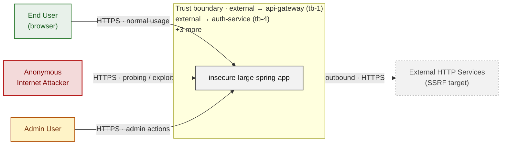

*Trust boundaries not named above: external → legacy-auth-service (tb-5), external → search-service (tb-2), external → serverside-integration-service (tb-3), serverside-integration-service → external (tb-12), +6 more - every boundary is listed in [§1 Trust Boundaries](#trust-boundaries).*

**Key takeaway:** Every actor in the context interacts with insecure-large-spring-app through its external interface, so authentication and input validation at that edge govern the entire attack surface.

### 2.2 Container Architecture

How the system decomposes into deployable units. Each box is a separate runtime process or service container; arrows show synchronous request paths between them. Components with ≥3 Critical findings carry a red border, ≥2 High amber (C4 Level 2).

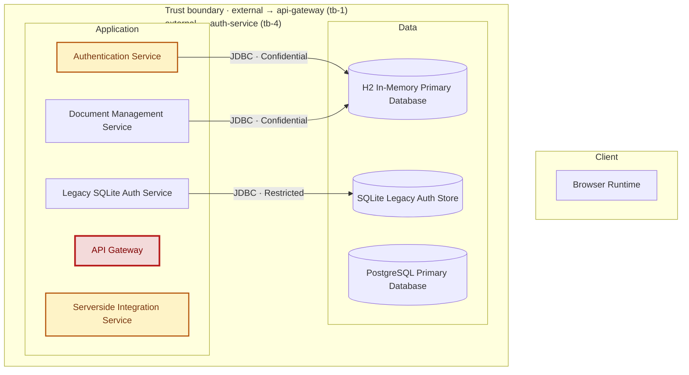

*Not shown (diagram capped at 8 containers): Order Management Service, Web Frontend (nginx), Crypto Service, Admin Console Service, Backend-for-Frontend Web UI, Landscape Orchestrator, Search Service (SQL Injection Surface) - every component is inventoried in [§2.3 Components](#23-components).*

*Trust boundaries not drawn above: auth-service → h2-datastore (tb-6), bff-web → h2-datastore (tb-7), document-service → h2-datastore (tb-8), order-service → h2-datastore (tb-9), +3 more - every boundary is listed in [§1 Trust Boundaries](#trust-boundaries).*

**Key takeaway:** The system decomposes into 0 client, 12 application and 3 data unit(s); API Gateway carries the most Critical findings (4) and bounds the worst-case blast radius.

### 2.3 Components

Who reaches each component, and through which trust zone. Browser code runs on the user's device, so the client column is part of the untrusted zone, not a zone of its own - trust changes only where traffic enters the Application tier. Solid green arrows show legitimate data flow, dashed red arrows mark intrusion vectors. The component table directly below holds source paths and linked threats per `C-NN`; per-finding evidence is in [§8 Findings Register](#8-findings-register).

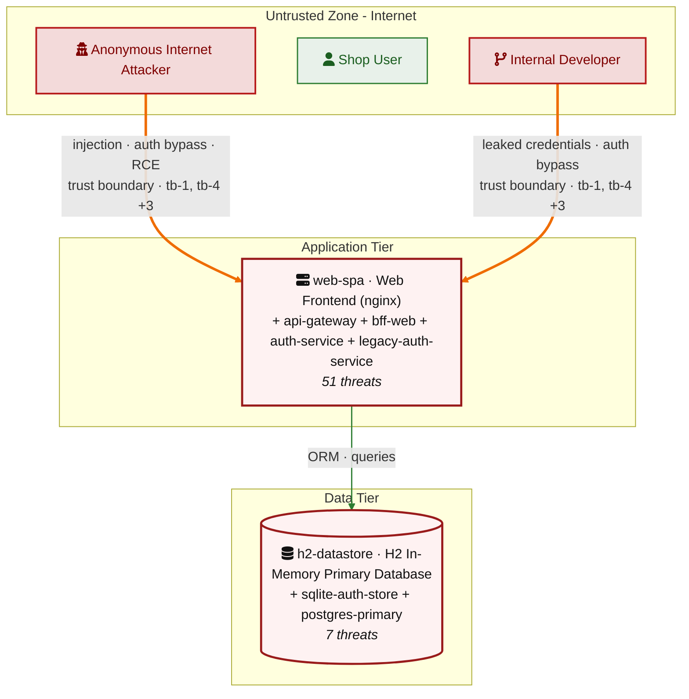

*Also folded into the tier nodes above, unnamed there for space: Order Management Service (`order-service`), Document Management Service (`document-service`), Serverside Integration Service (`serverside-integration-service`), Landscape Orchestrator (`landscape-orchestrator`), Search Service (SQL Injection Surface) (`search-service`), Admin Console Service (`admin-console-service`), Crypto Service (`crypto-service`) - every component is in the table below.*

*Trust boundaries crossed by the `==>` edges above: external → api-gateway (tb-1), external → auth-service (tb-4), external → legacy-auth-service (tb-5), external → search-service (tb-2), +1 more - every boundary is listed in [§1 Trust Boundaries](#trust-boundaries).*

**Key takeaway:** API Gateway concentrates the most findings (8 of 58 across all components); the table below maps each component to its source paths and linked threats.

| ID | Name | Type | Key Paths | Linked Threats | Scope |
|----|----------------------|-----------|----------------------------------------|------------------------------------------------|--------|
| <a id="c-01"></a><a id="web-spa"></a><span style="white-space:nowrap">C-01</span> | Web Frontend (nginx) | application | `docker-compose.yml` | 🟠 [F-032](#f-032) — Floating image tag without digest (`docker-compose.yml:29`)<br/>🟠 [F-039](#f-039) — Cleartext HTTP channel on port 80 (`docker-compose.yml:31`)<br/>🟠 [F-044](#f-044) — No rate limiting in default nginx config (`docker-compose.yml:29`)<br/>🟡 [F-059](#f-059) — Nginx master process runs as root (`docker-compose.yml:29`) | Analyzed |
| <a id="c-02"></a><a id="api-gateway"></a><span style="white-space:nowrap">C-02</span> | API Gateway | application | `docker-compose.yml`<br/>`src/main/java/com/example/appsecverificationtarget/config/SecurityConfig.java`<br/>`src/main/java/com/example/appsecverificationtarget/cors/CorsPolicyFilter.java`<br/>`src/main/java/com/example/appsecverificationtarget/cors/CorsConfig.java`<br/>`src/main/java/com/example/appsecverificationtarget/cors/CorsAccountController.java` | 🔴 [F-003](#f-003) — Missing Authorization on Privileged Resource Endpoints (`SecurityConfig.java:41`)<br/>🔴 [F-006](#f-006) — Hard-coded cryptographic key (`docker-compose.yml:44`)<br/>🔴 [F-007](#f-007) — Hard-coded credentials for all accounts (`SecurityConfig.java:72`)<br/>🔴 [F-014](#f-014) — Unauthenticated actuator and H2 console (`SecurityConfig.java:33`)<br/>🟠 [F-005](#f-005) — Missing Rate Limiting on Authentication Endpoints (`SecurityConfig.java:44`)<br/>🟠 [F-025](#f-025) — CSRF globally disabled (`SecurityConfig.java:28`)<br/>🟠 [F-026](#f-026) — CORS origin wildcard with credentials (`CorsPolicyFilter.java:32`)<br/>🟠 [F-033](#f-033) — Cleartext credential logging (`SecurityConfig.java:63`) | Analyzed |
| <a id="c-03"></a><a id="bff-web"></a><span style="white-space:nowrap">C-03</span> | Backend-for-Frontend Web UI | application | `src/main/java/com/example/appsecverificationtarget/web/WebUiController.java`<br/>`src/main/java/com/example/appsecverificationtarget/web/OrderManagementController.java`<br/>`src/main/java/com/example/appsecverificationtarget/web/DocumentManagementController.java`<br/>`src/main/java/com/example/appsecverificationtarget/web/AdminUsersPageController.java`<br/>`src/main/java/com/example/appsecverificationtarget/web/ProfilePageController.java` | 🔴 [F-019](#f-019) — H2 console unauthenticated access (`SecurityConfig.java:32`)<br/>🔴 [F-035](#f-035) — Actuator endpoints publicly accessible without auth (`SecurityConfig.java:33`)<br/>🟡 [F-050](#f-050) — Trivial formToken non-blank check (`CsrfSettingsController.java:47`)<br/>🟡 [F-053](#f-053) — Session cookie missing Secure and SameSite attributes (`SecurityConfig.java:50`) | Analyzed |
| <a id="c-04"></a><a id="auth-service"></a><span style="white-space:nowrap">C-04</span> | Authentication Service | application | `src/main/java/com/example/appsecverificationtarget/authentication/AuthController.java`<br/>`src/main/java/com/example/appsecverificationtarget/authentication/SignedJwtAuthenticationFilter.java`<br/>`src/main/java/com/example/appsecverificationtarget/authentication/SignedJwtService.java`<br/>`src/main/java/com/example/appsecverificationtarget/authentication/LegacyJwtVerifier.java`<br/>`src/main/java/com/example/appsecverificationtarget/authentication/HomegrownSessionService.java` | 🔴 [F-012](#f-012) — JWT parsed without signature verification (`LegacyJwtVerifier.java:17`)<br/>🔴 [F-018](#f-018) — Unsigned JWT admin bypass (`LegacyAdminAuditController.java:41`)<br/>🟠 [F-023](#f-023) — Predictable session token (`HomegrownSessionService.java:21`)<br/>🟠 [F-034](#f-034) — Cleartext password logged (`CredentialLoggingFilter.java:25`)<br/>🟠 [F-045](#f-045) — IDOR on session token issuance (`AuthController.java:37`) | Analyzed |
| <a id="c-05"></a><a id="legacy-auth-service"></a><span style="white-space:nowrap">C-05</span> | Legacy SQLite Auth Service | application | `src/main/java/com/example/appsecverificationtarget/authentication/LegacySqliteAuthController.java`<br/>`src/main/java/com/example/appsecverificationtarget/authentication/LegacySqliteUserStore.java`<br/>`src/main/java/com/example/appsecverificationtarget/authentication/LegacySqliteUser.java` | 🔴 [F-010](#f-010) — Missing authentication on `/users` endpoint enables credential harvest (`LegacySqliteAuthController.java:49`)<br/>🔴 [F-011](#f-011) — SQL injection in authenticateRaw (`LegacySqliteUserStore.java:64`)<br/>🟠 [F-004](#f-004) — Missing Security Audit Logging Across Services (`LegacySqliteAuthController.java:25`)<br/>🟡 [F-054](#f-054) — Absolute database file path exposed via `/metadata` endpoint (`LegacySqliteUserStore.java:96`)<br/>🟡 [F-058](#f-058) — Unbounded findAll with per-call connection (`LegacySqliteUserStore.java:77`) | Analyzed |
| <a id="c-06"></a><a id="order-service"></a><span style="white-space:nowrap">C-06</span> | Order Management Service | application | `src/main/java/com/example/appsecverificationtarget/web/OrderManagementController.java`<br/>`src/main/java/com/example/appsecverificationtarget/accesscontrol/OrderAccessController.java`<br/>`src/main/java/com/example/appsecverificationtarget/domain/CustomerOrder.java`<br/>`src/main/java/com/example/appsecverificationtarget/domain/CustomerOrderRepository.java` | 🔴 [F-046](#f-046) — IDOR missing ownership check (`OrderAccessController.java:24`) | Screened |
| <a id="c-07"></a><a id="document-service"></a><span style="white-space:nowrap">C-07</span> | Document Management Service | application | `src/main/java/com/example/appsecverificationtarget/web/DocumentManagementController.java`<br/>`src/main/java/com/example/appsecverificationtarget/web/BusinessFileStorage.java`<br/>`src/main/java/com/example/appsecverificationtarget/accesscontrol/DocumentDecisionController.java`<br/>`src/main/java/com/example/appsecverificationtarget/domain/DocumentRecord.java`<br/>`src/main/java/com/example/appsecverificationtarget/domain/DocumentRecordRepository.java` | 🔴 [F-008](#f-008) — Hardcoded Weak Credentials for All Users (`SecurityConfig.java:80`)<br/>🔴 [F-013](#f-013) — Path Traversal in File Upload (`BusinessFileStorage.java:23`)<br/>🟡 [F-057](#f-057) — Unbounded File Write to Disk (`BusinessFileStorage.java:24`) | Screened |
| <a id="c-08"></a><a id="serverside-integration-service"></a><span style="white-space:nowrap">C-08</span> | Serverside Integration Service | application | `src/main/java/com/example/appsecverificationtarget/serverside/IntegrationController.java`<br/>`src/main/java/com/example/appsecverificationtarget/serverside/FileReadController.java`<br/>`src/main/java/com/example/appsecverificationtarget/serverside/ToolController.java`<br/>`src/main/java/com/example/appsecverificationtarget/serverside/XmlPreviewController.java` | 🔴 [F-015](#f-015) — SSRF via unvalidated RestTemplate URL (`IntegrationController.java:23`)<br/>🟠 [F-031](#f-031) — XXE via default DocumentBuilderFactory (`XmlPreviewController.java:22`)<br/>🟠 [F-038](#f-038) — Path traversal arbitrary file read (`FileReadController.java:19`)<br/>🟠 [F-043](#f-043) — Unbounded XML entity expansion (`XmlPreviewController.java:22`) | Screened |
| <a id="c-09"></a><a id="landscape-orchestrator"></a><span style="white-space:nowrap">C-09</span> | Landscape Orchestrator | application | `src/main/java/com/example/appsecverificationtarget/landscape/LandscapePageController.java`<br/>`src/main/java/com/example/appsecverificationtarget/landscape/LandscapeServiceController.java`<br/>`src/main/java/com/example/appsecverificationtarget/landscape/LandscapeExposureSupport.java`<br/>`src/main/java/com/example/appsecverificationtarget/landscape/LandscapeService.java`<br/>`src/main/java/com/example/appsecverificationtarget/landscape/LandscapeServices.java` | 🔴 [F-021](#f-021) — OS command injection via shell -c concatenation in runTool (`LandscapeExposureSupport.java:48`)<br/>🟠 [F-041](#f-041) — XXE entity expansion DoS via default DocumentBuilderFactory in parseXml (`LandscapeExposureSupport.java:42`)<br/>🟡 [F-049](#f-049) — Open redirect via unvalidated target in redirectTo (`LandscapeExposureSupport.java:60`) | Screened |
| <a id="c-10"></a><a id="search-service"></a><span style="white-space:nowrap">C-10</span> | Search Service (SQL Injection Surface) | application | `src/main/java/com/example/appsecverificationtarget/inputvalidation/OrderSearchController.java`<br/>`src/main/java/com/example/appsecverificationtarget/inputvalidation/OrderLookupDao.java`<br/>`src/main/java/com/example/appsecverificationtarget/inputvalidation/DocumentSearchController.java`<br/>`src/main/java/com/example/appsecverificationtarget/inputvalidation/DocumentLookupDao.java`<br/>`src/main/java/com/example/appsecverificationtarget/inputvalidation/ReportLookupDao.java` | 🔴 [F-001](#f-001) — SQL Injection via Unsanitized Query String Concatenation (`OrderLookupDao.java:22`)<br/>🔴 [F-037](#f-037) — Unauthenticated order data disclosure (`OrderSearchController.java:24`)<br/>🔴 [F-048](#f-048) — Missing authentication for search endpoint (`OrderSearchController.java:24`)<br/>🟠 [F-042](#f-042) — Unbounded query load on unauthenticated SQL endpoint (`OrderLookupDao.java:23`) | Screened |
| <a id="c-11"></a><a id="admin-console-service"></a><span style="white-space:nowrap">C-11</span> | Admin Console Service | application | `src/main/java/com/example/appsecverificationtarget/legacyadmin/LegacyAdminBoardController.java`<br/>`src/main/java/com/example/appsecverificationtarget/web/AdminUsersPageController.java`<br/>`src/main/java/com/example/appsecverificationtarget/accesscontrol/AdminReportController.java`<br/>`src/main/java/com/example/appsecverificationtarget/accesscontrol/AdminUserController.java`<br/>`src/main/java/com/example/appsecverificationtarget/accesscontrol/UserAccessController.java` | 🔴 [F-017](#f-017) — Mass-assignment privilege escalation via profile update (`ProfileController.java:44`)<br/>🔴 [F-022](#f-022) — Unauthenticated admin API (`LegacyAdminBoardController.java:28`)<br/>🟠 [F-052](#f-052) — Unauthenticated report endpoint (`AdminReportController.java:34`)<br/>🟡 [F-055](#f-055) — Unbounded user list load (`LegacyAdminBoardController.java:24`) | Screened |
| <a id="c-12"></a><a id="crypto-service"></a><span style="white-space:nowrap">C-12</span> | Crypto Service | application | `src/main/java/com/example/appsecverificationtarget/crypto/CryptoController.java`<br/>`src/main/java/com/example/appsecverificationtarget/crypto/CustomCryptoController.java`<br/>`src/main/java/com/example/appsecverificationtarget/crypto/CustomCryptoService.java`<br/>`src/main/java/com/example/appsecverificationtarget/crypto/LegacyCryptoService.java`<br/>`src/main/java/com/example/appsecverificationtarget/crypto/LegacyPasswordService.java` | 🔴 [F-030](#f-030) — AES/ECB with hardcoded key (`LegacyCryptoService.java:17`)<br/>🟠 [F-024](#f-024) — Token identity forgery via hardcoded XOR key (`CustomCryptoService.java:26`)<br/>🟠 [F-027](#f-027) — Hand-rolled XOR / repeating-key cipher (`HomegrownCipher.java:14`)<br/>🟠 [F-028](#f-028) — Non-cryptographic RNG in a security module Java (`LegacyTokenService.java:10`)<br/>🟠 [F-036](#f-036) — MD5 password hash without salt (`LegacyPasswordService.java:15`)<br/>🟡 [F-056](#f-056) — Unbounded input to unauthenticated crypto endpoints (`CryptoController.java:29`) | Screened |
| <a id="c-13"></a><a id="h2-datastore"></a><span style="white-space:nowrap">C-13</span> | H2 In-Memory Primary Database | data | `src/main/resources/application.yml`<br/>`src/main/java/com/example/appsecverificationtarget/domain/AppUser.java`<br/>`src/main/java/com/example/appsecverificationtarget/domain/AppUserRepository.java`<br/>`src/main/java/com/example/appsecverificationtarget/domain/CustomerOrder.java`<br/>`src/main/java/com/example/appsecverificationtarget/domain/CustomerOrderRepository.java` | 🔴 [F-009](#f-009) — Blank datasource password (`application.yml:8`)<br/>🔴 [F-020](#f-020) — Missing H2 console authentication (`SecurityConfig.java:32`)<br/>🔴 [F-040](#f-040) — Unauthenticated H2 console enables table destruction (`SecurityConfig.java:32`) | Analyzed |
| <a id="c-14"></a><a id="sqlite-auth-store"></a><span style="white-space:nowrap">C-14</span> | SQLite Legacy Auth Store | data | `src/main/java/com/example/appsecverificationtarget/authentication/LegacySqliteUserStore.java` | 🔴 [F-016](#f-016) — Cleartext password storage (`LegacySqliteUserStore.java:31`) | Analyzed |
| <a id="c-15"></a><a id="postgres-primary"></a><span style="white-space:nowrap">C-15</span> | PostgreSQL Primary Database | data | `docker-compose.yml` | 🔴 [F-002](#f-002) — Hardcoded Credentials Committed to Version Control (`docker-compose.yml:366`)<br/>🟠 [F-047](#f-047) — All services connect with superuser privilege (`docker-compose.yml:366`)<br/>🟡 [F-051](#f-051) — Unpinned image tag enables supply-chain substitution (`docker-compose.yml:363`) | Analyzed |

### 2.4 Technology Architecture

The technology stack the system is built on. Each box names the framework or runtime that fills that role; per-component findings live in the [§2.3](#23-components) component table above, and the full per-finding catalogue is in [§8 Findings Register](#8-findings-register).

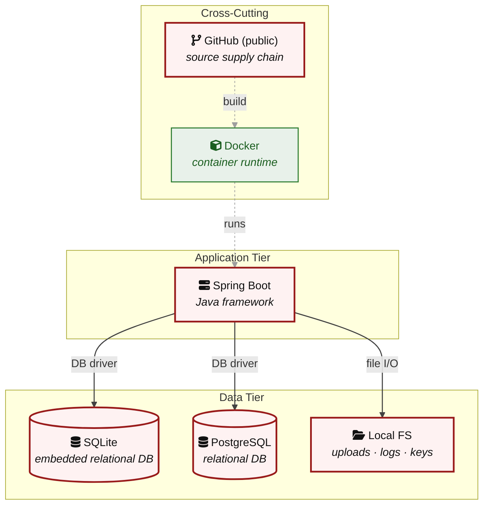

**Key takeaway:** The stack spans 3 data-tier store(s) behind the application tier; injection and data-at-rest exposure track the data tier, detailed per finding in [§8 Findings Register](#8-findings-register).

> **Legend:** `-->` synchronous request/response (REST, HTTPS, gRPC) · `==>` crosses an untrusted trust boundary (security-critical) · **red border** ≥ 3 Critical threats on the component · **amber border** ≥ 2 High threats

---

## 3. Attack Walkthroughs

This section walks through how the **8 highest-priority of 26 Critical findings** are exploited - selected by severity, chain relevance, and threat-category diversity, with Access Control and LLM Abuse represented when present. Each walkthrough has attack steps, a focused sequence diagram, and the primary mitigation. How weaknesses combine toward the worst-case goal is in the [Critical Attack Tree](#critical-attack-tree); every other Critical, plus full per-finding context (severity rationale, assets, detection signals), is in the [§8 Findings Register](#8-findings-register).

### 3.1 JWT parsed without signature verification src/main/java/com/example/appsecver…

**Source:** 🔴 [F-012](#f-012) — `src/main/java/com/example/appsecverificationtarget/authentication/LegacyJwtVerifier.java:17`

Severity **Critical** ([CWE-347](https://cwe.mitre.org/data/definitions/347.html)). STRIDE: Tampering. See [§8 F-012](#f-012) for the full register row.

**Attack Steps**

1. `parseClaimsJwt` accepts an unsigned token: an attacker mints arbitrary claims (sub, roles, scope) with no key.
2. Only the *Jws / `parseSignedClaims` variants verify the signature.

**Sequence Diagram**

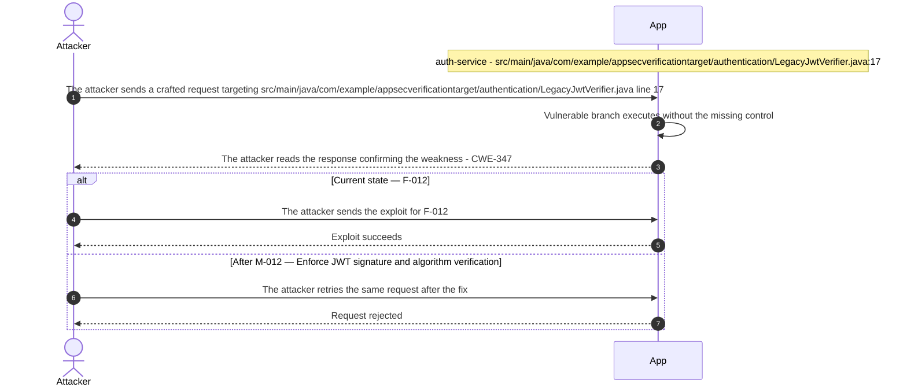

**Key takeaway:** Until ● [M-012](#m-012) (Enforce JWT signature and algorithm verification) lands, 🔴 [F-012](#f-012) — JWT parsed without signature verification src/main/java/com/example/appsecverif… is exploitable at `src/main/java/com/example/appsecverificationtarget/authentication/LegacyJwtVerifier.java:17` (Critical-severity, [CWE-347](https://cwe.mitre.org/data/definitions/347.html)).

**Defense in Depth**

- Primary mitigation: ● [M-012](#m-012) (Enforce JWT signature and algorithm verification)

### 3.2 SQL Injection in Search Service SQL Injection Surface

**Source:** 🔴 [F-001](#f-001) — `src/main/java/com/example/appsecverificationtarget/inputvalidation/OrderLookupDao.java:22`

Severity **Critical** ([CWE-89](https://cwe.mitre.org/data/definitions/89.html)). STRIDE: Tampering. See [§8 F-001](#f-001) for the full register row.

**Attack Steps**

1. `OrderLookupDao.findByOwnerEmail` at line 22 concatenates the payload directly into the SQL string: the resulting query becomes a UNION query spanning `customer_orders` and `vault_credentials`.
2. `EntityManager.createNativeQuery` at line 23 executes the injected SQL against the H2 database, returning `vault_credentials` rows in the response alongside order results.
3. Attacker iterates UNION payloads to dump all rows from `app_users` and `vault_credentials`, then crafts UPDATE or INSERT payloads to tamper with stored credential or order data.

**Sequence Diagram**

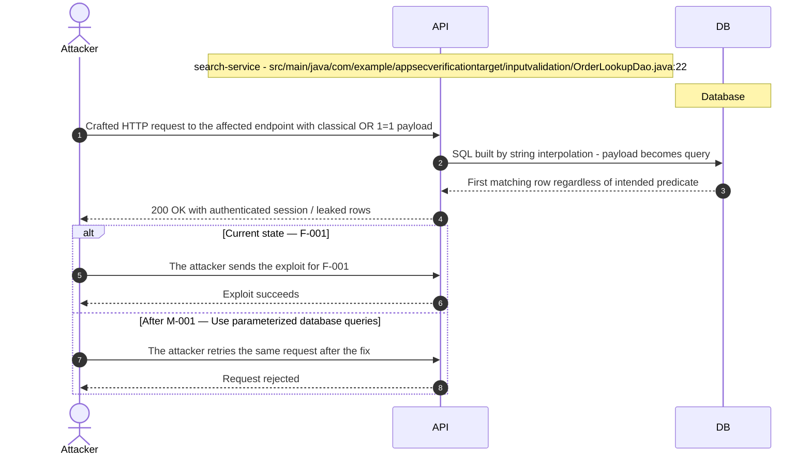

**Key takeaway:** Until ● [M-001](#m-001) (Use parameterized database queries) lands, 🔴 [F-001](#f-001) — SQL Injection via Unsanitized Query String Concatenation is exploitable at `src/main/java/com/example/appsecverificationtarget/inputvalidation/OrderLookupDao.java:22` (Critical-severity, [CWE-89](https://cwe.mitre.org/data/definitions/89.html)).

**Defense in Depth**

- Primary mitigation: ● [M-001](#m-001) (Use parameterized database queries)

### 3.3 Missing Authorization on Privileged Resource Endpoints in Security Config

**Source:** 🔴 [F-003](#f-003) — `src/main/java/com/example/appsecverificationtarget/config/SecurityConfig.java:41`

Severity **Critical** ([CWE-862](https://cwe.mitre.org/data/definitions/862.html)). STRIDE: Elevation of Privilege. See [§8 F-003](#f-003) for the full register row.

**Attack Steps**

1. Attacker sends GET `https://target:8443/legacy/admin` without any `Authorization` header or session cookie.
2. SecurityFilterChain permits the request because `/legacy/admin/**` is in the `permitAll` list at `SecurityConfig.java:41`.
3. Attacker receives admin-scoped UI or API response, then pivots to `/h2-console` for direct SQL execution on the application database.
4. Attacker executes arbitrary SQL via the H2 web console to read or modify all application data, including credentials and JWT tokens.

**Sequence Diagram**

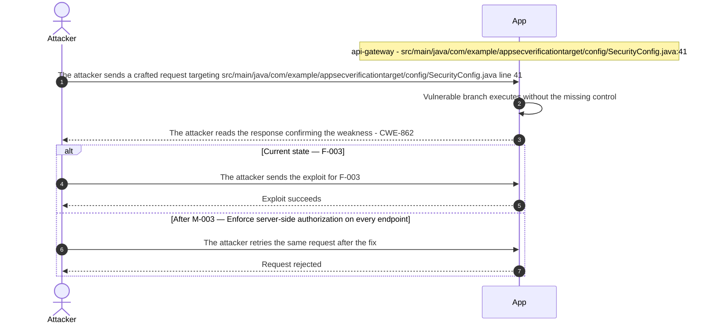

**Key takeaway:** Until ● [M-003](#m-003) (Enforce server-side authorization on every endpoint) lands, 🔴 [F-003](#f-003) — Missing Authorization on Privileged Resource Endpoints is exploitable at `src/main/java/com/example/appsecverificationtarget/config/SecurityConfig.java:41` (Critical-severity, [CWE-862](https://cwe.mitre.org/data/definitions/862.html)).

**Defense in Depth**

- Primary mitigation: ● [M-003](#m-003) (Enforce server-side authorization on every endpoint)

### 3.4 SQL injection in authenticateRaw

**Source:** 🔴 [F-011](#f-011) — `src/main/java/com/example/appsecverificationtarget/authentication/LegacySqliteUserStore.java:64`

Severity **Critical** ([CWE-89](https://cwe.mitre.org/data/definitions/89.html)). STRIDE: Spoofing. See [§8 F-011](#f-011) for the full register row.

**Attack Steps**

1. Attacker sends a POST to the legacy login endpoint with username `' OR role='ADMIN' --` and any non-empty password string.
2. `authenticateRaw()` at line 64 concatenates the raw input into SQL, producing a tautological WHERE clause that matches the ADMIN row.
3. SQLite returns the `legacy_admin` record; the application grants an attacker an authenticated ADMIN session without credential verification.

**Sequence Diagram**

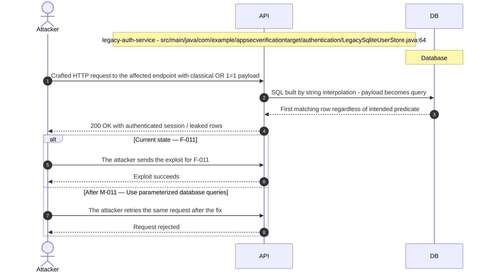

**Key takeaway:** Until ● [M-011](#m-011) (Use parameterized database queries) lands, 🔴 [F-011](#f-011) — SQL injection in authenticateRaw (`LegacySqliteUserStore.java:64`) is exploitable at `src/main/java/com/example/appsecverificationtarget/authentication/LegacySqliteUserStore.java:64` (Critical-severity, [CWE-89](https://cwe.mitre.org/data/definitions/89.html)).

**Defense in Depth**

- Primary mitigation: ● [M-011](#m-011) (Use parameterized database queries)

### 3.5 Hardcoded Credentials Committed to Version Control

**Source:** 🔴 [F-002](#f-002) — `docker-compose.yml:366`

Severity **Critical** ([CWE-798](https://cwe.mitre.org/data/definitions/798.html)). STRIDE: Information Disclosure. See [§8 F-002](#f-002) for the full register row.

**Attack Steps**

1. Attacker with repository read access (or CI log access) reads `docker-compose.yml` and extracts `POSTGRES_PASSWORD` value `fixture-local-admin-token` from line 366.
2. Attacker connects to postgres-primary from any container in the data network: `psql -U postgres -h postgres-primary -d appsec_primary` using the extracted password.
3. Attacker issues `\COPY (SELECT * FROM users) TO '/tmp/dump.csv' WITH CSV` and `pg_dump -U postgres appsec_primary` to exfiltrate all crown-jewel business records.

**Sequence Diagram**

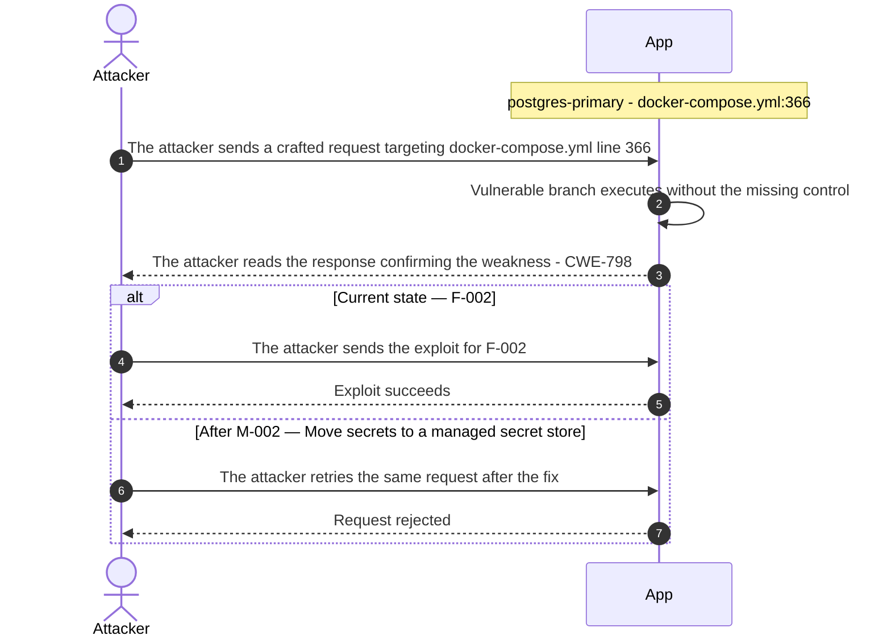

**Key takeaway:** Until ● [M-002](#m-002) (Move secrets to a managed secret store) lands, 🔴 [F-002](#f-002) — Hardcoded Credentials Committed to Version Control is exploitable at `docker-compose.yml:366` (Critical-severity, [CWE-798](https://cwe.mitre.org/data/definitions/798.html)).

**Defense in Depth**

- Primary mitigation: ● [M-002](#m-002) (Move secrets to a managed secret store)

### 3.6 Unauthenticated actuator and H2 console in Security Config

**Source:** 🔴 [F-014](#f-014) — `src/main/java/com/example/appsecverificationtarget/config/SecurityConfig.java:33`

Severity **Critical** ([CWE-306](https://cwe.mitre.org/data/definitions/306.html)). STRIDE: Information Disclosure. See [§8 F-014](#f-014) for the full register row.

**Attack Steps**

1. An attacker crafts a request targeting the weak spot at `src/main/java/com/example/appsecverificationtarget/config/SecurityConfig.java:33`.
2. An unauthenticated attacker sends GET `/actuator/env` to the gateway on port 8443 and receives the full Spring Boot environment including `JWT_SIGNING_KEY` and `TLS_KEYSTORE_PASSWORD` environment variable values.
3. Separately, GET `/h2-console` exposes the embedded H2 database web console without any credential challenge.

**Sequence Diagram**


**Key takeaway:** Until ● [M-014](#m-014) (Require authentication on every exposed endpoint) lands, 🔴 [F-014](#f-014) — Unauthenticated actuator and H2 console (`config/SecurityConfig.java:33`) is exploitable at `src/main/java/com/example/appsecverificationtarget/config/SecurityConfig.java:33` (Critical-severity, [CWE-306](https://cwe.mitre.org/data/definitions/306.html)).

**Defense in Depth**

- Primary mitigation: ● [M-014](#m-014) (Require authentication on every exposed endpoint)

### 3.7 Path Traversal in File Upload

**Source:** 🔴 [F-013](#f-013) — `src/main/java/com/example/appsecverificationtarget/web/BusinessFileStorage.java:23`

Severity **Critical** ([CWE-22](https://cwe.mitre.org/data/definitions/22.html)). STRIDE: Tampering. See [§8 F-013](#f-013) for the full register row.

**Attack Steps**

1. Attacker authenticates as a regular user and submits POST `/documents` with Content-Disposition: form-data; name="upload"; filename="../../../..`/etc/cron.d/evil`" containing a malicious cron payload.
2. `BusinessFileStorage.store()` at line 17 stores the raw client filename in `fileName` without filtering; `directory.resolve(fileName)` at line 23 resolves to a path outside 'runtime/uploads/'.
3. `file.transferTo(target)` at line 24 writes an attacker-controlled content to the resolved path, overwriting the target file.
4. If the resolved path falls in a cron directory or servlet deployment directory, the attacker achieves persistent code execution as the application process.

**Sequence Diagram**

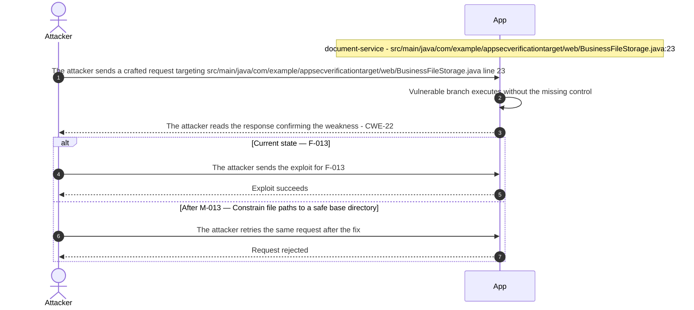

**Key takeaway:** Until ● [M-013](#m-013) (Constrain file paths to a safe base directory) lands, 🔴 [F-013](#f-013) — Path Traversal in File Upload (`web/BusinessFileStorage.java:23`) is exploitable at `src/main/java/com/example/appsecverificationtarget/web/BusinessFileStorage.java:23` (Critical-severity, [CWE-22](https://cwe.mitre.org/data/definitions/22.html)).

**Defense in Depth**

- Primary mitigation: ● [M-013](#m-013) (Constrain file paths to a safe base directory)

### 3.8 SSRF in Integration Controller

**Source:** 🔴 [F-015](#f-015) — `src/main/java/com/example/appsecverificationtarget/serverside/IntegrationController.java:23`

Severity **Critical** ([CWE-918](https://cwe.mitre.org/data/definitions/918.html)). STRIDE: Information Disclosure. See [§8 F-015](#f-015) for the full register row.

**Attack Steps**

1. Attacker issues GET `/api/integration/fetch?url=http`://169.254.169.254/latest/meta-data/ with no credentials to the publicly accessible unauthenticated endpoint.
2. `RestTemplate.getForObject()` initiates an outbound HTTP request to the cloud metadata endpoint, receiving the role name from the instance metadata service.
3. Attacker follows up with the role-specific URL to retrieve temporary AWS credentials (AccessKeyId, SecretAccessKey, Token) returned verbatim in the JSON response body.
4. Attacker uses the harvested credentials to call AWS APIs, pivot to S3 buckets or RDS instances, and escalate within the cloud account.

**Sequence Diagram**

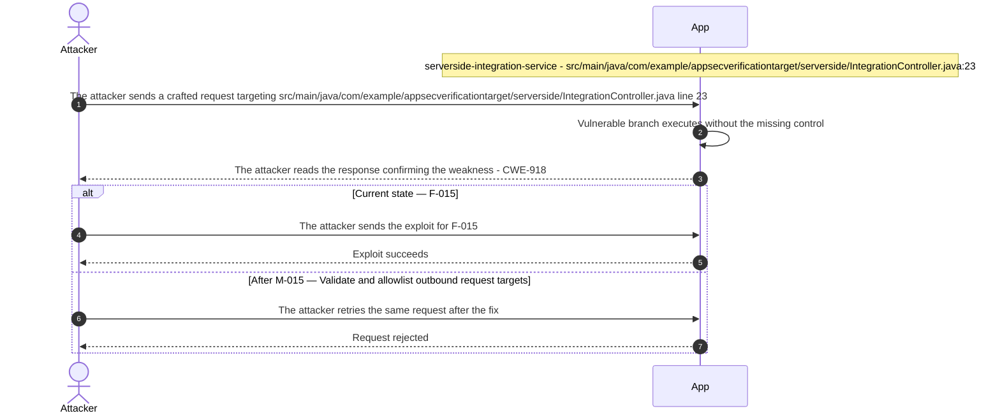

**Key takeaway:** Until ● [M-015](#m-015) (Validate and allowlist outbound request targets) lands, 🔴 [F-015](#f-015) — SSRF via unvalidated RestTemplate URL (`serverside/IntegrationController.java:23`) is exploitable at `src/main/java/com/example/appsecverificationtarget/serverside/IntegrationController.java:23` (Critical-severity, [CWE-918](https://cwe.mitre.org/data/definitions/918.html)).

**Defense in Depth**

- Primary mitigation: ● [M-015](#m-015) (Validate and allowlist outbound request targets)

<!-- generated:walkthrough_renderer -->

---

## 4. Assets

Information assets and the classification level that drives the Confidentiality / Integrity / Availability targets used in [§8 Findings Register](#8-findings-register) risk scoring.

| Asset | Classification | Description |
|----------------------|--------------|------------------------------------|
| Legacy SQLite User Credentials | Restricted | Legacy user records in<br/>runtime/legacy-`auth.sqlite` containing<br/>username and cleartext password. The<br/>`/api/legacy-sqlite/users` endpoint returns<br/>all rows including plaintext passwords to<br/>any caller without authentication. |
| JWT Signing Key | Restricted | Hardcoded JWT signing secret<br/>(`JWT_SIGNING_KEY`=hardcoded-legacy-jwt-secret)<br/>baked into the `Dockerfile` ENV layer and set<br/>as a docker-compose environment variable for<br/>api-gateway and auth-service. Any image<br/>holder can forge arbitrary JWT tokens. |
| Hardcoded AWS and DB Credentials | Restricted | `AWS_ACCESS_KEY_ID`, `AWS_SECRET_ACCESS_KEY`,<br/>and `DB_PASSWORD` baked into the `Dockerfile`<br/>ENV layer. These secrets are embedded in<br/>every built container image and appear in<br/>process environment on all docker-compose<br/>services. |
| User Credentials (H2 / JPA) | Confidential | AppUser records stored in the H2 in-memory<br/>database: username, email, `password_hash`<br/>(BCrypt for JPA users), role, and admin<br/>flag. The `/h2-console` is publicly<br/>accessible, making the full table reachable<br/>without authentication. |
| Customer Order Records | Confidential | CustomerOrder JPA entities stored in the H2<br/>database, representing customer transactions<br/>with ownership linkage to AppUser. IDOR<br/>vulnerability in OrderAccessController<br/>allows any authenticated user to retrieve<br/>any order by ID. |
| Uploaded Document Files | Confidential | User-uploaded document files managed by<br/>BusinessFileStorage and tracked as<br/>DocumentRecord JPA entities. Path traversal<br/>risk exists when user-supplied filenames are<br/>used in disk operations. Files stored under<br/>the application runtime directory. |
| Application Session Tokens | Confidential | Spring Security HTTP session tokens and<br/>homegrown session identifiers generated by<br/>HomegrownSessionService. Redis session cache<br/>(redis-session-cache in docker-compose)<br/>holds unencrypted session data. Credential<br/>logging filter may log session-related<br/>headers. |
| Actuator Endpoints and Environment Variables | Confidential | Spring Boot Actuator exposes all endpoints<br/>publicly (include: *), including<br/>`/actuator/env` with `show-values: ALWAYS` and<br/>`/actuator/configprops` with `show-values: ALWAYS`,<br/>revealing all environment variables<br/>including hardcoded secrets to any caller. |
| H2 Database Console | Confidential | H2 web console publicly accessible at<br/>`/h2-console/**` per SecurityConfig line 32.<br/>Provides direct SQL query execution against<br/>the in-memory database containing all user<br/>credentials, order records, and vault<br/>credentials. |
| Service Portfolio and Landscape Metadata | Internal | 50-service landscape portfolio data<br/>including client credentials, entitlement<br/>records, tenant provisioning data, and<br/>billing references managed by<br/>LandscapePersistence. Accessible via<br/>landscape endpoints with weak or absent<br/>authorization. |

---

## 5. Attack Surface

Network-reachable entry points classified by authentication requirement. Each row links to the threat(s) referenced in its **Notes** column. The **Risk** column reflects the highest-severity linked finding. Entry points with no linked finding are still listed when they sit on a sensitive surface (authentication, registration, management) or look like a missing-auth/authz suspect - marked **⚑ Review** in Notes.

### 5.1 Unauthenticated Entry Points (122)

<table style="table-layout:fixed;width:100%">
<colgroup><col width="9%" style="width:9%"><col width="30%" style="width:30%"><col width="14%" style="width:14%"><col width="47%" style="width:47%"></colgroup>
<thead><tr><th>Method</th><th>Route</th><th>Risk</th><th>Notes</th></tr></thead>
<tbody>
<tr><td>GET</td><td style="overflow-wrap:anywhere"><code>/admin/users</code></td><td>🔴 Critical</td><td>🔴 <a href="#f-003">F-003</a> — Missing Authorization on Privileged Resource Endpoints (<code>SecurityConfig.java:41</code>)<br/>🔴 <a href="#f-022">F-022</a> — Unauthenticated admin API (<code>LegacyAdminBoardController.java:28</code>)<br/>Management surface; handler: <code>src/main/java/com/example/appsecverificationtarget/web/AdminUsersPageController.java:46</code></td></tr>
<tr><td>POST</td><td style="overflow-wrap:anywhere"><code>/admin/users</code></td><td>🔴 Critical</td><td>🔴 <a href="#f-003">F-003</a> — Missing Authorization on Privileged Resource Endpoints (<code>SecurityConfig.java:41</code>)<br/>🔴 <a href="#f-022">F-022</a> — Unauthenticated admin API (<code>LegacyAdminBoardController.java:28</code>)<br/>POST <code>/admin/users</code> creates user accounts without demonstrated authentication enforcement.</td></tr>
<tr><td>GET</td><td style="overflow-wrap:anywhere"><code>/admin/users/{id}</code></td><td>🔴 Critical</td><td>🔴 <a href="#f-022">F-022</a> — Unauthenticated admin API (<code>LegacyAdminBoardController.java:28</code>)<br/>Management surface; handler: <code>src/main/java/com/example/appsecverificationtarget/web/AdminUsersPageController.java:79</code></td></tr>
<tr><td>POST</td><td style="overflow-wrap:anywhere"><code>/admin/users/{id}</code></td><td>🔴 Critical</td><td>🔴 <a href="#f-022">F-022</a> — Unauthenticated admin API (<code>LegacyAdminBoardController.java:28</code>)<br/>Management surface; handler: <code>src/main/java/com/example/appsecverificationtarget/web/AdminUsersPageController.java:88</code></td></tr>
<tr><td>POST</td><td style="overflow-wrap:anywhere"><code>/admin/users/{id}/delete</code></td><td>🔴 Critical</td><td>🔴 <a href="#f-022">F-022</a> — Unauthenticated admin API (<code>LegacyAdminBoardController.java:28</code>)<br/>POST <code>/admin/users/{id}/delete</code> deletes accounts without demonstrated authentication.</td></tr>
<tr><td>POST</td><td style="overflow-wrap:anywhere"><code>/documents</code></td><td>🔴 Critical</td><td>🔴 <a href="#f-013">F-013</a> — Path Traversal in File Upload (<code>BusinessFileStorage.java:23</code>)<br/>🟠 <a href="#f-038">F-038</a> — Path traversal arbitrary file read (<code>FileReadController.java:19</code>)<br/>🟡 <a href="#f-057">F-057</a> — Unbounded File Write to Disk (<code>BusinessFileStorage.java:24</code>)<br/>handler: <code>src/main/java/com/example/appsecverificationtarget/web/DocumentManagementController.java:60</code></td></tr>
<tr><td>GET</td><td style="overflow-wrap:anywhere"><code>/legacy/admin</code></td><td>🔴 Critical</td><td>🔴 <a href="#f-003">F-003</a> — Missing Authorization on Privileged Resource Endpoints (<code>SecurityConfig.java:41</code>)<br/>🔴 <a href="#f-022">F-022</a> — Unauthenticated admin API (<code>LegacyAdminBoardController.java:28</code>)<br/>🟡 <a href="#f-055">F-055</a> — Unbounded user list load (<code>LegacyAdminBoardController.java:24</code>)<br/>Unauthenticated GET <code>/legacy/admin</code> exposes the legacy admin board without any auth enforcement; management surface with missing-auth.</td></tr>
<tr><td>POST</td><td style="overflow-wrap:anywhere"><code>/​legacy/​admin/​users/​{id}/​delete</code></td><td>🔴 Critical</td><td>🔴 <a href="#f-003">F-003</a> — Missing Authorization on Privileged Resource Endpoints (<code>SecurityConfig.java:41</code>)<br/>🔴 <a href="#f-022">F-022</a> — Unauthenticated admin API (<code>LegacyAdminBoardController.java:28</code>)<br/>🟠 <a href="#f-004">F-004</a> — Missing Security Audit Logging Across Services (<code>LegacySqliteAuthController.java:25</code>)<br/>Unauthenticated POST <code>/legacy/admin/users/{id}/delete</code> allows arbitrary account deletion without authentication.</td></tr>
<tr><td>POST</td><td style="overflow-wrap:anywhere"><code>/​legacy/​admin/​users/​{id}/​promote</code></td><td>🔴 Critical</td><td>🔴 <a href="#f-003">F-003</a> — Missing Authorization on Privileged Resource Endpoints (<code>SecurityConfig.java:41</code>)<br/>🔴 <a href="#f-022">F-022</a> — Unauthenticated admin API (<code>LegacyAdminBoardController.java:28</code>)<br/>🟠 <a href="#f-004">F-004</a> — Missing Security Audit Logging Across Services (<code>LegacySqliteAuthController.java:25</code>)<br/>Unauthenticated POST <code>/legacy/admin/users/{id}/promote</code> allows arbitrary privilege escalation without authentication.</td></tr>
<tr><td>GET</td><td style="overflow-wrap:anywhere"><code>/login</code></td><td>🔴 Critical</td><td>🔴 <a href="#f-010">F-010</a> — Missing authentication on <code>/users</code> endpoint enables credential harvest (<code>LegacySqliteAuthController.java:49</code>)<br/>🟠 <a href="#f-005">F-005</a> — Missing Rate Limiting on Authentication Endpoints (<code>SecurityConfig.java:44</code>)<br/>🟠 <a href="#f-034">F-034</a> — Cleartext password logged (<code>CredentialLoggingFilter.java:25</code>)<br/>handler: <code>src/main/java/com/example/appsecverificationtarget/web/WebUiController.java:41</code></td></tr>
<tr><td>PUT</td><td style="overflow-wrap:anywhere"><code>/me</code></td><td>🔴 Critical</td><td>🔴 <a href="#f-015">F-015</a> — SSRF via unvalidated RestTemplate URL (<code>IntegrationController.java:23</code>)<br/>🔴 <a href="#f-017">F-017</a> — Mass-assignment privilege escalation via profile update (<code>ProfileController.java:44</code>)<br/>🟡 <a href="#f-054">F-054</a> — Absolute database file path exposed via <code>/metadata</code> endpoint (<code>LegacySqliteUserStore.java:96</code>)<br/>handler: <code>src/main/java/com/example/appsecverificationtarget/accesscontrol/ProfileController.java:34</code></td></tr>
<tr><td>POST</td><td style="overflow-wrap:anywhere"><code>/orders</code></td><td>🔴 Critical</td><td>🔴 <a href="#f-037">F-037</a> — Unauthenticated order data disclosure (<code>OrderSearchController.java:24</code>)<br/>🔴 <a href="#f-046">F-046</a> — IDOR missing ownership check (<code>OrderAccessController.java:24</code>)<br/>🟠 <a href="#f-042">F-042</a> — Unbounded query load on unauthenticated SQL endpoint (<code>OrderLookupDao.java:23</code>)<br/>handler: <code>src/main/java/com/example/appsecverificationtarget/web/OrderManagementController.java:61</code></td></tr>
<tr><td>POST</td><td style="overflow-wrap:anywhere"><code>/orders/{id}</code></td><td>🔴 Critical</td><td>🔴 <a href="#f-046">F-046</a> — IDOR missing ownership check (<code>OrderAccessController.java:24</code>)<br/>handler: <code>src/main/java/com/example/appsecverificationtarget/web/OrderManagementController.java:107</code></td></tr>
<tr><td>POST</td><td style="overflow-wrap:anywhere"><code>/profile</code></td><td>🔴 Critical</td><td>🔴 <a href="#f-017">F-017</a> — Mass-assignment privilege escalation via profile update (<code>ProfileController.java:44</code>)<br/>handler: <code>src/main/java/com/example/appsecverificationtarget/web/ProfilePageController.java:51</code></td></tr>
<tr><td>?</td><td style="overflow-wrap:anywhere"><code>ANY /api/admin</code></td><td>🔴 Critical</td><td>🔴 <a href="#f-003">F-003</a> — Missing Authorization on Privileged Resource Endpoints (<code>SecurityConfig.java:41</code>)<br/>🟠 <a href="#f-052">F-052</a> — Unauthenticated report endpoint (<code>AdminReportController.java:34</code>)<br/>GET/ANY <code>/api/admin</code> is accessible to all callers despite management surface classification.</td></tr>
<tr><td>GET</td><td style="overflow-wrap:anywhere"><code>/audit</code></td><td>🔴 Critical</td><td>🔴 <a href="#f-018">F-018</a> — Unsigned JWT admin bypass (<code>LegacyAdminAuditController.java:41</code>)<br/>handler: <code>src/main/java/com/example/appsecverificationtarget/authentication/LegacyAdminAuditController.java:37</code></td></tr>
<tr><td>GET</td><td style="overflow-wrap:anywhere"><code>/documents</code></td><td>🔴 Critical</td><td>🔴 <a href="#f-013">F-013</a> — Path Traversal in File Upload (<code>BusinessFileStorage.java:23</code>)<br/>🟠 <a href="#f-038">F-038</a> — Path traversal arbitrary file read (<code>FileReadController.java:19</code>)<br/>🟡 <a href="#f-057">F-057</a> — Unbounded File Write to Disk (<code>BusinessFileStorage.java:24</code>)<br/>handler: <code>src/main/java/com/example/appsecverificationtarget/web/DocumentManagementController.java:42</code></td></tr>
<tr><td>GET</td><td style="overflow-wrap:anywhere"><code>/fetch</code></td><td>🔴 Critical</td><td>🔴 <a href="#f-015">F-015</a> — SSRF via unvalidated RestTemplate URL (<code>IntegrationController.java:23</code>)<br/>handler: <code>src/main/java/com/example/appsecverificationtarget/serverside/IntegrationController.java:21</code></td></tr>
<tr><td>GET</td><td style="overflow-wrap:anywhere"><code>/landscape</code></td><td>🔴 Critical</td><td>🔴 <a href="#f-021">F-021</a> — OS command injection via shell -c concatenation in runTool (<code>LandscapeExposureSupport.java:48</code>)<br/>🟠 <a href="#f-041">F-041</a> — XXE entity expansion DoS via default DocumentBuilderFactory in parseXml (<code>LandscapeExposureSupport.java:42</code>)<br/>🟡 <a href="#f-049">F-049</a> — Open redirect via unvalidated target in redirectTo (<code>LandscapeExposureSupport.java:60</code>)<br/>handler: <code>src/main/java/com/example/appsecverificationtarget/landscape/LandscapePageController.java:25</code></td></tr>
<tr><td>GET</td><td style="overflow-wrap:anywhere"><code>/me</code></td><td>🔴 Critical</td><td>🔴 <a href="#f-015">F-015</a> — SSRF via unvalidated RestTemplate URL (<code>IntegrationController.java:23</code>)<br/>🔴 <a href="#f-017">F-017</a> — Mass-assignment privilege escalation via profile update (<code>ProfileController.java:44</code>)<br/>🟡 <a href="#f-054">F-054</a> — Absolute database file path exposed via <code>/metadata</code> endpoint (<code>LegacySqliteUserStore.java:96</code>)<br/>handler: <code>src/main/java/com/example/appsecverificationtarget/accesscontrol/ProfileController.java:26</code></td></tr>
<tr><td>GET</td><td style="overflow-wrap:anywhere"><code>/orders</code></td><td>🔴 Critical</td><td>🔴 <a href="#f-037">F-037</a> — Unauthenticated order data disclosure (<code>OrderSearchController.java:24</code>)<br/>🔴 <a href="#f-046">F-046</a> — IDOR missing ownership check (<code>OrderAccessController.java:24</code>)<br/>🟠 <a href="#f-042">F-042</a> — Unbounded query load on unauthenticated SQL endpoint (<code>OrderLookupDao.java:23</code>)<br/>handler: <code>src/main/java/com/example/appsecverificationtarget/authentication/LegacySessionOrderController.java:27</code></td></tr>
<tr><td>GET</td><td style="overflow-wrap:anywhere"><code>/orders/{id}</code></td><td>🔴 Critical</td><td>🔴 <a href="#f-046">F-046</a> — IDOR missing ownership check (<code>OrderAccessController.java:24</code>)<br/>handler: <code>src/main/java/com/example/appsecverificationtarget/web/OrderManagementController.java:89</code></td></tr>
<tr><td>GET</td><td style="overflow-wrap:anywhere"><code>/profile</code></td><td>🔴 Critical</td><td>🔴 <a href="#f-017">F-017</a> — Mass-assignment privilege escalation via profile update (<code>ProfileController.java:44</code>)<br/>handler: <code>src/main/java/com/example/appsecverificationtarget/authentication/SecureJwtController.java:14</code></td></tr>
<tr><td>GET</td><td style="overflow-wrap:anywhere"><code>/report</code></td><td>🔴 Critical</td><td>🔴 <a href="#f-003">F-003</a> — Missing Authorization on Privileged Resource Endpoints (<code>SecurityConfig.java:41</code>)<br/>🔴 <a href="#f-021">F-021</a> — OS command injection via shell -c concatenation in runTool (<code>LandscapeExposureSupport.java:48</code>)<br/>🟠 <a href="#f-052">F-052</a> — Unauthenticated report endpoint (<code>AdminReportController.java:34</code>)<br/>handler: <code>src/main/java/com/example/appsecverificationtarget/accesscontrol/AdminReportController.java:34</code></td></tr>
<tr><td>GET</td><td style="overflow-wrap:anywhere"><code>/reporting</code></td><td>🔴 Critical</td><td>🔴 <a href="#f-021">F-021</a> — OS command injection via shell -c concatenation in runTool (<code>LandscapeExposureSupport.java:48</code>)<br/>GET <code>/reporting</code> has authz decorator for compliance role verification.</td></tr>
<tr><td>GET</td><td style="overflow-wrap:anywhere"><code>/search</code></td><td>🔴 Critical</td><td>🔴 <a href="#f-037">F-037</a> — Unauthenticated order data disclosure (<code>OrderSearchController.java:24</code>)<br/>🔴 <a href="#f-048">F-048</a> — Missing authentication for search endpoint (<code>OrderSearchController.java:24</code>)<br/>🟠 <a href="#f-042">F-042</a> — Unbounded query load on unauthenticated SQL endpoint (<code>OrderLookupDao.java:23</code>)<br/>handler: <code>src/main/java/com/example/appsecverificationtarget/inputvalidation/OrderSearchController.java:23</code></td></tr>
<tr><td>GET</td><td style="overflow-wrap:anywhere"><code>/users</code></td><td>🔴 Critical</td><td>🔴 <a href="#f-003">F-003</a> — Missing Authorization on Privileged Resource Endpoints (<code>SecurityConfig.java:41</code>)<br/>🔴 <a href="#f-010">F-010</a> — Missing authentication on <code>/users</code> endpoint enables credential harvest (<code>LegacySqliteAuthController.java:49</code>)<br/>🔴 <a href="#f-022">F-022</a> — Unauthenticated admin API (<code>LegacyAdminBoardController.java:28</code>)<br/>GET <code>/api/legacy-sqlite/users</code> returns all users including cleartext passwords to any caller.</td></tr>
<tr><td>GET</td><td style="overflow-wrap:anywhere"><code>/users/{id}</code></td><td>🔴 Critical</td><td>🔴 <a href="#f-022">F-022</a> — Unauthenticated admin API (<code>LegacyAdminBoardController.java:28</code>)<br/>handler: <code>src/main/java/com/example/appsecverificationtarget/web/UserDirectoryController.java:24</code></td></tr>
<tr><td>GET</td><td style="overflow-wrap:anywhere"><code>/{id}</code></td><td>🔴 Critical</td><td>🔴 <a href="#f-022">F-022</a> — Unauthenticated admin API (<code>LegacyAdminBoardController.java:28</code>)<br/>🔴 <a href="#f-046">F-046</a> — IDOR missing ownership check (<code>OrderAccessController.java:24</code>)<br/>handler: <code>src/main/java/com/example/appsecverificationtarget/accesscontrol/UserAccessController.java:21</code></td></tr>
<tr><td>?</td><td style="overflow-wrap:anywhere"><code>ANY /api/integration</code></td><td>🔴 Critical</td><td>🔴 <a href="#f-015">F-015</a> — SSRF via unvalidated RestTemplate URL (<code>IntegrationController.java:23</code>)<br/>handler: <code>src/main/java/com/example/appsecverificationtarget/serverside/IntegrationController.java:12</code></td></tr>
<tr><td>?</td><td style="overflow-wrap:anywhere"><code>ANY /api/landscape</code></td><td>🔴 Critical</td><td>🔴 <a href="#f-021">F-021</a> — OS command injection via shell -c concatenation in runTool (<code>LandscapeExposureSupport.java:48</code>)<br/>🟠 <a href="#f-041">F-041</a> — XXE entity expansion DoS via default DocumentBuilderFactory in parseXml (<code>LandscapeExposureSupport.java:42</code>)<br/>🟡 <a href="#f-049">F-049</a> — Open redirect via unvalidated target in redirectTo (<code>LandscapeExposureSupport.java:60</code>)<br/>GET/ANY <code>/api/landscape</code> exposes LandscapeExposureSupport command injection sink via landscape routes.</td></tr>
<tr><td>?</td><td style="overflow-wrap:anywhere"><code>ANY /api/legacy-admin</code></td><td>🔴 Critical</td><td>🔴 <a href="#f-018">F-018</a> — Unsigned JWT admin bypass (<code>LegacyAdminAuditController.java:41</code>)<br/>handler: <code>src/main/java/com/example/appsecverificationtarget/authentication/LegacyAdminAuditController.java:17</code></td></tr>
<tr><td>?</td><td style="overflow-wrap:anywhere"><code>ANY /api/legacy-sqlite</code></td><td>🔴 Critical</td><td>🔴 <a href="#f-010">F-010</a> — Missing authentication on <code>/users</code> endpoint enables credential harvest (<code>LegacySqliteAuthController.java:49</code>)<br/>🟡 <a href="#f-054">F-054</a> — Absolute database file path exposed via <code>/metadata</code> endpoint (<code>LegacySqliteUserStore.java:96</code>)<br/>🟡 <a href="#f-058">F-058</a> — Unbounded findAll with per-call connection (<code>LegacySqliteUserStore.java:77</code>)<br/>Entire <code>/api/legacy-sqlite</code> namespace is permitted to all; exposes cleartext passwords via <code>/users</code> endpoint.</td></tr>
<tr><td>?</td><td style="overflow-wrap:anywhere"><code>ANY /api/orders</code></td><td>🔴 Critical</td><td>🔴 <a href="#f-037">F-037</a> — Unauthenticated order data disclosure (<code>OrderSearchController.java:24</code>)<br/>🔴 <a href="#f-046">F-046</a> — IDOR missing ownership check (<code>OrderAccessController.java:24</code>)<br/>🟠 <a href="#f-042">F-042</a> — Unbounded query load on unauthenticated SQL endpoint (<code>OrderLookupDao.java:23</code>)<br/>handler: <code>src/main/java/com/example/appsecverificationtarget/accesscontrol/OrderAccessController.java:14</code></td></tr>
<tr><td>?</td><td style="overflow-wrap:anywhere"><code>ANY /api/profile</code></td><td>🔴 Critical</td><td>🔴 <a href="#f-017">F-017</a> — Mass-assignment privilege escalation via profile update (<code>ProfileController.java:44</code>)<br/>handler: <code>src/main/java/com/example/appsecverificationtarget/accesscontrol/ProfileController.java:17</code></td></tr>
<tr><td>?</td><td style="overflow-wrap:anywhere"><code>ANY /api/secure-jwt</code></td><td>🔴 Critical</td><td>🔴 <a href="#f-006">F-006</a> — Hard-coded cryptographic key (<code>docker-compose.yml:44</code>)<br/>handler: <code>src/main/java/com/example/appsecverificationtarget/authentication/SecureJwtController.java:11</code></td></tr>
<tr><td>GET</td><td style="overflow-wrap:anywhere"><code>/password-digest</code></td><td>🟠 High</td><td>🟠 <a href="#f-036">F-036</a> — MD5 password hash without salt (<code>LegacyPasswordService.java:15</code>)<br/>🟡 <a href="#f-056">F-056</a> — Unbounded input to unauthenticated crypto endpoints (<code>CryptoController.java:29</code>)<br/>handler: <code>src/main/java/com/example/appsecverificationtarget/crypto/CryptoController.java:28</code></td></tr>
<tr><td>POST</td><td style="overflow-wrap:anywhere"><code>/preview</code></td><td>🟠 High</td><td>🟠 <a href="#f-031">F-031</a> — XXE via default DocumentBuilderFactory (<code>XmlPreviewController.java:22</code>)<br/>🟠 <a href="#f-043">F-043</a> — Unbounded XML entity expansion (<code>XmlPreviewController.java:22</code>)<br/>POST <code>/api/xml/preview</code> is permitted to all and parses attacker-supplied XML without XXE mitigation.</td></tr>
<tr><td>GET</td><td style="overflow-wrap:anywhere"><code>/signed-jwt/token</code></td><td>🟠 High</td><td>🟠 <a href="#f-005">F-005</a> — Missing Rate Limiting on Authentication Endpoints (<code>SecurityConfig.java:44</code>)<br/>handler: <code>src/main/java/com/example/appsecverificationtarget/authentication/AuthController.java:49</code></td></tr>
<tr><td>GET</td><td style="overflow-wrap:anywhere"><code>/token</code></td><td>🟠 High</td><td>🟠 <a href="#f-005">F-005</a> — Missing Rate Limiting on Authentication Endpoints (<code>SecurityConfig.java:44</code>)<br/>🟠 <a href="#f-028">F-028</a> — Non-cryptographic RNG in a security module Java (<code>LegacyTokenService.java:10</code>)<br/>handler: <code>src/main/java/com/example/appsecverificationtarget/crypto/CustomCryptoController.java:26</code></td></tr>
<tr><td>GET</td><td style="overflow-wrap:anywhere"><code>/homegrown-token</code></td><td>🟠 High</td><td>🟠 <a href="#f-045">F-045</a> — IDOR on session token issuance (<code>AuthController.java:37</code>)<br/>handler: <code>src/main/java/com/example/appsecverificationtarget/authentication/AuthController.java:36</code></td></tr>
<tr><td>GET</td><td style="overflow-wrap:anywhere"><code>/knowledge-base</code></td><td>🟠 High</td><td>🟠 <a href="#f-041">F-041</a> — XXE entity expansion DoS via default DocumentBuilderFactory in parseXml (<code>LandscapeExposureSupport.java:42</code>)<br/>handler: <code>src/main/java/com/example/appsecverificationtarget/landscape/LandscapeServiceController.java:45</code></td></tr>
<tr><td>GET</td><td style="overflow-wrap:anywhere"><code>/legacy-session</code></td><td>🟠 High</td><td>🟠 <a href="#f-023">F-023</a> — Predictable session token (<code>HomegrownSessionService.java:21</code>)<br/>handler: <code>src/main/java/com/example/appsecverificationtarget/authentication/AuthController.java:41</code></td></tr>
<tr><td>GET</td><td style="overflow-wrap:anywhere"><code>/notifications</code></td><td>🟠 High</td><td>🟠 <a href="#f-041">F-041</a> — XXE entity expansion DoS via default DocumentBuilderFactory in parseXml (<code>LandscapeExposureSupport.java:42</code>)<br/>GET <code>/notifications</code> has authz decorator (<code>decorator_present</code>) for role-based access verification.</td></tr>
<tr><td>GET</td><td style="overflow-wrap:anywhere"><code>/preview</code></td><td>🟠 High</td><td>🟠 <a href="#f-031">F-031</a> — XXE via default DocumentBuilderFactory (<code>XmlPreviewController.java:22</code>)<br/>🟠 <a href="#f-043">F-043</a> — Unbounded XML entity expansion (<code>XmlPreviewController.java:22</code>)<br/>handler: <code>src/main/java/com/example/appsecverificationtarget/outputhandling/OutputPreviewController.java:19</code></td></tr>
<tr><td>GET</td><td style="overflow-wrap:anywhere"><code>/read</code></td><td>🟠 High</td><td>🟠 <a href="#f-038">F-038</a> — Path traversal arbitrary file read (<code>FileReadController.java:19</code>)<br/>handler: <code>src/main/java/com/example/appsecverificationtarget/serverside/FileReadController.java:17</code></td></tr>
<tr><td>GET</td><td style="overflow-wrap:anywhere"><code>/support-cases</code></td><td>🟠 High</td><td>🟠 <a href="#f-041">F-041</a> — XXE entity expansion DoS via default DocumentBuilderFactory in parseXml (<code>LandscapeExposureSupport.java:42</code>)<br/>handler: <code>src/main/java/com/example/appsecverificationtarget/landscape/LandscapeServiceController.java:44</code></td></tr>
<tr><td>GET</td><td style="overflow-wrap:anywhere"><code>/whoami</code></td><td>🟠 High</td><td>🟠 <a href="#f-024">F-024</a> — Token identity forgery via hardcoded XOR key (<code>CustomCryptoService.java:26</code>)<br/>🟡 <a href="#f-056">F-056</a> — Unbounded input to unauthenticated crypto endpoints (<code>CryptoController.java:29</code>)<br/>handler: <code>src/main/java/com/example/appsecverificationtarget/crypto/CustomCryptoController.java:34</code></td></tr>
<tr><td>GET</td><td style="overflow-wrap:anywhere"><code>/workflows</code></td><td>🟠 High</td><td>🟠 <a href="#f-041">F-041</a> — XXE entity expansion DoS via default DocumentBuilderFactory in parseXml (<code>LandscapeExposureSupport.java:42</code>)<br/>GET <code>/workflows</code> has authz decorator for role-based access verification.</td></tr>
<tr><td>?</td><td style="overflow-wrap:anywhere"><code>ANY /api/auth</code></td><td>🟠 High</td><td>🟠 <a href="#f-005">F-005</a> — Missing Rate Limiting on Authentication Endpoints (<code>SecurityConfig.java:44</code>)<br/>🟠 <a href="#f-023">F-023</a> — Predictable session token (<code>HomegrownSessionService.java:21</code>)<br/>🟠 <a href="#f-045">F-045</a> — IDOR on session token issuance (<code>AuthController.java:37</code>)<br/>handler: <code>src/main/java/com/example/appsecverificationtarget/authentication/AuthController.java:14</code></td></tr>
<tr><td>?</td><td style="overflow-wrap:anywhere"><code>ANY /api/cors</code></td><td>🟠 High</td><td>🟠 <a href="#f-026">F-026</a> — CORS origin wildcard with credentials (<code>CorsPolicyFilter.java:32</code>)<br/>handler: <code>src/main/java/com/example/appsecverificationtarget/cors/CorsAccountController.java:12</code></td></tr>
<tr><td>?</td><td style="overflow-wrap:anywhere"><code>ANY /api/crypto</code></td><td>🟠 High</td><td>🟠 <a href="#f-036">F-036</a> — MD5 password hash without salt (<code>LegacyPasswordService.java:15</code>)<br/>🟡 <a href="#f-056">F-056</a> — Unbounded input to unauthenticated crypto endpoints (<code>CryptoController.java:29</code>)<br/>handler: <code>src/main/java/com/example/appsecverificationtarget/crypto/CryptoController.java:11</code></td></tr>
<tr><td>?</td><td style="overflow-wrap:anywhere"><code>ANY /api/files</code></td><td>🟠 High</td><td>🟠 <a href="#f-038">F-038</a> — Path traversal arbitrary file read (<code>FileReadController.java:19</code>)<br/>handler: <code>src/main/java/com/example/appsecverificationtarget/serverside/FileReadController.java:14</code></td></tr>
<tr><td>?</td><td style="overflow-wrap:anywhere"><code>ANY /api/legacy-crypto</code></td><td>🟠 High</td><td>🟠 <a href="#f-024">F-024</a> — Token identity forgery via hardcoded XOR key (<code>CustomCryptoService.java:26</code>)<br/>🟡 <a href="#f-056">F-056</a> — Unbounded input to unauthenticated crypto endpoints (<code>CryptoController.java:29</code>)<br/>handler: <code>src/main/java/com/example/appsecverificationtarget/crypto/CustomCryptoController.java:12</code></td></tr>
<tr><td>?</td><td style="overflow-wrap:anywhere"><code>ANY /api/xml</code></td><td>🟠 High</td><td>🟠 <a href="#f-031">F-031</a> — XXE via default DocumentBuilderFactory (<code>XmlPreviewController.java:22</code>)<br/>🟠 <a href="#f-043">F-043</a> — Unbounded XML entity expansion (<code>XmlPreviewController.java:22</code>)<br/>handler: <code>src/main/java/com/example/appsecverificationtarget/serverside/XmlPreviewController.java:17</code></td></tr>
<tr><td>POST</td><td style="overflow-wrap:anywhere"><code>/csrf/settings</code></td><td>🟡 Medium</td><td>🟡 <a href="#f-050">F-050</a> — Trivial formToken non-blank check (<code>CsrfSettingsController.java:47</code>)<br/>handler: <code>src/main/java/com/example/appsecverificationtarget/csrf/CsrfSettingsController.java:40</code></td></tr>
<tr><td>GET</td><td style="overflow-wrap:anywhere"><code>/csrf/settings</code></td><td>🟡 Medium</td><td>🟡 <a href="#f-050">F-050</a> — Trivial formToken non-blank check (<code>CsrfSettingsController.java:47</code>)<br/>handler: <code>src/main/java/com/example/appsecverificationtarget/csrf/CsrfSettingsController.java:32</code></td></tr>
<tr><td>GET</td><td style="overflow-wrap:anywhere"><code>/integrations</code></td><td>🟡 Medium</td><td>🟡 <a href="#f-049">F-049</a> — Open redirect via unvalidated target in redirectTo (<code>LandscapeExposureSupport.java:60</code>)<br/>handler: <code>src/main/java/com/example/appsecverificationtarget/landscape/LandscapeServiceController.java:53</code></td></tr>
<tr><td>GET</td><td style="overflow-wrap:anywhere"><code>/metadata</code></td><td>🟡 Medium</td><td>🟡 <a href="#f-054">F-054</a> — Absolute database file path exposed via <code>/metadata</code> endpoint (<code>LegacySqliteUserStore.java:96</code>)<br/>handler: <code>src/main/java/com/example/appsecverificationtarget/authentication/LegacySqliteAuthController.java:57</code></td></tr>
<tr><td>GET</td><td style="overflow-wrap:anywhere"><code>/retention-policies</code></td><td>🟡 Medium</td><td>🟡 <a href="#f-049">F-049</a> — Open redirect via unvalidated target in redirectTo (<code>LandscapeExposureSupport.java:60</code>)<br/>GET <code>/retention-policies</code> has authz decorator for compliance role verification.</td></tr>
<tr><td>GET</td><td style="overflow-wrap:anywhere"><code>/admin-preferences</code></td><td>-</td><td>Management surface; handler: <code>src/main/java/com/example/appsecverificationtarget/accesscontrol/ProfileController.java:53</code><br/><em>⚑ Review: no auth guard detected</em></td></tr>
<tr><td>POST</td><td style="overflow-wrap:anywhere"><code>/documents/{id}</code></td><td>-</td><td>handler: <code>src/main/java/com/example/appsecverificationtarget/web/DocumentManagementController.java:96</code><br/><em>⚑ Review: no auth guard detected</em></td></tr>
<tr><td>POST</td><td style="overflow-wrap:anywhere"><code>/documents/{id}/delete</code></td><td>-</td><td>handler: <code>src/main/java/com/example/appsecverificationtarget/web/DocumentManagementController.java:120</code><br/><em>⚑ Review: no auth guard detected</em></td></tr>
<tr><td>POST</td><td style="overflow-wrap:anywhere"><code>/landscape/clients</code></td><td>-</td><td>handler: <code>src/main/java/com/example/appsecverificationtarget/landscape/LandscapePageController.java:44</code><br/><em>⚑ Review: no auth guard detected</em></td></tr>
<tr><td>GET</td><td style="overflow-wrap:anywhere"><code>/login-raw</code></td><td>-</td><td>handler: <code>src/main/java/com/example/appsecverificationtarget/authentication/LegacySqliteAuthController.java:37</code><br/><em>⚑ Review: auth/token endpoint</em></td></tr>
<tr><td>POST</td><td style="overflow-wrap:anywhere"><code>/orders/{id}/delete</code></td><td>-</td><td>handler: <code>src/main/java/com/example/appsecverificationtarget/web/OrderManagementController.java:131</code><br/><em>⚑ Review: no auth guard detected</em></td></tr>
<tr><td>GET</td><td style="overflow-wrap:anywhere"><code>/otp</code></td><td>-</td><td>handler: <code>src/main/java/com/example/appsecverificationtarget/crypto/CryptoController.java:33</code><br/><em>⚑ Review: auth/token endpoint</em></td></tr>
<tr><td>GET</td><td style="overflow-wrap:anywhere"><code>/register</code></td><td>-</td><td>handler: <code>src/main/java/com/example/appsecverificationtarget/authentication/RegistrationController.java:35</code><br/><em>⚑ Review: registration flow</em></td></tr>
<tr><td>POST</td><td style="overflow-wrap:anywhere"><code>/register</code></td><td>-</td><td>handler: <code>src/main/java/com/example/appsecverificationtarget/authentication/RegistrationController.java:40</code><br/><em>⚑ Review: registration flow</em></td></tr>
<tr><td>POST</td><td style="overflow-wrap:anywhere"><code>/{id}/release</code></td><td>-</td><td>handler: <code>src/main/java/com/example/appsecverificationtarget/accesscontrol/DocumentDecisionController.java:24</code><br/><em>⚑ Review: no auth guard detected</em></td></tr>
<tr><td>?</td><td style="overflow-wrap:anywhere"><code>ANY /api/admin/users</code></td><td>-</td><td>GET/ANY <code>/api/admin/users</code> exposes user management without demonstrated authentication.<br/><em>⚑ Review: no auth guard detected</em></td></tr>
</tbody>
</table>

_51 further entry point(s) in this category carry no linked finding and no elevated review signal, and are not listed individually (122 total). The complete route inventory is available in `.route-inventory.json` and, when exported, `pentest-tasks.yaml`._

### 5.2 Authenticated Entry Points (1)

<table style="table-layout:fixed;width:100%">
<colgroup><col width="9%" style="width:9%"><col width="30%" style="width:30%"><col width="14%" style="width:14%"><col width="47%" style="width:47%"></colgroup>
<thead><tr><th>Method</th><th>Route</th><th>Risk</th><th>Notes</th></tr></thead>
<tbody>
<tr><td>POST</td><td style="overflow-wrap:anywhere"><code>/login</code></td><td>🔴 Critical</td><td>🔴 <a href="#f-010">F-010</a> — Missing authentication on <code>/users</code> endpoint enables credential harvest (<code>LegacySqliteAuthController.java:49</code>)<br/>🟠 <a href="#f-005">F-005</a> — Missing Rate Limiting on Authentication Endpoints (<code>SecurityConfig.java:44</code>)<br/>🟠 <a href="#f-034">F-034</a> — Cleartext password logged (<code>CredentialLoggingFilter.java:25</code>)<br/>POST <code>/api/legacy-sqlite/login</code> accepts credentials in request body against SQLite store with cleartext passwords.</td></tr>
</tbody>
</table>

---

## 6. Security Architecture

This chapter is organized by security-control category. The architecture section avoids artificial control IDs and finding-ID columns in overview tables. Findings are listed only where the affected control is described.

_[§6](#6-security-architecture) schema v2 (13-section control-category layout). Cataloged controls: 30 total - 3 adequate, 2 partial, 4 weak, 14 unsafe, 7 missing. Linked threats: 58._

**How to read the verdicts.** Every control category (and every sub-control below it) carries exactly one status. The two red verdicts do **not** mean the same thing - this is the distinction that decides what you have to do about a finding:

| Status | Meaning | What it asks of you |
|----------|------------------------------------|------------------------|
| 🟢 Adequate | Control is present and sound | Nothing - keep it |
| 🟡 Partial | Present, but with meaningful gaps | Close the gap |
| 🟠 Weak | Present, but has exploitable gaps | Strengthen it |
| 🔴 Unsafe | **Present and relied upon, but defeated /<br/>trivially bypassable** | **Fix the existing control** |
| 🔴 Missing | **Control was never built** | **Add the control** |
| - | Not applicable to this codebase | - |

So "🔴 Unsafe" on a control category does *not* mean the control is absent - it means the control exists but does not hold (e.g. an `MD5` password hash, a raw-SQL query path, a hardcoded signing key). "🔴 Missing" is reserved for controls that were never built (e.g. no `Content-Security-Policy` header).

### 6.1 Security Control Overview

<!-- §6.1 MECHANICAL-FROZEN — DO NOT EDIT (overview table is pregenerator-owned) -->

| Control category | Verdict | Main reason |
|----------------------|---------|------------------------------------|
| [6.2 Identity and Authentication Controls](#62-identity-and-authentication-controls) | 🔴 Unsafe | 14 routed findings; catalogued controls are<br/>present but defeated (e.g. Form-Based<br/>Authentication with BCrypt Password Hashing,<br/>Signed JWT Authentication (`HS256`)). |
| [6.3 Session and Token Controls](#63-session-and-token-controls) | 🔴 Unsafe | Catalogued controls are present but defeated<br/>(e.g. CSRF Protection). |
| [6.4 Authorization Controls](#64-authorization-controls) | 🔴 Unsafe | 7 routed findings; catalogued controls are<br/>present but defeated (e.g. Route-Level<br/>Authentication Enforcement, Object-Level<br/>Ownership `Authorization` (IDOR Prevention)). |
| [6.5 Query Construction and Data Access Controls](#65-query-construction-and-data-access-controls) | 🔴 Unsafe | 2 routed findings; catalogued controls are<br/>present but defeated (e.g. Parameterized<br/>Database Access (SQL Injection Prevention)). |
| [6.6 Input Boundary Validation Controls](#66-input-boundary-validation-controls) | 🟠 Weak | 7 routed findings; no compensating controls<br/>catalogued. |
| [6.7 Output Encoding and Rendering Controls](#67-output-encoding-and-rendering-controls) | - | No controls or findings routed to this<br/>category. |
| [6.8 Browser and Cross-Origin Controls](#68-browser-and-cross-origin-controls) | 🔴 Unsafe | 3 routed findings; catalogued controls are<br/>present but defeated (e.g. CORS `Origin`<br/>Validation). |
| [6.9 Cryptography Secrets and Data Protection](#69-cryptography-secrets-and-data-protection) | 🔴 Unsafe | 8 routed findings; catalogued controls are<br/>present but defeated (e.g. Password Hashing<br/>(BCrypt), Legacy Password Hashing (`MD5`)). |
| [6.10 File Parser and Outbound Request Controls](#610-file-parser-and-outbound-request-controls) | 🔴 Missing | 8 routed findings; required controls not in<br/>place (e.g. SSRF Prevention (Outbound URL<br/>Allowlist)). |
| [6.11 Operations Runtime and Supply Chain Controls](#611-operations-runtime-and-supply-chain-controls) | 🔴 Missing | 5 routed findings; required controls not in<br/>place (e.g. Automated SCA scanning,<br/>Automated dependency updates). |
| [6.12 Real-time and Not Applicable Controls](#612-real-time-and-not-applicable-controls) | - | No controls or findings routed to this<br/>category. |
| [6.13 Defense-in-Depth Summary](#613-defense-in-depth-summary) | - | No controls or findings routed to this<br/>category. |

<!-- §6.1 MECHANICAL-FROZEN END -->

### 6.2 Identity and Authentication Controls

<a id="ctrl-identity-and-authentication-controls"></a>

**Dependent crossings:** [tb-1](#tb-1) refuted - 🔴 [F-006](#f-006) — Hard-coded cryptographic key (`docker-compose.yml:44`), 🔴 [F-007](#f-007) — Hard-coded credentials for all accounts (`config/SecurityConfig.java:72`), 🔴 [F-019](#f-019) — H2 console unauthenticated access (`SecurityConfig.java:32`), +5 · [tb-2](#tb-2) refuted - 🔴 [F-037](#f-037) — Unauthenticated order data disclosure (`OrderSearchController.java:24`), 🔴 [F-048](#f-048) — Missing authentication for search endpoint (`OrderSearchController.java:24`) · [tb-3](#tb-3) refuted - 🟠 [F-031](#f-031) — XXE via default DocumentBuilderFactory (`serverside/XmlPreviewController.java:22`) · [tb-4](#tb-4) refuted - 🔴 [F-012](#f-012) — JWT parsed without signature verification src/main/java/com/example/appsecverif…, 🔴 [F-018](#f-018) — Unsigned JWT admin bypass (`authentication/LegacyAdminAuditController.java:41`) · [tb-5](#tb-5) refuted - 🔴 [F-010](#f-010) — Missing authentication on `/users` endpoint enables credential harvest


**Systemic weaknesses:** [W-001](#w-001)
**Verdict:** 🔴 Unsafe

<!-- The line below is mechanically derived from the controls table — LLM must not re-author it. -->
**Controls covered:**

- [6.2.1 Form-Based Authentication with BCrypt Password Hashing](#621-form-based-authentication-with-bcrypt-password-hashing)
- [6.2.2 Homegrown Session Token](#622-homegrown-session-token)

**Implemented controls:** `src/main/java/com/example/appsecverificationtarget/config/SecurityConfig.java`; `src/main/java/com/example/appsecverificationtarget/authentication/SignedJwtService.java`; `src/main/java/com/example/appsecverificationtarget/authentication/LegacyJwtVerifier.java`; `src/main/java/com/example/appsecverificationtarget/authentication/HomegrownSessionService.java`; `src/main/java/com/example/appsecverificationtarget/authentication/LegacySqliteAuthController.java`.

**Assessment:** Authentication spans five distinct mechanisms with sharply different security postures. Spring Security form login backed by BCrypt is sound for the main path, but all 14 in-memory accounts share the hardcoded password `"password"` (`SecurityConfig.java:71-127`). The legacy SQLite path is open to SQL injection at `LegacySqliteUserStore.java:64`, exposes cleartext passwords via an unauthenticated endpoint, and stores passwords in plaintext. A legacy JWT verifier at `LegacyJwtVerifier.java:15-18` accepts unsigned tokens, allowing identity forgery. A homegrown session token at `HomegrownSessionService.java:21` encodes only the numeric user ID with no signature, making it forgeable by anyone who knows a valid ID. The credential logging filter at `CredentialLoggingFilter.java:25` writes plaintext usernames and passwords on every login. Each successful flow terminates in the server issuing a session token; token lifecycle is described in [§6.3 Session and Token Controls](#63-session-and-token-controls).

<!-- §6.2 AUTH-MECHANISMS-FROZEN — deterministic inventory, pregenerator-owned. DO NOT EDIT. -->
**Authentication mechanisms (at a glance).** Every authentication mechanism detected on the application, its effective status, where it is assessed, and its linked findings. Controls are catalogued by domain, so JWT/session handling is assessed under [§6.3 Session and Token Controls](#63-session-and-token-controls) and password hashing under [§6.9 Cryptography Secrets and Data Protection](#69-cryptography-secrets-and-data-protection).

| Mechanism | Status | Assessed in | Findings |
|----------------------|----------|-----------|------------------------------------------------|
| User registration | 🔴 Critical | [§6.2](#62-identity-and-authentication-controls) | 🔴 [F-017](#f-017) — Mass-assignment privilege escalation via profile update |
| Password storage (hashing) | 🔴 Unsafe | [§6.9](#69-cryptography-secrets-and-data-protection) | [W-006](#w-006) — Security-sensitive data uses weak cryptographic primitives |
| JWT / bearer-token session | 🔴 Unsafe | [§6.3](#63-session-and-token-controls) | 🔴 [F-012](#f-012) — JWT parsed without signature verification src/main/java/com/example/appsecverif…<br/>[W-003](#w-003) — `Authorization` is implemented route by route |

_Also checked, not detected on this codebase: Password login, Password reset / change, Session-token storage, Multi-factor authentication (TOTP / 2FA), OAuth / OIDC federated login._

<!-- §6.2 AUTH-MECHANISMS-FROZEN END -->

<a id="form-based-authentication-with-bcrypt-password-hashing"></a>
#### 6.2.1 Form-Based Authentication with BCrypt Password Hashing

**Status:** 🟡 Partial - BCrypt is sound at the algorithm level but all 14 in-memory accounts share the hardcoded password "password", and the parallel legacy auth path performs no hashing.

`SecurityConfig.java` registers a `BCryptPasswordEncoder` at line 131 and applies it to the in-memory `UserDetailsService` backing the Spring Security form login. All password-authenticated endpoints run through this encoder before comparing credentials against the stored hash.

**Security assessment**

Two weaknesses undermine this path despite the sound algorithm:

- All 14 in-memory accounts are initialized with the literal password `"password"` at `SecurityConfig.java:71-127`. BCrypt correctly verifies the known-bad credential - the hash provides computational hardness only against unknowns.
- A parallel legacy authentication path in `legacy-auth-service` compares passwords with no hashing, so any attacker who redirects to that path bypasses BCrypt entirely.

**Relevant findings**

- 🟠 [F-005](#f-005) — Missing Rate Limiting on Authentication Endpoints — Hardcoded credentials across all accounts remove the practical benefit of BCrypt by making every account's credential known in advance.
- 🔴 [F-010](#f-010) — Missing authentication on `/users` endpoint enables credential harvest — The unauthenticated credential endpoint exposes account data that lets an attacker skip the password verification step entirely.
- 🔴 [F-012](#f-012) — JWT parsed without signature verification — JWT issuance downstream accepts tokens derived from an account that authenticated via the unhashed legacy path.

<a id="signed-jwt-authentication"></a><a id="signed-jwt-authentication-hs256"></a>
**Signed JWT Authentication.**


**Status:** 🟢 Adequate - `HS256` signing with an explicit algorithm whitelist in SignedJwtService blocks signature-bypass attacks on the `/api/secure-jwt/**` route surface.

`SignedJwtService` issues and verifies `HS256` JWTs for the `/api/secure-jwt/**` route group. Issuance calls `Keys.secretKeyFor(SignatureAlgorithm.HS256)` at startup; verification enforces the algorithm via an explicit whitelist check at `SignedJwtService.java:38` before parsing claims.

**Security assessment**

The algorithm whitelist at `SignedJwtService.java:38` closes the unsigned-token bypass that the legacy verifier suffers from. The ephemeral in-memory signing key - generated at startup and lost on restart - is a lifecycle weakness (all tokens invalidate on each restart) but not an exploitable bypass in isolation. Key externalization is tracked under [§6.9.3 JWT Signing Key Management](#jwt-signing-key-management).

**Relevant findings**

- 🟠 [F-005](#f-005) — Missing Rate Limiting on Authentication Endpoints — Rate-limiting absence on the JWT-issuing endpoint allows repeated token-request attempts without detection, reducing the value of the signature-based control.
- 🔴 [F-010](#f-010) — Missing authentication on `/users` endpoint enables credential harvest — An unauthenticated user-listing endpoint provides valid user IDs that can be used to target signed-JWT sessions.
- 🔴 [F-012](#f-012) — JWT parsed without signature verification — The unsigned-token vulnerability on the legacy verifier illustrates the contrast that makes the algorithm whitelist here security-relevant — its absence is the failure mode this control avoids.

<a id="legacy-unsigned-jwt-verification"></a>
**Legacy Unsigned JWT Verification.**


**Status:** 🔴 Unsafe - LegacyJwtVerifier calls JJWT's `parseClaimsJwt()` without a signing key, accepting any unsigned token and returning its claims as authenticated.

`LegacyJwtVerifier.readClaims()` at `LegacyJwtVerifier.java:15-18` reads claims from bearer tokens consumed by legacy audit endpoints. In the intended design, callers present tokens issued by the application's JWT issuer; the verifier extracts claims and passes them to the controller.

The diagram shows the intended positive flow through this verification path:

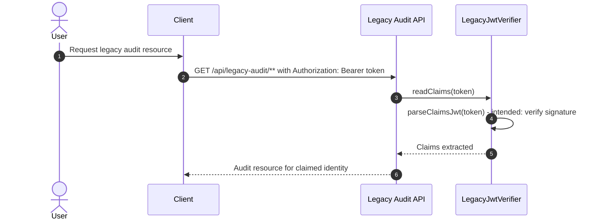

**Security assessment**

The verifier calls `Jwts.parserBuilder().build().parseClaimsJwt()` with no signing key at `LegacyJwtVerifier.java:15-18`. JJWT accepts any unsigned token here; an attacker submits a crafted token with arbitrary claims (`role=admin`, arbitrary `sub`) and the verifier returns them without signature validation. `LegacyAdminAuditController.java:41` consumes these claims, so a crafted unsigned token grants admin-level access to the audit controller.

**Relevant findings**

- 🟠 [F-005](#f-005) — Missing Rate Limiting on Authentication Endpoints — No rate limiting prevents repeated token-forgery attempts against the legacy audit endpoints.
- 🔴 [F-010](#f-010) — Missing authentication on `/users` endpoint enables credential harvest — The unauthenticated user list provides valid user IDs and roles to populate forged JWT claims.
- 🔴 [F-012](#f-012) — JWT parsed without signature verification — The signature-free verification path is the direct cause: any unsigned token with crafted claims is accepted.

<a id="homegrown-session-token"></a>
#### 6.2.2 Homegrown Session Token

**Status:** 🔴 Unsafe - HomegrownSessionService encodes only the numeric user ID as Base64 with no HMAC or signature, allowing identity forgery by anyone who knows a valid user ID.

`HomegrownSessionService` issues session tokens for the `/api/homegrown-session/**` route group. `issueToken()` at `HomegrownSessionService.java:21` takes the authenticated user's numeric ID, Base64-encodes it, and returns the string as the session token.

**Security assessment**

Two weaknesses combine to make this token trivially forgeable:

- Tokens contain no HMAC, digital signature, or nonce - the entire token value is `Base64(userId)`. Any caller who knows a valid numeric user ID constructs a valid session token without authenticating (`HomegrownSessionService.java:21`).
- Numeric user IDs are sequential and enumerable; an attacker iterates from 1 upward to forge tokens for every registered account.

**Relevant findings**

- 🟠 [F-005](#f-005) — Missing Rate Limiting on Authentication Endpoints — No rate limiting on the session-issuance endpoint allows enumeration of user IDs to proceed without throttling.
- 🔴 [F-010](#f-010) — Missing authentication on `/users` endpoint enables credential harvest — The unauthenticated user-listing endpoint exposes the set of valid user IDs needed to forge tokens.
- 🔴 [F-012](#f-012) — JWT parsed without signature verification — The absence of any cryptographic binding between the token and the issuing authentication event makes this session token functionally equivalent to a bearer-by-user-ID scheme.

<a id="legacy-sqlite-authentication"></a>
**Legacy SQLite Authentication.**


**Status:** 🔴 Unsafe - LegacySqliteAuthController maps `/api/legacy-sqlite/**` as `permitAll`; the user-listing endpoint returns plaintext passwords to unauthenticated callers and the raw login path injects SQL.

`LegacySqliteAuthController` exposes `/api/legacy-sqlite/**` as `permitAll` in `SecurityConfig.java:40`. The controller provides two relevant endpoints backed by `LegacySqliteUserStore`: a user-listing endpoint and a raw SQL login path.

**Security assessment**

Two independent vulnerabilities exist on this path:

- `GET /api/legacy-sqlite/users` returns all rows including the `password` column to any unauthenticated caller (`LegacySqliteAuthController.java:49-54`), making the complete cleartext credential list publicly accessible.
- `GET /api/legacy-sqlite/login-raw` concatenates `username` and `password` directly into the SQL `WHERE` clause at `LegacySqliteUserStore.java:64`, allowing SQL injection to bypass authentication entirely.

**Relevant findings**

- 🟠 [F-005](#f-005) — Missing Rate Limiting on Authentication Endpoints — No rate limiting on these endpoints allows unlimited credential enumeration and injection attempts.
- 🔴 [F-010](#f-010) — Missing authentication on `/users` endpoint enables credential harvest — The unauthenticated `/users` endpoint is the direct credential-harvest surface for this control category.
- 🔴 [F-012](#f-012) — JWT parsed without signature verification — SQL injection in the raw login query allows an attacker to skip credential verification and establish a session for any account.

<a id="credential-exposure-in-application-logs"></a>
**Credential Exposure in Application Logs.**


**Status:** 🔴 Unsafe - CredentialLoggingFilter writes the plaintext username and password to the application log at INFO level on every POST `/login` request.

`CredentialLoggingFilter.doFilterInternal()` intercepts POST requests to `/login` and logs the incoming `username` and `password` fields before Spring Security's authentication chain processes the request. The filter emits these fields at INFO level, so they appear in standard application logs.

**Security assessment**

Every login attempt writes plaintext credentials to the application log at `CredentialLoggingFilter.java:25`. Any log aggregation system, log file with broad read permissions, log-forwarding pipeline, or SIEM that receives this application's output holds a rolling record of all user passwords in cleartext. A single log-read access grants an attacker credentials for every user who has authenticated since the last log rotation.

**Relevant findings**

- 🟠 [F-005](#f-005) — Missing Rate Limiting on Authentication Endpoints — High authentication-request volume (enabled by absent rate limiting) amplifies the credential-logging exposure.
- 🔴 [F-010](#f-010) — Missing authentication on `/users` endpoint enables credential harvest — The credential log combined with the unauthenticated user list provides a complete mapping from username to cleartext password.
- 🔴 [F-012](#f-012) — JWT parsed without signature verification — Logged credentials can be replayed against the JWT-issuing endpoint to obtain valid signed tokens for any logged account.

<a id="cleartext-password-storage"></a><a id="cleartext-password-storage-sqlite"></a>
**Cleartext Password Storage.**


**Status:** 🔴 Unsafe - LegacySqliteUserStore stores passwords as plaintext strings and exposes them to unauthenticated callers via GET `/api/legacy-sqlite/users`.

`LegacySqliteUserStore` creates the SQLite user table at startup and inserts rows with a plaintext `password` column at `LegacySqliteUserStore.java:30-39`. The seeded accounts include known values (`'password'`, `'admin'`).

**Security assessment**

Two exposures compound each other:

- Passwords are stored without hashing at `LegacySqliteUserStore.java:31`. No hash algorithm or salt is applied, so a database read yields usable credentials directly.
- `GET /api/legacy-sqlite/users` (`LegacySqliteAuthController.java:49-54`) returns all rows including the `password` column to any unauthenticated HTTP client, making database-read access unnecessary - the plaintext passwords are served over HTTP without authentication.

**Relevant findings**

- 🟠 [F-005](#f-005) — Missing Rate Limiting on Authentication Endpoints — Absent rate limiting on the `/users` endpoint allows bulk credential harvest without throttling.
- 🔴 [F-010](#f-010) — Missing authentication on `/users` endpoint enables credential harvest — The unauthenticated user-listing endpoint is the direct delivery mechanism for these cleartext passwords.
- 🔴 [F-012](#f-012) — JWT parsed without signature verification — Harvested cleartext credentials can be used to authenticate against the JWT-issuing endpoint, yielding signed session tokens for arbitrary accounts.

### 6.3 Session and Token Controls

<a id="ctrl-session-and-token-controls"></a>

**Dependent crossings:** [tb-1](#tb-1) refuted - 🔴 [F-006](#f-006) — Hard-coded cryptographic key (`docker-compose.yml:44`), 🔴 [F-007](#f-007) — Hard-coded credentials for all accounts (`config/SecurityConfig.java:72`), 🔴 [F-019](#f-019) — H2 console unauthenticated access (`SecurityConfig.java:32`), +5 · [tb-2](#tb-2) refuted - 🔴 [F-037](#f-037) — Unauthenticated order data disclosure (`OrderSearchController.java:24`), 🔴 [F-048](#f-048) — Missing authentication for search endpoint (`OrderSearchController.java:24`) · [tb-3](#tb-3) refuted - 🟠 [F-031](#f-031) — XXE via default DocumentBuilderFactory (`serverside/XmlPreviewController.java:22`) · [tb-4](#tb-4) refuted - 🔴 [F-012](#f-012) — JWT parsed without signature verification src/main/java/com/example/appsecverif…, 🔴 [F-018](#f-018) — Unsigned JWT admin bypass (`authentication/LegacyAdminAuditController.java:41`) · [tb-5](#tb-5) refuted - 🔴 [F-010](#f-010) — Missing authentication on `/users` endpoint enables credential harvest

**Verdict:** 🔴 Unsafe

<!-- The line below is mechanically derived from the controls table — LLM must not re-author it. -->
**Controls covered:**

- [6.3.1 CSRF Protection](#631-csrf-protection)

**Implemented controls:** `src/main/java/com/example/appsecverificationtarget/config/SecurityConfig.java`.

**Assessment:** Spring Security's built-in CSRF module is globally disabled via `AbstractHttpConfigurer::disable` at `SecurityConfig.java:28`. A supplementary controller, `CsrfSettingsController`, provides a custom form-token check, but verifies only that the token field is non-blank - any single-character value bypasses it. No CSRF mitigation applies to any other state-changing POST route.

<a id="csrf-protection"></a>
#### 6.3.1 CSRF Protection

**Status:** 🔴 Unsafe - CSRF is globally disabled in SecurityConfig; the manual `formToken` check verifies only non-blank, not cryptographic validity, leaving all state-changing routes unprotected.

Spring Security ships with CSRF protection enabled by default; `SecurityConfig.java:28` disables it globally via `.csrf(AbstractHttpConfigurer::disable)`. A supplementary endpoint, `CsrfSettingsController.POST /csrf/settings`, attempts a manual token check at line 47.

**Security assessment**

- Spring Security CSRF is globally disabled (`SecurityConfig.java:28`), so no standard CSRF token is required on any state-changing request to the application.
- `CsrfSettingsController.java:47` checks that the custom `formToken` field is non-blank. Submitting `formToken=x` satisfies the check; the check provides no cryptographic assurance.

**Relevant findings**

- No dedicated finding routed in this assessment.

The diagram shows the session issuance and Bearer-token presentation flow for authenticated requests, illustrating the session lifecycle that CSRF protection is intended to guard:

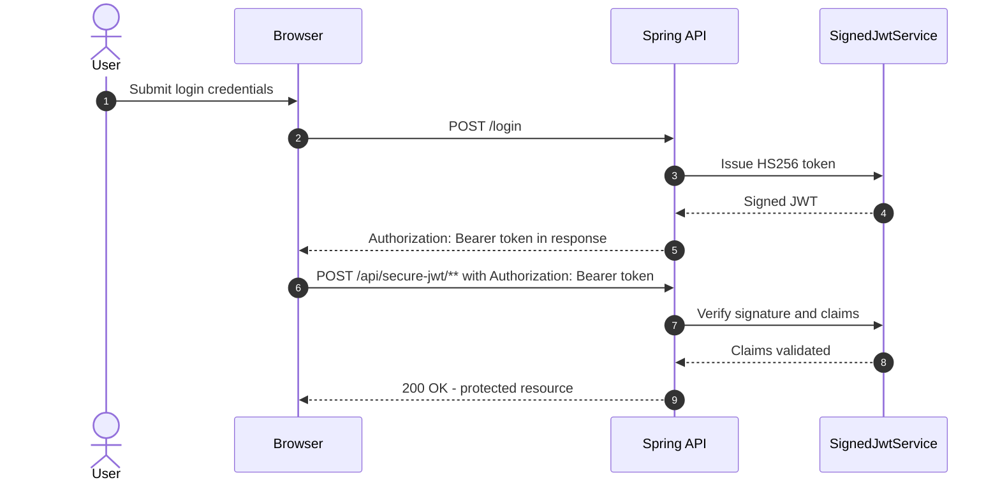

### 6.4 Authorization Controls

<a id="ctrl-authorization-controls"></a>

**Dependent crossings:** [tb-1](#tb-1) refuted - 🔴 [F-003](#f-003) — Missing Authorization on Privileged Resource Endpoints · [tb-4](#tb-4) unconfirmed - 🟠 [F-045](#f-045) — IDOR on session token issuance (`authentication/HomegrownSessionService.java:21`) · [tb-5](#tb-5) refuted - 🔴 [F-003](#f-003) — Missing Authorization on Privileged Resource Endpoints


**Systemic weaknesses:** [W-003](#w-003)
**Verdict:** 🔴 Unsafe

<!-- The line below is mechanically derived from the controls table — LLM must not re-author it. -->
**Controls covered:**

- [6.4.1 Route-Level Authentication Enforcement](#641-route-level-authentication-enforcement)
- [6.4.2 Object-Level Ownership Authorization](#642-object-level-ownership-authorization)
- [6.4.3 Admin Endpoint Protection](#643-admin-endpoint-protection)
- [6.4.4 Centralised Authorization Policy](#644-centralised-authorization-policy)

**Implemented controls:** `src/main/java/com/example/appsecverificationtarget/config/SecurityConfig.java`; `src/main/java/com/example/appsecverificationtarget/accesscontrol/OrderAccessController.java`; `src/main/java/com/example/appsecverificationtarget/legacyadmin/LegacyAdminBoardController.java`; `src/main/java/com/example/appsecverificationtarget/config/SecurityConfig.java`.

**Assessment:** `SecurityFilterChain` closes routes with `anyRequest().authenticated()` at `SecurityConfig.java:48` and `@EnableMethodSecurity` is present at line 22. Both provide a partial framework. The `permitAll` list at lines 33-48 explicitly bypasses the catch-all rule for over ten sensitive endpoints, including the H2 console, all Spring Actuator endpoints, the legacy admin board, and several business API routes. Admin operations - user promotion, user deletion, report access - are reachable without authentication or an authorization check.

<a id="route-level-authentication-enforcement"></a>
#### 6.4.1 Route-Level Authentication Enforcement

**Status:** 🟠 Weak - SecurityFilterChain closes with `anyRequest().authenticated()` but the `permitAll` list exposes `/h2-console`, `/actuator/**`, `/api/legacy-sqlite/**`, and over ten additional sensitive paths without credentials.

`SecurityFilterChain` in `SecurityConfig.java` applies authentication to all routes via `anyRequest().authenticated()` at line 48. The chain processes an explicit `permitAll` list before reaching this catch-all, exempting specific paths from authentication.

**Security assessment**

The `permitAll` exemptions at `SecurityConfig.java:33-48` bypass the catch-all closure for a large set of sensitive operations:

- `/h2-console/**` - unauthenticated callers execute arbitrary SQL against application tables (`app_users`, `vault_credentials`, `customer_orders`, `document_records`).
- `/actuator/**` - exposes `/actuator/env` (environment variables), `/actuator/heapdump` (JVM heap contents), and `/actuator/beans` without credentials.
- `/api/legacy-sqlite/**`, `/legacy/admin/**`, `/api/orders/search`, `/api/integration/fetch`, `/api/files/read`, `/api/tools/lookup`, `/api/xml/preview`, `/api/crypto/**`, `/api/legacy-crypto/**` - all accept sensitive operations without credentials.

**Relevant findings**

- 🔴 [F-003](#f-003) — Missing Authorization on Privileged Resource Endpoints — Missing authentication on privileged resource endpoints is the direct result of the `permitAll` overrides in `SecurityConfig.java`.
- 🔴 [F-017](#f-017) — Mass-assignment privilege escalation via profile update — Mass-assignment via the profile update endpoint bypasses route-level authentication checks that should restrict the operation.
- 🔴 [F-018](#f-018) — Unsigned JWT admin bypass — The unsigned JWT admin bypass exploits the fact that the legacy admin path is reachable without authentication.

<a id="object-level-ownership-authorization"></a><a id="object-level-ownership-authorization-idor-prevention"></a>
#### 6.4.2 Object-Level Ownership Authorization

**Status:** 🟠 Weak - GET `/api/orders/{id}` returns any order by primary key without an ownership check; a parallel `/owned` endpoint verifies ownership but is not the primary lookup route.

`OrderAccessController` provides two endpoints for order retrieval. `GET /api/orders/{id}` returns the order record directly at `OrderAccessController.java:24-29`. `GET /api/orders/{id}/owned` adds an ownership and admin check at lines 32-44.

**Security assessment**

The primary order-retrieval endpoint at `OrderAccessController.java:24` returns any order for any numeric `id` without verifying that the authenticated user owns that order. Any authenticated user iterates order IDs to read the order records of other users. The ownership check at lines 32-44 is implemented correctly but applies only to the secondary `/owned` path, not to the primary lookup.

**Relevant findings**

- 🔴 [F-003](#f-003) — Missing Authorization on Privileged Resource Endpoints — The missing ownership check on the primary order endpoint is the authorization bypass: any authenticated caller reads any order.
- 🔴 [F-017](#f-017) — Mass-assignment privilege escalation via profile update — Mass-assignment in profile updates follows the same pattern: the endpoint accepts attacker-controlled fields that should not be user-writable.
- 🔴 [F-018](#f-018) — Unsigned JWT admin bypass — Unsigned JWT claims can fabricate the `sub` field to impersonate other users when the authorization check depends on the JWT subject.

<a id="admin-endpoint-protection"></a>
#### 6.4.3 Admin Endpoint Protection

**Status:** 🔴 Unsafe - LegacyAdminBoardController exposes user promotion, user deletion, and the admin board listing with no authentication or authorization check on any endpoint.

`LegacyAdminBoardController` serves the legacy admin board. Three endpoints are exposed: `GET /legacy/admin` (user list), `POST /legacy/admin/users/{id}/promote` (role promotion), and `POST /legacy/admin/users/{id}/delete` (account deletion).

**Security assessment**

`SecurityConfig.java:41` marks `/legacy/admin/**` as `permitAll`, stripping authentication from all three endpoints. `LegacyAdminBoardController.java:22-40` performs no additional role check. Two consequences follow:

- Any unauthenticated HTTP client promotes an arbitrary user to the admin role by posting to `/legacy/admin/users/{id}/promote`.
- Any unauthenticated HTTP client deletes any account by posting to `/legacy/admin/users/{id}/delete`.

**Relevant findings**

- 🔴 [F-003](#f-003) — Missing Authorization on Privileged Resource Endpoints — The unauthenticated admin board demonstrates the most severe result of the missing authentication enforcement: full user-management operations without credentials.
- 🔴 [F-017](#f-017) — Mass-assignment privilege escalation via profile update — Privilege escalation via the admin promotion endpoint is equivalent to mass-assignment: attacker-controlled input modifies account roles without an authorization gate.
- 🔴 [F-018](#f-018) — Unsigned JWT admin bypass — A caller who obtains admin role via promotion can then use any authentication mechanism (including the unsigned JWT path) to exercise that role.

<a id="centralised-authorization-policy"></a>
#### 6.4.4 Centralised Authorization Policy

**Status:** 🟠 Weak - @EnableMethodSecurity is present and some landscape routes carry @PreAuthorize, but admin and business routes marked `permitAll` make method-level checks unreachable for those endpoints.

`SecurityConfig.java:22` enables `@EnableMethodSecurity`, making Spring Security's `@PreAuthorize` annotation available across the application. Some landscape orchestrator routes carry `@PreAuthorize` annotations as the enforcement mechanism.

**Security assessment**

Two structural gaps undermine the centralised policy:

- `AdminReportController` (`/api/admin`) and `AdminUserController` (`/api/admin/users`) are declared `permitAll` in `SecurityConfig.java:14,12`. Any `@PreAuthorize` on those controllers is unreachable - the request is allowed at the filter chain before method security evaluates.
- `ProfileController.PUT /me` at line 34 and `GET /admin-preferences` at line 53 have no confirmed authorization gate, leaving profile updates and admin preference reads accessible to any authenticated user regardless of role.

**Relevant findings**

- 🔴 [F-003](#f-003) — Missing Authorization on Privileged Resource Endpoints — Admin endpoints marked `permitAll` render the method-security framework ineffective for the highest-privilege operations.
- 🔴 [F-017](#f-017) — Mass-assignment privilege escalation via profile update — The unguarded profile-update endpoint allows mass-assignment privilege escalation that a proper `@PreAuthorize` role check would block.
- 🔴 [F-018](#f-018) — Unsigned JWT admin bypass — The unsigned JWT bypass allows forged claims to satisfy any role check that does get evaluated, further weakening the centralised policy.

### 6.5 Query Construction and Data Access Controls

<a id="ctrl-query-construction-and-data-access-controls"></a>

_No trust boundary in this model depends on this control class._

**Verdict:** 🔴 Unsafe

<!-- The line below is mechanically derived from the controls table — LLM must not re-author it. -->
**Controls covered:**

- [6.5.1 Parameterized Database Access](#651-parameterized-database-access)

**Implemented controls:** `src/main/java/com/example/appsecverificationtarget/inputvalidation/OrderLookupDao.java`.

**Assessment:** Three independent SQL injection surfaces exist, all reachable without authentication. Spring Data JPA is available and used for most data access; the three vulnerable routes bypass the ORM and build raw SQL strings by string concatenation. No parameterized query pattern is applied at any of the three concatenation sites.

<a id="parameterized-database-access"></a><a id="parameterized-database-access-sql-injection-prevention"></a>
#### 6.5.1 Parameterized Database Access

**Status:** 🔴 Unsafe - OrderLookupDao, LandscapeExposureSupport, and LegacySqliteUserStore all concatenate user-controlled strings into raw SQL; Spring Data JPA is bypassed on all three paths.

Spring Data JPA repositories back most data access in the application. Three routes bypass the ORM entirely and construct SQL statements by string concatenation with caller-supplied values.

**Security assessment**

Three independent injection sites are present, each reachable without authentication:

- `OrderLookupDao.java:22` - `findByOwnerEmail()` concatenates the `email` parameter into a native SQL string passed to `EntityManager.createNativeQuery()`.
- `LandscapeExposureSupport.java:30-32` - `searchPortfolio()` concatenates both `serviceCode` and `query` into a raw SQL string; the endpoint is `permitAll`.
- `LegacySqliteUserStore.java:64` - `authenticateRaw()` builds the `WHERE` clause by concatenating `username` and `password` directly, allowing `' OR '1'='1` to return the first row unconditionally.

**Relevant findings**

- 🔴 [F-001](#f-001) — SQL Injection via Unsanitized Query String Concatenation — SQL injection via concatenated query string enables authentication bypass and data extraction on the order-search path.
- 🔴 [F-011](#f-011) — SQL injection in authenticateRaw — The raw SQL login query in `LegacySqliteUserStore` allows unconditional authentication bypass via classic injection payloads.

### 6.6 Input Boundary Validation Controls

<a id="ctrl-input-boundary-validation-controls"></a>

**Dependent crossings:** [tb-1](#tb-1) refuted - 🟠 [F-025](#f-025) — CSRF globally disabled (`config/SecurityConfig.java:28`) · [tb-2](#tb-2) refuted - 🔴 [F-001](#f-001) — SQL Injection via Unsanitized Query String Concatenation · [tb-3](#tb-3) refuted - 🔴 [F-021](#f-021) — OS command injection via shell -c concatenation in runTool, 🟠 [F-038](#f-038) — Path traversal arbitrary file read (`serverside/FileReadController.java:19`) · [tb-5](#tb-5) unconfirmed - 🔴 [F-011](#f-011) — SQL injection in authenticateRaw (`LegacySqliteUserStore.java:64`)

**Verdict:** 🟠 Weak

<!-- The line below is mechanically derived from the controls table — LLM must not re-author it. -->
**Controls covered:**

- [6.6.1 Validation Approach](#661-validation-approach)

**Implemented controls:** Spring `@RequestParam` and `@RequestBody` binding; `value.trim()` in `LandscapeOperations.java:63`.

**Assessment:** No centralised input validation framework, Bean Validation annotations (`@Valid`, `@NotBlank`, `@Pattern`, `@Size`), or schema enforcement protects controller parameters that reach SQL, shell, file-path, or XML sinks. `LandscapeOperations.java:63` applies `value.trim()` as the sole normalization step, which removes whitespace but imposes no content constraint. Dangerous sinks include the SQL concatenation at `OrderLookupDao.java:22`, the shell invocation at `ToolController.java:18`, the file path resolution at `BusinessFileStorage.java:17-23`, and the XML parser at `LandscapeExposureSupport.java:42-44`.

<a id="validation-approach"></a>
#### 6.6.1 Validation Approach

**Status:** 🟠 Weak - No schema-level or Bean Validation constraints protect endpoints that reach SQL, shell, file-path, or XML sinks; only ad-hoc string trimming is present.

Request parameter extraction relies on Spring's `@RequestParam` and `@RequestBody` binding without any constraint annotations. `LandscapeOperations.java:63` applies `value.trim()` as the only input normalization before the value reaches further processing.

**Security assessment**

No `@Valid`, `@NotBlank`, `@Pattern`, or size-constraint annotations appear on controller parameters that flow to dangerous sinks. The absence of constraint annotations means Spring's validation layer passes all inputs, regardless of content or length, to:

- SQL concatenation at `OrderLookupDao.java:22` and `LegacySqliteUserStore.java:64`.
- Shell invocation at `ToolController.java:18` (`sh -c` with no escaping or allowlist).
- File path resolution at `BusinessFileStorage.java:17-23` (uses `file.getOriginalFilename()` via `Path.resolve()`).
- XML parser at `LandscapeExposureSupport.java:42-44` (default `DocumentBuilderFactory`, external entity loading enabled).

**Relevant findings**

- 🟠 [F-042](#f-042) — Unbounded query load on unauthenticated SQL endpoint — Unbounded query load on the unauthenticated SQL endpoint shows that neither authentication nor input size limits are enforced before the query reaches the database.
- 🟠 [F-043](#f-043) — Unbounded XML entity expansion reaches the unprotected XML parser because no input size limit exists on the POST body.
- 🟠 [F-044](#f-044) — No rate limiting in default nginx config — No rate limiting in the nginx configuration means validation-bypass attempts can proceed at full connection throughput.

### 6.7 Output Encoding and Rendering Controls

**Verdict:** -

**Controls covered:** No controls mapped to this category.

**Implemented controls:** No output encoding controls mapped to this codebase assessment.

**Assessment:** Not applicable - no output encoding or rendering controls or findings are routed to this category.

_Not applicable for this codebase - no controls or findings are routed to 6.7 Output Encoding and Rendering Controls._

### 6.8 Browser and Cross-Origin Controls

**Verdict:** 🔴 Unsafe

<!-- The line below is mechanically derived from the controls table — LLM must not re-author it. -->
**Controls covered:**

- [6.8.1 CORS Origin Validation](#681-cors-origin-validation)

**Implemented controls:** `src/main/java/com/example/appsecverificationtarget/cors/CorsPolicyFilter.java`.

**Assessment:** `CorsPolicyFilter` supplies cross-origin headers for `/api/cors/**` but its `isTrustedOrigin()` check accepts any `Origin` header that starts with `"http"`, which matches every HTTP and HTTPS origin. Combined with `Access-Control-Allow-Credentials: true` at `CorsPolicyFilter.java:19`, any attacker-controlled web page makes credentialed cross-origin requests to those endpoints and reads the response.

<a id="cors-origin-validation"></a>
#### 6.8.1 CORS Origin Validation

**Status:** 🔴 Unsafe - `CorsPolicyFilter.isTrustedOrigin()` accepts any HTTP or HTTPS origin; combined with `credentials:true`, any web page makes credentialed cross-origin requests to `/api/cors/**` and reads the response.

`CorsPolicyFilter` intercepts requests to `/api/cors/**` and evaluates the `Origin` header against `isTrustedOrigin()` at `CorsPolicyFilter.java:32`. If the check passes, the filter sets `Access-Control-Allow-Origin` to the request's origin and `Access-Control-Allow-Credentials: true`.

**Security assessment**

Two flaws combine to negate same-origin isolation on the affected endpoints:

- `isTrustedOrigin()` returns `true` for any string starting with `"http"` (`CorsPolicyFilter.java:32`), which matches every HTTP and HTTPS origin - including `http://attacker.example.com`.
- `Access-Control-Allow-Credentials: true` at `CorsPolicyFilter.java:19` instructs the browser to include the user's cookies and authorization headers in the cross-origin request and to expose the response to the origin's JavaScript.

**Relevant findings**

- 🟠 [F-025](#f-025) — CSRF globally disabled — CSRF is globally disabled, removing the token-based defense that would otherwise limit damage from the CORS misconfiguration.
- 🟠 [F-026](#f-026) — CORS origin wildcard with credentials — The CORS wildcard combined with credentials allows any origin to read authenticated API responses, enabling session-riding attacks from arbitrary websites.
- 🟡 [F-050](#f-050) — Trivial formToken non-blank check — The trivial CSRF formToken check cannot compensate for the permissive CORS configuration on credentialed endpoints.

### 6.9 Cryptography Secrets and Data Protection


**Systemic weaknesses:** [W-005](#w-005), [W-006](#w-006)
**Verdict:** 🔴 Unsafe

<!-- The line below is mechanically derived from the controls table — LLM must not re-author it. -->
**Controls covered:**

- [6.9.1 Password Hashing](#691-password-hashing)
- [6.9.2 Legacy Password Hashing](#692-legacy-password-hashing)
- [6.9.3 JWT Signing Key Management](#693-jwt-signing-key-management)
- [6.9.4 Homegrown Cipher](#694-homegrown-cipher)
- [6.9.5 Transport Encryption](#695-transport-encryption)

**Implemented controls:** `src/main/java/com/example/appsecverificationtarget/config/SecurityConfig.java`; `src/main/java/com/example/appsecverificationtarget/crypto/LegacyPasswordService.java`; `src/main/java/com/example/appsecverificationtarget/authentication/SignedJwtService.java`; `src/main/java/com/example/appsecverificationtarget/crypto/HomegrownCipher.java`; `docker-compose.yml`.

**Assessment:** BCrypt protects the main password path and `SignedJwtService` applies an `HS256` algorithm whitelist - the two sound cryptographic controls in the codebase. Five other controls fail: `LegacyPasswordService.java:15` hashes passwords with unsalted `MD5`; `LegacyCryptoService.java:17` uses AES/ECB with a hardcoded key; `HomegrownCipher` applies a repeating-key XOR; the JWT signing key is ephemeral and not externalized to a secrets store; and port 80 accepts cleartext HTTP with no redirect to 8443.

<a id="password-hashing"></a><a id="password-hashing-bcrypt"></a>
#### 6.9.1 Password Hashing

**Status:** 🟢 Adequate - BCryptPasswordEncoder is the primary encoder; default strength provides adequate offline-cracking resistance for the main authentication path.

`SecurityConfig.java:131-133` registers a `BCryptPasswordEncoder` as the primary `PasswordEncoder` bean and applies it to the in-memory `UserDetailsService`. BCrypt with its default cost factor produces a salted hash that resists precomputed lookup and slows brute-force attempts.

**Security assessment**

BCrypt at default cost factor resists offline cracking for the main user store. The algorithm is sound. The practical weakness is in the surrounding setup: all 14 accounts share the literal password `"password"` (`SecurityConfig.java:71-127`), so the hash correctly verifies a known-bad credential - but this is a credential management failure, not a flaw in the hashing algorithm. The legacy SQLite path's cleartext storage (assessed in [§6.9.2](#692-legacy-password-hashing) and [§6.2.7](#cleartext-password-storage)) is a separate control failure.

**Relevant findings**

- 🔴 [F-002](#f-002) — Hardcoded Credentials Committed to Version Control — The hardcoded credentials across all accounts nullify BCrypt's brute-force resistance; the algorithm verifies a known value, providing no practical protection.
- 🔴 [F-006](#f-006) — Hard-coded cryptographic key — The ephemeral JWT signing key means tokens are invalidated on restart, but does not interact with the BCrypt hashing path.
- 🔴 [F-007](#f-007) — Hard-coded credentials for all accounts — Hardcoded JWT signing material in the docker-compose configuration affects the token-issuance layer downstream of the password hash, compounding the credential exposure.

<a id="legacy-password-hashing"></a><a id="legacy-password-hashing-md5"></a>
#### 6.9.2 Legacy Password Hashing

**Status:** 🔴 Unsafe - `LegacyPasswordService.hashForAudit()` applies unsalted `MD5`; precomputed rainbow tables invert the hash in seconds for any common password.

`LegacyPasswordService` provides a secondary hashing path for audit logging. `hashForAudit()` at `LegacyPasswordService.java:15-17` computes a hash of the supplied password string and includes it in audit records.

**Security assessment**

`hashForAudit()` calls `MessageDigest.getInstance("MD5")` with no salt (`LegacyPasswordService.java:15-17`). Two properties of this choice combine to defeat the control:

- `MD5` produces identical output for identical input; without a per-record salt, the same password produces the same hash for every user, enabling rainbow-table lookup.
- `MD5` is fast - a single GPU computes billions of hashes per second, making brute force practical for any password not in a precomputed table.

**Relevant findings**

- 🔴 [F-002](#f-002) — Hardcoded Credentials Committed to Version Control — Hardcoded credential values in the user store (`"password"`, `"admin"`) mean the MD5 audit hashes are trivially reversible with a one-row table lookup.
- 🔴 [F-006](#f-006) — Hard-coded cryptographic key — Audit records containing MD5 hashes are transmitted or stored in contexts where a stronger hash would limit the blast radius of a log disclosure.
- 🔴 [F-007](#f-007) — Hard-coded credentials for all accounts — Hardcoded JWT material in the deployment configuration provides a second path to credential-equivalent access that bypasses the password hash entirely.

<a id="jwt-signing-key-management"></a>
#### 6.9.3 JWT Signing Key Management

**Status:** 🟠 Weak - The `HS256` signing key is generated ephemerally at JVM startup, not persisted, and not externalized; all issued tokens are invalidated on every application restart.

`SignedJwtService` generates an `HS256` signing key at startup via `Keys.secretKeyFor(SignatureAlgorithm.HS256)` (`SignedJwtService.java:19`). The key is held only in JVM heap memory and is discarded when the process stops.

**Security assessment**

Key ephemerality means every application restart invalidates all previously issued tokens, forcing every active session to re-authenticate. The key is not externalized to a secrets manager, environment variable, or vault, so there is no operational path to rotate it without a restart. A separate hardcoded key value appears in `docker-compose.yml:44` under a different control; the `SignedJwtService` key is distinct but also not managed. The signing algorithm choice (`HS256` with whitelist enforcement) is sound - the weakness is lifecycle management, not the algorithm.

**Relevant findings**

- 🔴 [F-002](#f-002) — Hardcoded Credentials Committed to Version Control — Hardcoded credential values mean that even a properly rotated signing key cannot prevent session establishment from known-good credentials.
- 🔴 [F-006](#f-006) — Hard-coded cryptographic key — The hardcoded cryptographic key in `docker-compose.yml:44` is the adjacent control failure that makes key management a cross-cutting concern in this codebase.
- 🔴 [F-007](#f-007) — Hard-coded credentials for all accounts — Hardcoded signing material in deployment configuration provides a predictable key that an attacker with source-tree access can use to forge tokens.

<a id="homegrown-cipher"></a>
#### 6.9.4 Homegrown Cipher

**Status:** 🔴 Unsafe - Two non-standard cipher implementations are present: a repeating-key XOR in HomegrownCipher and AES/ECB mode with a hardcoded key in LegacyCryptoService; both fail to provide confidentiality.

`HomegrownCipher` applies a custom repeating-key XOR operation for encryption in parts of the application. `LegacyCryptoService` uses `AES/ECB` mode with a key embedded in the source code at `LegacyCryptoService.java:17`.

**Security assessment**

Two independent cipher weaknesses combine:

- `HomegrownCipher` applies repeating-key XOR: identical plaintext blocks produce identical ciphertext blocks, and the key is recoverable from known plaintext using frequency analysis or XOR cancellation.
- `LegacyCryptoService.java:17` uses `AES/ECB` with a hardcoded key. ECB mode encrypts each 16-byte block independently, preserving plaintext block patterns in the ciphertext. The hardcoded key in source code is readable by anyone with repository access, reducing the cipher to security-by-obscurity.

**Relevant findings**

- 🔴 [F-002](#f-002) — Hardcoded Credentials Committed to Version Control — Hardcoded credentials available in source provide known plaintext to accelerate recovery of the XOR key.
- 🔴 [F-006](#f-006) — Hard-coded cryptographic key — The hardcoded AES key in `docker-compose.yml` and `LegacyCryptoService.java` is recoverable from the repository, defeating the cipher's confidentiality claim entirely.
- 🔴 [F-007](#f-007) — Hard-coded credentials for all accounts — Hardcoded signing and encryption material across the codebase indicates a systemic pattern of embedded secrets rather than isolated incidents.

<a id="transport-encryption"></a><a id="transport-encryption-tls"></a>
#### 6.9.5 Transport Encryption

**Status:** 🟡 Partial - TLS is configured on port 8443 for the api-gateway; port 80 accepts cleartext HTTP with no redirect; internal service-to-service communication has no confirmed TLS configuration.

`docker-compose.yml` maps port 8443 to the api-gateway container at line 41, providing a TLS termination point. The same container also maps port 80 (`docker-compose.yml:31`).

**Security assessment**

Two gaps leave traffic unprotected:

- Port 80 accepts cleartext HTTP with no automatic redirect to port 8443 (`docker-compose.yml:31`). Clients that connect on port 80 transmit credentials, session tokens, and API payloads in plaintext.
- Internal service-to-service communication within the Docker bridge network has no confirmed TLS configuration. All inter-service traffic, including calls carrying session tokens or sensitive data, travels unencrypted over the internal network.

**Relevant findings**

- 🔴 [F-002](#f-002) — Hardcoded Credentials Committed to Version Control — Hardcoded credentials transmitted over cleartext HTTP are interceptable without exploiting any application-layer vulnerability.
- 🔴 [F-006](#f-006) — Hard-coded cryptographic key — Cryptographic keys hardcoded in `docker-compose.yml` are exposed in the same deployment artifact that configures the cleartext HTTP port.
- 🔴 [F-007](#f-007) — Hard-coded credentials for all accounts — Hardcoded signing material in deployment configuration is transmitted in plaintext across internal service connections.

### 6.10 File Parser and Outbound Request Controls

<a id="ctrl-file-parser-and-outbound-request-controls"></a>

**Dependent crossings:** [tb-12](#tb-12) refuted - 🔴 [F-015](#f-015) — SSRF via unvalidated RestTemplate URL (`serverside/IntegrationController.java:23`)


**Systemic weaknesses:** [W-002](#w-002)
**Verdict:** 🔴 Missing

<!-- The line below is mechanically derived from the controls table — LLM must not re-author it. -->
**Controls covered:**

- [6.10.1 SSRF Prevention](#6101-ssrf-prevention)

**Implemented controls:** `src/main/java/com/example/appsecverificationtarget/serverside/IntegrationController.java`.

**Assessment:** No outbound URL allowlist, scheme restriction, or private-address filter guards `RestTemplate` calls in `IntegrationController` or `LandscapeExposureSupport`. No path containment check is applied to file uploads or file-read operations. The XML parser at `LandscapeExposureSupport.java:42-44` uses a default `DocumentBuilderFactory` with external entity loading enabled. All three control families - SSRF prevention, path-traversal containment, and XXE hardening - are absent.

<a id="ssrf-prevention"></a><a id="ssrf-prevention-outbound-url-allowlist"></a>
#### 6.10.1 SSRF Prevention

**Status:** 🔴 Missing - No URL allowlist, scheme restriction, or private-address block guards outbound HTTP requests made by IntegrationController or LandscapeExposureSupport; both endpoints are `permitAll`.

`IntegrationController.fetch()` at `IntegrationController.java:23` and `LandscapeExposureSupport.fetchRemote()` at `LandscapeExposureSupport.java:36` accept a caller-supplied URL string and pass it directly to `RestTemplate.getForObject()` with no validation or restriction.

**Security assessment**

Both SSRF endpoints are unauthenticated and accept arbitrary URLs:

- `IntegrationController.java:23` - the `url` request parameter is passed directly to `RestTemplate.getForObject(url, String.class)`.
- `LandscapeExposureSupport.java:36` - identical pattern on a second unauthenticated path.
- No scheme allowlist blocks `file://`, `gopher://`, or `dict://`. No IP allowlist or SSRF filter prevents requests to `169.254.169.254` (cloud IMDS), `10.0.0.0/8`, or other internal services.

**Relevant findings**

- 🔴 [F-013](#f-013) — Path Traversal in File Upload — Path traversal in file upload shows that the absence of path containment extends beyond HTTP requests to the local filesystem.
- 🔴 [F-015](#f-015) — SSRF via unvalidated RestTemplate URL — The unvalidated `RestTemplate` call in `IntegrationController` is the primary SSRF surface.
- 🔴 [F-021](#f-021) — OS command injection via shell -c concatenation in runTool — OS command injection in `runTool()` demonstrates that the same pattern of accepting arbitrary caller-supplied strings and passing them to dangerous sinks applies across multiple endpoint types.

### 6.11 Operations Runtime and Supply Chain Controls


**Systemic weaknesses:** [W-004](#w-004)
**Verdict:** 🔴 Missing

<!-- The line below is mechanically derived from the controls table — LLM must not re-author it. -->
**Controls covered:**

- [6.11.1 Automated SCA scanning](#6111-automated-sca-scanning)
- [6.11.2 Automated dependency updates](#6112-automated-dependency-updates)
- [6.11.3 Lockfile hygiene](#6113-lockfile-hygiene)

**Implemented controls:** Maven `pom.xml` provides deterministic dependency resolution via explicit version pinning for all declared Java dependencies.

**Assessment:** No SCA scanner (OWASP Dependency-Check, Snyk, Trivy) and no automated dependency update tool (Dependabot, Renovate) are configured in the repository. Container images in `docker-compose.yml:29` and `docker-compose.yml:363` reference floating tags without digest pinning, allowing supply-chain substitution if an upstream tag is overwritten. Maven `pom.xml` pins dependency versions deterministically, providing the one sound control in this category.

<a id="automated-sca-scanning"></a>
#### 6.11.1 Automated SCA scanning

**Status:** 🔴 Missing - No SCA scanner is configured; known-vulnerable dependency versions are not detected by any automated gate in the build or CI pipeline.

Software composition analysis scanning surfaces published CVEs in declared dependencies before they reach production. The repository declares all Java dependencies in `pom.xml`, which provides the input for any SCA tool.

**Security assessment**

No OWASP Dependency-Check, Snyk, Trivy, or equivalent SCA plugin is configured in the Maven build or in any CI workflow. Without a scanner, a dependency upgrade that introduces a CVE - or a failure to upgrade when a CVE is published against the current version - goes undetected until a manual review or an incident surfaces the issue.

**Relevant findings**

- 🟠 [F-004](#f-004) — Missing Security Audit Logging Across Services — Missing security audit logging means that even if a vulnerable dependency is exploited, no structured log entry captures the exploitation event.
- 🟠 [F-032](#f-032) — Floating image tag without digest — A floating image tag in `docker-compose.yml:29` without digest pinning exposes the container image supply chain to the same undetected-substitution risk that SCA scanning addresses for library dependencies.
- 🟠 [F-033](#f-033) — Cleartext credential logging means that if a vulnerable dependency enables log exfiltration, the logs contain high-value credential data.

<a id="automated-dependency-updates"></a>
#### 6.11.2 Automated dependency updates

**Status:** 🔴 Missing - No Dependabot or Renovate configuration is present; dependency versions are updated only through manual developer action.

Automated dependency update tools (Dependabot, Renovate) submit pull requests when new versions of declared dependencies are published, creating a continuous patch cadence without manual monitoring.

**Security assessment**

Neither `.github/dependabot.yml` nor a `renovate.json` file is present in the repository. Maven dependency versions in `pom.xml` are pinned (providing reproducibility) but are updated only through manual intervention. The patch cadence is entirely reactive: a team member must notice a CVE advisory, identify the affected package, and manually update `pom.xml` before the fix is applied.

**Relevant findings**

- 🟠 [F-004](#f-004) — Missing Security Audit Logging Across Services — The absence of automated dependency updates compounds the missing audit logging — neither the dependency vulnerability nor its exploitation is likely to be detected automatically.
- 🟠 [F-032](#f-032) — Floating image tag without digest — The unpinned container image tag at `docker-compose.yml:29` represents the deployment-level equivalent of the missing automated update posture.
- 🟠 [F-033](#f-033) — Cleartext credential logging — Credential logging in the application means that exploiting an unpatched dependency to gain log access provides direct credential harvest.

<a id="lockfile-hygiene"></a>
#### 6.11.3 Lockfile hygiene

**Status:** 🟢 Adequate - Maven `pom.xml` pins dependency versions; builds resolve identical dependency sets reproducibly.

Maven's `pom.xml` declares explicit version constraints for all declared Java dependencies. Two builds from the same `pom.xml` against the same repository resolve identical dependency sets without floating-version ambiguity.

**Security assessment**

Explicit version pinning in `pom.xml` prevents uncontrolled dependency upgrades at build time and allows the build to be reproducible across environments. Maven's local repository cache with explicit versions provides deterministic resolution. One gap exists outside Maven's scope: container image tags at `docker-compose.yml:29` and `docker-compose.yml:363` float without `SHA256` digest pinning, so a restart after an upstream tag overwrite can pull a different image layer - this is a deployment-level reproducibility gap, not a Maven lockfile failure.

**Relevant findings**

- 🟠 [F-004](#f-004) — Missing Security Audit Logging Across Services — Missing security event logging means that any supply-chain substitution event that succeeds at the container layer would not generate a structured detection signal.
- 🟠 [F-032](#f-032) — Floating image tag without digest — The unpinned image tag at `docker-compose.yml:29` is the specific gap that lockfile hygiene does not address at the Maven layer.
- 🟠 [F-033](#f-033) — Cleartext credential logging — Credential logging in place of security event logging means that supply-chain incident response would need to sift through credential noise to find exploitation evidence.

### 6.12 Real-time and Not Applicable Controls

<!-- §6.12 LOCKED — mechanically derived: no routed finding and no real-time, LLM, GraphQL, or gRPC component in the model. Renderer must not rewrite the line below. -->
_Not applicable - no finding routed to this category, and the architecture model contains no real-time / WebSocket, AI/LLM, GraphQL, or gRPC component. Controls catalogued elsewhere (container hardening, dependency determinism) are covered in their primary [§6](#6-security-architecture) sections._

### 6.13 Defense-in-Depth Summary

**Verdict:** 🔴 Unsafe

The two sound controls in the codebase are BCrypt password hashing via `SecurityConfig.java:131-133` (adequate for the main login path) and `HS256`-signed JWT issuance in `SignedJwtService` with an algorithm whitelist at `SignedJwtService.java:38` that blocks unsigned-token bypass. Maven `pom.xml` version pinning provides deterministic dependency resolution. `@EnableMethodSecurity` is present and a subset of orchestrator routes carry `@PreAuthorize` annotations.

Layered defense breaks down at four boundaries simultaneously: the authentication boundary is bypassed via the unsigned JWT verifier (`LegacyJwtVerifier.java:15-18`) and the SQL-injectable SQLite login path (`LegacySqliteUserStore.java:64`), while cleartext password storage (`LegacySqliteUserStore.java:31`) and credential logging (`CredentialLoggingFilter.java:25`) ensure any log or DB read yields usable credentials; the authorization boundary fails because the `permitAll` list in `SecurityConfig.java:33-48` exempts admin operations, the H2 console, and all actuator endpoints from authentication; the cryptographic boundary fails because AES/ECB with a hardcoded key (`LegacyCryptoService.java:17`) and a repeating-key XOR cipher (`HomegrownCipher.java`) provide no meaningful confidentiality, and cleartext HTTP on port 80 (`docker-compose.yml:31`) exposes all traffic to interception; the supply-chain boundary has no automated scanner to detect when any pinned Maven dependency carries a published CVE. Closing the authentication gaps - parameterized queries on all SQL paths, JWT algorithm enforcement on all verifiers, removal of the admin and console `permitAll` overrides, and externalization of secrets to a runtime vault - would restore the minimum viable layered defense.

<!-- enriched:standard -->

---

<a id="weakness-register"></a>
## 7. Weakness Register

Systemic control gaps behind the findings, ordered by severity (W-001 = most severe). Each weakness names the missing, home-grown, or misused control, the findings that evidence it, the components it spans, and its remediation. A weakness may also rest on observed unsafe practice or an absent architectural control with no confirmed exploit - only confirmed findings carry a CVSS score.

- 🔴 **Critical** · [W-001](#w-001) - Endpoints are reachable without enforced authentication · confirmed · 9 findings · 6 components
- 🔴 **Critical** · [W-002](#w-002) - Input handling lacks enforced boundary validation · confirmed · 2 findings · 2 components
- 🔴 **Critical** · [W-003](#w-003) - `Authorization` is implemented route by route · confirmed · 5 findings · 6 components
- 🟡 **Medium** · [W-004](#w-004) - Vulnerable & Outdated Dependencies is implemented inconsistently · observed-practice · 1 finding · 1 component
- 🟡 **Medium** · [W-005](#w-005) - Cryptographic security is implemented in application code · observed-practice · 1 finding · 1 component
- 🟡 **Medium** · [W-006](#w-006) - Security-sensitive data uses weak cryptographic primitives · observed-practice · 4 findings · 3 components

<a id="w-001"></a>
### W-001 — Endpoints are reachable without enforced authentication

🔴 **Critical** · design weakness · confirmed · 9 findings

Sensitive API routes and real-time channels are exposed without an enforced authentication check at the endpoint boundary. Access control depends on each handler (or the caller) remembering to require a session, so an unauthenticated client can reach privileged operations directly.

**Architectural anti-pattern - Missing server-side authorization layer.** Privileged routes including admin APIs, the in-memory database console, and management endpoints are accessible without any authentication check, removing the primary enforcement boundary between public and administrative access.

**Confirmed findings:**

- 🔴 [F-010](#f-010) — Missing authentication on `/users` endpoint enables credential harvest
- 🔴 [F-014](#f-014) — Unauthenticated actuator and H2 console (`config/SecurityConfig.java:33`)
- 🔴 [F-019](#f-019) — H2 console unauthenticated access (`SecurityConfig.java:32`)
- 🔴 [F-020](#f-020) — Missing H2 console authentication (`SecurityConfig.java:32`)
- 🔴 [F-022](#f-022) — Unauthenticated admin API (`legacyadmin/LegacyAdminBoardController.java:28`)
- 🔴 [F-035](#f-035) — Actuator endpoints publicly accessible without auth (`SecurityConfig.java:33`)
- 🔴 [F-040](#f-040) — Unauthenticated H2 console enables table destruction (`SecurityConfig.java:32`)
- 🔴 [F-048](#f-048) — Missing authentication for search endpoint (`OrderSearchController.java:24`)
- 🟠 [F-052](#f-052) — Unauthenticated report endpoint (`accesscontrol/AdminReportController.java:34`)

**Architecture evidence:** Route Authentication Middleware, Server-Side Session Enforcement

**Affected components:** [C-11](#c-11), [C-02](#c-02), [C-03](#c-03), [C-13](#c-13), [C-05](#c-05), [C-10](#c-10)

**Remediation:**

- **Structural** — enforce authentication centrally at the routing and channel boundary so every exposed endpoint requires a verified session unless explicitly marked public
- **Tactical** — ● [M-010](#m-010) — Require authentication on every exposed endpoint, ● [M-014](#m-014) — Require authentication on every exposed endpoint, ● [M-019](#m-019) — Require authentication on every exposed endpoint, ● [M-020](#m-020) — Require authentication on every exposed endpoint, ◕ [M-022](#m-022) — Require authentication on every exposed endpoint, ◕ [M-034](#m-034) — Require authentication on every exposed endpoint, ◕ [M-039](#m-039) — Require authentication on every exposed endpoint, ◕ [M-047](#m-047) — Require authentication on every exposed endpoint, ◑ [M-051](#m-051) — Require authentication on every exposed endpoint

<a id="w-002"></a>
### W-002 — Input handling lacks enforced boundary validation

🔴 **Critical** · design weakness · confirmed · 2 findings

Request handlers do not validate input against one enforced server-side schema or allowlist at the boundary - validation is either absent on the vulnerable parameters or limited to rejecting selected bad patterns (a blacklist). New encodings and unanticipated input forms can therefore reach downstream parsers or interpreters.

**Confirmed findings:**

- 🔴 [F-013](#f-013) — Path Traversal in File Upload (`web/BusinessFileStorage.java:23`)
- 🟠 [F-038](#f-038) — Path traversal arbitrary file read (`serverside/FileReadController.java:19`)

**Architecture evidence:** Schema Validation, Allowlist Validation

**Affected components:** [C-07](#c-07), [C-08](#c-08)

**Remediation:**

- **Structural** — enforce server-side schemas and domain-specific allowlists before input reaches parsing, persistence, or command construction
- **Tactical** — ● [M-013](#m-013) — Constrain file paths to a safe base directory, ◕ [M-037](#m-037) — Constrain file paths to a safe base directory

<a id="w-003"></a>
### W-003 — Authorization is implemented route by route

🔴 **Critical** · design weakness · confirmed · 5 findings

`Authorization` depends on per-handler checks instead of a policy boundary that consistently enforces role, ownership, and tenant scope. New routes can bypass protection by omitting a local check.

**Confirmed findings:**

- 🔴 [F-003](#f-003) — Missing Authorization on Privileged Resource Endpoints
- 🔴 [F-018](#f-018) — Unsigned JWT admin bypass (`authentication/LegacyAdminAuditController.java:41`)
- 🔴 [F-037](#f-037) — Unauthenticated order data disclosure (`OrderSearchController.java:24`)
- 🟠 [F-045](#f-045) — IDOR on session token issuance (`authentication/HomegrownSessionService.java:21`)
- 🔴 [F-046](#f-046) — IDOR missing ownership check (`accesscontrol/OrderAccessController.java:24`)

**Architecture evidence:** Centralised AuthZ Policy, Role / Scope Enforcement, Ownership Check

**Affected components:** [C-02](#c-02), [C-04](#c-04), [C-12](#c-12), [C-05](#c-05), [C-06](#c-06), [C-10](#c-10)

**Remediation:**

- **Structural** — enforce authorization through a shared server-side policy layer and make ownership and tenant scope mandatory inputs to data access
- **Tactical** — ● [M-003](#m-003) — Enforce server-side authorization on every endpoint, ● [M-018](#m-018) — Enforce correct server-side authorization, ◕ [M-036](#m-036) — Enforce server-side authorization on every endpoint, ◕ [M-044](#m-044) — Enforce object-level (ownership) authorization, ◕ [M-045](#m-045) — Enforce object-level (ownership) authorization

<a id="w-004"></a>
### W-004 — Vulnerable & Outdated Dependencies is implemented inconsistently

🟡 **Medium** · implementation weakness · observed-practice · 1 finding

Dependencies with known vulnerabilities are shipped because update and advisory-tracking are not enforced in the pipeline.

**Practice sites:**

- 🟠 [F-032](#f-032) — Floating image tag without digest (`docker-compose.yml:29`) (`docker-compose.yml:29`)

**Affected components:** [C-01](#c-01)

**Remediation:**

- **Structural** — enforce automated dependency updates and block known-vulnerable versions in CI
- **Tactical** — ◕ [M-031](#m-031) — Pin the container base image to an immutable digest

<a id="w-005"></a>
### W-005 — Cryptographic security is implemented in application code

🟡 **Medium** · implementation weakness · observed-practice · 1 finding

Application code owns cryptographic protocol, key, or primitive decisions that should be fixed by a vetted platform or library. Security then depends on every caller choosing compatible algorithms and parameters.

**Practice sites:**

- 🟠 [F-027](#f-027) — Hand-rolled XOR / repeating-key cipher src/main/java/com/example/appsecverifica… (`src/main/java/com/example/appsecverificationtarget/crypto/HomegrownCipher.java:14`)

**Affected components:** [C-12](#c-12)

**Remediation:**

- **Structural** — replace application-owned cryptographic protocol and key handling with a vetted library or managed cryptographic service
- **Tactical** — ◕ [M-027](#m-027) — Replace the weak cryptographic algorithm

<a id="w-006"></a>
### W-006 — Security-sensitive data uses weak cryptographic primitives

🟡 **Medium** · implementation weakness · observed-practice · 4 findings

Password, token, or integrity protection uses a weak hash, predictable random source, or insufficient work factor. The application may use a standard library, but the selected primitive does not provide the required security property.

**Practice sites:**

- 🟠 [F-023](#f-023) — Predictable session token (`authentication/HomegrownSessionService.java:21`) (`src/main/java/com/example/appsecverificationtarget/authentication/HomegrownSessionService.java:21`)
- 🟠 [F-028](#f-028) — Non-cryptographic RNG in a security module Java src/main/java/com/example/appse… (`src/main/java/com/example/appsecverificationtarget/crypto/LegacyTokenService.java:10`)
- 🔴 [F-030](#f-030) — AES/ECB with hardcoded key (`LegacyCryptoService.java:17`) (`src/main/java/com/example/appsecverificationtarget/crypto/LegacyCryptoService.java:17`)
- 🟠 [F-036](#f-036) — MD5 password hash without salt (`LegacyPasswordService.java:15`) (`src/main/java/com/example/appsecverificationtarget/crypto/LegacyPasswordService.java:15`)

**Affected components:** [C-04](#c-04), backend-api, [C-12](#c-12)

**Remediation:**

- **Structural** — standardise on a password KDF, a CSPRNG for secrets, and modern authenticated cryptographic primitives with centrally reviewed parameters
- **Tactical** — ◕ [M-023](#m-023) — Use cryptographically secure random values, ◕ [M-028](#m-028) — Use cryptographically secure random values, ◕ [M-029](#m-029) — Replace the weak cryptographic algorithm, ◕ [M-035](#m-035) — Hash passwords with a strong, salted algorithm

---

## 8. Findings Register

Findings are grouped by severity (Critical → High → Medium → Low); within a tier they are ordered by attack vektor (Repo-Read → Internet-Anon → Internet-User → Victim-Required). Each finding is a card with the same fixed fields, in order: **Severity · Component · Location** → **Issue** → **Root cause** → **Evidence** → **Fix** → **Classification** (with external CWE / OWASP links).

**Risk Distribution:** 🔴 Critical: 19 · 🟠 High: 28 · 🟡 Medium: 11 · 🟢 Low: n/a · **Total findings: 58**
**STRIDE Coverage:** Spoofing: 10 · Tampering: 12 · Repudiation: 2 · Information Disclosure: 13 · Denial of Service: 10 · Elevation of Privilege: 11

The systemic root-cause view is summarized in **Top Weaknesses** in the Management Summary; evidence-backed weaknesses are documented in the [Weakness Register](#weakness-register).

**Findings index:**<br/>🔴 [F-001](#f-001) — SQL Injection via Unsanitized Query String Concatenation<br/>🔴 [F-002](#f-002) — Hardcoded Credentials Committed to Version Control<br/>🔴 [F-003](#f-003) — Missing Authorization on Privileged Resource Endpoints<br/>🔴 [F-006](#f-006) — Hard-coded cryptographic key (`docker-compose.yml:44`)…<br/>🔴 [F-007](#f-007) — Hard-coded credentials for all accounts (`config/SecurityConfig.java:72`)<br/>🔴 [F-008](#f-008) — Hardcoded Weak Credentials for All Users…<br/>🔴 [F-009](#f-009) — Blank datasource password (`application.yml:8`)…<br/>🔴 [F-010](#f-010) — Missing authentication on `/users` endpoint enables credential harvest…<br/>🔴 [F-011](#f-011) — SQL injection in authenticateRaw (`LegacySqliteUserStore.java:64`)…<br/>🔴 [F-012](#f-012) — JWT parsed without signature verification…<br/>🔴 [F-013](#f-013) — Path Traversal in File Upload (`web/BusinessFileStorage.java:23`)…<br/>🔴 [F-014](#f-014) — Unauthenticated actuator and H2 console…<br/>🔴 [F-015](#f-015) — SSRF via unvalidated RestTemplate URL…<br/>🔴 [F-016](#f-016) — Cleartext password storage (`LegacySqliteUserStore.java:31`)<br/>🔴 [F-017](#f-017) — Mass-assignment privilege escalation via profile update<br/>🔴 [F-018](#f-018) — Unsigned JWT admin bypass (authentication/LegacyAdminAuditController.ja…<br/>🔴 [F-019](#f-019) — H2 console unauthenticated access (`SecurityConfig.java:32`)…<br/>🔴 [F-020](#f-020) — Missing H2 console authentication (`SecurityConfig.java:32`)…<br/>🔴 [F-021](#f-021) — OS command injection via shell -c concatenation in runTool<br/>🔴 [F-022](#f-022) — Unauthenticated admin API (`legacyadmin/LegacyAdminBoardController.java`…<br/>🔴 [F-030](#f-030) — AES/ECB with hardcoded key (`LegacyCryptoService.java:17`)…<br/>🔴 [F-035](#f-035) — Actuator endpoints publicly accessible without auth…<br/>🔴 [F-037](#f-037) — Unauthenticated order data disclosure (`OrderSearchController.java:24`)…<br/>🔴 [F-040](#f-040) — Unauthenticated H2 console enables table destruction…<br/>🔴 [F-046](#f-046) — IDOR missing ownership check (`accesscontrol/OrderAccessController.java`…<br/>🔴 [F-048](#f-048) — Missing authentication for search endpoint…<br/>🟠 [F-004](#f-004) — Missing Security Audit Logging Across Services<br/>🟠 [F-005](#f-005) — Missing Rate Limiting on Authentication Endpoints<br/>🟠 [F-023](#f-023) — Predictable session token (`authentication/HomegrownSessionService.java`…<br/>🟠 [F-024](#f-024) — Token identity forgery via hardcoded XOR key…<br/>🟠 [F-025](#f-025) — CSRF globally disabled (`config/SecurityConfig.java:28`)…<br/>🟠 [F-026](#f-026) — CORS origin wildcard with credentials (`cors/CorsPolicyFilter.java:32`)…<br/>🟠 [F-027](#f-027) — Hand-rolled XOR / repeating-key cipher…<br/>🟠 [F-028](#f-028) — Non-cryptographic RNG in a security module Java…<br/>🟠 [F-031](#f-031) — XXE via default DocumentBuilderFactory…<br/>🟠 [F-032](#f-032) — Floating image tag without digest (`docker-compose.yml:29`)…<br/>🟠 [F-033](#f-033) — Cleartext credential logging (`config/SecurityConfig.java:63`)…<br/>🟠 [F-034](#f-034) — Cleartext password logged (`authentication/CredentialLoggingFilter.java`…<br/>🟠 [F-036](#f-036) — MD5 password hash without salt (`LegacyPasswordService.java:15`)…<br/>🟠 [F-038](#f-038) — Path traversal arbitrary file read (`serverside/FileReadController.java`…<br/>🟠 [F-039](#f-039) — Cleartext HTTP channel on port 80 (`docker-compose.yml:31`)…<br/>🟠 [F-041](#f-041) — XXE entity expansion DoS via default DocumentBuilderFactory in…<br/>🟠 [F-042](#f-042) — Unbounded query load on unauthenticated SQL endpoint…<br/>🟠 [F-043](#f-043) — Unbounded XML entity expansion (`serverside/XmlPreviewController.java:22`…<br/>🟠 [F-044](#f-044) — No rate limiting in default nginx config (`docker-compose.yml:29`)…<br/>🟠 [F-045](#f-045) — IDOR on session token issuance (authentication/HomegrownSessionService.…<br/>🟠 [F-047](#f-047) — All services connect with superuser privilege (`docker-compose.yml:366`)…<br/>🟠 [F-052](#f-052) — Unauthenticated report endpoint (accesscontrol/AdminReportController.ja…<br/>🟡 [F-049](#f-049) — Open redirect via unvalidated target in redirectTo…<br/>🟡 [F-050](#f-050) — Trivial formToken non-blank check (`CsrfSettingsController.java:47`)…<br/>🟡 [F-051](#f-051) — Unpinned image tag enables supply-chain substitution…<br/>🟡 [F-053](#f-053) — Session cookie missing Secure and SameSite attributes…<br/>🟡 [F-054](#f-054) — Absolute database file path exposed via `/metadata` endpoint…<br/>🟡 [F-055](#f-055) — Unbounded user list load (`legacyadmin/LegacyAdminBoardController.java:2`…<br/>🟡 [F-056](#f-056) — Unbounded input to unauthenticated crypto endpoints…<br/>🟡 [F-057](#f-057) — Unbounded File Write to Disk (`web/BusinessFileStorage.java:24`)…<br/>🟡 [F-058](#f-058) — Unbounded findAll with per-call connection…<br/>🟡 [F-059](#f-059) — Nginx master process runs as root (`docker-compose.yml:29`)…

<a id="th-01"></a><a id="th-02"></a><a id="th-03"></a><a id="th-06"></a><a id="th-07"></a><a id="th-08"></a><a id="th-09"></a><a id="th-12"></a><a id="th-14"></a><a id="th-15"></a><a id="th-16"></a><a id="th-18"></a>

### 🔴 Critical (19)

<a id="t-001"></a><a id="f-001"></a>
#### F-001 · SQL Injection via Unsanitized Query String Concatenation

**Severity:** 🔴 Critical  ·  **Component:** [C-10](#c-10) - Search Service (SQL Injection Surface)  ·  **Location:** Multiple locations (4)

**Trust boundary gap:** [tb-2](#tb-2) 🌐 External - external → search-service · Validation: Unauthenticated GET `/api/orders/search` passes attacker-controlled email from the external network into `OrderLookupDao.findByOwnerEmail` SQL query without validation.

**Instances (4):** 🔴 `src/main/java/com/example/appsecverificationtarget/inputvalidation/OrderLookupDao.java:22`, 🟠 `src/main/java/com/example/appsecverificationtarget/landscape/LandscapeExposureSupport.java:30`, 🔴 `src/main/java/com/example/appsecverificationtarget/authentication/LegacySqliteUserStore.java:64`, 🔴 `src/main/java/com/example/appsecverificationtarget/inputvalidation/DocumentLookupDao.java:18`

**Issue:** `OrderLookupDao.findByOwnerEmail` concatenates the caller-supplied email parameter directly into a native SQL string at line 22 without parameterization. An attacker crafts a malicious email value containing SQL metacharacters to alter the query logic, reading from or writing to arbitrary H2 tables including `vault_credentials`.

An unauthenticated attacker reads or modifies any row in the H2 database, including plaintext credentials in `vault_credentials` and password hashes in `app_users`, and can persist unauthorized changes for the lifetime of the in-memory database.

**Evidence:** ✓ verified - `OrderLookupDao.java:22` builds a SQL string by concatenating the `email` parameter with string literals; `entityManager.createNativeQuery` at line 23 executes this unsanitized string against the H2 in-memory database that holds `vault_credentials` and `app_users`.

```java
// src/main/java/com/example/appsecverificationtarget/inputvalidation/OrderLookupDao.java:22

    @SuppressWarnings("unchecked")
    public List<CustomerOrder> findByOwnerEmail(String email) {
        String sql = "select o.* from customer_orders o join app_users u on o.owner_id = u.id where u.email = '" + email + "' order by o.id";
        return entityManager.createNativeQuery(sql, CustomerOrder.class).getResultList();
    }

```

**Fix:** Switch all SQL execution to parameterised queries or ORM-bound parameters → ● [M-001](#m-001) — Use parameterized database queries (`OrderLookupDao.java:22`)

**Classification:** Injection · STRIDE: Tampering · [CWE-89](https://cwe.mitre.org/data/definitions/89.html) · [OWASP A05:2025](https://owasp.org/Top10/2025/A05_2025-Injection/) · walkthrough [Walkthrough §3.2](#32-sql-injection-in-search-service-sql-injection-surface)

<a id="t-002"></a><a id="f-002"></a>
#### F-002 · Hardcoded Credentials Committed to Version Control

**Severity:** 🔴 Critical  ·  **Component:** [C-15](#c-15) - PostgreSQL Primary Database  ·  **Location:** Multiple locations (3)

**Instances (3):** 🟠 `src/main/resources/application.yml:27`, 🟠 `docker-compose.yml:366`, 🔴 `src/main/java/com/example/appsecverificationtarget/authentication/LegacySqliteUserStore.java:39`

**Issue:** The postgres superuser password `fixture-local-admin-token` is committed in plaintext to `docker-compose.yml` at line 366. Any developer with repository read access, any CI/CD pipeline secret, or any process that reads the container's environment discovers the credential.

An attacker then uses it to authenticate directly to the postgres-primary service from the data network and exfiltrates the entire crown-jewel database. Full exfiltration of all business records in the `appsec_primary` database (classified `crown-jewel: all` business records) including user credentials, order data, and project records, exploitable by any actor with repository or deployment environment access.

**Evidence:** ✓ verified - `docker-compose.yml` line 366 contains `POSTGRES_PASSWORD: **** (25 chars)` in plaintext. This value is VCS-committed, appears in `docker inspect` output, and is identical to `DB_PASSWORD` on auth-service (line 80), confirming the password is broadly known within the deployment environment.

```yaml
// docker-compose.yml:366
    image: postgres:16
    networks: [data]
    environment:
      POSTGRES_PASSWORD: **** (25 chars)
      POSTGRES_DB: appsec_primary
    labels:
      com.appsec.zone: data
```

**Fix:** Move the credential out of source control into a secret store and rotate it → ● [M-002](#m-002) — Move secrets to a managed secret store (`docker-compose.yml:366`)

**Classification:** Cryptographic Failures · STRIDE: Information Disclosure · [CWE-798](https://cwe.mitre.org/data/definitions/798.html) · [OWASP A04:2025](https://owasp.org/Top10/2025/A04_2025-Cryptographic_Failures/) · walkthrough [Walkthrough §3.5](#35-hardcoded-credentials-committed-to-version-control)

<a id="t-003"></a><a id="f-003"></a>
#### F-003 · Missing Authorization on Privileged Resource Endpoints

**Severity:** 🔴 Critical  ·  **Component:** [C-02](#c-02) - API Gateway  ·  **Location:** Multiple locations (4)

**Weakness:** [W-003](#w-003) - `Authorization` is implemented route by route

**Trust boundary gap:** [tb-1](#tb-1) 🌐 External - external → api-gateway · `Authorization`: The authorization leg of the internet-to-api-gateway boundary is violated: admin routes require no credential, breaking the per-route role enforcement assumption.<br>[tb-5](#tb-5) 🌐 External - external → legacy-auth-service · `Authorization`: GET `/api/legacy-sqlite/users` at line 49 exposes admin credentials to unauthenticated callers, violating tb-5's authorization assumption that no unauthenticated caller can enumerate user records.

**Instances (4):** `src/main/java/com/example/appsecverificationtarget/config/SecurityConfig.java:41`, `src/main/java/com/example/appsecverificationtarget/crypto/CustomCryptoController.java:39`, `src/main/java/com/example/appsecverificationtarget/authentication/LegacySqliteAuthController.java:49`, `src/main/java/com/example/appsecverificationtarget/authentication/LegacySqliteUserStore.java:77`

**Issue:** An unauthenticated attacker navigates to `/legacy/admin` or `/legacy/admin/users` and accesses admin-scoped functionality without any credential challenge. The same attack applies to `/api/admin/report` (line 34) and the H2 database console at `/h2-console` (line 32), granting database-level read/write access.

Unauthenticated callers gain admin-level access, including direct database manipulation via H2 console and administrative report generation, leading to full application compromise.

**Evidence:** ✓ verified - `SecurityConfig.java` line 41 grants .`requestMatchers("/legacy/admin", "/legacy/admin/**").permitAll()`; line 32 grants `/h2-console/**`; line 34 grants GET `/api/admin/report` - all without an authentication requirement.

```java
// src/main/java/com/example/appsecverificationtarget/config/SecurityConfig.java:41
                        .requestMatchers(HttpMethod.GET, "/api/output/preview", "/api/output/plain-preview").permitAll()
                        .requestMatchers(HttpMethod.GET, "/api/legacy-admin/audit", "/api/legacy-session/orders").permitAll()
                        .requestMatchers("/api/legacy-sqlite/**").permitAll()
                        .requestMatchers("/legacy/admin", "/legacy/admin/**").permitAll()
                        .requestMatchers(HttpMethod.POST, "/api/xml/preview").permitAll()
                        .requestMatchers(HttpMethod.GET, "/api/auth/signed-jwt/token").authenticated()
                        .requestMatchers("/api/auth/**").permitAll()
```

**Fix:** ● [M-003](#m-003) — Enforce server-side authorization on every endpoint (`SecurityConfig.java:41`)

**Classification:** Broken Access Control · STRIDE: Elevation of Privilege · [CWE-862](https://cwe.mitre.org/data/definitions/862.html) · [OWASP A01:2025](https://owasp.org/Top10/2025/A01_2025-Broken_Access_Control/) · walkthrough [Walkthrough §3.3](#33-missing-authorization-on-privileged-resource-endpoints-in-security-config)

<a id="t-006"></a><a id="f-006"></a>
#### F-006 · Hard-coded cryptographic key (docker-compose\.yml:44)

**Severity:** 🔴 Critical  ·  **Component:** [C-02](#c-02) - API Gateway  ·  **Location:** `docker-compose.yml:44`

**Trust boundary gap:** [tb-1](#tb-1) 🌐 External - external → api-gateway · Authentication: The hardcoded key undermines the authentication leg of the internet-to-api-gateway trust boundary by enabling offline JWT forgery.

**Issue:** An attacker who reads the public source repository extracts the literal JWT signing key 'hardcoded-legacy-jwt-secret' from `docker-compose.yml` and forges a signed JWT for any username, bypassing authentication on all `/api/secure-jwt/**` routes. Any user identity can be forged, granting the attacker full authentication bypass on all JWT-protected API routes, including admin-scoped endpoints.

**Evidence:** ✓ verified - `docker-compose.yml` line 44 contains the literal plaintext JWT signing key 'hardcoded-legacy-jwt-secret' as a Docker environment variable in the committed source repository.

**Fix:** Move the cryptographic key out of source control into a managed secret store and rotate it → ● [M-006](#m-006) — Move cryptographic keys to a managed secret store (`docker-compose.yml:44`)

**Classification:** Cryptographic Failures · STRIDE: Spoofing · [CWE-321](https://cwe.mitre.org/data/definitions/321.html) · [OWASP A04:2025](https://owasp.org/Top10/2025/A04_2025-Cryptographic_Failures/)

<a id="t-007"></a><a id="f-007"></a>
#### F-007 · Hard-coded credentials for all accounts (config/SecurityConfig.java:72)

**Severity:** 🔴 Critical  ·  **Component:** [C-02](#c-02) - API Gateway  ·  **Location:** Multiple locations (2)

**Trust boundary gap:** [tb-1](#tb-1) 🌐 External - external → api-gateway · Authentication: Hardcoded 'password' trivially satisfies the authentication leg of the internet-to-gateway filter chain for all accounts including admin.

**Instances (2):** `src/main/java/com/example/appsecverificationtarget/config/SecurityConfig.java:72`, `src/main/java/com/example/appsecverificationtarget/config/SecurityConfig.java:71`

**Issue:** An attacker reads the InMemoryUserDetailsManager configuration in `SecurityConfig.java`, learns that every account including 'admin' uses the plaintext password 'password', and authenticates via HTTP Basic or form login as any user including those with ADMIN role. Any attacker with source access can authenticate as admin or any other role, gaining full control over all authenticated API functionality.

**Evidence:** ✓ verified - `SecurityConfig.java` lines 72-127 define 14 user accounts, each with .`password(passwordEncoder.encode("password"))`, making every account's credential trivially known from source.

```java
// src/main/java/com/example/appsecverificationtarget/config/SecurityConfig.java:72
    public UserDetailsManager userDetailsService(PasswordEncoder passwordEncoder) {
        return new InMemoryUserDetailsManager(
                User.withUsername("alice")
                        .password(passwordEncoder.encode("password"))
                        .roles("USER")
                        .build(),
                User.withUsername("bob")
```

**Fix:** Move the credential out of source control into a secret store and rotate it → ● [M-007](#m-007) — Move secrets to a managed secret store (`SecurityConfig.java:72`)

**Classification:** Cryptographic Failures · STRIDE: Spoofing · [CWE-798](https://cwe.mitre.org/data/definitions/798.html) · [OWASP A04:2025](https://owasp.org/Top10/2025/A04_2025-Cryptographic_Failures/)

<a id="t-008"></a><a id="f-008"></a>
#### F-008 · Hardcoded Weak Credentials for All Users (config/SecurityConfig.java:80)

**Severity:** 🔴 Critical  ·  **Component:** [C-07](#c-07) - Document Management Service  ·  **Location:** `src/main/java/com/example/appsecverificationtarget/config/SecurityConfig.java:80`

**Issue:** SecurityConfig creates all application users including 'admin' with the hardcoded password 'password' via `passwordEncoder.encode("password")` at line 80. An attacker who knows this public default (visible in source code) submits these credentials via form login or HTTP Basic.

Spring Security authenticates them as admin. `DocumentManagementController.documents()` at line 45 then calls `documentRecordRepository.findAll()`, returning all documents belonging to all users in the system.

Any party who reads the source code or attempts the default password gains admin-level access to the application, exposing all users' documents and enabling document deletion, classification changes, and arbitrary file upload with path traversal.

**Evidence:** ✓ verified - `SecurityConfig.java` line 80 calls `passwordEncoder.encode("password")` for the admin user; the same literal is used for all 14 users at lines 72, 76, 80, and so on. `DocumentManagementController.isAdmin()` at line 139 trusts the `ROLE_ADMIN` authority from the session to expose all documents.

```java
// src/main/java/com/example/appsecverificationtarget/config/SecurityConfig.java:80
                        .roles("USER")
                        .build(),
                User.withUsername("admin")
                        .password(passwordEncoder.encode("password"))
                        .roles("ADMIN", "USER")
                        .build()
                , User.withUsername("analyst")
```

**Fix:** Enforce a length and complexity policy and reject reused / breached passwords → ● [M-008](#m-008) — Replace hardcoded InMemoryUserDetailsManager with externally configured credent… (`SecurityConfig.java:80`)

**Classification:** Broken Authentication · STRIDE: Spoofing · [CWE-521](https://cwe.mitre.org/data/definitions/521.html) · [OWASP A07:2025](https://owasp.org/Top10/2025/A07_2025-Authentication_Failures/)

<a id="t-009"></a><a id="f-009"></a>
#### F-009 · Blank datasource password (application.yml:8)

**Severity:** 🔴 Critical  ·  **Component:** [C-13](#c-13) - H2 In-Memory Primary Database  ·  **Location:** `src/main/resources/application.yml:8`

**Issue:** The H2 JDBC datasource configures the `sa` account with a blank password. Any caller reaching the H2 web console supplies username `sa` with an empty password and authenticates as the database superuser without proving identity.

Any network-reachable attacker authenticates to the H2 database as the superuser `sa`, gaining full read and write access to `vault_credentials`, `app_users`, `customer_orders`, and `document_records` without supplying any credential.

**Evidence:** ✓ verified - `application.yml:8` shows `password:` with no value, configuring the H2 `sa` datasource account with a blank password that satisfies any JDBC authentication attempt.

```yaml
// src/main/resources/application.yml:8
    url: jdbc:h2:mem:appsec_large_verification_target;MODE=PostgreSQL;DATABASE_TO_LOWER=TRUE;DB_CLOSE_DELAY=-1;DB_CLOSE_ON_EXIT=FALSE
    driver-class-name: org.h2.Driver
    username: sa
    password:
  h2:
    console:
      enabled: true
```

**Fix:** Enforce a length and complexity policy and reject reused / breached passwords → ● [M-009](#m-009) — Set a strong password on the H2 datasource sa account (`application.yml:8`)

**Classification:** Broken Authentication · STRIDE: Spoofing · [CWE-521](https://cwe.mitre.org/data/definitions/521.html) · [OWASP A07:2025](https://owasp.org/Top10/2025/A07_2025-Authentication_Failures/)

<a id="t-010"></a><a id="f-010"></a>
#### F-010 · Missing authentication on /users endpoint enables credential harvest

**Severity:** 🔴 Critical  ·  **Component:** [C-05](#c-05) - Legacy SQLite Auth Service  ·  **Location:** `src/main/java/com/example/appsecverificationtarget/authentication/LegacySqliteAuthController.java:49`

**Weakness:** [W-001](#w-001) - Endpoints are reachable without enforced authentication

**Trust boundary gap:** [tb-5](#tb-5) 🌐 External - external → legacy-auth-service · Authentication: GET `/api/legacy-sqlite/users` at line 49 returns all credential records to unauthenticated callers, violating tb-5's authentication assumption for all routes under this prefix.

**Issue:** Any unauthenticated Internet caller sends GET `/api/legacy-sqlite/users` and receives the complete user table including cleartext passwords and role assignments. The attacker extracts the admin account credentials and replays them against POST `/api/legacy-sqlite/login` to authenticate as admin, impersonating a privileged user without knowing the original password.

Complete credential database exfiltration enabling impersonation of every user account, including the ADMIN role. Once admin credentials are obtained, the attacker controls authentication decisions for the entire legacy auth service and any downstream system that trusts its tokens.

**Evidence:** ✓ verified - `LegacySqliteAuthController.java:49-55` serves GET `/api/legacy-sqlite/users`. LegacyUserResponse at line 65 includes the password field in its record definition. `SecurityConfig.java:40` applies `permitAll` to all routes, placing no authentication requirement on this endpoint.

```java
// src/main/java/com/example/appsecverificationtarget/authentication/LegacySqliteAuthController.java:49
                        .body(Map.<String, Object>of("status", "denied")));
    }

    @GetMapping("/users")
    public List<LegacyUserResponse> users() {
        return legacySqliteUserStore.findAll()
                .stream()
```

**Fix:** ● [M-010](#m-010) — Require authentication on every exposed endpoint (`LegacySqliteAuthController.java:49`)

**Classification:** Unauthenticated Management Plane · STRIDE: Spoofing · [CWE-306](https://cwe.mitre.org/data/definitions/306.html) · [OWASP A01:2025](https://owasp.org/Top10/2025/A01_2025-Broken_Access_Control/)

<a id="t-011"></a><a id="f-011"></a>
#### F-011 · SQL injection in authenticateRaw (LegacySqliteUserStore.java:64)

**Severity:** 🔴 Critical  ·  **Component:** [C-05](#c-05) - Legacy SQLite Auth Service  ·  **Location:** `src/main/java/com/example/appsecverificationtarget/authentication/LegacySqliteUserStore.java:64`

**Issue:** An attacker submits a crafted username such as `' OR role='ADMIN' --` with any password to the endpoint backed by `authenticateRaw()`. The method concatenates the inputs directly into SQL at line 64 without parameterisation, causing the database to return the ADMIN row and the application to authenticate the attacker as `legacy_admin` without a valid credential.

An unauthenticated attacker gains a session as any user including `legacy_admin` (ADMIN role), enabling full administrative access to the application and all data it controls.

**Evidence:** ✓ verified - Line 64 constructs SQL via string concatenation: `"select ... where username = '" + username + "' and password = '" + password + "'"`; the ResultSet is executed directly. The safe `authenticate()` at line 44 uses PreparedStatement, proving the developer knew parameterisation was available.

```java
// src/main/java/com/example/appsecverificationtarget/authentication/LegacySqliteUserStore.java:64
    }

    public Optional<LegacySqliteUser> authenticateRaw(String username, String password) {
        String sql = "select id, username, password, role from legacy_users where username = '" + username + "' and password = '" + password + "'";
        try (Connection connection = connection();
             Statement statement = connection.createStatement();
             ResultSet resultSet = statement.executeQuery(sql)) {
```

**Fix:** Switch all SQL execution to parameterised queries or ORM-bound parameters → ● [M-011](#m-011) — Use parameterized database queries (`LegacySqliteUserStore.java:64`)

**Classification:** Injection · STRIDE: Spoofing · [CWE-89](https://cwe.mitre.org/data/definitions/89.html) · [OWASP A05:2025](https://owasp.org/Top10/2025/A05_2025-Injection/) · walkthrough [Walkthrough §3.4](#34-sql-injection-in-authenticateraw)

<a id="t-012"></a><a id="f-012"></a>
#### F-012 · JWT parsed without signature verification src/main/java/com/example/appsecverif…

**Severity:** 🔴 Critical  ·  **Component:** [C-04](#c-04) - Authentication Service  ·  **Location:** `src/main/java/com/example/appsecverificationtarget/authentication/LegacyJwtVerifier.java:17`

**Trust boundary gap:** [tb-4](#tb-4) 🌐 External - external → auth-service · Authentication: Unsigned JWT acceptance violates the tb-4 authentication assumption that credential verification precedes token trust at the auth service boundary.

**Issue:** `parseClaimsJwt` accepts an unsigned token: an attacker mints arbitrary claims (sub, roles, scope) with no key. Only the *Jws / `parseSignedClaims` variants verify the signature.

**Evidence:** ✓ verified

```java
// src/main/java/com/example/appsecverificationtarget/authentication/LegacyJwtVerifier.java:17
    public Map<String, Object> readClaims(String token) {
        Jwt<?, Claims> jwt = Jwts.parserBuilder()
                .build()
                .parseClaimsJwt(token);
        return new LinkedHashMap<>(jwt.getBody());
    }
}
```

**Fix:** Pin the signature algorithm explicitly and reject `alg:none` and unknown algorithms → ● [M-012](#m-012) — Enforce JWT signature and algorithm verification (`LegacyJwtVerifier.java:17`)

**Classification:** Broken Authentication · STRIDE: Tampering · [CWE-347](https://cwe.mitre.org/data/definitions/347.html) · [OWASP A07:2025](https://owasp.org/Top10/2025/A07_2025-Authentication_Failures/) · walkthrough [Walkthrough §3.1](#31-jwt-parsed-without-signature-verification-srcmainjavacomexampleappsecver)

<a id="t-013"></a><a id="f-013"></a>
#### F-013 · Path Traversal in File Upload (web/BusinessFileStorage.java:23)

**Severity:** 🔴 Critical  ·  **Component:** [C-07](#c-07) - Document Management Service  ·  **Location:** `src/main/java/com/example/appsecverificationtarget/web/BusinessFileStorage.java:23`

**Weakness:** [W-002](#w-002) - Input handling lacks enforced boundary validation

**Issue:** An authenticated user submits POST `/documents` with a multipart body whose Content-Disposition filename contains '../' sequences such as '../../../..`/etc/cron.d/evil`'. `BusinessFileStorage.store()` assigns the raw client-supplied name to `fileName` via `getOriginalFilename()` at line 17 without stripping directory components, then calls `directory.resolve(fileName)` at line 23.

Java's `Path.resolve()` propagates relative traversal sequences, producing a resolved path outside the intended 'runtime/uploads/' root. `file.transferTo(target)` at line 24 writes attacker-controlled bytes to that resolved path, overwriting any file the process has permission to write.

An authenticated document owner can overwrite arbitrary files reachable by the application process. Writing to cron job directories or servlet deployment paths escalates to server-level code execution.

Writing to application configuration overwrites service for all users. This finding matches the known vulnerability recorded in the component manifest.

**Evidence:** ✓ verified - `getOriginalFilename()` at line 17 returns the unmodified client filename; `directory.resolve(fileName)` at line 23 applies no `Path.getFileName()` normalization or '../' rejection before passing the result to `file.transferTo(target)` at line 24, confirming directory escape.

```java
// src/main/java/com/example/appsecverificationtarget/web/BusinessFileStorage.java:23
        }
        Path directory = Path.of("runtime", "uploads", area, String.valueOf(recordId));
        Files.createDirectories(directory);
        Path target = directory.resolve(fileName);
        file.transferTo(target);
        return new StoredFile(fileName, file.getContentType(), target.toString());
    }
```

**Fix:** Resolve and normalise every constructed path and reject anything that escapes the intended base directory → ● [M-013](#m-013) — Constrain file paths to a safe base directory (`BusinessFileStorage.java:23`)

**Classification:** Insecure File Handling · STRIDE: Tampering · [CWE-22](https://cwe.mitre.org/data/definitions/22.html) · [OWASP A06:2025](https://owasp.org/Top10/2025/A06_2025-Insecure_Design/) · walkthrough [Walkthrough §3.7](#37-path-traversal-in-file-upload)

<a id="t-014"></a><a id="f-014"></a>
#### F-014 · Unauthenticated actuator and H2 console (config/SecurityConfig.java:33)

**Severity:** 🔴 Critical  ·  **Component:** [C-02](#c-02) - API Gateway  ·  **Location:** `src/main/java/com/example/appsecverificationtarget/config/SecurityConfig.java:33`

**Weakness:** [W-001](#w-001) - Endpoints are reachable without enforced authentication

**Issue:** An unauthenticated attacker sends GET `/actuator/env` to the gateway on port 8443 and receives the full Spring Boot environment including `JWT_SIGNING_KEY` and `TLS_KEYSTORE_PASSWORD` environment variable values. Separately, GET `/h2-console` exposes the embedded H2 database web console without any credential challenge.

JWT signing keys, TLS keystore passwords, and database connection strings are disclosed to unauthenticated callers; the H2 web console gives an unauthenticated attacker direct SQL execution on the application database.

**Evidence:** ✓ verified - `SecurityConfig.java` lines 32-33 grant .`permitAll()` to `/h2-console/**` and `/actuator/**`; `docker-compose.yml` line 44 shows `JWT_SIGNING_KEY` is an environment variable that the Spring Boot actuator `/env` endpoint exposes by default.

```java
// src/main/java/com/example/appsecverificationtarget/config/SecurityConfig.java:33
                .authorizeHttpRequests(authorize -> authorize
                        .requestMatchers("/", "/login", "/register", "/assets/**").permitAll()
                        .requestMatchers("/h2-console/**").permitAll()
                        .requestMatchers("/actuator/**").permitAll()
                        .requestMatchers(HttpMethod.GET, "/api/admin/report").permitAll()
                        .requestMatchers(HttpMethod.GET, "/api/orders/search", "/api/orders/status-feed").permitAll()
                        .requestMatchers(HttpMethod.GET, "/api/documents/search", "/api/documents/safe-search", "/api/documents/public-feed").permitAll()
```

**Fix:** ● [M-014](#m-014) — Require authentication on every exposed endpoint (`SecurityConfig.java:33`)

**Classification:** Unauthenticated Management Plane · STRIDE: Information Disclosure · [CWE-306](https://cwe.mitre.org/data/definitions/306.html) · [OWASP A01:2025](https://owasp.org/Top10/2025/A01_2025-Broken_Access_Control/) · walkthrough [Walkthrough §3.6](#36-unauthenticated-actuator-and-h2-console-in-security-config)

<a id="t-015"></a><a id="f-015"></a>
#### F-015 · SSRF via unvalidated RestTemplate URL (serverside/IntegrationController.java:23)

**Severity:** 🔴 Critical  ·  **Component:** [C-08](#c-08) - Serverside Integration Service  ·  **Location:** Multiple locations (2)

**Trust boundary gap:** [tb-12](#tb-12) - serverside-integration-service → external · Egress destination: `restTemplate.getForObject(url, ...)` passes attacker-controlled URL directly to the outbound HTTP client, violating the egress-destination leg assumption of tb-12 (no allowlist validation)

**Instances (2):** 🟠 `src/main/java/com/example/appsecverificationtarget/landscape/LandscapeExposureSupport.java:36`, 🔴 `src/main/java/com/example/appsecverificationtarget/serverside/IntegrationController.java:23`

**Issue:** An unauthenticated attacker issues GET `/api/integration/fetch?url=http`://169.254.169.254/latest/meta-data/iam/security-credentials/ec2-role. `IntegrationController.fetch()` passes the raw url parameter directly to `restTemplate.getForObject(url, String.class)` on line 23 without scheme restriction, host allowlist, or private-range blocking.

The Spring application server makes an outbound HTTP request to the attacker-supplied address and returns up to 2000 bytes of the response body. On a cloud host this yields IAM role credentials granting AWS API access.

On a cloud-hosted deployment, the attacker extracts instance metadata service credentials enabling full cloud account compromise. On any deployment, internal services behind the firewall (databases, admin consoles, monitoring agents) become reachable, exposing internal state and enabling lateral movement.

**Evidence:** ✓ verified - `IntegrationController.java` line 23 calls `restTemplate.getForObject(url, String.class)` where url is the raw @RequestParam value from line 22. No allowlist, scheme filter, or private-IP block is applied. Line 26 echoes the attacker-supplied url string back in the response, confirming end-to-end attacker control.

```java
// src/main/java/com/example/appsecverificationtarget/serverside/IntegrationController.java:23

    @GetMapping("/fetch")
    public Map<String, Object> fetch(@RequestParam String url) {
        String body = restTemplate.getForObject(url, String.class);
        String response = body == null ? "" : body.substring(0, Math.min(body.length(), 2000));
        return Map.of(
                "url", url,
```

**Fix:** Validate the URL scheme + host against an explicit allow-list before issuing outbound requests → ● [M-015](#m-015) — Validate and allowlist outbound request targets (`IntegrationController.java:23`)

**Classification:** Server-Side Request Forgery · STRIDE: Information Disclosure · [CWE-918](https://cwe.mitre.org/data/definitions/918.html) · [OWASP A01:2025](https://owasp.org/Top10/2025/A01_2025-Broken_Access_Control/) · walkthrough [Walkthrough §3.8](#38-ssrf-in-integration-controller)

<a id="t-016"></a><a id="f-016"></a>
#### F-016 · Cleartext password storage (LegacySqliteUserStore.java:31)

**Severity:** 🔴 Critical  ·  **Component:** [C-14](#c-14) - SQLite Legacy Auth Store  ·  **Location:** Multiple locations (2)

**Instances (2):** 🟠 `src/main/java/com/example/appsecverificationtarget/authentication/LegacySqliteUserStore.java:105`, 🔴 `src/main/java/com/example/appsecverificationtarget/authentication/LegacySqliteUserStore.java:31`

**Issue:** The `legacy_users` table schema at line 31 defines the password column as plain `text`, and `save()` inserts passwords as received without hashing. `readUser()` at line 130 retrieves the plaintext password field and includes it in every LegacySqliteUser object returned by `authenticate()` and `findAll()`.

Anyone who reads the SQLite file or calls `findAll()` obtains all user passwords in cleartext without needing to crack a hash. All user credentials including the ADMIN account password are exposed in full whenever the SQLite file or the `findAll()` result is accessible, enabling complete account compromise and credential-stuffing attacks on other services.

**Evidence:** ✓ verified - Line 31 defines `password text not null` in the CREATE TABLE statement - no hashing column, no constraint. Lines 37-40 insert 'password' and 'admin' as literal strings. `readUser()` at line 130 returns `resultSet.getString("password")` directly from the database row.

```java
// src/main/java/com/example/appsecverificationtarget/authentication/LegacySqliteUserStore.java:31
                    create table if not exists legacy_users (
                        id integer primary key autoincrement,
                        username text not null unique,
                        password text not null,
                        role text not null
                    )
                    """);
```

**Fix:** ● [M-016](#m-016) — Stop storing sensitive data in cleartext (`LegacySqliteUserStore.java:31`)

**Classification:** Cryptographic Failures · STRIDE: Information Disclosure · [CWE-312](https://cwe.mitre.org/data/definitions/312.html) · [OWASP A04:2025](https://owasp.org/Top10/2025/A04_2025-Cryptographic_Failures/)

<a id="t-017"></a><a id="f-017"></a>
#### F-017 · Mass-assignment privilege escalation via profile update

**Severity:** 🔴 Critical  ·  **Component:** [C-11](#c-11) - Admin Console Service  ·  **Location:** Multiple locations (2)

**Instances (2):** 🟡 `src/main/java/com/example/appsecverificationtarget/accesscontrol/ProfileController.java:42`, 🔴 `src/main/java/com/example/appsecverificationtarget/accesscontrol/ProfileController.java:44`

**Issue:** An authenticated regular user sends PUT `/api/profile/me` with body `{"role": "ADMIN", "admin": true}`. `ProfileController.update()` deserializes the full AppUser from the request body.

At line 44 it checks `incoming.getRole()` != null (true), and at line 45 sets `current.setRole(incoming.getRole())`, persisting 'ADMIN'. At line 47 it unconditionally sets `current.setAdmin(incoming.isAdmin())`, persisting `admin=true`.

Any authenticated user can self-promote to ADMIN role, gaining access to user management (create, update, delete all accounts), the admin report, and admin UI, fully compromising the authorization boundary of the user administration plane.

**Evidence:** ✓ verified - `ProfileController.java` lines 44-47 accept arbitrary 'role' and 'admin' values from the request-deserialized AppUser without authorization check: line 44-46 sets role unconditionally when non-null; line 47 always overwrites the admin flag. No @PreAuthorize annotation restricts which callers may set these fields.

```java
// src/main/java/com/example/appsecverificationtarget/accesscontrol/ProfileController.java:44
                    if (incoming.getPasswordHash() != null) {
                        current.setPasswordHash(incoming.getPasswordHash());
                    }
                    if (incoming.getRole() != null) {
                        current.setRole(incoming.getRole());
                    }
                    current.setAdmin(incoming.isAdmin());
```

**Fix:** ● [M-017](#m-017) — Allowlist client-controlled fields (`ProfileController.java:44`)

**Classification:** Broken Access Control · STRIDE: Elevation of Privilege · [CWE-915](https://cwe.mitre.org/data/definitions/915.html) · [OWASP A01:2025](https://owasp.org/Top10/2025/A01_2025-Broken_Access_Control/)

<a id="t-018"></a><a id="f-018"></a>
#### F-018 · Unsigned JWT admin bypass (authentication/LegacyAdminAuditController.java:41)

**Severity:** 🔴 Critical  ·  **Component:** [C-04](#c-04) - Authentication Service  ·  **Location:** `src/main/java/com/example/appsecverificationtarget/authentication/LegacyAdminAuditController.java:41`

**Weakness:** [W-003](#w-003) - `Authorization` is implemented route by route

**Trust boundary gap:** [tb-4](#tb-4) 🌐 External - external → auth-service · Authentication: Unsigned JWT bypasses the tb-4 authentication assumption that credential verification precedes authorization at the auth service identity boundary.

**Issue:** An unauthenticated attacker crafts a JWT body containing `role:ADMIN` with no signature, submits it to the `permitAll` GET `/api/legacy-admin/audit` endpoint; LegacyJwtVerifier returns the forged claims map and LegacyAdminAuditController trusts the role claim for authorization, returning the full user list including IDs, usernames, emails, roles, and admin flags. Any anonymous attacker retrieves the complete user database (id, username, email, role, admin flag) and order/document aggregate counts by forging a single JWT claim, directly compromising all user data held by the identity authority.

**Evidence:** ✓ verified - `LegacyAdminAuditController.audit()` at line 39 passes the request token to `legacyJwtVerifier.readClaims()`; at line 41, it checks the returned role claim for the string ADMIN without any signature verification; SecurityConfig line 39 marks `/api/legacy-admin/audit` as `permitAll` for GET requests.

```java
// src/main/java/com/example/appsecverificationtarget/authentication/LegacyAdminAuditController.java:41
    public ResponseEntity<Map<String, Object>> audit(@RequestParam String token) {
        Map<String, Object> claims = legacyJwtVerifier.readClaims(token);
        Object role = claims.get("role");
        if (!"ADMIN".equals(String.valueOf(role))) {
            return ResponseEntity.status(HttpStatus.FORBIDDEN)
                    .body(Map.<String, Object>of("status", "denied"));
        }
```

**Fix:** ● [M-018](#m-018) — Enforce correct server-side authorization (`LegacyAdminAuditController.java:41`)

**Classification:** Broken Access Control · STRIDE: Elevation of Privilege · [CWE-863](https://cwe.mitre.org/data/definitions/863.html) · [OWASP A01:2025](https://owasp.org/Top10/2025/A01_2025-Broken_Access_Control/)

<a id="t-019"></a><a id="f-019"></a>
#### F-019 · H2 console unauthenticated access (SecurityConfig.java:32)

**Severity:** 🔴 Critical  ·  **Component:** [C-03](#c-03) - Backend-for-Frontend Web UI  ·  **Location:** `src/main/java/com/example/appsecverificationtarget/config/SecurityConfig.java:32`

**Weakness:** [W-001](#w-001) - Endpoints are reachable without enforced authentication

**Trust boundary gap:** [tb-1](#tb-1) 🌐 External - external → api-gateway · Authentication: `permitAll` on `/h2-console` bypasses the authentication leg of the internet-to-gateway filter chain, giving unauthenticated callers direct database console access.

**Issue:** An attacker sends GET `/h2-console` to bff-web. `SecurityConfig.java:32` permits the `/h2-console/**` path without any authentication check, loading the H2 web console.

The attacker connects to the application's in-memory H2 database using the JDBC URL shown in the console, executes arbitrary SQL, and reads or overwrites all user, order, and document records. Attacker gains full SQL read and write access to the entire application database: user credentials, personal data, orders, and documents.

Attacker can insert admin accounts, exfiltrate all records, or drop tables to deny service to all users.

**Evidence:** ✓ verified - `SecurityConfig.java:32` calls .`requestMatchers('/h2-console/**').permitAll()`, unconditionally granting unauthenticated network access to the H2 database web console for any incoming request.

```java
// src/main/java/com/example/appsecverificationtarget/config/SecurityConfig.java:32
                .headers(headers -> headers.frameOptions(HeadersConfigurer.FrameOptionsConfig::sameOrigin))
                .authorizeHttpRequests(authorize -> authorize
                        .requestMatchers("/", "/login", "/register", "/assets/**").permitAll()
                        .requestMatchers("/h2-console/**").permitAll()
                        .requestMatchers("/actuator/**").permitAll()
                        .requestMatchers(HttpMethod.GET, "/api/admin/report").permitAll()
                        .requestMatchers(HttpMethod.GET, "/api/orders/search", "/api/orders/status-feed").permitAll()
```

**Fix:** ● [M-019](#m-019) — Require authentication on every exposed endpoint (`SecurityConfig.java:32`)

**Classification:** Unauthenticated Management Plane · STRIDE: Elevation of Privilege · [CWE-306](https://cwe.mitre.org/data/definitions/306.html) · [OWASP A01:2025](https://owasp.org/Top10/2025/A01_2025-Broken_Access_Control/)

<a id="t-020"></a><a id="f-020"></a>
#### F-020 · Missing H2 console authentication (SecurityConfig.java:32)

**Severity:** 🔴 Critical  ·  **Component:** [C-13](#c-13) - H2 In-Memory Primary Database  ·  **Location:** `src/main/java/com/example/appsecverificationtarget/config/SecurityConfig.java:32`

**Weakness:** [W-001](#w-001) - Endpoints are reachable without enforced authentication

**Issue:** `SecurityConfig.java:32` grants unauthenticated HTTP access to `/h2-console/**`. Combined with the blank `sa` password in `application.yml:8`, any network-reachable client obtains full database administrator privileges over all H2 tables-`vault_credentials`, `app_users`, `customer_orders`, and `document_records`-without presenting any credential at any layer.

Any unauthenticated network-reachable attacker acquires full database administrator privileges, reads and modifies `vault_credentials` and `app_users`, and can create persistent backdoor accounts in the application's user store.

**Evidence:** ✓ verified - `SecurityConfig.java:32` grants `permitAll` on `/h2-console/**`; `application.yml:8` shows a blank `sa` password; these two controls together provide zero authentication barriers to full H2 DBA access for any network-reachable caller.

```java
// src/main/java/com/example/appsecverificationtarget/config/SecurityConfig.java:32
                .headers(headers -> headers.frameOptions(HeadersConfigurer.FrameOptionsConfig::sameOrigin))
                .authorizeHttpRequests(authorize -> authorize
                        .requestMatchers("/", "/login", "/register", "/assets/**").permitAll()
                        .requestMatchers("/h2-console/**").permitAll()
                        .requestMatchers("/actuator/**").permitAll()
                        .requestMatchers(HttpMethod.GET, "/api/admin/report").permitAll()
                        .requestMatchers(HttpMethod.GET, "/api/orders/search", "/api/orders/status-feed").permitAll()
```

**Fix:** ● [M-020](#m-020) — Require authentication on every exposed endpoint (`SecurityConfig.java:32`)

**Classification:** Unauthenticated Management Plane · STRIDE: Elevation of Privilege · [CWE-306](https://cwe.mitre.org/data/definitions/306.html) · [OWASP A01:2025](https://owasp.org/Top10/2025/A01_2025-Broken_Access_Control/)

<a id="t-021"></a><a id="f-021"></a>
#### F-021 · OS command injection via shell -c concatenation in runTool

**Severity:** 🔴 Critical  ·  **Component:** [C-09](#c-09) - Landscape Orchestrator  ·  **Location:** Multiple locations (2)

**Trust boundary gap:** [tb-3](#tb-3) 🌐 External - external → serverside-integration-service · Validation: GET `/api/tools/lookup?name=` is reachable from the internet boundary without authentication; shell-injectable parameter crosses the tb-3 validation leg assumption

**Instances (2):** `src/main/java/com/example/appsecverificationtarget/landscape/LandscapeExposureSupport.java:48`, `src/main/java/com/example/appsecverificationtarget/serverside/ToolController.java:18`

**Issue:** An attacker with ANALYST role calls GET `/api/landscape/reporting?name=x`;id>%2Ftmp%2Fpwned, causing `runTool()` to execute sh -c 'echo Landscape result for x;id>`/tmp/pwned`' as the JVM process user, achieving arbitrary command execution and gaining full OS-level access to the host. Full host OS compromise as the JVM service account, with read/write access to all files, the ability to exfiltrate service credentials, install persistent malware, and pivot laterally to any of the 50 downstream services the orchestrator manages.

**Evidence:** ✓ verified - `runTool()` at line 48 builds the command array as new String[]{"sh", "-c", "echo Landscape result for " + name} and passes it to `Runtime.getRuntime().exec()`; the caller-supplied `name` is appended after the shell -c fragment, allowing injection of additional shell commands via semicolons, pipes, or backticks; `LandscapeServiceController.java:48-49` exposes this via two @PreAuthorize-protected routes accepting `name` as a request parameter.

```java
// src/main/java/com/example/appsecverificationtarget/landscape/LandscapeExposureSupport.java:48
    }

    public Map<String, Object> runTool(String name) throws IOException, InterruptedException {
        Process process = Runtime.getRuntime().exec(new String[]{"sh", "-c", "echo Landscape result for " + name});
        String output = new String(process.getInputStream().readAllBytes(), StandardCharsets.UTF_8);
        int exitCode = process.waitFor();
        return Map.of("exitCode", exitCode, "output", output);
```

**Fix:** Replace shell invocations with an argv-list API and validate every input → ● [M-021](#m-021) — Replace `Runtime.exec` shell -c with a fixed command allowlist (`LandscapeExposureSupport.java:48`)

**Classification:** Injection · STRIDE: Elevation of Privilege · [CWE-78](https://cwe.mitre.org/data/definitions/78.html) · [OWASP A05:2025](https://owasp.org/Top10/2025/A05_2025-Injection/)

### 🟠 High (28)

<a id="t-004"></a><a id="f-004"></a>
#### F-004 · Missing Security Audit Logging Across Services

**Severity:** 🟠 High  ·  **Component:** [C-05](#c-05) - Legacy SQLite Auth Service  ·  **Location:** Multiple locations (14)

**Instances (14):** 🟡 `src/main/java/com/example/appsecverificationtarget/legacyadmin/LegacyAdminBoardController.java:29`, 🟡 `src/main/java/com/example/appsecverificationtarget/authentication/CredentialLoggingFilter.java:22`, 🟡 `src/main/java/com/example/appsecverificationtarget/web/AdminUsersPageController.java:53`, 🟡 `src/main/java/com/example/appsecverificationtarget/crypto/CustomCryptoController.java:39`, 🟡 `src/main/java/com/example/appsecverificationtarget/accesscontrol/DocumentDecisionController.java:39`, 🟡 `src/main/resources/application.yml:11`, 🟡 `src/main/java/com/example/appsecverificationtarget/landscape/LandscapeExposureSupport.java:48`, 🟠 `src/main/java/com/example/appsecverificationtarget/authentication/LegacySqliteAuthController.java:25` … (+6 more)

**Issue:** An attacker exploits SQL injection or credential theft to authenticate as any user. Because neither LegacySqliteAuthController nor LegacySqliteUserStore records authentication attempts, outcomes, or source IP addresses, the event cannot be attributed or reconstructed from logs after the fact.

A compromised admin session leaves no forensic trail. All authentication activity against the legacy SQLite store is unattributable.

Successful or failed logins, including brute-force attempts and the exploitation of the SQL injection vulnerability, cannot be detected or reconstructed, preventing incident response and regulatory accountability.

**Evidence:** ✓ verified - Grep for log.|Logger.|AuditLog.|SecurityEvent. in `LegacySqliteAuthController.java` and `LegacySqliteUserStore.java` returns zero matches. Both login endpoints (line 25 POST `/login`, line 37 GET `/login-raw`) return ResponseEntity results with no logging calls on success or failure paths.

```java
// src/main/java/com/example/appsecverificationtarget/authentication/LegacySqliteAuthController.java:25
    }

    @PostMapping("/login")
    public ResponseEntity<Map<String, Object>> login(@RequestBody LoginRequest request) {
        return legacySqliteUserStore.authenticate(request.username(), request.password())
```

**Fix:** ◕ [M-004](#m-004) — Add security audit logging (`LegacySqliteAuthController.java:25`)

**Classification:** Missing Audit Logging & Accountability · STRIDE: Repudiation · [CWE-778](https://cwe.mitre.org/data/definitions/778.html) · [OWASP A09:2025](https://owasp.org/Top10/2025/A09_2025-Security_Logging_and_Alerting_Failures/)

<a id="t-005"></a><a id="f-005"></a>
#### F-005 · Missing Rate Limiting on Authentication Endpoints

**Severity:** 🟠 High  ·  **Component:** [C-02](#c-02) - API Gateway  ·  **Location:** Multiple locations (3)

**Instances (3):** `src/main/java/com/example/appsecverificationtarget/config/SecurityConfig.java:44`, `src/main/java/com/example/appsecverificationtarget/config/SecurityConfig.java:50`, `src/main/java/com/example/appsecverificationtarget/authentication/LegacySqliteAuthController.java:25`

**Issue:** An attacker sends unlimited parallel POST `/login` or GET `/api/auth/signed-jwt/token` requests with credential guesses. Because no rate limiter, account lockout, or IP-based throttle exists anywhere in the filter chain or Spring Security configuration, the attacker can run a sustained credential-stuffing or brute-force attack and simultaneously exhaust connection pool resources.

Sustained brute-force attacks can compromise user accounts and exhaust backend connection pools, causing service degradation for legitimate users.

**Evidence:** ◌ ambiguous - `SecurityConfig.java` line 44 permits `/api/auth/**` without authentication; lines 50-54 configure form login without lockout. Discovery search across the full codebase returned zero hits for RateLimiter, Bucket4j, @RateLimiting, or throttle patterns, confirming no rate limiting control exists.

```java
// src/main/java/com/example/appsecverificationtarget/config/SecurityConfig.java:44
                        .requestMatchers(HttpMethod.POST, "/api/xml/preview").permitAll()
                        .requestMatchers(HttpMethod.GET, "/api/auth/signed-jwt/token").authenticated()
                        .requestMatchers("/api/auth/**").permitAll()
                        .requestMatchers("/api/crypto/**").permitAll()
                        .requestMatchers("/api/legacy-crypto/**").permitAll()
```

**Fix:** Apply rate limiting and lock-out thresholds on authentication endpoints → ◕ [M-005](#m-005) — Rate-limit and lock out repeated authentication attempts (`SecurityConfig.java:44`)

**Classification:** Broken Authentication · STRIDE: Denial of Service · [CWE-307](https://cwe.mitre.org/data/definitions/307.html) · [OWASP A07:2025](https://owasp.org/Top10/2025/A07_2025-Authentication_Failures/)

<a id="t-022"></a><a id="f-022"></a>
#### F-022 · Unauthenticated admin API (legacyadmin/LegacyAdminBoardController.java:28)

**Severity:** 🟠 High  ·  **Component:** [C-11](#c-11) - Admin Console Service  ·  **Location:** `src/main/java/com/example/appsecverificationtarget/legacyadmin/LegacyAdminBoardController.java:28`

**Weakness:** [W-001](#w-001) - Endpoints are reachable without enforced authentication

**Trust boundary gap:** [tb-1](#tb-1) 🌐 External - external → api-gateway · Authentication: LegacyAdminBoardController exposes `/legacy/admin/**` without authentication, violating the SecurityFilterChain authentication assumption for all routes not explicitly marked `permitAll`.

**Issue:** An unauthenticated attacker sends POST `/legacy/admin/users/{id}/promote` to `LegacyAdminBoardController.promote()`, which has no Spring Security annotation, no session check, and no CSRF guard. The controller loads the target user and sets `admin=true` and role='ADMIN', persisting the escalation to the database.

The attacker can also call POST `/legacy/admin/users/{id}/delete` (line 37) to delete any account without credentials. Any network-reachable attacker can promote an arbitrary account to ADMIN or delete any user record, taking full control of the user administration plane without valid credentials.

**Evidence:** ✓ verified - `LegacyAdminBoardController.java` line 28 registers POST `/legacy/admin/users/{id}/promote` with no authentication annotation; lines 31-33 write `admin=true` and role='ADMIN' to the AppUser record unconditionally. Lines 1-10 confirm no security import or annotation exists on the class.

```java
// src/main/java/com/example/appsecverificationtarget/legacyadmin/LegacyAdminBoardController.java:28
    }

    @PostMapping("/legacy/admin/users/{id}/promote")
    public String promote(@PathVariable Long id) {
        AppUser user = load(id);
```

**Fix:** ◕ [M-022](#m-022) — Require authentication on every exposed endpoint (`LegacyAdminBoardController.java:28`)

**Classification:** Unauthenticated Management Plane · STRIDE: Spoofing · [CWE-306](https://cwe.mitre.org/data/definitions/306.html) · [OWASP A01:2025](https://owasp.org/Top10/2025/A01_2025-Broken_Access_Control/)

<a id="t-023"></a><a id="f-023"></a>
#### F-023 · Predictable session token (authentication/HomegrownSessionService.java:21)

**Severity:** 🟠 High  ·  **Component:** [C-04](#c-04) - Authentication Service  ·  **Location:** `src/main/java/com/example/appsecverificationtarget/authentication/HomegrownSessionService.java:21`

**Weakness:** [W-006](#w-006) - Security-sensitive data uses weak cryptographic primitives

**Issue:** An attacker who knows or enumerates any user ID computes `Base64(userId.toString())` to produce a byte-for-byte valid session token without calling any authentication endpoint; submitting this token to GET `/api/auth/legacy-session` resolves to the target user and returns their identity. Attacker forges a session token for any user, including the admin account, gaining the identity of that user for all legacy session operations without any credential knowledge.

**Evidence:** ✓ verified - `HomegrownSessionService.issueToken()` at line 21 returns `Base64.getEncoder().encodeToString(userId.toString().getBytes())`; the `resolve()` method at line 26 reverses this with `Base64.getDecoder().decode()`; there is no HMAC, nonce, or secret component.

```java
// src/main/java/com/example/appsecverificationtarget/authentication/HomegrownSessionService.java:21

    public String issueToken(Long userId) {
        return Base64.getEncoder().encodeToString(userId.toString().getBytes(StandardCharsets.UTF_8));
    }

```

**Fix:** Switch to a cryptographically secure RNG (`crypto.randomBytes` / OS `/dev/urandom`) → ◕ [M-023](#m-023) — Use cryptographically secure random values (`HomegrownSessionService.java:21`)

**Classification:** Cryptographic Failures · STRIDE: Spoofing · [CWE-330](https://cwe.mitre.org/data/definitions/330.html) · [OWASP A04:2025](https://owasp.org/Top10/2025/A04_2025-Cryptographic_Failures/)

<a id="t-024"></a><a id="f-024"></a>
#### F-024 · Token identity forgery via hardcoded XOR key (CustomCryptoService.java:26)

**Severity:** 🟠 High  ·  **Component:** [C-12](#c-12) - Crypto Service  ·  **Location:** `src/main/java/com/example/appsecverificationtarget/crypto/CustomCryptoService.java:26`

**Issue:** An attacker on the internal network XOR-encodes 'v1:`<target_subject>`' using the static key 'orderdesk-legacy-key' visible in source or decompiled JAR, submits the result to GET `/api/legacy-crypto/whoami`, and receives recognition as any chosen subject identity with no authentication. Any actor on the internal network can claim any identity accepted by downstream services that consume the subject value, bypassing the token-based identity mechanism entirely.

**Evidence:** ◌ ambiguous - `CustomCryptoService.java:26` returns the XOR-decoded token content as the trusted subject identity with no MAC or signature check; `HomegrownCipher.java:8` embeds the static symmetric key 'orderdesk-legacy-key' as a compile-time constant, making the key recoverable from source or bytecode.

```java
// src/main/java/com/example/appsecverificationtarget/crypto/CustomCryptoService.java:26
    public String subjectFromToken(String token) {
        String decoded = cipher.decode(token);
        return decoded.startsWith(TOKEN_PREFIX) ? decoded.substring(TOKEN_PREFIX.length()) : decoded;
    }
}
```

**Fix:** Strengthen authentication: enforce a vetted JWT verifier with explicit algorithm, MFA where appropriate → ◕ [M-024](#m-024) — Harden the authentication flow (`CustomCryptoService.java:26`)

**Classification:** Broken Authentication · STRIDE: Spoofing · [CWE-287](https://cwe.mitre.org/data/definitions/287.html) · [OWASP A07:2025](https://owasp.org/Top10/2025/A07_2025-Authentication_Failures/)

<a id="t-025"></a><a id="f-025"></a>
#### F-025 · CSRF globally disabled (config/SecurityConfig.java:28)

**Severity:** 🟠 High  ·  **Component:** [C-02](#c-02) - API Gateway  ·  **Location:** `src/main/java/com/example/appsecverificationtarget/config/SecurityConfig.java:28`

**Trust boundary gap:** [tb-1](#tb-1) 🌐 External - external → api-gateway · Validation: CSRF-forged requests arrive from the internet with the victim's session cookie; the validation leg of tb-1 is broken by the disabled CSRF filter.

**Issue:** An attacker tricks an authenticated user into visiting a malicious page that silently submits a state-changing POST request (e.g. password change, order creation) to the gateway. Because CSRF protection is disabled globally via AbstractHttpConfigurer::disable, the gateway processes the forged request using the victim's session cookie.

Any authenticated user's session can be abused by an attacker-controlled page to submit arbitrary state-changing requests, including account mutations, data exfiltration, and admin actions.

**Evidence:** ✓ verified - `SecurityConfig.java` line 28 calls .`csrf(AbstractHttpConfigurer::disable)`, which removes all CSRF token validation from the entire Spring Security filter chain globally.

**Fix:** Enforce a same-origin or signed CSRF token on every state-changing endpoint → ◕ [M-025](#m-025) — Add anti-CSRF protection to state-changing requests (`SecurityConfig.java:28`)

**Classification:** Cross-Site Request Forgery (CSRF) · STRIDE: Tampering · [CWE-352](https://cwe.mitre.org/data/definitions/352.html) · [OWASP A01:2025](https://owasp.org/Top10/2025/A01_2025-Broken_Access_Control/)

<a id="t-026"></a><a id="f-026"></a>
#### F-026 · CORS origin wildcard with credentials (cors/CorsPolicyFilter.java:32)

**Severity:** 🟠 High  ·  **Component:** [C-02](#c-02) - API Gateway  ·  **Location:** `src/main/java/com/example/appsecverificationtarget/cors/CorsPolicyFilter.java:32`

**Issue:** An attacker hosts a page at `http://evil.example.com`, which makes a credentialed cross-origin XHR to `/api/cors/*` on the gateway. The `isTrustedOrigin` check passes because the origin starts with 'http`', the browser receives Access-Control-Allow-Origin: http://evil.example.com and Access-Control-Allow-Credentials: true, and the response containing the victim'`s session data is readable by the attacker's page.

Any attacker-controlled HTTP/HTTPS origin can read credentialed responses from `/api/cors/*` endpoints, exposing session data, JWTs, and sensitive API responses to cross-site JavaScript.

**Evidence:** ◌ ambiguous - `CorsPolicyFilter.java` line 31-32: `isTrustedOrigin` returns true for any origin beginning with 'http', and line 19 unconditionally sets Access-Control-Allow-Credentials: true, so every HTTP/HTTPS origin including attacker-controlled sites is trusted with credential access.

**Fix:** Replace the wildcard CORS origin with an explicit allow-list → ◕ [M-026](#m-026) — Restrict CORS to trusted origins (`CorsPolicyFilter.java:32`)

**Classification:** Broken Access Control · STRIDE: Tampering · [CWE-942](https://cwe.mitre.org/data/definitions/942.html) · [OWASP A01:2025](https://owasp.org/Top10/2025/A01_2025-Broken_Access_Control/)

<a id="t-027"></a><a id="f-027"></a>
#### F-027 · Hand-rolled XOR / repeating-key cipher src/main/java/com/example/appsecverifica…

**Severity:** 🟠 High  ·  **Component:** [C-12](#c-12) - Crypto Service  ·  **Location:** Multiple locations (2)

**Weakness:** [W-005](#w-005) - Cryptographic security is implemented in application code

**Instances (2):** `src/main/java/com/example/appsecverificationtarget/crypto/HomegrownCipher.java:14`, `src/main/java/com/example/appsecverificationtarget/crypto/HomegrownCipher.java:23`

**Issue:** A reversible home-grown cipher protecting tokens, passwords, or exported data can be broken without the key, disclosing every protected value.

**Evidence:** ✓ verified - A broken or non-password cryptographic primitive is configured on this path.

**Fix:** Replace the broken algorithm with a vetted modern primitive (AES-GCM / Argon2id / Ed25519) → ◕ [M-027](#m-027) — Replace the weak cryptographic algorithm (`HomegrownCipher.java:14`)

**Classification:** Cryptographic Failures · STRIDE: Tampering · [CWE-327](https://cwe.mitre.org/data/definitions/327.html) · [OWASP A04:2025](https://owasp.org/Top10/2025/A04_2025-Cryptographic_Failures/)

<a id="t-028"></a><a id="f-028"></a>
#### F-028 · Non-cryptographic RNG in a security module Java src/main/java/com/example/appse…

**Severity:** 🟠 High  ·  **Component:** [C-12](#c-12) - Crypto Service  ·  **Location:** `src/main/java/com/example/appsecverificationtarget/crypto/LegacyTokenService.java:10`

**Weakness:** [W-006](#w-006) - Security-sensitive data uses weak cryptographic primitives

**Issue:** A predictable RNG in a crypto/auth/token module yields guessable secrets, OTPs, or session identifiers regardless of which line instantiates it.

**Evidence:** ✓ verified

```java
// src/main/java/com/example/appsecverificationtarget/crypto/LegacyTokenService.java:10
public class LegacyTokenService {

    private final Random random = new Random();

    public String nextOtp() {
```

**Fix:** Switch to a cryptographically secure RNG (`crypto.randomBytes` / OS `/dev/urandom`) → ◕ [M-028](#m-028) — Use cryptographically secure random values (`LegacyTokenService.java:10`)

**Classification:** Cryptographic Failures · STRIDE: Tampering · [CWE-330](https://cwe.mitre.org/data/definitions/330.html) · [OWASP A04:2025](https://owasp.org/Top10/2025/A04_2025-Cryptographic_Failures/)

<a id="t-030"></a><a id="f-030"></a>
#### F-030 · AES/ECB with hardcoded key (LegacyCryptoService.java:17)

**Severity:** 🟠 High  ·  **Component:** [C-12](#c-12) - Crypto Service  ·  **Location:** `src/main/java/com/example/appsecverificationtarget/crypto/LegacyCryptoService.java:17`

**Weakness:** [W-006](#w-006) - Security-sensitive data uses weak cryptographic primitives

**Issue:** An actor who reads the source or decompiles the JAR recovers the literal `EXPORT_KEY` ('0123456789abcdef' at line 13), decrypts any intercepted export token using AES/ECB with the known key, modifies the plaintext, and re-encrypts a forged export token that passes server-side decryption unchanged. An insider or attacker with JAR access decrypts and substitutes export tokens without detection, enabling data integrity violations in any system that trusts those tokens.

**Evidence:** ✓ verified - `LegacyCryptoService.java:17` instantiates Cipher with 'AES/ECB/PKCS5Padding', providing no semantic security: identical plaintext blocks produce identical ciphertext blocks. Line 13 sets `EXPORT_KEY` to the string literal '0123456789abcdef', which is recoverable from the compiled artifact.

**Fix:** Replace the broken algorithm with a vetted modern primitive (AES-GCM / Argon2id / Ed25519) → ◕ [M-029](#m-029) — Replace the weak cryptographic algorithm (`LegacyCryptoService.java:17`)

**Classification:** Cryptographic Failures · STRIDE: Tampering · [CWE-327](https://cwe.mitre.org/data/definitions/327.html) · [OWASP A04:2025](https://owasp.org/Top10/2025/A04_2025-Cryptographic_Failures/)

<a id="t-031"></a><a id="f-031"></a>
#### F-031 · XXE via default DocumentBuilderFactory (serverside/XmlPreviewController.java:22)

**Severity:** 🟠 High  ·  **Component:** [C-08](#c-08) - Serverside Integration Service  ·  **Location:** `src/main/java/com/example/appsecverificationtarget/serverside/XmlPreviewController.java:22`

**Trust boundary gap:** [tb-3](#tb-3) 🌐 External - external → serverside-integration-service · Authentication: Unauthenticated POST `/api/xml/preview` accepts attacker-controlled XML across the internet-facing network boundary without any entity restriction

**Issue:** An unauthenticated attacker POSTs XML containing an external entity declaration (e.g. <!ENTITY xxe SYSTEM 'file:///etc/passwd'>) to `/api/xml/preview`. `DocumentBuilderFactory.newInstance()` on line 22 uses default JDK settings that allow external entity resolution; `builder.parse()` on line 24 resolves the entity, returning the file content in the document root, which the controller echoes in the JSON response.

An attacker can read any file the JVM process can access (`application.properties`, `/etc/passwd`, AWS credential files), extracting secrets and enabling lateral movement. The same misconfiguration enables billion-laughs entity-expansion attacks (captured separately as DoS finding).

**Evidence:** ✓ verified - `XmlPreviewController.java` line 22 instantiates DocumentBuilderFactory without calling `factory.setFeature('http://apache.org/xml/features/disallow-doctype-decl', true)` or any equivalent entity-disabling call. Line 24 parses attacker-supplied XML, enabling external entity resolution at parse time.

```java
// src/main/java/com/example/appsecverificationtarget/serverside/XmlPreviewController.java:22
    @PostMapping(value = "/preview", consumes = {MediaType.APPLICATION_XML_VALUE, MediaType.TEXT_XML_VALUE, MediaType.TEXT_PLAIN_VALUE})
    public Map<String, Object> preview(@RequestBody String xml) throws Exception {
        DocumentBuilderFactory factory = DocumentBuilderFactory.newInstance();
        DocumentBuilder builder = factory.newDocumentBuilder();
        Document document = builder.parse(new InputSource(new StringReader(xml)));
```

**Fix:** Disable external entity resolution on every XML parser and reject DOCTYPE declarations → ◕ [M-030](#m-030) — Disable XML external entity (XXE) resolution (`XmlPreviewController.java:22`)

**Classification:** Insecure File Handling · STRIDE: Tampering · [CWE-611](https://cwe.mitre.org/data/definitions/611.html) · [OWASP A06:2025](https://owasp.org/Top10/2025/A06_2025-Insecure_Design/)

<a id="t-032"></a><a id="f-032"></a>
#### F-032 · Floating image tag without digest (docker-compose\.yml:29)

**Severity:** 🟠 High  ·  **Component:** [C-01](#c-01) - Web Frontend (nginx)  ·  **Location:** `docker-compose.yml:29`

**Weakness:** [W-004](#w-004) - Vulnerable & Outdated Dependencies is implemented inconsistently

**Trust boundary gap:** [tb-1](#tb-1) 🌐 External - external → api-gateway · Authentication: Compromised nginx image at the internet edge processes all traffic before tb-1 authentication enforcement; a malicious image can strip or replay auth tokens before the API gateway sees the request.

**Issue:** An attacker with write access to Docker Hub or the image registry pushes a modified nginx:1.25 image; on the next service restart, the compromised image runs at the internet edge, serving attacker-controlled content and intercepting all HTTP traffic including session tokens and PII. A compromised nginx image runs as the internet-edge proxy, intercepting and modifying all HTTP/HTTPS traffic including session tokens and PII classified as 'session-tokens, PII rendered in views', and can exfiltrate credentials or inject malicious content to all users.

**Evidence:** ✓ verified - `docker-compose.yml:29` declares `image: nginx:1.25` without a `SHA256` digest pin; the mutable floating tag allows registry-side image substitution without any change to the compose file, and no digest pinning policy is present elsewhere in the service definition.

```yaml
// docker-compose.yml:29
  # ---------------- zone: internet ----------------
  web-spa:
    image: nginx:1.25
    networks: [internet]
    ports: ["443:443", "80:80"]
```

**Fix:** Replace the unmaintained dependency with a maintained equivalent or fork it under ownership → ◕ [M-031](#m-031) — Pin the container base image to an immutable digest (`docker-compose.yml:29`)

**Classification:** Supply-Chain Integrity · STRIDE: Tampering · [CWE-1104](https://cwe.mitre.org/data/definitions/1104.html) · [OWASP A03:2025](https://owasp.org/Top10/2025/A03_2025-Software_Supply_Chain_Failures/)

<a id="t-033"></a><a id="f-033"></a>
#### F-033 · Cleartext credential logging (config/SecurityConfig.java:63)

**Severity:** 🟠 High  ·  **Component:** [C-02](#c-02) - API Gateway  ·  **Location:** `src/main/java/com/example/appsecverificationtarget/config/SecurityConfig.java:63`

**Issue:** Every form-login or HTTP Basic authentication attempt causes CredentialLoggingFilter to write the submitted plaintext password to the application log before the UsernamePasswordAuthenticationFilter processes it. An attacker or insider with log access harvests credentials for all users who authenticate, and failed authentication attempts leave no separately protected audit record.

Cleartext credentials in application logs can be exfiltrated by anyone with log access (developers, log aggregation services, SIEM systems), and the log pollution prevents reliable audit trail reconstruction for authentication events.

**Evidence:** ◌ ambiguous - `SecurityConfig.java` line 63 registers CredentialLoggingFilter before UsernamePasswordAuthenticationFilter. The controls context and confirmed discovery search show `log.info` called with the plaintext password parameter on every sign-in attempt.

```java
// src/main/java/com/example/appsecverificationtarget/config/SecurityConfig.java:63
                .httpBasic(Customizer.withDefaults())
                .addFilterBefore(signedJwtAuthenticationFilter, UsernamePasswordAuthenticationFilter.class)
                .addFilterBefore(credentialLoggingFilter, UsernamePasswordAuthenticationFilter.class);

        return http.build();
```

**Fix:** Strip secrets and PII from every log sink and rotate any token that already leaked → ◕ [M-032](#m-032) — Remove CredentialLoggingFilter and replace with audit-safe authentication event… (`SecurityConfig.java:63`)

**Classification:** Missing Audit Logging & Accountability · STRIDE: Repudiation · [CWE-532](https://cwe.mitre.org/data/definitions/532.html) · [OWASP A09:2025](https://owasp.org/Top10/2025/A09_2025-Security_Logging_and_Alerting_Failures/)

<a id="t-034"></a><a id="f-034"></a>
#### F-034 · Cleartext password logged (authentication/CredentialLoggingFilter.java:25)

**Severity:** 🟠 High  ·  **Component:** [C-04](#c-04) - Authentication Service  ·  **Location:** `src/main/java/com/example/appsecverificationtarget/authentication/CredentialLoggingFilter.java:25`

**Issue:** On every POST `/login` request, CredentialLoggingFilter writes the raw password in plaintext to the SLF4J application log; any person with access to log files, log aggregation infrastructure, or log archives retrieves all users' plaintext passwords. All user passwords submitted via the login form are persisted in cleartext in application logs; an attacker with log access - via log aggregation credentials, a misconfigured log endpoint, or log file access - obtains account credentials for every user who logged in.

**Evidence:** ✓ verified - `CredentialLoggingFilter.doFilterInternal()` at line 25 calls `log.info("Processing sign-in for username={} password={}", username, password)`, passing the raw HTTP parameter value as the second argument; SLF4J substitutes it verbatim into the log record.

```java
// src/main/java/com/example/appsecverificationtarget/authentication/CredentialLoggingFilter.java:25
            String username = request.getParameter("username");
            String password = request.getParameter("password");
            log.info("Processing sign-in for username={} password={}", username, password);
        }
        filterChain.doFilter(request, response);
```

**Fix:** Strip secrets and PII from every log sink and rotate any token that already leaked → ◕ [M-033](#m-033) — Remove password parameter from CredentialLoggingFilter log statement (`CredentialLoggingFilter.java:25`)

**Classification:** Missing Audit Logging & Accountability · STRIDE: Information Disclosure · [CWE-532](https://cwe.mitre.org/data/definitions/532.html) · [OWASP A09:2025](https://owasp.org/Top10/2025/A09_2025-Security_Logging_and_Alerting_Failures/)

<a id="t-035"></a><a id="f-035"></a>
#### F-035 · Actuator endpoints publicly accessible without auth (SecurityConfig.java:33)

**Severity:** 🟠 High  ·  **Component:** [C-03](#c-03) - Backend-for-Frontend Web UI  ·  **Location:** `src/main/java/com/example/appsecverificationtarget/config/SecurityConfig.java:33`

**Weakness:** [W-001](#w-001) - Endpoints are reachable without enforced authentication

**Trust boundary gap:** [tb-1](#tb-1) 🌐 External - external → api-gateway · Authentication: Actuator `permitAll` bypasses the authentication leg of the internet-to-gateway filter chain, exposing internal configuration to unauthenticated callers.

**Issue:** An anonymous attacker sends GET `/actuator/env` to bff-web. `SecurityConfig.java:33` permits the entire `/actuator/**` namespace without authentication, and Spring Boot returns a JSON document containing all environment properties, which may include database passwords, API keys, and internal configuration values.

Attacker reads all environment variables exposed by `/actuator/env`, potentially obtaining database credentials, third-party API keys, and internal configuration details. `/actuator/heapdump` exposes a JVM heap snapshot containing in-memory secrets and session data.

**Evidence:** ✓ verified - `SecurityConfig.java:33` calls .`requestMatchers('/actuator/**').permitAll()`, granting unauthenticated network access to all Spring Boot Actuator endpoints including `/env`, `/configprops`, `/heapdump`, and `/mappings`.

```java
// src/main/java/com/example/appsecverificationtarget/config/SecurityConfig.java:33
                        .requestMatchers("/", "/login", "/register", "/assets/**").permitAll()
                        .requestMatchers("/h2-console/**").permitAll()
                        .requestMatchers("/actuator/**").permitAll()
                        .requestMatchers(HttpMethod.GET, "/api/admin/report").permitAll()
                        .requestMatchers(HttpMethod.GET, "/api/orders/search", "/api/orders/status-feed").permitAll()
```

**Fix:** ◕ [M-034](#m-034) — Require authentication on every exposed endpoint (`SecurityConfig.java:33`)

**Classification:** Unauthenticated Management Plane · STRIDE: Information Disclosure · [CWE-306](https://cwe.mitre.org/data/definitions/306.html) · [OWASP A01:2025](https://owasp.org/Top10/2025/A01_2025-Broken_Access_Control/)

<a id="t-036"></a><a id="f-036"></a>
#### F-036 · MD5 password hash without salt (LegacyPasswordService.java:15)

**Severity:** 🟠 High  ·  **Component:** [C-12](#c-12) - Crypto Service  ·  **Location:** `src/main/java/com/example/appsecverificationtarget/crypto/LegacyPasswordService.java:15`

**Weakness:** [W-006](#w-006) - Security-sensitive data uses weak cryptographic primitives

**Issue:** A caller submits a password to GET `/api/crypto/password-digest` and receives its unsalted `MD5` digest; an attacker who obtains a corpus of these digests matches them against a precomputed rainbow table and recovers the original plaintext passwords within seconds. Any stored `MD5` digest can be reversed via publicly available rainbow tables (e.g., CrackStation), recovering user passwords and enabling account compromise across any service where those passwords are reused.

**Evidence:** ✓ verified - `LegacyPasswordService.java:15` calls `MessageDigest.getInstance('MD5')`; line 16 passes the raw password bytes to `digest.digest()` with no salt added, and line 17 returns the hex-encoded hash. `CryptoController.java:30` exposes the result to any unauthenticated caller.

**Fix:** Replace the broken hash with a salted password-hashing function (bcrypt/Argon2id) → ◕ [M-035](#m-035) — Hash passwords with a strong, salted algorithm (`LegacyPasswordService.java:15`)

**Classification:** Cryptographic Failures · STRIDE: Information Disclosure · [CWE-916](https://cwe.mitre.org/data/definitions/916.html) · [OWASP A04:2025](https://owasp.org/Top10/2025/A04_2025-Cryptographic_Failures/)

<a id="t-037"></a><a id="f-037"></a>
#### F-037 · Unauthenticated order data disclosure (OrderSearchController.java:24)

**Severity:** 🟠 High  ·  **Component:** [C-10](#c-10) - Search Service (SQL Injection Surface)  ·  **Location:** `src/main/java/com/example/appsecverificationtarget/inputvalidation/OrderSearchController.java:24`

**Weakness:** [W-003](#w-003) - `Authorization` is implemented route by route

**Trust boundary gap:** [tb-2](#tb-2) 🌐 External - external → search-service · Authentication: GET `/api/orders/search` crosses the Internet-to-search-service boundary without requiring the authentication leg that tb-2 assumes.

**Issue:** An unauthenticated caller sends GET `/api/orders/search?email=victim@example.com` to `OrderSearchController.search`, which invokes `OrderLookupDao.findByOwnerEmail` without verifying the caller owns that email; the response includes the victim's order IDs, item names, dollar amounts, customer comments, tenant identifiers, and attachment filenames, all without any credential. Any user's order records, including customer comments, tenant identifiers, attachment filenames, and financial totals, are exposed to unauthenticated callers by supplying the target user's email address.

**Evidence:** ✓ verified - `OrderSearchController.java:24` defines GET `/api/orders/search` as a public handler that returns full OrderSummary records including `customerComment`, tenant, `attachmentName`, and `totalAmount` for any email provided, with no authentication or authorization check present in the handler or on the route.

```java
// src/main/java/com/example/appsecverificationtarget/inputvalidation/OrderSearchController.java:24

    @GetMapping("/search")
    public List<OrderSummary> search(@RequestParam String email) {
        return orderLookupDao.findByOwnerEmail(email)
                .stream()
```

**Fix:** ◕ [M-036](#m-036) — Enforce server-side authorization on every endpoint (`OrderSearchController.java:24`)

**Classification:** Broken Access Control · STRIDE: Information Disclosure · [CWE-862](https://cwe.mitre.org/data/definitions/862.html) · [OWASP A01:2025](https://owasp.org/Top10/2025/A01_2025-Broken_Access_Control/)

<a id="t-038"></a><a id="f-038"></a>
#### F-038 · Path traversal arbitrary file read (serverside/FileReadController.java:19)

**Severity:** 🟠 High  ·  **Component:** [C-08](#c-08) - Serverside Integration Service  ·  **Location:** `src/main/java/com/example/appsecverificationtarget/serverside/FileReadController.java:19`

**Weakness:** [W-002](#w-002) - Input handling lacks enforced boundary validation

**Trust boundary gap:** [tb-3](#tb-3) 🌐 External - external → serverside-integration-service · Validation: GET `/api/files/read?name=` accepts traversal sequences across the internet-facing boundary without validation, violating the tb-3 validation leg assumption

**Issue:** An unauthenticated attacker issues GET `/api/files/read?name=../../etc/passwd`. `FileReadController.read()` constructs the path as `Path.of('runtime/documents/' + name)` on line 19 without canonicalizing or validating the name parameter.

`Files.readString(path)` on line 22 resolves the traversal sequence relative to the application working directory, reads `/etc/passwd` (or `application.properties`, `/proc/self/environ`), and returns the full file content as a JSON string. The attacker reads any file accessible to the JVM process - credentials in `application.properties`, private keys under the home directory, `/etc/shadow`, or cloud provider credential files - enabling account takeover and lateral movement.

**Evidence:** ✓ verified - `FileReadController.java` line 19: `Path.of("runtime/documents/" + name)` concatenates the raw @RequestParam String name without any `Path.normalize()`, `startsWith()` boundary check, or allowlist. Line 22: `Files.readString(path)` reads the resolved path unconditionally.

```java
// src/main/java/com/example/appsecverificationtarget/serverside/FileReadController.java:19
    @GetMapping("/read")
    public Map<String, String> read(@RequestParam String name) throws IOException {
        Path path = Path.of("runtime/documents/" + name);
        return Map.of(
                "path", path.toString(),
```

**Fix:** Resolve and normalise every constructed path and reject anything that escapes the intended base directory → ◕ [M-037](#m-037) — Constrain file paths to a safe base directory (`FileReadController.java:19`)

**Classification:** Insecure File Handling · STRIDE: Information Disclosure · [CWE-22](https://cwe.mitre.org/data/definitions/22.html) · [OWASP A06:2025](https://owasp.org/Top10/2025/A06_2025-Insecure_Design/)

<a id="t-039"></a><a id="f-039"></a>
#### F-039 · Cleartext HTTP channel on port 80 (docker-compose\.yml:31)

**Severity:** 🟠 High  ·  **Component:** [C-01](#c-01) - Web Frontend (nginx)  ·  **Location:** `docker-compose.yml:31`

**Trust boundary gap:** [tb-1](#tb-1) 🌐 External - external → api-gateway · Authentication: HTTP cleartext on port 80 exposes session tokens before they reach the tb-1 authentication enforcement boundary, enabling credential interception without reaching the API gateway.

**Issue:** A network-positioned attacker intercepts plaintext HTTP traffic on port 80, reading session tokens and PII transmitted in HTTP responses from the nginx service without TLS protection, because no HTTP-to-HTTPS redirect is configured. Session tokens and PII transmitted over HTTP port 80 are readable by any attacker with a network position between the client and the nginx host, enabling session hijacking, identity theft, and credential replay against authenticated API endpoints.

**Evidence:** ✓ verified - `docker-compose.yml:31` maps port 80:80 alongside 443:443 for the web-spa service; no nginx configuration file or redirect directive exists in the repository to enforce HTTPS, so HTTP cleartext delivery is active. The service data-classification label at line 36 confirms 'session-tokens, PII rendered in views' traverse this channel.

```yaml
// docker-compose.yml:31
    image: nginx:1.25
    networks: [internet]
    ports: ["443:443", "80:80"]
    labels:
      com.appsec.zone: internet
```

**Fix:** Force TLS on every transport channel and reject downgrades → ◕ [M-038](#m-038) — Redirect HTTP to HTTPS and add HSTS in nginx server configuration (`docker-compose.yml:31`)

**Classification:** Cryptographic Failures · STRIDE: Information Disclosure · [CWE-319](https://cwe.mitre.org/data/definitions/319.html) · [OWASP A04:2025](https://owasp.org/Top10/2025/A04_2025-Cryptographic_Failures/)

<a id="t-040"></a><a id="f-040"></a>
#### F-040 · Unauthenticated H2 console enables table destruction (SecurityConfig.java:32)

**Severity:** 🟠 High  ·  **Component:** [C-13](#c-13) - H2 In-Memory Primary Database  ·  **Location:** `src/main/java/com/example/appsecverificationtarget/config/SecurityConfig.java:32`

**Weakness:** [W-001](#w-001) - Endpoints are reachable without enforced authentication

**Issue:** `SecurityConfig.java:32` grants HTTP access to `/h2-console/**` without authentication. Any network-reachable caller connects with the blank `sa` credential and executes DROP TABLE or mass-DELETE statements, permanently destroying in-memory application data that cannot be recovered without an application restart.

An attacker destroys all rows in `vault_credentials`, `app_users`, or `customer_orders`, or drops the tables entirely, causing immediate application failure; data is irrecoverable given the in-memory storage mode without an external fixture.

**Evidence:** ✓ verified - `SecurityConfig.java:32` configures .`requestMatchers("/h2-console/**").permitAll()`, granting unauthenticated access to the H2 web console where any SQL including DROP TABLE can be submitted.

```java
// src/main/java/com/example/appsecverificationtarget/config/SecurityConfig.java:32
                .authorizeHttpRequests(authorize -> authorize
                        .requestMatchers("/", "/login", "/register", "/assets/**").permitAll()
                        .requestMatchers("/h2-console/**").permitAll()
                        .requestMatchers("/actuator/**").permitAll()
                        .requestMatchers(HttpMethod.GET, "/api/admin/report").permitAll()
```

**Fix:** ◕ [M-039](#m-039) — Require authentication on every exposed endpoint (`SecurityConfig.java:32`)

**Classification:** Unauthenticated Management Plane · STRIDE: Denial of Service · [CWE-306](https://cwe.mitre.org/data/definitions/306.html) · [OWASP A01:2025](https://owasp.org/Top10/2025/A01_2025-Broken_Access_Control/)

<a id="t-041"></a><a id="f-041"></a>
#### F-041 · XXE entity expansion DoS via default DocumentBuilderFactory in parseXml

**Severity:** 🟠 High  ·  **Component:** [C-09](#c-09) - Landscape Orchestrator  ·  **Location:** `src/main/java/com/example/appsecverificationtarget/landscape/LandscapeExposureSupport.java:42`

**Issue:** An attacker with SUPPORT or OPERATIONS role submits a billion-laughs XML payload to `/api/landscape/support-cases`, `/knowledge-base`, `/notifications`, or `/workflows`; `parseXml()` processes it with a default DocumentBuilderFactory that has no entity expansion limit, causing exponential memory allocation that exhausts the JVM heap and crashes the service. A single crafted request exhausts the JVM heap, crashing the Landscape Orchestrator and taking offline all 30 portfolio management endpoints and the 50-service landscape it coordinates, causing a full service outage.

**Evidence:** ✓ verified - `parseXml()` at lines 42-44 creates a DocumentBuilderFactory with `DocumentBuilderFactory.newInstance()` and no subsequent calls to `setFeature(XMLConstants.FEATURE_SECURE_PROCESSING, true)` or `setExpandEntityReferences(false)`; this default configuration resolves XML external entities and performs unbounded entity expansion; `LandscapeServiceController.java:44-47` exposes four authenticated routes that pass the caller-supplied `xml` parameter to this method.

```java
// src/main/java/com/example/appsecverificationtarget/landscape/LandscapeExposureSupport.java:42

    public Map<String, Object> parseXml(String xml) throws Exception {
        DocumentBuilderFactory factory = DocumentBuilderFactory.newInstance();
        Document document = factory.newDocumentBuilder().parse(new InputSource(new StringReader(xml)));
        return Map.of("root", document.getDocumentElement().getNodeName(), "children", document.getDocumentElement().getChildNodes().getLength(), "text", document.getDocumentElement().getTextContent());
```

**Fix:** Disable external entity resolution on every XML parser and reject DOCTYPE declarations → ◕ [M-040](#m-040) — Disable XML external entity (XXE) resolution (`LandscapeExposureSupport.java:42`)

**Classification:** Insecure File Handling · STRIDE: Denial of Service · [CWE-611](https://cwe.mitre.org/data/definitions/611.html) · [OWASP A06:2025](https://owasp.org/Top10/2025/A06_2025-Insecure_Design/)

<a id="t-042"></a><a id="f-042"></a>
#### F-042 · Unbounded query load on unauthenticated SQL endpoint (OrderLookupDao.java:23)

**Severity:** 🟠 High  ·  **Component:** [C-10](#c-10) - Search Service (SQL Injection Surface)  ·  **Location:** `src/main/java/com/example/appsecverificationtarget/inputvalidation/OrderLookupDao.java:23`

**Issue:** An unauthenticated attacker floods GET `/api/orders/search` with SQL injection payloads such as ' OR 1=1 that cause full table scans across `customer_orders` and `app_users`; because `OrderLookupDao.java:23` executes each native query synchronously via H2 with no query timeout, row limit, or rate limiting on the endpoint, sustained requests exhaust H2 CPU and JPA connection pool threads, denying service to legitimate users. Sustained query flooding exhausts H2 in-process database resources and the JPA connection pool, causing the search service to become unresponsive and potentially crashing the JVM process.

**Evidence:** ✓ verified - `OrderLookupDao.java:23` calls `entityManager.createNativeQuery(sql, CustomerOrder.class).getResultList()` without setting a query timeout or maximum result limit; the endpoint at `OrderSearchController.java:24` is unauthenticated with no rate-limiting middleware, enabling arbitrary request volume.

**Fix:** Bound the request rate and the per-request resource budget on this endpoint → ◕ [M-041](#m-041) — Set database query timeouts and rate limits (`OrderLookupDao.java:23`)

**Classification:** Denial of Service · STRIDE: Denial of Service · [CWE-400](https://cwe.mitre.org/data/definitions/400.html) · [OWASP A06:2025](https://owasp.org/Top10/2025/A06_2025-Insecure_Design/)

<a id="t-043"></a><a id="f-043"></a>
#### F-043 · Unbounded XML entity expansion (serverside/XmlPreviewController.java:22)

**Severity:** 🟠 High  ·  **Component:** [C-08](#c-08) - Serverside Integration Service  ·  **Location:** `src/main/java/com/example/appsecverificationtarget/serverside/XmlPreviewController.java:22`

**Issue:** An unauthenticated attacker POSTs a billion-laughs XML payload to `/api/xml/preview`. The default DocumentBuilderFactory on line 22 applies no entity-expansion limit; the parser recursively resolves nested entity references, consuming exponential CPU and heap until the JVM is killed or the server becomes unresponsive.

No request-size limit or entity-count cap is in place. A single request with a billion-laughs payload can exhaust all heap and CPU on the application node, causing a complete service outage for all users of the serverside-integration-service.

No authentication or rate limit is in place to constrain repeated attempts.

**Evidence:** ✓ verified - `XmlPreviewController.java` line 22 calls `DocumentBuilderFactory.newInstance()` with no `setFeature('http://apache.org/xml/features/disallow-doctype-decl', true)` and no entity expansion limit (`factory.setAttribute(XMLInputFactory.IS_REPLACING_ENTITY_REFERENCES, false)` is absent). This is the same default-factory instantiation that enables XXE; the billion-laughs vector is a distinct attacker action exploiting the same misconfiguration.

**Fix:** Bound the request rate and the per-request resource budget on this endpoint → ◕ [M-042](#m-042) — Bound parser and decompression resource limits (`XmlPreviewController.java:22`)

**Classification:** Denial of Service · STRIDE: Denial of Service · [CWE-400](https://cwe.mitre.org/data/definitions/400.html) · [OWASP A06:2025](https://owasp.org/Top10/2025/A06_2025-Insecure_Design/)

<a id="t-044"></a><a id="f-044"></a>
#### F-044 · No rate limiting in default nginx config (docker-compose\.yml:29)

**Severity:** 🟠 High  ·  **Component:** [C-01](#c-01) - Web Frontend (nginx)  ·  **Location:** `docker-compose.yml:29`

**Issue:** An attacker sends a sustained high volume of HTTP requests to the nginx endpoint; because no `limit_req` or `limit_conn` directives exist in the nginx configuration (default image, no config mounted), nginx accepts unlimited connections and forwards them to backend services, exhausting backend thread pools and causing service unavailability for legitimate users. Unlimited request volume from an attacker exhausts nginx connection capacity and backend worker threads, causing service unavailability for the entire internet-facing frontend and disrupting all user access to the application.

**Evidence:** ✓ verified - Grep for 'limit_req_zone' and 'limit_req' across all *.conf files in the repository returned 0 hits; `docker-compose.yml` mounts no nginx config volume for the web-spa service at line 29, confirming default nginx:1.25 is used which has no rate-limiting directives by default.

**Fix:** Bound the request rate and the per-request resource budget on this endpoint → ◕ [M-043](#m-043) — Rate-limit expensive requests and bound input size (`docker-compose.yml:29`)

**Classification:** Denial of Service · STRIDE: Denial of Service · [CWE-400](https://cwe.mitre.org/data/definitions/400.html) · [OWASP A06:2025](https://owasp.org/Top10/2025/A06_2025-Insecure_Design/)

<a id="t-045"></a><a id="f-045"></a>
#### F-045 · IDOR on session token issuance (authentication/HomegrownSessionService.java:21)

**Severity:** 🟠 High  ·  **Component:** [C-04](#c-04) - Authentication Service  ·  **Location:** `src/main/java/com/example/appsecverificationtarget/authentication/AuthController.java:37`

**Weakness:** [W-003](#w-003) - `Authorization` is implemented route by route

**Issue:** Any anonymous caller invokes GET `/api/auth/homegrown-token?userId=1` on the `permitAll` `/api/auth/**` route; AuthController issues a `Base64('1')` session token for user ID 1 (the admin account) without verifying that the caller owns that `userId`; the caller resolves this token to obtain the admin user's identity. An anonymous attacker obtains a valid session token for any user account, including the admin account, enabling them to impersonate that user for all legacy session operations without knowing any credentials.

**Evidence:** ✓ verified - `AuthController.homegrownToken()` at line 37 accepts a Long `userId` parameter and calls `homegrownSessionService.issueToken(userId)` without any authentication or ownership check; SecurityConfig line 44 marks `/api/auth/**` as `permitAll`, confirming the endpoint is unauthenticated.

```java
// src/main/java/com/example/appsecverificationtarget/authentication/AuthController.java:37

    @GetMapping("/homegrown-token")
    public Map<String, String> homegrownToken(@RequestParam Long userId) {
        return Map.of("token", homegrownSessionService.issueToken(userId));
    }
```

**Fix:** Tie every object lookup to the requesting user's identity and reject cross-tenant references → ◕ [M-044](#m-044) — Enforce object-level (ownership) authorization (`AuthController.java:37`)

**Classification:** Broken Access Control · STRIDE: Elevation of Privilege · [CWE-639](https://cwe.mitre.org/data/definitions/639.html) · [OWASP A01:2025](https://owasp.org/Top10/2025/A01_2025-Broken_Access_Control/)

<a id="t-046"></a><a id="f-046"></a>
#### F-046 · IDOR missing ownership check (accesscontrol/OrderAccessController.java:24)

**Severity:** 🟠 High  ·  **Component:** [C-06](#c-06) - Order Management Service  ·  **Location:** `src/main/java/com/example/appsecverificationtarget/accesscontrol/OrderAccessController.java:24`

**Weakness:** [W-003](#w-003) - `Authorization` is implemented route by route

**Issue:** An authenticated user sends GET `/api/orders/{id}` with a sequentially guessed ID belonging to another customer; the `get()` handler at line 24 calls `findById(id)` with no ownership assertion, returning the victim's full order including PII. Any authenticated user can enumerate all orders in the H2 datastore and read customer PII and order records that belong to other accounts.

**Evidence:** ✓ verified - `OrderAccessController.java` line 24 declares `get()` with only @PathVariable Long id - no Authentication parameter is injected and `findById(id)` at line 25 is returned directly without any principal comparison, while the sibling `getOwned()` at line 32 demonstrates the correct pattern.

```java
// src/main/java/com/example/appsecverificationtarget/accesscontrol/OrderAccessController.java:24

    @GetMapping("/{id}")
    public ResponseEntity<OrderSummary> get(@PathVariable Long id) {
        return customerOrderRepository.findById(id)
                .map(OrderSummary::from)
```

**Fix:** Tie every object lookup to the requesting user's identity and reject cross-tenant references → ◕ [M-045](#m-045) — Enforce object-level (ownership) authorization (`OrderAccessController.java:24`)

**Classification:** Broken Access Control · STRIDE: Elevation of Privilege · [CWE-639](https://cwe.mitre.org/data/definitions/639.html) · [OWASP A01:2025](https://owasp.org/Top10/2025/A01_2025-Broken_Access_Control/)

<a id="t-047"></a><a id="f-047"></a>
#### F-047 · All services connect with superuser privilege (docker-compose\.yml:366)

**Severity:** 🟠 High _(raw Critical)_  ·  **Component:** [C-15](#c-15) - PostgreSQL Primary Database  ·  **Location:** `docker-compose.yml:366`

**Issue:** `docker-compose.yml` defines no separate `POSTGRES_USER`; the default postgres superuser owns the `appsec_primary` database. auth-service and other data-zone services are supplied `DB_PASSWORD` equal to the same `fixture-local-admin-token` value, indicating they connect as the superuser.

Any service compromise immediately yields superuser privilege: the attacker can read any table, modify schema, create `pg_cron` jobs for persistence, or load malicious C extensions. A single compromised application service in the data network gains unrestricted DDL access to all tables, sequences, and extensions in `appsec_primary`, enabling schema destruction, persistent backdoor creation via COPY TO/FROM PROGRAM, and lateral pivot to other databases.

**Evidence:** ✓ verified - `docker-compose.yml` line 366 sets `POSTGRES_PASSWORD` for the default superuser role (no `POSTGRES_USER` specified). auth-service line 80 sets `DB_PASSWORD` to the identical value, confirming application services authenticate as the postgres superuser rather than a scoped application role.

```yaml
// docker-compose.yml:366
    networks: [data]
    environment:
      POSTGRES_PASSWORD: **** (25 chars)
      POSTGRES_DB: appsec_primary
    labels:
```

**Fix:** Add explicit server-side authorisation checks on every protected route → ◕ [M-046](#m-046) — Apply least-privilege filesystem access (`docker-compose.yml:366`)

**Classification:** Broken Access Control · STRIDE: Elevation of Privilege · [CWE-284](https://cwe.mitre.org/data/definitions/284.html) · [OWASP A01:2025](https://owasp.org/Top10/2025/A01_2025-Broken_Access_Control/)

<a id="t-048"></a><a id="f-048"></a>
#### F-048 · Missing authentication for search endpoint (OrderSearchController.java:24)

**Severity:** 🟠 High  ·  **Component:** [C-10](#c-10) - Search Service (SQL Injection Surface)  ·  **Location:** `src/main/java/com/example/appsecverificationtarget/inputvalidation/OrderSearchController.java:24`

**Weakness:** [W-001](#w-001) - Endpoints are reachable without enforced authentication

**Trust boundary gap:** [tb-2](#tb-2) 🌐 External - external → search-service · Authentication: GET `/api/orders/search` crosses the Internet-to-search-service boundary without satisfying the authentication leg that tb-2 explicitly assumes.

**Issue:** An anonymous caller on the internal network sends GET `/api/orders/search?email=admin@company.com` to OrderSearchController; SecurityConfig grants `permitAll` on all `/api/**` search routes (`SecurityConfig.java:35-36`), so the handler at line 24 executes without any credential check and returns all orders for the specified email, granting cross-user data access to an unauthenticated actor. Any actor on the internal network can access orders belonging to any registered user by supplying that user's email address, bypassing intended per-user data segregation and enabling mass data enumeration.

**Evidence:** ✓ verified - `OrderSearchController.java:24` registers GET `/api/orders/search` without any Spring Security method-level guard; the controls context confirms `SecurityConfig.java:35-36` applies `permitAll` to all search routes, and the handler executes `findByOwnerEmail` for any email without verifying the caller's identity.

```java
// src/main/java/com/example/appsecverificationtarget/inputvalidation/OrderSearchController.java:24

    @GetMapping("/search")
    public List<OrderSummary> search(@RequestParam String email) {
        return orderLookupDao.findByOwnerEmail(email)
                .stream()
```

**Fix:** ◕ [M-047](#m-047) — Require authentication on every exposed endpoint (`OrderSearchController.java:24`)

**Classification:** Unauthenticated Management Plane · STRIDE: Elevation of Privilege · [CWE-306](https://cwe.mitre.org/data/definitions/306.html) · [OWASP A01:2025](https://owasp.org/Top10/2025/A01_2025-Broken_Access_Control/)

### 🟡 Medium (11)

<a id="t-049"></a><a id="f-049"></a>
#### F-049 · Open redirect via unvalidated target in redirectTo

**Severity:** 🟡 Medium  ·  **Component:** [C-09](#c-09) - Landscape Orchestrator  ·  **Location:** `src/main/java/com/example/appsecverificationtarget/landscape/LandscapeExposureSupport.java:60`

**Issue:** An attacker with COMPLIANCE or DEVELOPER role supplies an arbitrary URL as the `target` parameter to `/api/landscape/retention-policies` or `/api/landscape/integrations`; the server issues a 302 Location response to that URL, enabling phishing by making the redirect appear to originate from the trusted landscape service domain. Victim users who follow a redirect from the trusted `/api/landscape/*` domain land on an attacker-controlled phishing page, enabling credential harvesting or session token theft that further compromises the 50-service portfolio.

**Evidence:** ✓ verified - `redirectTo()` at line 60 passes the caller-supplied `target` string directly to `URI.create()` and sets it as the Location header with no allowlist or host validation; `LandscapeServiceController.java:52-53` binds the `target` request parameter directly to this method.

**Fix:** ◑ [M-048](#m-048) — Validate redirect targets against an allowlist (`LandscapeExposureSupport.java:60`)

**Classification:** Open Redirect · STRIDE: Spoofing · [CWE-601](https://cwe.mitre.org/data/definitions/601.html) · [OWASP A01:2025](https://owasp.org/Top10/2025/A01_2025-Broken_Access_Control/)

<a id="t-050"></a><a id="f-050"></a>
#### F-050 · Trivial formToken non-blank check (CsrfSettingsController.java:47)

**Severity:** 🟡 Medium  ·  **Component:** [C-03](#c-03) - Backend-for-Frontend Web UI  ·  **Location:** `src/main/java/com/example/appsecverificationtarget/csrf/CsrfSettingsController.java:47`

**Issue:** An attacker forges a POST `/csrf/settings` request with `contactEmail`=attacker@`evil.com` and `formToken`=x. `CsrfSettingsController.java:47` checks only that `formToken` is non-blank, so the single character 'x' passes validation and the contact email is updated to the attacker's address without the session-bound cryptographic token.

Attacker changes the authenticated user's contact email preference by luring them to a malicious page, enabling notification hijacking or social engineering follow-on attacks.

**Evidence:** ✓ verified - `CsrfSettingsController.java:47` evaluates '`formToken` == null || `formToken.isBlank()`'; any non-blank string satisfies the guard. The session-bound token issued by CsrfTokenService at line 35 is never compared against the submitted value.

**Fix:** Enforce a same-origin or signed CSRF token on every state-changing endpoint → ◑ [M-049](#m-049) — Add anti-CSRF protection to state-changing requests (`CsrfSettingsController.java:47`)

**Classification:** Cross-Site Request Forgery (CSRF) · STRIDE: Tampering · [CWE-352](https://cwe.mitre.org/data/definitions/352.html) · [OWASP A01:2025](https://owasp.org/Top10/2025/A01_2025-Broken_Access_Control/)

<a id="t-051"></a><a id="f-051"></a>
#### F-051 · Unpinned image tag enables supply-chain substitution (docker-compose\.yml:363)

**Severity:** 🟡 Medium  ·  **Component:** [C-15](#c-15) - PostgreSQL Primary Database  ·  **Location:** `docker-compose.yml:363`

**Issue:** The `docker-compose.yml` references `postgres:16` without a `SHA256` digest. An attacker who compromises Docker Hub or performs a registry MITM can replace the floating tag with a backdoored image.

A compromised postgres image running in production has full access to the data volume; it can exfiltrate or corrupt all crown-jewel business records silently.

**Evidence:** ✓ verified - `docker-compose.yml` line 363 specifies `image: postgres:16` with no `@sha256:` digest. The recon signal (missing-digest, category 15) confirms no digest pin is present.

**Fix:** ◑ [M-050](#m-050) — Verify token signatures before trusting claims (`docker-compose.yml:363`)

**Classification:** Supply-Chain Integrity · STRIDE: Tampering · [CWE-345](https://cwe.mitre.org/data/definitions/345.html) · [OWASP A03:2025](https://owasp.org/Top10/2025/A03_2025-Software_Supply_Chain_Failures/)

<a id="t-052"></a><a id="f-052"></a>
#### F-052 · Unauthenticated report endpoint (accesscontrol/AdminReportController.java:34)

**Severity:** 🟡 Medium  ·  **Component:** [C-11](#c-11) - Admin Console Service  ·  **Location:** `src/main/java/com/example/appsecverificationtarget/accesscontrol/AdminReportController.java:34`

**Weakness:** [W-001](#w-001) - Endpoints are reachable without enforced authentication

**Trust boundary gap:** [tb-1](#tb-1) 🌐 External - external → api-gateway · Authentication: SecurityConfig `permitAll` for `/api/admin/report` removes the authentication leg of the tb-1 SecurityFilterChain assumption for this admin endpoint.<br>_⬆ Confirmed internet ingress at tb-1 raised this finding: Medium → High._

**Issue:** An unauthenticated attacker sends GET `/api/admin/report`. `SecurityConfig.java` line 34 marks this path as `permitAll`, and `AdminReportController.report()` has no @PreAuthorize annotation.

Unauthenticated callers learn the exact number of registered users, orders, documents, and per-status tenant distribution, providing reconnaissance data for enumeration and business intelligence attacks.

**Evidence:** ✓ verified - `AdminReportController.java` line 34 registers GET `/api/admin/report`; line 35-41 returns `Map.of()` with user count, order count, document count, and `tenantStatusCounts` from `reportLookupDao`. Controls context confirms `SecurityConfig.java:34` marks `/api/admin/report` as `permitAll` GET, removing authentication enforcement at the filter chain level.

**Fix:** ◑ [M-051](#m-051) — Require authentication on every exposed endpoint (`AdminReportController.java:34`)

**Classification:** Unauthenticated Management Plane · STRIDE: Information Disclosure · [CWE-306](https://cwe.mitre.org/data/definitions/306.html) · [OWASP A01:2025](https://owasp.org/Top10/2025/A01_2025-Broken_Access_Control/)

<a id="t-053"></a><a id="f-053"></a>
#### F-053 · Session cookie missing Secure and SameSite attributes (SecurityConfig.java:50)

**Severity:** 🟡 Medium  ·  **Component:** [C-03](#c-03) - Backend-for-Frontend Web UI  ·  **Location:** `src/main/java/com/example/appsecverificationtarget/config/SecurityConfig.java:50`

**Issue:** A user authenticates via POST `/login` and receives a JSESSIONID cookie. `SecurityConfig.java:50`–55 configures `formLogin` with no `sessionManagement` or cookie attribute settings, so Spring Security issues the JSESSIONID without a Secure flag or `SameSite` attribute.

A network-positioned attacker who intercepts unencrypted HTTP traffic obtains the JSESSIONID cookie and impersonates the victim, including hijacking admin sessions with full administrative access.

**Evidence:** ✓ verified - `SecurityConfig.java:50`–55 configures `formLogin` with `loginPage`, `defaultSuccessUrl`, `failureUrl`, and `permitAll` only. No `sessionManagement()` block and no cookie attribute configuration appear anywhere in the class, leaving Secure and `SameSite` absent from the JSESSIONID cookie by default.

**Fix:** Set `Secure` on every session cookie and enforce HTTPS-only delivery → ◑ [M-052](#m-052) — Configure Secure and SameSite=Strict on the JSESSIONID session cookie (`SecurityConfig.java:50`)

**Classification:** Cryptographic Failures · STRIDE: Information Disclosure · [CWE-614](https://cwe.mitre.org/data/definitions/614.html) · [OWASP A04:2025](https://owasp.org/Top10/2025/A04_2025-Cryptographic_Failures/)

<a id="t-054"></a><a id="f-054"></a>
#### F-054 · Absolute database file path exposed via /metadata endpoint

**Severity:** 🟡 Medium  ·  **Component:** [C-05](#c-05) - Legacy SQLite Auth Service  ·  **Location:** `src/main/java/com/example/appsecverificationtarget/authentication/LegacySqliteUserStore.java:96`

**Issue:** Any unauthenticated caller sends GET `/api/legacy-sqlite/metadata` and receives the absolute filesystem path to the SQLite database file (e.g. `/app/runtime/legacy-auth.sqlite`). This reveals the host filesystem layout and the exact path an attacker needs to target for direct file exfiltration if they gain another access vector such as SSRF or path traversal.

Attacker learns the absolute path of the credential database, reducing the effort required for a targeted file exfiltration or local file inclusion attack. When combined with the SQL injection or another vulnerability, this information directly assists database theft.

**Evidence:** ✓ verified - `LegacySqliteUserStore.databaseLocation()` at line 96 calls `databasePath.toAbsolutePath().toString()` and returns it directly. `LegacySqliteAuthController.metadata()` at line 58-60 serves this value under the key 'database' with no authentication requirement.

**Fix:** ◑ [M-053](#m-053) — Disable public directory listings (`LegacySqliteUserStore.java:96`)

**Classification:** Unauthenticated Management Plane · STRIDE: Information Disclosure · [CWE-548](https://cwe.mitre.org/data/definitions/548.html) · [OWASP A01:2025](https://owasp.org/Top10/2025/A01_2025-Broken_Access_Control/)

<a id="t-055"></a><a id="f-055"></a>
#### F-055 · Unbounded user list load (legacyadmin/LegacyAdminBoardController.java:24)

**Severity:** 🟡 Medium  ·  **Component:** [C-11](#c-11) - Admin Console Service  ·  **Location:** `src/main/java/com/example/appsecverificationtarget/legacyadmin/LegacyAdminBoardController.java:24`

**Issue:** An unauthenticated attacker sends repeated GET `/legacy/admin` requests. `LegacyAdminBoardController.board()` at line 24 calls `appUserRepository.findAll()` without pagination, loading the entire AppUser table into memory on every request.

Repeated unauthenticated requests force full user-table reads, degrading database and JVM heap performance proportionally to the user count, potentially causing out-of-memory errors or connection pool exhaustion that affects all authenticated users.

**Evidence:** ✓ verified - `LegacyAdminBoardController.java` line 24 calls `appUserRepository.findAll()` which issues a SELECT * with no LIMIT clause; the controller has no authentication annotation and no rate-limiting dependency. Lines 22-26 show the complete `board()` method with no guard.

**Fix:** Bound the request rate and the per-request resource budget on this endpoint → ◑ [M-054](#m-054) — Rate-limit expensive requests and bound input size (`LegacyAdminBoardController.java:24`)

**Classification:** Denial of Service · STRIDE: Denial of Service · [CWE-400](https://cwe.mitre.org/data/definitions/400.html) · [OWASP A06:2025](https://owasp.org/Top10/2025/A06_2025-Insecure_Design/)

<a id="t-056"></a><a id="f-056"></a>
#### F-056 · Unbounded input to unauthenticated crypto endpoints (CryptoController.java:29)

**Severity:** 🟡 Medium  ·  **Component:** [C-12](#c-12) - Crypto Service  ·  **Location:** `src/main/java/com/example/appsecverificationtarget/crypto/CryptoController.java:29`

**Issue:** An attacker on the internal network submits megabyte-length strings to GET `/api/crypto/password-digest` or GET `/api/legacy-crypto/whoami` with no rate limit, authentication, or input size check, causing sustained CPU and heap pressure across repeated requests. Sustained large-payload requests saturate the JVM heap and CPU on the crypto-service, degrading or stopping cryptographic operations for all consumers.

**Evidence:** ✓ verified - `CryptoController.java:29` accepts @RequestParam String password with no @Size constraint. `HomegrownCipher.java:20` decodes arbitrary-length Base64 and iterates the full byte array without a size guard. SecurityConfig exposes `/api/crypto/**` and `/api/legacy-crypto/**` as `permitAll` with no throttling.

**Fix:** Bound the request rate and the per-request resource budget on this endpoint → ◑ [M-055](#m-055) — Rate-limit expensive requests and bound input size (`CryptoController.java:29`)

**Classification:** Denial of Service · STRIDE: Denial of Service · [CWE-400](https://cwe.mitre.org/data/definitions/400.html) · [OWASP A06:2025](https://owasp.org/Top10/2025/A06_2025-Insecure_Design/)

<a id="t-057"></a><a id="f-057"></a>
#### F-057 · Unbounded File Write to Disk (web/BusinessFileStorage.java:24)

**Severity:** 🟡 Medium  ·  **Component:** [C-07](#c-07) - Document Management Service  ·  **Location:** `src/main/java/com/example/appsecverificationtarget/web/BusinessFileStorage.java:24`

**Issue:** An authenticated user submits POST `/documents` with a large multipart file. `BusinessFileStorage.store()` calls `file.transferTo(target)` at line 24 with no code-level file size check.

Disk exhaustion on the upload partition prevents document creation for all users, can cause application crash due to failed log writes, and requires emergency operator intervention to restore service.

**Evidence:** ✓ verified - `file.transferTo(target)` at line 24 is the only write call in `BusinessFileStorage.store()`; the 30-line file contains no `file.getSize()` guard, no quota check, and no storage-space validation before the write, confirmed by full file read.

**Fix:** Bound the request rate and the per-request resource budget on this endpoint → ◑ [M-056](#m-056) — Rate-limit expensive requests and bound input size (`BusinessFileStorage.java:24`)

**Classification:** Denial of Service · STRIDE: Denial of Service · [CWE-400](https://cwe.mitre.org/data/definitions/400.html) · [OWASP A06:2025](https://owasp.org/Top10/2025/A06_2025-Insecure_Design/)

<a id="t-058"></a><a id="f-058"></a>
#### F-058 · Unbounded findAll with per-call connection (LegacySqliteUserStore.java:77)

**Severity:** 🟡 Medium  ·  **Component:** [C-05](#c-05) - Legacy SQLite Auth Service  ·  **Location:** `src/main/java/com/example/appsecverificationtarget/authentication/LegacySqliteUserStore.java:77`

**Issue:** `findAll()` at line 77 issues SELECT without a LIMIT clause, returning every row in `legacy_users`. The `connection()` helper at line 134 opens a new JDBC connection via `DriverManager.getConnection()` on every invocation; there is no connection pool.

Sustained request flooding can exhaust application thread pool and OS file descriptors, causing the service to stop accepting new connections until the attack subsides.

**Evidence:** ◌ ambiguous - `findAll()` at line 77 issues 'SELECT ... ORDER BY id' with no LIMIT; `connection()` at line 134 calls `DriverManager.getConnection()` on every method call with no pool. Architecture confirms the endpoint is unauthenticated.

**Fix:** Bound the request rate and the per-request resource budget on this endpoint → ◑ [M-057](#m-057) — Rate-limit expensive requests and bound input size (`LegacySqliteUserStore.java:77`)

**Classification:** Denial of Service · STRIDE: Denial of Service · [CWE-400](https://cwe.mitre.org/data/definitions/400.html) · [OWASP A06:2025](https://owasp.org/Top10/2025/A06_2025-Insecure_Design/)

<a id="t-059"></a><a id="f-059"></a>
#### F-059 · Nginx master process runs as root (docker-compose\.yml:29)

**Severity:** 🟡 Medium  ·  **Component:** [C-01](#c-01) - Web Frontend (nginx)  ·  **Location:** `docker-compose.yml:29`

**Issue:** An attacker exploiting a vulnerability in nginx:1.25 - or leveraging a supply-chain-substituted image - gains code execution within the nginx master process, which runs as uid 0 (root) because no user: directive is set in the Docker service definition, granting root-level access to the container filesystem and any mounted secrets. Code execution in the nginx master process provides root (uid 0) access to the container filesystem, enabling reading of any secrets mounted in the container, modification of nginx configuration, and - if the Docker socket or privileged capabilities are accessible - potential container escape to the host.

**Evidence:** ✓ verified - The web-spa service at `docker-compose.yml` line 29 specifies `image: nginx:1.25` with no `user:` directive in the service definition; Docker containers default to running as root (uid 0), and nginx:1.25 starts its master process as root to bind privileged ports 80 and 443.

**Fix:** ◑ [M-058](#m-058) — Drop unnecessary privileges in build and runtime (`docker-compose.yml:29`)

**Classification:** Broken Access Control · STRIDE: Elevation of Privilege · [CWE-250](https://cwe.mitre.org/data/definitions/250.html) · [OWASP A01:2025](https://owasp.org/Top10/2025/A01_2025-Broken_Access_Control/)

---

## 9. Abuse Cases

_Abuse cases describe end-to-end attack scenarios that chain individual findings into an exploitation path. Each case is **mandatory** - defined in the org profile / plugin library and evaluated against every repository. Every chain step references a finding from [§8 Findings Register](#8-findings-register); each step is code-confirmed against the repository and the chain verdict is folded deterministically from the per-step results, never rated by hand._

| # | Scenario | Actor | Combined Risk | Verdict |
|--------|------------------------------------|------------------|-------------|--------------|
| [AC-T-002](#ac-t-002) | Bulk Data Exfiltration via Broken Object<br/>`Authorization` | authenticated-user | 🔴 Critical | ⚠ Fully viable |
| [AC-T-003](#ac-t-003) | Privilege Escalation to Admin via JWT<br/>Algorithm Confusion | external-attacker | 🔴 Critical | ⚠ Fully viable |
| [AC-T-004](#ac-t-004) | Privilege Escalation via Mass-Assignment on<br/>Registration | external-attacker | 🔴 Critical | ⚠ Fully viable |
| [AC-T-005](#ac-t-005) | Authentication Bypass via Exposed Secret<br/>Material | external-attacker | 🔴 Critical | ◐ Partially blocked |
| [AC-T-006](#ac-t-006) | Remote Code Execution via Server-Side<br/>Injection | external-attacker | 🟠 High | ? Inconclusive |

_Verdict: ⚠ Fully viable - no effective control blocks this chain · ◐ Partially blocked - at least one step has a compensating control but the chain is not fully closed · ✓ Mitigated - chain is broken at a verified step · ? Inconclusive - could not be verified end-to-end._

---

<a id="ac-t-002"></a>
### AC-T-002 — Bulk Data Exfiltration via Broken Object Authorization

> **Source:** mandatory · **Actor:** authenticated-user - authenticated low-privilege user · **Combined Risk:** 🔴 Critical · **Verdict:** ⚠ Fully viable

**Goal:** Enumerate and exfiltrate other users' records, then escalate own permissions via unguarded mass assignment.

**Prerequisite:** Attacker holds a valid, non-privileged user account.

**Attack chain**

| Step | Finding | Outcome |
|--------|------------------------------------------------|----------------------|
| 1 | 🟠 [F-046](#f-046) — IDOR missing ownership check (`OrderAccessController.java:24`) | Attacker enumerates and retrieves records<br/>for arbitrary object IDs; no ownership<br/>comparison is performed. |
| 2 | 🔴 [F-017](#f-017) — Mass-assignment privilege escalation via profile update (`ProfileController.java:44`) | Update endpoint persists an unfiltered `role`<br/>(or equivalent) field supplied in the<br/>request body. |

**Why combined risk exceeds individual ratings**

The ownership gap exposes every record, and the mass-assignment gap lets the same low-privilege actor self-elevate - together they turn a single compromised account into full tenant data access and role escalation.

**Blocking mitigations**

Implementing any single mitigation below severs the chain at the named step, so the end-to-end abuse can no longer complete:

- ◕ [M-045](#m-045) — Enforce object-level ownership check in `OrderAccessController.get()` (**P2**): remediating 🟠 [F-046](#f-046) — IDOR missing ownership check breaks the chain at **Step 1**, removing the link the rest of the chain depends on.
- ● [M-017](#m-017) — Restrict profile update to safe fields only using a dedicated DTO (**P1**): remediating 🔴 [F-017](#f-017) — Mass-assignment privilege escalation via profile update breaks the chain at **Step 2**, removing the link the rest of the chain depends on.

---

<a id="ac-t-003"></a>
### AC-T-003 — Privilege Escalation to Admin via JWT Algorithm Confusion

> **Source:** mandatory · **Actor:** external-attacker - unauthenticated external attacker · **Combined Risk:** 🔴 Critical · **Verdict:** ⚠ Fully viable

**Goal:** Forge an admin-role JWT without knowledge of the signing secret.

**Prerequisite:** Attacker can obtain any valid JWT issued by the system (e.g. by registering a free account).

**Attack chain**

| Step | Finding | Outcome |
|--------|------------------------------------------------|----------------------|
| 1 | 🔴 [F-012](#f-012) — JWT parsed without signature verification src/main/java/com/example/appsecverif… (`LegacyJwtVerifier.java:17`) | Verifier accepts attacker-chosen `alg` (e.g.<br/>`none` or HMAC-with-public-key), allowing<br/>token re-signing without the secret. |
| 2 | 🔴 [F-018](#f-018) — Unsigned JWT admin bypass (`LegacyAdminAuditController.java:41`) | Forged `role: admin` claim is accepted as<br/>authoritative because the role is not<br/>re-fetched from the database per request. |

**Why combined risk exceeds individual ratings**

Algorithm confusion alone yields a forgeable token; trusting the in-token role claim turns that forgery into instant admin access - neither gap is Critical in isolation, but the chain is a full authentication bypass.

**Blocking mitigations**

Implementing any single mitigation below severs the chain at the named step, so the end-to-end abuse can no longer complete:

- ● [M-012](#m-012) — Replace parseClaimsJwt/parsePlaintextJwt with parseClaimsJws/parseSignedClaims… (**P1**): remediating 🔴 [F-012](#f-012) — JWT parsed without signature verification src/main/java/com/example/appsecverif… breaks the chain at **Step 1**, removing the link the rest of the chain depends on.
- ● [M-018](#m-018) — Replace JWT-claim-based authorization in LegacyAdminAuditController with Spring… (**P1**): remediating 🔴 [F-018](#f-018) — Unsigned JWT admin bypass breaks the chain at **Step 2**, removing the link the rest of the chain depends on.

---

<a id="ac-t-004"></a>
### AC-T-004 — Privilege Escalation via Mass-Assignment on Registration

> **Source:** mandatory · **Actor:** external-attacker - unauthenticated external attacker · **Combined Risk:** 🔴 Critical · **Verdict:** ⚠ Fully viable

**Goal:** Obtain an administrator account without any existing privilege.

**Prerequisite:** Self-registration is open (one unauthenticated POST).

**Attack chain**

| Step | Finding | Outcome |
|--------|------------------------------------------------|----------------------|
| 1 | 🔴 [F-017](#f-017) — Mass-assignment privilege escalation via profile update (`ProfileController.java:44`) | The account-creation handler persists the<br/>request body wholesale, so a client-supplied<br/>`role` (or `isAdmin`) field is written verbatim. |

**Why combined risk exceeds individual ratings**

A single unauthenticated request mints an admin account when the registration handler trusts a client-supplied role field - the most direct full-compromise path in role-based apps with open sign-up.

**Blocking mitigations**

Implementing any single mitigation below severs the chain at the named step, so the end-to-end abuse can no longer complete:

- ● [M-017](#m-017) — Restrict profile update to safe fields only using a dedicated DTO (**P1**): remediating 🔴 [F-017](#f-017) — Mass-assignment privilege escalation via profile update breaks the chain at **Step 1**, removing the link the rest of the chain depends on.

---

<a id="ac-t-005"></a>
### AC-T-005 — Authentication Bypass via Exposed Secret Material

> **Source:** mandatory · **Actor:** external-attacker - unauthenticated external attacker · **Combined Risk:** 🔴 Critical · **Verdict:** ◐ Partially blocked

**Goal:** Forge trusted tokens / credentials and impersonate any user.

**Prerequisite:** Signing material or other secrets are reachable (committed to a public repo, served by an unauthenticated route, or in an exposed directory).

**Attack chain**

| Step | Finding | Outcome |
|--------|------------------------------------------------|----------------------|
| 1 | 🔴 [F-006](#f-006) — Hard-coded cryptographic key (`docker-compose.yml:44`) | A private key, signing secret, or credential<br/>file is committed to the source repository<br/>or served without authentication. |
| 2 | _no matching finding_<br/>`src/main/java/com/example/appsecverificationtarget/authentication/SignedJwtService.java:19` | The exposed key/secret is the same one the<br/>server trusts, so a token signed with it (or<br/>the leaked credential) is accepted as<br/>authentic. |

**Why combined risk exceeds individual ratings**

Exposed signing material collapses the entire authentication boundary: any attacker who reads the key can mint a valid token for any identity or role, with no credential ever required.

**Blocking mitigations**

Implementing any single mitigation below severs the chain at the named step, so the end-to-end abuse can no longer complete:

- ● [M-006](#m-006) — Replace hardcoded JWT signing key with an externally injected secret in docker… (**P1**): remediating 🔴 [F-006](#f-006) — Hard-coded cryptographic key breaks the chain at **Step 1**, removing the link the rest of the chain depends on.

---

<a id="ac-t-006"></a>
### AC-T-006 — Remote Code Execution via Server-Side Injection

> **Source:** mandatory · **Actor:** external-attacker - unauthenticated external attacker · **Combined Risk:** 🟠 High · **Verdict:** ? Inconclusive

**Goal:** Execute arbitrary code in the application process.

**Prerequisite:** An input reaches a server-side interpreter / template / eval.

**Attack chain**

| Step | Finding | Outcome |
|--------|------------------------------------------------|----------------------|
| 1 | 🟠 [F-026](#f-026) — CORS origin wildcard with credentials (`CorsPolicyFilter.java:32`) | Attacker-controlled input is passed to `eval`,<br/>a server-side template engine, an unsafe<br/>sandbox, or an unsafe deserializer. |

**Why combined risk exceeds individual ratings**

A single injection into a server-side interpreter yields code execution in the application process - the highest-impact outcome, granting full filesystem and network access from one unauthenticated request.

**Blocking mitigations**

Implementing any single mitigation below severs the chain at the named step, so the end-to-end abuse can no longer complete:

- ◕ [M-026](#m-026) — Restrict CORS allowed origins to an explicit allowlist in CorsPolicyFilter (**P2**): remediating 🟠 [F-026](#f-026) — CORS origin wildcard with credentials breaks the chain at **Step 1**, removing the link the rest of the chain depends on.

---

### Generic catalog — evaluated, not applicable

_These common abuse-case scenarios from the standard library were checked against this codebase and did not apply. They are listed so the assessment's abuse-case coverage is explicit, not silent._

| Scenario | Source | Why not applicable |
|------------------------------------|---------|----------------------|
| Account Takeover via Stored XSS + Token<br/>Hijacking | mandatory | required signal(s) absent:<br/>`has_client_storage` |
| Privileged Action via Prompt Injection into<br/>a Tool-Calling Model | mandatory | required signal(s) absent: `has_llm_surface` |

---

## 10. Mitigation Register

Each mitigation block lists the findings it **Addresses**, the CWEs it **Prevents**, and the **Priority** (P1 = before deployment, P2 = current sprint, P3 = next quarter, P4 = backlog). The **Why** / **How** / **Verification** fields are populated only when authored; if a field is omitted, refer to the linked finding's *Evidence* line for file:line context and to the threat-category description in [§8 Findings Register](#8-findings-register) for the underlying weakness.

**Mitigations index:**<br/>● [M-001](#m-001) — Use parameterized database queries<br/>● [M-002](#m-002) — Move secrets to a managed secret store<br/>● [M-003](#m-003) — Enforce server-side authorization on every endpoint<br/>● [M-006](#m-006) — Move cryptographic keys to a managed secret store<br/>● [M-007](#m-007) — Move secrets to a managed secret store<br/>● [M-008](#m-008) — Replace hardcoded InMemoryUserDetailsManager with externally…<br/>● [M-009](#m-009) — Set a strong password on the H2 datasource sa account<br/>● [M-010](#m-010) — Require authentication on every exposed endpoint<br/>● [M-011](#m-011) — Use parameterized database queries<br/>● [M-012](#m-012) — Enforce JWT signature and algorithm verification<br/>● [M-013](#m-013) — Constrain file paths to a safe base directory<br/>● [M-014](#m-014) — Require authentication on every exposed endpoint<br/>● [M-015](#m-015) — Validate and allowlist outbound request targets<br/>● [M-016](#m-016) — Stop storing sensitive data in cleartext<br/>● [M-017](#m-017) — Allowlist client-controlled fields<br/>● [M-018](#m-018) — Enforce correct server-side authorization<br/>● [M-019](#m-019) — Require authentication on every exposed endpoint<br/>● [M-020](#m-020) — Require authentication on every exposed endpoint<br/>● [M-021](#m-021) — Replace `Runtime.exec` shell -c with a fixed command allowlist<br/>◕ [M-004](#m-004) — Add security audit logging<br/>◕ [M-005](#m-005) — Rate-limit and lock out repeated authentication attempts<br/>◕ [M-022](#m-022) — Require authentication on every exposed endpoint<br/>◕ [M-023](#m-023) — Use cryptographically secure random values<br/>◕ [M-024](#m-024) — Harden the authentication flow<br/>◕ [M-025](#m-025) — Add anti-CSRF protection to state-changing requests<br/>◕ [M-026](#m-026) — Restrict CORS to trusted origins<br/>◕ [M-027](#m-027) — Replace the weak cryptographic algorithm<br/>◕ [M-028](#m-028) — Use cryptographically secure random values<br/>◕ [M-029](#m-029) — Replace the weak cryptographic algorithm<br/>◕ [M-030](#m-030) — Disable XML external entity (XXE) resolution<br/>◕ [M-031](#m-031) — Pin the container base image to an immutable digest<br/>◕ [M-032](#m-032) — Remove CredentialLoggingFilter and replace with audit-safe…<br/>◕ [M-033](#m-033) — Remove password parameter from CredentialLoggingFilter log statement<br/>◕ [M-034](#m-034) — Require authentication on every exposed endpoint<br/>◕ [M-035](#m-035) — Hash passwords with a strong, salted algorithm<br/>◕ [M-036](#m-036) — Enforce server-side authorization on every endpoint<br/>◕ [M-037](#m-037) — Constrain file paths to a safe base directory<br/>◕ [M-038](#m-038) — Redirect HTTP to HTTPS and add HSTS in nginx server configuration<br/>◕ [M-039](#m-039) — Require authentication on every exposed endpoint<br/>◕ [M-040](#m-040) — Disable XML external entity (XXE) resolution<br/>◕ [M-041](#m-041) — Set database query timeouts and rate limits<br/>◕ [M-042](#m-042) — Bound parser and decompression resource limits<br/>◕ [M-043](#m-043) — Rate-limit expensive requests and bound input size<br/>◕ [M-044](#m-044) — Enforce object-level (ownership) authorization<br/>◕ [M-045](#m-045) — Enforce object-level (ownership) authorization<br/>◕ [M-046](#m-046) — Apply least-privilege filesystem access<br/>◕ [M-047](#m-047) — Require authentication on every exposed endpoint<br/>◑ [M-048](#m-048) — Validate redirect targets against an allowlist<br/>◑ [M-049](#m-049) — Add anti-CSRF protection to state-changing requests<br/>◑ [M-050](#m-050) — Verify token signatures before trusting claims<br/>◑ [M-051](#m-051) — Require authentication on every exposed endpoint<br/>◑ [M-052](#m-052) — Configure Secure and SameSite=Strict on the JSESSIONID session cookie<br/>◑ [M-053](#m-053) — Disable public directory listings<br/>◑ [M-054](#m-054) — Rate-limit expensive requests and bound input size<br/>◑ [M-055](#m-055) — Rate-limit expensive requests and bound input size<br/>◑ [M-056](#m-056) — Rate-limit expensive requests and bound input size<br/>◑ [M-057](#m-057) — Rate-limit expensive requests and bound input size<br/>◑ [M-058](#m-058) — Drop unnecessary privileges in build and runtime

### P1 — Immediate

<a id="m-001"></a>
#### M-001 — Use parameterized database queries

**Addresses:**

- 🔴 [F-001](#f-001) — SQL Injection via Unsanitized Query String Concatenation (`OrderLookupDao.java:22`)

**Prevents CWEs:**

- [CWE-89](https://cwe.mitre.org/data/definitions/89.html) - SQL Injection

**Priority:** P1 - Immediate · **Effort:** Low · **File:** `src/main/java/com/example/appsecverificationtarget/inputvalidation/OrderLookupDao.java:22`

**How:**

1. Replace line 22 in `OrderLookupDao.java` with a named-parameter native query: `String sql = "select o.* from customer_orders o join app_users u on o.owner_id = u.id where u.email = :email order by o.id";` and change line 23 to `entityManager.createNativeQuery(sql, CustomerOrder.class).setParameter("email", email).getResultList();`.
2. Add a unit test for `findByOwnerEmail` with an input containing SQL metacharacters (e.g., `' OR '1'='1`) and assert that the result set contains only records matching that literal email string, not all rows.

_Example implementation in `src/main/java/com/example/appsecverificationtarget/inputvalidation/OrderLookupDao.java:22`: it applies **Use parameterized database queries**. The ordered steps above remain authoritative._

```typescript
// Reject string interpolation; use parameter binding.
await sequelize.query(
  'SELECT * FROM Users WHERE email = :email AND password = :password',
  { replacements: { email, password: hash(password) }, type: QueryTypes.SELECT }
)
```

**Verification:** Call `/api/orders/search?email=%27+OR+%271%27%3D%271` and confirm the response contains zero or only legitimately matching orders, not all `customer_orders` rows.

**Reference:** [OWASP Cheat Sheet: SQL Injection Prevention Cheat Sheet](https://cheatsheetseries.owasp.org/cheatsheets/SQL_Injection_Prevention_Cheat_Sheet.html)

---

<a id="m-002"></a>
#### M-002 — Move secrets to a managed secret store

**Addresses:**

- 🔴 [F-002](#f-002) — Hardcoded Credentials Committed to Version Control (`docker-compose.yml:366`)

**Prevents CWEs:**

- [CWE-798](https://cwe.mitre.org/data/definitions/798.html) - Use of Hard-coded Credentials

**Priority:** P1 - Immediate · **Effort:** Medium · **File:** `docker-compose.yml:366`

**How:**

1. Remove `POSTGRES_PASSWORD` from the environment block in `docker-compose.yml`; replace with `POSTGRES_PASSWORD_FILE: /run/secrets/postgres_superuser_password` and declare a `secrets:` block referencing an externally managed Docker secret or vault-agent sidecar.
2. Rotate the current `fixture-local-admin-token` password immediately with `ALTER USER postgres PASSWORD '<new-random-64-char-value>';` and update all service DB connection strings via the same secrets mechanism.
3. Add a CI pre-commit hook or CI lint step using `truffleHog` or `detect-secrets` that fails on any new hardcoded credential pattern in `docker-compose.yml`.

_Example implementation in `docker-compose.yml:366`: it applies **Move secrets to a managed secret store**. The ordered steps above remain authoritative._

```typescript
// Read secrets from env / vault, not the source.
const hmacKey = process.env.ORDER_HMAC_KEY
if (!hmacKey) throw new Error('ORDER_HMAC_KEY not set')
const sig = createHmac('sha256', hmacKey).update(payload).digest('hex')
```

**Verification:** Run `grep -r 'fixture-local-admin-token' docker-compose.yml`; expect zero matches. Confirm `docker compose config` resolves `POSTGRES_PASSWORD_FILE` to a secrets mount, not a literal value.

**Reference:** [docs.docker.com: Use Secrets](https://docs.docker.com/compose/how-tos/use-secrets/)

---

<a id="m-003"></a>
#### M-003 — Enforce server-side authorization on every endpoint

**Addresses:**

- 🔴 [F-003](#f-003) — Missing Authorization on Privileged Resource Endpoints (`SecurityConfig.java:41`)

**Weaknesses addressed:** [W-003](#w-003)

**Prevents CWEs:**

- [CWE-862](https://cwe.mitre.org/data/definitions/862.html) - Missing `Authorization`

**Priority:** P1 - Immediate · **Effort:** Low · **File:** `src/main/java/com/example/appsecverificationtarget/config/SecurityConfig.java:41`

**How:**

1. Replace .`requestMatchers("/legacy/admin", "/legacy/admin/**").permitAll()` with .`requestMatchers("/legacy/admin/**").hasRole("ADMIN")` in `SecurityConfig.java`.
2. Replace .`requestMatchers(HttpMethod.GET, "/api/admin/report").permitAll()` with .`hasAnyRole("ADMIN", "ANALYST")`.
3. Remove `/h2-console/**` from `permitAll` and disable it via `spring.h2.console.enabled=false` in production `application.properties`.
4. Add integration tests asserting that GET `/legacy/admin` returns 401 or 403 for unauthenticated and non-admin requests.

_Example implementation in `src/main/java/com/example/appsecverificationtarget/config/SecurityConfig.java:41`: it applies **Enforce server-side authorization on every endpoint**. The ordered steps above remain authoritative._

```typescript
// Add server-side role check on every admin route.
router.use('/admin/*', (req, res, next) => {
  if (req.user?.role !== 'admin') return res.status(403).end()
  next()
})
```

**Verification:** curl -k `https://localhost:8443/legacy/admin` without credentials; expect HTTP 401. curl with USER-role credentials; expect 403.

**Reference:** [OWASP Cheat Sheet: Authorization Cheat Sheet](https://cheatsheetseries.owasp.org/cheatsheets/Authorization_Cheat_Sheet.html)

---

<a id="m-006"></a>
#### M-006 — Move cryptographic keys to a managed secret store

**Addresses:**

- 🔴 [F-006](#f-006) — Hard-coded cryptographic key (`docker-compose.yml:44`)

**Prevents CWEs:**

- [CWE-321](https://cwe.mitre.org/data/definitions/321.html) - Use of Hard-coded Cryptographic Key

**Priority:** P1 - Immediate · **Effort:** Low · **File:** `docker-compose.yml:44`

**How:**

1. Remove `JWT_SIGNING_KEY` from `docker-compose.yml` and all other committed files; inject the key via a secrets manager or CI/CD secret variable at deploy time.
2. Rotate the current JWT signing key immediately and invalidate all existing tokens signed with the old key.
3. Add a pre-commit hook or CI lint step that fails the build if any `JWT_SIGNING_KEY` or similar credential literal appears in tracked files.

_Example implementation in `docker-compose.yml:44`: it applies **Move cryptographic keys to a managed secret store**. The ordered steps above remain authoritative._

```typescript
// Load the RSA private key from an environment variable / KMS — never
// the source tree. Rotate the prior key and revoke outstanding tokens.
const privateKey = process.env.JWT_PRIVATE_KEY
if (!privateKey) throw new Error('JWT_PRIVATE_KEY not set')
const token = jwt.sign(claims, privateKey, { algorithm: 'RS256' })
```

**Verification:** Run `git log -S 'JWT_SIGNING_KEY' --all` and confirm no commits contain the secret literal; confirm the running service rejects tokens signed with the old key.

**Reference:** [OWASP Cheat Sheet: Secrets Management Cheat Sheet](https://cheatsheetseries.owasp.org/cheatsheets/Secrets_Management_Cheat_Sheet.html)

---

<a id="m-007"></a>
#### M-007 — Move secrets to a managed secret store

**Addresses:**

- 🔴 [F-007](#f-007) — Hard-coded credentials for all accounts (`SecurityConfig.java:72`)

**Prevents CWEs:**

- [CWE-798](https://cwe.mitre.org/data/definitions/798.html) - Use of Hard-coded Credentials

**Priority:** P1 - Immediate · **Effort:** Medium · **File:** `src/main/java/com/example/appsecverificationtarget/config/SecurityConfig.java:72`

**How:**

1. Replace InMemoryUserDetailsManager with a database-backed UserDetailsService that loads credentials from a secrets-managed store, not source code.
2. For the test fixture, generate credentials at container start from environment variables or a vault, never committing literals.
3. Verify with a CI step that no `.password(passwordEncoder.encode("` literal appears in committed Java sources.

_Example implementation in `src/main/java/com/example/appsecverificationtarget/config/SecurityConfig.java:72`: it applies **Move secrets to a managed secret store**. The ordered steps above remain authoritative._

```typescript
// Read secrets from env / vault, not the source.
const hmacKey = process.env.ORDER_HMAC_KEY
if (!hmacKey) throw new Error('ORDER_HMAC_KEY not set')
const sig = createHmac('sha256', hmacKey).update(payload).digest('hex')
```

**Verification:** Attempt login with admin/password after the change; expect HTTP 401.

**Reference:** [OWASP Cheat Sheet: Password Storage Cheat Sheet](https://cheatsheetseries.owasp.org/cheatsheets/Password_Storage_Cheat_Sheet.html)

---

<a id="m-008"></a>
#### M-008 — Replace hardcoded InMemoryUserDetailsManager with externally configured credent…

**Addresses:**

- 🔴 [F-008](#f-008) — Hardcoded Weak Credentials for All Users (`SecurityConfig.java:80`)

**Prevents CWEs:**

- [CWE-521](https://cwe.mitre.org/data/definitions/521.html)

**Priority:** P1 - Immediate · **Effort:** Medium · **File:** `src/main/java/com/example/appsecverificationtarget/config/SecurityConfig.java:80`

**How:**

1. Remove InMemoryUserDetailsManager with hardcoded passwords; replace with a database-backed UserDetailsService that loads credentials from a secrets manager or externally provided environment variable, never from source code.
2. Enforce a minimum password policy (length ≥ 12, complexity) at registration and credential change time; reject 'password' and other common passwords.
3. Add an integration test asserting that login with `username=admin` and `password=password` returns HTTP 401.

**Verification:** Submit POST `/login` with `username=admin` and `password=password`; confirm HTTP 401 or redirect to `/login?error` is returned.

**Reference:** [OWASP Cheat Sheet: Authentication Cheat Sheet](https://cheatsheetseries.owasp.org/cheatsheets/Authentication_Cheat_Sheet.html)

---

<a id="m-009"></a>
#### M-009 — Set a strong password on the H2 datasource sa account

**Addresses:**

- 🔴 [F-009](#f-009) — Blank datasource password (`application.yml:8`)

**Prevents CWEs:**

- [CWE-521](https://cwe.mitre.org/data/definitions/521.html)

**Priority:** P1 - Immediate · **Effort:** Low · **File:** `src/main/resources/application.yml:8`

**How:**

1. Replace the blank `password:` value at `application.yml:8` with a strong randomly generated value injected from an environment variable: `password: ${H2_DATASOURCE_PASSWORD}`.
2. Disable the H2 console in non-development profiles by setting `spring.h2.console.enabled=false` in `application-prod.yml`, or restrict access to authenticated ADMIN users in `SecurityConfig.java:32`.
3. Add an integration test confirming that a JDBC connection attempt with username `sa` and an empty password is rejected.

**Verification:** Connect to the H2 console URL with username `sa` and a blank password field and confirm H2 refuses authentication; confirm the environment-variable-injected password is required to connect.

**Reference:** [CWE-521: Weak Password Requirements](https://cwe.mitre.org/data/definitions/521.html)

---

<a id="m-010"></a>
#### M-010 — Require authentication on every exposed endpoint

**Addresses:**

- 🔴 [F-010](#f-010) — Missing authentication on `/users` endpoint enables credential harvest (`LegacySqliteAuthController.java:49`)

**Weaknesses addressed:** [W-001](#w-001)

**Prevents CWEs:**

- [CWE-306](https://cwe.mitre.org/data/definitions/306.html)

**Priority:** P1 - Immediate · **Effort:** Medium · **File:** `src/main/java/com/example/appsecverificationtarget/authentication/LegacySqliteAuthController.java:49`

**How:**

1. Add an authentication requirement to GET `/api/legacy-sqlite/users` in SecurityConfig so that only authenticated administrative sessions can call it.
2. Remove the password field from LegacyUserResponse (`LegacySqliteAuthController.java:65`) so that even authorised callers receive id, username, and role only.
3. Verify with: curl -s `http://localhost:8080/api/legacy-sqlite/users` returns HTTP 401; and an authenticated admin call returns objects without a password key.

**Verification:** Run: curl -o `/dev/null` -w '%{`http_code`}' `http://localhost:8080/api/legacy-sqlite/users` and assert the result is 401.

**Reference:** [CWE-306: Missing Authentication for Critical Function](https://cwe.mitre.org/data/definitions/306.html)

---

<a id="m-011"></a>
#### M-011 — Use parameterized database queries

**Addresses:**

- 🔴 [F-011](#f-011) — SQL injection in authenticateRaw (`LegacySqliteUserStore.java:64`)

**Prevents CWEs:**

- [CWE-89](https://cwe.mitre.org/data/definitions/89.html) - SQL Injection

**Priority:** P1 - Immediate · **Effort:** Low · **File:** `src/main/java/com/example/appsecverificationtarget/authentication/LegacySqliteUserStore.java:64`

**How:**

1. Remove `authenticateRaw()` entirely or refactor it to use PreparedStatement with parameter binding matching the existing `authenticate()` pattern at lines 44-57.
2. If `authenticateRaw()` is required for diagnostic purposes, annotate it with @`Profile("test")` or move it to a test-only class so it is excluded from the production build.
3. Add an integration test that calls the login endpoint with username `' OR '1'='1' --` and asserts the response status is 401 and no session cookie is issued.

_Example implementation in `src/main/java/com/example/appsecverificationtarget/authentication/LegacySqliteUserStore.java:64`: it applies **Use parameterized database queries**. The ordered steps above remain authoritative._

```typescript
// Reject string interpolation; use parameter binding.
await sequelize.query(
  'SELECT * FROM Users WHERE email = :email AND password = :password',
  { replacements: { email, password: hash(password) }, type: QueryTypes.SELECT }
)
```

**Verification:** Run `grep -n 'executeQuery\|executeUpdate' src/main/java/com/example/appsecverificationtarget/authentication/LegacySqliteUserStore.java` and confirm no occurrence uses a Statement constructed from concatenated user input; all query calls must use PreparedStatement.

**Reference:** [CWE-89: Improper Neutralization of Special Elements used in an SQL Command (SQL Injection)](https://cwe.mitre.org/data/definitions/89.html)

---

<a id="m-012"></a>
#### M-012 — Enforce JWT signature and algorithm verification

**Addresses:**

- 🔴 [F-012](#f-012) — JWT parsed without signature verification (`LegacyJwtVerifier.java:17`)

**Prevents CWEs:**

- [CWE-347](https://cwe.mitre.org/data/definitions/347.html) - Improper Verification of Cryptographic Signature

**Priority:** P1 - Immediate · **Effort:** Medium · **File:** `src/main/java/com/example/appsecverificationtarget/authentication/LegacyJwtVerifier.java:17`

**How:** Replace `parseClaimsJwt`/`parsePlaintextJwt` with `parseClaimsJws`/`parseSignedClaims`…

1. Replace `parseClaimsJwt`/`parsePlaintextJwt` with `parseClaimsJws`/`parseSignedClaims` and a configured signing key; reject unsigned tokens.
2. Add a regression test (or CI check) that fails on the vulnerable pattern and passes once the fix is in place.

_Example implementation in `src/main/java/com/example/appsecverificationtarget/authentication/LegacyJwtVerifier.java:17`: it applies **Enforce JWT signature and algorithm verification**. The ordered steps above remain authoritative._

```typescript
// Always verify on the public key; never trust the unsigned header.
const decoded = jwt.verify(token, publicKey, { algorithms: ['RS256'] })
```

**Verification:** Re-run the AUTHZ-201 scanner check; it reports no match at `src/main/java/com/example/appsecverificationtarget/authentication/LegacyJwtVerifier.java:17`, and the regression test passes.

---

<a id="m-013"></a>
#### M-013 — Constrain file paths to a safe base directory

**Addresses:**

- 🔴 [F-013](#f-013) — Path Traversal in File Upload (`BusinessFileStorage.java:23`)

**Weaknesses addressed:** [W-002](#w-002)

**Prevents CWEs:**

- [CWE-22](https://cwe.mitre.org/data/definitions/22.html)

**Priority:** P1 - Immediate · **Effort:** Low · **File:** `src/main/java/com/example/appsecverificationtarget/web/BusinessFileStorage.java:23`

**How:**

1. At line 23, replace 'directory.resolve(`fileName`)' with 'directory.resolve(`Path.of(fileName).getFileName()`)' to discard any leading path components. Reject the upload with HTTP 400 if `getFileName()` returns null or the resulting name is blank.
2. Add an integration test that uploads a file named '../..`/etc/passwd`' via POST `/documents` and asserts the file is written only inside 'runtime/uploads/' and that no file appears outside that directory root.

_Example implementation in `src/main/java/com/example/appsecverificationtarget/web/BusinessFileStorage.java:23`: it applies **Constrain file paths to a safe base directory**. The ordered steps above remain authoritative._

```javascript
Path safeName = Path.of(fileName).getFileName();
if (safeName == null || safeName.toString().isBlank()) {
    throw new ResponseStatusException(HttpStatus.BAD_REQUEST, "Invalid filename");
}
Path target = directory.resolve(safeName);
```

**Verification:** Upload a file with filename='../..`/etc/passwd`' as an authenticated user; confirm HTTP 400 or that the file appears only under runtime/uploads/ and `/etc/passwd` is unmodified.

**Reference:** [OWASP: Path Traversal](https://owasp.org/www-community/attacks/Path_Traversal)

---

<a id="m-014"></a>
#### M-014 — Require authentication on every exposed endpoint

**Addresses:**

- 🔴 [F-014](#f-014) — Unauthenticated actuator and H2 console (`SecurityConfig.java:33`)

**Weaknesses addressed:** [W-001](#w-001)

**Prevents CWEs:**

- [CWE-306](https://cwe.mitre.org/data/definitions/306.html)

**Priority:** P1 - Immediate · **Effort:** Low · **File:** `src/main/java/com/example/appsecverificationtarget/config/SecurityConfig.java:33`

**How:**

1. Replace .`requestMatchers("/actuator/**").permitAll()` with .`requestMatchers("/actuator/**").hasRole("ADMIN")` in `SecurityConfig.java`, and add `management.endpoints.web.exposure.include=health`,info to limit exposure.
2. Replace .`requestMatchers("/h2-console/**").permitAll()` with a profile-guarded bean that enables the H2 console only in the 'test' Spring profile; in production, set `spring.h2.console.enabled=false`.
3. Verify with an unauthenticated request: GET `/actuator/env` should return 401; GET `/h2-console` should return 404 or 401.

**Verification:** curl -k `https://localhost:8443/actuator/env` without credentials; expect HTTP 401 not 200.

**Reference:** [docs.spring.io: Actuator](https://docs.spring.io/spring-boot/docs/current/reference/html/actuator.html#actuator.endpoints.security)

---

<a id="m-015"></a>
#### M-015 — Validate and allowlist outbound request targets

**Addresses:**

- 🔴 [F-015](#f-015) — SSRF via unvalidated RestTemplate URL (`IntegrationController.java:23`)

**Prevents CWEs:**

- [CWE-918](https://cwe.mitre.org/data/definitions/918.html) - Server-Side Request Forgery (SSRF)

**Priority:** P1 - Immediate · **Effort:** Medium · **File:** `src/main/java/com/example/appsecverificationtarget/serverside/IntegrationController.java:23`

**How:**

1. Before the `restTemplate.getForObject()` call in `IntegrationController.java`, validate that the parsed URL uses only https:// scheme and that the host matches an explicit allowlist of permitted external domains. Reject or throw a 400 for any other scheme (`file://`, `http://`, ftp://) or host. For cloud deployments additionally block `169.254.169.254` and the IMDSv2 range at the OS level via iptables.
2. Write an integration test that sends url=`http://169.254.169.254/latest/meta-data/` and asserts a 400 or 403 response with no body content. Confirm a permitted allowlisted host still returns a 200.

_Example implementation in `src/main/java/com/example/appsecverificationtarget/serverside/IntegrationController.java:23`: it applies **Validate and allowlist outbound request targets**. The ordered steps above remain authoritative._

```typescript
// Allowlist external image hosts; block private IP ranges.
const ALLOWED_HOSTS = new Set(['images.example.com', 'cdn.example.com'])
const url = new URL(input)
if (!ALLOWED_HOSTS.has(url.hostname)) throw new Error('host not allowed')
if (/^(10\.|172\.(1[6-9]|2[0-9]|3[01])\.|192\.168\.|127\.)/.test(url.hostname))
  throw new Error('private range blocked')
```

**Verification:** curl -s `'http://localhost:8080/api/integration/fetch?url=http://169.254.169.254/latest/meta-data/'` | grep -q '400\|403\|not allowed' && echo FIXED

**Reference:** [OWASP: A10 2021 Server Side Request Forgery %28ssrf%29](https://owasp.org/Top10/A10_2021-Server-Side_Request_Forgery_%28SSRF%29/)

---

<a id="m-016"></a>
#### M-016 — Stop storing sensitive data in cleartext

**Addresses:**

- 🔴 [F-016](#f-016) — Cleartext password storage (`LegacySqliteUserStore.java:31`)

**Prevents CWEs:**

- [CWE-312](https://cwe.mitre.org/data/definitions/312.html)

**Priority:** P1 - Immediate · **Effort:** Medium · **File:** `src/main/java/com/example/appsecverificationtarget/authentication/LegacySqliteUserStore.java:31`

**How:**

1. Add a BCryptPasswordEncoder bean (spring-security-crypto) and inject it into LegacySqliteUserStore; update `save()` to store `BCryptPasswordEncoder.encode(password)` instead of the raw string.
2. Update `authenticate()` to retrieve the stored hash and compare using `BCryptPasswordEncoder.matches(rawPassword, storedHash)` rather than SQL equality on the password column; drop the password column from the WHERE clause to avoid leaking timing info.
3. Drop and recreate the `legacy_users` table on next startup (or migrate existing rows) so no plaintext passwords remain; update `authenticateRaw()` if kept to also use hash comparison.
4. Add a test asserting that no value in the password column of a freshly initialised database begins with a printable ASCII character run shorter than 59 characters (BCrypt hashes always start with '\$2a\$').

**Verification:** Run `sqlite3 runtime/legacy-auth.sqlite 'SELECT password FROM legacy_users LIMIT 5'` against the running application's database and confirm every row starts with the BCrypt prefix `$2a$`.

**Reference:** [CWE-312](https://cwe.mitre.org/data/definitions/312.html)

---

<a id="m-017"></a>
#### M-017 — Allowlist client-controlled fields

**Addresses:**

- 🔴 [F-017](#f-017) — Mass-assignment privilege escalation via profile update (`ProfileController.java:44`)

**Prevents CWEs:**

- [CWE-915](https://cwe.mitre.org/data/definitions/915.html)

**Priority:** P1 - Immediate · **Effort:** Low · **File:** `src/main/java/com/example/appsecverificationtarget/accesscontrol/ProfileController.java:44`

**How:**

1. Replace @RequestBody AppUser incoming with a dedicated ProfileUpdateRequest record containing only email and password fields; remove `setRole()` and `setAdmin()` calls from `ProfileController.update()` entirely.
2. Add @`PreAuthorize("#authentication.name == authentication.name")` or equivalent to enforce that only self-updates are possible, and ensure role/admin changes can only originate from AdminUsersPageController (ADMIN-gated).
3. Write an integration test that sends PUT `/api/profile/me` with role='ADMIN' as a non-admin user and asserts the response is 200 but the user's role in the database remains unchanged.
4. Add a test that reads the AppUser record after the update and asserts role equals the original non-admin role.

_Example implementation in `src/main/java/com/example/appsecverificationtarget/accesscontrol/ProfileController.java:44`: it applies **Allowlist client-controlled fields**. The ordered steps above remain authoritative._

```typescript
// Whitelist mutable fields server-side; never trust the body.
const ALLOWED = ['email', 'username'] as const
const patch = Object.fromEntries(
  Object.entries(req.body).filter(([k]) => ALLOWED.includes(k as any))
)
await user.update(patch)
```

**Verification:** As a non-admin user send PUT `/api/profile/me` with `{"role":"ADMIN","admin":true}`, then GET `/api/profile/me` and assert the returned role is still the original non-admin role.

**Reference:** [OWASP API Security Top 10 2023 - API3 Broken Object Property Level Authorization](https://owasp.org/API-Security/editions/2023/en/0xa3-broken-object-property-level-authorization/)

---

<a id="m-018"></a>
#### M-018 — Enforce correct server-side authorization

**Addresses:**

- 🔴 [F-018](#f-018) — Unsigned JWT admin bypass (`LegacyAdminAuditController.java:41`)

**Weaknesses addressed:** [W-003](#w-003)

**Prevents CWEs:**

- [CWE-863](https://cwe.mitre.org/data/definitions/863.html)

**Priority:** P1 - Immediate · **Effort:** Medium · **File:** `src/main/java/com/example/appsecverificationtarget/authentication/LegacyAdminAuditController.java:41`

**How:**

1. Annotate `LegacyAdminAuditController.audit()` with @`PreAuthorize("hasRole('ADMIN')")` and remove the manual role check against JWT claims; delete the token parameter from the endpoint.
2. Remove the permit-all rule for `/api/legacy-admin/audit` in SecurityConfig (line 39) and let Spring Security enforce the method-level authorization instead.
3. Eliminate all uses of LegacyJwtVerifier for authorization decisions; if the endpoint still needs a token input for identification, require a signed JWT via SignedJwtAuthenticationFilter.

**Verification:** Call GET `/api/legacy-admin/audit?token=`<unsigned JWT with role:ADMIN>; assert HTTP 401 or 403, not a user list response.

**Reference:** [OWASP: Www Project Api Security](https://owasp.org/www-project-api-security/)

---

<a id="m-019"></a>
#### M-019 — Require authentication on every exposed endpoint

**Addresses:**

- 🔴 [F-019](#f-019) — H2 console unauthenticated access (`SecurityConfig.java:32`)

**Weaknesses addressed:** [W-001](#w-001)

**Prevents CWEs:**

- [CWE-306](https://cwe.mitre.org/data/definitions/306.html)

**Priority:** P1 - Immediate · **Effort:** Low · **File:** `src/main/java/com/example/appsecverificationtarget/config/SecurityConfig.java:32`

**How:**

1. Set `spring.h2.console.enabled=false` in `application.yml` for all non-local Spring profiles (e.g., use @`Profile('!local')` or profile-specific property files).
2. If the console is needed for development, replace .`requestMatchers('/h2-console/**').permitAll()` at `SecurityConfig.java:32` with .`requestMatchers('/h2-console/**').hasRole('ADMIN')` and set `spring.h2.console.settings.web-allow-others=false`.
3. Run `'curl http://localhost:8080/h2-console'` without authentication and confirm HTTP 403 or connection refused from any non-localhost interface.

**Verification:** GET `/h2-console` from an external IP must return 401 or 403; confirm no H2 console page is returned without a valid ADMIN session.

**Reference:** [docs.spring.io: Data](https://docs.spring.io/spring-boot/docs/current/reference/html/data.html#data.sql.h2-web-console.exposing)

---

<a id="m-020"></a>
#### M-020 — Require authentication on every exposed endpoint

**Addresses:**

- 🔴 [F-020](#f-020) — Missing H2 console authentication (`SecurityConfig.java:32`)

**Weaknesses addressed:** [W-001](#w-001)

**Prevents CWEs:**

- [CWE-306](https://cwe.mitre.org/data/definitions/306.html)

**Priority:** P1 - Immediate · **Effort:** Low · **File:** `src/main/java/com/example/appsecverificationtarget/config/SecurityConfig.java:32`

**How:**

1. Replace `SecurityConfig.java:32` `.requestMatchers("/h2-console/**").permitAll()` with `.requestMatchers("/h2-console/**").hasRole("ADMIN")` and ensure the form-login or basic-auth filter applies before the `/h2-console` handler.
2. Set `spring.h2.console.enabled=false` in the production Spring profile to eliminate the console surface in non-development environments.
3. Set a strong password on the H2 datasource `sa` account in `application.yml:8` or via environment variable, so even direct JDBC access requires a credential.
4. Add an integration test that confirms an unauthenticated GET `/h2-console/` returns HTTP 401 or 403 in the production Spring profile.

**Verification:** Run `curl -v http://localhost:8080/h2-console/` without credentials in the production profile and confirm HTTP 401 or 403; confirm ADMIN-authenticated access succeeds in the development profile only.

**Reference:** [CWE-306: Missing Authentication for Critical Function](https://cwe.mitre.org/data/definitions/306.html)

---

<a id="m-021"></a>
#### M-021 — Replace `Runtime.exec` shell -c with a fixed command allowlist

**Addresses:**

- 🔴 [F-021](#f-021) — OS command injection via shell -c concatenation in runTool (`LandscapeExposureSupport.java:48`)

**Prevents CWEs:**

- [CWE-78](https://cwe.mitre.org/data/definitions/78.html)

**Priority:** P1 - Immediate · **Effort:** Medium · **File:** `src/main/java/com/example/appsecverificationtarget/landscape/LandscapeExposureSupport.java:48`

**How:**

1. Remove the sh -c wrapper entirely; define an allowlist Map<String, String[]> of permitted tool names to fixed command arrays (e.g. `{"report": new String[]{"java", "-jar", "/opt/tools/reporter.jar"}}`); in `runTool()`, look up `name` in the allowlist and reject with 400 if absent, then pass the fixed array to `Runtime.exec()`.
2. If dynamic tool dispatch is a business requirement, replace `Runtime.exec()` with ProcessBuilder using a fixed command path and pass name only as a validated argument, not as part of the shell command string.
3. Add a test that calls `runTool()` with name='x;id' and asserts a 400 BadRequest or IllegalArgumentException before any process is spawned.

**Verification:** Run the test with name='x;id'; confirm no process is spawned (verify via ProcessBuilder/Runtime mock) and the API returns 400.

**Reference:** [OWASP Cheat Sheet: OS Command Injection Defense Cheat Sheet](https://cheatsheetseries.owasp.org/cheatsheets/OS_Command_Injection_Defense_Cheat_Sheet.html)

---

### P2 — This Sprint

<a id="m-004"></a>
#### M-004 — Add security audit logging

**Addresses:**

- 🟠 [F-004](#f-004) — Missing Security Audit Logging Across Services (`LegacySqliteAuthController.java:25`)

**Prevents CWEs:**

- [CWE-778](https://cwe.mitre.org/data/definitions/778.html) - Insufficient Logging

**Priority:** P2 - This Sprint · **Effort:** Low · **File:** `src/main/java/com/example/appsecverificationtarget/authentication/LegacySqliteAuthController.java:25`

**How:**

1. Inject a Logger (SLF4J) into LegacySqliteAuthController and emit a structured log entry on every login attempt: username, source IP (from HttpServletRequest), endpoint path, and outcome (accepted/denied).
2. Ensure the log entry is written before the response is sent so that an exception during response serialization does not suppress the event.
3. Confirm log output by running a successful and a failed login attempt and checking that both produce entries with the correct fields in the application log.

_Example implementation in `src/main/java/com/example/appsecverificationtarget/authentication/LegacySqliteAuthController.java:25`: it applies **Add security audit logging**. The ordered steps above remain authoritative._

```typescript
// Log authn / authz outcomes with stable correlation ids.
logger.info({ event: 'auth.login.fail', userId, ip: req.ip, reqId })
logger.info({ event: 'authz.deny', userId, route: req.path, reqId })
```

**Verification:** After a login attempt, grep the application log for the username and assert entries appear for both accepted and denied outcomes.

**Reference:** [CWE-778: Insufficient Logging](https://cwe.mitre.org/data/definitions/778.html)

---

<a id="m-005"></a>
#### M-005 — Rate-limit and lock out repeated authentication attempts

**Addresses:**

- 🟠 [F-005](#f-005) — Missing Rate Limiting on Authentication Endpoints (`SecurityConfig.java:44`)

**Prevents CWEs:**

- [CWE-307](https://cwe.mitre.org/data/definitions/307.html) - Improper Restriction of Excessive Authentication Attempts

**Priority:** P2 - This Sprint · **Effort:** Medium · **File:** `src/main/java/com/example/appsecverificationtarget/config/SecurityConfig.java:44`

**How:**

1. Add Bucket4j or Spring's built-in rate limiting (or an API gateway rate-limit filter) to enforce per-IP limits of ≤10 auth attempts per minute on `/login`, `/api/auth/**`, and `/api/auth/signed-jwt/token`.
2. Configure Spring Security's UserDetailsService or a custom AuthenticationFailureHandler to lock the account after 5 consecutive failures with a 15-minute lockout, using CacheManager to track attempts.
3. Write a test that fires 20 rapid POST `/login` requests and asserts that requests 11+ receive HTTP 429.

_Example implementation in `src/main/java/com/example/appsecverificationtarget/config/SecurityConfig.java:44`: it applies **Rate-limit and lock out repeated authentication attempts**. The ordered steps above remain authoritative._

```typescript
// Per-IP + per-account rate limiting on auth endpoints.
import rateLimit from 'express-rate-limit'
app.use('/rest/user/login',
  rateLimit({ windowMs: 60_000, max: 5, standardHeaders: true }))
```

**Verification:** Send 15 failed login attempts in under 60 seconds; requests beyond the limit must return HTTP 429 with a Retry-After header.

**Reference:** [OWASP Cheat Sheet: Authentication Cheat Sheet](https://cheatsheetseries.owasp.org/cheatsheets/Authentication_Cheat_Sheet.html#account-lockout)

---

<a id="m-022"></a>
#### M-022 — Require authentication on every exposed endpoint

**Addresses:**

- 🔴 [F-022](#f-022) — Unauthenticated admin API (`LegacyAdminBoardController.java:28`)

**Weaknesses addressed:** [W-001](#w-001)

**Prevents CWEs:**

- [CWE-306](https://cwe.mitre.org/data/definitions/306.html)

**Priority:** P2 - This Sprint · **Effort:** Low · **File:** `src/main/java/com/example/appsecverificationtarget/legacyadmin/LegacyAdminBoardController.java:28`

**How:**

1. Add @`PreAuthorize("hasRole('ADMIN')")` at the class level of LegacyAdminBoardController, or add an HttpSecurity rule that requires `ROLE_ADMIN` for the `/legacy/admin/**` path pattern in SecurityConfig.
2. Add Spring Security CSRF protection for the promote and delete POST endpoints (default Spring Security CSRF is sufficient if not disabled).
3. Write an integration test that sends an unauthenticated POST to `/legacy/admin/users/1/promote` and asserts HTTP 401 or 403.

**Verification:** curl -s -o `/dev/null` -w '%{`http_code`}' -X POST `http://localhost:8080/legacy/admin/users/1/promote` should return 401 or 403 without a valid admin session.

**Reference:** [CWE-306: Missing Authentication for Critical Function](https://cwe.mitre.org/data/definitions/306.html)

---

<a id="m-023"></a>
#### M-023 — Use cryptographically secure random values

**Addresses:**

- 🟠 [F-023](#f-023) — Predictable session token (`HomegrownSessionService.java:21`)

**Weaknesses addressed:** [W-006](#w-006)

**Prevents CWEs:**

- [CWE-330](https://cwe.mitre.org/data/definitions/330.html)

**Priority:** P2 - This Sprint · **Effort:** High · **File:** `src/main/java/com/example/appsecverificationtarget/authentication/HomegrownSessionService.java:21`

**How:**

1. Generate a cryptographically random 256-bit token (SecureRandom) in `issueToken()` and store a mapping of token → `userId` in a short-lived server-side cache (e.g., ConcurrentHashMap with TTL or Spring Cache).
2. Update `resolve()` to perform a cache lookup rather than decoding the token; remove the Base64 decoding path entirely.
3. Write a unit test that calls `issueToken()` twice for the same `userId` and asserts the two tokens are different, and that supplying `Base64(userId)` directly to `resolve()` returns empty.

**Verification:** Compute `Base64('1')` and call GET `/api/auth/legacy-session?token=``<computed>`; assert the response is HTTP 401, not user data.

**Reference:** [OWASP Cheat Sheet: Session Management Cheat Sheet](https://cheatsheetseries.owasp.org/cheatsheets/Session_Management_Cheat_Sheet.html)

---

<a id="m-024"></a>
#### M-024 — Harden the authentication flow

**Addresses:**

- 🟠 [F-024](#f-024) — Token identity forgery via hardcoded XOR key (`CustomCryptoService.java:26`)

**Prevents CWEs:**

- [CWE-287](https://cwe.mitre.org/data/definitions/287.html)

**Priority:** P2 - This Sprint · **Effort:** Medium · **File:** `src/main/java/com/example/appsecverificationtarget/crypto/CustomCryptoService.java:26`

**How:**

1. Replace `issueToken` and `subjectFromToken` in CustomCryptoService with JJWT or Spring Security OAuth2 JWT - sign with `HS256` or `RS256` using a secret generated at startup or injected from a key store, never a string literal in source.
2. Retire HomegrownCipher for all authentication-related use; if it is retained for legacy ciphertext migration, document a deprecation plan and isolate it from auth paths.
3. Add an integration test asserting that a token whose payload is bit-flipped or key-substituted is rejected by `subjectFromToken` with an appropriate exception.

**Verification:** Submit a Base64url token whose payload is 'v1:admin' XOR-keyed with a wrong key to GET `/api/legacy-crypto/whoami`; expect HTTP 400 or 401, not a subject value in the response.

**Reference:** [OWASP Cheat Sheet: JSON Web Token For Java Cheat Sheet](https://cheatsheetseries.owasp.org/cheatsheets/JSON_Web_Token_for_Java_Cheat_Sheet.html)

---

<a id="m-025"></a>
#### M-025 — Add anti-CSRF protection to state-changing requests

**Addresses:**

- 🟠 [F-025](#f-025) — CSRF globally disabled (`SecurityConfig.java:28`)

**Prevents CWEs:**

- [CWE-352](https://cwe.mitre.org/data/definitions/352.html) - Cross-Site Request Forgery (CSRF)

**Priority:** P2 - This Sprint · **Effort:** Medium · **File:** `src/main/java/com/example/appsecverificationtarget/config/SecurityConfig.java:28`

**How:**

1. Remove AbstractHttpConfigurer::disable from the CSRF configuration; configure CsrfTokenRepository to use the cookie-based double-submit pattern for stateless JWT routes and the default synchronizer token for session-based routes.
2. Set `SameSite=Strict` (or Lax) on the session cookie in `application.properties: server.servlet.session.cookie.same-site`=strict.
3. Write an integration test that submits a POST to a protected endpoint without a CSRF token and asserts HTTP 403.

_Example implementation in `src/main/java/com/example/appsecverificationtarget/config/SecurityConfig.java:28`: it applies **Add anti-CSRF protection to state-changing requests**. The ordered steps above remain authoritative._

```typescript
// Use double-submit cookie / SameSite=Strict for state-changing routes.
app.use(csrf({ cookie: { sameSite: 'strict', httpOnly: true, secure: true } }))
```

**Verification:** POST to `/api/orders` without a CSRF token while holding a valid session; expect HTTP 403 Forbidden.

**Reference:** [OWASP Cheat Sheet: Cross Site Request Forgery Prevention Cheat Sheet](https://cheatsheetseries.owasp.org/cheatsheets/Cross-Site_Request_Forgery_Prevention_Cheat_Sheet.html)

---

<a id="m-026"></a>
#### M-026 — Restrict CORS to trusted origins

**Addresses:**

- 🟠 [F-026](#f-026) — CORS origin wildcard with credentials (`CorsPolicyFilter.java:32`)

**Prevents CWEs:**

- [CWE-942](https://cwe.mitre.org/data/definitions/942.html)

**Priority:** P2 - This Sprint · **Effort:** Low · **File:** `src/main/java/com/example/appsecverificationtarget/cors/CorsPolicyFilter.java:32`

**How:**

1. Replace the `isTrustedOrigin` check with an explicit Set<String> of allowed origins (e.g. `Set.of("https://app.example.com")`) injected from configuration, and reject any origin not in the set.
2. Test that a request from `http://evil.example.com` receives no Access-Control-Allow-Origin header and no Access-Control-Allow-Credentials header.

**Verification:** Send OPTIONS `/api/cors/test` with `Origin`: `http://evil.example.com`; response must not contain Access-Control-Allow-Origin.

**Reference:** [OWASP Cheat Sheet: CORS Cheat Sheet](https://cheatsheetseries.owasp.org/cheatsheets/CORS_Cheat_Sheet.html)

---

<a id="m-027"></a>
#### M-027 — Replace the weak cryptographic algorithm

**Addresses:**

- 🟠 [F-027](#f-027) — Hand-rolled XOR / repeating-key cipher (`HomegrownCipher.java:14`)

**Weaknesses addressed:** [W-005](#w-005)

**Prevents CWEs:**

- [CWE-327](https://cwe.mitre.org/data/definitions/327.html) - Use of a Broken or Risky Cryptographic Algorithm

**Priority:** P2 - This Sprint · **Effort:** Medium · **File:** `src/main/java/com/example/appsecverificationtarget/crypto/HomegrownCipher.java:14`

**How:** Use an authenticated cipher (AES-GCM) from a vetted library; never a hand-rolle…

1. Use an authenticated cipher (AES-GCM) from a vetted library; never a hand-rolled XOR.
2. Add a regression test (or CI check) that fails on the vulnerable pattern and passes once the fix is in place.

_Example implementation in `src/main/java/com/example/appsecverificationtarget/crypto/HomegrownCipher.java:14`: it applies **Replace the weak cryptographic algorithm**. The ordered steps above remain authoritative._

```typescript
// jsonwebtoken@9+: pin algorithm whitelist; reject `alg:none`.
jwt.verify(token, publicKey, { algorithms: ['RS256'] })
```

**Verification:** Re-run the CRYPTO-HOMEGROWN-XOR scanner check; it reports no match at `src/main/java/com/example/appsecverificationtarget/crypto/HomegrownCipher.java:14`, and the regression test passes.

---

<a id="m-028"></a>
#### M-028 — Use cryptographically secure random values

**Addresses:**

- 🟠 [F-028](#f-028) — Non-cryptographic RNG in a security module Java (`LegacyTokenService.java:10`)

**Weaknesses addressed:** [W-006](#w-006)

**Prevents CWEs:**

- [CWE-330](https://cwe.mitre.org/data/definitions/330.html)

**Priority:** P2 - This Sprint · **Effort:** Medium · **File:** `src/main/java/com/example/appsecverificationtarget/crypto/LegacyTokenService.java:10`

**How:** Use `java.security.SecureRandom` for any security value.

1. Add a regression test (or CI check) that fails on the vulnerable pattern and passes once the fix is in place.

**Verification:** Re-run the CRYPTO-JAVA-002B scanner check; it reports no match at `src/main/java/com/example/appsecverificationtarget/crypto/LegacyTokenService.java:10`, and the regression test passes.

---

<a id="m-029"></a>
#### M-029 — Replace the weak cryptographic algorithm

**Addresses:**

- 🔴 [F-030](#f-030) — AES/ECB with hardcoded key (`LegacyCryptoService.java:17`)

**Weaknesses addressed:** [W-006](#w-006)

**Prevents CWEs:**

- [CWE-327](https://cwe.mitre.org/data/definitions/327.html) - Use of a Broken or Risky Cryptographic Algorithm

**Priority:** P2 - This Sprint · **Effort:** Medium · **File:** `src/main/java/com/example/appsecverificationtarget/crypto/LegacyCryptoService.java:17`

**How:**

1. Change `Cipher.getInstance` to 'AES/GCM/NoPadding', generate a random 12-byte IV per encryption using SecureRandom, prepend the IV to the ciphertext output, and derive the key from an environment variable or Spring @Value-injected secret - never a string literal.
2. Invalidate existing export tokens encrypted under the known literal key and re-issue them via a migration endpoint using the new scheme.
3. Add a unit test asserting that two encryptions of the same plaintext produce distinct ciphertext values (IV uniqueness check).

_Example implementation in `src/main/java/com/example/appsecverificationtarget/crypto/LegacyCryptoService.java:17`: it applies **Replace the weak cryptographic algorithm**. The ordered steps above remain authoritative._

```typescript
// jsonwebtoken@9+: pin algorithm whitelist; reject `alg:none`.
jwt.verify(token, publicKey, { algorithms: ['RS256'] })
```

**Verification:** Grep the compiled JAR for '0123456789abcdef'; the literal must not appear. Verify that decrypting any existing export token with the old literal key fails after key rotation.

**Reference:** [OWASP Cheat Sheet: Cryptographic Storage Cheat Sheet](https://cheatsheetseries.owasp.org/cheatsheets/Cryptographic_Storage_Cheat_Sheet.html)

---

<a id="m-030"></a>
#### M-030 — Disable XML external entity (XXE) resolution

**Addresses:**

- 🟠 [F-031](#f-031) — XXE via default DocumentBuilderFactory (`XmlPreviewController.java:22`)

**Prevents CWEs:**

- [CWE-611](https://cwe.mitre.org/data/definitions/611.html) - XML External Entity (XXE)

**Priority:** P2 - This Sprint · **Effort:** Low · **File:** `src/main/java/com/example/appsecverificationtarget/serverside/XmlPreviewController.java:22`

**How:**

1. In `XmlPreviewController.java`, immediately after `DocumentBuilderFactory.newInstance()` call on line 22, add: `factory.setFeature("http://apache.org/xml/features/disallow-doctype-decl", true)`; `factory.setFeature("http://xml.org/sax/features/external-general-entities", false)`; `factory.setFeature("http://xml.org/sax/features/external-parameter-entities", false)`; `factory.setAttribute(XMLConstants.ACCESS_EXTERNAL_DTD, "")`; `factory.setAttribute(XMLConstants.ACCESS_EXTERNAL_SCHEMA, "")`;
2. Add a test that POSTs <?xml version='1.0'?><!DOCTYPE foo [<!ENTITY xxe SYSTEM 'file:///etc/passwd'>]>`<foo>`&xxe;</foo> and asserts the response does not contain 'root:' - the endpoint should return an error rejecting DOCTYPE declarations.

_Example implementation in `src/main/java/com/example/appsecverificationtarget/serverside/XmlPreviewController.java:22`: it applies **Disable XML external entity (XXE) resolution**. The ordered steps above remain authoritative._

```javascript
// libxmljs2 — disable external entities and network fetch.
const doc = libxmljs.parseXml(xmlBuf, { noent: false, nonet: true, recover: false })
if (doc.errors.length) throw new Error('xml rejected')
```

**Verification:** curl -s -X POST `http://localhost:8080/api/xml/preview` -H '`Content-Type`: text/xml' -d '<?xml version="1.0"?><!DOCTYPE foo [<!ENTITY xxe SYSTEM "file:///etc/passwd">]>`<foo>`&xxe;</foo>' | grep -v 'root:' && echo FIXED

**Reference:** [OWASP Cheat Sheet: XML External Entity Prevention Cheat Sheet](https://cheatsheetseries.owasp.org/cheatsheets/XML_External_Entity_Prevention_Cheat_Sheet.html)

---

<a id="m-031"></a>
#### M-031 — Pin the container base image to an immutable digest

**Addresses:**

- 🟠 [F-032](#f-032) — Floating image tag without digest (`docker-compose.yml:29`)

**Weaknesses addressed:** [W-004](#w-004)

**Prevents CWEs:**

- [CWE-1104](https://cwe.mitre.org/data/definitions/1104.html) - Use of Unmaintained Third-Party Components

**Priority:** P2 - This Sprint · **Effort:** Low · **File:** `docker-compose.yml:29`

**How:**

1. Replace `image: nginx:1.25` with `image: nginx:1.25@sha256:<verified-digest>` at `docker-compose.yml:29`; obtain the digest via `docker pull nginx:1.25 && docker inspect nginx:1.25 --format '{{index .RepoDigests 0}}'`.
2. Add a CI check that verifies the digest value matches the approved baseline before deploying; fail the pipeline if the digest changes without a deliberate PR update.

_Example implementation in `docker-compose.yml:29`: it applies **Pin the container base image to an immutable digest**. The ordered steps above remain authoritative._

```bash
# Pin and audit dependencies; fail CI on known vulns.
npm audit --omit=dev --audit-level=high
# Upgrade unmaintained packages in package.json, then:
npm install && npm test
```

**Verification:** Run `docker inspect nginx:1.25 --format '{{.RepoDigests}}'` after pull; the output must contain the pinned `SHA256` digest specified in `docker-compose.yml`.

**Reference:** [docs.docker.com: Pull](https://docs.docker.com/engine/reference/commandline/pull/#pull-an-image-by-digest)

---

<a id="m-032"></a>
#### M-032 — Remove CredentialLoggingFilter and replace with audit-safe authentication event…

**Addresses:**

- 🟠 [F-033](#f-033) — Cleartext credential logging (`SecurityConfig.java:63`)

**Prevents CWEs:**

- [CWE-532](https://cwe.mitre.org/data/definitions/532.html)

**Priority:** P2 - This Sprint · **Effort:** Low · **File:** `src/main/java/com/example/appsecverificationtarget/config/SecurityConfig.java:63`

**How:**

1. Delete CredentialLoggingFilter and remove its `addFilterBefore` registration from `SecurityConfig.java` line 63.
2. Register a Spring Security ApplicationListener<AbstractAuthenticationEvent> that logs username, event type, timestamp, and remote IP - never the credential value.
3. Verify no authentication-related log entries contain password values: grep application logs for common password patterns after a test login.

**Verification:** Perform a login attempt and search application logs for the submitted password value; expect zero matches.

**Reference:** [OWASP Cheat Sheet: Logging Cheat Sheet](https://cheatsheetseries.owasp.org/cheatsheets/Logging_Cheat_Sheet.html)

---

<a id="m-033"></a>
#### M-033 — Remove password parameter from CredentialLoggingFilter log statement

**Addresses:**

- 🟠 [F-034](#f-034) — Cleartext password logged (`CredentialLoggingFilter.java:25`)

**Prevents CWEs:**

- [CWE-532](https://cwe.mitre.org/data/definitions/532.html)

**Priority:** P2 - This Sprint · **Effort:** Low · **File:** `src/main/java/com/example/appsecverificationtarget/authentication/CredentialLoggingFilter.java:25`

**How:**

1. Change line 25 of CredentialLoggingFilter to log only the username: `log.info("Processing sign-in for username={}", username)`; remove the password parameter entirely.
2. Add a build-time test (e.g., ArchUnit or a grep step in CI) that fails if any String containing 'password=' appears as a format argument in a log call within the authentication package.

**Verification:** Submit POST `/login` with `password=TestPass`; grep the application log for the literal string 'TestPass'; assert zero matches.

**Reference:** [CWE-532: Insertion of Sensitive Information into Log File](https://cwe.mitre.org/data/definitions/532.html)

---

<a id="m-034"></a>
#### M-034 — Require authentication on every exposed endpoint

**Addresses:**

- 🔴 [F-035](#f-035) — Actuator endpoints publicly accessible without auth (`SecurityConfig.java:33`)

**Weaknesses addressed:** [W-001](#w-001)

**Prevents CWEs:**

- [CWE-306](https://cwe.mitre.org/data/definitions/306.html)

**Priority:** P2 - This Sprint · **Effort:** Low · **File:** `src/main/java/com/example/appsecverificationtarget/config/SecurityConfig.java:33`

**How:**

1. Replace .`requestMatchers('/actuator/**').permitAll()` at `SecurityConfig.java:33` with .`requestMatchers('/actuator/**').hasRole('ADMIN')` to require authentication for all actuator endpoints.
2. Set `management.endpoints.web.exposure.include=health`,info in `application.yml` so only safe endpoints are exposed; disable heapdump, env, and configprops in all non-local profiles.
3. Run `'curl http://localhost:8080/actuator/env'` without credentials and confirm HTTP 401 or 403.

**Verification:** GET `/actuator/env` without a session cookie must return 401/403; GET `/actuator/health` must return 200 if the health endpoint is retained for liveness probes.

**Reference:** [docs.spring.io: Actuator](https://docs.spring.io/spring-boot/docs/current/reference/html/actuator.html#actuator.endpoints.security)

---

<a id="m-035"></a>
#### M-035 — Hash passwords with a strong, salted algorithm

**Addresses:**

- 🟠 [F-036](#f-036) — MD5 password hash without salt (`LegacyPasswordService.java:15`)

**Weaknesses addressed:** [W-006](#w-006)

**Prevents CWEs:**

- [CWE-916](https://cwe.mitre.org/data/definitions/916.html)

**Priority:** P2 - This Sprint · **Effort:** Low · **File:** `src/main/java/com/example/appsecverificationtarget/crypto/LegacyPasswordService.java:15`

**How:**

1. Replace `MessageDigest.getInstance('MD5')` with Spring Security's Argon2PasswordEncoder or BCryptPasswordEncoder; both generate a cryptographically random salt internally per call.
2. If the `/api/crypto/password-digest` endpoint is used for audit logging rather than authentication, document that the output is a one-way digest and remove the endpoint if callers do not require it; ensure no existing stored hashes were produced without a salt.
3. Add a unit test asserting that two calls with the same input produce different output (salt uniqueness) and that the output is not a 32-character hex string.

_Example implementation in `src/main/java/com/example/appsecverificationtarget/crypto/LegacyPasswordService.java:15`: it applies **Hash passwords with a strong, salted algorithm**. The ordered steps above remain authoritative._

```typescript
// Replace md5/sha1 password hashes with bcrypt or argon2.
import bcrypt from 'bcrypt'
const hash = await bcrypt.hash(plaintext, 12)
const ok = await bcrypt.compare(plaintext, storedHash)
```

**Verification:** Call GET `/api/crypto/password-digest?password=test` twice; both responses must differ, and neither must be the known `MD5` hash '098f6bcd4621d373cade4e832627b4f6'.

**Reference:** [OWASP Cheat Sheet: Password Storage Cheat Sheet](https://cheatsheetseries.owasp.org/cheatsheets/Password_Storage_Cheat_Sheet.html)

---

<a id="m-036"></a>
#### M-036 — Enforce server-side authorization on every endpoint

**Addresses:**

- 🔴 [F-037](#f-037) — Unauthenticated order data disclosure (`OrderSearchController.java:24`)

**Weaknesses addressed:** [W-003](#w-003)

**Prevents CWEs:**

- [CWE-862](https://cwe.mitre.org/data/definitions/862.html) - Missing `Authorization`

**Priority:** P2 - This Sprint · **Effort:** Medium · **File:** `src/main/java/com/example/appsecverificationtarget/inputvalidation/OrderSearchController.java:24`

**How:**

1. Remove the `permitAll` grant for `/api/orders/search` in SecurityConfig and require an authenticated session or bearer token.
2. In `OrderSearchController.search()`, replace the @RequestParam email with the authenticated principal's email: extract it from the SecurityContext so callers can only retrieve their own orders.
3. Write an integration test that issues a request without credentials and asserts HTTP 401, and a second test that issues a request with a victim's email under a different authenticated user and asserts HTTP 403 or an empty result.

_Example implementation in `src/main/java/com/example/appsecverificationtarget/inputvalidation/OrderSearchController.java:24`: it applies **Enforce server-side authorization on every endpoint**. The ordered steps above remain authoritative._

```typescript
// Add server-side role check on every admin route.
router.use('/admin/*', (req, res, next) => {
  if (req.user?.role !== 'admin') return res.status(403).end()
  next()
})
```

**Verification:** Send GET `/api/orders/search?email=any@example.com` without a credential; expect HTTP 401 or 403, not order data.

**Reference:** [OWASP Cheat Sheet: Authorization Cheat Sheet](https://cheatsheetseries.owasp.org/cheatsheets/Authorization_Cheat_Sheet.html)

---

<a id="m-037"></a>
#### M-037 — Constrain file paths to a safe base directory

**Addresses:**

- 🟠 [F-038](#f-038) — Path traversal arbitrary file read (`FileReadController.java:19`)

**Weaknesses addressed:** [W-002](#w-002)

**Prevents CWEs:**

- [CWE-22](https://cwe.mitre.org/data/definitions/22.html)

**Priority:** P2 - This Sprint · **Effort:** Low · **File:** `src/main/java/com/example/appsecverificationtarget/serverside/FileReadController.java:19`

**How:**

1. Replace the path construction in `FileReadController.java` line 19 with: Path base = `Path.of("runtime/documents/").toAbsolutePath().normalize()`; Path target = `base.resolve(name).normalize()`; if (!`target.startsWith(base)`) { throw new `ResponseStatusException(HttpStatus.BAD_REQUEST, "Invalid path")`; } Then pass target to `Files.readString()`.
2. Add a unit test that passes name='../..`/etc/passwd`' and asserts a 400 response is returned, and a test that passes a valid filename within the allowed directory and asserts the file content is returned.

**Verification:** curl -s `'http://localhost:8080/api/files/read?name=../../etc/passwd'` | grep -q '400\|Bad Request' && echo FIXED

**Reference:** [OWASP: Path Traversal](https://owasp.org/www-community/attacks/Path_Traversal)

---

<a id="m-038"></a>
#### M-038 — Redirect HTTP to HTTPS and add HSTS in nginx server configuration

**Addresses:**

- 🟠 [F-039](#f-039) — Cleartext HTTP channel on port 80 (`docker-compose.yml:31`)

**Prevents CWEs:**

- [CWE-319](https://cwe.mitre.org/data/definitions/319.html)

**Priority:** P2 - This Sprint · **Effort:** Low · **File:** `docker-compose.yml:31`

**How:**

1. Create a custom `nginx.conf` with a server block on port 80 that returns HTTP 301 to the HTTPS equivalent (`return 301 https://$host$request_uri;`), then mount the config as a volume in `docker-compose.yml`.
2. Add `add_header Strict-Transport-Security "max-age=31536000; includeSubDomains" always;` to the HTTPS server block, and remove port 80:80 from `docker-compose.yml` ports once redirect is confirmed working.

**Verification:** `curl -v http://<host>/` must return HTTP 301 to the https:// equivalent with no session cookie or PII body; `curl -v https://<host>/` must include the HSTS response header.

**Reference:** [nginx.org: Ngx Http Rewrite Module](https://nginx.org/en/docs/http/ngx_http_rewrite_module.html#return)

---

<a id="m-039"></a>
#### M-039 — Require authentication on every exposed endpoint

**Addresses:**

- 🔴 [F-040](#f-040) — Unauthenticated H2 console enables table destruction (`SecurityConfig.java:32`)

**Weaknesses addressed:** [W-001](#w-001)

**Prevents CWEs:**

- [CWE-306](https://cwe.mitre.org/data/definitions/306.html)

**Priority:** P2 - This Sprint · **Effort:** Low · **File:** `src/main/java/com/example/appsecverificationtarget/config/SecurityConfig.java:32`

**How:**

1. Change `SecurityConfig.java:32` to `.requestMatchers("/h2-console/**").hasRole("ADMIN")` so the console requires an authenticated administrator session.
2. Set `spring.h2.console.enabled=false` in the production Spring profile (`application-prod.yml`) to eliminate the surface entirely in production.
3. Add an integration test that confirms an unauthenticated request to `/h2-console` returns HTTP 401 or 403 in the default profile.

**Verification:** Run `curl -v http://localhost:8080/h2-console/` without credentials in the production Spring profile and confirm HTTP 401 or 403.

**Reference:** [CWE-306: Missing Authentication for Critical Function](https://cwe.mitre.org/data/definitions/306.html)

---

<a id="m-040"></a>
#### M-040 — Disable XML external entity (XXE) resolution

**Addresses:**

- 🟠 [F-041](#f-041) — XXE entity expansion DoS via default DocumentBuilderFactory in parseXml (`LandscapeExposureSupport.java:42`)

**Prevents CWEs:**

- [CWE-611](https://cwe.mitre.org/data/definitions/611.html) - XML External Entity (XXE)

**Priority:** P2 - This Sprint · **Effort:** Low · **File:** `src/main/java/com/example/appsecverificationtarget/landscape/LandscapeExposureSupport.java:42`

**How:**

1. After `DocumentBuilderFactory.newInstance()`, call `factory.setFeature(XMLConstants.FEATURE_SECURE_PROCESSING, true)` and `factory.setFeature('http://apache.org/xml/features/disallow-doctype-decl', true)` before building the DocumentBuilder; this disables DOCTYPE declarations and external entity processing entirely.
2. Add a test that submits a billion-laughs payload (nested entity definitions expanding to >100 MB) and asserts the parse throws an exception rather than allocating that memory.

_Example implementation in `src/main/java/com/example/appsecverificationtarget/landscape/LandscapeExposureSupport.java:42`: it applies **Disable XML external entity (XXE) resolution**. The ordered steps above remain authoritative._

```javascript
// libxmljs2 — disable external entities and network fetch.
const doc = libxmljs.parseXml(xmlBuf, { noent: false, nonet: true, recover: false })
if (doc.errors.length) throw new Error('xml rejected')
```

**Verification:** Run the test with the billion-laughs payload and confirm a SAXParseException is thrown within 100 ms with heap usage below 50 MB.

**Reference:** [OWASP Cheat Sheet: XML External Entity Prevention Cheat Sheet](https://cheatsheetseries.owasp.org/cheatsheets/XML_External_Entity_Prevention_Cheat_Sheet.html)

---

<a id="m-041"></a>
#### M-041 — Set database query timeouts and rate limits

**Addresses:**

- 🟠 [F-042](#f-042) — Unbounded query load on unauthenticated SQL endpoint (`OrderLookupDao.java:23`)

**Prevents CWEs:**

- [CWE-400](https://cwe.mitre.org/data/definitions/400.html) - Uncontrolled Resource Consumption

**Priority:** P2 - This Sprint · **Effort:** Medium · **File:** `src/main/java/com/example/appsecverificationtarget/inputvalidation/OrderLookupDao.java:23`

**How:**

1. Set a query timeout on the native query: call `.setHint("jakarta.persistence.query.timeout", 3000)` (3 seconds) on the Query object returned by `createNativeQuery` before `getResultList`.
2. Apply a server-side rate limit (e.g., Bucket4j or a Spring MVC interceptor) to `/api/orders/search` and `/api/documents/search`, limiting to a configurable number of requests per IP per minute.
3. Add a LIMIT clause to the native SQL query to cap result row count and prevent full table scans from returning unbounded payloads.
4. Write a load test that sends 500 concurrent requests and asserts that p99 latency stays under the SLA and no OOM or 5xx errors occur.

**Verification:** Send 500 concurrent requests to `/api/orders/search` with a full-scan payload (' OR 1=1); assert that the service remains responsive, rate-limit responses appear after the threshold, and no JVM crash or 5xx cascade occurs.

**Reference:** [OWASP Cheat Sheet: Denial Of Service Cheat Sheet](https://cheatsheetseries.owasp.org/cheatsheets/Denial_of_Service_Cheat_Sheet.html)

---

<a id="m-042"></a>
#### M-042 — Bound parser and decompression resource limits

**Addresses:**

- 🟠 [F-043](#f-043) — Unbounded XML entity expansion (`XmlPreviewController.java:22`)

**Prevents CWEs:**

- [CWE-400](https://cwe.mitre.org/data/definitions/400.html) - Uncontrolled Resource Consumption

**Priority:** P2 - This Sprint · **Effort:** Low · **File:** `src/main/java/com/example/appsecverificationtarget/serverside/XmlPreviewController.java:22`

**How:**

1. Apply the same DocumentBuilderFactory hardening as recommended for the XXE finding (disallow-doctype-decl, disable external entities). This is sufficient to block entity-expansion attacks because DOCTYPE is the entry point for entity declarations. Additionally add a @RequestBody size cap by setting `spring.servlet.multipart.max`-request-size and implementing a @RequestBody size guard (e.g. check `xml.length()` > 65536 and reject with 413).
2. Verify by POSTing a billion-laughs payload (10 levels of entity nesting) and confirming the server returns 400 or 413 without hanging: time curl -X POST ...`/preview` -d '@billion-`laughs.xml`' should return in under 1 second.

**Verification:** curl -s -X POST `http://localhost:8080/api/xml/preview` -H '`Content-Type`: text/xml' -d '<?xml version="1.0"?><!DOCTYPE bomb [<!ENTITY a "AAAA"><!ENTITY b "&a;&a;&a;&a;&a;"><!ENTITY c "&b;&b;&b;&b;&b;">]>`<r>`&c;</r>' `--max-time` 3; [ \$? -ne 0 ] || echo FIXED

**Reference:** [CWE-400: Uncontrolled Resource Consumption](https://cwe.mitre.org/data/definitions/400.html)

---

<a id="m-043"></a>
#### M-043 — Rate-limit expensive requests and bound input size

**Addresses:**

- 🟠 [F-044](#f-044) — No rate limiting in default nginx config (`docker-compose.yml:29`)

**Prevents CWEs:**

- [CWE-400](https://cwe.mitre.org/data/definitions/400.html) - Uncontrolled Resource Consumption

**Priority:** P2 - This Sprint · **Effort:** Medium · **File:** `docker-compose.yml:29`

**How:**

1. Create a custom `nginx.conf` and add `limit_req_zone $binary_remote_addr zone=web_perip:10m rate=30r/s;` to the http block.
2. Add `limit_req zone=web_perip burst=50 nodelay;` to the server or location block handling public requests, and mount the config as a volume in `docker-compose.yml`.

**Verification:** Use `wrk -t4 -c100 -d10s http://<host>/` to send >30 req/s from a single IP; nginx must return HTTP 429 responses beyond the burst threshold.

**Reference:** [nginx.org: Ngx Http Limit Req Module](https://nginx.org/en/docs/http/ngx_http_limit_req_module.html)

---

<a id="m-044"></a>
#### M-044 — Enforce object-level (ownership) authorization

**Addresses:**

- 🟠 [F-045](#f-045) — IDOR on session token issuance (`AuthController.java:37`)

**Weaknesses addressed:** [W-003](#w-003)

**Prevents CWEs:**

- [CWE-639](https://cwe.mitre.org/data/definitions/639.html) - `Authorization` Bypass Through User-Controlled Key (IDOR)

**Priority:** P2 - This Sprint · **Effort:** Low · **File:** `src/main/java/com/example/appsecverificationtarget/authentication/AuthController.java:37`

**How:**

1. Remove the `permitAll` exception for `/api/auth/homegrown-token` from SecurityConfig and require authentication; in `AuthController.homegrownToken()`, validate that the authenticated principal's own database ID matches the requested `userId`.
2. If the endpoint serves no active use case, remove it entirely and delete the `issueToken()` method from HomegrownSessionService.
3. Write a test that calls GET `/api/auth/homegrown-token?userId=1` without authentication and asserts HTTP 401.

_Example implementation in `src/main/java/com/example/appsecverificationtarget/authentication/AuthController.java:37`: it applies **Enforce object-level (ownership) authorization**. The ordered steps above remain authoritative._

```typescript
// Ownership check before touching a resource.
const basket = await Basket.findByPk(req.params.id)
if (!basket || basket.UserId !== req.user.id) return res.status(403).end()
```

**Verification:** Call GET `/api/auth/homegrown-token?userId=1` without an `Authorization` header; assert HTTP 401.

**Reference:** [OWASP: Www Project Api Security](https://owasp.org/www-project-api-security/)

---

<a id="m-045"></a>
#### M-045 — Enforce object-level (ownership) authorization

**Addresses:**

- 🔴 [F-046](#f-046) — IDOR missing ownership check (`OrderAccessController.java:24`)

**Weaknesses addressed:** [W-003](#w-003)

**Prevents CWEs:**

- [CWE-639](https://cwe.mitre.org/data/definitions/639.html) - `Authorization` Bypass Through User-Controlled Key (IDOR)

**Priority:** P2 - This Sprint · **Effort:** Low · **File:** `src/main/java/com/example/appsecverificationtarget/accesscontrol/OrderAccessController.java:24`

**How:**

1. Add Authentication authentication to the `get()` method signature at line 24 and apply the same admin-or-owner guard used in `getOwned()` at lines 35-42, returning HTTP 403 when neither condition holds.
2. Add an integration test asserting that GET `/api/orders/{victimId}` called by a non-owner, non-admin authenticated user returns 403 Forbidden.

_Example implementation in `src/main/java/com/example/appsecverificationtarget/accesscontrol/OrderAccessController.java:24`: it applies **Enforce object-level (ownership) authorization**. The ordered steps above remain authoritative._

```typescript
// Ownership check before touching a resource.
const basket = await Basket.findByPk(req.params.id)
if (!basket || basket.UserId !== req.user.id) return res.status(403).end()
```

**Verification:** Run the integration test suite and confirm GET `/api/orders/{id}` from a non-owner user returns 403; confirm the owner still receives 200.

**Reference:** [OWASP: 0xa1 Broken Object Level Authorization](https://owasp.org/API-Security/editions/2023/en/0xa1-broken-object-level-authorization/)

---

<a id="m-046"></a>
#### M-046 — Apply least-privilege filesystem access

**Addresses:**

- 🟠 [F-047](#f-047) — All services connect with superuser privilege (`docker-compose.yml:366`)

**Prevents CWEs:**

- [CWE-284](https://cwe.mitre.org/data/definitions/284.html) - Improper Access Control

**Priority:** P2 - This Sprint · **Effort:** Medium · **File:** `docker-compose.yml:366`

**How:**

1. Add a `/docker-entrypoint-initdb.d/init-roles.sql` script that creates per-service roles with NOINHERIT, NOSUPERUSER, NOCREATEDB, NOCREATEROLE, and GRANT `SELECT/INSERT/UPDATE on specific tables only; revoke CONNECT from the` public role.
2. Update each service's `DB_PASSWORD` and `DB_USER` environment variables to reference its dedicated low-privilege role credentials supplied via Docker secrets.
3. Disable or password-protect the `postgres` superuser for network access in `pg_hba.conf` by requiring certificate authentication for superuser connections.

_Example implementation in `docker-compose.yml:366`: it applies **Apply least-privilege filesystem access**. The ordered steps above remain authoritative._

```typescript
// Centralize access decisions in a single middleware.
function requireRole(role: 'admin' | 'user') {
  return (req, res, next) =>
    req.user?.role === role ? next() : res.status(403).end()
}
```

**Verification:** Authenticate as the auth-service role and run `CREATE TABLE _priv_test (id INT);`; expect `ERROR: permission denied`. Confirm `\du` shows no application role with SUPERUSER attribute.

**Reference:** [www.postgresql.org: Sql Createrole](https://www.postgresql.org/docs/16/sql-createrole.html)

---

<a id="m-047"></a>
#### M-047 — Require authentication on every exposed endpoint

**Addresses:**

- 🔴 [F-048](#f-048) — Missing authentication for search endpoint (`OrderSearchController.java:24`)

**Weaknesses addressed:** [W-001](#w-001)

**Prevents CWEs:**

- [CWE-306](https://cwe.mitre.org/data/definitions/306.html)

**Priority:** P2 - This Sprint · **Effort:** Medium · **File:** `src/main/java/com/example/appsecverificationtarget/inputvalidation/OrderSearchController.java:24`

**How:**

1. In SecurityConfig, change the matcher for `/api/orders/search` and `/api/documents/search` from `permitAll()` to `authenticated()` or a role-based constraint.
2. In `OrderSearchController.search()`, remove the @RequestParam email and instead derive the search email from the authenticated principal (`SecurityContextHolder.getContext().getAuthentication().getName()`) so callers can only retrieve their own orders.
3. Add a Spring Security integration test that asserts the endpoint returns HTTP 401 for an anonymous request and HTTP 200 with filtered results for an authenticated request.

**Verification:** Send an unauthenticated GET `/api/orders/search?email=test@test.com`; assert HTTP 401 or 403 response with no order data in the body.

**Reference:** [OWASP Cheat Sheet: Authentication Cheat Sheet](https://cheatsheetseries.owasp.org/cheatsheets/Authentication_Cheat_Sheet.html)

---

### P3 — Next Quarter

<a id="m-048"></a>
#### M-048 — Validate redirect targets against an allowlist

**Addresses:**

- 🟡 [F-049](#f-049) — Open redirect via unvalidated target in redirectTo (`LandscapeExposureSupport.java:60`)

**Prevents CWEs:**

- [CWE-601](https://cwe.mitre.org/data/definitions/601.html)

**Priority:** P3 - Next Quarter · **Effort:** Low · **File:** `src/main/java/com/example/appsecverificationtarget/landscape/LandscapeExposureSupport.java:60`

**How:**

1. Replace the open `URI.create(target)` call in `redirectTo()` with an allowlist check: extract the host from the supplied URI, reject any host not in a configured set of permitted hosts, and throw a 400 BadRequest if not matched.
2. Add a unit test that calls `redirectTo()` with an external URL (e.g. `https://evil.example.com`) and asserts a 400 response, and a test with an allowlisted URL that asserts a 302 with the correct Location.

**Verification:** Run the integration test suite; confirm GET `/api/landscape/retention-policies?target=https`://evil.example.com returns 400 and GET with an allowlisted host returns 302.

**Reference:** [OWASP Cheat Sheet: Unvalidated Redirects And Forwards Cheat Sheet](https://cheatsheetseries.owasp.org/cheatsheets/Unvalidated_Redirects_and_Forwards_Cheat_Sheet.html)

---

<a id="m-049"></a>
#### M-049 — Add anti-CSRF protection to state-changing requests

**Addresses:**

- 🟡 [F-050](#f-050) — Trivial formToken non-blank check (`CsrfSettingsController.java:47`)

**Prevents CWEs:**

- [CWE-352](https://cwe.mitre.org/data/definitions/352.html) - Cross-Site Request Forgery (CSRF)

**Priority:** P3 - Next Quarter · **Effort:** Low · **File:** `src/main/java/com/example/appsecverificationtarget/csrf/CsrfSettingsController.java:47`

**How:**

1. Replace the non-blank check at `CsrfSettingsController.java:47` with a constant-time comparison: retrieve the session-stored token via CsrfTokenService and call `MessageDigest.isEqual(expected.getBytes(), submitted.getBytes())`.
2. Ensure `CsrfTokenService.issueToken()` uses SecureRandom to generate a minimum 128-bit token and stores it in the HttpSession keyed to the form endpoint.
3. Write an integration test that POSTs `formToken`=x to `/csrf/settings` and asserts HTTP 403; then POST the correct token from a GET `/csrf/settings` response and assert success.

_Example implementation in `src/main/java/com/example/appsecverificationtarget/csrf/CsrfSettingsController.java:47`: it applies **Add anti-CSRF protection to state-changing requests**. The ordered steps above remain authoritative._

```typescript
// Use double-submit cookie / SameSite=Strict for state-changing routes.
app.use(csrf({ cookie: { sameSite: 'strict', httpOnly: true, secure: true } }))
```

**Verification:** POST `/csrf/settings` with `formToken`=x and confirm HTTP 403 Forbidden; POST with the token from GET `/csrf/settings` and confirm 302 redirect.

**Reference:** [OWASP Cheat Sheet: Cross Site Request Forgery Prevention Cheat Sheet](https://cheatsheetseries.owasp.org/cheatsheets/Cross-Site_Request_Forgery_Prevention_Cheat_Sheet.html)

---

<a id="m-050"></a>
#### M-050 — Verify token signatures before trusting claims

**Addresses:**

- 🟡 [F-051](#f-051) — Unpinned image tag enables supply-chain substitution (`docker-compose.yml:363`)

**Prevents CWEs:**

- [CWE-345](https://cwe.mitre.org/data/definitions/345.html)

**Priority:** P3 - Next Quarter · **Effort:** Low · **File:** `docker-compose.yml:363`

**How:**

1. Replace `image: postgres:16` with `image: postgres:16@sha256:<verified-digest>` where the digest is retrieved from a trusted registry and recorded in a dependency manifest.
2. Add a CI step that fails the build when any image reference in `docker-compose.yml` lacks a `SHA256` digest (`grep -E 'image:' docker-compose.yml | grep -v '@sha256:' && exit 1`).

**Verification:** Run `docker compose config | grep postgres | grep sha256`; expect the pinned digest to appear. Attempt `docker compose pull postgres-primary` after modifying the registry tag; confirm the digest mismatch is rejected.

**Reference:** [docs.docker.com: Services](https://docs.docker.com/reference/compose-file/services/#image)

---

<a id="m-051"></a>
#### M-051 — Require authentication on every exposed endpoint

**Addresses:**

- 🟠 [F-052](#f-052) — Unauthenticated report endpoint (`AdminReportController.java:34`)

**Weaknesses addressed:** [W-001](#w-001)

**Prevents CWEs:**

- [CWE-306](https://cwe.mitre.org/data/definitions/306.html)

**Priority:** P3 - Next Quarter · **Effort:** Low · **File:** `src/main/java/com/example/appsecverificationtarget/accesscontrol/AdminReportController.java:34`

**How:**

1. Remove the `permitAll()` exception for `/api/admin/report` from SecurityConfig and add @`PreAuthorize("hasRole('ADMIN')")` to `AdminReportController.report()`.
2. Write an integration test that sends an unauthenticated GET `/api/admin/report` and asserts HTTP 401.

**Verification:** curl -s -o `/dev/null` -w '%{`http_code`}' `http://localhost:8080/api/admin/report` should return 401 without a valid admin credential.

**Reference:** [CWE-306: Missing Authentication for Critical Function](https://cwe.mitre.org/data/definitions/306.html)

---

<a id="m-052"></a>
#### M-052 — Configure Secure and SameSite=Strict on the JSESSIONID session cookie

**Addresses:**

- 🟡 [F-053](#f-053) — Session cookie missing Secure and SameSite attributes (`SecurityConfig.java:50`)

**Prevents CWEs:**

- [CWE-614](https://cwe.mitre.org/data/definitions/614.html)

**Priority:** P3 - Next Quarter · **Effort:** Low · **File:** `src/main/java/com/example/appsecverificationtarget/config/SecurityConfig.java:50`

**How:**

1. Add `server.servlet.session.cookie.secure=true` and `server.servlet.session.cookie.same-site=strict` to `application.yml`, or configure it programmatically via .`sessionManagement(sm -> sm.sessionFixation().changeSessionId())` in SecurityConfig.
2. Enforce HTTPS by adding .`requiresChannel(channel -> channel.anyRequest().requiresSecure())` to SecurityConfig, or terminate TLS at a load balancer and add the `Strict-Transport-Security` header.
3. After login, inspect the `Set-Cookie` header with `'curl -v ... | grep -i set-cookie'` and confirm Secure and `SameSite=Strict` are present on JSESSIONID.

**Verification:** POST `/login` and check response header; confirm JSESSIONID `Set-Cookie` contains 'Secure; `SameSite=Strict`'.

**Reference:** [OWASP Cheat Sheet: Session Management Cheat Sheet](https://cheatsheetseries.owasp.org/cheatsheets/Session_Management_Cheat_Sheet.html#cookies)

---

<a id="m-053"></a>
#### M-053 — Disable public directory listings

**Addresses:**

- 🟡 [F-054](#f-054) — Absolute database file path exposed via `/metadata` endpoint (`LegacySqliteUserStore.java:96`)

**Prevents CWEs:**

- [CWE-548](https://cwe.mitre.org/data/definitions/548.html)

**Priority:** P3 - Next Quarter · **Effort:** Low · **File:** `src/main/java/com/example/appsecverificationtarget/authentication/LegacySqliteUserStore.java:96`

**How:**

1. Delete or disable GET `/api/legacy-sqlite/metadata` in `LegacySqliteAuthController.java` (line 57-60); if operational metadata is genuinely needed, expose it only via an authenticated admin-scoped endpoint.
2. If the endpoint is retained, replace the absolute path return value with a non-identifying identifier (e.g. a logical name like 'legacy-auth-store') that does not reveal filesystem layout.
3. Verify: curl -o `/dev/null` -w '%{`http_code`}' `http://localhost:8080/api/legacy-sqlite/metadata` returns 404 or 401.

**Verification:** Run: curl -s `http://localhost:8080/api/legacy-sqlite/metadata` and assert the response does not contain a filesystem path string.

**Reference:** [CWE-548: Exposure of Information Through Directory Listing](https://cwe.mitre.org/data/definitions/548.html)

---

<a id="m-054"></a>
#### M-054 — Rate-limit expensive requests and bound input size

**Addresses:**

- 🟡 [F-055](#f-055) — Unbounded user list load (`LegacyAdminBoardController.java:24`)

**Prevents CWEs:**

- [CWE-400](https://cwe.mitre.org/data/definitions/400.html) - Uncontrolled Resource Consumption

**Priority:** P3 - Next Quarter · **Effort:** Medium · **File:** `src/main/java/com/example/appsecverificationtarget/legacyadmin/LegacyAdminBoardController.java:24`

**How:**

1. Replace `appUserRepository.findAll()` with a paginated alternative (e.g., `findAll(Pageable)`) and add @`PreAuthorize("hasRole('ADMIN')")` to the `board()` method or route-level security in SecurityConfig.
2. Add a rate-limiting filter or Spring Boot rate-limit actuator for the `/legacy/admin` path.
3. Write a load test that sends 100 concurrent GET `/legacy/admin` requests and asserts the application remains responsive.

**Verification:** Run ab -n 100 -c 20 `http://localhost:8080/legacy/admin` (unauthenticated) and confirm the server returns 401 for all requests; confirm heap usage does not grow proportionally.

**Reference:** [CWE-400: Uncontrolled Resource Consumption](https://cwe.mitre.org/data/definitions/400.html)

---

<a id="m-055"></a>
#### M-055 — Rate-limit expensive requests and bound input size

**Addresses:**

- 🟡 [F-056](#f-056) — Unbounded input to unauthenticated crypto endpoints (`CryptoController.java:29`)

**Prevents CWEs:**

- [CWE-400](https://cwe.mitre.org/data/definitions/400.html) - Uncontrolled Resource Consumption

**Priority:** P3 - Next Quarter · **Effort:** Low · **File:** `src/main/java/com/example/appsecverificationtarget/crypto/CryptoController.java:29`

**How:**

1. Annotate @RequestParam String password and @RequestParam String token with @`Size(max=4096)` (or appropriate domain maximum) and enable Spring Validation via @Validated on each controller class.
2. Configure a rate-limiting filter (e.g., Bucket4j) on `/api/crypto/**` and `/api/legacy-crypto/**` tied to caller IP.
3. Add an integration test that submits a 10 MB password value and expects HTTP 400 before any cryptographic computation occurs.

**Verification:** Submit 'password=' followed by 1,100,000 'A' characters to GET `/api/crypto/password-digest`; expect HTTP 400 with a validation error body and no `MD5` computation in the response.

**Reference:** [OWASP Cheat Sheet: Input Validation Cheat Sheet](https://cheatsheetseries.owasp.org/cheatsheets/Input_Validation_Cheat_Sheet.html)

---

<a id="m-056"></a>
#### M-056 — Rate-limit expensive requests and bound input size

**Addresses:**

- 🟡 [F-057](#f-057) — Unbounded File Write to Disk (`BusinessFileStorage.java:24`)

**Prevents CWEs:**

- [CWE-400](https://cwe.mitre.org/data/definitions/400.html) - Uncontrolled Resource Consumption

**Priority:** P3 - Next Quarter · **Effort:** Low · **File:** `src/main/java/com/example/appsecverificationtarget/web/BusinessFileStorage.java:24`

**How:**

1. Add a size check before `file.transferTo(target)` at line 24: if `file.getSize()` exceeds the configured maximum, throw `ResponseStatusException(HttpStatus.PAYLOAD_TOO_LARGE)` before any disk write occurs.
2. Set `spring.servlet.multipart.max`-file-size and `spring.servlet.multipart.max`-request-size in `application.yml` to a bounded value matching the code-level limit so oversized requests are rejected at the framework level before reaching the controller.
3. Add an integration test submitting a file larger than the configured limit and asserting HTTP 413 is returned and no file is written to runtime/uploads/.

**Verification:** Submit a 500 MB file to POST `/documents` as an authenticated user; confirm the server returns HTTP 413 and the runtime/uploads/ directory does not grow.

**Reference:** [OWASP: Unrestricted File Upload](https://owasp.org/www-community/vulnerabilities/Unrestricted_File_Upload)

---

<a id="m-057"></a>
#### M-057 — Rate-limit expensive requests and bound input size

**Addresses:**

- 🟡 [F-058](#f-058) — Unbounded findAll with per-call connection (`LegacySqliteUserStore.java:77`)

**Prevents CWEs:**

- [CWE-400](https://cwe.mitre.org/data/definitions/400.html) - Uncontrolled Resource Consumption

**Priority:** P3 - Next Quarter · **Effort:** Medium · **File:** `src/main/java/com/example/appsecverificationtarget/authentication/LegacySqliteUserStore.java:77`

**How:**

1. Add LIMIT ? to the `findAll()` SELECT statement and expose a page-size parameter capped at a reasonable maximum (e.g., 100 rows) to prevent unbounded result sets.
2. Replace the per-call `DriverManager.getConnection()` in `connection()` with a SQLite connection pool (e.g., HikariCP configured with `maximumPoolSize` matching the thread pool size) to bound file handle usage.
3. Apply rate limiting on the `/api/legacy-sqlite/users` endpoint at the Spring Security or API gateway layer (e.g., bucket4j or a filter limiting requests per IP per second).

**Verification:** Run a load test (e.g., `ab -n 5000 -c 50 http://localhost:8080/api/legacy-sqlite/users`) and confirm the application remains responsive (p99 latency stable) and OS file descriptor count does not exceed twice the pool size.

**Reference:** [CWE-400: Uncontrolled Resource Consumption](https://cwe.mitre.org/data/definitions/400.html)

---

<a id="m-058"></a>
#### M-058 — Drop unnecessary privileges in build and runtime

**Addresses:**

- 🟡 [F-059](#f-059) — Nginx master process runs as root (`docker-compose.yml:29`)

**Prevents CWEs:**

- [CWE-250](https://cwe.mitre.org/data/definitions/250.html)

**Priority:** P3 - Next Quarter · **Effort:** Low · **File:** `docker-compose.yml:29`

**How:**

1. Add `user: "101:101"` (nginx uid/gid in the official image) to the web-spa service in `docker-compose.yml`, and configure the `nginx.conf` `user nginx;` directive to run worker processes as nginx.
2. Add `cap_drop: [ALL]` and `cap_add: [NET_BIND_SERVICE]` to the service to limit Linux capabilities to only what is needed to bind privileged ports.

**Verification:** `docker exec <container> id` must report a non-root uid (e.g., `uid=101`); verify nginx still serves traffic on ports 80 and 443.

**Reference:** [nginx.org: Ngx Core Module](https://nginx.org/en/docs/ngx_core_module.html#user)

---

### P4 — Backlog

_No P4 mitigations._

---

## 11. Out of Scope

### Not Covered by This Method

This is a code-derived threat model at implementation level: it is built from source, configuration and git history, models the system as built rather than as designed, and does not replace a design-time review.

- Design intent and the reasoning behind it - no design documents, ADRs or workshop context are read.
- Business processes and user journeys that leave the code.
- Runtime behaviour, deployment topology and production-only configuration.
- External and organizational controls.

Treat this report as review input, not sign-off.

### Excluded from This Assessment

The following items are **explicitly excluded** from this threat model. Findings against these areas should be tracked separately.

- Third-party hosted dependencies and SaaS endpoints
- Browser runtime vulnerabilities and end-user device security
- Operating system kernel and container runtime
- Underlying network infrastructure (DNS, BGP, ISP)
- Physical security of hosting facilities

---

## Appendix: Run Statistics

| Field | Value |
|----------------------|----------------------|
| Invocation | `/appsec-advisor:create-threat-model --slug insecure-large-spring-app-v0.6.0b3 --keep-runtime-files --skip-context` |
| Generated | 2026-09-12 13:08 UTC |
| Mode | full |
| Assessment depth | standard |
| Plugin version | 0.6.0-beta.3 (analysis v5) |
| Orchestrator model | claude-sonnet-4-6 |
| Reasoning models | sonnet-economy - STRIDE claude-sonnet-4-6,<br/>triage claude-sonnet-5, merger<br/>claude-sonnet-5 |
| Repository | `/home/mrohr/insecure-large-spring-app` |
| Output directory | `/home/mrohr/insecure-large-spring-app/docs/security` |
| Wall clock (active) | 116m 12s |
| Agent compute (Σ parallel dispatches) | 111m 53s |

### Per-Stage Breakdown

| Stage | Description | Agent | Model | Duration | Tool calls | Tokens |
|--------|-----------------------|----------------------|--------|--------|----------|---------|
| 1 | `recon_scanner` | appsec-recon-scanner | haiku | 2m 43s | 24 | 95,302 |
| 1 | `actor_discoverer` | appsec-actor-discoverer | sonnet | 3m 07s | 12 | 41,979 |
| 1 | `architecture_analyst` | appsec-architecture-analyst | sonnet | 6m 39s | 41 | 93,822 |
| 1 | `trust_boundary_analyst` | appsec-trust-boundary-analyst | sonnet | 10m 37s | 10 | 90,235 |
| 1 | `control_analyst` | appsec-control-analyst | sonnet | 7m 06s | 31 | 79,892 |
| 1 | `stride_analyzer:web-spa` | appsec-stride-analyzer-v2 | sonnet | 48m 02s | 104 | 317,409 |
| 1 | `threat_merger` | appsec-threat-merger | sonnet | 5m 05s | 7 | 51,363 |
| 1 | `evidence_verifier` | appsec-evidence-verifier | sonnet | 5m 25s | 12 | 66,154 |
| 1 | `post_stride_synthesizer` | appsec-post-stride-synthesizer | sonnet | 1m 12s | 8 | 49,186 |
| 1 | Abuse Case Verification | appsec-abuse-case-verifier | sonnet | 9m 06s | 62 | 117,325 |
| 2 | parallel | appsec-ms-renderer | sonnet | 12m 45s | 50 | 189,067 |
| **Total** | - | - | - | **111m 53s** | **361** | **1,191,734** |

### Per-Phase Duration Breakdown

_No per-phase timing captured - `.agent-run.log` missing or unparseable._

---

<a id="appendix-a-vektor-taxonomy"></a>
## Appendix A — Vektor Taxonomy

This appendix defines the attacker-starting-position labels used in the Top Threats table and throughout [§8 Findings Register](#8-findings-register). Each label answers the question *what does the attacker need before the exploit begins?*

<a id="vektor-internet-anon"></a>
### Internet Anon

**Attacker position:** Unauthenticated attacker from the public internet · **Breach distance:** 1

**Preconditions:**

- Endpoint is reachable from the internet (no IP allowlist, no VPN)
- No authentication middleware blocks the request

**Typical CWEs:** [CWE-89](https://cwe.mitre.org/data/definitions/89.html) · [CWE-79](https://cwe.mitre.org/data/definitions/79.html) · [CWE-306](https://cwe.mitre.org/data/definitions/306.html) · [CWE-327](https://cwe.mitre.org/data/definitions/327.html) · [CWE-611](https://cwe.mitre.org/data/definitions/611.html) · [CWE-918](https://cwe.mitre.org/data/definitions/918.html)

**Typical OWASP Top 10:** A01:2025, A05:2025, A07:2025

<a id="vektor-internet-user"></a>
### Internet User

**Attacker position:** Any authenticated low-privilege user (valid JWT / session) · **Breach distance:** 2

**Preconditions:**

- Attacker has signed up or otherwise obtained a valid user session
- Endpoint is behind auth but not behind role/admin checks

**Typical CWEs:** [CWE-434](https://cwe.mitre.org/data/definitions/434.html) · [CWE-611](https://cwe.mitre.org/data/definitions/611.html) · [CWE-918](https://cwe.mitre.org/data/definitions/918.html) · [CWE-352](https://cwe.mitre.org/data/definitions/352.html) · [CWE-287](https://cwe.mitre.org/data/definitions/287.html)

**Typical OWASP Top 10:** A01:2025, A06:2025, A02:2025

<a id="vektor-internet-priv-user"></a>
### Internet Priv User

**Attacker position:** Authenticated admin-level user (JWT with admin role or equivalent) · **Breach distance:** 2

**Preconditions:**

- Attacker holds admin credentials or has elevated privileges
- Endpoint gated on admin role but still exploitable once reached

**Typical CWEs:** [CWE-862](https://cwe.mitre.org/data/definitions/862.html) · [CWE-79](https://cwe.mitre.org/data/definitions/79.html) · [CWE-94](https://cwe.mitre.org/data/definitions/94.html)

**Typical OWASP Top 10:** A01:2025

<a id="vektor-victim-required"></a>
### Victim-Required

**Attacker position:** Attacker needs victim interaction - social engineering, crafted link, or live session · **Breach distance:** 2

**Preconditions:**

- Victim must click a link, load a page, or have an active session
- Applies to XSS, CSRF, click-jacking, open redirect

**Typical CWEs:** [CWE-79](https://cwe.mitre.org/data/definitions/79.html) · [CWE-352](https://cwe.mitre.org/data/definitions/352.html) · [CWE-601](https://cwe.mitre.org/data/definitions/601.html) · [CWE-1021](https://cwe.mitre.org/data/definitions/1021.html)

**Typical OWASP Top 10:** A01:2025, A05:2025

<a id="vektor-build-time"></a>
### Build-Time

**Attacker position:** Attacker controls a build input - CI runner, dependency, base image, or external data fetched during build · **Breach distance:** 3

**Preconditions:**

- Compromise of a dependency, registry, or base image
- OR compromise of a CI runner with write access to artifacts

**Typical CWEs:** [CWE-506](https://cwe.mitre.org/data/definitions/506.html) · [CWE-829](https://cwe.mitre.org/data/definitions/829.html) · [CWE-1039](https://cwe.mitre.org/data/definitions/1039.html) · [CWE-1104](https://cwe.mitre.org/data/definitions/1104.html)

**Typical OWASP Top 10:** A08:2025

<a id="vektor-repo-read"></a>
### Repo-Read

**Attacker position:** Attacker gains read access to source repository (leaked clone, forked fork, insider, compromised developer workstation) · **Breach distance:** 3

**Preconditions:**

- Read access to the source tree at or after commit time
- No runtime exploit needed - the vulnerability is the content of the repo

**Typical CWEs:** [CWE-798](https://cwe.mitre.org/data/definitions/798.html) · [CWE-312](https://cwe.mitre.org/data/definitions/312.html) · [CWE-540](https://cwe.mitre.org/data/definitions/540.html)

**Typical OWASP Top 10:** A04:2025, A07:2025

<a id="vektor-n-a"></a>
### n/a

**Attacker position:** Architectural / meta-finding - no runtime entry point, the finding describes a design defect aggregating multiple code-level findings

**Preconditions:**

- Finding is AF-NNN (architectural) rather than F-NNN (code-level)