# Threat Model - Appsec Large Verification Target

_Generated by appsec-advisor v0.6.0-beta.4 (analysis v5)_


---

> | | |
> |---|---|
> | **Project** | Appsec Large Verification Target v0.0.1-SNAPSHOT |
> | **Description** | Large local-only application security verification fixture |
> | **Repository** | git@`github.com:matthiasrohr`/insecure-large-spring-`app.git` |
> | **Homepage** | `https://github.com/matthiasrohr/insecure-large-spring-app` |
> | **Runtime** | Java 17, spring-boot-starter-web, spring-boot-starter-data-jpa, spring-boot-starter-security, spring-boot-starter-actuator, spring-boot-starter-thymeleaf |

---

## Changelog

_Append-only history of assessment runs. Most recent first._

| Version | Date | Mode | Depth | Reasoning | Baseline → Current | Δ Threats | Code | Note |
|--------|---------------------|--------|--------|--------------|------------------|----------------|--------|---------------|
| v1 | 2026-10-02 21:52 CEST | full | standard | sonnet-economy | _(initial)_ | 69 total | - | first full scan |

---

## Table of Contents

- [Management Summary](#management-summary)
- [Critical Attack Tree](#critical-attack-tree)
1. [System Overview](#1-system-overview)
   - [Scope](#scope)
   - [Identified Actors](#identified-actors)
   - [Trust Boundaries](#trust-boundaries)
2. [Architecture Diagrams](#2-architecture-diagrams)
   - [2.1 System Context](#21-system-context)
   - [2.2 Container Architecture](#22-container-architecture)
   - [2.3 Components](#23-components)
3. [Attack Walkthroughs](#3-attack-walkthroughs)
   - [3.1 Forgeable Base64 Session Token in Authentication and Session Surface](#31-forgeable-base64-session-token-in-authentication-and-session-surface)
   - [3.2 Missing Authentication for Admin Board in Legacy Admin Board](#32-missing-authentication-for-admin-board-in-legacy-admin-board)
   - [3.3 SQL Injection in Authentication and Session Surface](#33-sql-injection-in-authentication-and-session-surface)
   - [3.4 Unauthenticated Endpoint Exposes All User Passwords](#34-unauthenticated-endpoint-exposes-all-user-passwords)
   - [3.5 Unauthenticated Token Issuance for Arbitrary userId in Auth Controller](#35-unauthenticated-token-issuance-for-arbitrary-userid-in-auth-controller)
   - [3.6 Unauthenticated H2 database console in Security Config](#36-unauthenticated-h2-database-console-in-security-config)
   - [3.7 Missing authorization on /api/legacy-crypto/credentials exposes all vault sec…](#37-missing-authorization-on-apilegacy-cryptocredentials-exposes-all-vault-sec)
   - [3.8 Hard-coded Superuser Password in PostgreSQL Primary Database](#38-hard-coded-superuser-password-in-postgresql-primary-database)
4. [Assets](#4-assets)
5. [Attack Surface](#5-attack-surface)
   - [5.1 Unauthenticated Entry Points (91)](#51-unauthenticated-entry-points-91)
   - [5.2 Authenticated Entry Points (33)](#52-authenticated-entry-points-33)
6. [Security Architecture](#6-security-architecture)
   - [6.1 Security Control Overview](#61-security-control-overview)
   - [6.2 Identity and Authentication Controls](#62-identity-and-authentication-controls)
   - [6.3 Session and Token Controls](#63-session-and-token-controls)
   - [6.4 Authorization Controls](#64-authorization-controls)
   - [6.5 Query Construction and Data Access Controls](#65-query-construction-and-data-access-controls)
   - [6.6 Input Boundary Validation Controls](#66-input-boundary-validation-controls)
   - [6.7 Output Encoding and Rendering Controls](#67-output-encoding-and-rendering-controls)
   - [6.8 Browser and Cross-Origin Controls](#68-browser-and-cross-origin-controls)
   - [6.9 Cryptography Secrets and Data Protection](#69-cryptography-secrets-and-data-protection)
   - [6.10 File Parser and Outbound Request Controls](#610-file-parser-and-outbound-request-controls)
   - [6.11 Operations Runtime and Supply Chain Controls](#611-operations-runtime-and-supply-chain-controls)
   - [6.12 Real-time and Not Applicable Controls](#612-real-time-and-not-applicable-controls)
   - [6.13 Defense-in-Depth Summary](#613-defense-in-depth-summary)
7. [Weakness Register](#7-weakness-register)
8. [Findings Register](#8-findings-register)
9. [Abuse Cases](#9-abuse-cases)
10. [Mitigation Register](#10-mitigation-register)
11. [Out of Scope](#11-out-of-scope)
   - [Not Covered by This Method](#not-covered-by-this-method)
   - [Excluded from This Assessment](#excluded-from-this-assessment)
   - [Components Not Individually Analyzed](#components-not-individually-analyzed)
- [Appendix: Run Statistics](#appendix-run-statistics)
- [Appendix A - Vektor Taxonomy](#appendix-a-vektor-taxonomy)

---

## Management Summary

### Verdict

🔴 Account takeover, unauthorized administrative control, and full data access are directly exploitable from the internet without chaining weaknesses; the assessed scope has no enforced authentication perimeter on its administration board or backing data services.

**Risk distribution:** 🔴 Critical: 13 · 🟠 High: 35 · 🟡 Medium: 16 · 🟢 Low: n/a · **Total: 64**<br/>**Reporting threshold:** medium - Low and Informational excluded<br/>**Assessment evidence:** 56 confirmed-exploitable finding(s) · 3 implementation weakness(es) · 3 design weakness(es)


**Method and limits:** Automated static analysis of code and configuration, not a pentest or a team threat-modeling session; Access Control / IDOR Surface and Crypto & Token Service were only screened; Search / SQL Injection Surface, Server-Side Integration / SSRF-XXE-RCE Surface, Service Landscape Orchestrator, CORS Policy Service, CSRF Demo Service, Output Rendering Service and Clean Reference Implementation were not analysed - see [§1 Scope](#scope) and [§11 Out of Scope](#11-out-of-scope).

<br/>

**Security concerns behind this assessment:**

<blockquote style="border-left: 3px solid #dc2626; background: #fef2f2; padding: 16px 20px; margin: 0;">

- **Account takeover without credentials** — Any caller forges a session for any user, including administrators, without a password by supplying only a chosen user ID. *(🔴 [F-007](#f-007) — Forgeable Base64 Session Token (`HomegrownSessionService.java:21`), 🔴 [F-015](#f-015) — Unauthenticated Token Issuance for Arbitrary userId (`AuthController.java:37`), 🔴 [F-011](#f-011) — SQL Injection (`LegacySqliteUserStore.java:64`), 🟠 [F-028](#f-028) — JWT parsed without signature verification (`LegacyJwtVerifier.java:17`), 🔴 [F-013](#f-013) — Unauthenticated Endpoint Exposes All User (`LegacySqliteAuthController.java:65`) → [W-001](#w-001), [W-002](#w-002))* — ✓ cited finding in a code-verified chain
- **Admin controls open to anonymous callers** — An anonymous internet caller can list all accounts, promote any account to admin, and delete any account with no credential required. *(🔴 [F-009](#f-009) — Missing Authentication for Admin Board (`LegacyAdminBoardController.java:22`), 🔴 [F-019](#f-019) — Unauthenticated Privilege Escalation (`LegacyAdminBoardController.java:31`), 🔴 [F-012](#f-012) — Missing Authorization on Privileged (`LegacyAdminBoardController.java:33`), 🔴 [F-014](#f-014) — Missing Authorization on User Deletion (`LegacyAdminBoardController.java:39`) → [W-001](#w-001), [W-002](#w-002))*
- **Database fully accessible from the network** — No password protects the embedded database console; any network-reachable caller reads all user credentials and documents or destroys the schema. *(🔴 [F-016](#f-016) — Unauthenticated H2 database console (`SecurityConfig.java:32`), 🔴 [F-018](#f-018) — PermitAll H2 console allows unauthenticated full (`SecurityConfig.java:32`), 🔴 [F-008](#f-008) — Empty SA password enables credential-free console login (`application.yml:8`), 🟠 [F-047](#f-047) — Unauthenticated H2 console allows table drops against (`application.yml:11`) → [W-001](#w-001), [W-002](#w-002))*
- **Superuser credentials exposed in source** — The primary database superuser password and privileged service credentials are committed to version control and readable without database access. *(🔴 [F-010](#f-010) — Hard-coded Superuser Password (`docker-compose.yml:366`), 🔴 [F-017](#f-017) — Missing authorization on (`CustomCryptoController.java:39`) → [W-002](#w-002))*
- **Any user self-promotes to admin** — Mass assignment on the account update path lets any authenticated user permanently set their own role to admin in the database. *(🟠 [F-005](#f-005) — Mass Assignment Enables Privilege Escalation)* — ✓ cited finding in a code-verified chain
- **Session store and search cluster unprotected** — Active session tokens and all indexed search data are accessible to any container in the network because no credentials are required. *(🟠 [F-022](#f-022) — Authentication absent on Elasticsearch REST API (`docker-compose.yml:411`), 🟠 [F-024](#f-024) — Missing Redis AUTH configuration (`docker-compose.yml:397`), 🟠 [F-048](#f-048) — Unauthenticated Redis allows FLUSHALL-based session (`docker-compose.yml:397`) → [W-001](#w-001))*

</blockquote>

<br/>

Every account, every stored record, and all administrative functions are reachable by anonymous internet callers with no defensive perimeter in place.

### Top Weaknesses

The systemic root-cause problems behind the findings - the classes to fix, not just individual bugs. Each links to the full [Weakness Register](#7-weakness-register) with its findings and remediation.

- 🔴 **[W-001](#w-001) - Endpoints are reachable without enforced authentication** (Critical) - Sensitive API routes and real-time channels are exposed without an enforced authentication check at the endpoint boundary. _Proven by [F-009](#f-009), [F-015](#f-015), [F-016](#f-016) (+5 more)._
- 🔴 **[W-002](#w-002) - Authorization is implemented route by route** (Critical) - Authorization depends on per-handler checks instead of a policy boundary that consistently enforces role, ownership, and tenant scope. _Proven by [F-012](#f-012), [F-013](#f-013), [F-014](#f-014) (+9 more)._
- 🟠 **[W-003](#w-003) - Input handling lacks enforced boundary validation** (High) - Request handlers do not validate input against one enforced server-side schema or allowlist at the boundary - validation is either absent on the vulnerable parameters or limited to rejecting select… _Proven by [F-030](#f-030)._
- 🟠 **[W-004](#w-004) - Cookie-authenticated changes lack request authenticity checks** (High) - A state-changing operation accepts ambient browser credentials without an enforced check that the authenticated user initiated the request. _Proven by [F-031](#f-031)._

### Open Questions for the Team

The code cannot answer these questions; the people who own the business and the deployment can. Each question states under it what its answer changes.

- How critical are Hardcoded deployment secrets, MinIO / S3 object storage contents and Vault credentials reversibly encrypted to the business, and what harm would their disclosure, manipulation or unavailability cause?
  _The answer weights the impact rating and fix order of every finding that reaches these assets; recorded with the asset name and concrete harm in `docs/security/business-context.md`, the next full run applies it._
- Which cross-user or cross-tenant operations in Legacy Admin Board or Authentication & Session Surface and other components are intended for support staff or administrators? ([W-002](#w-002): [F-012](#f-012), [F-013](#f-013) (unproven), [F-014](#f-014) +9 more)
  _Each access confirmed as intended narrows the finding to the remaining routes; if none are intended, every listed route is a live authorization gap._
- Which operations in Legacy Admin Board or Authentication & Session Surface and other components are intended to be available without login? ([W-001](#w-001): [F-009](#f-009), [F-015](#f-015), [F-016](#f-016) +5 more)
  _An endpoint confirmed as intentionally public becomes an accepted exposure; every other one stays a missing-authentication finding at its current rating._

### Security Posture & Top Threats

**Figure 1 - Architecture and Threat Overview**

Appsec Large Verification Target has 21 components in 2 layers and exchanges data with 1 external service. Figure 1 shows these data flows and where each of the 5 attack scenarios below begins. The complete boundary catalogue remains in [§1 Trust Boundaries](#trust-boundaries).

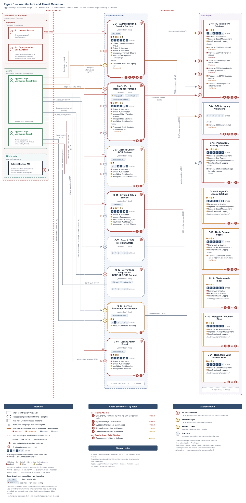

Anonymous and authenticated regular users share one card because self-registration is open. Individual flows may still require login.

[Detailed architecture diagram](threat-model-insecure-large-spring-app-v0.6.0b4.figure1-detail.svg)

Role access and finding assignments are listed in [Identified Actors](#identified-actors).

**Figure 2 - Attack Routes and Impact**

Each numbered route names one example finding from the corresponding Top Threats group with its access prerequisite, the register weakness it is linked to, and the group's potential business harm, which depends on deployment and affected assets. W-IDs in parentheses link the example to an existing weakness. The attack step, affected component and technical consequence remain in the SVG tooltips and the findings register. Red arrows indicate attacks; dashed red arrows involve a victim; grey arrows lead to potential harm.

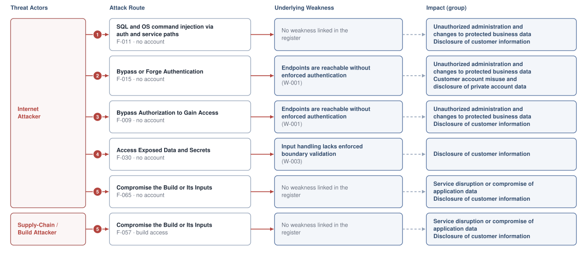

**Threat actors.** The actors below drive the numbered attack paths in the figures above.

- **Internet Attacker** — can self-register a regular account; drives ① Insecure Query Construction & Data Access, ② Hardcoded Secrets & Weak Cryptography, ③ Broken Authorization & Access Control, ④ Sensitive File & Secret Exposure, ⑤ Build Pipeline & Dependency Integrity.
- **Supply-Chain / Build Attacker** — compromises a dependency or build pipeline, or contributes malicious code to a public repo; drives ⑤ Build Pipeline & Dependency Integrity.

**5 structural threats**, grouped by weakness class - each row is one threat, not one finding. *Threat Description* states the general architectural weakness (STRIDE in brackets); *Findings* lists the concrete instances, each linked to [§8 Findings Register](#8-findings-register) with its component; *Risk & Impact* combines severity with business consequence.

| # | Threat Description | Findings (→ Component) | Risk & Impact | Fix |
|---|------------------------------------|------------------------------------------------|------------------------------------|--------|
| <a id="path-injection"></a>① | **Insecure Query Construction & Data Access** _(T·I)_<br/>String interpolation into SQL and shell commands allows direct database record reads and writes and arbitrary operating system command execution without any authentication. | <span style="white-space:nowrap">🔴&nbsp;[F-011](#f-011)</span> - SQL Injection (`LegacySqliteUserStore.java:64`) <span style="white-space:nowrap">→&nbsp;[C-01](#c-01)</span>&nbsp;Authentication & Session Surface<br/><span style="white-space:nowrap">🟠&nbsp;[F-025](#f-025)</span> - OS Command Injection (`LandscapeExposureSupport.java:48`) <span style="white-space:nowrap">→&nbsp;[C-07](#c-07)</span>&nbsp;Service Landscape Orchestrator | 🔴 **Critical**<br/>Full Admin Takeover · Customer Data Exfiltration | <span style="white-space:nowrap">● [M-023](#m-023)</span> — Use parameterized database queries<br/><span style="white-space:nowrap">◕ [M-037](#m-037)</span> — Avoid the shell; pass a fixed argv array with validated, allow-listed arguments |
| <a id="path-auth-bypass"></a>② | **Hardcoded Secrets & Weak Cryptography** _(S·E)_<br/>Predictable and unsigned session tokens, hardcoded signing keys, and unauthenticated token issuance endpoints allow any caller to assume the identity of any user, including administrators. | <span style="white-space:nowrap">🟠&nbsp;[F-001](#f-001)</span> - Hardcoded Root Service Credentials in Repository (`docker-compose.yml:422`) <span style="white-space:nowrap">→&nbsp;[C-20](#c-20)</span>&nbsp;MinIO Object Store<br/><span style="white-space:nowrap">🟠&nbsp;[F-003](#f-003)</span> - Hardcoded Secrets Committed to Version Control (`LegacySqliteUserStore.java:39`) <span style="white-space:nowrap">→&nbsp;[C-01](#c-01)</span>&nbsp;Authentication & Session Surface<br/><span style="white-space:nowrap">🔴&nbsp;[F-007](#f-007)</span> - Forgeable Base64 Session Token (`HomegrownSessionService.java:21`) <span style="white-space:nowrap">→&nbsp;[C-01](#c-01)</span>&nbsp;Authentication & Session Surface<br/><span style="white-space:nowrap">🔴&nbsp;[F-015](#f-015)</span> - Unauthenticated Token Issuance for Arbitrary `userId` (`AuthController.java:37`) <span style="white-space:nowrap">→&nbsp;[C-01](#c-01)</span>&nbsp;Authentication & Session Surface<br/><span style="white-space:nowrap">🟠&nbsp;[F-020](#f-020)</span> - Improper Signature Verification (`LegacyJwtVerifier.java:15`) <span style="white-space:nowrap">→&nbsp;[C-01](#c-01)</span>&nbsp;Authentication & Session Surface<br/><span style="white-space:nowrap">🟠&nbsp;[F-021](#f-021)</span> - Unsigned XOR token accepted as identity proof (`CustomCryptoService.java:24`) <span style="white-space:nowrap">→&nbsp;[C-04](#c-04)</span>&nbsp;Crypto & Token Service<br/><span style="white-space:nowrap">🟠&nbsp;[F-028](#f-028)</span> - JWT parsed without signature verification (`LegacyJwtVerifier.java:17`) <span style="white-space:nowrap">→&nbsp;[C-01](#c-01)</span>&nbsp;Authentication & Session Surface<br/><span style="white-space:nowrap">🟠&nbsp;[F-038](#f-038)</span> - Hardcoded XOR key enables offline vault-credential (`HomegrownCipher.java:8`) <span style="white-space:nowrap">→&nbsp;[C-04](#c-04)</span>&nbsp;Crypto & Token Service<br/><span style="white-space:nowrap">🟠&nbsp;[F-045](#f-045)</span> - Hardcoded JWT signing key in environment variable (`docker-compose.yml:44`) <span style="white-space:nowrap">→&nbsp;[C-17](#c-17)</span>&nbsp;Redis Session Cache<br/><span style="white-space:nowrap">🟠&nbsp;[F-023](#f-023)</span> - Improper Authentication (`docker-compose.yml:378`) <span style="white-space:nowrap">→&nbsp;[C-16](#c-16)</span>&nbsp;PostgreSQL Legacy Database<br/><span style="white-space:nowrap">🟠&nbsp;[F-026](#f-026)</span> - Hand-rolled XOR / repeating-key cipher (`HomegrownCipher.java:14`) <span style="white-space:nowrap">→&nbsp;[C-04](#c-04)</span>&nbsp;Crypto & Token Service<br/><span style="white-space:nowrap">🟠&nbsp;[F-027](#f-027)</span> - Non-cryptographic RNG in a security module Java (`LegacyTokenService.java:10`) <span style="white-space:nowrap">→&nbsp;[C-04](#c-04)</span>&nbsp;Crypto & Token Service<br/><span style="white-space:nowrap">🟠&nbsp;[F-032](#f-032)</span> - AES/ECB with hardcoded key lacks ciphertext (`LegacyCryptoService.java:17`) <span style="white-space:nowrap">→&nbsp;[C-04](#c-04)</span>&nbsp;Crypto & Token Service<br/><span style="white-space:nowrap">🟠&nbsp;[F-039](#f-039)</span> - Unsalted `MD5` password hash allows rainbow-table (`LegacyPasswordService.java:15`) <span style="white-space:nowrap">→&nbsp;[C-04](#c-04)</span>&nbsp;Crypto & Token Service<br/><span style="white-space:nowrap">🟠&nbsp;[F-046](#f-046)</span> - Plaintext password storage and retrieval (`LegacySqliteUserStore.java:107`) <span style="white-space:nowrap">→&nbsp;[C-01](#c-01)</span>&nbsp;Authentication & Session Surface | 🔴 **Critical**<br/>Full Admin Takeover · Customer Session Hijack | <span style="white-space:nowrap">● [M-019](#m-019)</span> — Harden the authentication flow<br/><span style="white-space:nowrap">● [M-027](#m-027)</span> — Require authentication on every exposed endpoint |
| <a id="path-privilege-escalation"></a>③ | **Broken Authorization & Access Control** _(E·I)_<br/>User promotion, account deletion, credential exposure, and database management endpoints are accessible without any authentication, giving any caller immediate administrative control over the application. | <span style="white-space:nowrap">🔴&nbsp;[F-009](#f-009)</span> - Missing Authentication for Admin Board (`LegacyAdminBoardController.java:22`) <span style="white-space:nowrap">→&nbsp;[C-08](#c-08)</span>&nbsp;Legacy Admin Board<br/><span style="white-space:nowrap">🔴&nbsp;[F-012](#f-012)</span> - Missing Authorization on Privileged (`LegacyAdminBoardController.java:33`) <span style="white-space:nowrap">→&nbsp;[C-08](#c-08)</span>&nbsp;Legacy Admin Board<br/><span style="white-space:nowrap">🔴&nbsp;[F-013](#f-013)</span> - Unauthenticated Endpoint Exposes All User (`LegacySqliteAuthController.java:65`) <span style="white-space:nowrap">→&nbsp;[C-01](#c-01)</span>&nbsp;Authentication & Session Surface<br/><span style="white-space:nowrap">🔴&nbsp;[F-014](#f-014)</span> - Missing Authorization on User Deletion (`LegacyAdminBoardController.java:39`) <span style="white-space:nowrap">→&nbsp;[C-08](#c-08)</span>&nbsp;Legacy Admin Board<br/><span style="white-space:nowrap">🔴&nbsp;[F-016](#f-016)</span> - Unauthenticated H2 database console (`SecurityConfig.java:32`) <span style="white-space:nowrap">→&nbsp;[C-02](#c-02)</span>&nbsp;Web UI / Backend-for-Frontend<br/><span style="white-space:nowrap">🔴&nbsp;[F-017](#f-017)</span> - Missing authorization on (`CustomCryptoController.java:39`) <span style="white-space:nowrap">→&nbsp;[C-04](#c-04)</span>&nbsp;Crypto & Token Service<br/><span style="white-space:nowrap">🔴&nbsp;[F-018](#f-018)</span> - PermitAll H2 console allows unauthenticated full (`SecurityConfig.java:32`) <span style="white-space:nowrap">→&nbsp;[C-02](#c-02)</span>&nbsp;Web UI / Backend-for-Frontend<br/><span style="white-space:nowrap">🔴&nbsp;[F-019](#f-019)</span> - Unauthenticated Privilege Escalation (`LegacyAdminBoardController.java:31`) <span style="white-space:nowrap">→&nbsp;[C-08](#c-08)</span>&nbsp;Legacy Admin Board<br/><span style="white-space:nowrap">🟠&nbsp;[F-022](#f-022)</span> - Authentication absent on Elasticsearch REST API (`docker-compose.yml:411`) <span style="white-space:nowrap">→&nbsp;[C-18](#c-18)</span>&nbsp;Elasticsearch Index<br/><span style="white-space:nowrap">🟠&nbsp;[F-033](#f-033)</span> - Unauthenticated write and delete on all indices (`docker-compose.yml:411`) <span style="white-space:nowrap">→&nbsp;[C-18](#c-18)</span>&nbsp;Elasticsearch Index<br/><span style="white-space:nowrap">🟠&nbsp;[F-051](#f-051)</span> - Unauthenticated legacy admin board (`SecurityConfig.java:41`) <span style="white-space:nowrap">→&nbsp;[C-02](#c-02)</span>&nbsp;Web UI / Backend-for-Frontend<br/><span style="white-space:nowrap">🟠&nbsp;[F-052](#f-052)</span> - Unauthenticated cluster admin API access (`docker-compose.yml:411`) <span style="white-space:nowrap">→&nbsp;[C-18](#c-18)</span>&nbsp;Elasticsearch Index<br/><span style="white-space:nowrap">🟠&nbsp;[F-005](#f-005)</span> - Mass Assignment Enables Privilege Escalation (`ProfileController.java:44`) <span style="white-space:nowrap">→&nbsp;[C-03](#c-03)</span>&nbsp;Access Control / IDOR Surface<br/><span style="white-space:nowrap">🟠&nbsp;[F-037](#f-037)</span> - Wildcard IAM Permissions on All Resources (`main.tf:217`) <span style="white-space:nowrap">→&nbsp;[C-01](#c-01)</span>&nbsp;Authentication & Session Surface<br/><span style="white-space:nowrap">🟠&nbsp;[F-050](#f-050)</span> - IDOR on order fetch no ownership check (`OrderAccessController.java:24`) <span style="white-space:nowrap">→&nbsp;[C-03](#c-03)</span>&nbsp;Access Control / IDOR Surface<br/><span style="white-space:nowrap">🟠&nbsp;[F-053](#f-053)</span> - No per-service access policies allows any data-zone (`docker-compose.yml:422`) <span style="white-space:nowrap">→&nbsp;[C-20](#c-20)</span>&nbsp;MinIO Object Store<br/><span style="white-space:nowrap">🟠&nbsp;[F-054](#f-054)</span> - Missing authorization on `/users` endpoint (`LegacySqliteUserStore.java:77`) <span style="white-space:nowrap">→&nbsp;[C-01](#c-01)</span>&nbsp;Authentication & Session Surface | 🔴 **Critical**<br/>Full Admin Takeover · Customer Data Exfiltration | <span style="white-space:nowrap">● [M-021](#m-021)</span> — Require authentication on every exposed endpoint<br/><span style="white-space:nowrap">● [M-024](#m-024)</span> — Enforce server-side authorization on every endpoint |
| <a id="path-sensitive-data-exposure"></a>④ | **Sensitive File & Secret Exposure** _(I)_<br/>Login passwords are written to log files, unauthenticated diagnostic endpoints expose configuration and heap content, and search and session backing stores return sensitive data without any authentication. | <span style="white-space:nowrap">🟠&nbsp;[F-034](#f-034)</span> - Unauthenticated admin report endpoint exposes (`AdminReportController.java:35`) <span style="white-space:nowrap">→&nbsp;[C-03](#c-03)</span>&nbsp;Access Control / IDOR Surface<br/><span style="white-space:nowrap">🟠&nbsp;[F-035](#f-035)</span> - Cleartext Credentials Written to Application (`CredentialLoggingFilter.java:25`) <span style="white-space:nowrap">→&nbsp;[C-01](#c-01)</span>&nbsp;Authentication & Session Surface<br/><span style="white-space:nowrap">🟠&nbsp;[F-036](#f-036)</span> - Unauthenticated actuator endpoints (`SecurityConfig.java:33`) <span style="white-space:nowrap">→&nbsp;[C-02](#c-02)</span>&nbsp;Web UI / Backend-for-Frontend<br/><span style="white-space:nowrap">🟠&nbsp;[F-040](#f-040)</span> - Sensitive indexed fields exposed without authentication (`docker-compose.yml:411`) <span style="white-space:nowrap">→&nbsp;[C-18](#c-18)</span>&nbsp;Elasticsearch Index<br/><span style="white-space:nowrap">🟠&nbsp;[F-042](#f-042)</span> - Plaintext MongoDB root password committed to source (`docker-compose.yml:390`) <span style="white-space:nowrap">→&nbsp;[C-19](#c-19)</span>&nbsp;MongoDB Document Store<br/><span style="white-space:nowrap">🟠&nbsp;[F-043](#f-043)</span> - Cleartext Database Credential in Version-Controlled (`docker-compose.yml:366`) <span style="white-space:nowrap">→&nbsp;[C-15](#c-15)</span>&nbsp;PostgreSQL Primary Database<br/><span style="white-space:nowrap">🟠&nbsp;[F-044](#f-044)</span> - Unauthenticated Redis exposes session tokens and (`docker-compose.yml:397`) <span style="white-space:nowrap">→&nbsp;[C-17](#c-17)</span>&nbsp;Redis Session Cache<br/><span style="white-space:nowrap">🟠&nbsp;[F-030](#f-030)</span> - Path traversal (`BusinessFileStorage.java:23`) <span style="white-space:nowrap">→&nbsp;[C-02](#c-02)</span>&nbsp;Web UI / Backend-for-Frontend<br/><span style="white-space:nowrap">🟠&nbsp;[F-041](#f-041)</span> - Unauthenticated Directory Listing of Users (`LegacyAdminBoardController.java:24`) <span style="white-space:nowrap">→&nbsp;[C-08](#c-08)</span>&nbsp;Legacy Admin Board<br/><span style="white-space:nowrap">🟡&nbsp;[F-063](#f-063)</span> - Unencrypted Data Store at Rest (`main.tf:147`) <span style="white-space:nowrap">→&nbsp;[C-01](#c-01)</span>&nbsp;Authentication & Session Surface | 🟠 **High**<br/>Customer Data Exfiltration | <span style="white-space:nowrap">◕ [M-045](#m-045)</span> — Require authentication on every exposed endpoint<br/><span style="white-space:nowrap">◕ [M-046](#m-046)</span> — Remove credential logging from CredentialLoggingFilter and log only username with no |
| <a id="path-supply-chain"></a>⑤ | **Build Pipeline & Dependency Integrity** _(T·E)_<br/>a dependency, build input, pipeline step or published artifact can be replaced or altered, so attacker-controlled code reaches the shipped application. | <span style="white-space:nowrap">🟡&nbsp;[F-057](#f-057)</span> - Unpinned image digest allows container substitution (`docker-compose.yml:407`) <span style="white-space:nowrap">→&nbsp;[C-18](#c-18)</span>&nbsp;Elasticsearch Index<br/><span style="white-space:nowrap">🟡&nbsp;[F-058](#f-058)</span> - Unpinned minio/minio image allows supply-chain substitution (`docker-compose.yml:419`) <span style="white-space:nowrap">→&nbsp;[C-20](#c-20)</span>&nbsp;MinIO Object Store<br/><span style="white-space:nowrap">🟡&nbsp;[F-059](#f-059)</span> - Floating mongo:7 image tag without digest allows image (`docker-compose.yml:387`) <span style="white-space:nowrap">→&nbsp;[C-19](#c-19)</span>&nbsp;MongoDB Document Store<br/><span style="white-space:nowrap">🟡&nbsp;[F-060](#f-060)</span> - Unpinned Container Image Tag Allows Undetected Image Substitution (`docker-compose.yml:375`) <span style="white-space:nowrap">→&nbsp;[C-16](#c-16)</span>&nbsp;PostgreSQL Legacy Database<br/><span style="white-space:nowrap">🟡&nbsp;[F-064](#f-064)</span> - Unpinned Container Base Image - `Dockerfile:1` (`Dockerfile:1`) <span style="white-space:nowrap">→&nbsp;[C-01](#c-01)</span>&nbsp;Authentication & Session Surface<br/><span style="white-space:nowrap">🟡&nbsp;[F-065](#f-065)</span> - Missing npm Lockfile (`package-lock.json:0`) <span style="white-space:nowrap">→&nbsp;[C-01](#c-01)</span>&nbsp;Authentication & Session Surface | 🟡 **Medium**<br/>Full Server Compromise · Customer Data Exfiltration | <span style="white-space:nowrap">◑ [M-067](#m-067)</span> — Pin third-party dependencies to immutable versions<br/><span style="white-space:nowrap">◑ [M-068](#m-068)</span> — Pin the container base image to an immutable digest |

_STRIDE: S spoofing · T tampering · R repudiation · I information disclosure · D denial of service · E elevation of privilege. Risk, findings, components, impact and Fix are derived deterministically; only the one-line weakness description is authored._

**Verified attack chains.** 3 fully viable ([AC-T-003](#ac-t-003), [AC-T-002](#ac-t-002), [AC-T-004](#ac-t-004)). These chains combine individual findings into end-to-end exploitation paths verified step-by-step against the code - see [§9 Abuse Cases](#9-abuse-cases) for the per-step breakdown and blocking mitigations.

### Top Mitigations

Highest-impact P1/P2 mitigations - 19 of 51 qualifying (76 total). Full detail in [§10 Mitigation Register](#10-mitigation-register). All 19 mitigation(s) that fix a Critical finding are always listed here.

| # | Component | Mitigation | Addresses | Effort |
|---|----------------------|------------------------------------------------|------------------------------------------------|------|
| **1** | [C-01](#c-01) — Authentication & Session Surface | ● [M-023](#m-023) — Use parameterized database queries (`LegacySqliteUserStore.java:64`) | 🔴 [F-011](#f-011) — SQL Injection (`LegacySqliteUserStore.java`) | Low |
| **2** | [C-01](#c-01) — Authentication & Session Surface | ● [M-025](#m-025) — Enforce server-side authorization on every endpoint (`LegacySqliteAuthController.java:65`) | 🔴 [F-013](#f-013) — Unauthenticated Endpoint Exposes All User (`LegacySqliteAuthController.java`) | Low |
| **3** | [C-01](#c-01) — Authentication & Session Surface | ● [M-027](#m-027) — Require authentication on every exposed endpoint (`AuthController.java:37`) | 🔴 [F-015](#f-015) — Unauthenticated Token Issuance for Arbitrary userId (`AuthController.java`) | Low |
| **4** | [C-01](#c-01) — Authentication & Session Surface | ● [M-019](#m-019) — Harden the authentication flow (`HomegrownSessionService.java:21`) | 🔴 [F-007](#f-007) — Forgeable Base64 Session Token (`HomegrownSessionService.java`) | Medium |
| **5** | [C-02](#c-02) — Web UI / Backend-for-Frontend | ● [M-028](#m-028) — Require authentication on every exposed endpoint (`SecurityConfig.java:32`) | 🔴 [F-016](#f-016) — Unauthenticated H2 database console (`SecurityConfig.java`) | Low |
| **6** | [C-02](#c-02) — Web UI / Backend-for-Frontend | ● [M-030](#m-030) — Enforce server-side authorization on every endpoint (`SecurityConfig.java:32`) | 🔴 [F-018](#f-018) — PermitAll H2 console allows unauthenticated full (`SecurityConfig.java`) | Low |
| **7** | [C-04](#c-04) — Crypto & Token Service | ● [M-029](#m-029) — Enforce server-side authorization on every endpoint (`CustomCryptoController.java:39`) | 🔴 [F-017](#f-017) — Missing authorization on (`CustomCryptoController.java`) | Low |
| **8** | [C-08](#c-08) — Legacy Admin Board | ● [M-021](#m-021) — Require authentication on every exposed endpoint (`LegacyAdminBoardController.java:22`) | 🔴 [F-009](#f-009) — Missing Authentication for Admin Board (`LegacyAdminBoardController.java`) | Low |
| **9** | [C-08](#c-08) — Legacy Admin Board | ● [M-024](#m-024) — Enforce server-side authorization on every endpoint (`LegacyAdminBoardController.java:33`) | 🔴 [F-012](#f-012) — Missing Authorization on Privileged (`LegacyAdminBoardController.java`) | Low |
| **10** | [C-08](#c-08) — Legacy Admin Board | ● [M-026](#m-026) — Enforce server-side authorization on every endpoint (`LegacyAdminBoardController.java:39`) | 🔴 [F-014](#f-014) — Missing Authorization on User Deletion (`LegacyAdminBoardController.java`) | Low |
| **11** | [C-08](#c-08) — Legacy Admin Board | ● [M-031](#m-031) — Enforce server-side authorization (`LegacyAdminBoardController.java:31`) | 🔴 [F-019](#f-019) — Unauthenticated Privilege Escalation (`LegacyAdminBoardController.java`) | Low |
| **12** | [C-13](#c-13) — H2 In-Memory Database | ● [M-020](#m-020) — Set a strong H2 SA password in `application.yml` and restrict `/h2-console` to authenticated (`application.yml:8`) | 🔴 [F-008](#f-008) — Empty SA password enables credential-free console login (`application.yml`) | Low |
| **13** | [C-15](#c-15) — PostgreSQL Primary Database | ● [M-022](#m-022) — Use a unique secret per credential record (`docker-compose.yml:366`) | 🔴 [F-010](#f-010) — Hard-coded Superuser Password (`docker-compose.yml`) | Medium |
| **14** | [C-01](#c-01) — Authentication & Session Surface | ◕ [M-040](#m-040) — Enforce JWT signature and algorithm verification (`LegacyJwtVerifier.java:17`) | 🟠 [F-028](#f-028) — JWT parsed without signature verification (`LegacyJwtVerifier.java`) | Medium |
| **15** | [C-03](#c-03) — Access Control / IDOR Surface | ◕ [M-017](#m-017) — Allowlist client-controlled fields (`ProfileController.java:44`) | 🟠 [F-005](#f-005) — Mass Assignment Enables Privilege Escalation (`src/main/java/com/example/appsecverificationtarget/accesscontrol/ProfileController.java`) | Low |
| **16** | [C-13](#c-13) — H2 In-Memory Database | ◕ [M-057](#m-057) — Require authentication on every exposed endpoint (`application.yml:11`) | 🟠 [F-047](#f-047) — Unauthenticated H2 console allows table drops against (`application.yml`) | Low |
| **17** | [C-17](#c-17) — Redis Session Cache | ◕ [M-036](#m-036) — Require authentication on every exposed endpoint (`docker-compose.yml:397`) | 🟠 [F-024](#f-024) — Missing Redis AUTH configuration (`docker-compose.yml`) | Low |
| **18** | [C-17](#c-17) — Redis Session Cache | ◕ [M-058](#m-058) — Require authentication on every exposed endpoint (`docker-compose.yml:397`) | 🟠 [F-048](#f-048) — Unauthenticated Redis allows FLUSHALL-based session (`docker-compose.yml`) | Low |
| **19** | [C-18](#c-18) — Elasticsearch Index | ◕ [M-034](#m-034) — Require authentication on every exposed endpoint (`docker-compose.yml:411`) | 🟠 [F-022](#f-022) — Authentication absent on Elasticsearch REST API (`docker-compose.yml`) | Low |

*32 additional P1/P2 mitigations capped from the leader-board · 25 P3 backlog items in [§10 Mitigation Register](#10-mitigation-register). Sorted by priority (P1 first), then declared business context, then component, then leverage (most findings first), severity (Critical first), and effort (Low first).*

### Operational Strengths

Operational controls rated Adequate or Partial - grouped into broad clusters (full per-control breakdown in [§6](#6-security-architecture)). Clusters demoted to Weak by open Critical/High findings appear in [§6](#6-security-architecture) instead, not here.

<table style="table-layout:fixed;width:100%">
<colgroup><col width="20%" style="width:20%"><col width="33%" style="width:33%"><col width="47%" style="width:47%"></colgroup>
<thead><tr><th>Strength</th><th>What's in Place</th><th>Effectiveness</th></tr></thead>
<tbody>
<tr><td style="overflow-wrap:break-word"><strong>Container &amp; Supply-Chain Hardening</strong></td><td style="overflow-wrap:break-word"><em>Build-time and runtime hardening - minimal base image, non-root execution, dependency inventory.</em><br/>Lockfile hygiene<br/>Schema / Allowlist Input Validation</td><td style="overflow-wrap:break-word">✅ Adequate</td></tr>
</tbody>
</table>


**Bottom line:** These controls narrow specific attack surfaces but none eliminates a Critical finding on its own.

---

<a id="critical-attack-chain"></a><a id="critical-attack-tree"></a>
## Critical Attack Tree

The root is the worst-case attacker goal; below it, each capability branch groups the Critical findings that achieve it. Branches feed the goal by OR - any single path suffices.

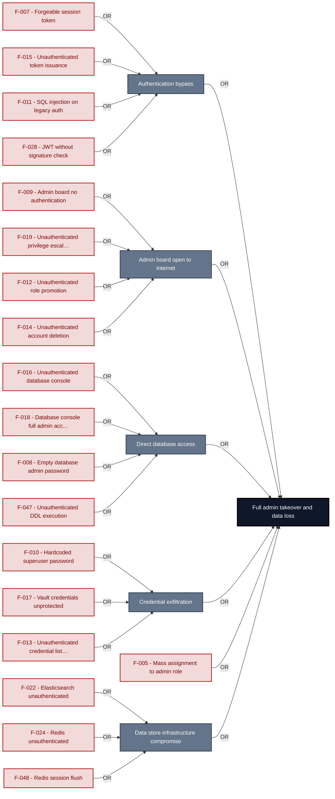

**Findings** (full detail in [§8 Findings Register](#8-findings-register)): [F-007](#f-007) · [F-015](#f-015) · [F-011](#f-011) · [F-028](#f-028) · [F-009](#f-009) · [F-019](#f-019) · [F-012](#f-012) · [F-014](#f-014) · [F-016](#f-016) · [F-018](#f-018) · [F-008](#f-008) · [F-047](#f-047) · [F-010](#f-010) · [F-017](#f-017) · [F-013](#f-013) · [F-005](#f-005) · [F-022](#f-022) · [F-024](#f-024) · [F-048](#f-048)

---

## 1. System Overview

**Repository:** git@`github.com:matthiasrohr`/insecure-large-spring-`app.git`

### Scope

insecure-large-spring-app comprises **21** modeled components; **12 of 21** were analysed with full STRIDE: **Authentication & Session Surface**, **Web UI / Backend-for-Frontend**, **Legacy Admin Board**, **H2 In-Memory Database**, **SQLite Legacy Auth Store**, **PostgreSQL Primary Database**, **PostgreSQL Legacy Database**, **Redis Session Cache**, **Elasticsearch Index**, **MongoDB Document Store**, **MinIO Object Store**, **HashiCorp Vault Secrets Store**. Selection criteria: auth; internet-exposed; crown-jewel; frontend attack surface; light depth; data-store.

**Access Control / IDOR Surface** and **Crypto & Token Service** were only screened, a shorter pass without follow-up code checks per finding.

Not analysed at this depth: Search / SQL Injection Surface, Server-Side Integration / SSRF-XXE-RCE Surface, Service Landscape Orchestrator, CORS Policy Service, CSRF Demo Service, Output Rendering Service, Clean Reference Implementation; a higher `--assessment-depth` covers them.

**Out of scope:** third-party hosted dependencies, browser runtime, operating-system kernel, and the underlying network infrastructure.

**Basis:** An automated, AI-assisted threat model built from the repository's source code and configuration - static analysis only, no dynamic or penetration testing. It describes the system as built, not as designed.

---

<a id="identified-actors"></a>
### Identified Actors

Figure 1 draws **Internet Attacker** and **Supply-Chain / Build Attacker** as attackers and **Appsec Large Verification Target User** and **Appsec Large Verification Target Admin** as legitimate roles of Appsec Large Verification Target. Each row gives that actor's access and the findings attributed to it.

| Actor | Type | Access | Scenarios | Attributed findings |
|----------------------|---------------|----------------------|--------------|-------------------|
| A1 · Internet Attacker | Attacker | can self-register a regular account | ① ② ③ ④ ⑤ | 🔴 10 · 🟠 18 · 🟡 9 |
| A2 · Supply-Chain / Build Attacker | Attacker | compromises a dependency or build pipeline,<br/>or contributes malicious code to a public<br/>repo | ⑤ | - |
| Appsec Large Verification Target User | Role | anonymous or self-registered | - | - |
| Appsec Large Verification Target Admin | Privileged role | Authenticated admin or operations user with<br/>elevated roles (ROLE\_ADMIN,<br/>ROLE\_OPERATIONS, ROLE\_TENANT\_ADMIN).<br/>Accesses admin user management and landscape<br/>lifecycle endpoints. | - | - |

---

### Trust Boundaries

Canonical boundary crossings. **Assumption & verdict** names the condition that makes each crossing safe and whether this report still supports it, judged one condition at a time - which conditions apply follows from the direction of the crossing.

<table style="table-layout:fixed;width:100%">
<colgroup><col width="6%" style="width:6%"><col width="25%" style="width:25%"><col width="11%" style="width:11%"><col width="15%" style="width:15%"><col width="25%" style="width:25%"><col width="18%" style="width:18%"></colgroup>
<thead><tr><th>ID</th><th>Boundary / crossing</th><th>Exposure</th><th>Kind</th><th>Assumption &amp; verdict</th><th>Linked findings</th></tr></thead>
<tbody>
<tr><td style="white-space:nowrap"><a id="tb-1"></a>tb-1</td><td style="overflow-wrap:break-word"><strong>external → bff-web</strong><br/>Control: SecurityConfig SecurityFilterChain form-login</td><td>🌐 <strong>External</strong></td><td style="overflow-wrap:break-word">network</td><td style="overflow-wrap:break-word">Requests to protected UI routes are blocked by Spring Security's filter chain unless the caller holds a valid session.<br/><em>confirmed</em><br/>Validation: in doubt · 2 related · <a href="#66-input-boundary-validation-controls">§6.6</a><br/>Authentication: <strong>broken</strong> · <a href="#62-identity-and-authentication-controls">§6.2</a><br/>Authorization: in doubt · 2 related · <a href="#64-authorization-controls">§6.4</a></td><td style="overflow-wrap:break-word"><em>Authentication</em><br/>🔴 <a href="#f-016">F-016</a><br/>🟠 <a href="#f-031">F-031</a><br/>🟡 <a href="#f-055">F-055</a></td></tr>
<tr><td style="white-space:nowrap"><a id="tb-2"></a>tb-2</td><td style="overflow-wrap:break-word"><strong>external → access-control</strong><br/>Control: SecurityConfig anyRequest().authenticated()</td><td>🌐 <strong>External</strong></td><td style="overflow-wrap:break-word">network</td><td style="overflow-wrap:break-word">Every request to IDOR-surface API routes must carry a valid session; ownership of referenced objects is verified before data is returned.<br/><em>confirmed</em><br/>Validation: in doubt · 1 related · <a href="#66-input-boundary-validation-controls">§6.6</a><br/>Authentication: <em>not examined</em> · <a href="#62-identity-and-authentication-controls">§6.2</a><br/>Authorization: <strong>broken</strong> · <a href="#64-authorization-controls">§6.4</a></td><td style="overflow-wrap:break-word"><em>Authorization</em><br/>🟠 <a href="#f-050">F-050</a><br/><em>Unattributed</em><br/>🟠 <a href="#f-034">F-034</a></td></tr>
<tr><td style="white-space:nowrap"><a id="tb-3"></a>tb-3</td><td style="overflow-wrap:break-word"><strong>external → legacy-admin</strong><br/>Control: none identified</td><td>🌐 <strong>External</strong></td><td style="overflow-wrap:break-word">network</td><td style="overflow-wrap:break-word">Any caller reaching /legacy/admin/<strong> is processed by LegacyAdminBoardController without any authentication gate.&lt;br&gt;_confirmed_&lt;br&gt;Validation: _not examined_ · [§6.6](#66-input-boundary-validation-controls)&lt;br&gt;Authentication: </strong>broken<strong> · [§6.2](#62-identity-and-authentication-controls)&lt;br&gt;Authorization: </strong>broken** · 2 related · <a href="#64-authorization-controls">§6.4</a></td><td style="overflow-wrap:break-word"><em>Authentication</em><br/>🔴 <a href="#f-009">F-009</a><br/><em>Authorization</em><br/>🔴 <a href="#f-019">F-019</a></td></tr>
<tr><td style="white-space:nowrap"><a id="tb-4"></a>tb-4</td><td style="overflow-wrap:break-word"><strong>external → auth</strong><br/>Control: Spring Security UsernamePasswordAuthenticationFilter</td><td>🌐 <strong>External</strong></td><td style="overflow-wrap:break-word">network</td><td style="overflow-wrap:break-word">A session is issued only after Spring Security's authentication filters successfully validate the submitted credentials.<br/><em>confirmed</em><br/>Validation: in doubt · 1 related · <a href="#66-input-boundary-validation-controls">§6.6</a><br/>Authentication: <strong>broken</strong> · 4 related · <a href="#62-identity-and-authentication-controls">§6.2</a><br/>Authorization: in doubt · 3 related · <a href="#64-authorization-controls">§6.4</a></td><td style="overflow-wrap:break-word"><em>Authentication</em><br/>🟠 <a href="#f-020">F-020</a></td></tr>
<tr><td style="white-space:nowrap"><a id="tb-5"></a>tb-5</td><td style="overflow-wrap:break-word"><strong>external → crypto-service</strong><br/>Control: none identified</td><td>🌐 <strong>External</strong></td><td style="overflow-wrap:break-word">network</td><td style="overflow-wrap:break-word">Requests to /api/crypto/<strong> and /api/legacy-crypto/</strong> are processed by authenticated callers only.<br/><em>confirmed</em><br/>Validation: <em>not examined</em> · <a href="#66-input-boundary-validation-controls">§6.6</a><br/>Authentication: in doubt · 2 related · <a href="#62-identity-and-authentication-controls">§6.2</a><br/>Authorization: <em>not examined</em> · <a href="#64-authorization-controls">§6.4</a></td><td style="overflow-wrap:break-word"><em>Unattributed</em><br/>🔴 <a href="#f-017">F-017</a></td></tr>
<tr><td style="white-space:nowrap"><a id="tb-6"></a>tb-6</td><td style="overflow-wrap:break-word"><strong>external → search-service</strong><br/>Control: none identified</td><td>🌐 <strong>External</strong></td><td style="overflow-wrap:break-word">network</td><td style="overflow-wrap:break-word">Search query parameters reaching DocumentSearchController and OrderSearchController are validated before use in SQL statements.<br/><em>confirmed</em><br/><em>No finding contradicts it.</em></td><td style="overflow-wrap:break-word">-</td></tr>
<tr><td style="white-space:nowrap"><a id="tb-7"></a>tb-7</td><td style="overflow-wrap:break-word"><strong>external → serverside-integration</strong><br/>Control: none identified</td><td>🌐 <strong>External</strong></td><td style="overflow-wrap:break-word">network</td><td style="overflow-wrap:break-word">XML documents and URL parameters submitted to server-side integration endpoints are validated before being parsed or fetched.<br/><em>confirmed</em><br/><em>No finding contradicts it.</em></td><td style="overflow-wrap:break-word">-</td></tr>
<tr><td style="white-space:nowrap"><a id="tb-8"></a>tb-8</td><td style="overflow-wrap:break-word"><strong>external → csrf-service</strong><br/>Control: SecurityConfig global CSRF disabled</td><td>🌐 <strong>External</strong></td><td style="overflow-wrap:break-word">network</td><td style="overflow-wrap:break-word">State-changing requests to /csrf/settings are permitted only from authenticated sessions with a verified CSRF token.<br/><em>confirmed</em><br/><em>No finding contradicts it.</em></td><td style="overflow-wrap:break-word">-</td></tr>
<tr><td style="white-space:nowrap"><a id="tb-9"></a>tb-9</td><td style="overflow-wrap:break-word"><strong>external → cors-service</strong><br/>Control: CorsPolicyFilter reflected-origin header</td><td>◐ <strong>Unverified</strong></td><td style="overflow-wrap:break-word">network</td><td style="overflow-wrap:break-word">Cross-origin requests to CORS endpoints are permitted only from origins present on an explicit allow-list.<br/><em>inferred</em><br/><em>No finding contradicts it.</em></td><td style="overflow-wrap:break-word">-</td></tr>
<tr><td style="white-space:nowrap"><a id="tb-10"></a>tb-10</td><td style="overflow-wrap:break-word"><strong>external → landscape-orchestrator</strong><br/>Control: Spring Security @PreAuthorize role guards</td><td>◐ <strong>Unverified</strong></td><td style="overflow-wrap:break-word">network</td><td style="overflow-wrap:break-word">Every landscape service route is reached only by callers who hold the required role as verified by @PreAuthorize.<br/><em>inferred</em><br/>Validation: in doubt · 1 related · <a href="#66-input-boundary-validation-controls">§6.6</a><br/>Authentication: <em>not examined</em> · <a href="#62-identity-and-authentication-controls">§6.2</a><br/>Authorization: <em>not examined</em> · <a href="#64-authorization-controls">§6.4</a></td><td style="overflow-wrap:break-word">-</td></tr>
<tr><td style="white-space:nowrap"><a id="tb-11"></a>tb-11</td><td style="overflow-wrap:break-word"><strong>auth → h2-db</strong><br/>Control: Spring Data JPA AppUserRepository</td><td>◐ <strong>Unverified</strong></td><td style="overflow-wrap:break-word">in-process - enforcement interface, no trust transition</td><td style="overflow-wrap:break-word">Every AppUser lookup reaches H2 through Spring Data JPA parameter binding, not raw SQL string concatenation.<br/><em>inferred</em><br/><strong>In doubt</strong> - 2 finding(s) in the components it covers, none linked here.</td><td style="overflow-wrap:break-word">-</td></tr>
<tr><td style="white-space:nowrap"><a id="tb-12"></a>tb-12</td><td style="overflow-wrap:break-word"><strong>bff-web → h2-db</strong><br/>Control: Spring Data JPA DocumentRecordRepository</td><td>◐ <strong>Unverified</strong></td><td style="overflow-wrap:break-word">in-process - enforcement interface, no trust transition</td><td style="overflow-wrap:break-word">All document and order records reach H2 through Spring Data JPA repository methods with parameterized queries.<br/><em>inferred</em><br/><strong>In doubt</strong> - 2 finding(s) in the components it covers, none linked here.</td><td style="overflow-wrap:break-word">-</td></tr>
<tr><td style="white-space:nowrap"><a id="tb-13"></a>tb-13</td><td style="overflow-wrap:break-word"><strong>access-control → h2-db</strong><br/>Control: Spring Data JPA OrderAccessController repositories</td><td>◐ <strong>Unverified</strong></td><td style="overflow-wrap:break-word">in-process - enforcement interface, no trust transition</td><td style="overflow-wrap:break-word">All IDOR-surface record accesses reach H2 through Spring Data JPA repository methods with bound parameters.<br/><em>inferred</em><br/><strong>In doubt</strong> - 2 finding(s) in the components it covers, none linked here.</td><td style="overflow-wrap:break-word">-</td></tr>
<tr><td style="white-space:nowrap"><a id="tb-14"></a>tb-14</td><td style="overflow-wrap:break-word"><strong>crypto-service → h2-db</strong><br/>Control: Spring Data JPA VaultCredentialRepository</td><td>◐ <strong>Unverified</strong></td><td style="overflow-wrap:break-word">in-process - enforcement interface, no trust transition</td><td style="overflow-wrap:break-word">All vault_credentials table access uses Spring Data JPA VaultCredentialRepository with parameterized queries.<br/><em>inferred</em><br/><strong>In doubt</strong> - 2 finding(s) in the components it covers, none linked here.</td><td style="overflow-wrap:break-word">-</td></tr>
<tr><td style="white-space:nowrap"><a id="tb-15"></a>tb-15</td><td style="overflow-wrap:break-word"><strong>search-service → h2-db</strong><br/>Control: EntityManager native SQL in DocumentLookupDao</td><td>◐ <strong>Unverified</strong></td><td style="overflow-wrap:break-word">in-process - enforcement interface, no trust transition</td><td style="overflow-wrap:break-word">Every search query reaches H2 through EntityManager with bound parameters, not string-concatenated SQL.<br/><em>inferred</em><br/><strong>In doubt</strong> - 2 finding(s) in the components it covers, none linked here.</td><td style="overflow-wrap:break-word">-</td></tr>
<tr><td style="white-space:nowrap"><a id="tb-16"></a>tb-16</td><td style="overflow-wrap:break-word"><strong>landscape-orchestrator → postgres-primary-db</strong><br/>Control: Spring Data JPA LandscapePersistence</td><td>◐ <strong>Unverified</strong></td><td style="overflow-wrap:break-word">network</td><td style="overflow-wrap:break-word">All catalog and invocation count queries reach PostgreSQL through Spring Data JPA parameterized methods using deployment-supplied credentials.<br/><em>inferred</em><br/><strong>In doubt</strong> - 3 finding(s) in the components it covers, none linked here.</td><td style="overflow-wrap:break-word">-</td></tr>
<tr><td style="white-space:nowrap"><a id="tb-17"></a>tb-17</td><td style="overflow-wrap:break-word"><strong>serverside-integration → external</strong><br/>Control: none identified</td><td>◐ <strong>Unverified</strong></td><td style="overflow-wrap:break-word">network · operator</td><td style="overflow-wrap:break-word">Nothing attacker-controlled reaches an external HTTP endpoint unfiltered through IntegrationController.<br/><em>inferred</em><br/><em>No finding contradicts it.</em></td><td style="overflow-wrap:break-word">-</td></tr>
<tr><td style="white-space:nowrap"><a id="tb-18"></a>tb-18</td><td style="overflow-wrap:break-word"><strong>auth → sqlite-legacy-db</strong><br/>Control: LegacySqliteUserStore PreparedStatement authenticate()</td><td>🔒 <strong>Internal</strong></td><td style="overflow-wrap:break-word">in-process - enforcement interface, no trust transition</td><td style="overflow-wrap:break-word">Every credential lookup uses LegacySqliteUserStore.authenticate() PreparedStatement binding, not the authenticateRaw() string-concatenation path.<br/><em>confirmed</em><br/>Query construction: <strong>broken</strong> · <a href="#65-query-construction-and-data-access-controls">§6.5</a></td><td style="overflow-wrap:break-word"><em>Query construction</em><br/>🔴 <a href="#f-011">F-011</a></td></tr>
</tbody>
</table>

_Exposure, most exposed first: ⚠ Review (endpoints unresolved) · 🌐 External (reached from outside the model) · ◐ Unverified (crossing not confirmed) · 🔒 Internal (both ends modelled) · ↗ Egress (reaches outside the model)._

_Kind - the crossing mechanism (build pipeline, in-process, network), then after `·` what changes across it: data-origin, identity, operator, privilege, tenant. Shown alone, nothing changes._

_Conditions - **inbound**: validation, authentication, authorization · **outbound**: egress content, egress destination, response trust (replies are untrusted input) · **internal**: query construction (data never becomes program text), authentication, authorization._

_Verdict per condition - **broken**: a linked finding proves the gap · in doubt: related findings, none linked here · not examined: nothing bears on it. `N related` counts further findings on the same condition. Linked findings sit under the condition they break, or under _Unattributed_. A link raises effective severity only at a confirmed internet ingress; raw risk never changes._

_Identical on every row, so stated once here instead of in a column: source `detected` (derived from inspected repository evidence); status `resolved`. Any row that deviates is shown in the table._

---

## 2. Architecture Diagrams

### 2.1 System Context

Who uses and attacks Appsec Large Verification Target, and which external systems it exchanges data with. Solid arrows name the data a flow carries; dashed red arrows are attack routes. Actors carry the names Figure 1 uses (C4 Level 1).

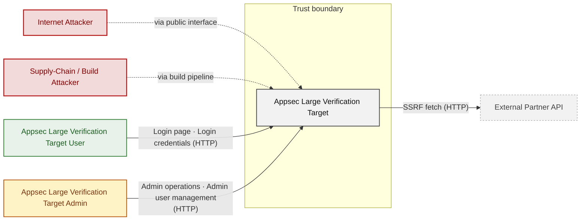

**Key takeaway:** Appsec Large Verification Target serves Appsec Large Verification Target User and Appsec Large Verification Target Admin and depends on External Partner API; Internet Attacker and Supply-Chain / Build Attacker attack it.

### 2.2 Container Architecture

How the system decomposes into deployable units. Each box is a separate runtime process or service container; arrows show synchronous request paths between them. Components with ≥3 Critical findings carry a red border, ≥2 High amber (C4 Level 2).

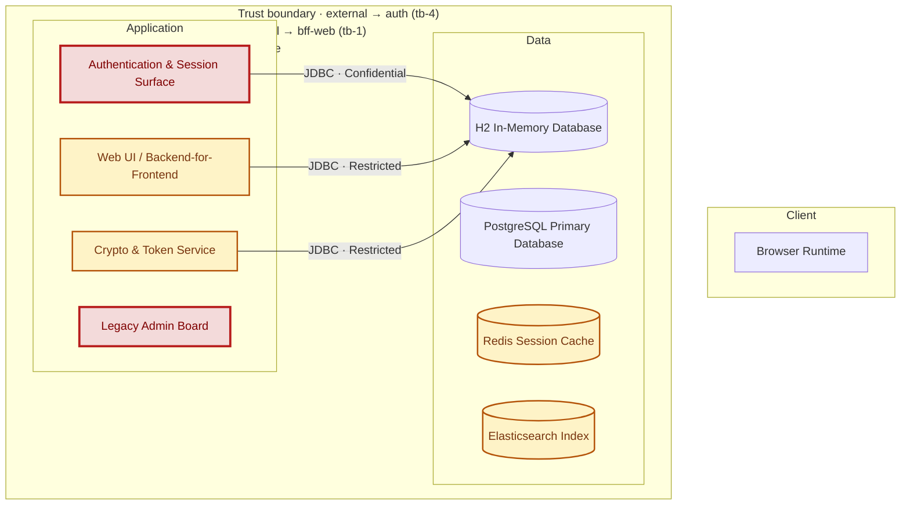

*Not shown (diagram capped at 8 containers): CORS Policy Service, CSRF Demo Service, Clean Reference Implementation, Output Rendering Service, SQLite Legacy Auth Store, Search / SQL Injection Surface, HashiCorp Vault Secrets Store, Server-Side Integration / SSRF-XXE-RCE Surface, PostgreSQL Legacy Database, Service Landscape Orchestrator, MinIO Object Store, Access Control / IDOR Surface, MongoDB Document Store - every component is inventoried in [§2.3 Components](#23-components).*

*Trust boundaries not drawn above: auth → h2-db (tb-11), auth → sqlite-legacy-db (tb-18), bff-web → h2-db (tb-12), access-control → h2-db (tb-13), +4 more - every boundary is listed in [§1 Trust Boundaries](#trust-boundaries).*

**Key takeaway:** The system decomposes into 0 client, 12 application and 9 data unit(s); Authentication & Session Surface carries the most Critical findings (4) and bounds the worst-case blast radius.

### 2.3 Components

How each component is reached, what it handles, how many threats hit it, and how effective the controls evidenced on it are. The component table below holds source paths and linked threats per `C-NN`; per-finding evidence is in [§8 Findings Register](#8-findings-register).

<!-- detail-table -->
| Component | Inbound flows | Data handled | Threats | Controls: worst effectiveness per domain |
|----------------------|----------------------|----------------------|--------------------|----------------------|
| [C-01](#c-01) · Authentication &amp; Session Surface | 3 unauthenticated<br/>2 authenticated | Confidential · credentials | 19 (🔴 4 · 🟠 9 · 🟡 6) | 🔴 Unsafe: Session (3), Logging (2) |
| [C-02](#c-02) · Web UI / Backend-for-Frontend | 2 unauthenticated<br/>3 authentication unknown | Restricted · credentials, personal-data | 9 (🔴 2 · 🟠 5 · 🟡 2) | 🔴 Unsafe: Session, AuthZ (5)<br/>🟡 Partial: AuthN<br/>🟢 Adequate: Secrets / crypto |
| [C-03](#c-03) · Access Control / IDOR Surface (Screened) | 3 authentication unknown | Restricted · personal-data | 4 (🟠 4) | 🔴 Unsafe: AuthZ |
| [C-04](#c-04) · Crypto &amp; Token Service (Screened) | 1 authentication unknown | Restricted · credentials, secrets | 9 (🔴 1 · 🟠 7 · 🟡 1) | 🔴 Unsafe: Secrets / crypto (2) |
| [C-05](#c-05) · Search / SQL Injection Surface (Out of scope) | 1 authentication unknown | Internal | none | 🔴 Unsafe: Input / query |
| [C-06](#c-06) · Server-Side Integration / SSRF-XXE-RCE Surface (Out of scope) | 1 unauthenticated | Internal | none | 🔴 Unsafe: Input / query |
| [C-07](#c-07) · Service Landscape Orchestrator (Out of scope) | 3 authenticated | Internal | 1 (🟠 1) | 🟠 Weak: Input / query |
| [C-08](#c-08) · Legacy Admin Board | 1 unauthenticated | Restricted · personal-data | 6 (🔴 4 · 🟠 2) | 🔴 Unsafe: AuthZ |
| [C-09](#c-09) · CORS Policy Service (Out of scope) | 1 authentication unknown | Internal | none | – |
| [C-10](#c-10) · CSRF Demo Service (Out of scope) | 1 authentication unknown | Internal | none | – |
| [C-11](#c-11) · Output Rendering Service (Out of scope) | none modeled | – | none | – |
| [C-12](#c-12) · Clean Reference Implementation (Out of scope) | none modeled | – | none | – |
| [C-13](#c-13) · H2 In-Memory Database | 5 unauthenticated | Restricted · credentials, personal-data,<br/>secrets | 4 (🔴 1 · 🟠 3) | – |
| [C-14](#c-14) · SQLite Legacy Auth Store | 1 unauthenticated | Confidential · credentials | none | 🔴 Unsafe: AuthN |
| [C-15](#c-15) · PostgreSQL Primary Database | 1 authentication unknown | Internal | 6 (🔴 1 · 🟠 3 · 🟡 2) | – |
| [C-16](#c-16) · PostgreSQL Legacy Database | none modeled | – | 5 (🟠 4 · 🟡 1) | – |
| [C-17](#c-17) · Redis Session Cache | none modeled | – | 6 (🟠 5 · 🟡 1) | – |
| [C-18](#c-18) · Elasticsearch Index | none modeled | – | 7 (🟠 5 · 🟡 2) | – |
| [C-19](#c-19) · MongoDB Document Store | none modeled | – | 6 (🟠 4 · 🟡 2) | – |
| [C-20](#c-20) · MinIO Object Store | none modeled | secrets | 4 (🟠 3 · 🟡 1) | – |
| [C-21](#c-21) · HashiCorp Vault Secrets Store | none modeled | secrets | 5 (🟠 4 · 🟡 1) | – |
| System-wide: evidence not tied to one<br/>component | – | – | – | 🔴 Unsafe: AuthN (2), Secrets / crypto<br/>🔴 Missing: Transport, Supply chain (4) |

*🔴 **Unsafe**: relied upon but defeated or trivially bypassable - fix it · 🔴 **Missing**: never built - add it · 🟠 **Weak**: present, with exploitable gaps · 🟡 **Partial**: covers some surfaces, meaningful gaps remain · 🟢 **Adequate**: present and sound. A control counts for the component whose paths hold its implementation evidence; a domain without an evidenced control is not listed; (n) counts the controls behind a rating. Threat counts use the Figure 1 attribution; [§6](#6-security-architecture) holds the full assessment.*

**Key takeaway:** 8 components have at least one control rated Unsafe or Missing (C-01, C-02, C-03, C-04, C-05, C-06, C-08, C-14); 8 components have no component-specific control (C-13, C-15, C-16, C-17, C-18, C-19, C-20, C-21); 8 controls apply system-wide.

| ID | Name | Type | Key Paths | Linked Threats | Scope |
|----|----------------------|-----------|----------------------------------------|------------------------------------------------|------------|
| <a id="c-01"></a><a id="auth"></a><span style="white-space:nowrap">C-01</span> | Authentication & Session Surface | application | `src/main/java/com/example/appsecverificationtarget/authentication/*.java`<br/>`src/main/java/com/example/appsecverificationtarget/authentication/HomegrownSessionService.java`<br/>`src/main/java/com/example/appsecverificationtarget/authentication/LegacyJwtVerifier.java`<br/>`src/main/java/com/example/appsecverificationtarget/authentication/LegacySessionOrderController.java`<br/>`src/main/java/com/example/appsecverificationtarget/authentication/SecureJwtController.java` | 🔴 [F-007](#f-007) — Forgeable Base64 Session Token (`HomegrownSessionService.java:21`)<br/>🔴 [F-011](#f-011) — SQL Injection (`LegacySqliteUserStore.java:64`)<br/>🔴 [F-013](#f-013) — Unauthenticated Endpoint Exposes All User (`LegacySqliteAuthController.java:65`)<br/>🔴 [F-015](#f-015) — Unauthenticated Token Issuance for Arbitrary userId (`AuthController.java:37`)<br/>🟠 [F-003](#f-003) — Hardcoded Secrets Committed to Version Control (`LegacySqliteUserStore.java:39`)<br/>🟠 [F-004](#f-004) — Terraform IaC Lacks Network Boundary Controls (`main.tf:71`)<br/>🟠 [F-020](#f-020) — Improper Signature Verification (`LegacyJwtVerifier.java:15`)<br/>🟠 [F-028](#f-028) — JWT parsed without signature verification (`LegacyJwtVerifier.java:17`)<br/>🟠 [F-035](#f-035) — Cleartext Credentials Written to Application (`CredentialLoggingFilter.java:25`)<br/>🟠 [F-037](#f-037) — Wildcard IAM Permissions on All Resources (`main.tf:217`)<br/>🟠 [F-046](#f-046) — Plaintext password storage and retrieval (`LegacySqliteUserStore.java:107`)<br/>🟠 [F-054](#f-054) — Missing authorization on `/users` endpoint (`LegacySqliteUserStore.java:77`)<br/>🟡 [F-062](#f-062) — Container Runs as Root (`Dockerfile:1`)<br/>🟡 [F-063](#f-063) — Unencrypted Data Store at Rest (`main.tf:147`)<br/>🟡 [F-064](#f-064) — Unpinned Container Base Image — `Dockerfile:1` (`Dockerfile:1`)<br/>🟡 [F-065](#f-065) — Missing npm Lockfile (`package-lock.json:0`)<br/>🟡 [F-066](#f-066) — Unbounded Credential Logging Enables Log (`CredentialLoggingFilter.java:25`)<br/>🟡 [F-070](#f-070) — Unbounded JDBC connection creation per request (`LegacySqliteUserStore.java:134`) | Analyzed |
| <a id="c-02"></a><a id="bff-web"></a><span style="white-space:nowrap">C-02</span> | Web UI / Backend-for-Frontend | application | `src/main/java/com/example/appsecverificationtarget/web/*.java`<br/>`src/main/java/com/example/appsecverificationtarget/config/*.java`<br/>`src/main/java/com/example/appsecverificationtarget/domain/*.java`<br/>`src/main/resources/templates/*.html`<br/>`src/main/java/com/example/appsecverificationtarget/AppsecVerificationTargetApplication.java` | 🔴 [F-016](#f-016) — Unauthenticated H2 database console (`SecurityConfig.java:32`)<br/>🔴 [F-018](#f-018) — PermitAll H2 console allows unauthenticated full (`SecurityConfig.java:32`)<br/>🟠 [F-030](#f-030) — Path traversal (`BusinessFileStorage.java:23`)<br/>🟠 [F-031](#f-031) — CSRF globally disabled (`SecurityConfig.java:28`)<br/>🟠 [F-036](#f-036) — Unauthenticated actuator endpoints (`SecurityConfig.java:33`)<br/>🟠 [F-051](#f-051) — Unauthenticated legacy admin board (`SecurityConfig.java:41`)<br/>🟡 [F-055](#f-055) — Missing account lockout on form login (`SecurityConfig.java:53`)<br/>🟡 [F-056](#f-056) — Unrestricted file type upload (`BusinessFileStorage.java:24`) | Analyzed |
| <a id="c-03"></a><a id="access-control"></a><span style="white-space:nowrap">C-03</span> | Access Control / IDOR Surface | application | `src/main/java/com/example/appsecverificationtarget/accesscontrol/*.java` | 🟠 [F-005](#f-005) — Mass Assignment Enables Privilege Escalation (`ProfileController.java:44`)<br/>🟠 [F-034](#f-034) — Unauthenticated admin report endpoint exposes (`AdminReportController.java:35`)<br/>🟠 [F-050](#f-050) — IDOR on order fetch no ownership check (`OrderAccessController.java:24`) | Screened |
| <a id="c-04"></a><a id="crypto-service"></a><span style="white-space:nowrap">C-04</span> | Crypto & Token Service | application | `src/main/java/com/example/appsecverificationtarget/crypto/*.java` | 🔴 [F-017](#f-017) — Missing authorization on (`CustomCryptoController.java:39`)<br/>🟠 [F-002](#f-002) — No Audit Logging Across Service Infrastructure (`CustomCryptoController.java:39`)<br/>🟠 [F-021](#f-021) — Unsigned XOR token accepted as identity proof (`CustomCryptoService.java:24`)<br/>🟠 [F-026](#f-026) — Hand-rolled XOR / repeating-key cipher (`HomegrownCipher.java:14`)<br/>🟠 [F-027](#f-027) — Non-cryptographic RNG in a security module Java (`LegacyTokenService.java:10`)<br/>🟠 [F-032](#f-032) — AES/ECB with hardcoded key lacks ciphertext (`LegacyCryptoService.java:17`)<br/>🟠 [F-038](#f-038) — Hardcoded XOR key enables offline vault-credential (`HomegrownCipher.java:8`)<br/>🟠 [F-039](#f-039) — Unsalted MD5 password hash allows rainbow-table (`LegacyPasswordService.java:15`)<br/>🟡 [F-067](#f-067) — Unbounded request parameter drives unchecked heap (`HomegrownCipher.java:12`) | Screened |
| <a id="c-05"></a><a id="search-service"></a><span style="white-space:nowrap">C-05</span> | Search / SQL Injection Surface | application | `src/main/java/com/example/appsecverificationtarget/inputvalidation/*.java`<br/>`src/main/java/com/example/appsecverificationtarget/projectsearch/*.java` | - | Out of scope |
| <a id="c-06"></a><a id="serverside-integration"></a><span style="white-space:nowrap">C-06</span> | Server-Side Integration / SSRF-XXE-RCE<br/>Surface | application | `src/main/java/com/example/appsecverificationtarget/serverside/*.java` | - | Out of scope |
| <a id="c-07"></a><a id="landscape-orchestrator"></a><span style="white-space:nowrap">C-07</span> | Service Landscape Orchestrator | application | `src/main/java/com/example/appsecverificationtarget/landscape/**/*.java` | 🟠 [F-025](#f-025) — OS Command Injection (`LandscapeExposureSupport.java:48`) | Out of scope |
| <a id="c-08"></a><a id="legacy-admin"></a><span style="white-space:nowrap">C-08</span> | Legacy Admin Board | application | `src/main/java/com/example/appsecverificationtarget/legacyadmin/*.java` | 🔴 [F-009](#f-009) — Missing Authentication for Admin Board (`LegacyAdminBoardController.java:22`)<br/>🔴 [F-012](#f-012) — Missing Authorization on Privileged (`LegacyAdminBoardController.java:33`)<br/>🔴 [F-014](#f-014) — Missing Authorization on User Deletion (`LegacyAdminBoardController.java:39`)<br/>🔴 [F-019](#f-019) — Unauthenticated Privilege Escalation (`LegacyAdminBoardController.java:31`)<br/>🟠 [F-041](#f-041) — Unauthenticated Directory Listing of Users (`LegacyAdminBoardController.java:24`) | Analyzed |
| <a id="c-09"></a><a id="cors-service"></a><span style="white-space:nowrap">C-09</span> | CORS Policy Service | application | `src/main/java/com/example/appsecverificationtarget/cors/*.java` | - | Out of scope |
| <a id="c-10"></a><a id="csrf-service"></a><span style="white-space:nowrap">C-10</span> | CSRF Demo Service | application | `src/main/java/com/example/appsecverificationtarget/csrf/*.java` | - | Out of scope |
| <a id="c-11"></a><a id="output-rendering"></a><span style="white-space:nowrap">C-11</span> | Output Rendering Service | application | `src/main/java/com/example/appsecverificationtarget/outputhandling/*.java` | - | Out of scope |
| <a id="c-12"></a><a id="clean-service"></a><span style="white-space:nowrap">C-12</span> | Clean Reference Implementation | application | `src/main/java/com/example/appsecverificationtarget/clean/*.java` | - | Out of scope |
| <a id="c-13"></a><a id="h2-db"></a><span style="white-space:nowrap">C-13</span> | H2 In-Memory Database | data | `src/main/resources/application.yml`<br/>`src/main/java/com/example/appsecverificationtarget/config/DemoDataSeeder.java` | 🔴 [F-008](#f-008) — Empty SA password enables credential-free console login (`application.yml:8`)<br/>🟠 [F-047](#f-047) — Unauthenticated H2 console allows table drops against (`application.yml:11`) | Analyzed |
| <a id="c-14"></a><a id="sqlite-legacy-db"></a><span style="white-space:nowrap">C-14</span> | SQLite Legacy Auth Store | data | `src/main/java/com/example/appsecverificationtarget/authentication/LegacySqliteUserStore.java`<br/>`src/main/java/com/example/appsecverificationtarget/authentication/LegacySqliteUser.java` | - | Analyzed |
| <a id="c-15"></a><a id="postgres-primary-db"></a><span style="white-space:nowrap">C-15</span> | PostgreSQL Primary Database | data | `docker-compose.yml` | 🔴 [F-010](#f-010) — Hard-coded Superuser Password (`docker-compose.yml:366`)<br/>🟠 [F-043](#f-043) — Cleartext Database Credential in Version-Controlled (`docker-compose.yml:366`)<br/>🟡 [F-069](#f-069) — No Resource Limits on Database Container (`docker-compose.yml:362`) | Analyzed |
| <a id="c-16"></a><a id="postgres-legacy-db"></a><span style="white-space:nowrap">C-16</span> | PostgreSQL Legacy Database | data | `docker-compose.yml` | 🟠 [F-023](#f-023) — Improper Authentication (`docker-compose.yml:378`)<br/>🟡 [F-060](#f-060) — Unpinned Container Image Tag Allows Undetected Image Substitution (`docker-compose.yml:375`) | Analyzed |
| <a id="c-17"></a><a id="redis-cache-db"></a><span style="white-space:nowrap">C-17</span> | Redis Session Cache | data | `docker-compose.yml` | 🟠 [F-024](#f-024) — Missing Redis AUTH configuration (`docker-compose.yml:397`)<br/>🟠 [F-044](#f-044) — Unauthenticated Redis exposes session tokens and (`docker-compose.yml:397`)<br/>🟠 [F-045](#f-045) — Hardcoded JWT signing key in environment variable (`docker-compose.yml:44`)<br/>🟠 [F-048](#f-048) — Unauthenticated Redis allows FLUSHALL-based session (`docker-compose.yml:397`)<br/>🟡 [F-061](#f-061) — Unpinned Redis image allows supply-chain substitution (`docker-compose.yml:398`) | Analyzed |
| <a id="c-18"></a><a id="elasticsearch-db"></a><span style="white-space:nowrap">C-18</span> | Elasticsearch Index | data | `docker-compose.yml` | 🟠 [F-022](#f-022) — Authentication absent on Elasticsearch REST API (`docker-compose.yml:411`)<br/>🟠 [F-033](#f-033) — Unauthenticated write and delete on all indices (`docker-compose.yml:411`)<br/>🟠 [F-040](#f-040) — Sensitive indexed fields exposed without authentication (`docker-compose.yml:411`)<br/>🟠 [F-052](#f-052) — Unauthenticated cluster admin API access (`docker-compose.yml:411`)<br/>🟡 [F-057](#f-057) — Unpinned image digest allows container substitution (`docker-compose.yml:407`)<br/>🟡 [F-068](#f-068) — Unauthenticated expensive queries exhaust cluster (`docker-compose.yml:411`) | Analyzed |
| <a id="c-19"></a><a id="mongodb-db"></a><span style="white-space:nowrap">C-19</span> | MongoDB Document Store | data | `docker-compose.yml` | 🟠 [F-006](#f-006) — Databases Configured With Superuser Accounts No Role Separation (`docker-compose.yml:390`)<br/>🟠 [F-042](#f-042) — Plaintext MongoDB root password committed to source (`docker-compose.yml:390`)<br/>🟡 [F-059](#f-059) — Floating mongo:7 image tag without digest allows image (`docker-compose.yml:387`) | Analyzed |
| <a id="c-20"></a><a id="minio-object-store"></a><span style="white-space:nowrap">C-20</span> | MinIO Object Store | data | `docker-compose.yml` | 🟠 [F-001](#f-001) — Hardcoded Root Service Credentials in Repository (`docker-compose.yml:422`)<br/>🟠 [F-053](#f-053) — No per-service access policies allows any data-zone (`docker-compose.yml:422`)<br/>🟡 [F-058](#f-058) — Unpinned minio/minio image allows supply-chain substitution (`docker-compose.yml:419`) | Analyzed |
| <a id="c-21"></a><a id="vault-secrets-store"></a><span style="white-space:nowrap">C-21</span> | HashiCorp Vault Secrets Store | data | `docker-compose.yml` | 🟠 [F-049](#f-049) — Vault dev mode with no persistent storage causes full (`docker-compose.yml:434`) | Analyzed |

> **Legend:** `-->` synchronous request/response (REST, HTTPS, gRPC) · **red border** ≥ 3 Critical threats on the component · **amber border** ≥ 2 High threats

---

## 3. Attack Walkthroughs

This section walks through how the **8 highest-priority of 13 Critical findings** are exploited - selected by severity, chain relevance, and threat-category diversity, with Access Control and LLM Abuse represented when present. Each walkthrough has attack steps, a focused sequence diagram, and the primary mitigation. How weaknesses combine toward the worst-case goal is in the [Critical Attack Tree](#critical-attack-tree); every other Critical, plus full per-finding context (severity rationale, assets, detection signals), is in the [§8 Findings Register](#8-findings-register).

### 3.1 Forgeable Base64 Session Token in Authentication and Session Surface

**Source:** 🔴 [F-007](#f-007) — `src/main/java/com/example/appsecverificationtarget/authentication/HomegrownSessionService.java:21`

Severity **Critical** ([CWE-287](https://cwe.mitre.org/data/definitions/287.html)). STRIDE: Spoofing. See [§8 F-007](#f-007) for the full register row.

**Attack Steps**

1. Attacker learns target `userId` values (e.g., 102 for admin) from public documentation, the `/api/legacy-sqlite/users` endpoint, or sequential enumeration.
2. Attacker calls `Base64.getEncoder().encodeToString("102".getBytes())` locally or online, producing the token MTAy.
3. Attacker submits GET `/api/legacy-session/orders?token=MTAy`; `HomegrownSessionService.resolve()` at line 24 decodes the token, parses the Long, and loads the admin `AppUser` from the database.
4. Server returns admin user's order data, confirming full identity impersonation without valid credentials.

**Sequence Diagram**


**Key takeaway:** Until ● [M-019](#m-019) (Harden the authentication flow) lands, 🔴 [F-007](#f-007) — Forgeable Base64 Session Token (`HomegrownSessionService.java:21`) is exploitable at `src/main/java/com/example/appsecverificationtarget/authentication/HomegrownSessionService.java:21` (Critical-severity, [CWE-287](https://cwe.mitre.org/data/definitions/287.html)).

**Defense in Depth**

- Primary mitigation: ● [M-019](#m-019) (Harden the authentication flow)

### 3.2 Missing Authentication for Admin Board in Legacy Admin Board

**Source:** 🔴 [F-009](#f-009) — `src/main/java/com/example/appsecverificationtarget/legacyadmin/LegacyAdminBoardController.java:22`

Severity **Critical** ([CWE-306](https://cwe.mitre.org/data/definitions/306.html)). STRIDE: Spoofing. See [§8 F-009](#f-009) for the full register row.

**Attack Steps**

1. Attacker discovers `/legacy/admin` via URL enumeration or public source review.
2. Attacker sends GET `/legacy/admin` and receives the full user directory with IDs and roles - no credential required.
3. Attacker submits POST `/legacy/admin/users/{id}/promote` to assume full administrative control over a target account.
4. Attacker authenticates with the now-privileged account through the main application login path.

**Sequence Diagram**

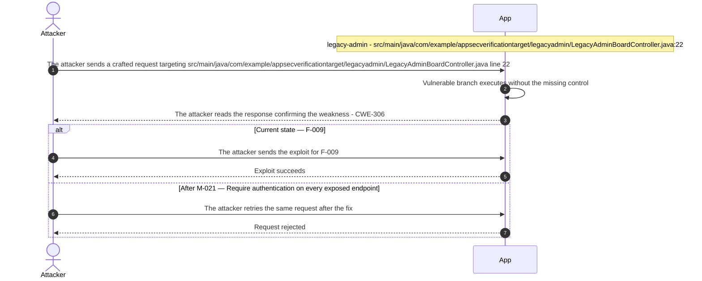

**Key takeaway:** Until ● [M-021](#m-021) (Require authentication on every exposed endpoint) lands, 🔴 [F-009](#f-009) — Missing Authentication for Admin Board (`LegacyAdminBoardController.java:22`) is exploitable at `src/main/java/com/example/appsecverificationtarget/legacyadmin/LegacyAdminBoardController.java:22` (Critical-severity, [CWE-306](https://cwe.mitre.org/data/definitions/306.html)).

**Defense in Depth**

- Primary mitigation: ● [M-021](#m-021) (Require authentication on every exposed endpoint)

### 3.3 SQL Injection in Authentication and Session Surface

**Source:** 🔴 [F-011](#f-011) — `src/main/java/com/example/appsecverificationtarget/authentication/LegacySqliteUserStore.java:64`

Severity **Critical** ([CWE-89](https://cwe.mitre.org/data/definitions/89.html)). STRIDE: Tampering. See [§8 F-011](#f-011) for the full register row.

**Attack Steps**

1. Attacker sends GET `/api/legacy-sqlite/login-raw?username=x`&password=%27+OR+role%3D%27ADMIN%27+--+- to the unauthenticated endpoint.
2. `LegacySqliteAuthController.java:39` passes unsanitized username and password request params to `LegacySqliteUserStore.authenticateRaw()`.
3. `authenticateRaw()` at `LegacySqliteUserStore.java:64` constructs the SQL: SELECT ... WHERE username='x' AND password='' OR role='ADMIN' --', which returns the ADMIN user row.
4. Server returns admin credentials and role in the 200 OK response, completing a full authentication bypass without valid credentials.

**Sequence Diagram**

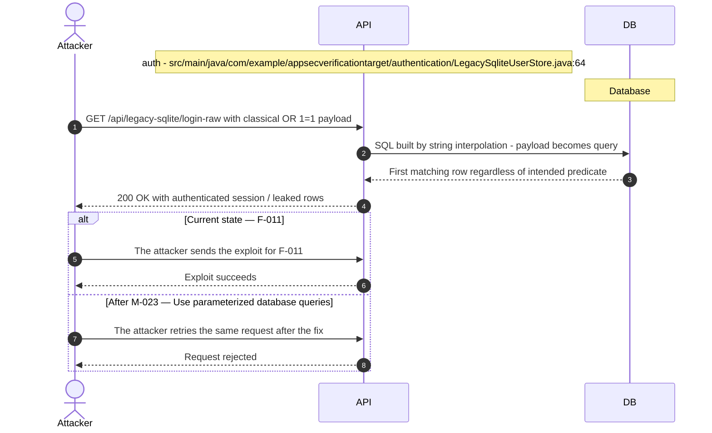

**Key takeaway:** Until ● [M-023](#m-023) (Use parameterized database queries) lands, 🔴 [F-011](#f-011) — SQL Injection (`LegacySqliteUserStore.java:64`) is exploitable at `src/main/java/com/example/appsecverificationtarget/authentication/LegacySqliteUserStore.java:64` (Critical-severity, [CWE-89](https://cwe.mitre.org/data/definitions/89.html)).

**Defense in Depth**

- Primary mitigation: ● [M-023](#m-023) (Use parameterized database queries)

### 3.4 Unauthenticated Endpoint Exposes All User Passwords

**Source:** 🔴 [F-013](#f-013) — `src/main/java/com/example/appsecverificationtarget/authentication/LegacySqliteAuthController.java:65`

Severity **Critical** ([CWE-862](https://cwe.mitre.org/data/definitions/862.html)). STRIDE: Information Disclosure. See [§8 F-013](#f-013) for the full register row.

**Attack Steps**

1. An attacker crafts a request targeting the weak spot at `src/main/java/com/example/appsecverificationtarget/authentication/LegacySqliteAuthController.java:65`.
2. GET `/api/legacy-sqlite/users` is a `permitAll` endpoint that returns the full LegacyUserResponse record for every legacy user, including the password field at `LegacySqliteAuthController.java:65`.
3. An unauthenticated attacker can retrieve all usernames, plaintext passwords, and roles from the legacy database with a single HTTP request.

**Sequence Diagram**

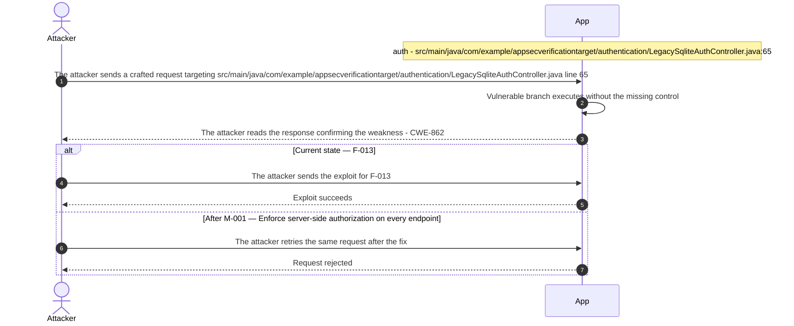

**Key takeaway:** Until ◑ [M-001](#m-001) (Enforce server-side authorization on every endpoint) lands, 🔴 [F-013](#f-013) — Unauthenticated Endpoint Exposes All User (`LegacySqliteAuthController.java:65`) is exploitable at `src/main/java/com/example/appsecverificationtarget/authentication/LegacySqliteAuthController.java:65` (Critical-severity, [CWE-862](https://cwe.mitre.org/data/definitions/862.html)).

**Defense in Depth**

- Primary mitigation: ◑ [M-001](#m-001) (Enforce server-side authorization on every endpoint)
- Defence in depth: ● [M-025](#m-025) (Enforce server-side authorization on every endpoint)

### 3.5 Unauthenticated Token Issuance for Arbitrary userId in Auth Controller

**Source:** 🔴 [F-015](#f-015) — `src/main/java/com/example/appsecverificationtarget/authentication/AuthController.java:37`

Severity **Critical** ([CWE-306](https://cwe.mitre.org/data/definitions/306.html)). STRIDE: Elevation of Privilege. See [§8 F-015](#f-015) for the full register row.

**Attack Steps**

1. Attacker discovers GET `/api/auth/homegrown-token` is accessible without authentication by browsing `/api/auth/` endpoints, which are all `permitAll` per SecurityConfig.
2. Attacker supplies `userId`=102 (admin, documented in seed data) to GET `/api/auth/homegrown-token?userId=102` and receives token MTAy.
3. Attacker submits the token to GET `/api/legacy-session/orders?token=MTAy`; `HomegrownSessionService.resolve()` loads the admin `AppUser` from the H2 database.
4. Server returns admin user's protected order data, confirming unauthenticated escalation to admin-level access.

**Sequence Diagram**

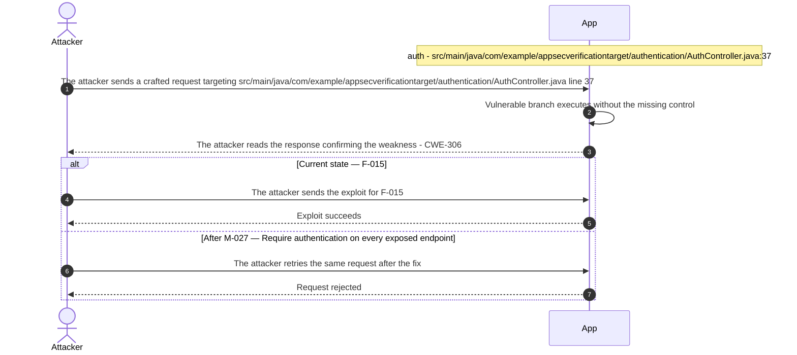

**Key takeaway:** Until ● [M-027](#m-027) (Require authentication on every exposed endpoint) lands, 🔴 [F-015](#f-015) — Unauthenticated Token Issuance for Arbitrary userId (`AuthController.java:37`) is exploitable at `src/main/java/com/example/appsecverificationtarget/authentication/AuthController.java:37` (Critical-severity, [CWE-306](https://cwe.mitre.org/data/definitions/306.html)).

**Defense in Depth**

- Primary mitigation: ● [M-027](#m-027) (Require authentication on every exposed endpoint)

### 3.6 Unauthenticated H2 database console in Security Config

**Source:** 🔴 [F-016](#f-016) — `src/main/java/com/example/appsecverificationtarget/config/SecurityConfig.java:32`

Severity **Critical** ([CWE-306](https://cwe.mitre.org/data/definitions/306.html)). STRIDE: Elevation of Privilege. See [§8 F-016](#f-016) for the full register row.

**Attack Steps**

1. Attacker requests GET `/h2-console` without a session cookie; `SecurityConfig.java:32` permits the request unconditionally under `permitAll`.
2. Attacker enters jdbc:h2:mem:testdb in the H2 login form and establishes a live database connection with no credentials required by Spring Security.
3. Attacker executes `SELECT * FROM APP_USER` to retrieve all usernames, email addresses, and password hashes stored in the application.
4. Attacker executes `INSERT INTO APP_USER` or UPDATE `APP_USER` to create a backdoor admin account or modify an existing user's password hash.

**Sequence Diagram**

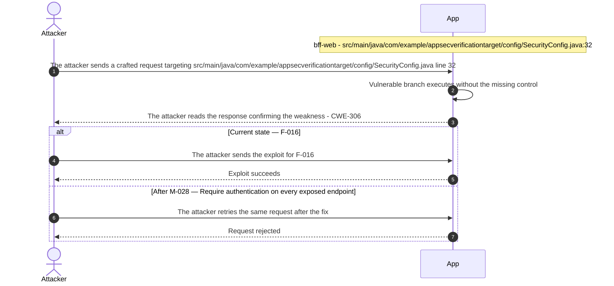

**Key takeaway:** Until ● [M-028](#m-028) (Require authentication on every exposed endpoint) lands, 🔴 [F-016](#f-016) — Unauthenticated H2 database console (`SecurityConfig.java:32`) is exploitable at `src/main/java/com/example/appsecverificationtarget/config/SecurityConfig.java:32` (Critical-severity, [CWE-306](https://cwe.mitre.org/data/definitions/306.html)).

**Defense in Depth**

- Primary mitigation: ● [M-028](#m-028) (Require authentication on every exposed endpoint)

### 3.7 Missing authorization on /api/legacy-crypto/credentials exposes all vault sec…

**Source:** 🔴 [F-017](#f-017) — `src/main/java/com/example/appsecverificationtarget/crypto/CustomCryptoController.java:39`

Severity **Critical** ([CWE-862](https://cwe.mitre.org/data/definitions/862.html)). STRIDE: Elevation of Privilege. See [§8 F-017](#f-017) for the full register row.

**Attack Steps**

1. Attacker sends GET `/api/legacy-crypto/credentials` with no Authorization or session cookie.
2. Spring Security's `permitAll` rule on `/api/legacy-crypto/**` routes the request to `CustomCryptoController.credentials()` without checking any role or principal.
3. Controller calls `vaultCredentialRepository.findAll()` and then `customCryptoService.recoverPassword(credential.getSecret())` on each returned row.
4. JSON response contains username, XOR-encrypted secret, and recovered plaintext password for every `vault_credentials` entry.

**Sequence Diagram**

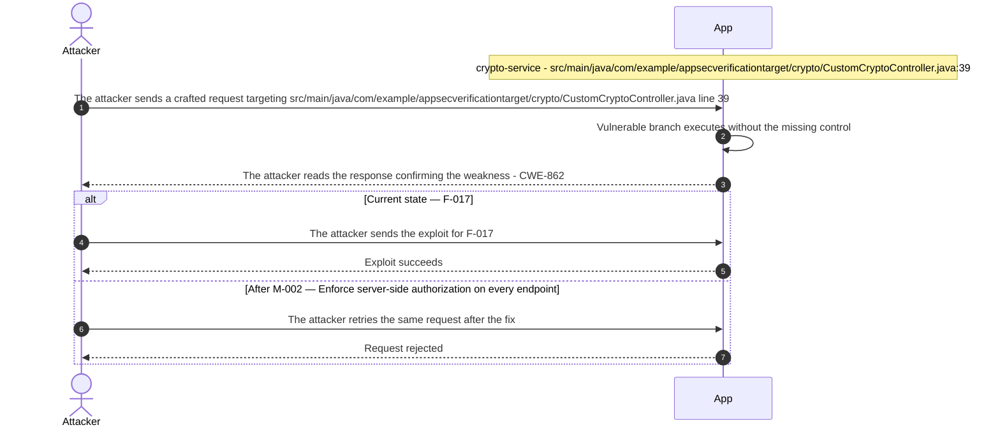

**Key takeaway:** Until ◑ [M-002](#m-002) (Enforce server-side authorization on every endpoint) lands, 🔴 [F-017](#f-017) — Missing authorization on (`CustomCryptoController.java:39`) is exploitable at `src/main/java/com/example/appsecverificationtarget/crypto/CustomCryptoController.java:39` (Critical-severity, [CWE-862](https://cwe.mitre.org/data/definitions/862.html)).

**Defense in Depth**

- Primary mitigation: ◑ [M-002](#m-002) (Enforce server-side authorization on every endpoint)
- Defence in depth: ● [M-029](#m-029) (Enforce server-side authorization on every endpoint)

### 3.8 Hard-coded Superuser Password in PostgreSQL Primary Database

**Source:** 🔴 [F-010](#f-010) — `docker-compose.yml:366`

Severity **Critical** ([CWE-259](https://cwe.mitre.org/data/definitions/259.html)). STRIDE: Spoofing. See [§8 F-010](#f-010) for the full register row.

**Attack Steps**

1. Attacker reads `docker-compose.yml` from version control or a CI artifact and extracts `POSTGRES_PASSWORD` 'fixture-local-admin-token'.
2. Attacker compromises or pivots to a container on the data Docker network (e.g., through a vulnerable co-located service).
3. Attacker connects to postgres-primary as the postgres superuser using the extracted credential, bypassing JPA-layer authorization.
4. Attacker reads or exfiltrates all business records from `appsec_primary`, modifies data, or drops tables without trace in application logs.

**Sequence Diagram**

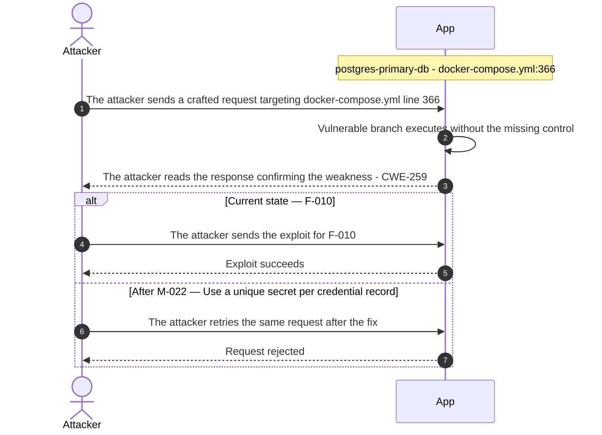

**Key takeaway:** Until ● [M-022](#m-022) (Use a unique secret per credential record) lands, 🔴 [F-010](#f-010) — Hard-coded Superuser Password (`docker-compose.yml:366`) is exploitable at `docker-compose.yml:366` (Critical-severity, [CWE-259](https://cwe.mitre.org/data/definitions/259.html)).

**Defense in Depth**

- Primary mitigation: ● [M-022](#m-022) (Use a unique secret per credential record)

<!-- generated:walkthrough_renderer -->

---

## 4. Assets

Information assets and the classification level that drives the Confidentiality / Integrity / Availability targets used in [§8 Findings Register](#8-findings-register) risk scoring.

<table style="table-layout:fixed;width:100%">
<colgroup><col width="22%" style="width:22%"><col width="13%" style="width:13%"><col width="32%" style="width:32%"><col width="33%" style="width:33%"></colgroup>
<thead><tr><th>Asset</th><th>Classification</th><th>Description</th><th>Linked Threats</th></tr></thead>
<tbody>
<tr><td style="overflow-wrap:break-word">Customer order records</td><td>Restricted</td><td>CustomerOrder JPA entities containing customer-identifying data, order details, and ownership associations. Exposed through IDOR-vulnerable OrderAccessController and OrderManagementController without ownership enforcement.</td><td style="overflow-wrap:break-word">-</td></tr>
<tr><td style="overflow-wrap:break-word">User-uploaded document files</td><td>Restricted</td><td>DocumentRecord JPA entities and files stored under runtime/documents and runtime/uploads. Exposed through path traversal in FileReadController and IDOR in DocumentDecisionController. No file type or extension validation is performed on upload.</td><td style="overflow-wrap:break-word">🟠 <a href="#f-025">F-025</a> — OS Command Injection (<code>LandscapeExposureSupport.java:48</code>)<br/>🟠 <a href="#f-030">F-030</a> — Path traversal (<code>BusinessFileStorage.java:23</code>)<br/>🟡 <a href="#f-056">F-056</a> — Unrestricted file type upload (<code>BusinessFileStorage.java:24</code>)</td></tr>
<tr><td style="overflow-wrap:break-word">Vault credentials (reversibly encrypted)</td><td>Restricted</td><td>Service credentials stored in the <code>vault_credentials</code> H2 table using HomegrownCipher — a reversible encryption scheme rather than irreversible hashing. Accessible to anyone with H2 console access or the crypto endpoints.</td><td style="overflow-wrap:break-word">🔴 <a href="#f-011">F-011</a> — SQL Injection (<code>LegacySqliteUserStore.java:64</code>)<br/>🟠 <a href="#f-038">F-038</a> — Hardcoded XOR key enables offline vault-credential (<code>HomegrownCipher.java:8</code>)<br/>🟠 <a href="#f-039">F-039</a> — Unsalted MD5 password hash allows rainbow-table (<code>LegacyPasswordService.java:15</code>)<br/>🟠 <a href="#f-042">F-042</a> — Plaintext MongoDB root password committed to source (<code>docker-compose.yml:390</code>)<br/>🟠 <a href="#f-046">F-046</a> — Plaintext password storage and retrieval (<code>LegacySqliteUserStore.java:107</code>)<br/>🟠 <a href="#f-047">F-047</a> — Unauthenticated H2 console allows table drops against (<code>application.yml:11</code>)<br/>🟡 <a href="#f-055">F-055</a> — Missing account lockout on form login (<code>SecurityConfig.java:53</code>)</td></tr>
<tr><td style="overflow-wrap:break-word">Hardcoded deployment secrets</td><td>Restricted</td><td>Credentials hardcoded in <code>docker-compose.yml</code> environment blocks: <code>JWT_SIGNING_KEY</code>, <code>DB_PASSWORD</code>, <code>AWS_ACCESS_KEY_ID</code> (AKIA...EXAMPLE), and <code>AWS_SECRET_ACCESS_KEY</code>. Exposed to anyone with repository read access.</td><td style="overflow-wrap:break-word">🟠 <a href="#f-001">F-001</a> — Hardcoded Root Service Credentials in Repository (<code>docker-compose.yml:422</code>)<br/>🟠 <a href="#f-003">F-003</a> — Hardcoded Secrets Committed to Version Control (<code>LegacySqliteUserStore.java:39</code>)<br/>🟠 <a href="#f-006">F-006</a> — Databases Configured With Superuser Accounts No Role Separation (<code>docker-compose.yml:390</code>)<br/>🔴 <a href="#f-008">F-008</a> — Empty SA password enables credential-free console login (<code>application.yml:8</code>)<br/>🔴 <a href="#f-010">F-010</a> — Hard-coded Superuser Password (<code>docker-compose.yml:366</code>)<br/>🔴 <a href="#f-011">F-011</a> — SQL Injection (<code>LegacySqliteUserStore.java:64</code>)<br/>🟠 <a href="#f-022">F-022</a> — Authentication absent on Elasticsearch REST API (<code>docker-compose.yml:411</code>)<br/>🟠 <a href="#f-023">F-023</a> — Improper Authentication (<code>docker-compose.yml:378</code>)<br/>🟠 <a href="#f-024">F-024</a> — Missing Redis AUTH configuration (<code>docker-compose.yml:397</code>)<br/>🟠 <a href="#f-026">F-026</a> — Hand-rolled XOR / repeating-key cipher (<code>HomegrownCipher.java:14</code>)<br/>🟠 <a href="#f-032">F-032</a> — AES/ECB with hardcoded key lacks ciphertext (<code>LegacyCryptoService.java:17</code>)<br/>🟠 <a href="#f-033">F-033</a> — Unauthenticated write and delete on all indices (<code>docker-compose.yml:411</code>)<br/>🟠 <a href="#f-038">F-038</a> — Hardcoded XOR key enables offline vault-credential (<code>HomegrownCipher.java:8</code>)<br/>🟠 <a href="#f-039">F-039</a> — Unsalted MD5 password hash allows rainbow-table (<code>LegacyPasswordService.java:15</code>)<br/>🟠 <a href="#f-040">F-040</a> — Sensitive indexed fields exposed without authentication (<code>docker-compose.yml:411</code>)<br/>🟠 <a href="#f-042">F-042</a> — Plaintext MongoDB root password committed to source (<code>docker-compose.yml:390</code>)<br/>🟠 <a href="#f-043">F-043</a> — Cleartext Database Credential in Version-Controlled (<code>docker-compose.yml:366</code>)<br/>🟠 <a href="#f-044">F-044</a> — Unauthenticated Redis exposes session tokens and (<code>docker-compose.yml:397</code>)<br/>🟠 <a href="#f-045">F-045</a> — Hardcoded JWT signing key in environment variable (<code>docker-compose.yml:44</code>)<br/>🟠 <a href="#f-046">F-046</a> — Plaintext password storage and retrieval (<code>LegacySqliteUserStore.java:107</code>)<br/>🟠 <a href="#f-048">F-048</a> — Unauthenticated Redis allows FLUSHALL-based session (<code>docker-compose.yml:397</code>)<br/>🟠 <a href="#f-049">F-049</a> — Vault dev mode with no persistent storage causes full (<code>docker-compose.yml:434</code>)<br/>🟠 <a href="#f-052">F-052</a> — Unauthenticated cluster admin API access (<code>docker-compose.yml:411</code>)<br/>🟠 <a href="#f-053">F-053</a> — No per-service access policies allows any data-zone (<code>docker-compose.yml:422</code>)<br/>🟡 <a href="#f-055">F-055</a> — Missing account lockout on form login (<code>SecurityConfig.java:53</code>)<br/>🟡 <a href="#f-057">F-057</a> — Unpinned image digest allows container substitution (<code>docker-compose.yml:407</code>)<br/>🟡 <a href="#f-058">F-058</a> — Unpinned minio/minio image allows supply-chain substitution (<code>docker-compose.yml:419</code>)<br/>🟡 <a href="#f-059">F-059</a> — Floating mongo:7 image tag without digest allows image (<code>docker-compose.yml:387</code>)<br/>🟡 <a href="#f-060">F-060</a> — Unpinned Container Image Tag Allows Undetected Image Substitution (<code>docker-compose.yml:375</code>)<br/>🟡 <a href="#f-061">F-061</a> — Unpinned Redis image allows supply-chain substitution (<code>docker-compose.yml:398</code>)<br/>🟡 <a href="#f-068">F-068</a> — Unauthenticated expensive queries exhaust cluster (<code>docker-compose.yml:411</code>)<br/>🟡 <a href="#f-069">F-069</a> — No Resource Limits on Database Container (<code>docker-compose.yml:362</code>)</td></tr>
<tr><td style="overflow-wrap:break-word">MinIO / S3 object storage contents</td><td>Restricted</td><td>Binary document uploads stored in MinIO object storage. Access credentials (<code>AWS_ACCESS_KEY_ID</code>, <code>AWS_SECRET_ACCESS_KEY</code>) are hardcoded in <code>docker-compose.yml</code>, granting unrestricted access to stored objects.</td><td style="overflow-wrap:break-word">🟠 <a href="#f-001">F-001</a> — Hardcoded Root Service Credentials in Repository (<code>docker-compose.yml:422</code>)<br/>🟠 <a href="#f-006">F-006</a> — Databases Configured With Superuser Accounts No Role Separation (<code>docker-compose.yml:390</code>)<br/>🔴 <a href="#f-010">F-010</a> — Hard-coded Superuser Password (<code>docker-compose.yml:366</code>)<br/>🔴 <a href="#f-011">F-011</a> — SQL Injection (<code>LegacySqliteUserStore.java:64</code>)<br/>🟠 <a href="#f-022">F-022</a> — Authentication absent on Elasticsearch REST API (<code>docker-compose.yml:411</code>)<br/>🟠 <a href="#f-023">F-023</a> — Improper Authentication (<code>docker-compose.yml:378</code>)<br/>🟠 <a href="#f-024">F-024</a> — Missing Redis AUTH configuration (<code>docker-compose.yml:397</code>)<br/>🟠 <a href="#f-032">F-032</a> — AES/ECB with hardcoded key lacks ciphertext (<code>LegacyCryptoService.java:17</code>)<br/>🟠 <a href="#f-033">F-033</a> — Unauthenticated write and delete on all indices (<code>docker-compose.yml:411</code>)<br/>🟠 <a href="#f-038">F-038</a> — Hardcoded XOR key enables offline vault-credential (<code>HomegrownCipher.java:8</code>)<br/>🟠 <a href="#f-039">F-039</a> — Unsalted MD5 password hash allows rainbow-table (<code>LegacyPasswordService.java:15</code>)<br/>🟠 <a href="#f-040">F-040</a> — Sensitive indexed fields exposed without authentication (<code>docker-compose.yml:411</code>)<br/>🟠 <a href="#f-042">F-042</a> — Plaintext MongoDB root password committed to source (<code>docker-compose.yml:390</code>)<br/>🟠 <a href="#f-043">F-043</a> — Cleartext Database Credential in Version-Controlled (<code>docker-compose.yml:366</code>)<br/>🟠 <a href="#f-044">F-044</a> — Unauthenticated Redis exposes session tokens and (<code>docker-compose.yml:397</code>)<br/>🟠 <a href="#f-045">F-045</a> — Hardcoded JWT signing key in environment variable (<code>docker-compose.yml:44</code>)<br/>🟠 <a href="#f-046">F-046</a> — Plaintext password storage and retrieval (<code>LegacySqliteUserStore.java:107</code>)<br/>🟠 <a href="#f-048">F-048</a> — Unauthenticated Redis allows FLUSHALL-based session (<code>docker-compose.yml:397</code>)<br/>🟠 <a href="#f-049">F-049</a> — Vault dev mode with no persistent storage causes full (<code>docker-compose.yml:434</code>)<br/>🟠 <a href="#f-052">F-052</a> — Unauthenticated cluster admin API access (<code>docker-compose.yml:411</code>)<br/>🟠 <a href="#f-053">F-053</a> — No per-service access policies allows any data-zone (<code>docker-compose.yml:422</code>)<br/>🟡 <a href="#f-055">F-055</a> — Missing account lockout on form login (<code>SecurityConfig.java:53</code>)<br/>🟡 <a href="#f-056">F-056</a> — Unrestricted file type upload (<code>BusinessFileStorage.java:24</code>)<br/>🟡 <a href="#f-057">F-057</a> — Unpinned image digest allows container substitution (<code>docker-compose.yml:407</code>)<br/>🟡 <a href="#f-058">F-058</a> — Unpinned minio/minio image allows supply-chain substitution (<code>docker-compose.yml:419</code>)<br/>🟡 <a href="#f-059">F-059</a> — Floating mongo:7 image tag without digest allows image (<code>docker-compose.yml:387</code>)<br/>🟡 <a href="#f-060">F-060</a> — Unpinned Container Image Tag Allows Undetected Image Substitution (<code>docker-compose.yml:375</code>)<br/>🟡 <a href="#f-061">F-061</a> — Unpinned Redis image allows supply-chain substitution (<code>docker-compose.yml:398</code>)<br/>🟡 <a href="#f-068">F-068</a> — Unauthenticated expensive queries exhaust cluster (<code>docker-compose.yml:411</code>)<br/>🟡 <a href="#f-069">F-069</a> — No Resource Limits on Database Container (<code>docker-compose.yml:362</code>)</td></tr>
<tr><td style="overflow-wrap:break-word">User credentials</td><td>Confidential</td><td>Usernames and password hashes stored in the H2 <code>AppUser</code> table and the SQLite legacy auth store. Cleartext passwords are logged by CredentialLoggingFilter on every login attempt, creating a secondary exposure in application logs.</td><td style="overflow-wrap:break-word">🟠 <a href="#f-003">F-003</a> — Hardcoded Secrets Committed to Version Control (<code>LegacySqliteUserStore.java:39</code>)<br/>🔴 <a href="#f-008">F-008</a> — Empty SA password enables credential-free console login (<code>application.yml:8</code>)<br/>🔴 <a href="#f-011">F-011</a> — SQL Injection (<code>LegacySqliteUserStore.java:64</code>)<br/>🔴 <a href="#f-013">F-013</a> — Unauthenticated Endpoint Exposes All User (<code>LegacySqliteAuthController.java:65</code>)<br/>🟠 <a href="#f-035">F-035</a> — Cleartext Credentials Written to Application (<code>CredentialLoggingFilter.java:25</code>)<br/>🟠 <a href="#f-039">F-039</a> — Unsalted MD5 password hash allows rainbow-table (<code>LegacyPasswordService.java:15</code>)<br/>🟠 <a href="#f-042">F-042</a> — Plaintext MongoDB root password committed to source (<code>docker-compose.yml:390</code>)<br/>🟠 <a href="#f-046">F-046</a> — Plaintext password storage and retrieval (<code>LegacySqliteUserStore.java:107</code>)<br/>🟠 <a href="#f-047">F-047</a> — Unauthenticated H2 console allows table drops against (<code>application.yml:11</code>)<br/>🟠 <a href="#f-054">F-054</a> — Missing authorization on <code>/users</code> endpoint (<code>LegacySqliteUserStore.java:77</code>)<br/>🟡 <a href="#f-055">F-055</a> — Missing account lockout on form login (<code>SecurityConfig.java:53</code>)<br/>🟡 <a href="#f-070">F-070</a> — Unbounded JDBC connection creation per request (<code>LegacySqliteUserStore.java:134</code>)</td></tr>
<tr><td style="overflow-wrap:break-word">JWT signing key</td><td>Confidential</td><td>HMAC-SHA256 signing key used by SignedJwtService to issue and verify signed JWTs. The key is hardcoded as <code>JWT_SIGNING_KEY</code>=hardcoded-legacy-jwt-secret in <code>docker-compose.yml</code>, making it trivially obtainable.</td><td style="overflow-wrap:break-word">🟠 <a href="#f-001">F-001</a> — Hardcoded Root Service Credentials in Repository (<code>docker-compose.yml:422</code>)<br/>🟠 <a href="#f-003">F-003</a> — Hardcoded Secrets Committed to Version Control (<code>LegacySqliteUserStore.java:39</code>)<br/>🟠 <a href="#f-006">F-006</a> — Databases Configured With Superuser Accounts No Role Separation (<code>docker-compose.yml:390</code>)<br/>🔴 <a href="#f-010">F-010</a> — Hard-coded Superuser Password (<code>docker-compose.yml:366</code>)<br/>🟠 <a href="#f-020">F-020</a> — Improper Signature Verification (<code>LegacyJwtVerifier.java:15</code>)<br/>🟠 <a href="#f-022">F-022</a> — Authentication absent on Elasticsearch REST API (<code>docker-compose.yml:411</code>)<br/>🟠 <a href="#f-023">F-023</a> — Improper Authentication (<code>docker-compose.yml:378</code>)<br/>🟠 <a href="#f-024">F-024</a> — Missing Redis AUTH configuration (<code>docker-compose.yml:397</code>)<br/>🟠 <a href="#f-028">F-028</a> — JWT parsed without signature verification (<code>LegacyJwtVerifier.java:17</code>)<br/>🟠 <a href="#f-030">F-030</a> — Path traversal (<code>BusinessFileStorage.java:23</code>)<br/>🟠 <a href="#f-032">F-032</a> — AES/ECB with hardcoded key lacks ciphertext (<code>LegacyCryptoService.java:17</code>)<br/>🟠 <a href="#f-033">F-033</a> — Unauthenticated write and delete on all indices (<code>docker-compose.yml:411</code>)<br/>🟠 <a href="#f-036">F-036</a> — Unauthenticated actuator endpoints (<code>SecurityConfig.java:33</code>)<br/>🟠 <a href="#f-038">F-038</a> — Hardcoded XOR key enables offline vault-credential (<code>HomegrownCipher.java:8</code>)<br/>🟠 <a href="#f-040">F-040</a> — Sensitive indexed fields exposed without authentication (<code>docker-compose.yml:411</code>)<br/>🟠 <a href="#f-042">F-042</a> — Plaintext MongoDB root password committed to source (<code>docker-compose.yml:390</code>)<br/>🟠 <a href="#f-043">F-043</a> — Cleartext Database Credential in Version-Controlled (<code>docker-compose.yml:366</code>)<br/>🟠 <a href="#f-044">F-044</a> — Unauthenticated Redis exposes session tokens and (<code>docker-compose.yml:397</code>)<br/>🟠 <a href="#f-045">F-045</a> — Hardcoded JWT signing key in environment variable (<code>docker-compose.yml:44</code>)<br/>🟠 <a href="#f-048">F-048</a> — Unauthenticated Redis allows FLUSHALL-based session (<code>docker-compose.yml:397</code>)<br/>🟠 <a href="#f-049">F-049</a> — Vault dev mode with no persistent storage causes full (<code>docker-compose.yml:434</code>)<br/>🟠 <a href="#f-052">F-052</a> — Unauthenticated cluster admin API access (<code>docker-compose.yml:411</code>)<br/>🟠 <a href="#f-053">F-053</a> — No per-service access policies allows any data-zone (<code>docker-compose.yml:422</code>)<br/>🟡 <a href="#f-057">F-057</a> — Unpinned image digest allows container substitution (<code>docker-compose.yml:407</code>)<br/>🟡 <a href="#f-058">F-058</a> — Unpinned minio/minio image allows supply-chain substitution (<code>docker-compose.yml:419</code>)<br/>🟡 <a href="#f-059">F-059</a> — Floating mongo:7 image tag without digest allows image (<code>docker-compose.yml:387</code>)<br/>🟡 <a href="#f-060">F-060</a> — Unpinned Container Image Tag Allows Undetected Image Substitution (<code>docker-compose.yml:375</code>)<br/>🟡 <a href="#f-061">F-061</a> — Unpinned Redis image allows supply-chain substitution (<code>docker-compose.yml:398</code>)<br/>🟡 <a href="#f-068">F-068</a> — Unauthenticated expensive queries exhaust cluster (<code>docker-compose.yml:411</code>)<br/>🟡 <a href="#f-069">F-069</a> — No Resource Limits on Database Container (<code>docker-compose.yml:362</code>)</td></tr>
<tr><td style="overflow-wrap:break-word">Session tokens and homegrown session material</td><td>Confidential</td><td>Spring Security session cookies, homegrown Base64-encoded user ID tokens issued by HomegrownSessionService, and unsigned legacy JWTs issued by LegacyJwtVerifier. Multiple weak token formats coexist in the application.</td><td style="overflow-wrap:break-word">🔴 <a href="#f-007">F-007</a> — Forgeable Base64 Session Token (<code>HomegrownSessionService.java:21</code>)<br/>🟠 <a href="#f-020">F-020</a> — Improper Signature Verification (<code>LegacyJwtVerifier.java:15</code>)<br/>🟠 <a href="#f-021">F-021</a> — Unsigned XOR token accepted as identity proof (<code>CustomCryptoService.java:24</code>)<br/>🟠 <a href="#f-023">F-023</a> — Improper Authentication (<code>docker-compose.yml:378</code>)<br/>🟠 <a href="#f-027">F-027</a> — Non-cryptographic RNG in a security module Java (<code>LegacyTokenService.java:10</code>)<br/>🟠 <a href="#f-028">F-028</a> — JWT parsed without signature verification (<code>LegacyJwtVerifier.java:17</code>)<br/>🟠 <a href="#f-031">F-031</a> — CSRF globally disabled (<code>SecurityConfig.java:28</code>)<br/>🟠 <a href="#f-043">F-043</a> — Cleartext Database Credential in Version-Controlled (<code>docker-compose.yml:366</code>)<br/>🟠 <a href="#f-044">F-044</a> — Unauthenticated Redis exposes session tokens and (<code>docker-compose.yml:397</code>)<br/>🟠 <a href="#f-051">F-051</a> — Unauthenticated legacy admin board (<code>SecurityConfig.java:41</code>)<br/>🟡 <a href="#f-061">F-061</a> — Unpinned Redis image allows supply-chain substitution (<code>docker-compose.yml:398</code>)</td></tr>
<tr><td style="overflow-wrap:break-word">H2 database console</td><td>Confidential</td><td>H2 web console accessible at <code>/h2-console</code> without authentication (SecurityConfig <code>permitAll</code>). Grants direct SQL access to all application data including user credentials, orders, documents, and <code>vault_credentials</code>.</td><td style="overflow-wrap:break-word">🔴 <a href="#f-008">F-008</a> — Empty SA password enables credential-free console login (<code>application.yml:8</code>)<br/>🔴 <a href="#f-011">F-011</a> — SQL Injection (<code>LegacySqliteUserStore.java:64</code>)<br/>🔴 <a href="#f-016">F-016</a> — Unauthenticated H2 database console (<code>SecurityConfig.java:32</code>)<br/>🔴 <a href="#f-018">F-018</a> — PermitAll H2 console allows unauthenticated full (<code>SecurityConfig.java:32</code>)<br/>🟠 <a href="#f-035">F-035</a> — Cleartext Credentials Written to Application (<code>CredentialLoggingFilter.java:25</code>)<br/>🟠 <a href="#f-039">F-039</a> — Unsalted MD5 password hash allows rainbow-table (<code>LegacyPasswordService.java:15</code>)<br/>🟠 <a href="#f-040">F-040</a> — Sensitive indexed fields exposed without authentication (<code>docker-compose.yml:411</code>)<br/>🟠 <a href="#f-042">F-042</a> — Plaintext MongoDB root password committed to source (<code>docker-compose.yml:390</code>)<br/>🟠 <a href="#f-046">F-046</a> — Plaintext password storage and retrieval (<code>LegacySqliteUserStore.java:107</code>)<br/>🟠 <a href="#f-047">F-047</a> — Unauthenticated H2 console allows table drops against (<code>application.yml:11</code>)<br/>🟡 <a href="#f-055">F-055</a> — Missing account lockout on form login (<code>SecurityConfig.java:53</code>)</td></tr>
<tr><td style="overflow-wrap:break-word">Application actuator metadata</td><td>Confidential</td><td>Spring Boot actuator endpoints at <code>/actuator/**</code> exposed without authentication. Include environment variables (including secrets), configuration properties, heap dumps, thread dumps, and health details.</td><td style="overflow-wrap:break-word">-</td></tr>
<tr><td style="overflow-wrap:break-word">User personal data and profiles</td><td>Confidential</td><td><code>AppUser</code> JPA entities containing username, email, role, and profile information. Accessible via IDOR-vulnerable UserAccessController and ProfileController without enforcing per-user ownership.</td><td style="overflow-wrap:break-word">🟠 <a href="#f-005">F-005</a> — Mass Assignment Enables Privilege Escalation (<code>ProfileController.java:44</code>)<br/>🔴 <a href="#f-011">F-011</a> — SQL Injection (<code>LegacySqliteUserStore.java:64</code>)<br/>🔴 <a href="#f-012">F-012</a> — Missing Authorization on Privileged (<code>LegacyAdminBoardController.java:33</code>)<br/>🔴 <a href="#f-013">F-013</a> — Unauthenticated Endpoint Exposes All User (<code>LegacySqliteAuthController.java:65</code>)<br/>🔴 <a href="#f-014">F-014</a> — Missing Authorization on User Deletion (<code>LegacyAdminBoardController.java:39</code>)<br/>🔴 <a href="#f-017">F-017</a> — Missing authorization on (<code>CustomCryptoController.java:39</code>)<br/>🔴 <a href="#f-018">F-018</a> — PermitAll H2 console allows unauthenticated full (<code>SecurityConfig.java:32</code>)<br/>🔴 <a href="#f-019">F-019</a> — Unauthenticated Privilege Escalation (<code>LegacyAdminBoardController.java:31</code>)<br/>🟠 <a href="#f-033">F-033</a> — Unauthenticated write and delete on all indices (<code>docker-compose.yml:411</code>)<br/>🟠 <a href="#f-036">F-036</a> — Unauthenticated actuator endpoints (<code>SecurityConfig.java:33</code>)<br/>🟠 <a href="#f-040">F-040</a> — Sensitive indexed fields exposed without authentication (<code>docker-compose.yml:411</code>)<br/>🟠 <a href="#f-044">F-044</a> — Unauthenticated Redis exposes session tokens and (<code>docker-compose.yml:397</code>)<br/>🟠 <a href="#f-050">F-050</a> — IDOR on order fetch no ownership check (<code>OrderAccessController.java:24</code>)<br/>🟠 <a href="#f-051">F-051</a> — Unauthenticated legacy admin board (<code>SecurityConfig.java:41</code>)<br/>🟠 <a href="#f-052">F-052</a> — Unauthenticated cluster admin API access (<code>docker-compose.yml:411</code>)<br/>🟠 <a href="#f-053">F-053</a> — No per-service access policies allows any data-zone (<code>docker-compose.yml:422</code>)<br/>🟠 <a href="#f-054">F-054</a> — Missing authorization on <code>/users</code> endpoint (<code>LegacySqliteUserStore.java:77</code>)</td></tr>
<tr><td style="overflow-wrap:break-word">Service landscape invocation records</td><td>Internal</td><td>LandscapePersistence JPA aggregates tracking service catalog entries, client registrations, and invocation counts stored in PostgreSQL. Represents the operational state of the 50-service landscape fixture.</td><td style="overflow-wrap:break-word">-</td></tr>
</tbody>
</table>

---

## 5. Attack Surface

Network-reachable entry points classified by authentication requirement. Each row links to the threat(s) referenced in its **Notes** column. The **Risk** column reflects the highest-severity linked finding. Entry points with no linked finding are still listed when they sit on a sensitive surface (authentication, registration, management) or look like a missing-auth/authz suspect - marked **⚑ Review** in Notes.

### 5.1 Unauthenticated Entry Points (91)

<table style="table-layout:fixed;width:100%">
<colgroup><col width="9%" style="width:9%"><col width="30%" style="width:30%"><col width="14%" style="width:14%"><col width="47%" style="width:47%"></colgroup>
<thead><tr><th>Method</th><th>Route</th><th>Risk</th><th>Notes</th></tr></thead>
<tbody>
<tr><td>GET</td><td style="overflow-wrap:anywhere"><code>/admin/users</code></td><td>🔴 Critical</td><td>🔴 <a href="#f-012">F-012</a> — Missing Authorization on Privileged (<code>LegacyAdminBoardController.java:33</code>)<br/>🔴 <a href="#f-014">F-014</a> — Missing Authorization on User Deletion (<code>LegacyAdminBoardController.java:39</code>)<br/>🔴 <a href="#f-019">F-019</a> — Unauthenticated Privilege Escalation (<code>LegacyAdminBoardController.java:31</code>)<br/>Admin users page GET — missing-auth management surface</td></tr>
<tr><td>POST</td><td style="overflow-wrap:anywhere"><code>/admin/users</code></td><td>🔴 Critical</td><td>🔴 <a href="#f-012">F-012</a> — Missing Authorization on Privileged (<code>LegacyAdminBoardController.java:33</code>)<br/>🔴 <a href="#f-014">F-014</a> — Missing Authorization on User Deletion (<code>LegacyAdminBoardController.java:39</code>)<br/>🔴 <a href="#f-019">F-019</a> — Unauthenticated Privilege Escalation (<code>LegacyAdminBoardController.java:31</code>)<br/>Admin users create POST — missing-auth management surface</td></tr>
<tr><td>GET</td><td style="overflow-wrap:anywhere"><code>/admin/users/{id}</code></td><td>🔴 Critical</td><td>🔴 <a href="#f-012">F-012</a> — Missing Authorization on Privileged (<code>LegacyAdminBoardController.java:33</code>)<br/>🔴 <a href="#f-014">F-014</a> — Missing Authorization on User Deletion (<code>LegacyAdminBoardController.java:39</code>)<br/>🔴 <a href="#f-019">F-019</a> — Unauthenticated Privilege Escalation (<code>LegacyAdminBoardController.java:31</code>)<br/>Management surface; handler: <code>src/main/java/com/example/appsecverificationtarget/web/AdminUsersPageController.java:79</code></td></tr>
<tr><td>POST</td><td style="overflow-wrap:anywhere"><code>/admin/users/{id}</code></td><td>🔴 Critical</td><td>🔴 <a href="#f-012">F-012</a> — Missing Authorization on Privileged (<code>LegacyAdminBoardController.java:33</code>)<br/>🔴 <a href="#f-014">F-014</a> — Missing Authorization on User Deletion (<code>LegacyAdminBoardController.java:39</code>)<br/>🔴 <a href="#f-019">F-019</a> — Unauthenticated Privilege Escalation (<code>LegacyAdminBoardController.java:31</code>)<br/>Admin user edit POST — missing-auth management surface</td></tr>
<tr><td>POST</td><td style="overflow-wrap:anywhere"><code>/admin/users/{id}/delete</code></td><td>🔴 Critical</td><td>🔴 <a href="#f-012">F-012</a> — Missing Authorization on Privileged (<code>LegacyAdminBoardController.java:33</code>)<br/>🔴 <a href="#f-014">F-014</a> — Missing Authorization on User Deletion (<code>LegacyAdminBoardController.java:39</code>)<br/>🔴 <a href="#f-019">F-019</a> — Unauthenticated Privilege Escalation (<code>LegacyAdminBoardController.java:31</code>)<br/>Admin user delete POST — missing-auth management surface</td></tr>
<tr><td>GET</td><td style="overflow-wrap:anywhere"><code>/legacy/admin</code></td><td>🔴 Critical</td><td>🔴 <a href="#f-009">F-009</a> — Missing Authentication for Admin Board (<code>LegacyAdminBoardController.java:22</code>)<br/>🔴 <a href="#f-012">F-012</a> — Missing Authorization on Privileged (<code>LegacyAdminBoardController.java:33</code>)<br/>🔴 <a href="#f-014">F-014</a> — Missing Authorization on User Deletion (<code>LegacyAdminBoardController.java:39</code>)<br/>Unauthenticated legacy admin board GET — no auth, high-privilege user directory access</td></tr>
<tr><td>POST</td><td style="overflow-wrap:anywhere"><code>/​legacy/​admin/​users/​{id}/​delete</code></td><td>🔴 Critical</td><td>🔴 <a href="#f-012">F-012</a> — Missing Authorization on Privileged (<code>LegacyAdminBoardController.java:33</code>)<br/>🔴 <a href="#f-014">F-014</a> — Missing Authorization on User Deletion (<code>LegacyAdminBoardController.java:39</code>)<br/>🔴 <a href="#f-019">F-019</a> — Unauthenticated Privilege Escalation (<code>LegacyAdminBoardController.java:31</code>)<br/>Unauthenticated user delete endpoint — no auth, account deletion</td></tr>
<tr><td>POST</td><td style="overflow-wrap:anywhere"><code>/​legacy/​admin/​users/​{id}/​promote</code></td><td>🔴 Critical</td><td>🔴 <a href="#f-012">F-012</a> — Missing Authorization on Privileged (<code>LegacyAdminBoardController.java:33</code>)<br/>🔴 <a href="#f-014">F-014</a> — Missing Authorization on User Deletion (<code>LegacyAdminBoardController.java:39</code>)<br/>🔴 <a href="#f-019">F-019</a> — Unauthenticated Privilege Escalation (<code>LegacyAdminBoardController.java:31</code>)<br/>Unauthenticated user promote endpoint — no auth, privilege escalation</td></tr>
<tr><td>GET</td><td style="overflow-wrap:anywhere"><code>/login</code></td><td>🔴 Critical</td><td>🔴 <a href="#f-011">F-011</a> — SQL Injection (<code>LegacySqliteUserStore.java:64</code>)<br/>🟠 <a href="#f-035">F-035</a> — Cleartext Credentials Written to Application (<code>CredentialLoggingFilter.java:25</code>)<br/>🟠 <a href="#f-054">F-054</a> — Missing authorization on <code>/users</code> endpoint (<code>LegacySqliteUserStore.java:77</code>)<br/>handler: <code>src/main/java/com/example/appsecverificationtarget/web/WebUiController.java:41</code></td></tr>
<tr><td>GET</td><td style="overflow-wrap:anywhere"><code>/login-raw</code></td><td>🔴 Critical</td><td>🔴 <a href="#f-011">F-011</a> — SQL Injection (<code>LegacySqliteUserStore.java:64</code>)<br/>🟡 <a href="#f-070">F-070</a> — Unbounded JDBC connection creation per request (<code>LegacySqliteUserStore.java:134</code>)<br/>Legacy SQLite login GET form — authentication surface</td></tr>
<tr><td>GET</td><td style="overflow-wrap:anywhere"><code>/credentials</code></td><td>🔴 Critical</td><td>🔴 <a href="#f-017">F-017</a> — Missing authorization on (<code>CustomCryptoController.java:39</code>)<br/>🟠 <a href="#f-002">F-002</a> — No Audit Logging Across Service Infrastructure (<code>CustomCryptoController.java:39</code>)<br/>🟠 <a href="#f-038">F-038</a> — Hardcoded XOR key enables offline vault-credential (<code>HomegrownCipher.java:8</code>)<br/>handler: <code>src/main/java/com/example/appsecverificationtarget/crypto/CustomCryptoController.java:39</code></td></tr>
<tr><td>GET</td><td style="overflow-wrap:anywhere"><code>/homegrown-token</code></td><td>🔴 Critical</td><td>🔴 <a href="#f-015">F-015</a> — Unauthenticated Token Issuance for Arbitrary userId (<code>AuthController.java:37</code>)<br/>handler: <code>src/main/java/com/example/appsecverificationtarget/authentication/AuthController.java:36</code></td></tr>
<tr><td>GET</td><td style="overflow-wrap:anywhere"><code>/users</code></td><td>🔴 Critical</td><td>🔴 <a href="#f-012">F-012</a> — Missing Authorization on Privileged (<code>LegacyAdminBoardController.java:33</code>)<br/>🔴 <a href="#f-013">F-013</a> — Unauthenticated Endpoint Exposes All User (<code>LegacySqliteAuthController.java:65</code>)<br/>🔴 <a href="#f-014">F-014</a> — Missing Authorization on User Deletion (<code>LegacyAdminBoardController.java:39</code>)<br/>Legacy SQLite user listing — no auth, user enumeration</td></tr>
<tr><td>GET</td><td style="overflow-wrap:anywhere"><code>/users/{id}</code></td><td>🔴 Critical</td><td>🔴 <a href="#f-012">F-012</a> — Missing Authorization on Privileged (<code>LegacyAdminBoardController.java:33</code>)<br/>🔴 <a href="#f-014">F-014</a> — Missing Authorization on User Deletion (<code>LegacyAdminBoardController.java:39</code>)<br/>🔴 <a href="#f-019">F-019</a> — Unauthenticated Privilege Escalation (<code>LegacyAdminBoardController.java:31</code>)<br/>handler: <code>src/main/java/com/example/appsecverificationtarget/web/UserDirectoryController.java:24</code></td></tr>
<tr><td>GET</td><td style="overflow-wrap:anywhere"><code>/{id}</code></td><td>🔴 Critical</td><td>🔴 <a href="#f-012">F-012</a> — Missing Authorization on Privileged (<code>LegacyAdminBoardController.java:33</code>)<br/>🔴 <a href="#f-014">F-014</a> — Missing Authorization on User Deletion (<code>LegacyAdminBoardController.java:39</code>)<br/>🔴 <a href="#f-019">F-019</a> — Unauthenticated Privilege Escalation (<code>LegacyAdminBoardController.java:31</code>)<br/>handler: <code>src/main/java/com/example/appsecverificationtarget/accesscontrol/UserAccessController.java:21</code></td></tr>
<tr><td>?</td><td style="overflow-wrap:anywhere"><code>ANY /api/auth</code></td><td>🔴 Critical</td><td>🔴 <a href="#f-015">F-015</a> — Unauthenticated Token Issuance for Arbitrary userId (<code>AuthController.java:37</code>)<br/>🟠 <a href="#f-020">F-020</a> — Improper Signature Verification (<code>LegacyJwtVerifier.java:15</code>)<br/>handler: <code>src/main/java/com/example/appsecverificationtarget/authentication/AuthController.java:14</code></td></tr>
<tr><td>?</td><td style="overflow-wrap:anywhere"><code>ANY /api/legacy-crypto</code></td><td>🔴 Critical</td><td>🔴 <a href="#f-017">F-017</a> — Missing authorization on (<code>CustomCryptoController.java:39</code>)<br/>🟠 <a href="#f-002">F-002</a> — No Audit Logging Across Service Infrastructure (<code>CustomCryptoController.java:39</code>)<br/>🟠 <a href="#f-021">F-021</a> — Unsigned XOR token accepted as identity proof (<code>CustomCryptoService.java:24</code>)<br/>handler: <code>src/main/java/com/example/appsecverificationtarget/crypto/CustomCryptoController.java:12</code></td></tr>
<tr><td>?</td><td style="overflow-wrap:anywhere"><code>ANY /api/legacy-sqlite</code></td><td>🔴 Critical</td><td>🔴 <a href="#f-011">F-011</a> — SQL Injection (<code>LegacySqliteUserStore.java:64</code>)<br/>🔴 <a href="#f-013">F-013</a> — Unauthenticated Endpoint Exposes All User (<code>LegacySqliteAuthController.java:65</code>)<br/>🟠 <a href="#f-054">F-054</a> — Missing authorization on <code>/users</code> endpoint (<code>LegacySqliteUserStore.java:77</code>)<br/>handler: <code>src/main/java/com/example/appsecverificationtarget/authentication/LegacySqliteAuthController.java:16</code></td></tr>
<tr><td>POST</td><td style="overflow-wrap:anywhere"><code>/documents</code></td><td>🟠 High</td><td>🟠 <a href="#f-031">F-031</a> — CSRF globally disabled (<code>SecurityConfig.java:28</code>)<br/>Document upload POST — file upload without auth or type validation</td></tr>
<tr><td>PUT</td><td style="overflow-wrap:anywhere"><code>/me</code></td><td>🟠 High</td><td>🟠 <a href="#f-005">F-005</a> — Mass Assignment Enables Privilege Escalation (<code>ProfileController.java:44</code>)<br/>handler: <code>src/main/java/com/example/appsecverificationtarget/accesscontrol/ProfileController.java:34</code></td></tr>
<tr><td>POST</td><td style="overflow-wrap:anywhere"><code>/orders</code></td><td>🟠 High</td><td>🟠 <a href="#f-050">F-050</a> — IDOR on order fetch no ownership check (<code>OrderAccessController.java:24</code>)<br/>Order create POST — missing-auth</td></tr>
<tr><td>POST</td><td style="overflow-wrap:anywhere"><code>/orders/{id}</code></td><td>🟠 High</td><td>🟠 <a href="#f-050">F-050</a> — IDOR on order fetch no ownership check (<code>OrderAccessController.java:24</code>)<br/>Order update POST — missing-auth</td></tr>
<tr><td>POST</td><td style="overflow-wrap:anywhere"><code>/profile</code></td><td>🟠 High</td><td>🟠 <a href="#f-005">F-005</a> — Mass Assignment Enables Privilege Escalation (<code>ProfileController.java:44</code>)<br/>handler: <code>src/main/java/com/example/appsecverificationtarget/web/ProfilePageController.java:51</code></td></tr>
<tr><td>GET</td><td style="overflow-wrap:anywhere"><code>/token</code></td><td>🟠 High</td><td>🟠 <a href="#f-027">F-027</a> — Non-cryptographic RNG in a security module Java (<code>LegacyTokenService.java:10</code>)<br/>🟡 <a href="#f-067">F-067</a> — Unbounded request parameter drives unchecked heap (<code>HomegrownCipher.java:12</code>)<br/>handler: <code>src/main/java/com/example/appsecverificationtarget/crypto/CustomCryptoController.java:26</code></td></tr>
<tr><td>?</td><td style="overflow-wrap:anywhere"><code>ANY /api/admin</code></td><td>🟠 High</td><td>🟠 <a href="#f-034">F-034</a> — Unauthenticated admin report endpoint exposes (<code>AdminReportController.java:35</code>)<br/>Admin report API ANY — missing-auth management route</td></tr>
<tr><td>GET</td><td style="overflow-wrap:anywhere"><code>/documents</code></td><td>🟠 High</td><td>🟠 <a href="#f-031">F-031</a> — CSRF globally disabled (<code>SecurityConfig.java:28</code>)<br/>handler: <code>src/main/java/com/example/appsecverificationtarget/web/DocumentManagementController.java:42</code></td></tr>
<tr><td>GET</td><td style="overflow-wrap:anywhere"><code>/legacy-jwt/claims</code></td><td>🟠 High</td><td>🟠 <a href="#f-020">F-020</a> — Improper Signature Verification (<code>LegacyJwtVerifier.java:15</code>)<br/>handler: <code>src/main/java/com/example/appsecverificationtarget/authentication/AuthController.java:31</code></td></tr>
<tr><td>GET</td><td style="overflow-wrap:anywhere"><code>/me</code></td><td>🟠 High</td><td>🟠 <a href="#f-005">F-005</a> — Mass Assignment Enables Privilege Escalation (<code>ProfileController.java:44</code>)<br/>handler: <code>src/main/java/com/example/appsecverificationtarget/accesscontrol/ProfileController.java:26</code></td></tr>
<tr><td>GET</td><td style="overflow-wrap:anywhere"><code>/orders</code></td><td>🟠 High</td><td>🟠 <a href="#f-050">F-050</a> — IDOR on order fetch no ownership check (<code>OrderAccessController.java:24</code>)<br/>handler: <code>src/main/java/com/example/appsecverificationtarget/authentication/LegacySessionOrderController.java:27</code></td></tr>
<tr><td>GET</td><td style="overflow-wrap:anywhere"><code>/orders/{id}</code></td><td>🟠 High</td><td>🟠 <a href="#f-050">F-050</a> — IDOR on order fetch no ownership check (<code>OrderAccessController.java:24</code>)<br/>handler: <code>src/main/java/com/example/appsecverificationtarget/web/OrderManagementController.java:89</code></td></tr>
<tr><td>GET</td><td style="overflow-wrap:anywhere"><code>/profile</code></td><td>🟠 High</td><td>🟠 <a href="#f-005">F-005</a> — Mass Assignment Enables Privilege Escalation (<code>ProfileController.java:44</code>)<br/>handler: <code>src/main/java/com/example/appsecverificationtarget/authentication/SecureJwtController.java:14</code></td></tr>
<tr><td>GET</td><td style="overflow-wrap:anywhere"><code>/report</code></td><td>🟠 High</td><td>🟠 <a href="#f-034">F-034</a> — Unauthenticated admin report endpoint exposes (<code>AdminReportController.java:35</code>)<br/>handler: <code>src/main/java/com/example/appsecverificationtarget/accesscontrol/AdminReportController.java:34</code></td></tr>
<tr><td>GET</td><td style="overflow-wrap:anywhere"><code>/whoami</code></td><td>🟠 High</td><td>🟠 <a href="#f-021">F-021</a> — Unsigned XOR token accepted as identity proof (<code>CustomCryptoService.java:24</code>)<br/>handler: <code>src/main/java/com/example/appsecverificationtarget/crypto/CustomCryptoController.java:34</code></td></tr>
<tr><td>?</td><td style="overflow-wrap:anywhere"><code>ANY /api/orders</code></td><td>🟠 High</td><td>🟠 <a href="#f-050">F-050</a> — IDOR on order fetch no ownership check (<code>OrderAccessController.java:24</code>)<br/>handler: <code>src/main/java/com/example/appsecverificationtarget/accesscontrol/OrderAccessController.java:14</code></td></tr>
<tr><td>?</td><td style="overflow-wrap:anywhere"><code>ANY /api/profile</code></td><td>🟠 High</td><td>🟠 <a href="#f-005">F-005</a> — Mass Assignment Enables Privilege Escalation (<code>ProfileController.java:44</code>)<br/>handler: <code>src/main/java/com/example/appsecverificationtarget/accesscontrol/ProfileController.java:17</code></td></tr>
<tr><td>GET</td><td style="overflow-wrap:anywhere"><code>/admin-preferences</code></td><td>-</td><td>Admin preferences GET - missing-auth management route<br/><em>⚑ Review: no auth guard detected</em></td></tr>
<tr><td>POST</td><td style="overflow-wrap:anywhere"><code>/csrf/settings</code></td><td>-</td><td>CSRF settings POST - state change without server-side CSRF verification<br/><em>⚑ Review: no auth guard detected</em></td></tr>
<tr><td>POST</td><td style="overflow-wrap:anywhere"><code>/documents/{id}</code></td><td>-</td><td>Document update POST - missing-auth<br/><em>⚑ Review: no auth guard detected</em></td></tr>
<tr><td>POST</td><td style="overflow-wrap:anywhere"><code>/documents/{id}/delete</code></td><td>-</td><td>Document delete POST - missing-auth<br/><em>⚑ Review: no auth guard detected</em></td></tr>
<tr><td>POST</td><td style="overflow-wrap:anywhere"><code>/orders/{id}/delete</code></td><td>-</td><td>Order delete POST - missing-auth<br/><em>⚑ Review: no auth guard detected</em></td></tr>
<tr><td>GET</td><td style="overflow-wrap:anywhere"><code>/otp</code></td><td>-</td><td>handler: <code>src/main/java/com/example/appsecverificationtarget/crypto/CryptoController.java:33</code><br/><em>⚑ Review: auth/token endpoint</em></td></tr>
<tr><td>GET</td><td style="overflow-wrap:anywhere"><code>/password-digest</code></td><td>-</td><td>handler: <code>src/main/java/com/example/appsecverificationtarget/crypto/CryptoController.java:28</code><br/><em>⚑ Review: auth/token endpoint</em></td></tr>
<tr><td>POST</td><td style="overflow-wrap:anywhere"><code>/preview</code></td><td>-</td><td>XXE parse endpoint POST <code>/preview</code> - no auth, XML injection<br/><em>⚑ Review: no auth guard detected</em></td></tr>
<tr><td>GET</td><td style="overflow-wrap:anywhere"><code>/register</code></td><td>-</td><td>handler: <code>src/main/java/com/example/appsecverificationtarget/authentication/RegistrationController.java:35</code><br/><em>⚑ Review: registration flow</em></td></tr>
<tr><td>POST</td><td style="overflow-wrap:anywhere"><code>/register</code></td><td>-</td><td>Open self-registration POST - unauthenticated account creation<br/><em>⚑ Review: registration flow</em></td></tr>
<tr><td>GET</td><td style="overflow-wrap:anywhere"><code>/signed-jwt/token</code></td><td>-</td><td>handler: <code>src/main/java/com/example/appsecverificationtarget/authentication/AuthController.java:49</code><br/><em>⚑ Review: auth/token endpoint</em></td></tr>
<tr><td>POST</td><td style="overflow-wrap:anywhere"><code>/{id}/release</code></td><td>-</td><td>Document release POST - missing-auth state change<br/><em>⚑ Review: no auth guard detected</em></td></tr>
<tr><td>?</td><td style="overflow-wrap:anywhere"><code>ANY /api/admin/users</code></td><td>-</td><td>Admin users API ANY - missing-auth management route<br/><em>⚑ Review: no auth guard detected</em></td></tr>
</tbody>
</table>

_43 further entry point(s) in this category carry no linked finding and no elevated review signal, and are not listed individually (91 total). The complete route inventory is available in `.route-inventory.json` and, when exported, `pentest-tasks.yaml`._

### 5.2 Authenticated Entry Points (33)

<table style="table-layout:fixed;width:100%">
<colgroup><col width="9%" style="width:9%"><col width="30%" style="width:30%"><col width="14%" style="width:14%"><col width="47%" style="width:47%"></colgroup>
<thead><tr><th>Method</th><th>Route</th><th>Risk</th><th>Notes</th></tr></thead>
<tbody>
<tr><td>POST</td><td style="overflow-wrap:anywhere"><code>/login</code></td><td>🔴 Critical</td><td>🔴 <a href="#f-011">F-011</a> — SQL Injection (<code>LegacySqliteUserStore.java:64</code>)<br/>🟠 <a href="#f-035">F-035</a> — Cleartext Credentials Written to Application (<code>CredentialLoggingFilter.java:25</code>)<br/>🟠 <a href="#f-054">F-054</a> — Missing authorization on <code>/users</code> endpoint (<code>LegacySqliteUserStore.java:77</code>)<br/>SQLite legacy login POST — password auth path, SQL injection surface</td></tr>
</tbody>
</table>

_32 further entry point(s) in this category carry no linked finding and no elevated review signal, and are not listed individually (33 total). The complete route inventory is available in `.route-inventory.json` and, when exported, `pentest-tasks.yaml`._

---

## 6. Security Architecture

This chapter is organized by security-control category. The architecture section avoids artificial control IDs and finding-ID columns in overview tables. Findings are listed only where the affected control is described.

_[§6](#6-security-architecture) schema v2 (13-section control-category layout). Cataloged controls: 31 total - 2 adequate, 3 partial, 3 weak, 19 unsafe, 4 missing. Linked threats: 69._

**How to read the verdicts.** Every control category (and every sub-control below it) carries exactly one status. The two red verdicts do **not** mean the same thing - this is the distinction that decides what you have to do about a finding:

| Status | Meaning | What it asks of you |
|----------|------------------------------------|------------------------|
| 🟢 Adequate | Control is present and sound | Nothing - keep it |
| 🟡 Partial | Present, but with meaningful gaps | Close the gap |
| 🟠 Weak | Present, but has exploitable gaps | Strengthen it |
| 🔴 Unsafe | **Present and relied upon, but defeated /<br/>trivially bypassable** | **Fix the existing control** |
| 🔴 Missing | **Control was never built** | **Add the control** |
| - | Not applicable to this codebase | - |

So "🔴 Unsafe" on a control category does *not* mean the control is absent - it means the control exists but does not hold (e.g. an `MD5` password hash, a raw-SQL query path, a hardcoded signing key). "🔴 Missing" is reserved for controls that were never built (e.g. no `Content-Security-Policy` header).

### 6.1 Security Control Overview

<!-- §6.1 MECHANICAL-FROZEN — DO NOT EDIT (overview table is pregenerator-owned) -->

| Control category | Verdict | Main reason |
|----------------------|---------|------------------------------------|
| [6.2 Identity and Authentication Controls](#62-identity-and-authentication-controls) | 🔴 Unsafe | 17 routed findings; catalogued controls are<br/>present but defeated (e.g. Spring Security<br/>Form Login, Cleartext Credential Logging). |
| [6.3 Session and Token Controls](#63-session-and-token-controls) | 🔴 Unsafe | Catalogued controls are present but defeated<br/>(e.g. Unsigned JWT (Legacy), Signed JWT<br/>(JJWT `HS256`)). |
| [6.4 Authorization Controls](#64-authorization-controls) | 🔴 Unsafe | 14 routed findings; catalogued controls are<br/>present but defeated (e.g. Route<br/>Authentication (Spring Security `permitAll`),<br/>Object-Level Ownership Check (IDOR/BOLA)). |
| [6.5 Query Construction and Data Access Controls](#65-query-construction-and-data-access-controls) | 🟠 Weak | 1 routed finding; no compensating controls<br/>catalogued. |
| [6.6 Input Boundary Validation Controls](#66-input-boundary-validation-controls) | 🟠 Weak | 5 routed findings; catalogued controls are<br/>weak (e.g. Schema / Allowlist Input<br/>Validation). |
| [6.7 Output Encoding and Rendering Controls](#67-output-encoding-and-rendering-controls) | - | No controls or findings routed to this<br/>category. |
| [6.8 Browser and Cross-Origin Controls](#68-browser-and-cross-origin-controls) | 🔴 Unsafe | 2 routed findings; catalogued controls are<br/>present but defeated (e.g. CSRF Token<br/>Enforcement, CORS Origin Validation). |
| [6.9 Cryptography Secrets and Data Protection](#69-cryptography-secrets-and-data-protection) | 🔴 Unsafe | 8 routed findings; catalogued controls are<br/>present but defeated (e.g. Password Hashing<br/>(Spring Security BCrypt), Password Hashing<br/>(Legacy `MD5`)). |
| [6.10 File Parser and Outbound Request Controls](#610-file-parser-and-outbound-request-controls) | 🔴 Unsafe | 6 routed findings; catalogued controls are<br/>present but defeated (e.g. Outbound URL<br/>Validation (SSRF)). |
| [6.11 Operations Runtime and Supply Chain Controls](#611-operations-runtime-and-supply-chain-controls) | 🔴 Missing | 9 routed findings; required controls not in<br/>place (e.g. Third-Party Dependency<br/>Management, Automated SCA scanning). |
| [6.12 Real-time and Not Applicable Controls](#612-real-time-and-not-applicable-controls) | - | No controls or findings routed to this<br/>category. |
| [6.13 Defense-in-Depth Summary](#613-defense-in-depth-summary) | - | No controls or findings routed to this<br/>category. |

<!-- §6.1 MECHANICAL-FROZEN END -->

### 6.2 Identity and Authentication Controls

<a id="ctrl-identity-and-authentication-controls"></a>

**Dependent crossings:** [tb-1](#tb-1) refuted - 🔴 [F-016](#f-016) — Unauthenticated H2 database console (`SecurityConfig.java:32`), 🟠 [F-031](#f-031) — CSRF globally disabled (`SecurityConfig.java:28`), 🟡 [F-055](#f-055) — Missing account lockout on form login (`SecurityConfig.java:53`) · [tb-3](#tb-3) refuted - 🔴 [F-009](#f-009) — Missing Authentication for Admin Board (`LegacyAdminBoardController.java:22`) · [tb-4](#tb-4) refuted - 🟠 [F-020](#f-020) — Improper Signature Verification (`LegacyJwtVerifier.java:15`) · [tb-5](#tb-5) unconfirmed - 🟠 [F-021](#f-021) — Unsigned XOR token accepted as identity proof (`CustomCryptoService.java:24`), 🟠 [F-038](#f-038) — Hardcoded XOR key enables offline vault-credential (`HomegrownCipher.java:8`)


**Systemic weaknesses:** [W-001](#w-001)
**Verdict:** 🔴 Unsafe

<!-- The line below is mechanically derived from the controls table — LLM must not re-author it. -->
**Controls covered:**

- [6.2.1 Homegrown Session Token](#621-homegrown-session-token)
- [6.2.2 User Registration](#622-user-registration)
- [6.2.3 Password Reset](#623-password-reset)

**Implemented controls:** `src/main/java/com/example/appsecverificationtarget/config/SecurityConfig.java:26` - `src/main/java/com/example/appsecverificationtarget/authentication/CredentialLoggingFilter.java:25`; `src/main/java/com/example/appsecverificationtarget/authentication/CredentialLoggingFilter.java:25`; `src/main/java/com/example/appsecverificationtarget/authentication/HomegrownSessionService.java:20`; `src/main/java/com/example/appsecverificationtarget/authentication/LegacySqliteUserStore.java:37`; `src/main/java/com/example/appsecverificationtarget/inputvalidation/DocumentLookupDao.java:18` - `src/main/java/com/example/appsecverificationtarget/authentication/LegacySqliteUserStore.java:64`.

**Assessment:** Spring Security form login is the primary authentication boundary, but four parallel paths exist - form login, homegrown session token, legacy SQLite auth, and signed JWT - each with independent weaknesses. A `CredentialLoggingFilter` fires before authentication decisions and logs every submitted password in cleartext. Each successful flow terminates in the server issuing a session token; the signing, validation, propagation, storage, and lifecycle of that token are described in [§6.3 Session and Token Controls](#63-session-and-token-controls).

<!-- §6.2 AUTH-MECHANISMS-FROZEN — deterministic inventory, pregenerator-owned. DO NOT EDIT. -->
**Authentication mechanisms (at a glance).** Every authentication mechanism detected on the application, its effective status, where it is assessed, and its linked findings. Controls are catalogued by domain, so JWT/session handling is assessed under [§6.3 Session and Token Controls](#63-session-and-token-controls) and password hashing under [§6.9 Cryptography Secrets and Data Protection](#69-cryptography-secrets-and-data-protection).

| Mechanism | Status | Assessed in | Findings |
|----------------------|---------|-----------|------------------------------------------------|
| User registration | 🔴 Unsafe | [§6.2](#62-identity-and-authentication-controls) | 🟠 [F-005](#f-005) — Mass Assignment Enables Privilege Escalation |
| Password login | 🟡 Partial | [§6.2](#62-identity-and-authentication-controls) | - |
| Password reset / change | 🔴 Missing | [§6.2](#62-identity-and-authentication-controls) | - |
| Password storage (hashing) | 🔴 Unsafe | [§6.9](#69-cryptography-secrets-and-data-protection) | [W-006](#w-006) — Security-sensitive data uses weak cryptographic primitives |
| JWT / bearer-token session | 🔴 Unsafe | [§6.3](#63-session-and-token-controls) | 🟠 [F-020](#f-020) — Improper Signature Verification — `LegacyJwtVerifier.java:15`<br/>🟠 [F-028](#f-028) — JWT parsed without signature verification — `LegacyJwtVerifier.java:17`<br/>🟠 [F-045](#f-045) — Hardcoded JWT signing key in environment variable — `docker-compose.yml:44` |

_Also checked, not detected on this codebase: Session-token storage, Multi-factor authentication (TOTP / 2FA), OAuth / OIDC federated login._

<!-- §6.2 AUTH-MECHANISMS-FROZEN END -->

<a id="spring-security-form-login"></a>
**Spring Security Form Login.**


**Status:** 🟡 Partial - BCrypt password verification is active, but CSRF is globally disabled and every login submission is logged in cleartext by `CredentialLoggingFilter`.

`SecurityConfig.java` wires Spring's form login at `/login` backed by `BCryptPasswordEncoder`. On success, users reach `/dashboard`; on failure they return to `/login?error`. Three in-memory users (alice, bob, admin) carry BCrypt-hashed passwords via `UserDetailsManager`.

The diagram shows the positive form-login path from submitted credentials to authenticated session:

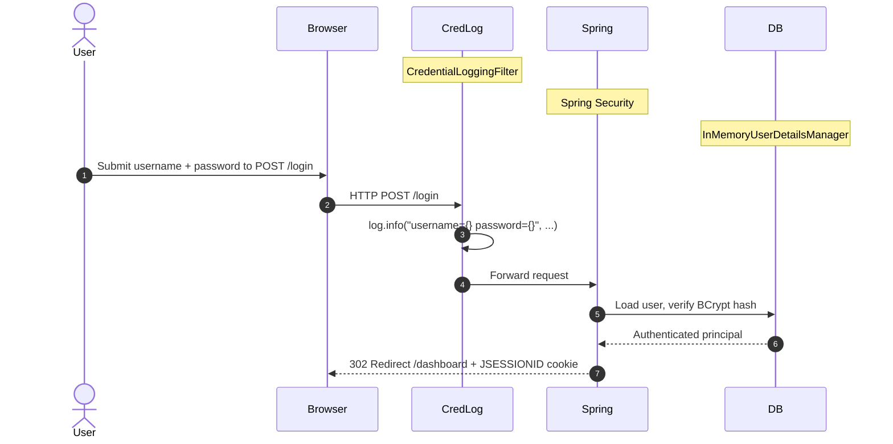

**Security assessment**

Two independent weaknesses sit on the login boundary:

- `CredentialLoggingFilter.java:25` fires unconditionally on every `POST /login` and writes `username={} password={}` to the application log - any log consumer receives every submitted password in cleartext.
- `SecurityConfig.java:28` globally disables Spring CSRF protection via `csrf(AbstractHttpConfigurer::disable)`, leaving all state-changing endpoints vulnerable to cross-site request forgery.

**Relevant findings**

- 🔴 [F-007](#f-007) — Forgeable Base64 Session Token
- 🔴 [F-009](#f-009) — Missing Authentication for Admin Board
- 🔴 [F-015](#f-015) — Unauthenticated Token Issuance for Arbitrary userId (Unauthenticated Token Issuance for Arbitrary `userId`)

<a id="cleartext-credential-logging"></a>
**Cleartext Credential Logging.**


**Status:** 🔴 Unsafe - Active filter logs every submitted password in cleartext on POST `/login`.

`CredentialLoggingFilter` is a `OncePerRequestFilter` registered before `UsernamePasswordAuthenticationFilter`. It intercepts login requests to capture authentication events on the application's POST `/login` endpoint.

**Security assessment**

`CredentialLoggingFilter.java:25` calls `log.info("Processing sign-in for username={} password={}", username, password)` unconditionally. The password parameter is the literal submitted value - not a hash, not a redacted marker. Any log aggregator, log file, or developer console receives a permanent record of every password submitted to the system.

**Relevant findings**

- 🔴 [F-007](#f-007) — Forgeable Base64 Session Token
- 🔴 [F-009](#f-009) — Missing Authentication for Admin Board
- 🔴 [F-015](#f-015) — Unauthenticated Token Issuance for Arbitrary userId (Unauthenticated Token Issuance for Arbitrary `userId`)

<a id="homegrown-session-token"></a>
#### 6.2.1 Homegrown Session Token

**Status:** 🔴 Unsafe - Base64-encoded user ID - no MAC, trivially forgeable.

`HomegrownSessionService` issues session tokens after authentication by encoding the authenticated user's numeric ID. Tokens are resolved on subsequent requests by decoding back to an ID and loading the matching `AppUser` record.

**Security assessment**

`HomegrownSessionService.java:21` returns `Base64.getEncoder().encodeToString(userId.toString().getBytes())` - an encoding with no signature, HMAC, or nonce. Any caller who knows a valid user ID (100, 101, 102 per the seeded demo data) can forge a valid token without credentials. The token for user 100 is the fixed string `MTAw`; for user 101 it is `MTAx`.

**Relevant findings**

- 🔴 [F-007](#f-007) — Forgeable Base64 Session Token
- 🔴 [F-009](#f-009) — Missing Authentication for Admin Board
- 🔴 [F-015](#f-015) — Unauthenticated Token Issuance for Arbitrary userId (Unauthenticated Token Issuance for Arbitrary `userId`)

<a id="sqlite-legacy-auth-cleartext-password-storage"></a>
**SQLite Legacy Auth - Cleartext Password Storage.**


**Status:** 🔴 Unsafe - Passwords seeded in cleartext; the `authenticateRaw` path builds SQL by string concatenation.

`LegacySqliteUserStore` manages a separate user table in `runtime/legacy-auth.sqlite`, seeded on startup with three accounts. It provides two authentication methods: a parameterized `authenticate()` and an injectable `authenticateRaw()`.

**Security assessment**

Two independent weaknesses exist in this store:

- `LegacySqliteUserStore.java:37-40` calls `save("legacy_alice", "password", "USER")` and `save("legacy_admin", "admin", "ADMIN")` with the literal password strings - no hashing takes place before insert. Reading the SQLite file yields all credentials in plaintext.
- `LegacySqliteUserStore.java:64` (`authenticateRaw`) builds `where username = '` + username + `'` by string concatenation. `' OR '1'='1` in the username bypasses the WHERE clause and returns the first row.

**Relevant findings**

- 🔴 [F-007](#f-007) — Forgeable Base64 Session Token
- 🔴 [F-009](#f-009) — Missing Authentication for Admin Board
- 🔴 [F-015](#f-015) — Unauthenticated Token Issuance for Arbitrary userId (Unauthenticated Token Issuance for Arbitrary `userId`)

<a id="sql-query-construction"></a>
**SQL Query Construction.**


**Status:** 🔴 Unsafe - String-concatenation SQL in DocumentLookupDao and `LegacySqliteUserStore.authenticateRaw()` on unauthenticated routes.

`DocumentLookupDao.java:18 — src/main/java/com/example/appsecverificationtarget/authentication/LegacySqliteUserStore.java:64`

Spring Data JPA and Hibernate handle most data access through typed `JpaRepository` interfaces. Two components exit that boundary and construct SQL by string concatenation.

**Security assessment**

`DocumentLookupDao.java:18` concatenates `tag` directly: `"select * from documents where tag = '" + tag + "' order by id"`. `LegacySqliteUserStore.java:64` constructs the credentials query the same way. Both routes are reachable without authentication - `/api/documents/search` and `/api/legacy-sqlite/**` are listed under `permitAll()` in `SecurityConfig.java:35-40` - so no prior login is required to reach either injection point.

**Relevant findings**

- 🔴 [F-007](#f-007) — Forgeable Base64 Session Token
- 🔴 [F-009](#f-009) — Missing Authentication for Admin Board
- 🔴 [F-015](#f-015) — Unauthenticated Token Issuance for Arbitrary userId (Unauthenticated Token Issuance for Arbitrary `userId`)

<a id="security-event-logging"></a>
**Security Event Logging.**


**Status:** 🟠 Weak - Login attempts are logged, but the log payload embeds cleartext passwords, converting audit records into a credential dump.

`CredentialLoggingFilter` produces a log entry for every login attempt on POST `/login`, capturing the authentication event with a username and outcome indicator for each request that reaches the endpoint.

**Security assessment**

`CredentialLoggingFilter.java:25` writes the password literal alongside the username in every log entry. Any consumer of the application log - a developer, an operations team member, or a log aggregation pipeline - receives a copy of every submitted password. A useful audit event (who attempted to log in, when) is negated by the credential exposure it introduces.

**Relevant findings**

- 🔴 [F-007](#f-007) — Forgeable Base64 Session Token
- 🔴 [F-009](#f-009) — Missing Authentication for Admin Board
- 🔴 [F-015](#f-015) — Unauthenticated Token Issuance for Arbitrary userId (Unauthenticated Token Issuance for Arbitrary `userId`)

<a id="user-registration"></a>
#### 6.2.2 User Registration

**Status:** 🔴 Unsafe - Registration stores passwords as unsalted `MD5` and imposes no privilege or rate constraint on self-registration.

`POST /register` is `permitAll()` in `SecurityConfig.java:31`. `RegistrationController` creates both an `AppUser` JPA record and a Spring Security in-memory user entry for each submitted registration.

The diagram shows the positive registration path from form submission to account creation:

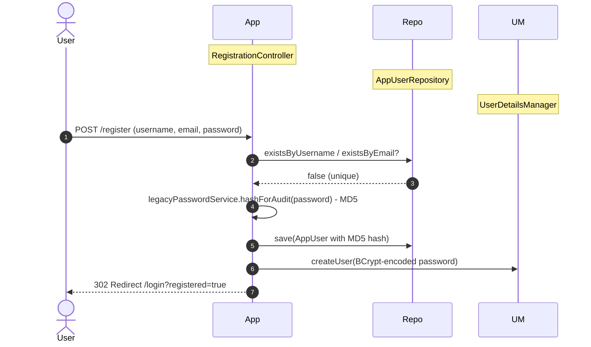

**Security assessment**

- `RegistrationController.java:52-58` saves `legacyPasswordService.hashForAudit(password)` in `AppUser.password` - an unsalted `MD5` hash reversible via rainbow tables. The BCrypt path is only the Spring Security in-memory store.
- Registration accepts any username without verification, MFA, or email confirmation, and the endpoint is unauthenticated - any caller can extend the set of valid accounts.

**Relevant findings**

- 🟠 [F-005](#f-005) — Mass Assignment Enables Privilege Escalation

<a id="password-reset"></a>
#### 6.2.3 Password Reset

**Status:** 🔴 Missing - No password reset endpoint or recovery flow exists in the codebase.

Account credential recovery for this application relies entirely on direct administrative intervention. `SecurityConfig.java` configures logout at `/logout` but defines no reset or recovery route, and no `PasswordResetController` or equivalent class was found.

**Security assessment**

No `GET /password-reset`, `POST /password-reset`, or equivalent endpoint exists. Users who lose their password cannot self-recover - an admin must manually update their record. The absence of a reset flow also removes a common account-takeover vector, but leaves the application without a remediation path when credentials are exposed through the cleartext logging or `MD5` storage weaknesses described above.

**Relevant findings**

- 🔴 [F-007](#f-007) — Forgeable Base64 Session Token
- 🔴 [F-009](#f-009) — Missing Authentication for Admin Board
- 🔴 [F-015](#f-015) — Unauthenticated Token Issuance for Arbitrary userId (Unauthenticated Token Issuance for Arbitrary `userId`)

### 6.3 Session and Token Controls

<a id="ctrl-session-and-token-controls"></a>

**Dependent crossings:** [tb-1](#tb-1) refuted - 🔴 [F-016](#f-016) — Unauthenticated H2 database console (`SecurityConfig.java:32`), 🟠 [F-031](#f-031) — CSRF globally disabled (`SecurityConfig.java:28`), 🟡 [F-055](#f-055) — Missing account lockout on form login (`SecurityConfig.java:53`) · [tb-3](#tb-3) refuted - 🔴 [F-009](#f-009) — Missing Authentication for Admin Board (`LegacyAdminBoardController.java:22`) · [tb-4](#tb-4) refuted - 🟠 [F-020](#f-020) — Improper Signature Verification (`LegacyJwtVerifier.java:15`) · [tb-5](#tb-5) unconfirmed - 🟠 [F-021](#f-021) — Unsigned XOR token accepted as identity proof (`CustomCryptoService.java:24`), 🟠 [F-038](#f-038) — Hardcoded XOR key enables offline vault-credential (`HomegrownCipher.java:8`)

**Verdict:** 🔴 Unsafe

<!-- The line below is mechanically derived from the controls table — LLM must not re-author it. -->
**Controls covered:**

- [6.3.1 Unsigned JWT](#631-unsigned-jwt)
- [6.3.2 Signed JWT](#632-signed-jwt)

**Implemented controls:** `src/main/java/com/example/appsecverificationtarget/authentication/LegacyJwtVerifier.java:14`; `src/main/java/com/example/appsecverificationtarget/authentication/SignedJwtService.java:19-42`.

**Assessment:** Two parallel JWT token paths coexist. `LegacyJwtVerifier` operates without a signing key and accepts unsigned tokens (no signature required). `SignedJwtService` generates an ephemeral `HS256` key at startup, pins the algorithm, and enforces a 15-minute expiry - but the key is lost on restart and no revocation mechanism exists. The sub-sections below trace each path through its lifecycle.

<a id="unsigned-jwt"></a><a id="unsigned-jwt-legacy"></a>
#### 6.3.1 Unsigned JWT

**Status:** 🔴 Unsafe - No signing key configured; unsigned tokens accepted.

`LegacyJwtVerifier` is a Spring service that parses incoming JWT tokens for claim extraction. It was intended to validate token authenticity on API calls that accept a `Bearer` token.

**Security assessment**

`LegacyJwtVerifier.java:14-17` calls `Jwts.parserBuilder().build().parseClaimsJwt(token)` - no signing key is provided to the parser builder. JJWT's `parseClaimsJwt` (note: not `parseClaimsJws`) explicitly accepts unsigned JWTs; any caller who crafts a JWT with `alg: none` and arbitrary claims in the payload will have those claims accepted as authentic.

**Relevant findings**

- No dedicated finding routed in this assessment.

<a id="signed-jwt"></a><a id="signed-jwt-jjwt-hs256"></a>
#### 6.3.2 Signed JWT

**Status:** 🟡 Partial - `HS256` signing with algorithm pinning and 15-minute expiry; ephemeral key lost on restart, no revocation.

`SignedJwtService` issues `HS256`-signed JWTs on demand. `Keys.secretKeyFor(SignatureAlgorithm.HS256)` generates the signing key once at startup. The token verification path (`verify()`) pins the algorithm to `HS256` and rejects mismatches.

**Security assessment**

- `SignedJwtService.java:19` uses `Keys.secretKeyFor(HS256)` - an in-process ephemeral key. A server restart invalidates all previously issued tokens, and the key cannot be rotated without a restart.
- Algorithm pinning at `SignedJwtService.java:37-39` prevents `alg:none` and algorithm-substitution attacks on this path - the strongest control on the session layer.
- No revocation list or blocklist is implemented; a compromised or stolen token remains valid for its full 15-minute window.

**Relevant findings**

- No dedicated finding routed in this assessment.

The diagram shows the signed JWT issuance and validation lifecycle for authenticated requests:

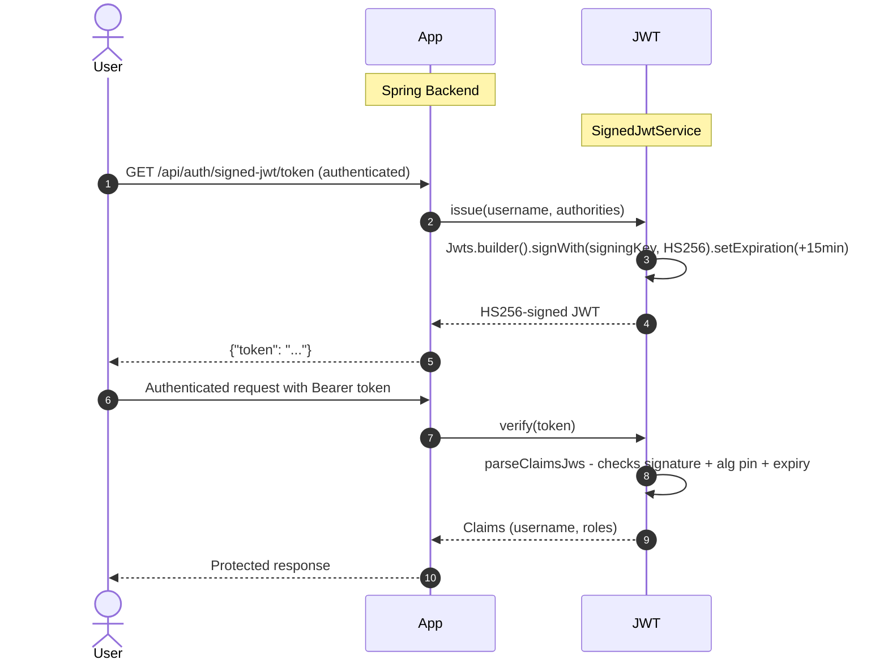

### 6.4 Authorization Controls

<a id="ctrl-authorization-controls"></a>

**Dependent crossings:** [tb-1](#tb-1) unconfirmed - 🔴 [F-018](#f-018) — PermitAll H2 console allows unauthenticated full (`SecurityConfig.java:32`), 🟠 [F-051](#f-051) — Unauthenticated legacy admin board (`SecurityConfig.java:41`) · [tb-2](#tb-2) refuted - 🟠 [F-050](#f-050) — IDOR on order fetch no ownership check (`OrderAccessController.java:24`) · [tb-3](#tb-3) refuted - 🔴 [F-019](#f-019) — Unauthenticated Privilege Escalation (`LegacyAdminBoardController.java:31`) · [tb-4](#tb-4) unconfirmed - 🔴 [F-013](#f-013) — Unauthenticated Endpoint Exposes All User (`LegacySqliteAuthController.java:65`), 🟠 [F-037](#f-037) — Wildcard IAM Permissions on All Resources — main.tf:217, 🟠 [F-054](#f-054) — Missing authorization on `/users` endpoint (`LegacySqliteUserStore.java:77`)


**Systemic weaknesses:** [W-002](#w-002), [W-004](#w-004)
**Verdict:** 🔴 Unsafe

<!-- The line below is mechanically derived from the controls table — LLM must not re-author it. -->
**Controls covered:**

- [6.4.1 Route Authentication](#641-route-authentication)
- [6.4.2 Object-Level Ownership Check](#642-object-level-ownership-check)
- [6.4.3 Legacy Admin Board Authentication](#643-legacy-admin-board-authentication)
- [6.4.4 H2 Console Access Control](#644-h2-console-access-control)
- [6.4.5 Actuator Endpoint Protection](#645-actuator-endpoint-protection)
- [6.4.6 Admin Report Authentication](#646-admin-report-authentication)
- [6.4.7 Centralised Authorization Policy](#647-centralised-authorization-policy)

**Implemented controls:** `src/main/java/com/example/appsecverificationtarget/config/SecurityConfig.java:31-48`; `src/main/java/com/example/appsecverificationtarget/accesscontrol/OrderAccessController.java:24`; `src/main/java/com/example/appsecverificationtarget/legacyadmin/LegacyAdminBoardController.java:22` - `src/main/java/com/example/appsecverificationtarget/config/SecurityConfig.java:41`; `src/main/java/com/example/appsecverificationtarget/config/SecurityConfig.java:32`; `src/main/java/com/example/appsecverificationtarget/config/SecurityConfig.java:33`.

**Assessment:** `SecurityConfig.java` centralises route authorization in one filter chain annotated `@EnableMethodSecurity`. The policy ends with `anyRequest().authenticated()`, but seventeen preceding `permitAll()` patterns expose administrative surfaces, database consoles, SSRF endpoints, and the legacy admin board to unauthenticated callers. Object-level ownership is absent on the primary order-fetch route.

<a id="route-authentication"></a><a id="route-authentication-spring-security-permitall"></a>
#### 6.4.1 Route Authentication

**Status:** 🔴 Unsafe - Numerous privileged surfaces exposed to unauthenticated callers via `permitAll`.

`SecurityConfig.java` defines the application's URL authorization policy. Authenticated routes require a valid Spring Security session or a signed JWT passed via `SignedJwtAuthenticationFilter`, inserted before `UsernamePasswordAuthenticationFilter`.

**Security assessment**

`SecurityConfig.java:31-48` grants `permitAll()` to a large surface before the `anyRequest().authenticated()` catchall. Unauthenticated callers reach:

- `/h2-console/**` - full H2 database web console with direct JDBC access
- `/actuator/**` - all Spring Boot actuator endpoints including `/actuator/env` and `/actuator/heapdump`
- `GET /api/admin/report` - administrative reporting
- `/legacy/admin/**` - user promotion and deletion board
- `GET /api/integration/fetch` - server-side HTTP fetch (SSRF)
- `/api/legacy-sqlite/**` - raw SQLite auth path with string-concatenation SQL

**Relevant findings**

- 🟠 [F-005](#f-005) — Mass Assignment Enables Privilege Escalation
- 🔴 [F-012](#f-012) — Missing Authorization on Privileged
- 🔴 [F-013](#f-013) — Unauthenticated Endpoint Exposes All User

<a id="object-level-ownership-check"></a><a id="object-level-ownership-check-idorbola"></a>
#### 6.4.2 Object-Level Ownership Check

**Status:** 🔴 Unsafe - GET `/api/orders/{id}` fetches records with no caller-ownership verification.

`OrderAccessController` provides two order-retrieval endpoints. `GET /api/orders/{id}/owned` at `OrderAccessController.java:32` checks that the authenticated caller is the order owner or an admin. `GET /api/orders/{id}` at `:24` does not.

**Security assessment**

`OrderAccessController.java:24` calls `customerOrderRepository.findById(id)` and returns the record without consulting `authentication.getName()`. Any authenticated user who sends `GET /api/orders/100`, `GET /api/orders/101`, or `GET /api/orders/102` receives the order regardless of ownership. The corrected endpoint (`/owned`) is present and correct but is not the default route.

**Relevant findings**

- 🟠 [F-005](#f-005) — Mass Assignment Enables Privilege Escalation
- 🔴 [F-012](#f-012) — Missing Authorization on Privileged
- 🔴 [F-013](#f-013) — Unauthenticated Endpoint Exposes All User

<a id="legacy-admin-board-authentication"></a>
#### 6.4.3 Legacy Admin Board Authentication

**Status:** 🔴 Unsafe - Unauthenticated privilege escalation and user deletion via `/legacy/admin/**`.

`LegacyAdminBoardController` manages user administration through an HTML board at `/legacy/admin`. It lists all users and handles `POST /legacy/admin/users/{id}/promote` (sets `admin=true`, `role=ADMIN`) and `POST /legacy/admin/users/{id}/delete`.

`src/main/java/com/example/appsecverificationtarget/legacyadmin/LegacyAdminBoardController.java:22 — src/main/java/com/example/appsecverificationtarget/config/SecurityConfig.java:41`

**Security assessment**

`SecurityConfig.java:41` grants `permitAll()` to `/legacy/admin/**`. Any unauthenticated HTTP client can navigate to `/legacy/admin`, see the full user list, promote any account ID to ADMIN, or delete accounts - no session, token, or API key is checked anywhere in the request path for these operations.

**Relevant findings**

- 🟠 [F-005](#f-005) — Mass Assignment Enables Privilege Escalation
- 🔴 [F-012](#f-012) — Missing Authorization on Privileged
- 🔴 [F-013](#f-013) — Unauthenticated Endpoint Exposes All User

<a id="h2-console-access-control"></a>
#### 6.4.4 H2 Console Access Control

**Status:** 🔴 Unsafe - H2 web console accessible without authentication; provides direct SQL execution against application data.

Spring Boot's H2 in-memory database includes a browser-based SQL console at `/h2-console`. The console provides a JDBC-level interface to the application's primary datastore, accepting arbitrary SQL statements and returning full result sets.

**Security assessment**

`SecurityConfig.java:32` grants `permitAll()` to `/h2-console/**`. The frame-options rule at `:29` sets `sameOrigin` - this prevents cross-origin framing but does not restrict direct HTTP navigation to the console URL. Any caller with network access to port 8080 can open `/h2-console`, connect to the H2 instance, and execute arbitrary SQL against the application's user, order, and document tables.

**Relevant findings**

- 🟠 [F-005](#f-005) — Mass Assignment Enables Privilege Escalation
- 🔴 [F-012](#f-012) — Missing Authorization on Privileged
- 🔴 [F-013](#f-013) — Unauthenticated Endpoint Exposes All User

<a id="actuator-endpoint-protection"></a>
#### 6.4.5 Actuator Endpoint Protection

**Status:** 🔴 Unsafe - All Spring Boot actuator endpoints exposed without authentication.

Spring Boot Actuator provides operational endpoints for monitoring, diagnostics, and runtime introspection. Endpoints include `/actuator/env` (resolved environment variables and configuration properties), `/actuator/heapdump` (JVM heap snapshot), `/actuator/beans` (full Spring context), `/actuator/mappings` (all HTTP route registrations), and `/actuator/health`.

**Security assessment**

`SecurityConfig.java:33` routes `/actuator/**` through `permitAll()`. Any unauthenticated caller can retrieve environment variables including secrets injected via `JWT_SECRET` or other properties, download a heap dump that contains in-memory credentials, or enumerate all application routes and bean definitions. No `management.endpoints.web.exposure.include` restriction was found in the application configuration.

**Relevant findings**

- 🟠 [F-005](#f-005) — Mass Assignment Enables Privilege Escalation
- 🔴 [F-012](#f-012) — Missing Authorization on Privileged
- 🔴 [F-013](#f-013) — Unauthenticated Endpoint Exposes All User

<a id="admin-report-authentication"></a>
#### 6.4.6 Admin Report Authentication

**Status:** 🔴 Unsafe - GET `/api/admin/report` exposed without authentication.

An administrative reporting endpoint at `GET /api/admin/report` returns application-scoped data intended for admin review. The route is declared separately from the general API surface to signal its administrative intent.

**Security assessment**

`SecurityConfig.java:34` explicitly lists `HttpMethod.GET, "/api/admin/report"` inside the `permitAll()` block. The route's admin-scope designation has no corresponding access restriction - any unauthenticated caller can reach it. This is an isolated misconfiguration: the surrounding `anyRequest().authenticated()` rule applies to all other request paths.

**Relevant findings**

- 🟠 [F-005](#f-005) — Mass Assignment Enables Privilege Escalation
- 🔴 [F-012](#f-012) — Missing Authorization on Privileged
- 🔴 [F-013](#f-013) — Unauthenticated Endpoint Exposes All User

<a id="centralised-authorization-policy"></a>
#### 6.4.7 Centralised Authorization Policy

**Status:** 🟠 Weak - A single SecurityConfig centralises route rules, but the extent of `permitAll` exemptions defeats its protective value.

`SecurityConfig.java` is the sole location for URL authorization rules, annotated `@EnableMethodSecurity`. All route-level decisions flow through one `SecurityFilterChain` bean - a structurally sound approach that avoids scattered per-controller `@Secured` annotations.

**Security assessment**

The structure is correct; the policy content is not. Fourteen separate `permitAll()` patterns appear before the `anyRequest().authenticated()` catchall at `SecurityConfig.java:48`, exposing administrative, diagnostic, and data-access routes. `@EnableMethodSecurity` is active but no `@PreAuthorize` annotations were observed on the privileged endpoints. The ownership check at `OrderAccessController.java:24` (`GET /api/orders/{id}`) is missing entirely - demonstrating that URL-level authentication is insufficient without object-level authorization.

**Relevant findings**

- 🟠 [F-005](#f-005) — Mass Assignment Enables Privilege Escalation
- 🔴 [F-012](#f-012) — Missing Authorization on Privileged
- 🔴 [F-013](#f-013) — Unauthenticated Endpoint Exposes All User

### 6.5 Query Construction and Data Access Controls

<a id="ctrl-query-construction-and-data-access-controls"></a>

**Dependent crossings:** [tb-18](#tb-18) refuted - 🔴 [F-011](#f-011) — SQL Injection (`LegacySqliteUserStore.java:64`)

**Verdict:** 🟠 Weak

<!-- The line below is mechanically derived from the section's default mechanism — LLM must not re-author it. -->
**Controls covered:**

- [6.5.1 Database Query Construction](#651-database-query-construction)

**Implemented controls:** Spring Data `JpaRepository` interfaces back most entity access; `EntityManager` native queries handle the two raw-SQL outliers in `DocumentLookupDao`.

**Assessment:** Spring Data JPA and Hibernate provide parameterized queries for the majority of data access. Two components exit the ORM boundary and concatenate user input into raw SQL strings, both reachable without authentication.

<a id="database-query-construction"></a><a id="query-construction"></a>
#### 6.5.1 Database Query Construction

**Status:** 🔴 Unsafe - Raw SQL string concatenation in DocumentLookupDao and LegacySqliteUserStore on unauthenticated endpoints.

Spring Data `JpaRepository` interfaces back most entity access in `domain.*` and `clean.*`. JPA's JPQL and Hibernate's parameterized queries keep user input separated from query structure on those paths.

**Security assessment**

Two paths leave the ORM boundary entirely:

- `DocumentLookupDao.java:18` calls `entityManager.createNativeQuery("select * from documents where tag = '" + tag + "' order by id", DocumentRecord.class)` - the `tag` value comes from `@RequestParam` on `/api/documents/search`, a `permitAll()` route.
- `LegacySqliteUserStore.java:64` (`authenticateRaw`) builds `"where username = '" + username + "' and password = '" + password + "'"` on a raw JDBC `Statement` - reachable via `/api/legacy-sqlite/**`, also `permitAll()`.

The safe sibling `LegacySqliteUserStore.authenticate()` at `:43` uses `PreparedStatement` with `setString()` bindings - demonstrating the fix is a local choice, not an architectural constraint.

**Relevant findings**

- 🔴 [F-011](#f-011) — SQL Injection

### 6.6 Input Boundary Validation Controls

<a id="ctrl-input-boundary-validation-controls"></a>

**Dependent crossings:** [tb-1](#tb-1) unconfirmed - 🟠 [F-030](#f-030) — Path traversal (`BusinessFileStorage.java:23`), 🟡 [F-056](#f-056) — Unrestricted file type upload (`BusinessFileStorage.java:24`) · [tb-2](#tb-2) unconfirmed - 🟠 [F-005](#f-005) — Mass Assignment Enables Privilege Escalation · [tb-4](#tb-4) unconfirmed - 🔴 [F-011](#f-011) — SQL Injection (`LegacySqliteUserStore.java:64`) · [tb-10](#tb-10) unconfirmed - 🟠 [F-025](#f-025) — OS Command Injection

**Verdict:** 🟠 Weak

<!-- The line below is mechanically derived from the controls table — LLM must not re-author it. -->
**Controls covered:**

- [6.6.1 Validation Approach](#661-validation-approach)
- [6.6.2 Schema / Allowlist Input Validation](#662-schema--allowlist-input-validation)

**Implemented controls:** `src/main/java/com/example/appsecverificationtarget/landscape/LandscapeOperations.java:63`.

**Assessment:** Spring MVC type binding and some Bean Validation constraints apply to form-backed endpoints. Coverage is absent on the vulnerable API routes - document search, order search, and the legacy SQLite path - where unconstrained string parameters flow directly into raw SQL or unbounded queries.

<a id="validation-approach"></a>
#### 6.6.1 Validation Approach

**Status:** 🟠 Weak - Spring MVC type coercion is active, but no allowlist or length constraint covers the vulnerable input routes.

Spring MVC's `@RequestParam` and `@PathVariable` binding enforce type coercion. `@EnableMethodSecurity` and Jakarta Bean Validation are available on the classpath. The landscape service path at `LandscapeOperations.java:63` contains an explicit bounds check for service operation parameters.

**Security assessment**

Type coercion prevents non-numeric values on `@PathVariable Long id` bindings, but the string parameters that reach `DocumentLookupDao.findByTag()` and `LegacySqliteUserStore.authenticateRaw()` receive no additional constraint. No global request-body schema validation, no field-length enforcement, and no format allowlist was detected on the API surface that matters most.

**Relevant findings**

- 🟡 [F-066](#f-066) — Unbounded Credential Logging Enables Log
- 🟡 [F-067](#f-067) — Unbounded request parameter drives unchecked heap
- 🟡 [F-068](#f-068) — Unauthenticated expensive queries exhaust cluster

<a id="schema-allowlist-input-validation"></a>
#### 6.6.2 Schema / Allowlist Input Validation

**Status:** 🟠 Weak - Spot checks in the landscape service; no schema or allowlist protection on vulnerable injection points.

`LandscapeOperations.java:63` applies a range check to landscape service operation input, establishing that validation is available and used in parts of the codebase.

**Security assessment**

The landscape service validation is a single-route guard - it does not extend to the document search, order search, or legacy-sqlite routes. No `@Valid` annotation, global `HandlerMethodArgumentResolver`, or request-body validator intercepts the parameters that reach the raw SQL construction paths. Allowlisting the `tag` parameter on `DocumentLookupDao.findByTag()` to alphanumeric characters would close the injection path without requiring a schema overhaul.

**Relevant findings**

- 🟡 [F-066](#f-066) — Unbounded Credential Logging Enables Log
- 🟡 [F-067](#f-067) — Unbounded request parameter drives unchecked heap
- 🟡 [F-068](#f-068) — Unauthenticated expensive queries exhaust cluster

### 6.7 Output Encoding and Rendering Controls

**Verdict:** -

**Controls covered:** _No sub-controls catalogued in this assessment._

**Implemented controls:** Thymeleaf template engine provides HTML auto-escaping for all `th:text` bindings by default.

**Assessment:** _No security finding was routed to output encoding in this assessment._

_Not applicable for this codebase - no controls or findings are routed to 6.7 Output Encoding and Rendering Controls._

### 6.8 Browser and Cross-Origin Controls


**Systemic weaknesses:** [W-004](#w-004)
**Verdict:** 🔴 Unsafe

<!-- The line below is mechanically derived from the controls table — LLM must not re-author it. -->
**Controls covered:**

- [6.8.1 CSRF Token Enforcement](#681-csrf-token-enforcement)
- [6.8.2 CORS Origin Validation](#682-cors-origin-validation)

**Implemented controls:** `src/main/java/com/example/appsecverificationtarget/config/SecurityConfig.java:28` - `src/main/java/com/example/appsecverificationtarget/csrf/CsrfSettingsController.java:47`; `src/main/java/com/example/appsecverificationtarget/cors/CorsPolicyFilter.java:31`.

**Assessment:** Spring CSRF protection is globally disabled. A homegrown CSRF token is generated for the settings form but checked only for non-blank presence - the server never validates it against the issued value. The CORS policy reflects any `http://` or `https://` origin with `Access-Control-Allow-Credentials: true`, granting every web origin full credentialed cross-origin access.

<a id="csrf-token-enforcement"></a>
#### 6.8.1 CSRF Token Enforcement

**Status:** 🔴 Unsafe - Spring CSRF disabled; homegrown token generated but never compared server-side.

`src/main/java/com/example/appsecverificationtarget/config/SecurityConfig.java:28 — src/main/java/com/example/appsecverificationtarget/csrf/CsrfSettingsController.java:47`

`CsrfSettingsController` generates a form token for the contact-preference settings page at `GET /csrf/settings` via `CsrfTokenService.issueToken(session)`. The token is placed in the model and rendered in the form.

**Security assessment**

`SecurityConfig.java:28` disables Spring CSRF globally with `csrf(AbstractHttpConfigurer::disable)`. `CsrfSettingsController.java:47` checks `if (formToken == null || formToken.isBlank())` and rejects blank values - but any non-empty string, including `x` or `1`, passes the check. The token issued by `CsrfTokenService` is never retrieved from the session and compared against the submitted value. All state-changing POST endpoints outside the settings page receive no CSRF check at all.

**Relevant findings**

- 🟠 [F-031](#f-031) — CSRF globally disabled
- 🟠 [F-049](#f-049) — Vault dev mode with no persistent storage causes full

<a id="cors-origin-validation"></a>
#### 6.8.2 CORS Origin Validation

**Status:** 🔴 Unsafe - Reflects any http:// origin with Allow-Credentials: true - universal CORS bypass.

`CorsPolicyFilter` is a `OncePerRequestFilter` that sets `Access-Control-Allow-Origin`, `Access-Control-Allow-Credentials`, and related CORS response headers based on the incoming `Origin` header value.

**Security assessment**

`CorsPolicyFilter.java:31` (`isTrustedOrigin`) returns `true` whenever `origin != null && origin.startsWith("http")`. Every `http://` and `https://` origin qualifies - the check is semantically equivalent to a wildcard. The filter then reflects the origin verbatim as `Access-Control-Allow-Origin` and sets `Access-Control-Allow-Credentials: true`. A malicious page on any domain can make credentialed cross-origin requests, receive session-authenticated responses, and exfiltrate data without the browser's same-origin policy intervening.

**Relevant findings**

- 🟠 [F-031](#f-031) — CSRF globally disabled
- 🟠 [F-049](#f-049) — Vault dev mode with no persistent storage causes full

### 6.9 Cryptography Secrets and Data Protection


**Systemic weaknesses:** [W-005](#w-005), [W-006](#w-006)
**Verdict:** 🔴 Unsafe

<!-- The line below is mechanically derived from the controls table — LLM must not re-author it. -->
**Controls covered:**

- [6.9.1 Password Hashing](#691-password-hashing)
- [6.9.2 Password Hashing](#692-password-hashing)
- [6.9.3 Vault Credential Encryption](#693-vault-credential-encryption)
- [6.9.4 Transport Encryption](#694-transport-encryption)

**Implemented controls:** `src/main/java/com/example/appsecverificationtarget/config/SecurityConfig.java:131`; `src/main/java/com/example/appsecverificationtarget/crypto/LegacyPasswordService.java:15`; `src/main/java/com/example/appsecverificationtarget/crypto/HomegrownCipher.java:8`.

**Assessment:** Two password-storage paths exist for the same accounts: BCrypt via Spring Security (adequate on its path) and unsalted `MD5` via `LegacyPasswordService` stored in `AppUser.password`. Vault credential storage uses a XOR cipher with a hardcoded key committed to source. No application-layer TLS configuration was found.

<a id="password-hashing"></a><a id="password-hashing-spring-security-bcrypt"></a>
#### 6.9.1 Password Hashing

**Status:** 🟢 Adequate - BCrypt with default cost factor (10) used for the Spring Security in-memory user store.

`SecurityConfig.java:131` declares a `BCryptPasswordEncoder` bean. Spring Security uses it to hash passwords when `RegistrationController` calls `userDetailsManager.createUser()` and to verify submitted passwords on the form-login path.

**Security assessment**

BCrypt at the default cost factor (10) is adequate for credential storage on this path. A dump of the Spring Security in-memory user store yields hashes that require genuine offline work to invert. The gap is that this path is not the only storage: `RegistrationController` also saves `legacyPasswordService.hashForAudit(password)` in `AppUser.password` - see [§6.9.2](#692-password-hashing).

**Relevant findings**

- 🟠 [F-001](#f-001) — Hardcoded Root Service Credentials in Repository
- 🟠 [F-003](#f-003) — Hardcoded Secrets Committed to Version Control
- 🟠 [F-026](#f-026) — Hand-rolled XOR / repeating-key cipher

<a id="password-hashing-legacy-md5"></a>
#### 6.9.2 Password Hashing

**Status:** 🔴 Unsafe - Unsalted `MD5` - trivially reversed via rainbow table.

`LegacyPasswordService.hashForAudit()` computes a password digest for the `AppUser` JPA record. `RegistrationController` calls it at registration time to populate `AppUser.password`.

**Security assessment**

`LegacyPasswordService.java:15` calls `MessageDigest.getInstance("MD5")` with no salt and a single round - a fast, unsalted hash. Any dump of the `AppUser` table from `/h2-console` (unauthenticated) yields `password` field values reversible against standard rainbow tables. The `MD5` hash of the string `"password"` is a fixed, well-known value; all three seeded accounts use this password.

**Relevant findings**

- 🟠 [F-001](#f-001) — Hardcoded Root Service Credentials in Repository
- 🟠 [F-003](#f-003) — Hardcoded Secrets Committed to Version Control
- 🟠 [F-026](#f-026) — Hand-rolled XOR / repeating-key cipher

<a id="vault-credential-encryption"></a><a id="vault-credential-encryption-homegrowncipher"></a>
#### 6.9.3 Vault Credential Encryption

**Status:** 🔴 Unsafe - Hardcoded XOR key in source - equivalent to cleartext storage.

`HomegrownCipher` is the encryption service for the `vault_credentials` table. It encodes stored credential values before database insert and decodes them on read, providing a reversible transform intended to protect secrets at rest.

**Security assessment**

`HomegrownCipher.java:8` defines the cipher key as a hardcoded string literal committed to source:

```java
private static final byte[] KEY = "orderdesk-legacy-key".getBytes(StandardCharsets.UTF_8);
```

XOR with a static key provides no cryptographic protection - anyone with the source file can reverse every stored credential by repeating the same XOR operation. The key is also short (20 bytes), causing key reuse for any credential longer than 20 characters.

**Relevant findings**

- 🟠 [F-001](#f-001) — Hardcoded Root Service Credentials in Repository
- 🟠 [F-003](#f-003) — Hardcoded Secrets Committed to Version Control
- 🟠 [F-026](#f-026) — Hand-rolled XOR / repeating-key cipher

<a id="transport-encryption"></a><a id="transport-encryption-tls"></a>
#### 6.9.4 Transport Encryption

**Status:** 🔴 Missing - No application-layer TLS configuration found; deployment-layer enforcement unknown.

Transport encryption protects credentials, session tokens, and sensitive responses from interception. Spring Boot supports TLS via `server.ssl.*` properties in `application.properties` or `application.yml`.

**Security assessment**

No `server.ssl.key-store`, `server.ssl.certificate`, or equivalent TLS property was found. The application starts on plain HTTP port 8080 per `docker-compose.yml`. All session tokens - including the signed JWT and the homegrown Base64 token - transit in cleartext from the application's perspective. The `CredentialLoggingFilter` password logs also travel unencrypted. Whether a reverse proxy or load balancer enforces TLS in a deployment environment is not determinable from the source.

**Relevant findings**

- 🟠 [F-001](#f-001) — Hardcoded Root Service Credentials in Repository
- 🟠 [F-003](#f-003) — Hardcoded Secrets Committed to Version Control
- 🟠 [F-026](#f-026) — Hand-rolled XOR / repeating-key cipher

### 6.10 File Parser and Outbound Request Controls

<a id="ctrl-file-parser-and-outbound-request-controls"></a>

_No trust boundary in this model depends on this control class._


**Systemic weaknesses:** [W-003](#w-003)
**Verdict:** 🔴 Unsafe

<!-- The line below is mechanically derived from the controls table — LLM must not re-author it. -->
**Controls covered:**

- [6.10.1 Outbound URL Validation](#6101-outbound-url-validation)

**Implemented controls:** `src/main/java/com/example/appsecverificationtarget/serverside/IntegrationController.java:23`.

**Assessment:** `IntegrationController` at `GET /api/integration/fetch` passes a user-controlled URL directly to `RestTemplate.getForObject()` with no scheme filter, domain allowlist, or internal-IP block. The endpoint is `permitAll()`, removing any credential barrier before exploitation.

<a id="outbound-url-validation"></a><a id="outbound-url-validation-ssrf"></a>
#### 6.10.1 Outbound URL Validation

**Status:** 🔴 Unsafe - User-controlled URL passed to RestTemplate on a `permitAll` route - no SSRF guard.

`IntegrationController` provides a server-side HTTP integration endpoint at `GET /api/integration/fetch?url=...`. It issues an outbound `RestTemplate` request from the application's network context and returns the first 2000 characters of the response body.

**Security assessment**

`IntegrationController.java:22` calls `restTemplate.getForObject(url, String.class)` where `url` is the raw `@RequestParam` value with no processing. Three independent gaps compound:

- No scheme allowlist - `file://`, `dict://`, `gopher://`, and `ftp://` schemes may be followed depending on the JVM and OS network stack.
- No destination allowlist or internal-IP block - `http://169.254.169.254/` (AWS IMDS), `http://localhost:8080/actuator/env`, and other internal services are reachable.
- The endpoint is `permitAll()` per `SecurityConfig.java:37` - no credential is required to trigger an outbound request.

**Relevant findings**

- 🟠 [F-025](#f-025) — OS Command Injection
- 🟠 [F-030](#f-030) — Path traversal
- 🟠 [F-036](#f-036) — Unauthenticated actuator endpoints

### 6.11 Operations Runtime and Supply Chain Controls

**Verdict:** 🔴 Missing

<!-- The line below is mechanically derived from the controls table — LLM must not re-author it. -->
**Controls covered:**

- [6.11.1 Third-Party Dependency Management](#6111-third-party-dependency-management)
- [6.11.2 Automated SCA scanning](#6112-automated-sca-scanning)
- [6.11.3 Automated dependency updates](#6113-automated-dependency-updates)
- [6.11.4 Lockfile hygiene](#6114-lockfile-hygiene)

**Implemented controls:** `pom.xml`.

**Assessment:** `pom.xml` declares explicit version strings for direct dependencies via the Spring Boot parent BOM. No Software Composition Analysis tool, no automated dependency-update configuration, and no CI pipeline were detected. Known-vulnerable library versions are in use.

<a id="third-party-dependency-management"></a>
#### 6.11.1 Third-Party Dependency Management

**Status:** 🟡 Partial - Maven `pom.xml` declares explicit versions but carries known-vulnerable libraries and no lockfile.

`pom.xml` uses the Spring Boot parent BOM to manage transitive dependency versions and declares explicit version strings for direct dependencies including `jjwt-api`. The Spring Boot BOM provides central version governance for its managed libraries.

**Security assessment**

Explicit version declarations prevent accidental upgrades but do not verify that the declared versions are free of known CVEs. Maven does not produce a committed dependency lockfile - transitive versions within the BOM scope are resolved at build time and can shift with BOM updates. No `mvn dependency:tree` snapshot or equivalent lockfile was found committed to the repository.

**Relevant findings**

- 🟠 [F-002](#f-002) — No Audit Logging Across Service Infrastructure
- 🟠 [F-006](#f-006) — Databases Configured With Superuser Accounts No Role Separation
- 🟠 [F-035](#f-035) — Cleartext Credentials Written to Application

<a id="automated-sca-scanning"></a>
#### 6.11.2 Automated SCA scanning

**Status:** 🔴 Missing - No SCA tool configuration found in the repository.

Software Composition Analysis tools scan declared and transitive dependencies against CVE databases and block CI pipelines when vulnerabilities above a configured threshold are detected. Common options for Maven projects include `dependency-check-maven`, `snyk`, `trivy`, and GitHub Dependabot security alerts.

**Security assessment**

No `dependency-check` plugin in `pom.xml`, no `.snyk` policy file, no `trivy.yaml`, and no `.github/dependabot.yml` security-alert configuration was found. A newly published CVE against `jjwt-api`, Spring Boot, or any other declared library will not trigger any automated alert, gate, or pull-request.

**Relevant findings**

- 🟠 [F-002](#f-002) — No Audit Logging Across Service Infrastructure
- 🟠 [F-006](#f-006) — Databases Configured With Superuser Accounts No Role Separation
- 🟠 [F-035](#f-035) — Cleartext Credentials Written to Application

<a id="automated-dependency-updates"></a>
#### 6.11.3 Automated dependency updates

**Status:** 🔴 Missing - No Dependabot, Renovate, or equivalent configuration found.

Automated dependency-update tools open pull requests when newer secure versions of declared libraries are published, keeping the dependency graph current without manual monitoring.

**Security assessment**

No `renovate.json`, `.github/dependabot.yml` (version-updates section), or equivalent configuration was found. Library versions in `pom.xml` will age silently. The `jjwt-api` version in use predates algorithm-confusion hardening shipped in later JJWT releases; without automated update prompts, the upgrade will not happen unless manually triggered.

**Relevant findings**

- 🟠 [F-002](#f-002) — No Audit Logging Across Service Infrastructure
- 🟠 [F-006](#f-006) — Databases Configured With Superuser Accounts No Role Separation
- 🟠 [F-035](#f-035) — Cleartext Credentials Written to Application

<a id="lockfile-hygiene"></a>
#### 6.11.4 Lockfile hygiene

**Status:** 🟢 Adequate - Maven `pom.xml` specifies explicit version strings for all direct dependencies; no floating qualifiers detected.

`pom.xml` declares explicit version strings for all non-BOM direct dependencies. The Spring Boot parent BOM pins transitive versions within its managed scope. Dependency resolution is deterministic for declared versions.

**Security assessment**

No `LATEST`, `RELEASE`, or open-ended version range qualifier (`[1.0,)`) appears in `pom.xml`. All direct dependency versions are pinned strings. Transitive versions inside the Spring Boot BOM are centrally managed, limiting unintended upgrades within a BOM version. This is the strongest supply-chain control present - it does not substitute for SCA or automated update tooling but provides a reproducible build baseline.

**Relevant findings**

- 🟠 [F-002](#f-002) — No Audit Logging Across Service Infrastructure
- 🟠 [F-006](#f-006) — Databases Configured With Superuser Accounts No Role Separation
- 🟠 [F-035](#f-035) — Cleartext Credentials Written to Application

### 6.12 Real-time and Not Applicable Controls

<!-- §6.12 LOCKED — mechanically derived: no routed finding and no real-time, LLM, GraphQL, or gRPC component in the model. Renderer must not rewrite the line below. -->
_Not applicable - no finding routed to this category, and the architecture model contains no real-time / WebSocket, AI/LLM, GraphQL, or gRPC component. Controls catalogued elsewhere (container hardening, dependency determinism) are covered in their primary [§6](#6-security-architecture) sections._

### 6.13 Defense-in-Depth Summary

**Verdict:** 🔴 Unsafe

BCrypt password hashing (`SecurityConfig.java:131`) protects Spring Security credentials adequately. `SignedJwtService` pins the JWT algorithm to `HS256` and enforces a 15-minute expiry - the strongest active session control in the codebase. `LegacySqliteUserStore.authenticate()` uses `PreparedStatement` with bound parameters, confirming the safe path exists alongside the vulnerable `authenticateRaw()`. `SecurityConfig.java` centralises all route rules in one filter chain, which is structurally sound.

Four control-boundary repairs close the widest breaches: replace the seventeen `permitAll()` exemptions with authenticated or role-gated routes; replace raw SQL in `DocumentLookupDao.findByTag()` and `LegacySqliteUserStore.authenticateRaw()` with parameterized statements (the parameterized sibling in the same class is the template); move `HomegrownCipher`'s static XOR key out of source into a runtime-injected secret and replace the XOR cipher with AES-GCM; and replace `LegacyJwtVerifier`'s keyless `parseClaimsJwt()` with a signing-key-bound `parseClaimsJws()`. `CredentialLoggingFilter` should be removed entirely - no audit value justifies recording plaintext passwords in application logs.

<!-- enriched:standard -->

---

<a id="weakness-register"></a>
## 7. Weakness Register

Systemic control gaps behind the findings, ordered by severity (W-001 = most severe). Each weakness names the missing, home-grown, or misused control, the findings that evidence it, the components it spans, and its remediation. A weakness may also rest on observed unsafe practice or an absent architectural control with no confirmed exploit - only confirmed findings carry a CVSS score.

- 🔴 **Critical** · [W-001](#w-001) - Endpoints are reachable without enforced authentication · confirmed · 8 findings · 7 components
- 🔴 **Critical** · [W-002](#w-002) - Authorization is implemented route by route · confirmed · 12 findings · 7 components
- 🟠 **High** · [W-003](#w-003) - Input handling lacks enforced boundary validation · confirmed · 1 finding · 1 component
- 🟠 **High** · [W-004](#w-004) - Cookie-authenticated changes lack request authenticity checks · confirmed · 1 finding · 1 component
- 🟡 **Medium** · [W-005](#w-005) - Cryptographic security is implemented in application code · observed-practice · 1 finding · 1 component
- 🟡 **Medium** · [W-006](#w-006) - Security-sensitive data uses weak cryptographic primitives · observed-practice · 4 findings · 2 components

<a id="w-001"></a>
### W-001 — Endpoints are reachable without enforced authentication

🔴 **Critical** · design weakness · confirmed · 8 findings

Sensitive API routes and real-time channels are exposed without an enforced authentication check at the endpoint boundary. Access control depends on each handler (or the caller) remembering to require a session, so an unauthenticated client can reach privileged operations directly.

**Confirmed findings:**

- 🔴 [F-009](#f-009) — Missing Authentication for Admin Board (`LegacyAdminBoardController.java:22`)
- 🔴 [F-015](#f-015) — Unauthenticated Token Issuance for Arbitrary userId (`AuthController.java:37`)
- 🔴 [F-016](#f-016) — Unauthenticated H2 database console (`SecurityConfig.java:32`)
- 🟠 [F-022](#f-022) — Authentication absent on Elasticsearch REST API (`docker-compose.yml:411`)
- 🟠 [F-024](#f-024) — Missing Redis AUTH configuration (`docker-compose.yml:397`)
- 🟠 [F-034](#f-034) — Unauthenticated admin report endpoint exposes (`AdminReportController.java:35`)
- 🟠 [F-047](#f-047) — Unauthenticated H2 console allows table drops against (`application.yml:11`)
- 🟠 [F-048](#f-048) — Unauthenticated Redis allows FLUSHALL-based session (`docker-compose.yml:397`)

**Architecture evidence:** Route Authentication Middleware, Server-Side Session Enforcement, Source evidence (`src/main/java/com/example/appsecverificationtarget/legacyadmin/LegacyAdminBoardController.java:22`), Source evidence (`src/main/java/com/example/appsecverificationtarget/legacyadmin/LegacyAdminBoardController.java:28`), Source evidence (`src/main/java/com/example/appsecverificationtarget/legacyadmin/LegacyAdminBoardController.java:37`), Source evidence (`src/main/java/com/example/appsecverificationtarget/serverside/XmlPreviewController.java:20`) (+4 more)

**Affected components:** [C-03](#c-03), [C-01](#c-01), [C-02](#c-02), [C-18](#c-18), [C-13](#c-13), [C-08](#c-08), [C-17](#c-17)

**Remediation:**

- **Structural** — enforce authentication centrally at the routing and channel boundary so every exposed endpoint requires a verified session unless explicitly marked public
- **Tactical** — ● [M-021](#m-021) — Require authentication on every exposed endpoint, ● [M-027](#m-027) — Require authentication on every exposed endpoint, ● [M-028](#m-028) — Require authentication on every exposed endpoint, ◕ [M-034](#m-034) — Require authentication on every exposed endpoint, ◕ [M-036](#m-036) — Require authentication on every exposed endpoint, ◑ [M-004](#m-004) — Require authentication on every exposed endpoint, ◕ [M-045](#m-045) — Require authentication on every exposed endpoint, ◕ [M-057](#m-057) — Require authentication on every exposed endpoint, ◕ [M-058](#m-058) — Require authentication on every exposed endpoint

<a id="w-002"></a>
### W-002 — Authorization is implemented route by route

🔴 **Critical** · design weakness · confirmed · 12 findings

Authorization depends on per-handler checks instead of a policy boundary that consistently enforces role, ownership, and tenant scope. New routes can bypass protection by omitting a local check.

**Architectural anti-pattern - Missing server-side authorization layer.** Administrative and privileged operations are scattered across controllers with inconsistent or absent authorization checks rather than enforced by a shared server-side layer; point fixes address individual endpoints but leave the structural gap intact.

**Confirmed findings:**

- 🔴 [F-012](#f-012) — Missing Authorization on Privileged (`LegacyAdminBoardController.java:33`)
- 🔴 [F-013](#f-013) — Unauthenticated Endpoint Exposes All User (`LegacySqliteAuthController.java:65`)
- 🔴 [F-014](#f-014) — Missing Authorization on User Deletion (`LegacyAdminBoardController.java:39`)
- 🔴 [F-017](#f-017) — Missing authorization on (`CustomCryptoController.java:39`)
- 🔴 [F-018](#f-018) — PermitAll H2 console allows unauthenticated full (`SecurityConfig.java:32`)
- 🔴 [F-019](#f-019) — Unauthenticated Privilege Escalation (`LegacyAdminBoardController.java:31`)
- 🟠 [F-033](#f-033) — Unauthenticated write and delete on all indices (`docker-compose.yml:411`)
- 🟠 [F-050](#f-050) — IDOR on order fetch no ownership check (`OrderAccessController.java:24`)
- 🟠 [F-051](#f-051) — Unauthenticated legacy admin board (`SecurityConfig.java:41`)
- 🟠 [F-052](#f-052) — Unauthenticated cluster admin API access (`docker-compose.yml:411`)
- 🟠 [F-053](#f-053) — No per-service access policies allows any data-zone (`docker-compose.yml:422`)
- 🟠 [F-054](#f-054) — Missing authorization on `/users` endpoint (`LegacySqliteUserStore.java:77`)

**Architecture evidence:** Centralised AuthZ Policy, Role / Scope Enforcement, Ownership Check, Source evidence (`src/main/java/com/example/appsecverificationtarget/accesscontrol/ProfileController.java:34`)

**Affected components:** [C-03](#c-03), [C-01](#c-01), [C-02](#c-02), [C-04](#c-04), [C-18](#c-18), [C-08](#c-08), [C-20](#c-20)

**Remediation:**

- **Structural** — enforce authorization through a shared server-side policy layer and make ownership and tenant scope mandatory inputs to data access
- **Tactical** — ● [M-024](#m-024) — Enforce server-side authorization on every endpoint, ◑ [M-001](#m-001) — Enforce server-side authorization on every endpoint, ● [M-025](#m-025) — Enforce server-side authorization on every endpoint, ● [M-026](#m-026) — Enforce server-side authorization on every endpoint, ◑ [M-002](#m-002) — Enforce server-side authorization on every endpoint, ● [M-029](#m-029) — Enforce server-side authorization on every endpoint, ● [M-030](#m-030) — Enforce server-side authorization on every endpoint, ● [M-031](#m-031) — Enforce server-side authorization, ◕ [M-044](#m-044) — Enforce server-side authorization on every endpoint, ◕ [M-060](#m-060) — Enforce object-level (ownership) authorization, ◕ [M-061](#m-061) — Enforce server-side authorization on every endpoint, ◕ [M-062](#m-062) — Enforce server-side authorization on every endpoint, ◕ [M-063](#m-063) — Enforce server-side authorization on every endpoint, ◑ [M-006](#m-006) — Enforce server-side authorization on every endpoint, ◕ [M-064](#m-064) — Enforce server-side authorization on every endpoint

<a id="w-003"></a>
### W-003 — Input handling lacks enforced boundary validation

🟠 **High** · design weakness · confirmed · 1 finding

Request handlers do not validate input against one enforced server-side schema or allowlist at the boundary - validation is either absent on the vulnerable parameters or limited to rejecting selected bad patterns (a blacklist). New encodings and unanticipated input forms can therefore reach downstream parsers or interpreters.

**Confirmed findings:**

- 🟠 [F-030](#f-030) — Path traversal (`BusinessFileStorage.java:23`)

**Architecture evidence:** Schema Validation, Allowlist Validation, Source evidence (`src/main/java/com/example/appsecverificationtarget/landscape/LandscapeOperations.java:63`)

**Affected components:** [C-02](#c-02)

**Remediation:**

- **Structural** — enforce server-side schemas and domain-specific allowlists before input reaches parsing, persistence, or command construction
- **Tactical** — ◕ [M-041](#m-041) — Constrain file paths to a safe base directory

<a id="w-004"></a>
### W-004 — Cookie-authenticated changes lack request authenticity checks

🟠 **High** · implementation weakness · confirmed · 1 finding

A state-changing operation accepts ambient browser credentials without an enforced check that the authenticated user initiated the request. The affected mutation path lacks a request-authenticity boundary.

**Confirmed findings:**

- 🟠 [F-031](#f-031) — CSRF globally disabled (`SecurityConfig.java:28`)

**Affected components:** [C-02](#c-02)

**Remediation:**

- **Structural** — enforce framework CSRF protection or validated origin and anti-CSRF tokens on every mutation that accepts ambient browser credentials
- **Tactical** — ◕ [M-042](#m-042) — Add anti-CSRF protection to state-changing requests

<a id="w-005"></a>
### W-005 — Cryptographic security is implemented in application code

🟡 **Medium** · implementation weakness · observed-practice · 1 finding

Application code owns cryptographic protocol, key, or primitive decisions that should be fixed by a vetted platform or library. Security then depends on every caller choosing compatible algorithms and parameters.

**Practice sites:**

- 🟠 [F-026](#f-026) — Hand-rolled XOR / repeating-key cipher src/main/java/com/example/appsecverifica (`src/main/java/com/example/appsecverificationtarget/crypto/HomegrownCipher.java:14`)

**Affected components:** [C-04](#c-04)

**Remediation:**

- **Structural** — replace application-owned cryptographic protocol and key handling with a vetted library or managed cryptographic service
- **Tactical** — ◕ [M-038](#m-038) — Replace the weak cryptographic algorithm

<a id="w-006"></a>
### W-006 — Security-sensitive data uses weak cryptographic primitives

🟡 **Medium** · implementation weakness · observed-practice · 4 findings

Password, token, or integrity protection uses a weak hash, predictable random source, or insufficient work factor. The application may use a standard library, but the selected primitive does not provide the required security property.

**Practice sites:**

- 🟠 [F-027](#f-027) — Non-cryptographic RNG in a security module Java (`LegacyTokenService.java:10`) (`src/main/java/com/example/appsecverificationtarget/crypto/LegacyTokenService.java:10`)
- 🟠 [F-032](#f-032) — AES/ECB with hardcoded key lacks ciphertext (`LegacyCryptoService.java:17`) (`src/main/java/com/example/appsecverificationtarget/crypto/LegacyCryptoService.java:17`)
- 🟠 [F-039](#f-039) — Unsalted MD5 password hash allows rainbow-table (`LegacyPasswordService.java:15`) (`src/main/java/com/example/appsecverificationtarget/crypto/LegacyPasswordService.java:15`)
- 🟠 [F-046](#f-046) — Plaintext password storage and retrieval (`LegacySqliteUserStore.java:107`) (`src/main/java/com/example/appsecverificationtarget/authentication/LegacySqliteUserStore.java:107`)

**Affected components:** [C-01](#c-01), [C-04](#c-04)

**Remediation:**

- **Structural** — standardise on a password KDF, a CSPRNG for secrets, and modern authenticated cryptographic primitives with centrally reviewed parameters
- **Tactical** — ◕ [M-039](#m-039) — Use cryptographically secure random values, ◕ [M-043](#m-043) — Replace the weak cryptographic algorithm, ◕ [M-049](#m-049) — Hash passwords with a strong, salted algorithm, ◑ [M-005](#m-005) — Hash passwords with a strong, salted algorithm, ◕ [M-056](#m-056) — Hash passwords with a strong, salted algorithm

---

## 8. Findings Register

Findings are grouped by severity (Critical → High → Medium → Low); within a tier they are ordered by attack vektor (Repo-Read → Internet-Anon → Internet-User → Victim-Required). Each finding is a card with the same fixed fields, in order: **Severity · Component · Location** → **Issue** → **Root cause** → **Evidence** → **Fix** → **Classification** (with external CWE / OWASP links).

**Risk Distribution:** 🔴 Critical: 13 · 🟠 High: 40 · 🟡 Medium: 16 · 🟢 Low: n/a · **Total findings: 69**
*This register counts every finding card below. The Management Summary's risk distribution (Total: 64) counts folded insecure-practice sites under their weakness and adds each design risk once.*
**STRIDE Coverage:** Spoofing: 11 · Tampering: 16 · Repudiation: 1 · Information Disclosure: 20 · Denial of Service: 9 · Elevation of Privilege: 12

The systemic root-cause view is summarized in **Top Weaknesses** in the Management Summary; evidence-backed weaknesses are documented in the [Weakness Register](#weakness-register).

**Findings index:**<br/>🔴 [F-007](#f-007) — Forgeable Base64 Session Token (`HomegrownSessionService.java:21`)…<br/>🔴 [F-008](#f-008) — Empty SA password enables credential-free console login…<br/>🔴 [F-009](#f-009) — Missing Authentication for Admin Board…<br/>🔴 [F-010](#f-010) — Hard-coded Superuser Password (`docker-compose.yml:366`)…<br/>🔴 [F-011](#f-011) — SQL Injection (`LegacySqliteUserStore.java:64`)…<br/>🔴 [F-012](#f-012) — Missing Authorization on Privileged (`LegacyAdminBoardController.java:33`…<br/>🔴 [F-013](#f-013) — Unauthenticated Endpoint Exposes All User…<br/>🔴 [F-014](#f-014) — Missing Authorization on User Deletion…<br/>🔴 [F-015](#f-015) — Unauthenticated Token Issuance for Arbitrary userId…<br/>🔴 [F-016](#f-016) — Unauthenticated H2 database console (`SecurityConfig.java:32`)…<br/>🔴 [F-017](#f-017) — Missing authorization on (`CustomCryptoController.java:39`)…<br/>🔴 [F-018](#f-018) — PermitAll H2 console allows unauthenticated full…<br/>🔴 [F-019](#f-019) — Unauthenticated Privilege Escalation…<br/>🟠 [F-001](#f-001) — Hardcoded Root Service Credentials in Repository<br/>🟠 [F-002](#f-002) — No Audit Logging Across Service Infrastructure<br/>🟠 [F-003](#f-003) — Hardcoded Secrets Committed to Version Control<br/>🟠 [F-004](#f-004) — Terraform IaC Lacks Network Boundary Controls<br/>🟠 [F-005](#f-005) — Mass Assignment Enables Privilege Escalation<br/>🟠 [F-006](#f-006) — Databases Configured With Superuser Accounts No Role Separation<br/>🟠 [F-020](#f-020) — Improper Signature Verification (`LegacyJwtVerifier.java:15`)…<br/>🟠 [F-021](#f-021) — Unsigned XOR token accepted as identity proof…<br/>🟠 [F-022](#f-022) — Authentication absent on Elasticsearch REST API…<br/>🟠 [F-023](#f-023) — Improper Authentication (`docker-compose.yml:378`)…<br/>🟠 [F-024](#f-024) — Missing Redis AUTH configuration (`docker-compose.yml:397`)…<br/>🟠 [F-025](#f-025) — OS Command Injection<br/>🟠 [F-026](#f-026) — Hand-rolled XOR / repeating-key cipher…<br/>🟠 [F-027](#f-027) — Non-cryptographic RNG in a security module Java…<br/>🟠 [F-028](#f-028) — JWT parsed without signature verification (`LegacyJwtVerifier.java:17`)…<br/>🟠 [F-030](#f-030) — Path traversal (`BusinessFileStorage.java:23`)…<br/>🟠 [F-031](#f-031) — CSRF globally disabled (`SecurityConfig.java:28`)…<br/>🟠 [F-032](#f-032) — AES/ECB with hardcoded key lacks ciphertext…<br/>🟠 [F-033](#f-033) — Unauthenticated write and delete on all indices…<br/>🟠 [F-034](#f-034) — Unauthenticated admin report endpoint exposes…<br/>🟠 [F-035](#f-035) — Cleartext Credentials Written to Application…<br/>🟠 [F-036](#f-036) — Unauthenticated actuator endpoints (`SecurityConfig.java:33`)…<br/>🟠 [F-037](#f-037) — Wildcard IAM Permissions on All Resources…<br/>🟠 [F-038](#f-038) — Hardcoded XOR key enables offline vault-credential…<br/>🟠 [F-039](#f-039) — Unsalted MD5 password hash allows rainbow-table…<br/>🟠 [F-040](#f-040) — Sensitive indexed fields exposed without authentication…<br/>🟠 [F-041](#f-041) — Unauthenticated Directory Listing of Users…<br/>🟠 [F-042](#f-042) — Plaintext MongoDB root password committed to source…<br/>🟠 [F-043](#f-043) — Cleartext Database Credential in Version-Controlled…<br/>🟠 [F-044](#f-044) — Unauthenticated Redis exposes session tokens and…<br/>🟠 [F-045](#f-045) — Hardcoded JWT signing key in environment variable…<br/>🟠 [F-046](#f-046) — Plaintext password storage and retrieval…<br/>🟠 [F-047](#f-047) — Unauthenticated H2 console allows table drops against…<br/>🟠 [F-048](#f-048) — Unauthenticated Redis allows FLUSHALL-based session…<br/>🟠 [F-049](#f-049) — Vault dev mode with no persistent storage causes full…<br/>🟠 [F-050](#f-050) — IDOR on order fetch no ownership check (`OrderAccessController.java:24`)…<br/>🟠 [F-051](#f-051) — Unauthenticated legacy admin board (`SecurityConfig.java:41`)…<br/>🟠 [F-052](#f-052) — Unauthenticated cluster admin API access (`docker-compose.yml:411`)…<br/>🟠 [F-053](#f-053) — No per-service access policies allows any data-zone…<br/>🟠 [F-054](#f-054) — Missing authorization on `/users` endpoint…<br/>🟡 [F-055](#f-055) — Missing account lockout on form login (`SecurityConfig.java:53`)…<br/>🟡 [F-056](#f-056) — Unrestricted file type upload (`BusinessFileStorage.java:24`)…<br/>🟡 [F-057](#f-057) — Unpinned image digest allows container substitution…<br/>🟡 [F-058](#f-058) — Unpinned minio/minio image allows supply-chain substitution<br/>🟡 [F-059](#f-059) — Floating mongo:7 image tag without digest allows image…<br/>🟡 [F-060](#f-060) — Unpinned Container Image Tag Allows Undetected Image Substitution<br/>🟡 [F-061](#f-061) — Unpinned Redis image allows supply-chain substitution…<br/>🟡 [F-062](#f-062) — Container Runs as Root<br/>🟡 [F-063](#f-063) — Unencrypted Data Store at Rest — `infra/terraform/insecure/main.tf:147`<br/>🟡 [F-064](#f-064) — Unpinned Container Base Image — `Dockerfile:1`<br/>🟡 [F-065](#f-065) — Missing npm Lockfile (`package-lock.json`) — `package-lock.json`<br/>🟡 [F-066](#f-066) — Unbounded Credential Logging Enables Log…<br/>🟡 [F-067](#f-067) — Unbounded request parameter drives unchecked heap…<br/>🟡 [F-068](#f-068) — Unauthenticated expensive queries exhaust cluster…<br/>🟡 [F-069](#f-069) — No Resource Limits on Database Container<br/>🟡 [F-070](#f-070) — Unbounded JDBC connection creation per request…

<a id="th-01"></a><a id="th-02"></a><a id="th-03"></a><a id="th-06"></a><a id="th-09"></a><a id="th-07"></a><a id="th-12"></a><a id="th-14"></a><a id="th-15"></a><a id="th-16"></a><a id="th-17"></a>

### 🔴 Critical (13)

<a id="t-007"></a><a id="f-007"></a>
#### F-007 · Forgeable Base64 Session Token (HomegrownSessionService.java:21)

**Severity:** 🔴 Critical  ·  **Component:** [C-01](#c-01) - Authentication & Session Surface  ·  **Location:** `src/main/java/com/example/appsecverificationtarget/authentication/HomegrownSessionService.java:21`

**Issue:** `HomegrownSessionService.issueToken()` encodes only the `userId` as Base64 with no HMAC or other integrity protection. An attacker who knows or enumerates any `userId` constructs a valid session token by Base64-encoding the ID and submits it to any endpoint that calls `HomegrownSessionService.resolve()`, obtaining authenticated access as that user.

Attacker impersonates any application user, including administrators, by constructing a valid session token from the target `userId` alone; all data and operations available to the target user become accessible.

**Evidence:** ✓ verified - `HomegrownSessionService.java:21` issues `Base64.getEncoder().encodeToString(userId.toString().getBytes())` as the session token - trivially reversible and constructable by any attacker with a target `userId`.

```java
  18 │     }
  19 │
  20 │     public String issueToken(Long userId) {
→ 21 │         return Base64.getEncoder().encodeToString(userId.toString().getBytes(StandardCharsets.UTF_8));
  22 │     }
  23 │
  24 │     public Optional<AppUser> resolve(String token) {
```

**Fix:** Strengthen authentication: enforce a vetted JWT verifier with explicit algorithm, MFA where appropriate → ● [M-019](#m-019) — Harden the authentication flow (`HomegrownSessionService.java:21`)

**Classification:** Broken Authentication · STRIDE: Spoofing · [CWE-287](https://cwe.mitre.org/data/definitions/287.html) · [OWASP A07:2025](https://owasp.org/Top10/2025/A07_2025-Authentication_Failures/) · walkthrough [Walkthrough §3.1](#31-forgeable-base64-session-token-in-authentication-and-session-surface)

<a id="t-008"></a><a id="f-008"></a>
#### F-008 · Empty SA password enables credential-free console login (application.yml:8)

**Severity:** 🔴 Critical  ·  **Component:** [C-13](#c-13) - H2 In-Memory Database  ·  **Location:** `src/main/resources/application.yml:8`

**Issue:** An attacker navigates to `/h2-console`, enters the well-known JDBC URL and username 'sa' with an empty password (as configured in `application.yml`), and authenticates to the H2 database without any secret knowledge, gaining the full DB admin role. Any network-reachable caller obtains unauthenticated database admin access, enabling reads and writes across all application tables including `vault_credentials` and `app_users`.

**Evidence:** ✓ verified - `application.yml` line 8 sets 'password:' to an empty value for the H2 datasource; combined with the default sa username this constitutes empty credentials for the H2 admin account.

```yaml
   5 │     url: jdbc:h2:mem:appsec_large_verification_target;MODE=PostgreSQL;DATABASE_TO_LOWER=TRUE;DB_CLOSE_DELAY=-1;DB_CLOSE_ON_EXIT=FALSE
   6 │     driver-class-name: org.h2.Driver
   7 │     username: sa
→  8 │     password:
   9 │   h2:
  10 │     console:
  11 │       enabled: true
```

**Fix:** ● [M-020](#m-020) — Set a strong H2 SA password in `application.yml` and restrict `/h2-console` to authenticated (`application.yml:8`)

**Classification:** Broken Authentication · STRIDE: Spoofing · [CWE-1391](https://cwe.mitre.org/data/definitions/1391.html) · [OWASP A07:2025](https://owasp.org/Top10/2025/A07_2025-Authentication_Failures/)

<a id="t-009"></a><a id="f-009"></a>
#### F-009 · Missing Authentication for Admin Board (LegacyAdminBoardController.java:22)

**Severity:** 🔴 Critical - reaches a privileged operation on an unauthenticated endpoint  ·  **Component:** [C-08](#c-08) - Legacy Admin Board  ·  **Location:** `src/main/java/com/example/appsecverificationtarget/legacyadmin/LegacyAdminBoardController.java:22`

**Weakness:** [W-001](#w-001) - Endpoints are reachable without enforced authentication

**Trust boundary gap:** [tb-3](#tb-3) 🌐 External - external → legacy-admin · Authentication: This boundary marks the external-to-legacy-admin network boundary; the authentication leg assumption is violated because SecurityConfig permits all traffic without credential verification.

**Issue:** An unauthenticated HTTP client issues GET or POST requests to `/legacy/admin/**`; the controller processes all requests without any identity check because SecurityConfig marks the path `permitAll` and the controller has no @PreAuthorize or principal verification, so the caller acts as a de facto administrator. Any anonymous internet caller can invoke all three admin endpoints - user listing, account promotion, and account deletion - without presenting any credential, gaining full administrative capability over the application's user base.

**Evidence:** ✓ verified - `LegacyAdminBoardController.java:22` defines the @GetMapping with no authentication annotation; the controller constructor at line 18 shows no security context injection, and no @PreAuthorize appears anywhere in the class.

```java
  19 │         this.appUserRepository = appUserRepository;
  20 │     }
  21 │
→ 22 │     @GetMapping("/legacy/admin")
  23 │     public String board(Model model) {
  24 │         model.addAttribute("users", appUserRepository.findAll());
  25 │         return "legacy-admin";
```

**Fix:** ● [M-021](#m-021) — Require authentication on every exposed endpoint (`LegacyAdminBoardController.java:22`)

**Classification:** Unauthenticated Management Plane · STRIDE: Spoofing · [CWE-306](https://cwe.mitre.org/data/definitions/306.html) · [OWASP A01:2025](https://owasp.org/Top10/2025/A01_2025-Broken_Access_Control/) · walkthrough [Walkthrough §3.2](#32-missing-authentication-for-admin-board-in-legacy-admin-board)

<a id="t-010"></a><a id="f-010"></a>
#### F-010 · Hard-coded Superuser Password (docker-compose\.yml:366)

**Severity:** 🔴 Critical  ·  **Component:** [C-15](#c-15) - PostgreSQL Primary Database  ·  **Location:** `docker-compose.yml:366`

**Issue:** An attacker who obtains read access to the repository extracts the `POSTGRES_PASSWORD` value 'fixture-local-admin-token' from `docker-compose.yml`, then connects directly to postgres-primary as the postgres superuser from any container on the data Docker network, bypassing all application-layer access controls and gaining full read/write access to the crown-jewel `appsec_primary` database. Attacker gains direct postgres superuser access to the crown-jewel persistent store holding all landscape service catalog and invocation count records, with full DDL and DML privileges, with no application-layer audit trail.

**Evidence:** ✓ verified - `docker-compose.yml` line 366 sets `POSTGRES_PASSWORD` to a static shared value 'fixture-local-admin-token' committed in the repository. This same value is reused for MongoDB, Redis, Vault, RabbitMQ, and MinIO, confirming it is a fixture-wide shared secret stored in plaintext source.

```yaml
  363 │     image: postgres:16
  364 │     networks: [data]
  365 │     environment:
→ 366 │       POSTGRES_PASSWORD: **** (25 chars)
  367 │       POSTGRES_DB: appsec_primary
  368 │     labels:
  369 │       com.appsec.zone: data
```

**Fix:** Move the credential out of source control into a secret store and rotate it → ● [M-022](#m-022) — Use a unique secret per credential record (`docker-compose.yml:366`)

**Classification:** Cryptographic Failures · STRIDE: Spoofing · [CWE-259](https://cwe.mitre.org/data/definitions/259.html) · [OWASP A04:2025](https://owasp.org/Top10/2025/A04_2025-Cryptographic_Failures/) · walkthrough [Walkthrough §3.8](#38-hard-coded-superuser-password-in-postgresql-primary-database)

<a id="t-011"></a><a id="f-011"></a>
#### F-011 · SQL Injection (LegacySqliteUserStore.java:64)

**Severity:** 🔴 Critical  ·  **Component:** [C-01](#c-01) - Authentication & Session Surface  ·  **Location:** `src/main/java/com/example/appsecverificationtarget/authentication/LegacySqliteUserStore.java:64`

**Trust boundary gap:** [tb-18](#tb-18) - auth → sqlite-legacy-db · Query construction: SQL injection bypasses the PreparedStatement assumption on the auth→sqlite-legacy-db boundary by using the string-concatenation `authenticateRaw` path instead

**Issue:** `LegacySqliteAuthController.loginRaw()` at GET `/api/legacy-sqlite/login-raw` (`permitAll`) passes query parameters username and password directly to `LegacySqliteUserStore.authenticateRaw()`, which concatenates them into a raw SQL string without parameterization. An attacker injects SQL to bypass authentication, enumerate all users, modify user records, or drop tables.

Attacker bypasses authentication on the legacy SQLite path, dumps all user credentials, modifies user roles, or destroys user data by executing arbitrary SQL against the legacy authentication database.

**Evidence:** ✓ verified - `LegacySqliteUserStore.java:64` builds the SQL query by direct string concatenation of attacker-controlled username and password parameters; no parameterization or escaping is applied.

```java
  61 │     }
  62 │
  63 │     public Optional<LegacySqliteUser> authenticateRaw(String username, String password) {
→ 64 │         String sql = "select id, username, password, role from legacy_users where username = '" + username + "' and password = '" + password + "'";
  65 │         try (Connection connection = connection();
  66 │              Statement statement = connection.createStatement();
  67 │              ResultSet resultSet = statement.executeQuery(sql)) {
```

**Fix:** Switch all SQL execution to parameterised queries or ORM-bound parameters → ● [M-023](#m-023) — Use parameterized database queries (`LegacySqliteUserStore.java:64`)

**Classification:** Injection · STRIDE: Tampering · [CWE-89](https://cwe.mitre.org/data/definitions/89.html) · [OWASP A05:2025](https://owasp.org/Top10/2025/A05_2025-Injection/) · walkthrough [Walkthrough §3.3](#33-sql-injection-in-authentication-and-session-surface)

<a id="t-012"></a><a id="f-012"></a>
#### F-012 · Missing Authorization on Privileged (LegacyAdminBoardController.java:33)

**Severity:** 🔴 Critical  ·  **Component:** [C-08](#c-08) - Legacy Admin Board  ·  **Location:** `src/main/java/com/example/appsecverificationtarget/legacyadmin/LegacyAdminBoardController.java:33`

**Weakness:** [W-002](#w-002) - Authorization is implemented route by route

**Issue:** An unauthenticated attacker submits POST `/legacy/admin/users/{id}/promote`; the controller at lines 31-33 sets `user.admin=true` and `user.role=ADMIN` on any chosen user record and persists the change via `appUserRepository.save()` without checking that the caller holds any authority, corrupting that account's authorization state. Any user record's authorization attributes can be overwritten to ADMIN by an unauthenticated caller.

An attacker can promote an account they control or compromise a legitimate account's role, undermining the application's entire role-based access model.

**Evidence:** ✓ verified - `LegacyAdminBoardController.java:33` persists a promotion change to any user record; lines 31-32 write admin and role fields directly; no SecurityContext lookup or @PreAuthorize annotation appears anywhere in the method.

```java
  30 │         AppUser user = load(id);
  31 │         user.setAdmin(true);
  32 │         user.setRole("ADMIN");
→ 33 │         appUserRepository.save(user);
  34 │         return "redirect:/legacy/admin";
  35 │     }
  36 │
```

**Fix:** ● [M-024](#m-024) — Enforce server-side authorization on every endpoint (`LegacyAdminBoardController.java:33`)

**Classification:** Broken Access Control · STRIDE: Tampering · [CWE-862](https://cwe.mitre.org/data/definitions/862.html) · [OWASP A01:2025](https://owasp.org/Top10/2025/A01_2025-Broken_Access_Control/)

<a id="t-013"></a><a id="f-013"></a>
#### F-013 · Unauthenticated Endpoint Exposes All User (LegacySqliteAuthController.java:65)

**Severity:** 🔴 Critical  ·  **Component:** [C-01](#c-01) - Authentication & Session Surface  ·  **Location:** `src/main/java/com/example/appsecverificationtarget/authentication/LegacySqliteAuthController.java:65`

**Weakness:** [W-002](#w-002) - Authorization is implemented route by route

**Issue:** GET `/api/legacy-sqlite/users` is a `permitAll` endpoint that returns the full LegacyUserResponse record for every legacy user, including the password field. An unauthenticated attacker can retrieve all usernames, plaintext passwords, and roles from the legacy database with a single HTTP request.

Any unauthenticated attacker retrieves all legacy user credentials in cleartext from a single GET request, enabling immediate authentication as any legacy user including the seeded ADMIN account.

**Evidence:** ◌ ambiguous - `LegacySqliteAuthController.java:65` includes password in the LegacyUserResponse record; the GET `/api/legacy-sqlite/users` endpoint at line 49 calls `findAll()` with no authentication check and serialises the full record including passwords.

```java
  62 │     public record LoginRequest(String username, String password) {
  63 │     }
  64 │
→ 65 │     public record LegacyUserResponse(Long id, String username, String password, String role) {
  66 │         public static LegacyUserResponse from(LegacySqliteUser user) {
  67 │             return new LegacyUserResponse(user.id(), user.username(), user.password(), user.role());
  68 │         }
```

**Fix:** ◑ [M-001](#m-001) — Enforce server-side authorization on every endpoint (`LegacySqliteAuthController.java:65`) · ● [M-025](#m-025) — Enforce server-side authorization on every endpoint (`LegacySqliteAuthController.java:65`)

**Classification:** Broken Access Control · STRIDE: Information Disclosure · [CWE-862](https://cwe.mitre.org/data/definitions/862.html) · [OWASP A01:2025](https://owasp.org/Top10/2025/A01_2025-Broken_Access_Control/) · walkthrough [Walkthrough §3.4](#34-unauthenticated-endpoint-exposes-all-user-passwords)

<a id="t-014"></a><a id="f-014"></a>
#### F-014 · Missing Authorization on User Deletion (LegacyAdminBoardController.java:39)

**Severity:** 🔴 Critical  ·  **Component:** [C-08](#c-08) - Legacy Admin Board  ·  **Location:** `src/main/java/com/example/appsecverificationtarget/legacyadmin/LegacyAdminBoardController.java:39`

**Weakness:** [W-002](#w-002) - Authorization is implemented route by route

**Issue:** An unauthenticated attacker combines GET `/legacy/admin` to enumerate all user IDs with a scripted loop of POST `/legacy/admin/users/{id}/delete` calls; the controller at line 39 invokes `appUserRepository.delete()` for each ID without any credential check, permanently removing all user accounts and rendering the application inaccessible until the database is restored. Systematic deletion of all user accounts denies service to every legitimate user and all administrators.

Recovery requires a database restore or re-seeding; the window of unavailability can span hours if no backup is available.

**Evidence:** ✓ verified - `LegacyAdminBoardController.java:39` calls `appUserRepository.delete(load(id))` with no authentication annotation and no SecurityContext check; combined with the unrestricted `findAll()` at line 24, an attacker can enumerate then delete every account in a single unauthenticated pass.

```java
  36 │
  37 │     @PostMapping("/legacy/admin/users/{id}/delete")
  38 │     public String delete(@PathVariable Long id) {
→ 39 │         appUserRepository.delete(load(id));
  40 │         return "redirect:/legacy/admin";
  41 │     }
  42 │
```

**Fix:** ● [M-026](#m-026) — Enforce server-side authorization on every endpoint (`LegacyAdminBoardController.java:39`)

**Classification:** Broken Access Control · STRIDE: Denial of Service · [CWE-862](https://cwe.mitre.org/data/definitions/862.html) · [OWASP A01:2025](https://owasp.org/Top10/2025/A01_2025-Broken_Access_Control/)

<a id="t-015"></a><a id="f-015"></a>
#### F-015 · Unauthenticated Token Issuance for Arbitrary userId (AuthController.java:37)

**Severity:** 🔴 Critical - reaches a privileged operation on an unauthenticated endpoint  ·  **Component:** [C-01](#c-01) - Authentication & Session Surface  ·  **Location:** `src/main/java/com/example/appsecverificationtarget/authentication/AuthController.java:37`

**Weakness:** [W-001](#w-001) - Endpoints are reachable without enforced authentication

**Issue:** GET `/api/auth/homegrown-token` is a `permitAll` endpoint that accepts any `userId` Long parameter and returns a valid HomegrownSession token for that user without requiring credentials or a valid session. An unauthenticated attacker passes `userId`=102 (admin) to obtain a valid admin session token and immediately gains authenticated access to all endpoints protected by HomegrownSessionService.

Any unauthenticated attacker gains a valid session token for any application user, including administrators, by supplying the target `userId` - bypassing all credential requirements on the homegrown session path.

**Evidence:** ✓ verified - `AuthController.java:37` defines @`GetMapping("/homegrown-token")` accepting a Long `userId` with no authentication or authorization guard; the endpoint calls `homegrownSessionService.issueToken(userId)` and returns the result directly.

```java
  34 │     }
  35 │
  36 │     @GetMapping("/homegrown-token")
→ 37 │     public Map<String, String> homegrownToken(@RequestParam Long userId) {
  38 │         return Map.of("token", homegrownSessionService.issueToken(userId));
  39 │     }
  40 │
```

**Fix:** ● [M-027](#m-027) — Require authentication on every exposed endpoint (`AuthController.java:37`)

**Classification:** Unauthenticated Management Plane · STRIDE: Elevation of Privilege · [CWE-306](https://cwe.mitre.org/data/definitions/306.html) · [OWASP A01:2025](https://owasp.org/Top10/2025/A01_2025-Broken_Access_Control/) · walkthrough [Walkthrough §3.5](#35-unauthenticated-token-issuance-for-arbitrary-userid-in-auth-controller)

<a id="t-016"></a><a id="f-016"></a>
#### F-016 · Unauthenticated H2 database console (SecurityConfig.java:32)

**Severity:** 🔴 Critical - reaches a privileged operation on an unauthenticated endpoint  ·  **Component:** [C-02](#c-02) - Web UI / Backend-for-Frontend  ·  **Location:** `src/main/java/com/example/appsecverificationtarget/config/SecurityConfig.java:32`

**Weakness:** [W-001](#w-001) - Endpoints are reachable without enforced authentication

**Trust boundary gap:** [tb-1](#tb-1) 🌐 External - external → bff-web · Authentication: H2 console is explicitly carved out from tb-1's authentication leg via `permitAll`, granting unauthenticated principals direct database access that bypasses the boundary entirely.

**Issue:** An unauthenticated attacker navigates to `/h2-console`, connects to the running in-memory H2 database using its JDBC URL, and executes arbitrary SQL to read all user credentials, documents, and orders, or to create a new admin-role account. Complete read and write access to all application database tables without authentication; an attacker can harvest all user credentials, exfiltrate documents and orders, and create privileged accounts for persistent access.

**Evidence:** ✓ verified - `SecurityConfig.java:32` calls `.requestMatchers("/h2-console/**").permitAll()`, placing the H2 web console outside the `anyRequest().authenticated()` catch-all and exposing it to unauthenticated callers.

```java
  29 │                 .headers(headers -> headers.frameOptions(HeadersConfigurer.FrameOptionsConfig::sameOrigin))
  30 │                 .authorizeHttpRequests(authorize -> authorize
  31 │                         .requestMatchers("/", "/login", "/register", "/assets/**").permitAll()
→ 32 │                         .requestMatchers("/h2-console/**").permitAll()
  33 │                         .requestMatchers("/actuator/**").permitAll()
  34 │                         .requestMatchers(HttpMethod.GET, "/api/admin/report").permitAll()
  35 │                         .requestMatchers(HttpMethod.GET, "/api/orders/search", "/api/orders/status-feed").permitAll()
```

**Fix:** ● [M-028](#m-028) — Require authentication on every exposed endpoint (`SecurityConfig.java:32`)

**Classification:** Unauthenticated Management Plane · STRIDE: Elevation of Privilege · [CWE-306](https://cwe.mitre.org/data/definitions/306.html) · [OWASP A01:2025](https://owasp.org/Top10/2025/A01_2025-Broken_Access_Control/) · walkthrough [Walkthrough §3.6](#36-unauthenticated-h2-database-console-in-security-config)

<a id="t-017"></a><a id="f-017"></a>
#### F-017 · Missing authorization on (CustomCryptoController.java:39)

**Severity:** 🔴 Critical  ·  **Component:** [C-04](#c-04) - Crypto & Token Service  ·  **Location:** `src/main/java/com/example/appsecverificationtarget/crypto/CustomCryptoController.java:39`

**Weakness:** [W-002](#w-002) - Authorization is implemented route by route

**Trust boundary gap:** [tb-5](#tb-5) 🌐 External - external → crypto-service · Authentication: This boundary assumption that `/api/legacy-crypto/**` is accessed by authenticated callers is violated: `SecurityConfig.java:45` marks the path `permitAll`, leaving `credentials()` reachable from unauthenticated external callers.

**Issue:** An unauthenticated attacker sends GET `/api/legacy-crypto/credentials`; Spring Security's `permitAll` rule for `/api/legacy-crypto/**` bypasses all authentication and authorization checks; the controller returns every row from `vault_credentials` including each entry's plaintext password recovered by `recoverPassword()`, granting the attacker the same access as a privileged vault administrator. Any network-reachable caller obtains all vault credentials in plaintext, enabling lateral movement using those credentials against other internal systems without any prior compromise.

**Evidence:** ◌ ambiguous - `CustomCryptoController.credentials()` at line 39 has no @PreAuthorize, @Secured, or any inline principal check; the endpoint is covered by SecurityConfig's `permitAll` for `/api/legacy-crypto/**`, confirmed by trust-boundary evidence at `SecurityConfig.java:45`.

```java
  36 │         return Map.of("subject", customCryptoService.subjectFromToken(token));
  37 │     }
  38 │
→ 39 │     @GetMapping("/credentials")
  40 │     public List<Map<String, String>> credentials() {
  41 │         return vaultCredentialRepository.findAll().stream()
  42 │                 .map(credential -> Map.of(
```

**Fix:** ◑ [M-002](#m-002) — Enforce server-side authorization on every endpoint (`CustomCryptoController.java:39`) · ● [M-029](#m-029) — Enforce server-side authorization on every endpoint (`CustomCryptoController.java:39`)

**Classification:** Broken Access Control · STRIDE: Elevation of Privilege · [CWE-862](https://cwe.mitre.org/data/definitions/862.html) · [OWASP A01:2025](https://owasp.org/Top10/2025/A01_2025-Broken_Access_Control/) · walkthrough [Walkthrough §3.7](#37-missing-authorization-on-apilegacy-cryptocredentials-exposes-all-vault-sec)

<a id="t-018"></a><a id="f-018"></a>
#### F-018 · PermitAll H2 console allows unauthenticated full (SecurityConfig.java:32)

**Severity:** 🔴 Critical  ·  **Component:** [C-02](#c-02) - Web UI / Backend-for-Frontend  ·  **Location:** `src/main/java/com/example/appsecverificationtarget/config/SecurityConfig.java:32`

**Weakness:** [W-002](#w-002) - Authorization is implemented route by route

**Issue:** An unauthenticated attacker navigates to `/h2-console`, supplies the JDBC URL from `application.yml` and the empty SA password, then executes SQL to read `vault_credentials` or to `UPDATE app_users SET role`='ADMIN', granting themselves application admin privileges without any credential of the application itself. An unauthenticated network caller gains full database admin rights: they can read all users, orders, documents, and vault credentials, modify any row including user roles, and execute DDL that alters or destroys the application schema.

**Evidence:** ✓ verified - `SecurityConfig.java` line 32 grants `permitAll` to `/h2-console/**`; `application.yml` line 11 enables the console; `application.yml` line 8 sets an empty datasource password, so the H2 console login accepts the sa/empty credential with no barrier.

```java
  29 │                 .headers(headers -> headers.frameOptions(HeadersConfigurer.FrameOptionsConfig::sameOrigin))
  30 │                 .authorizeHttpRequests(authorize -> authorize
  31 │                         .requestMatchers("/", "/login", "/register", "/assets/**").permitAll()
→ 32 │                         .requestMatchers("/h2-console/**").permitAll()
  33 │                         .requestMatchers("/actuator/**").permitAll()
  34 │                         .requestMatchers(HttpMethod.GET, "/api/admin/report").permitAll()
  35 │                         .requestMatchers(HttpMethod.GET, "/api/orders/search", "/api/orders/status-feed").permitAll()
```

**Fix:** ● [M-030](#m-030) — Enforce server-side authorization on every endpoint (`SecurityConfig.java:32`)

**Classification:** Broken Access Control · STRIDE: Elevation of Privilege · [CWE-862](https://cwe.mitre.org/data/definitions/862.html) · [OWASP A01:2025](https://owasp.org/Top10/2025/A01_2025-Broken_Access_Control/)

<a id="t-019"></a><a id="f-019"></a>
#### F-019 · Unauthenticated Privilege Escalation (LegacyAdminBoardController.java:31)

**Severity:** 🔴 Critical  ·  **Component:** [C-08](#c-08) - Legacy Admin Board  ·  **Location:** `src/main/java/com/example/appsecverificationtarget/legacyadmin/LegacyAdminBoardController.java:31`

**Weakness:** [W-002](#w-002) - Authorization is implemented route by route

**Trust boundary gap:** [tb-3](#tb-3) 🌐 External - external → legacy-admin · Authorization: This boundary marks the external-to-legacy-admin boundary; the authorization leg assumption is violated because no privileged identity is required before `promote()` executes.

**Issue:** An unauthenticated attacker submits POST `/legacy/admin/users/{id}/promote` with the ID of any account, including one they registered; the controller at line 31 sets `user.admin=true` and line 32 sets `user.setRole('ADMIN')` without verifying that the caller holds any privilege, permanently granting the target account full `ROLE_ADMIN` permissions in the application. An attacker can grant `ROLE_ADMIN` to any account - their own or any other user's - in a single unauthenticated HTTP request, completely bypassing the application's role boundary and gaining unrestricted access to all administrator-only features.

**Evidence:** ✓ verified - `LegacyAdminBoardController.java:31` calls `user.setAdmin(true)` and line 32 calls `user.setRole("ADMIN")` inside `promote()`; no @PreAuthorize annotation and no SecurityContext lookup appear anywhere in the method; the endpoint is reachable without credentials via the `permitAll` configuration.

```java
  28 │     @PostMapping("/legacy/admin/users/{id}/promote")
  29 │     public String promote(@PathVariable Long id) {
  30 │         AppUser user = load(id);
→ 31 │         user.setAdmin(true);
  32 │         user.setRole("ADMIN");
  33 │         appUserRepository.save(user);
  34 │         return "redirect:/legacy/admin";
```

**Fix:** Add explicit server-side authorisation checks on every protected route → ● [M-031](#m-031) — Enforce server-side authorization (`LegacyAdminBoardController.java:31`)

**Classification:** Broken Access Control · STRIDE: Elevation of Privilege · [CWE-285](https://cwe.mitre.org/data/definitions/285.html) · [OWASP A01:2025](https://owasp.org/Top10/2025/A01_2025-Broken_Access_Control/)

### 🟠 High (40)

<a id="t-001"></a><a id="f-001"></a>
#### F-001 · Hardcoded Root Service Credentials in Repository

**Severity:** 🟠 High  ·  **Component:** [C-20](#c-20) - MinIO Object Store  ·  **Location:** Multiple locations (3)

**Instances (3):** `docker-compose.yml:422`, `docker-compose.yml:390`, `docker-compose.yml:434`

**Issue:** An attacker with repository read access extracts the hardcoded `MINIO_ROOT_PASSWORD` value from `docker-compose.yml`, authenticates to the MinIO API as the default root principal 'minioadmin', and gains unrestricted read/write/delete access to all stored documents and bucket policies. Full MinIO administrative access including read and deletion of all uploaded files and documents (`data-classification: uploaded` files, documents) stored in the internal data zone.

**Evidence:** ✓ verified - `docker-compose.yml` line 422 sets `MINIO_ROOT_PASSWORD` to a static string 'fixture-local-admin-token' with no `MINIO_ROOT_USER` override, leaving the default 'minioadmin' username active. The combination constitutes a publicly known, non-rotating admin credential.

```yaml
docker-compose.yml
  420 │     networks: [data]
  421 │     environment:
→ 422 │       MINIO_ROOT_PASSWORD: **** (25 chars)
  423 │     command: server /data
  424 │     labels:
```

**Fix:** Move the credential out of source control into a secret store and rotate it → ◕ [M-014](#m-014) — Move secrets to a managed secret store (`docker-compose.yml:422`)

**Classification:** Cryptographic Failures · STRIDE: Spoofing · [CWE-798](https://cwe.mitre.org/data/definitions/798.html) · [OWASP A04:2025](https://owasp.org/Top10/2025/A04_2025-Cryptographic_Failures/)

<a id="t-003"></a><a id="f-003"></a>
#### F-003 · Hardcoded Secrets Committed to Version Control

**Severity:** 🟠 High  ·  **Component:** [C-01](#c-01) - Authentication & Session Surface  ·  **Location:** Multiple locations (5)

**Instances (5):** `src/main/java/com/example/appsecverificationtarget/authentication/LegacySqliteUserStore.java:39`, `src/main/resources/application.yml:27`, `docker-compose.yml:378`, `infra/terraform/insecure/main.tf:12`, `infra/terraform/insecure/variables.tf:23`

**Issue:** `LegacySqliteUserStore.initialize()` seeds the `legacy_admin` user with the hardcoded password 'admin' at line 39. The password is stored in plaintext (no hashing) in the SQLite database.

An attacker who reads the source code or the database obtains working admin credentials, and the seeded credential cannot be rotated without code changes. Any party with source code read access obtains a working admin credential for the legacy authentication path; the credential is fixed at build time and cannot be rotated without redeployment.

**Evidence:** ✓ verified - `LegacySqliteUserStore.java:39` calls `save("legacy_admin", "admin", "ADMIN")` unconditionally when the user table is empty; passwords are stored as plaintext text columns (line 31) with no hashing.

```java
src/main/java/com/example/appsecverificationtarget/authentication/LegacySqliteUserStore.java
  37 │             save("legacy_alice", "password", "USER");
  38 │             save("legacy_bob", "password", "USER");
→ 39 │             save("legacy_admin", "admin", "ADMIN");
  40 │         }
  41 │     }
```

**Fix:** Move the credential out of source control into a secret store and rotate it → ◕ [M-016](#m-016) — Move secrets to a managed secret store (`LegacySqliteUserStore.java:39`)

**Classification:** Cryptographic Failures · STRIDE: Information Disclosure · [CWE-798](https://cwe.mitre.org/data/definitions/798.html) · [OWASP A04:2025](https://owasp.org/Top10/2025/A04_2025-Cryptographic_Failures/)

<a id="t-038"></a><a id="f-038"></a>
#### F-038 · Hardcoded XOR key enables offline vault-credential (HomegrownCipher.java:8)

**Severity:** 🟠 High  ·  **Component:** [C-04](#c-04) - Crypto & Token Service  ·  **Location:** `src/main/java/com/example/appsecverificationtarget/crypto/HomegrownCipher.java:8`

**Issue:** An attacker with read access to the source repository extracts the static key 'orderdesk-legacy-key' from `HomegrownCipher.java:8`, then applies the same XOR transform to any `vault_credentials.secret` column value obtained via a database dump or the `/credentials` endpoint, recovering every stored plaintext password without contacting the live application. All passwords stored in `vault_credentials` are recoverable offline by anyone who reads the repository, permanently compromising the confidentiality of the vault regardless of database access controls.

**Evidence:** ✓ verified - HomegrownCipher declares KEY as a static final byte array initialised from the literal 'orderdesk-legacy-key' at line 8; the same class is used for both encrypt (encode) and decrypt (decode), making the cipher trivially reversible by any party who reads the source.

**Fix:** Move the cryptographic key out of source control into a managed secret store and rotate it → ◑ [M-048](#m-048) — Move cryptographic keys to a managed secret store (`HomegrownCipher.java:8`)

**Classification:** Cryptographic Failures · STRIDE: Information Disclosure · [CWE-321](https://cwe.mitre.org/data/definitions/321.html) · [OWASP A04:2025](https://owasp.org/Top10/2025/A04_2025-Cryptographic_Failures/)

<a id="t-043"></a><a id="f-043"></a>
#### F-043 · Cleartext Database Credential in Version-Controlled (docker-compose\.yml:366)

**Severity:** 🟠 High  ·  **Component:** [C-15](#c-15) - PostgreSQL Primary Database  ·  **Location:** `docker-compose.yml:366`

**Issue:** Any developer, CI/CD pipeline runner, or attacker who gains read access to the repository can recover the `POSTGRES_PASSWORD` 'fixture-local-admin-token' from `docker-compose.yml` without requiring network access to the data zone. The credential is also reused for MongoDB, Redis, Vault, RabbitMQ, and MinIO, so its disclosure exposes credentials for multiple crown-jewel and data-zone services simultaneously.

A compromised CI system, a leaked repository backup, or any insider with code read access obtains valid credentials for the crown-jewel database and five other data-zone services, enabling direct data access without leaving application-layer audit traces.

**Evidence:** ✓ verified - `docker-compose.yml` line 366 sets `POSTGRES_PASSWORD` to a static cleartext string that is committed to version control. The same value appears at lines 378 (postgres-legacy), 390 (mongodb), 422 (minio), and 434 (vault), confirming credential reuse across critical services.

```yaml
  364 │     networks: [data]
  365 │     environment:
→ 366 │       POSTGRES_PASSWORD: **** (25 chars)
  367 │       POSTGRES_DB: appsec_primary
  368 │     labels:
```

**Fix:** ◕ [M-053](#m-053) — Stop storing sensitive data in cleartext (`docker-compose.yml:366`)

**Classification:** Cryptographic Failures · STRIDE: Information Disclosure · [CWE-312](https://cwe.mitre.org/data/definitions/312.html) · [OWASP A04:2025](https://owasp.org/Top10/2025/A04_2025-Cryptographic_Failures/)

<a id="t-045"></a><a id="f-045"></a>
#### F-045 · Hardcoded JWT signing key in environment variable (docker-compose\.yml:44)

**Severity:** 🟠 High  ·  **Component:** [C-17](#c-17) - Redis Session Cache  ·  **Location:** `docker-compose.yml:44`

**Issue:** Any reader of the `docker-compose.yml` source code obtains the literal JWT signing key `hardcoded-legacy-jwt-secret`; combined with the unauthenticated Redis cache that stores signed JWTs, the attacker possesses both the token material and the signing key needed to craft new tokens for any user identity. Any party with read access to the repository possesses the signing key for all JWTs in the session cache, enabling offline verification of existing tokens and crafting of new tokens for any user account.

**Evidence:** ✓ verified - Line 44 of `docker-compose.yml` sets `JWT_SIGNING_KEY: hardcoded-legacy-jwt-secret` in the api-gateway environment block. The IAC-023 config-scan signal flags this as a High-severity hardcoded credential. The redis-session-cache data-classification label confirms that JWTs signed with this key are stored in the Redis instance covered by this component.

**Fix:** Move the cryptographic key out of source control into a managed secret store and rotate it → ◕ [M-055](#m-055) — Move cryptographic keys to a managed secret store (`docker-compose.yml:44`)

**Classification:** Cryptographic Failures · STRIDE: Information Disclosure · [CWE-321](https://cwe.mitre.org/data/definitions/321.html) · [OWASP A04:2025](https://owasp.org/Top10/2025/A04_2025-Cryptographic_Failures/)

<a id="t-004"></a><a id="f-004"></a>
#### F-004 · Terraform IaC Lacks Network Boundary Controls

**Severity:** 🟠 High  ·  **Component:** [C-01](#c-01) - Authentication & Session Surface  ·  **Location:** Multiple locations (4)

**Instances (4):** 🟠 `infra/terraform/insecure/main.tf:71`, 🟠 `infra/terraform/insecure/main.tf:164`, 🟡 `infra/terraform/insecure/main.tf:110`, 🟠 `infra/terraform/insecure/main.tf:146`

**Issue:** Data or Admin Port Open to the Internet: An ingress rule from `0.0.0.0/0` or `::/0` to SSH, RDP, a database, or a broker port makes that service directly attackable from the internet.

**Evidence:** ✓ verified

```
infra/terraform/insecure/main.tf
  69 │   vpc_id      = aws_vpc.main.id
  70 │
→ 71 │   ingress {
  72 │     description = "ssh support access"
  73 │     from_port   = 22
```

**Fix:** ◕ [M-010](#m-010) — Scope real-time events to authorized recipients (`main.tf:71`)

**Classification:** Supply-Chain Integrity · STRIDE: Information Disclosure · [CWE-668](https://cwe.mitre.org/data/definitions/668.html) · [OWASP A03:2025](https://owasp.org/Top10/2025/A03_2025-Software_Supply_Chain_Failures/)

<a id="t-005"></a><a id="f-005"></a>
#### F-005 · Mass Assignment Enables Privilege Escalation

**Severity:** 🟠 High - reaches a privileged operation on an unauthenticated endpoint; elevated to Critical as a verified attack-chain keystone in AC-T-002 (Bulk Data Exfiltration via Broken Object Authorization), AC-T-004 (Privilege Escalation via Mass-Assignment on Registration); see [§9](#9-abuse-cases)  ·  **Component:** [C-03](#c-03) - Access Control / IDOR Surface  ·  **Location:** Multiple locations (3)

**Instances (3):** 🟠 `src/main/java/com/example/appsecverificationtarget/accesscontrol/ProfileController.java:44`, 🟡 `src/main/java/com/example/appsecverificationtarget/accesscontrol/AdminUserController.java:23`, 🟠 `src/main/java/com/example/appsecverificationtarget/accesscontrol/ProfileController.java:35`

**Issue:** An authenticated attacker sends PUT `/api/profile/me` with a JSON body containing "role":"ADMIN" and "admin":true; `ProfileController.update()` at lines 44-47 copies both fields from the incoming `AppUser` entity directly to the persisted record and saves it, permanently elevating the attacker's DB-level role and admin flag without any server-side validation. Any authenticated user permanently sets `role=ADMIN` and `admin=true` in the `app_users` table; DB-backed authorization checks such as the `isAdmin()` guard at `ProfileController.java:57` then grant them elevated access.

**Evidence:** ✓ verified - `ProfileController.java:44` calls `current.setRole(incoming.getRole())` and line 47 calls `current.setAdmin(incoming.isAdmin())` with no allowlist or restriction on which fields the caller may supply. `AppUser.java`:31/85 shows role and admin are plain JPA-persisted columns with public setters, making them eligible for direct assignment from the deserialized request body.

```java
src/main/java/com/example/appsecverificationtarget/accesscontrol/ProfileController.java
  42 │                         current.setPasswordHash(incoming.getPasswordHash());
  43 │                     }
→ 44 │                     if (incoming.getRole() != null) {
  45 │                         current.setRole(incoming.getRole());
  46 │                     }
```

**Fix:** ◕ [M-017](#m-017) — Allowlist client-controlled fields (`ProfileController.java:44`)

**Classification:** Broken Access Control · STRIDE: Elevation of Privilege · [CWE-915](https://cwe.mitre.org/data/definitions/915.html) · [OWASP A01:2025](https://owasp.org/Top10/2025/A01_2025-Broken_Access_Control/)

<a id="t-006"></a><a id="f-006"></a>
#### F-006 · Databases Configured With Superuser Accounts No Role Separation

**Severity:** 🟠 High  ·  **Component:** [C-19](#c-19) - MongoDB Document Store  ·  **Location:** Multiple locations (3)

**Instances (3):** `docker-compose.yml:390`, `docker-compose.yml:378`, `docker-compose.yml:362`

**Issue:** The mongodb-documents service configures only the `MONGO_INITDB_ROOT_PASSWORD`, creating a single root account with the built-in MongoDB 'root' role; any connecting service or attacker that authenticates acquires `userAdminAnyDatabase`, `dbAdminAnyDatabase`, and `readWriteAnyDatabase` privileges across all databases simultaneously, eliminating least-privilege separation between read, write, and administrative operations. Any application service or attacker that connects to MongoDB using the root credential can create or delete databases, add new administrative users, read documents from unrelated collections, and execute arbitrary administrative commands - privileges that should be restricted to the DBA role alone.

**Evidence:** ✓ verified - Line 390 sets `MONGO_INITDB_ROOT_PASSWORD` without a corresponding application-scoped user account or a restricted role definition; no `MONGO_INITDB_DATABASE`, additional user creation scripts, or mongod configuration limiting the initial account's roles are present in the service definition (lines 386-395).

```yaml
docker-compose.yml
  388 │     networks: [data]
  389 │     environment:
→ 390 │       MONGO_INITDB_ROOT_PASSWORD: **** (25 chars)
  391 │     labels:
  392 │       com.appsec.zone: data
```

**Fix:** ◕ [M-018](#m-018) — Drop unnecessary privileges in build and runtime (`docker-compose.yml:390`)

**Classification:** Broken Access Control · STRIDE: Elevation of Privilege · [CWE-250](https://cwe.mitre.org/data/definitions/250.html) · [OWASP A01:2025](https://owasp.org/Top10/2025/A01_2025-Broken_Access_Control/)

<a id="t-020"></a><a id="f-020"></a>
#### F-020 · Improper Signature Verification (LegacyJwtVerifier.java:15)

**Severity:** 🟠 High _(raw Critical)_  ·  **Component:** [C-01](#c-01) - Authentication & Session Surface  ·  **Location:** `src/main/java/com/example/appsecverificationtarget/authentication/LegacyJwtVerifier.java:15`

**Trust boundary gap:** [tb-4](#tb-4) 🌐 External - external → auth · Authentication: Unsigned JWT submitted from external internet through the Spring Security filter chain to the authentication endpoint

**Issue:** An attacker submits an unsigned JWT (payload only, no signature) to GET `/api/auth/legacy-jwt/claims`. `LegacyJwtVerifier.readClaims()` calls `Jwts.parserBuilder().build().parseClaimsJwt()` - the unsigned-token variant that requires no signing key - and returns all attacker-supplied claims as verified.

Any caller that relies on this endpoint to authenticate a JWT identity receives a forged identity. Attacker forges any identity, role, or claim returned by the legacy JWT verifier endpoint; downstream callers that trust the response accept the forged identity as valid.

**Evidence:** ✓ verified - `LegacyJwtVerifier.java:15` calls `Jwts.parserBuilder().build().parseClaimsJwt()`, which accepts tokens with no signing key and rejects signed tokens, making every claim in the token attacker-controllable.

```java
  13 │
  14 │     public Map<String, Object> readClaims(String token) {
→ 15 │         Jwt<?, Claims> jwt = Jwts.parserBuilder()
  16 │                 .build()
  17 │                 .parseClaimsJwt(token);
```

**Fix:** Pin the signature algorithm explicitly and reject `alg:none` and unknown algorithms → ◕ [M-032](#m-032) — Enforce JWT signature and algorithm verification (`LegacyJwtVerifier.java:15`)

**Classification:** Broken Authentication · STRIDE: Spoofing · [CWE-347](https://cwe.mitre.org/data/definitions/347.html) · [OWASP A07:2025](https://owasp.org/Top10/2025/A07_2025-Authentication_Failures/)

<a id="t-021"></a><a id="f-021"></a>
#### F-021 · Unsigned XOR token accepted as identity proof (CustomCryptoService.java:24)

**Severity:** 🟠 High  ·  **Component:** [C-04](#c-04) - Crypto & Token Service  ·  **Location:** `src/main/java/com/example/appsecverificationtarget/crypto/CustomCryptoService.java:24`

**Issue:** An attacker XOR-encodes the string 'v1:admin' using the publicly known key 'orderdesk-legacy-key' from `HomegrownCipher.java:8`, submits the resulting Base64 value to GET `/api/legacy-crypto/whoami?token=``<forged>`, and receives 'admin' as the trusted subject without any signature or integrity check. Any caller who reads the source code can forge a token asserting any subject identity, including privileged roles, rendering the token mechanism worthless as an identity guarantee.

**Evidence:** ✓ verified - `CustomCryptoService.subjectFromToken()` at line 24 XOR-decodes the attacker-supplied token and unconditionally trusts the resulting subject string; `HomegrownCipher.java:8` embeds the key in source, making the XOR transform trivially reversible by any reader of the codebase.

```java
  22 │     }
  23 │
→ 24 │     public String subjectFromToken(String token) {
  25 │         String decoded = cipher.decode(token);
  26 │         return decoded.startsWith(TOKEN_PREFIX) ? decoded.substring(TOKEN_PREFIX.length()) : decoded;
```

**Fix:** Pin the signature algorithm explicitly and reject `alg:none` and unknown algorithms → ◕ [M-033](#m-033) — Enforce JWT signature and algorithm verification (`CustomCryptoService.java:24`)

**Classification:** Broken Authentication · STRIDE: Spoofing · [CWE-347](https://cwe.mitre.org/data/definitions/347.html) · [OWASP A07:2025](https://owasp.org/Top10/2025/A07_2025-Authentication_Failures/)

<a id="t-022"></a><a id="f-022"></a>
#### F-022 · Authentication absent on Elasticsearch REST API (docker-compose\.yml:411)

**Severity:** 🟠 High - elevated to Critical: reaches a privileged operation on an unauthenticated endpoint  ·  **Component:** [C-18](#c-18) - Elasticsearch Index  ·  **Location:** `docker-compose.yml:411`

**Weakness:** [W-001](#w-001) - Endpoints are reachable without enforced authentication

**Issue:** A container on the data network connects to Elasticsearch port 9200 without supplying credentials and issues any REST request; Elasticsearch accepts the connection as a fully privileged anonymous session because `xpack.security.enabled` is set to false, eliminating all HTTP authentication and identity checks. Any process co-located on the data network zone gains unrestricted access to all indexed sensitive fields without proving identity; there is no authentication barrier to impersonate a legitimate search client or administrative caller.

**Evidence:** ✓ verified - `docker-compose.yml` line 411 sets `xpack.security.enabled`: 'false' in the elasticsearch-index service environment block, explicitly removing authentication from the Elasticsearch REST API.

```yaml
  409 │     environment:
  410 │       discovery.type: single-node
→ 411 │       xpack.security.enabled: "false"
  412 │     labels:
  413 │       com.appsec.zone: data
```

**Fix:** ◕ [M-034](#m-034) — Require authentication on every exposed endpoint (`docker-compose.yml:411`)

**Classification:** Unauthenticated Management Plane · STRIDE: Spoofing · [CWE-306](https://cwe.mitre.org/data/definitions/306.html) · [OWASP A01:2025](https://owasp.org/Top10/2025/A01_2025-Broken_Access_Control/)

<a id="t-023"></a><a id="f-023"></a>
#### F-023 · Improper Authentication (docker-compose\.yml:378)

**Severity:** 🟠 High  ·  **Component:** [C-16](#c-16) - PostgreSQL Legacy Database  ·  **Location:** `docker-compose.yml:378`

**Issue:** An attacker who obtains access to any container on the flat 'data' Docker network reads the hardcoded `POSTGRES_PASSWORD` value from the repository, connects to the postgres-legacy service on port 5432, and authenticates as the postgres superuser without possessing a legitimate service identity, bypassing all access controls on legacy PII records. Full superuser authentication to the postgres-legacy instance, granting read and write access to all legacy PII stored in the `appsec_legacy` database without any audit trail linking the connection to a specific service identity.

**Evidence:** ✓ verified - `docker-compose.yml` line 378 sets `POSTGRES_PASSWORD` to a static literal with no `pg_hba.conf` restrictions, no TLS client certificate requirement, and no other identity verification beyond the shared plaintext password. The service is reachable from every container on the data network.

```yaml
  376 │     networks: [data]
  377 │     environment:
→ 378 │       POSTGRES_PASSWORD: **** (25 chars)
  379 │       POSTGRES_DB: appsec_legacy
  380 │     labels:
```

**Fix:** Strengthen authentication: enforce a vetted JWT verifier with explicit algorithm, MFA where appropriate → ◕ [M-035](#m-035) — Harden the authentication flow (`docker-compose.yml:378`)

**Classification:** Broken Authentication · STRIDE: Spoofing · [CWE-287](https://cwe.mitre.org/data/definitions/287.html) · [OWASP A07:2025](https://owasp.org/Top10/2025/A07_2025-Authentication_Failures/)

<a id="t-024"></a><a id="f-024"></a>
#### F-024 · Missing Redis AUTH configuration (docker-compose\.yml:397)

**Severity:** 🟠 High - elevated to Critical: reaches a privileged operation on an unauthenticated endpoint  ·  **Component:** [C-17](#c-17) - Redis Session Cache  ·  **Location:** `docker-compose.yml:397`

**Weakness:** [W-001](#w-001) - Endpoints are reachable without enforced authentication

**Issue:** An attacker who has compromised any container in the Docker data network connects directly to redis-session-cache on port 6379 without credentials and reads or writes session tokens and credential cache entries for any user. An attacker on the data network reads all active session tokens for all authenticated users and can impersonate any session without possessing the original credentials.

**Evidence:** ✓ verified - The redis-session-cache service definition (lines 397-404) contains no `command: redis-server --requirepass` directive and no `REDIS_PASSWORD` environment variable. A grep for requirepass, `REDIS_PASSWORD`, and AUTH across `docker-compose.yml` returns zero hits, confirming Redis 7 starts with no authentication requirement.

```yaml
  395 │       com.appsec.data-classification: "document blobs"
  396 │
→ 397 │   redis-session-cache:
  398 │     image: redis:7
  399 │     networks: [data]
```

**Fix:** ◕ [M-036](#m-036) — Require authentication on every exposed endpoint (`docker-compose.yml:397`)

**Classification:** Unauthenticated Management Plane · STRIDE: Spoofing · [CWE-306](https://cwe.mitre.org/data/definitions/306.html) · [OWASP A01:2025](https://owasp.org/Top10/2025/A01_2025-Broken_Access_Control/)

<a id="t-025"></a><a id="f-025"></a>
#### F-025 · OS Command Injection

**Severity:** 🟠 High  ·  **Component:** [C-07](#c-07) - Service Landscape Orchestrator  ·  **Location:** Multiple locations (2)

**Instances (2):** `src/main/java/com/example/appsecverificationtarget/landscape/LandscapeExposureSupport.java:48`, `src/main/java/com/example/appsecverificationtarget/serverside/ToolController.java:18`

**Issue:** Request data concatenated into a shell/exec argument yields arbitrary command execution.

**Evidence:** ◌ ambiguous

```java
src/main/java/com/example/appsecverificationtarget/landscape/LandscapeExposureSupport.java
  46 │
  47 │     public Map<String, Object> runTool(String name) throws IOException, InterruptedException {
→ 48 │         Process process = Runtime.getRuntime().exec(new String[]{"sh", "-c", "echo Landscape result for " + name});
  49 │         String output = new String(process.getInputStream().readAllBytes(), StandardCharsets.UTF_8);
  50 │         int exitCode = process.waitFor();
```

**Fix:** Replace shell invocations with an argv-list API and validate every input → ◑ [M-003](#m-003) — Manual review: verify OS Command Injection (`LandscapeExposureSupport.java:48`) · ◕ [M-037](#m-037) — Avoid the shell; pass a fixed argv array with validated, allow-listed arguments (`LandscapeExposureSupport.java:48`)

**Classification:** Injection · STRIDE: Tampering · [CWE-78](https://cwe.mitre.org/data/definitions/78.html) · [OWASP A05:2025](https://owasp.org/Top10/2025/A05_2025-Injection/)

<a id="t-026"></a><a id="f-026"></a>
#### F-026 · Hand-rolled XOR / repeating-key cipher src/main/java/com/example/appsecverifica

**Severity:** 🟠 High  ·  **Component:** [C-04](#c-04) - Crypto & Token Service  ·  **Location:** Multiple locations (2)

**Weakness:** [W-005](#w-005) - Cryptographic security is implemented in application code

**Instances (2):** `src/main/java/com/example/appsecverificationtarget/crypto/HomegrownCipher.java:14`, `src/main/java/com/example/appsecverificationtarget/crypto/HomegrownCipher.java:23`

**Issue:** A reversible home-grown cipher protecting tokens, passwords, or exported data can be broken without the key, disclosing every protected value.

**Evidence:** ✓ verified - A broken or non-password cryptographic primitive is configured on this path.

**Fix:** Replace the broken algorithm with a vetted modern primitive (AES-GCM / Argon2id / Ed25519) → ◕ [M-038](#m-038) — Replace the weak cryptographic algorithm (`HomegrownCipher.java:14`)

**Classification:** Cryptographic Failures · STRIDE: Tampering · [CWE-327](https://cwe.mitre.org/data/definitions/327.html) · [OWASP A04:2025](https://owasp.org/Top10/2025/A04_2025-Cryptographic_Failures/)

<a id="t-027"></a><a id="f-027"></a>
#### F-027 · Non-cryptographic RNG in a security module Java (LegacyTokenService.java:10)

**Severity:** 🟠 High  ·  **Component:** [C-04](#c-04) - Crypto & Token Service  ·  **Location:** `src/main/java/com/example/appsecverificationtarget/crypto/LegacyTokenService.java:10`

**Weakness:** [W-006](#w-006) - Security-sensitive data uses weak cryptographic primitives

**Issue:** A predictable RNG in a crypto/auth/token module yields guessable secrets, OTPs, or session identifiers regardless of which line instantiates it.

**Evidence:** ✓ verified

```java
   8 │ public class LegacyTokenService {
   9 │
→ 10 │     private final Random random = new Random();
  11 │
  12 │     public String nextOtp() {
```

**Fix:** Switch to a cryptographically secure RNG (`crypto.randomBytes` / OS `/dev/urandom`) → ◕ [M-039](#m-039) — Use cryptographically secure random values (`LegacyTokenService.java:10`)

**Classification:** Cryptographic Failures · STRIDE: Tampering · [CWE-330](https://cwe.mitre.org/data/definitions/330.html) · [OWASP A04:2025](https://owasp.org/Top10/2025/A04_2025-Cryptographic_Failures/)

<a id="t-028"></a><a id="f-028"></a>
#### F-028 · JWT parsed without signature verification (LegacyJwtVerifier.java:17)

**Severity:** 🟠 High - elevated to Critical as a verified attack-chain keystone in AC-T-003 (Privilege Escalation to Admin via JWT Algorithm Confusion); see [§9](#9-abuse-cases) _(raw Critical)_  ·  **Component:** [C-01](#c-01) - Authentication & Session Surface  ·  **Location:** `src/main/java/com/example/appsecverificationtarget/authentication/LegacyJwtVerifier.java:17`

**Issue:** `parseClaimsJwt` accepts an unsigned token: an attacker mints arbitrary claims (sub, roles, scope) with no key. Only the *Jws / `parseSignedClaims` variants verify the signature.

**Evidence:** ✓ verified

```java
  15 │         Jwt<?, Claims> jwt = Jwts.parserBuilder()
  16 │                 .build()
→ 17 │                 .parseClaimsJwt(token);
  18 │         return new LinkedHashMap<>(jwt.getBody());
  19 │     }
```

**Fix:** Pin the signature algorithm explicitly and reject `alg:none` and unknown algorithms → ◕ [M-040](#m-040) — Enforce JWT signature and algorithm verification (`LegacyJwtVerifier.java:17`)

**Classification:** Broken Authentication · STRIDE: Tampering · [CWE-347](https://cwe.mitre.org/data/definitions/347.html) · [OWASP A07:2025](https://owasp.org/Top10/2025/A07_2025-Authentication_Failures/)

<a id="t-030"></a><a id="f-030"></a>
#### F-030 · Path traversal (BusinessFileStorage.java:23)

**Severity:** 🟠 High  ·  **Component:** [C-02](#c-02) - Web UI / Backend-for-Frontend  ·  **Location:** `src/main/java/com/example/appsecverificationtarget/web/BusinessFileStorage.java:23`

**Weakness:** [W-003](#w-003) - Input handling lacks enforced boundary validation

**Issue:** An authenticated user submits a document upload with filename set to `../../etc/cron.d/backdoor`; `BusinessFileStorage.java:17` takes the raw value from `MultipartFile.getOriginalFilename()` and `BusinessFileStorage.java:23` resolves it against the base directory without normalization, writing the attacker's content to an arbitrary server path. An authenticated attacker can overwrite any file writable by the application process, including system cron files, application JARs, or configuration files, enabling persistent code execution or service disruption.

**Evidence:** ✓ verified - `BusinessFileStorage.java:17` reads `file.getOriginalFilename()` without stripping path separators or `..` sequences; `BusinessFileStorage.java:23` passes this value directly to `directory.resolve(fileName)`, which Java NIO resolves as an absolute or relative traversal depending on the OS.

```java
  21 │         Path directory = Path.of("runtime", "uploads", area, String.valueOf(recordId));
  22 │         Files.createDirectories(directory);
→ 23 │         Path target = directory.resolve(fileName);
  24 │         file.transferTo(target);
  25 │         return new StoredFile(fileName, file.getContentType(), target.toString());
```

**Fix:** Resolve and normalise every constructed path and reject anything that escapes the intended base directory → ◕ [M-041](#m-041) — Constrain file paths to a safe base directory (`BusinessFileStorage.java:23`)

**Classification:** Insecure File Handling · STRIDE: Tampering · [CWE-22](https://cwe.mitre.org/data/definitions/22.html) · [OWASP A06:2025](https://owasp.org/Top10/2025/A06_2025-Insecure_Design/)

<a id="t-032"></a><a id="f-032"></a>
#### F-032 · AES/ECB with hardcoded key lacks ciphertext (LegacyCryptoService.java:17)

**Severity:** 🟠 High  ·  **Component:** [C-04](#c-04) - Crypto & Token Service  ·  **Location:** `src/main/java/com/example/appsecverificationtarget/crypto/LegacyCryptoService.java:17`

**Weakness:** [W-006](#w-006) - Security-sensitive data uses weak cryptographic primitives

**Issue:** An attacker who reads the hardcoded key '0123456789abcdef' from `LegacyCryptoService.java:13` and observes that ECB mode produces identical ciphertext blocks for identical plaintext blocks can substitute or forge valid export token ciphertexts for arbitrary plaintext values without detection, because no MAC or authenticated encryption mode is applied. Export token values can be silently replaced by an attacker who controls the transmission channel or who precomputes valid ciphertexts for target values, defeating the integrity purpose of encryption.

**Evidence:** ✓ verified - `LegacyCryptoService.encryptExportValue()` at line 17 calls `Cipher.getInstance('AES/ECB/PKCS5Padding')` with a key literal at line 13; ECB mode is deterministic and provides no authenticity guarantee, and the key is in source code.

**Fix:** Replace the broken algorithm with a vetted modern primitive (AES-GCM / Argon2id / Ed25519) → ◕ [M-043](#m-043) — Replace the weak cryptographic algorithm (`LegacyCryptoService.java:17`)

**Classification:** Cryptographic Failures · STRIDE: Tampering · [CWE-327](https://cwe.mitre.org/data/definitions/327.html) · [OWASP A04:2025](https://owasp.org/Top10/2025/A04_2025-Cryptographic_Failures/)

<a id="t-033"></a><a id="f-033"></a>
#### F-033 · Unauthenticated write and delete on all indices (docker-compose\.yml:411)

**Severity:** 🟠 High  ·  **Component:** [C-18](#c-18) - Elasticsearch Index  ·  **Location:** `docker-compose.yml:411`

**Weakness:** [W-002](#w-002) - Authorization is implemented route by route

**Issue:** An attacker with access to the data network sends HTTP PUT, POST, or DELETE requests to any Elasticsearch index or document endpoint on port 9200 without credentials; because `xpack.security.enabled` is false, no authorization check occurs and the mutation is committed, allowing an attacker to corrupt, overwrite, or destroy indexed sensitive field data. An attacker can corrupt or destroy all indexed sensitive fields, inject malicious documents into the index, or drop entire indices, undermining data integrity for any application consuming the search cluster.

**Evidence:** ✓ verified - `docker-compose.yml` line 411 disables `xpack.security`, removing role-based authorization from the Elasticsearch REST API; any caller on the data network can issue unrestricted write and delete operations.

```yaml
  409 │     environment:
  410 │       discovery.type: single-node
→ 411 │       xpack.security.enabled: "false"
  412 │     labels:
  413 │       com.appsec.zone: data
```

**Fix:** ◕ [M-044](#m-044) — Enforce server-side authorization on every endpoint (`docker-compose.yml:411`)

**Classification:** Broken Access Control · STRIDE: Tampering · [CWE-862](https://cwe.mitre.org/data/definitions/862.html) · [OWASP A01:2025](https://owasp.org/Top10/2025/A01_2025-Broken_Access_Control/)

<a id="t-034"></a><a id="f-034"></a>
#### F-034 · Unauthenticated admin report endpoint exposes (AdminReportController.java:35)

**Severity:** 🟠 High  ·  **Component:** [C-03](#c-03) - Access Control / IDOR Surface  ·  **Location:** `src/main/java/com/example/appsecverificationtarget/accesscontrol/AdminReportController.java:35`

**Weakness:** [W-001](#w-001) - Endpoints are reachable without enforced authentication

**Trust boundary gap:** [tb-2](#tb-2) 🌐 External - external → access-control · Authentication: SecurityConfig `anyRequest().authenticated()` assumption is violated by the explicit `permitAll` carve-out for GET `/api/admin/report` at `SecurityConfig.java:34`.

**Issue:** An unauthenticated attacker sends GET `/api/admin/report` and receives the total number of registered users, orders, documents, and per-tenant status counts without providing any credentials, because SecurityConfig grants `permitAll` to this route at line 34. Any unauthenticated caller learns the total user, order, and document counts and tenant status breakdowns, aiding reconnaissance without a valid session.

**Evidence:** ◌ ambiguous - `AdminReportController.java:35` handles GET `/api/admin/report` and returns `Map.of(users, orders, documents, tenantStatusCounts)`. `SecurityConfig.java:34` grants `permitAll` for `HttpMethod.GET` on `/api/admin/report`, overriding the `anyRequest().authenticated()` catch-all at line 48.

```java
  33 │
  34 │     @GetMapping("/report")
→ 35 │     public Map<String, Object> report() {
  36 │         return Map.of(
  37 │                 "users", appUserRepository.count(),
```

**Fix:** ◑ [M-004](#m-004) — Require authentication on every exposed endpoint (`AdminReportController.java:35`) · ◕ [M-045](#m-045) — Require authentication on every exposed endpoint (`AdminReportController.java:35`)

**Classification:** Unauthenticated Management Plane · STRIDE: Information Disclosure · [CWE-306](https://cwe.mitre.org/data/definitions/306.html) · [OWASP A01:2025](https://owasp.org/Top10/2025/A01_2025-Broken_Access_Control/)

<a id="t-035"></a><a id="f-035"></a>
#### F-035 · Cleartext Credentials Written to Application (CredentialLoggingFilter.java:25)

**Severity:** 🟠 High  ·  **Component:** [C-01](#c-01) - Authentication & Session Surface  ·  **Location:** `src/main/java/com/example/appsecverificationtarget/authentication/CredentialLoggingFilter.java:25`

**Issue:** `CredentialLoggingFilter.doFilterInternal()` calls `log.info()` with both the username and password request parameters on every POST `/login`, writing them in cleartext to the application log at INFO level. Any party with access to log files, log aggregation pipelines, or monitoring systems obtains all submitted passwords.

All passwords submitted to POST `/login` are persisted in log files and any downstream log aggregation system; an attacker or insider who gains log read access obtains credentials for all users who have logged in.

**Evidence:** ✓ verified - `CredentialLoggingFilter.java:25` passes both username and password parameters to `log.info()` using slf4j format arguments, writing cleartext credentials to the application log on every login attempt.

```java
  23 │             String username = request.getParameter("username");
  24 │             String password = request.getParameter("password");
→ 25 │             log.info("Processing sign-in for username={} password={}", username, password);
  26 │         }
  27 │         filterChain.doFilter(request, response);
```

**Fix:** Strip secrets and PII from every log sink and rotate any token that already leaked → ◕ [M-046](#m-046) — Remove credential logging from CredentialLoggingFilter and log only username with no (`CredentialLoggingFilter.java:25`)

**Classification:** Missing Audit Logging & Accountability · STRIDE: Information Disclosure · [CWE-532](https://cwe.mitre.org/data/definitions/532.html) · [OWASP A09:2025](https://owasp.org/Top10/2025/A09_2025-Security_Logging_and_Alerting_Failures/)

<a id="t-036"></a><a id="f-036"></a>
#### F-036 · Unauthenticated actuator endpoints (SecurityConfig.java:33)

**Severity:** 🟠 High  ·  **Component:** [C-02](#c-02) - Web UI / Backend-for-Frontend  ·  **Location:** `src/main/java/com/example/appsecverificationtarget/config/SecurityConfig.java:33`

**Issue:** An unauthenticated attacker fetches `/actuator/env` to enumerate all Spring environment properties including database URLs, credentials, and API keys, then fetches `/actuator/heapdump` to extract in-memory session tokens and credential values without possessing any application account. Exposure of environment variables, bean definitions, and heap dumps allows an attacker to recover database credentials, session signing keys, and active session tokens, enabling further compromise of the database and other authenticated user sessions.

**Evidence:** ✓ verified - `SecurityConfig.java:33` explicitly places `/actuator/**` under `permitAll`, making every actuator endpoint-including `/actuator/env`, `/actuator/beans`, `/actuator/mappings`, and `/actuator/heapdump`-reachable without authentication.

**Fix:** Restrict the response to the minimum fields needed and never echo secrets → ◕ [M-047](#m-047) — Stop exposing internal information to clients (`SecurityConfig.java:33`)

**Classification:** Error Information Disclosure · STRIDE: Information Disclosure · [CWE-200](https://cwe.mitre.org/data/definitions/200.html) · [OWASP A02:2025](https://owasp.org/Top10/2025/A02_2025-Security_Misconfiguration/)

<a id="t-037"></a><a id="f-037"></a>
#### F-037 · Wildcard IAM Permissions on All Resources

**Severity:** 🟠 High  ·  **Component:** [C-01](#c-01) - Authentication & Session Surface  ·  **Location:** `infra/terraform/insecure/main.tf:217`

**Issue:** Wildcard IAM Permissions on All Resources: A policy that allows `*` or `service:*` on `Resource "*"` lets whoever holds the role use the whole service across the account, so a compromise of one workload reaches every resource of that service.

**Evidence:** ✓ verified

```
  215 │       {
  216 │         Effect   = "Allow"
→ 217 │         Action   = "*"
  218 │         Resource = "*"
  219 │       }
```

**Fix:** ◕ [M-011](#m-011) — Apply least-privilege permissions (`main.tf:217`)

**Classification:** Supply-Chain Integrity · STRIDE: Information Disclosure · [CWE-732](https://cwe.mitre.org/data/definitions/732.html) · [OWASP A03:2025](https://owasp.org/Top10/2025/A03_2025-Software_Supply_Chain_Failures/)

<a id="t-039"></a><a id="f-039"></a>
#### F-039 · Unsalted MD5 password hash allows rainbow-table (LegacyPasswordService.java:15)

**Severity:** 🟠 High  ·  **Component:** [C-04](#c-04) - Crypto & Token Service  ·  **Location:** `src/main/java/com/example/appsecverificationtarget/crypto/LegacyPasswordService.java:15`

**Weakness:** [W-006](#w-006) - Security-sensitive data uses weak cryptographic primitives

**Issue:** An attacker who obtains a set of `MD5` password hashes produced by `hashForAudit()` applies a precomputed rainbow table against common passwords; because no salt was added, every identical password produces the same digest, and `md5('password')` is 5f4dcc3b5aa765d61d8327deb882cf99 across all users. Any attacker with access to stored `MD5` digests can recover the underlying passwords for the majority of users via publicly available rainbow tables or hashcat dictionary attacks, exposing user credentials.

**Evidence:** ✓ verified - `LegacyPasswordService.hashForAudit()` at line 15 calls `MessageDigest.getInstance('MD5')` and hashes the raw password bytes without any salt, producing a deterministic output that is trivially reversed for common passwords.

**Fix:** Replace the broken hash with a salted password-hashing function (bcrypt/Argon2id) → ◕ [M-049](#m-049) — Hash passwords with a strong, salted algorithm (`LegacyPasswordService.java:15`)

**Classification:** Cryptographic Failures · STRIDE: Information Disclosure · [CWE-916](https://cwe.mitre.org/data/definitions/916.html) · [OWASP A04:2025](https://owasp.org/Top10/2025/A04_2025-Cryptographic_Failures/)

<a id="t-040"></a><a id="f-040"></a>
#### F-040 · Sensitive indexed fields exposed without authentication (docker-compose\.yml:411)

**Severity:** 🟠 High  ·  **Component:** [C-18](#c-18) - Elasticsearch Index  ·  **Location:** `docker-compose.yml:411`

**Issue:** An attacker with access to the data network issues an unauthenticated HTTP GET to any Elasticsearch search endpoint on port 9200 and receives the full document payload for all indexed sensitive fields; because `xpack.security.enabled` is false, no credential challenge occurs and no field-level or document-level access control is applied. All data indexed in Elasticsearch-labeled as sensitive fields-is readable to any network-accessible peer without presenting credentials, enabling bulk data exfiltration through the unrestricted search and scroll APIs.

**Evidence:** ✓ verified - `docker-compose.yml` lines 411 and 416 show `xpack.security.enabled: false` combined with data-classification 'indexed sensitive fields'; any caller on the data network can read all documents from any index without authentication.

**Fix:** Restrict the response to the minimum fields needed and never echo secrets → ◕ [M-050](#m-050) — Stop exposing internal information to clients (`docker-compose.yml:411`)

**Classification:** Error Information Disclosure · STRIDE: Information Disclosure · [CWE-200](https://cwe.mitre.org/data/definitions/200.html) · [OWASP A02:2025](https://owasp.org/Top10/2025/A02_2025-Security_Misconfiguration/)

<a id="t-041"></a><a id="f-041"></a>
#### F-041 · Unauthenticated Directory Listing of Users (LegacyAdminBoardController.java:24)

**Severity:** 🟠 High  ·  **Component:** [C-08](#c-08) - Legacy Admin Board  ·  **Location:** `src/main/java/com/example/appsecverificationtarget/legacyadmin/LegacyAdminBoardController.java:24`

**Issue:** An unauthenticated attacker issues GET `/legacy/admin`; the controller at line 24 calls `appUserRepository.findAll()` with no predicate and no authentication gate, returning the entire user table - including IDs, usernames, roles, and admin flags - to the caller via the legacy-admin Thymeleaf template. Every registered account's ID, username, and role is disclosed to unauthenticated internet callers.

Exposed IDs directly enable targeted promote and delete attacks; exposed usernames support credential-stuffing and phishing.

**Evidence:** ✓ verified - `LegacyAdminBoardController.java:24` calls `appUserRepository.findAll()` and binds the result to the model attribute 'users' without checking SecurityContext or any access control annotation; the method is reachable via the `permitAll` path.

```java
  22 │     @GetMapping("/legacy/admin")
  23 │     public String board(Model model) {
→ 24 │         model.addAttribute("users", appUserRepository.findAll());
  25 │         return "legacy-admin";
  26 │     }
```

**Fix:** ◕ [M-051](#m-051) — Disable public directory listings (`LegacyAdminBoardController.java:24`)

**Classification:** Unauthenticated Management Plane · STRIDE: Information Disclosure · [CWE-548](https://cwe.mitre.org/data/definitions/548.html) · [OWASP A01:2025](https://owasp.org/Top10/2025/A01_2025-Broken_Access_Control/)

<a id="t-042"></a><a id="f-042"></a>
#### F-042 · Plaintext MongoDB root password committed to source (docker-compose\.yml:390)

**Severity:** 🟠 High  ·  **Component:** [C-19](#c-19) - MongoDB Document Store  ·  **Location:** `docker-compose.yml:390`

**Issue:** Any developer or attacker who obtains a copy of the repository reads the `MONGO_INITDB_ROOT_PASSWORD` value 'fixture-local-admin-token' in plain text from `docker-compose.yml`; this credential is then usable to authenticate to any deployed MongoDB instance whose password was initialized from this compose file, disclosing the database root secret to an audience far broader than intended. The disclosed root password combined with the default 'root' username provides full database administrator access; an attacker who obtains the repository gains the credential required to read or modify every document stored in the MongoDB instance without any additional exploitation step.

**Evidence:** ✓ verified - Line 390 stores the MongoDB root password as an unencrypted literal string in a file tracked by git; the IAC-023 recon signal at line 44 confirms the project pattern of committing service credentials to source control.

```yaml
  388 │     networks: [data]
  389 │     environment:
→ 390 │       MONGO_INITDB_ROOT_PASSWORD: **** (25 chars)
  391 │     labels:
  392 │       com.appsec.zone: data
```

**Fix:** ◕ [M-052](#m-052) — Remove plaintext root password from source control and inject via secret manager (`docker-compose.yml:390`)

**Classification:** Broken Authentication · STRIDE: Information Disclosure · [CWE-522](https://cwe.mitre.org/data/definitions/522.html) · [OWASP A07:2025](https://owasp.org/Top10/2025/A07_2025-Authentication_Failures/)

<a id="t-044"></a><a id="f-044"></a>
#### F-044 · Unauthenticated Redis exposes session tokens and (docker-compose\.yml:397)

**Severity:** 🟠 High  ·  **Component:** [C-17](#c-17) - Redis Session Cache  ·  **Location:** `docker-compose.yml:397`

**Issue:** An attacker with access to the Docker data network issues `KEYS *` followed by `GET <key>` or `DUMP <key>` against the unauthenticated redis-session-cache instance, retrieving all live session tokens, credential cache entries, and any PII or authorization material the application has stored. All active user session tokens and cached credentials are readable by any container on the data network, enabling session hijacking and account takeover for the entire active user population.

**Evidence:** ✓ verified - The redis-session-cache service (lines 397-404) carries the label `data-classification: session tokens, credential cache` and has no Redis AUTH password configured. The component description confirms it stores authentication tokens and session state. A zero-hit search for requirepass and `REDIS_PASSWORD` in `docker-compose.yml` confirms no access control on the data layer.

**Fix:** Restrict the response to the minimum fields needed and never echo secrets → ◕ [M-054](#m-054) — Stop exposing internal information to clients (`docker-compose.yml:397`)

**Classification:** Error Information Disclosure · STRIDE: Information Disclosure · [CWE-200](https://cwe.mitre.org/data/definitions/200.html) · [OWASP A02:2025](https://owasp.org/Top10/2025/A02_2025-Security_Misconfiguration/)

<a id="t-046"></a><a id="f-046"></a>
#### F-046 · Plaintext password storage and retrieval (LegacySqliteUserStore.java:107)

**Severity:** 🟠 High  ·  **Component:** [C-01](#c-01) - Authentication & Session Surface  ·  **Location:** `src/main/java/com/example/appsecverificationtarget/authentication/LegacySqliteUserStore.java:107`

**Weakness:** [W-006](#w-006) - Security-sensitive data uses weak cryptographic primitives

**Issue:** An attacker who gains read access to the `legacy_auth.sqlite` file (via path traversal, backup exposure, or the unauthenticated `/users` API) obtains all user passwords in cleartext. Because passwords are stored without hashing, no brute-force step is required: the credential value is the password.

All legacy user passwords are stored reversibly in the SQLite file. Any read of the database schema or the `legacy_users` table directly yields usable credentials.

The `/users` endpoint (confirmed via discovery as `permitAll`) further surfaces this data over HTTP without requiring authentication.

**Evidence:** ◌ ambiguous - `LegacySqliteUserStore.java:107` executes `statement.setString(2, password)` in `save()`, inserting the raw password string into the `legacy_users` table. `readUser()` at line 130 reads it back via `resultSet.getString("password")` and populates the LegacySqliteUser record, which is returned by `findAll()` and `authenticate()`.

**Fix:** Replace the broken hash with a salted password-hashing function (bcrypt/Argon2id) → ◑ [M-005](#m-005) — Hash passwords with a strong, salted algorithm (`LegacySqliteUserStore.java:107`) · ◕ [M-056](#m-056) — Hash passwords with a strong, salted algorithm (`LegacySqliteUserStore.java:107`)

**Classification:** Cryptographic Failures · STRIDE: Information Disclosure · [CWE-916](https://cwe.mitre.org/data/definitions/916.html) · [OWASP A04:2025](https://owasp.org/Top10/2025/A04_2025-Cryptographic_Failures/)

<a id="t-047"></a><a id="f-047"></a>
#### F-047 · Unauthenticated H2 console allows table drops against (application.yml:11)

**Severity:** 🟠 High - elevated to Critical: reaches a privileged operation on an unauthenticated endpoint  ·  **Component:** [C-13](#c-13) - H2 In-Memory Database  ·  **Location:** `src/main/resources/application.yml:11`

**Weakness:** [W-001](#w-001) - Endpoints are reachable without enforced authentication

**Issue:** An unauthenticated attacker accesses `/h2-console`, authenticates with the empty SA password, and executes DROP TABLE `app_users` or a resource-exhausting cross-join query. Because H2 runs entirely in memory (jdbc:h2:mem:...), dropping tables or exhausting heap makes the application unable to serve requests until the JVM is restarted and re-seeded.

Any in-network caller can destroy all application data or exhaust JVM heap, causing complete service unavailability until a manual restart.

**Evidence:** ✓ verified - `application.yml` line 5 configures an in-memory H2 database (jdbc:h2:mem:...); line 11 enables the web console; no authentication protects the console endpoint, so a DDL statement that destroys a table permanently destroys the only copy of that data for the current process lifetime.

```yaml
   9 │   h2:
  10 │     console:
→ 11 │       enabled: true
  12 │   jpa:
  13 │     hibernate:
```

**Fix:** ◕ [M-057](#m-057) — Require authentication on every exposed endpoint (`application.yml:11`)

**Classification:** Unauthenticated Management Plane · STRIDE: Denial of Service · [CWE-306](https://cwe.mitre.org/data/definitions/306.html) · [OWASP A01:2025](https://owasp.org/Top10/2025/A01_2025-Broken_Access_Control/)

<a id="t-048"></a><a id="f-048"></a>
#### F-048 · Unauthenticated Redis allows FLUSHALL-based session (docker-compose\.yml:397)

**Severity:** 🟠 High - elevated to Critical: reaches a privileged operation on an unauthenticated endpoint  ·  **Component:** [C-17](#c-17) - Redis Session Cache  ·  **Location:** `docker-compose.yml:397`

**Weakness:** [W-001](#w-001) - Endpoints are reachable without enforced authentication

**Issue:** An attacker with access to the Docker data network connects to redis-session-cache without credentials and executes `FLUSHALL`, instantly destroying all active session tokens; all currently logged-in users lose their sessions simultaneously, causing a complete application-level denial of service. All active user sessions are destroyed in a single unauthenticated command, logging out every user and requiring all users to re-authenticate; dependent services relying on cached session state also fail.

**Evidence:** ✓ verified - The redis-session-cache service (lines 397-404) has no Redis AUTH configured and no maxmemory directive, meaning the FLUSHALL command is available to any unauthenticated connection. The data-classification label confirms session tokens are the stored data. A zero-hit search for requirepass in `docker-compose.yml` confirms the absence of authentication.

```yaml
  395 │       com.appsec.data-classification: "document blobs"
  396 │
→ 397 │   redis-session-cache:
  398 │     image: redis:7
  399 │     networks: [data]
```

**Fix:** ◕ [M-058](#m-058) — Require authentication on every exposed endpoint (`docker-compose.yml:397`)

**Classification:** Unauthenticated Management Plane · STRIDE: Denial of Service · [CWE-306](https://cwe.mitre.org/data/definitions/306.html) · [OWASP A01:2025](https://owasp.org/Top10/2025/A01_2025-Broken_Access_Control/)

<a id="t-049"></a><a id="f-049"></a>
#### F-049 · Vault dev mode with no persistent storage causes full (docker-compose\.yml:434)

**Severity:** 🟠 High  ·  **Component:** [C-21](#c-21) - HashiCorp Vault Secrets Store  ·  **Location:** `docker-compose.yml:434`

**Issue:** `VAULT_DEV_ROOT_TOKEN_ID` enables Vault dev mode, which uses in-memory storage only; any container restart-whether from an OOM kill, forced shutdown, or attacker-triggered crash-permanently destroys all stored secrets, causing every dependent service that retrieves credentials from Vault to fail authentication against its backend. A container restart destroys all Vault-stored secrets; downstream services such as the application database connectors and JWT issuer cannot retrieve credentials and become unavailable, causing a platform-wide outage.

**Evidence:** ✓ verified - `docker-compose.yml` line 434 sets `VAULT_DEV_ROOT_TOKEN_ID`, which activates Vault dev mode; the vault-secrets service definition (lines 430-439) contains no volume mount, confirming there is no persistent storage backend. Vault dev mode documentation specifies that all data is in-memory and lost on process exit.

**Fix:** Add the missing protection mechanism for this surface (CSP / CSRF token / headers) → ◑ [M-059](#m-059) — Replace Vault dev mode with production mode backed by a persistent volume (`docker-compose.yml:434`)

**Classification:** Denial of Service · STRIDE: Denial of Service · [CWE-693](https://cwe.mitre.org/data/definitions/693.html) · [OWASP A06:2025](https://owasp.org/Top10/2025/A06_2025-Insecure_Design/)

<a id="t-050"></a><a id="f-050"></a>
#### F-050 · IDOR on order fetch no ownership check (OrderAccessController.java:24)

**Severity:** 🟠 High - verified attack-chain keystone in AC-T-002 (Bulk Data Exfiltration via Broken Object Authorization); see [§9](#9-abuse-cases)  ·  **Component:** [C-03](#c-03) - Access Control / IDOR Surface  ·  **Location:** `src/main/java/com/example/appsecverificationtarget/accesscontrol/OrderAccessController.java:24`

**Weakness:** [W-002](#w-002) - Authorization is implemented route by route

**Trust boundary gap:** [tb-2](#tb-2) 🌐 External - external → access-control · Authorization: This boundary authorization leg requires every object reference to be verified against the authenticated subject; GET `/api/orders/{id}` at line 24 performs no such check.

**Issue:** An authenticated attacker calls GET `/api/orders/{id}` with an ID belonging to another user; the handler at line 24 calls `customerOrderRepository.findById(id)` and returns the order without verifying that the caller owns or has permission to access it, exposing the order details of any registered user. Any authenticated user can enumerate and read every order in the system, exposing order details (items, status, owner identity) of other users.

**Evidence:** ✓ verified - `OrderAccessController.java:24` receives a path variable Long id and returns any matching order via `findById`. No Authentication parameter is present and no ownership comparison is performed. The correct ownership check exists on the `/owned` variant at lines 31-44 for comparison.

```java
  22 │
  23 │     @GetMapping("/{id}")
→ 24 │     public ResponseEntity<OrderSummary> get(@PathVariable Long id) {
  25 │         return customerOrderRepository.findById(id)
  26 │                 .map(OrderSummary::from)
```

**Fix:** Tie every object lookup to the requesting user's identity and reject cross-tenant references → ◕ [M-060](#m-060) — Enforce object-level (ownership) authorization (`OrderAccessController.java:24`)

**Classification:** Broken Access Control · STRIDE: Elevation of Privilege · [CWE-639](https://cwe.mitre.org/data/definitions/639.html) · [OWASP A01:2025](https://owasp.org/Top10/2025/A01_2025-Broken_Access_Control/)

<a id="t-051"></a><a id="f-051"></a>
#### F-051 · Unauthenticated legacy admin board (SecurityConfig.java:41)

**Severity:** 🟠 High  ·  **Component:** [C-02](#c-02) - Web UI / Backend-for-Frontend  ·  **Location:** `src/main/java/com/example/appsecverificationtarget/config/SecurityConfig.java:41`

**Weakness:** [W-002](#w-002) - Authorization is implemented route by route

**Issue:** An unauthenticated attacker navigates to `/legacy/admin` or any sub-path; `SecurityConfig.java:41` places the entire legacy admin route tree under `permitAll`, exposing admin-level functionality without any session or credential requirement. Any internet user can access legacy administrative operations without authentication, potentially allowing user enumeration, data manipulation, or other privileged actions depending on the legacy admin controller's implementation.

**Evidence:** ✓ verified - `SecurityConfig.java:41` explicitly permits `/legacy/admin` and `/legacy/admin/**` to all callers without authentication, while the architecture context confirms this is a forgotten admin interface that should require `ROLE_ADMIN`.

```java
  39 │                         .requestMatchers(HttpMethod.GET, "/api/legacy-admin/audit", "/api/legacy-session/orders").permitAll()
  40 │                         .requestMatchers("/api/legacy-sqlite/**").permitAll()
→ 41 │                         .requestMatchers("/legacy/admin", "/legacy/admin/**").permitAll()
  42 │                         .requestMatchers(HttpMethod.POST, "/api/xml/preview").permitAll()
  43 │                         .requestMatchers(HttpMethod.GET, "/api/auth/signed-jwt/token").authenticated()
```

**Fix:** ◕ [M-061](#m-061) — Enforce server-side authorization on every endpoint (`SecurityConfig.java:41`)

**Classification:** Broken Access Control · STRIDE: Elevation of Privilege · [CWE-862](https://cwe.mitre.org/data/definitions/862.html) · [OWASP A01:2025](https://owasp.org/Top10/2025/A01_2025-Broken_Access_Control/)

<a id="t-052"></a><a id="f-052"></a>
#### F-052 · Unauthenticated cluster admin API access (docker-compose\.yml:411)

**Severity:** 🟠 High  ·  **Component:** [C-18](#c-18) - Elasticsearch Index  ·  **Location:** `docker-compose.yml:411`

**Weakness:** [W-002](#w-002) - Authorization is implemented route by route

**Issue:** An attacker on the data network sends unauthenticated HTTP requests to Elasticsearch cluster management APIs (/_cluster/settings, /`_security/*`, /_nodes, /_snapshot) on port 9200; with `xpack.security.enabled` false, Elasticsearch enforces no authorization on these privileged endpoints, granting the attacker effective superuser control over the cluster. An attacker escalates from zero privileges to effective cluster superuser: they can alter cluster-wide settings, register snapshot repositories pointing to attacker-controlled storage, trigger remote code execution via repository plugin installation, or retrieve internal node configuration.

**Evidence:** ✓ verified - `docker-compose.yml` line 411 disables `xpack.security`, removing all authorization checks from the Elasticsearch REST API including management and administrative endpoints that would normally require the `manage_cluster` privilege.

```yaml
  409 │     environment:
  410 │       discovery.type: single-node
→ 411 │       xpack.security.enabled: "false"
  412 │     labels:
  413 │       com.appsec.zone: data
```

**Fix:** ◕ [M-062](#m-062) — Enforce server-side authorization on every endpoint (`docker-compose.yml:411`)

**Classification:** Broken Access Control · STRIDE: Elevation of Privilege · [CWE-862](https://cwe.mitre.org/data/definitions/862.html) · [OWASP A01:2025](https://owasp.org/Top10/2025/A01_2025-Broken_Access_Control/)

<a id="t-053"></a><a id="f-053"></a>
#### F-053 · No per-service access policies allows any data-zone (docker-compose\.yml:422)

**Severity:** 🟠 High  ·  **Component:** [C-20](#c-20) - MinIO Object Store  ·  **Location:** `docker-compose.yml:422`

**Weakness:** [W-002](#w-002) - Authorization is implemented route by route

**Issue:** A compromised application service on the 'data' Docker network uses the shared `MINIO_ROOT_PASSWORD` credential (visible in `docker-compose.yml`) to authenticate as MinIO root and read, overwrite, or delete objects belonging to other application services, crossing intended data ownership boundaries within the storage tier. Any compromised service in the data zone can impersonate root and access all stored objects regardless of intended data ownership, enabling cross-service data exfiltration or deletion of documents owned by other services.

**Evidence:** ✓ verified - `docker-compose.yml` line 422 configures only `MINIO_ROOT_PASSWORD` with no additional MinIO user accounts, access keys, or bucket policies. The absence of any scoped service credential means root access is the only configured authentication path, granting any caller who possesses the credential full administrative privilege.

```yaml
  420 │     networks: [data]
  421 │     environment:
→ 422 │       MINIO_ROOT_PASSWORD: **** (25 chars)
  423 │     command: server /data
  424 │     labels:
```

**Fix:** ◕ [M-063](#m-063) — Enforce server-side authorization on every endpoint (`docker-compose.yml:422`)

**Classification:** Broken Access Control · STRIDE: Elevation of Privilege · [CWE-862](https://cwe.mitre.org/data/definitions/862.html) · [OWASP A01:2025](https://owasp.org/Top10/2025/A01_2025-Broken_Access_Control/)

<a id="t-054"></a><a id="f-054"></a>
#### F-054 · Missing authorization on /users endpoint (LegacySqliteUserStore.java:77)

**Severity:** 🟠 High  ·  **Component:** [C-01](#c-01) - Authentication & Session Surface  ·  **Location:** `src/main/java/com/example/appsecverificationtarget/authentication/LegacySqliteUserStore.java:77`

**Weakness:** [W-002](#w-002) - Authorization is implemented route by route

**Issue:** An unauthenticated attacker calls GET `/api/legacy-sqlite/users`, which invokes `findAll()` and returns all `legacy_users` rows including the plaintext password column. The attacker extracts `legacy_admin`'s password from the response and uses it in a second call to POST `/api/legacy-sqlite/login` to obtain an ADMIN-role session, escalating from no-privilege to admin without exploiting any injection.

Any unauthenticated caller obtains every legacy user's plaintext password and role. Using the harvested `legacy_admin` password at the login endpoint yields an ADMIN-role authentication response without needing SQLi or brute force.

**Evidence:** ◌ ambiguous - `LegacySqliteUserStore.java:77-93` implements `findAll()`, which SELECTs id, username, password, role from every row. The LegacySqliteAuthController `/users` endpoint (confirmed via discovery) maps this output to LegacyUserResponse including the password field. SecurityConfig line 40 (confirmed via discovery) marks `/api/legacy-sqlite/**` as `permitAll`, so no authentication check exists at any layer.

```java
  75 │     }
  76 │
→ 77 │     public List<LegacySqliteUser> findAll() {
  78 │         try (Connection connection = connection();
  79 │              PreparedStatement statement = connection.prepareStatement("""
```

**Fix:** ◑ [M-006](#m-006) — Enforce server-side authorization on every endpoint (`LegacySqliteUserStore.java:77`) · ◕ [M-064](#m-064) — Enforce server-side authorization on every endpoint (`LegacySqliteUserStore.java:77`)

**Classification:** Broken Access Control · STRIDE: Elevation of Privilege · [CWE-862](https://cwe.mitre.org/data/definitions/862.html) · [OWASP A01:2025](https://owasp.org/Top10/2025/A01_2025-Broken_Access_Control/)

<a id="t-031"></a><a id="f-031"></a>
#### F-031 · CSRF globally disabled (SecurityConfig.java:28)

**Severity:** 🟠 High  ·  **Component:** [C-02](#c-02) - Web UI / Backend-for-Frontend  ·  **Location:** `src/main/java/com/example/appsecverificationtarget/config/SecurityConfig.java:28`

**Weakness:** [W-004](#w-004) - Cookie-authenticated changes lack request authenticity checks

**Trust boundary gap:** [tb-1](#tb-1) 🌐 External - external → bff-web · Authentication: CSRF disable allows cross-origin POST requests to bypass the authentication leg of tb-1 by riding an existing authenticated session from a third-party origin.

**Issue:** An attacker hosts a malicious web page that submits a hidden POST form to `/documents` or `/admin/users` while the victim holds a valid session; `SecurityConfig.java:28` removes all CSRF token checks, so the request is accepted as legitimate. An attacker can create or delete documents, modify admin user accounts, or trigger any other state-changing POST on behalf of a logged-in victim including the admin user.

**Evidence:** ✓ verified - `SecurityConfig.java:28` calls `csrf(AbstractHttpConfigurer::disable)`, stripping CSRF protection from every state-changing endpoint in the application.

**Fix:** Enforce a same-origin or signed CSRF token on every state-changing endpoint → ◕ [M-042](#m-042) — Add anti-CSRF protection to state-changing requests (`SecurityConfig.java:28`)

**Classification:** Cross-Site Request Forgery (CSRF) · STRIDE: Tampering · [CWE-352](https://cwe.mitre.org/data/definitions/352.html) · [OWASP A01:2025](https://owasp.org/Top10/2025/A01_2025-Broken_Access_Control/)

<a id="t-002"></a><a id="f-002"></a>
#### F-002 · No Audit Logging Across Service Infrastructure

**Severity:** 🟠 High  ·  **Component:** [C-04](#c-04) - Crypto & Token Service  ·  **Location:** Multiple locations (14)

**Instances (14):** 🟡 `src/main/java/com/example/appsecverificationtarget/accesscontrol/OrderAccessController.java:24`, 🟡 `src/main/java/com/example/appsecverificationtarget/authentication/CredentialLoggingFilter.java:22`, 🟢 `src/main/java/com/example/appsecverificationtarget/web/AdminUsersPageController.java:129`, 🟠 `src/main/java/com/example/appsecverificationtarget/crypto/CustomCryptoController.java:39`, 🟡 `docker-compose.yml:411`, 🟡 `src/main/resources/application.yml:11`, 🟡 `src/main/java/com/example/appsecverificationtarget/legacyadmin/LegacyAdminBoardController.java:33`, 🟡 `docker-compose.yml:422` … (+6 more)

**Issue:** An attacker calls GET `/api/legacy-crypto/credentials` without authentication, receives all vault plaintext passwords, and disconnects; no log entry records which source IP read which credentials, making the exfiltration forensically undetectable. A credential exfiltration incident leaves no attributable trace in application logs, preventing incident response from establishing scope, timing, or the responsible actor.

**Evidence:** ✓ verified - `CustomCryptoController.credentials()` at line 39 iterates `vaultCredentialRepository.findAll()` and returns decrypted passwords; neither this method nor the enclosing class contains any logging call, and the endpoint is `permitAll` so Spring Security records no authenticated principal.

```java
src/main/java/com/example/appsecverificationtarget/crypto/CustomCryptoController.java
  37 │     }
  38 │
→ 39 │     @GetMapping("/credentials")
  40 │     public List<Map<String, String>> credentials() {
  41 │         return vaultCredentialRepository.findAll().stream()
```

**Fix:** ◕ [M-015](#m-015) — Add security audit logging (`CustomCryptoController.java:39`)

**Classification:** Missing Audit Logging & Accountability · STRIDE: Repudiation · [CWE-778](https://cwe.mitre.org/data/definitions/778.html) · [OWASP A09:2025](https://owasp.org/Top10/2025/A09_2025-Security_Logging_and_Alerting_Failures/)

### 🟡 Medium (16)

<a id="t-055"></a><a id="f-055"></a>
#### F-055 · Missing account lockout on form login (SecurityConfig.java:53)

**Severity:** 🟡 Medium  ·  **Component:** [C-02](#c-02) - Web UI / Backend-for-Frontend  ·  **Location:** `src/main/java/com/example/appsecverificationtarget/config/SecurityConfig.java:53`

**Trust boundary gap:** [tb-1](#tb-1) 🌐 External - external → bff-web · Authentication: Absence of lockout degrades the authentication guarantee that tb-1 relies on to block unauthenticated access; repeated failures silently accumulate.

**Issue:** An attacker submits automated credential-stuffing requests against `/login`; Spring Security redirects every failure to `/login?error` with no threshold counter or delay, permitting unlimited attempts until a valid account is compromised. Successful credential guessing yields a valid session for any account including admin, granting full access to that user's documents, orders, and-for admin accounts-the admin user management UI.

**Evidence:** ✓ verified - `SecurityConfig.java:53` shows the form login failure handler is a plain redirect with no lockout mechanism, rate limiter, or authentication failure listener registered.

**Fix:** Apply rate limiting and lock-out thresholds on authentication endpoints → ◑ [M-065](#m-065) — Rate-limit and lock out repeated authentication attempts (`SecurityConfig.java:53`)

**Classification:** Broken Authentication · STRIDE: Spoofing · [CWE-307](https://cwe.mitre.org/data/definitions/307.html) · [OWASP A07:2025](https://owasp.org/Top10/2025/A07_2025-Authentication_Failures/)

<a id="t-056"></a><a id="f-056"></a>
#### F-056 · Unrestricted file type upload (BusinessFileStorage.java:24)

**Severity:** 🟡 Medium  ·  **Component:** [C-02](#c-02) - Web UI / Backend-for-Frontend  ·  **Location:** `src/main/java/com/example/appsecverificationtarget/web/BusinessFileStorage.java:24`

**Issue:** An authenticated user uploads a file with extension `.jsp` or `.war`; `BusinessFileStorage.java:24` writes the file to disk without validating the content type or extension against an allowlist, making it available for server-side execution if the container maps that extension. A malicious file stored under an executable extension could be served or executed by the web container, enabling server-side code execution or script injection depending on server configuration.

**Evidence:** ✓ verified - `BusinessFileStorage.java:24` calls `file.transferTo(target)` with no preceding content-type or file-extension check; neither `file.getContentType()` nor the filename extension is validated.

**Fix:** Validate uploaded file type, size, and storage path; never execute uploaded content → ◑ [M-066](#m-066) — Enforce a file-type allowlist in BusinessFileStorage before writing uploaded files (`BusinessFileStorage.java:24`)

**Classification:** Insecure File Handling · STRIDE: Tampering · [CWE-434](https://cwe.mitre.org/data/definitions/434.html) · [OWASP A06:2025](https://owasp.org/Top10/2025/A06_2025-Insecure_Design/)

<a id="t-057"></a><a id="f-057"></a>
#### F-057 · Unpinned image digest allows container substitution (docker-compose\.yml:407)

**Severity:** 🟡 Medium  ·  **Component:** [C-18](#c-18) - Elasticsearch Index  ·  **Location:** `docker-compose.yml:407`

**Issue:** At the next docker-compose pull or a registry-side tag replacement, a compromised Docker Hub account or a DNS/MITM attack against the registry allows a malicious image to replace elasticsearch:8.13.0; the deployment has no digest pin to detect the substitution, so the container starts the trojaned image with full access to the data network. A substituted Elasticsearch image runs arbitrary code inside the data zone with network access to all co-located services, enabling credential harvesting, data exfiltration, or lateral movement.

**Evidence:** ✓ verified - `docker-compose.yml` line 407 declares 'image: elasticsearch:8.13.0' without an @sha256 digest, making the runtime image integrity dependent on registry tag immutability.

**Fix:** ◑ [M-067](#m-067) — Pin third-party dependencies to immutable versions (`docker-compose.yml:407`)

**Classification:** Supply-Chain Integrity · STRIDE: Tampering · [CWE-829](https://cwe.mitre.org/data/definitions/829.html) · [OWASP A03:2025](https://owasp.org/Top10/2025/A03_2025-Software_Supply_Chain_Failures/)

<a id="t-058"></a><a id="f-058"></a>
#### F-058 · Unpinned minio/minio image allows supply-chain substitution

**Severity:** 🟡 Medium  ·  **Component:** [C-20](#c-20) - MinIO Object Store  ·  **Location:** Multiple locations (2)

**Instances (2):** `docker-compose.yml:419`, `docker-compose.yml:431`

**Issue:** An attacker who compromises the Docker Hub 'minio/minio' image namespace or performs a DNS/registry MITM attack causes the next container pull to deploy a backdoored image into the internal data zone, gaining code execution and access to all stored objects. A malicious image deployed in the data zone has access to all stored documents and to the `MINIO_ROOT_PASSWORD` environment variable, enabling full object exfiltration and persistent backdoor in the data tier.

**Evidence:** ✓ verified - `docker-compose.yml` line 419 references 'image: minio/minio' with no version tag and no digest pin. Docker resolves this to ':latest' at each pull, meaning the running image can change without any repository change.

**Fix:** Replace the unmaintained dependency with a maintained equivalent or fork it under ownership → ◑ [M-068](#m-068) — Pin the container base image to an immutable digest (`docker-compose.yml:419`)

**Classification:** Supply-Chain Integrity · STRIDE: Tampering · [CWE-1104](https://cwe.mitre.org/data/definitions/1104.html) · [OWASP A03:2025](https://owasp.org/Top10/2025/A03_2025-Software_Supply_Chain_Failures/)

<a id="t-059"></a><a id="f-059"></a>
#### F-059 · Floating mongo:7 image tag without digest allows image (docker-compose\.yml:387)

**Severity:** 🟡 Medium  ·  **Component:** [C-19](#c-19) - MongoDB Document Store  ·  **Location:** `docker-compose.yml:387`

**Issue:** A supply-chain attacker who can modify the mongo:7 tag on Docker Hub (or who positions a malicious image registry as the pull source) delivers a tampered MongoDB image when the compose stack is restarted; the tampered image runs in the data zone with full access to all persisted documents. A malicious image in place of the legitimate mongo:7 container could exfiltrate all stored documents, inject backdoors into the database process, or corrupt data for all dependent services in the data zone.

**Evidence:** ✓ verified - Line 387 specifies 'image: mongo:7' with no `SHA-256` digest pin; the recon signal 'missing-digest' at this line confirms that the compose file accepts whatever image Docker Hub resolves for that mutable tag at pull time.

**Fix:** ◑ [M-069](#m-069) — Set least-privilege CI workflow permissions (`docker-compose.yml:387`)

**Classification:** Supply-Chain Integrity · STRIDE: Tampering · [CWE-1357](https://cwe.mitre.org/data/definitions/1357.html) · [OWASP A03:2025](https://owasp.org/Top10/2025/A03_2025-Software_Supply_Chain_Failures/)

<a id="t-060"></a><a id="f-060"></a>
#### F-060 · Unpinned Container Image Tag Allows Undetected Image Substitution

**Severity:** 🟡 Medium  ·  **Component:** [C-16](#c-16) - PostgreSQL Legacy Database  ·  **Location:** Multiple locations (2)

**Instances (2):** `docker-compose.yml:375`, `docker-compose.yml:363`

**Issue:** A threat actor who compromises the Docker Hub postgres namespace or performs a tag-mutable supply chain attack publishes a modified postgres:12 image containing a backdoor or data exfiltration routine. On the next docker-compose pull or fresh deployment, the tampered image runs as the legacy database, and the deployment cannot detect the substitution because no digest is pinned.

The running database binary is replaced with an attacker-controlled image, enabling persistent access to stored legacy PII, silent credential capture, or destruction of database state.

**Evidence:** ✓ verified - `docker-compose.yml` line 375 specifies 'image: postgres:12' without an immutable `SHA-256` digest. The recon signal IAC at that line confirms the missing-digest finding. The tag is mutable and can be silently redirected to a different image layer.

**Fix:** ◑ [M-070](#m-070) — Pin the postgres:12 image to an immutable SHA-256 digest (`docker-compose.yml:375`)

**Classification:** Injection · STRIDE: Tampering · [CWE-494](https://cwe.mitre.org/data/definitions/494.html) · [OWASP A05:2025](https://owasp.org/Top10/2025/A05_2025-Injection/)

<a id="t-061"></a><a id="f-061"></a>
#### F-061 · Unpinned Redis image allows supply-chain substitution (docker-compose\.yml:398)

**Severity:** 🟡 Medium  ·  **Component:** [C-17](#c-17) - Redis Session Cache  ·  **Location:** `docker-compose.yml:398`

**Issue:** An attacker who can influence the Docker Hub registry or intercept a registry pull substitutes a malicious image for the `redis:7` tag; on the next `docker-compose pull` or container restart the compromised image runs in place of the legitimate Redis binary, giving the attacker full control over session state storage. A backdoored Redis binary could exfiltrate all session tokens to an attacker-controlled endpoint, modify session data on read, or act as a persistence mechanism within the data network.

**Evidence:** ✓ verified - Line 398 declares `image: redis:7`, a mutable floating tag with no `@sha256:<digest>` pin. The recon-pattern signal (missing-digest) confirms no content digest is present, so any image served under that tag name will be accepted without integrity verification.

**Fix:** ◑ [M-071](#m-071) — Verify token signatures before trusting claims (`docker-compose.yml:398`)

**Classification:** Supply-Chain Integrity · STRIDE: Tampering · [CWE-345](https://cwe.mitre.org/data/definitions/345.html) · [OWASP A03:2025](https://owasp.org/Top10/2025/A03_2025-Software_Supply_Chain_Failures/)

<a id="t-062"></a><a id="f-062"></a>
#### F-062 · Container Runs as Root

**Severity:** 🟡 Medium  ·  **Component:** [C-01](#c-01) - Authentication & Session Surface  ·  **Location:** Multiple locations (2)

**Instances (2):** `Dockerfile:1`, `deploy/k8s/topology.yaml:38`

**Issue:** Container Runs as Root: Containers running as root expand container-escape blast radius.

**Evidence:** ◌ ambiguous

**Fix:** ◑ [M-007](#m-007) — Drop unnecessary privileges in build and runtime (`Dockerfile:1`)

**Classification:** Supply-Chain Integrity · STRIDE: Information Disclosure · [CWE-250](https://cwe.mitre.org/data/definitions/250.html) · [OWASP A03:2025](https://owasp.org/Top10/2025/A03_2025-Software_Supply_Chain_Failures/)

<a id="t-063"></a><a id="f-063"></a>
#### F-063 · Unencrypted Data Store at Rest

**Severity:** 🟡 Medium  ·  **Component:** [C-01](#c-01) - Authentication & Session Surface  ·  **Location:** `infra/terraform/insecure/main.tf:147`

**Issue:** Unencrypted Data Store at Rest: A database, volume, or cache with encryption disabled - or left at a provider default that is unencrypted - exposes its data through snapshots, backups, and underlying storage.

**Evidence:** ✓ verified

**Fix:** Encrypt the data in transit and at rest with vetted primitives → ◑ [M-012](#m-012) — Terraform data stores encrypt data (`main.tf:147`)

**Classification:** Cryptographic Failures · STRIDE: Information Disclosure · [CWE-311](https://cwe.mitre.org/data/definitions/311.html) · [OWASP A04:2025](https://owasp.org/Top10/2025/A04_2025-Cryptographic_Failures/)

<a id="t-064"></a><a id="f-064"></a>
#### F-064 · Unpinned Container Base Image

**Severity:** 🟡 Medium  ·  **Component:** [C-01](#c-01) - Authentication & Session Surface  ·  **Location:** `Dockerfile:1`

**Issue:** Unpinned Container Base Image: Tag-only base images (FROM node:24) can be silently substituted by a malicious publisher. Digest-pinning (`@sha256:`…) ensures the exact image bytes are used on every build.

**Evidence:** ◌ ambiguous

**Fix:** Replace the unmaintained dependency with a maintained equivalent or fork it under ownership → ◑ [M-008](#m-008) — Pin the container base image to an immutable digest (`Dockerfile:1`)

**Classification:** Supply-Chain Integrity · STRIDE: Information Disclosure · [CWE-1104](https://cwe.mitre.org/data/definitions/1104.html) · [OWASP A03:2025](https://owasp.org/Top10/2025/A03_2025-Software_Supply_Chain_Failures/)

<a id="t-065"></a><a id="f-065"></a>
#### F-065 · Missing npm Lockfile (package-lock.json)

**Severity:** 🟡 Medium  ·  **Component:** [C-01](#c-01) - Authentication & Session Surface  ·  **Location:** `package-lock.json`

**Issue:** Missing npm Lockfile: Without a lockfile, `npm install` installs different transitive versions on each run - supply-chain attacks become undetectable.

**Evidence:** ✓ verified

**Fix:** Replace the unmaintained dependency with a maintained equivalent or fork it under ownership → ◑ [M-013](#m-013) — Pin the container base image to an immutable digest (`package-lock.json:0`)

**Classification:** Supply-Chain Integrity · STRIDE: Information Disclosure · [CWE-1104](https://cwe.mitre.org/data/definitions/1104.html) · [OWASP A03:2025](https://owasp.org/Top10/2025/A03_2025-Software_Supply_Chain_Failures/)

<a id="t-066"></a><a id="f-066"></a>
#### F-066 · Unbounded Credential Logging Enables Log (CredentialLoggingFilter.java:25)

**Severity:** 🟡 Medium  ·  **Component:** [C-01](#c-01) - Authentication & Session Surface  ·  **Location:** `src/main/java/com/example/appsecverificationtarget/authentication/CredentialLoggingFilter.java:25`

**Issue:** `CredentialLoggingFilter.doFilterInternal()` writes the username and password request parameters to the application log on every POST `/login` without any length validation or rate limiting. An attacker sends repeated POST `/login` requests with large username and password values; each request writes unbounded attacker-controlled content to the log, rapidly exhausting disk space and potentially causing the application or its host to become unavailable.

Sustained flood of POST `/login` requests with large username/password payloads fills log storage, potentially causing the application to crash or the host filesystem to become full, denying service to all users.

**Evidence:** ✓ verified - `CredentialLoggingFilter.java:25` logs both request parameters without length bounds at INFO level; POST `/login` is `permitAll` with no rate limiting, so the log volume is directly proportional to attacker request volume and payload size.

**Fix:** Bound the request rate and the per-request resource budget on this endpoint → ◑ [M-072](#m-072) — Rate-limit expensive requests and bound input size (`CredentialLoggingFilter.java:25`)

**Classification:** Denial of Service · STRIDE: Denial of Service · [CWE-400](https://cwe.mitre.org/data/definitions/400.html) · [OWASP A06:2025](https://owasp.org/Top10/2025/A06_2025-Insecure_Design/)

<a id="t-067"></a><a id="f-067"></a>
#### F-067 · Unbounded request parameter drives unchecked heap (HomegrownCipher.java:12)

**Severity:** 🟡 Medium  ·  **Component:** [C-04](#c-04) - Crypto & Token Service  ·  **Location:** `src/main/java/com/example/appsecverificationtarget/crypto/HomegrownCipher.java:12`

**Issue:** An attacker sends GET `/api/legacy-crypto/token?subject=`<10 MB string> without authentication; `HomegrownCipher.encode()` allocates two byte arrays of the full input size at lines 11-12, and repeated concurrent requests exhaust heap, triggering OutOfMemoryError. An unauthenticated attacker can exhaust JVM heap through concurrent large-input requests to any of the `permitAll` crypto endpoints, causing an application crash and denying service to all users.

**Evidence:** ✓ verified - `HomegrownCipher.encode()` allocates byte[] input and byte[] output proportional to the plaintext length at lines 11-12 with no prior size check; CryptoController and CustomCryptoController accept the @RequestParam as an unbounded String with no length validation before invoking the cipher.

**Fix:** Bound the request rate and the per-request resource budget on this endpoint → ◑ [M-073](#m-073) — Rate-limit expensive requests and bound input size (`HomegrownCipher.java:12`)

**Classification:** Denial of Service · STRIDE: Denial of Service · [CWE-400](https://cwe.mitre.org/data/definitions/400.html) · [OWASP A06:2025](https://owasp.org/Top10/2025/A06_2025-Insecure_Design/)

<a id="t-068"></a><a id="f-068"></a>
#### F-068 · Unauthenticated expensive queries exhaust cluster (docker-compose\.yml:411)

**Severity:** 🟡 Medium  ·  **Component:** [C-18](#c-18) - Elasticsearch Index  ·  **Location:** `docker-compose.yml:411`

**Issue:** An attacker on the data network submits unauthenticated wildcard queries, expensive aggregations, or large scroll requests to Elasticsearch port 9200; with `xpack.security.enabled` false there is no authentication gate, no query-complexity limit assigned per role, and no rate limiting, so the JVM heap and CPU of the single-node cluster are exhausted, causing the node to stop responding to legitimate requests. Unauthenticated resource-exhaustion queries bring down the single-node Elasticsearch instance, making indexed search unavailable to all consumers and potentially causing data loss if the JVM crashes during an ongoing write.

**Evidence:** ✓ verified - `docker-compose.yml` line 411 disables `xpack.security` on the elasticsearch-index service; without security, Elasticsearch has no per-user query resource limits, and the `discovery.type: single-node` deployment has no replica to absorb failure.

**Fix:** Bound the request rate and the per-request resource budget on this endpoint → ◑ [M-074](#m-074) — Rate-limit expensive requests and bound input size (`docker-compose.yml:411`)

**Classification:** Denial of Service · STRIDE: Denial of Service · [CWE-400](https://cwe.mitre.org/data/definitions/400.html) · [OWASP A06:2025](https://owasp.org/Top10/2025/A06_2025-Insecure_Design/)

<a id="t-069"></a><a id="f-069"></a>
#### F-069 · No Resource Limits on Database Container

**Severity:** 🟡 Medium  ·  **Component:** [C-15](#c-15) - PostgreSQL Primary Database  ·  **Location:** Multiple locations (2)

**Instances (2):** 🟢 `docker-compose.yml:386`, 🟡 `docker-compose.yml:362`

**Issue:** An attacker who compromises any service on the data Docker network (or who exploits a vulnerability in the landscape-orchestrator through the tb-16 trust boundary) can issue long-running or resource-intensive queries against postgres-primary without any connection count cap or memory/CPU bound. This can exhaust host memory and CPU, causing the database to become unresponsive and denying service to all legitimate consumers of the crown-jewel store.

Unconstrained resource consumption by an attacker-controlled workload causes the database host to exhaust memory or CPU, making `appsec_primary` unavailable to all dependent services and potentially crashing co-located containers.

**Evidence:** ✓ verified - The postgres-primary service definition contains no 'mem_limit', 'cpus', or 'deploy.resources.limits' block, and no 'max_connections' or 'shared_buffers' tuning is passed via the 'command' key. A zero-hit search confirms no such controls appear anywhere in `docker-compose.yml`.

**Fix:** Bound the request rate and the per-request resource budget on this endpoint → ◑ [M-075](#m-075) — Set Docker resource limits and configure max_connections for the postgres-primary (`docker-compose.yml:362`)

**Classification:** Denial of Service · STRIDE: Denial of Service · [CWE-770](https://cwe.mitre.org/data/definitions/770.html) · [OWASP A06:2025](https://owasp.org/Top10/2025/A06_2025-Insecure_Design/)

<a id="t-070"></a><a id="f-070"></a>
#### F-070 · Unbounded JDBC connection creation per request (LegacySqliteUserStore.java:134)

**Severity:** 🟡 Medium  ·  **Component:** [C-01](#c-01) - Authentication & Session Surface  ·  **Location:** `src/main/java/com/example/appsecverificationtarget/authentication/LegacySqliteUserStore.java:134`

**Issue:** An attacker floods the unauthenticated GET `/api/legacy-sqlite/login-raw` endpoint with concurrent requests. Each request triggers a new `DriverManager.getConnection()` call at line 134, opening a new file handle on legacy-`auth.sqlite`.

Sustained flooding of the public login endpoint degrades or stops the legacy authentication service for legitimate users; because every request creates a new connection, file-descriptor exhaustion can affect the broader JVM process.

**Evidence:** ◌ ambiguous - `LegacySqliteUserStore.java:134` calls `DriverManager.getConnection()` with no connection pool, no semaphore, and no request throttle. Every `authenticate()`, `authenticateRaw()`, `findAll()`, `countUsers()`, and `save()` invocation opens a separate JDBC connection. The `/api/legacy-sqlite/login-raw` endpoint is `permitAll` and accepts unlimited concurrent requests.

**Fix:** Bound the request rate and the per-request resource budget on this endpoint → ◑ [M-009](#m-009) — Rate-limit expensive requests and bound input size (`LegacySqliteUserStore.java:134`) · ◑ [M-076](#m-076) — Rate-limit expensive requests and bound input size (`LegacySqliteUserStore.java:134`)

**Classification:** Denial of Service · STRIDE: Denial of Service · [CWE-400](https://cwe.mitre.org/data/definitions/400.html) · [OWASP A06:2025](https://owasp.org/Top10/2025/A06_2025-Insecure_Design/)

---

## 9. Abuse Cases

_Abuse cases connect findings into attack scenarios. The verdict records whether repository evidence confirms the path. Combined risk is the highest policy-rated risk of the linked findings in the [§8 Findings Register](#8-findings-register); verification adds no severity. Within each verification group, higher-risk cases appear first. Equal risks use the strongest finding's assessed reach, impact and likelihood. Case IDs remain stable and do not indicate priority._

**Confirmed attack paths**

| # | Scenario | Actor | Combined Risk | Verdict |
|--------|------------------------------------|-----------------|-------------|--------------|
| [AC-T-003](#ac-t-003) | Privilege Escalation to Admin via JWT<br/>Algorithm Confusion | Internet Attacker | 🔴 Critical | ⚠ Fully viable |
| [AC-T-002](#ac-t-002) | Bulk Data Exfiltration via Broken Object<br/>Authorization | Internet Attacker | 🟠 High | ⚠ Fully viable |
| [AC-T-004](#ac-t-004) | Privilege Escalation via Mass-Assignment on<br/>Registration | Internet Attacker | 🔴 Critical | ⚠ Fully viable |

**Unresolved scenarios**

| # | Scenario | Actor | Combined Risk | Verdict |
|--------|------------------------------------|-----------------|-------------|--------------|
| [AC-T-005](#ac-t-005) | Authentication Bypass via Exposed Secret<br/>Material | Internet Attacker | 🟠 High | ? Inconclusive |

_Verdict: ⚠ Fully viable - no effective control blocks this chain · ◐ Partially blocked - at least one step has a compensating control but the chain is not fully closed · ✓ Mitigated - chain is broken at a verified step · ? Inconclusive - could not be verified end-to-end. Step: ✗ Refuted - the matched pairing does not hold on the code._

---

<a id="ac-t-003"></a>
### AC-T-003 — Privilege Escalation to Admin via JWT Algorithm Confusion

> **Source:** mandatory · **Actor:** Internet Attacker - unauthenticated external attacker · **Combined Risk:** 🔴 Critical · **Verdict:** ⚠ Fully viable

**Goal:** Forge an admin-role JWT without knowledge of the signing secret.

**Prerequisite:** Attacker can obtain any valid JWT issued by the system (e.g. by registering a free account).

**Attack chain**

| Step | Finding | Outcome |
|--------|------------------------------------------------|----------------------|
| 1 | 🟠 [F-028](#f-028) — JWT parsed without signature verification (`LegacyJwtVerifier.java:17`) | Verifier accepts attacker-chosen `alg` (e.g.<br/>`none` or HMAC-with-public-key), allowing<br/>token re-signing without the secret. |
| 2 | _no matching finding_<br/>`src/main/java/com/example/appsecverificationtarget/authentication/LegacyAdminAuditController.java:40` | Forged `role: admin` claim is accepted as<br/>authoritative because the role is not<br/>re-fetched from the database per request. |

**Scenario impact**

Algorithm confusion alone yields a forgeable token; trusting the in-token role claim turns that forgery into instant admin access - neither gap is Critical in isolation, but the chain is a full authentication bypass.

**Blocking mitigations**

Implementing any single mitigation below severs the chain at the named step, so the end-to-end abuse can no longer complete:

- ◕ [M-040](#m-040) — Enforce JWT signature and algorithm verification (**P2**): remediating 🟠 [F-028](#f-028) — JWT parsed without signature verification breaks the chain at **Step 1**, removing the link the rest of the chain depends on.

---

<a id="ac-t-002"></a>
### AC-T-002 — Bulk Data Exfiltration via Broken Object Authorization

> **Source:** mandatory · **Actor:** Internet Attacker - authenticated low-privilege user · **Combined Risk:** 🟠 High · **Verdict:** ⚠ Fully viable

**Goal:** Enumerate and exfiltrate other users' records, then escalate own permissions via unguarded mass assignment.

**Prerequisite:** Attacker holds a valid, non-privileged user account.

**Attack chain**

| Step | Finding | Outcome |
|--------|------------------------------------------------|----------------------|
| 1 | 🟠 [F-050](#f-050) — IDOR on order fetch no ownership check (`OrderAccessController.java:24`) | Attacker enumerates and retrieves records<br/>for arbitrary object IDs; no ownership<br/>comparison is performed. |
| 2 | 🟠 [F-005](#f-005) — Mass Assignment Enables Privilege Escalation (`ProfileController.java:44`) | Update endpoint persists an unfiltered `role`<br/>(or equivalent) field supplied in the<br/>request body. |

**Scenario impact**

The ownership gap exposes every record, and the mass-assignment gap lets the same low-privilege actor self-elevate - together they turn a single compromised account into full tenant data access and role escalation.

**Blocking mitigations**

Implementing any single mitigation below severs the chain at the named step, so the end-to-end abuse can no longer complete:

- ◕ [M-060](#m-060) — Enforce object-level (ownership) authorization (**P2**): remediating 🟠 [F-050](#f-050) — IDOR on order fetch no ownership check breaks the chain at **Step 1**, removing the link the rest of the chain depends on.
- ◕ [M-017](#m-017) — Allowlist client-controlled fields (**P2**): remediating 🟠 [F-005](#f-005) — Mass Assignment Enables Privilege Escalation breaks the chain at **Step 2**, removing the link the rest of the chain depends on.

---

<a id="ac-t-004"></a>
### AC-T-004 — Privilege Escalation via Mass-Assignment on Registration

> **Source:** mandatory · **Actor:** Internet Attacker - unauthenticated external attacker · **Combined Risk:** 🔴 Critical · **Verdict:** ⚠ Fully viable

**Goal:** Obtain an administrator account without any existing privilege.

**Prerequisite:** Self-registration is open (one unauthenticated POST).

**Attack chain**

| Step | Finding | Outcome |
|--------|------------------------------------------------|----------------------|
| 1 | 🟠 [F-005](#f-005) — Mass Assignment Enables Privilege Escalation (`ProfileController.java:44`) | The account-creation handler persists the<br/>request body wholesale, so a client-supplied<br/>`role` (or `isAdmin`) field is written verbatim. |

**Scenario impact**

A single unauthenticated request mints an admin account when the registration handler trusts a client-supplied role field - the most direct full-compromise path in role-based apps with open sign-up.

**Blocking mitigations**

Implementing any single mitigation below severs the chain at the named step, so the end-to-end abuse can no longer complete:

- ◕ [M-017](#m-017) — Allowlist client-controlled fields (**P2**): remediating 🟠 [F-005](#f-005) — Mass Assignment Enables Privilege Escalation breaks the chain at **Step 1**, removing the link the rest of the chain depends on.

---

<a id="ac-t-005"></a>
### AC-T-005 — Authentication Bypass via Exposed Secret Material

> **Source:** mandatory · **Actor:** Internet Attacker - unauthenticated external attacker · **Combined Risk:** 🟠 High · **Verdict:** ? Inconclusive

**Goal:** Forge trusted tokens / credentials and impersonate any user.

**Prerequisite:** Signing material or other secrets are reachable (committed to a public repo, served by an unauthenticated route, or in an exposed directory).

**Attack chain**

| Step | Finding | Outcome |
|--------|------------------------------------------------|----------------------|
| 1 | 🟠 [F-045](#f-045) — Hardcoded JWT signing key in environment variable (`docker-compose.yml:44`) | A private key, signing secret, or credential<br/>file is committed to the source repository<br/>or served without authentication. |
| 2 | _no matching finding_<br/>`src/main/java/com/example/appsecverificationtarget/authentication/SignedJwtService.java:19` | The exposed key/secret is the same one the<br/>server trusts, so a token signed with it (or<br/>the leaked credential) is accepted as<br/>authentic. |

**Scenario impact**

Exposed signing material collapses the entire authentication boundary: any attacker who reads the key can mint a valid token for any identity or role, with no credential ever required.

**Blocking mitigations**

Implementing any single mitigation below severs the chain at the named step, so the end-to-end abuse can no longer complete:

- ◕ [M-055](#m-055) — Move cryptographic keys to a managed secret store (**P2**): remediating 🟠 [F-045](#f-045) — Hardcoded JWT signing key in environment variable breaks the chain at **Step 1**, removing the link the rest of the chain depends on.

---

### Generic catalog — evaluated, not applicable

_These common abuse-case scenarios from the standard library were checked against this codebase and did not apply. They are listed so the assessment's abuse-case coverage is explicit, not silent._

| Scenario | Source | Why not applicable |
|------------------------------------|---------|----------------------|
| Account Takeover via XSS + Token Hijacking | mandatory | required signal(s) absent:<br/>`has_client_storage` |
| Remote Code Execution via Server-Side<br/>Injection | mandatory | no finding matched the required chain<br/>step(s) for this scenario |
| Privileged Action via Prompt Injection into<br/>a Tool-Calling Model | mandatory | required signal(s) absent: `has_llm_surface` |

---

## 10. Mitigation Register

Each mitigation block lists the findings it **Addresses**, the CWEs it **Prevents**, and the **Priority** (P1 = before deployment, P2 = current sprint, P3 = next quarter, P4 = backlog). The **Why** / **How** / **Verification** fields are populated only when authored; if a field is omitted, refer to the linked finding's *Evidence* line for file:line context and to the threat-category description in [§8 Findings Register](#8-findings-register) for the underlying weakness.

**Mitigations index:**<br/>● [M-019](#m-019) — Harden the authentication flow<br/>● [M-020](#m-020) — Set a strong H2 SA password in `application.yml` and restrict…<br/>● [M-021](#m-021) — Require authentication on every exposed endpoint<br/>● [M-022](#m-022) — Use a unique secret per credential record<br/>● [M-023](#m-023) — Use parameterized database queries<br/>● [M-024](#m-024) — Enforce server-side authorization on every endpoint<br/>● [M-025](#m-025) — Enforce server-side authorization on every endpoint<br/>● [M-026](#m-026) — Enforce server-side authorization on every endpoint<br/>● [M-027](#m-027) — Require authentication on every exposed endpoint<br/>● [M-028](#m-028) — Require authentication on every exposed endpoint<br/>● [M-029](#m-029) — Enforce server-side authorization on every endpoint<br/>● [M-030](#m-030) — Enforce server-side authorization on every endpoint<br/>● [M-031](#m-031) — Enforce server-side authorization<br/>◕ [M-010](#m-010) — Scope real-time events to authorized recipients<br/>◕ [M-011](#m-011) — Apply least-privilege permissions<br/>◕ [M-014](#m-014) — Move secrets to a managed secret store<br/>◕ [M-015](#m-015) — Add security audit logging<br/>◕ [M-016](#m-016) — Move secrets to a managed secret store<br/>◕ [M-017](#m-017) — Allowlist client-controlled fields<br/>◕ [M-018](#m-018) — Drop unnecessary privileges in build and runtime<br/>◕ [M-032](#m-032) — Enforce JWT signature and algorithm verification<br/>◕ [M-033](#m-033) — Enforce JWT signature and algorithm verification<br/>◕ [M-034](#m-034) — Require authentication on every exposed endpoint<br/>◕ [M-035](#m-035) — Harden the authentication flow<br/>◕ [M-036](#m-036) — Require authentication on every exposed endpoint<br/>◕ [M-037](#m-037) — Avoid the shell; pass a fixed argv array with validated, allow-listed…<br/>◕ [M-038](#m-038) — Replace the weak cryptographic algorithm<br/>◕ [M-039](#m-039) — Use cryptographically secure random values<br/>◕ [M-040](#m-040) — Enforce JWT signature and algorithm verification<br/>◕ [M-041](#m-041) — Constrain file paths to a safe base directory<br/>◕ [M-042](#m-042) — Add anti-CSRF protection to state-changing requests<br/>◕ [M-043](#m-043) — Replace the weak cryptographic algorithm<br/>◕ [M-044](#m-044) — Enforce server-side authorization on every endpoint<br/>◕ [M-045](#m-045) — Require authentication on every exposed endpoint<br/>◕ [M-046](#m-046) — Remove credential logging from CredentialLoggingFilter and log only…<br/>◕ [M-047](#m-047) — Stop exposing internal information to clients<br/>◕ [M-049](#m-049) — Hash passwords with a strong, salted algorithm<br/>◕ [M-050](#m-050) — Stop exposing internal information to clients<br/>◕ [M-051](#m-051) — Disable public directory listings<br/>◕ [M-052](#m-052) — Remove plaintext root password from source control and inject via…<br/>◕ [M-053](#m-053) — Stop storing sensitive data in cleartext<br/>◕ [M-054](#m-054) — Stop exposing internal information to clients<br/>◕ [M-055](#m-055) — Move cryptographic keys to a managed secret store<br/>◕ [M-056](#m-056) — Hash passwords with a strong, salted algorithm<br/>◕ [M-057](#m-057) — Require authentication on every exposed endpoint<br/>◕ [M-058](#m-058) — Require authentication on every exposed endpoint<br/>◕ [M-060](#m-060) — Enforce object-level (ownership) authorization<br/>◕ [M-061](#m-061) — Enforce server-side authorization on every endpoint<br/>◕ [M-062](#m-062) — Enforce server-side authorization on every endpoint<br/>◕ [M-063](#m-063) — Enforce server-side authorization on every endpoint<br/>◕ [M-064](#m-064) — Enforce server-side authorization on every endpoint<br/>◑ [M-001](#m-001) — Enforce server-side authorization on every endpoint<br/>◑ [M-002](#m-002) — Enforce server-side authorization on every endpoint<br/>◑ [M-003](#m-003) — Manual review: verify OS Command Injection<br/>◑ [M-004](#m-004) — Require authentication on every exposed endpoint<br/>◑ [M-005](#m-005) — Hash passwords with a strong, salted algorithm<br/>◑ [M-006](#m-006) — Enforce server-side authorization on every endpoint<br/>◑ [M-007](#m-007) — Drop unnecessary privileges in build and runtime<br/>◑ [M-008](#m-008) — Pin the container base image to an immutable digest<br/>◑ [M-009](#m-009) — Rate-limit expensive requests and bound input size<br/>◑ [M-012](#m-012) — Terraform data stores encrypt data<br/>◑ [M-013](#m-013) — Pin the container base image to an immutable digest<br/>◑ [M-048](#m-048) — Move cryptographic keys to a managed secret store<br/>◑ [M-059](#m-059) — Replace Vault dev mode with production mode backed by a persistent…<br/>◑ [M-065](#m-065) — Rate-limit and lock out repeated authentication attempts<br/>◑ [M-066](#m-066) — Enforce a file-type allowlist in BusinessFileStorage before writing…<br/>◑ [M-067](#m-067) — Pin third-party dependencies to immutable versions<br/>◑ [M-068](#m-068) — Pin the container base image to an immutable digest<br/>◑ [M-069](#m-069) — Set least-privilege CI workflow permissions<br/>◑ [M-070](#m-070) — Pin the postgres:12 image to an immutable SHA-256 digest<br/>◑ [M-071](#m-071) — Verify token signatures before trusting claims<br/>◑ [M-072](#m-072) — Rate-limit expensive requests and bound input size<br/>◑ [M-073](#m-073) — Rate-limit expensive requests and bound input size<br/>◑ [M-074](#m-074) — Rate-limit expensive requests and bound input size<br/>◑ [M-075](#m-075) — Set Docker resource limits and configure max_connections for the…<br/>◑ [M-076](#m-076) — Rate-limit expensive requests and bound input size

### P1 — Immediate

<a id="m-019"></a>
#### M-019 — Harden the authentication flow

**Addresses:**

- 🔴 [F-007](#f-007) — Forgeable Base64 Session Token (`HomegrownSessionService.java:21`)

**Prevents CWEs:**

- [CWE-287](https://cwe.mitre.org/data/definitions/287.html)

**Priority:** P1 - Immediate · **Effort:** Medium · **File:** `src/main/java/com/example/appsecverificationtarget/authentication/HomegrownSessionService.java:21`

**How:**

1. Generate a cryptographically random 256-bit token using SecureRandom and store a mapping of token→`userId` in a server-side store (database or cache); remove `Base64(userId)` encoding entirely.
2. Update `HomegrownSessionService.resolve()` to look up the token from the server-side store rather than decoding it.
3. Add tests asserting that a token constructed from `Base64(userId)` is rejected by `resolve()`, and that only server-issued tokens succeed.

**Verification:** Encode `userId`=102 as Base64 (MTAy) and submit to GET `/api/legacy-session/orders`; confirm HTTP 401 is returned.

**Reference:** [OWASP Cheat Sheet: Session Management Cheat Sheet](https://cheatsheetseries.owasp.org/cheatsheets/Session_Management_Cheat_Sheet.html)

---

<a id="m-020"></a>
#### M-020 — Set a strong H2 SA password in application.yml and restrict /h2-console to authenticated

**Addresses:**

- 🔴 [F-008](#f-008) — Empty SA password enables credential-free console login (`application.yml:8`)

**Prevents CWEs:**

- [CWE-1391](https://cwe.mitre.org/data/definitions/1391.html)

**Priority:** P1 - Immediate · **Effort:** Low · **File:** `src/main/resources/application.yml:8`

**How:**

1. Set `spring.datasource.password` to a randomly generated value in `application.yml` and supply it via environment variable or secret management in deployment.
2. Remove or replace the .`requestMatchers('/h2-console/**').permitAll()` rule in SecurityConfig with an ADMIN-role guard, or disable the console entirely for non-development profiles.

**Verification:** Attempt GET `/h2-console` without a session; assert HTTP 401 or 403 is returned.

**Reference:** [docs.spring.io: Mvc](https://docs.spring.io/spring-security/reference/servlet/integrations/mvc.html#mvc-requestmatcher)

---

<a id="m-021"></a>
#### M-021 — Require authentication on every exposed endpoint

**Addresses:**

- 🔴 [F-009](#f-009) — Missing Authentication for Admin Board (`LegacyAdminBoardController.java:22`)

**Weaknesses addressed:** [W-001](#w-001)

**Prevents CWEs:**

- [CWE-306](https://cwe.mitre.org/data/definitions/306.html)

**Priority:** P1 - Immediate · **Effort:** Low · **File:** `src/main/java/com/example/appsecverificationtarget/legacyadmin/LegacyAdminBoardController.java:22`

**How:**

1. Remove the `/legacy/admin/**` entry from `SecurityConfig.permitAll()` and add .`requestMatchers("/legacy/admin/**").hasRole("ADMIN")` in the `authorizeHttpRequests` chain.
2. Add @`PreAuthorize("hasRole('ADMIN')")` to each handler method in LegacyAdminBoardController as a defence-in-depth layer.
3. Write an integration test that sends unauthenticated GET `/legacy/admin` and asserts HTTP 401 or 302-to-login response.

**Verification:** curl -s -o `/dev/null` -w "%{`http_code`}" `http://localhost:8080/legacy/admin` must return 401 or 302 without a session cookie.

**Reference:** [OWASP: A01 2021 Broken Access Control](https://owasp.org/Top10/A01_2021-Broken_Access_Control/)

---

<a id="m-022"></a>
#### M-022 — Use a unique secret per credential record

**Addresses:**

- 🔴 [F-010](#f-010) — Hard-coded Superuser Password (`docker-compose.yml:366`)

**Prevents CWEs:**

- [CWE-259](https://cwe.mitre.org/data/definitions/259.html)

**Priority:** P1 - Immediate · **Effort:** Medium · **File:** `docker-compose.yml:366`

**How:**

1. Remove `POSTGRES_PASSWORD` from `docker-compose.yml`; inject it at runtime via Docker secrets (secrets: block) or a vault-agent sidecar referencing vault-secrets.
2. Generate a per-environment random 32-character password and store it in vault-secrets or a Docker secret; do not commit the value.
3. Add a separate limited-privilege `POSTGRES_USER` for the application account (landscape-orchestrator) with only SELECT, INSERT, UPDATE, DELETE on the required schema, not superuser.
4. Rotate the credential immediately and audit all services that consumed the shared 'fixture-local-admin-token' value.

**Verification:** Run 'docker-compose config' and confirm `POSTGRES_PASSWORD` value is a resolved secret reference, not the literal 'fixture-local-admin-token'; attempt psql connection with the old credential and confirm FATAL authentication failure.

**Reference:** [CWE-259](https://cwe.mitre.org/data/definitions/259.html)

---

<a id="m-023"></a>
#### M-023 — Use parameterized database queries

**Addresses:**

- 🔴 [F-011](#f-011) — SQL Injection (`LegacySqliteUserStore.java:64`)

**Prevents CWEs:**

- [CWE-89](https://cwe.mitre.org/data/definitions/89.html) - SQL Injection

**Priority:** P1 - Immediate · **Effort:** Low · **File:** `src/main/java/com/example/appsecverificationtarget/authentication/LegacySqliteUserStore.java:64`

**How:**

1. Delete `LegacySqliteUserStore.authenticateRaw()` and the corresponding GET `/api/legacy-sqlite/login-raw` endpoint in LegacySqliteAuthController.
2. If the raw endpoint is required for testing purposes, protect it with authentication and route it through the safe `authenticate()` PreparedStatement path.
3. Add an integration test that submits SQL metacharacters as username/password to login-raw and confirms the endpoint is absent (404) or returns 401 with no SQL error.

_Example implementation in `src/main/java/com/example/appsecverificationtarget/authentication/LegacySqliteUserStore.java:64`: it applies **Use parameterized database queries**. The ordered steps above remain authoritative._

```typescript
// Reject string interpolation; use parameter binding.
await sequelize.query(
  'SELECT * FROM Users WHERE email = :email AND password = :password',
  { replacements: { email, password: hash(password) }, type: QueryTypes.SELECT }
)
```

**Verification:** Send GET `/api/legacy-sqlite/login-raw?username=x`&password='+OR+'1'='1 and confirm the response is 404 (endpoint removed) or the injected payload is not reflected in the SQL.

**Reference:** [OWASP Cheat Sheet: SQL Injection Prevention Cheat Sheet](https://cheatsheetseries.owasp.org/cheatsheets/SQL_Injection_Prevention_Cheat_Sheet.html)

---

<a id="m-024"></a>
#### M-024 — Enforce server-side authorization on every endpoint

**Addresses:**

- 🔴 [F-012](#f-012) — Missing Authorization on Privileged (`LegacyAdminBoardController.java:33`)

**Weaknesses addressed:** [W-002](#w-002)

**Prevents CWEs:**

- [CWE-862](https://cwe.mitre.org/data/definitions/862.html) - Missing Authorization

**Priority:** P1 - Immediate · **Effort:** Low · **File:** `src/main/java/com/example/appsecverificationtarget/legacyadmin/LegacyAdminBoardController.java:33`

**How:**

1. Add @`PreAuthorize("hasRole('ADMIN')")` to the `promote()` method and remove `/legacy/admin/**` from `permitAll` in SecurityConfig.
2. Add an integration test that POSTs `/legacy/admin/users/{id}/promote` as an unauthenticated user and asserts HTTP 401/403.

_Example implementation in `src/main/java/com/example/appsecverificationtarget/legacyadmin/LegacyAdminBoardController.java:33`: it applies **Enforce server-side authorization on every endpoint**. The ordered steps above remain authoritative._

```typescript
// Add server-side role check on every admin route.
router.use('/admin/*', (req, res, next) => {
  if (req.user?.role !== 'admin') return res.status(403).end()
  next()
})
```

**Verification:** curl -s -o `/dev/null` -w "%{`http_code`}" -X POST `http://localhost:8080/legacy/admin/users/100/promote` must return 401 or 403 when no session is provided.

**Reference:** [OWASP: 0xa1 Broken Object Level Authorization](https://owasp.org/API-Security/editions/2023/en/0xa1-broken-object-level-authorization/)

---

<a id="m-025"></a>
#### M-025 — Enforce server-side authorization on every endpoint

**Addresses:**

- 🔴 [F-013](#f-013) — Unauthenticated Endpoint Exposes All User (`LegacySqliteAuthController.java:65`)

**Weaknesses addressed:** [W-002](#w-002)

**Prevents CWEs:**

- [CWE-862](https://cwe.mitre.org/data/definitions/862.html) - Missing Authorization

**Priority:** P1 - Immediate · **Effort:** Low · **File:** `src/main/java/com/example/appsecverificationtarget/authentication/LegacySqliteAuthController.java:65`

**How:**

1. Remove the password field from LegacyUserResponse at `LegacySqliteAuthController.java:65` so passwords are never serialised in any API response.
2. Add authentication to GET `/api/legacy-sqlite/users` by removing its `permitAll` exception in SecurityConfig or adding a role-based guard.
3. Add a test that calls GET `/api/legacy-sqlite/users` without credentials and confirms the response is HTTP 401 and contains no password fields.

_Example implementation in `src/main/java/com/example/appsecverificationtarget/authentication/LegacySqliteAuthController.java:65`: it applies **Enforce server-side authorization on every endpoint**. The ordered steps above remain authoritative._

```typescript
// Add server-side role check on every admin route.
router.use('/admin/*', (req, res, next) => {
  if (req.user?.role !== 'admin') return res.status(403).end()
  next()
})
```

**Verification:** Call GET `/api/legacy-sqlite/users` unauthenticated and confirm the response is 401; call it authenticated and confirm no password field appears in any user object.

**Reference:** [OWASP Cheat Sheet: REST Security Cheat Sheet](https://cheatsheetseries.owasp.org/cheatsheets/REST_Security_Cheat_Sheet.html)

---

<a id="m-026"></a>
#### M-026 — Enforce server-side authorization on every endpoint

**Addresses:**

- 🔴 [F-014](#f-014) — Missing Authorization on User Deletion (`LegacyAdminBoardController.java:39`)

**Weaknesses addressed:** [W-002](#w-002)

**Prevents CWEs:**

- [CWE-862](https://cwe.mitre.org/data/definitions/862.html) - Missing Authorization

**Priority:** P1 - Immediate · **Effort:** Low · **File:** `src/main/java/com/example/appsecverificationtarget/legacyadmin/LegacyAdminBoardController.java:39`

**How:**

1. Remove `/legacy/admin/**` from `SecurityConfig.permitAll()` and require `ROLE_ADMIN` for all `/legacy/admin/**` routes.
2. Add @`PreAuthorize("hasRole('ADMIN')")` to `delete()` as a defence-in-depth layer.
3. Write an integration test asserting that unauthenticated DELETE requests return HTTP 401 or 403.

_Example implementation in `src/main/java/com/example/appsecverificationtarget/legacyadmin/LegacyAdminBoardController.java:39`: it applies **Enforce server-side authorization on every endpoint**. The ordered steps above remain authoritative._

```typescript
// Add server-side role check on every admin route.
router.use('/admin/*', (req, res, next) => {
  if (req.user?.role !== 'admin') return res.status(403).end()
  next()
})
```

**Verification:** curl -s -o `/dev/null` -w "%{`http_code`}" -X POST `http://localhost:8080/legacy/admin/users/100/delete` must return 401 or 403 without a valid admin session.

**Reference:** [OWASP: 0xa2 Broken Authentication](https://owasp.org/API-Security/editions/2023/en/0xa2-broken-authentication/)

---

<a id="m-027"></a>
#### M-027 — Require authentication on every exposed endpoint

**Addresses:**

- 🔴 [F-015](#f-015) — Unauthenticated Token Issuance for Arbitrary userId (`AuthController.java:37`)

**Weaknesses addressed:** [W-001](#w-001)

**Prevents CWEs:**

- [CWE-306](https://cwe.mitre.org/data/definitions/306.html)

**Priority:** P1 - Immediate · **Effort:** Low · **File:** `src/main/java/com/example/appsecverificationtarget/authentication/AuthController.java:37`

**How:**

1. Remove GET `/api/auth/homegrown-token` from AuthController, or restrict it to authenticated users only by adding an `authenticated()` rule in SecurityConfig and verifying that the requested `userId` matches the authenticated principal.
2. If the endpoint is required for internal testing, move it behind a role guard (e.g., `ROLE_ADMIN`) and ensure it is excluded from production deployments.
3. Add a test that calls GET `/api/auth/homegrown-token?userId=102` without credentials and confirms HTTP 401 or 404 is returned.

**Verification:** Send GET `/api/auth/homegrown-token?userId=102` without an `Authorization` header and confirm the response is HTTP 401; authenticated as alice, confirm a token for `userId`=102 (admin) is rejected.

**Reference:** [OWASP Cheat Sheet: Access Control Cheat Sheet](https://cheatsheetseries.owasp.org/cheatsheets/Access_Control_Cheat_Sheet.html)

---

<a id="m-028"></a>
#### M-028 — Require authentication on every exposed endpoint

**Addresses:**

- 🔴 [F-016](#f-016) — Unauthenticated H2 database console (`SecurityConfig.java:32`)

**Weaknesses addressed:** [W-001](#w-001)

**Prevents CWEs:**

- [CWE-306](https://cwe.mitre.org/data/definitions/306.html)

**Priority:** P1 - Immediate · **Effort:** Low · **File:** `src/main/java/com/example/appsecverificationtarget/config/SecurityConfig.java:32`

**How:**

1. Remove `.requestMatchers("/h2-console/**").permitAll()` from `SecurityConfig.java:32` and add `.requestMatchers("/h2-console/**").hasRole("ADMIN")`, or disable the console entirely in non-development profiles by setting `spring.h2.console.enabled=false` in `application.properties`.
2. If the console is needed for development only, enable it conditionally via a Spring profile (`@Profile("dev")`) to ensure it is never active in production.

**Verification:** Send GET `/h2-console` without any session cookie; expect HTTP 302 redirect to `/login` (or 401/403). Confirm an admin-authenticated request can still reach it when the console is permitted for admins.

**Reference:** [CWE-306: Missing Authentication for Critical Function](https://cwe.mitre.org/data/definitions/306.html)

---

<a id="m-029"></a>
#### M-029 — Enforce server-side authorization on every endpoint

**Addresses:**

- 🔴 [F-017](#f-017) — Missing authorization on (`CustomCryptoController.java:39`)

**Weaknesses addressed:** [W-002](#w-002)

**Prevents CWEs:**

- [CWE-862](https://cwe.mitre.org/data/definitions/862.html) - Missing Authorization

**Priority:** P1 - Immediate · **Effort:** Low · **File:** `src/main/java/com/example/appsecverificationtarget/crypto/CustomCryptoController.java:39`

**How:**

1. Add @`PreAuthorize("hasRole('ADMIN')")` to `CustomCryptoController.credentials()`; ensure SecurityConfig does not override this with a broader `permitAll` rule for `/api/legacy-crypto/**`.
2. Remove the 'recovered' field from the `credentials()` response so plaintext passwords are never sent over the wire.
3. Write an integration test that calls GET `/api/legacy-crypto/credentials` as an unauthenticated user and asserts HTTP 401 or 403.

_Example implementation in `src/main/java/com/example/appsecverificationtarget/crypto/CustomCryptoController.java:39`: it applies **Enforce server-side authorization on every endpoint**. The ordered steps above remain authoritative._

```typescript
// Add server-side role check on every admin route.
router.use('/admin/*', (req, res, next) => {
  if (req.user?.role !== 'admin') return res.status(403).end()
  next()
})
```

**Verification:** Call GET `/api/legacy-crypto/credentials` without credentials and confirm HTTP 401/403; call it with a non-admin user and confirm HTTP 403; call it as ADMIN and confirm only encrypted secrets are returned with no 'recovered' field.

**Reference:** [CWE-862: Missing Authorization](https://cwe.mitre.org/data/definitions/862.html)

---

<a id="m-030"></a>
#### M-030 — Enforce server-side authorization on every endpoint

**Addresses:**

- 🔴 [F-018](#f-018) — PermitAll H2 console allows unauthenticated full (`SecurityConfig.java:32`)

**Weaknesses addressed:** [W-002](#w-002)

**Prevents CWEs:**

- [CWE-862](https://cwe.mitre.org/data/definitions/862.html) - Missing Authorization

**Priority:** P1 - Immediate · **Effort:** Low · **File:** `src/main/java/com/example/appsecverificationtarget/config/SecurityConfig.java:32`

**How:**

1. Remove or replace the .`requestMatchers('/h2-console/**').permitAll()` line in SecurityConfig with a role guard (.`hasRole('ADMIN')`) and ensure CSRF is not disabled for that path.
2. Add `spring.h2.console.enabled=false` to `application-prod.yml` and `application-staging.yml` so the console is only present during local development.
3. Set `spring.datasource.password` to a non-empty randomly generated value and inject it via environment variable.

_Example implementation in `src/main/java/com/example/appsecverificationtarget/config/SecurityConfig.java:32`: it applies **Enforce server-side authorization on every endpoint**. The ordered steps above remain authoritative._

```typescript
// Add server-side role check on every admin route.
router.use('/admin/*', (req, res, next) => {
  if (req.user?.role !== 'admin') return res.status(403).end()
  next()
})
```

**Verification:** Start the application and issue GET `/h2-console` without a session; assert HTTP 302 to `/login` or HTTP 403 is returned before the console HTML is served.

**Reference:** [OWASP: A01 2021 Broken Access Control](https://owasp.org/www-project-top-ten/2021/A01_2021-Broken_Access_Control)

---

<a id="m-031"></a>
#### M-031 — Enforce server-side authorization

**Addresses:**

- 🔴 [F-019](#f-019) — Unauthenticated Privilege Escalation (`LegacyAdminBoardController.java:31`)

**Weaknesses addressed:** [W-002](#w-002)

**Prevents CWEs:**

- [CWE-285](https://cwe.mitre.org/data/definitions/285.html)

**Priority:** P1 - Immediate · **Effort:** Low · **File:** `src/main/java/com/example/appsecverificationtarget/legacyadmin/LegacyAdminBoardController.java:31`

**How:**

1. Remove `/legacy/admin/**` from `SecurityConfig.permitAll()` and add .`requestMatchers("/legacy/admin/**").hasRole("ADMIN")`.
2. Add @`PreAuthorize("hasRole('ADMIN')")` to the `promote()` method in LegacyAdminBoardController.
3. Write an integration test that issues POST `/legacy/admin/users/100/promote` as an unauthenticated caller and asserts HTTP 401 or 403; also verify that an authenticated non-admin caller receives 403.

**Verification:** curl -s -o `/dev/null` -w "%{`http_code`}" -X POST `http://localhost:8080/legacy/admin/users/100/promote` must return 401 or 403 without a valid `ROLE_ADMIN` session.

**Reference:** [OWASP: A01 2021 Broken Access Control](https://owasp.org/Top10/A01_2021-Broken_Access_Control/)

---

### P2 — This Sprint

<a id="m-010"></a>
#### M-010 — Scope real-time events to authorized recipients

**Addresses:**

- 🟠 [F-004](#f-004) — Terraform IaC Lacks Network Boundary Controls (`main.tf:71`)

**Prevents CWEs:**

- [CWE-668](https://cwe.mitre.org/data/definitions/668.html)

**Priority:** P2 - This Sprint · **Effort:** Low · **File:** `infra/terraform/insecure/main.tf:71`

**How:** Restrict the source to known CIDRs or security groups and reach admin ports through a bastion or VPN - An ingress rule from `0.0.0.0/0` or `::/0` to SSH, RDP, a database, or a broker port makes that service directly attackable from the internet.

1. Restrict the source to known CIDRs or security groups and reach admin ports through a bastion or VPN
2. Add a regression test (or CI check) that fails on the vulnerable pattern and passes once the fix is in place.

**Verification:** Re-run the IAC-090 scanner check; it reports no match at infra/terraform/insecure/`main.tf:71`, and the regression test passes.

---

<a id="m-011"></a>
#### M-011 — Apply least-privilege permissions

**Addresses:**

- 🟠 [F-037](#f-037) — Wildcard IAM Permissions on All Resources (`main.tf:217`)

**Prevents CWEs:**

- [CWE-732](https://cwe.mitre.org/data/definitions/732.html)

**Priority:** P2 - This Sprint · **Effort:** Low · **File:** `infra/terraform/insecure/main.tf:217`

**How:** List the specific actions the workload calls and the ARNs of the resources it needs - A policy that allows `*` or `service:*` on `Resource "*"` lets whoever holds the role use the whole service across the account, so a compromise of one workload reaches every resource of that service.

1. List the specific actions the workload calls and the ARNs of the resources it needs
2. Add a regression test (or CI check) that fails on the vulnerable pattern and passes once the fix is in place.

**Verification:** Re-run the IAC-097 scanner check; it reports no match at infra/terraform/insecure/`main.tf:217`, and the regression test passes.

---

<a id="m-014"></a>
#### M-014 — Move secrets to a managed secret store

**Addresses:**

- 🟠 [F-001](#f-001) — Hardcoded Root Service Credentials in Repository (`docker-compose.yml:422`)

**Prevents CWEs:**

- [CWE-798](https://cwe.mitre.org/data/definitions/798.html) - Use of Hard-coded Credentials

**Priority:** P2 - This Sprint · **Effort:** Medium · **File:** `docker-compose.yml:422`

**How:**

1. Remove `MINIO_ROOT_PASSWORD` and `MINIO_ROOT_USER` from `docker-compose.yml` and source control entirely
2. Inject the credential pair at deployment time from the co-located vault-secrets service or a secrets manager (e.g., `MINIO_ROOT_USER` and `MINIO_ROOT_PASSWORD` via Docker secrets or `env_file` excluded from VCS)
3. Rotate the credential immediately in all existing deployments; audit MinIO access logs for unauthorized root sessions
4. Add a CI check that fails if `MINIO_ROOT_PASSWORD` appears as a literal string in `docker-compose.yml`

_Example implementation in `docker-compose.yml:422`: it applies **Move secrets to a managed secret store**. The ordered steps above remain authoritative._

```typescript
// Read secrets from env / vault, not the source.
const hmacKey = process.env.ORDER_HMAC_KEY
if (!hmacKey) throw new Error('ORDER_HMAC_KEY not set')
const sig = createHmac('sha256', hmacKey).update(payload).digest('hex')
```

**Verification:** Run `grep -r 'MINIO_ROOT_PASSWORD' docker-compose.yml` and confirm no literal value; verify MinIO starts successfully with injected credentials and rejects the old static value.

**Reference:** [min.io: Minio User Management](https://min.io/docs/minio/linux/administration/identity-access-management/minio-user-management.html)

---

<a id="m-015"></a>
#### M-015 — Add security audit logging

**Addresses:**

- 🟠 [F-002](#f-002) — No Audit Logging Across Service Infrastructure (`CustomCryptoController.java:39`)

**Prevents CWEs:**

- [CWE-778](https://cwe.mitre.org/data/definitions/778.html) - Insufficient Logging

**Priority:** P2 - This Sprint · **Effort:** Low · **File:** `src/main/java/com/example/appsecverificationtarget/crypto/CustomCryptoController.java:39`

**How:**

1. Inject an audit logger into CustomCryptoController and emit a WARN-level structured event at the start of `credentials()` that records the request IP (`HttpServletRequest.getRemoteAddr()`) and timestamp.
2. Route audit events to an append-only log sink separate from the application log.
3. Add a test that calls the endpoint and asserts an audit log entry was written.

_Example implementation in `src/main/java/com/example/appsecverificationtarget/crypto/CustomCryptoController.java:39`: it applies **Add security audit logging**. The ordered steps above remain authoritative._

```typescript
// Log authn / authz outcomes with stable correlation ids.
logger.info({ event: 'auth.login.fail', userId, ip: req.ip, reqId })
logger.info({ event: 'authz.deny', userId, route: req.path, reqId })
```

**Verification:** Invoke GET `/api/legacy-crypto/credentials` and confirm a structured audit record appears in the audit log containing the source IP and a timestamp.

**Reference:** [CWE-778: Insufficient Logging](https://cwe.mitre.org/data/definitions/778.html)

---

<a id="m-016"></a>
#### M-016 — Move secrets to a managed secret store

**Addresses:**

- 🟠 [F-003](#f-003) — Hardcoded Secrets Committed to Version Control (`LegacySqliteUserStore.java:39`)

**Prevents CWEs:**

- [CWE-798](https://cwe.mitre.org/data/definitions/798.html) - Use of Hard-coded Credentials

**Priority:** P2 - This Sprint · **Effort:** Medium · **File:** `src/main/java/com/example/appsecverificationtarget/authentication/LegacySqliteUserStore.java:39`

**How:**

1. Remove the hardcoded 'admin' password from `initialize()` at line 39; load the initial admin credential from environment variable or secrets manager at startup.
2. Hash all passwords before storage using BCrypt or Argon2; update the `authenticate()` and `authenticateRaw()` methods to compare against the hash.
3. Add a test asserting that no plaintext credential literals appear in `initialize()` and that a stored password value cannot equal its plaintext form.

_Example implementation in `src/main/java/com/example/appsecverificationtarget/authentication/LegacySqliteUserStore.java:39`: it applies **Move secrets to a managed secret store**. The ordered steps above remain authoritative._

```typescript
// Read secrets from env / vault, not the source.
const hmacKey = process.env.ORDER_HMAC_KEY
if (!hmacKey) throw new Error('ORDER_HMAC_KEY not set')
const sig = createHmac('sha256', hmacKey).update(payload).digest('hex')
```

**Verification:** Search the source for the literal string 'admin' as a second argument to `save()` and confirm zero matches; verify that passwords in the `legacy_users` table are BCrypt hashes, not plaintext.

**Reference:** [OWASP Cheat Sheet: Password Storage Cheat Sheet](https://cheatsheetseries.owasp.org/cheatsheets/Password_Storage_Cheat_Sheet.html)

---

<a id="m-017"></a>
#### M-017 — Allowlist client-controlled fields

**Addresses:**

- 🟠 [F-005](#f-005) — Mass Assignment Enables Privilege Escalation (`ProfileController.java:44`)

**Prevents CWEs:**

- [CWE-915](https://cwe.mitre.org/data/definitions/915.html)

**Priority:** P2 - This Sprint · **Effort:** Low · **File:** `src/main/java/com/example/appsecverificationtarget/accesscontrol/ProfileController.java:44`

**How:**

1. Replace the `AppUser` request body parameter at line 35 with a dedicated DTO that exposes only email and (optionally) `newPassword`; remove the `setRole` and `setAdmin` calls at lines 44-47 entirely.
2. Add a test that sends `{"role":"ADMIN","admin":true}` to PUT `/api/profile/me` and asserts that the user's role and admin flag remain unchanged after the call.

_Example implementation in `src/main/java/com/example/appsecverificationtarget/accesscontrol/ProfileController.java:44`: it applies **Allowlist client-controlled fields**. The ordered steps above remain authoritative._

```typescript
// Whitelist mutable fields server-side; never trust the body.
const ALLOWED = ['email', 'username'] as const
const patch = Object.fromEntries(
  Object.entries(req.body).filter(([k]) => ALLOWED.includes(k as any))
)
await user.update(patch)
```

**Verification:** After PUT `/api/profile/me` with body `{"role":"ADMIN","admin":true}`, GET `/api/profile/me` must still return the original role and `admin:false`.

**Reference:** [OWASP Cheat Sheet: Mass Assignment Cheat Sheet](https://cheatsheetseries.owasp.org/cheatsheets/Mass_Assignment_Cheat_Sheet.html)

---

<a id="m-018"></a>
#### M-018 — Drop unnecessary privileges in build and runtime

**Addresses:**

- 🟠 [F-006](#f-006) — Databases Configured With Superuser Accounts No Role Separation (`docker-compose.yml:390`)

**Prevents CWEs:**

- [CWE-250](https://cwe.mitre.org/data/definitions/250.html)

**Priority:** P2 - This Sprint · **Effort:** Medium · **File:** `docker-compose.yml:390`

**How:**

1. Define an init script (mounted as `/docker-entrypoint-initdb.d/init.js`) that creates per-service MongoDB users with `readWrite` role scoped to the specific databases they require, rather than the root role.
2. Update all application connection strings to use the scoped accounts, then remove or disable the root account from normal application access paths.
3. Restrict the root account to DBA maintenance tasks only and supply its credential through a secrets manager rather than the compose file.

**Verification:** Connect with an application account credential and confirm that 'db.`adminCommand`({`listDatabases:1`})' is denied; confirm that the application account cannot execute 'db.`createUser`()' or drop databases outside its scope.

**Reference:** [www.mongodb.com: Authorization](https://www.mongodb.com/docs/manual/core/authorization/)

---

<a id="m-032"></a>
#### M-032 — Enforce JWT signature and algorithm verification

**Addresses:**

- 🟠 [F-020](#f-020) — Improper Signature Verification (`LegacyJwtVerifier.java:15`)

**Prevents CWEs:**

- [CWE-347](https://cwe.mitre.org/data/definitions/347.html) - Improper Verification of Cryptographic Signature

**Priority:** P2 - This Sprint · **Effort:** Low · **File:** `src/main/java/com/example/appsecverificationtarget/authentication/LegacyJwtVerifier.java:15`

**How:**

1. Replace `Jwts.parserBuilder().build().parseClaimsJwt(token)` with `Jwts.parserBuilder().setSigningKey(key).build().parseClaimsJws(token)` where key is loaded from external configuration or a key-management service.
2. Add a unit test that asserts `readClaims()` throws JwtException for a token with an empty or missing signature.

_Example implementation in `src/main/java/com/example/appsecverificationtarget/authentication/LegacyJwtVerifier.java:15`: it applies **Enforce JWT signature and algorithm verification**. The ordered steps above remain authoritative._

```typescript
// Always verify on the public key; never trust the unsigned header.
const decoded = jwt.verify(token, publicKey, { algorithms: ['RS256'] })
```

**Verification:** Submit a JWT with no signature to GET `/api/auth/legacy-jwt/claims` and confirm the response is HTTP 400/401 with a JwtException error; a signed token with the correct key must succeed.

**Reference:** [OWASP Cheat Sheet: JSON Web Token For Java Cheat Sheet](https://cheatsheetseries.owasp.org/cheatsheets/JSON_Web_Token_for_Java_Cheat_Sheet.html)

---

<a id="m-033"></a>
#### M-033 — Enforce JWT signature and algorithm verification

**Addresses:**

- 🟠 [F-021](#f-021) — Unsigned XOR token accepted as identity proof (`CustomCryptoService.java:24`)

**Prevents CWEs:**

- [CWE-347](https://cwe.mitre.org/data/definitions/347.html) - Improper Verification of Cryptographic Signature

**Priority:** P2 - This Sprint · **Effort:** Medium · **File:** `src/main/java/com/example/appsecverificationtarget/crypto/CustomCryptoService.java:24`

**How:**

1. Replace HomegrownCipher token issuance in `CustomCryptoService.issueToken()` with HMAC-SHA256 over 'v1:' + subject using a secret loaded from application configuration, not source code.
2. In `subjectFromToken()`, verify the HMAC before extracting the subject; reject tokens whose MAC does not match.
3. Write a test that constructs a token for 'user', mutates one byte, and confirms `subjectFromToken` throws or returns null.

_Example implementation in `src/main/java/com/example/appsecverificationtarget/crypto/CustomCryptoService.java:24`: it applies **Enforce JWT signature and algorithm verification**. The ordered steps above remain authoritative._

```typescript
// Always verify on the public key; never trust the unsigned header.
const decoded = jwt.verify(token, publicKey, { algorithms: ['RS256'] })
```

**Verification:** Call GET `/api/legacy-crypto/whoami?token=`<manually-XOR-encoded 'v1:admin'> and confirm the response is 400 or an error, not 'admin'.

**Reference:** [CWE-347: Improper Verification of Cryptographic Signature](https://cwe.mitre.org/data/definitions/347.html)

---

<a id="m-034"></a>
#### M-034 — Require authentication on every exposed endpoint

**Addresses:**

- 🟠 [F-022](#f-022) — Authentication absent on Elasticsearch REST API (`docker-compose.yml:411`)

**Weaknesses addressed:** [W-001](#w-001)

**Prevents CWEs:**

- [CWE-306](https://cwe.mitre.org/data/definitions/306.html)

**Priority:** P2 - This Sprint · **Effort:** Low · **File:** `docker-compose.yml:411`

**How:**

1. Set `xpack.security.enabled`: 'true' in the elasticsearch-index environment block and configure `xpack.security.http.ssl.enabled`: 'true' with a valid certificate.
2. Set `ELASTIC_PASSWORD` in the compose environment and update all consumer services to pass HTTP Basic auth credentials when connecting to port 9200.
3. Verify: unauthenticated curl to `http://localhost:9200/` returns HTTP 401; authenticated curl with valid credentials returns 200.

**Verification:** Run `curl -s -o /dev/null -w '%{http_code}' http://localhost:9200/` from within the data network and confirm the response code is 401.

**Reference:** [www.elastic.co: Security Minimal Setup](https://www.elastic.co/guide/en/elasticsearch/reference/8.13/security-minimal-setup.html)

---

<a id="m-035"></a>
#### M-035 — Harden the authentication flow

**Addresses:**

- 🟠 [F-023](#f-023) — Improper Authentication (`docker-compose.yml:378`)

**Prevents CWEs:**

- [CWE-287](https://cwe.mitre.org/data/definitions/287.html)

**Priority:** P2 - This Sprint · **Effort:** Medium · **File:** `docker-compose.yml:378`

**How:**

1. Remove `POSTGRES_PASSWORD` from `docker-compose.yml` and inject it at runtime from a secrets manager (e.g., Docker secrets, Vault) so the value does not appear in version-controlled files.
2. Create a dedicated low-privilege application role with only the required SELECT/INSERT/UPDATE grants instead of using the postgres superuser.
3. Add a `pg_hba.conf` configuration that restricts connections to named application service addresses or subnets.
4. Verify that no container outside the expected application services can authenticate by attempting a connection from an unrelated data-zone container after the change.

**Verification:** From outside the expected application service, attempt psql -h postgres-legacy -U postgres and confirm the connection is rejected; confirm the application service connects successfully using only its scoped credentials.

**Reference:** [CWE-287: Improper Authentication](https://cwe.mitre.org/data/definitions/287.html)

---

<a id="m-036"></a>
#### M-036 — Require authentication on every exposed endpoint

**Addresses:**

- 🟠 [F-024](#f-024) — Missing Redis AUTH configuration (`docker-compose.yml:397`)

**Weaknesses addressed:** [W-001](#w-001)

**Prevents CWEs:**

- [CWE-306](https://cwe.mitre.org/data/definitions/306.html)

**Priority:** P2 - This Sprint · **Effort:** Low · **File:** `docker-compose.yml:397`

**How:**

1. Add `command: redis-server --requirepass ${REDIS_PASSWORD}` to the redis-session-cache service in `docker-compose.yml`.
2. Supply `REDIS_PASSWORD` through a Docker secret or .env file that is listed in .gitignore and not committed.
3. Update all services that connect to Redis to include the AUTH credential in their connection string.
4. Verify: run `redis-cli -h <host> ping`; expect `NOAUTH Authentication required`. Run `redis-cli -h <host> -a $REDIS_PASSWORD ping`; expect `PONG`.

**Verification:** Execute `redis-cli -h localhost ping` against the running container; the response must be `NOAUTH Authentication required`, not `PONG`.

**Reference:** [redis.io: Security](https://redis.io/docs/management/security/#requirepass)

---

<a id="m-037"></a>
#### M-037 — Avoid the shell; pass a fixed argv array with validated, allow-listed arguments

**Addresses:**

- 🟠 [F-025](#f-025) — OS Command Injection (`LandscapeExposureSupport.java:48`)

**Prevents CWEs:**

- [CWE-78](https://cwe.mitre.org/data/definitions/78.html)

**Priority:** P2 - This Sprint · **Effort:** Medium · **File:** `src/main/java/com/example/appsecverificationtarget/landscape/LandscapeExposureSupport.java:48`

**How:** Avoid the shell; pass a fixed argv array with validated, allow-listed arguments.

1. Add a regression test (or CI check) that fails on the vulnerable pattern and passes once the fix is in place.

**Verification:** Re-run the INJ-JAVA-002 scanner check; it reports no match at `src/main/java/com/example/appsecverificationtarget/landscape/LandscapeExposureSupport.java:48`, and the regression test passes.

---

<a id="m-038"></a>
#### M-038 — Replace the weak cryptographic algorithm

**Addresses:**

- 🟠 [F-026](#f-026) — Hand-rolled XOR / repeating-key cipher (`HomegrownCipher.java:14`)

**Weaknesses addressed:** [W-005](#w-005)

**Prevents CWEs:**

- [CWE-327](https://cwe.mitre.org/data/definitions/327.html) - Use of a Broken or Risky Cryptographic Algorithm

**Priority:** P2 - This Sprint · **Effort:** Medium · **File:** `src/main/java/com/example/appsecverificationtarget/crypto/HomegrownCipher.java:14`

**How:** Use an authenticated cipher (AES-GCM) from a vetted library; never a hand-rolled XOR.

1. Add a regression test (or CI check) that fails on the vulnerable pattern and passes once the fix is in place.

_Example implementation in `src/main/java/com/example/appsecverificationtarget/crypto/HomegrownCipher.java:14`: it applies **Replace the weak cryptographic algorithm**. The ordered steps above remain authoritative._

```typescript
// jsonwebtoken@9+: pin algorithm whitelist; reject `alg:none`.
jwt.verify(token, publicKey, { algorithms: ['RS256'] })
```

**Verification:** Re-run the CRYPTO-HOMEGROWN-XOR scanner check; it reports no match at `src/main/java/com/example/appsecverificationtarget/crypto/HomegrownCipher.java:14`, and the regression test passes.

---

<a id="m-039"></a>
#### M-039 — Use cryptographically secure random values

**Addresses:**

- 🟠 [F-027](#f-027) — Non-cryptographic RNG in a security module Java (`LegacyTokenService.java:10`)

**Weaknesses addressed:** [W-006](#w-006)

**Prevents CWEs:**

- [CWE-330](https://cwe.mitre.org/data/definitions/330.html)

**Priority:** P2 - This Sprint · **Effort:** Medium · **File:** `src/main/java/com/example/appsecverificationtarget/crypto/LegacyTokenService.java:10`

**How:** Use `java.security.SecureRandom` for any security value.

1. Add a regression test (or CI check) that fails on the vulnerable pattern and passes once the fix is in place.

**Verification:** Re-run the CRYPTO-JAVA-002B scanner check; it reports no match at `src/main/java/com/example/appsecverificationtarget/crypto/LegacyTokenService.java:10`, and the regression test passes.

---

<a id="m-040"></a>
#### M-040 — Enforce JWT signature and algorithm verification

**Addresses:**

- 🟠 [F-028](#f-028) — JWT parsed without signature verification (`LegacyJwtVerifier.java:17`)

**Prevents CWEs:**

- [CWE-347](https://cwe.mitre.org/data/definitions/347.html) - Improper Verification of Cryptographic Signature

**Priority:** P2 - This Sprint · **Effort:** Medium · **File:** `src/main/java/com/example/appsecverificationtarget/authentication/LegacyJwtVerifier.java:17`

**How:** Replace `parseClaimsJwt`/`parsePlaintextJwt` with `parseClaimsJws`/`parseSignedClaims` and a configured signing key; reject unsigned tokens.

1. Add a regression test (or CI check) that fails on the vulnerable pattern and passes once the fix is in place.

_Example implementation in `src/main/java/com/example/appsecverificationtarget/authentication/LegacyJwtVerifier.java:17`: it applies **Enforce JWT signature and algorithm verification**. The ordered steps above remain authoritative._

```typescript
// Always verify on the public key; never trust the unsigned header.
const decoded = jwt.verify(token, publicKey, { algorithms: ['RS256'] })
```

**Verification:** Re-run the AUTHZ-201 scanner check; it reports no match at `src/main/java/com/example/appsecverificationtarget/authentication/LegacyJwtVerifier.java:17`, and the regression test passes.

---

<a id="m-041"></a>
#### M-041 — Constrain file paths to a safe base directory

**Addresses:**

- 🟠 [F-030](#f-030) — Path traversal (`BusinessFileStorage.java:23`)

**Weaknesses addressed:** [W-003](#w-003)

**Prevents CWEs:**

- [CWE-22](https://cwe.mitre.org/data/definitions/22.html)

**Priority:** P2 - This Sprint · **Effort:** Low · **File:** `src/main/java/com/example/appsecverificationtarget/web/BusinessFileStorage.java:23`

**How:**

1. In `BusinessFileStorage.store()`, replace the raw filename with `Path.of(fileName).getFileName().toString()` to strip any directory component, then reject names that are blank, contain null bytes, or equal `.` or `..`.
2. Optionally generate a UUID-based filename and store the original name only in the database record rather than on disk.
3. Add a test that uploads a file with filename `../../evil.txt` and asserts the file is not created outside `runtime/uploads/<area>/<id>/`.

**Verification:** POST `/documents` with a multipart file whose filename is `../../evil.txt`; assert no file exists at the traversal target path and the server returns a 400 or stores the file under the expected directory.

**Reference:** [OWASP: Path Traversal](https://owasp.org/www-community/attacks/Path_Traversal)

---

<a id="m-042"></a>
#### M-042 — Add anti-CSRF protection to state-changing requests

**Addresses:**

- 🟠 [F-031](#f-031) — CSRF globally disabled (`SecurityConfig.java:28`)

**Weaknesses addressed:** [W-004](#w-004)

**Prevents CWEs:**

- [CWE-352](https://cwe.mitre.org/data/definitions/352.html) - Cross-Site Request Forgery (CSRF)

**Priority:** P2 - This Sprint · **Effort:** Medium · **File:** `src/main/java/com/example/appsecverificationtarget/config/SecurityConfig.java:28`

**How:**

1. Remove the `csrf(AbstractHttpConfigurer::disable)` call from `SecurityConfig.java:28`; Spring Security will then require a CSRF token on all non-idempotent requests.
2. Ensure every Thymeleaf form uses `th:action` (which auto-injects the _csrf hidden field) and verify that the H2 console and actuator exclusions remain appropriately scoped.
3. Add a test that submits a POST `/documents` without a CSRF token while authenticated and asserts HTTP 403 Forbidden.

_Example implementation in `src/main/java/com/example/appsecverificationtarget/config/SecurityConfig.java:28`: it applies **Add anti-CSRF protection to state-changing requests**. The ordered steps above remain authoritative._

```typescript
// Use double-submit cookie / SameSite=Strict for state-changing routes.
app.use(csrf({ cookie: { sameSite: 'strict', httpOnly: true, secure: true } }))
```

**Verification:** Send POST `/documents` with a valid session cookie but no _csrf parameter; expect HTTP 403 Forbidden with CSRF token mismatch in the response.

**Reference:** [OWASP Cheat Sheet: Cross Site Request Forgery Prevention Cheat Sheet](https://cheatsheetseries.owasp.org/cheatsheets/Cross-Site_Request_Forgery_Prevention_Cheat_Sheet.html)

---

<a id="m-043"></a>
#### M-043 — Replace the weak cryptographic algorithm

**Addresses:**

- 🟠 [F-032](#f-032) — AES/ECB with hardcoded key lacks ciphertext (`LegacyCryptoService.java:17`)

**Weaknesses addressed:** [W-006](#w-006)

**Prevents CWEs:**

- [CWE-327](https://cwe.mitre.org/data/definitions/327.html) - Use of a Broken or Risky Cryptographic Algorithm

**Priority:** P2 - This Sprint · **Effort:** Medium · **File:** `src/main/java/com/example/appsecverificationtarget/crypto/LegacyCryptoService.java:17`

**How:**

1. Change `Cipher.getInstance` call to 'AES/GCM/NoPadding'; generate a random 96-bit IV per encryption and prepend it to the ciphertext.
2. Remove the hardcoded `EXPORT_KEY` constant; load the key from application properties or a secrets manager at startup.
3. Add a unit test that encrypts a value with one key instance, tampers with one ciphertext byte, and confirms decryption throws AEADBadTagException.

_Example implementation in `src/main/java/com/example/appsecverificationtarget/crypto/LegacyCryptoService.java:17`: it applies **Replace the weak cryptographic algorithm**. The ordered steps above remain authoritative._

```typescript
// jsonwebtoken@9+: pin algorithm whitelist; reject `alg:none`.
jwt.verify(token, publicKey, { algorithms: ['RS256'] })
```

**Verification:** Flip a bit in a captured export token ciphertext and confirm the endpoint rejects it with an AEADBadTagException rather than silently decrypting the modified value.

**Reference:** [CWE-327: Use of a Broken or Risky Cryptographic Algorithm](https://cwe.mitre.org/data/definitions/327.html)

---

<a id="m-044"></a>
#### M-044 — Enforce server-side authorization on every endpoint

**Addresses:**

- 🟠 [F-033](#f-033) — Unauthenticated write and delete on all indices (`docker-compose.yml:411`)

**Weaknesses addressed:** [W-002](#w-002)

**Prevents CWEs:**

- [CWE-862](https://cwe.mitre.org/data/definitions/862.html) - Missing Authorization

**Priority:** P2 - This Sprint · **Effort:** Low · **File:** `docker-compose.yml:411`

**How:**

1. Set `xpack.security.enabled`: 'true' in the elasticsearch-index service; this restores role-based authorization that blocks unauthorized PUT/DELETE operations.
2. Create a least-privilege Elasticsearch role granting only the required index privileges (read, write) to the application service account; deny index management privileges (`delete_index`, manage) for the application role.
3. Verify: authenticated request from application user to DELETE an index returns 403 Forbidden; write request succeeds only for the permitted index.

_Example implementation in `docker-compose.yml:411`: it applies **Enforce server-side authorization on every endpoint**. The ordered steps above remain authoritative._

```typescript
// Add server-side role check on every admin route.
router.use('/admin/*', (req, res, next) => {
  if (req.user?.role !== 'admin') return res.status(403).end()
  next()
})
```

**Verification:** Send `curl -X DELETE http://localhost:9200/my-index` from the data network without credentials and confirm HTTP 401 is returned.

**Reference:** [www.elastic.co: Authorization](https://www.elastic.co/guide/en/elasticsearch/reference/8.13/authorization.html)

---

<a id="m-045"></a>
#### M-045 — Require authentication on every exposed endpoint

**Addresses:**

- 🟠 [F-034](#f-034) — Unauthenticated admin report endpoint exposes (`AdminReportController.java:35`)

**Weaknesses addressed:** [W-001](#w-001)

**Prevents CWEs:**

- [CWE-306](https://cwe.mitre.org/data/definitions/306.html)

**Priority:** P2 - This Sprint · **Effort:** Low · **File:** `src/main/java/com/example/appsecverificationtarget/accesscontrol/AdminReportController.java:35`

**How:**

1. In `SecurityConfig.java` remove line 34 (.`requestMatchers(HttpMethod.GET, "/api/admin/report").permitAll()`) and add an explicit .`requestMatchers(HttpMethod.GET, "/api/admin/report").hasRole("ADMIN")` rule before the `anyRequest().authenticated()` fallback.
2. Verify that an unauthenticated GET `/api/admin/report` returns 401 and an alice-authenticated request returns 403.

**Verification:** curl -s -o `/dev/null` -w "%{`http_code`}" `http://localhost:8080/api/admin/report` must return 401.

**Reference:** [CWE-306: Missing Authentication for Critical Function](https://cwe.mitre.org/data/definitions/306.html)

---

<a id="m-046"></a>
#### M-046 — Remove credential logging from CredentialLoggingFilter and log only username with no

**Addresses:**

- 🟠 [F-035](#f-035) — Cleartext Credentials Written to Application (`CredentialLoggingFilter.java:25`)

**Prevents CWEs:**

- [CWE-532](https://cwe.mitre.org/data/definitions/532.html)

**Priority:** P2 - This Sprint · **Effort:** Low · **File:** `src/main/java/com/example/appsecverificationtarget/authentication/CredentialLoggingFilter.java:25`

**How:**

1. Remove the password parameter from the `log.info()` call at `CredentialLoggingFilter.java:25`; log only the username and remove the filter entirely in favour of a proper AuthenticationSuccessHandler/FailureHandler.
2. Rotate or purge existing log files that may contain plaintext passwords.
3. Add a test asserting that a POST `/login` request does not produce a log record containing the submitted password string.

**Verification:** Submit a known password to POST `/login`, then grep the application log for that password string and confirm zero matches.

**Reference:** [OWASP Cheat Sheet: Logging Cheat Sheet](https://cheatsheetseries.owasp.org/cheatsheets/Logging_Cheat_Sheet.html)

---

<a id="m-047"></a>
#### M-047 — Stop exposing internal information to clients

**Addresses:**

- 🟠 [F-036](#f-036) — Unauthenticated actuator endpoints (`SecurityConfig.java:33`)

**Prevents CWEs:**

- [CWE-200](https://cwe.mitre.org/data/definitions/200.html) - Exposure of Sensitive Information

**Priority:** P2 - This Sprint · **Effort:** Low · **File:** `src/main/java/com/example/appsecverificationtarget/config/SecurityConfig.java:33`

**How:**

1. Replace `.requestMatchers("/actuator/**").permitAll()` with `.requestMatchers("/actuator/health").permitAll()` and `.requestMatchers("/actuator/**").hasRole("ADMIN")` in `SecurityConfig.java`.
2. Set `management.endpoints.web.exposure.include=health,info` in `application.properties` to disable sensitive endpoints (env, heapdump, beans) in production.
3. Test: request GET `/actuator/env` without authentication and assert HTTP 401 or 403.

_Example implementation in `src/main/java/com/example/appsecverificationtarget/config/SecurityConfig.java:33`: it applies **Stop exposing internal information to clients**. The ordered steps above remain authoritative._

```typescript
// Remove directory-listing middleware; require auth on management endpoints.
// app.use('/ftp', serveIndex(...))   // delete
app.use('/metrics', requireRole('admin'), promBundle())
```

**Verification:** Send GET `/actuator/env` without any session cookie; expect HTTP 401 or 302 redirect to `/login`.

**Reference:** [docs.spring.io: Endpoints](https://docs.spring.io/spring-boot/reference/actuator/endpoints.html#actuator.endpoints.security)

---

<a id="m-049"></a>
#### M-049 — Hash passwords with a strong, salted algorithm

**Addresses:**

- 🟠 [F-039](#f-039) — Unsalted MD5 password hash allows rainbow-table (`LegacyPasswordService.java:15`)

**Weaknesses addressed:** [W-006](#w-006)

**Prevents CWEs:**

- [CWE-916](https://cwe.mitre.org/data/definitions/916.html)

**Priority:** P2 - This Sprint · **Effort:** Low · **File:** `src/main/java/com/example/appsecverificationtarget/crypto/LegacyPasswordService.java:15`

**How:**

1. Replace `MessageDigest.getInstance('MD5')` with Spring Security's `BCryptPasswordEncoder.encode(password)`, which generates a random salt per invocation and embeds it in the output.
2. For existing stored digests, force a password reset on next login and re-hash with bcrypt on the new value.
3. Add a test that hashes the same string twice and asserts the two outputs differ (proving per-call salt randomisation).

_Example implementation in `src/main/java/com/example/appsecverificationtarget/crypto/LegacyPasswordService.java:15`: it applies **Hash passwords with a strong, salted algorithm**. The ordered steps above remain authoritative._

```typescript
// Replace md5/sha1 password hashes with bcrypt or argon2.
import bcrypt from 'bcrypt'
const hash = await bcrypt.hash(plaintext, 12)
const ok = await bcrypt.compare(plaintext, storedHash)
```

**Verification:** Hash the string 'password' twice and confirm the outputs are not equal and that neither matches a known `MD5` rainbow-table entry.

**Reference:** [CWE-916: Use of Password Hash with Insufficient Computational Effort](https://cwe.mitre.org/data/definitions/916.html)

---

<a id="m-050"></a>
#### M-050 — Stop exposing internal information to clients

**Addresses:**

- 🟠 [F-040](#f-040) — Sensitive indexed fields exposed without authentication (`docker-compose.yml:411`)

**Prevents CWEs:**

- [CWE-200](https://cwe.mitre.org/data/definitions/200.html) - Exposure of Sensitive Information

**Priority:** P2 - This Sprint · **Effort:** Low · **File:** `docker-compose.yml:411`

**How:**

1. Set `xpack.security.enabled`: 'true'; this immediately requires credentials on all search and scroll endpoints.
2. Define index-level roles granting only the minimum read privileges required by each consumer service; use document-level security or field-level security for particularly sensitive fields.
3. Verify: unauthenticated GET to any index search endpoint returns HTTP 401.

_Example implementation in `docker-compose.yml:411`: it applies **Stop exposing internal information to clients**. The ordered steps above remain authoritative._

```typescript
// Remove directory-listing middleware; require auth on management endpoints.
// app.use('/ftp', serveIndex(...))   // delete
app.use('/metrics', requireRole('admin'), promBundle())
```

**Verification:** Run `curl -s -o /dev/null -w '%{http_code}' 'http://localhost:9200/my-index/_search'` from the data network and confirm 401 without credentials.

**Reference:** [www.elastic.co: Field And Document Access Control](https://www.elastic.co/guide/en/elasticsearch/reference/8.13/field-and-document-access-control.html)

---

<a id="m-051"></a>
#### M-051 — Disable public directory listings

**Addresses:**

- 🟠 [F-041](#f-041) — Unauthenticated Directory Listing of Users (`LegacyAdminBoardController.java:24`)

**Prevents CWEs:**

- [CWE-548](https://cwe.mitre.org/data/definitions/548.html)

**Priority:** P2 - This Sprint · **Effort:** Low · **File:** `src/main/java/com/example/appsecverificationtarget/legacyadmin/LegacyAdminBoardController.java:24`

**How:**

1. Remove `/legacy/admin/**` from `SecurityConfig.permitAll()` and require `ROLE_ADMIN`, or remove the endpoint entirely if it is not needed in production.
2. Write a test that issues GET `/legacy/admin` without credentials and asserts HTTP 401 or 302.

**Verification:** curl -s -o `/dev/null` -w "%{`http_code`}" `http://localhost:8080/legacy/admin` returns 401 or 302 without a valid session cookie.

**Reference:** [CWE-548: Exposure of Information Through Directory Listing](https://cwe.mitre.org/data/definitions/548.html)

---

<a id="m-052"></a>
#### M-052 — Remove plaintext root password from source control and inject via secret manager

**Addresses:**

- 🟠 [F-042](#f-042) — Plaintext MongoDB root password committed to source (`docker-compose.yml:390`)

**Prevents CWEs:**

- [CWE-522](https://cwe.mitre.org/data/definitions/522.html)

**Priority:** P2 - This Sprint · **Effort:** Low · **File:** `docker-compose.yml:390`

**How:**

1. Delete `MONGO_INITDB_ROOT_PASSWORD` from `docker-compose.yml` and replace with a Docker secret reference or an environment variable sourced from a secrets manager (e.g., HashiCorp Vault, AWS Secrets Manager) or a .env file listed in .gitignore.
2. Rotate the credential in all deployed environments immediately after removing it from source; audit the git history for previous commits containing the value and consider a git history rewrite if the repository is public.
3. Add a pre-commit hook using git-secrets or trufflehog to block future credential literals from being committed.

**Verification:** Run `'git log -p -- docker-compose.yml | grep MONGO_INITDB_ROOT_PASSWORD'` and confirm no plaintext password appears; attempt to connect with the old credential and confirm authentication fails.

**Reference:** [CWE-522: Insufficiently Protected Credentials](https://cwe.mitre.org/data/definitions/522.html)

---

<a id="m-053"></a>
#### M-053 — Stop storing sensitive data in cleartext

**Addresses:**

- 🟠 [F-043](#f-043) — Cleartext Database Credential in Version-Controlled (`docker-compose.yml:366`)

**Prevents CWEs:**

- [CWE-312](https://cwe.mitre.org/data/definitions/312.html)

**Priority:** P2 - This Sprint · **Effort:** Medium · **File:** `docker-compose.yml:366`

**How:**

1. Replace the inline `POSTGRES_PASSWORD` value with a Docker secret reference: use 'secrets:' top-level block and reference it as 'POSTGRES_PASSWORD_FILE' per the postgres image's documented secret-file mechanism.
2. Ensure .env files or secret files are excluded from version control via .gitignore and verified by a pre-commit secret-scanning hook.
3. Run a full git-history scan (e.g., gitleaks or trufflehog) to confirm no further plaintext secrets are committed; rotate all credentials immediately.

**Verification:** Run `'git log -p -- docker-compose.yml | grep POSTGRES_PASSWORD'` and confirm the cleartext value is absent from all commits; run 'docker-compose config' and confirm the resolved value is a file reference, not the literal string.

**Reference:** [CWE-312](https://cwe.mitre.org/data/definitions/312.html)

---

<a id="m-054"></a>
#### M-054 — Stop exposing internal information to clients

**Addresses:**

- 🟠 [F-044](#f-044) — Unauthenticated Redis exposes session tokens and (`docker-compose.yml:397`)

**Prevents CWEs:**

- [CWE-200](https://cwe.mitre.org/data/definitions/200.html) - Exposure of Sensitive Information

**Priority:** P2 - This Sprint · **Effort:** Low · **File:** `docker-compose.yml:397`

**How:**

1. Enable Redis AUTH as described in 🟠 [F-024](#f-024) (add requirepass).
2. Apply a Redis ACL to restrict which commands each connecting service may execute; deny KEYS, DEBUG, and CONFIG to application users.
3. At the application layer, encrypt sensitive session values at rest using a key stored outside Redis so that a raw dump does not yield plaintext credentials.
4. Verify: from a container on the data network run `redis-cli -h redis-session-cache KEYS *`; expect `NOAUTH Authentication required`.

_Example implementation in `docker-compose.yml:397`: it applies **Stop exposing internal information to clients**. The ordered steps above remain authoritative._

```typescript
// Remove directory-listing middleware; require auth on management endpoints.
// app.use('/ftp', serveIndex(...))   // delete
app.use('/metrics', requireRole('admin'), promBundle())
```

**Verification:** Run `redis-cli -h redis-session-cache KEYS '*'` without credentials; the response must be `NOAUTH Authentication required`, not a list of keys.

**Reference:** [redis.io: Acl](https://redis.io/docs/management/security/acl/)

---

<a id="m-055"></a>
#### M-055 — Move cryptographic keys to a managed secret store

**Addresses:**

- 🟠 [F-045](#f-045) — Hardcoded JWT signing key in environment variable (`docker-compose.yml:44`)

**Prevents CWEs:**

- [CWE-321](https://cwe.mitre.org/data/definitions/321.html) - Use of Hard-coded Cryptographic Key

**Priority:** P2 - This Sprint · **Effort:** Medium · **File:** `docker-compose.yml:44`

**How:**

1. Remove `JWT_SIGNING_KEY: hardcoded-legacy-jwt-secret` from `docker-compose.yml` and replace it with a reference to a Docker secret or external secret manager (e.g., `JWT_SIGNING_KEY_FILE: /run/secrets/jwt_signing_key`).
2. Generate a cryptographically random 256-bit key and store it in the secret manager; never commit the value to source control.
3. Invalidate all existing JWTs by incrementing the key version or flushing the Redis session cache after the key rotation.
4. Verify: grep the repository for the literal string `hardcoded-legacy-jwt-secret`; the only match must be in documentation or test fixtures annotated as non-production.

_Example implementation in `docker-compose.yml:44`: it applies **Move cryptographic keys to a managed secret store**. The ordered steps above remain authoritative._

```typescript
// Load the RSA private key from an environment variable / KMS — never
// the source tree. Rotate the prior key and revoke outstanding tokens.
const privateKey = process.env.JWT_PRIVATE_KEY
if (!privateKey) throw new Error('JWT_PRIVATE_KEY not set')
const token = jwt.sign(claims, privateKey, { algorithm: 'RS256' })
```

**Verification:** Run `grep -r 'hardcoded-legacy-jwt-secret' .`; no match should appear in `docker-compose.yml` or any runtime-loaded configuration file.

**Reference:** [OWASP Cheat Sheet: Secrets Management Cheat Sheet](https://cheatsheetseries.owasp.org/cheatsheets/Secrets_Management_Cheat_Sheet.html)

---

<a id="m-056"></a>
#### M-056 — Hash passwords with a strong, salted algorithm

**Addresses:**

- 🟠 [F-046](#f-046) — Plaintext password storage and retrieval (`LegacySqliteUserStore.java:107`)

**Weaknesses addressed:** [W-006](#w-006)

**Prevents CWEs:**

- [CWE-916](https://cwe.mitre.org/data/definitions/916.html)

**Priority:** P2 - This Sprint · **Effort:** Medium · **File:** `src/main/java/com/example/appsecverificationtarget/authentication/LegacySqliteUserStore.java:107`

**How:**

1. Add a PasswordEncoder (BCrypt, cost >= 12) to LegacySqliteUserStore and apply it in `save()` before the INSERT statement.
2. In `authenticate()` replace the 'password = ?' SQL predicate with a SELECT by username only, then call `passwordEncoder.matches(rawPassword, storedHash)` on the returned row; remove the raw password comparison.
3. Remove the password column from all API responses: delete `LegacyUserResponse.password` and its mapping in LegacySqliteAuthController.
4. Write a test that calls `save()` with a known password, reads the stored value directly via JDBC, and asserts the stored bytes do not equal the raw password.

_Example implementation in `src/main/java/com/example/appsecverificationtarget/authentication/LegacySqliteUserStore.java:107`: it applies **Hash passwords with a strong, salted algorithm**. The ordered steps above remain authoritative._

```typescript
// Replace md5/sha1 password hashes with bcrypt or argon2.
import bcrypt from 'bcrypt'
const hash = await bcrypt.hash(plaintext, 12)
const ok = await bcrypt.compare(plaintext, storedHash)
```

**Verification:** After migration, query the SQLite file directly: `SELECT password FROM legacy_users` LIMIT 1; the value must begin with '\$2a\$' (BCrypt prefix) and not equal the cleartext password.

**Reference:** [OWASP Cheat Sheet: Password Storage Cheat Sheet](https://cheatsheetseries.owasp.org/cheatsheets/Password_Storage_Cheat_Sheet.html)

---

<a id="m-057"></a>
#### M-057 — Require authentication on every exposed endpoint

**Addresses:**

- 🟠 [F-047](#f-047) — Unauthenticated H2 console allows table drops against (`application.yml:11`)

**Weaknesses addressed:** [W-001](#w-001)

**Prevents CWEs:**

- [CWE-306](https://cwe.mitre.org/data/definitions/306.html)

**Priority:** P2 - This Sprint · **Effort:** Low · **File:** `src/main/resources/application.yml:11`

**How:**

1. Set `spring.h2.console.enabled=false` in `application-prod.yml` and `application-staging.yml` to eliminate the attack surface in deployed environments.
2. For development, guard `/h2-console/**` behind an ADMIN role check in SecurityConfig so that only explicitly granted accounts can reach the DDL surface.

**Verification:** Start the application and issue DROP TABLE `app_users` via curl to the H2 console endpoint; assert HTTP 403 is returned before execution.

**Reference:** [CWE-306: Missing Authentication for Critical Function](https://cwe.mitre.org/data/definitions/306.html)

---

<a id="m-058"></a>
#### M-058 — Require authentication on every exposed endpoint

**Addresses:**

- 🟠 [F-048](#f-048) — Unauthenticated Redis allows FLUSHALL-based session (`docker-compose.yml:397`)

**Weaknesses addressed:** [W-001](#w-001)

**Prevents CWEs:**

- [CWE-306](https://cwe.mitre.org/data/definitions/306.html)

**Priority:** P2 - This Sprint · **Effort:** Low · **File:** `docker-compose.yml:397`

**How:**

1. Enable Redis AUTH as described in 🟠 [F-024](#f-024) — Missing Redis AUTH configuration (`docker-compose.yml:397`); unauthenticated FLUSHALL will then be rejected.
2. Apply a Redis ACL that denies FLUSHALL, FLUSHDB, DEBUG, and CONFIG REWRITE to all non-administrator roles.
3. Set a `maxmemory` value in the Redis command (e.g., `--maxmemory 256mb --maxmemory-policy allkeys-lru`) to prevent unbounded memory growth from an unauthenticated flood of SET commands.
4. Verify: from a container on the data network run `redis-cli -h redis-session-cache FLUSHALL`; expect `NOAUTH Authentication required`.

**Verification:** Execute `redis-cli -h redis-session-cache FLUSHALL` without credentials; the response must be `NOAUTH Authentication required`, not `OK`.

**Reference:** [redis.io: Acl](https://redis.io/docs/management/security/acl/)

---

<a id="m-060"></a>
#### M-060 — Enforce object-level (ownership) authorization

**Addresses:**

- 🟠 [F-050](#f-050) — IDOR on order fetch no ownership check (`OrderAccessController.java:24`)

**Weaknesses addressed:** [W-002](#w-002)

**Prevents CWEs:**

- [CWE-639](https://cwe.mitre.org/data/definitions/639.html) - Authorization Bypass Through User-Controlled Key (IDOR)

**Priority:** P2 - This Sprint · **Effort:** Low · **File:** `src/main/java/com/example/appsecverificationtarget/accesscontrol/OrderAccessController.java:24`

**How:**

1. Add an Authentication parameter to the `get()` method at line 23, then apply the same owner-or-admin guard already present in `getOwned()` (lines 35-42) before returning the order.
2. Add a test that authenticates as bob, requests alice's order 100, and asserts a 403 response.

_Example implementation in `src/main/java/com/example/appsecverificationtarget/accesscontrol/OrderAccessController.java:24`: it applies **Enforce object-level (ownership) authorization**. The ordered steps above remain authoritative._

```typescript
// Ownership check before touching a resource.
const basket = await Basket.findByPk(req.params.id)
if (!basket || basket.UserId !== req.user.id) return res.status(403).end()
```

**Verification:** curl -u bob:password `http://localhost:8080/api/orders/100` must return 403.

**Reference:** [OWASP: 0xa1 Broken Object Level Authorization](https://owasp.org/API-Security/editions/2023/en/0xa1-broken-object-level-authorization/)

---

<a id="m-061"></a>
#### M-061 — Enforce server-side authorization on every endpoint

**Addresses:**

- 🟠 [F-051](#f-051) — Unauthenticated legacy admin board (`SecurityConfig.java:41`)

**Weaknesses addressed:** [W-002](#w-002)

**Prevents CWEs:**

- [CWE-862](https://cwe.mitre.org/data/definitions/862.html) - Missing Authorization

**Priority:** P2 - This Sprint · **Effort:** Low · **File:** `src/main/java/com/example/appsecverificationtarget/config/SecurityConfig.java:41`

**How:**

1. Replace the `.requestMatchers("/legacy/admin", "/legacy/admin/**").permitAll()` rule in `SecurityConfig.java:41` with `.requestMatchers("/legacy/admin", "/legacy/admin/**").hasRole("ADMIN")`.
2. If the legacy admin board is no longer needed, remove or disable its controller and delete the route entirely.

_Example implementation in `src/main/java/com/example/appsecverificationtarget/config/SecurityConfig.java:41`: it applies **Enforce server-side authorization on every endpoint**. The ordered steps above remain authoritative._

```typescript
// Add server-side role check on every admin route.
router.use('/admin/*', (req, res, next) => {
  if (req.user?.role !== 'admin') return res.status(403).end()
  next()
})
```

**Verification:** Send GET `/legacy/admin` without a session cookie; expect HTTP 302 redirect to `/login` or HTTP 401.

**Reference:** [CWE-862: Missing Authorization](https://cwe.mitre.org/data/definitions/862.html)

---

<a id="m-062"></a>
#### M-062 — Enforce server-side authorization on every endpoint

**Addresses:**

- 🟠 [F-052](#f-052) — Unauthenticated cluster admin API access (`docker-compose.yml:411`)

**Weaknesses addressed:** [W-002](#w-002)

**Prevents CWEs:**

- [CWE-862](https://cwe.mitre.org/data/definitions/862.html) - Missing Authorization

**Priority:** P2 - This Sprint · **Effort:** Low · **File:** `docker-compose.yml:411`

**How:**

1. Set `xpack.security.enabled`: 'true'; this immediately requires authentication and role-based authorization on all cluster management endpoints.
2. Assign application service accounts only the minimum required index privileges; never grant `manage_cluster` to application roles.
3. Verify: unauthenticated request to GET /_cluster/settings returns HTTP 401; application service account request to a management endpoint returns HTTP 403.

_Example implementation in `docker-compose.yml:411`: it applies **Enforce server-side authorization on every endpoint**. The ordered steps above remain authoritative._

```typescript
// Add server-side role check on every admin route.
router.use('/admin/*', (req, res, next) => {
  if (req.user?.role !== 'admin') return res.status(403).end()
  next()
})
```

**Verification:** Run `curl -s -o /dev/null -w '%{http_code}' http://localhost:9200/_cluster/settings` from the data network and confirm 401 is returned.

**Reference:** [www.elastic.co: Cluster Privileges](https://www.elastic.co/guide/en/elasticsearch/reference/8.13/cluster-privileges.html)

---

<a id="m-063"></a>
#### M-063 — Enforce server-side authorization on every endpoint

**Addresses:**

- 🟠 [F-053](#f-053) — No per-service access policies allows any data-zone (`docker-compose.yml:422`)

**Weaknesses addressed:** [W-002](#w-002)

**Prevents CWEs:**

- [CWE-862](https://cwe.mitre.org/data/definitions/862.html) - Missing Authorization

**Priority:** P2 - This Sprint · **Effort:** Medium · **File:** `docker-compose.yml:422`

**How:**

1. Create a dedicated MinIO access key and secret for each application service (mc admin user add / mc admin policy attach) with permissions scoped to only the buckets and operations that service requires
2. Remove root credential access from all application service configurations; use the scoped keys instead
3. Define MinIO policies (s3:GetObject on `/service-bucket/*`) for each service identity and attach them; deny all other bucket access by default
4. Verify no application service can perform s3:DeleteBucket or s3:PutBucketPolicy using its scoped key

_Example implementation in `docker-compose.yml:422`: it applies **Enforce server-side authorization on every endpoint**. The ordered steps above remain authoritative._

```typescript
// Add server-side role check on every admin route.
router.use('/admin/*', (req, res, next) => {
  if (req.user?.role !== 'admin') return res.status(403).end()
  next()
})
```

**Verification:** Attempt `mc ls <service-alias>/other-service-bucket` using a non-root service key and confirm an AccessDenied error; confirm root access key is not present in any application service environment.

**Reference:** [min.io: Policy Based Access Control](https://min.io/docs/minio/linux/administration/identity-access-management/policy-based-access-control.html)

---

<a id="m-064"></a>
#### M-064 — Enforce server-side authorization on every endpoint

**Addresses:**

- 🟠 [F-054](#f-054) — Missing authorization on `/users` endpoint (`LegacySqliteUserStore.java:77`)

**Weaknesses addressed:** [W-002](#w-002)

**Prevents CWEs:**

- [CWE-862](https://cwe.mitre.org/data/definitions/862.html) - Missing Authorization

**Priority:** P2 - This Sprint · **Effort:** Low · **File:** `src/main/java/com/example/appsecverificationtarget/authentication/LegacySqliteUserStore.java:77`

**How:**

1. Annotate the `/users` endpoint handler with @`PreAuthorize("hasRole('ADMIN')")` and confirm the SecurityConfig does not override this with a broader `permitAll` matcher for the path.
2. Remove the password field from LegacyUserResponse so it is never serialized to JSON, regardless of caller authorization.
3. If `findAll()` is called from any non-admin code path, add a DTO projection that omits the password column from the SELECT statement.

_Example implementation in `src/main/java/com/example/appsecverificationtarget/authentication/LegacySqliteUserStore.java:77`: it applies **Enforce server-side authorization on every endpoint**. The ordered steps above remain authoritative._

```typescript
// Add server-side role check on every admin route.
router.use('/admin/*', (req, res, next) => {
  if (req.user?.role !== 'admin') return res.status(403).end()
  next()
})
```

**Verification:** Call GET `/api/legacy-sqlite/users` without authentication and confirm HTTP 401 or 403. Call it with an ADMIN-role session and confirm the JSON response contains no 'password' key.

**Reference:** [CWE-862: Missing Authorization](https://cwe.mitre.org/data/definitions/862.html)

---

### P3 — Next Quarter

<a id="m-001"></a>
#### M-001 — Enforce server-side authorization on every endpoint

**Addresses:**

- 🔴 [F-013](#f-013) — Unauthenticated Endpoint Exposes All User (`LegacySqliteAuthController.java:65`)

**Weaknesses addressed:** [W-002](#w-002)

**Priority:** P3 - Next Quarter · **Effort:** Medium · **File:** `src/main/java/com/example/appsecverificationtarget/authentication/LegacySqliteAuthController.java:65`

**How:** The evidence-verifier sample could not confirm or refute the claim from the cited snippet alone. Have a developer familiar with this code path read ±20 lines around the cited location (`src/main/java/com/example/appsecverificationtarget/authentication/LegacySqliteAuthController.java:65`) and decide whether to keep, downgrade, or remove this finding.

1. Remove the password field from LegacyUserResponse at `LegacySqliteAuthController.java:65` so passwords are never serialised in any API response.
2. Add authentication to GET `/api/legacy-sqlite/users` by removing its `permitAll` exception in SecurityConfig or adding a role-based guard.
3. Add a test that calls GET `/api/legacy-sqlite/users` without credentials and confirms the response is HTTP 401 and contains no password fields.

_Example implementation in `src/main/java/com/example/appsecverificationtarget/authentication/LegacySqliteAuthController.java:65`: it applies **Enforce server-side authorization on every endpoint**. The ordered steps above remain authoritative._

```typescript
// Add server-side role check on every admin route.
router.use('/admin/*', (req, res, next) => {
  if (req.user?.role !== 'admin') return res.status(403).end()
  next()
})
```

**Verification:** Call GET `/api/legacy-sqlite/users` unauthenticated and confirm the response is 401; call it authenticated and confirm no password field appears in any user object.

**Reference:** [OWASP Cheat Sheet: REST Security Cheat Sheet](https://cheatsheetseries.owasp.org/cheatsheets/REST_Security_Cheat_Sheet.html)

---

<a id="m-002"></a>
#### M-002 — Enforce server-side authorization on every endpoint

**Addresses:**

- 🔴 [F-017](#f-017) — Missing authorization on (`CustomCryptoController.java:39`)

**Weaknesses addressed:** [W-002](#w-002)

**Priority:** P3 - Next Quarter · **Effort:** Medium · **File:** `src/main/java/com/example/appsecverificationtarget/crypto/CustomCryptoController.java:39`

**How:** The evidence-verifier sample could not confirm or refute the claim from the cited snippet alone. Have a developer familiar with this code path read ±20 lines around the cited location (`src/main/java/com/example/appsecverificationtarget/crypto/CustomCryptoController.java:39`) and decide whether to keep, downgrade, or remove this finding.

1. Add @`PreAuthorize("hasRole('ADMIN')")` to `CustomCryptoController.credentials()`; ensure SecurityConfig does not override this with a broader `permitAll` rule for `/api/legacy-crypto/**`.
2. Remove the 'recovered' field from the `credentials()` response so plaintext passwords are never sent over the wire.
3. Write an integration test that calls GET `/api/legacy-crypto/credentials` as an unauthenticated user and asserts HTTP 401 or 403.

_Example implementation in `src/main/java/com/example/appsecverificationtarget/crypto/CustomCryptoController.java:39`: it applies **Enforce server-side authorization on every endpoint**. The ordered steps above remain authoritative._

```typescript
// Add server-side role check on every admin route.
router.use('/admin/*', (req, res, next) => {
  if (req.user?.role !== 'admin') return res.status(403).end()
  next()
})
```

**Verification:** Call GET `/api/legacy-crypto/credentials` without credentials and confirm HTTP 401/403; call it with a non-admin user and confirm HTTP 403; call it as ADMIN and confirm only encrypted secrets are returned with no 'recovered' field.

**Reference:** [CWE-862: Missing Authorization](https://cwe.mitre.org/data/definitions/862.html)

---

<a id="m-003"></a>
#### M-003 — Manual review: verify OS Command Injection

**Addresses:**

- 🟠 [F-025](#f-025) — OS Command Injection (`LandscapeExposureSupport.java:48`)

**Priority:** P3 - Next Quarter · **Effort:** Medium · **File:** `src/main/java/com/example/appsecverificationtarget/landscape/LandscapeExposureSupport.java:48`

**How:** The evidence-verifier sample could not confirm or refute the claim from the cited snippet alone. Have a developer familiar with this code path read ±20 lines around the cited location (`src/main/java/com/example/appsecverificationtarget/landscape/LandscapeExposureSupport.java:48`) and decide whether to keep, downgrade, or remove this finding.

1. Avoid the shell; pass a fixed argv array with validated, allow-listed arguments.
2. Add a regression test (or CI check) that fails on the vulnerable pattern and passes once the fix is in place.

**Verification:** Re-run the INJ-JAVA-002 scanner check; it reports no match at `src/main/java/com/example/appsecverificationtarget/landscape/LandscapeExposureSupport.java:48`, and the regression test passes.

---

<a id="m-004"></a>
#### M-004 — Require authentication on every exposed endpoint

**Addresses:**

- 🟠 [F-034](#f-034) — Unauthenticated admin report endpoint exposes (`AdminReportController.java:35`)

**Weaknesses addressed:** [W-001](#w-001)

**Priority:** P3 - Next Quarter · **Effort:** Medium · **File:** `src/main/java/com/example/appsecverificationtarget/accesscontrol/AdminReportController.java:35`

**How:** The evidence-verifier sample could not confirm or refute the claim from the cited snippet alone. Have a developer familiar with this code path read ±20 lines around the cited location (`src/main/java/com/example/appsecverificationtarget/accesscontrol/AdminReportController.java:35`) and decide whether to keep, downgrade, or remove this finding.

1. In `SecurityConfig.java` remove line 34 (.`requestMatchers(HttpMethod.GET, "/api/admin/report").permitAll()`) and add an explicit .`requestMatchers(HttpMethod.GET, "/api/admin/report").hasRole("ADMIN")` rule before the `anyRequest().authenticated()` fallback.
2. Verify that an unauthenticated GET `/api/admin/report` returns 401 and an alice-authenticated request returns 403.

**Verification:** curl -s -o `/dev/null` -w "%{`http_code`}" `http://localhost:8080/api/admin/report` must return 401.

**Reference:** [CWE-306: Missing Authentication for Critical Function](https://cwe.mitre.org/data/definitions/306.html)

---

<a id="m-005"></a>
#### M-005 — Hash passwords with a strong, salted algorithm

**Addresses:**

- 🟠 [F-046](#f-046) — Plaintext password storage and retrieval (`LegacySqliteUserStore.java:107`)

**Weaknesses addressed:** [W-006](#w-006)

**Priority:** P3 - Next Quarter · **Effort:** Medium · **File:** `src/main/java/com/example/appsecverificationtarget/authentication/LegacySqliteUserStore.java:107`

**How:** The evidence-verifier sample could not confirm or refute the claim from the cited snippet alone. Have a developer familiar with this code path read ±20 lines around the cited location (`src/main/java/com/example/appsecverificationtarget/authentication/LegacySqliteUserStore.java:107`) and decide whether to keep, downgrade, or remove this finding.

1. Add a PasswordEncoder (BCrypt, cost >= 12) to LegacySqliteUserStore and apply it in `save()` before the INSERT statement.
2. In `authenticate()` replace the 'password = ?' SQL predicate with a SELECT by username only, then call `passwordEncoder.matches(rawPassword, storedHash)` on the returned row; remove the raw password comparison.
3. Remove the password column from all API responses: delete `LegacyUserResponse.password` and its mapping in LegacySqliteAuthController.
4. Write a test that calls `save()` with a known password, reads the stored value directly via JDBC, and asserts the stored bytes do not equal the raw password.

_Example implementation in `src/main/java/com/example/appsecverificationtarget/authentication/LegacySqliteUserStore.java:107`: it applies **Hash passwords with a strong, salted algorithm**. The ordered steps above remain authoritative._

```typescript
// Replace md5/sha1 password hashes with bcrypt or argon2.
import bcrypt from 'bcrypt'
const hash = await bcrypt.hash(plaintext, 12)
const ok = await bcrypt.compare(plaintext, storedHash)
```

**Verification:** After migration, query the SQLite file directly: `SELECT password FROM legacy_users` LIMIT 1; the value must begin with '\$2a\$' (BCrypt prefix) and not equal the cleartext password.

**Reference:** [OWASP Cheat Sheet: Password Storage Cheat Sheet](https://cheatsheetseries.owasp.org/cheatsheets/Password_Storage_Cheat_Sheet.html)

---

<a id="m-006"></a>
#### M-006 — Enforce server-side authorization on every endpoint

**Addresses:**

- 🟠 [F-054](#f-054) — Missing authorization on `/users` endpoint (`LegacySqliteUserStore.java:77`)

**Weaknesses addressed:** [W-002](#w-002)

**Priority:** P3 - Next Quarter · **Effort:** Medium · **File:** `src/main/java/com/example/appsecverificationtarget/authentication/LegacySqliteUserStore.java:77`

**How:** The evidence-verifier sample could not confirm or refute the claim from the cited snippet alone. Have a developer familiar with this code path read ±20 lines around the cited location (`src/main/java/com/example/appsecverificationtarget/authentication/LegacySqliteUserStore.java:77`) and decide whether to keep, downgrade, or remove this finding.

1. Annotate the `/users` endpoint handler with @`PreAuthorize("hasRole('ADMIN')")` and confirm the SecurityConfig does not override this with a broader `permitAll` matcher for the path.
2. Remove the password field from LegacyUserResponse so it is never serialized to JSON, regardless of caller authorization.
3. If `findAll()` is called from any non-admin code path, add a DTO projection that omits the password column from the SELECT statement.

_Example implementation in `src/main/java/com/example/appsecverificationtarget/authentication/LegacySqliteUserStore.java:77`: it applies **Enforce server-side authorization on every endpoint**. The ordered steps above remain authoritative._

```typescript
// Add server-side role check on every admin route.
router.use('/admin/*', (req, res, next) => {
  if (req.user?.role !== 'admin') return res.status(403).end()
  next()
})
```

**Verification:** Call GET `/api/legacy-sqlite/users` without authentication and confirm HTTP 401 or 403. Call it with an ADMIN-role session and confirm the JSON response contains no 'password' key.

**Reference:** [CWE-862: Missing Authorization](https://cwe.mitre.org/data/definitions/862.html)

---

<a id="m-007"></a>
#### M-007 — Drop unnecessary privileges in build and runtime

**Addresses:**

- 🟡 [F-062](#f-062) — Container Runs as Root (`Dockerfile:1`)

**Priority:** P3 - Next Quarter · **Effort:** Medium · **File:** `Dockerfile:1`

**How:** The evidence-verifier sample could not confirm or refute the claim from the cited snippet alone. Have a developer familiar with this code path read ±20 lines around the cited location (`Dockerfile:1`) and decide whether to keep, downgrade, or remove this finding.

1. Add USER `<non-root-uid>`
2. Add a regression test (or CI check) that fails on the vulnerable pattern and passes once the fix is in place.

**Verification:** Re-run the IAC-002 scanner check; it reports no match at `Dockerfile:1`, and the regression test passes.

---

<a id="m-008"></a>
#### M-008 — Pin the container base image to an immutable digest

**Addresses:**

- 🟡 [F-064](#f-064) — Unpinned Container Base Image — `Dockerfile:1` (`Dockerfile:1`)

**Priority:** P3 - Next Quarter · **Effort:** Medium · **File:** `Dockerfile:1`

**How:** The evidence-verifier sample could not confirm or refute the claim from the cited snippet alone. Have a developer familiar with this code path read ±20 lines around the cited location (`Dockerfile:1`) and decide whether to keep, downgrade, or remove this finding.

1. Pin base image to `@sha256:``<digest>`
2. Add a regression test (or CI check) that fails on the vulnerable pattern and passes once the fix is in place.

_Example implementation in `Dockerfile:1`: it applies **Pin the container base image to an immutable digest**. The ordered steps above remain authoritative._

```bash
# Pin and audit dependencies; fail CI on known vulns.
npm audit --omit=dev --audit-level=high
# Upgrade unmaintained packages in package.json, then:
npm install && npm test
```

**Verification:** Re-run the IAC-001 scanner check; it reports no match at `Dockerfile:1`, and the regression test passes.

---

<a id="m-009"></a>
#### M-009 — Rate-limit expensive requests and bound input size

**Addresses:**

- 🟡 [F-070](#f-070) — Unbounded JDBC connection creation per request (`LegacySqliteUserStore.java:134`)

**Priority:** P3 - Next Quarter · **Effort:** Medium · **File:** `src/main/java/com/example/appsecverificationtarget/authentication/LegacySqliteUserStore.java:134`

**How:** The evidence-verifier sample could not confirm or refute the claim from the cited snippet alone. Have a developer familiar with this code path read ±20 lines around the cited location (`src/main/java/com/example/appsecverificationtarget/authentication/LegacySqliteUserStore.java:134`) and decide whether to keep, downgrade, or remove this finding.

1. Replace `DriverManager.getConnection()` with a HikariCP DataSource configured with a maximum pool size (e.g. `maximumPoolSize`=5) appropriate for single-file SQLite access.
2. Apply a Spring rate-limiting filter (e.g. Bucket4j or a servlet filter) on `/api/legacy-sqlite/login` and `/api/legacy-sqlite/login-raw` to cap requests per IP per minute.
3. Write a test that fires 50 concurrent requests to `/api/legacy-sqlite/login` and asserts the JVM file-descriptor count does not grow unboundedly and the response time stays below a threshold.

**Verification:** Under load (50 concurrent requests), confirm via `/actuator/metrics` or lsof that open file handles on legacy-`auth.sqlite` do not exceed the pool size plus one.

**Reference:** [CWE-400: Uncontrolled Resource Consumption](https://cwe.mitre.org/data/definitions/400.html)

---

<a id="m-012"></a>
#### M-012 — Terraform data stores encrypt data

**Addresses:**

- 🟡 [F-063](#f-063) — Unencrypted Data Store at Rest (`main.tf:147`)

**Prevents CWEs:**

- [CWE-311](https://cwe.mitre.org/data/definitions/311.html)

**Priority:** P3 - Next Quarter · **Effort:** Low · **File:** `infra/terraform/insecure/main.tf:147`

**How:** Set the resource's encryption flag to `true`, preferably with a customer-managed KMS key - A database, volume, or cache with encryption disabled - or left at a provider default that is unencrypted - exposes its data through snapshots, backups, and underlying storage.

1. Set the resource's encryption flag to `true`, preferably with a customer-managed KMS key
2. Add a regression test (or CI check) that fails on the vulnerable pattern and passes once the fix is in place.

**Verification:** Re-run the IAC-092 scanner check; it reports no match at infra/terraform/insecure/`main.tf:147`, and the regression test passes.

---

<a id="m-013"></a>
#### M-013 — Pin the container base image to an immutable digest

**Addresses:**

- 🟡 [F-065](#f-065) — Missing npm Lockfile (`package-lock.json:0`)

**Prevents CWEs:**

- [CWE-1104](https://cwe.mitre.org/data/definitions/1104.html) - Use of Unmaintained Third-Party Components

**Priority:** P3 - Next Quarter · **Effort:** Low · **File:** `package-lock.json:0`

**How:** Commit `package-lock.json`; use `npm ci` in CI - Without a lockfile, `npm install` installs different transitive versions on each run - supply-chain attacks become undetectable.

1. Commit `package-lock.json`; use `npm ci` in CI
2. Add a regression test (or CI check) that fails on the vulnerable pattern and passes once the fix is in place.

_Example implementation in `package-lock.json:0`: it applies **Pin the container base image to an immutable digest**. The ordered steps above remain authoritative._

```bash
# Pin and audit dependencies; fail CI on known vulns.
npm audit --omit=dev --audit-level=high
# Upgrade unmaintained packages in package.json, then:
npm install && npm test
```

**Verification:** Re-run the IAC-050 scanner check; it reports no match at `package-lock.json:0`, and the regression test passes.

---

<a id="m-048"></a>
#### M-048 — Move cryptographic keys to a managed secret store

**Addresses:**

- 🟠 [F-038](#f-038) — Hardcoded XOR key enables offline vault-credential (`HomegrownCipher.java:8`)

**Prevents CWEs:**

- [CWE-321](https://cwe.mitre.org/data/definitions/321.html) - Use of Hard-coded Cryptographic Key

**Priority:** P3 - Next Quarter · **Effort:** High · **File:** `src/main/java/com/example/appsecverificationtarget/crypto/HomegrownCipher.java:8`

**How:**

1. Delete HomegrownCipher and `CustomCryptoService.encryptPassword`/`recoverPassword`; replace `vault_credential` storage with AES-GCM encryption where the key is injected from application configuration or a secrets manager.
2. Rotate all existing `vault_credentials` entries by decrypting with the old XOR key and re-encrypting with the new key as part of a one-time migration.
3. Add a test that confirms no plaintext password can be recovered from a `vault_credential` row without the configured key material.

_Example implementation in `src/main/java/com/example/appsecverificationtarget/crypto/HomegrownCipher.java:8`: it applies **Move cryptographic keys to a managed secret store**. The ordered steps above remain authoritative._

```typescript
// Load the RSA private key from an environment variable / KMS — never
// the source tree. Rotate the prior key and revoke outstanding tokens.
const privateKey = process.env.JWT_PRIVATE_KEY
if (!privateKey) throw new Error('JWT_PRIVATE_KEY not set')
const token = jwt.sign(claims, privateKey, { algorithm: 'RS256' })
```

**Verification:** Confirm that `HomegrownCipher.KEY` no longer appears in the compiled classpath and that `vault_credential` secrets cannot be decoded with the old XOR transform.

**Reference:** [CWE-321: Use of Hard-coded Cryptographic Key](https://cwe.mitre.org/data/definitions/321.html)

---

<a id="m-059"></a>
#### M-059 — Replace Vault dev mode with production mode backed by a persistent volume

**Addresses:**

- 🟠 [F-049](#f-049) — Vault dev mode with no persistent storage causes full (`docker-compose.yml:434`)

**Prevents CWEs:**

- [CWE-693](https://cwe.mitre.org/data/definitions/693.html)

**Priority:** P3 - Next Quarter · **Effort:** High · **File:** `docker-compose.yml:434`

**How:**

1. Remove `VAULT_DEV_ROOT_TOKEN_ID` from `docker-compose.yml` and configure Vault with a file storage backend by mounting a named volume (e.g., vault-data:`/vault/data`) and setting storage 'file' { path = '/vault/data' } in `vault.hcl`.
2. Add a volume entry to the vault-secrets service in `docker-compose.yml` and supply a `vault.hcl` config file via a bind mount.
3. Configure auto-unseal (cloud KMS or transit seal) so that the service recovers automatically after container restarts without operator intervention.
4. Verify: restart the vault-secrets container and confirm that a previously written secret is still readable after the restart.

**Verification:** Write a test secret via `vault kv put secret/test value=hello`, restart the vault-secrets container, then run `vault kv get secret/test`; expect the value to be returned, not a 404.

**Reference:** [developer.hashicorp.com: Filesystem](https://developer.hashicorp.com/vault/docs/configuration/storage/filesystem)

---

<a id="m-065"></a>
#### M-065 — Rate-limit and lock out repeated authentication attempts

**Addresses:**

- 🟡 [F-055](#f-055) — Missing account lockout on form login (`SecurityConfig.java:53`)

**Prevents CWEs:**

- [CWE-307](https://cwe.mitre.org/data/definitions/307.html) - Improper Restriction of Excessive Authentication Attempts

**Priority:** P3 - Next Quarter · **Effort:** Medium · **File:** `src/main/java/com/example/appsecverificationtarget/config/SecurityConfig.java:53`

**How:**

1. Add a rate-limiting filter (e.g., Bucket4j) or configure Spring Security's InMemoryUserDetailsManager with a lockout policy that blocks a source IP after N consecutive failures within a rolling window.
2. Add an integration test that sends >5 POST `/login` requests with invalid credentials and asserts HTTP 429 or a lockout response on the Nth attempt.

_Example implementation in `src/main/java/com/example/appsecverificationtarget/config/SecurityConfig.java:53`: it applies **Rate-limit and lock out repeated authentication attempts**. The ordered steps above remain authoritative._

```typescript
// Per-IP + per-account rate limiting on auth endpoints.
import rateLimit from 'express-rate-limit'
app.use('/rest/user/login',
  rateLimit({ windowMs: 60_000, max: 5, standardHeaders: true }))
```

**Verification:** Submit six consecutive POST `/login` requests with `username=alice` and a wrong password; the sixth response must return HTTP 429 or an error body indicating lockout, not the standard `/login?error` redirect.

**Reference:** [OWASP Cheat Sheet: Authentication Cheat Sheet](https://cheatsheetseries.owasp.org/cheatsheets/Authentication_Cheat_Sheet.html#account-lockout)

---

<a id="m-066"></a>
#### M-066 — Enforce a file-type allowlist in BusinessFileStorage before writing uploaded files

**Addresses:**

- 🟡 [F-056](#f-056) — Unrestricted file type upload (`BusinessFileStorage.java:24`)

**Prevents CWEs:**

- [CWE-434](https://cwe.mitre.org/data/definitions/434.html) - Unrestricted Upload of File with Dangerous Type

**Priority:** P3 - Next Quarter · **Effort:** Low · **File:** `src/main/java/com/example/appsecverificationtarget/web/BusinessFileStorage.java:24`

**How:**

1. Add a MIME-type allowlist (e.g., `Set.of("application/pdf", "image/png", "image/jpeg", "text/plain")`) in `BusinessFileStorage.store()` and compare `file.getContentType()` against it before writing; return an error for unlisted types.
2. Also verify the file magic bytes using Apache Tika or a similar library since content-type headers are attacker-controlled.
3. Add a test that uploads a file with content-type `application/x-java-archive` and asserts a 400 Bad Request response.

_Example implementation in `src/main/java/com/example/appsecverificationtarget/web/BusinessFileStorage.java:24`: it applies **Enforce a file-type allowlist in BusinessFileStorage before writing uploaded files**. The ordered steps above remain authoritative._

```typescript
// Validate MIME, extension, and magic bytes; cap size.
const ALLOWED = new Set(['image/png', 'image/jpeg'])
if (!ALLOWED.has(file.mimetype)) throw new Error('mime not allowed')
if (file.size > 2 * 1024 * 1024) throw new Error('too large')
```

**Verification:** POST `/documents` with a multipart file whose `Content-Type` is `application/x-java-archive`; expect HTTP 400 and confirm no file is written to disk.

**Reference:** [OWASP: Unrestricted File Upload](https://owasp.org/www-community/vulnerabilities/Unrestricted_File_Upload)

---

<a id="m-067"></a>
#### M-067 — Pin third-party dependencies to immutable versions

**Addresses:**

- 🟡 [F-057](#f-057) — Unpinned image digest allows container substitution (`docker-compose.yml:407`)

**Prevents CWEs:**

- [CWE-829](https://cwe.mitre.org/data/definitions/829.html)

**Priority:** P3 - Next Quarter · **Effort:** Low · **File:** `docker-compose.yml:407`

**How:**

1. Replace 'image: elasticsearch:8.13.0' with 'image: elasticsearch:8.13.0@sha256:`<verified-digest>`' where the digest is retrieved from the official Elastic Docker registry and verified against the release signature.
2. Add the pinned digest to a dependency update policy so it is reviewed and updated on each Elastic release.

**Verification:** Run `docker pull docker.elastic.co/elasticsearch/elasticsearch:8.13.0@sha256:<digest>` and confirm it matches the expected hash from the Elastic release page.

**Reference:** [docs.docker.com: Services](https://docs.docker.com/reference/compose-file/services/#image)

---

<a id="m-068"></a>
#### M-068 — Pin the container base image to an immutable digest

**Addresses:**

- 🟡 [F-058](#f-058) — Unpinned minio/minio image allows supply-chain substitution (`docker-compose.yml:419`)

**Prevents CWEs:**

- [CWE-1104](https://cwe.mitre.org/data/definitions/1104.html) - Use of Unmaintained Third-Party Components

**Priority:** P3 - Next Quarter · **Effort:** Low · **File:** `docker-compose.yml:419`

**How:**

1. Replace 'image: minio/minio' with a pinned form such as 'image: minio/minio:RELEASE.2024-01-16T16-07-38Z@sha256:`<digest>`'
2. Record the chosen digest in a dependency update policy and review it on each scheduled update cycle
3. Enable Docker Content Trust (`DOCKER_CONTENT_TRUST`=1) in the CI/CD pipeline to reject unsigned images at pull time

_Example implementation in `docker-compose.yml:419`: it applies **Pin the container base image to an immutable digest**. The ordered steps above remain authoritative._

```bash
# Pin and audit dependencies; fail CI on known vulns.
npm audit --omit=dev --audit-level=high
# Upgrade unmaintained packages in package.json, then:
npm install && npm test
```

**Verification:** Run `docker inspect minio-object-store --format '{{.Image}}'` and confirm the image digest matches the pinned value in `docker-compose.yml`; confirm 'docker pull minio/minio' without the digest pin fails when `DOCKER_CONTENT_TRUST`=1.

**Reference:** [docs.docker.com: Trust](https://docs.docker.com/engine/security/trust/)

---

<a id="m-069"></a>
#### M-069 — Set least-privilege CI workflow permissions

**Addresses:**

- 🟡 [F-059](#f-059) — Floating mongo:7 image tag without digest allows image (`docker-compose.yml:387`)

**Prevents CWEs:**

- [CWE-1357](https://cwe.mitre.org/data/definitions/1357.html)

**Priority:** P3 - Next Quarter · **Effort:** Low · **File:** `docker-compose.yml:387`

**How:**

1. Replace 'image: mongo:7' with 'image: mongo:7@sha256:`<digest>`' using the digest from 'docker inspect `--format={{.RepoDigests}}` mongo:7' against the verified image.
2. Add a Dependabot or Renovate rule to automate digest updates and validate them in CI before merging.

**Verification:** Run 'docker-compose config | grep mongo' and confirm the image reference includes a `@sha256:` digest component.

**Reference:** [docs.docker.com: Pull](https://docs.docker.com/engine/reference/commandline/pull/#pull-an-image-by-digest-immutable-identifier)

---

<a id="m-070"></a>
#### M-070 — Pin the postgres:12 image to an immutable SHA-256 digest

**Addresses:**

- 🟡 [F-060](#f-060) — Unpinned Container Image Tag Allows Undetected Image Substitution (`docker-compose.yml:375`)

**Prevents CWEs:**

- [CWE-494](https://cwe.mitre.org/data/definitions/494.html)

**Priority:** P3 - Next Quarter · **Effort:** Low · **File:** `docker-compose.yml:375`

**How:**

1. Replace 'image: postgres:12' with 'image: postgres:12@sha256:`<verified-digest>`' obtained from the official Docker Hub manifest.
2. Add digest verification to the CI/CD pipeline (e.g., docker trust inspect or cosign verify) before deploying any image update.
3. Establish a process to rotate the pinned digest when upstream security patches are released, treating the update as a controlled change with review.

**Verification:** Run 'docker inspect postgres-legacy `--format={{.Image}}'` after deployment and confirm the running image ID matches the pinned digest in `docker-compose.yml`.

**Reference:** [CWE-494](https://cwe.mitre.org/data/definitions/494.html)

---

<a id="m-071"></a>
#### M-071 — Verify token signatures before trusting claims

**Addresses:**

- 🟡 [F-061](#f-061) — Unpinned Redis image allows supply-chain substitution (`docker-compose.yml:398`)

**Prevents CWEs:**

- [CWE-345](https://cwe.mitre.org/data/definitions/345.html)

**Priority:** P3 - Next Quarter · **Effort:** Low · **File:** `docker-compose.yml:398`

**How:**

1. Retrieve the current digest: `docker pull redis:7 && docker inspect redis:7 --format '{{index .RepoDigests 0}}'`.
2. Replace `image: redis:7` at line 398 with `image: redis@sha256:<verified-digest>` in `docker-compose.yml`.
3. Automate digest updates in CI using a tool such as Renovate or Dependabot to receive security patches without losing the pin.
4. Verify: `docker-compose config | grep 'image: redis'` must show the `@sha256:` form.

**Verification:** Run `docker inspect redis:7 | grep RepoDigests` after pull; confirm the digest matches the pinned value in `docker-compose.yml`.

**Reference:** [docs.docker.com: Pull](https://docs.docker.com/engine/reference/commandline/pull/#pull-an-image-by-digest-immutable-identifier)

---

<a id="m-072"></a>
#### M-072 — Rate-limit expensive requests and bound input size

**Addresses:**

- 🟡 [F-066](#f-066) — Unbounded Credential Logging Enables Log (`CredentialLoggingFilter.java:25`)

**Prevents CWEs:**

- [CWE-400](https://cwe.mitre.org/data/definitions/400.html) - Uncontrolled Resource Consumption

**Priority:** P3 - Next Quarter · **Effort:** Medium · **File:** `src/main/java/com/example/appsecverificationtarget/authentication/CredentialLoggingFilter.java:25`

**How:**

1. Remove CredentialLoggingFilter entirely (it also logs cleartext passwords per 🟠 [F-035](#f-035) — Cleartext Credentials Written to Application (`CredentialLoggingFilter.java:25`)); this eliminates the amplification path.
2. Apply servlet-level or gateway-level rate limiting to POST `/login` (e.g., Spring's rate-limit filter or an upstream reverse-proxy rule) to bound the request rate per source IP.
3. Validate request parameter length for username (e.g., max 255 bytes) before any processing to prevent oversized payloads from reaching log sinks.

**Verification:** Send 100 POST `/login` requests with 10 KB username values and confirm the log growth is bounded by rate-limit or parameter-length enforcement.

**Reference:** [OWASP Cheat Sheet: Denial Of Service Cheat Sheet](https://cheatsheetseries.owasp.org/cheatsheets/Denial_of_Service_Cheat_Sheet.html)

---

<a id="m-073"></a>
#### M-073 — Rate-limit expensive requests and bound input size

**Addresses:**

- 🟡 [F-067](#f-067) — Unbounded request parameter drives unchecked heap (`HomegrownCipher.java:12`)

**Prevents CWEs:**

- [CWE-400](https://cwe.mitre.org/data/definitions/400.html) - Uncontrolled Resource Consumption

**Priority:** P3 - Next Quarter · **Effort:** Low · **File:** `src/main/java/com/example/appsecverificationtarget/crypto/HomegrownCipher.java:12`

**How:**

1. Add @`Size(max = 4096)` (or an explicit length check) to the subject, password, value, and token @RequestParam fields in CryptoController and CustomCryptoController before the input reaches any cipher method.
2. Add a Spring @ExceptionHandler for ConstraintViolationException that returns HTTP 400.
3. Write a test that sends a 5000-character subject and asserts HTTP 400 is returned before any cryptographic operation executes.

**Verification:** Send GET `/api/legacy-crypto/token?subject=`<5001-character string> and confirm the response is HTTP 400, not 200.

**Reference:** [CWE-400: Uncontrolled Resource Consumption](https://cwe.mitre.org/data/definitions/400.html)

---

<a id="m-074"></a>
#### M-074 — Rate-limit expensive requests and bound input size

**Addresses:**

- 🟡 [F-068](#f-068) — Unauthenticated expensive queries exhaust cluster (`docker-compose.yml:411`)

**Prevents CWEs:**

- [CWE-400](https://cwe.mitre.org/data/definitions/400.html) - Uncontrolled Resource Consumption

**Priority:** P3 - Next Quarter · **Effort:** Medium · **File:** `docker-compose.yml:411`

**How:**

1. Set `xpack.security.enabled`: 'true' to require authentication before any query is processed; this prevents anonymous resource exhaustion.
2. Configure `indices.breaker.total.limit` and `search.max_buckets` in the Elasticsearch cluster settings to cap per-request resource consumption.
3. Consider adding a circuit-breaker or proxy that enforces query rate limiting per source identity.

**Verification:** Confirm that an unauthenticated wildcard query `GET /*/_search?q=*` returns 401; confirm that an authenticated query exceeding the configured bucket limit returns a circuit-breaker exception.

**Reference:** [www.elastic.co: Circuit Breaker](https://www.elastic.co/guide/en/elasticsearch/reference/8.13/circuit-breaker.html)

---

<a id="m-075"></a>
#### M-075 — Set Docker resource limits and configure max_connections for the postgres-primary

**Addresses:**

- 🟡 [F-069](#f-069) — No Resource Limits on Database Container (`docker-compose.yml:362`)

**Prevents CWEs:**

- [CWE-770](https://cwe.mitre.org/data/definitions/770.html)

**Priority:** P3 - Next Quarter · **Effort:** Low · **File:** `docker-compose.yml:362`

**How:**

1. Add a 'deploy.resources.limits' block to postgres-primary in `docker-compose.yml` with 'memory' and 'cpus' values appropriate for the expected workload.
2. Pass '-c `max_connections=100` -c `shared_buffers=256MB`' via the postgres service 'command' key to cap concurrent connections and memory allocation.
3. Enable connection pooling (e.g., PgBouncer) in front of postgres-primary to prevent unbounded connection exhaustion from application bugs or attacks.

**Verification:** Run 'docker inspect postgres-primary | jq .`HostConfig.Memory`' and confirm a non-zero limit; run 'psql -c SHOW `max_connections`' and confirm a value <= 100.

**Reference:** [CWE-770](https://cwe.mitre.org/data/definitions/770.html)

---

<a id="m-076"></a>
#### M-076 — Rate-limit expensive requests and bound input size

**Addresses:**

- 🟡 [F-070](#f-070) — Unbounded JDBC connection creation per request (`LegacySqliteUserStore.java:134`)

**Prevents CWEs:**

- [CWE-400](https://cwe.mitre.org/data/definitions/400.html) - Uncontrolled Resource Consumption

**Priority:** P3 - Next Quarter · **Effort:** Medium · **File:** `src/main/java/com/example/appsecverificationtarget/authentication/LegacySqliteUserStore.java:134`

**How:**

1. Replace `DriverManager.getConnection()` with a HikariCP DataSource configured with a maximum pool size (e.g. `maximumPoolSize`=5) appropriate for single-file SQLite access.
2. Apply a Spring rate-limiting filter (e.g. Bucket4j or a servlet filter) on `/api/legacy-sqlite/login` and `/api/legacy-sqlite/login-raw` to cap requests per IP per minute.
3. Write a test that fires 50 concurrent requests to `/api/legacy-sqlite/login` and asserts the JVM file-descriptor count does not grow unboundedly and the response time stays below a threshold.

**Verification:** Under load (50 concurrent requests), confirm via `/actuator/metrics` or lsof that open file handles on legacy-`auth.sqlite` do not exceed the pool size plus one.

**Reference:** [CWE-400: Uncontrolled Resource Consumption](https://cwe.mitre.org/data/definitions/400.html)

---

### P4 — Backlog

_No P4 mitigations._

---

## 11. Out of Scope

### Not Covered by This Method

An automated, AI-assisted threat model built from the repository's source code and configuration - static analysis only, no dynamic or penetration testing. It models the system as built rather than as designed. It does not replace a threat-modeling session with the team: business context, design intent, runtime behaviour and production configuration are not covered, and each finding still needs confirmation in the deployed system.

- Design intent and the reasoning behind it - no design documents, ADRs or workshop context are read.
- Business processes and user journeys that leave the code.
- Runtime behaviour, deployment topology and production-only configuration.
- External and organizational controls.

Treat this report as review input, not sign-off.

### Excluded from This Assessment

The following items are **explicitly excluded** from this threat model. Findings against these areas should be tracked separately.

- Third-party hosted dependencies and SaaS endpoints
- Browser runtime vulnerabilities and end-user device security
- Operating system kernel and container runtime
- Underlying network infrastructure (DNS, BGP, ISP)
- Physical security of hosting facilities
- Opt-in threat actors, not assessed: malicious insiders with repository or pipeline access; malicious insiders with production access; attackers holding a user's device. Enable them with `enable:` in `.appsec/actors.yaml`.

### Components Not Individually Analyzed

These components were enumerated in the architecture inventory but did not receive a dedicated STRIDE pass at this assessment depth (14 of 21 components analyzed). Re-run at a deeper depth to analyze them individually.

| ID | Component | Reason not analyzed |
|--------|----------------------|------------------------------|
| search-service | Search / SQL Injection Surface | out-of-scope at `depth=standard` |
| serverside-integration | Server-Side Integration / SSRF-XXE-RCE<br/>Surface | out-of-scope at `depth=standard` |
| landscape-orchestrator | Service Landscape Orchestrator | out-of-scope at `depth=standard` |
| cors-service | CORS Policy Service | out-of-scope at `depth=standard` |
| csrf-service | CSRF Demo Service | out-of-scope at `depth=standard` |
| output-rendering | Output Rendering Service | out-of-scope at `depth=standard` |
| clean-service | Clean Reference Implementation | out-of-scope at `depth=standard` |

---

## Appendix: Run Statistics

| Field | Value |
|----------------------|----------------------|
| Invocation | `/appsec-advisor:create-threat-model --slug insecure-large-spring-app-v0.6.0b4 --keep-runtime-files --skip-context` |
| Generated | 2026-10-02 19:52 UTC |
| Mode | full |
| Assessment depth | standard |
| Plugin version | 0.6.0-beta.4 (analysis v5) |
| Orchestrator model | claude-sonnet-4-6 |
| Reasoning models | sonnet-economy - STRIDE claude-sonnet-4-6,<br/>triage claude-sonnet-5, merger<br/>claude-sonnet-5 |
| Repository | `/home/mrohr/insecure-large-spring-app` |
| Output directory | `/home/mrohr/insecure-large-spring-app/docs/security` |
| Wall clock (active) | 101m 41s |
| Agent compute (Σ parallel dispatches) | 152m 10s |

### Per-Stage Breakdown

| Stage | Description | Agent | Model | Duration | Tool calls | Tokens |
|--------|-----------------------|----------------------|--------|--------|----------|---------|
| 1 | `recon_scanner` | appsec-recon-scanner | haiku | 7m 56s | 23 | 114,185 |
| 1 | `actor_discoverer` | appsec-actor-discoverer | sonnet | 2m 18s | 11 | 43,949 |
| 1 | `architecture_analyst` | appsec-architecture-analyst | sonnet | 13m 04s | 31 | 154,811 |
| 1 | `trust_boundary_analyst` | appsec-trust-boundary-analyst | sonnet | 6m 29s | 11 | 103,856 |
| 1 | `control_analyst` | appsec-control-analyst | sonnet | 5m 32s | 29 | 88,302 |
| 1 | `stride_analyzer` | appsec-stride-analyzer-v2 | sonnet | 89m 34s | 335 | 792,605 |
| 1 | `threat_merger` | appsec-threat-merger | sonnet | 4m 06s | 7 | 55,254 |
| 1 | `evidence_verifier` | appsec-evidence-verifier | sonnet | 6m 07s | 17 | 78,032 |
| 1 | `post_stride_synthesizer` | appsec-post-stride-synthesizer | sonnet | 1m 25s | 9 | 59,617 |
| 1 | Abuse Case Verification | appsec-abuse-case-verifier | sonnet | 6m 35s | 51 | 111,574 |
| 2 | parallel | appsec-ms-renderer | sonnet | 8m 59s | 62 | 187,429 |
| **Total** | - | - | - | **152m 10s** | **586** | **1,789,614** |

### Per-Phase Duration Breakdown

_No per-phase timing captured - `.agent-run.log` missing or unparseable._

---

<a id="appendix-a-vektor-taxonomy"></a>
## Appendix A — Vektor Taxonomy

This appendix defines the attacker-starting-position labels used in the Top Threats table and throughout [§8 Findings Register](#8-findings-register). Each label answers the question *what does the attacker need before the exploit begins?*

<a id="vektor-internet-anon"></a>
### Internet Anon

**Attacker position:** Unauthenticated attacker from the public internet · **Breach distance:** 1

**Preconditions:**

- Endpoint is reachable from the internet (no IP allowlist, no VPN)
- No authentication middleware blocks the request

**Typical CWEs:** [CWE-89](https://cwe.mitre.org/data/definitions/89.html) · [CWE-79](https://cwe.mitre.org/data/definitions/79.html) · [CWE-306](https://cwe.mitre.org/data/definitions/306.html) · [CWE-327](https://cwe.mitre.org/data/definitions/327.html) · [CWE-611](https://cwe.mitre.org/data/definitions/611.html) · [CWE-918](https://cwe.mitre.org/data/definitions/918.html)

**Typical OWASP Top 10:** A01:2025, A05:2025, A07:2025

<a id="vektor-internet-user"></a>
### Internet User

**Attacker position:** Any authenticated low-privilege user (valid JWT / session) · **Breach distance:** 2

**Preconditions:**

- Attacker has signed up or otherwise obtained a valid user session
- Endpoint is behind auth but not behind role/admin checks

**Typical CWEs:** [CWE-434](https://cwe.mitre.org/data/definitions/434.html) · [CWE-611](https://cwe.mitre.org/data/definitions/611.html) · [CWE-918](https://cwe.mitre.org/data/definitions/918.html) · [CWE-352](https://cwe.mitre.org/data/definitions/352.html) · [CWE-287](https://cwe.mitre.org/data/definitions/287.html)

**Typical OWASP Top 10:** A01:2025, A06:2025, A02:2025

<a id="vektor-internet-priv-user"></a>
### Internet Priv User

**Attacker position:** Authenticated admin-level user (JWT with admin role or equivalent) · **Breach distance:** 2

**Preconditions:**

- Attacker holds admin credentials or has elevated privileges
- Endpoint gated on admin role but still exploitable once reached

**Typical CWEs:** [CWE-862](https://cwe.mitre.org/data/definitions/862.html) · [CWE-79](https://cwe.mitre.org/data/definitions/79.html) · [CWE-94](https://cwe.mitre.org/data/definitions/94.html)

**Typical OWASP Top 10:** A01:2025

<a id="vektor-victim-required"></a>
### Victim-Required

**Attacker position:** Attacker needs victim interaction - social engineering, crafted link, or live session · **Breach distance:** 2

**Preconditions:**

- Victim must click a link, load a page, or have an active session
- Applies to XSS, CSRF, click-jacking, open redirect

**Typical CWEs:** [CWE-79](https://cwe.mitre.org/data/definitions/79.html) · [CWE-352](https://cwe.mitre.org/data/definitions/352.html) · [CWE-601](https://cwe.mitre.org/data/definitions/601.html) · [CWE-1021](https://cwe.mitre.org/data/definitions/1021.html)

**Typical OWASP Top 10:** A01:2025, A05:2025

<a id="vektor-build-time"></a>
### Build-Time

**Attacker position:** Attacker controls a build input - CI runner, dependency, base image, or external data fetched during build · **Breach distance:** 3

**Preconditions:**

- Compromise of a dependency, registry, or base image
- OR compromise of a CI runner with write access to artifacts

**Typical CWEs:** [CWE-506](https://cwe.mitre.org/data/definitions/506.html) · [CWE-829](https://cwe.mitre.org/data/definitions/829.html) · [CWE-1039](https://cwe.mitre.org/data/definitions/1039.html) · [CWE-1104](https://cwe.mitre.org/data/definitions/1104.html)

**Typical OWASP Top 10:** A08:2025

<a id="vektor-repo-read"></a>
### Repo-Read

**Attacker position:** Attacker gains read access to source repository (leaked clone, forked fork, insider, compromised developer workstation) · **Breach distance:** 3

**Preconditions:**

- Read access to the source tree at or after commit time
- No runtime exploit needed - the vulnerability is the content of the repo

**Typical CWEs:** [CWE-798](https://cwe.mitre.org/data/definitions/798.html) · [CWE-312](https://cwe.mitre.org/data/definitions/312.html) · [CWE-540](https://cwe.mitre.org/data/definitions/540.html)

**Typical OWASP Top 10:** A04:2025, A07:2025

<a id="vektor-n-a"></a>
### n/a

**Attacker position:** Architectural / meta-finding - no runtime entry point, the finding describes a design defect aggregating multiple code-level findings

**Preconditions:**

- Finding is AF-NNN (architectural) rather than F-NNN (code-level)