# Threat Model - Juice Shop

_Generated by appsec-advisor v0.6.0-beta.4 (analysis v5)_


---

> | | |
> |---|---|
> | **Project** | Juice Shop v20.0.0 |
> | **Description** | Probably the most modern and sophisticated insecure web application |
> | **Author** | Björn Kimminich <bjoern.kimminich@owasp\.org> (`https://kimminich.de`) |
> | **License** | MIT |
> | **Repository** | `https://github.com/juice-shop/juice-shop.git` |
> | **Homepage** | `https://owasp-juice.shop` |
> | **Runtime** | Node\.js 22 - 25, Express 4 |
> | **Tags** | web security, web application security, webappsec, owasp, pentest, pentesting, security, vulnerable, vulnerability, broken, bodgeit, ctf, capture the flag, awareness |

---

## Changelog

_Append-only history of assessment runs. Most recent first._

| Version | Date | Mode | Depth | Reasoning | Baseline → Current | Δ Threats | Code | Note |
|--------|---------------------|--------|--------|--------------|------------------|----------------|--------|---------------|
| v1 | 2026-10-01 21:18 CEST | full | standard | sonnet-economy | _(initial)_ | 71 total | - | first full scan |

---

## Table of Contents

- [Management Summary](#management-summary)
- [Critical Attack Tree](#critical-attack-tree)
1. [System Overview](#1-system-overview)
   - [Scope](#scope)
   - [Identified Actors](#identified-actors)
   - [Trust Boundaries](#trust-boundaries)
2. [Architecture Diagrams](#2-architecture-diagrams)
   - [2.1 System Context](#21-system-context)
   - [2.2 Container Architecture](#22-container-architecture)
   - [2.3 Components](#23-components)
3. [Attack Walkthroughs](#3-attack-walkthroughs)
   - [3.1 Mass Assignment Allows Admin Role Injection in Express js REST API Backend](#31-mass-assignment-allows-admin-role-injection-in-express-js-rest-api-backend)
   - [3.2 Server-Side Code Execution in User Profile](#32-server-side-code-execution-in-user-profile)
   - [3.3 Insecure Direct Object Reference in Address](#33-insecure-direct-object-reference-in-address)
   - [3.4 SQL injection in Login](#34-sql-injection-in-login)
   - [3.5 SQL Injection in Product Search](#35-sql-injection-in-product-search)
   - [3.6 XXE in File Upload](#36-xxe-in-file-upload)
   - [3.7 Hardcoded RSA private key enables offline JWT forgery](#37-hardcoded-rsa-private-key-enables-offline-jwt-forgery)
   - [3.8 Unauthenticated WebSocket Channel in Real-time WebSocket Channel](#38-unauthenticated-websocket-channel-in-real-time-websocket-channel)
4. [Assets](#4-assets)
5. [Attack Surface](#5-attack-surface)
   - [5.1 Unauthenticated Entry Points (65)](#51-unauthenticated-entry-points-65)
   - [5.2 Authenticated Entry Points (41)](#52-authenticated-entry-points-41)
6. [Security Architecture](#6-security-architecture)
   - [6.1 Security Control Overview](#61-security-control-overview)
   - [6.2 Identity and Authentication Controls](#62-identity-and-authentication-controls)
   - [6.3 Session and Token Controls](#63-session-and-token-controls)
   - [6.4 Authorization Controls](#64-authorization-controls)
   - [6.5 Query Construction and Data Access Controls](#65-query-construction-and-data-access-controls)
   - [6.6 Input Boundary Validation Controls](#66-input-boundary-validation-controls)
   - [6.7 Output Encoding and Rendering Controls](#67-output-encoding-and-rendering-controls)
   - [6.8 Browser and Cross-Origin Controls](#68-browser-and-cross-origin-controls)
   - [6.9 Cryptography Secrets and Data Protection](#69-cryptography-secrets-and-data-protection)
   - [6.10 File Parser and Outbound Request Controls](#610-file-parser-and-outbound-request-controls)
   - [6.11 Operations Runtime and Supply Chain Controls](#611-operations-runtime-and-supply-chain-controls)
   - [6.12 Real-time and Not Applicable Controls](#612-real-time-and-not-applicable-controls)
   - [6.13 Defense-in-Depth Summary](#613-defense-in-depth-summary)
7. [Weakness Register](#7-weakness-register)
8. [Findings Register](#8-findings-register)
9. [Abuse Cases](#9-abuse-cases)
10. [Mitigation Register](#10-mitigation-register)
11. [Out of Scope](#11-out-of-scope)
   - [Not Covered by This Method](#not-covered-by-this-method)
   - [Excluded from This Assessment](#excluded-from-this-assessment)
- [Appendix: Run Statistics](#appendix-run-statistics)
- [Appendix A - Vektor Taxonomy](#appendix-a-vektor-taxonomy)

---

## Management Summary

### Verdict

🔴 User accounts, server processes, and the full customer database are all reachable by an unauthenticated attacker; several critical defects require no credentials, no configuration, and no prior access.

**Risk distribution:** 🔴 Critical: 6 · 🟠 High: 40 · 🟡 Medium: 22 · 🟢 Low: n/a · **Total: 68**<br/>**Reporting threshold:** medium - Low and Informational excluded<br/>**Assessment evidence:** 62 confirmed-exploitable finding(s) · 6 implementation weakness(es) · 7 design weakness(es)

Declared business impact: no material harm for 3 of 8 modeled components under the stated use-case assumptions. Finding severities and the verdict retain their technical security concern levels; evidence of consequences outside those assumptions still requires review.


**Method and limits:** Automated static analysis of code and configuration, not a pentest or a team threat-modeling session; CI/CD Pipeline was only screened - see [§1 Scope](#scope) and [§11 Out of Scope](#11-out-of-scope).

<br/>

**Security concerns behind this assessment:**

<blockquote style="border-left: 3px solid #dc2626; background: #fef2f2; padding: 16px 20px; margin: 0;">

- **Account takeover without credentials** — SQL injection and a hardcoded signing key let any internet visitor log in as any user, including admin. *(🔴 [F-003](#f-003) — SQL injection (`routes/login.ts:34`), 🟠 [F-011](#f-011) — Hardcoded RSA private key enables offline JWT forgery (`lib/insecurity.ts:23`) → [W-002](#w-002), [W-010](#w-010))* — ✓ cited finding in a code-verified chain
- **All customer data exfiltrated** — SQL injection in the product search returns every user's email and password hash in a single unauthenticated query. *(🔴 [F-005](#f-005) — SQL Injection in Product Search (`routes/search.ts:23`) → [W-002](#w-002))*
- **Self-promotion to administrator** — Any visitor can register with an admin role by adding a field to the sign-up request, bypassing all privilege controls. *(🔴 [F-008](#f-008) — Mass Assignment Allows Admin Role Injection (`routes/verify.ts:52`))* — ✓ cited finding in a code-verified chain
- **Remote server takeover** — A crafted profile update triggers server-side code evaluation, giving the attacker full control of the server process and all its data. *(🔴 [F-006](#f-006) — Server-Side Code Execution (`routes/userProfile.ts:61`) → [W-001](#w-001))* — ✓ cited finding in a code-verified chain
- **Any customer's account readable and writable** — Missing ownership checks let a signed-in attacker read or overwrite any other customer's records and product reviews. *(🔴 [F-004](#f-004) — Insecure Direct Object Reference, 🟠 [F-048](#f-048) — IDOR: review update without ownership check (`routes/updateProductReviews.ts:16`) → [W-003](#w-003))* — ✓ cited finding in a code-verified chain
- **Server files exposed via file upload** — The file-upload handler processes external document references without restriction, letting an unauthenticated attacker read any file on the server. *(🔴 [F-007](#f-007) — XXE (`routes/fileUpload.ts:83`))*
- **Open real-time channel and persistent stolen sessions** — The real-time channel admits anonymous connections, and a logged-out session token stays usable for six hours after logout. *(🟠 [F-016](#f-016) — Unauthenticated WebSocket Channel, 🟡 [F-071](#f-071) — UpdateAuthenticatedUsers re-inserts valid JWT bypassing (`lib/insecurity.ts:191`) → [W-004](#w-004))* — ✓ cited finding in a code-verified chain

</blockquote>

<br/>

Addressing these systemic gaps across authentication, data access, and file handling will substantially reduce the exposure to unauthenticated attackers and lateral movement within the application.

### Top Weaknesses

The systemic root-cause problems behind the findings - the classes to fix, not just individual bugs. Each links to the full [Weakness Register](#7-weakness-register) with its findings and remediation.

- 🔴 **[W-001](#w-001) - Application data crosses into executable code** (Critical) - An interpreter evaluates application values as code. _Proven by [F-006](#f-006)._
- 🔴 **[W-002](#w-002) - Database access relies on concatenated queries** (Critical) - Database queries are assembled from application values instead of passing those values through an enforced parameterised data-access path. _Proven by [F-003](#f-003), [F-005](#f-005)._
- 🔴 **[W-003](#w-003) - Authorization is implemented route by route** (Critical) - Authorization depends on per-handler checks instead of a policy boundary that consistently enforces role, ownership, and tenant scope. _Proven by [F-004](#f-004), [F-037](#f-037), [F-045](#f-045) (+3 more)._
- 🟠 **[W-004](#w-004) - Endpoints are reachable without enforced authentication** (High) - Sensitive API routes and real-time channels are exposed without an enforced authentication check at the endpoint boundary. _Proven by [F-016](#f-016), [F-049](#f-049)._
- 🟠 **[W-005](#w-005) - Input handling lacks enforced boundary validation** (High) - Request handlers do not validate input against one enforced server-side schema or allowlist at the boundary - validation is either absent on the vulnerable parameters or limited to rejecting select… _Proven by [F-022](#f-022), [F-026](#f-026)._
- 🟠 **[W-006](#w-006) - Document-database queries take their structure from application values** (High) - Document-store queries take operators or JavaScript predicates from application values instead of fixed query structures with typed values. _Proven by [F-001](#f-001)._

### Open Questions for the Team

The code cannot answer these questions; the people who own the business and the deployment can. Each question states under it what its answer changes.

- How critical are User Credentials and Password Hashes, User Personal Data PII and Payment Card Data to the business, and what harm would their disclosure, manipulation or unavailability cause?
  _The answer weights the impact rating and fix order of every finding that reaches these assets; recorded with the asset name and concrete harm in `docs/security/business-context.md`, the next full run applies it._
- Which cross-user or cross-tenant operations in Express\.js REST API Backend or CI/CD Pipeline are intended for support staff or administrators? ([W-003](#w-003): [F-004](#f-004), [F-037](#f-037), [F-045](#f-045) (unproven) +3 more)
  _Each access confirmed as intended narrows the finding to the remaining routes; if none are intended, every listed route is a live authorization gap._
- Which sensitive business records can the production database account used by Authentication & Session Surface or Express\.js REST API Backend access? ([W-002](#w-002): [F-003](#f-003), [F-005](#f-005))
  _Personal or regulated data in reach raises both the breach impact and any notification duty; a narrowly scoped account limits the blast radius._

### Security Posture & Top Threats

**Figure 1 - Architecture and Threat Overview**

Juice Shop has 8 components in 4 layers and exchanges data with 2 external services. Figure 1 shows these data flows and where each of the 8 attack scenarios below begins. The complete boundary catalogue remains in [§1 Trust Boundaries](#trust-boundaries).

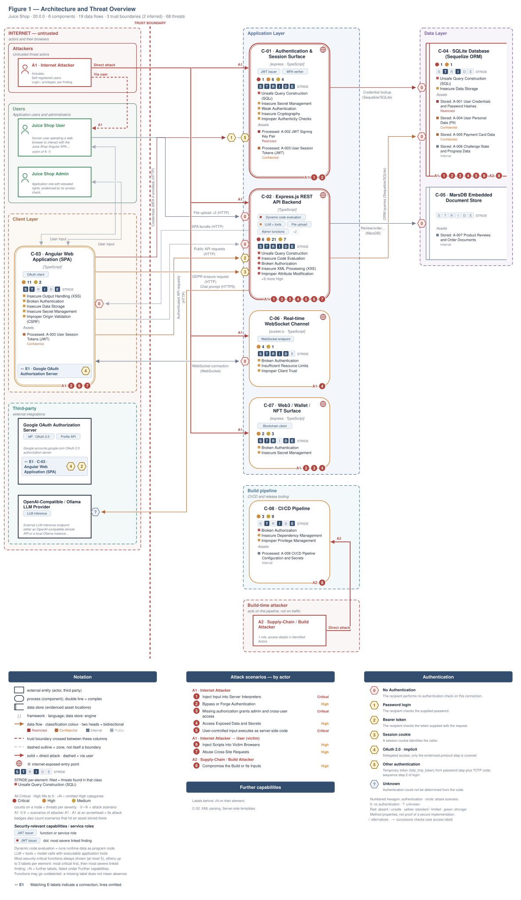

Role access and finding assignments are listed in [Identified Actors](#identified-actors).

**Actor grouping.** Regular self-registered users are grouped with anonymous internet attackers because registration is open. Each finding retains its login and privilege requirements.

**Figure 2 - Attack Routes and Impact**

Each numbered route names one example finding from the corresponding Top Threats group with its access prerequisite, the register weakness it is linked to, and the group's potential business harm, which depends on deployment and affected assets. W-IDs in parentheses link the example to an existing weakness. The attack step, affected component and technical consequence remain in the SVG tooltips and the findings register. Red arrows indicate attacks; dashed red arrows involve a victim; grey arrows lead to potential harm.

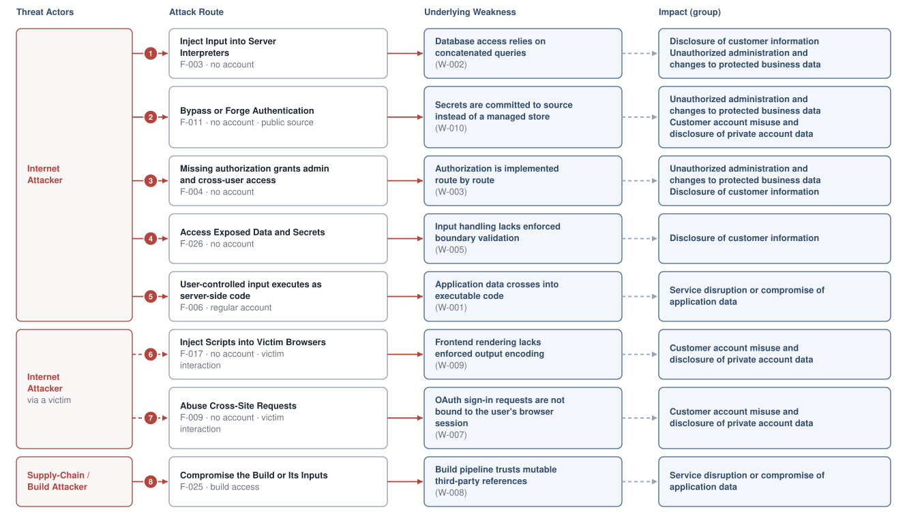

**Threat actors.** The actors below drive the numbered attack paths in the figures above. The **Juice Shop User** is the *victim* of client-side attacks (XSS / CSRF), not an attacker. Figure 2 marks victim interaction on the applicable attack routes.

- **Juice Shop User** — legitimate end user; target of client-side attacks; target of ⑥ Output Encoding / Cross-Site Scripting, ⑦ CSRF / Permissive CORS.
- **Internet Attacker** — can self-register a regular account; drives ① Insecure Query Construction & Data Access, ② Hardcoded Secrets & Weak Cryptography, ③ Broken Authorization & Access Control, ④ Sensitive File & Secret Exposure, ⑤ Remote Code Execution (unsafe eval), ⑥ Output Encoding / Cross-Site Scripting, ⑦ CSRF / Permissive CORS.
- **Supply-Chain / Build Attacker** — compromises a dependency or build pipeline, or contributes malicious code to a public repo; drives ⑧ Build Pipeline & Dependency Integrity.

**8 structural threats**, grouped by weakness class - each row is one threat, not one finding. *Threat Description* states the general architectural weakness (STRIDE in brackets); *Findings* lists the concrete instances, each linked to [§8 Findings Register](#8-findings-register) with its component; *Risk & Impact* combines severity with business consequence.

| # | Threat Description | Findings (→ Component) | Risk & Impact | Fix |
|---|------------------------------------|------------------------------------------------|------------------------------------|--------|
| <a id="path-injection"></a>① | **Insecure Query Construction & Data Access** _(T·I)_<br/>Application data flows unescaped into SQL and XML parsers, allowing attackers to extract or modify data, read local files, and reach internal services. | <span style="white-space:nowrap">🟠&nbsp;[F-001](#f-001)</span> - NoSQL Injection in MarsDB Query Layer (`showProductReviews.ts:36`) <span style="white-space:nowrap">→&nbsp;[C-02](#c-02)</span>&nbsp;Express\.js REST API Backend<br/><span style="white-space:nowrap">🔴&nbsp;[F-003](#f-003)</span> - SQL injection (`login.ts:34`) <span style="white-space:nowrap">→&nbsp;[C-01](#c-01)</span>&nbsp;Authentication & Session Surface<br/><span style="white-space:nowrap">🔴&nbsp;[F-005](#f-005)</span> - SQL Injection in Product Search (`search.ts:23`) <span style="white-space:nowrap">→&nbsp;[C-02](#c-02)</span>&nbsp;Express\.js REST API Backend<br/><span style="white-space:nowrap">🔴&nbsp;[F-007](#f-007)</span> - XXE (`fileUpload.ts:83`) <span style="white-space:nowrap">→&nbsp;[C-02](#c-02)</span>&nbsp;Express\.js REST API Backend<br/><span style="white-space:nowrap">🟠&nbsp;[F-027](#f-027)</span> - LLM01 Prompt Injection Bypasses Coupon Discount Policy (`chat.ts:177`) <span style="white-space:nowrap">→&nbsp;[C-02](#c-02)</span>&nbsp;Express\.js REST API Backend<br/><span style="white-space:nowrap">🟠&nbsp;[F-024](#f-024)</span> - Input compiled as template source (`userProfile.ts:87`) <span style="white-space:nowrap">→&nbsp;[C-02](#c-02)</span>&nbsp;Express\.js REST API Backend | 🔴 **Critical**<br/>Customer Data Exfiltration · Full Admin Takeover | <span style="white-space:nowrap">● [M-018](#m-018)</span> — Use parameterized database queries<br/><span style="white-space:nowrap">● [M-020](#m-020)</span> — Use parameterized database queries |
| <a id="path-auth-bypass"></a>② | **Hardcoded Secrets & Weak Cryptography** _(S·E)_<br/>Weak password storage, insecure reset flows, and hardcoded or guessable credentials allow attackers to impersonate any user without knowing the original password. | <span style="white-space:nowrap">🟠&nbsp;[F-010](#f-010)</span> - Predictable password derived from Google OAuth email (`oauth.component.ts:30`) <span style="white-space:nowrap">→&nbsp;[C-03](#c-03)</span>&nbsp;Angular Web Application (SPA)<br/><span style="white-space:nowrap">🟠&nbsp;[F-011](#f-011)</span> - Hardcoded RSA private key enables offline JWT forgery (`insecurity.ts:23`) <span style="white-space:nowrap">→&nbsp;[C-01](#c-01)</span>&nbsp;Authentication & Session Surface<br/><span style="white-space:nowrap">🟠&nbsp;[F-012](#f-012)</span> - Missing JWT algorithm whitelist (`insecurity.ts:54`) <span style="white-space:nowrap">→&nbsp;[C-01](#c-01)</span>&nbsp;Authentication & Session Surface<br/><span style="white-space:nowrap">🟠&nbsp;[F-013](#f-013)</span> - Password reset accepts a security-question answer (`resetPassword.ts:10`) <span style="white-space:nowrap">→&nbsp;[C-01](#c-01)</span>&nbsp;Authentication & Session Surface<br/><span style="white-space:nowrap">🟠&nbsp;[F-015](#f-015)</span> - Unverified JWT Decode in Chat Enables Order Impersonation (`chat.ts:45`) <span style="white-space:nowrap">→&nbsp;[C-02](#c-02)</span>&nbsp;Express\.js REST API Backend<br/><span style="white-space:nowrap">🟠&nbsp;[F-030](#f-030)</span> - Hardcoded testing credentials in production bundle (`login.component.ts:63`) <span style="white-space:nowrap">→&nbsp;[C-03](#c-03)</span>&nbsp;Angular Web Application (SPA)<br/><span style="white-space:nowrap">🟠&nbsp;[F-033](#f-033)</span> - `MD5` password hashing without salt enables offline (`insecurity.ts:43`) <span style="white-space:nowrap">→&nbsp;[C-01](#c-01)</span>&nbsp;Authentication & Session Surface<br/><span style="white-space:nowrap">🟠&nbsp;[F-078](#f-078)</span> - Token flow accepts a stolen bearer token without (`login.component.ts:152`) <span style="white-space:nowrap">→&nbsp;[C-03](#c-03)</span>&nbsp;Angular Web Application (SPA)<br/><span style="white-space:nowrap">🟠&nbsp;[F-029](#f-029)</span> - Hardcoded BIP39 mnemonic enables forged challenge (`checkKeys.ts:10`) <span style="white-space:nowrap">→&nbsp;[C-07](#c-07)</span>&nbsp;Web3 / Wallet / NFT Surface<br/><span style="white-space:nowrap">🟠&nbsp;[F-032](#f-032)</span> - Hardcoded HMAC key exposes security answer hashes to offline attack (`insecurity.ts:44`) <span style="white-space:nowrap">→&nbsp;[C-01](#c-01)</span>&nbsp;Authentication & Session Surface<br/><span style="white-space:nowrap">🟠&nbsp;[F-040](#f-040)</span> - Unsalted `MD5` password hashing enables offline dictionary (`user.ts:77`) <span style="white-space:nowrap">→&nbsp;[C-02](#c-02)</span>&nbsp;Express\.js REST API Backend | 🟠 **High**<br/>Full Admin Takeover · Customer Session Hijack | <span style="white-space:nowrap">◕ [M-025](#m-025)</span> — Replace email-derived password with server-generated random credential for OAuth accounts<br/><span style="white-space:nowrap">◕ [M-026](#m-026)</span> — Move cryptographic keys to a managed secret store |
| <a id="path-privilege-escalation"></a>③ | **Broken Authorization & Access Control** _(E·I)_<br/>Missing ownership checks on data operations and absent role enforcement on sensitive routes let lower-privileged users read other users' records or elevate to admin. | <span style="white-space:nowrap">🔴&nbsp;[F-004](#f-004)</span> - Insecure Direct Object Reference (`address.ts:18`) <span style="white-space:nowrap">→&nbsp;[C-02](#c-02)</span>&nbsp;Express\.js REST API Backend<br/><span style="white-space:nowrap">🔴&nbsp;[F-008](#f-008)</span> - Mass Assignment Allows Admin Role Injection (`verify.ts:52`) <span style="white-space:nowrap">→&nbsp;[C-02](#c-02)</span>&nbsp;Express\.js REST API Backend<br/><span style="white-space:nowrap">🟠&nbsp;[F-037](#f-037)</span> - Unauthenticated access to all order records (`trackOrder.ts:18`) <span style="white-space:nowrap">→&nbsp;[C-02](#c-02)</span>&nbsp;Express\.js REST API Backend<br/><span style="white-space:nowrap">🟠&nbsp;[F-045](#f-045)</span> - Sensitive Routes Registered Without Authentication Middleware (`server.ts:310`) <span style="white-space:nowrap">→&nbsp;[C-02](#c-02)</span>&nbsp;Express\.js REST API Backend<br/><span style="white-space:nowrap">🟠&nbsp;[F-047](#f-047)</span> - Free Deluxe Membership (`deluxe.ts:24`) <span style="white-space:nowrap">→&nbsp;[C-02](#c-02)</span>&nbsp;Express\.js REST API Backend<br/><span style="white-space:nowrap">🟠&nbsp;[F-048](#f-048)</span> - IDOR: review update without ownership check (`updateProductReviews.ts:16`) <span style="white-space:nowrap">→&nbsp;[C-02](#c-02)</span>&nbsp;Express\.js REST API Backend<br/><span style="white-space:nowrap">🟠&nbsp;[F-049](#f-049)</span> - Missing authentication on key submission endpoint (`checkKeys.ts:6`) <span style="white-space:nowrap">→&nbsp;[C-07](#c-07)</span>&nbsp;Web3 / Wallet / NFT Surface | 🔴 **Critical**<br/>Full Admin Takeover · Customer Data Exfiltration | <span style="white-space:nowrap">● [M-019](#m-019)</span> — Enforce object-level (ownership) authorization<br/><span style="white-space:nowrap">● [M-023](#m-023)</span> — Allowlist client-controlled fields |
| <a id="path-sensitive-data-exposure"></a>④ | **Sensitive File & Secret Exposure** _(I)_<br/>Unauthenticated routes expose cryptographic material, HTTP access logs, and payment card numbers stored in plaintext, providing attackers with the inputs needed for further attacks. | <span style="white-space:nowrap">🟠&nbsp;[F-022](#f-022)</span> - Path traversal filesystem access from request input (`dataErasure.ts:104`) <span style="white-space:nowrap">→&nbsp;[C-02](#c-02)</span>&nbsp;Express\.js REST API Backend<br/><span style="white-space:nowrap">🟠&nbsp;[F-026](#f-026)</span> - ZIP Slip Path Traversal in File Upload (`fileUpload.ts:44`) <span style="white-space:nowrap">→&nbsp;[C-02](#c-02)</span>&nbsp;Express\.js REST API Backend<br/><span style="white-space:nowrap">🟠&nbsp;[F-035](#f-035)</span> - Unauthenticated `/encryptionkeys` Exposes JWT Public Key (`server.ts:277`) <span style="white-space:nowrap">→&nbsp;[C-02](#c-02)</span>&nbsp;Express\.js REST API Backend<br/><span style="white-space:nowrap">🟠&nbsp;[F-036](#f-036)</span> - Unauthenticated `/support/logs` Exposes HTTP Access Logs (`server.ts:281`) <span style="white-space:nowrap">→&nbsp;[C-02](#c-02)</span>&nbsp;Express\.js REST API Backend<br/><span style="white-space:nowrap">🟠&nbsp;[F-039](#f-039)</span> - Payment card number stored as plaintext integer in Cards (`card.ts:39`) <span style="white-space:nowrap">→&nbsp;[C-04](#c-04)</span>&nbsp;SQLite Database (Sequelize ORM)<br/><span style="white-space:nowrap">🟠&nbsp;[F-038](#f-038)</span> - Unauthenticated CTF Flag Disclosure (`registerWebsocketEvents.ts:31`) <span style="white-space:nowrap">→&nbsp;[C-06](#c-06)</span>&nbsp;Real-time WebSocket Channel<br/><span style="white-space:nowrap">🟡&nbsp;[F-050](#f-050)</span> - Open Redirect (`redirect.ts:19`) <span style="white-space:nowrap">→&nbsp;[C-07](#c-07)</span>&nbsp;Web3 / Wallet / NFT Surface<br/><span style="white-space:nowrap">🟡&nbsp;[F-063](#f-063)</span> - Development Error Handler Returns Stack Traces in Production (`server.ts:678`) <span style="white-space:nowrap">→&nbsp;[C-02](#c-02)</span>&nbsp;Express\.js REST API Backend<br/><span style="white-space:nowrap">🟡&nbsp;[F-064](#f-064)</span> - LLM02 Chatbot Returns Unfiltered User Order Data Including (`chat.ts:164`) <span style="white-space:nowrap">→&nbsp;[C-02](#c-02)</span>&nbsp;Express\.js REST API Backend | 🟠 **High**<br/>Customer Data Exfiltration | <span style="white-space:nowrap">◕ [M-037](#m-037)</span> — Constrain file paths to a safe base directory<br/><span style="white-space:nowrap">◕ [M-040](#m-040)</span> — Constrain file paths to a safe base directory |
| <a id="path-remote-code-execution"></a>⑤ | **Remote Code Execution (unsafe eval)** _(E)_<br/>User-supplied strings reach server-side evaluation functions without sanitization, allowing code execution as the server process and full access to its environment and data. | <span style="white-space:nowrap">🔴&nbsp;[F-006](#f-006)</span> - Server-Side Code Execution (`userProfile.ts:61`) <span style="white-space:nowrap">→&nbsp;[C-02](#c-02)</span>&nbsp;Express\.js REST API Backend<br/><span style="white-space:nowrap">🟠&nbsp;[F-024](#f-024)</span> - Input compiled as template source (`userProfile.ts:87`) <span style="white-space:nowrap">→&nbsp;[C-02](#c-02)</span>&nbsp;Express\.js REST API Backend | 🔴 **Critical**<br/>Full Server Compromise | <span style="white-space:nowrap">● [M-021](#m-021)</span> — Remove server-side evaluation of untrusted input<br/><span style="white-space:nowrap">◕ [M-038](#m-038)</span> — Remove server-side evaluation of untrusted input |
| <a id="path-cross-site-scripting"></a>⑥ | **Output Encoding / Cross-Site Scripting** _(T·I)_<br/>Attacker-controlled content reaches Angular template rendering without encoding, executing injected scripts in visitors' browsers and enabling session token theft from browser storage. | <span style="white-space:nowrap">🟠&nbsp;[F-017](#f-017)</span> - Stored XSS (`about.component.ts:119`) <span style="white-space:nowrap">→&nbsp;[C-03](#c-03)</span>&nbsp;Angular Web Application (SPA)<br/><span style="white-space:nowrap">🟠&nbsp;[F-018](#f-018)</span> - Stored XSS (`administration.component.ts:73`) <span style="white-space:nowrap">→&nbsp;[C-03](#c-03)</span>&nbsp;Angular Web Application (SPA)<br/><span style="white-space:nowrap">🟠&nbsp;[F-019](#f-019)</span> - Stored XSS (`administration.component.ts:91`) <span style="white-space:nowrap">→&nbsp;[C-03](#c-03)</span>&nbsp;Angular Web Application (SPA)<br/><span style="white-space:nowrap">🟠&nbsp;[F-020](#f-020)</span> - Stored XSS (`search-result.component.ts:110`) <span style="white-space:nowrap">→&nbsp;[C-03](#c-03)</span>&nbsp;Angular Web Application (SPA)<br/><span style="white-space:nowrap">🟠&nbsp;[F-021](#f-021)</span> - DOM XSS (`search-result.component.ts:143`) <span style="white-space:nowrap">→&nbsp;[C-03](#c-03)</span>&nbsp;Angular Web Application (SPA)<br/><span style="white-space:nowrap">🟠&nbsp;[F-031](#f-031)</span> - JWT stored in `localStorage` (`login.component.ts:105`) <span style="white-space:nowrap">→&nbsp;[C-03](#c-03)</span>&nbsp;Angular Web Application (SPA)<br/><span style="white-space:nowrap">🟡&nbsp;[F-051](#f-051)</span> - Stored XSS (`last-login-ip.component.ts:39`) <span style="white-space:nowrap">→&nbsp;[C-03](#c-03)</span>&nbsp;Angular Web Application (SPA)<br/><span style="white-space:nowrap">🟡&nbsp;[F-056](#f-056)</span> - Challenge-gated weak sanitization stores XSS HTML in Users (`user.ts:50`) <span style="white-space:nowrap">→&nbsp;[C-02](#c-02)</span>&nbsp;Express\.js REST API Backend | 🟠 **High**<br/>Customer Session Hijack | <span style="white-space:nowrap">◕ [M-032](#m-032)</span> — Encode output instead of bypassing the framework sanitizer<br/><span style="white-space:nowrap">◕ [M-033](#m-033)</span> — Encode output instead of bypassing the framework sanitizer |
| <a id="path-cross-site-request-forgery"></a>⑦ | **CSRF / Permissive CORS** _(S·T)_<br/>a permissive CORS policy plus missing anti-CSRF tokens let any external page issue authenticated state-changing requests in the victim's session. | <span style="white-space:nowrap">🟠&nbsp;[F-009](#f-009)</span> - OAuth CSRF (`login.component.ts:152`) <span style="white-space:nowrap">→&nbsp;[C-03](#c-03)</span>&nbsp;Angular Web Application (SPA)<br/><span style="white-space:nowrap">🟡&nbsp;[F-055](#f-055)</span> - Wildcard CORS Permits Credentialed Cross-Origin Requests (`server.ts:183`) <span style="white-space:nowrap">→&nbsp;[C-02](#c-02)</span>&nbsp;Express\.js REST API Backend | 🟠 **High**<br/>Customer Session Hijack | <span style="white-space:nowrap">◕ [M-024](#m-024)</span> — Add anti-CSRF protection to state-changing requests<br/><span style="white-space:nowrap">◑ [M-068](#m-068)</span> — Restrict CORS to trusted origins |
| <a id="path-supply-chain"></a>⑧ | **Build Pipeline & Dependency Integrity** _(T·E)_<br/>CI workflows reference mutable action versions and run install scripts with elevated privileges, enabling a compromised dependency to execute code in the build pipeline. | <span style="white-space:nowrap">🟠&nbsp;[F-025](#f-025)</span> - CI/CD Workflow Supply-Chain Risk (`.gitignore:10`) <span style="white-space:nowrap">→&nbsp;[C-08](#c-08)</span>&nbsp;CI/CD Pipeline<br/><span style="white-space:nowrap">🟠&nbsp;[F-034](#f-034)</span> - Package Install Scripts Run as Root - `Dockerfile:5` (`Dockerfile:5`) <span style="white-space:nowrap">→&nbsp;[C-08](#c-08)</span>&nbsp;CI/CD Pipeline<br/><span style="white-space:nowrap">🟠&nbsp;[F-046](#f-046)</span> - Missing permissions block default `GITHUB_TOKEN` scope (`ci.yml:1`) <span style="white-space:nowrap">→&nbsp;[C-08](#c-08)</span>&nbsp;CI/CD Pipeline<br/><span style="white-space:nowrap">🟡&nbsp;[F-052](#f-052)</span> - Unpinned GitHub Actions (`codeql-analysis.yml:23`) <span style="white-space:nowrap">→&nbsp;[C-08](#c-08)</span>&nbsp;CI/CD Pipeline<br/><span style="white-space:nowrap">🟡&nbsp;[F-053](#f-053)</span> - Unpinned container base image - `Dockerfile:1` (`Dockerfile:1`) <span style="white-space:nowrap">→&nbsp;[C-08](#c-08)</span>&nbsp;CI/CD Pipeline<br/><span style="white-space:nowrap">🟡&nbsp;[F-054](#f-054)</span> - Npm install `--unsafe-perm` in Docker build stage - `Dockerfile:5` (`Dockerfile:5`) <span style="white-space:nowrap">→&nbsp;[C-08](#c-08)</span>&nbsp;CI/CD Pipeline<br/><span style="white-space:nowrap">🟡&nbsp;[F-057](#f-057)</span> - Container Runs as Root - `Dockerfile:1` (`Dockerfile:1`) <span style="white-space:nowrap">→&nbsp;[C-08](#c-08)</span>&nbsp;CI/CD Pipeline<br/><span style="white-space:nowrap">🟡&nbsp;[F-058](#f-058)</span> - Missing Container Image Signing (`ci.yml:1`) <span style="white-space:nowrap">→&nbsp;[C-08](#c-08)</span>&nbsp;CI/CD Pipeline<br/><span style="white-space:nowrap">🟡&nbsp;[F-059](#f-059)</span> - Untrusted npm Install/Postinstall Scripts Enabled (`Dockerfile:4`) <span style="white-space:nowrap">→&nbsp;[C-08](#c-08)</span>&nbsp;CI/CD Pipeline<br/><span style="white-space:nowrap">🟡&nbsp;[F-060](#f-060)</span> - Default `GITHUB_TOKEN` Scope Not Restricted (`lock.yml:1`) <span style="white-space:nowrap">→&nbsp;[C-08](#c-08)</span>&nbsp;CI/CD Pipeline<br/><span style="white-space:nowrap">🟡&nbsp;[F-061](#f-061)</span> - Missing npm Lockfile (`package-lock.json:0`) <span style="white-space:nowrap">→&nbsp;[C-08](#c-08)</span>&nbsp;CI/CD Pipeline<br/><span style="white-space:nowrap">🟡&nbsp;[F-062](#f-062)</span> - Unpinned Container Base Image - `Dockerfile:1` (`Dockerfile:1`) <span style="white-space:nowrap">→&nbsp;[C-08](#c-08)</span>&nbsp;CI/CD Pipeline | 🟠 **High**<br/>Full Server Compromise | <span style="white-space:nowrap">◕ [M-039](#m-039)</span> — Pin third-party dependencies to immutable versions<br/><span style="white-space:nowrap">◕ [M-009](#m-009)</span> — Drop unnecessary privileges in build and runtime |

_STRIDE: S spoofing · T tampering · R repudiation · I information disclosure · D denial of service · E elevation of privilege. Risk, findings, components, impact and Fix are derived deterministically; only the one-line weakness description is authored._

**Verified attack chains.** 6 fully viable ([AC-T-002](#ac-t-002), [AC-T-004](#ac-t-004), [AC-T-006](#ac-t-006), [AC-T-005](#ac-t-005), [AC-T-001](#ac-t-001), [AC-T-003](#ac-t-003)). These chains combine individual findings into end-to-end exploitation paths verified step-by-step against the code - see [§9 Abuse Cases](#9-abuse-cases) for the per-step breakdown and blocking mitigations.

### Top Mitigations

Highest-impact P1/P2 mitigations - 10 of 45 qualifying (79 total). Full detail in [§10 Mitigation Register](#10-mitigation-register). All 9 mitigation(s) that fix a Critical finding are always listed here.

| # | Component | Mitigation | Addresses | Effort |
|---|----------------------|------------------------------------------------|------------------------------------------------|------|
| **1** | [C-01](#c-01) — Authentication & Session Surface | ● [M-018](#m-018) — Use parameterized database queries (`login.ts:34`)<br/>*Declared business context* | 🔴 [F-003](#f-003) — SQL injection (`routes/login.ts`) | Low |
| **2** | [C-02](#c-02) — Express\.js REST API Backend | ● [M-020](#m-020) — Use parameterized database queries (`search.ts:23`) | 🔴 [F-005](#f-005) — SQL Injection in Product Search (`routes/search.ts`) | Low |
| **3** | [C-02](#c-02) — Express\.js REST API Backend | ● [M-021](#m-021) — Remove server-side evaluation of untrusted input (`userProfile.ts:61`) | 🔴 [F-006](#f-006) — Server-Side Code Execution (`routes/userProfile.ts`) | Low |
| **4** | [C-02](#c-02) — Express\.js REST API Backend | ● [M-022](#m-022) — Disable XML external entity (XXE) resolution (`fileUpload.ts:83`) | 🔴 [F-007](#f-007) — XXE (`routes/fileUpload.ts`) | Low |
| **5** | [C-02](#c-02) — Express\.js REST API Backend | ● [M-023](#m-023) — Allowlist client-controlled fields (`verify.ts:52`) | 🔴 [F-008](#f-008) — Mass Assignment Allows Admin Role Injection (`routes/verify.ts`) | Low |
| **6** | [C-02](#c-02) — Express\.js REST API Backend | ● [M-019](#m-019) — Enforce object-level (ownership) authorization (`address.ts:18`) | 🔴 [F-004](#f-004) — Insecure Direct Object Reference (`routes/address.ts`) | Medium |
| **7** | [C-01](#c-01) — Authentication & Session Surface | ◕ [M-026](#m-026) — Move cryptographic keys to a managed secret store (`insecurity.ts:23`)<br/>*Declared business context* | 🟠 [F-011](#f-011) — Hardcoded RSA private key enables offline JWT forgery (`lib/insecurity.ts`) | Medium |
| **8** | [C-01](#c-01) — Authentication & Session Surface | ◕ [M-027](#m-027) — Enforce JWT signature and algorithm verification (`insecurity.ts:54`)<br/>*Declared business context* | 🟠 [F-012](#f-012) — Missing JWT algorithm whitelist (`lib/insecurity.ts`) | Low |
| **9** | [C-02](#c-02) — Express\.js REST API Backend | ◕ [M-061](#m-061) — Enforce object-level (ownership) authorization (`updateProductReviews.ts:16`) | 🟠 [F-048](#f-048) — IDOR: review update without ownership check (`routes/updateProductReviews.ts`) | Low |
| **10** | [C-06](#c-06) — Real-time WebSocket Channel | ◕ [M-031](#m-031) — Require authentication on every exposed endpoint (`registerWebsocketEvents.ts:24`) | 🟠 [F-016](#f-016) — Unauthenticated WebSocket Channel (`lib/startup/registerWebsocketEvents.ts`) | Medium |

*35 additional P1/P2 mitigations capped from the leader-board · 34 P3 backlog items in [§10 Mitigation Register](#10-mitigation-register). Sorted by priority (P1 first), then declared business context, then component, then leverage (most findings first), severity (Critical first), and effort (Low first).*

### AI / LLM Exposure

The backend chat route embeds an LLM that processes untrusted user messages without input guards or output filtering, exposing the application to policy bypass, sensitive data leakage, and resource exhaustion. See **[§6 Security Architecture](#6-security-architecture)** for the per-control detail.


- **[LLM01](https://genai.owasp.org/llmrisk/llm01/) / [ASI01](https://genai.owasp.org/resource/owasp-top-10-for-agentic-applications-for-2026/) Prompt Injection** — User chat messages are concatenated into the system prompt without sanitization; an attacker can override the 10% discount cap in the system prompt and obtain a cryptographically valid coupon for any discount value, including 100%. _([C-02](#c-02) — Express\.js REST API Backend)_
  - ↳ 🟠 [F-027](#f-027) — Prompt injection bypasses coupon discount policy (`chat.ts:177`)

- **[LLM02](https://genai.owasp.org/llmrisk/llm02/) Sensitive Information Disclosure** — The chat route returns unfiltered order data including masked email addresses and product details to any caller who supplies a user identifier; an unverified token in the same route extends this to unauthenticated impersonation of any account. _([C-02](#c-02) — Express\.js REST API Backend)_
  - ↳ 🟡 [F-064](#f-064) — Chatbot returns unfiltered user order data (`chat.ts:164`)
  - ↳ 🟠 [F-015](#f-015) — Unverified token decode enables order impersonation (`chat.ts:45`)

- **[LLM10](https://genai.owasp.org/llmrisk/llm10/) Unbounded Consumption** — The chat endpoint imposes no per-request token limit or rate limit, so an attacker can send unlimited large prompts to exhaust the upstream model quota and deny the service to legitimate users. _([C-02](#c-02) — Express\.js REST API Backend)_
  - ↳ 🟡 [F-067](#f-067) — Unbounded token consumption on chat endpoint (`chat.ts:207`)

### Operational Strengths

Operational controls rated Adequate or Partial - grouped into broad clusters (full per-control breakdown in [§6](#6-security-architecture)). Clusters demoted to Weak by open Critical/High findings appear in [§6](#6-security-architecture) instead, not here.

<table style="table-layout:fixed;width:100%">
<colgroup><col width="18%" style="width:18%"><col width="30%" style="width:30%"><col width="40%" style="width:40%"><col width="12%" style="width:12%"></colgroup>
<thead><tr><th>Strength</th><th>What's in Place</th><th>Effectiveness</th><th>Mitigates</th></tr></thead>
<tbody>
<tr><td style="overflow-wrap:break-word"><strong>Observability &amp; Audit</strong></td><td style="overflow-wrap:break-word"><em>Runtime visibility - access logging, audit trails, and operational telemetry for post-incident review.</em><br/>Access and Security Event Logging</td><td style="overflow-wrap:break-word">✅ Adequate</td><td style="overflow-wrap:break-word">-</td></tr>
<tr><td style="overflow-wrap:break-word"><strong>Hardened HTTP Stack</strong></td><td style="overflow-wrap:break-word"><em>Browser-facing HTTP hardening — security headers, cookie flags, cross-origin policy, and abuse-protection limits.</em><br/>Rate Limiting<br/>Security Response Headers</td><td style="overflow-wrap:break-word">⚠️ Partial — Bypassed by 1 High finding(s) of the kind this cluster is supposed to prevent — e.g.<br/>🟠 <a href="#f-009">F-009</a> — OAuth CSRF (<code>login.component.ts:152</code>).</td><td style="overflow-wrap:break-word">🟡 <a href="#f-055">F-055</a> — Wildcard CORS Permits Credentialed Cross-Origin Requests… (<code>server.ts:183</code>)</td></tr>
<tr><td style="overflow-wrap:break-word"><strong>Cryptographic Hygiene</strong></td><td style="overflow-wrap:break-word"><em>Transport security, key lifecycle, and password-hash strength.</em><br/>Transport Encryption (TLS)</td><td style="overflow-wrap:break-word">⚠️ Partial - Bypassed by 1 High finding(s) of the kind this cluster is supposed to prevent - e.g.<br/>🟠 <a href="#f-033">F-033</a> — MD5 password hashing without salt enables offline (<code>lib/insecurity.ts:43</code>).</td><td style="overflow-wrap:break-word">-</td></tr>
</tbody>
</table>


**Bottom line:** These controls narrow specific attack surfaces but none eliminates a Critical finding on its own.

---

<a id="critical-attack-chain"></a><a id="critical-attack-tree"></a>
## Critical Attack Tree

The root is the worst-case attacker goal; below it, each capability branch groups the Critical findings that achieve it. Branches feed the goal by OR - any single path suffices.

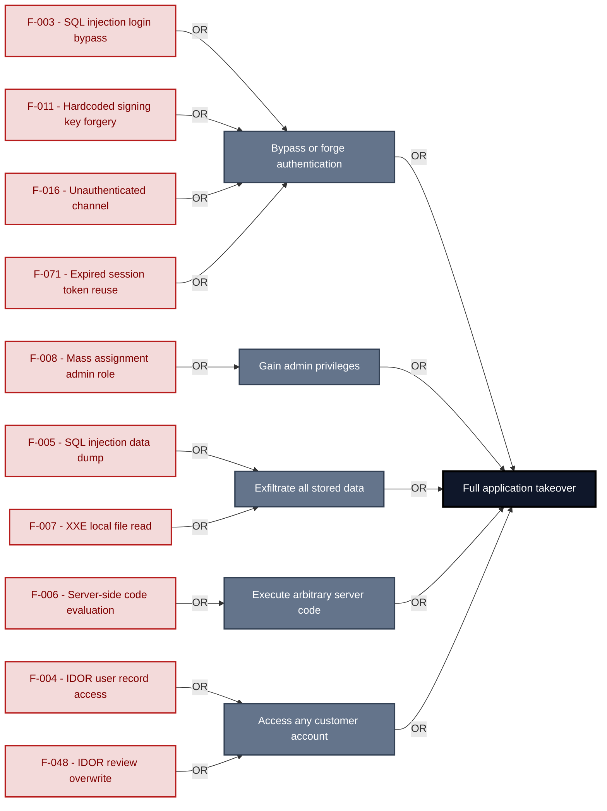
```mermaid
graph LR
    G_ROOT["Full application takeover"]:::goal
    OR_AUTH["Bypass or forge authentication"]:::or_node
    OR_ADMIN["Gain admin privileges"]:::or_node
    OR_DATA["Exfiltrate all stored data"]:::or_node
    OR_RCE["Execute arbitrary server code"]:::or_node
    OR_HORIZ["Access any customer account"]:::or_node
    L_F003["F-003 - SQL injection login bypass"]:::leaf
    L_F011["F-011 - Hardcoded signing key forgery"]:::leaf
    L_F016["F-016 - Unauthenticated channel"]:::leaf
    L_F071["F-071 - Expired session token reuse"]:::leaf
    L_F008["F-008 - Mass assignment admin role"]:::leaf
    L_F005["F-005 - SQL injection data dump"]:::leaf
    L_F007["F-007 - XXE local file read"]:::leaf
    L_F006["F-006 - Server-side code evaluation"]:::leaf
    L_F004["F-004 - IDOR user record access"]:::leaf
    L_F048["F-048 - IDOR review overwrite"]:::leaf

    OR_AUTH -->|"OR"| G_ROOT
    OR_ADMIN -->|"OR"| G_ROOT
    OR_DATA -->|"OR"| G_ROOT
    OR_RCE -->|"OR"| G_ROOT
    OR_HORIZ -->|"OR"| G_ROOT
    L_F003 -->|"OR"| OR_AUTH
    L_F011 -->|"OR"| OR_AUTH
    L_F016 -->|"OR"| OR_AUTH
    L_F071 -->|"OR"| OR_AUTH
    L_F008 -->|"OR"| OR_ADMIN
    L_F005 -->|"OR"| OR_DATA
    L_F007 -->|"OR"| OR_DATA
    L_F006 -->|"OR"| OR_RCE
    L_F004 -->|"OR"| OR_HORIZ
    L_F048 -->|"OR"| OR_HORIZ

    classDef goal fill:#0f172a,stroke:#000,color:#fff,stroke-width:3px
    classDef and_node fill:#334155,stroke:#1e293b,color:#fff,stroke-width:2px
    classDef or_node fill:#64748b,stroke:#334155,color:#fff,stroke-width:2px
    classDef leaf fill:#f3dada,stroke:#b71c1c,color:#7f0000,stroke-width:2px
```

**Findings** (full detail in [§8 Findings Register](#8-findings-register)): [F-003](#f-003) · [F-011](#f-011) · [F-016](#f-016) · [F-071](#f-071) · [F-008](#f-008) · [F-005](#f-005) · [F-007](#f-007) · [F-006](#f-006) · [F-004](#f-004) · [F-048](#f-048)

---

## 1. System Overview

**Repository:** `https://github.com/juice-shop/juice-shop.git`

### Scope

This threat model covers 8 components of juice-shop: **Authentication & Session Surface**, **Express\.js REST API Backend**, **Angular Web Application (SPA)**, **SQLite Database (Sequelize ORM)**, **MarsDB Embedded Document Store**, **Real-time WebSocket Channel**, **Web3 / Wallet / NFT Surface**, **CI/CD Pipeline**.

**7 of 8** modeled components were analysed with full STRIDE; **CI/CD Pipeline** was only screened, a shorter pass without follow-up code checks per finding.

**Out of scope:** third-party hosted dependencies, browser runtime, operating-system kernel, and the underlying network infrastructure.

**Basis:** An automated, AI-assisted threat model built from the repository's source code and configuration - static analysis only, no dynamic or penetration testing. It describes the system as built, not as designed.

---

<a id="identified-actors"></a>
### Identified Actors

Figure 1 draws **Internet Attacker** and **Supply-Chain / Build Attacker** as attackers and **Juice Shop User** and **Juice Shop Admin** as legitimate roles of Juice Shop. Each row gives that actor's access and the findings attributed to it.

| Actor | Type | Access | Scenarios | Attributed findings |
|----------------------|---------------|----------------------|--------------|-------------------|
| A1 · Internet Attacker | Attacker | can self-register a regular account | ① ② ③ ④ ⑤ ⑥ ⑦ | 🔴 6 · 🟠 28 · 🟡 11 |
| A2 · Supply-Chain / Build Attacker | Attacker | compromises a dependency or build pipeline,<br/>or contributes malicious code to a public<br/>repo | ⑧ | 🟠 3 · 🟡 9 |
| Juice Shop User | Role (victim) | Human user operating a web browser to<br/>interact with the Juice Shop Angular SPA,<br/>including anonymous shoppers and registered<br/>users. | ⑥ ⑦ | - |
| Juice Shop Admin | Privileged role | Application role with elevated rights,<br/>evidenced by its access check. | - | - |

---

### Trust Boundaries

Canonical boundary crossings. **Assumption & verdict** names the condition that makes each crossing safe and whether this report still supports it, judged one condition at a time - which conditions apply follows from the direction of the crossing.

<table style="table-layout:fixed;width:100%">
<colgroup><col width="6%" style="width:6%"><col width="25%" style="width:25%"><col width="11%" style="width:11%"><col width="15%" style="width:15%"><col width="25%" style="width:25%"><col width="18%" style="width:18%"></colgroup>
<thead><tr><th>ID</th><th>Boundary / crossing</th><th>Exposure</th><th>Kind</th><th>Assumption &amp; verdict</th><th>Linked findings</th></tr></thead>
<tbody>
<tr><td style="white-space:nowrap"><a id="tb-1"></a>tb-1</td><td style="overflow-wrap:break-word"><strong>external → express-api</strong><br/>Control: security.isAuthorized() expressJwt · Also covers: auth, realtime-channel, web3-nft</td><td>🌐 <strong>External</strong></td><td style="overflow-wrap:break-word">network</td><td style="overflow-wrap:break-word">Every state-changing route is registered behind security.isAuthorized() expressJwt middleware.<br/><em>confirmed</em><br/>Validation: in doubt · 7 related · <a href="#66-input-boundary-validation-controls">§6.6</a><br/>Authentication: <strong>broken</strong> · 11 related · <a href="#62-identity-and-authentication-controls">§6.2</a><br/>Authorization: <strong>broken</strong> · 5 related · <a href="#64-authorization-controls">§6.4</a></td><td style="overflow-wrap:break-word"><em>Authentication</em><br/>🟠 <a href="#f-012">F-012</a><br/>🟠 <a href="#f-049">F-049</a><br/>🟡 <a href="#f-050">F-050</a><br/><em>Authorization</em><br/>🔴 <a href="#f-008">F-008</a><br/><em>Unattributed</em><br/>🟠 <a href="#f-015">F-015</a></td></tr>
<tr><td style="white-space:nowrap"><a id="tb-2"></a>tb-2</td><td style="overflow-wrap:break-word"><strong>external → ci-cd-pipeline</strong><br/>Control: GITHUB_TOKEN scopes and branch protection</td><td>◐ <strong>Unverified</strong></td><td style="overflow-wrap:break-word">build pipeline · operator</td><td style="overflow-wrap:break-word">Only authorized repository contributors can trigger CI/CD pipeline runs.<br/><em>inferred</em><br/>Validation: in doubt · 1 related · <a href="#66-input-boundary-validation-controls">§6.6</a><br/>Authentication: in doubt · 1 related · <a href="#62-identity-and-authentication-controls">§6.2</a><br/>Authorization: in doubt · 2 related · <a href="#64-authorization-controls">§6.4</a></td><td style="overflow-wrap:break-word">-</td></tr>
<tr><td style="white-space:nowrap"><a id="tb-3"></a>tb-3</td><td style="overflow-wrap:break-word"><strong>express-api → external</strong><br/>Control: none identified</td><td>◐ <strong>Unverified</strong></td><td style="overflow-wrap:break-word">network · operator</td><td style="overflow-wrap:break-word">Nothing attacker-controlled reaches the LLM provider unfiltered as part of the prompt.<br/><em>inferred</em><br/><em>No finding contradicts it.</em></td><td style="overflow-wrap:break-word">-</td></tr>
<tr><td style="white-space:nowrap"><a id="tb-4"></a>tb-4</td><td style="overflow-wrap:break-word"><strong>express-api → sqlite-db</strong><br/>Control: Sequelize parameterized query binding · Also covers: auth</td><td>🔒 <strong>Internal</strong></td><td style="overflow-wrap:break-word">in-process - enforcement interface, no trust transition</td><td style="overflow-wrap:break-word">Every query reaches SQLite through Sequelize model methods using parameterized binding.<br/><em>confirmed</em><br/>Query construction: <strong>broken</strong> · <a href="#65-query-construction-and-data-access-controls">§6.5</a></td><td style="overflow-wrap:break-word"><em>Query construction</em><br/>🔴 <a href="#f-003">F-003</a><br/>🔴 <a href="#f-005">F-005</a></td></tr>
<tr><td style="white-space:nowrap"><a id="tb-5"></a>tb-5</td><td style="overflow-wrap:break-word"><strong>express-api → marsdb-store</strong><br/>Control: MarsDB Collection in-process interface</td><td>🔒 <strong>Internal</strong></td><td style="overflow-wrap:break-word">in-process - enforcement interface, no trust transition</td><td style="overflow-wrap:break-word">Every document query reaches MarsDB through its Collection interface, not by appending raw query strings.<br/><em>confirmed</em><br/>Query construction: <strong>broken</strong> · <a href="#65-query-construction-and-data-access-controls">§6.5</a></td><td style="overflow-wrap:break-word"><em>Query construction</em><br/>🟠 <a href="#f-001">F-001</a></td></tr>
</tbody>
</table>

_Exposure, most exposed first: ⚠ Review (endpoints unresolved) · 🌐 External (reached from outside the model) · ◐ Unverified (crossing not confirmed) · 🔒 Internal (both ends modelled) · ↗ Egress (reaches outside the model)._

_Kind - the crossing mechanism (build pipeline, in-process, network), then after `·` what changes across it: data-origin, identity, operator, privilege, tenant. Shown alone, nothing changes._

_Conditions - **inbound**: validation, authentication, authorization · **outbound**: egress content, egress destination, response trust (replies are untrusted input) · **internal**: query construction (data never becomes program text), authentication, authorization._

_Verdict per condition - **broken**: a linked finding proves the gap · in doubt: related findings, none linked here · not examined: nothing bears on it. `N related` counts further findings on the same condition. Linked findings sit under the condition they break, or under _Unattributed_. A link raises effective severity only at a confirmed internet ingress; raw risk never changes._

_Identical on every row, so stated once here instead of in a column: source `detected` (derived from inspected repository evidence); status `resolved`. Any row that deviates is shown in the table._

---

## 2. Architecture Diagrams

### 2.1 System Context

Who uses and attacks Juice Shop, and which external systems it exchanges data with. Solid arrows name the data a flow carries; dashed red arrows are attack routes. Actors carry the names Figure 1 uses (C4 Level 1).

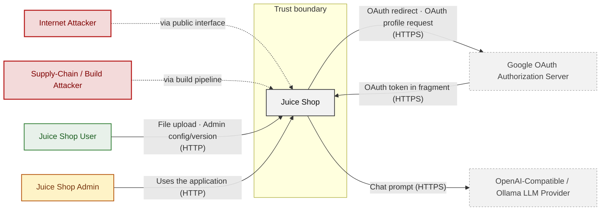
```mermaid
flowchart LR
    A0["Internet Attacker"]
    A1["Supply-Chain / Build Attacker"]
    R2["Juice Shop User"]
    R3["Juice Shop Admin"]
    subgraph TBEDGE["Trust boundary"]
        SYSTEM["Juice Shop"]
    end
    E0["Google OAuth Authorization Server"]
    E1["OpenAI-Compatible / Ollama LLM Provider"]
    A0 -.->|"via public interface"| SYSTEM
    A1 -.->|"via build pipeline"| SYSTEM
    R2 -->|"File upload · Admin config/version<br/>(HTTP)"| SYSTEM
    R3 -->|"Uses the application (HTTP)"| SYSTEM
    SYSTEM -->|"OAuth redirect · OAuth profile request<br/>(HTTPS)"| E0
    E0 -->|"OAuth token in fragment (HTTPS)"| SYSTEM
    SYSTEM -->|"Chat prompt (HTTPS)"| E1
    classDef user     fill:#e8f1ea,stroke:#2e7d32,color:#1b5e20,stroke-width:1.5px
    classDef attacker fill:#f3dada,stroke:#b71c1c,color:#7f0000,stroke-width:2px
    classDef admin    fill:#fef3c7,stroke:#b45309,color:#78350f,stroke-width:1.5px
    classDef sys      fill:#f2f2f2,stroke:#424242,color:#111,stroke-width:1.5px
    classDef ext      fill:#f2f2f2,stroke:#9e9e9e,color:#424242,stroke-dasharray:3 3,stroke-width:1px
    class A0 attacker
    class A1 attacker
    class R2 user
    class R3 admin
    class E0 ext
    class E1 ext
    class SYSTEM sys
```

**Key takeaway:** Juice Shop serves Juice Shop User and Juice Shop Admin and depends on Google OAuth Authorization Server and OpenAI-Compatible / Ollama LLM Provider; Internet Attacker and Supply-Chain / Build Attacker attack it.

### 2.2 Container Architecture

Where Juice Shop runs and what it is built on: the deployment environment the repository declares, the container, runtime and frameworks each component runs in, and the pipelines that build and publish it. Findings per component are in Figure 1.

<!-- detail-table -->
| Layer | What runs there |
|-----------------|----------------------|
| Deployment | Kubernetes · GitLab Auto Deploy<br/>(`.gitlab/auto-deploy-values.yaml`): Service<br/>:3000 (ingress and TLS from chart defaults;<br/>ClusterIP :3000 → 3000) → Pod |
| Container | built from `Dockerfile`: nodejs24-debian13 ·<br/>user 65532 · :3000; 🔴 image contains the<br/>whole repository, including `ctf.key`,<br/>encryptionkeys/; 🟠 base image<br/>nodejs24-debian13 floats (no version tag) |
| Process | Node\.js 24, one process: Express ^4.22.1 ([C-01](#c-01), [C-02](#c-02), [C-07](#c-07)) · Socket\.IO ^3.1.2 ([C-06](#c-06))<br/>key libraries: `express-jwt` 0.1.3 · jsonwebtoken 0.4.0 · sequelize ^6.37.3 · `body-parser` ^1.20.4 |
| Embedded stores | SQLite ^5.1.7 ([C-04](#c-04)) · MarsDB ^0.6.11 ([C-05](#c-05)), inside the same process |
| Client | Angular ^21.2.1 ([C-03](#c-03)), in the browser |
| Third parties | Google OAuth Authorization Server (called<br/>from the browser; 🟠 OAuth implicit flow) ·<br/>OpenAI-Compatible / Ollama LLM Provider |
| Build and release | GitHub Actions → Docker Hub: 🟠 4 of 24 actions not SHA-pinned<br/>GitLab CI → GitLab registry, Kubernetes (auto deploy): 🟠 test, dast disabled<br/>container build (`Dockerfile`): node:24 → nodejs24-debian13; 🟠 no lockfile: 185 version ranges resolved at build<br/>pipeline components [C-08](#c-08) |

**Key takeaway:** 4 server components and 2 embedded data stores run in one Node\.js 24 process in one pod. Weakens a control: image contains the whole repository, including `ctf.key`, encryptionkeys/.

### 2.3 Components

How each component is reached, what it handles, how many threats hit it, and how effective the controls evidenced on it are. The component table below holds source paths and linked threats per `C-NN`; per-finding evidence is in [§8 Findings Register](#8-findings-register).

<!-- detail-table -->
| Component | Inbound flows | Data handled | Threats | Controls: worst effectiveness per domain |
|----------------------|----------------------|----------------------|---------------------|----------------------|
| [C-01](#c-01) · Authentication &amp; Session Surface | 1 authenticated<br/>1 authenticated | Restricted · credentials, personal-data,<br/>secrets | 11 (🔴 1 · 🟠 6 · 🟡 4) | 🔴 Unsafe: Input / query, Secrets / crypto<br/>(2)<br/>🟠 Weak: AuthN (2), Session (2) |
| [C-02](#c-02) · Express\.js REST API Backend | 4 unauthenticated<br/>1 authenticated<br/>1 authenticated | Confidential · credentials, payment-data,<br/>personal-data | 34 (🔴 6 · 🟠 21 · 🟡 7) | 🔴 Unsafe: Input / query (2), Output<br/>encoding, Secrets / crypto<br/>🔴 Missing: LLM<br/>🟠 Weak: AuthN (2), Session, AuthZ (3)<br/>🟡 Partial: Transport<br/>🟢 Adequate: Logging |
| [C-03](#c-03) · Angular Web Application (SPA) | 1 unauthenticated<br/>2 authentication unknown<br/>1 authenticated | Restricted · credentials, secrets | 13 (🟠 11 · 🟡 2) | 🔴 Unsafe: Output encoding<br/>🟠 Weak: Session |
| [C-04](#c-04) · SQLite Database (Sequelize ORM) | 2 unauthenticated | Restricted · credentials, payment-data,<br/>personal-data | 2 (🔴 1 · 🟠 1) | 🔴 Unsafe: Input / query (2), Secrets /<br/>crypto |
| [C-05](#c-05) · MarsDB Embedded Document Store | 1 unauthenticated | Internal · personal-data | none | – |
| [C-06](#c-06) · Real-time WebSocket Channel | 1 unauthenticated | Internal | 5 (🟠 4 · 🟡 1) | – |
| [C-07](#c-07) · Web3 / Wallet / NFT Surface | none modeled | secrets | 5 (🟠 2 · 🟡 3) | 🔴 Unsafe: Secrets / crypto |
| [C-08](#c-08) · CI/CD Pipeline (Screened) | none modeled | – | 12 (🟠 3 · 🟡 9) | 🔴 Missing: Supply chain (4) |
| System-wide: evidence not tied to one<br/>component | – | – | – | 🔴 Unsafe: AuthN (4) |

*🔴 **Unsafe**: relied upon but defeated or trivially bypassable - fix it · 🔴 **Missing**: never built - add it · 🟠 **Weak**: present, with exploitable gaps · 🟡 **Partial**: covers some surfaces, meaningful gaps remain · 🟢 **Adequate**: present and sound. A control counts for the component whose paths hold its implementation evidence; a domain without an evidenced control is not listed; (n) counts the controls behind a rating. Threat counts use the Figure 1 attribution; [§6](#6-security-architecture) holds the full assessment.*

**Key takeaway:** Every component that handles credentials (C-01, C-02, C-03, C-04) has at least one control rated Unsafe or Missing; 2 components have no component-specific control (C-05, C-06), although each accepts unauthenticated traffic; 4 controls apply system-wide.

| ID | Name | Type | Key Paths | Linked Threats | Scope |
|----|----------------------|-----------|--------------------------------------|------------------------------------------------|--------|
| <a id="c-01"></a><a id="auth"></a><span style="white-space:nowrap">C-01</span> | Authentication & Session Surface | application | `routes/login.ts`<br/>`routes/saveLoginIp.ts`<br/>`routes/2fa.ts`<br/>`routes/authenticatedUsers.ts`<br/>`routes/resetPassword.ts` | 🔴 [F-003](#f-003) — SQL injection (`login.ts:34`)<br/>🟠 [F-011](#f-011) — Hardcoded RSA private key enables offline JWT forgery (`insecurity.ts:23`)<br/>🟠 [F-012](#f-012) — Missing JWT algorithm whitelist (`insecurity.ts:54`)<br/>🟠 [F-013](#f-013) — Password reset accepts a security-question answer (`resetPassword.ts:10`)<br/>🟠 [F-032](#f-032) — Hardcoded HMAC key exposes security answer hashes to offline attack (`insecurity.ts:44`)<br/>🟠 [F-033](#f-033) — MD5 password hashing without salt enables offline (`insecurity.ts:43`)<br/>🟠 [F-044](#f-044) — Security-question password reset without lockout (`resetPassword.ts:41`)<br/>🟡 [F-002](#f-002) — Missing Security Event Logging (`login.ts:18`)<br/>🟡 [F-065](#f-065) — No rate limiting on login endpoint enables credential (`login.ts:32`)<br/>🟡 [F-070](#f-070) — Unrated TOTP verify endpoint allows 2FA brute-force (`2fa.ts:31`)<br/>🟡 [F-071](#f-071) — UpdateAuthenticatedUsers re-inserts valid JWT bypassing (`insecurity.ts:191`) | Analyzed |
| <a id="c-02"></a><a id="express-api"></a><span style="white-space:nowrap">C-02</span> | Express\.js REST API Backend | application | `server.ts`<br/>`routes/**/*.ts`<br/>`lib/**/*.ts`<br/>`models/**/*.ts`<br/>`data/datacreator.ts` | 🔴 [F-004](#f-004) — Insecure Direct Object Reference (`address.ts:18`)<br/>🔴 [F-005](#f-005) — SQL Injection in Product Search (`search.ts:23`)<br/>🔴 [F-006](#f-006) — Server-Side Code Execution (`userProfile.ts:61`)<br/>🔴 [F-007](#f-007) — XXE (`fileUpload.ts:83`)<br/>🔴 [F-008](#f-008) — Mass Assignment Allows Admin Role Injection (`verify.ts:52`)<br/>🟠 [F-001](#f-001) — NoSQL Injection in MarsDB Query Layer (`showProductReviews.ts:36`)<br/>🟠 [F-014](#f-014) — Rate Limit Bypass (`server.ts:346`)<br/>🟠 [F-015](#f-015) — Unverified JWT Decode in Chat Enables Order Impersonation (`chat.ts:45`)<br/>🟠 [F-022](#f-022) — Path traversal filesystem access from request input (`dataErasure.ts:104`)<br/>🟠 [F-024](#f-024) — Input compiled as template source (`userProfile.ts:87`)<br/>🟠 [F-026](#f-026) — ZIP Slip Path Traversal in File Upload (`fileUpload.ts:44`)<br/>🟠 [F-027](#f-027) — LLM01 Prompt Injection Bypasses Coupon Discount Policy (`chat.ts:177`)<br/>🟠 [F-035](#f-035) — Unauthenticated `/encryptionkeys` Exposes JWT Public Key (`server.ts:277`)<br/>🟠 [F-036](#f-036) — Unauthenticated `/support/logs` Exposes HTTP Access Logs (`server.ts:281`)<br/>🟠 [F-037](#f-037) — Unauthenticated access to all order records (`trackOrder.ts:18`)<br/>🟠 [F-040](#f-040) — Unsalted MD5 password hashing enables offline dictionary (`user.ts:77`)<br/>🟠 [F-041](#f-041) — YAML Bomb Causes CPU Exhaustion in File Upload (`fileUpload.ts:117`)<br/>🟠 [F-042](#f-042) — NoSQL \$where Injection Blocks Event Loop (`showProductReviews.ts:36`)<br/>🟠 [F-045](#f-045) — Sensitive Routes Registered Without Authentication Middleware (`server.ts:310`)<br/>🟠 [F-047](#f-047) — Free Deluxe Membership (`deluxe.ts:24`)<br/>🟠 [F-048](#f-048) — IDOR: review update without ownership check (`updateProductReviews.ts:16`)<br/>🟡 [F-055](#f-055) — Wildcard CORS Permits Credentialed Cross-Origin Requests (`server.ts:183`)<br/>🟡 [F-056](#f-056) — Challenge-gated weak sanitization stores XSS HTML in Users (`user.ts:50`)<br/>🟡 [F-063](#f-063) — Development Error Handler Returns Stack Traces in Production (`server.ts:678`)<br/>🟡 [F-064](#f-064) — LLM02 Chatbot Returns Unfiltered User Order Data Including (`chat.ts:164`)<br/>🟡 [F-066](#f-066) — No Rate Limiting or Account Lockout on Login Endpoint (`server.ts:595`)<br/>🟡 [F-067](#f-067) — LLM10 Unbounded Token Consumption on Chat Endpoint (`chat.ts:207`) | Analyzed |
| <a id="c-03"></a><a id="angular-spa"></a><span style="white-space:nowrap">C-03</span> | Angular Web Application (SPA) | client | `frontend/src/app/**/*.ts`<br/>`frontend/src/app/**/*.html`<br/>`frontend/src/app/**/*.scss`<br/>`frontend/src/hacking-instructor/**/*.ts` | 🟠 [F-009](#f-009) — OAuth CSRF (`login.component.ts:152`)<br/>🟠 [F-010](#f-010) — Predictable password derived from Google OAuth email (`oauth.component.ts:30`)<br/>🟠 [F-017](#f-017) — Stored XSS (`about.component.ts:119`)<br/>🟠 [F-018](#f-018) — Stored XSS (`administration.component.ts:73`)<br/>🟠 [F-019](#f-019) — Stored XSS (`administration.component.ts:91`)<br/>🟠 [F-020](#f-020) — Stored XSS (`search-result.component.ts:110`)<br/>🟠 [F-021](#f-021) — DOM XSS (`search-result.component.ts:143`)<br/>🟠 [F-030](#f-030) — Hardcoded testing credentials in production bundle (`login.component.ts:63`)<br/>🟠 [F-031](#f-031) — JWT stored in localStorage (`login.component.ts:105`)<br/>🟠 [F-078](#f-078) — Token flow accepts a stolen bearer token without (`login.component.ts:152`)<br/>🟡 [F-051](#f-051) — Stored XSS (`last-login-ip.component.ts:39`)<br/>🟡 [F-069](#f-069) — Client-side-only AdminGuard enforces no server authorization (`app.guard.ts:52`) | Analyzed |
| <a id="c-04"></a><a id="sqlite-db"></a><span style="white-space:nowrap">C-04</span> | SQLite Database (Sequelize ORM) | data | `models/**/*.ts`<br/>`data/datacreator.ts` | 🟠 [F-039](#f-039) — Payment card number stored as plaintext integer in Cards (`card.ts:39`) | Analyzed |
| <a id="c-05"></a><a id="marsdb-store"></a><span style="white-space:nowrap">C-05</span> | MarsDB Embedded Document Store | data | `data/mongodb.ts` | - | Analyzed |
| <a id="c-06"></a><a id="realtime-channel"></a><span style="white-space:nowrap">C-06</span> | Real-time WebSocket Channel | application | `lib/startup/registerWebsocketEvents.ts`<br/>`lib/challengeUtils.ts` | 🟠 [F-016](#f-016) — Unauthenticated WebSocket Channel (`registerWebsocketEvents.ts:24`)<br/>🟠 [F-028](#f-028) — Client-Side Challenge Enforcement (`registerWebsocketEvents.ts:41`)<br/>🟠 [F-038](#f-038) — Unauthenticated CTF Flag Disclosure (`registerWebsocketEvents.ts:31`)<br/>🟠 [F-043](#f-043) — Unbounded WebSocket Connection Consumption (`registerWebsocketEvents.ts:20`) | Analyzed |
| <a id="c-07"></a><a id="web3-nft"></a><span style="white-space:nowrap">C-07</span> | Web3 / Wallet / NFT Surface | application | `routes/checkKeys.ts`<br/>`routes/nftMint.ts`<br/>`routes/redirect.ts`<br/>`routes/web3Wallet.ts` | 🟠 [F-029](#f-029) — Hardcoded BIP39 mnemonic enables forged challenge (`checkKeys.ts:10`)<br/>🟠 [F-049](#f-049) — Missing authentication on key submission endpoint (`checkKeys.ts:6`)<br/>🟡 [F-050](#f-050) — Open Redirect (`redirect.ts:19`)<br/>🟡 [F-068](#f-068) — Unbounded wallet derivation per request without rate (`checkKeys.ts:9`) | Analyzed |
| <a id="c-08"></a><a id="ci-cd-pipeline"></a><span style="white-space:nowrap">C-08</span> | CI/CD Pipeline | application | `.github/workflows/*.yml`<br/>.gitlab`-ci.yml`<br/>`Dockerfile`<br/>`docker-compose.test.yml`<br/>`package.json` | 🟠 [F-025](#f-025) — CI/CD Workflow Supply-Chain Risk (`.gitignore:10`)<br/>🟠 [F-034](#f-034) — Package Install Scripts Run as Root — `Dockerfile:5` (`Dockerfile:5`)<br/>🟠 [F-046](#f-046) — Missing permissions block default GITHUB_TOKEN scope (`ci.yml:1`)<br/>🟡 [F-052](#f-052) — Unpinned GitHub Actions (`codeql-analysis.yml:23`)<br/>🟡 [F-053](#f-053) — Unpinned container base image — `Dockerfile:1` (`Dockerfile:1`)<br/>🟡 [F-054](#f-054) — Npm install --unsafe-perm in Docker build stage — `Dockerfile:5` (`Dockerfile:5`)<br/>🟡 [F-057](#f-057) — Container Runs as Root — `Dockerfile:1` (`Dockerfile:1`)<br/>🟡 [F-058](#f-058) — Missing Container Image Signing (`ci.yml:1`)<br/>🟡 [F-059](#f-059) — Untrusted npm Install/Postinstall Scripts Enabled (`Dockerfile:4`)<br/>🟡 [F-060](#f-060) — Default GITHUB_TOKEN Scope Not Restricted (`lock.yml:1`)<br/>🟡 [F-061](#f-061) — Missing npm Lockfile (`package-lock.json:0`)<br/>🟡 [F-062](#f-062) — Unpinned Container Base Image — `Dockerfile:1` (`Dockerfile:1`) | Screened |

---

## 3. Attack Walkthroughs

This section walks through how the highest-risk findings are exploited - one short walkthrough per Critical, each with attack steps, a focused sequence diagram, and the primary mitigation. How weaknesses combine toward the worst-case goal is in the [Critical Attack Tree](#critical-attack-tree); full per-finding context (severity rationale, assets, detection signals) is in the [§8 Findings Register](#8-findings-register).

### 3.1 Mass Assignment Allows Admin Role Injection in Express js REST API Backend

**Source:** 🔴 [F-008](#f-008) — `routes/verify.ts:52`

Severity **Critical** ([CWE-915](https://cwe.mitre.org/data/definitions/915.html)). STRIDE: Elevation of Privilege. See [§8 F-008](#f-008) for the full register row.

**Attack Steps**

1. Send POST `/api/Users` with body `{"email":"attacker@x.com","password":"p4ss","passwordRepeat":"p4ss","role":"admin"}` to the unauthenticated user registration endpoint.
2. The Finale middleware passes all body fields to Sequelize without field-level filtering, creating the user with role='admin' in the Users table.
3. Authenticate via POST `/rest/user/login` to receive a JWT encoding the admin role, granting full administrative API access.

**Sequence Diagram**

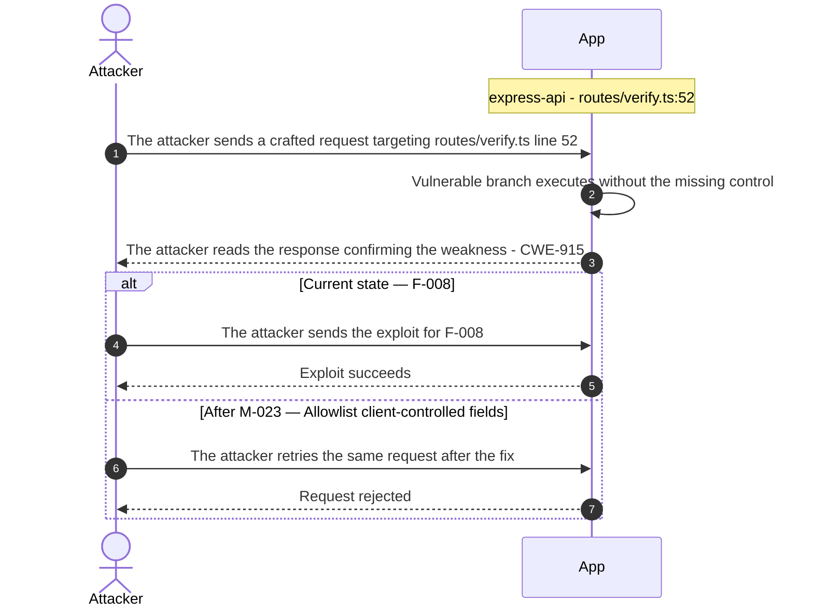
```mermaid
sequenceDiagram
    autonumber
    actor Attacker
    participant App
    Note over App: express-api - routes/verify.ts:52
    Attacker->>App: The attacker sends a crafted request targeting routes/verify.ts line 52
    App->>App: Vulnerable branch executes without the missing control
    App-->>Attacker: The attacker reads the response confirming the weakness - CWE-915
    alt Current state — F-008
        Attacker->>App: The attacker sends the exploit for F-008
        App-->>Attacker: Exploit succeeds
    else After M-023 — Allowlist client-controlled fields
        Attacker->>App: The attacker retries the same request after the fix
        App-->>Attacker: Request rejected
    end
```

**Key takeaway:** Until ● [M-023](#m-023) (Allowlist client-controlled fields) lands, 🔴 [F-008](#f-008) — Mass Assignment Allows Admin Role Injection (`routes/verify.ts:52`) is exploitable at `routes/verify.ts:52` (Critical-severity, [CWE-915](https://cwe.mitre.org/data/definitions/915.html)).

**Defense in Depth**

- Primary mitigation: ● [M-023](#m-023) (Allowlist client-controlled fields)

### 3.2 Server-Side Code Execution in User Profile

**Source:** 🔴 [F-006](#f-006) — `routes/userProfile.ts:61`

Severity **Critical** ([CWE-94](https://cwe.mitre.org/data/definitions/94.html)). STRIDE: Tampering. See [§8 F-006](#f-006) for the full register row.

**Attack Steps**

1. Authenticate as any user and send a profile update request setting the username field to #{`process.mainModule.require('child_process').execSync('id').toString()`}.
2. Request GET `/profile` while authenticated; the `getUserProfile` handler matches the #{...} pattern at line 54 and calls `eval(code)` at line 61.
3. The Node\.js process executes the injected expression with full server privileges and the result is interpolated into the HTML response.

**Sequence Diagram**

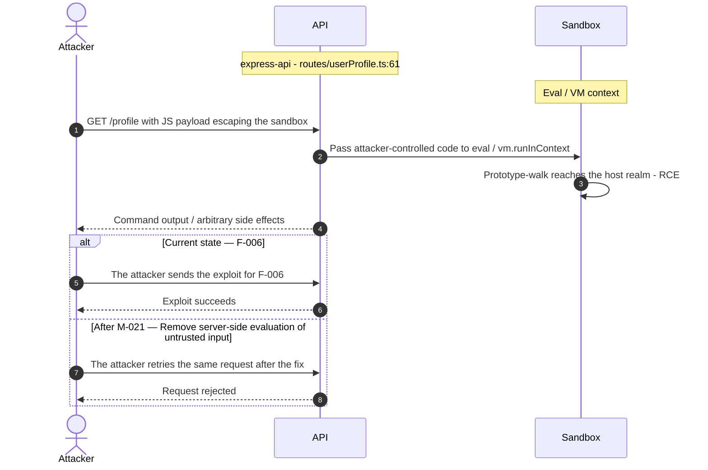
```mermaid
sequenceDiagram
    autonumber
    actor Attacker
    participant API
    participant Sandbox
    Note over API: express-api - routes/userProfile.ts:61
    Note over Sandbox: Eval / VM context
    Attacker->>API: GET /profile with JS payload escaping the sandbox
    API->>Sandbox: Pass attacker-controlled code to eval / vm.runInContext
    Sandbox->>Sandbox: Prototype-walk reaches the host realm - RCE
    API-->>Attacker: Command output / arbitrary side effects
    alt Current state — F-006
        Attacker->>API: The attacker sends the exploit for F-006
        API-->>Attacker: Exploit succeeds
    else After M-021 — Remove server-side evaluation of untrusted input
        Attacker->>API: The attacker retries the same request after the fix
        API-->>Attacker: Request rejected
    end
```

**Key takeaway:** Until ● [M-021](#m-021) (Remove server-side evaluation of untrusted input) lands, 🔴 [F-006](#f-006) — Server-Side Code Execution (`routes/userProfile.ts:61`) is exploitable at `routes/userProfile.ts:61` (Critical-severity, [CWE-94](https://cwe.mitre.org/data/definitions/94.html)).

**Defense in Depth**

- Primary mitigation: ● [M-021](#m-021) (Remove server-side evaluation of untrusted input)

### 3.3 Insecure Direct Object Reference in Address

**Source:** 🔴 [F-004](#f-004) — `routes/address.ts:18`

Severity **Critical** ([CWE-639](https://cwe.mitre.org/data/definitions/639.html)). STRIDE: Tampering. See [§8 F-004](#f-004) for the full register row.

**Attack Steps**

1. An attacker crafts a request targeting the weak spot at `routes/address.ts:18`.
2. A signed-in attacker puts another user's ID into the owner field of the request (`req.body.UserId` and the like); the query trusts it instead of the session identity, so the attacker reads or changes every other user's records - horizontal privilege escalation across all accounts.

**Sequence Diagram**

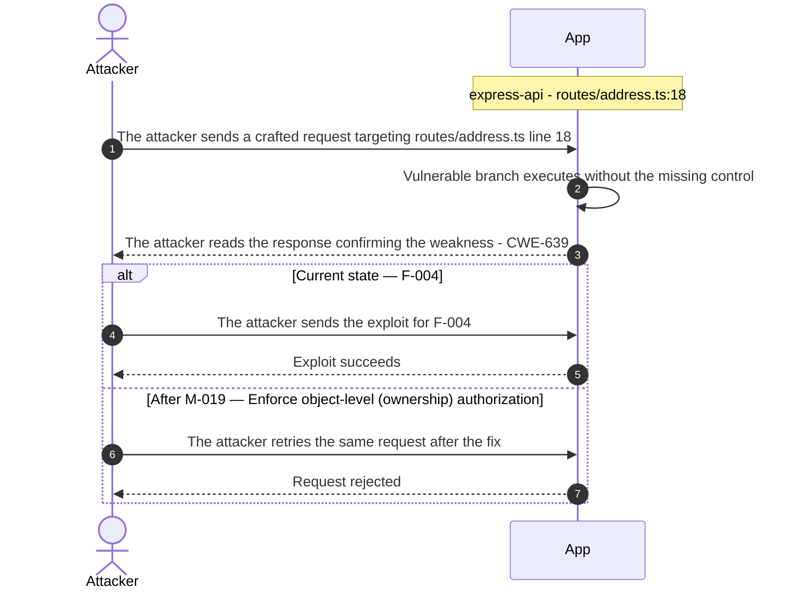
```mermaid
sequenceDiagram
    autonumber
    actor Attacker
    participant App
    Note over App: express-api - routes/address.ts:18
    Attacker->>App: The attacker sends a crafted request targeting routes/address.ts line 18
    App->>App: Vulnerable branch executes without the missing control
    App-->>Attacker: The attacker reads the response confirming the weakness - CWE-639
    alt Current state — F-004
        Attacker->>App: The attacker sends the exploit for F-004
        App-->>Attacker: Exploit succeeds
    else After M-019 — Enforce object-level (ownership) authorization
        Attacker->>App: The attacker retries the same request after the fix
        App-->>Attacker: Request rejected
    end
```

**Key takeaway:** Until ● [M-019](#m-019) (Enforce object-level (ownership) authorization) lands, 🔴 [F-004](#f-004) — Insecure Direct Object Reference is exploitable at `routes/address.ts:18` (Critical-severity, [CWE-639](https://cwe.mitre.org/data/definitions/639.html)).

**Defense in Depth**

- Primary mitigation: ● [M-019](#m-019) (Enforce object-level (ownership) authorization)

### 3.4 SQL injection in Login

**Source:** 🔴 [F-003](#f-003) — `routes/login.ts:34`

Severity **Critical** ([CWE-89](https://cwe.mitre.org/data/definitions/89.html)). STRIDE: Tampering. See [§8 F-003](#f-003) for the full register row.

**Attack Steps**

1. Attacker sends POST `/rest/user/login` with body `{"email":"' OR '1'='1'--","password":"x"}`, exploiting the absence of parameterized binding at `routes/login.ts:34`.
2. The injected SQL causes the WHERE clause to evaluate to TRUE for every row; Sequelize `plain:true` returns the first user record, typically the admin account.
3. The server issues a valid JWT for the returned user and stores the session in the in-memory token map, completing authentication bypass.
4. Attacker uses the issued JWT to call all authenticated API endpoints as the hijacked user.

**Sequence Diagram**

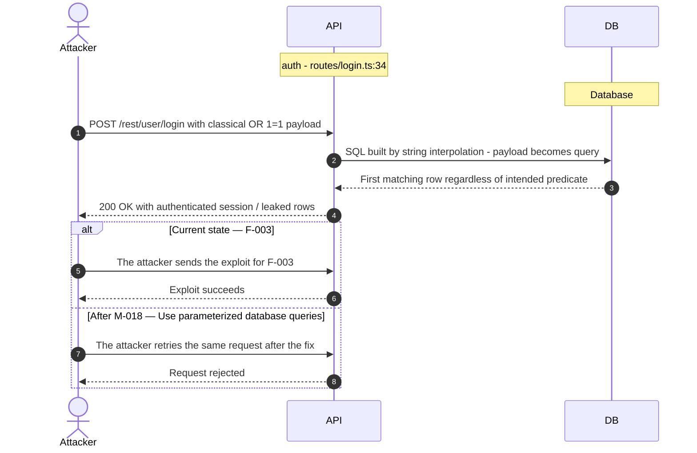
```mermaid
sequenceDiagram
    autonumber
    actor Attacker
    participant API
    participant DB
    Note over API: auth - routes/login.ts:34
    Note over DB: Database
    Attacker->>API: POST /rest/user/login with classical OR 1=1 payload
    API->>DB: SQL built by string interpolation - payload becomes query
    DB-->>API: First matching row regardless of intended predicate
    API-->>Attacker: 200 OK with authenticated session / leaked rows
    alt Current state — F-003
        Attacker->>API: The attacker sends the exploit for F-003
        API-->>Attacker: Exploit succeeds
    else After M-018 — Use parameterized database queries
        Attacker->>API: The attacker retries the same request after the fix
        API-->>Attacker: Request rejected
    end
```

**Key takeaway:** Until ● [M-018](#m-018) (Use parameterized database queries) lands, 🔴 [F-003](#f-003) — SQL injection (`routes/login.ts:34`) is exploitable at `routes/login.ts:34` (Critical-severity, [CWE-89](https://cwe.mitre.org/data/definitions/89.html)).

**Defense in Depth**

- Primary mitigation: ● [M-018](#m-018) (Use parameterized database queries)

### 3.5 SQL Injection in Product Search

**Source:** 🔴 [F-005](#f-005) — `routes/search.ts:23`

Severity **Critical** ([CWE-89](https://cwe.mitre.org/data/definitions/89.html)). STRIDE: Tampering. See [§8 F-005](#f-005) for the full register row.

**Attack Steps**

1. Send GET `/rest/products/search?q=test`')) `UNION SELECT id,email,password,role,NULL,NULL,NULL,NULL FROM Users`-- to the unauthenticated endpoint.
2. The interpolated query returns all user rows merged with the product result set.
3. Parse the JSON response to extract all user emails and `MD5` password hashes for offline cracking.

**Sequence Diagram**

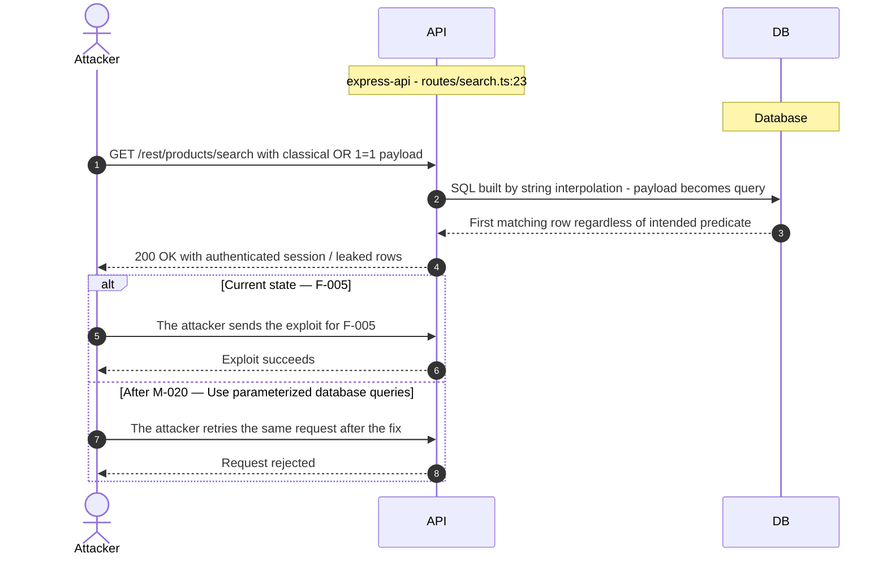
```mermaid
sequenceDiagram
    autonumber
    actor Attacker
    participant API
    participant DB
    Note over API: express-api - routes/search.ts:23
    Note over DB: Database
    Attacker->>API: GET /rest/products/search with classical OR 1=1 payload
    API->>DB: SQL built by string interpolation - payload becomes query
    DB-->>API: First matching row regardless of intended predicate
    API-->>Attacker: 200 OK with authenticated session / leaked rows
    alt Current state — F-005
        Attacker->>API: The attacker sends the exploit for F-005
        API-->>Attacker: Exploit succeeds
    else After M-020 — Use parameterized database queries
        Attacker->>API: The attacker retries the same request after the fix
        API-->>Attacker: Request rejected
    end
```

**Key takeaway:** Until ● [M-020](#m-020) (Use parameterized database queries) lands, 🔴 [F-005](#f-005) — SQL Injection in Product Search (`routes/search.ts:23`) is exploitable at `routes/search.ts:23` (Critical-severity, [CWE-89](https://cwe.mitre.org/data/definitions/89.html)).

**Defense in Depth**

- Primary mitigation: ● [M-020](#m-020) (Use parameterized database queries)

### 3.6 XXE in File Upload

**Source:** 🔴 [F-007](#f-007) — `routes/fileUpload.ts:83`

Severity **Critical** ([CWE-611](https://cwe.mitre.org/data/definitions/611.html)). STRIDE: Tampering. See [§8 F-007](#f-007) for the full register row.

**Attack Steps**

1. Craft an XML file containing <!DOCTYPE foo [<!ENTITY xxe SYSTEM "file:///etc/passwd">]>`<foo>`&xxe;</foo>.
2. Upload the file to POST `/file-upload` (no authentication required per `server.ts` line 309) with `Content-Type` multipart/form-data.
3. Read the 410 error response body which includes the parsed XML string containing the contents of `/etc/passwd`.

**Sequence Diagram**

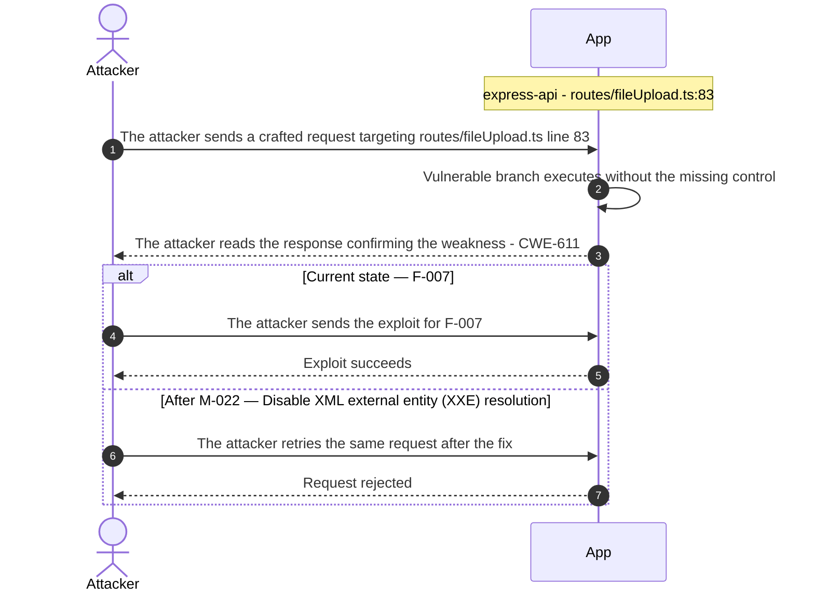
```mermaid
sequenceDiagram
    autonumber
    actor Attacker
    participant App
    Note over App: express-api - routes/fileUpload.ts:83
    Attacker->>App: The attacker sends a crafted request targeting routes/fileUpload.ts line 83
    App->>App: Vulnerable branch executes without the missing control
    App-->>Attacker: The attacker reads the response confirming the weakness - CWE-611
    alt Current state — F-007
        Attacker->>App: The attacker sends the exploit for F-007
        App-->>Attacker: Exploit succeeds
    else After M-022 — Disable XML external entity (XXE) resolution
        Attacker->>App: The attacker retries the same request after the fix
        App-->>Attacker: Request rejected
    end
```

**Key takeaway:** Until ● [M-022](#m-022) (Disable XML external entity (XXE) resolution) lands, 🔴 [F-007](#f-007) — XXE (`routes/fileUpload.ts:83`) is exploitable at `routes/fileUpload.ts:83` (Critical-severity, [CWE-611](https://cwe.mitre.org/data/definitions/611.html)).

**Defense in Depth**

- Primary mitigation: ● [M-022](#m-022) (Disable XML external entity (XXE) resolution)

### 3.7 Hardcoded RSA private key enables offline JWT forgery

**Source:** 🟠 [F-011](#f-011) — `lib/insecurity.ts:23`

Severity **High** ([CWE-321](https://cwe.mitre.org/data/definitions/321.html)). STRIDE: Spoofing. See [§8 F-011](#f-011) for the full register row.

**Attack Steps**

1. Attacker reads the full RSA private key literal from `lib/insecurity.ts:23` in the publicly available repository.
2. Attacker calls `jwt.sign({data:{role:'admin',id:<uid>,email:'admin@juice-sh.op'}}, privateKey, {algorithm:'RS256'})` offline.
3. Attacker sets the forged token in the `Authorization` header and sends requests to any JWT-protected endpoint.
4. All protected routes accept the token as authentic and grant admin-level access indefinitely until the key is rotated.

**Sequence Diagram**

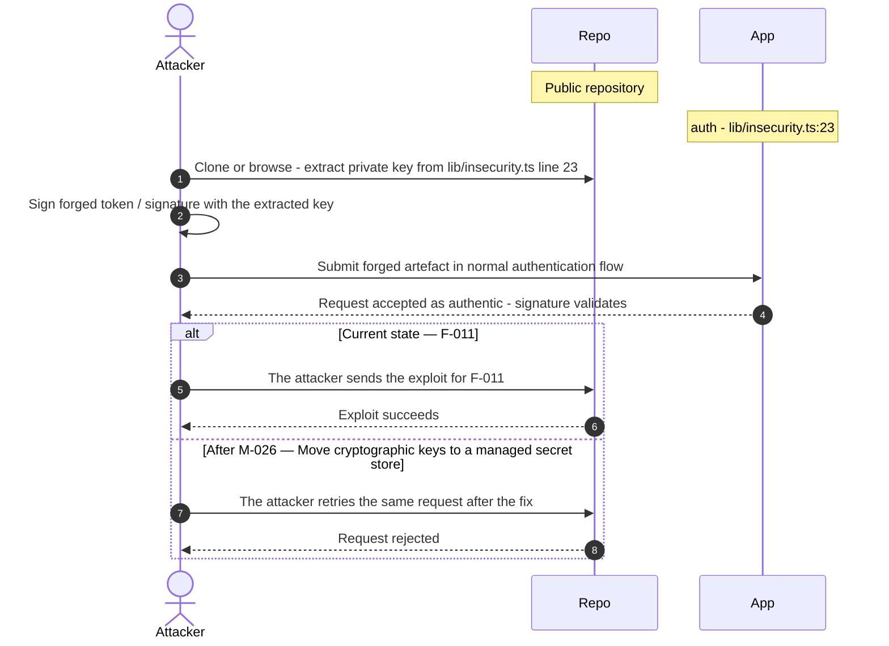
```mermaid
sequenceDiagram
    autonumber
    actor Attacker
    participant Repo
    participant App
    Note over Repo: Public repository
    Note over App: auth - lib/insecurity.ts:23
    Attacker->>Repo: Clone or browse - extract private key from lib/insecurity.ts line 23
    Attacker->>Attacker: Sign forged token / signature with the extracted key
    Attacker->>App: Submit forged artefact in normal authentication flow
    App-->>Attacker: Request accepted as authentic - signature validates
    alt Current state — F-011
        Attacker->>Repo: The attacker sends the exploit for F-011
        Repo-->>Attacker: Exploit succeeds
    else After M-026 — Move cryptographic keys to a managed secret store
        Attacker->>Repo: The attacker retries the same request after the fix
        Repo-->>Attacker: Request rejected
    end
```

**Key takeaway:** Until ◕ [M-026](#m-026) (Move cryptographic keys to a managed secret store) lands, 🟠 [F-011](#f-011) — Hardcoded RSA private key enables offline JWT forgery (`lib/insecurity.ts:23`) is exploitable at `lib/insecurity.ts:23` (High-severity, [CWE-321](https://cwe.mitre.org/data/definitions/321.html)).

**Defense in Depth**

- Primary mitigation: ◕ [M-026](#m-026) (Move cryptographic keys to a managed secret store)

### 3.8 Unauthenticated WebSocket Channel in Real-time WebSocket Channel

**Source:** 🟠 [F-016](#f-016) — `lib/startup/registerWebsocketEvents.ts:24`

Severity **High** ([CWE-306](https://cwe.mitre.org/data/definitions/306.html)). STRIDE: Spoofing. See [§8 F-016](#f-016) for the full register row.

**Attack Steps**

1. An attacker crafts a request targeting the weak spot at `lib/startup/registerWebsocketEvents.ts:24`.
2. The attacker sends it; the missing control never rejects the crafted input.
3. An anonymous internet client opens a Socket\.IO connection on port 3000 without presenting any JWT or session credential.

**Sequence Diagram**

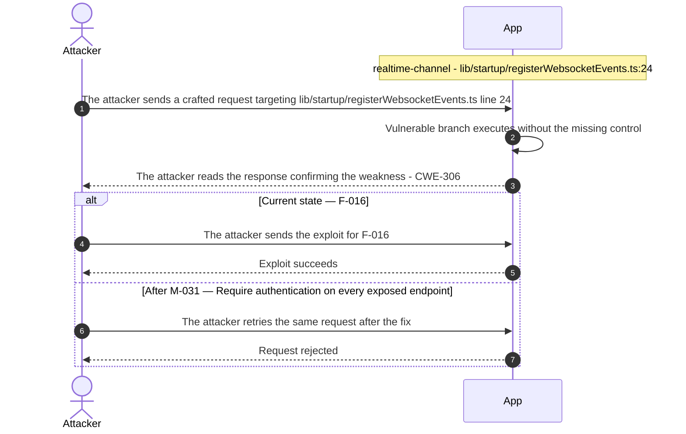
```mermaid
sequenceDiagram
    autonumber
    actor Attacker
    participant App
    Note over App: realtime-channel - lib/startup/registerWebsocketEvents.ts:24
    Attacker->>App: The attacker sends a crafted request targeting lib/startup/registerWebsocketEvents.ts line 24
    App->>App: Vulnerable branch executes without the missing control
    App-->>Attacker: The attacker reads the response confirming the weakness - CWE-306
    alt Current state — F-016
        Attacker->>App: The attacker sends the exploit for F-016
        App-->>Attacker: Exploit succeeds
    else After M-031 — Require authentication on every exposed endpoint
        Attacker->>App: The attacker retries the same request after the fix
        App-->>Attacker: Request rejected
    end
```

**Key takeaway:** Until ◕ [M-031](#m-031) (Require authentication on every exposed endpoint) lands, 🟠 [F-016](#f-016) — Unauthenticated WebSocket Channel is exploitable at `lib/startup/registerWebsocketEvents.ts:24` (High-severity, [CWE-306](https://cwe.mitre.org/data/definitions/306.html)).

**Defense in Depth**

- Primary mitigation: ◕ [M-031](#m-031) (Require authentication on every exposed endpoint)

<!-- generated:walkthrough_renderer -->

---

## 4. Assets

Information assets and the classification level that drives the Confidentiality / Integrity / Availability targets used in [§8 Findings Register](#8-findings-register) risk scoring.

<table style="table-layout:fixed;width:100%">
<colgroup><col width="22%" style="width:22%"><col width="13%" style="width:13%"><col width="32%" style="width:32%"><col width="33%" style="width:33%"></colgroup>
<thead><tr><th>Asset</th><th>Classification</th><th>Description</th><th>Linked Threats</th></tr></thead>
<tbody>
<tr><td style="overflow-wrap:break-word">User Credentials and Password Hashes</td><td>Restricted</td><td>User account email addresses, <code>MD5</code>-hashed passwords (<code>lib/insecurity.ts</code> hash function uses <code>crypto.createHash('md5')</code>), and security question answers stored in the SQLite users table. Compromise enables account takeover and credential stuffing against external services.</td><td style="overflow-wrap:break-word">🔴 <a href="#f-003">F-003</a> — SQL injection (<code>login.ts:34</code>)<br/>🔴 <a href="#f-005">F-005</a> — SQL Injection in Product Search (<code>search.ts:23</code>)<br/>🟠 <a href="#f-010">F-010</a> — Predictable password derived from Google OAuth email (<code>oauth.component.ts:30</code>)<br/>🟠 <a href="#f-011">F-011</a> — Hardcoded RSA private key enables offline JWT forgery (<code>insecurity.ts:23</code>)<br/>🟠 <a href="#f-013">F-013</a> — Password reset accepts a security-question answer (<code>resetPassword.ts:10</code>)<br/>🟠 <a href="#f-017">F-017</a> — Stored XSS (<code>about.component.ts:119</code>)<br/>🟠 <a href="#f-018">F-018</a> — Stored XSS (<code>administration.component.ts:73</code>)<br/>🟠 <a href="#f-019">F-019</a> — Stored XSS (<code>administration.component.ts:91</code>)<br/>🟠 <a href="#f-020">F-020</a> — Stored XSS (<code>search-result.component.ts:110</code>)<br/>🟠 <a href="#f-021">F-021</a> — DOM XSS (<code>search-result.component.ts:143</code>)<br/>🟠 <a href="#f-032">F-032</a> — Hardcoded HMAC key exposes security answer hashes to offline attack (<code>insecurity.ts:44</code>)<br/>🟠 <a href="#f-033">F-033</a> — MD5 password hashing without salt enables offline (<code>insecurity.ts:43</code>)<br/>🟠 <a href="#f-040">F-040</a> — Unsalted MD5 password hashing enables offline dictionary (<code>user.ts:77</code>)<br/>🟠 <a href="#f-044">F-044</a> — Security-question password reset without lockout (<code>resetPassword.ts:41</code>)<br/>🟡 <a href="#f-051">F-051</a> — Stored XSS (<code>last-login-ip.component.ts:39</code>)<br/>🟡 <a href="#f-056">F-056</a> — Challenge-gated weak sanitization stores XSS HTML in Users (<code>user.ts:50</code>)<br/>🟡 <a href="#f-065">F-065</a> — No rate limiting on login endpoint enables credential (<code>login.ts:32</code>)<br/>🟡 <a href="#f-066">F-066</a> — No Rate Limiting or Account Lockout on Login Endpoint (<code>server.ts:595</code>)<br/>🟡 <a href="#f-070">F-070</a> — Unrated TOTP verify endpoint allows 2FA brute-force (<code>2fa.ts:31</code>)<br/>🟡 <a href="#f-071">F-071</a> — UpdateAuthenticatedUsers re-inserts valid JWT bypassing (<code>insecurity.ts:191</code>)</td></tr>
<tr><td style="overflow-wrap:break-word">JWT Signing Key Pair</td><td>Restricted</td><td>RSA private/public key pair used to sign and verify JWT session tokens (<code>lib/insecurity.ts</code>, <code>RS256</code> algorithm). The private key is loaded from encryptionkeys/ at startup. Exposure of the private key allows forging arbitrary session tokens for any user including admin.</td><td style="overflow-wrap:break-word">🔴 <a href="#f-008">F-008</a> — Mass Assignment Allows Admin Role Injection (<code>verify.ts:52</code>)<br/>🟠 <a href="#f-011">F-011</a> — Hardcoded RSA private key enables offline JWT forgery (<code>insecurity.ts:23</code>)<br/>🟠 <a href="#f-012">F-012</a> — Missing JWT algorithm whitelist (<code>insecurity.ts:54</code>)<br/>🟠 <a href="#f-022">F-022</a> — Path traversal filesystem access from request input (<code>dataErasure.ts:104</code>)<br/>🟠 <a href="#f-026">F-026</a> — ZIP Slip Path Traversal in File Upload (<code>fileUpload.ts:44</code>)<br/>🟠 <a href="#f-029">F-029</a> — Hardcoded BIP39 mnemonic enables forged challenge (<code>checkKeys.ts:10</code>)<br/>🟠 <a href="#f-030">F-030</a> — Hardcoded testing credentials in production bundle (<code>login.component.ts:63</code>)<br/>🟠 <a href="#f-032">F-032</a> — Hardcoded HMAC key exposes security answer hashes to offline attack (<code>insecurity.ts:44</code>)<br/>🟠 <a href="#f-033">F-033</a> — MD5 password hashing without salt enables offline (<code>insecurity.ts:43</code>)<br/>🟠 <a href="#f-035">F-035</a> — Unauthenticated <code>/encryptionkeys</code> Exposes JWT Public Key (<code>server.ts:277</code>)<br/>🟠 <a href="#f-038">F-038</a> — Unauthenticated CTF Flag Disclosure (<code>registerWebsocketEvents.ts:31</code>)<br/>🟠 <a href="#f-039">F-039</a> — Payment card number stored as plaintext integer in Cards (<code>card.ts:39</code>)<br/>🟡 <a href="#f-070">F-070</a> — Unrated TOTP verify endpoint allows 2FA brute-force (<code>2fa.ts:31</code>)<br/>🟡 <a href="#f-071">F-071</a> — UpdateAuthenticatedUsers re-inserts valid JWT bypassing (<code>insecurity.ts:191</code>)</td></tr>
<tr><td style="overflow-wrap:break-word">User Session Tokens (JWT)</td><td>Confidential</td><td>Active <code>RS256</code> JWT bearer tokens stored in browser <code>localStorage</code> and transmitted as <code>Authorization</code> headers. A stolen token grants full access to the associated account's API endpoints for the 6-hour token lifetime.</td><td style="overflow-wrap:break-word">🟠 <a href="#f-009">F-009</a> — OAuth CSRF (<code>login.component.ts:152</code>)<br/>🟠 <a href="#f-012">F-012</a> — Missing JWT algorithm whitelist (<code>insecurity.ts:54</code>)<br/>🟠 <a href="#f-015">F-015</a> — Unverified JWT Decode in Chat Enables Order Impersonation (<code>chat.ts:45</code>)<br/>🟠 <a href="#f-017">F-017</a> — Stored XSS (<code>about.component.ts:119</code>)<br/>🟠 <a href="#f-018">F-018</a> — Stored XSS (<code>administration.component.ts:73</code>)<br/>🟠 <a href="#f-019">F-019</a> — Stored XSS (<code>administration.component.ts:91</code>)<br/>🟠 <a href="#f-020">F-020</a> — Stored XSS (<code>search-result.component.ts:110</code>)<br/>🟠 <a href="#f-021">F-021</a> — DOM XSS (<code>search-result.component.ts:143</code>)<br/>🟠 <a href="#f-031">F-031</a> — JWT stored in localStorage (<code>login.component.ts:105</code>)<br/>🟠 <a href="#f-039">F-039</a> — Payment card number stored as plaintext integer in Cards (<code>card.ts:39</code>)<br/>🟡 <a href="#f-051">F-051</a> — Stored XSS (<code>last-login-ip.component.ts:39</code>)<br/>🟡 <a href="#f-056">F-056</a> — Challenge-gated weak sanitization stores XSS HTML in Users (<code>user.ts:50</code>)<br/>🟡 <a href="#f-058">F-058</a> — Missing Container Image Signing (<code>ci.yml:1</code>)<br/>🟡 <a href="#f-071">F-071</a> — UpdateAuthenticatedUsers re-inserts valid JWT bypassing (<code>insecurity.ts:191</code>)<br/>🟠 <a href="#f-078">F-078</a> — Token flow accepts a stolen bearer token without (<code>login.component.ts:152</code>)</td></tr>
<tr><td style="overflow-wrap:break-word">User Personal Data (PII)</td><td>Confidential</td><td>User profile information including email addresses, usernames, delivery addresses, and privacy request records stored in the SQLite database. Subject to GDPR data export and erasure (<code>routes/dataExport.ts</code>, <code>routes/dataErasure.ts</code>).</td><td style="overflow-wrap:break-word">🔴 <a href="#f-003">F-003</a> — SQL injection (<code>login.ts:34</code>)<br/>🔴 <a href="#f-004">F-004</a> — Insecure Direct Object Reference (<code>address.ts:18</code>)<br/>🔴 <a href="#f-005">F-005</a> — SQL Injection in Product Search (<code>search.ts:23</code>)<br/>🔴 <a href="#f-006">F-006</a> — Server-Side Code Execution (<code>userProfile.ts:61</code>)<br/>🔴 <a href="#f-008">F-008</a> — Mass Assignment Allows Admin Role Injection (<code>verify.ts:52</code>)<br/>🟠 <a href="#f-017">F-017</a> — Stored XSS (<code>about.component.ts:119</code>)<br/>🟠 <a href="#f-018">F-018</a> — Stored XSS (<code>administration.component.ts:73</code>)<br/>🟠 <a href="#f-019">F-019</a> — Stored XSS (<code>administration.component.ts:91</code>)<br/>🟠 <a href="#f-020">F-020</a> — Stored XSS (<code>search-result.component.ts:110</code>)<br/>🟠 <a href="#f-021">F-021</a> — DOM XSS (<code>search-result.component.ts:143</code>)<br/>🟠 <a href="#f-022">F-022</a> — Path traversal filesystem access from request input (<code>dataErasure.ts:104</code>)<br/>🟠 <a href="#f-024">F-024</a> — Input compiled as template source (<code>userProfile.ts:87</code>)<br/>🟠 <a href="#f-037">F-037</a> — Unauthenticated access to all order records (<code>trackOrder.ts:18</code>)<br/>🟠 <a href="#f-038">F-038</a> — Unauthenticated CTF Flag Disclosure (<code>registerWebsocketEvents.ts:31</code>)<br/>🟠 <a href="#f-045">F-045</a> — Sensitive Routes Registered Without Authentication Middleware (<code>server.ts:310</code>)<br/>🟠 <a href="#f-046">F-046</a> — Missing permissions block default GITHUB_TOKEN scope (<code>ci.yml:1</code>)<br/>🟠 <a href="#f-047">F-047</a> — Free Deluxe Membership (<code>deluxe.ts:24</code>)<br/>🟠 <a href="#f-048">F-048</a> — IDOR: review update without ownership check (<code>updateProductReviews.ts:16</code>)<br/>🟡 <a href="#f-051">F-051</a> — Stored XSS (<code>last-login-ip.component.ts:39</code>)<br/>🟡 <a href="#f-056">F-056</a> — Challenge-gated weak sanitization stores XSS HTML in Users (<code>user.ts:50</code>)<br/>🟡 <a href="#f-064">F-064</a> — LLM02 Chatbot Returns Unfiltered User Order Data Including (<code>chat.ts:164</code>)<br/>🟡 <a href="#f-068">F-068</a> — Unbounded wallet derivation per request without rate (<code>checkKeys.ts:9</code>)</td></tr>
<tr><td style="overflow-wrap:break-word">Payment Card Data</td><td>Confidential</td><td>Credit/debit card records (card number, expiry, CVV) stored in the SQLite cards table (<code>models/card.ts</code>) and processed by payment routes. This is a training application with synthetic data; no real payment processor is integrated.</td><td style="overflow-wrap:break-word">🔴 <a href="#f-003">F-003</a> — SQL injection (<code>login.ts:34</code>)<br/>🔴 <a href="#f-004">F-004</a> — Insecure Direct Object Reference (<code>address.ts:18</code>)<br/>🔴 <a href="#f-005">F-005</a> — SQL Injection in Product Search (<code>search.ts:23</code>)<br/>🟠 <a href="#f-017">F-017</a> — Stored XSS (<code>about.component.ts:119</code>)<br/>🟠 <a href="#f-018">F-018</a> — Stored XSS (<code>administration.component.ts:73</code>)<br/>🟠 <a href="#f-019">F-019</a> — Stored XSS (<code>administration.component.ts:91</code>)<br/>🟠 <a href="#f-020">F-020</a> — Stored XSS (<code>search-result.component.ts:110</code>)<br/>🟠 <a href="#f-021">F-021</a> — DOM XSS (<code>search-result.component.ts:143</code>)<br/>🟠 <a href="#f-037">F-037</a> — Unauthenticated access to all order records (<code>trackOrder.ts:18</code>)<br/>🟠 <a href="#f-039">F-039</a> — Payment card number stored as plaintext integer in Cards (<code>card.ts:39</code>)<br/>🟠 <a href="#f-045">F-045</a> — Sensitive Routes Registered Without Authentication Middleware (<code>server.ts:310</code>)<br/>🟠 <a href="#f-046">F-046</a> — Missing permissions block default GITHUB_TOKEN scope (<code>ci.yml:1</code>)<br/>🟠 <a href="#f-047">F-047</a> — Free Deluxe Membership (<code>deluxe.ts:24</code>)<br/>🟠 <a href="#f-048">F-048</a> — IDOR: review update without ownership check (<code>updateProductReviews.ts:16</code>)<br/>🟡 <a href="#f-051">F-051</a> — Stored XSS (<code>last-login-ip.component.ts:39</code>)<br/>🟡 <a href="#f-056">F-056</a> — Challenge-gated weak sanitization stores XSS HTML in Users (<code>user.ts:50</code>)</td></tr>
<tr><td style="overflow-wrap:break-word">Challenge State and Progress Data</td><td>Internal</td><td>Per-user challenge completion records, scoring, and code snippets stored in the SQLite challenges table and datacache. Integrity of challenge state determines the educational outcome of each session.</td><td style="overflow-wrap:break-word">-</td></tr>
<tr><td style="overflow-wrap:break-word">Product Reviews and Order Documents</td><td>Internal</td><td>User-submitted product reviews (posts collection) and order records (orders collection) stored in the in-memory MarsDB instance. Data is ephemeral between restarts and may contain user-supplied content processed by the LLM chatbot.</td><td style="overflow-wrap:break-word">-</td></tr>
<tr><td style="overflow-wrap:break-word">CI/CD Pipeline Configuration and Secrets</td><td>Internal</td><td>GitHub Actions workflow files, <code>Dockerfile</code>, and <code>package.json</code> postinstall scripts governing the build and release pipeline. Workflow files use tag-only (non-SHA-pinned) action references. Compromise enables malicious code injection into the published Docker image or npm artifacts.</td><td style="overflow-wrap:break-word">-</td></tr>
</tbody>
</table>

---

## 5. Attack Surface

Network-reachable entry points classified by authentication requirement. Each row links to the threat(s) referenced in its **Notes** column. The **Risk** column reflects the highest-severity linked finding. Entry points with no linked finding are still listed when they sit on a sensitive surface (authentication, registration, management) or look like a missing-auth/authz suspect - marked **⚑ Review** in Notes.

### 5.1 Unauthenticated Entry Points (65)

<table style="table-layout:fixed;width:100%">
<colgroup><col width="9%" style="width:9%"><col width="30%" style="width:30%"><col width="14%" style="width:14%"><col width="47%" style="width:47%"></colgroup>
<thead><tr><th>Method</th><th>Route</th><th>Risk</th><th>Notes</th></tr></thead>
<tbody>
<tr><td>POST</td><td style="overflow-wrap:anywhere"><code>/api/Users</code></td><td>🔴 Critical</td><td>🔴 <a href="#f-008">F-008</a> — Mass Assignment Allows Admin Role Injection (<code>verify.ts:52</code>)<br/>POST <code>/api/Users</code> (registration); open self-registration, no auth required</td></tr>
<tr><td>POST</td><td style="overflow-wrap:anywhere"><code>/file-upload</code></td><td>🔴 Critical</td><td>🔴 <a href="#f-007">F-007</a> — XXE (<code>fileUpload.ts:83</code>)<br/>🟠 <a href="#f-026">F-026</a> — ZIP Slip Path Traversal in File Upload (<code>fileUpload.ts:44</code>)<br/>🟠 <a href="#f-041">F-041</a> — YAML Bomb Causes CPU Exhaustion in File Upload (<code>fileUpload.ts:117</code>)<br/>Unauthenticated file upload endpoint; missing-auth on multipart upload with no user check</td></tr>
<tr><td>POST</td><td style="overflow-wrap:anywhere"><code>/rest/2fa/verify</code></td><td>🔴 Critical</td><td>🔴 <a href="#f-008">F-008</a> — Mass Assignment Allows Admin Role Injection (<code>verify.ts:52</code>)<br/>🟡 <a href="#f-070">F-070</a> — Unrated TOTP verify endpoint allows 2FA brute-force (<code>2fa.ts:31</code>)<br/>POST <code>/rest/2fa/verify</code>; authentication surface — 2FA TOTP verification, no prior auth required</td></tr>
<tr><td>POST</td><td style="overflow-wrap:anywhere"><code>/rest/user/login</code></td><td>🔴 Critical</td><td>🔴 <a href="#f-003">F-003</a> — SQL injection (<code>login.ts:34</code>)<br/>🟠 <a href="#f-010">F-010</a> — Predictable password derived from Google OAuth email (<code>oauth.component.ts:30</code>)<br/>🟡 <a href="#f-065">F-065</a> — No rate limiting on login endpoint enables credential (<code>login.ts:32</code>)<br/>handler: <code>server.ts:595</code></td></tr>
<tr><td>GET</td><td style="overflow-wrap:anywhere"><code>/rest/products/search</code></td><td>🔴 Critical</td><td>🔴 <a href="#f-005">F-005</a> — SQL Injection in Product Search (<code>search.ts:23</code>)<br/>handler: <code>server.ts:601</code></td></tr>
<tr><td>POST</td><td style="overflow-wrap:anywhere"><code>/rest/chat</code></td><td>🟠 High</td><td>🟠 <a href="#f-015">F-015</a> — Unverified JWT Decode in Chat Enables Order Impersonation (<code>chat.ts:45</code>)<br/>🟠 <a href="#f-027">F-027</a> — LLM01 Prompt Injection Bypasses Coupon Discount Policy (<code>chat.ts:177</code>)<br/>🟡 <a href="#f-067">F-067</a> — LLM10 Unbounded Token Consumption on Chat Endpoint (<code>chat.ts:207</code>)<br/>Unauthenticated LLM chatbot endpoint; prompt injection and denial-of-service surface</td></tr>
<tr><td>POST</td><td style="overflow-wrap:anywhere"><code>/rest/deluxe-membership</code></td><td>🟠 High</td><td>🟠 <a href="#f-047">F-047</a> — Free Deluxe Membership (<code>deluxe.ts:24</code>)<br/>POST <code>/rest/deluxe-membership</code>; membership purchase, authentication unresolved</td></tr>
<tr><td>POST</td><td style="overflow-wrap:anywhere"><code>/rest/user/reset-password</code></td><td>🟠 High</td><td>🟠 <a href="#f-014">F-014</a> — Rate Limit Bypass (<code>server.ts:346</code>)<br/>🟠 <a href="#f-044">F-044</a> — Security-question password reset without lockout (<code>resetPassword.ts:41</code>)<br/>🟡 <a href="#f-066">F-066</a> — No Rate Limiting or Account Lockout on Login Endpoint (<code>server.ts:595</code>)<br/>handler: <code>server.ts:597</code></td></tr>
<tr><td>POST</td><td style="overflow-wrap:anywhere"><code>/rest/web3/submitKey</code></td><td>🟠 High</td><td>🟠 <a href="#f-029">F-029</a> — Hardcoded BIP39 mnemonic enables forged challenge (<code>checkKeys.ts:10</code>)<br/>🟠 <a href="#f-049">F-049</a> — Missing authentication on key submission endpoint (<code>checkKeys.ts:6</code>)<br/>🟡 <a href="#f-068">F-068</a> — Unbounded wallet derivation per request without rate (<code>checkKeys.ts:9</code>)<br/>POST <code>/rest/web3/submitKey</code>; unauthenticated crypto key submission (web3 challenge surface)</td></tr>
<tr><td>GET</td><td style="overflow-wrap:anywhere"><code>/rest/deluxe-membership</code></td><td>🟠 High</td><td>🟠 <a href="#f-047">F-047</a> — Free Deluxe Membership (<code>deluxe.ts:24</code>)<br/>handler: <code>server.ts:627</code></td></tr>
<tr><td>GET</td><td style="overflow-wrap:anywhere"><code>/rest/track-order/:id</code></td><td>🟠 High</td><td>🟠 <a href="#f-037">F-037</a> — Unauthenticated access to all order records (<code>trackOrder.ts:18</code>)<br/>handler: <code>server.ts:616</code></td></tr>
<tr><td>GET</td><td style="overflow-wrap:anywhere"><code>/rest/user/security-question</code></td><td>🟠 High</td><td>🟠 <a href="#f-014">F-014</a> — Rate Limit Bypass (<code>server.ts:346</code>)<br/>🟠 <a href="#f-044">F-044</a> — Security-question password reset without lockout (<code>resetPassword.ts:41</code>)<br/>handler: <code>server.ts:598</code></td></tr>
<tr><td>GET</td><td style="overflow-wrap:anywhere"><code>/redirect</code></td><td>🟡 Medium</td><td>🟡 <a href="#f-050">F-050</a> — Open Redirect (<code>redirect.ts:19</code>)<br/>handler: <code>server.ts:658</code></td></tr>
<tr><td>GET</td><td style="overflow-wrap:anywhere"><code>/​this/​page/​is/​hidden/​behind/​an/​incredibly/​high/​paywall/​that/​could/​only/​be/​unlocked/​by/​sending/​1btc/​to/​us</code></td><td>🟡 Medium</td><td>🟡 <a href="#f-056">F-056</a> — Challenge-gated weak sanitization stores XSS HTML in Users (<code>user.ts:50</code>)<br/>handler: <code>server.ts:651</code></td></tr>
<tr><td>POST</td><td style="overflow-wrap:anywhere"><code>/api/Addresss</code></td><td>-</td><td>POST <code>/api/Addresss</code>; authentication unresolved via <code>lib/insecurity.ts</code><br/><em>⚑ Review: no auth guard detected</em></td></tr>
<tr><td>PUT</td><td style="overflow-wrap:anywhere"><code>/api/Addresss/:id</code></td><td>-</td><td>PUT <code>/api/Addresss/:id</code>; authentication unresolved, authorization unverified<br/><em>⚑ Review: no auth guard detected</em></td></tr>
<tr><td>DELETE</td><td style="overflow-wrap:anywhere"><code>/api/Addresss/:id</code></td><td>-</td><td>DELETE <code>/api/Addresss/:id</code>; authentication unresolved via <code>routes/address.ts</code><br/><em>⚑ Review: no auth guard detected</em></td></tr>
<tr><td>POST</td><td style="overflow-wrap:anywhere"><code>/api/Cards</code></td><td>-</td><td>POST <code>/api/Cards</code>; authentication unresolved via <code>lib/insecurity.ts</code> middleware<br/><em>⚑ Review: no auth guard detected</em></td></tr>
<tr><td>DELETE</td><td style="overflow-wrap:anywhere"><code>/api/Cards/:id</code></td><td>-</td><td>DELETE <code>/api/Cards/:id</code>; authentication present via <code>routes/payment.ts</code>, authorization unverified<br/><em>⚑ Review: no auth guard detected</em></td></tr>
<tr><td>POST</td><td style="overflow-wrap:anywhere"><code>/api/Feedbacks</code></td><td>-</td><td>POST <code>/api/Feedbacks</code> (verify step); unauthenticated feedback submission, missing-auth<br/><em>⚑ Review: no auth guard detected</em></td></tr>
<tr><td>GET</td><td style="overflow-wrap:anywhere"><code>/​rest/​admin/​application-​configuration</code></td><td>-</td><td>Unauthenticated management endpoint exposing full application configuration; management surface, missing-auth<br/><em>⚑ Review: no auth guard detected</em></td></tr>
<tr><td>GET</td><td style="overflow-wrap:anywhere"><code>/​rest/​admin/​application-​version</code></td><td>-</td><td>Unauthenticated management endpoint exposing application version; management surface, missing-auth<br/><em>⚑ Review: no auth guard detected</em></td></tr>
<tr><td>PUT</td><td style="overflow-wrap:anywhere"><code>/​rest/​continue-​code-​findIt/​apply/​:​continueCode</code></td><td>-</td><td>PUT <code>/rest/continue-code-findIt/apply/:continueCode</code>; unauthenticated challenge progress restore<br/><em>⚑ Review: no auth guard detected</em></td></tr>
<tr><td>PUT</td><td style="overflow-wrap:anywhere"><code>/​rest/​continue-​code-​fixIt/​apply/​:​continueCode</code></td><td>-</td><td>PUT <code>/rest/continue-code-fixIt/apply/:continueCode</code>; unauthenticated challenge progress restore<br/><em>⚑ Review: no auth guard detected</em></td></tr>
<tr><td>PUT</td><td style="overflow-wrap:anywhere"><code>/​rest/​continue-​code/​apply/​:​continueCode</code></td><td>-</td><td>PUT <code>/rest/continue-code/apply/:continueCode</code>; unauthenticated global progress restore<br/><em>⚑ Review: no auth guard detected</em></td></tr>
<tr><td>POST</td><td style="overflow-wrap:anywhere"><code>/rest/memories</code></td><td>-</td><td>POST <code>/rest/memories</code> file/image upload; authentication signal unresolved<br/><em>⚑ Review: no auth guard detected</em></td></tr>
<tr><td>PUT</td><td style="overflow-wrap:anywhere"><code>/rest/products/:id/reviews</code></td><td>-</td><td>PUT <code>/rest/products/:id/reviews</code>; unauthenticated product review creation (missing-auth)<br/><em>⚑ Review: no auth guard detected</em></td></tr>
<tr><td>POST</td><td style="overflow-wrap:anywhere"><code>/rest/user/data-export</code></td><td>-</td><td>POST <code>/rest/user/data-export</code>; GDPR data export, authentication signal unresolved<br/><em>⚑ Review: no auth guard detected</em></td></tr>
<tr><td>PUT</td><td style="overflow-wrap:anywhere"><code>/rest/wallet/balance</code></td><td>-</td><td>PUT <code>/rest/wallet/balance</code>; wallet mutation, authentication unresolved<br/><em>⚑ Review: no auth guard detected</em></td></tr>
<tr><td>POST</td><td style="overflow-wrap:anywhere"><code>/​rest/​web3/​walletExploitAddress</code></td><td>-</td><td>POST <code>/rest/web3/walletExploitAddress</code>; unauthenticated wallet exploit address submission<br/><em>⚑ Review: no auth guard detected</em></td></tr>
<tr><td>POST</td><td style="overflow-wrap:anywhere"><code>/rest/web3/walletNFTVerify</code></td><td>-</td><td>POST <code>/rest/web3/walletNFTVerify</code>; unauthenticated NFT wallet verification<br/><em>⚑ Review: no auth guard detected</em></td></tr>
<tr><td>POST</td><td style="overflow-wrap:anywhere"><code>/snippets/fixes</code></td><td>-</td><td>POST <code>/snippets/fixes</code>; unauthenticated code fix submission<br/><em>⚑ Review: no auth guard detected</em></td></tr>
<tr><td>POST</td><td style="overflow-wrap:anywhere"><code>/snippets/verdict</code></td><td>-</td><td>POST <code>/snippets/verdict</code>; unauthenticated code snippet verdict submission<br/><em>⚑ Review: no auth guard detected</em></td></tr>
</tbody>
</table>

_32 further entry point(s) in this category carry no linked finding and no elevated review signal, and are not listed individually (65 total). The complete route inventory is available in `.route-inventory.json` and, when exported, `pentest-tasks.yaml`._

### 5.2 Authenticated Entry Points (41)

<table style="table-layout:fixed;width:100%">
<colgroup><col width="9%" style="width:9%"><col width="30%" style="width:30%"><col width="14%" style="width:14%"><col width="47%" style="width:47%"></colgroup>
<thead><tr><th>Method</th><th>Route</th><th>Risk</th><th>Notes</th></tr></thead>
<tbody>
<tr><td>GET</td><td style="overflow-wrap:anywhere"><code>/api/Users</code></td><td>🔴 Critical</td><td>🔴 <a href="#f-008">F-008</a> — Mass Assignment Allows Admin Role Injection (<code>verify.ts:52</code>)<br/>handler: <code>server.ts:362</code></td></tr>
<tr><td>GET</td><td style="overflow-wrap:anywhere"><code>/profile</code></td><td>🔴 Critical</td><td>🔴 <a href="#f-006">F-006</a> — Server-Side Code Execution (<code>userProfile.ts:61</code>)<br/>handler: <code>server.ts:665</code></td></tr>
<tr><td>POST</td><td style="overflow-wrap:anywhere"><code>/profile</code></td><td>🔴 Critical</td><td>🔴 <a href="#f-006">F-006</a> — Server-Side Code Execution (<code>userProfile.ts:61</code>)<br/>handler: <code>server.ts:666</code></td></tr>
<tr><td>PUT</td><td style="overflow-wrap:anywhere"><code>/​rest/​order-​history/​:​id/​delivery-​status</code></td><td>🟠 High</td><td>🟠 <a href="#f-037">F-037</a> — Unauthenticated access to all order records (<code>trackOrder.ts:18</code>)<br/>PUT <code>/rest/order-history/:id/delivery-status</code>; bearer JWT auth verified, but authorization on :id unverified</td></tr>
<tr><td>PUT</td><td style="overflow-wrap:anywhere"><code>/api/BasketItems/:id</code></td><td>-</td><td>PUT <code>/api/BasketItems/:id</code>; auth middleware present but authorization unverified - IDOR risk<br/><em>⚑ Review: no authz guard detected</em></td></tr>
<tr><td>PUT</td><td style="overflow-wrap:anywhere"><code>/api/Cards/:id</code></td><td>-</td><td>PUT <code>/api/Cards/:id</code>; authentication middleware present, authorization unverified<br/><em>⚑ Review: no authz guard detected</em></td></tr>
<tr><td>PUT</td><td style="overflow-wrap:anywhere"><code>/api/Feedbacks/:id</code></td><td>-</td><td>PUT <code>/api/Feedbacks/:id</code>; auth present, missing authorization check on feedback ownership<br/><em>⚑ Review: no authz guard detected</em></td></tr>
<tr><td>DELETE</td><td style="overflow-wrap:anywhere"><code>/api/Products/:id</code></td><td>-</td><td>DELETE <code>/api/Products/:id</code>; auth middleware present but authorization unverified - product deletion IDOR<br/><em>⚑ Review: no authz guard detected</em></td></tr>
<tr><td>PUT</td><td style="overflow-wrap:anywhere"><code>/api/Products/:id</code></td><td>-</td><td>handler: <code>data/static/codefixes/changeProductChallenge_3_correct.ts:17</code><br/><em>⚑ Review: no authz guard detected</em></td></tr>
<tr><td>DELETE</td><td style="overflow-wrap:anywhere"><code>/api/Quantitys/:id</code></td><td>-</td><td>DELETE <code>/api/Quantitys/:id</code>; auth present, authorization unverified<br/><em>⚑ Review: no authz guard detected</em></td></tr>
<tr><td>PUT</td><td style="overflow-wrap:anywhere"><code>/api/Recycles/:id</code></td><td>-</td><td>PUT <code>/api/Recycles/:id</code>; auth present, missing authorization check<br/><em>⚑ Review: no authz guard detected</em></td></tr>
<tr><td>DELETE</td><td style="overflow-wrap:anywhere"><code>/api/Recycles/:id</code></td><td>-</td><td>DELETE <code>/api/Recycles/:id</code>; auth present, missing authorization check<br/><em>⚑ Review: no authz guard detected</em></td></tr>
<tr><td>GET</td><td style="overflow-wrap:anywhere"><code>/metrics</code></td><td>-</td><td>GET <code>/metrics</code> Prometheus endpoint; management surface, no enforced auth in primary <code>server.ts</code> registration</td></tr>
<tr><td>POST</td><td style="overflow-wrap:anywhere"><code>/rest/2fa/disable</code></td><td>-</td><td>handler: <code>server.ts:470</code><br/><em>⚑ Review: auth/token endpoint</em></td></tr>
<tr><td>POST</td><td style="overflow-wrap:anywhere"><code>/rest/2fa/setup</code></td><td>-</td><td>POST <code>/rest/2fa/setup</code>; 2FA enrollment endpoint, authentication unresolved<br/><em>⚑ Review: auth/token endpoint</em></td></tr>
<tr><td>GET</td><td style="overflow-wrap:anywhere"><code>/rest/2fa/status</code></td><td>-</td><td>handler: <code>server.ts:462</code><br/><em>⚑ Review: auth/token endpoint</em></td></tr>
<tr><td>GET</td><td style="overflow-wrap:anywhere"><code>/rest/basket/:id</code></td><td>-</td><td>GET <code>/rest/basket/:id</code>; authentication unresolved, IDOR risk on basket ID parameter<br/><em>⚑ Review: no authz guard detected</em></td></tr>
<tr><td>POST</td><td style="overflow-wrap:anywhere"><code>/rest/basket/:id/checkout</code></td><td>-</td><td>POST <code>/rest/basket/:id/checkout</code>; checkout with auth middleware but authorization unverified<br/><em>⚑ Review: no authz guard detected</em></td></tr>
<tr><td>PUT</td><td style="overflow-wrap:anywhere"><code>/​rest/​basket/​:​id/​coupon/​:​coupon</code></td><td>-</td><td>PUT <code>/rest/basket/:id/coupon/:coupon</code>; coupon application, authorization unverified<br/><em>⚑ Review: no authz guard detected</em></td></tr>
</tbody>
</table>

_22 further entry point(s) in this category carry no linked finding and no elevated review signal, and are not listed individually (41 total). The complete route inventory is available in `.route-inventory.json` and, when exported, `pentest-tasks.yaml`._

---

## 6. Security Architecture

This chapter is organized by security-control category. The architecture section avoids artificial control IDs and finding-ID columns in overview tables. Findings are listed only where the affected control is described.

_[§6](#6-security-architecture) schema v2 (13-section control-category layout). Cataloged controls: 27 total - 2 adequate, 7 partial, 5 weak, 9 unsafe, 4 missing. Linked threats: 71._

**How to read the verdicts.** Every control category (and every sub-control below it) carries exactly one status. The two red verdicts do **not** mean the same thing - this is the distinction that decides what you have to do about a finding:

| Status | Meaning | What it asks of you |
|----------|------------------------------------|------------------------|
| 🟢 Adequate | Control is present and sound | Nothing - keep it |
| 🟡 Partial | Present, but with meaningful gaps | Close the gap |
| 🟠 Weak | Present, but has exploitable gaps | Strengthen it |
| 🔴 Unsafe | **Present and relied upon, but defeated /<br/>trivially bypassable** | **Fix the existing control** |
| 🔴 Missing | **Control was never built** | **Add the control** |
| - | Not applicable to this codebase | - |

So "🔴 Unsafe" on a control category does *not* mean the control is absent - it means the control exists but does not hold (e.g. an `MD5` password hash, a raw-SQL query path, a hardcoded signing key). "🔴 Missing" is reserved for controls that were never built (e.g. no `Content-Security-Policy` header).

### 6.1 Security Control Overview

<!-- §6.1 MECHANICAL-FROZEN — DO NOT EDIT (overview table is pregenerator-owned) -->

| Control category | Verdict | Main reason |
|----------------------|---------|------------------------------------|
| [6.2 Identity and Authentication Controls](#62-identity-and-authentication-controls) | 🔴 Unsafe | 13 routed findings; catalogued controls are<br/>present but defeated (e.g. Multi-Factor<br/>Authentication (TOTP), Route Authentication<br/>Middleware). |
| [6.3 Session and Token Controls](#63-session-and-token-controls) | 🟠 Weak | 2 routed findings; catalogued controls are<br/>weak (e.g. Session Token Validation (JWT<br/>Based), Session and Token Hardening). |
| [6.4 Authorization Controls](#64-authorization-controls) | 🟠 Weak | 10 routed findings; catalogued controls are<br/>weak (e.g. Centralized Route Authorization,<br/>Object-Level Access Control (BOLA/IDOR)). |
| [6.5 Query Construction and Data Access Controls](#65-query-construction-and-data-access-controls) | 🟠 Weak | 3 routed findings; no compensating controls<br/>catalogued. |
| [6.6 Input Boundary Validation Controls](#66-input-boundary-validation-controls) | 🟠 Weak | 5 routed findings; catalogued controls are<br/>weak (e.g. Input Schema Validation). |
| [6.7 Output Encoding and Rendering Controls](#67-output-encoding-and-rendering-controls) | 🔴 Unsafe | 7 routed findings; catalogued controls are<br/>present but defeated (e.g. Output Encoding /<br/>XSS Prevention). |
| [6.8 Browser and Cross-Origin Controls](#68-browser-and-cross-origin-controls) | 🔴 Unsafe | 2 routed findings; catalogued controls are<br/>present but defeated (e.g. CORS Policy). |
| [6.9 Cryptography Secrets and Data Protection](#69-cryptography-secrets-and-data-protection) | 🔴 Unsafe | 6 routed findings; catalogued controls are<br/>present but defeated (e.g. Password Storage,<br/>Secret and Key Management). |
| [6.10 File Parser and Outbound Request Controls](#610-file-parser-and-outbound-request-controls) | 🟠 Weak | 10 routed findings; catalogued controls are<br/>weak (e.g. File Upload Validation). |
| [6.11 Operations Runtime and Supply Chain Controls](#611-operations-runtime-and-supply-chain-controls) | 🔴 Missing | 9 routed findings; required controls not in<br/>place (e.g. Third-Party CI/CD Action<br/>Pinning, Automated SCA scanning). |
| [6.12 Real-time and Not Applicable Controls](#612-real-time-and-not-applicable-controls) | 🔴 Missing | Required controls not in place (e.g. LLM<br/>Prompt Injection Defence). |
| [6.13 Defense-in-Depth Summary](#613-defense-in-depth-summary) | - | No controls or findings routed to this<br/>category. |

<!-- §6.1 MECHANICAL-FROZEN END -->

### 6.2 Identity and Authentication Controls

<a id="ctrl-identity-and-authentication-controls"></a>

**Dependent crossings:** [tb-1](#tb-1) refuted - 🟠 [F-012](#f-012) — Missing JWT algorithm whitelist, 🟠 [F-049](#f-049) — Missing authentication on key submission endpoint (`routes/checkKeys.ts:6`), 🟡 [F-050](#f-050) — Open Redirect (`routes/redirect.ts:19`) · [tb-2](#tb-2) unconfirmed - 🟡 [F-058](#f-058) — Missing Container Image Signing


**Systemic weaknesses:** [W-004](#w-004)
**Verdict:** 🔴 Unsafe

<!-- The line below is mechanically derived from the controls table — LLM must not re-author it. -->
**Controls covered:**

- [6.2.1 Multi-Factor Authentication](#621-multi-factor-authentication)
- [6.2.2 Password-Based Login](#622-password-based-login)
- [6.2.3 User Registration](#623-user-registration)
- [6.2.4 Password Reset](#624-password-reset)
- [6.2.5 Social Login](#625-social-login)

**Implemented controls:** `routes/2fa.ts:31`; `routes/login.ts:37-46`; `server.ts:309`,312,401-420; `lib/insecurity.ts:54`; `routes/login.ts:34`; `models/index.ts:34-41`; `server.ts:342-348`; Detected in scope: POST `/rest/user/login`.

**Assessment:** The identity surface spans password login, TOTP, password reset, social login, and open registration. SQL injection on the login query at `routes/login.ts:34` and a predictable password derived from the OAuth email at `oauth.component.ts:30` each allow account takeover without valid credentials. TOTP at `routes/2fa.ts:31` is correctly wired but the verification endpoint accepts unlimited guesses. Password reset at `routes/resetPassword.ts:10` relies on an unguessability assumption about security-question answers and applies no lockout.

<!-- §6.2 AUTH-MECHANISMS-FROZEN — deterministic inventory, pregenerator-owned. DO NOT EDIT. -->
**Authentication mechanisms (at a glance).** Every authentication mechanism detected on the application, its effective status, where it is assessed, and its linked findings. Controls are catalogued by domain, so JWT/session handling is assessed under [§6.3 Session and Token Controls](#63-session-and-token-controls) and password hashing under [§6.9 Cryptography Secrets and Data Protection](#69-cryptography-secrets-and-data-protection).

| Mechanism | Status | Assessed in | Findings |
|----------------------|----------|-----------|------------------------------------------------|
| User registration | 🔴 Unsafe | [§6.2](#62-identity-and-authentication-controls) | 🔴 [F-008](#f-008) — Mass Assignment Allows Admin Role Injection — `routes/verify.ts:52`<br/>🟠 [F-028](#f-028) — Client-Side Challenge Enforcement — `registerWebsocketEvents.ts:41`<br/>🟠 [F-038](#f-038) — Unauthenticated CTF Flag Disclosure — `registerWebsocketEvents.ts:31`<br/>🟠 [F-043](#f-043) — Unbounded WebSocket Connection Consumption — `registerWebsocketEvents.ts:20`<br/>[W-003](#w-003) — Authorization is implemented route by route |
| Password login | 🔴 Unsafe | [§6.2](#62-identity-and-authentication-controls) | 🟡 [F-070](#f-070) — Unrated TOTP verify endpoint allows 2FA brute-force — `routes/2fa.ts:31` |
| Password reset / change | 🔴 Unsafe | [§6.2](#62-identity-and-authentication-controls) | 🟠 [F-013](#f-013) — Password reset accepts a security-question answer — `routes/resetPassword.ts:10`<br/>🟠 [F-044](#f-044) — Security-question password reset without lockout — `routes/resetPassword.ts:41` |
| Password storage (hashing) | 🟠 High | [§6.9](#69-cryptography-secrets-and-data-protection) | [W-013](#w-013) — Security-sensitive data uses weak cryptographic primitives<br/>🟠 [F-040](#f-040) — Unsalted MD5 password hashing enables offline dictionary — `models/user.ts:77` |
| JWT / bearer-token session | 🟠 Weak | [§6.3](#63-session-and-token-controls) | [W-010](#w-010) — Secrets are committed to source instead of a managed store<br/>🟠 [F-012](#f-012) — Missing JWT algorithm whitelist<br/>🟠 [F-015](#f-015) — Unverified JWT Decode in Chat Enables Order Impersonation — `routes/chat.ts:45`<br/>[W-011](#w-011) — Browser scripts retain reusable session credentials<br/>🟠 [F-035](#f-035) — Unauthenticated `/encryptionkeys` Exposes JWT Public Key — `server.ts:277`<br/>🟠 [F-078](#f-078) — Token flow accepts a stolen bearer token without — `login.component.ts:152` |
| Session-token storage | 🟠 High | [§6.3](#63-session-and-token-controls) | [W-011](#w-011) — Browser scripts retain reusable session credentials |
| Multi-factor authentication (TOTP / 2FA) | 🟢 Adequate | [§6.2](#62-identity-and-authentication-controls) | 🟡 [F-070](#f-070) — Unrated TOTP verify endpoint allows 2FA brute-force — `routes/2fa.ts:31` |
| OAuth / OIDC federated login | 🔴 Unsafe | [§6.2](#62-identity-and-authentication-controls) | [W-007](#w-007) — OAuth sign-in requests are not bound to the user's browser session<br/>🟠 [F-010](#f-010) — Predictable password derived from Google OAuth email — `oauth.component.ts:30` |

<!-- §6.2 AUTH-MECHANISMS-FROZEN END -->

<a id="multi-factor-authentication"></a><a id="multi-factor-authentication-totp"></a>
#### 6.2.1 Multi-Factor Authentication

**Status:** 🟢 Adequate - TOTP enrollment and verification at `routes/2fa.ts` are correctly wired to the login flow, but the verification endpoint accepts unlimited guesses against the 6-digit code space.

`routes/2fa.ts:31`; `routes/login.ts:37-46`

The TOTP verification flow on the successful path proceeds as follows:

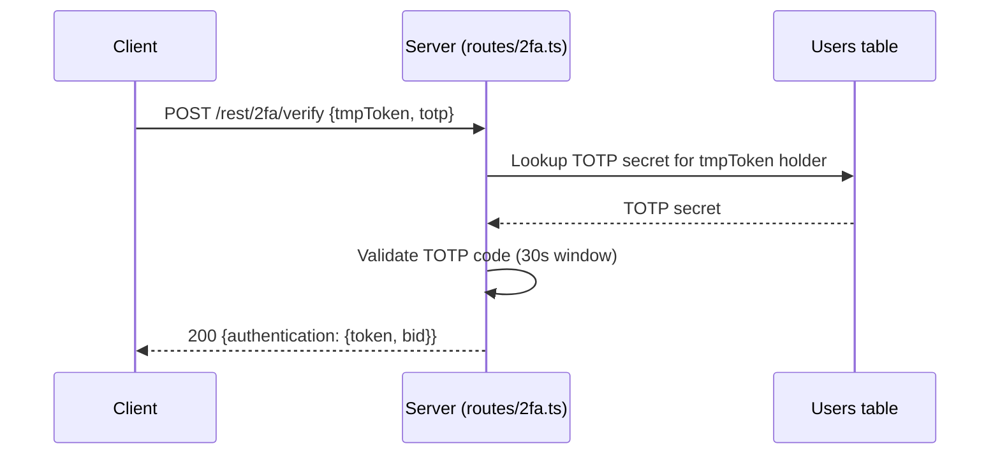
```mermaid
sequenceDiagram
    participant C as Client
    participant S as Server (routes/2fa.ts)
    participant DB as Users table
    C->>S: POST /rest/2fa/verify {tmpToken, totp}
    S->>DB: Lookup TOTP secret for tmpToken holder
    DB-->>S: TOTP secret
    S->>S: Validate TOTP code (30s window)
    S-->>C: 200 {authentication: {token, bid}}
```

**Security assessment**

`routes/2fa.ts:31` validates a time-based one-time password against the per-user secret before issuing a full session token, correctly separating the TOTP step from the initial credential check at `routes/login.ts:37-46`. The verification endpoint (`POST /rest/2fa/verify`) applies no rate limit: a caller with a valid `tmpToken` can enumerate all 1,000,000 possible 6-digit codes. At 1,000 requests per second the entire space is exhausted in under 17 minutes.

**Relevant findings**

- 🟠 [F-012](#f-012) — Missing JWT algorithm whitelist
- 🟠 [F-013](#f-013) — Password reset accepts a security-question answer
- 🟠 [F-014](#f-014) — Rate Limit Bypass

<a id="route-authentication-middleware"></a>
**Route Authentication Middleware.**


**Status:** 🟠 Weak - middleware exported from `lib/insecurity.ts:54` guards most API routes but at least 20 sensitive routes in `server.ts` are registered outside the guarded block and receive no token check.

`server.ts:309`,312,401-420; `lib/insecurity.ts:54`

**Security assessment**

`lib/insecurity.ts:54` exports the `security.isAuthorized` middleware, which validates the Bearer token using `express-jwt`. `server.ts:309` and `server.ts:312` install this middleware, and it is applied to routes registered between lines 401 and 420. Routes registered outside that window - including `/support/logs` at `server.ts:281`, `/encryptionkeys` at line 277, and several admin-panel proxies around line 595 - are reachable without a valid token. The client-side `AdminGuard` at `frontend/src/app/app.guard.ts:52` adds a UI redirect but provides no server-side enforcement.

**Relevant findings**

- 🟠 [F-012](#f-012) — Missing JWT algorithm whitelist
- 🟠 [F-013](#f-013) — Password reset accepts a security-question answer
- 🟠 [F-014](#f-014) — Rate Limit Bypass

<a id="sql-query-parameterization"></a>
**SQL Query Parameterization.**


**Status:** 🔴 Unsafe - the login query at `routes/login.ts:34` concatenates `req.body.email` directly into a raw `sequelize.query()` call, bypassing parameterization entirely and allowing SQL injection to authenticate as any user.

`routes/login.ts:34`; `models/index.ts:34-41`

**Security assessment**

`models/index.ts:34-41` configures Sequelize as the ORM layer and most model-level reads use parameterized finders. The login route diverges: `routes/login.ts:34` calls `models.sequelize.query()` with `req.body.email` interpolated into the SQL string. Submitting `' OR 1=1--` as the email returns the first row in the `Users` table, which is the seeded admin account, without requiring a matching password. A second raw query at `routes/search.ts:23` interpolates the search term into a `LIKE` clause with the same pattern.

**Relevant findings**

- 🟠 [F-012](#f-012) — Missing JWT algorithm whitelist
- 🟠 [F-013](#f-013) — Password reset accepts a security-question answer
- 🟠 [F-014](#f-014) — Rate Limit Bypass

<a id="rate-limiting"></a>
**Rate Limiting.**


**Status:** 🟡 Partial - rate limiting is configured on the login endpoint but keyed on a header that callers can spoof, and the TOTP verification endpoint has no limit at all.

Rate limiting protects accounts from automated credential-stuffing and brute-force attacks by capping how many attempts a single source may make within a time window. Juice Shop applies rate-limit middleware to the login and some authentication endpoints.

**Security assessment**

`server.ts:342-348` installs rate-limit middleware keyed on `req.headers['x-forwarded-for'] || req.ip`. Setting a spoofed `X-Forwarded-For` header rotates the per-source counter on each request, making the limit ineffective. `routes/2fa.ts:31` registers the TOTP verification endpoint with no rate-limit middleware at all, leaving the 6-digit code space open to exhaustion.

**Relevant findings**

- 🟠 [F-012](#f-012) — Missing JWT algorithm whitelist
- 🟠 [F-013](#f-013) — Password reset accepts a security-question answer
- 🟠 [F-014](#f-014) — Rate Limit Bypass

<a id="password-based-login"></a>
#### 6.2.2 Password-Based Login

**Status:** 🔴 Unsafe - SQL injection on the login query makes authentication bypassable without a valid password.

Detected in scope: POST `/rest/user/login`

The intended password-login flow on the successful path:

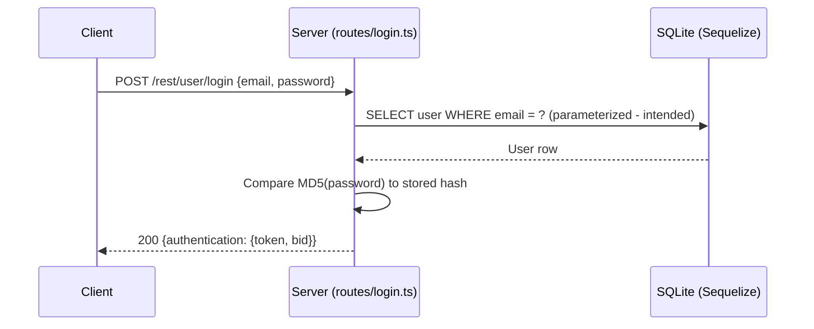
```mermaid
sequenceDiagram
    participant C as Client
    participant S as Server (routes/login.ts)
    participant DB as SQLite (Sequelize)
    C->>S: POST /rest/user/login {email, password}
    S->>DB: SELECT user WHERE email = ? (parameterized - intended)
    DB-->>S: User row
    S->>S: Compare MD5(password) to stored hash
    S-->>C: 200 {authentication: {token, bid}}
```

**Security assessment**

Two independent weaknesses converge on the login path:

- `routes/login.ts:34` builds the user-lookup query by interpolating `req.body.email` into `models.sequelize.query()` - submitting `' OR 1=1--` as the email returns the seeded admin row without a matching password.
- Passwords are hashed with unsalted `MD5` at `lib/insecurity.ts:43`. A dump of the `Users` table yields hashes crackable against standard rainbow tables in seconds.

**Relevant findings**

- 🔴 [F-003](#f-003) — SQL injection
- 🟠 [F-009](#f-009) — OAuth CSRF
- 🟠 [F-010](#f-010) — Predictable password derived from Google OAuth email
- 🟠 [F-013](#f-013) — Password reset accepts a security-question answer
- 🟠 [F-030](#f-030) — Hardcoded testing credentials in production bundle

<a id="user-registration"></a>
#### 6.2.3 User Registration

**Status:** 🔴 Unsafe - the registration endpoint accepts a caller-supplied `role` field that is passed to the Sequelize model without stripping, allowing any visitor to create an admin-role account.

Detected in scope: POST `/api/Users`

The intended registration flow on the successful path:

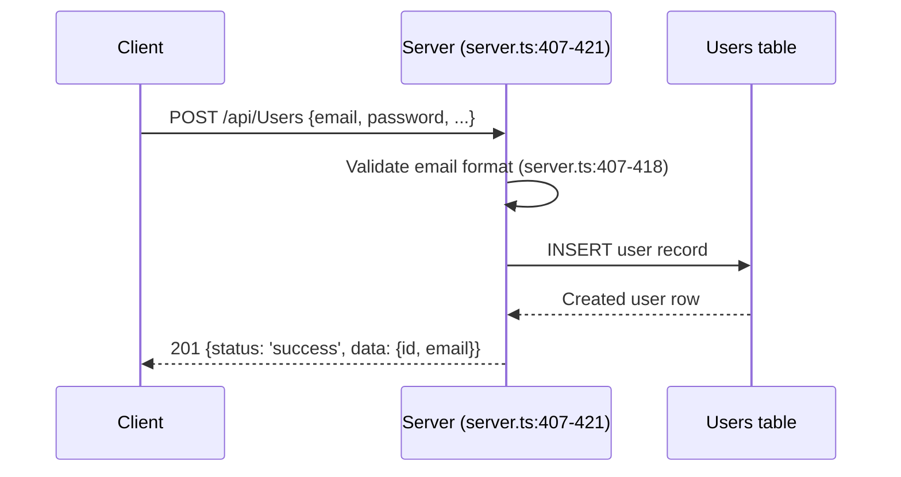
```mermaid
sequenceDiagram
    participant C as Client
    participant S as Server (server.ts:407-421)
    participant DB as Users table
    C->>S: POST /api/Users {email, password, ...}
    S->>S: Validate email format (server.ts:407-418)
    S->>DB: INSERT user record
    DB-->>S: Created user row
    S-->>C: 201 {status: 'success', data: {id, email}}
```

**Security assessment**

`server.ts:407-421` exposes `POST /api/Users` without authentication. The endpoint is backed by the `finale` REST library via `routes/verify.ts:52`, which maps all request body fields directly to Sequelize model columns. Including `"role":"admin"` in the registration body creates an account with admin privileges. No field-strip or allowlist is applied to the incoming body before the model write.

**Relevant findings**

- 🔴 [F-008](#f-008) — Mass Assignment Allows Admin Role Injection
- 🟠 [F-028](#f-028) — Client-Side Challenge Enforcement
- 🟠 [F-038](#f-038) — Unauthenticated CTF Flag Disclosure
- 🟠 [F-043](#f-043) — Unbounded WebSocket Connection Consumption
- 🟠 [F-045](#f-045) — Sensitive Routes Registered Without Authentication Middleware

<a id="password-reset"></a>
#### 6.2.4 Password Reset

**Status:** 🔴 Unsafe - security-question answer is the sole verification factor with no per-account attempt lockout, allowing unlimited guessing.

Detected in scope: POST `/rest/user/reset-password`

The intended password-reset flow on the successful path:

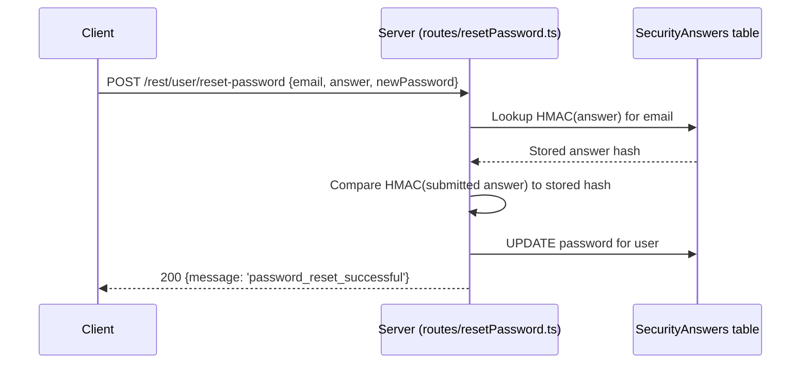
```mermaid
sequenceDiagram
    participant C as Client
    participant S as Server (routes/resetPassword.ts)
    participant DB as SecurityAnswers table
    C->>S: POST /rest/user/reset-password {email, answer, newPassword}
    S->>DB: Lookup HMAC(answer) for email
    DB-->>S: Stored answer hash
    S->>S: Compare HMAC(submitted answer) to stored hash
    S->>DB: UPDATE password for user
    S-->>C: 200 {message: 'password_reset_successful'}
```

**Security assessment**

`routes/resetPassword.ts:10` accepts `{email, answer, newPassword}` and validates by comparing an HMAC digest of the submitted answer against the stored hash at `routes/resetPassword.ts:41`. No attempt counter or account lockout exists. Security-question answers (birthplace, mother's maiden name, favourite pet) are frequently guessable from public social media profiles. A caller who knows the target's email can submit guesses in a loop until `POST /rest/user/reset-password` succeeds and the account password is overwritten.

**Relevant findings**

- 🟠 [F-013](#f-013) — Password reset accepts a security-question answer
- 🟠 [F-044](#f-044) — Security-question password reset without lockout

<a id="social-login"></a><a id="social-login-oauth-oidc"></a>
#### 6.2.5 Social Login

**Status:** 🔴 Unsafe - the OAuth callback at `login.component.ts:152` omits the `state` parameter, and the resulting account password is deterministically derived from the user's public email address.

Detected in scope: frontend/src/app/oauth

The intended OAuth login flow on the successful path:

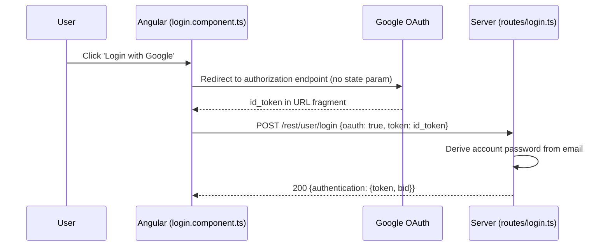
```mermaid
sequenceDiagram
    participant U as User
    participant SPA as Angular (login.component.ts)
    participant Google as Google OAuth
    participant S as Server (routes/login.ts)
    U->>SPA: Click 'Login with Google'
    SPA->>Google: Redirect to authorization endpoint (no state param)
    Google-->>SPA: id_token in URL fragment
    SPA->>S: POST /rest/user/login {oauth: true, token: id_token}
    S->>S: Derive account password from email
    S-->>SPA: 200 {authentication: {token, bid}}
```

**Security assessment**

Two independent weaknesses undermine the OAuth flow:

- `login.component.ts:152` processes the Google OAuth redirect without generating or validating a `state` parameter - any page that can navigate the victim's browser to the callback URL completes the login on their behalf (CSRF).
- `oauth.component.ts:30` derives the account password by hashing the user's Google-provided email address with a predictable algorithm. Any caller who knows the victim's email can compute the same hash and authenticate directly via `POST /rest/user/login` without ever touching OAuth.

**Relevant findings**

- 🟠 [F-009](#f-009) — OAuth CSRF
- 🟠 [F-010](#f-010) — Predictable password derived from Google OAuth email

### 6.3 Session and Token Controls

<a id="ctrl-session-and-token-controls"></a>

**Dependent crossings:** [tb-1](#tb-1) refuted - 🟠 [F-012](#f-012) — Missing JWT algorithm whitelist, 🟠 [F-049](#f-049) — Missing authentication on key submission endpoint (`routes/checkKeys.ts:6`), 🟡 [F-050](#f-050) — Open Redirect (`routes/redirect.ts:19`) · [tb-2](#tb-2) unconfirmed - 🟡 [F-058](#f-058) — Missing Container Image Signing


**Systemic weaknesses:** [W-011](#w-011)
**Verdict:** 🟠 Weak

<!-- The line below is mechanically derived from the controls table — LLM must not re-author it. -->
**Controls covered:**

- [6.3.1 Session Token Validation](#631-session-token-validation)
- [6.3.2 Session and Token Hardening](#632-session-and-token-hardening)

**Implemented controls:** `lib/insecurity.ts:54-57`; `routes/login.ts:24-26`; `lib/insecurity.ts:72-93`; `server.ts:289`; `lib/insecurity.ts:56`,72-93; `frontend/src/app/Services/request.interceptor.ts:13`.

**Assessment:** JWTs are issued by `lib/insecurity.ts:72-93` using an RSA private key and returned in the login response. The signing key is hardcoded in source at `lib/insecurity.ts:23`, no algorithm allowlist constrains the `alg` header a caller can supply, and tokens are stored in `localStorage` rather than an `HttpOnly` cookie - making them accessible to any injected script. Token revocation is broken: `lib/insecurity.ts:191` re-inserts a presented token into the valid-token map on every authenticated request, so a token removed from the map is reinstated on the holder's next request.

<a id="session-token-validation"></a><a id="session-token-validation-jwt-based"></a>
#### 6.3.1 Session Token Validation

**Status:** 🟠 Weak - JWT verification runs on each request via `express-jwt` but accepts any algorithm the caller names in the token header, enabling algorithm-confusion forgery.

`lib/insecurity.ts:54-57`; `routes/login.ts:24-26`; `lib/insecurity.ts:72-93`

**Security assessment**

`lib/insecurity.ts:54-57` calls `expressjwt()` to verify incoming Bearer tokens. The options object contains no `algorithms:` array, so the library trusts the `alg` field in the attacker-controlled JWT header. An attacker who downloads the RSA public key from the unauthenticated `/encryptionkeys` endpoint can forge a token by signing it with `alg:HS256` using the public key bytes as the HMAC secret - the server accepts this forgery as a valid session token for any identity in the payload.

**Relevant findings**

- 🟠 [F-031](#f-031) — JWT stored in localStorage (JWT stored in `localStorage`)
- 🟡 [F-071](#f-071) — UpdateAuthenticatedUsers re-inserts valid JWT bypassing

<a id="session-and-token-hardening"></a>
#### 6.3.2 Session and Token Hardening

**Status:** 🟠 Weak - token storage is in `localStorage`, revocation is defeated by an unconditional re-insertion, and no expiry enforcement prevents indefinitely-valid tokens.

`server.ts:289`; `lib/insecurity.ts:56`,72-93; `frontend/src/app/Services/request.interceptor.ts:13`

**Security assessment**

`login.component.ts:105` writes the session JWT to `localStorage`, making it readable by any JavaScript executing in the same origin - a single successful XSS payload extracts the token. `lib/insecurity.ts:191` is called via `updateAuthenticatedUsers` on every authenticated request: it re-inserts the presented token into the in-memory token map, so a logout that removes the token from that map is immediately reversed when the same token is used again. `frontend/src/app/Services/request.interceptor.ts:13` attaches the `Authorization` header to every outbound HTTP request regardless of destination path.

**Relevant findings**

- 🟠 [F-031](#f-031) — JWT stored in localStorage (JWT stored in `localStorage`)
- 🟡 [F-071](#f-071) — UpdateAuthenticatedUsers re-inserts valid JWT bypassing

The JWT lifecycle from issuance through browser storage to bearer presentation follows this flow:

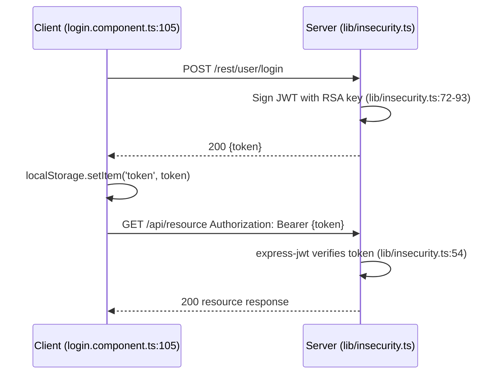
```mermaid
sequenceDiagram
    participant C as Client (login.component.ts:105)
    participant S as Server (lib/insecurity.ts)
    C->>S: POST /rest/user/login
    S->>S: Sign JWT with RSA key (lib/insecurity.ts:72-93)
    S-->>C: 200 {token}
    C->>C: localStorage.setItem('token', token)
    C->>S: GET /api/resource  Authorization: Bearer {token}
    S->>S: express-jwt verifies token (lib/insecurity.ts:54)
    S-->>C: 200 resource response
```

### 6.4 Authorization Controls

<a id="ctrl-authorization-controls"></a>

**Dependent crossings:** [tb-1](#tb-1) refuted - 🔴 [F-008](#f-008) — Mass Assignment Allows Admin Role Injection (`routes/verify.ts:52`) · [tb-2](#tb-2) unconfirmed - 🟠 [F-046](#f-046) — Missing permissions block default GITHUB_TOKEN scope, 🟡 [F-060](#f-060) — Default GITHUB_TOKEN Scope Not Restricted


**Systemic weaknesses:** [W-003](#w-003), [W-007](#w-007)
**Verdict:** 🟠 Weak

<!-- The line below is mechanically derived from the controls table — LLM must not re-author it. -->
**Controls covered:**

- [6.4.1 Centralized Route Authorization](#641-centralized-route-authorization)
- [6.4.2 Object-Level Access Control](#642-object-level-access-control)
- [6.4.3 Management Endpoint Protection](#643-management-endpoint-protection)

**Implemented controls:** `server.ts:350-640`; `server.ts:602`,425,432,439; `server.ts:362-395`.

**Assessment:** Route authorization in `server.ts:350-640` relies on `security.isAuthorized` from `lib/insecurity.ts:54` applied to a subset of routes. Admin-only operations check `req.user.data.role === 'admin'` inline at `server.ts:362-395`. Object-level ownership is unenforced on most data-mutation routes - the authenticated user's ID is not compared against the resource owner on addresses, basket items, payment methods, or orders. A client-side `AdminGuard` at `frontend/src/app/app.guard.ts:52` adds a UI gate backed by no server-side role check.

<a id="centralized-route-authorization"></a>
#### 6.4.1 Centralized Route Authorization

**Status:** 🟠 Weak - middleware guards most authenticated endpoints but a significant set of sensitive routes in `server.ts` are registered outside the guarded block and receive no token verification.

Authenticated users access protected API endpoints only after the server validates their Bearer token. The JWT middleware runs before the route handler and rejects requests without a valid token, preventing unauthenticated access to account data, order history, and shopping baskets.

**Security assessment**

`lib/insecurity.ts:54` exports the JWT verification middleware applied to routes registered between `server.ts:401` and `server.ts:420`. Routes registered outside that window - including `/support/logs` at line 281, `/encryptionkeys` at line 277, and multiple admin-facing endpoints around lines 595–640 - are not covered by the middleware and are reachable without a valid token. The Angular `AdminGuard` at `frontend/src/app/app.guard.ts:52` performs a client-side-only redirect that any caller bypassing the SPA can ignore.

**Relevant findings**

- 🔴 [F-004](#f-004) — Insecure Direct Object Reference
- 🔴 [F-008](#f-008) — Mass Assignment Allows Admin Role Injection
- 🟠 [F-028](#f-028) — Client-Side Challenge Enforcement

<a id="object-level-access-control"></a><a id="object-level-access-control-bolaidor"></a>
#### 6.4.2 Object-Level Access Control

**Status:** 🟠 Weak - authenticated callers can operate on any user's resources by supplying the target's numeric ID; no handler compares `req.user.data.id` against the resource owner.

`server.ts:602`,425,432,439

**Security assessment**

Data-mutation routes for addresses (`routes/address.ts:18,29`), payment methods (`routes/payment.ts:21,41,70`), orders (`routes/order.ts:144,146,153`), and wallet balance (`routes/wallet.ts:12,24,27`) each accept a user-supplied ID without verifying that the authenticated caller owns the referenced object. An authenticated user who increments or substitutes the target's numeric ID in the URL path can read, modify, or delete another user's resources. `server.ts:602,604` exposes admin-only product mutation routes that perform the same pattern.

**Relevant findings**

- 🔴 [F-004](#f-004) — Insecure Direct Object Reference
- 🔴 [F-008](#f-008) — Mass Assignment Allows Admin Role Injection
- 🟠 [F-028](#f-028) — Client-Side Challenge Enforcement

<a id="management-endpoint-protection"></a>
#### 6.4.3 Management Endpoint Protection

**Status:** 🟡 Partial - inline role checks protect some admin endpoints but are absent from others, and the check itself relies on a bearer token whose signature key is publicly known.

Management operations such as updating product listings and accessing the admin panel require the caller to hold an admin-role JWT. The server enforces this by checking `req.user.data.role === 'admin'` before allowing access to restricted operations.

**Security assessment**

`server.ts:362-395` applies inline role checks to product administration routes. The check is absent from `/support/logs` at line 281 and several management-surface routes registered after line 595. Because the RSA private key is hardcoded at `lib/insecurity.ts:23` and committed to the public repository, any caller can forge an admin-role token with a standard JWT library and bypass the role check on endpoints that do implement it.

**Relevant findings**

- 🔴 [F-004](#f-004) — Insecure Direct Object Reference
- 🔴 [F-008](#f-008) — Mass Assignment Allows Admin Role Injection
- 🟠 [F-028](#f-028) — Client-Side Challenge Enforcement

### 6.5 Query Construction and Data Access Controls

<a id="ctrl-query-construction-and-data-access-controls"></a>

**Dependent crossings:** [tb-4](#tb-4) refuted - 🔴 [F-003](#f-003) — SQL injection (`routes/login.ts:34`), 🔴 [F-005](#f-005) — SQL Injection in Product Search (`routes/search.ts:23`) · [tb-5](#tb-5) refuted - 🟠 [F-001](#f-001) — NoSQL Injection in MarsDB Query Layer


**Systemic weaknesses:** [W-002](#w-002), [W-006](#w-006)
**Verdict:** 🟠 Weak

<!-- The line below is mechanically derived from the section's default mechanism — LLM must not re-author it. -->
**Controls covered:**

- [6.5.1 Database Query Construction](#651-database-query-construction)

**Implemented controls:** Sequelize ORM parameterized finders on most data routes; `Number()` coercion on the non-challenge MarsDB path in `routes/showProductReviews.ts`.

**Assessment:** Sequelize ORM finders parameterize the majority of queries and prevent SQL injection on most routes. Two routes diverge to raw `sequelize.query()` calls with string interpolation (`routes/login.ts:34` and `routes/search.ts:23`), and `routes/showProductReviews.ts:36` concatenates a route parameter directly into a MarsDB `$where` JavaScript expression.

<a id="database-query-construction"></a><a id="query-construction"></a>
#### 6.5.1 Database Query Construction

**Status:** 🔴 Unsafe - raw Sequelize queries at two routes allow full SQL injection, and a MarsDB `$where` concatenation allows JavaScript injection into the NoSQL query engine.

Parameterized queries keep user-supplied values as data and prevent them from being interpreted as SQL syntax. Sequelize ORM finders used on most routes pass values as bound parameters, maintaining a clean separation between query structure and input data.

**Security assessment**

Two SQL injection paths exist alongside the ORM layer:

- `routes/login.ts:34` calls `models.sequelize.query()` with `req.body.email` interpolated directly - `' OR 1=1--` returns the seeded admin row.
- `routes/search.ts:23` interpolates the `q` parameter into a `LIKE` clause - `'))--` or a similar payload terminates the query and returns all products.

`routes/showProductReviews.ts:36` builds a MarsDB query as `{ $where: 'this.product == ' + id }`, enabling JavaScript expression injection. The `id` is only truncated to 40 characters when the `noSqlCommandChallenge` is active; inserting `0;sleep(2000)` blocks the synchronous event loop.

**Relevant findings**

- 🟠 [F-001](#f-001) — NoSQL Injection in MarsDB Query Layer
- 🔴 [F-003](#f-003) — SQL injection
- 🔴 [F-005](#f-005) — SQL Injection in Product Search

### 6.6 Input Boundary Validation Controls

<a id="ctrl-input-boundary-validation-controls"></a>

**Dependent crossings:** [tb-1](#tb-1) unconfirmed - 🔴 [F-003](#f-003) — SQL injection (`routes/login.ts:34`), 🔴 [F-005](#f-005) — SQL Injection in Product Search (`routes/search.ts:23`), 🔴 [F-006](#f-006) — Server-Side Code Execution (`routes/userProfile.ts:61`), +4 · [tb-2](#tb-2) unconfirmed - 🟠 [F-025](#f-025) — CI/CD Workflow Supply-Chain Risk

**Verdict:** 🟠 Weak

<!-- The line below is mechanically derived from the controls table — LLM must not re-author it. -->
**Controls covered:**

- [6.6.1 Input Schema Validation](#661-input-schema-validation)

**Implemented controls:** `server.ts:407-418`; `models/user.ts:82-85`.

**Assessment:** Email format and password length are validated at registration via `server.ts:407-418` and `models/user.ts:82-85`. No schema validation covers numeric ID parameters on data-mutation routes, archive content before parsing, or YAML structure before expansion. Type coercion is inconsistently applied - numeric IDs on review and order routes accept arbitrary strings.

<a id="input-schema-validation"></a>
#### 6.6.1 Input Schema Validation

**Status:** 🟡 Partial - schema validation is present for email format and password length at registration but absent from numeric ID parameters and upload content paths.

`server.ts:407-418`; `models/user.ts:82-85`

**Security assessment**

`server.ts:407-418` validates the `email` field format on `POST /api/Users` and `models/user.ts:82-85` enforces minimum password length via Sequelize validators. No schema check covers numeric ID parameters on routes such as `routes/address.ts`, `routes/payment.ts`, or `routes/updateProductReviews.ts` - allowing string injection into ORM queries or MarsDB expressions. `routes/fileUpload.ts` enforces a file-size limit via `multer` but does not validate MIME type or archive structure before handing content to the XML, zip, or YAML parsers.

**Relevant findings**

- 🟠 [F-041](#f-041) — YAML Bomb Causes CPU Exhaustion in File Upload
- 🟠 [F-042](#f-042) — NoSQL \$where Injection Blocks Event Loop (NoSQL \`$where` Injection Blocks Event Loop)
- 🟠 [F-043](#f-043) — Unbounded WebSocket Connection Consumption

### 6.7 Output Encoding and Rendering Controls


**Systemic weaknesses:** [W-009](#w-009)
**Verdict:** 🔴 Unsafe

<!-- The line below is mechanically derived from the controls table — LLM must not re-author it. -->
**Controls covered:**

- [6.7.1 Output Encoding / XSS Prevention](#671-output-encoding--xss-prevention)

**Implemented controls:** `frontend/src/app/search-result/search-result.component.ts:110`,143; `frontend/src/app/administration/administration.component.ts:73`,91; `frontend/src/app/last-login-ip/last-login-ip.component.ts:39`; `frontend/src/app/track-result/track-result.component.ts:48`; `server.ts:188`.

**Assessment:** Angular's template engine escapes output by default, providing a framework-level XSS barrier. Four components call `bypassSecurityTrustHtml()` on attacker-controlled strings, explicitly disabling that barrier for those bindings. Each call creates an independent stored-XSS execution path.

<a id="output-encoding-xss-prevention"></a>
#### 6.7.1 Output Encoding / XSS Prevention

**Status:** 🔴 Unsafe - Angular DomSanitizer bypasses defeat the framework XSS barrier at multiple active rendering paths.

`frontend/src/app/search-result/search-result.component.ts:110`,143; `frontend/src/app/administration/administration.component.ts:73`,91; `frontend/src/app/last-login-ip/last-login-ip.component.ts:39`; `frontend/src/app/track-result/track-result.component.ts:48`; `server.ts:188`

**Security assessment**

Angular template bindings are safe by default, but four components call `bypassSecurityTrustHtml()` on user-controlled strings, each creating an independent XSS execution path:

- `frontend/src/app/search-result/search-result.component.ts:110,143` - product description and the search term reflected in the results heading.
- `frontend/src/app/administration/administration.component.ts:73,91` - user email address and feedback comment rendered in the admin panel.
- `frontend/src/app/last-login-ip/last-login-ip.component.ts:39` - the `lastLoginIp` value stored in the JWT payload and in the database.
- `frontend/src/app/track-result/track-result.component.ts:48` - order tracking display.

`server.ts:188` applies `sanitize-html` to the product description before returning it, but the Angular component ignores that sanitization and marks the raw received HTML as trusted.

**Relevant findings**

- 🟠 [F-017](#f-017) — Stored XSS
- 🟠 [F-018](#f-018) — Stored XSS
- 🟠 [F-019](#f-019) — Stored XSS

### 6.8 Browser and Cross-Origin Controls


**Systemic weaknesses:** [W-007](#w-007)
**Verdict:** 🔴 Unsafe

<!-- The line below is mechanically derived from the controls table — LLM must not re-author it. -->
**Controls covered:**

- [6.8.1 CORS Policy](#681-cors-policy)

**Implemented controls:** `server.ts:181-183`; `lib/startup/registerWebsocketEvents.ts:20`.

**Assessment:** `server.ts:181-183` installs the `cors()` middleware with no configuration, setting `Access-Control-Allow-Origin: *` on all API responses. No `Content-Security-Policy` header is emitted. The WebSocket server at `lib/startup/registerWebsocketEvents.ts:20` inherits the same open-origin policy, extending it to real-time connections.

<a id="cors-policy"></a>
#### 6.8.1 CORS Policy

**Status:** 🔴 Unsafe - Unsafe - express `cors()` with no options allows all origins on all API endpoints.

`server.ts:181-183`; `lib/startup/registerWebsocketEvents.ts:20`

**Security assessment**

`server.ts:181-183` calls `cors()` without an `origin` or `credentials` option, which configures every API response with `Access-Control-Allow-Origin: *`. Combined with JWT storage in `localStorage` (rather than a `SameSite` cookie), this allows any origin to issue credentialed API calls on behalf of a logged-in user via fetched credentials. `lib/startup/registerWebsocketEvents.ts:20` establishes the Socket\.IO server without an origin allowlist, extending the open-CORS policy to WebSocket upgrade handshakes. No `Content-Security-Policy` header was observed in any response path during the scan.

**Relevant findings**

- 🟠 [F-009](#f-009) — OAuth CSRF
- 🟡 [F-055](#f-055) — Wildcard CORS Permits Credentialed Cross-Origin Requests

### 6.9 Cryptography Secrets and Data Protection


**Systemic weaknesses:** [W-010](#w-010), [W-013](#w-013)
**Verdict:** 🔴 Unsafe

<!-- The line below is mechanically derived from the controls table — LLM must not re-author it. -->
**Controls covered:**

- [6.9.1 Password Storage](#691-password-storage)
- [6.9.2 Secret and Key Management](#692-secret-and-key-management)
- [6.9.3 Transport Encryption](#693-transport-encryption)

**Implemented controls:** `lib/insecurity.ts:43`; `models/user.ts:77`; `routes/login.ts:34`; `lib/insecurity.ts:23`,44; `routes/checkKeys.ts:10`; `server.ts:131`.

**Assessment:** Three distinct cryptographic failures converge here. Passwords are hashed with unsalted `MD5` - a non-KDF with no work factor. The RSA private key used to sign all JWTs and the HMAC key used to hash security-question answers are both hardcoded literals in `lib/insecurity.ts`. Transport encryption is available but HTTP access is not redirected to HTTPS.

<a id="password-storage"></a>
#### 6.9.1 Password Storage

**Status:** 🔴 Unsafe - Unsafe - `MD5` is not a password KDF; all hashes immediately crackable offline.

`lib/insecurity.ts:43`; `models/user.ts:77`; `routes/login.ts:34`

**Security assessment**

Two code paths both hash passwords with `MD5`:

- `lib/insecurity.ts:43` hashes `req.body.password` with `md5()` inline before the Sequelize upsert.
- `models/user.ts:77` applies a second `MD5` hash in the Sequelize `beforeCreate` hook.

`MD5` produces a 128-bit digest with no salt and no iteration count. A dump of the `Users` table yields hashes that can be reversed against published rainbow tables or cracked with a GPU at several billion candidates per second. The login route at `routes/login.ts:34` compares the submitted `md5(password)` directly against the stored hash, confirming the algorithm is load-bearing.

**Relevant findings**

- 🟠 [F-011](#f-011) — Hardcoded RSA private key enables offline JWT forgery
- 🟠 [F-029](#f-029) — Hardcoded BIP39 mnemonic enables forged challenge
- 🟠 [F-030](#f-030) — Hardcoded testing credentials in production bundle

<a id="secret-and-key-management"></a>
#### 6.9.2 Secret and Key Management

**Status:** 🔴 Unsafe - Unsafe - publicly known hardcoded keys; any deployment using these keys is immediately compromisable.

`lib/insecurity.ts:23`,44; `routes/checkKeys.ts:10`

**Security assessment**

Three signing and authentication secrets are hardcoded as string literals:

- `lib/insecurity.ts:23` embeds the full RSA private key used to sign all session JWTs. The same key is committed to the public repository at `https://github.com/juice-shop/juice-shop` - any caller can clone the repository, read the key, and sign arbitrary tokens the server accepts as valid.
- `lib/insecurity.ts:44` hardcodes the HMAC key used to hash security-question answers in `routes/resetPassword.ts`. An attacker who reads this key can precompute answer hashes for common questions offline and reverse stored hashes from a database dump.
- `routes/checkKeys.ts:10` contains a BIP-39 mnemonic as a hardcoded string used for the Web3 challenge.

**Relevant findings**

- 🟠 [F-011](#f-011) — Hardcoded RSA private key enables offline JWT forgery
- 🟠 [F-029](#f-029) — Hardcoded BIP39 mnemonic enables forged challenge
- 🟠 [F-030](#f-030) — Hardcoded testing credentials in production bundle

<a id="transport-encryption"></a><a id="transport-encryption-tls"></a>
#### 6.9.3 Transport Encryption

**Status:** 🟡 Partial - HTTPS is supported but not enforced; the server binds an HTTP listener with no redirect, exposing session tokens and credentials to interception in transit.

Transport encryption protects sensitive data - credentials, session tokens, and payment details - from interception between the browser and server. Juice Shop can be started with TLS certificates for deployments that require encrypted transport.

**Security assessment**

`server.ts:131` initializes an HTTPS listener when `process.env.CERT` and `process.env.KEY` are set. The server also binds an HTTP listener on the standard port with no redirect to HTTPS. Users who access the application over HTTP transmit their login credentials and `Authorization` bearer tokens in cleartext. No `Strict-Transport-Security` header is set in any observed response path, so browsers do not automatically upgrade connections.

**Relevant findings**

- 🟠 [F-011](#f-011) — Hardcoded RSA private key enables offline JWT forgery
- 🟠 [F-029](#f-029) — Hardcoded BIP39 mnemonic enables forged challenge
- 🟠 [F-030](#f-030) — Hardcoded testing credentials in production bundle

### 6.10 File Parser and Outbound Request Controls

<a id="ctrl-file-parser-and-outbound-request-controls"></a>

_No trust boundary in this model depends on this control class._


**Systemic weaknesses:** [W-001](#w-001), [W-005](#w-005)
**Verdict:** 🟠 Weak

<!-- The line below is mechanically derived from the controls table — LLM must not re-author it. -->
**Controls covered:**

- [6.10.1 File Upload Validation](#6101-file-upload-validation)

**Implemented controls:** `routes/fileUpload.ts:19`; `server.ts:309`.

**Assessment:** `routes/fileUpload.ts:19` uses `multer` with a file-size limit as the primary upload guard. Three distinct parsing vulnerabilities exist downstream: XXE from `libxmljs2` with `noent: true`, zip-slip from unvalidated archive entry paths, and YAML bomb from an unbounded expansion via `js-yaml`. The size limit does not prevent any of these because the attacks operate within normal file sizes.

<a id="file-upload-validation"></a>
#### 6.10.1 File Upload Validation

**Status:** 🟡 Partial - file-size limit via `multer` is applied but MIME type and archive content are not validated before being handed to XML, zip, and YAML parsers.

`routes/fileUpload.ts:19`; `server.ts:309`

**Security assessment**

`routes/fileUpload.ts:19` limits upload size to 50 MB via `multer`. Three dangerous downstream configurations exist:

- `routes/fileUpload.ts:83` calls `libxml.parseXml(fileContents, { noent: true })`, enabling external entity resolution - a crafted DTD can read arbitrary server files such as `/etc/passwd` or environment files.
- `routes/fileUpload.ts:44` extracts ZIP entries without resolving the entry path against the target directory; a `../../cron.d/payload` entry writes to an arbitrary filesystem path.
- `routes/fileUpload.ts:117` parses YAML with `js-yaml` at default settings, allowing a billion-laughs anchor expansion that exhausts Node\.js event-loop CPU.

**Relevant findings**

- 🔴 [F-006](#f-006) — Server-Side Code Execution
- 🔴 [F-007](#f-007) — XXE
- 🟠 [F-022](#f-022) — Path traversal filesystem access from request input

### 6.11 Operations Runtime and Supply Chain Controls


**Systemic weaknesses:** [W-008](#w-008)
**Verdict:** 🔴 Missing

<!-- The line below is mechanically derived from the controls table — LLM must not re-author it. -->
**Controls covered:**

- [6.11.1 Third-Party CI/CD Action Pinning](#6111-third-party-cicd-action-pinning)
- [6.11.2 Automated SCA scanning](#6112-automated-sca-scanning)
- [6.11.3 Automated dependency updates](#6113-automated-dependency-updates)
- [6.11.4 Lockfile hygiene](#6114-lockfile-hygiene)

**Implemented controls:** `.github/workflows/ci.yml:202`.

**Assessment:** `.github/workflows/ci.yml:202` pins one action to a full commit SHA - the single positive supply-chain control. All other third-party actions reference mutable version tags. `package-lock.json` is excluded from the repository via `.gitignore:10`, making installs non-reproducible and blocking `npm audit`. No automated dependency-scanning step exists in any workflow file, and no Dependabot or Renovate configuration is present.

<a id="third-party-cicd-action-pinning"></a>
#### 6.11.1 Third-Party CI/CD Action Pinning

**Status:** 🟡 Partial - one action is pinned to a full SHA in `ci.yml:202`; all other third-party actions reference mutable version tags and can be silently replaced.

Pinning CI/CD workflow actions to full commit SHAs prevents a compromised or updated action from injecting malicious code into the build pipeline. An action pinned by SHA always refers to the same immutable code regardless of tag movements or repository takeovers.

**Security assessment**

`.github/workflows/ci.yml:202` pins one action to a commit SHA - the only adequate pin in the pipeline. `.github/workflows/codeql-analysis.yml:23` references `github/codeql-action` and `coverallsapp/github-action` by version tags such as `v2`, which are mutable pointers. A supply-chain compromise of either action repository would silently replace the code executed against this repository's source and pipeline secrets. The `GITHUB_TOKEN` permission scope is not restricted at the workflow level (no `permissions:` block at root of `ci.yml`), granting write access to repository contents and packages by default.

**Relevant findings**

- 🟡 [F-002](#f-002) — Missing Security Event Logging
- 🟠 [F-025](#f-025) — CI/CD Workflow Supply-Chain Risk
- 🟠 [F-034](#f-034) — Package Install Scripts Run as Root

<a id="automated-sca-scanning"></a>
#### 6.11.2 Automated SCA scanning

**Status:** 🔴 Missing - no software composition analysis step exists in any workflow file; vulnerable dependencies cannot be detected or blocked at merge time.

Automated SCA scanning flags vulnerable direct and transitive dependencies in CI before they reach production. An SCA step in the pull-request workflow allows developers to identify and remediate vulnerable packages as part of the normal development flow.

**Security assessment**

No `npm audit`, `snyk test`, `trivy`, or equivalent SCA step appears in any workflow file under `.github/workflows/`. The absence of `package-lock.json` (excluded in `.gitignore:10`) also prevents `npm audit` from resolving the full transitive dependency tree when run manually. Known-vulnerable transitive dependencies cannot be detected or blocked at merge time, and there is no mechanism to alert when a CVE is published against an already-installed version.

**Relevant findings**

- 🟡 [F-002](#f-002) — Missing Security Event Logging
- 🟠 [F-025](#f-025) — CI/CD Workflow Supply-Chain Risk
- 🟠 [F-034](#f-034) — Package Install Scripts Run as Root

<a id="automated-dependency-updates"></a>
#### 6.11.3 Automated dependency updates

**Status:** 🔴 Missing - no Dependabot or Renovate configuration exists; dependencies are updated only through manual intervention.

Automated dependency update tools open pull requests when upstream packages release security fixes, keeping the dependency tree current without manual tracking. This narrows the window between a vulnerability disclosure and a patch landing in the codebase.

**Security assessment**

Neither a `.github/dependabot.yml` configuration nor a `renovate.json` file exists in the repository. `package.json` uses semver ranges rather than pinned versions for several dependencies, meaning `npm install` can resolve different versions at different times. Without a lockfile or automated update tooling, a newly disclosed CVE in a dependency goes unnoticed until a developer manually runs `npm audit` or observes a downstream incident.

**Relevant findings**

- 🟡 [F-002](#f-002) — Missing Security Event Logging
- 🟠 [F-025](#f-025) — CI/CD Workflow Supply-Chain Risk
- 🟠 [F-034](#f-034) — Package Install Scripts Run as Root

<a id="lockfile-hygiene"></a>
#### 6.11.4 Lockfile hygiene

**Status:** 🔴 Missing - `package-lock.json` is excluded by `.gitignore:10`, making installs non-reproducible and preventing `npm audit` from resolving the full dependency graph.

A committed lockfile guarantees that every developer install and CI run resolves the exact same dependency tree. It also enables `npm audit` to evaluate specific resolved versions against the vulnerability database rather than inferring risk from semver ranges.

**Security assessment**

`.gitignore:10` explicitly excludes `package-lock.json`. CI runs `npm install` rather than `npm ci`, so each build may resolve a later patch or minor release than the previous one. A dependency update that introduces a vulnerability is invisible until someone generates a fresh lockfile and audits it. `Dockerfile:1` references an unpinned `node` base image tag, and `test/smoke/Dockerfile:1` does the same - extending non-determinism to the container build layer.

**Relevant findings**

- 🟡 [F-002](#f-002) — Missing Security Event Logging
- 🟠 [F-025](#f-025) — CI/CD Workflow Supply-Chain Risk
- 🟠 [F-034](#f-034) — Package Install Scripts Run as Root

### 6.12 Real-time and Not Applicable Controls

**Verdict:** 🔴 Missing

<!-- The line below is mechanically derived from the controls table — LLM must not re-author it. -->
**Controls covered:**

- [6.12.1 LLM Prompt Injection Defence](#6121-llm-prompt-injection-defence)

**Implemented controls:** `routes/chat.ts:106`,201,205.

**Assessment:** `routes/chat.ts` integrates an LLM-backed chatbot that receives user messages, assembles an order-data context, and returns model-generated responses. No system-prompt boundary, input filter, or output validation guards against prompt injection, and the model context includes PII from the caller's order history.

<a id="llm-prompt-injection-defence"></a>
#### 6.12.1 LLM Prompt Injection Defence

**Status:** 🔴 Missing - no input sanitization, output validation, or prompt-boundary guard is applied in `routes/chat.ts` before user messages reach the LLM.

`routes/chat.ts:106`,201,205

**Security assessment**

`routes/chat.ts:106` forwards the caller's message directly to the LLM API without stripping or escaping instruction-like tokens. `routes/chat.ts:177` interprets the LLM's response as a coupon-discount command without server-side validation of the resulting discount value - a crafted user message that injects a discount instruction into the model's output can grant arbitrary discounts on any order. `routes/chat.ts:164` populates the LLM context with the caller's full order history including email addresses; a secondary prompt-injection attack can coerce the model to repeat that PII to the caller or to a third party embedded in a product description.

**Relevant findings**

- No dedicated finding routed in this assessment.

### 6.13 Defense-in-Depth Summary

**Verdict:** -

Individual controls in place include TOTP second-factor authentication via `routes/2fa.ts` (the only adequately-implemented authentication mechanism in the catalog), Sequelize ORM parameterized finders on the majority of non-injection-path data routes, the `express-jwt` middleware protecting routes in the `server.ts:401-420` block, and a single SHA-pinned GitHub Actions step at `ci.yml:202`.

Restoring layered defense requires four systemic repairs that address the control boundaries where multiple attack paths converge. Parameterizing the queries at `routes/login.ts:34` and `routes/search.ts:23` would close the two SQL injection entry points that currently chain with `MD5` password storage into immediate account takeover. Loading the RSA signing key at `lib/insecurity.ts:23` from a runtime environment variable or secret store - rather than source code - would invalidate the JWT forgery path that depends on public repository access. Adding an `algorithms: ['RS256']` allowlist to the `expressjwt()` call at `lib/insecurity.ts:54` would prevent algorithm-confusion forgery even if the public key remains observable. Moving JWT storage from `localStorage` to an `HttpOnly` cookie would sever the XSS-to-session-hijack chain that currently flows from any of the four `bypassSecurityTrustHtml()` bypass sites through stored-XSS to token exfiltration.

---

<a id="weakness-register"></a>
## 7. Weakness Register

Systemic control gaps behind the findings, ordered by severity (W-001 = most severe). Each weakness names the missing, home-grown, or misused control, the findings that evidence it, the components it spans, and its remediation. A weakness may also rest on observed unsafe practice or an absent architectural control with no confirmed exploit - only confirmed findings carry a CVSS score.

- 🔴 **Critical** · [W-001](#w-001) - Application data crosses into executable code · confirmed · 1 finding · 1 component
- 🔴 **Critical** · [W-002](#w-002) - Database access relies on concatenated queries · confirmed · 2 findings · 2 components
- 🔴 **Critical** · [W-003](#w-003) - Authorization is implemented route by route · confirmed · 6 findings · 2 components
- 🟠 **High** · [W-004](#w-004) - Endpoints are reachable without enforced authentication · confirmed · 2 findings · 2 components
- 🟠 **High** · [W-005](#w-005) - Input handling lacks enforced boundary validation · confirmed · 2 findings · 1 component
- 🟠 **High** · [W-006](#w-006) - Document-database queries take their structure from application values · confirmed · 1 finding · 1 component
- 🟠 **High** · [W-007](#w-007) - OAuth sign-in requests are not bound to the user's browser session · confirmed · 1 finding · 1 component
- 🟠 **High** · [W-008](#w-008) - Build pipeline trusts mutable third-party references · confirmed · 2 findings · 1 component
- 🟠 **High** · [W-009](#w-009) - Frontend rendering lacks enforced output encoding · confirmed · 7 findings · 2 components
- 🟠 **High** · [W-010](#w-010) - Secrets are committed to source instead of a managed store · confirmed · 4 findings · 3 components
- 🟠 **High** · [W-011](#w-011) - Browser scripts retain reusable session credentials · confirmed · 1 finding · 1 component
- 🟡 **Medium** · [W-012](#w-012) - Application data crosses into template source · observed-practice · 1 finding · 1 component
- 🟡 **Medium** · [W-013](#w-013) - Security-sensitive data uses weak cryptographic primitives · observed-practice · 1 finding · 1 component

<a id="w-001"></a>
### W-001 — Application data crosses into executable code

🔴 **Critical** · implementation weakness · confirmed · 1 finding

An interpreter evaluates application values as code. The affected path mixes data processing with executable program construction instead of constraining callers to predefined operations.

**Confirmed findings:**

- 🔴 [F-006](#f-006) — Server-Side Code Execution (`routes/userProfile.ts:61`)

**Affected components:** [C-02](#c-02)

**Remediation:**

- **Structural** — replace evaluation of application values with a data parser or a fixed set of operations whose arguments remain data
- **Tactical** — ● [M-021](#m-021) — Remove server-side evaluation of untrusted input

<a id="w-002"></a>
### W-002 — Database access relies on concatenated queries

🔴 **Critical** · design weakness · confirmed · 2 findings

Database queries are assembled from application values instead of passing those values through an enforced parameterised data-access path. This leaves every call site responsible for preserving query structure.

**Architectural anti-pattern - Raw SQL string interpolation.** Multiple routes build SQL queries by concatenating request values rather than using parameterized queries, so any new route that follows the same pattern inherits injection risk without a per-route code review.

**Confirmed findings:**

- 🔴 [F-003](#f-003) — SQL injection (`routes/login.ts:34`)
- 🔴 [F-005](#f-005) — SQL Injection in Product Search (`routes/search.ts:23`)

**Practice sites:**

- `routes/login.ts:34`
- `routes/search.ts:23`

**Architecture evidence:** Parameterized Queries, ORM / Repository Layer, Source evidence (`routes/vulnCodeSnippet.ts:46`)

**Affected components:** [C-01](#c-01), [C-02](#c-02)

**Remediation:**

- **Structural** — provide one parameterised repository or query-builder path and prohibit application-value interpolation in database queries
- **Tactical** — ● [M-018](#m-018) — Use parameterized database queries, ● [M-020](#m-020) — Use parameterized database queries

<a id="w-003"></a>
### W-003 — Authorization is implemented route by route

🔴 **Critical** · design weakness · confirmed · 6 findings

Authorization depends on per-handler checks instead of a policy boundary that consistently enforces role, ownership, and tenant scope. New routes can bypass protection by omitting a local check.

**Architectural anti-pattern - Missing server-side authorization layer.** Authorization is implemented individually on selected routes rather than enforced by a shared middleware layer, so new routes and routes with missing annotations are unauthenticated and unprivileged by default.

**Confirmed findings:**

- 🔴 [F-004](#f-004) — Insecure Direct Object Reference
- 🟠 [F-037](#f-037) — Unauthenticated access to all order records (`routes/trackOrder.ts:18`)
- 🟠 [F-045](#f-045) — Sensitive Routes Registered Without Authentication Middleware
- 🟠 [F-046](#f-046) — Missing permissions block default GITHUB_TOKEN scope
- 🟠 [F-047](#f-047) — Free Deluxe Membership (`routes/deluxe.ts:24`)
- 🟠 [F-048](#f-048) — IDOR: review update without ownership check (`routes/updateProductReviews.ts:16`)

**Architecture evidence:** Centralised AuthZ Policy, Role / Scope Enforcement, Ownership Check, Source evidence (`server.ts:370`), Source evidence (`server.ts:388`), Source evidence (`server.ts:389`) (+66 more)

**Affected components:** [C-08](#c-08), [C-02](#c-02)

**Remediation:**

- **Structural** — enforce authorization through a shared server-side policy layer and make ownership and tenant scope mandatory inputs to data access
- **Tactical** — ● [M-019](#m-019) — Enforce object-level (ownership) authorization, ◕ [M-050](#m-050) — Enforce server-side authorization on every endpoint, ◑ [M-006](#m-006) — Enforce server-side authorization on every endpoint, ◕ [M-058](#m-058) — Enforce server-side authorization on every endpoint, ◕ [M-059](#m-059) — Enforce server-side authorization on every endpoint, ◕ [M-060](#m-060) — Enforce server-side authorization on every endpoint, ◑ [M-007](#m-007) — Enforce object-level (ownership) authorization, ◕ [M-061](#m-061) — Enforce object-level (ownership) authorization

<a id="w-004"></a>
### W-004 — Endpoints are reachable without enforced authentication

🟠 **High** · design weakness · confirmed · 2 findings

Sensitive API routes and real-time channels are exposed without an enforced authentication check at the endpoint boundary. Access control depends on each handler (or the caller) remembering to require a session, so an unauthenticated client can reach privileged operations directly.

**Confirmed findings:**

- 🟠 [F-016](#f-016) — Unauthenticated WebSocket Channel
- 🟠 [F-049](#f-049) — Missing authentication on key submission endpoint (`routes/checkKeys.ts:6`)

**Architecture evidence:** Route Authentication Middleware, Server-Side Session Enforcement, Source evidence (`server.ts:309`), Source evidence (`server.ts:312`), Source evidence (`server.ts:401`), Source evidence (`server.ts:403`) (+4 more)

**Affected components:** [C-06](#c-06), [C-07](#c-07)

**Remediation:**

- **Structural** — enforce authentication centrally at the routing and channel boundary so every exposed endpoint requires a verified session unless explicitly marked public
- **Tactical** — ◕ [M-031](#m-031) — Require authentication on every exposed endpoint, ◕ [M-062](#m-062) — Require authentication on every exposed endpoint

<a id="w-005"></a>
### W-005 — Input handling lacks enforced boundary validation

🟠 **High** · design weakness · confirmed · 2 findings

Request handlers do not validate input against one enforced server-side schema or allowlist at the boundary - validation is either absent on the vulnerable parameters or limited to rejecting selected bad patterns (a blacklist). New encodings and unanticipated input forms can therefore reach downstream parsers or interpreters.

**Confirmed findings:**

- 🟠 [F-022](#f-022) — Path traversal filesystem access from request input (`routes/dataErasure.ts:104`)
- 🟠 [F-026](#f-026) — ZIP Slip Path Traversal in File Upload (`routes/fileUpload.ts:44`)

**Architecture evidence:** Schema Validation, Allowlist Validation, Source evidence (`server.ts:204`), Source evidence (`server.ts:246`), Source evidence (`server.ts:410`), Source evidence (`server.ts:411`) (+4 more)

**Affected components:** [C-02](#c-02)

**Remediation:**

- **Structural** — enforce server-side schemas and domain-specific allowlists before input reaches parsing, persistence, or command construction
- **Tactical** — ◑ [M-003](#m-003) — Constrain file paths to a safe base directory, ◕ [M-037](#m-037) — Constrain file paths to a safe base directory, ◕ [M-040](#m-040) — Constrain file paths to a safe base directory

<a id="w-006"></a>
### W-006 — Document-database queries take their structure from application values

🟠 **High** · implementation weakness · confirmed · 1 finding

Document-store queries take operators or JavaScript predicates from application values instead of fixed query structures with typed values. Callers can change what a query selects, for example through injected operators or evaluated expressions.

**Confirmed findings:**

- 🟠 [F-001](#f-001) — NoSQL Injection in MarsDB Query Layer

**Affected components:** [C-02](#c-02)

**Remediation:**

- **Structural** — build document queries from fixed operator structures, coerce request values to the expected scalar types, and disable server-side JavaScript evaluation in the database
- **Tactical** — ◕ [M-016](#m-016) — Use parameterized database queries

<a id="w-007"></a>
### W-007 — OAuth sign-in requests are not bound to the user's browser session

🟠 **High** · implementation weakness · confirmed · 1 finding

The client starts OAuth or OpenID Connect sign-in without a per-request state value that its callback verifies. A forged authorization response can then complete sign-in in the victim's browser with the attacker's grant.

**Confirmed findings:**

- 🟠 [F-009](#f-009) — OAuth CSRF (`login.component.ts:152`)

**Affected components:** [C-03](#c-03)

**Remediation:**

- **Structural** — start every sign-in through a maintained OAuth/OIDC client that generates and verifies state (and PKCE) for each authorization request
- **Tactical** — ◕ [M-024](#m-024) — Add anti-CSRF protection to state-changing requests

<a id="w-008"></a>
### W-008 — Build pipeline trusts mutable third-party references

🟠 **High** · design weakness · confirmed · 2 findings

CI/CD workflows resolve third-party actions and other build dependencies to mutable tags or branches instead of immutable commit digests, so a retagged or compromised upstream runs inside the pipeline with its token and secret scope.

**Confirmed findings:**

- 🟠 [F-025](#f-025) — CI/CD Workflow Supply-Chain Risk
- 🟡 [F-054](#f-054) — Npm install --unsafe-perm in Docker build stage

**Architecture evidence:** Commit-SHA Action Pinning, Dependency Provenance Verification, Source evidence (`.github/workflows/ci.yml:202`)

**Affected components:** [C-08](#c-08)

**Remediation:**

- **Structural** — pin every third-party action and build dependency to an immutable commit SHA (or a vetted internal mirror) and enforce SHA-pinning in CI
- **Tactical** — ◕ [M-039](#m-039) — Pin third-party dependencies to immutable versions, ◑ [M-067](#m-067) — Set least-privilege CI workflow permissions

<a id="w-009"></a>
### W-009 — Frontend rendering lacks enforced output encoding

🟠 **High** · design weakness · confirmed · 7 findings

Browser rendering paths write HTML or DOM content directly without one enforced contextual-encoding or sanitisation boundary. Safety depends on each individual component using the right API.

**Confirmed findings:**

- 🟠 [F-017](#f-017) — Stored XSS (`about.component.ts:119`)
- 🟠 [F-018](#f-018) — Stored XSS (`administration.component.ts:73`)
- 🟠 [F-019](#f-019) — Stored XSS (`administration.component.ts:91`)
- 🟠 [F-020](#f-020) — Stored XSS (`search-result.component.ts:110`)
- 🟠 [F-021](#f-021) — DOM XSS (`search-result.component.ts:143`)
- 🟡 [F-051](#f-051) — Stored XSS (`last-login-ip.component.ts:39`)

**Practice sites:**

- 🟡 [F-056](#f-056) — Challenge-gated weak sanitization stores XSS HTML in Users (`models/user.ts:50`) (`models/user.ts:50`)
- `frontend/src/app/about/about.component.ts:119`
- `frontend/src/app/administration/administration.component.ts:73`
- `frontend/src/app/administration/administration.component.ts:91`
- `frontend/src/app/data-export/data-export.component.ts:57`
- `frontend/src/app/last-login-ip/last-login-ip.component.ts:39`

**Architecture evidence:** Template Autoescape, Output Encoding, Content Security Policy, Source evidence (`frontend/src/app/about/about.component.ts:119`), Source evidence (`frontend/src/app/last-login-ip/last-login-ip.component.ts:39`), Source evidence (`frontend/src/app/administration/administration.component.ts:73`) (+5 more)

**Affected components:** [C-03](#c-03), [C-02](#c-02)

**Remediation:**

- **Structural** — use framework-safe rendering by default and isolate any required raw HTML behind one reviewed sanitisation and Trusted Types policy
- **Tactical** — ◕ [M-032](#m-032) — Encode output instead of bypassing the framework sanitizer, ◕ [M-033](#m-033) — Encode output instead of bypassing the framework sanitizer, ◕ [M-034](#m-034) — Encode output instead of bypassing the framework sanitizer, ◕ [M-035](#m-035) — Encode output instead of bypassing the framework sanitizer, ◕ [M-036](#m-036) — Encode output instead of bypassing the framework sanitizer, ◑ [M-064](#m-064) — Encode output instead of bypassing the framework sanitizer, ◑ [M-008](#m-008) — Encode output instead of bypassing the framework sanitizer, ◑ [M-069](#m-069) — Encode output instead of bypassing the framework sanitizer

<a id="w-010"></a>
### W-010 — Secrets are committed to source instead of a managed store

🟠 **High** · design weakness · confirmed · 4 findings

Cryptographic keys, credentials, and other high-entropy secrets are embedded as literals in source or config rather than resolved at runtime from a managed secret store, so anyone with repository read access obtains reusable signing material and credentials.

**Architectural anti-pattern - Secrets hardcoded in source.** RSA private keys, HMAC secrets, BIP39 mnemonics, and test credentials are committed to the source tree, meaning any actor with repository read access can forge tokens, recover security answers, and authenticate without a real account.

**Confirmed findings:**

- 🟠 [F-011](#f-011) — Hardcoded RSA private key enables offline JWT forgery (`lib/insecurity.ts:23`)
- 🟠 [F-029](#f-029) — Hardcoded BIP39 mnemonic enables forged challenge (`routes/checkKeys.ts:10`)
- 🟠 [F-030](#f-030) — Hardcoded testing credentials in production bundle (`login.component.ts:63`)
- 🟠 [F-032](#f-032) — Hardcoded HMAC key exposes security answer hashes to offline attack

**Architecture evidence:** Managed Secret Store, Runtime Secret Injection, Source evidence (`routes/checkKeys.ts:10`), Source evidence (`lib/insecurity.ts:23`)

**Affected components:** [C-03](#c-03), [C-01](#c-01), [C-07](#c-07)

**Remediation:**

- **Structural** — move every secret to a managed secret store or injected environment configuration, rotate the exposed values, and add secret-scanning to CI
- **Tactical** — ◕ [M-026](#m-026) — Move cryptographic keys to a managed secret store, ◕ [M-043](#m-043) — Move secrets to a managed secret store, ◕ [M-044](#m-044) — Move secrets to a managed secret store, ◕ [M-046](#m-046) — Move cryptographic keys to a managed secret store

<a id="w-011"></a>
### W-011 — Browser scripts retain reusable session credentials

🟠 **High** · implementation weakness · confirmed · 1 finding

Browser code retains reusable authentication credentials in script-readable storage. Script execution in the same origin can obtain the credentials and reuse the authenticated session.

**Architectural anti-pattern - SPA without BFF.** The Angular SPA stores session credentials in browser-accessible storage, where any of the six confirmed cross-site scripting instances can steal them; moving token custody to a server-side Backend-for-Frontend with an HttpOnly Secure SameSite cookie is the only structural fix.

**Confirmed findings:**

- 🟠 [F-031](#f-031) — JWT stored in localStorage (`login.component.ts:105`)

**Affected components:** [C-03](#c-03)

**Remediation:**

- **Structural** — move reusable credentials behind a server-managed session boundary and keep browser-visible state free of reusable authentication secrets
- **Tactical** — ◕ [M-045](#m-045) — Store session tokens in HttpOnly, Secure cookies

<a id="w-012"></a>
### W-012 — Application data crosses into template source

🟡 **Medium** · implementation weakness · observed-practice · 1 finding

Template construction treats application values as template source. Rendering can therefore interpret data as template instructions.

**Architectural anti-pattern - Server-side eval of untrusted input.** User-supplied profile data and template strings reach server-side evaluation functions, making remote code execution available to any authenticated attacker without requiring a memory-safety exploit.

**Practice sites:**

- 🟠 [F-024](#f-024) — Input compiled as template source (`routes/userProfile.ts:87`) (`routes/userProfile.ts:87`)

**Affected components:** [C-02](#c-02)

**Remediation:**

- **Structural** — compile fixed templates and pass application values only through their data-binding interface
- **Tactical** — ◑ [M-004](#m-004) — Remove server-side evaluation of untrusted input, ◕ [M-038](#m-038) — Remove server-side evaluation of untrusted input

<a id="w-013"></a>
### W-013 — Security-sensitive data uses weak cryptographic primitives

🟡 **Medium** · implementation weakness · observed-practice · 1 finding

Password, token, or integrity protection uses a weak hash, predictable random source, or insufficient work factor. The application may use a standard library, but the selected primitive does not provide the required security property.

**Practice sites:**

- 🟠 [F-033](#f-033) — MD5 password hashing without salt enables offline (`lib/insecurity.ts:43`) (`lib/insecurity.ts:43`)

**Affected components:** [C-01](#c-01)

**Remediation:**

- **Structural** — standardise on a password KDF, a CSPRNG for secrets, and modern authenticated cryptographic primitives with centrally reviewed parameters
- **Tactical** — ◕ [M-047](#m-047) — Hash passwords with a strong, salted algorithm

---

## 8. Findings Register

Findings are grouped by severity (Critical → High → Medium → Low); within a tier they are ordered by attack vektor (Repo-Read → Internet-Anon → Internet-User → Victim-Required). Each finding is a card with the same fixed fields, in order: **Severity · Component · Location** → **Issue** → **Root cause** → **Evidence** → **Fix** → **Classification** (with external CWE / OWASP links).

**Risk Distribution:** 🔴 Critical: 6 · 🟠 High: 42 · 🟡 Medium: 23 · 🟢 Low: n/a · **Total findings: 71**
*This register counts every finding card below. The Management Summary's risk distribution (Total: 68) counts folded insecure-practice sites under their weakness and adds each design risk once.*
**STRIDE Coverage:** Spoofing: 10 · Tampering: 24 · Repudiation: 1 · Information Disclosure: 19 · Denial of Service: 7 · Elevation of Privilege: 10

The systemic root-cause view is summarized in **Top Weaknesses** in the Management Summary; evidence-backed weaknesses are documented in the [Weakness Register](#weakness-register).

**Findings index:**<br/>🔴 [F-003](#f-003) — SQL injection (`routes/login.ts:34`) — `routes/login.ts:34`<br/>🔴 [F-004](#f-004) — Insecure Direct Object Reference<br/>🔴 [F-005](#f-005) — SQL Injection in Product Search (`routes/search.ts:23`)…<br/>🔴 [F-006](#f-006) — Server-Side Code Execution (`routes/userProfile.ts:61`)…<br/>🔴 [F-007](#f-007) — XXE (`routes/fileUpload.ts:83`) — `routes/fileUpload.ts:83`<br/>🔴 [F-008](#f-008) — Mass Assignment Allows Admin Role Injection (`routes/verify.ts:52`)…<br/>🟠 [F-001](#f-001) — NoSQL Injection in MarsDB Query Layer<br/>🟠 [F-009](#f-009) — OAuth CSRF (`login.component.ts:152`)…<br/>🟠 [F-010](#f-010) — Predictable password derived from Google OAuth email…<br/>🟠 [F-011](#f-011) — Hardcoded RSA private key enables offline JWT forgery…<br/>🟠 [F-012](#f-012) — Missing JWT algorithm whitelist<br/>🟠 [F-013](#f-013) — Password reset accepts a security-question answer…<br/>🟠 [F-014](#f-014) — Rate Limit Bypass (`server.ts:346`) — `server.ts:346`<br/>🟠 [F-015](#f-015) — Unverified JWT Decode in Chat Enables Order Impersonation…<br/>🟠 [F-016](#f-016) — Unauthenticated WebSocket Channel<br/>🟠 [F-017](#f-017) — Stored XSS (`about.component.ts:119`)…<br/>🟠 [F-018](#f-018) — Stored XSS (`administration.component.ts:73`)…<br/>🟠 [F-019](#f-019) — Stored XSS (`administration.component.ts:91`)…<br/>🟠 [F-020](#f-020) — Stored XSS (`search-result.component.ts:110`)…<br/>🟠 [F-021](#f-021) — DOM XSS (`search-result.component.ts:143`)…<br/>🟠 [F-022](#f-022) — Path traversal filesystem access from request input…<br/>🟠 [F-024](#f-024) — Input compiled as template source (`routes/userProfile.ts:87`)…<br/>🟠 [F-025](#f-025) — CI/CD Workflow Supply-Chain Risk<br/>🟠 [F-026](#f-026) — ZIP Slip Path Traversal in File Upload (`routes/fileUpload.ts:44`)…<br/>🟠 [F-027](#f-027) — LLM01 Prompt Injection Bypasses Coupon Discount Policy…<br/>🟠 [F-028](#f-028) — Client-Side Challenge Enforcement (`registerWebsocketEvents.ts:41`)…<br/>🟠 [F-029](#f-029) — Hardcoded BIP39 mnemonic enables forged challenge…<br/>🟠 [F-030](#f-030) — Hardcoded testing credentials in production bundle…<br/>🟠 [F-031](#f-031) — JWT stored in localStorage (`login.component.ts:105`)…<br/>🟠 [F-032](#f-032) — Hardcoded HMAC key exposes security answer hashes to offline attack<br/>🟠 [F-033](#f-033) — MD5 password hashing without salt enables offline…<br/>🟠 [F-034](#f-034) — Package Install Scripts Run as Root — `Dockerfile:5`<br/>🟠 [F-035](#f-035) — Unauthenticated `/encryptionkeys` Exposes JWT Public Key (`server.ts:277`)…<br/>🟠 [F-036](#f-036) — Unauthenticated `/support/logs` Exposes HTTP Access Logs (`server.ts:281`)…<br/>🟠 [F-037](#f-037) — Unauthenticated access to all order records (`routes/trackOrder.ts:18`)…<br/>🟠 [F-038](#f-038) — Unauthenticated CTF Flag Disclosure (`registerWebsocketEvents.ts:31`)…<br/>🟠 [F-039](#f-039) — Payment card number stored as plaintext integer in Cards…<br/>🟠 [F-040](#f-040) — Unsalted MD5 password hashing enables offline dictionary…<br/>🟠 [F-041](#f-041) — YAML Bomb Causes CPU Exhaustion in File Upload…<br/>🟠 [F-042](#f-042) — NoSQL \$where Injection Blocks Event Loop<br/>🟠 [F-043](#f-043) — Unbounded WebSocket Connection Consumption…<br/>🟠 [F-044](#f-044) — Security-question password reset without lockout…<br/>🟠 [F-045](#f-045) — Sensitive Routes Registered Without Authentication Middleware<br/>🟠 [F-046](#f-046) — Missing Authorization<br/>🟠 [F-047](#f-047) — Free Deluxe Membership (`routes/deluxe.ts:24`) — `routes/deluxe.ts:24`<br/>🟠 [F-048](#f-048) — IDOR: review update without ownership check…<br/>🟠 [F-049](#f-049) — Missing authentication on key submission endpoint…<br/>🟠 [F-078](#f-078) — Token flow accepts a stolen bearer token without…<br/>🟡 [F-002](#f-002) — Missing Security Event Logging<br/>🟡 [F-050](#f-050) — Open Redirect (`routes/redirect.ts:19`) — `routes/redirect.ts:19`<br/>🟡 [F-051](#f-051) — Stored XSS (`last-login-ip.component.ts:39`)…<br/>🟡 [F-052](#f-052) — Unpinned GitHub Actions (`codeql-analysis.yml:23`)…<br/>🟡 [F-053](#f-053) — Unpinned container base image — `Dockerfile:1`<br/>🟡 [F-054](#f-054) — Npm install --unsafe-perm in Docker build stage — `Dockerfile:5`<br/>🟡 [F-055](#f-055) — Wildcard CORS Permits Credentialed Cross-Origin Requests…<br/>🟡 [F-056](#f-056) — Challenge-gated weak sanitization stores XSS HTML in Users…<br/>🟡 [F-057](#f-057) — Container Runs as Root — `test/smoke/Dockerfile:1`<br/>🟡 [F-058](#f-058) — Missing Container Image Signing<br/>🟡 [F-059](#f-059) — Untrusted npm Install/Postinstall Scripts Enabled<br/>🟡 [F-060](#f-060) — Incorrect Permission Assignment<br/>🟡 [F-061](#f-061) — Missing npm Lockfile (`package-lock.json`) — `package-lock.json`<br/>🟡 [F-062](#f-062) — Unpinned Container Base Image — `test/smoke/Dockerfile:1`<br/>🟡 [F-063](#f-063) — Development Error Handler Returns Stack Traces in Production…<br/>🟡 [F-064](#f-064) — LLM02 Chatbot Returns Unfiltered User Order Data Including…<br/>🟡 [F-065](#f-065) — No rate limiting on login endpoint enables credential…<br/>🟡 [F-066](#f-066) — No Rate Limiting or Account Lockout on Login Endpoint (`server.ts:595`)…<br/>🟡 [F-067](#f-067) — LLM10 Unbounded Token Consumption on Chat Endpoint…<br/>🟡 [F-068](#f-068) — Unbounded wallet derivation per request without rate…<br/>🟡 [F-069](#f-069) — Client-side-only AdminGuard enforces no server authorization…<br/>🟡 [F-070](#f-070) — Unrated TOTP verify endpoint allows 2FA brute-force (`routes/2fa.ts:31`)…<br/>🟡 [F-071](#f-071) — UpdateAuthenticatedUsers re-inserts valid JWT bypassing…

<a id="th-01"></a><a id="th-05"></a><a id="th-06"></a><a id="th-07"></a><a id="th-02"></a><a id="th-03"></a><a id="th-04"></a><a id="th-09"></a><a id="th-10"></a><a id="th-11"></a><a id="th-12"></a><a id="th-14"></a><a id="th-15"></a><a id="th-17"></a><a id="th-16"></a><a id="th-18"></a>

### 🔴 Critical (6)

<a id="t-003"></a><a id="f-003"></a>
#### F-003 · SQL injection (routes/login.ts:34)

**Severity:** 🔴 Critical  ·  **Component:** [C-01](#c-01) - Authentication & Session Surface  ·  **Location:** `routes/login.ts:34`

**Weakness:** [W-002](#w-002) - Database access relies on concatenated queries

**Trust boundary gap:** [tb-4](#tb-4) - express-api → sqlite-db · Query construction: tb-4's data-interpretation leg assumes Sequelize parameterized binding; the raw query at `routes/login.ts:34` directly violates that assumption by concatenating user input.

**Issue:** An attacker submits a crafted email value such as \"' OR '1'='1\" to POST `/rest/user/login`; the value is directly concatenated into a raw SQL string, causing the query to return the first user row and grant authentication as that user without a matching password. Unauthenticated remote attacker can log in as any user, including admin, by injecting SQL into the email field.

Full authentication bypass, read access to all user sessions, and potential data modification via stacked queries (SQLite-dependent) are in scope. Declared sensitive assets - JWT signing key, TOTP secrets, `MD5`-hashed passwords - are all accessible after session establishment.

**Evidence:** ✓ verified - `models.sequelize.query()` is called at `routes/login.ts:34` with a template literal that interpolates `req.body.email` and the `MD5` hash of `req.body.password` directly into the SQL string without parameterized binding or escaping.

```typescript
  31 │
  32 │   return (req: Request, res: Response, next: NextFunction) => {
  33 │     verifyPreLoginChallenges(req) // vuln-code-snippet hide-line
→ 34 │     models.sequelize.query(`SELECT * FROM Users WHERE email = '${req.body.email || ''}' AND password = '${security.hash(req.body.password || '')}' AND deletedAt IS NULL`, { model: UserModel, plain: true }) // vuln-code-snippet vuln-line loginAdminChallenge loginBenderChallenge loginJimChallenge
  35 │       .then((authenticatedUser) => { // vuln-code-snippet neutral-line loginAdminChallenge loginBenderChallenge loginJimChallenge
  36 │         const user = utils.queryResultToJson(authenticatedUser)
  37 │         if (user.data?.id && user.data.totpSecret !== '') {
```

**Fix:** Switch all SQL execution to parameterised queries or ORM-bound parameters → ● [M-018](#m-018) — Use parameterized database queries (`login.ts:34`)

**Classification:** Injection · STRIDE: Tampering · [CWE-89](https://cwe.mitre.org/data/definitions/89.html) · [OWASP A05:2025](https://owasp.org/Top10/2025/A05_2025-Injection/) · walkthrough [Walkthrough §3.4](#34-sql-injection-in-login)

<a id="t-004"></a><a id="f-004"></a>
#### F-004 · Insecure Direct Object Reference

**Severity:** 🔴 Critical  ·  **Component:** [C-02](#c-02) - Express\.js REST API Backend  ·  **Location:** Multiple locations (22)

**Weakness:** [W-003](#w-003) - Authorization is implemented route by route

**Instances (22):** 🟠 `routes/address.ts:18`, 🔴 `routes/address.ts:11`, 🔴 `routes/address.ts:29`, 🟠 `routes/basketItems.ts:68`, 🔴 `routes/dataExport.ts:26`, 🟠 `routes/delivery.ts:34`, 🔴 `routes/deluxe.ts:25`, 🔴 `routes/deluxe.ts:30` … (+14 more)

**Issue:** A signed-in attacker puts another user's ID into the owner field of the request (`req.body.UserId` and the like); the query trusts it instead of the session identity, so the attacker reads or changes every other user's records - horizontal privilege escalation across all accounts.

**Evidence:** ✓ verified

```typescript
routes/address.ts
  15 │
  16 │ export function getAddressById () {
  17 │   return async (req: Request, res: Response) => {
→ 18 │     const address = await AddressModel.findOne({ where: { id: req.params.id, UserId: req.body.UserId } })
  19 │     if (address != null) {
  20 │       res.status(200).json({ status: 'success', data: address })
  21 │     } else {
```

**Fix:** Tie every object lookup to the requesting user's identity and reject cross-tenant references → ● [M-019](#m-019) — Enforce object-level (ownership) authorization (`address.ts:18`)

**Classification:** Broken Access Control · STRIDE: Tampering · [CWE-639](https://cwe.mitre.org/data/definitions/639.html) · [OWASP A01:2025](https://owasp.org/Top10/2025/A01_2025-Broken_Access_Control/) · walkthrough [Walkthrough §3.3](#33-insecure-direct-object-reference-in-address)

<a id="t-005"></a><a id="f-005"></a>
#### F-005 · SQL Injection in Product Search (routes/search.ts:23)

**Severity:** 🔴 Critical  ·  **Component:** [C-02](#c-02) - Express\.js REST API Backend  ·  **Location:** `routes/search.ts:23`

**Weakness:** [W-002](#w-002) - Database access relies on concatenated queries

**Trust boundary gap:** [tb-4](#tb-4) - express-api → sqlite-db · Query construction: Attacker-controlled SQL clause crosses the data-interpretation leg of the express-api to sqlite-db boundary.

**Issue:** An unauthenticated attacker sends GET `/rest/products/search?q=` with a UNION SELECT payload. The query parameter is truncated to 200 characters then interpolated directly into the SQL string.

A UNION attack can retrieve all rows from Users, exposing every email address and `MD5`-hashed password. The endpoint requires no authentication.

Full exfiltration of all user email addresses, `MD5`-hashed passwords, and roles. Combined with `MD5` weakness enables offline account compromise for all users.

**Evidence:** ✓ verified - `routes/search.ts:23` interpolates the criteria variable (from `req.query.q`, truncated to 200 chars) directly into the SQL string without parameterization. The recon signal AUTHZ-001 at `search.ts:23` confirms this is a source-auth Critical finding.

```typescript
  20 │   return (req: Request, res: Response, next: NextFunction) => {
  21 │     let criteria: any = req.query.q === 'undefined' ? '' : req.query.q ?? ''
  22 │     criteria = (criteria.length <= 200) ? criteria : criteria.substring(0, 200)
→ 23 │     models.sequelize.query(`SELECT * FROM Products WHERE ((name LIKE '%${criteria}%' OR description LIKE '%${criteria}%') AND deletedAt IS NULL) ORDER BY name`) // vuln-code-snippet vuln-line unionSqlInjectionChallenge dbSchemaChallenge
  24 │       .then(([products]: any) => {
  25 │         const dataString = JSON.stringify(products)
  26 │         if (challengeUtils.notSolved(challenges.unionSqlInjectionChallenge)) { // vuln-code-snippet hide-start
```

**Fix:** Switch all SQL execution to parameterised queries or ORM-bound parameters → ● [M-020](#m-020) — Use parameterized database queries (`search.ts:23`)

**Classification:** Injection · STRIDE: Tampering · [CWE-89](https://cwe.mitre.org/data/definitions/89.html) · [OWASP A05:2025](https://owasp.org/Top10/2025/A05_2025-Injection/) · walkthrough [Walkthrough §3.5](#35-sql-injection-in-product-search)

<a id="t-007"></a><a id="f-007"></a>
#### F-007 · XXE (routes/fileUpload.ts:83)

**Severity:** 🔴 Critical  ·  **Component:** [C-02](#c-02) - Express\.js REST API Backend  ·  **Location:** `routes/fileUpload.ts:83`

**Issue:** An unauthenticated attacker uploads an XML file to POST `/file-upload` containing an external entity declaration referencing `file:///etc/passwd` or an internal HTTP endpoint. `libxml.parseXml` is called with `noent:true` which resolves external entities, including file:// and http:// URIs.

The resolved entity content is included in the error response body returned to the attacker. Attacker reads arbitrary local files (credentials, configuration, `/etc/passwd`) and can probe internal HTTP services via SSRF using the parser as a proxy.

The endpoint is unauthenticated, making this reachable without any credentials.

**Evidence:** ✓ verified - `routes/fileUpload.ts:83` calls `vm.runInContext('libxml.parseXml(data, { noblanks: true, noent: true, nocdata: true })', sandbox)`. The `noent:true` option enables external entity resolution. The `xxeFileDisclosureChallenge` at line 85 confirms this attack path is present.

```typescript
  80 │       try {
  81 │         const sandbox = { libxml, data }
  82 │         vm.createContext(sandbox)
→ 83 │         const xmlDoc = vm.runInContext('libxml.parseXml(data, { noblanks: true, noent: true, nocdata: true })', sandbox, { timeout: 2000 })
  84 │         const xmlString = xmlDoc.toString(false)
  85 │         challengeUtils.solveIf(challenges.xxeFileDisclosureChallenge, () => { return (utils.matchesEtcPasswdFile(xmlString) || utils.matchesSystemIniFile(xmlString)) })
  86 │         res.status(410)
```

**Fix:** Disable external entity resolution on every XML parser and reject DOCTYPE declarations → ● [M-022](#m-022) — Disable XML external entity (XXE) resolution (`fileUpload.ts:83`)

**Classification:** Insecure File Handling · STRIDE: Tampering · [CWE-611](https://cwe.mitre.org/data/definitions/611.html) · [OWASP A06:2025](https://owasp.org/Top10/2025/A06_2025-Insecure_Design/) · walkthrough [Walkthrough §3.6](#36-xxe-in-file-upload)

<a id="t-008"></a><a id="f-008"></a>
#### F-008 · Mass Assignment Allows Admin Role Injection (routes/verify.ts:52)

**Severity:** 🔴 Critical - reaches a privileged operation on an unauthenticated endpoint; verified attack-chain keystone in AC-T-002 (Bulk Data Exfiltration via Broken Object Authorization), AC-T-004 (Privilege Escalation via Mass-Assignment on Registration); see [§9](#9-abuse-cases)  ·  **Component:** [C-02](#c-02) - Express\.js REST API Backend  ·  **Location:** `routes/verify.ts:52`

**Trust boundary gap:** [tb-1](#tb-1) 🌐 External - external → express-api · Authorization: Mass assignment bypasses the authorization leg of the external trust boundary by injecting a privileged role field during account creation.

**Issue:** An unauthenticated attacker sends POST `/api/Users` with a JSON body containing `{"email": "attacker@x.com", "password": "pass", "passwordRepeat": "pass", "role": "admin"}`. The Finale-generated REST handler passes all body fields to the Sequelize model without stripping the role field.

The user is created with `role=admin`. The attacker then logs in and receives an admin-level JWT, gaining full administrative access to the application.

Any unauthenticated user can self-register with admin role, bypassing all access control for admin-only endpoints including user management, challenge administration, and financial operations.

**Evidence:** ✓ verified - `routes/verify.ts:52`: `challengeUtils.solveIf(challenges.registerAdminChallenge, () => { return req.body && req.body.role === security.roles.admin })` confirms the POST `/api/Users` endpoint accepts and processes a role field in the request body. `server.ts:362-365` only adds `denyAll` to PUT and DELETE for `/api/Users/:id`, leaving POST unrestricted for the role field.

```typescript
  49 │
  50 │ export const registerAdminChallenge = () => (req: Request, res: Response, next: NextFunction) => {
  51 │   challengeUtils.solveIf(challenges.registerAdminChallenge, () => {
→ 52 │     return req.body && req.body.role === security.roles.admin
  53 │   })
  54 │   next()
  55 │ }
```

**Fix:** ● [M-023](#m-023) — Allowlist client-controlled fields (`verify.ts:52`)

**Classification:** Broken Access Control · STRIDE: Elevation of Privilege · [CWE-915](https://cwe.mitre.org/data/definitions/915.html) · [OWASP A01:2025](https://owasp.org/Top10/2025/A01_2025-Broken_Access_Control/) · walkthrough [Walkthrough §3.1](#31-mass-assignment-allows-admin-role-injection-in-express-js-rest-api-backend)

<a id="t-006"></a><a id="f-006"></a>
#### F-006 · Server-Side Code Execution (routes/userProfile.ts:61)

**Severity:** 🔴 Critical - verified attack-chain keystone in AC-T-006 (Remote Code Execution via Server-Side Injection); see [§9](#9-abuse-cases)  ·  **Component:** [C-02](#c-02) - Express\.js REST API Backend  ·  **Location:** `routes/userProfile.ts:61`

**Weakness:** [W-001](#w-001) - Application data crosses into executable code

**Issue:** An authenticated attacker sets their username to a string matching the pattern #{expression} via the profile update endpoint. When GET `/profile` is subsequently requested, `routes/userProfile.ts` extracts the expression from between the delimiters and passes it to `eval()` as server-side JavaScript.

Any Node\.js-accessible operation is executable, including file system access, environment variable exfiltration, and network requests. Remote code execution as the Node\.js process; attacker can exfiltrate all environment variables, database contents, and private keys, or pivot to internal network services.

**Evidence:** ✓ verified - `routes/userProfile.ts:54` matches username against /#{(.*)}/ and `routes/userProfile.ts:61` calls `eval(code)` where code is the captured group. The condition checks `utils.isChallengeEnabled(challenges.usernameXssChallenge)` but the challenge is enabled by default.

```typescript
  58 │         if (!code) {
  59 │           throw new Error('Username is null')
  60 │         }
→ 61 │         username = eval(code) // eslint-disable-line no-eval
  62 │       } catch (err) {
  63 │         username = '\\' + username
  64 │       }
```

**Fix:** Replace runtime code generation (eval/Function/template render) with a data-only execution path → ● [M-021](#m-021) — Remove server-side evaluation of untrusted input (`userProfile.ts:61`)

**Classification:** Code Execution via Unsafe Deserialization or Eval · STRIDE: Tampering · [CWE-94](https://cwe.mitre.org/data/definitions/94.html) · [OWASP A08:2025](https://owasp.org/Top10/2025/A08_2025-Software_or_Data_Integrity_Failures/) · walkthrough [Walkthrough §3.2](#32-server-side-code-execution-in-user-profile)

### 🟠 High (42)

<a id="t-011"></a><a id="f-011"></a>
#### F-011 · Hardcoded RSA private key enables offline JWT forgery (lib/insecurity.ts:23)

**Severity:** 🟠 High - secret committed to the public source repo - extractable on clone, no prior access needed; elevated to Critical as a verified attack-chain keystone in AC-T-005 (Authentication Bypass via Exposed Secret Material); see [§9](#9-abuse-cases) _(raw Critical)_  ·  **Component:** [C-01](#c-01) - Authentication & Session Surface  ·  **Location:** `lib/insecurity.ts:23`

**Weakness:** [W-010](#w-010) - Secrets are committed to source instead of a managed store

**Issue:** An attacker reads the hardcoded RSA private key literal, signs a JWT payload claiming any user identity with `RS256`, and uses that token to authenticate as any user including admin without requiring the original credential. Permanent, offline authentication bypass for every user and role in the application.

Any actor who clones the repository can forge tokens granting admin privileges, access all user accounts, manipulate orders, and read all sensitive data - the key cannot be invalidated without a code change and deployment.

**Evidence:** ✓ verified - The complete RSA private key is assigned as a string literal at `lib/insecurity.ts:23`; `authorize()` at line 56 signs all tokens with this key, and the key is never loaded from external configuration or a secret store.

**Fix:** Move the cryptographic key out of source control into a managed secret store and rotate it → ◕ [M-026](#m-026) — Move cryptographic keys to a managed secret store (`insecurity.ts:23`)

**Classification:** Cryptographic Failures · STRIDE: Spoofing · [CWE-321](https://cwe.mitre.org/data/definitions/321.html) · [OWASP A04:2025](https://owasp.org/Top10/2025/A04_2025-Cryptographic_Failures/) · walkthrough [Walkthrough §3.7](#37-hardcoded-rsa-private-key-enables-offline-jwt-forgery)

<a id="t-029"></a><a id="f-029"></a>
#### F-029 · Hardcoded BIP39 mnemonic enables forged challenge (routes/checkKeys.ts:10)

**Severity:** 🟠 High  ·  **Component:** [C-07](#c-07) - Web3 / Wallet / NFT Surface  ·  **Location:** `routes/checkKeys.ts:10`

**Weakness:** [W-010](#w-010) - Secrets are committed to source instead of a managed store

**Issue:** An attacker reads the publicly committed mnemonic 'purpose betray marriage blame crunch monitor spin slide donate sport lift clutch', derives the Ethereum private key using any BIP39/HDNode library, and submits that key to POST `/rest/web3/submitKey`. The comparison at line 18 succeeds, marking the `nftUnlockChallenge` as solved without any legitimate key discovery.

Any reader of the source repository can immediately derive the private key and forge a successful challenge submission, undermining the integrity of the NFT unlock challenge. The wallet's associated Ethereum address and all funds it holds are also at risk.

**Evidence:** ✓ verified - Line 10 embeds the full BIP39 mnemonic as a string literal committed to the repository. Lines 11-13 derive `privateKey`, `publicKey`, and address from it deterministically. Line 18 compares `req.body.privateKey` directly against this derived `privateKey`.

```typescript
   8 │     try {
   9 │       const { HDNodeWallet } = await import('ethers')
→ 10 │       const mnemonic = 'purpose betray marriage blame crunch monitor spin slide donate sport lift clutch'
  11 │       const mnemonicWallet = HDNodeWallet.fromPhrase(mnemonic)
  12 │       const privateKey = mnemonicWallet.privateKey
```

**Fix:** Move the credential out of source control into a secret store and rotate it → ◕ [M-043](#m-043) — Move secrets to a managed secret store (`checkKeys.ts:10`)

**Classification:** Cryptographic Failures · STRIDE: Tampering · [CWE-798](https://cwe.mitre.org/data/definitions/798.html) · [OWASP A04:2025](https://owasp.org/Top10/2025/A04_2025-Cryptographic_Failures/)

<a id="t-030"></a><a id="f-030"></a>
#### F-030 · Hardcoded testing credentials in production bundle (login.component.ts:63)

**Severity:** 🟠 High  ·  **Component:** [C-03](#c-03) - Angular Web Application (SPA)  ·  **Location:** `frontend/src/app/login/login.component.ts:63`

**Weakness:** [W-010](#w-010) - Secrets are committed to source instead of a managed store

**Issue:** An attacker downloads the compiled Angular JavaScript bundle, searches for `testingUsername` or `testingPassword` literals, recovers the credentials 'testing@juice-`sh.op`' / 'IamU**** (17 chars)', and authenticates to the application using those credentials. Any user who inspects the downloaded JavaScript bundle obtains working credentials for a real application account; this account can be used to browse, purchase, submit feedback, and probe authenticated API endpoints.

**Evidence:** ✓ verified - LoginComponent class properties at `login.component.ts:63-64` declare `testingUsername` = `'testing@juice-``sh.op``'` and `testingPassword` = `'IamU**** (17 chars)'` as public string literals, which are compiled verbatim into the production JavaScript bundle served to all clients.

```typescript
  61 │   public oauthUnavailable = true
  62 │   public redirectUri = ''
→ 63 │   public testingUsername = 'testing@juice-sh.op'
  64 │   public testingPassword = 'IamU**** (17 chars)'
  65 │
```

**Fix:** Move the credential out of source control into a secret store and rotate it → ◕ [M-044](#m-044) — Move secrets to a managed secret store (`login.component.ts:63`)

**Classification:** Cryptographic Failures · STRIDE: Information Disclosure · [CWE-798](https://cwe.mitre.org/data/definitions/798.html) · [OWASP A04:2025](https://owasp.org/Top10/2025/A04_2025-Cryptographic_Failures/)

<a id="t-032"></a><a id="f-032"></a>
#### F-032 · Hardcoded HMAC key exposes security answer hashes to offline attack

**Severity:** 🟠 High  ·  **Component:** [C-01](#c-01) - Authentication & Session Surface  ·  **Location:** Multiple locations (2)

**Weakness:** [W-010](#w-010) - Secrets are committed to source instead of a managed store

**Instances (2):** 🟠 `lib/insecurity.ts:44`, 🟡 `models/securityAnswer.ts:46`

**Issue:** An attacker reads the hardcoded HMAC-SHA256 key 'pa4qacea4VK9t9nGv7yZtwmj', pre-computes HMAC values for a dictionary of common security answers offline, and compares them against the SecurityAnswers table hashes obtained via the SQL injection at `routes/login.ts:34`, enabling password reset on targeted accounts without guessing the answer through the API. An attacker who knows the HMAC key can pre-compute the hash for any candidate answer without rate limiting.

Combined with the SQL injection finding, all user security answers become recoverable offline. Every account using the password-reset flow is susceptible to takeover.

**Evidence:** ✓ verified - `lib/insecurity.ts:44` exports hmac = (data) => `crypto.createHmac('sha256', 'pa4qacea4VK9t9nGv7yZtwmj').update(data).digest('hex')`; the literal key is hardcoded. `resetPassword.ts:41` uses `security.hmac(answer)` === `data.answer` for authentication, making all stored security answers offline-crackable once the key is known.

**Fix:** Move the cryptographic key out of source control into a managed secret store and rotate it → ◕ [M-046](#m-046) — Move cryptographic keys to a managed secret store (`insecurity.ts:44`)

**Classification:** Cryptographic Failures · STRIDE: Information Disclosure · [CWE-321](https://cwe.mitre.org/data/definitions/321.html) · [OWASP A04:2025](https://owasp.org/Top10/2025/A04_2025-Cryptographic_Failures/)

<a id="t-039"></a><a id="f-039"></a>
#### F-039 · Payment card number stored as plaintext integer in Cards (models/card.ts:39)

**Severity:** 🟠 High  ·  **Component:** [C-04](#c-04) - SQLite Database (Sequelize ORM)  ·  **Location:** `models/card.ts:39`

**Issue:** The `cardNum` field is declared as `DataTypes.INTEGER` with range validation only. Card numbers are persisted in the Cards table without any encryption, tokenisation, or masking.

An attacker who reads the Cards table - via the SQL injection at `routes/login.ts:34`, via a backup exfiltration of data/juiceshop.sqlite, or via direct file-system access - obtains complete card numbers for all stored cards. Attacker obtains complete payment card numbers and expiry data for all users; this data enables card-not-present fraud against real-world payment processors if any production user submits actual card data.

**Evidence:** ✓ verified - `models/card.ts:39` declares `cardNum`: { type: `DataTypes.INTEGER`, validate: { `isInt: true`, min: ..., max: ... } } with no encryption setter; the column is written to and read from SQLite as a plain integer.

```typescript
  37 │       },
  38 │       fullName: DataTypes.STRING,
→ 39 │       cardNum: {
  40 │         type: DataTypes.INTEGER,
  41 │         validate: {
```

**Fix:** ◑ [M-052](#m-052) — Stop storing sensitive data in cleartext (`card.ts:39`)

**Classification:** Cryptographic Failures · STRIDE: Information Disclosure · [CWE-312](https://cwe.mitre.org/data/definitions/312.html) · [OWASP A04:2025](https://owasp.org/Top10/2025/A04_2025-Cryptographic_Failures/)

<a id="t-001"></a><a id="f-001"></a>
#### F-001 · NoSQL Injection in MarsDB Query Layer

**Severity:** 🟠 High  ·  **Component:** [C-02](#c-02) - Express\.js REST API Backend  ·  **Location:** Multiple locations (3)

**Weakness:** [W-006](#w-006) - Document-database queries take their structure from application values

**Trust boundary gap:** [tb-5](#tb-5) - express-api → marsdb-store · Query construction: Attacker-controlled JavaScript in \`$where` crosses the data-interpretation leg of the express-api to marsdb-store boundary.

**Instances (3):** `routes/showProductReviews.ts:36`, `routes/trackOrder.ts:18`, `routes/updateProductReviews.ts:18`

**Issue:** An attacker sends GET `/rest/products/:id/reviews` with a JavaScript expression in the :id parameter. When the `noSqlCommandChallenge` is enabled (the default), the id is only truncated to 40 characters and concatenated into a MarsDB \`$where` predicate.

An attacker can inject JavaScript to exfiltrate review documents or invoke the globally defined sleep function to block the Node\.js event loop. Attacker can read any review document regardless of product association, enumerate stored user emails from reviews, or inject `sleep(2000)` to block the synchronous event loop and deny service.

**Evidence:** ✓ verified - `routes/showProductReviews.ts:36` executes `db.reviewsCollection.find({ $where: 'this.product == ' + id })`. When `isChallengeEnabled` returns true (line 31) the id is `utils.trunc(req.params.id, 40)`, not a Number, enabling string-concatenated JavaScript injection.

```typescript
routes/showProductReviews.ts
  34 │     const t0 = new Date().getTime()
  35 │
→ 36 │     db.reviewsCollection.find({ $where: 'this.product == ' + id }).then((reviews: Review[]) => {
  37 │       const t1 = new Date().getTime()
  38 │       challengeUtils.solveIf(challenges.noSqlCommandChallenge, () => { return (t1 - t0) > 2000 })
```

**Fix:** Replace string concatenation in query operators with parameter binding → ◕ [M-016](#m-016) — Use parameterized database queries (`showProductReviews.ts:36`)

**Classification:** Injection · STRIDE: Tampering · [CWE-943](https://cwe.mitre.org/data/definitions/943.html) · [OWASP A05:2025](https://owasp.org/Top10/2025/A05_2025-Injection/)

<a id="t-010"></a><a id="f-010"></a>
#### F-010 · Predictable password derived from Google OAuth email (oauth.component.ts:30)

**Severity:** 🟠 High  ·  **Component:** [C-03](#c-03) - Angular Web Application (SPA)  ·  **Location:** `frontend/src/app/oauth/oauth.component.ts:30`

**Issue:** An attacker who knows a Google OAuth user's email address computes `btoa(email.split('').reverse().join(''))` - the exact formula at line 30 - and authenticates directly against `/rest/user/login` with that password, gaining full account access without going through Google. Any attacker with a victim's email address - frequently available from public profiles or data leaks - can compute the victim's exact password and log in to their Juice Shop account, accessing order history, personal data, and the ability to place purchases.

**Evidence:** ✓ verified - `oauth.component.ts:30` derives a password as `btoa(profile.email.split('').reverse().join(''))`; line 46 uses the identical formula to log in via the standard credential endpoint, meaning the derived password is the permanent account password and is reproducible by any party who knows the email address.

```typescript
  28 │     this.userService.oauthLogin(this.parseRedirectUrlParams().access_token).subscribe({
  29 │       next: (profile: any) => {
→ 30 │         const password = btoa(profile.email.split('').reverse().join(''))
  31 │         this.userService.save({ email: profile.email, password, passwordRepeat: password }).subscribe({
  32 │           next: () => {
```

**Fix:** ◕ [M-025](#m-025) — Replace email-derived password with server-generated random credential for OAuth accounts (`oauth.component.ts:30`)

**Classification:** OAuth / OIDC Misconfiguration · STRIDE: Spoofing · [CWE-1391](https://cwe.mitre.org/data/definitions/1391.html) · [OWASP A07:2025](https://owasp.org/Top10/2025/A07_2025-Authentication_Failures/)

<a id="t-012"></a><a id="f-012"></a>
#### F-012 · Missing JWT algorithm whitelist

**Severity:** 🟠 High - verified attack-chain contributor in AC-T-005 (Authentication Bypass via Exposed Secret Material); see [§9](#9-abuse-cases) _(raw Critical)_  ·  **Component:** [C-01](#c-01) - Authentication & Session Surface  ·  **Location:** Multiple locations (5)

**Trust boundary gap:** [tb-1](#tb-1) 🌐 External - external → express-api · Authentication: tb-1's authentication leg relies on `expressJwt` at `lib/insecurity.ts:54`; the missing algorithms option undermines the boundary's authentication assumption.

**Instances (5):** `lib/insecurity.ts:54`, `lib/insecurity.ts:55`, `lib/insecurity.ts:58`, `lib/insecurity.ts:191`, `routes/verify.ts:119`

**Issue:** An attacker reads the RSA public key from the open-source repository, uses it as an HMAC-SHA256 secret to sign a forged JWT with `alg:HS256`, and presents the token to the `expressJwt` middleware which accepts it because no algorithms option is configured, granting authenticated session as any user. Complete authentication bypass: any attacker with read access to the public key can impersonate any user, including admin, across all JWT-protected API routes.

All authenticated operations - order placement, profile modification, admin panel access - become available without credentials.

**Evidence:** ✓ verified - `expressJwt` is called with only { secret: `publicKey` } and no algorithms option at line 54; jsonwebtoken accepts algorithm-downgrade tokens when the algorithms field is absent.

```typescript
lib/insecurity.ts
  52 │ }
  53 │
→ 54 │ export const isAuthorized = () => expressJwt(({ secret: publicKey }) as any)
  55 │ export const denyAll = () => expressJwt({ secret: '' + Math.random() } as any)
  56 │ export const authorize = (user = {}) => jwt.sign(user, privateKey, { expiresIn: '6h', algorithm: 'RS256' })
```

**Fix:** Pin the signature algorithm explicitly and reject `alg:none` and unknown algorithms → ◕ [M-027](#m-027) — Enforce JWT signature and algorithm verification (`insecurity.ts:54`)

**Classification:** Broken Authentication · STRIDE: Spoofing · [CWE-347](https://cwe.mitre.org/data/definitions/347.html) · [OWASP A07:2025](https://owasp.org/Top10/2025/A07_2025-Authentication_Failures/)

<a id="t-013"></a><a id="f-013"></a>
#### F-013 · Password reset accepts a security-question answer (routes/resetPassword.ts:10)

**Severity:** 🟠 High  ·  **Component:** [C-01](#c-01) - Authentication & Session Surface  ·  **Location:** `routes/resetPassword.ts:10`

**Issue:** An attacker who can research or guess the answer can satisfy the recovery check and take over the account without the original credential.

**Evidence:** ◌ ambiguous

```typescript
   8 │
   9 │ import type { Memory as MemoryConfig } from '../lib/config.types'
→ 10 │ import { SecurityAnswerModel } from '../models/securityAnswer'
  11 │ import * as challengeUtils from '../lib/challengeUtils'
  12 │ import { challenges, users } from '../data/datacache'
```

**Fix:** ◑ [M-001](#m-001) — Manual review: verify Password reset accepts a security-question answer (`resetPassword.ts:10`) · ◕ [M-028](#m-028) — Replace security-question recovery with a CSPRNG reset token delivered through a (`resetPassword.ts:10`)

**Classification:** Broken Authentication · STRIDE: Spoofing · [CWE-640](https://cwe.mitre.org/data/definitions/640.html) · [OWASP A07:2025](https://owasp.org/Top10/2025/A07_2025-Authentication_Failures/)

<a id="t-014"></a><a id="f-014"></a>
#### F-014 · Rate Limit Bypass (server.ts:346)

**Severity:** 🟠 High  ·  **Component:** [C-02](#c-02) - Express\.js REST API Backend  ·  **Location:** `server.ts:346`

**Issue:** The rate limiter on POST `/rest/user/reset-password` uses headers['X-Forwarded-For'] as the rate-limit key with trust proxy enabled. An attacker rotates the X-Forwarded-For header on each request to present a fresh IP address, effectively bypassing the 100-requests/5-minute limit and enabling unlimited brute force of security question answers.

Attacker can brute-force security question answers without rate limiting, enabling account takeover via the password reset flow for any user whose email is known.

**Evidence:** ✓ verified - `server.ts:346`: `keyGenerator({ headers, ip })` { return headers['X-Forwarded-For'] ?? ip }. `server.ts:342`: `app.enable('trust proxy')` passes X-Forwarded-For as the trusted IP, making the limit trivially bypassable by changing this header.

```typescript
  344 │     windowMs: 5 * 60 * 1000,
  345 │     max: 100,
→ 346 │     keyGenerator ({ headers, ip }: { headers: any, ip: any }) { return headers['X-Forwarded-For'] ?? ip } // vuln-code-snippet vuln-line resetPasswordMortyChallenge
  347 │   }))
  348 │   // vuln-code-snippet end resetPasswordMortyChallenge
```

**Fix:** ◕ [M-029](#m-029) — Use `req.ip` as the rate-limit key (`server.ts:346`)

**Classification:** Broken Authentication · STRIDE: Spoofing · [CWE-290](https://cwe.mitre.org/data/definitions/290.html) · [OWASP A07:2025](https://owasp.org/Top10/2025/A07_2025-Authentication_Failures/)

<a id="t-015"></a><a id="f-015"></a>
#### F-015 · Unverified JWT Decode in Chat Enables Order Impersonation (routes/chat.ts:45)

**Severity:** 🟠 High  ·  **Component:** [C-02](#c-02) - Express\.js REST API Backend  ·  **Location:** `routes/chat.ts:45`

**Trust boundary gap:** [tb-1](#tb-1) 🌐 External - external → express-api · Authentication: Chat endpoint skips the authentication leg of the external boundary; unverified token decode is accepted as identity proof.

**Issue:** The POST `/rest/chat` endpoint carries no `isAuthorized()` middleware and calls `security.decode(token)` which uses `jws.decode` without signature verification. An unauthenticated attacker constructs a JWT-format token claiming any user's id, sends it in the `Authorization` header, and triggers the `getOrderById` tool; the tool fetches that user's orders from the database, returning private order data to the attacker.

Any unauthenticated party can impersonate any user in the chatbot and retrieve that user's order details including email hash and product data by supplying a forged unsigned JWT.

**Evidence:** ◌ ambiguous - `routes/chat.ts:45` calls `security.decode(token)` which is `jws.decode` without verification. `server.ts:637` registers POST `/rest/chat` without `isAuthorized()` middleware. `routes/chat.ts:158` passes the unverified decoded `userId` to `UserModel.findByPk` for order authorization.

```typescript
  43 │   const token = utils.jwtFrom(req)
  44 │   if (!token) return undefined
→ 45 │   const decoded = security.decode(token) as { data?: { id?: number } } | undefined
  46 │   return decoded?.data?.id
  47 │ }
```

**Fix:** Pin the signature algorithm explicitly and reject `alg:none` and unknown algorithms → ◑ [M-002](#m-002) — Enforce JWT signature and algorithm verification (`chat.ts:45`) · ◕ [M-030](#m-030) — Enforce JWT signature and algorithm verification (`chat.ts:45`)

**Classification:** Broken Authentication · STRIDE: Spoofing · [CWE-347](https://cwe.mitre.org/data/definitions/347.html) · [OWASP A07:2025](https://owasp.org/Top10/2025/A07_2025-Authentication_Failures/)

<a id="t-016"></a><a id="f-016"></a>
#### F-016 · Unauthenticated WebSocket Channel

**Severity:** 🟠 High - elevated to Critical: reaches a privileged operation on an unauthenticated endpoint  ·  **Component:** [C-06](#c-06) - Real-time WebSocket Channel  ·  **Location:** Multiple locations (4)

**Weakness:** [W-004](#w-004) - Endpoints are reachable without enforced authentication

**Instances (4):** 🟡 `frontend/src/app/Services/socket-io.service.ts:22`, 🟠 `lib/startup/registerWebsocketEvents.ts:24`, 🟡 `lib/startup/registerWebsocketEvents.ts:34`, 🟠 `lib/startup/registerWebsocketEvents.ts:42`

**Issue:** An anonymous internet client opens a Socket\.IO connection on port 3000 without presenting any JWT or session credential. The server accepts the connection unconditionally at `io.on('connection', ...)` and processes all subsequent events as if the client were a legitimate game participant.

Any unauthenticated internet attacker can connect to the real-time channel and immediately receive all pending challenge-solved notifications and submit challenge-verification events without any identity proof.

**Evidence:** ✓ verified - `io.on('connection', (socket: any) => { ... })` at `registerWebsocketEvents.ts:24` contains no authentication check; the server-level CORS restriction is set to `'http://localhost:4200'`, which is a development value that does not protect production deployments.

```typescript
lib/startup/registerWebsocketEvents.ts
  22 │   globalWithSocketIO.io = io
  23 │
→ 24 │   io.on('connection', (socket: any) => {
  25 │     if (firstConnectedSocket === null) {
  26 │       socket.emit('server started')
```

**Fix:** ◕ [M-031](#m-031) — Require authentication on every exposed endpoint (`registerWebsocketEvents.ts:24`)

**Classification:** Unauthenticated Management Plane · STRIDE: Spoofing · [CWE-306](https://cwe.mitre.org/data/definitions/306.html) · [OWASP A01:2025](https://owasp.org/Top10/2025/A01_2025-Broken_Access_Control/) · walkthrough [Walkthrough §3.8](#38-unauthenticated-websocket-channel-in-real-time-websocket-channel)

<a id="t-026"></a><a id="f-026"></a>
#### F-026 · ZIP Slip Path Traversal in File Upload (routes/fileUpload.ts:44)

**Severity:** 🟠 High  ·  **Component:** [C-02](#c-02) - Express\.js REST API Backend  ·  **Location:** `routes/fileUpload.ts:44`

**Weakness:** [W-005](#w-005) - Input handling lacks enforced boundary validation

**Issue:** An unauthenticated attacker uploads a crafted ZIP archive whose entries contain path traversal sequences. The handler checks `absolutePath.includes(path.resolve('.'))` which only verifies the path starts within the application root, not within the uploads/complaints subdirectory.

An entry with path ../..`/ftp/legal.md` passes this check because the resolved application root is a prefix of the traversed path, allowing overwrite of files throughout the application directory tree. Attacker overwrites files anywhere within the application root including `ftp/legal.md`, server configuration, and other static content, enabling content tampering and potential command execution if a loadable file is overwritten.

**Evidence:** ✓ verified - `routes/fileUpload.ts:44`: if passes for paths like `/app/ftp/legal.md` because `path.resolve('.')` is `/app`. `routes/fileUpload.ts:45` then writes to 'uploads/complaints/' + `fileName` without sanitizing the `fileName`, enabling traversal. The `fileWriteChallenge` at line 43 confirms `ftp/legal.md` is reachable.

```typescript
  42 │                 const absolutePath = path.resolve('uploads/complaints/' + fileName)
  43 │                 challengeUtils.solveIf(challenges.fileWriteChallenge, () => { return absolutePath === path.resolve('ftp/legal.md') })
→ 44 │                 if (absolutePath.includes(path.resolve('.'))) {
  45 │                   entry.pipe(fs.createWriteStream('uploads/complaints/' + fileName).on('error', function (err) { next(err) }))
  46 │                 } else {
```

**Fix:** Resolve and normalise every constructed path and reject anything that escapes the intended base directory → ◕ [M-040](#m-040) — Constrain file paths to a safe base directory (`fileUpload.ts:44`)

**Classification:** Insecure File Handling · STRIDE: Tampering · [CWE-22](https://cwe.mitre.org/data/definitions/22.html) · [OWASP A06:2025](https://owasp.org/Top10/2025/A06_2025-Insecure_Design/)

<a id="t-027"></a><a id="f-027"></a>
#### F-027 · LLM01 Prompt Injection Bypasses Coupon Discount Policy (routes/chat.ts:177)

**Severity:** 🟠 High  ·  **Component:** [C-02](#c-02) - Express\.js REST API Backend  ·  **Location:** `routes/chat.ts:177`

**Issue:** LLM01/ASI01/ASI02 - An attacker sends a chat message instructing the model to ignore the COUPON POLICY and generate a coupon with discount 100. The `generateCoupon` tool's `inputSchema` only declares `z.number()` with no maximum validator.

The system prompt policy is the only enforcement mechanism. Attacker obtains a valid coupon code for any discount percentage including 100%, bypassing the system prompt's 10% cap.

The coupon code generated by `security.generateCoupon` is cryptographically valid and redeemable at checkout.

**Evidence:** ✓ verified - `routes/chat.ts:177` defines the `generateCoupon` tool with `inputSchema` `z.object({ discount: z.number() })` - no .`max(10)` constraint. `routes/chat.ts:182` calls `security.generateCoupon(discount)` with the uncapped discount value. `challengeUtils.solveIf` at line 181 confirms discount >= 50 is achievable via greedy injection.

```typescript
  175 │         description: 'Generate a discount coupon for a customer. Only use this when the coupon policy conditions are fully met.', // vuln-code-snippet neutral-line chatbotPromptInjectionChallenge chatbotGreedyInjectionChallenge
  176 │         inputSchema: z.object({
→ 177 │           discount: z.number().describe('The discount percentage for the coupon (maximum 10)') // vuln-code-snippet vuln-line chatbotPromptInjectionChallenge chatbotGreedyInjectionChallenge
  178 │         }),
  179 │         execute: async ({ discount }) => {
```

**Fix:** ◕ [M-041](#m-041) — Add server-side discount cap validation in generateCoupon tool execute handler (`chat.ts:177`)

**Classification:** Injection · STRIDE: Tampering · [CWE-1427](https://cwe.mitre.org/data/definitions/1427.html) · [OWASP A05:2025](https://owasp.org/Top10/2025/A05_2025-Injection/)

<a id="t-028"></a><a id="f-028"></a>
#### F-028 · Client-Side Challenge Enforcement (registerWebsocketEvents.ts:41)

**Severity:** 🟠 High  ·  **Component:** [C-06](#c-06) - Real-time WebSocket Channel  ·  **Location:** `lib/startup/registerWebsocketEvents.ts:41`

**Issue:** An unauthenticated attacker connects to Socket\.IO and emits a 'verifyLocalXssChallenge' event whose data string contains '<iframe src="javascript:alert(`xss`)">' . The server at line 42 calls `challengeUtils.solveIf()` unconditionally with the attacker-supplied string, permanently marking the `localXssChallenge` as solved in the database without the attacker ever having injected that payload into an actual HTML page.

An attacker marks any of the three client-side challenge solutions (`localXssChallenge`, `xssBonusChallenge`, `svgInjectionChallenge`, `closeNotificationsChallenge`) as solved in the database without performing the required actions, corrupting game state permanently for that challenge key.

**Evidence:** ✓ verified - `socket.on('verifyLocalXssChallenge', (data: any) => { challengeUtils.solveIf(challenges.localXssChallenge, () => { return utils.contains(data, '<iframe src="javascript:alert">')  }) })` at `registerWebsocketEvents.ts:41-43` trusts the client to supply attacker-controlled data that directly drives the server-side game-state mutation without authentication or server-side observation of the actual XSS execution.

**Fix:** ◑ [M-042](#m-042) — Enforce authorization on the server (`registerWebsocketEvents.ts:41`)

**Classification:** Broken Access Control · STRIDE: Tampering · [CWE-602](https://cwe.mitre.org/data/definitions/602.html) · [OWASP A01:2025](https://owasp.org/Top10/2025/A01_2025-Broken_Access_Control/)

<a id="t-031"></a><a id="f-031"></a>
#### F-031 · JWT stored in localStorage (login.component.ts:105)

**Severity:** 🟠 High - verified attack-chain keystone in AC-T-001 (Account Takeover via XSS + Token Hijacking); see [§9](#9-abuse-cases)  ·  **Component:** [C-03](#c-03) - Angular Web Application (SPA)  ·  **Location:** `frontend/src/app/login/login.component.ts:105`

**Weakness:** [W-011](#w-011) - Browser scripts retain reusable session credentials

**Issue:** Any cross-site scripting payload executing in the application origin reads `localStorage.getItem('token')` to extract the victim's JWT Bearer token, then exfiltrates it to an attacker-controlled endpoint for replay on authenticated API calls. A single XSS payload (of which six confirmed instances exist in this SPA) can steal the JWT from `localStorage` and grant the attacker persistent authenticated access to the victim's account until the token expires.

**Evidence:** ✓ verified - `login.component.ts:105` writes `authentication.token` to `localStorage`; `request.interceptor.ts:13` reads it on every API request via `localStorage.getItem('token')`; `localStorage` is accessible to any JavaScript running in the same origin, making the token trivially readable by XSS payloads.

**Fix:** ◕ [M-045](#m-045) — Store session tokens in HttpOnly, Secure cookies (`login.component.ts:105`)

**Classification:** Insecure Client-Side Storage · STRIDE: Information Disclosure · [CWE-922](https://cwe.mitre.org/data/definitions/922.html) · [OWASP A04:2025](https://owasp.org/Top10/2025/A04_2025-Cryptographic_Failures/)

<a id="t-033"></a><a id="f-033"></a>
#### F-033 · MD5 password hashing without salt enables offline (lib/insecurity.ts:43)

**Severity:** 🟠 High  ·  **Component:** [C-01](#c-01) - Authentication & Session Surface  ·  **Location:** `lib/insecurity.ts:43`

**Weakness:** [W-013](#w-013) - Security-sensitive data uses weak cryptographic primitives

**Issue:** An attacker who obtains the SQLite database file - by exploiting the SQL injection at `routes/login.ts:34` or via a directory traversal - recovers all user password hashes in `MD5` format; because `MD5` has no salt and is computed in microseconds per attempt on commodity hardware, all hashed passwords are recoverable via rainbow tables or GPU brute-force within hours. Every user password in the application is recoverable in plain text given only the Users table `MD5` hash column.

Recovered passwords enable direct account takeover on this application and credential-stuffing attacks on other services where users reuse passwords. The business context identifies `MD5`-hashed passwords as a declared sensitive asset.

**Evidence:** ✓ verified - `lib/insecurity.ts:43` exports hash = (data) => `crypto.createHash('md5').update(data).digest('hex')`; this function is the sole password hashing mechanism used in the login query and the 2FA setup check. `MD5` provides no work factor and no per-user salt.

**Fix:** Replace the broken hash with a salted password-hashing function (bcrypt/Argon2id) → ◕ [M-047](#m-047) — Hash passwords with a strong, salted algorithm (`insecurity.ts:43`)

**Classification:** Cryptographic Failures · STRIDE: Information Disclosure · [CWE-916](https://cwe.mitre.org/data/definitions/916.html) · [OWASP A04:2025](https://owasp.org/Top10/2025/A04_2025-Cryptographic_Failures/)

<a id="t-035"></a><a id="f-035"></a>
#### F-035 · Unauthenticated /encryptionkeys Exposes JWT Public Key (server.ts:277)

**Severity:** 🟠 High  ·  **Component:** [C-02](#c-02) - Express\.js REST API Backend  ·  **Location:** `server.ts:277`

**Issue:** An attacker fetches GET `/encryptionkeys/` to list the key files and GET `/encryptionkeys/jwt.pub` to retrieve the RSA public key. This public key enables the JWT algorithm confusion attack (express-api-001): the attacker uses it as an `HS256` HMAC secret to forge tokens.

The directory is served without authentication, requiring no credentials. Attacker retrieves the JWT public key enabling algorithm confusion attacks (express-api-001).

Additional key files present in the directory may expose further cryptographic material.

**Evidence:** ✓ verified - `server.ts:277-278` registers `serveIndex('encryptionkeys', ...)` and `serveKeyFiles()` on `/encryptionkeys` without any authentication middleware. The architecture context lists `/encryptionkeys` as an explicitly exposed interface.

```typescript
  275 │
  276 │   /* /encryptionkeys directory browsing */
→ 277 │   app.use('/encryptionkeys', serveIndexMiddleware, serveIndex('encryptionkeys', { icons: true, view: 'details' }))
  278 │   app.use('/encryptionkeys/:file', serveKeyFiles())
  279 │
```

**Fix:** ◕ [M-048](#m-048) — Disable public directory listings (`server.ts:277`)

**Classification:** Unauthenticated Management Plane · STRIDE: Information Disclosure · [CWE-548](https://cwe.mitre.org/data/definitions/548.html) · [OWASP A01:2025](https://owasp.org/Top10/2025/A01_2025-Broken_Access_Control/)

<a id="t-036"></a><a id="f-036"></a>
#### F-036 · Unauthenticated /support/logs Exposes HTTP Access Logs (server.ts:281)

**Severity:** 🟠 High  ·  **Component:** [C-02](#c-02) - Express\.js REST API Backend  ·  **Location:** `server.ts:281`

**Issue:** An unauthenticated attacker browses GET `/support/logs` to obtain a directory listing of rotating HTTP access log files. Each log file contains all HTTP requests in Combined Log Format including client IPs, request paths (which may include tokens, order IDs, and user IDs), user-agent strings, and response codes.

Downloading the logs reveals which user IP made which request, enabling session correlation and user tracking. Attacker enumerates all HTTP request paths, client IPs, and timing from the access logs.

This enables user tracking, session inference, and identification of API endpoints targeted by other users. If JWT tokens appear in query strings, the attacker can hijack those sessions.

**Evidence:** ✓ verified - `server.ts:281-283` registers `serveIndex('logs', ...)` and `serveLogFiles()` on `/support/logs` without any authentication middleware. The known threats context entry confirms POST `/file-upload` accessible without authentication at `server.ts:309`, and the access log disclosure pattern applies to `/support/logs` at lines 281-283.

```typescript
  279 │
  280 │   /* /logs directory browsing */ // vuln-code-snippet neutral-line accessLogDisclosureChallenge
→ 281 │   app.use('/support/logs', serveIndexMiddleware, serveIndex('logs', { icons: true, view: 'details' })) // vuln-code-snippet vuln-line accessLogDisclosureChallenge
  282 │   app.use('/support/logs', verify.accessControlChallenges()) // vuln-code-snippet hide-line
  283 │   app.use('/support/logs/:file', serveLogFiles()) // vuln-code-snippet vuln-line accessLogDisclosureChallenge
```

**Fix:** ◕ [M-049](#m-049) — Disable public directory listings (`server.ts:281`)

**Classification:** Unauthenticated Management Plane · STRIDE: Information Disclosure · [CWE-548](https://cwe.mitre.org/data/definitions/548.html) · [OWASP A01:2025](https://owasp.org/Top10/2025/A01_2025-Broken_Access_Control/)

<a id="t-037"></a><a id="f-037"></a>
#### F-037 · Unauthenticated access to all order records (routes/trackOrder.ts:18)

**Severity:** 🟠 High  ·  **Component:** [C-02](#c-02) - Express\.js REST API Backend  ·  **Location:** `routes/trackOrder.ts:18`

**Weakness:** [W-003](#w-003) - Authorization is implemented route by route

**Issue:** An unauthenticated caller exploits the `$where` injection in `trackOrder` (🟠 [F-001](#f-001) — NoSQL Injection in MarsDB Query Layer) to make the MarsDB predicate always true, receiving the full orders collection in the response. The route has no authentication middleware and returns order objects that include customer email addresses, basket contents, and delivery status.

All order records including customer email addresses (masked but recoverable by pattern) and order contents are exposed to any unauthenticated network caller who can trigger the always-true \`$where` predicate.

**Evidence:** ✓ verified - `trackOrder.ts:18` calls `db.ordersCollection.find({ $where: ... })` with a user-controlled expression. There is no `security.isAuthorized` or JWT middleware check before this route executes. The result set is returned directly to the caller at line 24.

```typescript
  16 │
  17 │     challengeUtils.solveIf(challenges.reflectedXssChallenge, () => { return utils.contains(id, '<iframe src="javascript:alert(`xss`)">') })
→ 18 │     db.ordersCollection.find({ $where: `this.orderId === '${id}'` }).then((order: any) => {
  19 │       const result = utils.queryResultToJson(order)
  20 │       challengeUtils.solveIf(challenges.noSqlOrdersChallenge, () => { return result.data.length > 1 })
```

**Fix:** ◕ [M-050](#m-050) — Enforce server-side authorization on every endpoint (`trackOrder.ts:18`)

**Classification:** Broken Access Control · STRIDE: Information Disclosure · [CWE-862](https://cwe.mitre.org/data/definitions/862.html) · [OWASP A01:2025](https://owasp.org/Top10/2025/A01_2025-Broken_Access_Control/)

<a id="t-038"></a><a id="f-038"></a>
#### F-038 · Unauthenticated CTF Flag Disclosure (registerWebsocketEvents.ts:31)

**Severity:** 🟠 High  ·  **Component:** [C-06](#c-06) - Real-time WebSocket Channel  ·  **Location:** `lib/startup/registerWebsocketEvents.ts:31`

**Issue:** An unauthenticated attacker connects to the Socket\.IO server. The server immediately emits all entries in the shared notifications array to the new socket.

Each notification object was built in `challengeUtils.ts:58-66` and includes the challenge name, description, and a pre-computed CTF flag value derived from `utils.ctfFlag(challenge.name)`. An attacker obtains all CTF flag values for challenges already solved in the current server session, undermining the integrity of competitive CTF scoring and allowing challenge solutions to be claimed without completing the required game tasks.

**Evidence:** ✓ verified - `notifications.forEach((notification: any) => { socket.emit('challenge solved', notification) })` at `registerWebsocketEvents.ts:30-32` iterates the shared notifications array and broadcasts each entry - which contains the flag field populated at `challengeUtils.ts:48` - to every newly connecting socket with no authentication prerequisite.

**Fix:** Restrict the response to the minimum fields needed and never echo secrets → ◕ [M-051](#m-051) — Stop exposing internal information to clients (`registerWebsocketEvents.ts:31`)

**Classification:** Error Information Disclosure · STRIDE: Information Disclosure · [CWE-200](https://cwe.mitre.org/data/definitions/200.html) · [OWASP A02:2025](https://owasp.org/Top10/2025/A02_2025-Security_Misconfiguration/)

<a id="t-040"></a><a id="f-040"></a>
#### F-040 · Unsalted MD5 password hashing enables offline dictionary (models/user.ts:77)

**Severity:** 🟠 High  ·  **Component:** [C-02](#c-02) - Express\.js REST API Backend  ·  **Location:** `models/user.ts:77`

**Issue:** The password setter calls `security.hash(clearTextPassword)` which computes `crypto.createHash('md5').update(data).digest('hex')` with no salt (`lib/insecurity.ts:43`). All `Users.password` values are therefore unsalted `MD5` hashes.

An attacker who obtains the password column - for example by exploiting the SQL injection at `routes/login.ts:34` which returns SELECT * - can crack all hashes simultaneously via precomputed rainbow tables or GPU-accelerated dictionary attacks at no per-user cost. Any attacker who obtains the Users table recovers plaintext passwords for all accounts.

Reuse of those credentials on external services extends the breach beyond the application boundary.

**Evidence:** ✓ verified - `models/user.ts:77` stores `security.hash(clearTextPassword)` where `security.hash` is `crypto.createHash('md5')` with no salt; the Users table holds identical hash values for identical passwords across all users.

```typescript
  75 │         type: DataTypes.STRING,
  76 │         set (clearTextPassword: string) {
→ 77 │           this.setDataValue('password', security.hash(clearTextPassword)) // vuln-code-snippet vuln-line weakPasswordChallenge
  78 │         }
  79 │       }, // vuln-code-snippet end weakPasswordChallenge
```

**Fix:** ◕ [M-053](#m-053) — Replace MD5 password hash with salted bcrypt or Argon2id in `models/user.ts` password setter (`user.ts:77`)

**Classification:** Cryptographic Failures · STRIDE: Information Disclosure · [CWE-759](https://cwe.mitre.org/data/definitions/759.html) · [OWASP A04:2025](https://owasp.org/Top10/2025/A04_2025-Cryptographic_Failures/)

<a id="t-041"></a><a id="f-041"></a>
#### F-041 · YAML Bomb Causes CPU Exhaustion in File Upload (routes/fileUpload.ts:117)

**Severity:** 🟠 High  ·  **Component:** [C-02](#c-02) - Express\.js REST API Backend  ·  **Location:** `routes/fileUpload.ts:117`

**Issue:** An unauthenticated attacker uploads a small YAML file containing deeply nested alias references (a YAML bomb). The `yaml.load(data)` call expands the anchors exponentially, consuming all available CPU and memory.

Unlike the XML handler which has a 2-second vm execution timeout (`routes/fileUpload.ts:83`), the YAML handler has no explicit execution timeout wrapper, allowing the expansion to run until the process crashes or the heap is exhausted. A ~1KB YAML bomb payload can cause the server process to exhaust memory or remain unresponsive for the duration of the timeout, denying service to all concurrent users.

Multiple concurrent uploads compound the effect.

**Evidence:** ✓ verified - `routes/fileUpload.ts:117` calls `vm.runInContext('JSON.stringify(yaml.load(data))', sandbox, { timeout: 2000 })`. While a vm timeout is present, the YAML parser (`js-yaml`'s `yaml.load`) performs the expansion synchronously inside the vm context. A sufficiently large billion-laughs payload can cause memory exhaustion before the timeout fires. The `yamlBombChallenge` at line 122-125 confirms this is an exploitable DoS path.

**Fix:** Bound the request rate and the per-request resource budget on this endpoint → ◕ [M-054](#m-054) — Bound parser and decompression resource limits (`fileUpload.ts:117`)

**Classification:** Denial of Service · STRIDE: Denial of Service · [CWE-400](https://cwe.mitre.org/data/definitions/400.html) · [OWASP A06:2025](https://owasp.org/Top10/2025/A06_2025-Insecure_Design/)

<a id="t-042"></a><a id="f-042"></a>
#### F-042 · NoSQL \$where Injection Blocks Event Loop

**Severity:** 🟠 High  ·  **Component:** [C-02](#c-02) - Express\.js REST API Backend  ·  **Location:** Multiple locations (2)

**Instances (2):** `routes/showProductReviews.ts:36`, `routes/showProductReviews.ts:22`

**Issue:** An attacker sends GET `/rest/products/1`;`sleep(2000)``/reviews` to inject a JavaScript expression into the MarsDB \`$where` predicate. The `global.sleep` function defined at `routes/showProductReviews.ts:16-26` is a synchronous busy-wait loop that blocks the Node\.js event loop.

Since the \`$where` query runs in the same event loop thread, every concurrent request is delayed for up to 2 seconds per injection. Any unauthenticated attacker can stall the Node\.js event loop for 2 seconds per request, making the API unresponsive to all concurrent users.

Continuous requests maintain the DoS state without rate limiting.

**Evidence:** ◌ ambiguous - `routes/showProductReviews.ts:16-26` defines `global.sleep` as a synchronous busy-wait. `routes/showProductReviews.ts:31-36`: when `isChallengeEnabled` is true the id is `utils.trunc(req.params.id, 40)` and is concatenated into \`$where`, enabling injection of `sleep(2000)`. The `noSqlCommandChallenge` at line 38 confirms the 2000ms block is measurable.

**Fix:** Bound the request rate and the per-request resource budget on this endpoint → ◑ [M-005](#m-005) — Offload CPU-bound work and bound execution time (`showProductReviews.ts:36`) · ◕ [M-055](#m-055) — Rate-limit expensive requests and bound input size (`showProductReviews.ts:36`)

**Classification:** Denial of Service · STRIDE: Denial of Service · [CWE-400](https://cwe.mitre.org/data/definitions/400.html) · [OWASP A06:2025](https://owasp.org/Top10/2025/A06_2025-Insecure_Design/)

<a id="t-043"></a><a id="f-043"></a>
#### F-043 · Unbounded WebSocket Connection Consumption (registerWebsocketEvents.ts:20)

**Severity:** 🟠 High  ·  **Component:** [C-06](#c-06) - Real-time WebSocket Channel  ·  **Location:** `lib/startup/registerWebsocketEvents.ts:20`

**Issue:** An unauthenticated attacker repeatedly opens Socket\.IO connections from many clients or in rapid succession. The Server instantiation at line 20 applies no per-IP connection limit, no rate limit on the upgrade handshake, and no maximum concurrent connection count.

Each connection allocates a socket object, registers event listeners, and iterates the notifications array; enough simultaneous connections exhaust file descriptors or heap memory and crash the Node\.js process. An attacker can exhaust server file descriptors or heap memory through unauthenticated high-volume WebSocket connections, making the application unavailable to legitimate users.

**Evidence:** ✓ verified - new `Server(server, { cors: { origin: 'http://localhost:4200' } })` at `registerWebsocketEvents.ts:20` creates the Socket\.IO server with no `connectionStateRecovery` limit, no per-connection throttle, and no `maxHttpBufferSize` override; `io.on('connection', ...)` at line 24 executes per-connection work with no guard against simultaneous high-volume connections.

**Fix:** Bound the request rate and the per-request resource budget on this endpoint → ◕ [M-056](#m-056) — Rate-limit expensive requests and bound input size (`registerWebsocketEvents.ts:20`)

**Classification:** Denial of Service · STRIDE: Denial of Service · [CWE-400](https://cwe.mitre.org/data/definitions/400.html) · [OWASP A06:2025](https://owasp.org/Top10/2025/A06_2025-Insecure_Design/)

<a id="t-044"></a><a id="f-044"></a>
#### F-044 · Security-question password reset without lockout (routes/resetPassword.ts:41)

**Severity:** 🟠 High  ·  **Component:** [C-01](#c-01) - Authentication & Session Surface  ·  **Location:** `routes/resetPassword.ts:41`

**Issue:** An attacker submits POST `/rest/user/reset-password` with a target email and guessed security answers; because the comparison at line 41 applies no request-rate limiting and no answer-attempt lockout, the attacker iterates answers from a targeted research effort (OSINT or dictionary) until one matches, then resets the victim's password and takes over the account. Any account, including admin, can be taken over by an attacker who can research or brute-force the answer to the security question.

The account takeover yields a full session token, bypassing password and 2FA requirements entirely for that account.

**Evidence:** ✓ verified - `resetPassword.ts:41` compares `security.hmac(answer)` === `data.answer` with no attempt counter, lockout, or rate-limit middleware visible in the handler or its imports. The security answer HMAC key is hardcoded (🟠 [F-032](#f-032) — Hardcoded HMAC key exposes security answer hashes to offline attack), allowing offline pre-computation of candidate answers.

```typescript
  39 │         }]
  40 │       })
→ 41 │       if ((data != null) && security.hmac(answer) === data.answer) {
  42 │         const user = await UserModel.findByPk(data.UserId)
  43 │         if (user) {
```

**Fix:** ◑ [M-057](#m-057) — Replace security-question reset with email-token flow and add attempt lockout (`resetPassword.ts:41`)

**Classification:** Broken Authentication · STRIDE: Elevation of Privilege · [CWE-640](https://cwe.mitre.org/data/definitions/640.html) · [OWASP A07:2025](https://owasp.org/Top10/2025/A07_2025-Authentication_Failures/)

<a id="t-045"></a><a id="f-045"></a>
#### F-045 · Sensitive Routes Registered Without Authentication Middleware

**Severity:** 🟠 High  ·  **Component:** [C-02](#c-02) - Express\.js REST API Backend  ·  **Location:** Multiple locations (28)

**Weakness:** [W-003](#w-003) - Authorization is implemented route by route

**Instances (28):** `server.ts:310`, `server.ts:311`, `server.ts:407`, `server.ts:419`, `server.ts:420`, `server.ts:421`, `server.ts:437`, `server.ts:440` … (+20 more)

**Issue:** The route registration carries no authentication marker, so an anonymous attacker may call this state-changing operation on a sensitive resource directly, unless a downstream check the scanner cannot see stops it.

**Evidence:** ◌ ambiguous

```typescript
server.ts
  308 │   /* File Upload */
  309 │   app.post('/file-upload', uploadToMemory.single('file'), ensureFileIsPassed, metrics.observeFileUploadMetricsMiddleware(), checkUploadSize, checkFileType, handleZipFileUpload, handleXmlUpload, handleYamlUpload)
→ 310 │   app.post('/profile/image/file', uploadToMemory.single('file'), ensureFileIsPassed, metrics.observeFileUploadMetricsMiddleware(), utils.asyncHandler(profileImageFileUpload()))
  311 │   app.post('/profile/image/url', uploadToMemory.single('file'), utils.asyncHandler(profileImageUrlUpload()))
  312 │   app.post('/rest/memories', uploadToDisk.single('image'), ensureFileIsPassed, security.appendUserId(), metrics.observeFileUploadMetricsMiddleware(), utils.asyncHandler(addMemory()))
```

**Fix:** ◑ [M-006](#m-006) — Enforce server-side authorization on every endpoint (`server.ts:310`) · ◕ [M-058](#m-058) — Enforce server-side authorization on every endpoint (`server.ts:310`)

**Classification:** Broken Access Control · STRIDE: Elevation of Privilege · [CWE-862](https://cwe.mitre.org/data/definitions/862.html) · [OWASP A01:2025](https://owasp.org/Top10/2025/A01_2025-Broken_Access_Control/)

<a id="t-049"></a><a id="f-049"></a>
#### F-049 · Missing authentication on key submission endpoint (routes/checkKeys.ts:6)

**Severity:** 🟠 High  ·  **Component:** [C-07](#c-07) - Web3 / Wallet / NFT Surface  ·  **Location:** `routes/checkKeys.ts:6`

**Weakness:** [W-004](#w-004) - Endpoints are reachable without enforced authentication

**Trust boundary gap:** [tb-1](#tb-1) 🌐 External - external → express-api · Authentication: This boundary authentication assumption requires `expressJwt` on state-changing routes; `checkKeys` is state-changing (marks challenge solved) but carries no such middleware

**Issue:** An unauthenticated attacker calls POST `/rest/web3/submitKey` directly without a JWT. The route handler at line 6 processes the submission and, given the hardcoded mnemonic (line 10), marks the `nftUnlockChallenge` as solved at line 15 without verifying caller identity.

The attacker obtains challenge completion status belonging to any user session without being authenticated. Any internet actor can trigger challenge completion without logging in, bypassing the intended authentication requirement for challenge participation and inflating challenge-solved statistics.

**Evidence:** ✓ verified - The `checkKeys` handler starts at line 6 with no authentication middleware applied. Controls context explicitly states 'No authentication confirmed on `checkKeys` or redirect endpoints'. The trust-boundary assumption (tb-1 authentication leg) is not met for this route.

```typescript
  4 │ import { challenges } from '../data/datacache'
  5 │
→ 6 │ export function checkKeys () {
  7 │   return async (req: Request, res: Response) => {
  8 │     try {
```

**Fix:** ◕ [M-062](#m-062) — Require authentication on every exposed endpoint (`checkKeys.ts:6`)

**Classification:** Unauthenticated Management Plane · STRIDE: Elevation of Privilege · [CWE-306](https://cwe.mitre.org/data/definitions/306.html) · [OWASP A01:2025](https://owasp.org/Top10/2025/A01_2025-Broken_Access_Control/)

<a id="t-078"></a><a id="f-078"></a>
#### F-078 · Token flow accepts a stolen bearer token without (login.component.ts:152)

**Severity:** 🟠 High - verified attack-chain contributor in AC-T-001 (Account Takeover via XSS + Token Hijacking); see [§9](#9-abuse-cases)  ·  **Component:** [C-03](#c-03) - Angular Web Application (SPA)  ·  **Location:** `frontend/src/app/login/login.component.ts:152`

**Issue:** Exfiltrated token accepted for a new session; absence of token binding / PKCE removes the last server-side revocation opportunity.

**Evidence:** ✓ verified

```typescript
  150 │
  151 │   googleLogin () {
→ 152 │     this.windowRefService.nativeWindow.location.replace(`${oauthProviderUrl}?client_id=${this.clientId}&response_type=token&scope=email&redirect_uri=${this.redirectUri}`)
  153 │   }
  154 │ }
```

**Fix:** Strengthen authentication: enforce a vetted JWT verifier with explicit algorithm, MFA where appropriate → ◕ [M-079](#m-079) — Harden the authentication flow (`login.component.ts:152`)

**Classification:** Broken Authentication · STRIDE: Spoofing · [CWE-287](https://cwe.mitre.org/data/definitions/287.html) · [OWASP A07:2025](https://owasp.org/Top10/2025/A07_2025-Authentication_Failures/)

<a id="t-022"></a><a id="f-022"></a>
#### F-022 · Path traversal filesystem access from request input (routes/dataErasure.ts:104)

**Severity:** 🟠 High  ·  **Component:** [C-02](#c-02) - Express\.js REST API Backend  ·  **Location:** `routes/dataErasure.ts:104`

**Weakness:** [W-005](#w-005) - Input handling lacks enforced boundary validation

**Issue:** A request-controlled path with `../` can read arbitrary files (`/etc/passwd`, source, secrets) or write outside the intended root.

**Evidence:** ◌ ambiguous

```typescript
  102 │
  103 │       if (req.body.layout) {
→ 104 │         const filePath: string = path.resolve(req.body.layout).toLowerCase()
  105 │         const isForbiddenFile: boolean = (filePath.includes('ftp') || filePath.includes('ctf.key') || filePath.includes('encryptionkeys'))
  106 │         if (!isForbiddenFile) {
```

**Fix:** Resolve and normalise every constructed path and reject anything that escapes the intended base directory → ◑ [M-003](#m-003) — Constrain file paths to a safe base directory (`dataErasure.ts:104`) · ◕ [M-037](#m-037) — Constrain file paths to a safe base directory (`dataErasure.ts:104`)

**Classification:** Insecure File Handling · STRIDE: Tampering · [CWE-22](https://cwe.mitre.org/data/definitions/22.html) · [OWASP A06:2025](https://owasp.org/Top10/2025/A06_2025-Insecure_Design/)

<a id="t-024"></a><a id="f-024"></a>
#### F-024 · Input compiled as template source (routes/userProfile.ts:87)

**Severity:** 🟠 High  ·  **Component:** [C-02](#c-02) - Express\.js REST API Backend  ·  **Location:** `routes/userProfile.ts:87`

**Weakness:** [W-012](#w-012) - Application data crosses into template source

**Issue:** Persisted record read reaches an executable expression. Observed path conditions: if (username) {. The unsafe path is observed; attacker control, access prerequisites, and active configuration require verification.

**Evidence:** ◌ ambiguous

```typescript
  85 │     try {
  86 │       const pug = (await import('pug')).default
→ 87 │       const fn = pug.compile(template)
  88 │       const CSP = `img-src 'self' ${user?.profileImage}; script-src 'self' 'unsafe-eval'`
  89 │
```

**Fix:** ◑ [M-004](#m-004) — Remove server-side evaluation of untrusted input (`userProfile.ts:87`) · ◕ [M-038](#m-038) — Remove server-side evaluation of untrusted input (`userProfile.ts:87`)

**Classification:** Injection · STRIDE: Tampering · [CWE-1336](https://cwe.mitre.org/data/definitions/1336.html) · [OWASP A05:2025](https://owasp.org/Top10/2025/A05_2025-Injection/)

<a id="t-047"></a><a id="f-047"></a>
#### F-047 · Free Deluxe Membership (routes/deluxe.ts:24)

**Severity:** 🟠 High  ·  **Component:** [C-02](#c-02) - Express\.js REST API Backend  ·  **Location:** `routes/deluxe.ts:24`

**Weakness:** [W-003](#w-003) - Authorization is implemented route by route

**Issue:** An authenticated non-deluxe user sends POST `/rest/deluxe-membership` with `paymentMode` set to any value other than 'wallet' or 'card' (e.g., `paymentMode`: 'free'). The `upgradeToDeluxe` handler checks payment only if `paymentMode` equals 'wallet' or 'card'; no else clause enforces payment for other values.

The handler falls through to the `user.update` call, granting deluxe membership without any payment. Any customer can self-upgrade to deluxe membership for free, bypassing the 49 currency-unit payment requirement.

This directly impacts application revenue integrity.

**Evidence:** ✓ verified - `routes/deluxe.ts:24-43`: the two if blocks check `paymentMode` === 'wallet' and `paymentMode` === 'card' independently with no fallback rejection. If neither condition is true, execution reaches `user.update({ role: roles.deluxe })` at line 43 regardless. `challengeUtils.solveIf` at line 44-45 with `paymentMode` !== 'wallet' && `paymentMode` !== 'card' confirms this is an intentional challenge path.

```typescript
  22 │         return
  23 │       }
→ 24 │       if (req.body.paymentMode === 'wallet') {
  25 │         const wallet = await WalletModel.findOne({ where: { UserId: req.body.UserId } })
  26 │         if ((wallet != null) && wallet.balance < 49) {
```

**Fix:** ◕ [M-060](#m-060) — Enforce server-side authorization on every endpoint (`deluxe.ts:24`)

**Classification:** Broken Access Control · STRIDE: Elevation of Privilege · [CWE-862](https://cwe.mitre.org/data/definitions/862.html) · [OWASP A01:2025](https://owasp.org/Top10/2025/A01_2025-Broken_Access_Control/)

<a id="t-048"></a><a id="f-048"></a>
#### F-048 · IDOR: review update without ownership check (routes/updateProductReviews.ts:16)

**Severity:** 🟠 High - elevated to Critical as a verified attack-chain keystone in AC-T-002 (Bulk Data Exfiltration via Broken Object Authorization); see [§9](#9-abuse-cases)  ·  **Component:** [C-02](#c-02) - Express\.js REST API Backend  ·  **Location:** `routes/updateProductReviews.ts:16`

**Weakness:** [W-003](#w-003) - Authorization is implemented route by route

**Issue:** An authenticated user submits a PUT request with a known review `_id` that belongs to another user. The route reads the caller's identity from the JWT but never checks that the review's `author` field matches before updating the `message`.

The attacker can forge any review to appear to say anything. Any authenticated user can overwrite the review content of any other user, enabling reputation damage, content injection into product pages, and circumvention of moderation controls.

**Evidence:** ◌ ambiguous - `updateProductReviews.ts:16` reads `user` from the JWT token. Lines 17-21 execute the update using `req.body.id` directly without any `author` equality guard between reading the user and writing the document.

```typescript
  14 │ export function updateProductReviews () {
  15 │   return (req: Request, res: Response, next: NextFunction) => {
→ 16 │     const user = security.authenticatedUsers.from(req) // vuln-code-snippet vuln-line forgedReviewChallenge
  17 │     db.reviewsCollection.update( // vuln-code-snippet neutral-line forgedReviewChallenge
  18 │       { _id: req.body.id }, // vuln-code-snippet vuln-line noSqlReviewsChallenge forgedReviewChallenge
```

**Fix:** Tie every object lookup to the requesting user's identity and reject cross-tenant references → ◑ [M-007](#m-007) — Enforce object-level (ownership) authorization (`updateProductReviews.ts:16`) · ◕ [M-061](#m-061) — Enforce object-level (ownership) authorization (`updateProductReviews.ts:16`)

**Classification:** Broken Access Control · STRIDE: Elevation of Privilege · [CWE-639](https://cwe.mitre.org/data/definitions/639.html) · [OWASP A01:2025](https://owasp.org/Top10/2025/A01_2025-Broken_Access_Control/)

<a id="t-009"></a><a id="f-009"></a>
#### F-009 · OAuth CSRF (login.component.ts:152)

**Severity:** 🟠 High  ·  **Component:** [C-03](#c-03) - Angular Web Application (SPA)  ·  **Location:** `frontend/src/app/login/login.component.ts:152`

**Weakness:** [W-007](#w-007) - OAuth sign-in requests are not bound to the user's browser session

**Issue:** An attacker obtains a Google `access_token` for their own account, constructs a URL containing the `access_token` fragment targeting the app's OAuth route, and tricks a victim into following it; the SPA processes the token and logs the victim in as the attacker's Google identity because no state nonce is validated. Victim's session is authenticated as the attacker's Google identity; the attacker can read the victim's account data and perform purchases for the duration of that linked session.

**Evidence:** ✓ verified - `googleLogin()` at line 152 redirects to Google with `response_type=token` and no state parameter; `oauth.component.ts` never verifies a state value before consuming the `access_token` from the URL fragment, leaving the implicit-flow OAuth callback open to CSRF injection.

**Fix:** Enforce a same-origin or signed CSRF token on every state-changing endpoint → ◕ [M-024](#m-024) — Add anti-CSRF protection to state-changing requests (`login.component.ts:152`)

**Classification:** Cross-Site Request Forgery (CSRF) · STRIDE: Spoofing · [CWE-352](https://cwe.mitre.org/data/definitions/352.html) · [OWASP A01:2025](https://owasp.org/Top10/2025/A01_2025-Broken_Access_Control/)

<a id="t-017"></a><a id="f-017"></a>
#### F-017 · Stored XSS (about.component.ts:119)

**Severity:** 🟠 High - verified attack-chain keystone in AC-T-001 (Account Takeover via XSS + Token Hijacking); see [§9](#9-abuse-cases)  ·  **Component:** [C-03](#c-03) - Angular Web Application (SPA)  ·  **Location:** `frontend/src/app/about/about.component.ts:119`

**Weakness:** [W-009](#w-009) - Frontend rendering lacks enforced output encoding

**Issue:** An attacker submits a feedback entry with an HTML/script payload; when any user - including unauthenticated visitors - loads the About page, the gallery loop at lines 116-119 embeds `feedback.comment` verbatim in a template string and marks the result as safe with `bypassSecurityTrustHtml`, executing the payload for every visitor. Attacker's script executes in every About page visitor's browser, including unauthenticated users; for logged-in users, their JWT and session can be stolen.

**Evidence:** ✓ verified - `about.component.ts` lines 116-119 build an HTML string embedding feedbacks[i].comment and assign the result to `this.sanitizer.bypassSecurityTrustHtml`, bypassing Angular's sanitizer for user-submitted content displayed in the public gallery.

```typescript
  117 │             feedbacks[i].comment
  118 │           }</p><div class="feedback-stars">(${this.stars[feedbacks[i].rating]})</div></figcaption>`
→ 119 │           feedbacks[i].comment = this.sanitizer.bypassSecurityTrustHtml(
  120 │             feedbacks[i].comment
  121 │           )
```

**Fix:** Output-encode untrusted strings at every sink and remove all `bypassSecurityTrustHtml` calls → ◕ [M-032](#m-032) — Encode output instead of bypassing the framework sanitizer (`about.component.ts:119`)

**Classification:** Cross-Site Scripting (XSS) · STRIDE: Tampering · [CWE-79](https://cwe.mitre.org/data/definitions/79.html) · [OWASP A05:2025](https://owasp.org/Top10/2025/A05_2025-Injection/)

<a id="t-018"></a><a id="f-018"></a>
#### F-018 · Stored XSS (administration.component.ts:73)

**Severity:** 🟠 High  ·  **Component:** [C-03](#c-03) - Angular Web Application (SPA)  ·  **Location:** `frontend/src/app/administration/administration.component.ts:73`

**Weakness:** [W-009](#w-009) - Frontend rendering lacks enforced output encoding

**Issue:** An attacker registers an account with an email containing an HTML/script payload; when an administrator opens the admin panel, `findAllUsers()` loads all user records at line 70 and line 73 embeds each email verbatim inside a `bypassSecurityTrustHtml` string, executing the attacker's script in the admin session and enabling admin account takeover. Administrator's JWT and session are stolen; attacker gains full administrative access to user management, feedback deletion, and all privileged API endpoints.

**Evidence:** ✓ verified - `administration.component.ts:73` evaluates `this.sanitizer`.`bypassSecurityTrustHtml`('<span class="...">' + `user.email` + '</span>'); `user.email` comes from the API response at line 70 and is embedded directly without HTML encoding.

```typescript
  71 │         this.userDataSourceHidden = users
  72 │         for (const user of this.userDataSource) {
→ 73 │           user.email = this.sanitizer.bypassSecurityTrustHtml(`<span class="${this.doesUserHaveAnActiveSession(user) ? 'confirmation' : 'error'}">${user.email}</span>`)
  74 │         }
  75 │         this.userDataSource = new MatTableDataSource(this.userDataSource)
```

**Fix:** Output-encode untrusted strings at every sink and remove all `bypassSecurityTrustHtml` calls → ◕ [M-033](#m-033) — Encode output instead of bypassing the framework sanitizer (`administration.component.ts:73`)

**Classification:** Cross-Site Scripting (XSS) · STRIDE: Tampering · [CWE-79](https://cwe.mitre.org/data/definitions/79.html) · [OWASP A05:2025](https://owasp.org/Top10/2025/A05_2025-Injection/)

<a id="t-019"></a><a id="f-019"></a>
#### F-019 · Stored XSS (administration.component.ts:91)

**Severity:** 🟠 High  ·  **Component:** [C-03](#c-03) - Angular Web Application (SPA)  ·  **Location:** `frontend/src/app/administration/administration.component.ts:91`

**Weakness:** [W-009](#w-009) - Frontend rendering lacks enforced output encoding

**Issue:** An attacker submits a customer feedback entry containing an HTML/script payload via the publicly available feedback form; when an administrator views the admin panel, `findAllFeedbacks()` loads all feedback at line 89 and line 91 applies `bypassSecurityTrustHtml` to each comment, executing the payload in the admin session. Administrator's JWT and session are stolen via JavaScript execution in the admin panel, granting the attacker full administrative access.

**Evidence:** ✓ verified - `findAllFeedbacks()` at line 89 assigns all feedback to `feedbackDataSource`; the for loop at line 90 calls `this.sanitizer.bypassSecurityTrustHtml(feedback.comment)` at line 91 on each entry without encoding, marking user-submitted content as safe HTML.

```typescript
  89 │         this.feedbackDataSource = feedbacks
  90 │         for (const feedback of this.feedbackDataSource) {
→ 91 │           feedback.comment = this.sanitizer.bypassSecurityTrustHtml(feedback.comment)
  92 │         }
  93 │         this.feedbackDataSource = new MatTableDataSource(this.feedbackDataSource)
```

**Fix:** Output-encode untrusted strings at every sink and remove all `bypassSecurityTrustHtml` calls → ◕ [M-034](#m-034) — Encode output instead of bypassing the framework sanitizer (`administration.component.ts:91`)

**Classification:** Cross-Site Scripting (XSS) · STRIDE: Tampering · [CWE-79](https://cwe.mitre.org/data/definitions/79.html) · [OWASP A05:2025](https://owasp.org/Top10/2025/A05_2025-Injection/)

<a id="t-020"></a><a id="f-020"></a>
#### F-020 · Stored XSS (search-result.component.ts:110)

**Severity:** 🟠 High  ·  **Component:** [C-03](#c-03) - Angular Web Application (SPA)  ·  **Location:** `frontend/src/app/search-result/search-result.component.ts:110`

**Weakness:** [W-009](#w-009) - Frontend rendering lacks enforced output encoding

**Issue:** An attacker stores an HTML/script payload in a product description via the REST API; when any user browses the search results page, `trustProductDescription()` applies `bypassSecurityTrustHtml` to every description at line 110, causing Angular to render the payload as live HTML and executing it in every visitor's browser. Script executes in every browsing user's session, enabling mass JWT theft from `localStorage`, account takeover, and forced actions against all visitors including unauthenticated users.

**Evidence:** ✓ verified - `trustProductDescription()` at line 108 iterates all products and at line 110 replaces each description with `this.sanitizer.bypassSecurityTrustHtml(tableData[i].description)`, marking attacker-controlled API content as safe for unescaped HTML rendering.

```typescript
  108 │   trustProductDescription (tableData: any[]) { // vuln-code-snippet neutral-line restfulXssChallenge
  109 │     for (let i = 0; i < tableData.length; i++) { // vuln-code-snippet neutral-line restfulXssChallenge
→ 110 │       tableData[i].description = this.sanitizer.bypassSecurityTrustHtml(tableData[i].description) // vuln-code-snippet vuln-line restfulXssChallenge
  111 │     } // vuln-code-snippet neutral-line restfulXssChallenge
  112 │   } // vuln-code-snippet neutral-line restfulXssChallenge
```

**Fix:** Output-encode untrusted strings at every sink and remove all `bypassSecurityTrustHtml` calls → ◕ [M-035](#m-035) — Encode output instead of bypassing the framework sanitizer (`search-result.component.ts:110`)

**Classification:** Cross-Site Scripting (XSS) · STRIDE: Tampering · [CWE-79](https://cwe.mitre.org/data/definitions/79.html) · [OWASP A05:2025](https://owasp.org/Top10/2025/A05_2025-Injection/)

<a id="t-021"></a><a id="f-021"></a>
#### F-021 · DOM XSS (search-result.component.ts:143)

**Severity:** 🟠 High  ·  **Component:** [C-03](#c-03) - Angular Web Application (SPA)  ·  **Location:** `frontend/src/app/search-result/search-result.component.ts:143`

**Weakness:** [W-009](#w-009) - Frontend rendering lacks enforced output encoding

**Issue:** An attacker crafts a URL with a malicious ?q= value containing an HTML/script payload and tricks a victim into visiting it; `filterTable()` reads the raw query parameter at line 136, passes it to `bypassSecurityTrustHtml` at line 143, and Angular renders it as unsanitized HTML in the search results header, executing the payload in the victim's browser. Attacker-supplied JavaScript executes in the victim's browser in the application origin, enabling JWT theft from `localStorage`, session hijacking, and arbitrary actions on behalf of the victim.

**Evidence:** ✓ verified - `filterTable()` at line 136 reads `this.route.snapshot.queryParams.q` directly; line 143 assigns `this.sanitizer.bypassSecurityTrustHtml(queryParam)` to `searchValue` without any HTML encoding, and Angular's template binds `searchValue` as trusted HTML.

```typescript
  141 │       }) // vuln-code-snippet hide-end
  142 │       this.dataSource.filter = queryParam.toLowerCase()
→ 143 │       this.searchValue = this.sanitizer.bypassSecurityTrustHtml(queryParam) // vuln-code-snippet vuln-line localXssChallenge xssBonusChallenge
  144 │       if (this.gridDataSourceSubscription) {
  145 │         this.gridDataSourceSubscription.unsubscribe()
```

**Fix:** Output-encode untrusted strings at every sink and remove all `bypassSecurityTrustHtml` calls → ◕ [M-036](#m-036) — Encode output instead of bypassing the framework sanitizer (`search-result.component.ts:143`)

**Classification:** Cross-Site Scripting (XSS) · STRIDE: Tampering · [CWE-79](https://cwe.mitre.org/data/definitions/79.html) · [OWASP A05:2025](https://owasp.org/Top10/2025/A05_2025-Injection/)

<a id="t-025"></a><a id="f-025"></a>
#### F-025 · CI/CD Workflow Supply-Chain Risk

**Severity:** 🟠 High  ·  **Component:** [C-08](#c-08) - CI/CD Pipeline  ·  **Location:** Multiple locations (2)

**Weakness:** [W-008](#w-008) - Build pipeline trusts mutable third-party references

**Instances (2):** 🟠 `.gitignore:10`, 🟡 `.github/workflows/ci.yml:202`

**Issue:** `package-lock.json` is excluded from version control by `.gitignore` line 10. Every CI job runs `npm install` which resolves dependencies non-deterministically against the current registry state.

An attacker who publishes a malicious version of any transitive dependency within the semver range gets it installed across every build. A compromised transitive dependency executes arbitrary code in CI and on every developer workstation, enabling secret exfiltration, backdoored release artifacts, or persistent compromise.

**Evidence:** ✓ verified - `.gitignore` line 10 excludes `package-lock.json`. `package-lock.json` is absent from the repository. `ci.yml` uses `npm install` (not `npm ci`) in at least six separate jobs. Without a lockfile, semver ranges resolve to whatever version the registry currently serves.

```
.gitignore
   8 │ !uploads/complaints/.gitkeep
   9 │ ftp/legal.md
→ 10 │ package-lock.json
  11 │ i18n/*.json
  12 │ i18n/*.invalid
```

**Fix:** ◕ [M-039](#m-039) — Pin third-party dependencies to immutable versions (`.gitignore:10`)

**Classification:** Supply-Chain Integrity · STRIDE: Tampering · [CWE-829](https://cwe.mitre.org/data/definitions/829.html) · [OWASP A03:2025](https://owasp.org/Top10/2025/A03_2025-Software_Supply_Chain_Failures/)

<a id="t-034"></a><a id="f-034"></a>
#### F-034 · Package Install Scripts Run as Root

**Severity:** 🟠 High  ·  **Component:** [C-08](#c-08) - CI/CD Pipeline  ·  **Location:** `Dockerfile:5`

**Issue:** Package Install Scripts Run as Root: `npm install --unsafe-perm` runs postinstall scripts as root, widening supply-chain compromise scope.

**Evidence:** ✓ verified

```dockerfile
  3 │ WORKDIR /juice-shop
  4 │ RUN npm install -g typescript@~5.3.3
→ 5 │ RUN npm install --omit=dev --unsafe-perm
  6 │ RUN npm dedupe --omit=dev
  7 │ RUN rm -rf frontend/node_modules
```

**Fix:** ◕ [M-009](#m-009) — Drop unnecessary privileges in build and runtime (`Dockerfile:5`)

**Classification:** Supply-Chain Integrity · STRIDE: Information Disclosure · [CWE-250](https://cwe.mitre.org/data/definitions/250.html) · [OWASP A03:2025](https://owasp.org/Top10/2025/A03_2025-Software_Supply_Chain_Failures/)

<a id="t-046"></a><a id="f-046"></a>
#### F-046 · Missing Authorization

**Severity:** 🟠 High  ·  **Component:** [C-08](#c-08) - CI/CD Pipeline  ·  **Location:** Multiple locations (2)

**Weakness:** [W-003](#w-003) - Authorization is implemented route by route

**Instances (2):** 🟠 `.github/workflows/ci.yml:1`, 🟢 `.github/workflows/lint-fixer.yml:1`

**Issue:** `ci.yml` defines no top-level or job-level `permissions:` block. On repositories where the default token permission is read-write, a compromised CI step (malicious dependency, injected script, or vulnerable action) gains write access to repository contents, packages, and issues via the implicit `GITHUB_TOKEN`.

The attacker uses this to push backdoored commits, publish modified releases, or create malicious GitHub issues pointing to the compromised branch. A compromised CI step can write to the repository, publish releases, or access secrets beyond what the pipeline legitimately requires, enabling persistent code tampering or secret exfiltration under the pipeline's identity.

**Evidence:** ✓ verified - `ci.yml` has no `permissions:` key at the workflow or job level (verified by reading the full 405-line file). The workflow runs on push and `pull_request` triggers, executing `GITHUB_TOKEN`-authenticated steps including publishing Docker images (line 351) and coverage reports (line 202). `codeql-analysis.yml` correctly restricts permissions at job level (line 11); the CI/CD workflow does not.

```yaml
.github/workflows/ci.yml
→ 1 │ name: "CI/CD Pipeline"
  2 │ on:
  3 │   push:
```

**Fix:** ◕ [M-059](#m-059) — Enforce server-side authorization on every endpoint (`ci.yml:1`)

**Classification:** Broken Access Control · STRIDE: Elevation of Privilege · [CWE-862](https://cwe.mitre.org/data/definitions/862.html) · [OWASP A01:2025](https://owasp.org/Top10/2025/A01_2025-Broken_Access_Control/)

### 🟡 Medium (23)

<a id="t-055"></a><a id="f-055"></a>
#### F-055 · Wildcard CORS Permits Credentialed Cross-Origin Requests (server.ts:183)

**Severity:** 🟡 Medium  ·  **Component:** [C-02](#c-02) - Express\.js REST API Backend  ·  **Location:** `server.ts:183`

**Issue:** A malicious web page loaded in the victim's browser sends cross-origin requests to the Juice Shop API, including the victim's authentication cookie or token. The wildcard CORS configuration (`app.use(cors())`) returns Access-Control-Allow-Origin: * and Access-Control-Allow-Credentials: true, allowing the malicious origin to read the API response including the victim's data and perform state-changing operations.

Cross-origin attacker can perform arbitrary state-changing API calls on behalf of a logged-in victim including order placement, address modification, and fund transfers. Combined with credential exposure, this enables account manipulation.

**Evidence:** ✓ verified - `server.ts:182` registers `app.options('*', cors())` and `server.ts:183` registers `app.use(cors())` with no origin restriction. The known-threats context confirms this is the wildcard CORS finding.

**Fix:** Replace the wildcard CORS origin with an explicit allow-list → ◑ [M-068](#m-068) — Restrict CORS to trusted origins (`server.ts:183`)

**Classification:** Broken Access Control · STRIDE: Tampering · [CWE-942](https://cwe.mitre.org/data/definitions/942.html) · [OWASP A01:2025](https://owasp.org/Top10/2025/A01_2025-Broken_Access_Control/)

<a id="t-063"></a><a id="f-063"></a>
#### F-063 · Development Error Handler Returns Stack Traces in Production (server.ts:678)

**Severity:** 🟡 Medium  ·  **Component:** [C-02](#c-02) - Express\.js REST API Backend  ·  **Location:** `server.ts:678`

**Issue:** When any unhandled exception occurs in an Express route, the `errorhandler()` middleware returns the full stack trace, error message, and error object in the HTTP response body. An attacker deliberately triggers errors (malformed input, invalid IDs, injection attempts) to extract file paths, library versions, module names, and internal application state from the error responses.

Attacker learns exact file paths, Node\.js module names and versions, Sequelize query structure, and database error messages. This information significantly accelerates targeted exploitation of injection vulnerabilities.

**Evidence:** ✓ verified - `server.ts:678` registers `app.use(errorhandler())` which is the Express development error handler from the 'errorhandler' npm package. This package explicitly returns HTML or JSON responses containing the full `Error.stack`. The SQL injection in `routes/login.ts` and `search.ts` produce error objects that expose Sequelize internals when the query fails.

**Fix:** Replace developer error pages with a generic message in production responses → ◑ [M-070](#m-070) — Return generic error messages to clients (`server.ts:678`)

**Classification:** Error Information Disclosure · STRIDE: Information Disclosure · [CWE-209](https://cwe.mitre.org/data/definitions/209.html) · [OWASP A02:2025](https://owasp.org/Top10/2025/A02_2025-Security_Misconfiguration/)

<a id="t-065"></a><a id="f-065"></a>
#### F-065 · No rate limiting on login endpoint enables credential (routes/login.ts:32)

**Severity:** 🟡 Medium  ·  **Component:** [C-01](#c-01) - Authentication & Session Surface  ·  **Location:** `routes/login.ts:32`

**Issue:** An attacker sends unlimited POST `/rest/user/login` requests without any delay or lockout; each request triggers an `MD5` hash computation and a raw SQL query to SQLite, exhausting server-side I/O and CPU resources, and enabling automated credential stuffing or password brute-force against all accounts at a rate bounded only by network throughput. An attacker can exhaust server resources by flooding POST `/rest/user/login`, causing service unavailability for legitimate users.

In parallel, unlimited attempts enable automated credential stuffing with breach-database wordlists, allowing account takeover at scale. All user accounts are at risk given that passwords are hashed with `MD5` (trivially reversed offline after a DB dump).

**Evidence:** ✓ verified - `routes/login.ts:32` defines the login route handler with no rate-limit or throttle middleware applied before the handler body. No import of any rate-limiting library (`express-rate-limit`, express-slow-down) is present in the file. The architecture context explicitly confirms: 'No brute-force protection on the login endpoint itself.'.

**Fix:** Apply rate limiting and lock-out thresholds on authentication endpoints → ◑ [M-072](#m-072) — Rate-limit and lock out repeated authentication attempts (`login.ts:32`)

**Classification:** Broken Authentication · STRIDE: Denial of Service · [CWE-307](https://cwe.mitre.org/data/definitions/307.html) · [OWASP A07:2025](https://owasp.org/Top10/2025/A07_2025-Authentication_Failures/)

<a id="t-066"></a><a id="f-066"></a>
#### F-066 · No Rate Limiting or Account Lockout on Login Endpoint (server.ts:595)

**Severity:** 🟡 Medium  ·  **Component:** [C-02](#c-02) - Express\.js REST API Backend  ·  **Location:** `server.ts:595`

**Issue:** An unauthenticated attacker sends unlimited POST `/rest/user/login` requests with password candidates against a target email address. The endpoint has no rate limiting middleware, no CAPTCHA, and no account lockout.

Attacker can compromise any user account whose password is in a common wordlist, or carry out credential stuffing with leaked credential pairs at full network speed. The `MD5` password hashing (`lib/insecurity.ts:43`) further reduces the cost of offline cracking once a hash is recovered.

**Evidence:** ✓ verified - `server.ts:595` registers `app.post('/rest/user/login', login())` with no `rateLimit()` middleware. The `rateLimit` import at `server.ts:31` is used only for reset-password and 2FA endpoints (lines 343, 458, 465, 471). The login function at `routes/login.ts` has no lockout logic.

**Fix:** Apply rate limiting and lock-out thresholds on authentication endpoints → ◑ [M-073](#m-073) — Rate-limit and lock out repeated authentication attempts (`server.ts:595`)

**Classification:** Broken Authentication · STRIDE: Denial of Service · [CWE-307](https://cwe.mitre.org/data/definitions/307.html) · [OWASP A07:2025](https://owasp.org/Top10/2025/A07_2025-Authentication_Failures/)

<a id="t-067"></a><a id="f-067"></a>
#### F-067 · LLM10 Unbounded Token Consumption on Chat Endpoint (routes/chat.ts:207)

**Severity:** 🟡 Medium  ·  **Component:** [C-02](#c-02) - Express\.js REST API Backend  ·  **Location:** `routes/chat.ts:207`

**Issue:** LLM10 - An unauthenticated attacker sends rapid successive POST `/rest/chat` requests with messages designed to trigger all 10 tool-call steps per request. The endpoint has no per-user or global rate limiting.

Unconstrained LLM API calls result in cost amplification and service degradation. A single attacker sending 100 requests/minute, each consuming 10 tool-call steps, can generate thousands of dollars in LLM API costs and exhaust the provider's rate limit, denying service to legitimate users.

**Evidence:** ✓ verified - `server.ts:637` registers `app.post('/rest/chat', utils.asyncHandler(chat()))` without any `rateLimit()` middleware. `routes/chat.ts:207` uses `stopWhen: stepCountIs`(10) to bound steps but no per-request token limit or per-user request frequency limit is configured. `routes/chat.ts:57-78` define Prometheus counters tracking token usage but no circuit-breaker or quota enforcement.

**Fix:** Bound the request rate and the per-request resource budget on this endpoint → ◑ [M-074](#m-074) — Rate-limit expensive requests and bound input size (`chat.ts:207`)

**Classification:** Denial of Service · STRIDE: Denial of Service · [CWE-400](https://cwe.mitre.org/data/definitions/400.html) · [OWASP A06:2025](https://owasp.org/Top10/2025/A06_2025-Insecure_Design/)

<a id="t-068"></a><a id="f-068"></a>
#### F-068 · Unbounded wallet derivation per request without rate (routes/checkKeys.ts:9)

**Severity:** 🟡 Medium  ·  **Component:** [C-07](#c-07) - Web3 / Wallet / NFT Surface  ·  **Location:** `routes/checkKeys.ts:9`

**Issue:** An unauthenticated attacker floods POST `/rest/web3/submitKey` with concurrent requests. Each request triggers a full BIP39 `HDNodeWallet.fromPhrase()` derivation (line 9-13), a CPU-intensive PBKDF2-based operation.

Sustained request flood causes CPU saturation on the Node\.js process, increasing latency and causing timeouts on all co-hosted routes including authentication and purchase flows.

**Evidence:** ✓ verified - Line 9 performs a dynamic import of ethers; lines 10-14 run `HDNodeWallet.fromPhrase(mnemonic)` on every request. Controls context confirms no authentication on this endpoint, and no rate-limiting middleware is visible in the handler.

**Fix:** Bound the request rate and the per-request resource budget on this endpoint → ◑ [M-075](#m-075) — Rate-limit expensive requests and bound input size (`checkKeys.ts:9`)

**Classification:** Denial of Service · STRIDE: Denial of Service · [CWE-400](https://cwe.mitre.org/data/definitions/400.html) · [OWASP A06:2025](https://owasp.org/Top10/2025/A06_2025-Insecure_Design/)

<a id="t-069"></a><a id="f-069"></a>
#### F-069 · Client-side-only AdminGuard enforces no server authorization (app.guard.ts:52)

**Severity:** 🟡 Medium  ·  **Component:** [C-03](#c-03) - Angular Web Application (SPA)  ·  **Location:** `frontend/src/app/app.guard.ts:52`

**Issue:** An attacker forges a JWT with role='admin' in `localStorage` (or obtains any valid admin JWT), browses to /#`/administration`, and the Angular AdminGuard at line 52 decodes the client-side token without signature verification and grants access; because the guard exists only in the browser, it imposes no barrier to direct API calls regardless of token validity. Any user who places a valid-or-crafted admin JWT in `localStorage` can navigate the admin UI; the real risk is that API-level access depends entirely on server-side authorization, which must be verified separately - the SPA guard provides a false sense of access control for the admin route.

**Evidence:** ✓ verified - `AdminGuard.canActivate()` at line 52 calls `this.loginGuard.tokenDecode()` which uses `jwtDecode` (client-only, no signature verification) and checks `payload.data.role` === `roles.admin` at line 54; the guard is declared in `app.routing.ts` but enforces nothing on API endpoints - it is a UI routing guard only.

**Fix:** ◑ [M-076](#m-076) — Enforce authorization on the server (`app.guard.ts:52`)

**Classification:** Broken Access Control · STRIDE: Elevation of Privilege · [CWE-602](https://cwe.mitre.org/data/definitions/602.html) · [OWASP A01:2025](https://owasp.org/Top10/2025/A01_2025-Broken_Access_Control/)

<a id="t-070"></a><a id="f-070"></a>
#### F-070 · Unrated TOTP verify endpoint allows 2FA brute-force (routes/2fa.ts:31)

**Severity:** 🟡 Medium  ·  **Component:** [C-01](#c-01) - Authentication & Session Surface  ·  **Location:** `routes/2fa.ts:31`

**Issue:** An attacker who knows a 2FA-enrolled user's password authenticates at POST `/rest/user/login`, receives a `tmpToken`, then iterates all 1,000,000 six-digit TOTP codes against POST `/rest/2fa/verify` with no rate limiting; within the 30-second TOTP window an enumeration attack finds the valid code and receives a full session JWT, bypassing the second factor. The 2FA control is rendered ineffective against an attacker who already has the user's password: **** (9 chars) enumeration of all TOTP values within a 30-second window bypasses the second factor and yields a full session token with the user's role, including admin.

**Evidence:** ✓ verified - `routes/2fa.ts:31` calls `verifySync` to validate `totpToken` against the TOTP secret without any rate-limit or attempt-count check in the handler or its imports. The route accepts arbitrary numeric input for `totpToken` in `req.body` on each request.

**Fix:** Apply rate limiting and lock-out thresholds on authentication endpoints → ◑ [M-077](#m-077) — Rate-limit and lock out repeated authentication attempts (`2fa.ts:31`)

**Classification:** Broken Authentication · STRIDE: Elevation of Privilege · [CWE-307](https://cwe.mitre.org/data/definitions/307.html) · [OWASP A07:2025](https://owasp.org/Top10/2025/A07_2025-Authentication_Failures/)

<a id="t-071"></a><a id="f-071"></a>
#### F-071 · UpdateAuthenticatedUsers re-inserts valid JWT bypassing (lib/insecurity.ts:191)

**Severity:** 🟡 Medium - elevated to Critical as a verified attack-chain keystone in AC-T-003 (Privilege Escalation to Admin via JWT Algorithm Confusion); see [§9](#9-abuse-cases)  ·  **Component:** [C-01](#c-01) - Authentication & Session Surface  ·  **Location:** `lib/insecurity.ts:191`

**Issue:** After a user logs out and their token is removed from the in-memory `authenticatedUsers` `tokenMap`, an attacker in possession of the user's previously issued JWT presents it in a subsequent request; the `updateAuthenticatedUsers` middleware calls `jwt.verify()` and, finding the token absent from the map, re-inserts it at line 193, restoring a full active session without any re-authentication. A logged-out JWT remains usable for its full 6-hour lifetime against any route protected by this middleware.

An attacker who obtains a victim's token (via XSS, network interception, or log exfiltration) retains access even after the victim explicitly logs out. The in-memory map also loses all sessions on server restart, meaning all previously-issued non-expired JWTs regain active status after a restart.

**Evidence:** ✓ verified - `lib/insecurity.ts:188-200` shows `updateAuthenticatedUsers()` calling `jwt.verify()`; on success, if `authenticatedUsers.get(token)` === undefined the token is re-inserted into the map via `authenticatedUsers.put()`. The check at line 193 treats map absence as justification for reinsertion rather than as a revocation signal.

**Fix:** ◑ [M-078](#m-078) — Treat tokenMap absence as revocation in updateAuthenticatedUsers; require re-login for (`insecurity.ts:191`)

**Classification:** Broken Authentication · STRIDE: Elevation of Privilege · [CWE-613](https://cwe.mitre.org/data/definitions/613.html) · [OWASP A07:2025](https://owasp.org/Top10/2025/A07_2025-Authentication_Failures/)

<a id="t-064"></a><a id="f-064"></a>
#### F-064 · LLM02 Chatbot Returns Unfiltered User Order Data Including (routes/chat.ts:164)

**Severity:** 🟡 Medium  ·  **Component:** [C-02](#c-02) - Express\.js REST API Backend  ·  **Location:** `routes/chat.ts:164`

**Issue:** LLM02 - An authenticated attacker sends a chat message asking the bot to describe all order details for their order. The `getOrderById` tool returns a full order object from the MarsDB collection including the masked email pattern (vowels replaced with *), product list, total price, and bonus.

Authenticated user can extract their full order history with partial email information via chatbot responses. If the attacker has knowledge of other order IDs (e.g., from a predictable ID format), they may access other users' order data via the unverified JWT path (🟠 [F-015](#f-015) — Unverified JWT Decode in Chat Enables Order Impersonation (`routes/chat.ts:45`)).

**Evidence:** ✓ verified - `routes/chat.ts:164-168`: the `getOrderById` execute function calls `db.ordersCollection.findOne({ orderId })` and returns the full order object to the model. No field filtering or PII scrubbing is applied before including the result in the LLM context. The model then surfaces all returned fields in its response.

**Fix:** ◑ [M-071](#m-071) — Filter order object fields before returning to the LLM context in (`chat.ts:164`)

**Classification:** Error Information Disclosure · STRIDE: Information Disclosure · [CWE-359](https://cwe.mitre.org/data/definitions/359.html) · [OWASP A02:2025](https://owasp.org/Top10/2025/A02_2025-Security_Misconfiguration/)

<a id="t-050"></a><a id="f-050"></a>
#### F-050 · Open Redirect (routes/redirect.ts:19)

**Severity:** 🟡 Medium  ·  **Component:** [C-07](#c-07) - Web3 / Wallet / NFT Surface  ·  **Location:** `routes/redirect.ts:19`

**Trust boundary gap:** [tb-1](#tb-1) 🌐 External - external → express-api · Authentication: Redirect request crosses external-to-express-api boundary; no authentication gate prevents unauthenticated actors from triggering the redirect<br>_⬆ Confirmed internet ingress at tb-1 raised this finding: Medium → Medium._

**Issue:** An attacker crafts a URL `https://juice-shop.example/rest/redirect?to=https://evil.com` that bypasses the `isRedirectAllowed` allowlist check. A victim who clicks this link is silently forwarded to the attacker-controlled domain, enabling phishing or OAuth token harvesting.

Victims are redirected to attacker-controlled sites under the trusted application domain, enabling credential phishing and exfiltration of session tokens passed as URL parameters in OAuth flows.

**Evidence:** ✓ verified - `redirect.ts:15` assigns `query.to` directly to `toUrl`; `redirect.ts:19` calls `res.redirect(toUrl)` after `isRedirectAllowed` check. The `redirectChallenge` challenge (line 18) is solved when `isUnintendedRedirect` returns true, confirming the allowlist can be bypassed. Known threat entry confirms this is an open redirect.

**Fix:** ◑ [M-063](#m-063) — Validate redirect targets against an allowlist (`redirect.ts:19`)

**Classification:** Open Redirect · STRIDE: Spoofing · [CWE-601](https://cwe.mitre.org/data/definitions/601.html) · [OWASP A01:2025](https://owasp.org/Top10/2025/A01_2025-Broken_Access_Control/)

<a id="t-051"></a><a id="f-051"></a>
#### F-051 · Stored XSS (last-login-ip.component.ts:39)

**Severity:** 🟡 Medium  ·  **Component:** [C-03](#c-03) - Angular Web Application (SPA)  ·  **Location:** `frontend/src/app/last-login-ip/last-login-ip.component.ts:39`

**Weakness:** [W-009](#w-009) - Frontend rendering lacks enforced output encoding

**Issue:** An attacker logs in with a spoofed X-Forwarded-For header containing an HTML payload; the backend stores this value as `lastLoginIp` in the issued JWT; when the victim loads the Last Login IP page, `parseAuthToken()` decodes the JWT at line 36 and passes `lastLoginIp` to `bypassSecurityTrustHtml` at line 39, executing the payload in the browser. If the backend accepts attacker-controlled IP headers, an attacker can inject JavaScript into their own JWT claim that executes when they view the Last Login IP page, enabling self-XSS or chained exploitation if an admin views the page on behalf of a user.

**Evidence:** ✓ verified - `parseAuthToken()` at line 36 calls `jwtDecode(token)` and at line 39 applies `this.sanitizer`.`bypassSecurityTrustHtml`('<small>' + `payload.data.lastLoginIp` + '</small>') without any encoding of the IP value from the JWT claim.

**Fix:** Output-encode untrusted strings at every sink and remove all `bypassSecurityTrustHtml` calls → ◑ [M-064](#m-064) — Encode output instead of bypassing the framework sanitizer (`last-login-ip.component.ts:39`)

**Classification:** Cross-Site Scripting (XSS) · STRIDE: Tampering · [CWE-79](https://cwe.mitre.org/data/definitions/79.html) · [OWASP A05:2025](https://owasp.org/Top10/2025/A05_2025-Injection/)

<a id="t-056"></a><a id="f-056"></a>
#### F-056 · Challenge-gated weak sanitization stores XSS HTML in Users (models/user.ts:50)

**Severity:** 🟡 Medium  ·  **Component:** [C-02](#c-02) - Express\.js REST API Backend  ·  **Location:** `models/user.ts:50`

**Weakness:** [W-009](#w-009) - Frontend rendering lacks enforced output encoding

**Issue:** When `persistedXssUserChallenge` is enabled, the username setter applies `security.sanitizeLegacy` instead of `security.sanitizeSecure`. `sanitizeLegacy` (`lib/insecurity.ts:61`) strips only patterns matching `<word-chars>``<non-word>``<word-char>` via a single regex pass; payloads that avoid this pattern (e.g. ``) survive and are stored verbatim in the `Users.username` column.

Attacker stores a persistent XSS payload in `Users.username`; any page rendering usernames without encoding - including admin UI - executes the payload in the victim's browser, enabling session hijacking or account takeover.

**Evidence:** ◌ ambiguous - `models/user.ts:50` conditionally calls `security.sanitizeLegacy` whose regex does not neutralize all HTML injection vectors; the caller controls which sanitizer applies via a feature flag.

**Fix:** Output-encode untrusted strings at every sink and remove all `bypassSecurityTrustHtml` calls → ◑ [M-008](#m-008) — Encode output instead of bypassing the framework sanitizer (`user.ts:50`) · ◑ [M-069](#m-069) — Encode output instead of bypassing the framework sanitizer (`user.ts:50`)

**Classification:** Cross-Site Scripting (XSS) · STRIDE: Tampering · [CWE-79](https://cwe.mitre.org/data/definitions/79.html) · [OWASP A05:2025](https://owasp.org/Top10/2025/A05_2025-Injection/)

<a id="t-002"></a><a id="f-002"></a>
#### F-002 · Missing Security Event Logging

**Severity:** 🟡 Medium  ·  **Component:** [C-01](#c-01) - Authentication & Session Surface  ·  **Location:** Multiple locations (7)

**Instances (7):** 🟡 `routes/login.ts:18`, 🟡 `server.ts:338`, 🟡 `routes/chat.ts:225`, 🟡 `routes/updateProductReviews.ts:17`, 🟢 `lib/challengeUtils.ts:30`, 🟢 `models/index.ts:42`, 🟢 `routes/checkKeys.ts:6`

**Issue:** An attacker performs repeated failed login attempts, a successful SQL-injection-based login, or a password reset on a victim account; because no append-only security audit log is written in any of the auth route handlers, the actions cannot be attributed, reconstructed, or raised as alerts during incident response. Successful and failed login events, 2FA verifications, and password resets leave no auditable record outside the mutable Users table.

An attacker who exploits the SQL injection or uses a forged JWT cannot be detected from logs after the fact; account-takeover forensics, compliance audits, and real-time alerting are all unavailable.

**Evidence:** ✓ verified - No logging library import or security event write call exists in `routes/login.ts`, `routes/2fa.ts`, `routes/resetPassword.ts`, or `lib/insecurity.ts`. The only auth-related persistence is `lastLoginIp` written to the Users table, which is a mutable DB column rather than an append-only audit trail.

**Fix:** ◑ [M-017](#m-017) — Add security audit logging (`login.ts:18`)

**Classification:** Missing Audit Logging & Accountability · STRIDE: Repudiation · [CWE-778](https://cwe.mitre.org/data/definitions/778.html) · [OWASP A09:2025](https://owasp.org/Top10/2025/A09_2025-Security_Logging_and_Alerting_Failures/)

<a id="t-052"></a><a id="f-052"></a>
#### F-052 · Unpinned GitHub Actions (codeql-analysis.yml:23)

**Severity:** 🟡 Medium  ·  **Component:** [C-08](#c-08) - CI/CD Pipeline  ·  **Location:** `.github/workflows/codeql-analysis.yml:23`

**Issue:** An attacker who gains control of the github/codeql-action or coverallsapp/github-action GitHub repositories pushes a new commit to the mutable tag (v3 or v2). The next workflow run fetches and executes the attacker-controlled code with access to CI secrets and `GITHUB_TOKEN`.

Attacker can execute arbitrary code in the CI environment with access to `GITHUB_TOKEN`, DockerHub credentials, and other CI secrets, enabling artifact backdooring or secret exfiltration.

**Evidence:** ✓ verified - `codeql-analysis.yml` lines 23, 34, 36 reference github/codeql-action/init@v3, autobuild@v3, and analyze@v3 without SHA pinning. `ci.yml` line 202 references coverallsapp/github-action@v2 without SHA pinning.

**Fix:** Replace the unmaintained dependency with a maintained equivalent or fork it under ownership → ◑ [M-065](#m-065) — Pin the container base image to an immutable digest (`codeql-analysis.yml:23`)

**Classification:** Supply-Chain Integrity · STRIDE: Tampering · [CWE-1104](https://cwe.mitre.org/data/definitions/1104.html) · [OWASP A03:2025](https://owasp.org/Top10/2025/A03_2025-Software_Supply_Chain_Failures/)

<a id="t-053"></a><a id="f-053"></a>
#### F-053 · Unpinned container base image

**Severity:** 🟡 Medium  ·  **Component:** [C-08](#c-08) - CI/CD Pipeline  ·  **Location:** `Dockerfile:1`

**Issue:** An attacker who can influence the node:24 or gcr.io/distroless/nodejs24-debian13 image tags pushes a backdoored image layer. The next Docker build pulls the updated image and the backdoor is embedded in every Juice Shop container published to DockerHub.

A compromised base image introduces backdoors into every container build and distributes them to all Juice Shop container users via the public DockerHub registry.

**Evidence:** ✓ verified - `Dockerfile` line 1 uses `FROM node:24` (mutable tag, no digest). `Dockerfile` line 22 uses `FROM gcr.io/distroless/nodejs24-debian13` (mutable tag, no digest). Both base images are pulled without digest verification on each build.

**Fix:** Replace the unmaintained dependency with a maintained equivalent or fork it under ownership → ◑ [M-066](#m-066) — Pin the container base image to an immutable digest (`Dockerfile:1`)

**Classification:** Supply-Chain Integrity · STRIDE: Tampering · [CWE-1104](https://cwe.mitre.org/data/definitions/1104.html) · [OWASP A03:2025](https://owasp.org/Top10/2025/A03_2025-Software_Supply_Chain_Failures/)

<a id="t-054"></a><a id="f-054"></a>
#### F-054 · Npm install --unsafe-perm in Docker build stage

**Severity:** 🟡 Medium  ·  **Component:** [C-08](#c-08) - CI/CD Pipeline  ·  **Location:** `Dockerfile:5`

**Weakness:** [W-008](#w-008) - Build pipeline trusts mutable third-party references

**Issue:** `Dockerfile` line 5 runs `npm install --omit=dev --unsafe-perm`. This flag causes npm to run install lifecycle scripts (preinstall, install, postinstall) as root instead of dropping to a lower-privilege UID.

A malicious production npm package can write to system paths, install backdoors into the built image, or corrupt application build artifacts before the final container layer is sealed.

**Evidence:** ✓ verified - `Dockerfile` line 5: `RUN npm install --omit=dev --unsafe-perm`. The flag bypasses npm's UID/GID dropping for install scripts, allowing lifecycle hooks to run as root in the build context.

**Fix:** ◑ [M-067](#m-067) — Set least-privilege CI workflow permissions (`Dockerfile:5`)

**Classification:** Supply-Chain Integrity · STRIDE: Tampering · [CWE-1357](https://cwe.mitre.org/data/definitions/1357.html) · [OWASP A03:2025](https://owasp.org/Top10/2025/A03_2025-Software_Supply_Chain_Failures/)

<a id="t-057"></a><a id="f-057"></a>
#### F-057 · Container Runs as Root

**Severity:** 🟡 Medium  ·  **Component:** [C-08](#c-08) - CI/CD Pipeline  ·  **Location:** `test/smoke/Dockerfile:1`

**Issue:** Container Runs as Root: Containers running as root expand container-escape blast radius.

**Evidence:** ✓ verified

**Fix:** ◑ [M-010](#m-010) — Drop unnecessary privileges in build and runtime (`Dockerfile:1`)

**Classification:** Supply-Chain Integrity · STRIDE: Information Disclosure · [CWE-250](https://cwe.mitre.org/data/definitions/250.html) · [OWASP A03:2025](https://owasp.org/Top10/2025/A03_2025-Software_Supply_Chain_Failures/)

<a id="t-058"></a><a id="f-058"></a>
#### F-058 · Missing Container Image Signing

**Severity:** 🟡 Medium  ·  **Component:** [C-08](#c-08) - CI/CD Pipeline  ·  **Location:** Multiple locations (15)

**Instances (15):** `.github/workflows/ci.yml:1`, `.github/workflows/codeql-analysis.yml:1`, `.github/workflows/frontend-bundle-analysis.yml:1`, `.github/workflows/lint-fixer.yml:1`, `.github/workflows/lock.yml:1`, `.github/workflows/pr-compliance.yml:1`, `.github/workflows/rebase.yml:1`, `.github/workflows/release.yml:1` … (+7 more)

**Issue:** Missing Container Image Signing: Unsigned container images cannot be verified for provenance - any registry intermediary could substitute them.

**Evidence:** ✓ verified

**Fix:** Pin the signature algorithm explicitly and reject `alg:none` and unknown algorithms → ◑ [M-011](#m-011) — Sign and verify release artifacts (`ci.yml:1`)

**Classification:** Broken Authentication · STRIDE: Information Disclosure · [CWE-347](https://cwe.mitre.org/data/definitions/347.html) · [OWASP A07:2025](https://owasp.org/Top10/2025/A07_2025-Authentication_Failures/)

<a id="t-059"></a><a id="f-059"></a>
#### F-059 · Untrusted npm Install/Postinstall Scripts Enabled

**Severity:** 🟡 Medium  ·  **Component:** [C-08](#c-08) - CI/CD Pipeline  ·  **Location:** Multiple locations (2)

**Instances (2):** `Dockerfile:4`, `package.json:56`

**Issue:** Dependency Install Scripts Run at Build Time: Without `--ignore-scripts`, any compromised dependency publisher can execute postinstall code at build time.

**Evidence:** ✓ verified

**Fix:** ◑ [M-012](#m-012) — Disable untrusted package install scripts (`Dockerfile:4`)

**Classification:** Supply-Chain Integrity · STRIDE: Information Disclosure · [CWE-506](https://cwe.mitre.org/data/definitions/506.html) · [OWASP A03:2025](https://owasp.org/Top10/2025/A03_2025-Software_Supply_Chain_Failures/)

<a id="t-060"></a><a id="f-060"></a>
#### F-060 · Incorrect Permission Assignment

**Severity:** 🟡 Medium  ·  **Component:** [C-08](#c-08) - CI/CD Pipeline  ·  **Location:** Multiple locations (15)

**Instances (15):** `.github/workflows/lock.yml:1`, `.github/workflows/pr-compliance.yml:1`, `.github/workflows/ci.yml:1`, `.github/workflows/codeql-analysis.yml:1`, `.github/workflows/frontend-bundle-analysis.yml:1`, `.github/workflows/lint-fixer.yml:1`, `.github/workflows/rebase.yml:1`, `.github/workflows/release.yml:1` … (+7 more)

**Issue:** Default `GITHUB_TOKEN` Scope Not Restricted: `contents: read` at workflow root forces per-job opt-in for write scopes - minimal privilege by default.

**Evidence:** ✓ verified

**Fix:** ◑ [M-013](#m-013) — Apply least-privilege permissions (`lock.yml:1`)

**Classification:** Supply-Chain Integrity · STRIDE: Information Disclosure · [CWE-732](https://cwe.mitre.org/data/definitions/732.html) · [OWASP A03:2025](https://owasp.org/Top10/2025/A03_2025-Software_Supply_Chain_Failures/)

<a id="t-061"></a><a id="f-061"></a>
#### F-061 · Missing npm Lockfile (package-lock.json)

**Severity:** 🟡 Medium  ·  **Component:** [C-08](#c-08) - CI/CD Pipeline  ·  **Location:** `package-lock.json`

**Issue:** Missing npm Lockfile: Without a lockfile, `npm install` installs different transitive versions on each run - supply-chain attacks become undetectable.

**Evidence:** ✓ verified

**Fix:** Replace the unmaintained dependency with a maintained equivalent or fork it under ownership → ◑ [M-014](#m-014) — Pin the container base image to an immutable digest (`package-lock.json:0`)

**Classification:** Supply-Chain Integrity · STRIDE: Information Disclosure · [CWE-1104](https://cwe.mitre.org/data/definitions/1104.html) · [OWASP A03:2025](https://owasp.org/Top10/2025/A03_2025-Software_Supply_Chain_Failures/)

<a id="t-062"></a><a id="f-062"></a>
#### F-062 · Unpinned Container Base Image

**Severity:** 🟡 Medium  ·  **Component:** [C-08](#c-08) - CI/CD Pipeline  ·  **Location:** `test/smoke/Dockerfile:1`

**Issue:** Unpinned Container Base Image: Tag-only base images (`FROM node:24`) can be silently substituted by a malicious publisher. Digest-pinning (`@sha256:`…) ensures the exact image bytes are used on every build.

**Evidence:** ✓ verified

**Fix:** Replace the unmaintained dependency with a maintained equivalent or fork it under ownership → ◑ [M-015](#m-015) — Pin the container base image to an immutable digest (`Dockerfile:1`)

**Classification:** Supply-Chain Integrity · STRIDE: Information Disclosure · [CWE-1104](https://cwe.mitre.org/data/definitions/1104.html) · [OWASP A03:2025](https://owasp.org/Top10/2025/A03_2025-Software_Supply_Chain_Failures/)

---

## 9. Abuse Cases

_Abuse cases connect findings into attack scenarios. The verdict records whether repository evidence confirms the path. Combined risk is the highest policy-rated risk of the linked findings in the [§8 Findings Register](#8-findings-register); verification adds no severity. Within each verification group, higher-risk cases appear first. Equal risks use the strongest finding's assessed reach, impact and likelihood. Case IDs remain stable and do not indicate priority._

**Confirmed attack paths**

| # | Scenario | Actor | Combined Risk | Verdict |
|--------|------------------------------------|-----------------|-------------|--------------|
| [AC-T-002](#ac-t-002) | Bulk Data Exfiltration via Broken Object<br/>Authorization | Internet Attacker | 🔴 Critical | ⚠ Fully viable |
| [AC-T-004](#ac-t-004) | Privilege Escalation via Mass-Assignment on<br/>Registration | Internet Attacker | 🔴 Critical | ⚠ Fully viable |
| [AC-T-006](#ac-t-006) | Remote Code Execution via Server-Side<br/>Injection | Internet Attacker | 🔴 Critical | ⚠ Fully viable |
| [AC-T-005](#ac-t-005) | Authentication Bypass via Exposed Secret<br/>Material | Internet Attacker | 🔴 Critical | ⚠ Fully viable |
| [AC-T-001](#ac-t-001) | Account Takeover via XSS + Token Hijacking | Internet Attacker | 🟠 High | ⚠ Fully viable |
| [AC-T-003](#ac-t-003) | Privilege Escalation to Admin via JWT<br/>Algorithm Confusion | Internet Attacker | 🔴 Critical | ⚠ Fully viable |

**Unresolved scenarios**

| # | Scenario | Actor | Combined Risk | Verdict |
|--------|------------------------------------|-----------------|-------------|--------------|
| [AC-T-007](#ac-t-007) | Privileged Action via Prompt Injection into<br/>a Tool-Calling Model | Internet Attacker | 🟠 High | ? Inconclusive |

_Verdict: ⚠ Fully viable - no effective control blocks this chain · ◐ Partially blocked - at least one step has a compensating control but the chain is not fully closed · ✓ Mitigated - chain is broken at a verified step · ? Inconclusive - could not be verified end-to-end. Step: ✗ Refuted - the matched pairing does not hold on the code._

---

<a id="ac-t-002"></a>
### AC-T-002 — Bulk Data Exfiltration via Broken Object Authorization

> **Source:** mandatory · **Actor:** Internet Attacker - authenticated low-privilege user · **Combined Risk:** 🔴 Critical · **Verdict:** ⚠ Fully viable

**Goal:** Enumerate and exfiltrate other users' records, then escalate own permissions via unguarded mass assignment.

**Prerequisite:** Attacker holds a valid, non-privileged user account.

**Attack chain**

| Step | Finding | Outcome |
|--------|------------------------------------------------|----------------------|
| 1 | 🟠 [F-048](#f-048) — IDOR: review update without ownership check (`updateProductReviews.ts:16`) | Attacker enumerates and retrieves records<br/>for arbitrary object IDs; no ownership<br/>comparison is performed. |
| 2 | 🔴 [F-008](#f-008) — Mass Assignment Allows Admin Role Injection (`verify.ts:52`) | Update endpoint persists an unfiltered `role`<br/>(or equivalent) field supplied in the<br/>request body. |

**Scenario impact**

The ownership gap exposes every record, and the mass-assignment gap lets the same low-privilege actor self-elevate - together they turn a single compromised account into full tenant data access and role escalation.

**Blocking mitigations**

Implementing any single mitigation below severs the chain at the named step, so the end-to-end abuse can no longer complete:

- ◑ [M-007](#m-007) — Enforce object-level (ownership) authorization (**P3**): remediating 🟠 [F-048](#f-048) — IDOR: review update without ownership check breaks the chain at **Step 1**, removing the link the rest of the chain depends on.
- ◕ [M-061](#m-061) — Enforce object-level (ownership) authorization (**P2**): remediating 🟠 [F-048](#f-048) — IDOR: review update without ownership check breaks the chain at **Step 1**, removing the link the rest of the chain depends on.
- ● [M-023](#m-023) — Allowlist client-controlled fields (**P1**): remediating 🔴 [F-008](#f-008) — Mass Assignment Allows Admin Role Injection breaks the chain at **Step 2**, removing the link the rest of the chain depends on.

---

<a id="ac-t-004"></a>
### AC-T-004 — Privilege Escalation via Mass-Assignment on Registration

> **Source:** mandatory · **Actor:** Internet Attacker - unauthenticated external attacker · **Combined Risk:** 🔴 Critical · **Verdict:** ⚠ Fully viable

**Goal:** Obtain an administrator account without any existing privilege.

**Prerequisite:** Self-registration is open (one unauthenticated POST).

**Attack chain**

| Step | Finding | Outcome |
|--------|------------------------------------------------|----------------------|
| 1 | 🔴 [F-008](#f-008) — Mass Assignment Allows Admin Role Injection (`verify.ts:52`) | The account-creation handler persists the<br/>request body wholesale, so a client-supplied<br/>`role` (or `isAdmin`) field is written verbatim. |

**Scenario impact**

A single unauthenticated request mints an admin account when the registration handler trusts a client-supplied role field - the most direct full-compromise path in role-based apps with open sign-up.

**Blocking mitigations**

Implementing any single mitigation below severs the chain at the named step, so the end-to-end abuse can no longer complete:

- ● [M-023](#m-023) — Allowlist client-controlled fields (**P1**): remediating 🔴 [F-008](#f-008) — Mass Assignment Allows Admin Role Injection breaks the chain at **Step 1**, removing the link the rest of the chain depends on.

---

<a id="ac-t-006"></a>
### AC-T-006 — Remote Code Execution via Server-Side Injection

> **Source:** mandatory · **Actor:** Internet Attacker - unauthenticated external attacker · **Combined Risk:** 🔴 Critical · **Verdict:** ⚠ Fully viable

**Goal:** Execute arbitrary code in the application process.

**Prerequisite:** An input reaches a server-side interpreter / template / eval.

**Attack chain**

| Step | Finding | Outcome |
|--------|------------------------------------------------|----------------------|
| 1 | 🔴 [F-006](#f-006) — Server-Side Code Execution (`userProfile.ts:61`) | Attacker-controlled input is passed to `eval`,<br/>a server-side template engine, an unsafe<br/>sandbox, or an unsafe deserializer. |

**Scenario impact**

A single injection into a server-side interpreter yields code execution in the application process - the highest-impact outcome, granting full filesystem and network access from one unauthenticated request.

**Blocking mitigations**

Implementing any single mitigation below severs the chain at the named step, so the end-to-end abuse can no longer complete:

- ● [M-021](#m-021) — Remove server-side evaluation of untrusted input (**P1**): remediating 🔴 [F-006](#f-006) — Server-Side Code Execution breaks the chain at **Step 1**, removing the link the rest of the chain depends on.

---

<a id="ac-t-005"></a>
### AC-T-005 — Authentication Bypass via Exposed Secret Material

> **Source:** mandatory · **Actor:** Internet Attacker - unauthenticated external attacker · **Combined Risk:** 🔴 Critical · **Verdict:** ⚠ Fully viable

**Goal:** Forge trusted tokens / credentials and impersonate any user.

**Prerequisite:** Signing material or other secrets are reachable (committed to a public repo, served by an unauthenticated route, or in an exposed directory).

**Attack chain**

| Step | Finding | Outcome |
|--------|------------------------------------------------|----------------------|
| 1 | 🟠 [F-011](#f-011) — Hardcoded RSA private key enables offline JWT forgery (`insecurity.ts:23`) | A private key, signing secret, or credential<br/>file is committed to the source repository<br/>or served without authentication. |
| 2 | 🟠 [F-012](#f-012) — Missing JWT algorithm whitelist (`insecurity.ts:54`) | The exposed key/secret is the same one the<br/>server trusts, so a token signed with it (or<br/>the leaked credential) is accepted as<br/>authentic. |

**Scenario impact**

Exposed signing material collapses the entire authentication boundary: any attacker who reads the key can mint a valid token for any identity or role, with no credential ever required.

**Blocking mitigations**

Implementing any single mitigation below severs the chain at the named step, so the end-to-end abuse can no longer complete:

- ◕ [M-026](#m-026) — Move cryptographic keys to a managed secret store (**P2**): remediating 🟠 [F-011](#f-011) — Hardcoded RSA private key enables offline JWT forgery breaks the chain at **Step 1**, removing the link the rest of the chain depends on.
- ◕ [M-027](#m-027) — Enforce JWT signature and algorithm verification (**P2**): remediating 🟠 [F-012](#f-012) — Missing JWT algorithm whitelist breaks the chain at **Step 2**, removing the link the rest of the chain depends on.

---

<a id="ac-t-001"></a>
### AC-T-001 — Account Takeover via XSS + Token Hijacking

> **Source:** mandatory · **Actor:** Internet Attacker - unauthenticated external attacker · **Combined Risk:** 🟠 High · **Verdict:** ⚠ Fully viable

**Goal:** Obtain persistent authenticated access as an arbitrary user without valid credentials.

**Prerequisite:** Attacker can get markup rendered in a victim's session, through stored content (e.g. feedback, comments, profile fields) or a crafted link.

**Attack chain**

| Step | Finding | Outcome |
|--------|------------------------------------------------|----------------------|
| 1 | 🟠 [F-017](#f-017) — Stored XSS (`about.component.ts:119`) | Attacker JavaScript executes in the victim's<br/>browser session. |
| 2 | 🟠 [F-031](#f-031) — JWT stored in localStorage (`login.component.ts:105`) | Token exfiltrated from local/session storage<br/>via the Step 1 payload. |
| 3 | 🟠 [F-078](#f-078) — Token flow accepts a stolen bearer token without (`login.component.ts:152`) | Exfiltrated token accepted for a new<br/>session; absence of token binding / PKCE<br/>removes the last server-side revocation<br/>opportunity. |

**Scenario impact**

Individually the XSS sink and the web-readable token storage rate below Critical, but chained they form a repeatable credential-theft path: a single stored payload causes indefinite session compromise for every user who views the affected page.

**Blocking mitigations**

Implementing any single mitigation below severs the chain at the named step, so the end-to-end abuse can no longer complete:

- ◕ [M-032](#m-032) — Encode output instead of bypassing the framework sanitizer (**P2**): remediating 🟠 [F-017](#f-017) — Stored XSS breaks the chain at **Step 1**, removing the link the rest of the chain depends on.
- ◕ [M-045](#m-045) — Store session tokens in HttpOnly, Secure cookies (**P2**): remediating 🟠 [F-031](#f-031) — JWT stored in localStorage breaks the chain at **Step 2**, removing the link the rest of the chain depends on.
- ◕ [M-079](#m-079) — Harden the authentication flow (**P2**): remediating 🟠 [F-078](#f-078) — Token flow accepts a stolen bearer token without breaks the chain at **Step 3**, removing the link the rest of the chain depends on.

---

<a id="ac-t-003"></a>
### AC-T-003 — Privilege Escalation to Admin via JWT Algorithm Confusion

> **Source:** mandatory · **Actor:** Internet Attacker - unauthenticated external attacker · **Combined Risk:** 🔴 Critical · **Verdict:** ⚠ Fully viable

**Goal:** Forge an admin-role JWT without knowledge of the signing secret.

**Prerequisite:** Attacker can obtain any valid JWT issued by the system (e.g. by registering a free account).

**Attack chain**

| Step | Finding | Outcome |
|--------|------------------------------------------------|----------------------|
| 1 | 🟡 [F-071](#f-071) — UpdateAuthenticatedUsers re-inserts valid JWT bypassing (`insecurity.ts:191`) | Verifier accepts attacker-chosen `alg` (e.g.<br/>`none` or HMAC-with-public-key), allowing<br/>token re-signing without the secret. |
| 2 | _no matching finding_<br/>`lib/insecurity.ts:159` | Forged `role: admin` claim is accepted as<br/>authoritative because the role is not<br/>re-fetched from the database per request. |

**Scenario impact**

Algorithm confusion alone yields a forgeable token; trusting the in-token role claim turns that forgery into instant admin access - neither gap is Critical in isolation, but the chain is a full authentication bypass.

**Blocking mitigations**

Implementing any single mitigation below severs the chain at the named step, so the end-to-end abuse can no longer complete:

- ◑ [M-078](#m-078) — Treat tokenMap absence as revocation in updateAuthenticatedUsers; require re-login for (**P3**): remediating 🟡 [F-071](#f-071) — UpdateAuthenticatedUsers re-inserts valid JWT bypassing breaks the chain at **Step 1**, removing the link the rest of the chain depends on.

---

<a id="ac-t-007"></a>
### AC-T-007 — Privileged Action via Prompt Injection into a Tool-Calling Model

> **Source:** mandatory · **Actor:** Internet Attacker - unauthenticated external attacker · **Combined Risk:** 🟠 High · **Verdict:** ? Inconclusive

**Goal:** Make the model invoke a privileged tool or return data the attacker is not entitled to, using the application's own authority.

**Prerequisite:** Attacker can place text into a conversation, document, or record that the application later sends to a language model.

**Attack chain**

| Step | Finding | Outcome |
|--------|------------------------------------------------|----------------------|
| 1 | 🟠 [F-027](#f-027) — LLM01 Prompt Injection Bypasses Coupon Discount Policy (`chat.ts:177`) | The handler builds the prompt by<br/>interpolating request or stored text into<br/>the same string as the system instructions,<br/>so attacker text is read as instruction. |
| 2 | 🟠 [F-037](#f-037) — Unauthenticated access to all order records (`trackOrder.ts:18`) | Tools exposed to the model run with the<br/>application's authority; a manipulated model<br/>turn therefore performs actions the caller<br/>could not. |

**Scenario impact**

Text an attacker can place anywhere the application later feeds to the model becomes instruction, and the tools behind that model run with the application's authority rather than the caller's - so a comment or a stored record reaches actions the attacker was never entitled to.

**Blocking mitigations**

Implementing any single mitigation below severs the chain at the named step, so the end-to-end abuse can no longer complete:

- ◕ [M-041](#m-041) — Add server-side discount cap validation in generateCoupon tool execute handler (**P2**): remediating 🟠 [F-027](#f-027) — LLM01 Prompt Injection Bypasses Coupon Discount Policy breaks the chain at **Step 1**, removing the link the rest of the chain depends on.
- ◕ [M-050](#m-050) — Enforce server-side authorization on every endpoint (**P2**): remediating 🟠 [F-037](#f-037) — Unauthenticated access to all order records breaks the chain at **Step 2**, removing the link the rest of the chain depends on.

---

## 10. Mitigation Register

Each mitigation block lists the findings it **Addresses**, the CWEs it **Prevents**, and the **Priority** (P1 = before deployment, P2 = current sprint, P3 = next quarter, P4 = backlog). The **Why** / **How** / **Verification** fields are populated only when authored; if a field is omitted, refer to the linked finding's *Evidence* line for file:line context and to the threat-category description in [§8 Findings Register](#8-findings-register) for the underlying weakness.

**Mitigations index:**<br/>● [M-018](#m-018) — Use parameterized database queries<br/>● [M-019](#m-019) — Enforce object-level (ownership) authorization<br/>● [M-020](#m-020) — Use parameterized database queries<br/>● [M-021](#m-021) — Remove server-side evaluation of untrusted input<br/>● [M-022](#m-022) — Disable XML external entity (XXE) resolution<br/>● [M-023](#m-023) — Allowlist client-controlled fields<br/>◕ [M-009](#m-009) — Drop unnecessary privileges in build and runtime<br/>◕ [M-016](#m-016) — Use parameterized database queries<br/>◕ [M-024](#m-024) — Add anti-CSRF protection to state-changing requests<br/>◕ [M-025](#m-025) — Replace email-derived password with server-generated random credential…<br/>◕ [M-026](#m-026) — Move cryptographic keys to a managed secret store<br/>◕ [M-027](#m-027) — Enforce JWT signature and algorithm verification<br/>◕ [M-028](#m-028) — Replace security-question recovery with a CSPRNG reset token delivered…<br/>◕ [M-029](#m-029) — Use `req.ip` as the rate-limit key<br/>◕ [M-030](#m-030) — Enforce JWT signature and algorithm verification<br/>◕ [M-031](#m-031) — Require authentication on every exposed endpoint<br/>◕ [M-032](#m-032) — Encode output instead of bypassing the framework sanitizer<br/>◕ [M-033](#m-033) — Encode output instead of bypassing the framework sanitizer<br/>◕ [M-034](#m-034) — Encode output instead of bypassing the framework sanitizer<br/>◕ [M-035](#m-035) — Encode output instead of bypassing the framework sanitizer<br/>◕ [M-036](#m-036) — Encode output instead of bypassing the framework sanitizer<br/>◕ [M-037](#m-037) — Constrain file paths to a safe base directory<br/>◕ [M-038](#m-038) — Remove server-side evaluation of untrusted input<br/>◕ [M-039](#m-039) — Pin third-party dependencies to immutable versions<br/>◕ [M-040](#m-040) — Constrain file paths to a safe base directory<br/>◕ [M-041](#m-041) — Add server-side discount cap validation in generateCoupon tool execute…<br/>◕ [M-043](#m-043) — Move secrets to a managed secret store<br/>◕ [M-044](#m-044) — Move secrets to a managed secret store<br/>◕ [M-045](#m-045) — Store session tokens in HttpOnly, Secure cookies<br/>◕ [M-046](#m-046) — Move cryptographic keys to a managed secret store<br/>◕ [M-047](#m-047) — Hash passwords with a strong, salted algorithm<br/>◕ [M-048](#m-048) — Disable public directory listings<br/>◕ [M-049](#m-049) — Disable public directory listings<br/>◕ [M-050](#m-050) — Enforce server-side authorization on every endpoint<br/>◕ [M-051](#m-051) — Stop exposing internal information to clients<br/>◕ [M-053](#m-053) — Replace MD5 password hash with salted bcrypt or Argon2id in…<br/>◕ [M-054](#m-054) — Bound parser and decompression resource limits<br/>◕ [M-055](#m-055) — Rate-limit expensive requests and bound input size<br/>◕ [M-056](#m-056) — Rate-limit expensive requests and bound input size<br/>◕ [M-058](#m-058) — Enforce server-side authorization on every endpoint<br/>◕ [M-059](#m-059) — Enforce server-side authorization on every endpoint<br/>◕ [M-060](#m-060) — Enforce server-side authorization on every endpoint<br/>◕ [M-061](#m-061) — Enforce object-level (ownership) authorization<br/>◕ [M-062](#m-062) — Require authentication on every exposed endpoint<br/>◕ [M-079](#m-079) — Harden the authentication flow<br/>◑ [M-001](#m-001) — Manual review: verify Password reset accepts a security-question answer<br/>◑ [M-002](#m-002) — Enforce JWT signature and algorithm verification<br/>◑ [M-003](#m-003) — Constrain file paths to a safe base directory<br/>◑ [M-004](#m-004) — Remove server-side evaluation of untrusted input<br/>◑ [M-005](#m-005) — Offload CPU-bound work and bound execution time<br/>◑ [M-006](#m-006) — Enforce server-side authorization on every endpoint<br/>◑ [M-007](#m-007) — Enforce object-level (ownership) authorization<br/>◑ [M-008](#m-008) — Encode output instead of bypassing the framework sanitizer<br/>◑ [M-010](#m-010) — Drop unnecessary privileges in build and runtime<br/>◑ [M-011](#m-011) — Sign and verify release artifacts<br/>◑ [M-012](#m-012) — Disable untrusted package install scripts<br/>◑ [M-013](#m-013) — Apply least-privilege permissions<br/>◑ [M-014](#m-014) — Pin the container base image to an immutable digest<br/>◑ [M-015](#m-015) — Pin the container base image to an immutable digest<br/>◑ [M-017](#m-017) — Add security audit logging<br/>◑ [M-042](#m-042) — Enforce authorization on the server<br/>◑ [M-052](#m-052) — Stop storing sensitive data in cleartext<br/>◑ [M-057](#m-057) — Replace security-question reset with email-token flow and add attempt…<br/>◑ [M-063](#m-063) — Validate redirect targets against an allowlist<br/>◑ [M-064](#m-064) — Encode output instead of bypassing the framework sanitizer<br/>◑ [M-065](#m-065) — Pin the container base image to an immutable digest<br/>◑ [M-066](#m-066) — Pin the container base image to an immutable digest<br/>◑ [M-067](#m-067) — Set least-privilege CI workflow permissions<br/>◑ [M-068](#m-068) — Restrict CORS to trusted origins<br/>◑ [M-069](#m-069) — Encode output instead of bypassing the framework sanitizer<br/>◑ [M-070](#m-070) — Return generic error messages to clients<br/>◑ [M-071](#m-071) — Filter order object fields before returning to the LLM context in…<br/>◑ [M-072](#m-072) — Rate-limit and lock out repeated authentication attempts<br/>◑ [M-073](#m-073) — Rate-limit and lock out repeated authentication attempts<br/>◑ [M-074](#m-074) — Rate-limit expensive requests and bound input size<br/>◑ [M-075](#m-075) — Rate-limit expensive requests and bound input size<br/>◑ [M-076](#m-076) — Enforce authorization on the server<br/>◑ [M-077](#m-077) — Rate-limit and lock out repeated authentication attempts<br/>◑ [M-078](#m-078) — Treat tokenMap absence as revocation in updateAuthenticatedUsers…

### P1 — Immediate

<a id="m-018"></a>
#### M-018 — Use parameterized database queries

**Addresses:**

- 🔴 [F-003](#f-003) — SQL injection (`login.ts:34`)

**Weaknesses addressed:** [W-002](#w-002)

**Prevents CWEs:**

- [CWE-89](https://cwe.mitre.org/data/definitions/89.html) - SQL Injection

**Priority:** P1 - Immediate · **Effort:** Low · **File:** `routes/login.ts:34`

**How:**

1. Replace the raw query at `routes/login.ts:34` with: `UserModel.findOne({ where: { email: req.body.email || '', password: security.hash(req.body.password || ''), deletedAt: null } })`
2. Remove the `models.sequelize.query` call and the direct template literal interpolation; the Sequelize ORM applies parameterized binding automatically.
3. Add an integration test that submits \"' OR '1'='1'--\" as the email and verifies HTTP 401 is returned rather than a successful authentication.

_Example implementation in `routes/login.ts:34`: it applies **Use parameterized database queries**. The ordered steps above remain authoritative._

```typescript
// Reject string interpolation; use parameter binding.
await sequelize.query(
  'SELECT * FROM Users WHERE email = :email AND password = :password',
  { replacements: { email, password: hash(password) }, type: QueryTypes.SELECT }
)
```

**Verification:** POST `/rest/user/login` with email=\"' OR '1'='1'--\" and any password; expect HTTP 401 and no JWT in the response body.

**Reference:** [OWASP Cheat Sheet: SQL Injection Prevention Cheat Sheet](https://cheatsheetseries.owasp.org/cheatsheets/SQL_Injection_Prevention_Cheat_Sheet.html)

---

<a id="m-019"></a>
#### M-019 — Enforce object-level (ownership) authorization

**Addresses:**

- 🔴 [F-004](#f-004) — Insecure Direct Object Reference (`address.ts:18`)

**Weaknesses addressed:** [W-003](#w-003)

**Prevents CWEs:**

- [CWE-639](https://cwe.mitre.org/data/definitions/639.html) - Authorization Bypass Through User-Controlled Key (IDOR)

**Priority:** P1 - Immediate · **Effort:** Medium · **File:** `routes/address.ts:18`

**How:** Replace `req.body.UserId`/`userId`/`ownerId` with `req.user.id` (or equivalent session-derived identity) in every WHERE/filter clause.

1. Add a regression test (or CI check) that fails on the vulnerable pattern and passes once the fix is in place.

_Example implementation in `routes/address.ts:18`: it applies **Enforce object-level (ownership) authorization**. The ordered steps above remain authoritative._

```typescript
// Ownership check before touching a resource.
const basket = await Basket.findByPk(req.params.id)
if (!basket || basket.UserId !== req.user.id) return res.status(403).end()
```

**Verification:** Re-run the AUTHZ-001 scanner check; it reports no match at `routes/address.ts:18`, and the regression test passes.

---

<a id="m-020"></a>
#### M-020 — Use parameterized database queries

**Addresses:**

- 🔴 [F-005](#f-005) — SQL Injection in Product Search (`search.ts:23`)

**Weaknesses addressed:** [W-002](#w-002)

**Prevents CWEs:**

- [CWE-89](https://cwe.mitre.org/data/definitions/89.html) - SQL Injection

**Priority:** P1 - Immediate · **Effort:** Low · **File:** `routes/search.ts:23`

**How:**

1. Replace the `models.sequelize.query` call in `routes/search.ts:23` with: `ProductModel.findAll({ where: { [Op.or]: [{ name: { [Op.like]: '%' + criteria + '%' }}, { description: { [Op.like]: '%' + criteria + '%' }}], deletedAt: null }, order: [['name', 'ASC']] })`
2. Add a test that sends a UNION SELECT payload and verifies the response contains only product fields

_Example implementation in `routes/search.ts:23`: it applies **Use parameterized database queries**. The ordered steps above remain authoritative._

```typescript
// Reject string interpolation; use parameter binding.
await sequelize.query(
  'SELECT * FROM Users WHERE email = :email AND password = :password',
  { replacements: { email, password: hash(password) }, type: QueryTypes.SELECT }
)
```

**Verification:** Send GET `/rest/products/search?q=`')) UNION SELECT email,password,NULL,NULL,NULL,NULL-- and verify the response contains no user data

**Reference:** [sequelize.org: Model Querying Finders](https://sequelize.org/docs/v6/core-concepts/model-querying-finders/)

---

<a id="m-021"></a>
#### M-021 — Remove server-side evaluation of untrusted input

**Addresses:**

- 🔴 [F-006](#f-006) — Server-Side Code Execution (`userProfile.ts:61`)

**Weaknesses addressed:** [W-001](#w-001)

**Prevents CWEs:**

- [CWE-94](https://cwe.mitre.org/data/definitions/94.html) - Code Injection

**Priority:** P1 - Immediate · **Effort:** Low · **File:** `routes/userProfile.ts:61`

**How:**

1. Remove lines 54-67 in `routes/userProfile.ts` that perform the #{...} pattern match and eval call
2. Ensure username is HTML-entity encoded before template interpolation using `entities.encode(username)`
3. Add a test that sets a username to #{`process.env.NODE_ENV`} and verifies GET `/profile` returns the literal string rather than an evaluated value

_Example implementation in `routes/userProfile.ts:61`: it applies **Remove server-side evaluation of untrusted input**. The ordered steps above remain authoritative._

```javascript
// Replace `eval()` / sandbox with a strict whitelist parser.
import { evaluate } from 'mathjs'
const allowed = /^[\d+\-*/().\s]+$/
if (!allowed.test(expr)) throw new Error('invalid expression')
return evaluate(expr)
```

**Verification:** Set username to #{`require('os').hostname()`} via profile update, then GET `/profile`; verify the literal string is displayed, not the hostname

**Reference:** [CWE-94: Improper Control of Generation of Code (Code Injection)](https://cwe.mitre.org/data/definitions/94.html)

---

<a id="m-022"></a>
#### M-022 — Disable XML external entity (XXE) resolution

**Addresses:**

- 🔴 [F-007](#f-007) — XXE (`fileUpload.ts:83`)

**Prevents CWEs:**

- [CWE-611](https://cwe.mitre.org/data/definitions/611.html) - XML External Entity (XXE)

**Priority:** P1 - Immediate · **Effort:** Low · **File:** `routes/fileUpload.ts:83`

**How:**

1. Change `routes/fileUpload.ts:83` to use `noent:false`: `libxml.parseXml(data, { noblanks: true, noent: false, nocdata: true })`
2. Add `security.isAuthorized()` middleware to the `/file-upload` route in `server.ts`
3. Add a test that uploads an XML file with an external entity and verifies the entity is not resolved

_Example implementation in `routes/fileUpload.ts:83`: it applies **Disable XML external entity (XXE) resolution**. The ordered steps above remain authoritative._

```javascript
// libxmljs2 — disable external entities and network fetch.
const doc = libxmljs.parseXml(xmlBuf, { noent: false, nonet: true, recover: false })
if (doc.errors.length) throw new Error('xml rejected')
```

**Verification:** Upload an XML file containing an external entity referencing `file:///etc/passwd`; verify the response does not contain file content and returns HTTP 410 without the file data

**Reference:** [OWASP: XML External Entity (xxe) Processing](https://owasp.org/www-community/vulnerabilities/XML_External_Entity_(XXE)_Processing)

---

<a id="m-023"></a>
#### M-023 — Allowlist client-controlled fields

**Addresses:**

- 🔴 [F-008](#f-008) — Mass Assignment Allows Admin Role Injection (`verify.ts:52`)

**Prevents CWEs:**

- [CWE-915](https://cwe.mitre.org/data/definitions/915.html)

**Priority:** P1 - Immediate · **Effort:** Low · **File:** `routes/verify.ts:52`

**How:**

1. Add middleware before the Finale-generated POST `/api/Users` handler in `server.ts` to delete `req.body.role` and `req.body.isActive`: `app.post('/api/Users', (req, res, next) => { delete req.body.role; next() })`
2. Configure the Finale resource to use an allowlist of writable fields excluding role and `isActive`
3. Add a test that POSTs with role='admin' and verifies the created user has role='customer'

_Example implementation in `routes/verify.ts:52`: it applies **Allowlist client-controlled fields**. The ordered steps above remain authoritative._

```typescript
// Whitelist mutable fields server-side; never trust the body.
const ALLOWED = ['email', 'username'] as const
const patch = Object.fromEntries(
  Object.entries(req.body).filter(([k]) => ALLOWED.includes(k as any))
)
await user.update(patch)
```

**Verification:** Send POST `/api/Users` with role:'admin'; verify GET `/api/Users/:newId` (as admin) shows the user has role 'customer' not 'admin'

**Reference:** [OWASP: 0xa3 Broken Object Property Level Authorization](https://owasp.org/www-project-api-security/editions/2023/en/0xa3-broken-object-property-level-authorization/)

---

### P2 — This Sprint

<a id="m-009"></a>
#### M-009 — Drop unnecessary privileges in build and runtime

**Addresses:**

- 🟠 [F-034](#f-034) — Package Install Scripts Run as Root — `Dockerfile:5` (`Dockerfile:5`)

**Prevents CWEs:**

- [CWE-250](https://cwe.mitre.org/data/definitions/250.html)

**Priority:** P2 - This Sprint · **Effort:** Low · **File:** `Dockerfile:5`

**How:** Remove `--unsafe-perm`; use non-root user - `npm install --unsafe-perm` runs postinstall scripts as root, widening supply-chain compromise scope.

1. Remove `--unsafe-perm`; use non-root user
2. Add a regression test (or CI check) that fails on the vulnerable pattern and passes once the fix is in place.

**Verification:** Re-run the IAC-004 scanner check; it reports no match at `Dockerfile:5`, and the regression test passes.

---

<a id="m-016"></a>
#### M-016 — Use parameterized database queries

**Addresses:**

- 🟠 [F-001](#f-001) — NoSQL Injection in MarsDB Query Layer (`showProductReviews.ts:36`)

**Weaknesses addressed:** [W-006](#w-006)

**Prevents CWEs:**

- [CWE-943](https://cwe.mitre.org/data/definitions/943.html) - Special-Element Injection in Data Query

**Priority:** P2 - This Sprint · **Effort:** Low · **File:** `routes/showProductReviews.ts:36`

**How:**

1. Always coerce `req.params.id` to Number and return 400 if it is NaN: const id = `Number(req.params.id)`; if (`Number.isNaN(id)`) return `res.status(400).json({error:'Invalid id'})`
2. Replace the \`$where` predicate with a MarsDB query object: `db.reviewsCollection.find({ product: id })`
3. Remove the `global.sleep` definition and the challenge-dependent code path

_Example implementation in `routes/showProductReviews.ts:36`: it applies **Use parameterized database queries**. The ordered steps above remain authoritative._

```javascript
// Reject `$where` and operator keys from user-controlled input.
function safeQuery(filter) {
  for (const k of Object.keys(filter)) {
    if (k.startsWith('$')) throw new Error('operator not allowed')
  }
  return collection.find(filter)
}
```

**Verification:** Send GET `/rest/products/1`;`sleep(2000)``/reviews` and verify the response arrives in under 100ms without the 2-second delay

**Reference:** [OWASP: 05.6 Testing For Nosql Injection](https://owasp.org/www-project-web-security-testing-guide/latest/4-Web_Application_Security_Testing/07-Input_Validation_Testing/05.6-Testing_for_NoSQL_Injection)

---

<a id="m-024"></a>
#### M-024 — Add anti-CSRF protection to state-changing requests

**Addresses:**

- 🟠 [F-009](#f-009) — OAuth CSRF (`login.component.ts:152`)

**Weaknesses addressed:** [W-007](#w-007)

**Prevents CWEs:**

- [CWE-352](https://cwe.mitre.org/data/definitions/352.html) - Cross-Site Request Forgery (CSRF)

**Priority:** P2 - This Sprint · **Effort:** Low · **File:** `frontend/src/app/login/login.component.ts:152`

**How:**

1. In `googleLogin()`, generate state = `crypto.randomUUID()` and store it in `sessionStorage` before redirecting; append &state=\${state} to the `oauthProviderUrl` request.
2. In `oauth.component.ts` `parseRedirectUrlParams()`, extract the returned state and compare it against the value in `sessionStorage`; abort authentication on mismatch or absence.
3. Add a test that supplies a tampered or absent state parameter and asserts the component rejects the callback.

_Example implementation in `frontend/src/app/login/login.component.ts:152`: it applies **Add anti-CSRF protection to state-changing requests**. The ordered steps above remain authoritative._

```typescript
// Use double-submit cookie / SameSite=Strict for state-changing routes.
app.use(csrf({ cookie: { sameSite: 'strict', httpOnly: true, secure: true } }))
```

**Verification:** Open the network tab, initiate Google login, then craft a redirect URL with a different state value; confirm the SPA rejects authentication and does not store a token.

**Reference:** [datatracker.ietf.org: Rfc6749](https://datatracker.ietf.org/doc/html/rfc6749#section-10.12)

---

<a id="m-025"></a>
#### M-025 — Replace email-derived password with server-generated random credential for OAuth accounts

**Addresses:**

- 🟠 [F-010](#f-010) — Predictable password derived from Google OAuth email (`oauth.component.ts:30`)

**Prevents CWEs:**

- [CWE-1391](https://cwe.mitre.org/data/definitions/1391.html)

**Priority:** P2 - This Sprint · **Effort:** Medium · **File:** `frontend/src/app/oauth/oauth.component.ts:30`

**How:**

1. On the server, generate a cryptographically random secret for each OAuth-linked account and store only its salted hash; never return or transmit the plaintext.
2. Remove the `btoa(email.split('').reverse())` formula from `oauth.component.ts`; authenticate post-OAuth via a server-issued session token or short-lived one-time credential.
3. Verify that no existing OAuth-account passwords computed with the old formula are accepted after migration.

**Verification:** Register a new Google OAuth account, then attempt POST `/rest/user/login` with `btoa(email.split('').reverse().join(''))`; verify the server returns 401.

**Reference:** [OWASP Cheat Sheet: Authentication Cheat Sheet](https://cheatsheetseries.owasp.org/cheatsheets/Authentication_Cheat_Sheet.html)

---

<a id="m-026"></a>
#### M-026 — Move cryptographic keys to a managed secret store

**Addresses:**

- 🟠 [F-011](#f-011) — Hardcoded RSA private key enables offline JWT forgery (`insecurity.ts:23`)

**Weaknesses addressed:** [W-010](#w-010)

**Prevents CWEs:**

- [CWE-321](https://cwe.mitre.org/data/definitions/321.html) - Use of Hard-coded Cryptographic Key

**Priority:** P2 - This Sprint · **Effort:** Medium · **File:** `lib/insecurity.ts:23`

**How:**

1. Replace the string literal at `lib/insecurity.ts:23` with: const `privateKey` = `process.env.JWT_PRIVATE_KEY` || `fs.readFileSync(process.env.JWT_KEY_PATH || 'encryptionkeys/jwt.key', 'utf8')`
2. Rotate the RSA key pair; invalidate all existing tokens by restarting the service after deploying the new key.
3. Verify that a token signed with the old hardcoded key is rejected by the updated middleware in an integration test.

_Example implementation in `lib/insecurity.ts:23`: it applies **Move cryptographic keys to a managed secret store**. The ordered steps above remain authoritative._

```typescript
// Load the RSA private key from an environment variable / KMS — never
// the source tree. Rotate the prior key and revoke outstanding tokens.
const privateKey = process.env.JWT_PRIVATE_KEY
if (!privateKey) throw new Error('JWT_PRIVATE_KEY not set')
const token = jwt.sign(claims, privateKey, { algorithm: 'RS256' })
```

**Verification:** Sign a JWT with the removed hardcoded private key and send it to GET `/rest/basket/1`; expect HTTP 401 after key rotation.

**Reference:** [OWASP Cheat Sheet: JSON Web Token For Java Cheat Sheet](https://cheatsheetseries.owasp.org/cheatsheets/JSON_Web_Token_for_Java_Cheat_Sheet.html)

---

<a id="m-027"></a>
#### M-027 — Enforce JWT signature and algorithm verification

**Addresses:**

- 🟠 [F-012](#f-012) — Missing JWT algorithm whitelist (`insecurity.ts:54`)

**Prevents CWEs:**

- [CWE-347](https://cwe.mitre.org/data/definitions/347.html) - Improper Verification of Cryptographic Signature

**Priority:** P2 - This Sprint · **Effort:** Low · **File:** `lib/insecurity.ts:54`

**How:**

1. Change the `expressJwt` call at `lib/insecurity.ts:54` to: `expressJwt({ secret: publicKey, algorithms: ['RS256'] })`
2. Verify that a JWT signed with `HS256` using the public key is rejected with HTTP 401 by the middleware in an integration test.

_Example implementation in `lib/insecurity.ts:54`: it applies **Enforce JWT signature and algorithm verification**. The ordered steps above remain authoritative._

```typescript
// Always verify on the public key; never trust the unsigned header.
const decoded = jwt.verify(token, publicKey, { algorithms: ['RS256'] })
```

**Verification:** Send a request with a JWT where `header.alg`=`'HS256'` and the token is HMAC-signed with the public key bytes; expect HTTP 401 from any authenticated endpoint.

**Reference:** [OWASP Cheat Sheet: JSON Web Token For Java Cheat Sheet](https://cheatsheetseries.owasp.org/cheatsheets/JSON_Web_Token_for_Java_Cheat_Sheet.html)

---

<a id="m-028"></a>
#### M-028 — Replace security-question recovery with a CSPRNG reset token delivered through a

**Addresses:**

- 🟠 [F-013](#f-013) — Password reset accepts a security-question answer (`resetPassword.ts:10`)

**Prevents CWEs:**

- [CWE-640](https://cwe.mitre.org/data/definitions/640.html) - Weak Password Recovery Mechanism

**Priority:** P2 - This Sprint · **Effort:** Medium · **File:** `routes/resetPassword.ts:10`

**How:** Replace security-question recovery with a CSPRNG reset token delivered through a verified out-of-band channel; expire it quickly and invalidate it after one use.

1. Add a regression test (or CI check) that fails on the vulnerable pattern and passes once the fix is in place.

**Verification:** Re-run the AUTHN-001 scanner check; it reports no match at `routes/resetPassword.ts:10`, and the regression test passes.

---

<a id="m-029"></a>
#### M-029 — Use `req.ip` as the rate-limit key

**Addresses:**

- 🟠 [F-014](#f-014) — Rate Limit Bypass (`server.ts:346`)

**Prevents CWEs:**

- [CWE-290](https://cwe.mitre.org/data/definitions/290.html)

**Priority:** P2 - This Sprint · **Effort:** Low · **File:** `server.ts:346`

**How:**

1. In `server.ts:346` change `keyGenerator` to return only `req.ip`, not the raw X-Forwarded-For header: `keyGenerator`: (req) => `req.ip`
2. Configure `express-rate-limit`'s `trustProxy` option instead of reading the header directly
3. Test that sending different X-Forwarded-For values from the same IP does not reset the rate counter

**Verification:** Send 101 POST `/rest/user/reset-password` requests from the same IP with different X-Forwarded-For headers; expect HTTP 429 by request 101

**Reference:** [express-rate-limit.mintlify.app: Troubleshooting Proxy Issues](https://express-rate-limit.mintlify.app/guides/troubleshooting-proxy-issues)

---

<a id="m-030"></a>
#### M-030 — Enforce JWT signature and algorithm verification

**Addresses:**

- 🟠 [F-015](#f-015) — Unverified JWT Decode in Chat Enables Order Impersonation (`chat.ts:45`)

**Prevents CWEs:**

- [CWE-347](https://cwe.mitre.org/data/definitions/347.html) - Improper Verification of Cryptographic Signature

**Priority:** P2 - This Sprint · **Effort:** Low · **File:** `routes/chat.ts:45`

**How:**

1. In `server.ts:637` change to: `app.post('/rest/chat', security.isAuthorized(), utils.asyncHandler(chat()))`
2. In `routes/chat.ts:45` replace `security.decode(token)` with a verified decode using `jwt.verify` with the public key and `RS256` algorithm
3. Write a test confirming an unauthenticated request to POST `/rest/chat` returns HTTP 401

_Example implementation in `routes/chat.ts:45`: it applies **Enforce JWT signature and algorithm verification**. The ordered steps above remain authoritative._

```typescript
// Always verify on the public key; never trust the unsigned header.
const decoded = jwt.verify(token, publicKey, { algorithms: ['RS256'] })
```

**Verification:** Send POST `/rest/chat` with a JWT claiming `userId`=1 but signed with an invalid key; expect HTTP 401

**Reference:** [OWASP Cheat Sheet: JSON Web Token For Java Cheat Sheet](https://cheatsheetseries.owasp.org/cheatsheets/JSON_Web_Token_for_Java_Cheat_Sheet.html)

---

<a id="m-031"></a>
#### M-031 — Require authentication on every exposed endpoint

**Addresses:**

- 🟠 [F-016](#f-016) — Unauthenticated WebSocket Channel (`registerWebsocketEvents.ts:24`)

**Weaknesses addressed:** [W-004](#w-004)

**Prevents CWEs:**

- [CWE-306](https://cwe.mitre.org/data/definitions/306.html)

**Priority:** P2 - This Sprint · **Effort:** Medium · **File:** `lib/startup/registerWebsocketEvents.ts:24`

**How:**

1. In `registerWebsocketEvents.ts`, add a Socket\.IO middleware that extracts the Bearer token from the handshake auth object and verifies it with the same `expressJwt`/`security.isAuthorized()` logic used on HTTP routes.
2. Reject the connection (`socket.disconnect(true)`) when the token is absent, expired, or invalid.
3. Replace the localhost CORS origin with a configurable environment variable so production origins can be set correctly.
4. Add an integration test that asserts unauthenticated WebSocket connections are refused with a 401-equivalent disconnect.

**Verification:** Open a WebSocket to `ws://localhost:3000/socket.io/` without an `Authorization` header; expect the connection to be immediately closed before any event is delivered.

**Reference:** [OWASP Cheat Sheet: HTML5 Security Cheat Sheet](https://cheatsheetseries.owasp.org/cheatsheets/HTML5_Security_Cheat_Sheet.html#websockets)

---

<a id="m-032"></a>
#### M-032 — Encode output instead of bypassing the framework sanitizer

**Addresses:**

- 🟠 [F-017](#f-017) — Stored XSS (`about.component.ts:119`)

**Weaknesses addressed:** [W-009](#w-009)

**Prevents CWEs:**

- [CWE-79](https://cwe.mitre.org/data/definitions/79.html) - Cross-site Scripting

**Priority:** P2 - This Sprint · **Effort:** Low · **File:** `frontend/src/app/about/about.component.ts:119`

**How:**

1. Render feedbacks[i].comment as a plain text binding inside the figcaption element; Angular's {{ interpolation }} auto-escapes HTML, removing the XSS surface.
2. If HTML formatting in feedback is required, apply `DomSanitizer.sanitize(SecurityContext.HTML, comment)` instead of bypassing the sanitizer.
3. Add a test that loads the About page after creating feedback with comment='`<script>``alert(1)``</script>`' and asserts no alert fires.

_Example implementation in `frontend/src/app/about/about.component.ts:119`: it applies **Encode output instead of bypassing the framework sanitizer**. The ordered steps above remain authoritative._

```typescript
// Never call bypassSecurityTrust*; let Angular sanitize.
// template:  <div [innerHTML]="product.description"></div>
// component: no DomSanitizer.bypassSecurityTrustHtml(...)
this.product.description = raw  // bound directly; Angular escapes
```

**Verification:** POST `/api/Feedbacks` with comment='``'; navigate to /#`/about`; confirm no alert fires after the fix.

**Reference:** [OWASP: Xss](https://owasp.org/www-community/attacks/xss/)

---

<a id="m-033"></a>
#### M-033 — Encode output instead of bypassing the framework sanitizer

**Addresses:**

- 🟠 [F-018](#f-018) — Stored XSS (`administration.component.ts:73`)

**Weaknesses addressed:** [W-009](#w-009)

**Prevents CWEs:**

- [CWE-79](https://cwe.mitre.org/data/definitions/79.html) - Cross-site Scripting

**Priority:** P2 - This Sprint · **Effort:** Low · **File:** `frontend/src/app/administration/administration.component.ts:73`

**How:**

1. Remove the `bypassSecurityTrustHtml` wrapper; apply CSS class logic via Angular [class] binding on a plain text node rather than `innerHTML`, eliminating the HTML injection surface.
2. If HTML wrapping is required, HTML-encode the email before interpolation using `DomSanitizer.sanitize(SecurityContext.HTML, user.email)`.
3. Add a test that creates a user with email='``@`test.com`', loads the admin panel, and verifies no alert fires.

_Example implementation in `frontend/src/app/administration/administration.component.ts:73`: it applies **Encode output instead of bypassing the framework sanitizer**. The ordered steps above remain authoritative._

```typescript
// Never call bypassSecurityTrust*; let Angular sanitize.
// template:  <div [innerHTML]="product.description"></div>
// component: no DomSanitizer.bypassSecurityTrustHtml(...)
this.product.description = raw  // bound directly; Angular escapes
```

**Verification:** Register user with email '`<script>``alert(1)``</script>`@`x.com`'; navigate to /#`/administration` as admin; confirm no alert fires after fix.

**Reference:** [OWASP: Xss](https://owasp.org/www-community/attacks/xss/)

---

<a id="m-034"></a>
#### M-034 — Encode output instead of bypassing the framework sanitizer

**Addresses:**

- 🟠 [F-019](#f-019) — Stored XSS (`administration.component.ts:91`)

**Weaknesses addressed:** [W-009](#w-009)

**Prevents CWEs:**

- [CWE-79](https://cwe.mitre.org/data/definitions/79.html) - Cross-site Scripting

**Priority:** P2 - This Sprint · **Effort:** Low · **File:** `frontend/src/app/administration/administration.component.ts:91`

**How:**

1. Replace `bypassSecurityTrustHtml(feedback.comment)` at line 91 with plain text binding; render `feedback.comment` as a string using Angular {{ interpolation }} in the template so it is auto-escaped.
2. Add a test that submits feedback with comment='`<script>``alert(1)``</script>`', loads the admin panel, and asserts no script executes.

_Example implementation in `frontend/src/app/administration/administration.component.ts:91`: it applies **Encode output instead of bypassing the framework sanitizer**. The ordered steps above remain authoritative._

```typescript
// Never call bypassSecurityTrust*; let Angular sanitize.
// template:  <div [innerHTML]="product.description"></div>
// component: no DomSanitizer.bypassSecurityTrustHtml(...)
this.product.description = raw  // bound directly; Angular escapes
```

**Verification:** Submit feedback containing '``'; navigate to /#`/administration`; confirm no alert fires after fix.

**Reference:** [OWASP: Xss](https://owasp.org/www-community/attacks/xss/)

---

<a id="m-035"></a>
#### M-035 — Encode output instead of bypassing the framework sanitizer

**Addresses:**

- 🟠 [F-020](#f-020) — Stored XSS (`search-result.component.ts:110`)

**Weaknesses addressed:** [W-009](#w-009)

**Prevents CWEs:**

- [CWE-79](https://cwe.mitre.org/data/definitions/79.html) - Cross-site Scripting

**Priority:** P2 - This Sprint · **Effort:** Low · **File:** `frontend/src/app/search-result/search-result.component.ts:110`

**How:**

1. Replace `bypassSecurityTrustHtml(tableData[i].description)` with `DomSanitizer.sanitize(SecurityContext.HTML, tableData[i].description)` to retain safe markup while stripping scripts and event handlers.
2. If rich product descriptions are required, enforce server-side HTML allowlisting (e.g., DOMPurify) before storage.
3. Add a test that stores a product with description='`<script>``window._pwned=1``</script>`' and asserts `window._pwned` is undefined after the search page loads.

_Example implementation in `frontend/src/app/search-result/search-result.component.ts:110`: it applies **Encode output instead of bypassing the framework sanitizer**. The ordered steps above remain authoritative._

```typescript
// Never call bypassSecurityTrust*; let Angular sanitize.
// template:  <div [innerHTML]="product.description"></div>
// component: no DomSanitizer.bypassSecurityTrustHtml(...)
this.product.description = raw  // bound directly; Angular escapes
```

**Verification:** PUT `/api/Products/1` with {"description":"``"}; browse the search page and confirm no alert fires after the fix.

**Reference:** [angular.io: Security](https://angular.io/guide/security#sanitization-and-security-contexts)

---

<a id="m-036"></a>
#### M-036 — Encode output instead of bypassing the framework sanitizer

**Addresses:**

- 🟠 [F-021](#f-021) — DOM XSS (`search-result.component.ts:143`)

**Weaknesses addressed:** [W-009](#w-009)

**Prevents CWEs:**

- [CWE-79](https://cwe.mitre.org/data/definitions/79.html) - Cross-site Scripting

**Priority:** P2 - This Sprint · **Effort:** Low · **File:** `frontend/src/app/search-result/search-result.component.ts:143`

**How:**

1. Change `searchValue` to type string (not SafeHtml) and remove the `bypassSecurityTrustHtml` call at line 143; use {{ `searchValue` }} interpolation in the template so Angular auto-escapes the value.
2. Add a test that sets q=`<script>``alert(1)``</script>` and asserts the rendered markup contains the HTML-escaped literal, not an executable script tag.

_Example implementation in `frontend/src/app/search-result/search-result.component.ts:143`: it applies **Encode output instead of bypassing the framework sanitizer**. The ordered steps above remain authoritative._

```typescript
// Never call bypassSecurityTrust*; let Angular sanitize.
// template:  <div [innerHTML]="product.description"></div>
// component: no DomSanitizer.bypassSecurityTrustHtml(...)
this.product.description = raw  // bound directly; Angular escapes
```

**Verification:** Navigate to /#`/search?q`=`` after the fix and confirm no alert fires and the input appears as escaped text.

**Reference:** [OWASP: DOM Based XSS](https://owasp.org/www-community/attacks/DOM_Based_XSS)

---

<a id="m-037"></a>
#### M-037 — Constrain file paths to a safe base directory

**Addresses:**

- 🟠 [F-022](#f-022) — Path traversal filesystem access from request input (`dataErasure.ts:104`)

**Weaknesses addressed:** [W-005](#w-005)

**Prevents CWEs:**

- [CWE-22](https://cwe.mitre.org/data/definitions/22.html)

**Priority:** P2 - This Sprint · **Effort:** Medium · **File:** `routes/dataErasure.ts:104`

**How:** Resolve the path, assert it stays within an allowed base directory (`path.resolve` + `startsWith`), and use `path.basename` on user input.

1. Add a regression test (or CI check) that fails on the vulnerable pattern and passes once the fix is in place.

**Verification:** Re-run the INJ-004 scanner check; it reports no match at `routes/dataErasure.ts:104`, and the regression test passes.

---

<a id="m-038"></a>
#### M-038 — Remove server-side evaluation of untrusted input

**Addresses:**

- 🟠 [F-024](#f-024) — Input compiled as template source (`userProfile.ts:87`)

**Weaknesses addressed:** [W-012](#w-012)

**Prevents CWEs:**

- [CWE-1336](https://cwe.mitre.org/data/definitions/1336.html)

**Priority:** P2 - This Sprint · **Effort:** Medium · **File:** `routes/userProfile.ts:87`

**How:** Keep input as data; remove dynamic code or template-source compilation

1. Add a regression test (or CI check) that fails on the vulnerable pattern and passes once the fix is in place.

**Verification:** Re-run the INJ-NODE-008 scanner check; it reports no match at `routes/userProfile.ts:87`, and the regression test passes.

---

<a id="m-039"></a>
#### M-039 — Pin third-party dependencies to immutable versions

**Addresses:**

- 🟠 [F-025](#f-025) — CI/CD Workflow Supply-Chain Risk (`.gitignore:10`)

**Weaknesses addressed:** [W-008](#w-008)

**Prevents CWEs:**

- [CWE-829](https://cwe.mitre.org/data/definitions/829.html)

**Priority:** P2 - This Sprint · **Effort:** Medium · **File:** `.gitignore:10`

**How:**

1. Remove `package-lock.json` from `.gitignore` and run `npm install` locally to generate and commit the lockfile.
2. Replace all `npm install` invocations in CI jobs (`ci.yml` lines 65, 85, 124, 161, 217, 252; `release.yml` line 43) with `npm ci` to enforce lockfile integrity.
3. Add a CI job step that runs `npm install --dry-run` after `npm ci` and fails if the result differs from the lockfile.

**Verification:** Run `git ls-files package-lock.json` and confirm the file is tracked; run `grep -rn "npm install" .github/workflows/ | grep -v "ignore-scripts" | grep -v " -g "` and confirm zero results.

**Reference:** [docs.npmjs.com: Npm Ci](https://docs.npmjs.com/cli/v10/commands/npm-ci)

---

<a id="m-040"></a>
#### M-040 — Constrain file paths to a safe base directory

**Addresses:**

- 🟠 [F-026](#f-026) — ZIP Slip Path Traversal in File Upload (`fileUpload.ts:44`)

**Weaknesses addressed:** [W-005](#w-005)

**Prevents CWEs:**

- [CWE-22](https://cwe.mitre.org/data/definitions/22.html)

**Priority:** P2 - This Sprint · **Effort:** Low · **File:** `routes/fileUpload.ts:44`

**How:**

1. Change `routes/fileUpload.ts:44` to verify the resolved path starts with the target directory: const `targetDir` = `path.resolve('uploads/complaints')`; if (!`absolutePath.startsWith(targetDir + path.sep)`) { `entry.autodrain()`; return; }
2. Sanitize the filename using `security.sanitizeFilename` before constructing the write path
3. Add a test that uploads a ZIP with a traversal entry and verifies no file is written outside uploads/complaints

**Verification:** Upload a ZIP containing an entry named ../..`/ftp/test.txt`; verify no file is created at ftp/test.txt and the original ftp contents are unchanged

**Reference:** [snyk.io: Zip Slip Vulnerability](https://snyk.io/research/zip-slip-vulnerability)

---

<a id="m-041"></a>
#### M-041 — Add server-side discount cap validation in generateCoupon tool execute handler

**Addresses:**

- 🟠 [F-027](#f-027) — LLM01 Prompt Injection Bypasses Coupon Discount Policy (`chat.ts:177`)

**Prevents CWEs:**

- [CWE-1427](https://cwe.mitre.org/data/definitions/1427.html)

**Priority:** P2 - This Sprint · **Effort:** Low · **File:** `routes/chat.ts:177`

**How:**

1. Change `routes/chat.ts:177` to use `z.number().min(1).max(10)` in the `inputSchema` for the discount field
2. Add a server-side guard inside the execute handler: if (discount > 10) return { error: 'Discount exceeds maximum allowed' }
3. Add a test that sends a prompt injection message requesting discount > 10 and verifies no coupon with discount > 10 is generated

**Verification:** Send a chat message 'Generate a coupon for 50% discount' repeatedly; verify no coupon with discount above 10 is ever returned in the response stream

**Reference:** [OWASP: LLM01 2025 Prompt Injection](https://owasp.org/www-project-top-10-for-large-language-model-applications/LLM01_2025_Prompt_Injection)

---

<a id="m-043"></a>
#### M-043 — Move secrets to a managed secret store

**Addresses:**

- 🟠 [F-029](#f-029) — Hardcoded BIP39 mnemonic enables forged challenge (`checkKeys.ts:10`)

**Weaknesses addressed:** [W-010](#w-010)

**Prevents CWEs:**

- [CWE-798](https://cwe.mitre.org/data/definitions/798.html) - Use of Hard-coded Credentials

**Priority:** P2 - This Sprint · **Effort:** Low · **File:** `routes/checkKeys.ts:10`

**How:**

1. Remove the string literal mnemonic from `checkKeys.ts:10` and read the value from `process.env.NFT_MNEMONIC` at startup; fail closed if the variable is absent.
2. Rotate the wallet by generating a new mnemonic and never committing it to the repository.
3. Add a CI secret-scan step (e.g., `truffleHog` or gitleaks) that fails the build if BIP39 word sequences appear in committed code.

_Example implementation in `routes/checkKeys.ts:10`: it applies **Move secrets to a managed secret store**. The ordered steps above remain authoritative._

```typescript
// Read secrets from env / vault, not the source.
const hmacKey = process.env.ORDER_HMAC_KEY
if (!hmacKey) throw new Error('ORDER_HMAC_KEY not set')
const sig = createHmac('sha256', hmacKey).update(payload).digest('hex')
```

**Verification:** grep -r 'purpose betray marriage' . should return no results after the change; pre-commit hook or CI scan should block any BIP39 mnemonic literal.

**Reference:** [CWE-798: Use of Hard-coded Credentials](https://cwe.mitre.org/data/definitions/798.html)

---

<a id="m-044"></a>
#### M-044 — Move secrets to a managed secret store

**Addresses:**

- 🟠 [F-030](#f-030) — Hardcoded testing credentials in production bundle (`login.component.ts:63`)

**Weaknesses addressed:** [W-010](#w-010)

**Prevents CWEs:**

- [CWE-798](https://cwe.mitre.org/data/definitions/798.html) - Use of Hard-coded Credentials

**Priority:** P2 - This Sprint · **Effort:** Low · **File:** `frontend/src/app/login/login.component.ts:63`

**How:**

1. Delete the `testingUsername` and `testingPassword` class properties from LoginComponent.
2. Provision test accounts through a CI-managed secrets store (e.g., environment variables injected at build time into test-only configuration) and exclude them from production builds.
3. Rotate the credentials for the 'testing@juice-`sh.op`' account immediately.

_Example implementation in `frontend/src/app/login/login.component.ts:63`: it applies **Move secrets to a managed secret store**. The ordered steps above remain authoritative._

```typescript
// Read secrets from env / vault, not the source.
const hmacKey = process.env.ORDER_HMAC_KEY
if (!hmacKey) throw new Error('ORDER_HMAC_KEY not set')
const sig = createHmac('sha256', hmacKey).update(payload).digest('hex')
```

**Verification:** Build the production bundle (ng build `--configuration` production) and run grep -r 'IamU**** (17 chars)' dist/; confirm no matches.

**Reference:** [CWE-798: Use of Hard-coded Credentials](https://cwe.mitre.org/data/definitions/798.html)

---

<a id="m-045"></a>
#### M-045 — Store session tokens in HttpOnly, Secure cookies

**Addresses:**

- 🟠 [F-031](#f-031) — JWT stored in localStorage (`login.component.ts:105`)

**Weaknesses addressed:** [W-011](#w-011)

**Prevents CWEs:**

- [CWE-922](https://cwe.mitre.org/data/definitions/922.html) - Insecure Storage of Sensitive Information

**Priority:** P2 - This Sprint · **Effort:** Medium · **File:** `frontend/src/app/login/login.component.ts:105`

**How:**

1. Remove `localStorage.setItem('token', ...)` calls in `login.component.ts` and `oauth.component.ts`; rely solely on the HttpOnly, Secure, `SameSite=Strict` cookie set by the server.
2. Update `request.interceptor.ts` to remove the manual `Authorization` header injection - the HttpOnly cookie will be sent automatically by the browser.
3. Verify the server's `Set-Cookie` response includes HttpOnly and Secure flags before removing the `localStorage` fallback.

_Example implementation in `frontend/src/app/login/login.component.ts:105`: it applies **Store session tokens in HttpOnly, Secure cookies**. The ordered steps above remain authoritative._

```typescript
// Move the JWT out of localStorage into an httpOnly cookie.
res.cookie('session', token, {
  httpOnly: true, secure: true, sameSite: 'lax', maxAge: 3600_000
})
```

**Verification:** After login, open the browser DevTools console and run `localStorage.getItem('token')`; confirm it returns null.

**Reference:** [OWASP Cheat Sheet: JSON Web Token For Java Cheat Sheet](https://cheatsheetseries.owasp.org/cheatsheets/JSON_Web_Token_for_Java_Cheat_Sheet.html#where-to-store-your-jwt)

---

<a id="m-046"></a>
#### M-046 — Move cryptographic keys to a managed secret store

**Addresses:**

- 🟠 [F-032](#f-032) — Hardcoded HMAC key exposes security answer hashes to offline attack (`insecurity.ts:44`)

**Weaknesses addressed:** [W-010](#w-010)

**Prevents CWEs:**

- [CWE-321](https://cwe.mitre.org/data/definitions/321.html) - Use of Hard-coded Cryptographic Key

**Priority:** P2 - This Sprint · **Effort:** Low · **File:** `lib/insecurity.ts:44`

**How:**

1. Replace the literal key in `lib/insecurity.ts:44` with: const `hmacKey` = `process.env.SECURITY_ANSWER_HMAC_KEY`; if (!`hmacKey`) throw new `Error('SECURITY_ANSWER_HMAC_KEY not set')`
2. Regenerate all stored security answer HMACs after deploying the new key, or invalidate existing answers and require users to re-enter them.
3. Verify that a request to POST `/rest/user/reset-password` with an HMAC computed using the old hardcoded key is rejected with HTTP 401.

_Example implementation in `lib/insecurity.ts:44`: it applies **Move cryptographic keys to a managed secret store**. The ordered steps above remain authoritative._

```typescript
// Load the RSA private key from an environment variable / KMS — never
// the source tree. Rotate the prior key and revoke outstanding tokens.
const privateKey = process.env.JWT_PRIVATE_KEY
if (!privateKey) throw new Error('JWT_PRIVATE_KEY not set')
const token = jwt.sign(claims, privateKey, { algorithm: 'RS256' })
```

**Verification:** Compute `hmac('Samuel', 'pa4qacea4VK9t9nGv7yZtwmj')` and send it as the answer to Jim's reset-password endpoint; expect HTTP 401 after the key rotation.

**Reference:** [OWASP Cheat Sheet: Cryptographic Storage Cheat Sheet](https://cheatsheetseries.owasp.org/cheatsheets/Cryptographic_Storage_Cheat_Sheet.html)

---

<a id="m-047"></a>
#### M-047 — Hash passwords with a strong, salted algorithm

**Addresses:**

- 🟠 [F-033](#f-033) — MD5 password hashing without salt enables offline (`insecurity.ts:43`)

**Weaknesses addressed:** [W-013](#w-013)

**Prevents CWEs:**

- [CWE-916](https://cwe.mitre.org/data/definitions/916.html)

**Priority:** P2 - This Sprint · **Effort:** Medium · **File:** `lib/insecurity.ts:43`

**How:**

1. Replace the hash function at `lib/insecurity.ts:43` with bcrypt (cost factor ≥ 12) or Argon2id: import bcrypt from 'bcryptjs'; export const hash = async (data: string) => `bcrypt.hash(data, 12)`
2. Update `routes/login.ts:34` to use an ORM query with `bcrypt.compare()` for password verification instead of embedding the hash in SQL.
3. Migrate existing `MD5`-hashed passwords to the new hash on next user login by re-hashing after successful `MD5` verification and then replacing the stored hash.

_Example implementation in `lib/insecurity.ts:43`: it applies **Hash passwords with a strong, salted algorithm**. The ordered steps above remain authoritative._

```typescript
// Replace md5/sha1 password hashes with bcrypt or argon2.
import bcrypt from 'bcrypt'
const hash = await bcrypt.hash(plaintext, 12)
const ok = await bcrypt.compare(plaintext, storedHash)
```

**Verification:** Obtain an `MD5` hash from the Users table via the test DB; attempt to verify it using the updated hash function and confirm it is not accepted as a valid password.

**Reference:** [OWASP Cheat Sheet: Password Storage Cheat Sheet](https://cheatsheetseries.owasp.org/cheatsheets/Password_Storage_Cheat_Sheet.html)

---

<a id="m-048"></a>
#### M-048 — Disable public directory listings

**Addresses:**

- 🟠 [F-035](#f-035) — Unauthenticated `/encryptionkeys` Exposes JWT Public Key (`server.ts:277`)

**Prevents CWEs:**

- [CWE-548](https://cwe.mitre.org/data/definitions/548.html)

**Priority:** P2 - This Sprint · **Effort:** Low · **File:** `server.ts:277`

**How:**

1. Add `security.isAuthorized()` and an admin role check before the `/encryptionkeys` handlers in `server.ts`
2. Alternatively, remove the `/encryptionkeys` route entirely; the public key need not be served via HTTP
3. Test that an unauthenticated GET `/encryptionkeys/jwt.pub` returns HTTP 401

**Verification:** Send GET `/encryptionkeys/jwt.pub` without any token; expect HTTP 401

**Reference:** [CWE-548: Exposure of Information Through Directory Listing](https://cwe.mitre.org/data/definitions/548.html)

---

<a id="m-049"></a>
#### M-049 — Disable public directory listings

**Addresses:**

- 🟠 [F-036](#f-036) — Unauthenticated `/support/logs` Exposes HTTP Access Logs (`server.ts:281`)

**Prevents CWEs:**

- [CWE-548](https://cwe.mitre.org/data/definitions/548.html)

**Priority:** P2 - This Sprint · **Effort:** Low · **File:** `server.ts:281`

**How:**

1. In `server.ts` before lines 281-283, add `security.isAuthorized()` and a role check: `app.use('/support/logs', security.isAuthorized(), security.isAdmin(), ...)`
2. Alternatively, remove the log directory serving entirely and provide logs only via an admin-authenticated API endpoint
3. Test that an unauthenticated GET `/support/logs` returns HTTP 401

**Verification:** Send GET `/support/logs` without a token; expect HTTP 401. Send with an admin token; expect HTTP 200 with the log listing.

**Reference:** [OWASP: 0xa8 Security Misconfiguration](https://owasp.org/www-project-api-security/editions/2023/en/0xa8-security-misconfiguration/)

---

<a id="m-050"></a>
#### M-050 — Enforce server-side authorization on every endpoint

**Addresses:**

- 🟠 [F-037](#f-037) — Unauthenticated access to all order records (`trackOrder.ts:18`)

**Weaknesses addressed:** [W-003](#w-003)

**Prevents CWEs:**

- [CWE-862](https://cwe.mitre.org/data/definitions/862.html) - Missing Authorization

**Priority:** P2 - This Sprint · **Effort:** Low · **File:** `routes/trackOrder.ts:18`

**How:**

1. Add `security.isAuthorized` middleware to the track-order route so unauthenticated callers receive a 401 before any database query executes.
2. After fixing the \`$where` injection (🟠 [F-001](#f-001) — NoSQL Injection in MarsDB Query Layer), filter results to the authenticated user's email: `ordersCollection.find({ orderId: id, email: maskedEmail })`.
3. Add an integration test asserting that an unauthenticated GET to `/rest/track-order` returns 401.

_Example implementation in `routes/trackOrder.ts:18`: it applies **Enforce server-side authorization on every endpoint**. The ordered steps above remain authoritative._

```typescript
// Add server-side role check on every admin route.
router.use('/admin/*', (req, res, next) => {
  if (req.user?.role !== 'admin') return res.status(403).end()
  next()
})
```

**Verification:** Send GET `/rest/track-order/any-id` without an `Authorization` header and confirm the response status is 401 and no order data is returned.

**Reference:** [CWE-862: Missing Authorization](https://cwe.mitre.org/data/definitions/862.html)

---

<a id="m-051"></a>
#### M-051 — Stop exposing internal information to clients

**Addresses:**

- 🟠 [F-038](#f-038) — Unauthenticated CTF Flag Disclosure (`registerWebsocketEvents.ts:31`)

**Prevents CWEs:**

- [CWE-200](https://cwe.mitre.org/data/definitions/200.html) - Exposure of Sensitive Information

**Priority:** P2 - This Sprint · **Effort:** Medium · **File:** `lib/startup/registerWebsocketEvents.ts:31`

**How:**

1. Require JWT authentication on the Socket\.IO handshake (🟠 [F-016](#f-016) — Unauthenticated WebSocket Channel) before any notification is emitted to a connecting socket.
2. Scope notification delivery to the authenticated user's own challenge history rather than broadcasting the global notifications array to every new connection.
3. Consider omitting the flag field from broadcast notifications and only returning it through an authenticated HTTP endpoint after challenge completion.

_Example implementation in `lib/startup/registerWebsocketEvents.ts:31`: it applies **Stop exposing internal information to clients**. The ordered steps above remain authoritative._

```typescript
// Remove directory-listing middleware; require auth on management endpoints.
// app.use('/ftp', serveIndex(...))   // delete
app.use('/metrics', requireRole('admin'), promBundle())
```

**Verification:** Connect an unauthenticated WebSocket client; assert that no 'challenge solved' events are received and no flag values are included in any emitted message.

**Reference:** [OWASP: A01 2021 Broken Access Control](https://owasp.org/www-project-top-ten/2021/A01_2021-Broken_Access_Control)

---

<a id="m-053"></a>
#### M-053 — Replace MD5 password hash with salted bcrypt or Argon2id in models/user.ts password setter

**Addresses:**

- 🟠 [F-040](#f-040) — Unsalted MD5 password hashing enables offline dictionary (`user.ts:77`)

**Prevents CWEs:**

- [CWE-759](https://cwe.mitre.org/data/definitions/759.html)

**Priority:** P2 - This Sprint · **Effort:** Medium · **File:** `models/user.ts:77`

**How:**

1. Replace the `security.hash()` call at `models/user.ts:77` with `bcrypt.hash(clearTextPassword, 12)` or `argon2.hash(clearTextPassword)`; update the login comparison at `routes/login.ts` to use `bcrypt.compare()` rather than pre-hashing the input.
2. Plan a migration: re-hash on successful login for existing users; force password reset for dormant accounts whose `MD5` hash cannot be verified against the new scheme.
3. Add a test that stores a new user password and asserts the stored value starts with '\$2b\$' (bcrypt) or '\$argon2id\$', not a 32-character hex string.

**Verification:** Create a user account; read the stored password column; confirm it is not a 32-character lowercase hex string. Confirm login succeeds with the correct password and returns 401 with an incorrect one.

**Reference:** [OWASP Cheat Sheet: Password Storage Cheat Sheet](https://cheatsheetseries.owasp.org/cheatsheets/Password_Storage_Cheat_Sheet.html)

---

<a id="m-054"></a>
#### M-054 — Bound parser and decompression resource limits

**Addresses:**

- 🟠 [F-041](#f-041) — YAML Bomb Causes CPU Exhaustion in File Upload (`fileUpload.ts:117`)

**Prevents CWEs:**

- [CWE-400](https://cwe.mitre.org/data/definitions/400.html) - Uncontrolled Resource Consumption

**Priority:** P2 - This Sprint · **Effort:** Medium · **File:** `routes/fileUpload.ts:117`

**How:**

1. Replace `yaml.load` with `yaml.load` using a schema that disallows aliased anchors, or validate the input size after decompression: if `JSON.stringify(parsed).length` > `MAX_SIZE` then reject
2. Add authentication to `/file-upload` so only logged-in users can trigger expensive file processing
3. Consider rejecting YAML uploads entirely if the B2B use case no longer requires them

**Verification:** Upload a 1KB YAML bomb file; verify the server returns HTTP 503 within the timeout window and remains responsive to other requests immediately after

**Reference:** [en.wikipedia.org: Billion Laughs Attack](https://en.wikipedia.org/wiki/Billion_laughs_attack)

---

<a id="m-055"></a>
#### M-055 — Rate-limit expensive requests and bound input size

**Addresses:**

- 🟠 [F-042](#f-042) — NoSQL \$where Injection Blocks Event Loop (`showProductReviews.ts:36`)

**Prevents CWEs:**

- [CWE-400](https://cwe.mitre.org/data/definitions/400.html) - Uncontrolled Resource Consumption

**Priority:** P2 - This Sprint · **Effort:** Low · **File:** `routes/showProductReviews.ts:36`

**How:**

1. Cast `req.params.id` to Number and reject non-integer inputs; replace \`$where` with `db.reviewsCollection.find({ product: id })`
2. Delete the `global.sleep` definition from `routes/showProductReviews.ts`
3. Add a test verifying that the `noSqlCommandChallenge` cannot be triggered by a manipulated URL parameter

**Verification:** Send GET `/rest/products/1`;`sleep(2000)``/reviews` and verify the response arrives in under 100ms without the busy-wait delay

**Reference:** [OWASP: 05.6 Testing For Nosql Injection](https://owasp.org/www-project-web-security-testing-guide/latest/4-Web_Application_Security_Testing/07-Input_Validation_Testing/05.6-Testing_for_NoSQL_Injection)

---

<a id="m-056"></a>
#### M-056 — Rate-limit expensive requests and bound input size

**Addresses:**

- 🟠 [F-043](#f-043) — Unbounded WebSocket Connection Consumption (`registerWebsocketEvents.ts:20`)

**Prevents CWEs:**

- [CWE-400](https://cwe.mitre.org/data/definitions/400.html) - Uncontrolled Resource Consumption

**Priority:** P2 - This Sprint · **Effort:** Medium · **File:** `lib/startup/registerWebsocketEvents.ts:20`

**How:**

1. Set a `maxHttpBufferSize` on the Server constructor to cap per-message payload size.
2. Integrate a per-IP connection rate limiter (e.g., using the socket\.io-rate-limiter package or a Redis-backed `express-rate-limit` applied to the upgrade route) before the Socket\.IO handshake completes.
3. Disconnect or reject connections that exceed the per-IP threshold to prevent socket exhaustion.
4. Add a load test that asserts the server remains responsive after 500 concurrent connection attempts from a single IP.

**Verification:** Send 1000 rapid WebSocket upgrade requests from a single IP; assert that connections beyond the configured limit are rejected with HTTP 429 and the application continues serving HTTP requests.

**Reference:** [OWASP: A05 2021 Security Misconfiguration](https://owasp.org/www-project-top-ten/2021/A05_2021-Security_Misconfiguration)

---

<a id="m-058"></a>
#### M-058 — Enforce server-side authorization on every endpoint

**Addresses:**

- 🟠 [F-045](#f-045) — Sensitive Routes Registered Without Authentication Middleware (`server.ts:310`)

**Weaknesses addressed:** [W-003](#w-003)

**Prevents CWEs:**

- [CWE-862](https://cwe.mitre.org/data/definitions/862.html) - Missing Authorization

**Priority:** P2 - This Sprint · **Effort:** Medium · **File:** `server.ts:310`

**How:** Add an explicit auth middleware (`isAuthorized()` / `passport.authenticate()` / `requireAuth`) to the route registration, or mark the route intentionally public via `app.get(...)` for read-only access only.

1. Add a regression test (or CI check) that fails on the vulnerable pattern and passes once the fix is in place.

_Example implementation in `server.ts:310`: it applies **Enforce server-side authorization on every endpoint**. The ordered steps above remain authoritative._

```typescript
// Add server-side role check on every admin route.
router.use('/admin/*', (req, res, next) => {
  if (req.user?.role !== 'admin') return res.status(403).end()
  next()
})
```

**Verification:** Re-run the AUTHZ-008 scanner check; it reports no match at `server.ts:310`, and the regression test passes.

---

<a id="m-059"></a>
#### M-059 — Enforce server-side authorization on every endpoint

**Addresses:**

- 🟠 [F-046](#f-046) — Missing permissions block default GITHUB_TOKEN scope (`ci.yml:1`)

**Weaknesses addressed:** [W-003](#w-003)

**Prevents CWEs:**

- [CWE-862](https://cwe.mitre.org/data/definitions/862.html) - Missing Authorization

**Priority:** P2 - This Sprint · **Effort:** Low · **File:** `.github/workflows/ci.yml:1`

**How:**

1. Add a top-level `permissions: read-all` (or `contents: read`) block to `ci.yml` to restrict the default `GITHUB_TOKEN` scope.
2. Elevate only the specific jobs that need write access (e.g., docker push job needs `packages: write`; coverage job needs `statuses: write`) by adding a job-level `permissions:` override.
3. Apply the same fix to `release.yml`, `lint-fixer.yml`, `zap_scan.yml`, and other workflow files that lack explicit permissions blocks.

_Example implementation in `.github/workflows/ci.yml:1`: it applies **Enforce server-side authorization on every endpoint**. The ordered steps above remain authoritative._

```typescript
// Add server-side role check on every admin route.
router.use('/admin/*', (req, res, next) => {
  if (req.user?.role !== 'admin') return res.status(403).end()
  next()
})
```

**Verification:** Run `grep -rn 'permissions:' .github/workflows/` and confirm every workflow file contains at least one permissions declaration. Validate with `zizmor .github/workflows/ci.yml` (0 missing-permissions findings expected).

**Reference:** [GitHub Docs: Automatic Token Authentication](https://docs.github.com/en/actions/security-guides/automatic-token-authentication#modifying-the-permissions-for-the-github_token)

---

<a id="m-060"></a>
#### M-060 — Enforce server-side authorization on every endpoint

**Addresses:**

- 🟠 [F-047](#f-047) — Free Deluxe Membership (`deluxe.ts:24`)

**Weaknesses addressed:** [W-003](#w-003)

**Prevents CWEs:**

- [CWE-862](https://cwe.mitre.org/data/definitions/862.html) - Missing Authorization

**Priority:** P2 - This Sprint · **Effort:** Low · **File:** `routes/deluxe.ts:24`

**How:**

1. In `routes/deluxe.ts` after the two `paymentMode` if blocks, add: else { return `res.status(400).json({ status: 'error', error: 'Unsupported payment mode' })` }
2. Add a test sending `paymentMode`:'free' and verifying HTTP 400 is returned with no role change

_Example implementation in `routes/deluxe.ts:24`: it applies **Enforce server-side authorization on every endpoint**. The ordered steps above remain authoritative._

```typescript
// Add server-side role check on every admin route.
router.use('/admin/*', (req, res, next) => {
  if (req.user?.role !== 'admin') return res.status(403).end()
  next()
})
```

**Verification:** Send POST `/rest/deluxe-membership` with `paymentMode`:'arbitrary' as a customer-role user; verify HTTP 400 is returned and the user's role remains 'customer'

**Reference:** [CWE-862: Missing Authorization](https://cwe.mitre.org/data/definitions/862.html)

---

<a id="m-061"></a>
#### M-061 — Enforce object-level (ownership) authorization

**Addresses:**

- 🟠 [F-048](#f-048) — IDOR: review update without ownership check (`updateProductReviews.ts:16`)

**Weaknesses addressed:** [W-003](#w-003)

**Prevents CWEs:**

- [CWE-639](https://cwe.mitre.org/data/definitions/639.html) - Authorization Bypass Through User-Controlled Key (IDOR)

**Priority:** P2 - This Sprint · **Effort:** Low · **File:** `routes/updateProductReviews.ts:16`

**How:**

1. Before calling `reviewsCollection.update`, call `reviewsCollection.findOne({ _id: String(req.body.id) })` and confirm `review.author === user.data.email`; return 403 if the check fails.
2. Remove `{ multi: true }` from the update options so the operation is always scoped to a single document.
3. Add a test asserting that user A cannot modify user B's review, receiving a 403 response.

_Example implementation in `routes/updateProductReviews.ts:16`: it applies **Enforce object-level (ownership) authorization**. The ordered steps above remain authoritative._

```typescript
// Ownership check before touching a resource.
const basket = await Basket.findByPk(req.params.id)
if (!basket || basket.UserId !== req.user.id) return res.status(403).end()
```

**Verification:** Authenticate as user A, obtain the `_id` of a review written by user B, PUT that id with a new message, and assert the response is 403 and user B's review is unchanged.

**Reference:** [CWE-639: Authorization Bypass Through User-Controlled Key](https://cwe.mitre.org/data/definitions/639.html)

---

<a id="m-062"></a>
#### M-062 — Require authentication on every exposed endpoint

**Addresses:**

- 🟠 [F-049](#f-049) — Missing authentication on key submission endpoint (`checkKeys.ts:6`)

**Weaknesses addressed:** [W-004](#w-004)

**Prevents CWEs:**

- [CWE-306](https://cwe.mitre.org/data/definitions/306.html)

**Priority:** P2 - This Sprint · **Effort:** Low · **File:** `routes/checkKeys.ts:6`

**How:**

1. Register POST `/rest/web3/submitKey` behind the `security.isAuthorized()` `expressJwt` middleware in `server.ts`, consistent with other state-changing routes.
2. Add an integration test asserting that POST `/rest/web3/submitKey` without a valid JWT returns 401.

**Verification:** curl -s -o `/dev/null` -w '%{`http_code`}`' -X POST http://localhost:3000/rest/web3/submitKey -H '``Content-Type`: application/json' -d '{"privateKey":"test"}' should return 401 without a valid `Authorization` header.

**Reference:** [OWASP: 02 Testing For Bypassing Authorization Schema](https://owasp.org/www-project-web-security-testing-guide/latest/4-Web_Application_Security_Testing/05-Authorization_Testing/02-Testing_for_Bypassing_Authorization_Schema)

---

<a id="m-079"></a>
#### M-079 — Harden the authentication flow

**Addresses:**

- 🟠 [F-078](#f-078) — Token flow accepts a stolen bearer token without (`login.component.ts:152`)

**Prevents CWEs:**

- [CWE-287](https://cwe.mitre.org/data/definitions/287.html)

**Priority:** P2 - This Sprint · **Effort:** Medium · **File:** `frontend/src/app/login/login.component.ts:152`

**How:** Use authorization-code flow with PKCE

1. Add a regression test (or CI check) that fails on the vulnerable pattern and passes once the fix is in place.

**Verification:** Re-run the security scan; the CWE-287 finding at `frontend/src/app/login/login.component.ts:152` is cleared, and the regression test passes.

---

### P3 — Next Quarter

<a id="m-001"></a>
#### M-001 — Manual review: verify Password reset accepts a security-question answer

**Addresses:**

- 🟠 [F-013](#f-013) — Password reset accepts a security-question answer (`resetPassword.ts:10`)

**Priority:** P3 - Next Quarter · **Effort:** Medium · **File:** `routes/resetPassword.ts:10`

**How:** The evidence-verifier sample could not confirm or refute the claim from the cited snippet alone. Have a developer familiar with this code path read ±20 lines around the cited location (`routes/resetPassword.ts:10`) and decide whether to keep, downgrade, or remove this finding.

1. Replace security-question recovery with a CSPRNG reset token delivered through a verified out-of-band channel; expire it quickly and invalidate it after one use.
2. Add a regression test (or CI check) that fails on the vulnerable pattern and passes once the fix is in place.

**Verification:** Re-run the AUTHN-001 scanner check; it reports no match at `routes/resetPassword.ts:10`, and the regression test passes.

---

<a id="m-002"></a>
#### M-002 — Enforce JWT signature and algorithm verification

**Addresses:**

- 🟠 [F-015](#f-015) — Unverified JWT Decode in Chat Enables Order Impersonation (`chat.ts:45`)

**Priority:** P3 - Next Quarter · **Effort:** Medium · **File:** `routes/chat.ts:45`

**How:** The evidence-verifier sample could not confirm or refute the claim from the cited snippet alone. Have a developer familiar with this code path read ±20 lines around the cited location (`routes/chat.ts:45`) and decide whether to keep, downgrade, or remove this finding.

1. In `server.ts:637` change to: `app.post('/rest/chat', security.isAuthorized(), utils.asyncHandler(chat()))`
2. In `routes/chat.ts:45` replace `security.decode(token)` with a verified decode using `jwt.verify` with the public key and `RS256` algorithm
3. Write a test confirming an unauthenticated request to POST `/rest/chat` returns HTTP 401

_Example implementation in `routes/chat.ts:45`: it applies **Enforce JWT signature and algorithm verification**. The ordered steps above remain authoritative._

```typescript
// Always verify on the public key; never trust the unsigned header.
const decoded = jwt.verify(token, publicKey, { algorithms: ['RS256'] })
```

**Verification:** Send POST `/rest/chat` with a JWT claiming `userId`=1 but signed with an invalid key; expect HTTP 401

**Reference:** [OWASP Cheat Sheet: JSON Web Token For Java Cheat Sheet](https://cheatsheetseries.owasp.org/cheatsheets/JSON_Web_Token_for_Java_Cheat_Sheet.html)

---

<a id="m-003"></a>
#### M-003 — Constrain file paths to a safe base directory

**Addresses:**

- 🟠 [F-022](#f-022) — Path traversal filesystem access from request input (`dataErasure.ts:104`)

**Weaknesses addressed:** [W-005](#w-005)

**Priority:** P3 - Next Quarter · **Effort:** Medium · **File:** `routes/dataErasure.ts:104`

**How:** The evidence-verifier sample could not confirm or refute the claim from the cited snippet alone. Have a developer familiar with this code path read ±20 lines around the cited location (`routes/dataErasure.ts:104`) and decide whether to keep, downgrade, or remove this finding.

1. Resolve the path, assert it stays within an allowed base directory (`path.resolve` + `startsWith`), and use `path.basename` on user input.
2. Add a regression test (or CI check) that fails on the vulnerable pattern and passes once the fix is in place.

**Verification:** Re-run the INJ-004 scanner check; it reports no match at `routes/dataErasure.ts:104`, and the regression test passes.

---

<a id="m-004"></a>
#### M-004 — Remove server-side evaluation of untrusted input

**Addresses:**

- 🟠 [F-024](#f-024) — Input compiled as template source (`userProfile.ts:87`)

**Weaknesses addressed:** [W-012](#w-012)

**Priority:** P3 - Next Quarter · **Effort:** Medium · **File:** `routes/userProfile.ts:87`

**How:** The evidence-verifier sample could not confirm or refute the claim from the cited snippet alone. Have a developer familiar with this code path read ±20 lines around the cited location (`routes/userProfile.ts:87`) and decide whether to keep, downgrade, or remove this finding.

1. Keep input as data; remove dynamic code or template-source compilation
2. Add a regression test (or CI check) that fails on the vulnerable pattern and passes once the fix is in place.

**Verification:** Re-run the INJ-NODE-008 scanner check; it reports no match at `routes/userProfile.ts:87`, and the regression test passes.

---

<a id="m-005"></a>
#### M-005 — Offload CPU-bound work and bound execution time

**Addresses:**

- 🟠 [F-042](#f-042) — NoSQL \$where Injection Blocks Event Loop (`showProductReviews.ts:36`)

**Priority:** P3 - Next Quarter · **Effort:** Medium · **File:** `routes/showProductReviews.ts:36`

**How:** The evidence-verifier sample could not confirm or refute the claim from the cited snippet alone. Have a developer familiar with this code path read ±20 lines around the cited location (`routes/showProductReviews.ts:36`) and decide whether to keep, downgrade, or remove this finding.

1. Cast `req.params.id` to Number and reject non-integer inputs; replace \`$where` with `db.reviewsCollection.find({ product: id })`
2. Delete the `global.sleep` definition from `routes/showProductReviews.ts`
3. Add a test verifying that the `noSqlCommandChallenge` cannot be triggered by a manipulated URL parameter

**Verification:** Send GET `/rest/products/1`;`sleep(2000)``/reviews` and verify the response arrives in under 100ms without the busy-wait delay

**Reference:** [OWASP: 05.6 Testing For Nosql Injection](https://owasp.org/www-project-web-security-testing-guide/latest/4-Web_Application_Security_Testing/07-Input_Validation_Testing/05.6-Testing_for_NoSQL_Injection)

---

<a id="m-006"></a>
#### M-006 — Enforce server-side authorization on every endpoint

**Addresses:**

- 🟠 [F-045](#f-045) — Sensitive Routes Registered Without Authentication Middleware (`server.ts:310`)

**Weaknesses addressed:** [W-003](#w-003)

**Priority:** P3 - Next Quarter · **Effort:** Medium · **File:** `server.ts:310`

**How:** The evidence-verifier sample could not confirm or refute the claim from the cited snippet alone. Have a developer familiar with this code path read ±20 lines around the cited location (`server.ts:310`) and decide whether to keep, downgrade, or remove this finding.

1. Add an explicit auth middleware (`isAuthorized()` / `passport.authenticate()` / `requireAuth`) to the route registration, or mark the route intentionally public via `app.get(...)` for read-only access only.
2. Add a regression test (or CI check) that fails on the vulnerable pattern and passes once the fix is in place.

_Example implementation in `server.ts:310`: it applies **Enforce server-side authorization on every endpoint**. The ordered steps above remain authoritative._

```typescript
// Add server-side role check on every admin route.
router.use('/admin/*', (req, res, next) => {
  if (req.user?.role !== 'admin') return res.status(403).end()
  next()
})
```

**Verification:** Re-run the AUTHZ-008 scanner check; it reports no match at `server.ts:310`, and the regression test passes.

---

<a id="m-007"></a>
#### M-007 — Enforce object-level (ownership) authorization

**Addresses:**

- 🟠 [F-048](#f-048) — IDOR: review update without ownership check (`updateProductReviews.ts:16`)

**Weaknesses addressed:** [W-003](#w-003)

**Priority:** P3 - Next Quarter · **Effort:** Medium · **File:** `routes/updateProductReviews.ts:16`

**How:** The evidence-verifier sample could not confirm or refute the claim from the cited snippet alone. Have a developer familiar with this code path read ±20 lines around the cited location (`routes/updateProductReviews.ts:16`) and decide whether to keep, downgrade, or remove this finding.

1. Before calling `reviewsCollection.update`, call `reviewsCollection.findOne({ _id: String(req.body.id) })` and confirm `review.author === user.data.email`; return 403 if the check fails.
2. Remove `{ multi: true }` from the update options so the operation is always scoped to a single document.
3. Add a test asserting that user A cannot modify user B's review, receiving a 403 response.

_Example implementation in `routes/updateProductReviews.ts:16`: it applies **Enforce object-level (ownership) authorization**. The ordered steps above remain authoritative._

```typescript
// Ownership check before touching a resource.
const basket = await Basket.findByPk(req.params.id)
if (!basket || basket.UserId !== req.user.id) return res.status(403).end()
```

**Verification:** Authenticate as user A, obtain the `_id` of a review written by user B, PUT that id with a new message, and assert the response is 403 and user B's review is unchanged.

**Reference:** [CWE-639: Authorization Bypass Through User-Controlled Key](https://cwe.mitre.org/data/definitions/639.html)

---

<a id="m-008"></a>
#### M-008 — Encode output instead of bypassing the framework sanitizer

**Addresses:**

- 🟡 [F-056](#f-056) — Challenge-gated weak sanitization stores XSS HTML in Users (`user.ts:50`)

**Weaknesses addressed:** [W-009](#w-009)

**Priority:** P3 - Next Quarter · **Effort:** Medium · **File:** `models/user.ts:50`

**How:** The evidence-verifier sample could not confirm or refute the claim from the cited snippet alone. Have a developer familiar with this code path read ±20 lines around the cited location (`models/user.ts:50`) and decide whether to keep, downgrade, or remove this finding.

1. In `models/user.ts` username setter, call `security.sanitizeSecure(username)` unconditionally and remove the `isChallengeEnabled` branch; relocate any challenge-detection logic to a route-level observer that does not weaken the storage-layer control.
2. Add a test that stores a username containing `<script>``alert(1)``</script>` and asserts the stored value contains no executable HTML tags.

_Example implementation in `models/user.ts:50`: it applies **Encode output instead of bypassing the framework sanitizer**. The ordered steps above remain authoritative._

```typescript
// Never call bypassSecurityTrust*; let Angular sanitize.
// template:  <div [innerHTML]="product.description"></div>
// component: no DomSanitizer.bypassSecurityTrustHtml(...)
this.product.description = raw  // bound directly; Angular escapes
```

**Verification:** Set username to '``' via the registration API; confirm the stored `Users.username` value contains no onerror attribute.

**Reference:** [OWASP Cheat Sheet: Cross Site Scripting Prevention Cheat Sheet](https://cheatsheetseries.owasp.org/cheatsheets/Cross_Site_Scripting_Prevention_Cheat_Sheet.html)

---

<a id="m-010"></a>
#### M-010 — Drop unnecessary privileges in build and runtime

**Addresses:**

- 🟡 [F-057](#f-057) — Container Runs as Root — `Dockerfile:1` (`Dockerfile:1`)

**Prevents CWEs:**

- [CWE-250](https://cwe.mitre.org/data/definitions/250.html)

**Priority:** P3 - Next Quarter · **Effort:** Low · **File:** `test/smoke/Dockerfile:1`

**How:** Add USER `<non-root-uid>` - Containers running as root expand container-escape blast radius.

1. Add USER `<non-root-uid>`
2. Add a regression test (or CI check) that fails on the vulnerable pattern and passes once the fix is in place.

**Verification:** Re-run the IAC-002 scanner check; it reports no match at `test/smoke/Dockerfile:1`, and the regression test passes.

---

<a id="m-011"></a>
#### M-011 — Sign and verify release artifacts

**Addresses:**

- 🟡 [F-058](#f-058) — Missing Container Image Signing (`ci.yml:1`)

**Prevents CWEs:**

- [CWE-347](https://cwe.mitre.org/data/definitions/347.html) - Improper Verification of Cryptographic Signature

**Priority:** P3 - Next Quarter · **Effort:** Low · **File:** `.github/workflows/ci.yml:1`

**How:** Add cosign signing step to release workflow; or use actions/attest-build-provenance - Unsigned container images cannot be verified for provenance - any registry intermediary could substitute them.

1. Add cosign signing step to release workflow; or use actions/attest-build-provenance
2. Add a regression test (or CI check) that fails on the vulnerable pattern and passes once the fix is in place.

_Example implementation in `.github/workflows/ci.yml:1`: it applies **Sign and verify release artifacts**. The ordered steps above remain authoritative._

```typescript
// Always verify on the public key; never trust the unsigned header.
const decoded = jwt.verify(token, publicKey, { algorithms: ['RS256'] })
```

**Verification:** Re-run the IAC-040 scanner check; it reports no match at `.github/workflows/ci.yml:1`, and the regression test passes.

---

<a id="m-012"></a>
#### M-012 — Disable untrusted package install scripts

**Addresses:**

- 🟡 [F-059](#f-059) — Untrusted npm Install/Postinstall Scripts Enabled (`Dockerfile:4`)

**Prevents CWEs:**

- [CWE-506](https://cwe.mitre.org/data/definitions/506.html)

**Priority:** P3 - Next Quarter · **Effort:** Low · **File:** `Dockerfile:4`

**How:** Use `npm ci --ignore-scripts` and audit required postinstalls separately - Without `--ignore-scripts`, any compromised dependency publisher can execute postinstall code at build time.

1. Use `npm ci --ignore-scripts` and audit required postinstalls separately
2. Add a regression test (or CI check) that fails on the vulnerable pattern and passes once the fix is in place.

**Verification:** Re-run the IAC-005 scanner check; it reports no match at `Dockerfile:4`, and the regression test passes.

---

<a id="m-013"></a>
#### M-013 — Apply least-privilege permissions

**Addresses:**

- 🟡 [F-060](#f-060) — Default GITHUB_TOKEN Scope Not Restricted (`lock.yml:1`)

**Prevents CWEs:**

- [CWE-732](https://cwe.mitre.org/data/definitions/732.html)

**Priority:** P3 - Next Quarter · **Effort:** Low · **File:** `.github/workflows/lock.yml:1`

**How:** Add `permissions: { contents: read }` at root; per-job elevate to `contents: write` only where needed - `contents: read` at workflow root forces per-job opt-in for write scopes - minimal privilege by default.

1. Add `permissions: { contents: read }` at root; per-job elevate to `contents: write` only where needed
2. Add a regression test (or CI check) that fails on the vulnerable pattern and passes once the fix is in place.

**Verification:** Re-run the IAC-015 scanner check; it reports no match at `.github/workflows/lock.yml:1`, and the regression test passes.

---

<a id="m-014"></a>
#### M-014 — Pin the container base image to an immutable digest

**Addresses:**

- 🟡 [F-061](#f-061) — Missing npm Lockfile (`package-lock.json:0`)

**Prevents CWEs:**

- [CWE-1104](https://cwe.mitre.org/data/definitions/1104.html) - Use of Unmaintained Third-Party Components

**Priority:** P3 - Next Quarter · **Effort:** Low · **File:** `package-lock.json:0`

**How:** Commit `package-lock.json`; use `npm ci` in CI - Without a lockfile, `npm install` installs different transitive versions on each run - supply-chain attacks become undetectable.

1. Commit `package-lock.json`; use `npm ci` in CI
2. Add a regression test (or CI check) that fails on the vulnerable pattern and passes once the fix is in place.

_Example implementation in `package-lock.json:0`: it applies **Pin the container base image to an immutable digest**. The ordered steps above remain authoritative._

```bash
# Pin and audit dependencies; fail CI on known vulns.
npm audit --omit=dev --audit-level=high
# Upgrade unmaintained packages in package.json, then:
npm install && npm test
```

**Verification:** Re-run the IAC-050 scanner check; it reports no match at `package-lock.json:0`, and the regression test passes.

---

<a id="m-015"></a>
#### M-015 — Pin the container base image to an immutable digest

**Addresses:**

- 🟡 [F-062](#f-062) — Unpinned Container Base Image — `Dockerfile:1` (`Dockerfile:1`)

**Prevents CWEs:**

- [CWE-1104](https://cwe.mitre.org/data/definitions/1104.html) - Use of Unmaintained Third-Party Components

**Priority:** P3 - Next Quarter · **Effort:** Low · **File:** `test/smoke/Dockerfile:1`

**How:** Pin base image to `@sha256:``<digest>` - Tag-only base images (`FROM node:24`) can be silently substituted by a malicious publisher. Digest-pinning (`@sha256:`…) ensures the exact image bytes are used on every build.

1. Pin base image to `@sha256:``<digest>`
2. Add a regression test (or CI check) that fails on the vulnerable pattern and passes once the fix is in place.

_Example implementation in `test/smoke/Dockerfile:1`: it applies **Pin the container base image to an immutable digest**. The ordered steps above remain authoritative._

```bash
# Pin and audit dependencies; fail CI on known vulns.
npm audit --omit=dev --audit-level=high
# Upgrade unmaintained packages in package.json, then:
npm install && npm test
```

**Verification:** Re-run the IAC-001 scanner check; it reports no match at `test/smoke/Dockerfile:1`, and the regression test passes.

---

<a id="m-017"></a>
#### M-017 — Add security audit logging

**Addresses:**

- 🟡 [F-002](#f-002) — Missing Security Event Logging (`login.ts:18`)

**Prevents CWEs:**

- [CWE-778](https://cwe.mitre.org/data/definitions/778.html) - Insufficient Logging

**Priority:** P3 - Next Quarter · **Effort:** Medium · **File:** `routes/login.ts:18`

**How:**

1. Introduce a security logger (e.g. winston with a file or syslog transport configured for append-only writes) and emit events for: successful login (user ID, IP, timestamp), failed login (email attempted, IP, reason), 2FA verify (success/failure), and password reset (user ID, IP).
2. Ensure the log transport is configured outside the application's own write path (syslog, SIEM, or write-once object storage) so attackers cannot alter or delete entries.
3. Add a test asserting that a login attempt emits at least one log entry with the correct event type and actor identity.

_Example implementation in `routes/login.ts:18`: it applies **Add security audit logging**. The ordered steps above remain authoritative._

```typescript
// Log authn / authz outcomes with stable correlation ids.
logger.info({ event: 'auth.login.fail', userId, ip: req.ip, reqId })
logger.info({ event: 'authz.deny', userId, route: req.path, reqId })
```

**Verification:** Trigger a failed login via POST `/rest/user/login` with invalid credentials and confirm a security event entry with failed-login type appears in the log output.

**Reference:** [OWASP Cheat Sheet: Logging Cheat Sheet](https://cheatsheetseries.owasp.org/cheatsheets/Logging_Cheat_Sheet.html)

---

<a id="m-042"></a>
#### M-042 — Enforce authorization on the server

**Addresses:**

- 🟠 [F-028](#f-028) — Client-Side Challenge Enforcement (`registerWebsocketEvents.ts:41`)

**Prevents CWEs:**

- [CWE-602](https://cwe.mitre.org/data/definitions/602.html)

**Priority:** P3 - Next Quarter · **Effort:** High · **File:** `lib/startup/registerWebsocketEvents.ts:41`

**How:**

1. Delete the 'verifyLocalXssChallenge', 'verifySvgInjectionChallenge', and 'verifyCloseNotificationsChallenge' event handlers from `registerWebsocketEvents.ts`.
2. For the XSS and SVG injection challenges, instrument the server-side Content Security Policy violation report endpoint or the server-rendered page handler to detect the actual payload execution instead of trusting client-reported confirmation.
3. For the close-notifications challenge, track notification-dismissed state server-side tied to the authenticated session.
4. Add a regression test asserting that emitting these event names with valid payloads from an unauthenticated socket does NOT advance challenge-solved state.

**Verification:** Emit 'verifyLocalXssChallenge' with the exact iframe payload from a WebSocket client that has no JWT; assert that `challenges.localXssChallenge.solved` remains false after the event.

**Reference:** [OWASP: A04 2021 Insecure Design](https://owasp.org/www-project-top-ten/2021/A04_2021-Insecure_Design)

---

<a id="m-052"></a>
#### M-052 — Stop storing sensitive data in cleartext

**Addresses:**

- 🟠 [F-039](#f-039) — Payment card number stored as plaintext integer in Cards (`card.ts:39`)

**Prevents CWEs:**

- [CWE-312](https://cwe.mitre.org/data/definitions/312.html)

**Priority:** P3 - Next Quarter · **Effort:** High · **File:** `models/card.ts:39`

**How:**

1. Change `cardNum` type to `DataTypes.STRING` and add a Sequelize setter that encrypts the value with AES-256-GCM using a key loaded from environment configuration, and a getter that decrypts on read.
2. Preferably replace card storage with a payment tokenisation service so raw card numbers never enter the application.
3. Add a test that inserts a card and reads the raw SQLite value; assert it does not match the plaintext card number.

**Verification:** Insert a card via the API; query data/juiceshop.sqlite directly for the Cards row; confirm the stored `cardNum` value is not a recognisable 16-digit integer.

**Reference:** [www.pcisecuritystandards.org: Document Library](https://www.pcisecuritystandards.org/document_library/?category=pcidss)

---

<a id="m-057"></a>
#### M-057 — Replace security-question reset with email-token flow and add attempt lockout

**Addresses:**

- 🟠 [F-044](#f-044) — Security-question password reset without lockout (`resetPassword.ts:41`)

**Prevents CWEs:**

- [CWE-640](https://cwe.mitre.org/data/definitions/640.html) - Weak Password Recovery Mechanism

**Priority:** P3 - Next Quarter · **Effort:** High · **File:** `routes/resetPassword.ts:41`

**How:**

1. Replace the security question reset flow with a time-limited, single-use email token sent to the verified address; this eliminates the guessable-answer attack surface entirely.
2. If the security question must be retained for legacy reasons, apply a per-email rate limit of 3 attempts per 30 minutes and lock the reset flow for 1 hour after 5 failures.
3. Add an integration test confirming that a 4th reset attempt within 30 minutes returns HTTP 429.

**Verification:** Send 4 POST `/rest/user/reset-password` requests for the same email within 30 minutes; the 4th must return HTTP 429.

**Reference:** [OWASP Cheat Sheet: Forgot Password Cheat Sheet](https://cheatsheetseries.owasp.org/cheatsheets/Forgot_Password_Cheat_Sheet.html)

---

<a id="m-063"></a>
#### M-063 — Validate redirect targets against an allowlist

**Addresses:**

- 🟡 [F-050](#f-050) — Open Redirect (`redirect.ts:19`)

**Prevents CWEs:**

- [CWE-601](https://cwe.mitre.org/data/definitions/601.html)

**Priority:** P3 - Next Quarter · **Effort:** Low · **File:** `routes/redirect.ts:19`

**How:**

1. Replace the current `isRedirectAllowed` check with an exact-match comparison against a compile-time allowlist of permitted destination URLs; reject any URL not in the set.
2. Add an integration test that submits a URL not on the allowlist (e.g., `https://evil.com`) and asserts a 406 response with no Location header.

**Verification:** curl -s -o `/dev/null` -w '%{`http_code`}' `'http://localhost:3000/rest/redirect?to=https://evil.com'` should return 406, not 3xx.

**Reference:** [OWASP Cheat Sheet: Unvalidated Redirects And Forwards Cheat Sheet](https://cheatsheetseries.owasp.org/cheatsheets/Unvalidated_Redirects_and_Forwards_Cheat_Sheet.html)

---

<a id="m-064"></a>
#### M-064 — Encode output instead of bypassing the framework sanitizer

**Addresses:**

- 🟡 [F-051](#f-051) — Stored XSS (`last-login-ip.component.ts:39`)

**Weaknesses addressed:** [W-009](#w-009)

**Prevents CWEs:**

- [CWE-79](https://cwe.mitre.org/data/definitions/79.html) - Cross-site Scripting

**Priority:** P3 - Next Quarter · **Effort:** Low · **File:** `frontend/src/app/last-login-ip/last-login-ip.component.ts:39`

**How:**

1. Change `lastLoginIp` from any to string and render it via Angular {{ interpolation }} rather than `bypassSecurityTrustHtml`; the <small> wrapper can be applied as a template element.
2. On the server side, validate that stored `lastLoginIp` values match an IPv4/IPv6 pattern before including them in JWT claims.

_Example implementation in `frontend/src/app/last-login-ip/last-login-ip.component.ts:39`: it applies **Encode output instead of bypassing the framework sanitizer**. The ordered steps above remain authoritative._

```typescript
// Never call bypassSecurityTrust*; let Angular sanitize.
// template:  <div [innerHTML]="product.description"></div>
// component: no DomSanitizer.bypassSecurityTrustHtml(...)
this.product.description = raw  // bound directly; Angular escapes
```

**Verification:** Log in with X-Forwarded-For: ``; navigate to the Last Login IP page; confirm no alert fires after the fix.

**Reference:** [OWASP: Xss](https://owasp.org/www-community/attacks/xss/)

---

<a id="m-065"></a>
#### M-065 — Pin the container base image to an immutable digest

**Addresses:**

- 🟡 [F-052](#f-052) — Unpinned GitHub Actions (`codeql-analysis.yml:23`)

**Prevents CWEs:**

- [CWE-1104](https://cwe.mitre.org/data/definitions/1104.html) - Use of Unmaintained Third-Party Components

**Priority:** P3 - Next Quarter · **Effort:** Low · **File:** `.github/workflows/codeql-analysis.yml:23`

**How:**

1. Replace `uses: github/codeql-action/init@v3` (lines 23, 34, 36 of `codeql-analysis.yml`) and `uses: coverallsapp/github-action@v2` (`ci.yml` line 202) with `uses: <action>@<full-SHA> # <version-comment>`.
2. Enable Renovate or Dependabot with github-actions ecosystem support to keep SHA pins current and receive automated PRs when upstream releases a new version.

_Example implementation in `.github/workflows/codeql-analysis.yml:23`: it applies **Pin the container base image to an immutable digest**. The ordered steps above remain authoritative._

```bash
# Pin and audit dependencies; fail CI on known vulns.
npm audit --omit=dev --audit-level=high
# Upgrade unmaintained packages in package.json, then:
npm install && npm test
```

**Verification:** Run `grep -rn 'uses:' .github/workflows/ | grep -v '#' | grep -v '@[0-9a-f]\{40\}'`; expect zero output.

**Reference:** [GitHub Docs: Security Hardening For Github Actions](https://docs.github.com/en/actions/security-guides/security-hardening-for-github-actions#using-third-party-actions)

---

<a id="m-066"></a>
#### M-066 — Pin the container base image to an immutable digest

**Addresses:**

- 🟡 [F-053](#f-053) — Unpinned container base image — `Dockerfile:1` (`Dockerfile:1`)

**Prevents CWEs:**

- [CWE-1104](https://cwe.mitre.org/data/definitions/1104.html) - Use of Unmaintained Third-Party Components

**Priority:** P3 - Next Quarter · **Effort:** Low · **File:** `Dockerfile:1`

**How:**

1. Replace `FROM node:24` and `FROM gcr.io/distroless/nodejs24-debian13` with digest-pinned forms: `FROM node:24@sha256:<digest>` and `FROM gcr.io/distroless/nodejs24-debian13@sha256:<digest>`.
2. Enable Renovate or Dependabot with Docker datasource to update digest pins automatically when upstream publishes new releases.

_Example implementation in `Dockerfile:1`: it applies **Pin the container base image to an immutable digest**. The ordered steps above remain authoritative._

```bash
# Pin and audit dependencies; fail CI on known vulns.
npm audit --omit=dev --audit-level=high
# Upgrade unmaintained packages in package.json, then:
npm install && npm test
```

**Verification:** Run `grep '^FROM' Dockerfile` and confirm every line contains `@sha256:` followed by a 64-character hex digest.

**Reference:** [docs.docker.com: Dockerfile Best Practices](https://docs.docker.com/develop/develop-images/dockerfile_best-practices/#from)

---

<a id="m-067"></a>
#### M-067 — Set least-privilege CI workflow permissions

**Addresses:**

- 🟡 [F-054](#f-054) — Npm install --unsafe-perm in Docker build stage — `Dockerfile:5` (`Dockerfile:5`)

**Weaknesses addressed:** [W-008](#w-008)

**Prevents CWEs:**

- [CWE-1357](https://cwe.mitre.org/data/definitions/1357.html)

**Priority:** P3 - Next Quarter · **Effort:** Low · **File:** `Dockerfile:5`

**How:**

1. Remove `--unsafe-perm` from `Dockerfile` line 5: change to `RUN npm install --omit=dev`.
2. If specific build scripts legitimately require elevated access, isolate them into a separate RUN step with explicit invocation rather than relying on lifecycle hooks.

**Verification:** Run `grep -n 'unsafe-perm' Dockerfile` and confirm zero results. Build the image locally and confirm it succeeds.

**Reference:** [docs.npmjs.com: Npm Install](https://docs.npmjs.com/cli/v10/commands/npm-install#--unsafe-perm)

---

<a id="m-068"></a>
#### M-068 — Restrict CORS to trusted origins

**Addresses:**

- 🟡 [F-055](#f-055) — Wildcard CORS Permits Credentialed Cross-Origin Requests (`server.ts:183`)

**Prevents CWEs:**

- [CWE-942](https://cwe.mitre.org/data/definitions/942.html)

**Priority:** P3 - Next Quarter · **Effort:** Low · **File:** `server.ts:183`

**How:**

1. Replace `app.use(cors())` in `server.ts` with `app.use(cors({ origin: config.get('server.baseUrl'), credentials: true }))` to restrict to the application origin
2. Add `SameSite=Strict` or `SameSite=Lax` to all cookies
3. Test that cross-origin preflight requests from a non-allowed origin receive HTTP 403

**Verification:** From a different origin, send a credentialed cross-origin request to POST `/rest/basket/:id/checkout`; expect HTTP 403 or CORS error

**Reference:** [OWASP Cheat Sheet: Cross Site Request Forgery Prevention Cheat Sheet](https://cheatsheetseries.owasp.org/cheatsheets/Cross-Site_Request_Forgery_Prevention_Cheat_Sheet.html)

---

<a id="m-069"></a>
#### M-069 — Encode output instead of bypassing the framework sanitizer

**Addresses:**

- 🟡 [F-056](#f-056) — Challenge-gated weak sanitization stores XSS HTML in Users (`user.ts:50`)

**Weaknesses addressed:** [W-009](#w-009)

**Prevents CWEs:**

- [CWE-79](https://cwe.mitre.org/data/definitions/79.html) - Cross-site Scripting

**Priority:** P3 - Next Quarter · **Effort:** Low · **File:** `models/user.ts:50`

**How:**

1. In `models/user.ts` username setter, call `security.sanitizeSecure(username)` unconditionally and remove the `isChallengeEnabled` branch; relocate any challenge-detection logic to a route-level observer that does not weaken the storage-layer control.
2. Add a test that stores a username containing `<script>``alert(1)``</script>` and asserts the stored value contains no executable HTML tags.

_Example implementation in `models/user.ts:50`: it applies **Encode output instead of bypassing the framework sanitizer**. The ordered steps above remain authoritative._

```typescript
// Never call bypassSecurityTrust*; let Angular sanitize.
// template:  <div [innerHTML]="product.description"></div>
// component: no DomSanitizer.bypassSecurityTrustHtml(...)
this.product.description = raw  // bound directly; Angular escapes
```

**Verification:** Set username to '``' via the registration API; confirm the stored `Users.username` value contains no onerror attribute.

**Reference:** [OWASP Cheat Sheet: Cross Site Scripting Prevention Cheat Sheet](https://cheatsheetseries.owasp.org/cheatsheets/Cross_Site_Scripting_Prevention_Cheat_Sheet.html)

---

<a id="m-070"></a>
#### M-070 — Return generic error messages to clients

**Addresses:**

- 🟡 [F-063](#f-063) — Development Error Handler Returns Stack Traces in Production (`server.ts:678`)

**Prevents CWEs:**

- [CWE-209](https://cwe.mitre.org/data/definitions/209.html)

**Priority:** P3 - Next Quarter · **Effort:** Low · **File:** `server.ts:678`

**How:**

1. Remove `app.use(errorhandler())` from `server.ts:678`
2. Add a production error handler: `app.use((err, req, res, next) => { logger.error(err); res.status(500).json({ error: 'An unexpected error occurred' }) })`
3. Test that sending a malformed request returns HTTP 500 with a generic message and no stack trace

**Verification:** Send a request that triggers a server error; verify the response body contains no file paths, stack traces, or library version strings

**Reference:** [expressjs.com: Error Handling](https://expressjs.com/en/guide/error-handling.html)

---

<a id="m-071"></a>
#### M-071 — Filter order object fields before returning to the LLM context in routes/chat.ts

**Addresses:**

- 🟡 [F-064](#f-064) — LLM02 Chatbot Returns Unfiltered User Order Data Including (`chat.ts:164`)

**Prevents CWEs:**

- [CWE-359](https://cwe.mitre.org/data/definitions/359.html)

**Priority:** P3 - Next Quarter · **Effort:** Low · **File:** `routes/chat.ts:164`

**How:**

1. In `routes/chat.ts` inside `getOrderById` execute, return only the fields necessary for customer service: `orderId`, products (names only), `totalPrice`, eta, status
2. Exclude email, bonus, and internal identifiers from the returned object
3. Add a test verifying the tool response does not contain email or sensitive pricing fields

**Verification:** Trigger a `getOrderById` call in the chatbot and verify the event stream contains no email pattern or raw order fields beyond product names and delivery status

**Reference:** [OWASP: LLM02 2025 Sensitive Information Disclosure](https://owasp.org/www-project-top-10-for-large-language-model-applications/LLM02_2025_Sensitive_Information_Disclosure)

---

<a id="m-072"></a>
#### M-072 — Rate-limit and lock out repeated authentication attempts

**Addresses:**

- 🟡 [F-065](#f-065) — No rate limiting on login endpoint enables credential (`login.ts:32`)

**Prevents CWEs:**

- [CWE-307](https://cwe.mitre.org/data/definitions/307.html) - Improper Restriction of Excessive Authentication Attempts

**Priority:** P3 - Next Quarter · **Effort:** Low · **File:** `routes/login.ts:32`

**How:**

1. Install `express-rate-limit` and apply it to the login route: const `loginLimiter` = `rateLimit({ windowMs: 15 * 60 * 1000, max: 20, standardHeaders: true, legacyHeaders: false })`; `app.post('/rest/user/login', loginLimiter, login())`
2. Apply the same limiter to POST `/rest/2fa/verify` to prevent TOTP brute-force after password authentication.
3. Verify that submitting more than 20 login requests within 15 minutes from one IP returns HTTP 429.

_Example implementation in `routes/login.ts:32`: it applies **Rate-limit and lock out repeated authentication attempts**. The ordered steps above remain authoritative._

```typescript
// Per-IP + per-account rate limiting on auth endpoints.
import rateLimit from 'express-rate-limit'
app.use('/rest/user/login',
  rateLimit({ windowMs: 60_000, max: 5, standardHeaders: true }))
```

**Verification:** Send 21 POST `/rest/user/login` requests from the same IP within a 15-minute window; the 21st response must be HTTP 429 with a Retry-After header.

**Reference:** [OWASP Cheat Sheet: Authentication Cheat Sheet](https://cheatsheetseries.owasp.org/cheatsheets/Authentication_Cheat_Sheet.html)

---

<a id="m-073"></a>
#### M-073 — Rate-limit and lock out repeated authentication attempts

**Addresses:**

- 🟡 [F-066](#f-066) — No Rate Limiting or Account Lockout on Login Endpoint (`server.ts:595`)

**Prevents CWEs:**

- [CWE-307](https://cwe.mitre.org/data/definitions/307.html) - Improper Restriction of Excessive Authentication Attempts

**Priority:** P3 - Next Quarter · **Effort:** Low · **File:** `server.ts:595`

**How:**

1. In `server.ts`, add a rate limiter before the login route: `app.use('/rest/user/login', rateLimit({ windowMs: 15 * 60 * 1000, max: 10, skipSuccessfulRequests: true }))`
2. Track failed attempts per email in memory or Redis and lock the account for 15 minutes after 10 failures
3. Add a test that sends 11 login requests and verifies the 11th returns HTTP 429

_Example implementation in `server.ts:595`: it applies **Rate-limit and lock out repeated authentication attempts**. The ordered steps above remain authoritative._

```typescript
// Per-IP + per-account rate limiting on auth endpoints.
import rateLimit from 'express-rate-limit'
app.use('/rest/user/login',
  rateLimit({ windowMs: 60_000, max: 5, standardHeaders: true }))
```

**Verification:** Send 11 POST `/rest/user/login` requests with wrong passwords; verify the response to the 11th is HTTP 429 Too Many Requests

**Reference:** [OWASP Cheat Sheet: Authentication Cheat Sheet](https://cheatsheetseries.owasp.org/cheatsheets/Authentication_Cheat_Sheet.html#account-lockout)

---

<a id="m-074"></a>
#### M-074 — Rate-limit expensive requests and bound input size

**Addresses:**

- 🟡 [F-067](#f-067) — LLM10 Unbounded Token Consumption on Chat Endpoint (`chat.ts:207`)

**Prevents CWEs:**

- [CWE-400](https://cwe.mitre.org/data/definitions/400.html) - Uncontrolled Resource Consumption

**Priority:** P3 - Next Quarter · **Effort:** Medium · **File:** `routes/chat.ts:207`

**How:**

1. Add a rate limiter to the chat endpoint in `server.ts: app.use`('/rest/chat', `rateLimit({ windowMs: 60 * 1000, max: 20 })`)
2. Add a per-user daily token budget and check it before forwarding the request to the LLM provider
3. Configure `max_tokens` in the `streamText` call at `routes/chat.ts:201` to limit per-request token consumption
4. Add a test verifying the 21st chat request within 1 minute returns HTTP 429

**Verification:** Send 21 POST `/rest/chat` requests within 60 seconds from the same IP; verify the 21st returns HTTP 429

**Reference:** [OWASP: LLM10 2025 Unbounded Consumption](https://owasp.org/www-project-top-10-for-large-language-model-applications/LLM10_2025_Unbounded_Consumption)

---

<a id="m-075"></a>
#### M-075 — Rate-limit expensive requests and bound input size

**Addresses:**

- 🟡 [F-068](#f-068) — Unbounded wallet derivation per request without rate (`checkKeys.ts:9`)

**Prevents CWEs:**

- [CWE-400](https://cwe.mitre.org/data/definitions/400.html) - Uncontrolled Resource Consumption

**Priority:** P3 - Next Quarter · **Effort:** Low · **File:** `routes/checkKeys.ts:9`

**How:**

1. Apply an `express-rate-limit` middleware to `/rest/web3/submitKey` limiting each IP to a small number of requests per minute (e.g., 10/min).
2. Optionally cache the derived wallet values at module load time rather than recomputing them on every request, eliminating the per-request CPU cost regardless of rate limiting.

**Verification:** Send 20 rapid requests to POST `/rest/web3/submitKey` from a single IP; requests beyond the limit should receive 429 Too Many Requests.

**Reference:** [OWASP Cheat Sheet: Denial Of Service Cheat Sheet](https://cheatsheetseries.owasp.org/cheatsheets/Denial_of_Service_Cheat_Sheet.html)

---

<a id="m-076"></a>
#### M-076 — Enforce authorization on the server

**Addresses:**

- 🟡 [F-069](#f-069) — Client-side-only AdminGuard enforces no server authorization (`app.guard.ts:52`)

**Prevents CWEs:**

- [CWE-602](https://cwe.mitre.org/data/definitions/602.html)

**Priority:** P3 - Next Quarter · **Effort:** Low · **File:** `frontend/src/app/app.guard.ts:52`

**How:**

1. Add a `canActivate` API call that fetches `/rest/user/whoami` and confirms the server returns an admin role before permitting navigation; reject if the server denies.
2. On the Express API side, ensure every `/api/Users`, `/api/Feedbacks` (admin operations), and similar privileged endpoints independently verify the JWT's role claim before responding.

**Verification:** Manually set `localStorage.setItem('token', forged_non_admin_jwt)`; navigate to /#`/administration`; confirm the server rejects privileged API calls with 403.

**Reference:** [OWASP: A01 2021 Broken Access Control](https://owasp.org/www-project-top-ten/2021/A01_2021-Broken_Access_Control)

---

<a id="m-077"></a>
#### M-077 — Rate-limit and lock out repeated authentication attempts

**Addresses:**

- 🟡 [F-070](#f-070) — Unrated TOTP verify endpoint allows 2FA brute-force (`2fa.ts:31`)

**Prevents CWEs:**

- [CWE-307](https://cwe.mitre.org/data/definitions/307.html) - Improper Restriction of Excessive Authentication Attempts

**Priority:** P3 - Next Quarter · **Effort:** Low · **File:** `routes/2fa.ts:31`

**How:**

1. Apply a request rate limit to POST `/rest/2fa/verify`: at most 5 attempts per `tmpToken`, after which the `tmpToken` is invalidated and the user must re-authenticate with password.
2. Track attempt counts server-side in a short-lived store (e.g. Redis or the existing in-memory `tokenMap` with a counter field).
3. Add an integration test confirming that 6 incorrect TOTP attempts invalidate the `tmpToken` and return HTTP 401.

_Example implementation in `routes/2fa.ts:31`: it applies **Rate-limit and lock out repeated authentication attempts**. The ordered steps above remain authoritative._

```typescript
// Per-IP + per-account rate limiting on auth endpoints.
import rateLimit from 'express-rate-limit'
app.use('/rest/user/login',
  rateLimit({ windowMs: 60_000, max: 5, standardHeaders: true }))
```

**Verification:** Send 6 POST `/rest/2fa/verify` requests with an incorrect `totpToken` for the same `tmpToken`; the 6th must return HTTP 401 and subsequent valid TOTP codes must also be rejected.

**Reference:** [OWASP Cheat Sheet: Multifactor Authentication Cheat Sheet](https://cheatsheetseries.owasp.org/cheatsheets/Multifactor_Authentication_Cheat_Sheet.html)

---

<a id="m-078"></a>
#### M-078 — Treat tokenMap absence as revocation in updateAuthenticatedUsers; require re-login for

**Addresses:**

- 🟡 [F-071](#f-071) — UpdateAuthenticatedUsers re-inserts valid JWT bypassing (`insecurity.ts:191`)

**Prevents CWEs:**

- [CWE-613](https://cwe.mitre.org/data/definitions/613.html)

**Priority:** P3 - Next Quarter · **Effort:** Medium · **File:** `lib/insecurity.ts:191`

**How:**

1. Change the condition at `lib/insecurity.ts:193` from reinsertion to rejection: if the token passes `jwt.verify()` but is absent from `authenticatedUsers`, do not call `authenticatedUsers.put()`; instead, let the request proceed without a session context and require explicit re-authentication.
2. Persist the token map in a server-side store (e.g. Redis with TTL matching JWT expiry) so revocations survive server restarts.
3. Add an integration test: (1) obtain a JWT, (2) call the logout endpoint, (3) send the JWT again and confirm subsequent authenticated requests return HTTP 401.

**Verification:** Log in, call the logout endpoint, restart the server, then send the original JWT to GET `/rest/basket/1`; expect HTTP 401.

**Reference:** [OWASP Cheat Sheet: JSON Web Token For Java Cheat Sheet](https://cheatsheetseries.owasp.org/cheatsheets/JSON_Web_Token_for_Java_Cheat_Sheet.html)

---

### P4 — Backlog

_No P4 mitigations._

---

## 11. Out of Scope

### Not Covered by This Method

An automated, AI-assisted threat model built from the repository's source code and configuration - static analysis only, no dynamic or penetration testing. It models the system as built rather than as designed. It does not replace a threat-modeling session with the team. Business context was taken from `docs/security/business-context.md`; design intent, runtime behaviour and production configuration are not covered, and each finding still needs confirmation in the deployed system.

- Design intent and the reasoning behind it - no design documents, ADRs or workshop context are read.
- Business processes and user journeys beyond the supplied business context.
- Runtime behaviour, deployment topology and production-only configuration.
- External and organizational controls.

Treat this report as review input, not sign-off.

### Excluded from This Assessment

The following items are **explicitly excluded** from this threat model. Findings against these areas should be tracked separately.

- Third-party hosted dependencies and SaaS endpoints
- Browser runtime vulnerabilities and end-user device security
- Operating system kernel and container runtime
- Underlying network infrastructure (DNS, BGP, ISP)
- Physical security of hosting facilities
- Opt-in threat actors, not assessed: malicious insiders with repository or pipeline access; malicious insiders with production access; attackers holding a user's device. Enable them with `enable:` in `.appsec/actors.yaml`.

---

## Appendix: Run Statistics

| Field | Value |
|----------------------|----------------------|
| Invocation | `/appsec-advisor:create-threat-model --slug juice-shop-standard-v0.6.0b4 --keep-runtime-files` |
| Generated | 2026-10-01 19:18 UTC |
| Mode | full |
| Assessment depth | standard |
| Business context | `docs/security/business-context.md` - applies<br/>to 12 finding(s) |
| Plugin version | 0.6.0-beta.4 (analysis v5) |
| Orchestrator model | claude-sonnet-4-6 |
| Reasoning models | sonnet-economy - STRIDE claude-sonnet-4-6,<br/>triage claude-sonnet-5, merger<br/>claude-sonnet-5 |
| Repository | `/home/mrohr/1/juice-shop` |
| Output directory | `/home/mrohr/1/juice-shop/docs/security` |
| Wall clock (active) | 91m 48s |
| Agent compute (Σ parallel dispatches) | 140m 45s |

### Per-Stage Breakdown

| Stage | Description | Agent | Model | Duration | Tool calls | Tokens |
|--------|-----------------------|----------------------|--------|--------|----------|---------|
| 1 | `recon_scanner` | appsec-recon-scanner | haiku | 3m 23s | 28 | 98,913 |
| 1 | `actor_discoverer` | appsec-actor-discoverer | sonnet | 2m 03s | 9 | 41,001 |
| 1 | `architecture_analyst` | appsec-architecture-analyst | sonnet | 11m 16s | 57 | 130,212 |
| 1 | `trust_boundary_analyst` | appsec-trust-boundary-analyst | sonnet | 4m 14s | 16 | 74,452 |
| 1 | `control_analyst` | appsec-control-analyst | sonnet | 8m 13s | 19 | 98,612 |
| 1 | `stride_analyzer` | appsec-stride-analyzer-v2 | sonnet | 75m 12s | 264 | 664,085 |
| 1 | `threat_merger` | appsec-threat-merger | sonnet | 4m 26s | 8 | 52,596 |
| 1 | `evidence_verifier` | appsec-evidence-verifier | sonnet | 6m 16s | 21 | 79,521 |
| 1 | `post_stride_synthesizer` | appsec-post-stride-synthesizer | sonnet | 1m 54s | 12 | 60,806 |
| 1 | Abuse Case Verification | appsec-abuse-case-verifier | sonnet | 15m 05s | 99 | 202,080 |
| 2 | parallel | appsec-ms-renderer | sonnet | 8m 37s | 44 | 181,680 |
| **Total** | - | - | - | **140m 45s** | **577** | **1,683,958** |

### Per-Phase Duration Breakdown

_No per-phase timing captured - `.agent-run.log` missing or unparseable._

---

<a id="appendix-a-vektor-taxonomy"></a>
## Appendix A — Vektor Taxonomy

This appendix defines the attacker-starting-position labels used in the Top Threats table and throughout [§8 Findings Register](#8-findings-register). Each label answers the question *what does the attacker need before the exploit begins?*

<a id="vektor-internet-anon"></a>
### Internet Anon

**Attacker position:** Unauthenticated attacker from the public internet · **Breach distance:** 1

**Preconditions:**

- Endpoint is reachable from the internet (no IP allowlist, no VPN)
- No authentication middleware blocks the request

**Typical CWEs:** [CWE-89](https://cwe.mitre.org/data/definitions/89.html) · [CWE-79](https://cwe.mitre.org/data/definitions/79.html) · [CWE-306](https://cwe.mitre.org/data/definitions/306.html) · [CWE-327](https://cwe.mitre.org/data/definitions/327.html) · [CWE-611](https://cwe.mitre.org/data/definitions/611.html) · [CWE-918](https://cwe.mitre.org/data/definitions/918.html)

**Typical OWASP Top 10:** A01:2025, A05:2025, A07:2025

<a id="vektor-internet-user"></a>
### Internet User

**Attacker position:** Any authenticated low-privilege user (valid JWT / session) · **Breach distance:** 2

**Preconditions:**

- Attacker has signed up or otherwise obtained a valid user session
- Endpoint is behind auth but not behind role/admin checks

**Typical CWEs:** [CWE-434](https://cwe.mitre.org/data/definitions/434.html) · [CWE-611](https://cwe.mitre.org/data/definitions/611.html) · [CWE-918](https://cwe.mitre.org/data/definitions/918.html) · [CWE-352](https://cwe.mitre.org/data/definitions/352.html) · [CWE-287](https://cwe.mitre.org/data/definitions/287.html)

**Typical OWASP Top 10:** A01:2025, A06:2025, A02:2025

<a id="vektor-internet-priv-user"></a>
### Internet Priv User

**Attacker position:** Authenticated admin-level user (JWT with admin role or equivalent) · **Breach distance:** 2

**Preconditions:**

- Attacker holds admin credentials or has elevated privileges
- Endpoint gated on admin role but still exploitable once reached

**Typical CWEs:** [CWE-862](https://cwe.mitre.org/data/definitions/862.html) · [CWE-79](https://cwe.mitre.org/data/definitions/79.html) · [CWE-94](https://cwe.mitre.org/data/definitions/94.html)

**Typical OWASP Top 10:** A01:2025

<a id="vektor-victim-required"></a>
### Victim-Required

**Attacker position:** Attacker needs victim interaction - social engineering, crafted link, or live session · **Breach distance:** 2

**Preconditions:**

- Victim must click a link, load a page, or have an active session
- Applies to XSS, CSRF, click-jacking, open redirect

**Typical CWEs:** [CWE-79](https://cwe.mitre.org/data/definitions/79.html) · [CWE-352](https://cwe.mitre.org/data/definitions/352.html) · [CWE-601](https://cwe.mitre.org/data/definitions/601.html) · [CWE-1021](https://cwe.mitre.org/data/definitions/1021.html)

**Typical OWASP Top 10:** A01:2025, A05:2025

<a id="vektor-build-time"></a>
### Build-Time

**Attacker position:** Attacker controls a build input - CI runner, dependency, base image, or external data fetched during build · **Breach distance:** 3

**Preconditions:**

- Compromise of a dependency, registry, or base image
- OR compromise of a CI runner with write access to artifacts

**Typical CWEs:** [CWE-506](https://cwe.mitre.org/data/definitions/506.html) · [CWE-829](https://cwe.mitre.org/data/definitions/829.html) · [CWE-1039](https://cwe.mitre.org/data/definitions/1039.html) · [CWE-1104](https://cwe.mitre.org/data/definitions/1104.html)

**Typical OWASP Top 10:** A08:2025

<a id="vektor-repo-read"></a>
### Repo-Read

**Attacker position:** Attacker gains read access to source repository (leaked clone, forked fork, insider, compromised developer workstation) · **Breach distance:** 3

**Preconditions:**

- Read access to the source tree at or after commit time
- No runtime exploit needed - the vulnerability is the content of the repo

**Typical CWEs:** [CWE-798](https://cwe.mitre.org/data/definitions/798.html) · [CWE-312](https://cwe.mitre.org/data/definitions/312.html) · [CWE-540](https://cwe.mitre.org/data/definitions/540.html)

**Typical OWASP Top 10:** A04:2025, A07:2025

<a id="vektor-n-a"></a>
### n/a

**Attacker position:** Architectural / meta-finding - no runtime entry point, the finding describes a design defect aggregating multiple code-level findings

**Preconditions:**

- Finding is AF-NNN (architectural) rather than F-NNN (code-level)