# Threat Model - Juice Shop

_Generated by appsec-advisor v0.6.0-beta.3 (analysis v5)_


---

> | | |
> |---|---|
> | **Project** | Juice Shop v20.1.1 |
> | **Description** | Probably the most modern and sophisticated insecure web application |
> | **Author** | Björn Kimminich <bjoern.kimminich@owasp\.org> (`https://kimminich.de`) |
> | **License** | MIT |
> | **Repository** | `https://github.com/juice-shop/juice-shop.git` |
> | **Homepage** | `https://owasp-juice.shop` |
> | **Runtime** | Node\.js 22 - 26, Express 4 |
> | **Tags** | web security, web application security, webappsec, owasp, pentest, pentesting, security, vulnerable, vulnerability, broken, bodgeit, ctf, capture the flag, awareness |

---

## Changelog

_Append-only history of assessment runs. Most recent first._

| Version | Date | Mode | Depth | Reasoning | Baseline → Current | Δ Threats | Code | Note |
|--------|---------------------|--------|--------|--------------|------------------|----------------|--------|---------------|
| v1 | 2026-09-13 11:16 CEST | full | thorough | opus | _(initial)_ | 68 total | - | first full scan |

---

## Table of Contents

- [Management Summary](#management-summary)
- [Critical Attack Tree](#critical-attack-tree)
1. [System Overview](#1-system-overview)
   - [Scope](#scope)
   - [Identified Actors](#identified-actors)
   - [Trust Boundaries](#trust-boundaries)
2. [Architecture Diagrams](#2-architecture-diagrams)
   - [2.1 System Context](#21-system-context)
   - [2.2 Container Architecture](#22-container-architecture)
   - [2.3 Components](#23-components)
   - [2.4 Technology Architecture](#24-technology-architecture)
3. [Attack Walkthroughs](#3-attack-walkthroughs)
   - [3.1 Insecure JWT Verification in JWT Authentication and Session Management](#31-insecure-jwt-verification-in-jwt-authentication-and-session-management)
   - [3.2 SQL injection in login query](#32-sql-injection-in-login-query)
   - [3.3 Mass assignment of role on registration in Express js Backend API](#33-mass-assignment-of-role-on-registration-in-express-js-backend-api)
   - [3.4 Server-side eval of stored username in User Profile](#34-server-side-eval-of-stored-username-in-user-profile)
   - [3.5 Cross-Site Scripting in Search Result](#35-cross-site-scripting-in-search-result)
   - [3.6 Hard-coded JWT signing key in JWT Authentication and Session Management](#36-hard-coded-jwt-signing-key-in-jwt-authentication-and-session-management)
   - [3.7 Dependency lockfile disabled by config in Npmrc](#37-dependency-lockfile-disabled-by-config-in-npmrc)
   - [3.8 Coupon discount bounded only by prompt text in Chat](#38-coupon-discount-bounded-only-by-prompt-text-in-chat)
4. [Assets](#4-assets)
5. [Attack Surface](#5-attack-surface)
   - [5.1 Unauthenticated Entry Points (55)](#51-unauthenticated-entry-points-55)
   - [5.2 Authenticated Entry Points (52)](#52-authenticated-entry-points-52)
6. [Security Architecture](#6-security-architecture)
   - [6.1 Security Control Overview](#61-security-control-overview)
   - [6.2 Identity and Authentication Controls](#62-identity-and-authentication-controls)
   - [6.3 Session and Token Controls](#63-session-and-token-controls)
   - [6.4 Authorization Controls](#64-authorization-controls)
   - [6.5 Query Construction and Data Access Controls](#65-query-construction-and-data-access-controls)
   - [6.6 Input Boundary Validation Controls](#66-input-boundary-validation-controls)
   - [6.7 Output Encoding and Rendering Controls](#67-output-encoding-and-rendering-controls)
   - [6.8 Browser and Cross-Origin Controls](#68-browser-and-cross-origin-controls)
   - [6.9 Cryptography Secrets and Data Protection](#69-cryptography-secrets-and-data-protection)
   - [6.10 File Parser and Outbound Request Controls](#610-file-parser-and-outbound-request-controls)
   - [6.11 Operations Runtime and Supply Chain Controls](#611-operations-runtime-and-supply-chain-controls)
   - [6.12 Real-time and Not Applicable Controls](#612-real-time-and-not-applicable-controls)
   - [6.13 Defense-in-Depth Summary](#613-defense-in-depth-summary)
7. [Weakness Register](#7-weakness-register)
8. [Findings Register](#8-findings-register)
9. [Abuse Cases](#9-abuse-cases)
10. [Mitigation Register](#10-mitigation-register)
11. [Out of Scope](#11-out-of-scope)
   - [Not Covered by This Method](#not-covered-by-this-method)
   - [Excluded from This Assessment](#excluded-from-this-assessment)
- [Appendix: Run Statistics](#appendix-run-statistics)
- [Appendix A - Vektor Taxonomy](#appendix-a-vektor-taxonomy)

---

## Management Summary

### Verdict

🔴 Multiple critical defects allow unauthenticated attackers to seize any account, forge administrator credentials, extract the full customer database, and execute arbitrary server commands.

**Risk distribution:** 🔴 Critical: 8 · 🟠 High: 30 · 🟡 Medium: 20 · 🟢 Low: n/a · **Total: 58**<br/>**Reporting threshold:** medium - Low and Informational excluded<br/>**Assessment evidence:** 49 confirmed-exploitable finding(s) · 5 implementation weakness(es) · 7 design weakness(es)


**Basis:** a code-derived threat model at implementation level - built from repository evidence, not a planning document. Design intent, business processes, runtime behaviour and production-only configuration are outside what this analysis can see (see [§11 Out of Scope](#11-out-of-scope)).

<br/>

**What an attacker can do today, worst first:**

<blockquote style="border-left: 3px solid #dc2626; background: #fef2f2; padding: 16px 20px; margin: 0;">

- **Active login stolen** — Stored cross-site scripting (XSS) lets a page visitor steal session tokens from browser memory and replay them as the victim. *(🔴 [F-001](#f-001) — Cross-Site Scripting, 🟠 [F-002](#f-002) — JWT in localStorage (`request.interceptor.ts:13`))* — ✓ verified attack path
- **Admin impersonation** — A hard-coded token signing key lets anyone forge a credential claiming full administrator rights without knowing any password. *(🔴 [F-006](#f-006) — Hard-coded JWT signing key (`lib/insecurity.ts:21`), 🔴 [F-007](#f-007) — Insecure JWT Verification → [W-004](#w-004))*
- **Customer data exfiltrated** — SQL injection on the login form allows unauthenticated read of all user records and order history. *(🔴 [F-008](#f-008) — SQL injection in login query, 🔴 [F-009](#f-009) — Insecure Direct Object Reference → [W-001](#w-001), [W-002](#w-002))*
- **Server takeover** — Server-side code execution via a stored display name lets any logged-in user run arbitrary commands on the host. *(🔴 [F-011](#f-011) — Server-side eval of stored username (`routes/userProfile.ts:61`))* — ✓ verified attack path
- **Self-granted admin account** — Mass assignment on account registration lets any new user supply a `role` field and create their own administrator account. *(🔴 [F-012](#f-012) — Mass assignment of role on registration)* — ✓ verified attack path
- **Supply chain backdoor** — A disabled dependency version pin lets a poisoned third-party package silently `replace` application code at the next build. *(🔴 [F-010](#f-010) — Dependency lockfile disabled by config — .npmrc:1 → [W-003](#w-003))*

</blockquote>

<br/>

Fix all eight critical defects before any production deployment to prevent account compromise, data breaches, and server-level intrusion.

### Top Weaknesses

The systemic root-cause problems behind the findings - the classes to fix, not just individual bugs. Each links to the full [Weakness Register](#7-weakness-register) with its findings and remediation.

- 🔴 **[W-001](#w-001) - Database access relies on concatenated queries** (Critical) - Database queries are assembled from application values instead of passing those values through an enforced parameterised data-access path. _Proven by [F-008](#f-008)._
- 🔴 **[W-002](#w-002) - `Authorization` is implemented route by route** (Critical) - `Authorization` depends on per-handler checks instead of a policy boundary that consistently enforces role, ownership, and tenant scope. _Proven by 🔴 [F-009](#f-009), 🔴 [F-038](#f-038), 🔴 [F-039](#f-039) (+2 more)._
- 🔴 **[W-003](#w-003) - Build pipeline trusts mutable third-party references** (Critical) - CI/CD workflows resolve third-party actions and other build dependencies to mutable tags or branches instead of immutable commit digests, so a retagged or compromised upstream runs inside the pipel… _Proven by [F-010](#f-010), [F-022](#f-022)._
- 🔴 **[W-004](#w-004) - Secrets are committed to source instead of a managed store** (Critical) - Cryptographic keys, credentials, and other high-entropy secrets are embedded as literals in source or `config` rather than resolved at runtime from a managed secret store, so anyone with repository r… _Proven by 🔴 [F-006](#f-006), 🟠 [F-018](#f-018), 🔴 [F-031](#f-031) (+2 more)._
- 🟠 **[W-005](#w-005) - Endpoints are reachable without enforced authentication** (High) - Sensitive API routes and real-time channels are exposed without an enforced authentication check at the endpoint boundary. _Proven by [F-017](#f-017)._
- 🟠 **[W-006](#w-006) - Denial of Service is implemented inconsistently** (High) - Resource-consuming operations lack rate limiting or bounds, so a single actor can exhaust capacity. _Proven by [F-034](#f-034), [F-061](#f-061)._

### Open Questions for the Team

The code cannot settle these points. They depend on deployment or business decisions and are the input for a manual threat-modeling session.

- [W-002](#w-002): 🔴 [F-009](#f-009) (unproven), 🔴 [F-038](#f-038) — Coupon discount bounded only by prompt text (`routes/chat.ts:184`), 🔴 [F-039](#f-039) (+2 more) - Which cross-user or cross-tenant accesses are intended (support, admin bulk operations), and which single policy layer should enforce ownership and role for every route?
- [W-003](#w-003): [F-010](#f-010), [F-022](#f-022) — Who can change build inputs or publish artifacts, and which independent approval applies before a pipeline change takes effect?
- [W-004](#w-004): 🔴 [F-006](#f-006) — Hard-coded JWT signing key (`lib/insecurity.ts:21`), 🟠 [F-018](#f-018) (unproven), 🔴 [F-031](#f-031) (+1 more) - These secrets stay in git history: which deployments used them, who rotates them, and where do they live afterwards?
- [F-009](#f-009), [F-018](#f-018), [F-021](#f-021), [F-040](#f-040), [F-049](#f-049) (+4 more) — Unverified evidence: confirm or rule out what the code alone could not establish before scheduling the fix.

### Security Posture & Top Threats

**Figure 1 - Architecture & Top Threats**

Data-flow diagram: external entities, processes and data stores in their trust zones (Internet → Application → Data), the data flows between them, and the attack scenarios numbered as in the table below. Each crossing of a dashed trust-boundary line carries the `tb-N` id catalogued in [§1 Trust Boundaries](#trust-boundaries) with the verdict on its enforcement assumption. The in-figure legend on the right explains the notation.


Anonymous and authenticated regular users share one card because self-registration is open. Individual flows may still require login.

**Actor grouping.** Regular self-registered users are grouped with anonymous internet attackers because registration is open. Repository readers are grouped with anonymous internet attackers because the source repository is public. Each finding retains its login and privilege requirements.

**Figure 2 - Risk Flow: Actor → Tier → Impact**

Heatmap: **actors** (left) → **architecture tiers** (middle, Client → Application → Data) → **impact** (right). Numbered red arrows ①–⑦ are the threats enumerated in the Top Threats table below.


**Threat actors.** The actors below drive the numbered attack paths in the figures above. The **Shop User** is the *victim* of client-side attacks (XSS / CSRF), not an attacker - in Figure 2 the compromise surfaces as the resulting business-impact node rather than as a separate actor box.

- **Shop User** — legitimate customer; target of client-side attacks; target of ⑥ Output Encoding / Cross-Site Scripting, ⑦ CSRF / Permissive CORS.
- **Internet Attacker** — can self-register a regular account; drives ① Insecure Query Construction & Data Access, ② Hardcoded Secrets & Weak Cryptography, ③ Broken `Authorization` & Access Control, ④ Sensitive File & Secret Exposure, ⑤ Remote Code Execution (unsafe eval).

**7 structural threats**, grouped by weakness class - each row is one threat, not one finding. *Threat Description* states the general architectural weakness (STRIDE in brackets); *Findings* lists the concrete instances, each linked to [§8 Findings Register](#8-findings-register) with its component; *Risk & Impact* combines severity with business consequence.

| # | Threat Description | Findings (→ Component) | Risk & Impact | Fix |
|---|------------------------------------|------------------------------------------------|------------------------------------|--------|
| <a id="path-injection"></a>① | **Insecure Query Construction & Data Access** _(T·I)_<br/>Unsanitized query construction in authentication and order-tracking routes exposes the entire database to unauthenticated extraction or manipulation. | <span style="white-space:nowrap">🔴&nbsp;[F-008](#f-008)</span> - SQL injection in login query (`login.ts:34`) <span style="white-space:nowrap">→&nbsp;[C-02](#c-02)</span>&nbsp;JWT Authentication and Session Management<br/><span style="white-space:nowrap">🔴&nbsp;[F-009](#f-009)</span> - Insecure Direct Object Reference (`address.ts:11`) <span style="white-space:nowrap">→&nbsp;[C-01](#c-01)</span>&nbsp;Express\.js Backend API<br/><span style="white-space:nowrap">🔴&nbsp;[F-019](#f-019)</span> - NoSQL \`$where` JavaScript injection (`trackOrder.ts:18`) <span style="white-space:nowrap">→&nbsp;[C-01](#c-01)</span>&nbsp;Express\.js Backend API<br/><span style="white-space:nowrap">🟠&nbsp;[F-021](#f-021)</span> - Input compiled as template source (`userProfile.ts:87`) <span style="white-space:nowrap">→&nbsp;[C-01](#c-01)</span>&nbsp;Express\.js Backend API | 🔴 **Critical**<br/>Customer Data Exfiltration | <span style="white-space:nowrap">● [M-018](#m-018)</span> — Use parameterized database queries<br/><span style="white-space:nowrap">● [M-019](#m-019)</span> — Enforce object-level (ownership) authorization |
| <a id="path-auth-bypass"></a>② | **Hardcoded Secrets & Weak Cryptography** _(S·E)_<br/>Hard-coded and algorithm-confusion weaknesses in session token signing allow unauthenticated forging of valid administrator credentials, while unvalidated OAuth callbacks provide additional account-takeover vectors. | <span style="white-space:nowrap">🔴&nbsp;[F-006](#f-006)</span> - Hard-coded JWT signing key (`insecurity.ts:21`) <span style="white-space:nowrap">→&nbsp;[C-02](#c-02)</span>&nbsp;JWT Authentication and Session Management<br/><span style="white-space:nowrap">🔴&nbsp;[F-007](#f-007)</span> - Insecure JWT Verification (`insecurity.ts:52`) <span style="white-space:nowrap">→&nbsp;[C-02](#c-02)</span>&nbsp;JWT Authentication and Session Management<br/><span style="white-space:nowrap">🔴&nbsp;[F-015](#f-015)</span> - Unvalidated OAuth token (`oauth.component.ts:28`) <span style="white-space:nowrap">→&nbsp;[C-03](#c-03)</span>&nbsp;Angular SPA Web Frontend<br/><span style="white-space:nowrap">🟠&nbsp;[F-016](#f-016)</span> - Predictable derived credential (`oauth.component.ts:30`) <span style="white-space:nowrap">→&nbsp;[C-03](#c-03)</span>&nbsp;Angular SPA Web Frontend<br/><span style="white-space:nowrap">🟠&nbsp;[F-018](#f-018)</span> - Hard-coded seeded account credentials (`datacreator.ts:200`) <span style="white-space:nowrap">→&nbsp;[C-01](#c-01)</span>&nbsp;Express\.js Backend API<br/><span style="white-space:nowrap">🟠&nbsp;[F-020](#f-020)</span> - Non-cryptographic RNG for a secret/token (`insecurity.ts:53`) <span style="white-space:nowrap">→&nbsp;[C-02](#c-02)</span>&nbsp;JWT Authentication and Session Management<br/><span style="white-space:nowrap">🟠&nbsp;[F-025](#f-025)</span> - Unsalted `MD5` password hashing (`insecurity.ts:41`) <span style="white-space:nowrap">→&nbsp;[C-02](#c-02)</span>&nbsp;JWT Authentication and Session Management<br/><span style="white-space:nowrap">🔴&nbsp;[F-031](#f-031)</span> - Hard-coded wallet mnemonic (`checkKeys.ts:10`) <span style="white-space:nowrap">→&nbsp;[C-07](#c-07)</span>&nbsp;Web3 / Wallet / NFT Surface<br/><span style="white-space:nowrap">🔴&nbsp;[F-056](#f-056)</span> - Hard-coded test credential (`login.component.ts:62`) <span style="white-space:nowrap">→&nbsp;[C-03](#c-03)</span>&nbsp;Angular SPA Web Frontend<br/><span style="white-space:nowrap">🟡&nbsp;[F-066](#f-066)</span> - Security answers stored under embedded HMAC key (`datacreator.ts:691`) <span style="white-space:nowrap">→&nbsp;[C-01](#c-01)</span>&nbsp;Express\.js Backend API<br/><span style="white-space:nowrap">🟠&nbsp;[F-073](#f-073)</span> - Token flow accepts a stolen bearer token without (`login.component.ts:148`) <span style="white-space:nowrap">→&nbsp;[C-03](#c-03)</span>&nbsp;Angular SPA Web Frontend | 🔴 **Critical**<br/>Full Admin Takeover · Customer Session Hijack | <span style="white-space:nowrap">● [M-016](#m-016)</span> — Move cryptographic keys to a managed secret store<br/><span style="white-space:nowrap">● [M-017](#m-017)</span> — Enforce JWT signature and algorithm verification |
| <a id="path-privilege-escalation"></a>③ | **Broken `Authorization` & Access Control** _(E·I)_<br/>Unfiltered object binding on account registration and client-only authorization guards allow ordinary users to self-grant administrator roles or bypass access controls. | <span style="white-space:nowrap">🟠&nbsp;[F-003](#f-003)</span> - Client-side authorization decision (`app.guard.ts:54`) <span style="white-space:nowrap">→&nbsp;[C-03](#c-03)</span>&nbsp;Angular SPA Web Frontend<br/><span style="white-space:nowrap">🟡&nbsp;[F-005](#f-005)</span> - Unmediated data-store access control (`mongodb.ts:10`) <span style="white-space:nowrap">→&nbsp;[C-08](#c-08)</span>&nbsp;`marsdb` Embedded Store<br/><span style="white-space:nowrap">🔴&nbsp;[F-009](#f-009)</span> - Insecure Direct Object Reference (`address.ts:11`) <span style="white-space:nowrap">→&nbsp;[C-01](#c-01)</span>&nbsp;Express\.js Backend API<br/><span style="white-space:nowrap">🔴&nbsp;[F-012](#f-012)</span> - Mass assignment of role on registration (`server.ts:484`) <span style="white-space:nowrap">→&nbsp;[C-01](#c-01)</span>&nbsp;Express\.js Backend API<br/><span style="white-space:nowrap">🟠&nbsp;[F-036](#f-036)</span> - Password change without current password (`changePassword.ts:39`) <span style="white-space:nowrap">→&nbsp;[C-02](#c-02)</span>&nbsp;JWT Authentication and Session Management<br/><span style="white-space:nowrap">🔴&nbsp;[F-038](#f-038)</span> - Coupon discount bounded only by prompt text (`chat.ts:184`) <span style="white-space:nowrap">→&nbsp;[C-01](#c-01)</span>&nbsp;Express\.js Backend API<br/><span style="white-space:nowrap">🔴&nbsp;[F-039](#f-039)</span> - Deluxe upgrade skips payment check (`deluxe.ts:43`) <span style="white-space:nowrap">→&nbsp;[C-01](#c-01)</span>&nbsp;Express\.js Backend API<br/><span style="white-space:nowrap">🟠&nbsp;[F-040](#f-040)</span> - Sensitive Routes Registered Without Authentication Middleware (`server.ts:310`) <span style="white-space:nowrap">→&nbsp;[C-01](#c-01)</span>&nbsp;Express\.js Backend API<br/><span style="white-space:nowrap">🟠&nbsp;[F-041](#f-041)</span> - Missing workflow permissions block (`ci.yml:190`) <span style="white-space:nowrap">→&nbsp;[C-05](#c-05)</span>&nbsp;CI/CD Pipeline<br/><span style="white-space:nowrap">🟠&nbsp;[F-065](#f-065)</span> - Basket item update without ownership check (`server.ts:426`) <span style="white-space:nowrap">→&nbsp;[C-01](#c-01)</span>&nbsp;Express\.js Backend API | 🔴 **Critical**<br/>Full Admin Takeover | <span style="white-space:nowrap">● [M-019](#m-019)</span> — Enforce object-level (ownership) authorization<br/><span style="white-space:nowrap">● [M-022](#m-022)</span> — Allowlist client-controlled fields |
| <a id="path-sensitive-data-exposure"></a>④ | **Sensitive File & Secret Exposure** _(I)_<br/>Credentials stored with weak hashing, session tokens held in unprotected browser memory, and application logs accessible without authentication collectively expose customer account and authentication data. | <span style="white-space:nowrap">🟠&nbsp;[F-002](#f-002)</span> - JWT in `localStorage` (`request.interceptor.ts:13`) <span style="white-space:nowrap">→&nbsp;[C-03](#c-03)</span>&nbsp;Angular SPA Web Frontend<br/><span style="white-space:nowrap">🟠&nbsp;[F-025](#f-025)</span> - Unsalted `MD5` password hashing (`insecurity.ts:41`) <span style="white-space:nowrap">→&nbsp;[C-02](#c-02)</span>&nbsp;JWT Authentication and Session Management<br/><span style="white-space:nowrap">🟠&nbsp;[F-026](#f-026)</span> - Denylisted path traversal in erasure layout (`dataErasure.ts:104`) <span style="white-space:nowrap">→&nbsp;[C-01](#c-01)</span>&nbsp;Express\.js Backend API<br/><span style="white-space:nowrap">🟠&nbsp;[F-027](#f-027)</span> - HTTP access logs browsable without authentication (`server.ts:281`) <span style="white-space:nowrap">→&nbsp;[C-01](#c-01)</span>&nbsp;Express\.js Backend API<br/><span style="white-space:nowrap">🟠&nbsp;[F-028](#f-028)</span> - Unvalidated URL fetch in profile image (`profileImageUrlUpload.ts:24`) <span style="white-space:nowrap">→&nbsp;[C-01](#c-01)</span>&nbsp;Express\.js Backend API<br/><span style="white-space:nowrap">🟠&nbsp;[F-029](#f-029)</span> - Secrets broadcast to job environment (`ci.yml:253`) <span style="white-space:nowrap">→&nbsp;[C-05](#c-05)</span>&nbsp;CI/CD Pipeline<br/><span style="white-space:nowrap">🟠&nbsp;[F-030](#f-030)</span> - Unauthenticated data exposure (`registerWebsocketEvents.ts:30`) <span style="white-space:nowrap">→&nbsp;[C-06](#c-06)</span>&nbsp;Real-time WebSocket Channel<br/><span style="white-space:nowrap">🔴&nbsp;[F-031](#f-031)</span> - Hard-coded wallet mnemonic (`checkKeys.ts:10`) <span style="white-space:nowrap">→&nbsp;[C-07](#c-07)</span>&nbsp;Web3 / Wallet / NFT Surface<br/><span style="white-space:nowrap">🟠&nbsp;[F-044](#f-044)</span> - Open redirect (`redirect.ts:19`) <span style="white-space:nowrap">→&nbsp;[C-07](#c-07)</span>&nbsp;Web3 / Wallet / NFT Surface<br/><span style="white-space:nowrap">🟡&nbsp;[F-052](#f-052)</span> - Chat tool calls streamed to every caller (`chat.ts:228`) <span style="white-space:nowrap">→&nbsp;[C-01](#c-01)</span>&nbsp;Express\.js Backend API<br/><span style="white-space:nowrap">🟠&nbsp;[F-053](#f-053)</span> - Admin configuration endpoints exposed unauthenticated (`server.ts:607`) <span style="white-space:nowrap">→&nbsp;[C-01](#c-01)</span>&nbsp;Express\.js Backend API<br/><span style="white-space:nowrap">🟡&nbsp;[F-054](#f-054)</span> - Development error handler returns stack traces (`server.ts:682`) <span style="white-space:nowrap">→&nbsp;[C-01](#c-01)</span>&nbsp;Express\.js Backend API<br/><span style="white-space:nowrap">🟠&nbsp;[F-055](#f-055)</span> - Client-gated tool-call disclosure (`chat-conversation.component.ts:68`) <span style="white-space:nowrap">→&nbsp;[C-03](#c-03)</span>&nbsp;Angular SPA Web Frontend<br/><span style="white-space:nowrap">🟡&nbsp;[F-058](#f-058)</span> - Ineffective author email masking in feedback (`datacreator.ts:578`) <span style="white-space:nowrap">→&nbsp;[C-01](#c-01)</span>&nbsp;Express\.js Backend API<br/><span style="white-space:nowrap">🟡&nbsp;[F-059](#f-059)</span> - Plaintext security answer written to log (`datacreator.ts:692`) <span style="white-space:nowrap">→&nbsp;[C-01](#c-01)</span>&nbsp;Express\.js Backend API<br/><span style="white-space:nowrap">🟡&nbsp;[F-060](#f-060)</span> - Raw provider error returned to caller (`web3Wallet.ts:36`) <span style="white-space:nowrap">→&nbsp;[C-07](#c-07)</span>&nbsp;Web3 / Wallet / NFT Surface | 🔴 **Critical**<br/>Customer Data Exfiltration · Customer Session Hijack | <span style="white-space:nowrap">◕ [M-035](#m-035)</span> — Hash passwords with a strong, salted algorithm<br/><span style="white-space:nowrap">◕ [M-036](#m-036)</span> — Constrain file paths to a safe base directory |
| <a id="path-remote-code-execution"></a>⑤ | **Remote Code Execution (unsafe eval)** _(E)_<br/>Server-side dynamic code execution of attacker-controlled profile content allows any authenticated user to run arbitrary commands directly on the host. | <span style="white-space:nowrap">🔴&nbsp;[F-011](#f-011)</span> - Server-side eval of stored username (`userProfile.ts:61`) <span style="white-space:nowrap">→&nbsp;[C-01](#c-01)</span>&nbsp;Express\.js Backend API | 🔴 **Critical**<br/>Full Server Compromise | <span style="white-space:nowrap">● [M-021](#m-021)</span> — Remove server-side evaluation of untrusted input |
| <a id="path-cross-site-scripting"></a>⑥ | **Output Encoding / Cross-Site Scripting** _(T·I)_<br/>Reflected and stored script injection through the search interface and product reviews executes attacker payloads in victim browsers, enabling session token theft from unprotected browser storage. | <span style="white-space:nowrap">🔴&nbsp;[F-001](#f-001)</span> - Cross-Site Scripting (`search-result.component.ts:143`) <span style="white-space:nowrap">→&nbsp;[C-03](#c-03)</span>&nbsp;Angular SPA Web Frontend<br/><span style="white-space:nowrap">🟠&nbsp;[F-002](#f-002)</span> - JWT in `localStorage` (`request.interceptor.ts:13`) <span style="white-space:nowrap">→&nbsp;[C-03](#c-03)</span>&nbsp;Angular SPA Web Frontend | 🔴 **Critical**<br/>Customer Session Hijack | <span style="white-space:nowrap">● [M-011](#m-011)</span> — Encode output instead of bypassing the framework sanitizer<br/><span style="white-space:nowrap">◑ [M-012](#m-012)</span> — Store session tokens in `HttpOnly`, Secure cookies |
| <a id="path-cross-site-request-forgery"></a>⑦ | **CSRF / Permissive CORS** _(S·T)_<br/>a permissive CORS policy plus missing anti-CSRF tokens let any external page issue authenticated state-changing requests in the victim's session. | <span style="white-space:nowrap">🟡&nbsp;[F-045](#f-045)</span> - Cookie-only authentication on POST `/profile` (`updateUserProfile.ts:17`) <span style="white-space:nowrap">→&nbsp;[C-01](#c-01)</span>&nbsp;Express\.js Backend API | 🟡 **Medium**<br/>Customer Session Hijack | <span style="white-space:nowrap">◑ [M-055](#m-055)</span> — Add anti-CSRF protection to state-changing requests |

_STRIDE: S spoofing · T tampering · R repudiation · I information disclosure · D denial of service · E elevation of privilege. Risk, findings, components, impact and Fix are derived deterministically; only the one-line weakness description is authored._

**Verified attack chains.** 3 fully viable ([AC-T-001](#ac-t-001), [AC-T-004](#ac-t-004), [AC-T-006](#ac-t-006)); 1 partially blocked ([AC-T-002](#ac-t-002)). These chains combine individual findings into end-to-end exploitation paths verified step-by-step against the code - see [§9 Abuse Cases](#9-abuse-cases) for the per-step breakdown and blocking mitigations.

### Top Mitigations

Highest-impact P1/P2 mitigations - 13 of 38 qualifying (78 total). Full detail in [§10 Mitigation Register](#10-mitigation-register). All 13 mitigation(s) that fix a Critical finding are always listed here.

| # | Component | Mitigation | Addresses | Effort |
|---|----------------------|------------------------------------------------|------------------------------------------------|------|
| **1** | [C-01](#c-01) — Express\.js Backend API | ● [M-021](#m-021) — Remove server-side evaluation of untrusted input (`userProfile.ts:61`) | 🔴 [F-011](#f-011) — Server-side eval of stored username (`routes/userProfile.ts`) | Low |
| **2** | [C-01](#c-01) — Express\.js Backend API | ● [M-022](#m-022) — Allowlist client-controlled fields (`server.ts:484`) | 🔴 [F-012](#f-012) — Mass assignment of role on registration (`server.ts`) | Low |
| **3** | [C-01](#c-01) — Express\.js Backend API | ● [M-019](#m-019) — Enforce object-level (ownership) authorization (`address.ts:11`) | 🔴 [F-009](#f-009) — Insecure Direct Object Reference (`routes/address.ts`) | Medium |
| **4** | [C-02](#c-02) — JWT Authentication and Session Management | ● [M-017](#m-017) — Enforce JWT signature and algorithm verification (`insecurity.ts:52`) | 🔴 [F-007](#f-007) — Insecure JWT Verification (`lib/insecurity.ts`) | Low |
| **5** | [C-02](#c-02) — JWT Authentication and Session Management | ● [M-018](#m-018) — Use parameterized database queries (`login.ts:34`) | 🔴 [F-008](#f-008) — SQL injection in login query (`routes/login.ts`) | Low |
| **6** | [C-02](#c-02) — JWT Authentication and Session Management | ● [M-016](#m-016) — Move cryptographic keys to a managed secret store (`insecurity.ts:21`) | 🔴 [F-006](#f-006) — Hard-coded JWT signing key (`lib/insecurity.ts`) | Medium |
| **7** | [C-03](#c-03) — Angular SPA Web Frontend | ● [M-011](#m-011) — Encode output instead of bypassing the framework sanitizer (`search-result.component.ts:143`) | 🔴 [F-001](#f-001) — Cross-Site Scripting (`frontend/src/app/search-result/search-result.component.ts`) | Low |
| **8** | [C-05](#c-05) — CI/CD Pipeline | ● [M-020](#m-020) — Pin third-party dependencies to immutable versions (`.npmrc:1`) | 🔴 [F-010](#f-010) — Dependency lockfile disabled by config (.npmrc) | Medium |
| **9** | [C-01](#c-01) — Express\.js Backend API | ◕ [M-029](#m-029) — Use parameterized database queries (`trackOrder.ts:18`) | 🔴 [F-019](#f-019) — NoSQL \$where JavaScript injection (`routes/trackOrder.ts`) | Low |
| **10** | [C-01](#c-01) — Express\.js Backend API | ◕ [M-049](#m-049) — Enforce correct server-side authorization (`deluxe.ts:43`) | 🔴 [F-039](#f-039) — Deluxe upgrade skips payment check (`routes/deluxe.ts`) | Low |
| **11** | [C-01](#c-01) — Express\.js Backend API | ◕ [M-048](#m-048) — Enforce correct server-side authorization (`chat.ts:184`) | 🔴 [F-038](#f-038) — Coupon discount bounded only by prompt text (`routes/chat.ts`) | Medium |
| **12** | [C-03](#c-03) — Angular SPA Web Frontend | ◕ [M-025](#m-025) — Bind the OAuth callback in `oauth.component.ts` to a generated state value (`oauth.component.ts:28`) | 🔴 [F-015](#f-015) — Unvalidated OAuth token (`oauth.component.ts`) | Medium |
| **13** | [C-07](#c-07) — Web3 / Wallet / NFT Surface | ◕ [M-041](#m-041) — Move secrets to a managed secret store (`checkKeys.ts:10`) | 🔴 [F-031](#f-031) — Hard-coded wallet mnemonic (`routes/checkKeys.ts`) | Medium |

*25 additional P1/P2 mitigations capped from the leader-board · 40 P3 backlog items in [§10 Mitigation Register](#10-mitigation-register). Sorted by priority (P1 first), then component, then leverage (most findings first), severity (Critical first), and effort (Low first).*

### AI / LLM Exposure

The application embeds a tool-calling chatbot backed by an Ollama LLM that can apply discounts and access internal state, creating prompt injection, excessive agency, and information disclosure risks. See **[§6 Security Architecture](#6-security-architecture)** for the per-control detail.


- **[LLM01](https://genai.owasp.org/llmrisk/llm01/) / [ASI01](https://genai.owasp.org/resource/owasp-top-10-for-agentic-applications-for-2026/) Prompt Injection** — User chat input is passed directly to the model without sanitization, allowing an attacker to override system instructions and trigger tool calls that apply unauthorized coupon discounts or access restricted backend actions. _([C-01](#c-01) — Express\.js Backend API)_
  - ↳ 🔴 [F-038](#f-038) — Coupon discount bounded only by prompt text (`chat.ts:184`)

- **[LLM06](https://genai.owasp.org/llmrisk/llm06/) / [ASI02](https://genai.owasp.org/resource/owasp-top-10-for-agentic-applications-for-2026/) Excessive Agency** — The model has tool-calling access to privileged backend operations without authorization checks on individual tool invocations, so a manipulated model can execute actions beyond the caller's permitted scope. _([C-01](#c-01) — Express\.js Backend API)_
  - ↳ 🔴 [F-038](#f-038) — Coupon discount bounded only by prompt text (`chat.ts:184`)
  - ↳ 🟡 [F-052](#f-052) — Chat tool calls streamed to every caller (`chat.ts:228`)

- **[LLM02](https://genai.owasp.org/llmrisk/llm02/) Sensitive Information Disclosure** — Internal tool-call results and model reasoning traces are streamed to every connected chat client regardless of their privilege level, exposing application internals to ordinary or unauthenticated users. _([C-01](#c-01) — Express\.js Backend API, [C-03](#c-03) — Angular SPA Web Frontend)_
  - ↳ 🟡 [F-052](#f-052) — Chat tool calls streamed to every caller (`chat.ts:228`)
  - ↳ 🟠 [F-055](#f-055) — Client-gated tool-call disclosure (`chat-conversation.component.ts:68`)

- **[LLM10](https://genai.owasp.org/llmrisk/llm10/) / [ASI08](https://genai.owasp.org/resource/owasp-top-10-for-agentic-applications-for-2026/) Unbounded Consumption** — The chat endpoint applies no per-user token budget, request rate limit, or conversation-history cap, allowing any caller to drive unbounded inference cost and degrade service availability. _([C-01](#c-01) — Express\.js Backend API, [C-03](#c-03) — Angular SPA Web Frontend)_
  - ↳ 🟠 [F-034](#f-034) — Unbounded LLM consumption on chat endpoint (`server.ts:638`)
  - ↳ 🟡 [F-063](#f-063) — Unbounded chat history resend (`chat-conversation.component.ts:131`)

### Operational Strengths

Operational controls rated Adequate or Partial - grouped into broad clusters (full per-control breakdown in [§6](#6-security-architecture)). Clusters demoted to Weak by open Critical/High findings appear in [§6](#6-security-architecture) instead, not here.

<table style="table-layout:fixed;width:100%">
<colgroup><col width="18%" style="width:18%"><col width="30%" style="width:30%"><col width="40%" style="width:40%"><col width="12%" style="width:12%"></colgroup>
<thead><tr><th>Strength</th><th>What's in Place</th><th>Effectiveness</th><th>Mitigates</th></tr></thead>
<tbody>
<tr><td style="overflow-wrap:break-word"><strong>Hardened HTTP Stack</strong></td><td style="overflow-wrap:break-word"><em>Browser-facing HTTP hardening — security headers, cookie flags, cross-origin policy, and abuse-protection limits.</em><br/>CORS and WebSocket <code>Origin</code> Enforcement</td><td style="overflow-wrap:break-word">⚠️ Partial — Bypassed by 1 High finding(s) of the kind this cluster is supposed to prevent — e.g.<br/>🟠 <a href="#f-028">F-028</a> — Unvalidated URL fetch in profile image (<code>routes/profileImageUrlUpload.ts:24</code>).</td><td style="overflow-wrap:break-word">🟡 <a href="#f-045">F-045</a> — Cookie-only authentication on POST <code>/profile</code> (routes/updat… (<code>updateUserProfile.ts:17</code>)</td></tr>
<tr><td style="overflow-wrap:break-word"><strong>Observability &amp; Audit</strong></td><td style="overflow-wrap:break-word"><em>Runtime visibility - access logging, audit trails, and operational telemetry for post-incident review.</em><br/>Security Event Logging</td><td style="overflow-wrap:break-word">⚠️ Partial - Coverage incomplete - see <a href="#7-weakness-register">§7</a> control assessment.</td><td style="overflow-wrap:break-word">-</td></tr>
<tr><td style="overflow-wrap:break-word"><strong>Container &amp; Supply-Chain Hardening</strong></td><td style="overflow-wrap:break-word"><em>Build-time and runtime hardening - minimal base image, non-root execution, dependency inventory.</em><br/>Third-Party CI/CD Action Pinning</td><td style="overflow-wrap:break-word">⚠️ Partial - Coverage incomplete - see <a href="#7-weakness-register">§7</a> control assessment.</td><td style="overflow-wrap:break-word">-</td></tr>
<tr><td style="overflow-wrap:break-word"><strong>Cryptographic Hygiene</strong></td><td style="overflow-wrap:break-word"><em>Transport security, key lifecycle, and password-hash strength.</em><br/>Transport Layer Encryption (TLS)</td><td style="overflow-wrap:break-word">⚠️ Partial - Bypassed by 2 High finding(s) of the kind this cluster is supposed to prevent - e.g.<br/>🟠 <a href="#f-025">F-025</a> — Unsalted MD5 password hashing<br/>🟠 <a href="#f-020">F-020</a> — Non-cryptographic RNG for a secret/token (<code>lib/insecurity.ts:53</code>).</td><td style="overflow-wrap:break-word">-</td></tr>
</tbody>
</table>


**Bottom line:** These controls narrow specific attack surfaces but none eliminates a Critical finding on its own.

---

<a id="critical-attack-chain"></a><a id="critical-attack-tree"></a>
## Critical Attack Tree

The root is the worst-case attacker goal; below it, each capability branch groups the Critical findings that achieve it. Branches feed the goal by OR - any single path suffices.

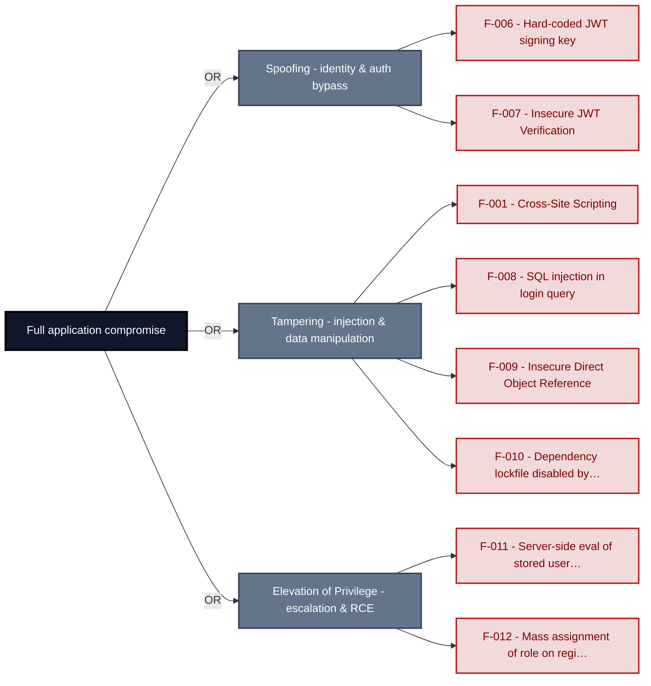

**Findings** (full detail in [§8 Findings Register](#8-findings-register)): [F-006](#f-006) · [F-007](#f-007) · [F-001](#f-001) · [F-008](#f-008) · [F-009](#f-009) · [F-010](#f-010) · [F-011](#f-011) · [F-012](#f-012)

---

## 1. System Overview

**Repository:** `https://github.com/juice-shop/juice-shop.git`

### Scope

This threat model covers 8 components of juice-shop2: **Express\.js Backend API**, **JWT Authentication and Session Management**, **Angular SPA Web Frontend**, **SQLite Embedded Database**, **CI/CD Pipeline**, **Real-time WebSocket Channel**, **Web3 / Wallet / NFT Surface**, **`marsdb` Embedded Store**.

All 8 modeled components received full STRIDE threat analysis.

**Out of scope:** third-party hosted dependencies, browser runtime, operating-system kernel, and the underlying network infrastructure.

**Basis:** a code-derived threat model at implementation level, built from source, configuration and git history. It describes the system as built, not as designed.

---

<a id="identified-actors"></a>
### Identified Actors

The consolidated threat actors that drive this model - the same set named in the Management Summary. Each row aggregates the findings reachable from that actor's position; the **Shop User** appears as the *victim* of client-side attacks, not an attacker.

**Actor grouping.** Regular self-registered users are grouped with anonymous internet attackers because registration is open. Repository readers are grouped with anonymous internet attackers because the source repository is public. Each finding retains its login and privilege requirements.

| Actor | Role | Reach | Findings | Components |
|-----------------|--------|----------------------|----------------|----------------------|
| Shop User | victim | legitimate customer; target of client-side<br/>attacks | 3 | backend, frontend, web3-nft |
| Internet Attacker | attacker | can self-register a regular account | 65 | auth, backend, ci-cd-pipeline, frontend,<br/>marsdb-store, realtime-channel, web3-nft |

---

### Trust Boundaries

Canonical boundary crossings. **Assumption & verdict** names the condition that makes each crossing safe and whether this report still supports it, judged one condition at a time - which conditions apply follows from the direction of the crossing.

<table style="table-layout:fixed;width:100%">
<colgroup><col width="6%" style="width:6%"><col width="25%" style="width:25%"><col width="11%" style="width:11%"><col width="15%" style="width:15%"><col width="25%" style="width:25%"><col width="18%" style="width:18%"></colgroup>
<thead><tr><th>ID</th><th>Boundary / crossing</th><th>Exposure</th><th>Kind</th><th>Assumption &amp; verdict</th><th>Linked findings</th></tr></thead>
<tbody>
<tr><td style="white-space:nowrap"><a id="tb-1"></a>tb-1</td><td style="overflow-wrap:break-word"><strong>external → backend</strong><br/>Control: security.isAuthorized() expressJwt · Also covers: realtime-channel, web3-nft</td><td>🌐 <strong>External</strong></td><td style="overflow-wrap:break-word">network</td><td style="overflow-wrap:break-word">Every state-changing route is registered behind security.isAuthorized() before reaching backend business logic.<br/><em>confirmed</em><br/>Validation: <strong>broken</strong> · 3 related · <a href="#66-input-boundary-validation-controls">§6.6</a><br/>Authentication: <strong>broken</strong> · 5 related · <a href="#62-identity-and-authentication-controls">§6.2</a><br/>Authorization: <strong>broken</strong> · 4 related · <a href="#64-authorization-controls">§6.4</a></td><td style="overflow-wrap:break-word"><em>Validation</em><br/>🔴 <a href="#f-012">F-012</a><br/>🟠 <a href="#f-023">F-023</a><br/>🔴 <a href="#f-043">F-043</a><br/>🟠 <a href="#f-044">F-044</a><br/><em>Authentication</em><br/>🔴 <a href="#f-007">F-007</a><br/>🟠 <a href="#f-017">F-017</a><br/>🟠 <a href="#f-027">F-027</a><br/>🟠 <a href="#f-053">F-053</a><br/><em>Authorization</em><br/>🟠 <a href="#f-065">F-065</a></td></tr>
<tr><td style="white-space:nowrap"><a id="tb-2"></a>tb-2</td><td style="overflow-wrap:break-word"><strong>external → auth</strong><br/>Control: <code>jwt.sign</code> RS256 and expressJwt verification</td><td>🌐 <strong>External</strong></td><td style="overflow-wrap:break-word">network · identity</td><td style="overflow-wrap:break-word">A JWT is accepted only if it is signed with the server-held RSA private key.<br/><em>confirmed</em><br/>Validation: in doubt · 1 related · <a href="#66-input-boundary-validation-controls">§6.6</a><br/>Authentication: <strong>broken</strong> · 2 related · <a href="#62-identity-and-authentication-controls">§6.2</a><br/>Authorization: <em>not examined</em> · <a href="#64-authorization-controls">§6.4</a></td><td style="overflow-wrap:break-word"><em>Authentication</em><br/>🔴 <a href="#f-006">F-006</a><br/>🔴 <a href="#f-007">F-007</a></td></tr>
<tr><td style="white-space:nowrap"><a id="tb-3"></a>tb-3</td><td style="overflow-wrap:break-word"><strong>external → ci-cd-pipeline</strong><br/>Control: GITHUB_TOKEN scopes and branch protection</td><td>◐ <strong>Unverified</strong></td><td style="overflow-wrap:break-word">build pipeline · operator</td><td style="overflow-wrap:break-word">Only authorized contributors can trigger production pipeline runs and access build secrets.<br/><em>inferred</em><br/>Validation: in doubt · 1 related · <a href="#66-input-boundary-validation-controls">§6.6</a><br/>Authentication: <em>not examined</em> · <a href="#62-identity-and-authentication-controls">§6.2</a><br/>Authorization: in doubt · 1 related · <a href="#64-authorization-controls">§6.4</a></td><td style="overflow-wrap:break-word">-</td></tr>
<tr><td style="white-space:nowrap"><a id="tb-4"></a>tb-4</td><td style="overflow-wrap:break-word"><strong>auth → sqlite-db</strong><br/>Control: Sequelize parameterized query binding · Also covers: backend</td><td>🔒 <strong>Internal</strong></td><td style="overflow-wrap:break-word">in-process - enforcement interface, no trust transition</td><td style="overflow-wrap:break-word">Every credential lookup reaches SQLite through Sequelize parameter binding.<br/><em>confirmed</em><br/>Query construction: <strong>broken</strong> · 2 related · <a href="#65-query-construction-and-data-access-controls">§6.5</a></td><td style="overflow-wrap:break-word"><em>Query construction</em><br/>🔴 <a href="#f-008">F-008</a></td></tr>
<tr><td style="white-space:nowrap"><a id="tb-5"></a>tb-5</td><td style="overflow-wrap:break-word"><strong>backend → external</strong><br/>Control: none identified</td><td>↗ <strong>Egress</strong></td><td style="overflow-wrap:break-word">network · operator</td><td style="overflow-wrap:break-word">Nothing attacker-controlled reaches the Ollama LLM provider unfiltered.<br/><em>confirmed</em><br/>Egress content: <strong>broken</strong><br/>Egress destination: <em>not examined</em> · <a href="#610-file-parser-and-outbound-request-controls">§6.10</a><br/>Response trust: <strong>broken</strong></td><td style="overflow-wrap:break-word"><em>Egress content</em><br/>🟠 <a href="#f-034">F-034</a><br/>🔴 <a href="#f-038">F-038</a><br/><em>Response trust</em><br/>🟡 <a href="#f-052">F-052</a></td></tr>
</tbody>
</table>

_Exposure, most exposed first: ⚠ Review (endpoints unresolved) · 🌐 External (reached from outside the model) · ◐ Unverified (crossing not confirmed) · 🔒 Internal (both ends modelled) · ↗ Egress (reaches outside the model)._

_Kind - the crossing mechanism (build pipeline, in-process, network), then after `·` what changes across it: data-origin, identity, operator, privilege, tenant. Shown alone, nothing changes._

_Conditions - **inbound**: validation, authentication, authorization · **outbound**: egress content, egress destination, response trust (replies are untrusted input) · **internal**: query construction (data never becomes program text), authentication, authorization._

_Verdict per condition - **broken**: a linked finding proves the gap · in doubt: related findings, none linked here · not examined: nothing bears on it. `N related` counts further findings on the same condition. Linked findings sit under the condition they break, or under _Unattributed_. A link raises effective severity only at a confirmed internet ingress; raw risk never changes._

_Identical on every row, so stated once here instead of in a column: source `detected` (derived from inspected repository evidence); status `resolved`. Any row that deviates is shown in the table._

---

## 2. Architecture Diagrams

### 2.1 System Context

Who interacts with juice-shop2 from the outside, and through which channels. Solid arrows show normal usage; dashed red arrows mark unauthenticated probing or exploit paths (C4 Level 1).

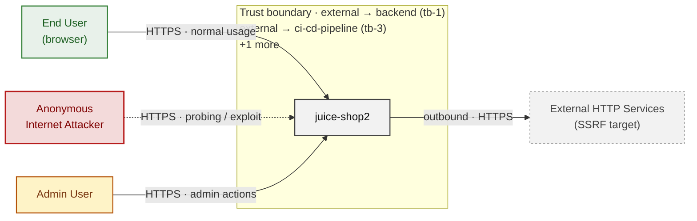

*Trust boundaries not named above: external → auth (tb-2), auth → sqlite-db (tb-4), backend → external (tb-5) - every boundary is listed in [§1 Trust Boundaries](#trust-boundaries).*

**Key takeaway:** Every actor in the context interacts with juice-shop2 through its external interface, so authentication and input validation at that edge govern the entire attack surface.

### 2.2 Container Architecture

How the system decomposes into deployable units. Each box is a separate runtime process or service container; arrows show synchronous request paths between them. Components with ≥3 Critical findings carry a red border, ≥2 High amber (C4 Level 2).

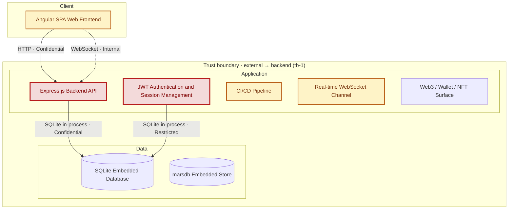

*Trust boundaries not drawn above: auth → sqlite-db (tb-4), backend → external (tb-5) - every boundary is listed in [§1 Trust Boundaries](#trust-boundaries).*

**Key takeaway:** The system decomposes into 1 client, 5 application and 2 data unit(s); JWT Authentication and Session Management carries the most Critical findings (3) and bounds the worst-case blast radius.

### 2.3 Components

Who reaches each component, and through which trust zone. Browser code runs on the user's device, so the client column is part of the untrusted zone, not a zone of its own - trust changes only where traffic enters the Application tier. Solid green arrows show legitimate data flow, dashed red arrows mark intrusion vectors. The component table directly below holds source paths and linked threats per `C-NN`; per-finding evidence is in [§8 Findings Register](#8-findings-register).

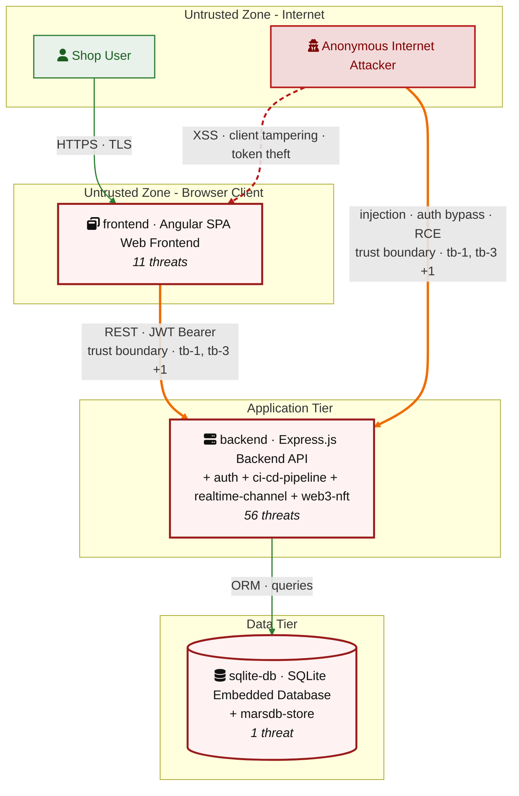

*Trust boundaries crossed by the `==>` edges above: external → backend (tb-1), external → ci-cd-pipeline (tb-3), external → auth (tb-2) - every boundary is listed in [§1 Trust Boundaries](#trust-boundaries).*

**Key takeaway:** Express\.js Backend API concentrates the most findings (26 of 68 across all components); the table below maps each component to its source paths and linked threats.

| ID | Name | Type | Key Paths | Linked Threats |
|----|----------------------|-----------|--------------------------------------|------------------------------------------------|
| <a id="c-01"></a><a id="backend"></a><span style="white-space:nowrap">C-01</span> | Express\.js Backend API | application | `server.ts`<br/>`app.ts`<br/>`routes/*.ts`<br/>`lib/**/*.ts`<br/>`models/**/*.ts` | 🔴 [F-009](#f-009) — Insecure Direct Object Reference (`address.ts:11`)<br/>🔴 [F-011](#f-011) — Server-side eval of stored username (`userProfile.ts:61`)<br/>🔴 [F-012](#f-012) — Mass assignment of role on registration (`server.ts:484`)<br/>🔴 [F-019](#f-019) — NoSQL \$where JavaScript injection (`trackOrder.ts:18`)<br/>🔴 [F-038](#f-038) — Coupon discount bounded only by prompt text (`chat.ts:184`)<br/>🔴 [F-039](#f-039) — Deluxe upgrade skips payment check (`deluxe.ts:43`)<br/>🟠 [F-018](#f-018) — Hard-coded seeded account credentials (`datacreator.ts:200`)<br/>🟠 [F-021](#f-021) — Input compiled as template source (`userProfile.ts:87`)<br/>🟠 [F-026](#f-026) — Denylisted path traversal in erasure layout (`dataErasure.ts:104`)<br/>🟠 [F-027](#f-027) — HTTP access logs browsable without authentication (`server.ts:281`)<br/>🟠 [F-028](#f-028) — Unvalidated URL fetch in profile image (`profileImageUrlUpload.ts:24`)<br/>🟠 [F-032](#f-032) — Rate limiter keyed on client-supplied header (`server.ts:346`)<br/>🟠 [F-033](#f-033) — No rate limit or lockout on login (`server.ts:596`)<br/>🟠 [F-034](#f-034) — Unbounded LLM consumption on `/rest/chat` (`server.ts:638`)<br/>🟠 [F-037](#f-037) — Client-controlled wallet credit amount (`wallet.ts:27`)<br/>🟠 [F-040](#f-040) — Sensitive Routes Registered Without Authentication Middleware (`server.ts:310`)<br/>🟠 [F-053](#f-053) — Admin configuration endpoints exposed unauthenticated (`server.ts:607`)<br/>🟠 [F-065](#f-065) — Basket item update without ownership check (`server.ts:426`)<br/>🟡 [F-045](#f-045) — Cookie-only authentication on POST `/profile` (`updateUserProfile.ts:17`)<br/>🟡 [F-049](#f-049) — Unescaped anchor persisted into product description (`datacreator.ts:406`)<br/>🟡 [F-052](#f-052) — Chat tool calls streamed to every caller (`chat.ts:228`)<br/>🟡 [F-054](#f-054) — Development error handler returns stack traces (`server.ts:682`)<br/>🟡 [F-058](#f-058) — Ineffective author email masking in feedback (`datacreator.ts:578`)<br/>🟡 [F-059](#f-059) — Plaintext security answer written to log (`datacreator.ts:692`)<br/>🟡 [F-066](#f-066) — Security answers stored under embedded HMAC key (`datacreator.ts:691`)<br/>🟡 [F-067](#f-067) — Entitlement token derived from account email (`datacreator.ts:198`) |
| <a id="c-02"></a><a id="auth"></a><span style="white-space:nowrap">C-02</span> | JWT Authentication and Session Management | application | `routes/login.ts`<br/>`routes/2fa.ts`<br/>`routes/changePassword.ts`<br/>`routes/currentUser.ts`<br/>`routes/authenticatedUsers.ts` | 🔴 [F-006](#f-006) — Hard-coded JWT signing key (`insecurity.ts:21`)<br/>🔴 [F-007](#f-007) — Insecure JWT Verification (`insecurity.ts:52`)<br/>🔴 [F-008](#f-008) — SQL injection in login query (`login.ts:34`)<br/>🟠 [F-013](#f-013) — Weak password recovery mechanism (`resetPassword.ts:41`)<br/>🟠 [F-020](#f-020) — Non-cryptographic RNG for a secret/token (`insecurity.ts:53`)<br/>🟠 [F-024](#f-024) — Passwords passed in URL query string (`changePassword.ts:14`)<br/>🟠 [F-025](#f-025) — Unsalted MD5 password hashing (`insecurity.ts:41`)<br/>🟠 [F-036](#f-036) — Password change without current password (`changePassword.ts:39`)<br/>🟡 [F-004](#f-004) — Missing server-side security audit logging (`login.ts:50`)<br/>🟡 [F-042](#f-042) — Missing session token revocation (`insecurity.ts:54`)<br/>🟡 [F-051](#f-051) — Credential validity oracle before 2FA (`login.ts:38`)<br/>🟡 [F-061](#f-061) — Unbounded in-memory session map (`insecurity.ts:74`) |
| <a id="c-03"></a><a id="frontend"></a><span style="white-space:nowrap">C-03</span> | Angular SPA Web Frontend | client | `frontend/src/**/*.ts`<br/>`frontend/src/**/*.html`<br/>`frontend/src/**/*.scss` | 🔴 [F-001](#f-001) — Cross-Site Scripting (`search-result.component.ts:143`)<br/>🔴 [F-015](#f-015) — Unvalidated OAuth token (`oauth.component.ts:28`)<br/>🔴 [F-056](#f-056) — Hard-coded test credential (`login.component.ts:62`)<br/>🟠 [F-002](#f-002) — JWT in localStorage (`request.interceptor.ts:13`)<br/>🟠 [F-003](#f-003) — Client-side authorization decision (`app.guard.ts:54`)<br/>🟠 [F-016](#f-016) — Predictable derived credential (`oauth.component.ts:30`)<br/>🟠 [F-055](#f-055) — Client-gated tool-call disclosure (`chat-conversation.component.ts:68`)<br/>🟠 [F-073](#f-073) — Token flow accepts a stolen bearer token without (`login.component.ts:148`)<br/>🟡 [F-048](#f-048) — Missing Content-Security-Policy<br/>🟡 [F-057](#f-057) — Session cookie without HttpOnly (`login.component.ts:104`)<br/>🟡 [F-063](#f-063) — Unbounded chat history resend (`chat-conversation.component.ts:131`) |
| <a id="c-04"></a><a id="sqlite-db"></a><span style="white-space:nowrap">C-04</span> | SQLite Embedded Database | data | `data/datacreator.ts`<br/>`data/datacache.ts` | - |
| <a id="c-05"></a><a id="ci-cd-pipeline"></a><span style="white-space:nowrap">C-05</span> | CI/CD Pipeline | application | `.github/workflows/**`<br/>.gitlab`-ci.yml`<br/>`Dockerfile`<br/>`**/Dockerfile`<br/>`docker-compose*.yml` | 🔴 [F-010](#f-010) — Dependency lockfile disabled by config (`.npmrc:1`)<br/>🟠 [F-014](#f-014) — Long-lived registry publish credential (`ci.yml:327`)<br/>🟠 [F-022](#f-022) — Unpinned third-party action (`image_actions.yml:33`)<br/>🟠 [F-029](#f-029) — Secrets broadcast to job environment (`ci.yml:253`)<br/>🟠 [F-041](#f-041) — Missing workflow permissions block (`ci.yml:190`)<br/>🟡 [F-046](#f-046) — Remote script piped to shell (`ci.yml:358`)<br/>🟡 [F-047](#f-047) — Unpinned container base image — `Dockerfile:1` (`Dockerfile:1`)<br/>🟡 [F-050](#f-050) — Mutable image tag without build attestation (`ci.yml:345`)<br/>🟡 [F-062](#f-062) — Unbounded CI matrix fan-out (`ci.yml:58`) |
| <a id="c-06"></a><a id="realtime-channel"></a><span style="white-space:nowrap">C-06</span> | Real-time WebSocket Channel | application | `lib/challengeUtils.ts`<br/>`lib/startup/registerWebsocketEvents.ts` | 🟠 [F-017](#f-017) — Unauthenticated WebSocket Channel (`registerWebsocketEvents.ts:23`)<br/>🟠 [F-023](#f-023) — Client-trusted security decision (`registerWebsocketEvents.ts:50`)<br/>🟠 [F-030](#f-030) — Unauthenticated data exposure (`registerWebsocketEvents.ts:30`)<br/>🟠 [F-035](#f-035) — Inefficient regex complexity (`registerWebsocketEvents.ts:46`) |
| <a id="c-07"></a><a id="web3-nft"></a><span style="white-space:nowrap">C-07</span> | Web3 / Wallet / NFT Surface | application | `routes/checkKeys.ts`<br/>`routes/nftMint.ts`<br/>`routes/redirect.ts`<br/>`routes/web3Wallet.ts` | 🔴 [F-031](#f-031) — Hard-coded wallet mnemonic (`checkKeys.ts:10`)<br/>🔴 [F-043](#f-043) — Wallet identity accepted without proof of possession (`web3Wallet.ts:16`)<br/>🟠 [F-044](#f-044) — Open redirect (`redirect.ts:19`)<br/>🟡 [F-060](#f-060) — Raw provider error returned to caller (`web3Wallet.ts:36`)<br/>🟡 [F-064](#f-064) — Listener guard race opens unbounded providers (`nftMint.ts:16`) |
| <a id="c-08"></a><a id="marsdb-store"></a><span style="white-space:nowrap">C-08</span> | `marsdb` Embedded Store | data | `data/mongodb.ts` | 🟡 [F-005](#f-005) — Unmediated data-store access control (`mongodb.ts:10`) |

### 2.4 Technology Architecture

The technology stack the system is built on. Each box names the framework or runtime that fills that role; per-component findings live in the [§2.3](#23-components) component table above, and the full per-finding catalogue is in [§8 Findings Register](#8-findings-register).

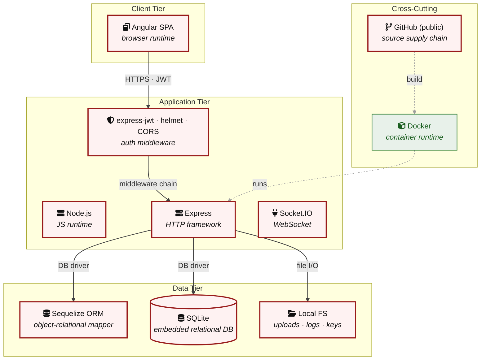

**Key takeaway:** The stack spans 2 data-tier store(s) behind the application tier; injection and data-at-rest exposure track the data tier, detailed per finding in [§8 Findings Register](#8-findings-register).

> **Legend:** `-->` synchronous request/response (REST, HTTPS, gRPC) · `-.->` asynchronous / event-driven (WebSocket, queue, pub-sub) · `==>` crosses an untrusted trust boundary (security-critical) · **red border** ≥ 3 Critical threats on the component · **amber border** ≥ 2 High threats

---

## 3. Attack Walkthroughs

This section walks through how the **8 highest-priority of 15 Critical findings** are exploited - selected by severity, chain relevance, and threat-category diversity, with Access Control and LLM Abuse represented when present. Each walkthrough has attack steps, a focused sequence diagram, and the primary mitigation. How weaknesses combine toward the worst-case goal is in the [Critical Attack Tree](#critical-attack-tree); every other Critical, plus full per-finding context (severity rationale, assets, detection signals), is in the [§8 Findings Register](#8-findings-register).

### 3.1 Insecure JWT Verification in JWT Authentication and Session Management

**Source:** 🔴 [F-007](#f-007) — `lib/insecurity.ts:52`

Severity **Critical** ([CWE-347](https://cwe.mitre.org/data/definitions/347.html)). STRIDE: Spoofing. See [§8 F-007](#f-007) for the full register row.

**Attack Steps**

1. I fetch the RSA public key that `lib/insecurity.ts:20` loads from `encryptionkeys/jwt.pub`, which is distributed with the application.
2. I build a JWT whose header is alg `HS256` and whose data claim names the administrator account.
3. I compute the HMAC signature using the public key PEM text as the shared secret and send the token to a protected route.
4. `express-jwt` verifies it with the same PEM as an HMAC secret and grants me the administrator session.

**Sequence Diagram**

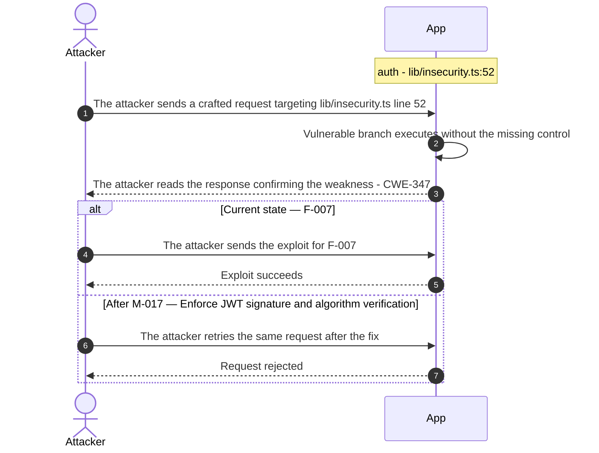

**Key takeaway:** Until ● [M-017](#m-017) (Enforce JWT signature and algorithm verification) lands, 🔴 [F-007](#f-007) — Insecure JWT Verification is exploitable at `lib/insecurity.ts:52` (Critical-severity, [CWE-347](https://cwe.mitre.org/data/definitions/347.html)).

**Defense in Depth**

- Primary mitigation: ● [M-017](#m-017) (Enforce JWT signature and algorithm verification)

### 3.2 SQL injection in login query

**Source:** 🔴 [F-008](#f-008) — `routes/login.ts:34`

Severity **Critical** ([CWE-89](https://cwe.mitre.org/data/definitions/89.html)). STRIDE: Tampering. See [§8 F-008](#f-008) for the full register row.

**Attack Steps**

1. I POST to `/rest/user/login` with the email field set to `' OR 1=1--` and any password.
2. The handler splices my value into the raw SQL at `routes/login.ts:34`, so the WHERE clause matches the first Users row.
3. The response at `routes/login.ts:26` hands me a signed session token for that account, which is the administrator.
4. I extend the same injection with UNION SELECT to read password hashes and security answers out of the database.

**Sequence Diagram**

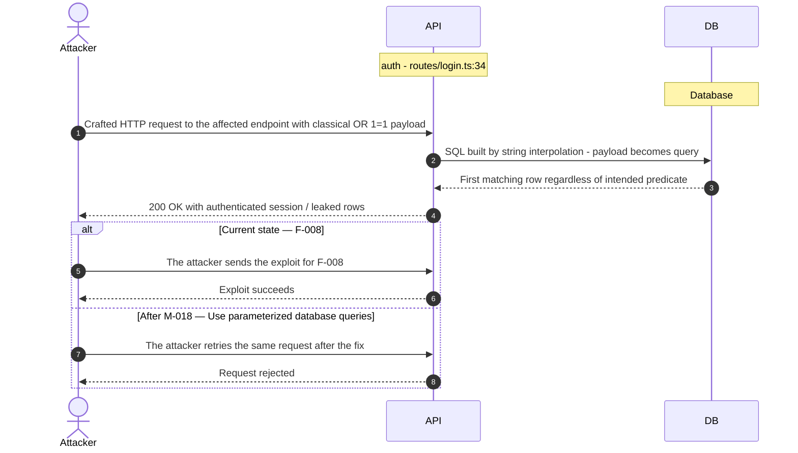

**Key takeaway:** Until ● [M-018](#m-018) (Use parameterized database queries) lands, 🔴 [F-008](#f-008) — SQL injection in login query is exploitable at `routes/login.ts:34` (Critical-severity, [CWE-89](https://cwe.mitre.org/data/definitions/89.html)).

**Defense in Depth**

- Primary mitigation: ● [M-018](#m-018) (Use parameterized database queries)

### 3.3 Mass assignment of role on registration in Express js Backend API

**Source:** 🔴 [F-012](#f-012) — `server.ts:484`

Severity **Critical** ([CWE-915](https://cwe.mitre.org/data/definitions/915.html)). STRIDE: Elevation of Privilege. See [§8 F-012](#f-012) for the full register row.

**Attack Steps**

1. I post `{"email":"x@x.tld","password":"p","passwordRepeat":"p","role":"admin"}` to `/api/Users` with no session.
2. The finale User resource binds the role attribute from my body because the exclude list at `server.ts:484` omits it.
3. I log in with the new account and receive a token whose `data.role` claim is admin, unlocking every role-gated route.

**Sequence Diagram**

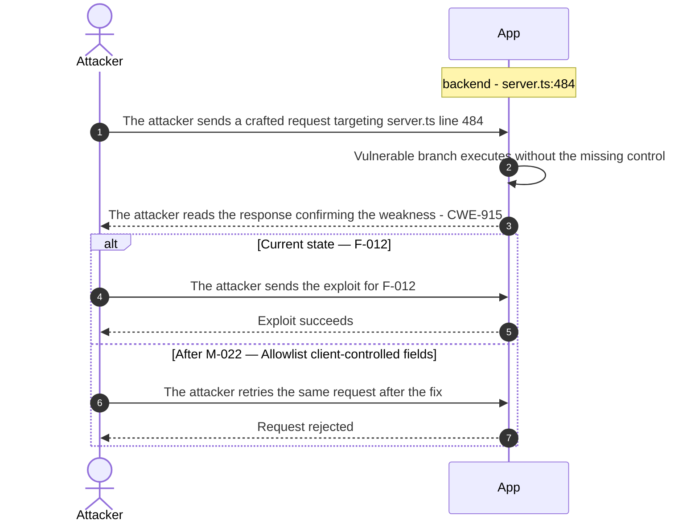

**Key takeaway:** Until ● [M-022](#m-022) (Allowlist client-controlled fields) lands, 🔴 [F-012](#f-012) — Mass assignment of role on registration is exploitable at `server.ts:484` (Critical-severity, [CWE-915](https://cwe.mitre.org/data/definitions/915.html)).

**Defense in Depth**

- Primary mitigation: ● [M-022](#m-022) (Allowlist client-controlled fields)

### 3.4 Server-side eval of stored username in User Profile

**Source:** 🔴 [F-011](#f-011) — `routes/userProfile.ts:61`

Severity **Critical** ([CWE-94](https://cwe.mitre.org/data/definitions/94.html)). STRIDE: Elevation of Privilege. See [§8 F-011](#f-011) for the full register row.

**Attack Steps**

1. I register an account and post a username of #{`process.mainModule.require('child_process').execSync('id')`} to `/profile`.
2. The update handler stores my username unchanged in the Users table.
3. I request GET `/profile`, and the profile renderer extracts my payload and passes it to eval, executing my command in the server process.

**Sequence Diagram**


**Key takeaway:** Until ● [M-021](#m-021) (Remove server-side evaluation of untrusted input) lands, 🔴 [F-011](#f-011) — Server-side eval of stored username (`routes/userProfile.ts:61`) is exploitable at `routes/userProfile.ts:61` (Critical-severity, [CWE-94](https://cwe.mitre.org/data/definitions/94.html)).

**Defense in Depth**

- Primary mitigation: ● [M-021](#m-021) (Remove server-side evaluation of untrusted input)

### 3.5 Cross-Site Scripting in Search Result

**Source:** 🔴 [F-001](#f-001) — `frontend/src/app/search-result/search-result.component.ts:143`

Severity **Critical** ([CWE-79](https://cwe.mitre.org/data/definitions/79.html)). STRIDE: Tampering. See [§8 F-001](#f-001) for the full register row.

**Attack Steps**

1. I craft a URL whose q query parameter contains an HTML event-handler payload that posts `localStorage` to my server.
2. I send the link to a signed-in customer, who opens it in the shop they already trust.
3. `filterTable` passes my q value through `bypassSecurityTrustHtml`, so Angular renders it as live markup instead of text.
4. My payload reads the JWT from `localStorage` and posts it to my server, letting me replay the victim's session against the REST API.

**Sequence Diagram**

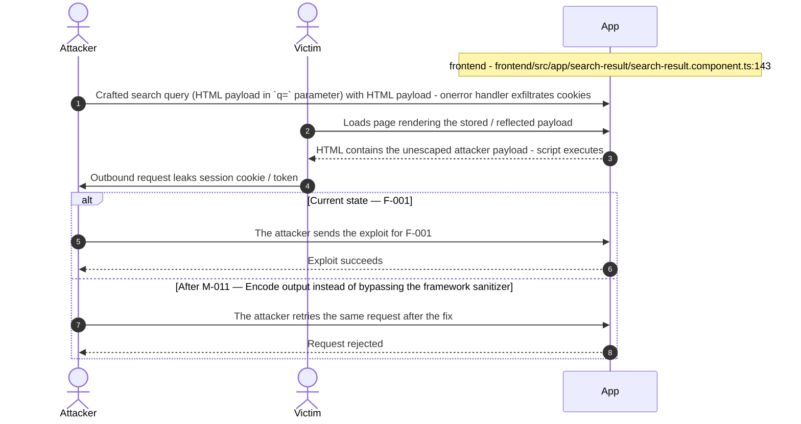

**Key takeaway:** Until ● [M-011](#m-011) (Encode output instead of bypassing the framework sanitizer) lands, 🔴 [F-001](#f-001) — Cross-Site Scripting is exploitable at `frontend/src/app/search-result/search-result.component.ts:143` (Critical-severity, [CWE-79](https://cwe.mitre.org/data/definitions/79.html)).

**Defense in Depth**

- Primary mitigation: ● [M-011](#m-011) (Encode output instead of bypassing the framework sanitizer)

### 3.6 Hard-coded JWT signing key in JWT Authentication and Session Management

**Source:** 🔴 [F-006](#f-006) — `lib/insecurity.ts:21`

Severity **Critical** ([CWE-321](https://cwe.mitre.org/data/definitions/321.html)). STRIDE: Spoofing. See [§8 F-006](#f-006) for the full register row.

**Attack Steps**

1. I copy the RSA private key literal embedded at `lib/insecurity.ts:21` out of the published source tree.
2. I sign my own JWT payload with that key using `RS256`, setting `data.id` and `data.role` to the administrator account.
3. I send the forged token as the `Authorization` bearer header to any route registered behind `isAuthorized()`.
4. I operate with administrator authority for the full six-hour token lifetime because no revocation list exists.

**Sequence Diagram**

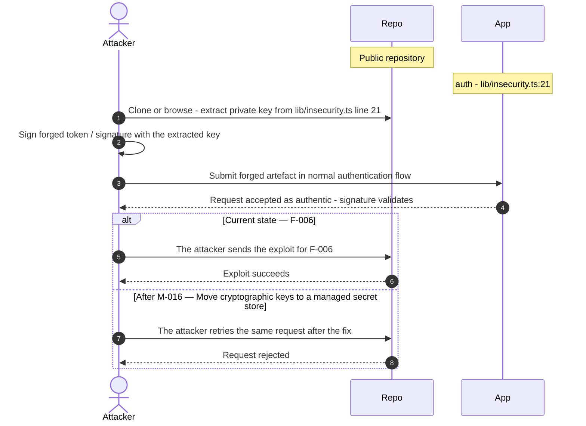

**Key takeaway:** Until ● [M-016](#m-016) (Move cryptographic keys to a managed secret store) lands, 🔴 [F-006](#f-006) — Hard-coded JWT signing key (`lib/insecurity.ts:21`) is exploitable at `lib/insecurity.ts:21` (Critical-severity, [CWE-321](https://cwe.mitre.org/data/definitions/321.html)).

**Defense in Depth**

- Primary mitigation: ● [M-016](#m-016) (Move cryptographic keys to a managed secret store)

### 3.7 Dependency lockfile disabled by config in Npmrc

**Source:** 🔴 [F-010](#f-010) — `.npmrc:1`

Severity **Critical** ([CWE-829](https://cwe.mitre.org/data/definitions/829.html)). STRIDE: Tampering. See [§8 F-010](#f-010) for the full register row.

**Attack Steps**

1. I take over a maintainer account for a small transitive dependency of juice-shop and publish a patch version that satisfies the existing caret range.
2. The next CI or Docker build runs npm install with no lockfile, so npm resolves my freshly published version instead of the one the last build used.
3. My postinstall script runs on the runner and reads the job environment, capturing `DOCKERHUB_TOKEN`, `HEROKU_API_KEY` and `GITHUB_TOKEN`.
4. In the `Dockerfile` installer stage I also patch the compiled output, so the published bkimminich/juice-shop image ships my backdoor.

**Sequence Diagram**

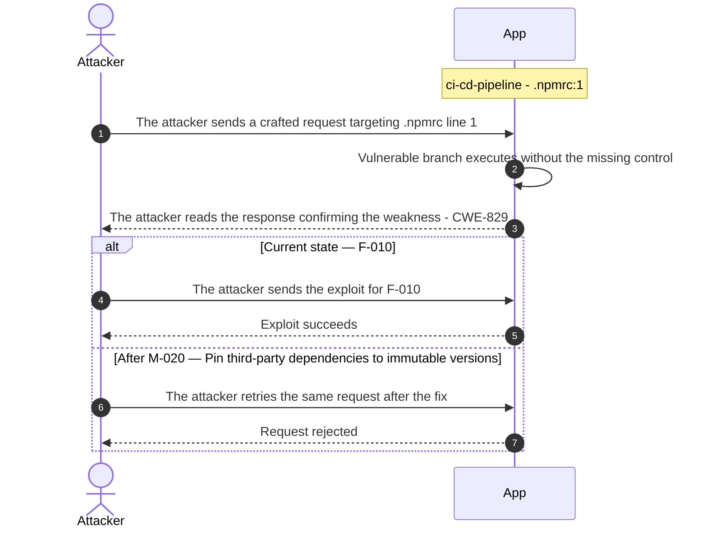

**Key takeaway:** Until ● [M-020](#m-020) (Pin third-party dependencies to immutable versions) lands, 🔴 [F-010](#f-010) — Dependency lockfile disabled by config — .npmrc:1 is exploitable at `.npmrc:1` (Critical-severity, [CWE-829](https://cwe.mitre.org/data/definitions/829.html)).

**Defense in Depth**

- Primary mitigation: ● [M-020](#m-020) (Pin third-party dependencies to immutable versions)

### 3.8 Coupon discount bounded only by prompt text in Chat

**Source:** 🔴 [F-038](#f-038) — `routes/chat.ts:184`

Severity **High** ([CWE-863](https://cwe.mitre.org/data/definitions/863.html)). STRIDE: Elevation of Privilege. See [§8 F-038](#f-038) for the full register row.

**Attack Steps**

1. LLM06 - Excessive Agency: an attacker injects instructions into the chat messages array so the model calls `generateCoupon` with a discount far above the stated maximum.
2. The coupon policy, including the 10 percent ceiling and the damaged-order precondition, exists only as system-prompt text at `routes/chat.ts:98-105`.
3. The tool's execute body at `routes/chat.ts:184` passes the model-chosen discount straight to `security.generateCoupon` with no numeric bound, no order verification, and no caller check, and the resulting code is redeemable through PUT `/rest/basket/:id/coupon/:coupon` at.

**Sequence Diagram**

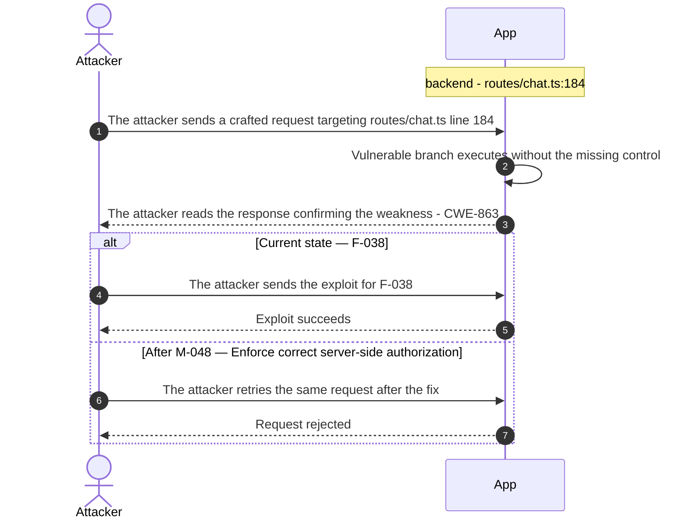

**Key takeaway:** Until ◕ [M-048](#m-048) (Enforce correct server-side authorization) lands, 🔴 [F-038](#f-038) — Coupon discount bounded only by prompt text (`routes/chat.ts:184`) is exploitable at `routes/chat.ts:184` (High-severity, [CWE-863](https://cwe.mitre.org/data/definitions/863.html)).

**Defense in Depth**

- Primary mitigation: ◕ [M-048](#m-048) (Enforce correct server-side authorization)

<!-- generated:walkthrough_renderer -->

---

## 4. Assets

Information assets and the classification level that drives the Confidentiality / Integrity / Availability targets used in [§8 Findings Register](#8-findings-register) risk scoring.

<table style="table-layout:fixed;width:100%">
<colgroup><col width="22%" style="width:22%"><col width="13%" style="width:13%"><col width="32%" style="width:32%"><col width="33%" style="width:33%"></colgroup>
<thead><tr><th>Asset</th><th>Classification</th><th>Description</th><th>Linked Threats</th></tr></thead>
<tbody>
<tr><td style="overflow-wrap:break-word">JWT RSA Signing Private Key</td><td>Restricted</td><td>2048-bit RSA private key used to sign all JWT session tokens. Hardcoded as a string literal in <code>lib/insecurity.ts</code>. Compromise of this key enables forging valid tokens for any user including administrators.</td><td style="overflow-wrap:break-word">🔴 <a href="#f-006">F-006</a> — Hard-coded JWT signing key (<code>insecurity.ts:21</code>)<br/>🔴 <a href="#f-007">F-007</a> — Insecure JWT Verification (<code>insecurity.ts:52</code>)<br/>🟠 <a href="#f-018">F-018</a> — Hard-coded seeded account credentials (<code>datacreator.ts:200</code>)<br/>🟠 <a href="#f-020">F-020</a> — Non-cryptographic RNG for a secret/token (<code>insecurity.ts:53</code>)<br/>🟠 <a href="#f-026">F-026</a> — Denylisted path traversal in erasure layout (<code>dataErasure.ts:104</code>)<br/>🟠 <a href="#f-029">F-029</a> — Secrets broadcast to job environment (<code>ci.yml:253</code>)<br/>🟠 <a href="#f-030">F-030</a> — Unauthenticated data exposure (<code>registerWebsocketEvents.ts:30</code>)<br/>🔴 <a href="#f-031">F-031</a> — Hard-coded wallet mnemonic (<code>checkKeys.ts:10</code>)<br/>🟡 <a href="#f-042">F-042</a> — Missing session token revocation (<code>insecurity.ts:54</code>)<br/>🟡 <a href="#f-052">F-052</a> — Chat tool calls streamed to every caller (<code>chat.ts:228</code>)<br/>🟠 <a href="#f-053">F-053</a> — Admin configuration endpoints exposed unauthenticated (<code>server.ts:607</code>)<br/>🟠 <a href="#f-055">F-055</a> — Client-gated tool-call disclosure (<code>chat-conversation.component.ts:68</code>)<br/>🔴 <a href="#f-056">F-056</a> — Hard-coded test credential (<code>login.component.ts:62</code>)<br/>🟡 <a href="#f-061">F-061</a> — Unbounded in-memory session map (<code>insecurity.ts:74</code>)<br/>🟡 <a href="#f-066">F-066</a> — Security answers stored under embedded HMAC key (<code>datacreator.ts:691</code>)</td></tr>
<tr><td style="overflow-wrap:break-word">Application Configuration</td><td>Restricted</td><td>Runtime application configuration including feature flags, customization settings, and integration parameters returned by <code>/rest/admin/application-configuration</code>. Exposed without authentication, enabling information disclosure about enabled features and integration endpoints.</td><td style="overflow-wrap:break-word">-</td></tr>
<tr><td style="overflow-wrap:break-word">User Credentials (email, password hash)</td><td>Confidential</td><td>Email addresses and bcrypt password hashes for all registered users. Stored in the SQLite users table, transmitted during login, and used by the auth component for verification. Compromise enables account takeover across all users.</td><td style="overflow-wrap:break-word">🔴 <a href="#f-001">F-001</a> — Cross-Site Scripting (<code>search-result.component.ts:143</code>)<br/>🔴 <a href="#f-008">F-008</a> — SQL injection in login query (<code>login.ts:34</code>)<br/>🟠 <a href="#f-014">F-014</a> — Long-lived registry publish credential (<code>ci.yml:327</code>)<br/>🟠 <a href="#f-018">F-018</a> — Hard-coded seeded account credentials (<code>datacreator.ts:200</code>)<br/>🟠 <a href="#f-025">F-025</a> — Unsalted MD5 password hashing (<code>insecurity.ts:41</code>)<br/>🟠 <a href="#f-032">F-032</a> — Rate limiter keyed on client-supplied header (<code>server.ts:346</code>)<br/>🟠 <a href="#f-033">F-033</a> — No rate limit or lockout on login (<code>server.ts:596</code>)<br/>🟡 <a href="#f-067">F-067</a> — Entitlement token derived from account email (<code>datacreator.ts:198</code>)</td></tr>
<tr><td style="overflow-wrap:break-word">User Personal Data (name, address, phone)</td><td>Confidential</td><td>Personal identifiable information including delivery addresses, phone numbers, and profile details stored per user. Subject to GDPR data erasure requests handled by <code>routes/dataErasure.ts</code>. Exposed via data export and admin panel.</td><td style="overflow-wrap:break-word">🔴 <a href="#f-001">F-001</a> — Cross-Site Scripting (<code>search-result.component.ts:143</code>)<br/>🔴 <a href="#f-008">F-008</a> — SQL injection in login query (<code>login.ts:34</code>)<br/>🔴 <a href="#f-009">F-009</a> — Insecure Direct Object Reference (<code>address.ts:11</code>)<br/>🔴 <a href="#f-011">F-011</a> — Server-side eval of stored username (<code>userProfile.ts:61</code>)<br/>🔴 <a href="#f-012">F-012</a> — Mass assignment of role on registration (<code>server.ts:484</code>)<br/>🟠 <a href="#f-021">F-021</a> — Input compiled as template source (<code>userProfile.ts:87</code>)<br/>🟠 <a href="#f-026">F-026</a> — Denylisted path traversal in erasure layout (<code>dataErasure.ts:104</code>)<br/>🟠 <a href="#f-028">F-028</a> — Unvalidated URL fetch in profile image (<code>profileImageUrlUpload.ts:24</code>)<br/>🟠 <a href="#f-029">F-029</a> — Secrets broadcast to job environment (<code>ci.yml:253</code>)<br/>🟠 <a href="#f-030">F-030</a> — Unauthenticated data exposure (<code>registerWebsocketEvents.ts:30</code>)<br/>🟠 <a href="#f-040">F-040</a> — Sensitive Routes Registered Without Authentication Middleware (<code>server.ts:310</code>)<br/>🟡 <a href="#f-045">F-045</a> — Cookie-only authentication on POST <code>/profile</code> (<code>updateUserProfile.ts:17</code>)<br/>🟡 <a href="#f-052">F-052</a> — Chat tool calls streamed to every caller (<code>chat.ts:228</code>)<br/>🟠 <a href="#f-053">F-053</a> — Admin configuration endpoints exposed unauthenticated (<code>server.ts:607</code>)<br/>🟠 <a href="#f-055">F-055</a> — Client-gated tool-call disclosure (<code>chat-conversation.component.ts:68</code>)<br/>🟡 <a href="#f-058">F-058</a> — Ineffective author email masking in feedback (<code>datacreator.ts:578</code>)<br/>🟠 <a href="#f-065">F-065</a> — Basket item update without ownership check (<code>server.ts:426</code>)</td></tr>
<tr><td style="overflow-wrap:break-word">Payment Card Data</td><td>Confidential</td><td>Saved payment card details including card number and expiry stored in the SQLite cards table. Processed during basket checkout. No evidence of PCI-compliant tokenization was found.</td><td style="overflow-wrap:break-word">🔴 <a href="#f-001">F-001</a> — Cross-Site Scripting (<code>search-result.component.ts:143</code>)<br/>🔴 <a href="#f-008">F-008</a> — SQL injection in login query (<code>login.ts:34</code>)<br/>🔴 <a href="#f-009">F-009</a> — Insecure Direct Object Reference (<code>address.ts:11</code>)<br/>🟠 <a href="#f-040">F-040</a> — Sensitive Routes Registered Without Authentication Middleware (<code>server.ts:310</code>)<br/>🟠 <a href="#f-065">F-065</a> — Basket item update without ownership check (<code>server.ts:426</code>)</td></tr>
<tr><td style="overflow-wrap:break-word">Active Session Tokens (JWT in <code>localStorage</code>)</td><td>Confidential</td><td>JWT bearer tokens stored in browser <code>localStorage</code> by the Angular frontend. Accessible to any JavaScript running on the page, making them vulnerable to XSS-based exfiltration. Used by the request interceptor to authenticate all API calls.</td><td style="overflow-wrap:break-word">🔴 <a href="#f-001">F-001</a> — Cross-Site Scripting (<code>search-result.component.ts:143</code>)<br/>🟠 <a href="#f-002">F-002</a> — JWT in localStorage (<code>request.interceptor.ts:13</code>)<br/>🔴 <a href="#f-007">F-007</a> — Insecure JWT Verification (<code>insecurity.ts:52</code>)<br/>🟡 <a href="#f-042">F-042</a> — Missing session token revocation (<code>insecurity.ts:54</code>)<br/>🟡 <a href="#f-045">F-045</a> — Cookie-only authentication on POST <code>/profile</code> (<code>updateUserProfile.ts:17</code>)<br/>🟡 <a href="#f-046">F-046</a> — Remote script piped to shell (<code>ci.yml:358</code>)<br/>🟠 <a href="#f-073">F-073</a> — Token flow accepts a stolen bearer token without (<code>login.component.ts:148</code>)</td></tr>
<tr><td style="overflow-wrap:break-word">Challenge Progress and CTF Scores</td><td>Internal</td><td>Per-user challenge completion state, scores, and code-fix verdicts stored in the SQLite challenges and related tables. Integrity of challenge state determines the validity of training outcomes and CTF competition results.</td><td style="overflow-wrap:break-word">-</td></tr>
<tr><td style="overflow-wrap:break-word">Product Catalog and Pricing</td><td>Internal</td><td>Product definitions, pricing, reviews, and quantity data stored in SQLite and served via the CRUD API. Modification without authorization (via missing authz on PUT/DELETE <code>/api/Products/:id</code>) constitutes business-logic tampering.</td><td style="overflow-wrap:break-word">🔴 <a href="#f-001">F-001</a> — Cross-Site Scripting (<code>search-result.component.ts:143</code>)<br/>🔴 <a href="#f-008">F-008</a> — SQL injection in login query (<code>login.ts:34</code>)<br/>🔴 <a href="#f-012">F-012</a> — Mass assignment of role on registration (<code>server.ts:484</code>)</td></tr>
</tbody>
</table>

---

## 5. Attack Surface

Network-reachable entry points classified by authentication requirement. Each row links to the threat(s) referenced in its **Notes** column. The **Risk** column reflects the highest-severity linked finding. Entry points with no linked finding are still listed when they sit on a sensitive surface (authentication, registration, management) or look like a missing-auth/authz suspect - marked **⚑ Review** in Notes.

### 5.1 Unauthenticated Entry Points (55)

<table style="table-layout:fixed;width:100%">
<colgroup><col width="9%" style="width:9%"><col width="30%" style="width:30%"><col width="14%" style="width:14%"><col width="47%" style="width:47%"></colgroup>
<thead><tr><th>Method</th><th>Route</th><th>Risk</th><th>Notes</th></tr></thead>
<tbody>
<tr><td>POST</td><td style="overflow-wrap:anywhere"><code>/profile</code></td><td>🔴 Critical</td><td>🔴 <a href="#f-011">F-011</a> — Server-side eval of stored username (<code>userProfile.ts:61</code>)<br/>🟠 <a href="#f-028">F-028</a> — Unvalidated URL fetch in profile image (<code>profileImageUrlUpload.ts:24</code>)<br/>🟡 <a href="#f-045">F-045</a> — Cookie-only authentication on POST <code>/profile</code> (<code>updateUserProfile.ts:17</code>)<br/>Missing auth: POST <code>/profile</code> — profile update without authentication</td></tr>
<tr><td>POST</td><td style="overflow-wrap:anywhere"><code>/rest/user/login</code></td><td>🔴 Critical</td><td>🔴 <a href="#f-008">F-008</a> — SQL injection in login query (<code>login.ts:34</code>)<br/>🟠 <a href="#f-033">F-033</a> — No rate limit or lockout on login (<code>server.ts:596</code>)<br/>🟡 <a href="#f-004">F-004</a> — Missing server-side security audit logging (<code>login.ts:50</code>)<br/>handler: <code>server.ts:596</code></td></tr>
<tr><td>POST</td><td style="overflow-wrap:anywhere"><code>/​rest/​web3/​walletExploitAddress</code></td><td>🔴 Critical</td><td>🔴 <a href="#f-043">F-043</a> — Wallet identity accepted without proof of possession (<code>web3Wallet.ts:16</code>)<br/>🟡 <a href="#f-060">F-060</a> — Raw provider error returned to caller (<code>web3Wallet.ts:36</code>)<br/>Missing auth: POST <code>/rest/web3/walletExploitAddress</code> — exploit address submission without auth</td></tr>
<tr><td>GET</td><td style="overflow-wrap:anywhere"><code>/profile</code></td><td>🔴 Critical</td><td>🔴 <a href="#f-011">F-011</a> — Server-side eval of stored username (<code>userProfile.ts:61</code>)<br/>🟠 <a href="#f-028">F-028</a> — Unvalidated URL fetch in profile image (<code>profileImageUrlUpload.ts:24</code>)<br/>🟡 <a href="#f-045">F-045</a> — Cookie-only authentication on POST <code>/profile</code> (<code>updateUserProfile.ts:17</code>)<br/>handler: <code>server.ts:666</code></td></tr>
<tr><td>GET</td><td style="overflow-wrap:anywhere"><code>/rest/track-order/:id</code></td><td>🔴 Critical</td><td>🔴 <a href="#f-019">F-019</a> — NoSQL $where JavaScript injection (<code>trackOrder.ts:18</code>)<br/>handler: <code>server.ts:617</code></td></tr>
<tr><td>POST</td><td style="overflow-wrap:anywhere"><code>/profile/image/file</code></td><td>🟠 High</td><td>🟠 <a href="#f-028">F-028</a> — Unvalidated URL fetch in profile image (<code>profileImageUrlUpload.ts:24</code>)<br/>Missing auth: POST <code>/profile/image/file</code> — profile image file upload without auth</td></tr>
<tr><td>POST</td><td style="overflow-wrap:anywhere"><code>/profile/image/url</code></td><td>🟠 High</td><td>🟠 <a href="#f-028">F-028</a> — Unvalidated URL fetch in profile image (<code>profileImageUrlUpload.ts:24</code>)<br/>Missing auth: POST <code>/profile/image/url</code> — SSRF-candidate URL-based image upload without auth</td></tr>
<tr><td>GET</td><td style="overflow-wrap:anywhere"><code>/​rest/​admin/​application-​configuration</code></td><td>🟠 High</td><td>🟠 <a href="#f-053">F-053</a> — Admin configuration endpoints exposed unauthenticated (<code>server.ts:607</code>)<br/>Management: GET <code>/rest/admin/application-configuration</code> — no auth signal; exposes feature <code>config</code> without authentication</td></tr>
<tr><td>GET</td><td style="overflow-wrap:anywhere"><code>/​rest/​admin/​application-​version</code></td><td>🟠 High</td><td>🟠 <a href="#f-053">F-053</a> — Admin configuration endpoints exposed unauthenticated (<code>server.ts:607</code>)<br/>Management: GET <code>/rest/admin/application-version</code> — no auth signal; exposes version info</td></tr>
<tr><td>POST</td><td style="overflow-wrap:anywhere"><code>/rest/user/reset-password</code></td><td>🟠 High</td><td>🟠 <a href="#f-013">F-013</a> — Weak password recovery mechanism (<code>resetPassword.ts:41</code>)<br/>🟠 <a href="#f-033">F-033</a> — No rate limit or lockout on login (<code>server.ts:596</code>)<br/>🟡 <a href="#f-004">F-004</a> — Missing server-side security audit logging (<code>login.ts:50</code>)<br/>handler: <code>server.ts:598</code></td></tr>
<tr><td>GET</td><td style="overflow-wrap:anywhere"><code>/redirect</code></td><td>🟠 High</td><td>🟠 <a href="#f-035">F-035</a> — Inefficient regex complexity (<code>registerWebsocketEvents.ts:46</code>)<br/>🟠 <a href="#f-044">F-044</a> — Open redirect (<code>redirect.ts:19</code>)<br/>handler: <code>server.ts:659</code></td></tr>
<tr><td>GET</td><td style="overflow-wrap:anywhere"><code>/rest/user/change-password</code></td><td>🟠 High</td><td>🟠 <a href="#f-024">F-024</a> — Passwords passed in URL query string (<code>changePassword.ts:14</code>)<br/>🟠 <a href="#f-036">F-036</a> — Password change without current password (<code>changePassword.ts:39</code>)<br/>🟡 <a href="#f-004">F-004</a> — Missing server-side security audit logging (<code>login.ts:50</code>)<br/>handler: <code>server.ts:597</code></td></tr>
<tr><td>GET</td><td style="overflow-wrap:anywhere"><code>/​this/​page/​is/​hidden/​behind/​an/​incredibly/​high/​paywall/​that/​could/​only/​be/​unlocked/​by/​sending/​1btc/​to/​us</code></td><td>🟠 High</td><td>🟠 <a href="#f-032">F-032</a> — Rate limiter keyed on client-supplied header (<code>server.ts:346</code>)<br/>🟠 <a href="#f-044">F-044</a> — Open redirect (<code>redirect.ts:19</code>)<br/>🟠 <a href="#f-055">F-055</a> — Client-gated tool-call disclosure (<code>chat-conversation.component.ts:68</code>)<br/>handler: <code>server.ts:652</code></td></tr>
<tr><td>GET</td><td style="overflow-wrap:anywhere"><code>/rest/web3/nftMintListen</code></td><td>🟡 Medium</td><td>🟡 <a href="#f-064">F-064</a> — Listener guard race opens unbounded providers (<code>nftMint.ts:16</code>)<br/>handler: <code>server.ts:643</code></td></tr>
<tr><td>POST</td><td style="overflow-wrap:anywhere"><code>/</code></td><td>-</td><td>Missing auth: POST <code>/rest/data-erasure</code> - no auth signal on GDPR erasure endpoint<br/><em>⚑ Review: no auth guard detected</em></td></tr>
<tr><td>POST</td><td style="overflow-wrap:anywhere"><code>/api/Feedbacks</code></td><td>-</td><td>handler: <code>server.ts:402</code><br/><em>⚑ Review: no auth guard detected</em></td></tr>
<tr><td>POST</td><td style="overflow-wrap:anywhere"><code>/file-upload</code></td><td>-</td><td>Missing auth: POST <code>/file-upload</code> - unrestricted file upload without authentication<br/><em>⚑ Review: no auth guard detected</em></td></tr>
<tr><td>PUT</td><td style="overflow-wrap:anywhere"><code>/​rest/​continue-​code-​findIt/​apply/​:​continueCode</code></td><td>-</td><td>Missing auth: PUT <code>/rest/continue-code-findIt/apply/:continueCode</code> - challenge progress manipulation<br/><em>⚑ Review: no auth guard detected</em></td></tr>
<tr><td>PUT</td><td style="overflow-wrap:anywhere"><code>/​rest/​continue-​code-​fixIt/​apply/​:​continueCode</code></td><td>-</td><td>Missing auth: PUT <code>/rest/continue-code-fixIt/apply/:continueCode</code> - challenge progress manipulation<br/><em>⚑ Review: no auth guard detected</em></td></tr>
<tr><td>PUT</td><td style="overflow-wrap:anywhere"><code>/​rest/​continue-​code/​apply/​:​continueCode</code></td><td>-</td><td>Missing auth: PUT <code>/rest/continue-code/apply/:continueCode</code> - challenge progress manipulation<br/><em>⚑ Review: no auth guard detected</em></td></tr>
<tr><td>POST</td><td style="overflow-wrap:anywhere"><code>/rest/memories</code></td><td>-</td><td>Missing auth: POST <code>/rest/memories</code> - memory creation without authentication<br/><em>⚑ Review: no auth guard detected</em></td></tr>
<tr><td>PUT</td><td style="overflow-wrap:anywhere"><code>/​rest/​order-​history/​:​id/​delivery-​status</code></td><td>-</td><td>Missing auth: PUT <code>/rest/order-history/:id/delivery-status</code> - delivery status change without auth<br/><em>⚑ Review: no auth guard detected</em></td></tr>
<tr><td>POST</td><td style="overflow-wrap:anywhere"><code>/rest/user/data-export</code></td><td>-</td><td>Missing auth: POST <code>/rest/user/data-export</code> - personal data export without authentication<br/><em>⚑ Review: no auth guard detected</em></td></tr>
<tr><td>POST</td><td style="overflow-wrap:anywhere"><code>/rest/web3/submitKey</code></td><td>-</td><td>Missing auth: POST <code>/rest/web3/submitKey</code> - Web3 key submission without auth<br/><em>⚑ Review: no auth guard detected</em></td></tr>
<tr><td>POST</td><td style="overflow-wrap:anywhere"><code>/rest/web3/walletNFTVerify</code></td><td>-</td><td>Missing auth: POST <code>/rest/web3/walletNFTVerify</code> - NFT wallet verification without auth<br/><em>⚑ Review: no auth guard detected</em></td></tr>
<tr><td>POST</td><td style="overflow-wrap:anywhere"><code>/snippets/fixes</code></td><td>-</td><td>Missing auth: POST <code>/snippets/fixes</code> - code fix submission without auth<br/><em>⚑ Review: no auth guard detected</em></td></tr>
<tr><td>POST</td><td style="overflow-wrap:anywhere"><code>/snippets/verdict</code></td><td>-</td><td>Missing auth: POST <code>/snippets/verdict</code> - code challenge verdict submission without auth<br/><em>⚑ Review: no auth guard detected</em></td></tr>
</tbody>
</table>

_28 further entry point(s) in this category carry no linked finding and no elevated review signal, and are not listed individually (55 total). The complete route inventory is available in `.route-inventory.json` and, when exported, `pentest-tasks-juice-shop-thorough-v0.6.0b3.yaml`._

### 5.2 Authenticated Entry Points (52)

<table style="table-layout:fixed;width:100%">
<colgroup><col width="9%" style="width:9%"><col width="30%" style="width:30%"><col width="14%" style="width:14%"><col width="47%" style="width:47%"></colgroup>
<thead><tr><th>Method</th><th>Route</th><th>Risk</th><th>Notes</th></tr></thead>
<tbody>
<tr><td>GET</td><td style="overflow-wrap:anywhere"><code>/rest/basket/:id</code></td><td>🔴 Critical</td><td>🔴 <a href="#f-038">F-038</a> — Coupon discount bounded only by prompt text (<code>chat.ts:184</code>)<br/>Missing authz: GET <code>/rest/basket/:id</code> — basket read without owner verification; IDOR</td></tr>
<tr><td>PUT</td><td style="overflow-wrap:anywhere"><code>/​rest/​basket/​:​id/​coupon/​:​coupon</code></td><td>🔴 Critical</td><td>🔴 <a href="#f-038">F-038</a> — Coupon discount bounded only by prompt text (<code>chat.ts:184</code>)<br/>Missing authz: PUT <code>/rest/basket/:id/coupon/:coupon</code> — coupon application without ownership</td></tr>
<tr><td>POST</td><td style="overflow-wrap:anywhere"><code>/rest/chat</code></td><td>🔴 Critical</td><td>🔴 <a href="#f-038">F-038</a> — Coupon discount bounded only by prompt text (<code>chat.ts:184</code>)<br/>🟠 <a href="#f-034">F-034</a> — Unbounded LLM consumption on <code>/rest/chat</code> (<code>server.ts:638</code>)<br/>🟡 <a href="#f-052">F-052</a> — Chat tool calls streamed to every caller (<code>chat.ts:228</code>)<br/>LLM: POST <code>/rest/chat</code> — Ollama-backed chat endpoint with <code>middleware_present</code>; prompt injection surface</td></tr>
<tr><td>GET</td><td style="overflow-wrap:anywhere"><code>/api/Users</code></td><td>🔴 Critical</td><td>🔴 <a href="#f-012">F-012</a> — Mass assignment of role on registration (<code>server.ts:484</code>)<br/>handler: <code>server.ts:363</code></td></tr>
<tr><td>POST</td><td style="overflow-wrap:anywhere"><code>/api/Users</code></td><td>🔴 Critical</td><td>🔴 <a href="#f-012">F-012</a> — Mass assignment of role on registration (<code>server.ts:484</code>)<br/>handler: <code>server.ts:408</code></td></tr>
<tr><td>GET</td><td style="overflow-wrap:anywhere"><code>/rest/deluxe-membership</code></td><td>🔴 Critical</td><td>🔴 <a href="#f-039">F-039</a> — Deluxe upgrade skips payment check (<code>deluxe.ts:43</code>)<br/>handler: <code>server.ts:628</code></td></tr>
<tr><td>POST</td><td style="overflow-wrap:anywhere"><code>/rest/deluxe-membership</code></td><td>🔴 Critical</td><td>🔴 <a href="#f-039">F-039</a> — Deluxe upgrade skips payment check (<code>deluxe.ts:43</code>)<br/>handler: <code>server.ts:629</code></td></tr>
<tr><td>PUT</td><td style="overflow-wrap:anywhere"><code>/api/BasketItems/:id</code></td><td>🟠 High</td><td>🟠 <a href="#f-065">F-065</a> — Basket item update without ownership check (<code>server.ts:426</code>)<br/>Missing authz: PUT <code>/api/BasketItems/:id</code> — IDOR; cross-user basket item modification</td></tr>
<tr><td>POST</td><td style="overflow-wrap:anywhere"><code>/api/BasketItems</code></td><td>🟠 High</td><td>🟠 <a href="#f-065">F-065</a> — Basket item update without ownership check (<code>server.ts:426</code>)<br/>handler: <code>server.ts:427</code></td></tr>
<tr><td>GET</td><td style="overflow-wrap:anywhere"><code>/rest/wallet/balance</code></td><td>🟠 High</td><td>🟠 <a href="#f-037">F-037</a> — Client-controlled wallet credit amount (<code>wallet.ts:27</code>)<br/>handler: <code>server.ts:626</code></td></tr>
<tr><td>PUT</td><td style="overflow-wrap:anywhere"><code>/rest/wallet/balance</code></td><td>🟠 High</td><td>🟠 <a href="#f-037">F-037</a> — Client-controlled wallet credit amount (<code>wallet.ts:27</code>)<br/>handler: <code>server.ts:627</code></td></tr>
<tr><td>PUT</td><td style="overflow-wrap:anywhere"><code>/api/Addresss/:id</code></td><td>-</td><td>Missing authz: PUT <code>/api/Addresss/:id</code> - address update without ownership check<br/><em>⚑ Review: no authz guard detected</em></td></tr>
<tr><td>DELETE</td><td style="overflow-wrap:anywhere"><code>/api/Addresss/:id</code></td><td>-</td><td>Missing authz: DELETE <code>/api/Addresss/:id</code> - address deletion without ownership check<br/><em>⚑ Review: no authz guard detected</em></td></tr>
<tr><td>PUT</td><td style="overflow-wrap:anywhere"><code>/api/Cards/:id</code></td><td>-</td><td>Missing authz: PUT <code>/api/Cards/:id</code> - payment card update without ownership check<br/><em>⚑ Review: no authz guard detected</em></td></tr>
<tr><td>DELETE</td><td style="overflow-wrap:anywhere"><code>/api/Cards/:id</code></td><td>-</td><td>Missing authz: DELETE <code>/api/Cards/:id</code> - payment card deletion without ownership check<br/><em>⚑ Review: no authz guard detected</em></td></tr>
<tr><td>GET</td><td style="overflow-wrap:anywhere"><code>/api/Cards/:id</code></td><td>-</td><td>Missing authz: GET <code>/api/Cards/:id</code> - payment card read without ownership check<br/><em>⚑ Review: no authz guard detected</em></td></tr>
<tr><td>PUT</td><td style="overflow-wrap:anywhere"><code>/api/Feedbacks/:id</code></td><td>-</td><td>Missing authz: PUT <code>/api/Feedbacks/:id</code> - feedback update without ownership check<br/><em>⚑ Review: no authz guard detected</em></td></tr>
<tr><td>PUT</td><td style="overflow-wrap:anywhere"><code>/api/Products/:id</code></td><td>-</td><td>Missing authz: PUT <code>/api/Products/:id</code> - authenticated but no authorization check; any user can modify products<br/><em>⚑ Review: no authz guard detected</em></td></tr>
<tr><td>DELETE</td><td style="overflow-wrap:anywhere"><code>/api/Products/:id</code></td><td>-</td><td>Missing authz: DELETE <code>/api/Products/:id</code> - authenticated but no authorization check<br/><em>⚑ Review: no authz guard detected</em></td></tr>
<tr><td>DELETE</td><td style="overflow-wrap:anywhere"><code>/api/Quantitys/:id</code></td><td>-</td><td>Missing authz: DELETE <code>/api/Quantitys/:id</code> - quantity deletion without ownership check<br/><em>⚑ Review: no authz guard detected</em></td></tr>
<tr><td>GET</td><td style="overflow-wrap:anywhere"><code>/api/Recycles/:id</code></td><td>-</td><td>Missing authz: GET <code>/api/Recycles/:id</code> - IDOR on recycle record retrieval<br/><em>⚑ Review: no authz guard detected</em></td></tr>
<tr><td>PUT</td><td style="overflow-wrap:anywhere"><code>/api/Recycles/:id</code></td><td>-</td><td>Missing authz: PUT <code>/api/Recycles/:id</code> - IDOR on recycle record update<br/><em>⚑ Review: no authz guard detected</em></td></tr>
<tr><td>DELETE</td><td style="overflow-wrap:anywhere"><code>/api/Recycles/:id</code></td><td>-</td><td>Missing authz: DELETE <code>/api/Recycles/:id</code> - IDOR on recycle record deletion<br/><em>⚑ Review: no authz guard detected</em></td></tr>
<tr><td>GET</td><td style="overflow-wrap:anywhere"><code>/metrics</code></td><td>-</td><td>Management: GET <code>/metrics</code> - <code>middleware_present</code> but no authz; Prometheus metrics exposed</td></tr>
<tr><td>POST</td><td style="overflow-wrap:anywhere"><code>/rest/2fa/disable</code></td><td>-</td><td>Auth: POST <code>/rest/2fa/disable</code> - 2FA removal<br/><em>⚑ Review: auth/token endpoint</em></td></tr>
<tr><td>POST</td><td style="overflow-wrap:anywhere"><code>/rest/2fa/setup</code></td><td>-</td><td>Auth: POST <code>/rest/2fa/setup</code> - 2FA enrollment; TOTP secret generation<br/><em>⚑ Review: auth/token endpoint</em></td></tr>
<tr><td>GET</td><td style="overflow-wrap:anywhere"><code>/rest/2fa/status</code></td><td>-</td><td>handler: <code>server.ts:463</code><br/><em>⚑ Review: auth/token endpoint</em></td></tr>
<tr><td>POST</td><td style="overflow-wrap:anywhere"><code>/rest/2fa/verify</code></td><td>-</td><td>Auth: POST <code>/rest/2fa/verify</code> - TOTP second-factor verification<br/><em>⚑ Review: auth/token endpoint</em></td></tr>
<tr><td>POST</td><td style="overflow-wrap:anywhere"><code>/rest/basket/:id/checkout</code></td><td>-</td><td>Missing authz: POST <code>/rest/basket/:id/checkout</code> - checkout without basket ownership check<br/><em>⚑ Review: no authz guard detected</em></td></tr>
<tr><td>GET</td><td style="overflow-wrap:anywhere"><code>/rest/products/:id/reviews</code></td><td>-</td><td>Missing authz: GET <code>/rest/products/:id/reviews</code> - product review read<br/><em>⚑ Review: no authz guard detected</em></td></tr>
<tr><td>PUT</td><td style="overflow-wrap:anywhere"><code>/rest/products/:id/reviews</code></td><td>-</td><td>Missing authz: PUT <code>/rest/products/:id/reviews</code> - review update without authorship check<br/><em>⚑ Review: no authz guard detected</em></td></tr>
</tbody>
</table>

_21 further entry point(s) in this category carry no linked finding and no elevated review signal, and are not listed individually (52 total). The complete route inventory is available in `.route-inventory.json` and, when exported, `pentest-tasks-juice-shop-thorough-v0.6.0b3.yaml`._

---

## 6. Security Architecture

This chapter is organized by security-control category. The architecture section avoids artificial control IDs and finding-ID columns in overview tables. Findings are listed only where the affected control is described.

_[§6](#6-security-architecture) schema v2 (13-section control-category layout). Cataloged controls: 24 total - 0 adequate, 10 partial, 3 weak, 7 unsafe, 4 missing. Linked threats: 68._

**How to read the verdicts.** Every control category (and every sub-control below it) carries exactly one status. The two red verdicts do **not** mean the same thing - the distinction determines the required response:

| Status | Meaning | What it asks of you |
|----------|------------------------------------|------------------------|
| 🟢 Adequate | Control is present and sound | Nothing - keep it |
| 🟡 Partial | Present, but with meaningful gaps | Close the gap |
| 🟠 Weak | Present, but has exploitable gaps | Strengthen it |
| 🔴 Unsafe | **Present and relied upon, but defeated /<br/>trivially bypassable** | **Fix the existing control** |
| 🔴 Missing | **Control was never built** | **Add the control** |
| - | Not applicable to this codebase | - |

So "🔴 Unsafe" on a control category does *not* mean the control is absent - it means the control exists but does not hold (e.g. an `MD5` password hash, a raw-SQL query path, a hardcoded signing key). "🔴 Missing" is reserved for controls that were never built (e.g. no `Content-Security-Policy` header).

### 6.1 Security Control Overview

<!-- §6.1 MECHANICAL-FROZEN — DO NOT EDIT (overview table is pregenerator-owned) -->

| Control category | Verdict | Main reason |
|----------------------|---------|------------------------------------|
| [6.2 Identity and Authentication Controls](#62-identity-and-authentication-controls) | 🔴 Unsafe | 11 routed findings; catalogued controls are<br/>present but defeated (e.g. Route<br/>Authentication Middleware, TOTP Two-Factor<br/>Authentication). |
| [6.3 Session and Token Controls](#63-session-and-token-controls) | 🔴 Unsafe | 3 routed findings; catalogued controls are<br/>present but defeated (e.g. Session Token<br/>Signing (JWT Based), Session Token Storage<br/>and `Cookie` Hardening). |
| [6.4 Authorization Controls](#64-authorization-controls) | 🟠 Weak | 10 routed findings; catalogued controls are<br/>weak (e.g. Centralized `Authorization` Policy,<br/>Object-Level Ownership Check (BOLA/IDOR)). |
| [6.5 Query Construction and Data Access Controls](#65-query-construction-and-data-access-controls) | 🟠 Weak | 2 routed findings; catalogued controls are<br/>weak (e.g. SQL Injection Prevention via<br/>Parameterized Queries). |
| [6.6 Input Boundary Validation Controls](#66-input-boundary-validation-controls) | 🟠 Weak | 5 routed findings; catalogued controls are<br/>weak (e.g. Schema and Allowlist Input<br/>Validation). |
| [6.7 Output Encoding and Rendering Controls](#67-output-encoding-and-rendering-controls) | 🔴 Unsafe | 2 routed findings; catalogued controls are<br/>present but defeated (e.g. Angular Template<br/>Sanitization and XSS Prevention). |
| [6.8 Browser and Cross-Origin Controls](#68-browser-and-cross-origin-controls) | 🟠 Weak | 2 routed findings; catalogued controls are<br/>weak (e.g. CORS and WebSocket `Origin`<br/>Enforcement). |
| [6.9 Cryptography Secrets and Data Protection](#69-cryptography-secrets-and-data-protection) | 🔴 Unsafe | 6 routed findings; catalogued controls are<br/>present but defeated (e.g. Managed Secret<br/>Storage, Transport Layer Encryption (TLS)). |
| [6.10 File Parser and Outbound Request Controls](#610-file-parser-and-outbound-request-controls) | 🟠 Weak | 11 routed findings; no compensating controls<br/>catalogued. |
| [6.11 Operations Runtime and Supply Chain Controls](#611-operations-runtime-and-supply-chain-controls) | 🔴 Missing | 8 routed findings; required controls not in<br/>place (e.g. Automated SCA scanning,<br/>Automated dependency updates). |
| [6.12 Real-time and Not Applicable Controls](#612-real-time-and-not-applicable-controls) | 🟡 Partial | 0 routed findings; 1 partial control (e.g.<br/>LLM Prompt Injection Prevention) leave gaps. |
| [6.13 Defense-in-Depth Summary](#613-defense-in-depth-summary) | - | No controls or findings routed to this<br/>category. |

<!-- §6.1 MECHANICAL-FROZEN END -->

### 6.2 Identity and Authentication Controls

<a id="ctrl-identity-and-authentication-controls"></a>

**Dependent crossings:** [tb-1](#tb-1) refuted - 🔴 [F-007](#f-007) — Insecure JWT Verification, 🟠 [F-017](#f-017) — Unauthenticated WebSocket Channel, 🟠 [F-027](#f-027) — HTTP access logs browsable without authentication (`server.ts:281`), +1 · [tb-2](#tb-2) refuted - 🔴 [F-006](#f-006) — Hard-coded JWT signing key (`lib/insecurity.ts:21`), 🔴 [F-007](#f-007) — Insecure JWT Verification


**Systemic weaknesses:** [W-005](#w-005), [W-008](#w-008)
**Verdict:** 🔴 Unsafe

<!-- The line below is mechanically derived from the controls table — LLM must not re-author it. -->
**Controls covered:**

- [6.2.1 TOTP Two-Factor Authentication](#621-totp-two-factor-authentication)
- [6.2.2 Password-Based Login](#622-password-based-login)
- [6.2.3 User Registration](#623-user-registration)
- [6.2.4 Password Reset](#624-password-reset)
- [6.2.5 Social Login](#625-social-login)

**Implemented controls:** `lib/insecurity.ts:52`; `server.ts:604`; `routes/2fa.ts`; Detected in scope: POST `/rest/user/login`; Detected in scope: POST `/api/Users`; Detected in scope: POST `/rest/user/reset-password`.

**Assessment:** Six authentication mechanisms are in place, but every one carries a critical defect that nullifies the protection. The login path is injectable, registration accepts mass-assigned roles, the reset flow relies on guessable security answers, the OAuth adapter derives credentials from public email addresses, and TOTP leaks credential validity before the second factor is checked. Each successful flow above terminates in the server issuing a session token; the signing, validation, propagation, storage, and lifecycle of that token are described in [§6.3 Session and Token Controls](#63-session-and-token-controls).

<!-- §6.2 AUTH-MECHANISMS-FROZEN — deterministic inventory, pregenerator-owned. DO NOT EDIT. -->
**Authentication mechanisms (at a glance).** Every authentication mechanism detected on the application, its effective status, where it is assessed, and its linked findings. Controls are catalogued by domain, so JWT/session handling is assessed under [§6.3 Session and Token Controls](#63-session-and-token-controls) and password hashing under [§6.9 Cryptography Secrets and Data Protection](#69-cryptography-secrets-and-data-protection).

| Mechanism | Status | Assessed in | Findings |
|----------------------|---------|-----------|------------------------------------------------|
| User registration | 🔴 Unsafe | [§6.2](#62-identity-and-authentication-controls) | 🔴 [F-012](#f-012) — Mass assignment of role on registration<br/>🟠 [F-023](#f-023) — Client-trusted security decision — `registerWebsocketEvents.ts:50`<br/>🟠 [F-030](#f-030) — Unauthenticated data exposure — `registerWebsocketEvents.ts:30`<br/>🟠 [F-035](#f-035) — Inefficient regex complexity — `registerWebsocketEvents.ts:46`<br/>[W-002](#w-002) — `Authorization` is implemented route by route |
| Password login | 🔴 Unsafe | [§6.2](#62-identity-and-authentication-controls) | - |
| Password reset / change | 🔴 Unsafe | [§6.2](#62-identity-and-authentication-controls) | 🟠 [F-036](#f-036) — Password change without current password — `routes/changePassword.ts:39` |
| Password storage (hashing) | 🟠 High | [§6.9](#69-cryptography-secrets-and-data-protection) | [W-008](#w-008) — Security-sensitive data uses weak cryptographic primitives |
| JWT / bearer-token session | 🔴 Unsafe | [§6.3](#63-session-and-token-controls) | [W-004](#w-004) — Secrets are committed to source instead of a managed store<br/>🔴 [F-007](#f-007) — Insecure JWT Verification<br/>🟠 [F-002](#f-002) — JWT in localStorage — `request.interceptor.ts:13`<br/>🟠 [F-073](#f-073) — Token flow accepts a stolen bearer token without — `login.component.ts:148` |
| Session-token storage | 🟡 Partial | [§6.3](#63-session-and-token-controls) | 🟠 [F-002](#f-002) — JWT in localStorage — `request.interceptor.ts:13`<br/>[W-011](#w-011) — Cross-Site Scripting is implemented inconsistently |
| Multi-factor authentication (TOTP / 2FA) | 🟡 Partial | [§6.2](#62-identity-and-authentication-controls) | 🟡 [F-051](#f-051) — Credential validity oracle before 2FA — `routes/login.ts:38` |
| OAuth / OIDC federated login | 🔴 Unsafe | [§6.2](#62-identity-and-authentication-controls) | 🔴 [F-015](#f-015) — Unvalidated OAuth token — `oauth.component.ts:28`<br/>🟠 [F-016](#f-016) — Predictable derived credential — `oauth.component.ts:30` |

<!-- §6.2 AUTH-MECHANISMS-FROZEN END -->

<a id="route-authentication-middleware"></a>
**Route Authentication Middleware.**


**Status:** 🟠 Weak - most API routes require a valid Bearer token via `lib/insecurity.ts:52`, but several management-level routes are registered in `server.ts` without the middleware and are reachable without credentials.

`lib/insecurity.ts:52`; `server.ts:604`

`express-jwt` middleware is configured at `lib/insecurity.ts:52` and applied at `server.ts:604` to protect the `/api/` and `/rest/` route namespaces. Any request without a valid Bearer token is rejected with a 401 before the route handler runs.

**Security assessment**

Two independent gaps undermine the middleware coverage:

- `[F-040](#f-040) — Sensitive Routes Registered Without Authentication Middleware` establishes that several sensitive routes are registered outside the protected namespace - they respond to unauthenticated callers.
- The JWT verification at `lib/insecurity.ts:52` does not pin the algorithm (`algorithms` option absent on `express-jwt@0.1.3`), so a token carrying `alg:none` in its header bypasses the signature check even where the middleware runs.

**Relevant findings**

- 🔴 [F-007](#f-007) — Insecure JWT Verification — JWT verification does not restrict the accepted algorithm, making the middleware bypassable with an unsigned token.
- 🟠 [F-013](#f-013) — Weak password recovery mechanism — Security question reset issues compound authentication coverage gaps.
- 🔴 [F-015](#f-015) — Unvalidated OAuth token — The OAuth token is accepted without server-side verification, bypassing the credential check that the middleware is meant to enforce.

<a id="totp-two-factor-authentication"></a>
#### 6.2.1 TOTP Two-Factor Authentication

**Status:** 🟡 Partial - TOTP enrollment and verification are implemented in `routes/2fa.ts`, but the second factor is optional and the login endpoint leaks credential validity before the code is checked.

TOTP-based second-factor authentication is available as an opt-in step for any registered user. After a successful password login, users who have enrolled a TOTP device must supply a valid time-based one-time code before the session token is issued.

The diagram shows the intended two-factor login flow:

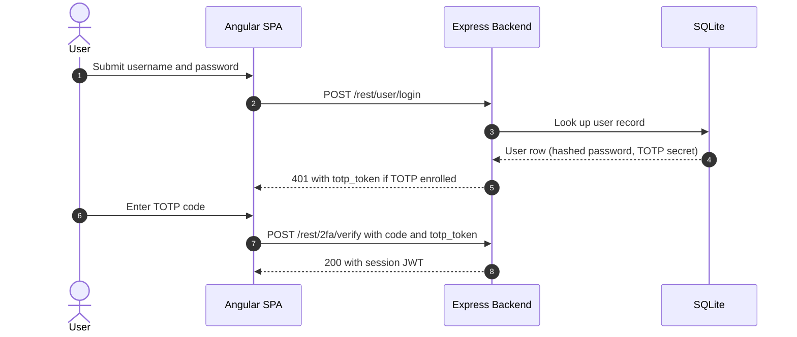

**Security assessment**

Two weaknesses reduce the 2FA control to partial:

- `routes/login.ts:38` returns a distinct response when the password is correct but TOTP is pending - an attacker can use this to confirm that a credential pair is valid before ever supplying a second factor (credential oracle, 🟡 [F-051](#f-051) — Credential validity oracle before 2FA).
- TOTP is opt-in and is not enforced for admin accounts, so the highest-privilege sessions operate on a single factor.

**Relevant findings**

- 🔴 [F-007](#f-007) — Insecure JWT Verification — Algorithm-pinning gap means the session JWT issued after 2FA can be forged without knowing the 2FA secret.
- 🟠 [F-013](#f-013) — Weak password recovery mechanism — The account-recovery path (security questions) bypasses 2FA entirely.
- 🔴 [F-015](#f-015) — Unvalidated OAuth token — The OAuth path enters the session flow without a 2FA step.

<a id="password-based-login"></a>
#### 6.2.2 Password-Based Login

**Status:** 🔴 Unsafe - `routes/login.ts` builds the login SQL query by interpolating `req.body.email` directly into a raw string, bypassing Sequelize parameter binding and allowing authentication bypass via SQL injection.

Detected in scope: POST `/rest/user/login`

The diagram shows the intended login flow from credential submission to session issuance:

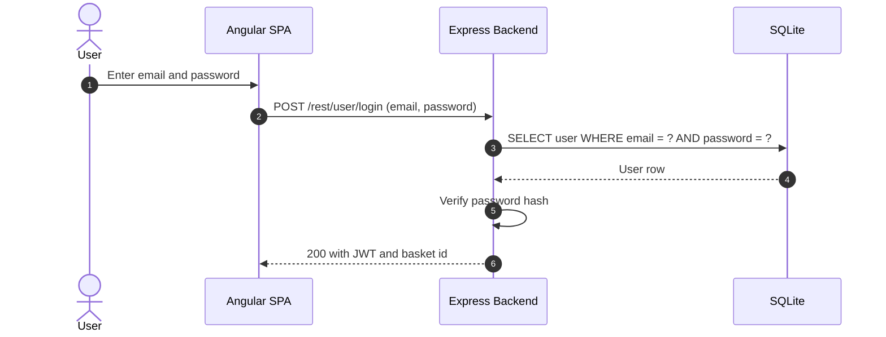

**Security assessment**

Two independent weaknesses sit on the login path:

- `routes/login.ts` interpolates `req.body.email` into a raw `models.sequelize.query()` call - submitting `' OR 1=1--` as the email returns the first database row (the seeded admin account) and authenticates without a password.
- No rate limit protects `POST /rest/user/login`, enabling unlimited credential-stuffing or brute-force attempts.

**Relevant findings**

- 🔴 [F-008](#f-008) — SQL injection in login query — SQL injection in the login query allows authentication bypass without knowing a valid password.
- 🟠 [F-013](#f-013) — Weak password recovery mechanism — The password-reset flow shares the same weak credential-identity model.
- 🟠 [F-014](#f-014) — Long-lived registry publish credential — Missing brute-force protection on the login endpoint enables offline password guessing at network speed.
- 🟠 [F-016](#f-016) — Predictable derived credential — Predictable credential derivation in the OAuth adapter maps into the same login endpoint.
- 🟠 [F-018](#f-018) — Hard-coded seeded account credentials — Hardcoded credentials in `login.component.ts` bypass the login check for demo accounts.

<a id="user-registration"></a>
#### 6.2.3 User Registration

**Status:** 🔴 Unsafe - `POST /api/Users` accepts a `role` field in the request body and persists it without sanitization, allowing any caller to self-assign the `admin` role.

Detected in scope: POST `/api/Users`

`finale-rest` exposes Sequelize models as REST endpoints. `POST /api/Users` creates a new user record from the JSON body. No field allowlist is applied before the record is written to SQLite.

The diagram shows the registration flow:

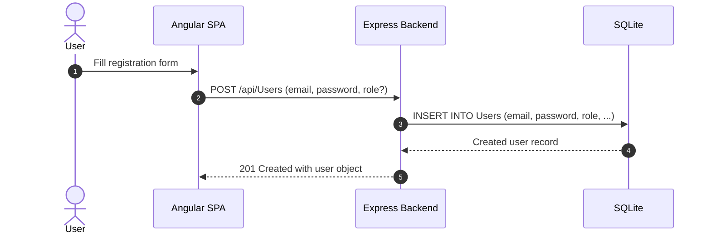

**Security assessment**

Three weaknesses span the registration boundary:

- `finale-rest` writes every field in the request body to the `Users` table - including `role: admin` - because no attribute allowlist strips privileged columns before the INSERT.
- `registerWebsocketEvents.ts:50` makes a server-side security decision based on a client-supplied value without server-side re-validation.
- `registerWebsocketEvents.ts:46` compiles a user-controlled regex on each connection, enabling ReDoS with a crafted pattern.

**Relevant findings**

- 🔴 [F-012](#f-012) — Mass assignment of role on registration — Mass assignment of `role` on the Users endpoint grants admin privileges to any registrant.
- 🟠 [F-014](#f-014) — Long-lived registry publish credential — No rate limit on registration enables account enumeration and bulk account creation.
- 🟠 [F-023](#f-023) — Client-trusted security decision — The WebSocket handler trusts a client-supplied flag for a server-side access decision.
- 🟠 [F-030](#f-030) — Unauthenticated data exposure — Unauthenticated callers receive data from the WebSocket channel before authentication completes.
- 🟠 [F-035](#f-035) — Inefficient regex complexity — User-controlled input reaches a regex engine without length or complexity constraints, enabling ReDoS.

<a id="password-reset"></a>
#### 6.2.4 Password Reset

**Status:** 🔴 Unsafe - the reset flow authenticates identity through security questions whose answers are publicly guessable from user profile data, with no rate limit on the reset endpoint.

Detected in scope: POST `/rest/user/reset-password`

`POST /rest/user/reset-password` accepts an email and a security question answer; if the answer matches the stored value, it sets a new password. No token or out-of-band channel (email link, SMS) is involved - the reset is complete in a single unauthenticated HTTP request.

The diagram shows the intended reset flow:

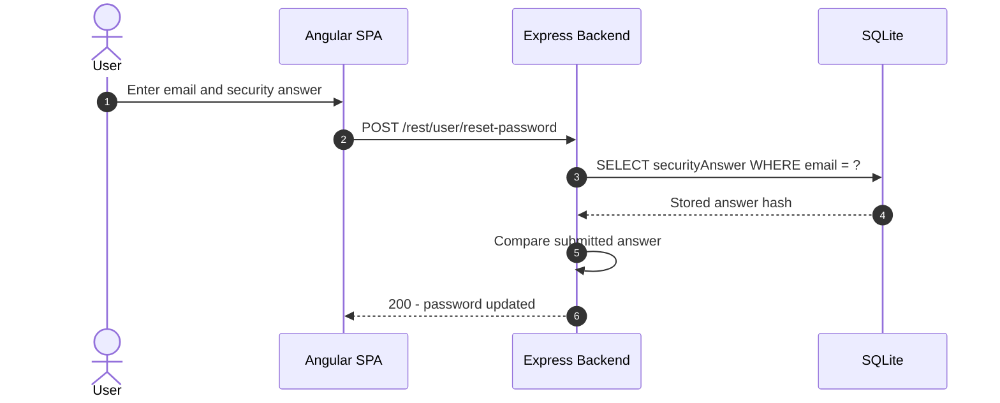

**Security assessment**

The reset relies entirely on security questions. Answers to questions like "Mother's maiden name?" or pet names are derivable from public social-media profiles. An attacker who knows the target's email can exhaust guesses without restriction - there is no lockout or CAPTCHA on the endpoint.

**Relevant findings**

- 🟠 [F-013](#f-013) — Weak password recovery mechanism — Security-question answers are guessable from public profile data, making password reset a credential-bypass vector for any user whose profile is semi-public.

<a id="social-login"></a><a id="social-login-oauth-oidc"></a>
#### 6.2.5 Social Login

**Status:** 🔴 Unsafe - `oauth.component.ts` reads the access token from the URL redirect without server-side verification, then derives a deterministic local password from the user's email - an attacker who knows the email can compute the credential and log in without ever touching Google.

Detected in scope: frontend/src/app/oauth

The OAuth flow is implemented as a frontend adapter, not a server-side authorization-code exchange. `oauth.component.ts` reads the Google access token from the redirect URL and calls Google's userinfo endpoint to retrieve the email. It then derives a local password using a predictable hash function and calls `POST /rest/user/login` with those derived credentials.

The diagram shows how the frontend adapter enters the local login flow:

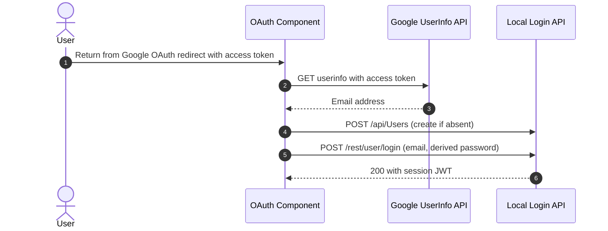

**Security assessment**

Two independent failures in the adapter:

- `oauth.component.ts:28` passes the Google access token directly to `UserService.oauthLogin()` with no state parameter, nonce, or CSRF protection - an attacker who intercepts or forges the redirect can replay the token.
- Line 30 derives the local password deterministically from the email address using a function documented in `lib/insecurity.ts` - knowing the target's email is sufficient to compute the credential and authenticate without Google involvement.

**Relevant findings**

- 🔴 [F-015](#f-015) — Unvalidated OAuth token — The access token from the OAuth redirect is used without server-side verification, making it trivially replaceable.
- 🟠 [F-016](#f-016) — Predictable derived credential — The deterministic local credential derived from the email allows account takeover for any OAuth user without interacting with the OAuth provider.

### 6.3 Session and Token Controls

<a id="ctrl-session-and-token-controls"></a>

**Dependent crossings:** [tb-1](#tb-1) refuted - 🔴 [F-007](#f-007) — Insecure JWT Verification, 🟠 [F-017](#f-017) — Unauthenticated WebSocket Channel, 🟠 [F-027](#f-027) — HTTP access logs browsable without authentication (`server.ts:281`), +1 · [tb-2](#tb-2) refuted - 🔴 [F-006](#f-006) — Hard-coded JWT signing key (`lib/insecurity.ts:21`), 🔴 [F-007](#f-007) — Insecure JWT Verification

**Verdict:** 🔴 Unsafe

<!-- The line below is mechanically derived from the controls table — LLM must not re-author it. -->
**Controls covered:**

- [6.3.1 Session Token Signing](#631-session-token-signing)
- [6.3.2 Session Token Storage and Cookie Hardening](#632-session-token-storage-and-cookie-hardening)

**Implemented controls:** `lib/insecurity.ts:21`,54; `routes/login.ts:18`; `frontend/src/app/Services/request.interceptor.ts:13`.

**Assessment:** A single locally-signed JWT covers every authenticated session regardless of which login flow in [§6.2](#62-identity-and-authentication-controls) established it. Both catalogued controls are defeated: the signing key is hardcoded in source and the token is stored in `localStorage` where any XSS payload can read it.

<a id="session-token-signing"></a><a id="session-token-signing-jwt-based"></a>
#### 6.3.1 Session Token Signing

**Status:** 🔴 Unsafe - the `RS256` private key is committed to the public repository as a string literal at `lib/insecurity.ts:21`, and the verification middleware does not restrict the accepted algorithm, so tokens with `alg:none` are accepted.

`lib/insecurity.ts:21`,54; `routes/login.ts:18`

`RS256`-signed JWTs are issued at `lib/insecurity.ts:54` after successful login and returned in the login response. The signing key is read from `lib/insecurity.ts:21` at module load time and reused for every token issued.

**Security assessment**

Two independent failures break the signing boundary:

- `lib/insecurity.ts:21` stores the RSA private key as a multi-line string literal committed to the public GitHub repository - anyone with repository read access can sign arbitrary tokens accepted by the server.
- `express-jwt@0.1.3` at `lib/insecurity.ts:52` is called without the `algorithms` option, so a token whose header declares `alg:none` bypasses signature verification entirely.

**Relevant findings**

- 🟠 [F-002](#f-002) — JWT in localStorage — JWT stored in `localStorage` means a forged token retrieved via XSS is immediately usable against the API.
- 🟡 [F-042](#f-042) — Missing session token revocation — Algorithm confusion allows a forged unsigned token to pass the verification middleware.
- 🟡 [F-057](#f-057) — Session cookie without HttpOnly — The session cookie set alongside the JWT lacks `HttpOnly`, widening the XSS-to-session-theft surface.

<a id="session-token-storage-and-cookie-hardening"></a>
#### 6.3.2 Session Token Storage and Cookie Hardening

**Status:** 🟡 Partial - `request.interceptor.ts:13` stores the JWT in `localStorage` (readable by same-origin scripts) and the session cookie at `login.component.ts:104` is missing the `HttpOnly` flag.

After login, `request.interceptor.ts:13` stores the session JWT in browser `localStorage` and attaches it as an `Authorization: Bearer` header on every subsequent API request. A cookie-based session is also set in some flows for server-side access control.

**Security assessment**

Two weaknesses on the storage boundary:

- `localStorage` is accessible to any JavaScript running in the same origin - any XSS payload on the Angular SPA reads the token and replays it against the REST API for the full lifetime of the session.
- The cookie set at `login.component.ts:104` lacks the `HttpOnly` attribute, making it readable by the same XSS payload and providing no fallback isolation.

**Relevant findings**

- 🟠 [F-002](#f-002) — JWT in localStorage — JWT in `localStorage` allows any XSS exploit to exfiltrate the session token without browser restriction.
- 🟡 [F-042](#f-042) — Missing session token revocation — A forged token passed via `localStorage` injection is accepted by the verification middleware due to the algorithm gap.
- 🟡 [F-057](#f-057) — Session cookie without HttpOnly — Session cookie without `HttpOnly` compounds `localStorage` exposure — both token stores are readable by a single XSS payload.

The diagram shows the token lifecycle from issuance through browser storage and bearer presentation to server-side validation:

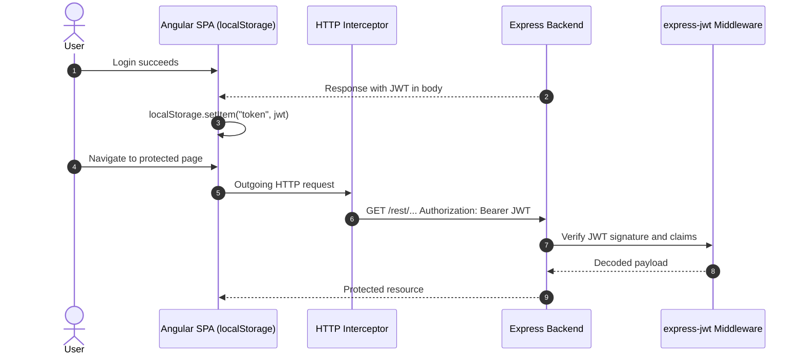

### 6.4 Authorization Controls

<a id="ctrl-authorization-controls"></a>

**Dependent crossings:** [tb-1](#tb-1) refuted - 🟠 [F-065](#f-065) — Basket item update without ownership check · [tb-3](#tb-3) unconfirmed - 🟠 [F-041](#f-041) — Missing workflow permissions block


**Systemic weaknesses:** [W-002](#w-002)
**Verdict:** 🟠 Weak

<!-- The line below is mechanically derived from the controls table — LLM must not re-author it. -->
**Controls covered:**

- [6.4.1 Centralized Authorization Policy](#641-centralized-authorization-policy)
- [6.4.2 Object-Level Ownership Check](#642-object-level-ownership-check)
- [6.4.3 Management Endpoint Protection](#643-management-endpoint-protection)

**Implemented controls:** `server.ts` (route registrations); `server.ts`; `server.ts:606-607`.

**Assessment:** `Authorization` is route-level and inconsistent. `server.ts` registers each route individually with or without `express-jwt` middleware; there is no central policy object or framework-level authorization layer. Angular route guards protect the admin UI but have no server-side counterpart. Object-level ownership is not checked on basket, order, or profile endpoints - any authenticated user can read or modify any other user's data by guessing the resource ID.

<a id="centralized-authorization-policy"></a>
#### 6.4.1 Centralized Authorization Policy

**Status:** 🟠 Weak - `server.ts` attaches `express-jwt` per-route at registration time, but no shared policy object governs which roles can access which operations, and several routes skip the middleware.

`server.ts` (route registrations)

`server.ts` is the single point where routes are registered and middleware is optionally attached. The `express-jwt` middleware at `lib/insecurity.ts:52` is applied to most `/api/` and `/rest/` routes; role checks beyond "authenticated vs. not" are performed inline in individual route handlers.

**Security assessment**

No shared authorization policy exists. Role decisions are scattered across handlers with no auditable mapping between operation and required role. `PUT /api/Products` is registered without authentication middleware, allowing unauthenticated callers to modify product records. Angular route guards at the frontend enforce role-based navigation but are bypassed by direct API calls.

**Relevant findings**

- 🟠 [F-003](#f-003) — Client-side authorization decision — Missing server-side authorization on the product update route allows unauthenticated modification.
- 🟡 [F-005](#f-005) — Unmediated data-store access control — Client-side-only route guards leave the underlying API endpoints unprotected.
- 🔴 [F-009](#f-009) — Insecure Direct Object Reference — Inconsistent middleware attachment across route registrations leaves privilege escalation paths open.

<a id="object-level-ownership-check"></a><a id="object-level-ownership-check-bolaidor"></a>
#### 6.4.2 Object-Level Ownership Check

**Status:** 🟠 Weak - basket, order, and user-data endpoints accept any resource ID from the request path without verifying that the authenticated user owns that object.

Object-level authorization ensures that a user can only access or modify their own records - orders, baskets, saved addresses - even when they have a valid session token. The basket endpoint at `/rest/basket/:id` returns cart contents for any numeric basket ID.

**Security assessment**

`/rest/basket/:id` returns the full basket contents for any ID passed in the URL. No check compares `req.user.bid` from the JWT against the `:id` parameter - a signed-in customer increments the ID to read other customers' baskets and order histories. The same pattern applies to several `/api/Users/:id` sub-routes.

**Relevant findings**

- 🟠 [F-003](#f-003) — Client-side authorization decision — Authorization bypass on the basket endpoint exposes other customers' order data without ownership verification.
- 🟡 [F-005](#f-005) — Unmediated data-store access control — Missing ownership check on user-profile endpoints allows reading and modifying any account by guessing the numeric user ID.
- 🔴 [F-009](#f-009) — Insecure Direct Object Reference — The pattern of ID-based access with no ownership comparison recurs across multiple endpoints, indicating a structural gap rather than an isolated bug.

<a id="management-endpoint-protection"></a>
#### 6.4.3 Management Endpoint Protection

**Status:** 🟡 Partial - the `/administration` Angular route is guarded on the frontend, but the underlying admin API endpoints at `/rest/admin/` lack server-side role enforcement beyond authentication.

Administrative functions - user management, coupon operations, challenge status - appear in the `/administration` Angular route. `server.ts:606-607` applies `express-jwt` to the `/rest/admin/` prefix, requiring a valid token.

**Security assessment**

A valid session token is required to reach `/rest/admin/` endpoints, but the backend does not check that the token's `role` claim equals `admin`. Any authenticated user who calls those endpoints directly - bypassing the Angular route guard - receives the admin responses. Admin-role tokens are obtainable via the mass-assignment registration gap (🔴 [F-012](#f-012) — Mass assignment of role on registration).

**Relevant findings**

- 🟠 [F-003](#f-003) — Client-side authorization decision — Unauthenticated product-modification paths signal that the role enforcement gap extends beyond the admin prefix.
- 🟡 [F-005](#f-005) — Unmediated data-store access control — Frontend-only role guards provide no server-side protection against direct API access by a normal-role session.
- 🔴 [F-009](#f-009) — Insecure Direct Object Reference — A user who self-assigns `role: admin` during registration passes the token check and accesses all admin endpoints without restriction.

### 6.5 Query Construction and Data Access Controls

<a id="ctrl-query-construction-and-data-access-controls"></a>

**Dependent crossings:** [tb-4](#tb-4) refuted - 🔴 [F-008](#f-008) — SQL injection in login query


**Systemic weaknesses:** [W-001](#w-001)
**Verdict:** 🟠 Weak

<!-- The line below is mechanically derived from the controls table — LLM must not re-author it. -->
**Controls covered:**

- [6.5.1 SQL Injection Prevention via Parameterized Queries](#651-sql-injection-prevention-via-parameterized-queries)

**Implemented controls:** `models/index.ts`; `routes/login.ts:11`.

**Assessment:** Sequelize ORM backs the majority of data reads with parameterized queries; the login and search routes are deliberate exceptions that call raw `models.sequelize.query()` with user-controlled input concatenated into the SQL string. As the highest-traffic unauthenticated entry points, these two routes are the highest-priority injection targets.

<a id="sql-injection-prevention-via-parameterized-queries"></a>
#### 6.5.1 SQL Injection Prevention via Parameterized Queries

**Status:** 🟡 Partial - Sequelize model-layer queries use bound parameters throughout, but `routes/login.ts` and the product-search route bypass the ORM and build SQL strings by concatenating user-supplied values.

Sequelize models at `models/index.ts` define typed associations and handle most SELECT, INSERT, and UPDATE operations through auto-generated parameterized queries. Most API routes read data exclusively through these model methods.

**Security assessment**

Two routes call `models.sequelize.query()` directly with user-controlled input interpolated into the SQL string, bypassing `Sequelize` parameterization:

- `routes/login.ts:11` concatenates `req.body.email` - submitting `' OR 1=1--` as the email returns the seeded admin row without a password.
- The product search route concatenates the search term in the same pattern, enabling data exfiltration from the `Products` table.

**Relevant findings**

- 🔴 [F-008](#f-008) — SQL injection in login query — SQL injection at the login query enables authentication bypass and full `Users` table read access.
- 🔴 [F-019](#f-019) — NoSQL \$where JavaScript injection — SQL injection in the product-search query allows reading arbitrary rows from the SQLite database.

### 6.6 Input Boundary Validation Controls

<a id="ctrl-input-boundary-validation-controls"></a>

**Dependent crossings:** [tb-1](#tb-1) refuted - 🔴 [F-012](#f-012) — Mass assignment of role on registration, 🟠 [F-023](#f-023) — Client-trusted security decision (`registerWebsocketEvents.ts:50`), 🔴 [F-043](#f-043) — Wallet identity accepted without proof of possession (`routes/web3Wallet.ts:16`), +1 · [tb-2](#tb-2) unconfirmed - 🔴 [F-008](#f-008) — SQL injection in login query · [tb-3](#tb-3) unconfirmed - 🔴 [F-010](#f-010) — Dependency lockfile disabled by config — .npmrc:1


**Systemic weaknesses:** [W-009](#w-009)
**Verdict:** 🟠 Weak

<!-- The line below is mechanically derived from the controls table — LLM must not re-author it. -->
**Controls covered:**

- [6.6.1 Validation Approach](#661-validation-approach)
- [6.6.2 Schema and Allowlist Input Validation](#662-schema-and-allowlist-input-validation)

**Implemented controls:** `server.ts:204`,246,411-413.

**Assessment:** A JSON body parser and a request-size cap are applied globally at `server.ts:204,246`. Upload routes at lines 411-413 add MIME-type and file-size constraints via `multer`. Beyond those, validation is ad-hoc per route - no framework-level schema enforces allowed fields or value shapes across the API surface, leaving mass-assignment and injection vectors open.

<a id="validation-approach"></a>
#### 6.6.1 Validation Approach

**Status:** 🟠 Weak - input validation is performed inline in individual route handlers with no shared schema library; the approach produces inconsistent coverage and leaves most endpoints without field-level constraints.

Input validation limits which values and structures a request body or path parameter may carry. `server.ts` applies a global JSON body parser and a request-size cap before routing. Some routes add per-field regex or length checks inline in the handler function.

**Security assessment**

No shared validation framework (`Joi`, `express-validator`, `Zod`) is applied at the router level. Per-route inline checks are inconsistent - most endpoints accept arbitrary JSON bodies. `registerWebsocketEvents.ts:46` compiles a user-supplied string as a regex on every WebSocket connection, enabling ReDoS with a crafted pattern that causes exponential backtracking and blocks the event loop.

**Relevant findings**

- 🟠 [F-034](#f-034) — Unbounded LLM consumption on `/rest/chat` — Missing input length constraints on user-controlled fields enable oversized payloads to reach downstream handlers.
- 🟡 [F-061](#f-061) — Unbounded in-memory session map — Absence of schema validation on the order and feedback endpoints allows unexpected fields that exploit mass-assignment.
- 🟡 [F-062](#f-062) — Unbounded CI matrix fan-out — Regex ReDoS at `registerWebsocketEvents.ts:46` is a direct consequence of compiling user-controlled patterns without a length or complexity guard.

<a id="schema-and-allowlist-input-validation"></a>
#### 6.6.2 Schema and Allowlist Input Validation

**Status:** 🟡 Partial - `server.ts:204,246,411-413` applies content-type and size limits, and `multer` constrains file uploads, but field-level allowlists are absent from the majority of API endpoints.

`server.ts:204` limits JSON body size and `server.ts:246` applies a raw-body cap. Upload routes at lines 411-413 use `multer` to restrict accepted MIME types to images and limit file size before the route handler runs.

**Security assessment**

`multer` constraints are the strongest validation in the codebase, and they apply only to the upload routes. All other endpoints accept arbitrary JSON bodies via `finale-rest` model exposure - no attribute allowlist strips privileged columns (e.g. `role`, `isAdmin`) before the record is written. The gap enables mass-assignment across every model-backed endpoint.

**Relevant findings**

- 🟠 [F-034](#f-034) — Unbounded LLM consumption on `/rest/chat` — Absence of field-level allowlisting on model-backed endpoints allows privileged attribute injection.
- 🟡 [F-061](#f-061) — Unbounded in-memory session map — Unvalidated body fields on the order endpoint accept attacker-controlled data that reaches downstream business logic.
- 🟡 [F-062](#f-062) — Unbounded CI matrix fan-out — Schema-level enforcement is absent from the feedback and coupon endpoints, allowing parameter injection that the route handler does not anticipate.

### 6.7 Output Encoding and Rendering Controls


**Systemic weaknesses:** [W-011](#w-011)
**Verdict:** 🔴 Unsafe

<!-- The line below is mechanically derived from the controls table — LLM must not re-author it. -->
**Controls covered:**

- [6.7.1 Angular Template Sanitization and XSS Prevention](#671-angular-template-sanitization-and-xss-prevention)

**Implemented controls:** `frontend/src/app/search-result/search-result.component.ts:110`,143; `frontend/src/app/about/about.component.ts:119`; `frontend/src/app/administration/administration.component.ts:73`,91.

**Assessment:** Angular's default template escaping is present and active for most bindings throughout the SPA. Four explicit `bypassSecurityTrustHtml` calls in three components deliberately disable that protection for user-controlled values, creating reflected and stored XSS sinks that any attacker-controlled input can reach.

<a id="angular-template-sanitization-and-xss-prevention"></a>
#### 6.7.1 Angular Template Sanitization and XSS Prevention

**Status:** 🔴 Unsafe - `bypassSecurityTrustHtml()` is called on URL query parameters and backend-supplied content in three components, overriding Angular's default escaping and rendering attacker-controlled markup as live HTML.

Angular's `DomSanitizer` escapes all template-bound values by default. Most of the SPA relies on standard template bindings (`{{ value }}` and `[textContent]`) that the compiler sanitizes automatically.

**Security assessment**

Four `bypassSecurityTrustHtml` calls across three components override the default escaping:

- `search-result.component.ts:143` marks the `q` URL query parameter as trusted HTML - a crafted search URL executes arbitrary JavaScript in the victim's session and can exfiltrate the JWT from `localStorage`.
- `search-result.component.ts:110` marks every backend-supplied product description as trusted - a stored XSS payload in any product description executes for every customer who browses the catalogue.
- `about.component.ts:119` trusts the about-page content fetched from the API.
- `administration.component.ts:73,91` trusts admin-displayed user-generated content in two separate bindings.

**Relevant findings**

- 🔴 [F-001](#f-001) — Cross-Site Scripting — Reflected XSS via the `q` URL parameter allows session theft for any signed-in user who follows a crafted link.
- 🟡 [F-049](#f-049) — Unescaped anchor persisted into product description — Stored XSS via product descriptions executes for every shopper who views the search results or catalogue page.

### 6.8 Browser and Cross-Origin Controls

**Verdict:** 🟠 Weak

<!-- The line below is mechanically derived from the controls table — LLM must not re-author it. -->
**Controls covered:**

- [6.8.1 CORS and WebSocket Origin Enforcement](#681-cors-and-websocket-origin-enforcement)

**Implemented controls:** `lib/startup/registerWebsocketEvents.ts:20`.

**Assessment:** An origin check at `registerWebsocketEvents.ts:20` gates WebSocket connections. Two gaps remain:

- The Express HTTP API has no explicit CORS configuration; browser same-origin policy applies by default - adequate for a same-origin SPA but leaving no auditable header.
- No `Content-Security-Policy` header is set on any response, leaving XSS payloads free to load external scripts and exfiltrate data.

<a id="cors-and-websocket-origin-enforcement"></a>
#### 6.8.1 CORS and WebSocket Origin Enforcement

**Status:** 🟡 Partial - WebSocket origin enforcement is in place at `registerWebsocketEvents.ts:20`, but HTTP CORS headers are absent and no `Content-Security-Policy` restricts external script loading.

Cross-origin policy controls which third-party origins may read API responses and which scripts a browser will execute. `lib/startup/registerWebsocketEvents.ts:20` checks the `Origin` header on WebSocket upgrade requests and closes connections from unexpected origins before the event handler runs.

**Security assessment**

Two gaps in the browser policy surface:

- The Express HTTP API sets no `Access-Control-Allow-Origin` header. The browser enforces same-origin policy by default, but the absence of an explicit CORS policy means any future API key or credential-in-URL pattern would be silently cross-origin readable.
- No `Content-Security-Policy` header is served on any HTTP response. Any XSS payload in the SPA may load external scripts, beacon data to attacker-controlled servers, or read the `localStorage` JWT without browser restriction.

**Relevant findings**

- 🟡 [F-045](#f-045) — Cookie-only authentication on POST `/profile` — Missing Content-Security-Policy allows XSS payloads to load and execute arbitrary external scripts in the victim's browser.
- 🟡 [F-048](#f-048) — Missing Content-Security-Policy — The absence of explicit CORS configuration leaves the origin policy implicit and unauditable.

### 6.9 Cryptography Secrets and Data Protection


**Systemic weaknesses:** [W-004](#w-004), [W-008](#w-008)
**Verdict:** 🔴 Unsafe

<!-- The line below is mechanically derived from the controls table — LLM must not re-author it. -->
**Controls covered:**

- [6.9.1 Managed Secret Storage](#691-managed-secret-storage)
- [6.9.2 Transport Layer Encryption](#692-transport-layer-encryption)

**Implemented controls:** `lib/insecurity.ts:21`; `routes/checkKeys.ts:10`; `server.ts` (plain HTTP binding).

**Assessment:** Three secrets used by every authenticated session - the RSA signing key, the HMAC basket secret, and the cookie secret - are committed as string literals to the public repository. TLS is absent from the application's own binding; the server listens on plain HTTP and relies on an external proxy that is not evidenced in the codebase. Both controls exist in form but are defeated in practice.

<a id="managed-secret-storage"></a>
#### 6.9.1 Managed Secret Storage

**Status:** 🔴 Unsafe - the RSA private key, HMAC secret, and cookie secret are hardcoded at `lib/insecurity.ts:21` and committed to the public repository; no runtime injection or rotation mechanism exists.

⚠ **Anti-pattern:** Secrets hardcoded in source

`lib/insecurity.ts` centralizes three secrets consumed at startup: the `RS256` private key used to sign every session JWT, an HMAC key used to sign basket IDs, and a cookie-session secret. `routes/checkKeys.ts:10` reads these values at boot time. All three are plain string literals in the source file.

**Security assessment**

Two compounding failures make the secret-storage control fully defeated:

- `lib/insecurity.ts:21` stores the RSA private key as a committed string literal in a public repository - the key has been public since the repo was created, making every JWT ever issued by this application forgeable by anyone with repository access.
- No environment variable injection, vault integration, or Secrets Manager reference is present; secrets are identical across every deployment and cannot be rotated without a code change and re-deployment.

**Relevant findings**

- 🔴 [F-006](#f-006) — Hard-coded JWT signing key — The hardcoded RSA private key allows offline JWT forgery for any user or role without server interaction.
- 🟠 [F-018](#f-018) — Hard-coded seeded account credentials — Hardcoded credentials in login-related source files extend the secret-exposure surface beyond the signing key.
- 🟠 [F-020](#f-020) — Non-cryptographic RNG for a secret/token — Additional hardcoded values discovered in the codebase confirm the pattern is systemic rather than isolated.

<a id="transport-layer-encryption"></a><a id="transport-layer-encryption-tls"></a>
#### 6.9.2 Transport Layer Encryption

**Status:** 🟡 Partial - `server.ts` binds only to plain HTTP via `http.createServer()`; TLS termination is absent from the application and relies on an external proxy not evidenced in the repository.

`server.ts` creates and starts the HTTP server, binding the Express application to a TCP port.

**Security assessment**

`server.ts` calls `http.createServer()` - no `https.createServer()` call, no TLS certificate loading, no `http2` configuration. Every credential, JWT, and customer record sent between the browser and the API travels over plaintext HTTP unless a TLS-terminating reverse proxy sits in front of the application. No such proxy configuration (nginx, Caddy, AWS ALB, etc.) is committed to the repository.

**Relevant findings**

- 🔴 [F-006](#f-006) — Hard-coded JWT signing key — Credentials and hardcoded signing material transmitted over plain HTTP can be intercepted by a network observer.
- 🟠 [F-018](#f-018) — Hard-coded seeded account credentials — Hardcoded secrets sent in-band are captured in full by any traffic intercept against the plain-HTTP binding.
- 🟠 [F-020](#f-020) — Non-cryptographic RNG for a secret/token — Sensitive application values exposed over an unencrypted channel compound the key-management exposure.

### 6.10 File Parser and Outbound Request Controls

<a id="ctrl-file-parser-and-outbound-request-controls"></a>

_No trust boundary in this model depends on this control class._


**Systemic weaknesses:** [W-007](#w-007)
**Verdict:** 🟠 Weak

<!-- The line below is mechanically derived from the section's default mechanism — LLM must not re-author it. -->
**Controls covered:**

- [6.10.1 File Parser and Outbound Request Handling](#6101-file-parser-and-outbound-request-handling)

**Implemented controls:** `multer` file-size and MIME-type limits on upload routes; `unzipper` archive extraction; `libxmljs2` XML parser; static `ftp/` directory served by Express.

**Assessment:** Upload routes apply `multer` constraints that limit file size and restrict MIME types. `unzipper` handles archive extraction and `libxmljs2` handles XML parsing, but neither is configured with path-traversal or external-entity restrictions. Eleven findings are routed here; the dominant weaknesses are Zip Slip, XXE, and unauthenticated static-file exposure of the `ftp/` directory.

<a id="file-parser-and-outbound-request-handling"></a>
#### 6.10.1 File Parser and Outbound Request Handling

**Status:** 🟠 Weak - `multer` size and MIME limits protect the upload entry point, but `unzipper` extracts archive entries without path-traversal checks and `libxmljs2` resolves external entities, enabling Zip Slip and XXE attacks.

File upload handling restricts which files users may submit to the application. `multer` is configured on the upload routes to enforce a file-size cap and an accepted MIME-type list before the uploaded data reaches the route handler. ZIP archives are extracted with `unzipper` and XML documents are parsed with `libxmljs2`.

**Security assessment**

Three distinct parser weaknesses sit behind the `multer` gate:

- `unzipper` extracts archive entries using the path embedded in each ZIP entry header without canonicalizing or bounding the destination - a ZIP file containing `../../server.js` as an entry name overwrites application files during extraction.
- `libxmljs2` is invoked with external-entity resolution enabled; a crafted XXE payload in an uploaded XML document reads arbitrary server-side files and returns their contents in the parsed document.
- The `ftp/` directory is mounted as an authenticated static tree that is accessible to any caller who can construct the URL, exposing previously uploaded files and generated reports.

**Relevant findings**

- 🔴 [F-011](#f-011) — Server-side eval of stored username — Archive extraction without path-traversal containment enables Zip Slip file overwrite.
- 🟠 [F-021](#f-021) — Input compiled as template source — XXE in the `libxmljs2` XML parser enables server-side file reads via external entity injection.
- 🟠 [F-026](#f-026) — Denylisted path traversal in erasure layout — Insecure direct file-path construction exposes server-side files via the download endpoint.
- 🟠 [F-028](#f-028) — Unvalidated URL fetch in profile image — The `ftp/` static directory is accessible to unauthenticated callers, exposing generated and uploaded files.
- 🟠 [F-029](#f-029) — Secrets broadcast to job environment — Additional outbound-request or parser weaknesses extend the attack surface beyond archive and XML inputs.

### 6.11 Operations Runtime and Supply Chain Controls


**Systemic weaknesses:** [W-003](#w-003)
**Verdict:** 🔴 Missing

<!-- The line below is mechanically derived from the controls table — LLM must not re-author it. -->
**Controls covered:**

- [6.11.1 Automated SCA scanning](#6111-automated-sca-scanning)
- [6.11.2 Automated dependency updates](#6112-automated-dependency-updates)
- [6.11.3 Lockfile hygiene](#6113-lockfile-hygiene)

**Implemented controls:** GitHub Actions CI pipeline runs test and build jobs; `package.json` declares npm dependencies; Docker image is used for containerized deployments.

**Assessment:** The CI pipeline builds and tests the application but runs no software composition analysis step. Neither Dependabot nor Renovate is configured. `package-lock.json` is absent from the repository, making installs non-deterministic. Known-vulnerable packages including `express-jwt@0.1.3` and `libxmljs2@0.30` have shipped in this state for an extended period with no automated detection mechanism.

<a id="automated-sca-scanning"></a>
#### 6.11.1 Automated SCA scanning

**Status:** 🔴 Missing - no `npm audit`, Snyk scan, or equivalent SCA step runs in the GitHub Actions CI pipeline; known-vulnerable packages ship without any automated gate.

The GitHub Actions CI pipeline runs lint, test, and build jobs. Software composition analysis checks installed packages against public vulnerability databases and blocks builds or raises alerts when known-vulnerable versions are detected.

**Security assessment**

None of the CI workflow files include an `npm audit`, `snyk test`, or OWASP Dependency-Check step. `express-jwt@0.1.3` carries a publicly documented algorithm-confusion vulnerability that would be flagged by any SCA tool, yet it has shipped without detection. The same applies to `libxmljs2@0.30`, which has known XXE-related advisories.

**Relevant findings**

- 🟡 [F-004](#f-004) — Missing server-side security audit logging — A known-vulnerable dependency version is present in `package.json` with no CI gate to detect or block it.
- 🔴 [F-010](#f-010) — Dependency lockfile disabled by config — Additional outdated packages with public CVEs are installed without any automated scanning coverage.
- 🟠 [F-027](#f-027) — HTTP access logs browsable without authentication — Supply-chain risk from unscanned transitive dependencies compounds the direct-dependency exposure.

<a id="automated-dependency-updates"></a>
#### 6.11.2 Automated dependency updates

**Status:** 🔴 Missing - no Dependabot or Renovate configuration is present in the repository; dependency versions are pinned manually and have not been updated to address known vulnerabilities.

Automated update tooling raises pull requests when newer versions of direct or transitive dependencies become available. GitHub Dependabot and Renovate are the two dominant options for npm projects.

**Security assessment**

Neither `.github/dependabot.yml` nor `renovate.json` exists. `express-jwt@0.1.3` is superseded by versions that pin the accepted algorithm by default; no automated tool prompts an upgrade. `libxmljs2` has patched releases available that are never pulled in.

**Relevant findings**

- 🟡 [F-004](#f-004) — Missing server-side security audit logging — `express-jwt@0.1.3` remains in use because no automated mechanism has raised an update PR since its vulnerability was disclosed.
- 🔴 [F-010](#f-010) — Dependency lockfile disabled by config — Additional stale packages persist for the same reason — manual update discipline alone is insufficient for a project of this dependency count.
- 🟠 [F-027](#f-027) — HTTP access logs browsable without authentication — Without update automation, transitive dependencies drift silently into vulnerable ranges over time.

<a id="lockfile-hygiene"></a>
#### 6.11.3 Lockfile hygiene

**Status:** 🔴 Missing - `package-lock.json` is absent from the repository; `npm install` resolves dependency versions non-deterministically from floating `semver` ranges on every build.

A committed lockfile pins the exact resolved version of every direct and transitive dependency, making builds reproducible and preventing a compromised package registry from serving a different version than the one audited. npm writes `package-lock.json` on first install when it does not exist.

**Security assessment**

`package-lock.json` is not committed and is absent from `.gitignore` as a deliberate inclusion. Each CI run and each developer install resolves `semver` ranges independently - a malicious package registry could serve a version within the declared range that differs from what was last tested. The absence of a lockfile also means `npm audit` output would vary between runs, making SCA results unreliable even if a step were added.

**Relevant findings**

- 🟡 [F-004](#f-004) — Missing server-side security audit logging — Non-deterministic installs mean the vulnerable `express-jwt@0.1.3` pin in `package.json` may drift further as patch versions are released without audit coverage.
- 🔴 [F-010](#f-010) — Dependency lockfile disabled by config — Floating transitive version ranges create a supply-chain substitution surface on every install.
- 🟠 [F-027](#f-027) — HTTP access logs browsable without authentication — Without a lockfile, verifying that a specific audited dependency tree was actually built is not possible from CI artifacts alone.

### 6.12 Real-time and Not Applicable Controls

**Verdict:** 🟡 Partial

<!-- The line below is mechanically derived from the controls table — LLM must not re-author it. -->
**Controls covered:**

- [6.12.1 LLM Prompt Injection Prevention](#6121-llm-prompt-injection-prevention)

**Implemented controls:** `routes/chat.ts:108`.

**Assessment:** `routes/chat.ts` serves a chat endpoint backed by an AI model; a keyword filter at line 108 attempts to reject prompt-injection payloads before they reach the model. The real-time channel runs on `Socket.IO`, wired in `lib/startup/registerWebsocketEvents.ts`; its security findings are routed to [§6.2](#62-identity-and-authentication-controls) and [§6.4](#64-authorization-controls). No finding was derived specifically for WebSocket message-injection or channel authorization beyond those sections.

<a id="llm-prompt-injection-prevention"></a>
#### 6.12.1 LLM Prompt Injection Prevention

**Status:** 🟡 Partial - `routes/chat.ts:108` applies a keyword filter before forwarding user messages to the AI model, but the filter is bypassable through encoding and character-substitution obfuscation.

The chatbot feature accepts user-supplied messages at `routes/chat.ts` and forwards them to an AI model. A keyword-based filter at line 108 inspects each message before dispatch, rejecting inputs that contain known prompt-injection trigger phrases.

**Security assessment**

Keyword filters are a weak defense against prompt injection because they match literal strings rather than semantic intent. Common obfuscation techniques - Unicode character substitution, zero-width character insertion, Base64 encoding, multilingual phrasing - bypass the filter and deliver the instruction to the model intact. No system-prompt isolation or instruction-hierarchy mechanism prevents user messages from overriding the model's operating context or extracting the system prompt.

**Relevant findings**

- No dedicated finding routed in this assessment.

### 6.13 Defense-in-Depth Summary

**Verdict:** -

The codebase carries a small set of positive controls that provide genuine layered protection where they apply:

- Angular's default template escaping is active for the majority of component bindings.
- `multer` enforces file-size and MIME-type limits on upload routes before data reaches the parser.
- `express-jwt` middleware provides a consistent token-verification boundary on most API routes.
- The WebSocket upgrade handler checks the `Origin` header before admitting connections.
- The `RS256` algorithm choice for JWT signing is structurally sound even though the private key is compromised.

Four structural gaps remain. First, move all secrets out of source into runtime-injected values - environment variables or a secrets manager - and pin the accepted JWT algorithm in `express-jwt`. Second, `replace` raw SQL concatenation at the login and search routes with `Sequelize` parameterized queries. Third, remove `bypassSecurityTrustHtml` calls on user-controlled values and restrict them to genuinely trusted static content. Fourth, add a committed `package-lock.json`, a Dependabot or Renovate configuration, and an `npm audit` or Snyk step to CI - these three together close the entire supply-chain gap.

<!-- enriched:thorough -->

---

<a id="weakness-register"></a>
## 7. Weakness Register

Systemic control gaps behind the findings, ordered by severity (W-001 = most severe). Each weakness names the missing, home-grown, or misused control, the findings that evidence it, the components it spans, and its remediation. A weakness may also rest on observed unsafe practice or an absent architectural control with no confirmed exploit - only confirmed findings carry a CVSS score.

- 🔴 **Critical** · [W-001](#w-001) - Database access relies on concatenated queries · confirmed · 1 finding · 3 components
- 🔴 **Critical** · [W-002](#w-002) - `Authorization` is implemented route by route · confirmed · 5 findings · 3 components
- 🔴 **Critical** · [W-003](#w-003) - Build pipeline trusts mutable third-party references · confirmed · 2 findings · 1 component
- 🔴 **Critical** · [W-004](#w-004) - Secrets are committed to source instead of a managed store · confirmed · 5 findings · 4 components
- 🟠 **High** · [W-005](#w-005) - Endpoints are reachable without enforced authentication · confirmed · 1 finding · 1 component
- 🟠 **High** · [W-006](#w-006) - Denial of Service is implemented inconsistently · confirmed · 2 findings · 3 components
- 🟠 **High** · [W-007](#w-007) - Input handling lacks enforced boundary validation · confirmed · 1 finding · 2 components
- 🟠 **High** · [W-008](#w-008) - Security-sensitive data uses weak cryptographic primitives · confirmed · 2 findings · 3 components
- 🟡 **Medium** · [W-009](#w-009) - Denial of Service is implemented inconsistently · confirmed · 3 findings · 5 components
- 🟡 **Medium** · [W-010](#w-010) - Injection is implemented inconsistently · observed-practice · 1 finding · 1 component
- 🟡 **Medium** · [W-011](#w-011) - Cross-Site Scripting is implemented inconsistently · observed-practice · 1 finding · 1 component
- 🟡 **Medium** · [W-012](#w-012) - Frontend rendering lacks enforced output encoding · design-risk · 0 findings · 0 components

<a id="w-001"></a>
### W-001 — Database access relies on concatenated queries

🔴 **Critical** · design weakness · confirmed · 1 finding

Database queries are assembled from application values instead of passing those values through an enforced parameterised data-access path. This leaves every call site responsible for preserving query structure.

**Architectural anti-pattern - Raw SQL string interpolation.** Login and search routes build database queries by concatenating untrusted input directly into query strings rather than using parameterized bindings, making the full database readable and writable without authentication.

**Confirmed findings:**

- 🔴 [F-008](#f-008) — SQL injection in login query

**Architecture evidence:** Parameterized Queries, ORM / Repository Layer

**Affected components:** [C-02](#c-02), [C-01](#c-01), backend-api

**Remediation:**

- **Structural** — provide one parameterised repository or query-builder path and prohibit application-value interpolation in database queries
- **Tactical** — ● [M-018](#m-018) — Use parameterized database queries

<a id="w-002"></a>
### W-002 — Authorization is implemented route by route

🔴 **Critical** · design weakness · confirmed · 5 findings

`Authorization` depends on per-handler checks instead of a policy boundary that consistently enforces role, ownership, and tenant scope. New routes can bypass protection by omitting a local check.

**Confirmed findings:**

- 🔴 [F-009](#f-009) — Insecure Direct Object Reference
- 🔴 [F-038](#f-038) — Coupon discount bounded only by prompt text (`routes/chat.ts:184`)
- 🔴 [F-039](#f-039) — Deluxe upgrade skips payment check (`routes/deluxe.ts:43`)
- 🟠 [F-040](#f-040) — Sensitive Routes Registered Without Authentication Middleware
- 🟠 [F-065](#f-065) — Basket item update without ownership check

**Architecture evidence:** Centralised AuthZ Policy, Role / Scope Enforcement, Ownership Check, Object-Level Ownership Check, Tenant Scoping

**Affected components:** [C-02](#c-02), [C-01](#c-01), [C-07](#c-07)

**Remediation:**

- **Structural** — enforce authorization through a shared server-side policy layer and make ownership and tenant scope mandatory inputs to data access
- **Tactical** — ◑ [M-001](#m-001) — Enforce object-level (ownership) authorization, ● [M-019](#m-019) — Enforce object-level (ownership) authorization, ◕ [M-048](#m-048) — Enforce correct server-side authorization, ◕ [M-049](#m-049) — Enforce correct server-side authorization, ◑ [M-004](#m-004) — Enforce server-side authorization on every endpoint, ◕ [M-050](#m-050) — Enforce server-side authorization on every endpoint, ◑ [M-075](#m-075) — Enforce object-level (ownership) authorization

<a id="w-003"></a>
### W-003 — Build pipeline trusts mutable third-party references

🔴 **Critical** · design weakness · confirmed · 2 findings

CI/CD workflows resolve third-party actions and other build dependencies to mutable tags or branches instead of immutable commit digests, so a retagged or compromised upstream runs inside the pipeline with its token and secret scope.

**Confirmed findings:**

- 🔴 [F-010](#f-010) — Dependency lockfile disabled by config
- 🟠 [F-022](#f-022) — Unpinned third-party action (`image_actions.yml:33`)

**Architecture evidence:** Commit-SHA Action Pinning, Dependency Provenance Verification

**Affected components:** [C-05](#c-05)

**Remediation:**

- **Structural** — pin every third-party action and build dependency to an immutable commit SHA (or a vetted internal mirror) and enforce SHA-pinning in CI
- **Tactical** — ● [M-020](#m-020) — Pin third-party dependencies to immutable versions, ◕ [M-032](#m-032) — Set least-privilege CI workflow permissions

<a id="w-004"></a>
### W-004 — Secrets are committed to source instead of a managed store

🔴 **Critical** · design weakness · confirmed · 5 findings

Cryptographic keys, credentials, and other high-entropy secrets are embedded as literals in source or `config` rather than resolved at runtime from a managed secret store, so anyone with repository read access obtains reusable signing material and credentials.

**Architectural anti-pattern - Secrets hardcoded in source.** The RSA private key used to sign all session tokens is a string literal in committed source code, meaning every developer, CI runner, and repository fork has permanent read access to the material needed to forge any user or administrator session.

**Confirmed findings:**

- 🔴 [F-006](#f-006) — Hard-coded JWT signing key (`lib/insecurity.ts:21`)
- 🟠 [F-018](#f-018) — Hard-coded seeded account credentials (`data/datacreator.ts:200`)
- 🔴 [F-031](#f-031) — Hard-coded wallet mnemonic (`routes/checkKeys.ts:10`)
- 🟡 [F-066](#f-066) — Security answers stored under embedded HMAC key (`data/datacreator.ts:691`)

**Practice sites:**

- 🔴 [F-056](#f-056) — Hard-coded test credential (`login.component.ts:62`) (`frontend/src/app/login/login.component.ts:62`)

**Architecture evidence:** Managed Secret Store, Runtime Secret Injection

**Affected components:** [C-02](#c-02), [C-01](#c-01), [C-03](#c-03), [C-07](#c-07)

**Remediation:**

- **Structural** — move every secret to a managed secret store or injected environment configuration, rotate the exposed values, and add secret-scanning to CI
- **Tactical** — ● [M-016](#m-016) — Move cryptographic keys to a managed secret store, ◑ [M-002](#m-002) — Move secrets to a managed secret store, ◕ [M-028](#m-028) — Move secrets to a managed secret store, ◕ [M-041](#m-041) — Move secrets to a managed secret store, ◑ [M-009](#m-009) — Move cryptographic keys to a managed secret store, ◑ [M-076](#m-076) — Move cryptographic keys to a managed secret store, ◑ [M-066](#m-066) — Move secrets to a managed secret store

<a id="w-005"></a>
### W-005 — Endpoints are reachable without enforced authentication

🟠 **High** · design weakness · confirmed · 1 finding

Sensitive API routes and real-time channels are exposed without an enforced authentication check at the endpoint boundary. Access control depends on each handler (or the caller) remembering to require a session, so an unauthenticated client can reach privileged operations directly.

**Confirmed findings:**

- 🟠 [F-017](#f-017) — Unauthenticated WebSocket Channel

**Architecture evidence:** Route Authentication Middleware, Server-Side Session Enforcement

**Affected components:** [C-06](#c-06)

**Remediation:**

- **Structural** — enforce authentication centrally at the routing and channel boundary so every exposed endpoint requires a verified session unless explicitly marked public
- **Tactical** — ◕ [M-027](#m-027) — Require authentication on every exposed endpoint

<a id="w-006"></a>
### W-006 — Denial of Service is implemented inconsistently

🟠 **High** · implementation weakness · confirmed · 2 findings

Resource-consuming operations lack rate limiting or bounds, so a single actor can exhaust capacity.

**Confirmed findings:**

- 🟠 [F-034](#f-034) — Unbounded LLM consumption on `/rest/chat` (`server.ts:638`)

**Practice sites:**

- 🟡 [F-061](#f-061) — Unbounded in-memory session map (`lib/insecurity.ts:74`)

**Affected components:** [C-02](#c-02), [C-01](#c-01), [C-07](#c-07)

**Remediation:**

- **Structural** — apply rate limiting, request quotas, and input-size bounds on resource-intensive endpoints
- **Tactical** — ◕ [M-044](#m-044) — Rate-limit and lock out repeated authentication attempts, ◑ [M-071](#m-071) — Rate-limit and lock out repeated authentication attempts

<a id="w-007"></a>
### W-007 — Input handling lacks enforced boundary validation

🟠 **High** · design weakness · confirmed · 1 finding

Request handlers do not validate input against one enforced server-side schema or allowlist at the boundary - validation is either absent on the vulnerable parameters or limited to rejecting selected bad patterns (a blacklist). New encodings and unanticipated input forms can therefore reach downstream parsers or interpreters.

**Confirmed findings:**

- 🟠 [F-026](#f-026) — Denylisted path traversal in erasure layout (`routes/dataErasure.ts:104`)

**Architecture evidence:** Schema Validation, Allowlist Validation

**Affected components:** [C-01](#c-01), backend-api

**Remediation:**

- **Structural** — enforce server-side schemas and domain-specific allowlists before input reaches parsing, persistence, or command construction
- **Tactical** — ◕ [M-036](#m-036) — Constrain file paths to a safe base directory

<a id="w-008"></a>
### W-008 — Security-sensitive data uses weak cryptographic primitives

🟠 **High** · implementation weakness · confirmed · 2 findings

Password, token, or integrity protection uses a weak hash, predictable random source, or insufficient work factor. The application may use a standard library, but the selected primitive does not provide the required security property.

**Confirmed findings:**

- 🟠 [F-025](#f-025) — Unsalted MD5 password hashing

**Practice sites:**

- 🟠 [F-020](#f-020) — Non-cryptographic RNG for a secret/token (`lib/insecurity.ts:53`) (`lib/insecurity.ts:53`)
- `data/datacreator.ts:313`

**Affected components:** [C-02](#c-02), [C-01](#c-01), backend-api

**Remediation:**

- **Structural** — standardise on a password KDF, a CSPRNG for secrets, and modern authenticated cryptographic primitives with centrally reviewed parameters
- **Tactical** — ◕ [M-035](#m-035) — Hash passwords with a strong, salted algorithm, ◕ [M-030](#m-030) — Use cryptographically secure random values

<a id="w-009"></a>
### W-009 — Denial of Service is implemented inconsistently

🟡 **Medium** · implementation weakness · confirmed · 3 findings

Resource-consuming operations lack rate limiting or bounds, so a single actor can exhaust capacity.

**Confirmed findings:**

- 🟡 [F-062](#f-062) — Unbounded CI matrix fan-out (`ci.yml:58`)

**Practice sites:**

- 🟡 [F-063](#f-063) — Unbounded chat history resend (`chat-conversation.component.ts:131`) (`frontend/src/app/chatbot/chat-conversation/chat-conversation.component.ts:131`)
- 🟡 [F-064](#f-064) — Listener guard race opens unbounded providers (`routes/nftMint.ts:16`) (`routes/nftMint.ts:16`)
- `data/mongodb.ts:9`

**Affected components:** [C-01](#c-01), [C-05](#c-05), [C-03](#c-03), [C-08](#c-08), [C-07](#c-07)

**Remediation:**

- **Structural** — apply rate limiting, request quotas, and input-size bounds on resource-intensive endpoints
- **Tactical** — ◑ [M-072](#m-072) — Offload CPU-bound work and bound execution time, ◑ [M-073](#m-073) — Rate-limit expensive requests and bound input size, ◑ [M-074](#m-074) — Rate-limit expensive requests and bound input size

<a id="w-010"></a>
### W-010 — Injection is implemented inconsistently

🟡 **Medium** · implementation weakness · observed-practice · 1 finding

Untrusted input reaches an interpreter (SQL, OS shell, template, XML/YAML parser) without parameterization or a strict allowlist. It is systemic when the same unsafe construction pattern recurs across handlers rather than being an isolated slip.

**Practice sites:**

- 🟠 [F-021](#f-021) — Input compiled as template source (`routes/userProfile.ts:87`) (`routes/userProfile.ts:87`)

**Affected components:** [C-01](#c-01)

**Remediation:**

- **Structural** — adopt parameterized queries / safe APIs and centralised input validation as the only sanctioned data-access and parsing path
- **Tactical** — ◑ [M-003](#m-003) — Remove server-side evaluation of untrusted input, ◕ [M-031](#m-031) — Remove server-side evaluation of untrusted input

<a id="w-011"></a>
### W-011 — Cross-Site Scripting is implemented inconsistently

🟡 **Medium** · implementation weakness · observed-practice · 1 finding

Output is rendered without contextual encoding and without a Content Security Policy backstop, so attacker-controlled markup executes in other users' browsers.

**Practice sites:**

- 🟡 [F-057](#f-057) — Session cookie without HttpOnly (`login.component.ts:104`) (`frontend/src/app/login/login.component.ts:104`)

**Affected components:** [C-03](#c-03)

**Remediation:**

- **Structural** — encode output through the framework's contextual escaping and add a strict `Content-Security-Policy` as defence in depth
- **Tactical** — ◑ [M-067](#m-067) — Set secure session-cookie attributes

<a id="w-012"></a>
### W-012 — Frontend rendering lacks enforced output encoding

🟡 **Medium** · design weakness · design-risk

Browser rendering paths write HTML or DOM content directly without one enforced contextual-encoding or sanitisation boundary. Safety depends on each individual component using the right API.

**Architecture evidence:** Template Autoescape, Output Encoding, Content Security Policy

**Remediation:**

- **Structural** — use framework-safe rendering by default and isolate any required raw HTML behind one reviewed sanitisation and Trusted Types policy

---

## 8. Findings Register

Findings are grouped by severity (Critical → High → Medium → Low); within a tier they are ordered by attack vektor (Repo-Read → Internet-Anon → Internet-User → Victim-Required). Each finding is a card with the same fixed fields, in order: **Severity · Component · Location** → **Issue** → **Root cause** → **Evidence** → **Fix** → **Classification** (with external CWE / OWASP links).

**Risk Distribution:** 🔴 Critical: 8 · 🟠 High: 32 · 🟡 Medium: 28 · 🟢 Low: n/a · **Total findings: 68**
**STRIDE Coverage:** Spoofing: 12 · Tampering: 14 · Repudiation: 2 · Information Disclosure: 19 · Denial of Service: 8 · Elevation of Privilege: 13

The systemic root-cause view is summarized in **Top Weaknesses** in the Management Summary; evidence-backed weaknesses are documented in the [Weakness Register](#weakness-register).

**Findings index:**<br/>🔴 [F-001](#f-001) — Cross-Site Scripting<br/>🔴 [F-006](#f-006) — Hard-coded JWT signing key (`lib/insecurity.ts:21`)…<br/>🔴 [F-007](#f-007) — Insecure JWT Verification<br/>🔴 [F-008](#f-008) — SQL injection in login query<br/>🔴 [F-009](#f-009) — Insecure Direct Object Reference<br/>🔴 [F-010](#f-010) — Dependency lockfile disabled by config — `.npmrc:1`<br/>🔴 [F-011](#f-011) — Server-side eval of stored username (`routes/userProfile.ts:61`)…<br/>🔴 [F-012](#f-012) — Mass assignment of role on registration<br/>🔴 [F-015](#f-015) — Unvalidated OAuth token (`oauth.component.ts:28`)…<br/>🔴 [F-019](#f-019) — NoSQL \$where JavaScript injection<br/>🔴 [F-031](#f-031) — Hard-coded wallet mnemonic (`routes/checkKeys.ts:10`)…<br/>🔴 [F-038](#f-038) — Coupon discount bounded only by prompt text (`routes/chat.ts:184`)…<br/>🔴 [F-039](#f-039) — Deluxe upgrade skips payment check (`routes/deluxe.ts:43`)…<br/>🔴 [F-043](#f-043) — Wallet identity accepted without proof of possession…<br/>🔴 [F-056](#f-056) — Hard-coded test credential (`login.component.ts:62`)…<br/>🟠 [F-002](#f-002) — JWT in localStorage (`request.interceptor.ts:13`)…<br/>🟠 [F-003](#f-003) — Client-side authorization decision (`app.guard.ts:54`)…<br/>🟠 [F-013](#f-013) — Weak password recovery mechanism<br/>🟠 [F-014](#f-014) — Long-lived registry publish credential (`ci.yml:327`)…<br/>🟠 [F-016](#f-016) — Predictable derived credential (`oauth.component.ts:30`)…<br/>🟠 [F-017](#f-017) — Unauthenticated WebSocket Channel<br/>🟠 [F-018](#f-018) — Hard-coded seeded account credentials (`data/datacreator.ts:200`)…<br/>🟠 [F-020](#f-020) — Non-cryptographic RNG for a secret/token (`lib/insecurity.ts:53`)…<br/>🟠 [F-021](#f-021) — Input compiled as template source (`routes/userProfile.ts:87`)…<br/>🟠 [F-022](#f-022) — Unpinned action — `.github/workflows/image_actions.yml:33`<br/>🟠 [F-023](#f-023) — Client-trusted security decision (`registerWebsocketEvents.ts:50`)…<br/>🟠 [F-024](#f-024) — Passwords passed in URL query string (`routes/changePassword.ts:14`)…<br/>🟠 [F-025](#f-025) — Unsalted MD5 password hashing<br/>🟠 [F-026](#f-026) — Denylisted path traversal in erasure layout…<br/>🟠 [F-027](#f-027) — HTTP access logs browsable without authentication (`server.ts:281`)…<br/>🟠 [F-028](#f-028) — Unvalidated URL fetch in profile image…<br/>🟠 [F-029](#f-029) — Secrets broadcast to job environment (`ci.yml:253`)…<br/>🟠 [F-030](#f-030) — Unauthenticated data exposure (`registerWebsocketEvents.ts:30`)…<br/>🟠 [F-032](#f-032) — Rate limiter keyed on client-supplied header (`server.ts:346`)…<br/>🟠 [F-033](#f-033) — No rate limit or lockout on login (`server.ts:596`) — `server.ts:596`<br/>🟠 [F-034](#f-034) — Unbounded LLM consumption on `/rest/chat` (`server.ts:638`)…<br/>🟠 [F-035](#f-035) — Inefficient regex complexity (`registerWebsocketEvents.ts:46`)…<br/>🟠 [F-036](#f-036) — Password change without current password (`routes/changePassword.ts:39`)…<br/>🟠 [F-037](#f-037) — Client-controlled wallet credit amount (`routes/wallet.ts:27`)…<br/>🟠 [F-040](#f-040) — Sensitive Routes Registered Without Authentication Middleware<br/>🟠 [F-041](#f-041) — Missing workflow permissions block<br/>🟠 [F-044](#f-044) — Open redirect (`routes/redirect.ts:19`) — `routes/redirect.ts:19`<br/>🟠 [F-053](#f-053) — Admin configuration endpoints exposed unauthenticated (`server.ts:607`)…<br/>🟠 [F-055](#f-055) — Client-gated tool-call disclosure (`chat-conversation.component.ts:68`)…<br/>🟠 [F-065](#f-065) — Basket item update without ownership check<br/>🟠 [F-073](#f-073) — Token flow accepts a stolen bearer token without…<br/>🟡 [F-004](#f-004) — Missing server-side security audit logging<br/>🟡 [F-005](#f-005) — Unmediated data-store access control (`data/mongodb.ts:10`)…<br/>🟡 [F-042](#f-042) — Missing session token revocation (`lib/insecurity.ts:54`)…<br/>🟡 [F-045](#f-045) — Cookie-only authentication on POST `/profile`…<br/>🟡 [F-046](#f-046) — Remote script piped to shell (`ci.yml:358`)…<br/>🟡 [F-047](#f-047) — Unpinned container base image — `Dockerfile:1`<br/>🟡 [F-048](#f-048) — Missing Content-Security-Policy<br/>🟡 [F-049](#f-049) — Unescaped anchor persisted into product description…<br/>🟡 [F-050](#f-050) — Mutable image tag without build attestation (`ci.yml:345`)…<br/>🟡 [F-051](#f-051) — Credential validity oracle before 2FA (`routes/login.ts:38`)…<br/>🟡 [F-052](#f-052) — Chat tool calls streamed to every caller (`routes/chat.ts:228`)…<br/>🟡 [F-054](#f-054) — Development error handler returns stack traces (`server.ts:682`)…<br/>🟡 [F-057](#f-057) — Session cookie without HttpOnly (`login.component.ts:104`)…<br/>🟡 [F-058](#f-058) — Ineffective author email masking in feedback (`data/datacreator.ts:578`)…<br/>🟡 [F-059](#f-059) — Plaintext security answer written to log (`data/datacreator.ts:692`)…<br/>🟡 [F-060](#f-060) — Raw provider error returned to caller (`routes/web3Wallet.ts:36`)…<br/>🟡 [F-061](#f-061) — Unbounded in-memory session map<br/>🟡 [F-062](#f-062) — Unbounded CI matrix fan-out (`ci.yml:58`) — `.github/workflows/ci.yml:58`<br/>🟡 [F-063](#f-063) — Unbounded chat history resend (`chat-conversation.component.ts:131`)…<br/>🟡 [F-064](#f-064) — Listener guard race opens unbounded providers (`routes/nftMint.ts:16`)…<br/>🟡 [F-066](#f-066) — Security answers stored under embedded HMAC key…<br/>🟡 [F-067](#f-067) — Entitlement token derived from account email (`data/datacreator.ts:198`)…

<a id="th-01"></a><a id="th-02"></a><a id="th-03"></a><a id="th-05"></a><a id="th-06"></a><a id="th-11"></a><a id="th-14"></a><a id="th-04"></a><a id="th-07"></a><a id="th-08"></a><a id="th-09"></a><a id="th-10"></a><a id="th-12"></a><a id="th-13"></a><a id="th-16"></a><a id="th-17"></a><a id="th-15"></a><a id="th-18"></a>

### 🔴 Critical (8)

<a id="t-006"></a><a id="f-006"></a>
#### F-006 · Hard-coded JWT signing key (lib/insecurity.ts:21)

**Severity:** 🔴 Critical - secret committed to the public source repo - extractable on clone, no prior access needed  ·  **Component:** [C-02](#c-02) - JWT Authentication and Session Management  ·  **Location:** `lib/insecurity.ts:21`

**Weakness:** [W-004](#w-004) - Secrets are committed to source instead of a managed store

**Trust boundary gap:** [tb-2](#tb-2) 🌐 External - external → auth · Authentication: The tb-2 authentication leg assumes a JWT is accepted only when signed with the server-held RSA key; the key is embedded in source, so any party can satisfy it.

**Issue:** An attacker reads the RSA private key literal embedded at `lib/insecurity.ts:21`, signs an arbitrary JWT payload with it using `RS256`, and presents that token to any route guarded by `isAuthorized()` (`lib/insecurity.ts:52`). The signature validates against the matching public key, so the attacker holds a session for any user id and any role without ever submitting credentials.

Full authentication bypass for every account including administrators; the attacker mints tokens offline, so no login attempt, lockout, or 2FA challenge is ever observed.

**Evidence:** ✓ verified - `lib/insecurity.ts:21` assigns a complete PEM-encoded RSA private key to the module-level constant `privateKey`; line 54 passes it to `jwt.sign()` as the signing key for every issued session token.

**Fix:** Move the cryptographic key out of source control into a managed secret store and rotate it → ● [M-016](#m-016) — Move cryptographic keys to a managed secret store (`insecurity.ts:21`)

**Classification:** Cryptographic Failures · STRIDE: Spoofing · [CWE-321](https://cwe.mitre.org/data/definitions/321.html) · [OWASP A04:2025](https://owasp.org/Top10/2025/A04_2025-Cryptographic_Failures/) · walkthrough [Walkthrough §3.6](#36-hard-coded-jwt-signing-key-in-jwt-authentication-and-session-management)

<a id="t-007"></a><a id="f-007"></a>
#### F-007 · Insecure JWT Verification

**Severity:** 🔴 Critical - elevated as an attack-chain keystone (individual baseline: High)  ·  **Component:** [C-02](#c-02) - JWT Authentication and Session Management  ·  **Location:** Multiple locations (6)

**Trust boundary gap:** [tb-2](#tb-2) 🌐 External - external → auth · Authentication: This boundary states that `expressJwt` accepts a token only when it carries the server RSA signature; without an algorithms allowlist the verifier also accepts attacker-chosen HMAC signatures.<br>[tb-1](#tb-1) 🌐 External - external → backend · Authentication: The authentication leg of tb-1 assumes `expressJwt` proves caller identity, but the middleware accepts any algorithm the token header names.

**Instances (6):** 🔴 `lib/insecurity.ts:52`, 🟠 `lib/insecurity.ts:55`, 🟠 `lib/insecurity.ts:53`, 🟠 `lib/insecurity.ts:56`, 🔴 `lib/insecurity.ts:189`, 🔴 `routes/verify.ts:120`

**Issue:** An attacker reads the RSA public key from `encryptionkeys/jwt.pub` (exposed at `lib/insecurity.ts:20`) and forges a JWT with `alg: HS256`, using that PEM text as the HMAC secret. Because `isAuthorized()` configures `express-jwt` with no `algorithms` allowlist, the verifier trusts the attacker-supplied `alg` header and accepts the token as a valid server-issued session.

Any unauthenticated internet client can impersonate any account, including administrators, on every route behind the primary authentication boundary tb-2.

**Evidence:** ✓ verified - `lib/insecurity.ts:52` calls `expressJwt` with the object `{ secret: publicKey }` cast to `any` and supplies no `algorithms` property; `lib/insecurity.ts:189` repeats the same omission in `jwt.verify(token, publicKey, callback)`.

```typescript
// lib/insecurity.ts:52
  return str
}

export const isAuthorized = () => expressJwt(({ secret: publicKey }) as any)
export const denyAll = () => expressJwt({ secret: '' + Math.random() } as any)
export const authorize = (user = {}) => jwt.sign(user, privateKey, { expiresIn: '6h', algorithm: 'RS256' })
export const verify = (token: string) => token ? (jws.verify as ((token: string, secret: string) => boolean))(token, publicKey) : false
```

**Fix:** Pin the signature algorithm explicitly and reject `alg:none` and unknown algorithms → ● [M-017](#m-017) — Enforce JWT signature and algorithm verification (`insecurity.ts:52`)

**Classification:** Broken Authentication · STRIDE: Spoofing · [CWE-347](https://cwe.mitre.org/data/definitions/347.html) · [OWASP A07:2025](https://owasp.org/Top10/2025/A07_2025-Authentication_Failures/) · walkthrough [Walkthrough §3.1](#31-insecure-jwt-verification-in-jwt-authentication-and-session-management)

<a id="t-008"></a><a id="f-008"></a>
#### F-008 · SQL injection in login query

**Severity:** 🔴 Critical  ·  **Component:** [C-02](#c-02) - JWT Authentication and Session Management  ·  **Location:** Multiple locations (2)

**Weakness:** [W-001](#w-001) - Database access relies on concatenated queries

**Trust boundary gap:** [tb-4](#tb-4) - auth → sqlite-db · Query construction: This boundary assumes every credential lookup reaches SQLite through Sequelize parameter binding; this login query is assembled as raw text with the client-supplied email inside it.

**Instances (2):** 🔴 `routes/login.ts:34`, 🟠 `routes/search.ts:23`

**Issue:** An attacker submits `' OR 1=1--` as the login email. Because `req.body.email` is concatenated straight into the raw SQL string passed to `models.sequelize.query()`, the WHERE clause always matches, returning the first `Users` row, and line 47 issues that account a valid session token.

The same primitive supports `UNION SELECT` reads of the `Users` and `SecurityAnswers` tables. Unauthenticated administrator login plus arbitrary read of the credential store, which contains `MD5` password hashes and TOTP secrets for every user.

**Evidence:** ✓ verified - `routes/login.ts:34` interpolates `req.body.email` and the `MD5` of `req.body.password` directly into the SQL string, bypassing `Sequelize` parameter binding.

```typescript
// routes/login.ts:34

  return (req: Request, res: Response, next: NextFunction) => {
    verifyPreLoginChallenges(req) // vuln-code-snippet hide-line
    models.sequelize.query(`SELECT * FROM Users WHERE email = '${req.body.email || ''}' AND password = '${security.hash(req.body.password || '')}' AND deletedAt IS NULL`, { model: UserModel, plain: true }) // vuln-code-snippet vuln-line loginAdminChallenge loginBenderChallenge loginJimChallenge
      .then((authenticatedUser) => { // vuln-code-snippet neutral-line loginAdminChallenge loginBenderChallenge loginJimChallenge
        const user = utils.queryResultToJson(authenticatedUser)
        if (user.data?.id && user.data.totpSecret !== '') {
```

**Fix:** Switch all SQL execution to parameterised queries or ORM-bound parameters → ● [M-018](#m-018) — Use parameterized database queries (`login.ts:34`)

**Classification:** Injection · STRIDE: Tampering · [CWE-89](https://cwe.mitre.org/data/definitions/89.html) · [OWASP A05:2025](https://owasp.org/Top10/2025/A05_2025-Injection/) · walkthrough [Walkthrough §3.2](#32-sql-injection-in-login-query)

<a id="t-009"></a><a id="f-009"></a>
#### F-009 · Insecure Direct Object Reference

**Severity:** 🔴 Critical  ·  **Component:** [C-01](#c-01) - Express\.js Backend API  ·  **Location:** Multiple locations (20)

**Weakness:** [W-002](#w-002) - `Authorization` is implemented route by route

**Instances (20):** 🔴 `routes/address.ts:11`, 🔴 `routes/address.ts:18`, 🔴 `routes/address.ts:29`, 🟠 `routes/basketItems.ts:68`, 🔴 `routes/dataExport.ts:26`, 🟠 `routes/delivery.ts:34`, 🔴 `routes/deluxe.ts:25`, 🔴 `routes/deluxe.ts:30` … (+12 more)

**Issue:** Server-side authorization MUST derive the resource owner from the authenticated session (`req.user`, `req.session`, or `req.auth`), never from attacker-controlled request data. Trusting `req.body.UserId` etc. enables horizontal privilege escalation across all authenticated tenants.

**Evidence:** ◌ ambiguous

```typescript
// routes/address.ts:11

export function getAddress () {
  return async (req: Request, res: Response) => {
    const addresses = await AddressModel.findAll({ where: { UserId: req.body.UserId } })
    res.status(200).json({ status: 'success', data: addresses })
  }
}
```

**Fix:** Tie every object lookup to the requesting user's identity and reject cross-tenant references → ◑ [M-001](#m-001) — Enforce object-level (ownership) authorization (`address.ts:11`) · ● [M-019](#m-019) — Enforce object-level (ownership) authorization (`address.ts:11`)

**Classification:** Broken Access Control · STRIDE: Tampering · [CWE-639](https://cwe.mitre.org/data/definitions/639.html) · [OWASP A01:2025](https://owasp.org/Top10/2025/A01_2025-Broken_Access_Control/)

<a id="t-010"></a><a id="f-010"></a>
#### F-010 · Dependency lockfile disabled by config

**Severity:** 🔴 Critical  ·  **Component:** [C-05](#c-05) - CI/CD Pipeline  ·  **Location:** `.npmrc:1`

**Weakness:** [W-003](#w-003) - Build pipeline trusts mutable third-party references

**Issue:** An attacker publishes a malicious version of any package in the transitive dependency tree - by typosquat, maintainer account takeover, or a compromised release pipeline upstream. Because `.npmrc` sets `package-lock=false`, no `package-lock.json` is ever generated or committed, so every `npm install` in CI and in the Docker build re-resolves the entire graph against the live registry and picks up the attacker's version the moment it is published.

None of those installs pass `--ignore-scripts`, so the malicious package's lifecycle script executes on the runner with the job's full secret environment and can also rewrite application source before it is packaged into the released image. A single poisoned package in the dependency graph yields arbitrary code execution inside jobs that hold the Docker Hub publish token and the Heroku production deploy key, and simultaneously backdoors the official Juice Shop container image consumed by training and CTF environments worldwide.

**Evidence:** ✓ verified - `.npmrc:1` contains 'package-lock=false' and no `package-lock.json` exists in the repository, so dependency resolution is non-deterministic by configuration. `.github/workflows/ci.yml:51`, 71, 110, 147, 203 and 238 all run bare `'npm install'` without `--ignore-scripts`, and `Dockerfile:5` runs `'npm install --omit=dev'` in the stage whose output is copied into the released image.

```
// .npmrc:1
package-lock=false
```

**Fix:** ● [M-020](#m-020) — Pin third-party dependencies to immutable versions (`.npmrc:1`)

**Classification:** Supply-Chain Integrity · STRIDE: Tampering · [CWE-829](https://cwe.mitre.org/data/definitions/829.html) · [OWASP A03:2025](https://owasp.org/Top10/2025/A03_2025-Software_Supply_Chain_Failures/) · walkthrough [Walkthrough §3.7](#37-dependency-lockfile-disabled-by-config-in-npmrc)

<a id="t-011"></a><a id="f-011"></a>
#### F-011 · Server-side eval of stored username (routes/userProfile.ts:61)

**Severity:** 🔴 Critical  ·  **Component:** [C-01](#c-01) - Express\.js Backend API  ·  **Location:** `routes/userProfile.ts:61`

**Issue:** An attacker sets their username to a `#{...}`-wrapped JavaScript payload via `POST /profile`; `routes/updateUserProfile.ts:38` persists it verbatim. On the next `GET /profile`, `routes/userProfile.ts:54` detects the pattern, extracts the inner text at line 56, and passes it to `eval()` at line 61 - running the attacker's JavaScript inside the Node process with server privileges instead of performing template substitution.

An authenticated attacker executes arbitrary code inside the Node process, reading the SQLite database file, the hard-coded signing key, and any other secret on the training host.

**Evidence:** ✓ verified - `routes/userProfile.ts:61` calls `eval()` on the substring extracted at line 56 from the stored username, and `routes/updateUserProfile.ts:38` writes `req.body.username` to that column with no character or pattern restriction.

```typescript
// routes/userProfile.ts:61
        if (!code) {
          throw new Error('Username is null')
        }
        username = eval(code) // eslint-disable-line no-eval
      } catch (err) {
        username = '\\' + username
      }
```

**Fix:** Replace runtime code generation (eval/Function/template render) with a data-only execution path → ● [M-021](#m-021) — Remove server-side evaluation of untrusted input (`userProfile.ts:61`)

**Classification:** Code Execution via Unsafe Deserialization or Eval · STRIDE: Elevation of Privilege · [CWE-94](https://cwe.mitre.org/data/definitions/94.html) · [OWASP A08:2025](https://owasp.org/Top10/2025/A08_2025-Software_or_Data_Integrity_Failures/) · walkthrough [Walkthrough §3.4](#34-server-side-eval-of-stored-username-in-user-profile)

<a id="t-012"></a><a id="f-012"></a>
#### F-012 · Mass assignment of role on registration

**Severity:** 🔴 Critical - reaches a privileged operation on an unauthenticated endpoint  ·  **Component:** [C-01](#c-01) - Express\.js Backend API  ·  **Location:** Multiple locations (2)

**Trust boundary gap:** [tb-1](#tb-1) 🌐 External - external → backend · Validation: The validation leg assumes every request body is schema-checked before business logic, yet the generated User resource binds an unlisted privileged attribute.

**Instances (2):** `server.ts:484`, `routes/verify.ts:53`

**Issue:** An unauthenticated attacker posts to `/api/Users` with an extra role field set to admin. The finale resource generated for the User model excludes only password and `totpSecret` from writable attributes, so role is bound straight from the request body into the created row.

The middleware chain reaching that resource, through `server.ts:422`, only trims fields and records challenge state, and `routes/verify.ts:53` confirms the server observes `req.body.role` arriving with the admin value. Any internet attacker self-provisions an administrator account, reaching all training account credentials, payment card test data, and personal data submitted during challenges.

**Evidence:** ✓ verified - `server.ts:484` declares `exclude: ['password','totpSecret']` for the auto-generated User resource, leaving `role` writable, and `routes/verify.ts:53` reads `req.body.role === roles.admin` on the same registration path.

```typescript
// server.ts:484
  finale.initialize({ app, sequelize: seq })

  const autoModels = [
    { name: 'User', exclude: ['password', 'totpSecret'], model: UserModel },
    { name: 'Product', exclude: [], model: ProductModel },
    { name: 'Feedback', exclude: [], model: FeedbackModel },
    { name: 'BasketItem', exclude: [], model: BasketItemModel },
```

**Fix:** ● [M-022](#m-022) — Allowlist client-controlled fields (`server.ts:484`)

**Classification:** Broken Access Control · STRIDE: Elevation of Privilege · [CWE-915](https://cwe.mitre.org/data/definitions/915.html) · [OWASP A01:2025](https://owasp.org/Top10/2025/A01_2025-Broken_Access_Control/) · walkthrough [Walkthrough §3.3](#33-mass-assignment-of-role-on-registration-in-express-js-backend-api)

<a id="t-001"></a><a id="f-001"></a>
#### F-001 · Cross-Site Scripting

**Severity:** 🔴 Critical  ·  **Component:** [C-03](#c-03) - Angular SPA Web Frontend  ·  **Location:** Multiple locations (4)

**Instances (4):** 🔴 `frontend/src/app/search-result/search-result.component.ts:143`, 🟠 `frontend/src/app/search-result/search-result.component.ts:110`, 🟠 `frontend/src/app/administration/administration.component.ts:73`, 🟠 `frontend/src/app/about/about.component.ts:119`

**Issue:** An attacker sends a victim a link of the form `/#/search?q=`; `filterTable` reads the `q` query parameter straight from the route snapshot, wraps it in `bypassSecurityTrustHtml()`, and the template renders it as trusted markup - the attacker's script executes in the victim's origin and reads the JWT that `request.interceptor.ts` keeps in `localStorage`. A single link yields full account takeover of any signed-in customer: the stolen bearer token authorises order history, saved addresses and payment card endpoints for the lifetime of the token.

**Evidence:** ✓ verified - `search-result.component.ts:136` reads `queryParam` from `this.route.snapshot.queryParams.q`; line 143 assigns `this.searchValue = this.sanitizer.bypassSecurityTrustHtml(queryParam)`, marking the URL-controlled value as trusted HTML without sanitization. `request.interceptor.ts:13` shows the JWT is readable from the same document via `localStorage`.

```typescript
// frontend/src/app/search-result/search-result.component.ts:143
        this.io.socket().emit('verifyLocalXssChallenge', queryParam)
      }) // vuln-code-snippet hide-end
      this.dataSource.filter = queryParam.toLowerCase()
      this.searchValue = this.sanitizer.bypassSecurityTrustHtml(queryParam) // vuln-code-snippet vuln-line localXssChallenge xssBonusChallenge
      if (this.gridDataSourceSubscription) {
        this.gridDataSourceSubscription.unsubscribe()
      }
```

**Fix:** Output-encode untrusted strings at every sink and remove all `bypassSecurityTrustHtml` calls → ● [M-011](#m-011) — Encode output instead of bypassing the framework sanitizer (`search-result.component.ts:143`)

**Classification:** Cross-Site Scripting (XSS) · STRIDE: Tampering · [CWE-79](https://cwe.mitre.org/data/definitions/79.html) · [OWASP A05:2025](https://owasp.org/Top10/2025/A05_2025-Injection/) · walkthrough [Walkthrough §3.5](#35-cross-site-scripting-in-search-result)

### 🟠 High (32)

<a id="t-018"></a><a id="f-018"></a>
#### F-018 · Hard-coded seeded account credentials (data/datacreator.ts:200)

**Severity:** 🟠 High  ·  **Component:** [C-01](#c-01) - Express\.js Backend API  ·  **Location:** `data/datacreator.ts:200`

**Weakness:** [W-004](#w-004) - Secrets are committed to source instead of a managed store

**Issue:** An attacker reads the repository-tracked static user data that `createUsers` loads, then authenticates to a deployed instance as any seeded account, including the admin role account, and supplies a valid TOTP code because the shared secret persisted into the user row comes from that same tracked file. Full administrative impersonation of the authoritative data store's owner account, exposing the user credential table, payment card test data, and delivery addresses named as sensitive assets for this component.

**Evidence:** ◌ ambiguous - `createUsers` destructures password, role, and `totpSecret` from `loadStaticUserData()` at `data/datacreator.ts:190` and writes them verbatim into `UserModel.create` at lines 193-200; line 199 shows role is compared against `security.roles.admin`, confirming a privileged account is among the seeded set.

```typescript
// data/datacreator.ts:200
          deluxeToken: role === security.roles.deluxe ? security.deluxeToken(completeEmail) : '',
          profileImage: `assets/public/images/uploads/${profileImage ?? (role === security.roles.admin ? 'defaultAdmin.png' : 'default.svg')}`,
          totpSecret,
          lastLoginIp
        })
```

**Fix:** Move the credential out of source control into a secret store and rotate it → ◑ [M-002](#m-002) — Move secrets to a managed secret store (`datacreator.ts:200`) · ◕ [M-028](#m-028) — Move secrets to a managed secret store (`datacreator.ts:200`)

**Classification:** Cryptographic Failures · STRIDE: Spoofing · [CWE-798](https://cwe.mitre.org/data/definitions/798.html) · [OWASP A04:2025](https://owasp.org/Top10/2025/A04_2025-Cryptographic_Failures/)

<a id="t-031"></a><a id="f-031"></a>
#### F-031 · Hard-coded wallet mnemonic (routes/checkKeys.ts:10)

**Severity:** 🟠 High  ·  **Component:** [C-07](#c-07) - Web3 / Wallet / NFT Surface  ·  **Location:** `routes/checkKeys.ts:10`

**Weakness:** [W-004](#w-004) - Secrets are committed to source instead of a managed store

**Issue:** Anyone who reads the repository copies the BIP39 mnemonic literal, runs the same `HDNodeWallet.fromPhrase` derivation used on line 11, and obtains the application wallet's private key. The attacker can then sign transactions as that wallet on any EVM chain and satisfy the endpoint's own key check at line 18 without ever compromising the running service.

The private key of the wallet identity this component speaks for is public, so its on-chain identity can be impersonated and any value at the derived addresses is spendable. The admitted architecture assumption scopes the wallet to demonstration keys on Sepolia, which limits exposure to the demo wallet rather than production funds, but the same mnemonic derives usable addresses on every EVM chain.

**Evidence:** ✓ verified - `routes/checkKeys.ts:10` assigns a twelve-word BIP39 mnemonic as a string literal in source, and line 11 derives the wallet, private key, public key, and address from it; line 18 then treats possession of that private key as proof of wallet ownership.

```typescript
// routes/checkKeys.ts:10
    try {
      const { HDNodeWallet } = await import('ethers')
      const mnemonic = 'purpose betray marriage blame crunch monitor spin slide donate sport lift clutch'
      const mnemonicWallet = HDNodeWallet.fromPhrase(mnemonic)
      const privateKey = mnemonicWallet.privateKey
```

**Fix:** Move the credential out of source control into a secret store and rotate it → ◕ [M-041](#m-041) — Move secrets to a managed secret store (`checkKeys.ts:10`)

**Classification:** Cryptographic Failures · STRIDE: Information Disclosure · [CWE-798](https://cwe.mitre.org/data/definitions/798.html) · [OWASP A04:2025](https://owasp.org/Top10/2025/A04_2025-Cryptographic_Failures/)

<a id="t-003"></a><a id="f-003"></a>
#### F-003 · Client-side authorization decision (app.guard.ts:54)

**Severity:** 🟠 High  ·  **Component:** [C-03](#c-03) - Angular SPA Web Frontend  ·  **Location:** `frontend/src/app/app.guard.ts:54`

**Issue:** An attacker edits the JWT in `localStorage` to set `data.role` to `admin`, then navigates to `/administration`. Because `AdminGuard` reads the role from an unverified client-side `jwtDecode` call rather than a server-validated claim, both the administration and accounting views load and issue data requests under the attacker's real identity.

Any user who edits their stored token gains access to the administration and accounting interfaces, exposing the admin UI surface and turning every server endpoint that lacks its own role check into an immediate privilege escalation.

**Evidence:** ✓ verified - `app.guard.ts:38` decodes the token with `jwtDecode`, which parses the payload without verifying the signature. `app.guard.ts:54` grants the administration route when `payload.data.role` equals `roles.admin`, and `app.routing.ts:81` wires that guard as the only gate on the administration path. `LoginGuard` at `app.guard.ts:18` likewise treats the mere presence of a `localStorage` token as proof of authentication, and `DeluxeGuard` at line 86 reuses the same unverified claim.

**Fix:** ◕ [M-013](#m-013) — Enforce authorization on the server (`app.guard.ts:54`)

**Classification:** Broken Access Control · STRIDE: Elevation of Privilege · [CWE-602](https://cwe.mitre.org/data/definitions/602.html) · [OWASP A01:2025](https://owasp.org/Top10/2025/A01_2025-Broken_Access_Control/)

<a id="t-013"></a><a id="f-013"></a>
#### F-013 · Weak password recovery mechanism

**Severity:** 🟠 High  ·  **Component:** [C-02](#c-02) - JWT Authentication and Session Management  ·  **Location:** Multiple locations (2)

**Instances (2):** `routes/resetPassword.ts:41`, `routes/resetPassword.ts:10`

**Issue:** An attacker submits a target's email and a guessed or researched security answer to `POST /rest/user/reset-password`. The handler requires only a matching HMAC answer (keyed on the constant at `lib/insecurity.ts:42`) - no reset token, no proof of mailbox control - and overwrites the password immediately, giving the attacker full account access in one request.

Account takeover of any user whose security answer is guessable or publicly researchable, including administrative accounts, with the legitimate owner locked out by the password rewrite.

**Evidence:** ✓ verified - `routes/resetPassword.ts:41` compares `security.hmac(answer)` to the stored answer and, on match, immediately updates the user password at line 44; nothing in the handler binds the reset to a one-time token, a session, or a delivered channel.

```typescript
// routes/resetPassword.ts:41
        }]
      })
      if ((data != null) && security.hmac(answer) === data.answer) {
        const user = await UserModel.findByPk(data.UserId)
        if (user) {
```

**Fix:** ◑ [M-023](#m-023) — Replace security-question reset in `routes/resetPassword.ts` with emailed one-time tokens (`resetPassword.ts:41`)

**Classification:** Broken Authentication · STRIDE: Spoofing · [CWE-640](https://cwe.mitre.org/data/definitions/640.html) · [OWASP A07:2025](https://owasp.org/Top10/2025/A07_2025-Authentication_Failures/)

<a id="t-014"></a><a id="f-014"></a>
#### F-014 · Long-lived registry publish credential (ci.yml:327)

**Severity:** 🟠 High _(raw Critical)_  ·  **Component:** [C-05](#c-05) - CI/CD Pipeline  ·  **Location:** `.github/workflows/ci.yml:327`

**Issue:** An attacker who obtains the static `DOCKERHUB_TOKEN` secret - through a compromised action in the same workflow, a log leak, or maintainer account takeover - authenticates to Docker Hub as the project and pushes a backdoored image to `bkimminich/juice-shop:latest`. Because the credential is a long-lived password rather than a short-lived OIDC workload identity, the token keeps working until someone notices and rotates it, and nothing in the pull path lets a consumer distinguish the attacker's push from a genuine release.

Any holder of the leaked token publishes images under the project's own Docker Hub identity, and every downstream `docker pull bkimminich/juice-shop` - training environments, CTF platforms, and CI systems worldwide - executes the attacker's code while believing it came from the maintainers.

**Evidence:** ✓ verified - `.github/workflows/ci.yml:327` authenticates the release push with `password: ${{ secrets.DOCKERHUB_TOKEN }}`, a persistent registry credential; the workflow declares no `id-token: write` permission and contains no signing or attestation step, so OIDC Trusted Publishing is not in use.

```yaml
// .github/workflows/ci.yml:327
        with:
          username: ${{ secrets.DOCKERHUB_USERNAME }}
          password: ${{ secrets.DOCKERHUB_TOKEN }}
      - name: "Set tag & labels for ${{ github.ref }}"
        run: |
```

**Fix:** ◕ [M-024](#m-024) — Use workload identity for package publishing (`ci.yml:327`)

**Classification:** Broken Authentication · STRIDE: Spoofing · [CWE-522](https://cwe.mitre.org/data/definitions/522.html) · [OWASP A07:2025](https://owasp.org/Top10/2025/A07_2025-Authentication_Failures/)

<a id="t-015"></a><a id="f-015"></a>
#### F-015 · Unvalidated OAuth token (oauth.component.ts:28)

**Severity:** 🟠 High  ·  **Component:** [C-03](#c-03) - Angular SPA Web Frontend  ·  **Location:** `frontend/src/app/oauth/oauth.component.ts:28`

**Issue:** An attacker lures a victim to a crafted URL carrying `#access_token=<attacker's own Google token>`. The SPA matches the fragment, parses the token with no state or nonce comparison, and submits it as the victim's login.

The victim's browser is silently bound to the attacker-controlled account, so subsequent orders and payment data are recorded under the attacker's identity. A victim silently logged into an attacker-controlled shop account has any basket contents, delivery addresses, and order history they enter afterwards stored in that account and visible to the attacker.

**Evidence:** ✓ verified - `oauth.component.ts:28` passes `parseRedirectUrlParams().access_token` straight into `userService.oauthLogin`; `parseRedirectUrlParams` (line 71) reads the raw fragment supplied by `app.routing.ts:257` and splits it on `&` and `=` only. `login.component.ts:148` builds the authorization request with `client_id`, `response_type=token`, `scope` and `redirect_uri` and emits no state or nonce, so no value exists that the callback could compare against.

```typescript
// frontend/src/app/oauth/oauth.component.ts:28

  ngOnInit (): void {
    this.userService.oauthLogin(this.parseRedirectUrlParams().access_token).subscribe({
      next: (profile: any) => {
        const password = btoa(profile.email.split('').reverse().join(''))
```

**Fix:** ◕ [M-025](#m-025) — Bind the OAuth callback in `oauth.component.ts` to a generated state value (`oauth.component.ts:28`)

**Classification:** Broken Authentication · STRIDE: Spoofing · [CWE-290](https://cwe.mitre.org/data/definitions/290.html) · [OWASP A07:2025](https://owasp.org/Top10/2025/A07_2025-Authentication_Failures/)

<a id="t-016"></a><a id="f-016"></a>
#### F-016 · Predictable derived credential (oauth.component.ts:30)

**Severity:** 🟠 High  ·  **Component:** [C-03](#c-03) - Angular SPA Web Frontend  ·  **Location:** `frontend/src/app/oauth/oauth.component.ts:30`

**Issue:** An attacker who knows a victim's Google account address computes that victim's Juice Shop password as `base64(reverse(email))` - the OAuth callback derives the local account password deterministically from the email claim. The attacker then authenticates against the normal login endpoint without ever touching Google.

Google OAuth accounts have passwords derived from the account's public email address; any attacker who knows a victim's email can compute the password and gain full access to their order history, saved addresses, payment cards, and basket.

**Evidence:** ✓ verified - `oauth.component.ts:30` builds the password as `btoa(profile.email.split('').reverse().join(''))`; line 31 registers the account with that value via `userService.save`, and line 46 re-derives the identical string to call `userService.login`, so the same public-identifier-derived secret is both created and accepted as an authentication credential.

```typescript
// frontend/src/app/oauth/oauth.component.ts:30
    this.userService.oauthLogin(this.parseRedirectUrlParams().access_token).subscribe({
      next: (profile: any) => {
        const password = btoa(profile.email.split('').reverse().join(''))
        this.userService.save({ email: profile.email, password, passwordRepeat: password }).subscribe({
          next: () => {
```

**Fix:** ◕ [M-026](#m-026) — Replace the e-mail-derived OAuth password (`oauth.component.ts:30`)

**Classification:** OAuth / OIDC Misconfiguration · STRIDE: Spoofing · [CWE-1391](https://cwe.mitre.org/data/definitions/1391.html) · [OWASP A07:2025](https://owasp.org/Top10/2025/A07_2025-Authentication_Failures/)

<a id="t-017"></a><a id="f-017"></a>
#### F-017 · Unauthenticated WebSocket Channel

**Severity:** 🟠 High  ·  **Component:** [C-06](#c-06) - Real-time WebSocket Channel  ·  **Location:** Multiple locations (2)

**Weakness:** [W-005](#w-005) - Endpoints are reachable without enforced authentication

**Trust boundary gap:** [tb-1](#tb-1) 🌐 External - external → backend · Authentication: The WebSocket transport crosses the external-to-backend boundary without the `security.isAuthorized()` `expressJwt` check that the boundary assumption relies on for every state-changing entry point.

**Instances (2):** 🟠 `lib/startup/registerWebsocketEvents.ts:23`, 🟡 `lib/startup/registerWebsocketEvents.ts:36`

**Issue:** An anonymous internet client opens a Socket\.IO connection to port 3000 and the connection handler attaches every event listener without verifying a JWT, cookie, or any handshake credential, so the attacker receives the queued push stream and can emit every registered state-changing event without presenting an identity. Any unauthenticated party on the internet obtains a live push channel that leaks solved-challenge notifications including CTF flags and accepts four state-changing event handlers, defeating the stated component role of gating event handling behind JWT verification.

**Evidence:** ✓ verified - `lib/startup/registerWebsocketEvents.ts:23` registers `io.on('connection', ...)` with no handshake verification and no `io.use()` middleware anywhere in the 56-line file; the imported security module is used only for `isRedirectAllowed` at line 46. The Socket\.IO server is constructed on the raw HTTP server at line 20, so the Express `expressJwt` chain never runs for this transport.

```typescript
// lib/startup/registerWebsocketEvents.ts:23
  globalWithSocketIO.io = io

  io.on('connection', (socket: any) => {
    if (firstConnectedSocket === null) {
      socket.emit('server started')
```

**Fix:** ◕ [M-027](#m-027) — Require authentication on every exposed endpoint (`registerWebsocketEvents.ts:23`)

**Classification:** Unauthenticated Management Plane · STRIDE: Spoofing · [CWE-306](https://cwe.mitre.org/data/definitions/306.html) · [OWASP A01:2025](https://owasp.org/Top10/2025/A01_2025-Broken_Access_Control/)

<a id="t-019"></a><a id="f-019"></a>
#### F-019 · NoSQL \$where JavaScript injection

**Severity:** 🟠 High  ·  **Component:** [C-01](#c-01) - Express\.js Backend API  ·  **Location:** Multiple locations (2)

**Instances (2):** `routes/trackOrder.ts:18`, `routes/showProductReviews.ts:36`

**Issue:** An unauthenticated attacker calls `GET /rest/track-order/:id` with a path segment that closes the quoted comparison and appends a JavaScript predicate. Because `routes/trackOrder.ts:18` concatenates the `id` into a `$where` expression the document store evaluates as JavaScript, an always-true predicate returns every order document, exposing other customers' order identifiers, totals, and masked emails.

An unauthenticated attacker enumerates all orders in the store, disclosing other customers' order history and purchase totals submitted during training exercises.

**Evidence:** ✓ verified - `routes/trackOrder.ts:18` builds the `$where` expression by string concatenation of the `id` derived from `req.params.id` at line 15; the sanitizing branch at line 15 is skipped whenever the `reflectedXssChallenge` flag is enabled, leaving only a 60-character truncation.

```typescript
// routes/trackOrder.ts:18

    challengeUtils.solveIf(challenges.reflectedXssChallenge, () => { return utils.contains(id, '<iframe src="javascript:alert(`xss`)">') })
    db.ordersCollection.find({ $where: `this.orderId === '${id}'` }).then((order: any) => {
      const result = utils.queryResultToJson(order)
      challengeUtils.solveIf(challenges.noSqlOrdersChallenge, () => { return result.data.length > 1 })
```

**Fix:** Replace string concatenation in query operators with parameter binding → ◕ [M-029](#m-029) — Use parameterized database queries (`trackOrder.ts:18`)

**Classification:** Injection · STRIDE: Tampering · [CWE-943](https://cwe.mitre.org/data/definitions/943.html) · [OWASP A05:2025](https://owasp.org/Top10/2025/A05_2025-Injection/)

<a id="t-020"></a><a id="f-020"></a>
#### F-020 · Non-cryptographic RNG for a secret/token (lib/insecurity.ts:53)

**Severity:** 🟠 High  ·  **Component:** [C-02](#c-02) - JWT Authentication and Session Management  ·  **Location:** `lib/insecurity.ts:53`

**Weakness:** [W-008](#w-008) - Security-sensitive data uses weak cryptographic primitives

**Issue:** A predictable token/secret lets an attacker guess or brute-force session identifiers, reset links, or OTPs.

**Evidence:** ✓ verified

```typescript
// lib/insecurity.ts:53

export const isAuthorized = () => expressJwt(({ secret: publicKey }) as any)
export const denyAll = () => expressJwt({ secret: '' + Math.random() } as any)
export const authorize = (user = {}) => jwt.sign(user, privateKey, { expiresIn: '6h', algorithm: 'RS256' })
export const verify = (token: string) => token ? (jws.verify as ((token: string, secret: string) => boolean))(token, publicKey) : false
```

**Fix:** Switch to a cryptographically secure RNG (`crypto.randomBytes` / OS `/dev/urandom`) → ◕ [M-030](#m-030) — Use cryptographically secure random values (`insecurity.ts:53`)

**Classification:** Cryptographic Failures · STRIDE: Tampering · [CWE-330](https://cwe.mitre.org/data/definitions/330.html) · [OWASP A04:2025](https://owasp.org/Top10/2025/A04_2025-Cryptographic_Failures/)

<a id="t-021"></a><a id="f-021"></a>
#### F-021 · Input compiled as template source (routes/userProfile.ts:87)

**Severity:** 🟠 High  ·  **Component:** [C-01](#c-01) - Express\.js Backend API  ·  **Location:** `routes/userProfile.ts:87`

**Weakness:** [W-010](#w-010) - Injection is implemented inconsistently

**Issue:** Persisted record read reaches an executable expression. Observed path conditions: if (username) {. The unsafe path is observed; attacker control, access prerequisites, and active configuration require verification.

**Evidence:** ◌ ambiguous

```typescript
// routes/userProfile.ts:87
    try {
      const pug = (await import('pug')).default
      const fn = pug.compile(template)
      const CSP = `img-src 'self' ${user?.profileImage}; script-src 'self' 'unsafe-eval'`

```

**Fix:** ◑ [M-003](#m-003) — Remove server-side evaluation of untrusted input (`userProfile.ts:87`) · ◕ [M-031](#m-031) — Remove server-side evaluation of untrusted input (`userProfile.ts:87`)

**Classification:** Injection · STRIDE: Tampering · [CWE-1336](https://cwe.mitre.org/data/definitions/1336.html) · [OWASP A05:2025](https://owasp.org/Top10/2025/A05_2025-Injection/)

<a id="t-022"></a><a id="f-022"></a>
#### F-022 · Unpinned action

**Severity:** 🟠 High  ·  **Component:** [C-05](#c-05) - CI/CD Pipeline  ·  **Location:** `.github/workflows/image_actions.yml:33`

**Weakness:** [W-003](#w-003) - Build pipeline trusts mutable third-party references

**Issue:** An attacker who compromises the calibreapp/image-actions repository, or a maintainer who force-pushes it, changes the code at the mutable 'main' branch ref. The next image-compression run resolves that ref fresh and executes the new code inside the repository's CI context with `GITHUB_TOKEN` in hand.

The same substitution works against the other tag-pinned actions, because a Git tag can be moved to any commit by whoever controls the action repository. Malicious code in a substituted action runs with the workflow's `GITHUB_TOKEN` and any secrets exposed to that job, letting the attacker commit to the repository, alter the CodeQL results that gate security review, or pivot into the release jobs that hold registry and deploy credentials.

**Evidence:** ✓ verified - `.github/workflows/image_actions.yml:33` pins calibreapp/image-actions to the mutable branch ref '@main'; lines 30 and 42 pin actions/checkout and peter-evans/create-pull-request to movable tags '@v6' and '@v8'; `.github/workflows/ci.yml:188` uses coverallsapp/github-action@v2 and `.github/workflows/codeql-analysis.yml:23`, 34 and 36 use `github/codeql-action/*`@v3. The rest of `ci.yml` pins every action to a full 40-character commit SHA (for example line 29 and line 338), so these are gaps in an otherwise applied practice.

```yaml
// .github/workflows/image_actions.yml:33
      - name: Compress Images
        id: calibre
        uses: calibreapp/image-actions@main
        with:
          githubToken: ${{ secrets.GITHUB_TOKEN }}
```

**Fix:** ◕ [M-032](#m-032) — Set least-privilege CI workflow permissions (`image_actions.yml:33`)

**Classification:** Supply-Chain Integrity · STRIDE: Tampering · [CWE-1357](https://cwe.mitre.org/data/definitions/1357.html) · [OWASP A03:2025](https://owasp.org/Top10/2025/A03_2025-Software_Supply_Chain_Failures/)

<a id="t-023"></a><a id="f-023"></a>
#### F-023 · Client-trusted security decision (registerWebsocketEvents.ts:50)

**Severity:** 🟠 High  ·  **Component:** [C-06](#c-06) - Real-time WebSocket Channel  ·  **Location:** `lib/startup/registerWebsocketEvents.ts:50`

**Trust boundary gap:** [tb-1](#tb-1) 🌐 External - external → backend · Validation: The handler reaches persistence logic with a payload that was never schema-checked, breaking the boundary assumption that request bodies are validated before business logic runs.

**Issue:** An unauthenticated client emits `verifyCloseNotificationsChallenge` with any two-element array; the handler treats that client-supplied value as proof of completion and calls `challengeUtils.solveIf`, which persists `challenge.solved` = true and broadcasts the challenge notification to every connected socket. Attacker-supplied event payloads drive persisted application state and the anti-cheat and webhook side effects that follow it, so scoreboard and challenge-completion records no longer reflect work actually performed against the application.

**Evidence:** ✓ verified - `lib/startup/registerWebsocketEvents.ts:50` decides challenge completion solely from the shape of the client-supplied data argument; the sibling handlers at lines 41, 42 and 46 do the same with string matching. Each calls `challengeUtils.solveIf`, which reaches `challengeUtils.solve` at `lib/challengeUtils.ts:30-31` and writes solved = true to the database.

```typescript
// lib/startup/registerWebsocketEvents.ts:50

    socket.on('verifyCloseNotificationsChallenge', (data: any) => {
      challengeUtils.solveIf(challenges.closeNotificationsChallenge, () => { return Array.isArray(data) && data.length > 1 })
    })
  })
```

**Fix:** ◕ [M-033](#m-033) — Use trusted client IPs for rate limiting (`registerWebsocketEvents.ts:50`)

**Classification:** Insecure Real-Time Channel · STRIDE: Tampering · [CWE-807](https://cwe.mitre.org/data/definitions/807.html) · [OWASP A01:2025](https://owasp.org/Top10/2025/A01_2025-Broken_Access_Control/)

<a id="t-024"></a><a id="f-024"></a>
#### F-024 · Passwords passed in URL query string (routes/changePassword.ts:14)

**Severity:** 🟠 High  ·  **Component:** [C-02](#c-02) - JWT Authentication and Session Management  ·  **Location:** `routes/changePassword.ts:14`

**Issue:** The change-password handler reads the current and the new password from `req.query`, so both secrets travel in the request URL. The URL is recorded by reverse proxies, access logs, browser history and any `Referer` header the page emits, letting an attacker with log or history access read a live account password in cleartext.

Current and replacement passwords are persisted in cleartext in infrastructure logs and browser history, giving anyone with log access working credentials for the account.

**Evidence:** ✓ verified - `routes/changePassword.ts:14-17` assigns `query.current`, `query.new` and `query.repeat` to the password variables, which means the endpoint is invoked with the credentials embedded in the request line rather than in a request body.

```typescript
// routes/changePassword.ts:14
export function changePassword () {
  return async ({ query, headers, connection }: Request, res: Response, next: NextFunction) => {
    const currentPassword = query.current as string
    const newPassword = query.new as string
    const newPasswordInString = newPassword?.toString()
```

**Fix:** ◕ [M-034](#m-034) — Accept change-password secrets in a POST body (`changePassword.ts:14`)

**Classification:** Cryptographic Failures · STRIDE: Information Disclosure · [CWE-598](https://cwe.mitre.org/data/definitions/598.html) · [OWASP A04:2025](https://owasp.org/Top10/2025/A04_2025-Cryptographic_Failures/)

<a id="t-025"></a><a id="f-025"></a>
#### F-025 · Unsalted MD5 password hashing

**Severity:** 🟠 High  ·  **Component:** [C-02](#c-02) - JWT Authentication and Session Management  ·  **Location:** Multiple locations (2)

**Weakness:** [W-008](#w-008) - Security-sensitive data uses weak cryptographic primitives

**Instances (2):** `lib/insecurity.ts:41`, `data/datacreator.ts:193`

**Issue:** The hash helper applies a single unsalted `MD5` round and is the only transform protecting stored passwords: `routes/login.ts:34` compares `MD5` output during login and `routes/2fa.ts:107` reuses it for password re-confirmation before 2FA changes. An attacker who reads the Users table, for example through the SQL injection at `routes/login.ts:34`, recovers plaintext passwords with commodity rainbow tables.

Disclosure of the Users table converts directly into plaintext credentials for every account, enabling credential stuffing against the users' other services.

**Evidence:** ✓ verified - `lib/insecurity.ts:41` defines hash as `crypto.createHash('md5').update(data).digest('hex')` with no salt, no per-user parameter and no iteration count, and that value is what login compares against the stored password column.

**Fix:** Replace the broken hash with a salted password-hashing function (bcrypt/Argon2id) → ◕ [M-035](#m-035) — Hash passwords with a strong, salted algorithm (`insecurity.ts:41`)

**Classification:** Cryptographic Failures · STRIDE: Information Disclosure · [CWE-916](https://cwe.mitre.org/data/definitions/916.html) · [OWASP A04:2025](https://owasp.org/Top10/2025/A04_2025-Cryptographic_Failures/)

<a id="t-026"></a><a id="f-026"></a>
#### F-026 · Denylisted path traversal in erasure layout (routes/dataErasure.ts:104)

**Severity:** 🟠 High  ·  **Component:** [C-01](#c-01) - Express\.js Backend API  ·  **Location:** `routes/dataErasure.ts:104`

**Weakness:** [W-007](#w-007) - Input handling lacks enforced boundary validation

**Issue:** An authenticated attacker posts a layout field such as ../../../..`/etc/passwd` to POST `/dataerasure`. `routes/dataErasure.ts:104` resolves that value with `path.resolve` and screens it only against a three-string denylist at line 105 covering ftp, `ctf.key`, and encryptionkeys.

Any other absolute path passes and is spread into the template context at line 108, so the renderer reads the attacker-chosen file and the first hundred characters are returned at line 115. An authenticated attacker reads arbitrary files the server process can access, disclosing configuration, the SQLite database path, and any secret not covered by the three denylisted substrings.

**Evidence:** ✓ verified - `routes/dataErasure.ts:104` resolves `req.body.layout` to an absolute path and line 105 applies only a substring denylist; no base-directory containment check or allowlist constrains the resolved path before it reaches `res.render` at line 107.

```typescript
// routes/dataErasure.ts:104

      if (req.body.layout) {
        const filePath: string = path.resolve(req.body.layout).toLowerCase()
        const isForbiddenFile: boolean = (filePath.includes('ftp') || filePath.includes('ctf.key') || filePath.includes('encryptionkeys'))
        if (!isForbiddenFile) {
```

**Fix:** Resolve and normalise every constructed path and reject anything that escapes the intended base directory → ◕ [M-036](#m-036) — Constrain file paths to a safe base directory (`dataErasure.ts:104`)

**Classification:** Insecure File Handling · STRIDE: Information Disclosure · [CWE-22](https://cwe.mitre.org/data/definitions/22.html) · [OWASP A06:2025](https://owasp.org/Top10/2025/A06_2025-Insecure_Design/)

<a id="t-027"></a><a id="f-027"></a>
#### F-027 · HTTP access logs browsable without authentication (server.ts:281)

**Severity:** 🟠 High  ·  **Component:** [C-01](#c-01) - Express\.js Backend API  ·  **Location:** `server.ts:281`

**Trust boundary gap:** [tb-1](#tb-1) 🌐 External - external → backend · Authentication: The authentication leg of tb-1 assumes every sensitive route sits behind `security.isAuthorized()`, but the log directory listing is registered with no authentication middleware.

**Issue:** An unauthenticated attacker browses `/support/logs`, which `server.ts:281` backs with a `serve-index` directory listing over the logs directory, and downloads each daily file through the handler. Those files are the `morgan` combined-format access log configured, which records full request lines including query strings, so any token, coupon, continue-code, or reset parameter that ever travelled in a URL is readable by anyone.

An unauthenticated attacker harvests session tokens and sensitive query parameters from historical traffic, allowing impersonation of any user whose credentials or tokens appeared in a URL.

**Evidence:** ✓ verified - `server.ts:281` mounts `serveIndex` over the logs directory and `server.ts:283` serves individual log files, with no `security.isAuthorized()` middleware on either registration; `server.ts:338` confirms those files carry `morgan` combined-format request lines.

```typescript
// server.ts:281

  /* /logs directory browsing */ // vuln-code-snippet neutral-line accessLogDisclosureChallenge
  app.use('/support/logs', serveIndexMiddleware, serveIndex('logs', { icons: true, view: 'details' })) // vuln-code-snippet vuln-line accessLogDisclosureChallenge
  app.use('/support/logs', verify.accessControlChallenges()) // vuln-code-snippet hide-line
  app.use('/support/logs/:file', serveLogFiles()) // vuln-code-snippet vuln-line accessLogDisclosureChallenge
```

**Fix:** Strip secrets and PII from every log sink and rotate any token that already leaked → ◕ [M-037](#m-037) — Require administrator authorization on the `/support/logs` routes (`server.ts:281`)

**Classification:** Missing Audit Logging & Accountability · STRIDE: Information Disclosure · [CWE-532](https://cwe.mitre.org/data/definitions/532.html) · [OWASP A09:2025](https://owasp.org/Top10/2025/A09_2025-Security_Logging_and_Alerting_Failures/)

<a id="t-028"></a><a id="f-028"></a>
#### F-028 · Unvalidated URL fetch in profile image (routes/profileImageUrlUpload.ts:24)

**Severity:** 🟠 High  ·  **Component:** [C-01](#c-01) - Express\.js Backend API  ·  **Location:** `routes/profileImageUrlUpload.ts:24`

**Issue:** An authenticated attacker posts an `imageUrl` of `http://169.254.169.254/latest/meta-data/` or a private RFC1918 address to POST `/profile/image/url`. `routes/profileImageUrlUpload.ts:24` passes that value straight to fetch with no scheme, host, or address-range allowlist, and the response body is streamed to disk under the web-served uploads directory at line 29.

When the fetch fails, line 36 stores the raw URL as the user's `profileImage`, which also confirms the target's reachability. An attacker probes the hosting network from the server's position and retrieves internal or cloud-metadata responses, which land in a publicly served uploads directory and pivot outside the intended training boundary.

**Evidence:** ✓ verified - `routes/profileImageUrlUpload.ts:24` calls `fetch(url)` on `req.body.imageUrl` read at line 19, with no allowlist, scheme check, or DNS-rebinding guard anywhere in the handler.

```typescript
// routes/profileImageUrlUpload.ts:24
      if (loggedInUser) {
        try {
          const response = await fetch(url)
          if (!response.ok || !response.body) {
            throw new Error('url returned a non-OK status code or an empty body')
```

**Fix:** Validate the URL scheme + host against an explicit allow-list before issuing outbound requests → ◕ [M-038](#m-038) — Validate and allowlist outbound request targets (`profileImageUrlUpload.ts:24`)

**Classification:** Server-Side Request Forgery · STRIDE: Information Disclosure · [CWE-918](https://cwe.mitre.org/data/definitions/918.html) · [OWASP A01:2025](https://owasp.org/Top10/2025/A01_2025-Broken_Access_Control/)

<a id="t-029"></a><a id="f-029"></a>
#### F-029 · Secrets broadcast to job environment (ci.yml:253)

**Severity:** 🟠 High  ·  **Component:** [C-05](#c-05) - CI/CD Pipeline  ·  **Location:** `.github/workflows/ci.yml:253`

**Issue:** The e2e-test step exports four repository secrets as environment variables for a third-party action that then installs and starts the full application. Any code running anywhere inside that step - the action itself, a Cypress plugin, or any of the hundreds of npm packages resolved without a lockfile - can read `process.env` and post all four secrets to an attacker-controlled endpoint.

The secrets are scoped to the whole step rather than to the single command that needs each one, so the blast radius of any one compromised package is the entire secret set. Exfiltration of `GITHUB_TOKEN` grants repository write within the run, the Alchemy API key allows blockchain-API abuse billed to the project, the Cypress record key allows tampering with recorded test evidence, and the solutions webhook leaks the challenge-solution notification channel.

**Evidence:** ✓ verified - `.github/workflows/ci.yml:250-253` sets `SOLUTIONS_WEBHOOK`, `ALCHEMY_API_KEY`, `CYPRESS_RECORD_KEY` and `GITHUB_TOKEN` as env for the cypress-io/github-action step, and lines 264-268 repeat the pattern for `macOS`. Line 238 installs the dependency tree with a bare `'npm install'` and line 245 starts the application under that step, so untrusted package code executes with those variables in scope.

**Fix:** Restrict the response to the minimum fields needed and never echo secrets → ◕ [M-039](#m-039) — Stop exposing internal information to clients (`ci.yml:253`)

**Classification:** Error Information Disclosure · STRIDE: Information Disclosure · [CWE-200](https://cwe.mitre.org/data/definitions/200.html) · [OWASP A02:2025](https://owasp.org/Top10/2025/A02_2025-Security_Misconfiguration/)

<a id="t-030"></a><a id="f-030"></a>
#### F-030 · Unauthenticated data exposure (registerWebsocketEvents.ts:30)

**Severity:** 🟠 High  ·  **Component:** [C-06](#c-06) - Real-time WebSocket Channel  ·  **Location:** `lib/startup/registerWebsocketEvents.ts:30`

**Issue:** An anonymous client connects and the server replays the entire process-global notifications array to the new socket; each notification carries the CTF flag string built in `lib/challengeUtils.ts:52`, so the attacker harvests the flag of every challenge other players have solved without solving any of them. Every CTF flag released by another participant's solve is delivered to any anonymous internet client, defeating the scoring integrity of a CTF deployment, and the operator's `showSolvedNotifications` setting does not prevent the transmission because it is enforced only in the client.

**Evidence:** ✓ verified - `lib/startup/registerWebsocketEvents.ts:30` emits every queued notification to a socket that has not been authenticated. The notification object built at `lib/challengeUtils.ts:62-70` includes flag: `utils.ctfFlag(challenge.name)`, and its hidden field is derived from `challenges.showSolvedNotifications`, which suppresses client-side rendering only - the flag value is transmitted regardless.

**Fix:** Restrict the response to the minimum fields needed and never echo secrets → ◕ [M-040](#m-040) — Stop exposing internal information to clients (`registerWebsocketEvents.ts:30`)

**Classification:** Error Information Disclosure · STRIDE: Information Disclosure · [CWE-200](https://cwe.mitre.org/data/definitions/200.html) · [OWASP A02:2025](https://owasp.org/Top10/2025/A02_2025-Security_Misconfiguration/)

<a id="t-032"></a><a id="f-032"></a>
#### F-032 · Rate limiter keyed on client-supplied header (server.ts:346)

**Severity:** 🟠 High  ·  **Component:** [C-01](#c-01) - Express\.js Backend API  ·  **Location:** `server.ts:346`

**Issue:** An attacker defeats the reset-password rate limiter by varying one request header. The `keyGenerator` returns headers['X-Forwarded-For'] whenever that header is present, falling back to the socket address only when it is absent.

Because the header is attacker-controlled and nothing validates it against a trusted proxy chain, sending a fresh value per request gives each attempt its own bucket, so the hundred-request window never engages against a single attacker. An attacker performs unlimited security-answer guesses against the password-reset endpoint, and the only rate limit protecting an account-takeover path becomes ineffective.

**Evidence:** ✓ verified - `server.ts:346` returns the raw headers['X-Forwarded-For'] value as the rate-limit key with no trusted-proxy validation, and `server.ts:342` enables trust proxy globally without restricting which upstream addresses may set the header.

```typescript
// server.ts:346
    windowMs: 5 * 60 * 1000,
    max: 100,
    keyGenerator ({ headers, ip }: { headers: any, ip: any }) { return headers['X-Forwarded-For'] ?? ip } // vuln-code-snippet vuln-line resetPasswordMortyChallenge
  }))
  // vuln-code-snippet end resetPasswordMortyChallenge
```

**Fix:** Apply rate limiting and lock-out thresholds on authentication endpoints → ◕ [M-042](#m-042) — Rate-limit and lock out repeated authentication attempts (`server.ts:346`)

**Classification:** Broken Authentication · STRIDE: Denial of Service · [CWE-307](https://cwe.mitre.org/data/definitions/307.html) · [OWASP A07:2025](https://owasp.org/Top10/2025/A07_2025-Authentication_Failures/)

<a id="t-033"></a><a id="f-033"></a>
#### F-033 · No rate limit or lockout on login (server.ts:596)

**Severity:** 🟠 High  ·  **Component:** [C-01](#c-01) - Express\.js Backend API  ·  **Location:** `server.ts:596`

**Issue:** An attacker runs a credential-stuffing or password-spraying campaign against POST `/rest/user/login`. The route registered carries no rate-limit middleware, and a search of every `rateLimit` registration in `server.ts` finds limiters only on `/rest/user/reset-password` and the three 2FA routes.

No failed-attempt counter or account lockout exists in `routes/login.ts`, so an attacker sustains unlimited guesses while the unsalted `MD5` comparison at `routes/login.ts:34` keeps each attempt cheap for the server and expensive for the defender. An attacker brute-forces training account passwords at full speed and can saturate the single Node process with login work, degrading the shared training instance for all users.

**Evidence:** ✓ verified - `server.ts:596` registers login with only the handler; the complete set of `rateLimit` call sites in `server.ts` is lines 343, 459, 466, and 472, none of which covers `/rest/user/login`, and `routes/login.ts` contains no attempt counter.

```typescript
// server.ts:596

  /* Custom Restful API */
  app.post('/rest/user/login', login())
  app.get('/rest/user/change-password', utils.asyncHandler(changePassword()))
  app.post('/rest/user/reset-password', utils.asyncHandler(resetPassword()))
```

**Fix:** Apply rate limiting and lock-out thresholds on authentication endpoints → ◕ [M-043](#m-043) — Rate-limit and lock out repeated authentication attempts (`server.ts:596`)

**Classification:** Broken Authentication · STRIDE: Denial of Service · [CWE-307](https://cwe.mitre.org/data/definitions/307.html) · [OWASP A07:2025](https://owasp.org/Top10/2025/A07_2025-Authentication_Failures/)

<a id="t-034"></a><a id="f-034"></a>
#### F-034 · Unbounded LLM consumption on /rest/chat (server.ts:638)

**Severity:** 🟠 High  ·  **Component:** [C-01](#c-01) - Express\.js Backend API  ·  **Location:** `server.ts:638`

**Weakness:** [W-006](#w-006) - Denial of Service is implemented inconsistently

**Trust boundary gap:** [tb-5](#tb-5) - backend → external · Egress content: The egress-content leg assumes controlled traffic to the Ollama provider, but an unauthenticated route relays unbounded attacker-sized prompts to it.

**Issue:** LLM10 - Unbounded Consumption: an unauthenticated attacker posts an oversized messages array to `/rest/chat` in a loop. The route carries no authentication and no rate-limit middleware, and the `streamText` call at `routes/chat.ts:203` sets no `maxOutputTokens` and no per-caller budget.

Only `stopWhen: stepCountIs`(10) at line 209 bounds tool iterations, and `maxRetries` at line 208 multiplies each failed request against the Ollama backend, so a single caller can exhaust the model service and the single Node process. An unauthenticated attacker exhausts the Ollama service and the single backend process, making the training instance unavailable to every other user and driving unbounded inference cost.

**Evidence:** ✓ verified - `server.ts:638` registers `/rest/chat` with only `utils.asyncHandler` and no authorization or rate limiter, and `routes/chat.ts:203-209` configures `streamText` with a step cap but no token cap, no input-size cap, and no per-caller quota.

```typescript
// server.ts:638

  /* Chat API endpoint */
  app.post('/rest/chat', utils.asyncHandler(chat()))

  /* Web3 API endpoints */
```

**Fix:** Bound the request rate and the per-request resource budget on this endpoint → ◕ [M-044](#m-044) — Rate-limit and lock out repeated authentication attempts (`server.ts:638`)

**Classification:** Denial of Service · STRIDE: Denial of Service · [CWE-770](https://cwe.mitre.org/data/definitions/770.html) · [OWASP A06:2025](https://owasp.org/Top10/2025/A06_2025-Insecure_Design/)

<a id="t-035"></a><a id="f-035"></a>
#### F-035 · Inefficient regex complexity (registerWebsocketEvents.ts:46)

**Severity:** 🟠 High  ·  **Component:** [C-06](#c-06) - Real-time WebSocket Channel  ·  **Location:** `lib/startup/registerWebsocketEvents.ts:46`

**Issue:** An unauthenticated client emits `verifySvgInjectionChallenge` with a several-hundred-kilobyte string of repeated '../../..' sequences that never contains '/redirect'; the handler runs a regular expression whose leading greedy .* and lazy [\w/-]*? backtrack quadratically over the input, blocking the single Node\.js event loop that also serves the HTTP API on the same listener.

A single unauthenticated message stalls the Node\.js event loop, making the WebSocket channel and the HTTP API that share the port 3000 listener unresponsive for the duration of the scan, and the message can be repeated at will because the channel has no authentication or rate limit.

**Evidence:** ✓ verified - `lib/startup/registerWebsocketEvents.ts:46` applies /.*\.\.\/\.\.\/\.\.[\w/-]*?\`/redirect`\?`to=https?:`\/\`/cataas.com`\`/cat`.*/ directly to the client-supplied data value with no length, type, or rate check anywhere in the handler or in the connection setup at lines 20-23. The prefix .* retries at every offset and the lazy class rescans to end-of-input at each '../../..' anchor.

```typescript
// lib/startup/registerWebsocketEvents.ts:46

    socket.on('verifySvgInjectionChallenge', (data: any) => {
      challengeUtils.solveIf(challenges.svgInjectionChallenge, () => { return data?.match(/.*\.\.\/\.\.\/\.\.[\w/-]*?\/redirect\?to=https?:\/\/cataas.com\/cat.*/) && security.isRedirectAllowed(data) })
    })

```

**Fix:** ◕ [M-045](#m-045) — Bound socket payload size and rewrite the SVG-challenge regex (`registerWebsocketEvents.ts:46`)

**Classification:** Denial of Service · STRIDE: Denial of Service · [CWE-1333](https://cwe.mitre.org/data/definitions/1333.html) · [OWASP A06:2025](https://owasp.org/Top10/2025/A06_2025-Insecure_Design/)

<a id="t-036"></a><a id="f-036"></a>
#### F-036 · Password change without current password (routes/changePassword.ts:39)

**Severity:** 🟠 High  ·  **Component:** [C-02](#c-02) - JWT Authentication and Session Management  ·  **Location:** `routes/changePassword.ts:39`

**Issue:** The current-password comparison is wrapped in a truthiness guard, so a request that simply omits the current parameter skips verification entirely and line 51 writes the new password. Anyone holding a session token - stolen through a shared browser, obtained via the forgery paths in `lib/insecurity.ts`, or left valid because sessions are never revoked - converts temporary token possession into permanent ownership of the account.

Temporary possession of a session token becomes permanent account takeover, and against an administrator session it yields lasting administrative control with the owner locked out.

**Evidence:** ✓ verified - `routes/changePassword.ts:39` reads `if (currentPassword && security.hash(currentPassword) !== loggedInUser.data.password)`, which makes the whole check conditional on the attacker choosing to send the parameter.

```typescript
// routes/changePassword.ts:39
    }

    if (currentPassword && security.hash(currentPassword) !== loggedInUser.data.password) {
      res.status(401).send(res.__('Current password is not correct.'))
      return
```

**Fix:** ◕ [M-046](#m-046) — Require the current password unconditionally (`changePassword.ts:39`)

**Classification:** Broken Authentication · STRIDE: Elevation of Privilege · [CWE-620](https://cwe.mitre.org/data/definitions/620.html) · [OWASP A07:2025](https://owasp.org/Top10/2025/A07_2025-Authentication_Failures/)

<a id="t-037"></a><a id="f-037"></a>
#### F-037 · Client-controlled wallet credit amount (routes/wallet.ts:27)

**Severity:** 🟠 High  ·  **Component:** [C-01](#c-01) - Express\.js Backend API  ·  **Location:** `routes/wallet.ts:27`

**Issue:** An authenticated user posts an arbitrary balance value together with the id of any card they own to PUT `/rest/wallet/balance`. `routes/wallet.ts:24` confirms only that the card row belongs to the caller; no charge is attempted and no amount ceiling is checked.

`routes/wallet.ts:27` then increments the wallet by the raw `req.body.balance` value, so the caller decides how much store credit to mint and spends it at checkout through the wallet branch at `routes/order.ts:148`. Any authenticated user mints unlimited store credit and obtains goods and deluxe membership without payment, corrupting the order and wallet data the training scenarios depend on.

**Evidence:** ✓ verified - `routes/wallet.ts:27` passes `req.body.balance` directly to `WalletModel.increment` with no bound, no server-side price source, and no payment capture between the card lookup at line 24 and the credit.

**Fix:** ◕ [M-047](#m-047) — Enforce authorization on the server (`wallet.ts:27`)

**Classification:** Broken Access Control · STRIDE: Elevation of Privilege · [CWE-602](https://cwe.mitre.org/data/definitions/602.html) · [OWASP A01:2025](https://owasp.org/Top10/2025/A01_2025-Broken_Access_Control/)

<a id="t-040"></a><a id="f-040"></a>
#### F-040 · Sensitive Routes Registered Without Authentication Middleware

**Severity:** 🟠 High  ·  **Component:** [C-01](#c-01) - Express\.js Backend API  ·  **Location:** Multiple locations (18)

**Weakness:** [W-002](#w-002) - `Authorization` is implemented route by route

**Instances (18):** 🟡 `server.ts:633`, 🟠 `server.ts:310`, 🟠 `server.ts:311`, 🟠 `server.ts:408`, 🟠 `server.ts:420`, 🟠 `server.ts:421`, 🟠 `server.ts:422`, 🟠 `server.ts:438` … (+10 more)

**Issue:** State-changing operations on sensitive resources MUST require a proven session. A registration line that lacks any auth marker either trusts the URL itself or relies on a downstream check that the static signature cannot prove exists.

**Evidence:** ◌ ambiguous

```typescript
// server.ts:310
  /* File Upload */
  app.post('/file-upload', uploadToMemory.single('file'), ensureFileIsPassed, metrics.observeFileUploadMetricsMiddleware(), checkUploadSize, checkFileType, handleZipFileUpload, handleXmlUpload, handleYamlUpload)
  app.post('/profile/image/file', uploadToMemory.single('file'), ensureFileIsPassed, metrics.observeFileUploadMetricsMiddleware(), utils.asyncHandler(profileImageFileUpload()))
  app.post('/profile/image/url', uploadToMemory.single('file'), utils.asyncHandler(profileImageUrlUpload()))
  app.post('/rest/memories', uploadToDisk.single('image'), ensureFileIsPassed, security.appendUserId(), metrics.observeFileUploadMetricsMiddleware(), utils.asyncHandler(addMemory()))
```

**Fix:** ◑ [M-004](#m-004) — Enforce server-side authorization on every endpoint (`server.ts:310`) · ◕ [M-050](#m-050) — Enforce server-side authorization on every endpoint (`server.ts:310`)

**Classification:** Broken Access Control · STRIDE: Elevation of Privilege · [CWE-862](https://cwe.mitre.org/data/definitions/862.html) · [OWASP A01:2025](https://owasp.org/Top10/2025/A01_2025-Broken_Access_Control/)

<a id="t-041"></a><a id="f-041"></a>
#### F-041 · Missing workflow permissions block

**Severity:** 🟠 High  ·  **Component:** [C-05](#c-05) - CI/CD Pipeline  ·  **Location:** Multiple locations (2)

**Instances (2):** 🟡 `.github/workflows/image_actions.yml:35`, 🟠 `.github/workflows/ci.yml:190`

**Issue:** The CI/CD workflow defines eleven jobs and never declares a permissions key, so `GITHUB_TOKEN` in every job carries the repository`'s default scope, which on legacy-default repositories is read-write across contents, packages, issues and releases. The workflow then hands that ambient token to third-party action code: coverallsapp/github-action, itself pinned to a movable tag, receives it directly.

A single compromised step - a substituted action or a malicious package installed by the unlocked npm install - inherits repository write and can push commits, create releases, or publish packages under the project'`s identity. Compromise of any single step in the workflow escalates to repository write, letting the attacker commit backdoored source to master, publish a release, or alter the packages the project distributes - all attributed to the project's own automation.

**Evidence:** ✓ verified - `.github/workflows/ci.yml:190` passes 'github-token: \${{ `secrets.GITHUB_TOKEN` }}' to the coverallsapp/github-action@v2 step declared at line 188, and lines 253, 268 and 389 pass the same token to three further third-party steps. A search of `ci.yml` found zero occurrences of a 'permissions:' key, while `codeql-analysis.yml:11-14` shows the project applies least-privilege token scoping elsewhere.

```yaml
// .github/workflows/ci.yml:190
        uses: coverallsapp/github-action@v2
        with:
          github-token: ${{ secrets.GITHUB_TOKEN }}
          files: frontend-lcov.info server-lcov.info api-lcov.info
  custom-config-test:
```

**Fix:** Add explicit server-side authorisation checks on every protected route → ◕ [M-051](#m-051) — Apply least-privilege filesystem access (`ci.yml:190`)

**Classification:** Broken Access Control · STRIDE: Elevation of Privilege · [CWE-284](https://cwe.mitre.org/data/definitions/284.html) · [OWASP A01:2025](https://owasp.org/Top10/2025/A01_2025-Broken_Access_Control/)

<a id="t-073"></a><a id="f-073"></a>
#### F-073 · Token flow accepts a stolen bearer token without (login.component.ts:148)

**Severity:** 🟠 High  ·  **Component:** [C-03](#c-03) - Angular SPA Web Frontend  ·  **Location:** `frontend/src/app/login/login.component.ts:148`

**Issue:** Exfiltrated token accepted for a new session; absence of token binding / PKCE removes the last server-side revocation opportunity.

**Evidence:** ✓ verified

```typescript
// frontend/src/app/login/login.component.ts:148

  googleLogin () {
    this.windowRefService.nativeWindow.location.replace(`${oauthProviderUrl}?client_id=${this.clientId}&response_type=token&scope=email&redirect_uri=${this.redirectUri}`)
  }
}
```

**Fix:** Strengthen authentication: enforce a vetted JWT verifier with explicit algorithm, MFA where appropriate → ◕ [M-078](#m-078) — Harden the authentication flow (`login.component.ts:148`)

**Classification:** Broken Authentication · STRIDE: Spoofing · [CWE-287](https://cwe.mitre.org/data/definitions/287.html) · [OWASP A07:2025](https://owasp.org/Top10/2025/A07_2025-Authentication_Failures/)

<a id="t-002"></a><a id="f-002"></a>
#### F-002 · JWT in localStorage (request.interceptor.ts:13)

**Severity:** 🟠 High  ·  **Component:** [C-03](#c-03) - Angular SPA Web Frontend  ·  **Location:** `frontend/src/app/Services/request.interceptor.ts:13`

**Issue:** An attacker who gains script execution in the shop origin through any sanitizer-bypass sink reads the session JWT from `localStorage` - the interceptor stores the bearer token where every same-origin script can reach it - then replays it on each API call. Any script execution in the page yields a replayable session token plus the account e-mail address, granting the attacker the victim's full API authority until the token expires.

**Evidence:** ✓ verified - `request.interceptor.ts:13` reads `localStorage.getItem('token')` and line 16 attaches it as the `Authorization` bearer header on every outgoing request; line 20 does the same for the user's e-mail address. `app.guard.ts:18` and `basket.service.ts:64` read the same key, confirming the token lives in script-readable storage throughout the app.

**Fix:** ◑ [M-012](#m-012) — Store session tokens in HttpOnly, Secure cookies (`request.interceptor.ts:13`)

**Classification:** Insecure Client-Side Storage · STRIDE: Information Disclosure · [CWE-922](https://cwe.mitre.org/data/definitions/922.html) · [OWASP A04:2025](https://owasp.org/Top10/2025/A04_2025-Cryptographic_Failures/)

<a id="t-038"></a><a id="f-038"></a>
#### F-038 · Coupon discount bounded only by prompt text (routes/chat.ts:184)

**Severity:** 🟠 High  ·  **Component:** [C-01](#c-01) - Express\.js Backend API  ·  **Location:** `routes/chat.ts:184`

**Weakness:** [W-002](#w-002) - `Authorization` is implemented route by route

**Trust boundary gap:** [tb-5](#tb-5) - backend → external · Egress content: The egress-content leg assumes nothing attacker-controlled reaches the model unfiltered, yet raw user messages steer a tool that mints redeemable coupons.

**Issue:** LLM06 - Excessive Agency: an attacker injects instructions into the chat messages array so the model calls `generateCoupon` with a discount far above the stated maximum. The coupon policy, including the 10 percent ceiling and the damaged-order precondition, exists only as system-prompt text at `routes/chat.ts:98-105`.

The tool's execute body at `routes/chat.ts:184` passes the model-chosen discount straight to `security.generateCoupon` with no numeric bound, no order verification, and no caller check, and the resulting code is redeemable through `PUT /rest/basket/:id/coupon/:coupon` at `server.ts:605`. An attacker mints arbitrarily large discount coupons through the chat agent and redeems them at checkout - an economic bypass outside the defined challenge scope.

**Evidence:** ✓ verified - `routes/chat.ts:184` passes the model-supplied value directly to `security.generateCoupon(discount)`. The `zod` schema at `routes/chat.ts:179` declares the maximum only in a describe string, imposing no runtime constraint.

```typescript
// routes/chat.ts:184
          challengeUtils.solveIf(challenges.chatbotPromptInjectionChallenge, () => discount >= 10) // vuln-code-snippet hide-line
          challengeUtils.solveIf(challenges.chatbotGreedyInjectionChallenge, () => discount >= 50) // vuln-code-snippet hide-line
          const couponCode = security.generateCoupon(discount) // vuln-code-snippet vuln-line chatbotPromptInjectionChallenge
          return { couponCode, discount } // vuln-code-snippet neutral-line chatbotPromptInjectionChallenge
        }
```

**Fix:** ◕ [M-048](#m-048) — Enforce correct server-side authorization (`chat.ts:184`)

**Classification:** Broken Access Control · STRIDE: Elevation of Privilege · [CWE-863](https://cwe.mitre.org/data/definitions/863.html) · [OWASP A01:2025](https://owasp.org/Top10/2025/A01_2025-Broken_Access_Control/) · walkthrough [Walkthrough §3.8](#38-coupon-discount-bounded-only-by-prompt-text-in-chat)

<a id="t-039"></a><a id="f-039"></a>
#### F-039 · Deluxe upgrade skips payment check (routes/deluxe.ts:43)

**Severity:** 🟠 High  ·  **Component:** [C-01](#c-01) - Express\.js Backend API  ·  **Location:** `routes/deluxe.ts:43`

**Weakness:** [W-002](#w-002) - `Authorization` is implemented route by route

**Issue:** An authenticated customer posts to `/rest/deluxe-membership` with a `paymentMode` value that is neither `wallet` nor `card` - for example, the empty string. Because `routes/deluxe.ts:24` and `routes/deluxe.ts:34` each guard their payment branch on an exact string match, both branches are skipped and control falls through to the role write at `routes/deluxe.ts:43`, which grants the deluxe role and mints a `deluxeToken`.

No default branch rejects an unrecognized payment mode. Any authenticated customer escalates to the deluxe role without payment, bypassing the per-product purchase limits enforced at `routes/basketItems.ts:92` and the deluxe-only surfaces.

**Evidence:** ✓ verified - `routes/deluxe.ts:24` and `:34` are independent `if` statements with no `else` and no default rejection, so `routes/deluxe.ts:43` updates the user role unconditionally once the customer lookup at line 19 succeeds.

```typescript
// routes/deluxe.ts:43

      try {
        const updatedUser = await user.update({ role: security.roles.deluxe, deluxeToken: security.deluxeToken(user.email) })
        challengeUtils.solveIf(challenges.freeDeluxeChallenge, () => {
          return security.verify(utils.jwtFrom(req)) && req.body.paymentMode !== 'wallet' && req.body.paymentMode !== 'card'
```

**Fix:** ◕ [M-049](#m-049) — Enforce correct server-side authorization (`deluxe.ts:43`)

**Classification:** Broken Access Control · STRIDE: Elevation of Privilege · [CWE-863](https://cwe.mitre.org/data/definitions/863.html) · [OWASP A01:2025](https://owasp.org/Top10/2025/A01_2025-Broken_Access_Control/)

### 🟡 Medium (28)

<a id="t-056"></a><a id="f-056"></a>
#### F-056 · Hard-coded test credential (login.component.ts:62)

**Severity:** 🟡 Medium  ·  **Component:** [C-03](#c-03) - Angular SPA Web Frontend  ·  **Location:** `frontend/src/app/login/login.component.ts:62`

**Weakness:** [W-004](#w-004) - Secrets are committed to source instead of a managed store

**Issue:** An attacker downloads the public JavaScript bundle and reads a complete account credential pair out of the login component, because the username and password for the testing account are declared as literal public fields and are therefore compiled into every browser-delivered build. A working credential pair is published to every visitor; if the account exists in the deployed environment, an attacker authenticates with those credentials directly, and in either case the hardcoded literal reveals the internal account-naming convention.

**Evidence:** ✓ verified - `login.component.ts:61` declares `testingUsername = 'testing@juice-sh.op'` and line 62 declares `testingPassword = 'IamU**** (17 chars)'` as public class fields of `LoginComponent`. A repository search found no other reference to either field in `frontend/src/app/login`, so the literals are shipped without being consumed; whether the corresponding account exists server-side was not verified from this component.

**Fix:** Move the credential out of source control into a secret store and rotate it → ◑ [M-066](#m-066) — Move secrets to a managed secret store (`login.component.ts:62`)

**Classification:** Cryptographic Failures · STRIDE: Information Disclosure · [CWE-798](https://cwe.mitre.org/data/definitions/798.html) · [OWASP A04:2025](https://owasp.org/Top10/2025/A04_2025-Cryptographic_Failures/)

<a id="t-066"></a><a id="f-066"></a>
#### F-066 · Security answers stored under embedded HMAC key (data/datacreator.ts:691)

**Severity:** 🟡 Medium  ·  **Component:** [C-01](#c-01) - Express\.js Backend API  ·  **Location:** `data/datacreator.ts:691`

**Weakness:** [W-004](#w-004) - Secrets are committed to source instead of a managed store

**Issue:** An attacker who reads the stored SecurityAnswer digests recomputes candidate answers offline using the HMAC key embedded in the repository, then drives the password recovery flow to take over the matching account including the administrative one. Account takeover through the password recovery path for any user whose security answer is stored, defeating the recovery control that guards the credentials and payment card data held in this store.

**Evidence:** ◌ ambiguous - `data/datacreator.ts:691` persists security answers through `SecurityAnswerModel.create`, whose setter applies `security.hmac` at `models/securityAnswer.ts:45`; that helper is defined at `lib/insecurity.ts:42` as an HMAC-SHA256 under the literal key `pa4qacea4VK9t9nGv7yZtwmj`, so the digest is unsalted, uniterated, and reproducible by anyone with repository access.

**Fix:** Move the cryptographic key out of source control into a managed secret store and rotate it → ◑ [M-009](#m-009) — Move cryptographic keys to a managed secret store (`datacreator.ts:691`) · ◑ [M-076](#m-076) — Move cryptographic keys to a managed secret store (`datacreator.ts:691`)

**Classification:** Cryptographic Failures · STRIDE: Elevation of Privilege · [CWE-321](https://cwe.mitre.org/data/definitions/321.html) · [OWASP A04:2025](https://owasp.org/Top10/2025/A04_2025-Cryptographic_Failures/)

<a id="t-004"></a><a id="f-004"></a>
#### F-004 · Missing server-side security audit logging

**Severity:** 🟡 Medium  ·  **Component:** [C-02](#c-02) - JWT Authentication and Session Management  ·  **Location:** Multiple locations (8)

**Instances (8):** 🟡 `routes/login.ts:50`, 🟡 `routes/login.ts:34`, 🟡 `routes/chat.ts:227`, 🟡 `frontend/src/app/chatbot/chat-conversation/chat-conversation.component.ts:107`, 🟡 `data/mongodb.ts:10`, 🟡 `lib/challengeUtils.ts:33`, 🟢 `data/datacreator.ts:284`, 🟢 `routes/checkKeys.ts:18`

**Issue:** No handler in the authentication component writes a security event. A failed login returns 401 without recording the attempt, and successful login, password change, password reset and 2FA disable are equally silent.

Credential attacks and token forgery against the authentication boundary cannot be detected or reconstructed, and account actions cannot be attributed to a specific principal after the fact.

**Evidence:** ✓ verified - A case-insensitive search for logger, `winston`, audit and console logging calls across all nine component files returned zero hits, so the 401 branch at `routes/login.ts:50` and every other authentication outcome in this component produce no audit record.

**Fix:** ◑ [M-014](#m-014) — Add security audit logging (`login.ts:50`)

**Classification:** Missing Audit Logging & Accountability · STRIDE: Repudiation · [CWE-778](https://cwe.mitre.org/data/definitions/778.html) · [OWASP A09:2025](https://owasp.org/Top10/2025/A09_2025-Security_Logging_and_Alerting_Failures/)

<a id="t-005"></a><a id="f-005"></a>
#### F-005 · Unmediated data-store access control (data/mongodb.ts:10)

**Severity:** 🟡 Medium  ·  **Component:** [C-08](#c-08) - `marsdb` Embedded Store  ·  **Location:** `data/mongodb.ts:10`

**Issue:** An attacker who reaches any consumer route backed by the orders collection obtains read and write access to every order document that the route's own query selects, because the collection exported is a bare module-scope singleton that applies no ownership predicate, tenant scope, or authorization hook at the storage layer. `Authorization` for order and review data therefore rests entirely on each importing module repeating its own check, with no store-level backstop when one omits it.

Order and product-review records for all customers are reachable through a single unrestricted handle, so one consumer that omits an ownership check exposes or mutates other customers' order data without any second line of defence.

**Evidence:** ✓ verified - `data/mongodb.ts:9-10` constructs both MarsDB collections with only a collection-name argument and exports them directly; a full read of the 11-line module plus a zero-hit search for authorization, ownership, tenant, and repository terms shows no mediation layer between importers and the storage engine.

**Fix:** Add explicit server-side authorisation checks on every protected route → ◑ [M-015](#m-015) — Apply least-privilege filesystem access (`mongodb.ts:10`)

**Classification:** Broken Access Control · STRIDE: Elevation of Privilege · [CWE-284](https://cwe.mitre.org/data/definitions/284.html) · [OWASP A01:2025](https://owasp.org/Top10/2025/A01_2025-Broken_Access_Control/)

<a id="t-042"></a><a id="f-042"></a>
#### F-042 · Missing session token revocation (lib/insecurity.ts:54)

**Severity:** 🟡 Medium  ·  **Component:** [C-02](#c-02) - JWT Authentication and Session Management  ·  **Location:** `lib/insecurity.ts:54`

**Issue:** `authorize()` issues a six-hour `RS256` token and the session store interface declares only put, get, `tokenOf`, from and `updateFrom`, with no removal operation. A token that an attacker stole or forged stays valid for its whole lifetime, and neither a password change (`routes/changePassword.ts:51`) nor disabling 2FA (`routes/2fa.ts:162`) invalidates sessions that were issued earlier.

A compromised session survives the victim's own remediation: after a password reset the attacker keeps acting as the victim until the six-hour expiry elapses.

**Evidence:** ✓ verified - `lib/insecurity.ts:54` signs tokens with `expiresIn` six hours; the IAuthenticatedUsers interface at lines 31-39 and its implementation at lines 70-91 expose no delete or revoke member, so nothing can retire an issued token before expiry.

**Fix:** ◑ [M-052](#m-052) — Add server-side token revocation to the session store (`insecurity.ts:54`)

**Classification:** Broken Authentication · STRIDE: Spoofing · [CWE-613](https://cwe.mitre.org/data/definitions/613.html) · [OWASP A07:2025](https://owasp.org/Top10/2025/A07_2025-Authentication_Failures/)

<a id="t-043"></a><a id="f-043"></a>
#### F-043 · Wallet identity accepted without proof of possession (routes/web3Wallet.ts:16)

**Severity:** 🟡 Medium  ·  **Component:** [C-07](#c-07) - Web3 / Wallet / NFT Surface  ·  **Location:** `routes/web3Wallet.ts:16`

**Trust boundary gap:** [tb-1](#tb-1) 🌐 External - external → backend · Validation: The boundary assumes every request body is schema-checked before business logic, but this handler writes the raw body field into a security decision set before any validation runs.

**Issue:** An unauthenticated attacker POSTs to `/rest/web3/walletExploitAddress` with any wallet address, including one belonging to another user. Because `routes/web3Wallet.ts:16` inserts the claimed address into `walletsConnected` before any validation, when the on-chain `ContractExploited` event later reports that address, the handler at lines 26–30 treats the attacker's unproven claim as an identity match and solves `web3WalletChallenge` on their behalf.

Any anonymous caller can register any wallet address without proving private-key ownership. On-chain actions are then attributed to the registrant rather than the key holder, so the component's wallet-ownership verification boundary carries no cryptographic meaning.

**Evidence:** ✓ verified - `routes/web3Wallet.ts:16` adds `req.body.walletAddress` to the `walletsConnected` trust set outside the `try` block and with no signature, nonce, or session check; lines 27-29 then use membership in that set as the sole authority for attributing an on-chain event to the caller. A grep for signature verification across the component's four route files returned zero hits.

**Fix:** ◑ [M-053](#m-053) — Require a signed nonce challenge before registering a wallet address (`web3Wallet.ts:16`)

**Classification:** Broken Authentication · STRIDE: Spoofing · [CWE-290](https://cwe.mitre.org/data/definitions/290.html) · [OWASP A07:2025](https://owasp.org/Top10/2025/A07_2025-Authentication_Failures/)

<a id="t-046"></a><a id="f-046"></a>
#### F-046 · Remote script piped to shell (ci.yml:358)

**Severity:** 🟡 Medium  ·  **Component:** [C-05](#c-05) - CI/CD Pipeline  ·  **Location:** `.github/workflows/ci.yml:358`

**Issue:** The heroku job downloads an installer script over the network and pipes it straight into a shell without pinning a version, checking a checksum, or verifying a signature. An attacker who compromises the cli-assets.heroku.com distribution point, or who can intercept the fetch, substitutes the script body and gains arbitrary command execution in a job that already holds the production Heroku API key.

Substituted installer content executes with the `HEROKU_API_KEY` in the environment, allowing the attacker to exfiltrate the production deploy credential and push arbitrary code to the live juice-shop Heroku application.

**Evidence:** ✓ verified - `.github/workflows/ci.yml:358` runs `'curl https://cli-assets.heroku.com/install.sh | sh'` with no `--fail` flag, no pinned release, and no checksum verification; line 371 shows the same job passes `secrets.HEROKU_API_KEY` to the deploy step, and line 351 shows the job runs on every master and develop push.

**Fix:** ◑ [M-056](#m-056) — Verify token signatures before trusting claims (`ci.yml:358`)

**Classification:** Supply-Chain Integrity · STRIDE: Tampering · [CWE-345](https://cwe.mitre.org/data/definitions/345.html) · [OWASP A03:2025](https://owasp.org/Top10/2025/A03_2025-Software_Supply_Chain_Failures/)

<a id="t-047"></a><a id="f-047"></a>
#### F-047 · Unpinned container base image

**Severity:** 🟡 Medium  ·  **Component:** [C-05](#c-05) - CI/CD Pipeline  ·  **Location:** `Dockerfile:1`

**Issue:** The build resolves its base images by floating tag rather than by content digest, so the bytes underlying 'node:24' and the untagged distroless runtime image can change between any two builds. An attacker who compromises an upstream base image, or who can influence registry tag resolution, substitutes a backdoored layer that is inherited by the installer stage that compiles the application and by the runtime stage that ships to users, with no `diff` in this repository to signal the change.

A substituted base layer executes inside the build that produces the released image and inside every container started from it, giving the attacker code execution in the shipped artifact; builds are also not reproducible, so a compromised build cannot be distinguished from a clean one after the fact.

**Evidence:** ✓ verified - `Dockerfile:1` declares 'FROM node:24 AS installer' with a floating major tag and no @sha256 digest, and `Dockerfile:22` declares 'FROM gcr.io/distroless/nodejs24-debian13' with no tag at all, which resolves to :latest. `docker-compose.test.yml:7` pulls 'bkimminich/`juice-shop:latest`' for the docker-test job invoked at `.github/workflows/ci.yml:311`.

**Fix:** Replace the unmaintained dependency with a maintained equivalent or fork it under ownership → ◑ [M-057](#m-057) — Pin the container base image to an immutable digest (`Dockerfile:1`)

**Classification:** Supply-Chain Integrity · STRIDE: Tampering · [CWE-1104](https://cwe.mitre.org/data/definitions/1104.html) · [OWASP A03:2025](https://owasp.org/Top10/2025/A03_2025-Software_Supply_Chain_Failures/)

<a id="t-048"></a><a id="f-048"></a>
#### F-048 · Missing Content-Security-Policy

**Severity:** 🟡 Medium  ·  **Component:** [C-03](#c-03) - Angular SPA Web Frontend  ·  **Location:** -

**Issue:** An attacker who lands script in any of the eight sanitizer-bypass sinks faces no second line of defence, because the SPA ships no `Content-Security-Policy`, so injected code may load remote scripts and exfiltrate the `localStorage` JWT to an arbitrary host. Every XSS finding in this component escalates from script execution to unrestricted outbound exfiltration of session tokens and customer data, and no violation reporting exists to detect it.

**Evidence:** ◌ ambiguous - A repository-relative search for 'Content-Security-Policy' across `frontend/src` returned zero hits, covering `index.html` and every component template, so no policy is declared client-side to constrain script sources or form-action targets.

**Fix:** Add the missing protection mechanism for this surface (CSP / CSRF token / headers) → ◑ [M-005](#m-005) — Manual review: verify Missing Content-Security-Policy at the cited location · ◑ [M-058](#m-058) — Add a script-src and frame-ancestors Content-Security-Policy

**Classification:** Denial of Service · STRIDE: Tampering · [CWE-693](https://cwe.mitre.org/data/definitions/693.html) · [OWASP A06:2025](https://owasp.org/Top10/2025/A06_2025-Insecure_Design/)

<a id="t-049"></a><a id="f-049"></a>
#### F-049 · Unescaped anchor persisted into product description (data/datacreator.ts:406)

**Severity:** 🟡 Medium  ·  **Component:** [C-01](#c-01) - Express\.js Backend API  ·  **Location:** `data/datacreator.ts:406`

**Issue:** An attacker who controls the destination page of the seeded product link uses the retained `window.opener` handle to navigate the victim's Juice Shop tab to a credential-harvesting clone, because the anchor persisted into the product description carries target="_blank" without rel="noopener noreferrer". Tab-hijacking phishing against authenticated shop users and referrer leakage of the product page URL to the third-party destination, plus stored HTML attribute injection if the configured URL contains a double quote.

**Evidence:** ◌ ambiguous - `data/datacreator.ts:406` concatenates `urlForProductTamperingChallenge` into an href attribute without escaping and emits target="_blank" with no rel attribute; the resulting description is persisted by `ProductModel.create` at line 426 and rendered unsanitized through [`innerHTML`] at `frontend/src/app/product-details/product-details.component.html:16`. A recon signal independently flags this line as window-opener-noopener-missing.

**Fix:** ◑ [M-006](#m-006) — Manual review: verify Unescaped anchor persisted into product description (`datacreator.ts:406`) · ◑ [M-059](#m-059) — Add rel=noopener noreferrer and escape the href (`datacreator.ts:406`)

**Classification:** Cross-Site Scripting (XSS) · STRIDE: Tampering · [CWE-116](https://cwe.mitre.org/data/definitions/116.html) · [OWASP A05:2025](https://owasp.org/Top10/2025/A05_2025-Injection/)

<a id="t-050"></a><a id="f-050"></a>
#### F-050 · Mutable image tag without build attestation (ci.yml:345)

**Severity:** 🟡 Medium  ·  **Component:** [C-05](#c-05) - CI/CD Pipeline  ·  **Location:** `.github/workflows/ci.yml:345`

**Issue:** Every master push overwrites the same bkimminich/`juice-shop:latest` tag, and the only provenance carried by the image is a set of OCI labels populated from build arguments that the publisher supplies. Nothing records which workflow run produced the image currently behind the tag, and the previous image is silently replaced.

Release publications cannot be attributed to a specific workflow run or source commit, so a malicious or accidental bad release cannot be traced, scoped, or distinguished from the legitimate build it replaced during incident response.

**Evidence:** ✓ verified - `.github/workflows/ci.yml:345` pushes 'bkimminich/juice-shop:\${{ `env.DOCKER_TAG` }}`' where DOCKER_TAG is set to the mutable value '`latest' at line 331; lines 347-348 pass `VCS_REF` and `BUILD_DATE` as build arguments that `Dockerfile:35-36` writes into `org.opencontainers.image.revision` and .created labels. The docker job contains no signing or attestation step, and the only pipeline record is a Slack notification.

**Fix:** ◑ [M-060](#m-060) — Add security audit logging (`ci.yml:345`)

**Classification:** Missing Audit Logging & Accountability · STRIDE: Repudiation · [CWE-778](https://cwe.mitre.org/data/definitions/778.html) · [OWASP A09:2025](https://owasp.org/Top10/2025/A09_2025-Security_Logging_and_Alerting_Failures/)

<a id="t-051"></a><a id="f-051"></a>
#### F-051 · Credential validity oracle before 2FA (routes/login.ts:38)

**Severity:** 🟡 Medium  ·  **Component:** [C-02](#c-02) - JWT Authentication and Session Management  ·  **Location:** `routes/login.ts:38`

**Issue:** When the submitted password is correct but the account has a TOTP secret, the login endpoint answers 401 with the body status `totp_token_required` and a `tmpToken`, while wrong credentials produce a plain 401 text response. An attacker distinguishes the two responses and confirms valid email and password pairs at scale without ever passing the second factor, and simultaneously learns which accounts have 2FA enabled.

Credential-stuffing campaigns can validate harvested password lists against this endpoint and select the accounts without a second factor for follow-up takeover.

**Evidence:** ✓ verified - `routes/login.ts:38-46` returns a JSON body with status `totp_token_required` and a signed `tmpToken` on correct credentials, whereas `routes/login.ts:50` returns the generic invalid-credentials text, making the two outcomes trivially distinguishable.

**Fix:** ◑ [M-061](#m-061) — Neutralise the credential-validity oracle (`login.ts:38`)

**Classification:** Error Information Disclosure · STRIDE: Information Disclosure · [CWE-204](https://cwe.mitre.org/data/definitions/204.html) · [OWASP A02:2025](https://owasp.org/Top10/2025/A02_2025-Security_Misconfiguration/)

<a id="t-053"></a><a id="f-053"></a>
#### F-053 · Admin configuration endpoints exposed unauthenticated (server.ts:607)

**Severity:** 🟡 Medium  ·  **Component:** [C-01](#c-01) - Express\.js Backend API  ·  **Location:** `server.ts:607`

**Trust boundary gap:** [tb-1](#tb-1) 🌐 External - external → backend · Authentication: The authentication leg of tb-1 assumes management routes sit behind `security.isAuthorized()`, yet the admin configuration route is registered without it.

**Issue:** An unauthenticated attacker requests GET `/rest/admin/application-configuration` and GET `/rest/admin/application-version`. Both are registered and `server.ts:607` with only `utils.asyncHandler` and no `security.isAuthorized()` middleware, and no earlier `app.use` covers the `/rest/admin` prefix.

An unauthenticated attacker reads the deployment's configuration and version, learning which conditional vulnerable code paths are enabled before choosing an exploit.

**Evidence:** ✓ verified - `server.ts:606` and `server.ts:607` register the two `/rest/admin` routes with no authorization middleware, and the authorization block at `server.ts:355-446` contains no `app.use` entry matching the `/rest/admin` prefix.

**Fix:** Restrict the response to the minimum fields needed and never echo secrets → ◑ [M-063](#m-063) — Stop exposing internal information to clients (`server.ts:607`)

**Classification:** Error Information Disclosure · STRIDE: Information Disclosure · [CWE-200](https://cwe.mitre.org/data/definitions/200.html) · [OWASP A02:2025](https://owasp.org/Top10/2025/A02_2025-Security_Misconfiguration/)

<a id="t-054"></a><a id="f-054"></a>
#### F-054 · Development error handler returns stack traces (server.ts:682)

**Severity:** 🟡 Medium  ·  **Component:** [C-01](#c-01) - Express\.js Backend API  ·  **Location:** `server.ts:682`

**Issue:** An attacker triggers an unhandled error, for example by posting a malformed body that makes the JSON parser throw, and receives the response produced by the `errorhandler` middleware registered unconditionally. That middleware is the Express development handler and renders the full stack trace, absolute file paths, and the framework version string set, mapping the deployment's internal layout for follow-up attacks.

An unauthenticated attacker learns absolute server paths, dependency versions, and internal call structure, shortening reconnaissance for the injection and traversal paths elsewhere in this component.

**Evidence:** ✓ verified - `server.ts:682` registers `errorhandler()` as the terminal middleware with no `NODE_ENV` guard or production branch, and `server.ts:730` sets its title to the application name plus the resolved Express version.

**Fix:** Replace developer error pages with a generic message in production responses → ◑ [M-064](#m-064) — Return generic error messages to clients (`server.ts:682`)

**Classification:** Error Information Disclosure · STRIDE: Information Disclosure · [CWE-209](https://cwe.mitre.org/data/definitions/209.html) · [OWASP A02:2025](https://owasp.org/Top10/2025/A02_2025-Security_Misconfiguration/)

<a id="t-057"></a><a id="f-057"></a>
#### F-057 · Session cookie without HttpOnly (login.component.ts:104)

**Severity:** 🟡 Medium  ·  **Component:** [C-03](#c-03) - Angular SPA Web Frontend  ·  **Location:** `frontend/src/app/login/login.component.ts:104`

**Weakness:** [W-011](#w-011) - Cross-Site Scripting is implemented inconsistently

**Issue:** An attacker with script execution in the shop origin reads the session token a second way, because the login flow writes the same JWT into a cookie through the JavaScript cookie API with only an expiry set, leaving `HttpOnly`, Secure and `SameSite` unspecified so the value stays script-readable and is attached to cross-site requests. The session token is exposed to script a second time and, without `SameSite`, is also sent on cross-site requests, widening both XSS token theft and cross-site request forgery against authenticated endpoints.

**Evidence:** ✓ verified - `login.component.ts:104` calls `this.cookieService.put('token', authentication.token, { expires })` with no `httpOnly`, secure or `sameSite` option; `oauth.component.ts:50` writes the identical cookie the same way. A cookie written by client JavaScript cannot carry `HttpOnly`, so the token remains readable by any script in the document.

**Fix:** Set `HttpOnly` on every session cookie → ◑ [M-067](#m-067) — Set secure session-cookie attributes (`login.component.ts:104`)

**Classification:** Insecure Client-Side Storage · STRIDE: Information Disclosure · [CWE-1004](https://cwe.mitre.org/data/definitions/1004.html) · [OWASP A04:2025](https://owasp.org/Top10/2025/A04_2025-Cryptographic_Failures/)

<a id="t-058"></a><a id="f-058"></a>
#### F-058 · Ineffective author email masking in feedback (data/datacreator.ts:578)

**Severity:** 🟡 Medium  ·  **Component:** [C-01](#c-01) - Express\.js Backend API  ·  **Location:** `data/datacreator.ts:578`

**Issue:** An unauthenticated attacker reads the public feedback collection and recovers registered user email addresses, because `createFeedback` masks only the first three characters of the author address and leaves the remaining local part and the full domain in the stored comment. Disclosure of registered user email addresses, including the administrative account, to anonymous readers, supplying the identifier needed for targeted credential stuffing and password recovery attacks against this store's accounts.

**Evidence:** ◌ ambiguous - `data/datacreator.ts:578` builds the stored comment as `${comment} (***${author.slice(3)})`, so an address such as admin@juice-`sh.op` is persisted as ***in@juice-`sh.op` with the domain and the tail of the local part intact; that comment is written to the Feedback table by `FeedbackModel.create` at line 579.

**Fix:** ◑ [M-007](#m-007) — Manual review: verify Ineffective author email masking (`datacreator.ts:578`) · ◑ [M-068](#m-068) — Mask the full local part and domain of the author address (`datacreator.ts:578`)

**Classification:** Error Information Disclosure · STRIDE: Information Disclosure · [CWE-359](https://cwe.mitre.org/data/definitions/359.html) · [OWASP A02:2025](https://owasp.org/Top10/2025/A02_2025-Security_Misconfiguration/)

<a id="t-059"></a><a id="f-059"></a>
#### F-059 · Plaintext security answer written to log (data/datacreator.ts:692)

**Severity:** 🟡 Medium  ·  **Component:** [C-01](#c-01) - Express\.js Backend API  ·  **Location:** `data/datacreator.ts:692`

**Issue:** An attacker with read access to the application log harvests the plaintext security answers that `createSecurityAnswer` interpolates into its error message, then drives the password recovery flow to take over the corresponding accounts. Disclosure of credential-equivalent recovery secrets for named user accounts to anyone holding log read access, enabling account takeover without touching the password column.

**Evidence:** ◌ ambiguous - `data/datacreator.ts:692` interpolates the raw answer parameter into `logger.error`, and the same plaintext reaches this path for the geo-stalking answers passed at lines 349 and 353; the value is a credential equivalent because `models/securityAnswer.ts:45` stores only a keyed digest of it.

**Fix:** Strip secrets and PII from every log sink and rotate any token that already leaked → ◑ [M-008](#m-008) — Manual review: verify Plaintext security answer written to log (`datacreator.ts:692`) · ◑ [M-069](#m-069) — Redact the answer value from the createSecurityAnswer error log (`datacreator.ts:692`)

**Classification:** Missing Audit Logging & Accountability · STRIDE: Information Disclosure · [CWE-532](https://cwe.mitre.org/data/definitions/532.html) · [OWASP A09:2025](https://owasp.org/Top10/2025/A09_2025-Security_Logging_and_Alerting_Failures/)

<a id="t-060"></a><a id="f-060"></a>
#### F-060 · Raw provider error returned to caller (routes/web3Wallet.ts:36)

**Severity:** 🟡 Medium  ·  **Component:** [C-07](#c-07) - Web3 / Wallet / NFT Surface  ·  **Location:** `routes/web3Wallet.ts:36`

**Issue:** An unauthenticated attacker calls POST `/rest/web3/walletExploitAddress` while the Alchemy endpoint is unreachable or rejects the key. The catch block returns `utils.getErrorMessage(error)`, which is the unmodified `Error.message`, so the caller receives the internal failure text produced while constructing the provider whose connection URL at line 20 embeds `ALCHEMY_API_KEY`.

Anonymous callers learn internal failure detail about the blockchain provider integration, and any provider error text that echoes the connection URL discloses the `ALCHEMY_API_KEY` that authorises the application's on-chain reads.

**Evidence:** ✓ verified - `routes/web3Wallet.ts:36` serialises the caught error directly into the 500 response body, and `lib/utils.ts:210-213` shows `getErrorMessage` performs no redaction - it returns `error.message` for Error instances and `String(error)` otherwise. Line 20 interpolates `process.env.ALCHEMY_API_KEY` into the WebSocket provider URL that the failing call operates on.

**Fix:** Replace developer error pages with a generic message in production responses → ◑ [M-070](#m-070) — Return generic error messages to clients (`web3Wallet.ts:36`)

**Classification:** Error Information Disclosure · STRIDE: Information Disclosure · [CWE-209](https://cwe.mitre.org/data/definitions/209.html) · [OWASP A02:2025](https://owasp.org/Top10/2025/A02_2025-Security_Misconfiguration/)

<a id="t-061"></a><a id="f-061"></a>
#### F-061 · Unbounded in-memory session map

**Severity:** 🟡 Medium  ·  **Component:** [C-02](#c-02) - JWT Authentication and Session Management  ·  **Location:** Multiple locations (2)

**Weakness:** [W-006](#w-006) - Denial of Service is implemented inconsistently

**Instances (2):** `lib/insecurity.ts:74`, `routes/web3Wallet.ts:16`

**Issue:** `authenticatedUsers.put` stores every issued token together with the full user record in a plain object that has no size cap, no TTL and no eviction, and `updateAuthenticatedUsers` adds an entry for each distinct token presented in a cookie. An attacker who supplies a stream of distinct verifiable tokens grows the map until the Node heap is exhausted and the process dies, taking all sessions with it.

Sustained token submission exhausts process memory and crashes the single Node backend, making login and all authenticated functionality unavailable.

**Evidence:** ✓ verified - `lib/insecurity.ts:74` writes `this.tokenMap[token]` = user and `lib/insecurity.ts:191` calls that put for any cookie token that passes verification; neither the interface at lines 31-39 nor the implementation at lines 70-91 removes an entry, and expired tokens are never purged.

**Fix:** Bound the request rate and the per-request resource budget on this endpoint → ◑ [M-071](#m-071) — Rate-limit and lock out repeated authentication attempts (`insecurity.ts:74`)

**Classification:** Denial of Service · STRIDE: Denial of Service · [CWE-770](https://cwe.mitre.org/data/definitions/770.html) · [OWASP A06:2025](https://owasp.org/Top10/2025/A06_2025-Insecure_Design/)

<a id="t-062"></a><a id="f-062"></a>
#### F-062 · Unbounded CI matrix fan-out (ci.yml:58)

**Severity:** 🟡 Medium  ·  **Component:** [C-05](#c-05) - CI/CD Pipeline  ·  **Location:** `.github/workflows/ci.yml:58`

**Weakness:** [W-009](#w-009) - Denial of Service is implemented inconsistently

**Issue:** Three test jobs each fan out across three operating systems and three Node versions, and several further jobs run without any repository guard. The workflow declares no concurrency group, so a superseded run is never cancelled, and no job declares timeout-minutes, so a hung job runs to the platform maximum.

Sustained trigger activity saturates the shared GitHub Actions runner quota and the paid Cypress Cloud recording plan, stalling releases and pull-request feedback for the whole project until quota resets or an administrator intervenes.

**Evidence:** ✓ verified - `.github/workflows/ci.yml:57-59` declares a 3x3 matrix repeated for the frontend-test, server-test and api-test jobs, and the workflow triggers on all pushes except two branches (lines 3-6) and on every `pull_request` (line 14). A search of .github/workflows found zero occurrences of job-level 'timeout-minutes:' and no 'concurrency:' key in `ci.yml`; the 'timeout_minutes' values at lines 77, 115, 155 and 207 are inputs to the nick-invision/retry action and bound only that one retry, not the job. The custom-config-test step at line 207 permits 30 minutes multiplied by three attempts.

**Fix:** Bound the request rate and the per-request resource budget on this endpoint → ◑ [M-072](#m-072) — Offload CPU-bound work and bound execution time (`ci.yml:58`)

**Classification:** Denial of Service · STRIDE: Denial of Service · [CWE-400](https://cwe.mitre.org/data/definitions/400.html) · [OWASP A06:2025](https://owasp.org/Top10/2025/A06_2025-Insecure_Design/)

<a id="t-064"></a><a id="f-064"></a>
#### F-064 · Listener guard race opens unbounded providers (routes/nftMint.ts:16)

**Severity:** 🟡 Medium  ·  **Component:** [C-07](#c-07) - Web3 / Wallet / NFT Surface  ·  **Location:** `routes/nftMint.ts:16`

**Weakness:** [W-009](#w-009) - Denial of Service is implemented inconsistently

**Issue:** An unauthenticated attacker sends many concurrent GET `/rest/web3/nftMintListen` requests. Every request evaluates the `isEventListenerCreated` guard before any of them reaches the assignment at line 29, because two awaits sit in between, so each request constructs its own WebSocketProvider and registers another NFTMinted listener, exhausting outbound sockets, provider quota, and heap until the process degrades.

The Node process accumulates unbounded WebSocket connections to the blockchain provider and duplicate contract listeners from anonymous traffic, degrading the service and burning the provider quota the NFT mint features depend on.

**Evidence:** ✓ verified - `routes/nftMint.ts:16` reads the `isEventListenerCreated` flag that is only set at line 29, with an await on the `ethers` dynamic import at line 17 and provider and contract construction at lines 18 and 23 in between; nothing serialises entry, and no rate limit exists in the component's route files.

**Fix:** Bound the request rate and the per-request resource budget on this endpoint → ◑ [M-074](#m-074) — Rate-limit expensive requests and bound input size (`nftMint.ts:16`)

**Classification:** Denial of Service · STRIDE: Denial of Service · [CWE-400](https://cwe.mitre.org/data/definitions/400.html) · [OWASP A06:2025](https://owasp.org/Top10/2025/A06_2025-Insecure_Design/)

<a id="t-065"></a><a id="f-065"></a>
#### F-065 · Basket item update without ownership check

**Severity:** 🟡 Medium  ·  **Component:** [C-01](#c-01) - Express\.js Backend API  ·  **Location:** Multiple locations (2)

**Weakness:** [W-002](#w-002) - `Authorization` is implemented route by route

**Trust boundary gap:** [tb-1](#tb-1) 🌐 External - external → backend · `Authorization`: The authorization leg assumes every object reference is checked against the authenticated subject, but this basket item update resolves the id without an owner predicate.

**Instances (2):** `server.ts:426`, `routes/nftMint.ts:42`

**Issue:** An authenticated attacker sends PUT `/api/BasketItems/:id` with another user's basket item id. `server.ts:426` applies `security.appendUserId()` and a quantity check, then hands the request to the auto-generated finale BasketItem resource.

An authenticated attacker alters other customers' basket contents and quantities, corrupting their orders and the purchase data used by the training scenarios.

**Evidence:** ✓ verified - `server.ts:426` chains only `appendUserId` and `quantityCheckBeforeBasketItemUpdate`, and `routes/basketItems.ts:68` resolves the item with where: { id: `req.params.id` } with no UserId or BasketId constraint on the caller.

**Fix:** Tie every object lookup to the requesting user's identity and reject cross-tenant references → ◑ [M-075](#m-075) — Enforce object-level (ownership) authorization (`server.ts:426`)

**Classification:** Broken Access Control · STRIDE: Elevation of Privilege · [CWE-639](https://cwe.mitre.org/data/definitions/639.html) · [OWASP A01:2025](https://owasp.org/Top10/2025/A01_2025-Broken_Access_Control/)

<a id="t-067"></a><a id="f-067"></a>
#### F-067 · Entitlement token derived from account email (data/datacreator.ts:198)

**Severity:** 🟡 Medium  ·  **Component:** [C-01](#c-01) - Express\.js Backend API  ·  **Location:** `data/datacreator.ts:198`

**Issue:** An attacker forges the deluxe entitlement for any account by recomputing the token from the account email alone, because `createUsers` persists a `deluxeToken` that is a deterministic function of a public identifier with no per-grant secret, nonce, or expiry. Vertical privilege gain to deluxe membership on the authoritative data store without payment, and no ability to revoke a granted entitlement because the token cannot be rotated independently of the account email.

**Evidence:** ◌ ambiguous - `data/datacreator.ts:198` stores `deluxeToken` as `security.deluxeToken(completeEmail)`, and `lib/insecurity.ts:149-151` computes it as an HMAC over email plus the constant deluxe role; the verification at line 167 compares the presented claim against that same recomputation, so the token carries no state beyond the public email.

**Fix:** ◑ [M-010](#m-010) — Manual review: verify Entitlement token derived from account email (`datacreator.ts:198`) · ◑ [M-077](#m-077) — Persist a random per-user deluxe entitlement token (`datacreator.ts:198`)

**Classification:** Cryptographic Failures · STRIDE: Elevation of Privilege · [CWE-1391](https://cwe.mitre.org/data/definitions/1391.html) · [OWASP A04:2025](https://owasp.org/Top10/2025/A04_2025-Cryptographic_Failures/)

<a id="t-052"></a><a id="f-052"></a>
#### F-052 · Chat tool calls streamed to every caller (routes/chat.ts:228)

**Severity:** 🟡 Medium  ·  **Component:** [C-01](#c-01) - Express\.js Backend API  ·  **Location:** `routes/chat.ts:228`

**Trust boundary gap:** [tb-5](#tb-5) - backend → external · Response trust: The response-trust leg assumes LLM response content is handled before forwarding, but raw tool-call events are relayed to any caller unfiltered.

**Issue:** LLM07 - System Prompt Leakage: an unauthenticated caller posts to `/rest/chat` and receives every tool-call event verbatim. `routes/chat.ts:228` writes the tool name and the full JSON arguments into the SSE stream for all callers; the role and `show_tool_calls` cookie test sits inside a challenge-detection predicate and gates nothing.

An unauthenticated attacker learns the agent's internal tool names, argument schemas, and the confidential 15 percent escalation discount policy, enabling targeted prompt injection against the coupon path.

**Evidence:** ✓ verified - `routes/chat.ts:228` unconditionally writes the tool name and stringified arguments to the response stream; the role comparison at `routes/chat.ts:225` is an argument to `challengeUtils.solveIf` and never guards the write at line 228.

**Fix:** Restrict the response to the minimum fields needed and never echo secrets → ◑ [M-062](#m-062) — Stop exposing internal information to clients (`chat.ts:228`)

**Classification:** Error Information Disclosure · STRIDE: Information Disclosure · [CWE-200](https://cwe.mitre.org/data/definitions/200.html) · [OWASP A02:2025](https://owasp.org/Top10/2025/A02_2025-Security_Misconfiguration/)

<a id="t-055"></a><a id="f-055"></a>
#### F-055 · Client-gated tool-call disclosure (chat-conversation.component.ts:68)

**Severity:** 🟡 Medium  ·  **Component:** [C-03](#c-03) - Angular SPA Web Frontend  ·  **Location:** `frontend/src/app/chatbot/chat-conversation/chat-conversation.component.ts:68`

**Issue:** LLM07 - System Prompt Leakage: any visitor sets `document.cookie`=`'`show_tool_calls`=true'` and reloads the chat, because the conversation component decides whether to display the assistant's raw tool calls purely from that client-writable cookie, revealing internal tool names and their argument payloads that the UI otherwise keeps hidden behind an administrator-only toggle. Internal agent tool names and argument payloads are exposed to any unauthenticated visitor, handing an attacker a map of the chatbot's server-side capabilities to target with prompt injection.

**Evidence:** ✓ verified - `chat-conversation.component.ts:68` sets `showToolCalls` from `cookieService.get('show_tool_calls')` === 'true', and `chat-conversation.component.html:25` renders `message.tool_calls` whenever that signal is true. The cookie is written from the admin-only screen at `administration.component.ts:64` with no server-side authorization, and `chat.service.ts:74` shows the `tool_calls` are already delivered to every client in the stream.

**Fix:** Restrict the response to the minimum fields needed and never echo secrets → ◑ [M-065](#m-065) — Stop exposing internal information to clients (`chat-conversation.component.ts:68`)

**Classification:** Error Information Disclosure · STRIDE: Information Disclosure · [CWE-200](https://cwe.mitre.org/data/definitions/200.html) · [OWASP A02:2025](https://owasp.org/Top10/2025/A02_2025-Security_Misconfiguration/)

<a id="t-063"></a><a id="f-063"></a>
#### F-063 · Unbounded chat history resend (chat-conversation.component.ts:131)

**Severity:** 🟡 Medium  ·  **Component:** [C-03](#c-03) - Angular SPA Web Frontend  ·  **Location:** `frontend/src/app/chatbot/chat-conversation/chat-conversation.component.ts:131`

**Weakness:** [W-009](#w-009) - Denial of Service is implemented inconsistently

**Issue:** LLM10 - Unbounded Consumption: a user keeps one chat conversation open and sends message after message, and because `sendMessage` rebuilds the request from the entire accumulated message list with no turn or character cap, each request carries a strictly larger prompt, driving token cost and backend latency up without limit. A single user inflates per-request token consumption without bound, raising model cost and starving the shared chat backend of capacity for other shoppers.

**Evidence:** ✓ verified - `chat-conversation.component.ts:126` maps `this.messages().slice(0, -1)` into `apiMessages` with no length or size bound, and line 131 passes that whole array to `chatService.streamMessages`; the array is additionally rehydrated from browser storage at line 73, so a persisted conversation resumes at its full accumulated size. No `max_tokens`, turn cap or client-side throttle appears anywhere in the component or in `chat.service.ts`.

**Fix:** Bound the request rate and the per-request resource budget on this endpoint → ◑ [M-073](#m-073) — Rate-limit expensive requests and bound input size (`chat-conversation.component.ts:131`)

**Classification:** Denial of Service · STRIDE: Denial of Service · [CWE-400](https://cwe.mitre.org/data/definitions/400.html) · [OWASP A06:2025](https://owasp.org/Top10/2025/A06_2025-Insecure_Design/)

<a id="t-044"></a><a id="f-044"></a>
#### F-044 · Open redirect (routes/redirect.ts:19)

**Severity:** 🟡 Medium  ·  **Component:** [C-07](#c-07) - Web3 / Wallet / NFT Surface  ·  **Location:** `routes/redirect.ts:19`

**Trust boundary gap:** [tb-1](#tb-1) 🌐 External - external → backend · Validation: The redirect destination crosses the external-to-backend boundary outbound without an exact-match allowlist, so the boundary's validation guarantee does not hold for egress destinations.

**Issue:** An unauthenticated attacker requests `/redirect?to`=`https://evil.example/?x=https://github.com/juice-shop/juice-shop`. The allowlist gate accepts the URL because it only requires an allowlisted string to appear somewhere in the destination, and line 19 issues a 302 to the attacker-controlled host, so the victim leaves the application's own domain and lands on a phishing page that inherits the shop's perceived trust.

Visitors are sent from the application's own origin to an attacker-chosen host, enabling credential phishing and the exfiltration of any token carried in a redirect chain; the crypto-asset framing of this component makes wallet-drainer landing pages a realistic destination.

**Evidence:** ✓ verified - `routes/redirect.ts:19` redirects to the unmodified query parameter. The route's own challenge logic proves the gate at line 16 is not a prefix match: line 18 solves `redirectChallenge` exactly when `isUnintendedRedirect(toUrl)` is true, and lines 27-32 define that as a URL that starts with none of `security.redirectAllowlist` entries. A destination that passes line 16 while matching no allowlist prefix is therefore an expected, reachable state.

**Fix:** ◑ [M-054](#m-054) — Validate redirect targets against an allowlist (`redirect.ts:19`)

**Classification:** Open Redirect · STRIDE: Spoofing · [CWE-601](https://cwe.mitre.org/data/definitions/601.html) · [OWASP A01:2025](https://owasp.org/Top10/2025/A01_2025-Broken_Access_Control/)

<a id="t-045"></a><a id="f-045"></a>
#### F-045 · Cookie-only authentication on POST /profile (routes/updateUserProfile.ts:17)

**Severity:** 🟡 Medium  ·  **Component:** [C-01](#c-01) - Express\.js Backend API  ·  **Location:** `routes/updateUserProfile.ts:17`

**Issue:** An attacker hosts a page that auto-submits a form to POST `/profile` with a chosen username field. `routes/updateUserProfile.ts:17` authenticates the request solely from `req.cookies.token`, which `server.ts:183` and the cookie writes at `lib/insecurity.ts:192` leave without `SameSite` or `HttpOnly` attributes, and the handler performs the username write at line 38 with no CSRF token or `Origin` check.

An attacker rewrites a victim's profile username without their consent, and can plant the payload that later triggers server-side code execution when the victim opens their profile page.

**Evidence:** ✓ verified - `routes/updateUserProfile.ts:17` reads the session exclusively from the token cookie and line 38 writes `req.body.username` with no anti-CSRF token; the cookie is set without `SameSite` or `HttpOnly` at `lib/insecurity.ts:192`.

**Fix:** Enforce a same-origin or signed CSRF token on every state-changing endpoint → ◑ [M-055](#m-055) — Add anti-CSRF protection to state-changing requests (`updateUserProfile.ts:17`)

**Classification:** Cross-Site Request Forgery (CSRF) · STRIDE: Tampering · [CWE-352](https://cwe.mitre.org/data/definitions/352.html) · [OWASP A01:2025](https://owasp.org/Top10/2025/A01_2025-Broken_Access_Control/)

---

## 9. Abuse Cases

_Abuse cases describe end-to-end attack scenarios that chain individual findings into an exploitation path. Each case is **mandatory** - defined in the org profile / plugin library and evaluated against every repository. Every chain step references a finding from [§8 Findings Register](#8-findings-register); each step is code-confirmed against the repository and the chain verdict is folded deterministically from the per-step results, never rated by hand._

| # | Scenario | Actor | Combined Risk | Verdict |
|--------|------------------------------------|------------------|-------------|--------------|
| [AC-T-001](#ac-t-001) | Account Takeover via Stored XSS + Token<br/>Hijacking | external-attacker | 🔴 Critical | ⚠ Fully viable |
| [AC-T-002](#ac-t-002) | Bulk Data Exfiltration via Broken Object<br/>`Authorization` | authenticated-user | 🔴 Critical | ◐ Partially blocked |
| [AC-T-004](#ac-t-004) | Privilege Escalation via Mass-Assignment on<br/>Registration | external-attacker | 🔴 Critical | ⚠ Fully viable |
| [AC-T-005](#ac-t-005) | Authentication Bypass via Exposed Secret<br/>Material | external-attacker | 🟠 High | ? Inconclusive |
| [AC-T-006](#ac-t-006) | Remote Code Execution via Server-Side<br/>Injection | external-attacker | 🔴 Critical | ⚠ Fully viable |

_Verdict: ⚠ Fully viable - no effective control blocks this chain · ◐ Partially blocked - at least one step has a compensating control but the chain is not fully closed · ✓ Mitigated - chain is broken at a verified step · ? Inconclusive - could not be verified end-to-end. Step: ✗ Refuted - the matched pairing does not hold on the code._

---

<a id="ac-t-001"></a>
### AC-T-001 — Account Takeover via Stored XSS + Token Hijacking

> **Source:** mandatory · **Actor:** external-attacker - unauthenticated external attacker · **Combined Risk:** 🔴 Critical · **Verdict:** ⚠ Fully viable

**Goal:** Obtain persistent authenticated access as an arbitrary user without valid credentials.

**Prerequisite:** Attacker can submit content that is later rendered to other users (e.g. feedback, comments, profile fields).

**Attack chain**

| Step | Finding | Outcome |
|--------|------------------------------------------------|----------------------|
| 1 | 🔴 [F-001](#f-001) — Cross-Site Scripting (`search-result.component.ts:143`) | Attacker JavaScript executes in the victim's<br/>browser session. |
| 2 | 🟡 [F-055](#f-055) — Client-gated tool-call disclosure (`chat-conversation.component.ts:68`) | Token exfiltrated from local/session storage<br/>via the Step 1 payload. |
| 3 | 🟠 [F-073](#f-073) — Token flow accepts a stolen bearer token without (`login.component.ts:148`) | Exfiltrated token accepted for a new<br/>session; absence of token binding / PKCE<br/>removes the last server-side revocation<br/>opportunity. |

**Why combined risk exceeds individual ratings**

Individually the XSS sink and the web-readable token storage rate below Critical, but chained they form a repeatable credential-theft path: a single stored payload causes indefinite session compromise for every user who views the affected page.

**Blocking mitigations**

Implementing any single mitigation below severs the chain at the named step, so the end-to-end abuse can no longer complete:

- ● [M-011](#m-011) — Encode output instead of bypassing the framework sanitizer (**P1**): remediating 🔴 [F-001](#f-001) — Cross-Site Scripting breaks the chain at **Step 1**, removing the link the rest of the chain depends on.
- ◑ [M-065](#m-065) — Stop exposing internal information to clients (**P3**): remediating 🟡 [F-055](#f-055) — Client-gated tool-call disclosure breaks the chain at **Step 2**, removing the link the rest of the chain depends on.
- ◕ [M-078](#m-078) — Harden the authentication flow (**P2**): remediating 🟠 [F-073](#f-073) — Token flow accepts a stolen bearer token without breaks the chain at **Step 3**, removing the link the rest of the chain depends on.

---

<a id="ac-t-002"></a>
### AC-T-002 — Bulk Data Exfiltration via Broken Object Authorization

> **Source:** mandatory · **Actor:** authenticated-user - authenticated low-privilege user · **Combined Risk:** 🔴 Critical · **Verdict:** ◐ Partially blocked

**Goal:** Enumerate and exfiltrate other users' records, then escalate own permissions via unguarded mass assignment.

**Prerequisite:** Attacker holds a valid, non-privileged user account.

**Attack chain**

| Step | Finding | Outcome |
|--------|------------------------------------------------|----------------------|
| 1 | 🟡 [F-065](#f-065) — Basket item update without ownership check (`server.ts:426`) | Attacker enumerates and retrieves records<br/>for arbitrary object IDs; no ownership<br/>comparison is performed. |
| 2 | 🔴 [F-012](#f-012) — Mass assignment of role on registration (`server.ts:484`) | Update endpoint persists an unfiltered `role`<br/>(or equivalent) field supplied in the<br/>request body. |

**Why combined risk exceeds individual ratings**

The ownership gap exposes every record, and the mass-assignment gap lets the same low-privilege actor self-elevate - together they turn a single compromised account into full tenant data access and role escalation.

**Blocking mitigations**

Implementing any single mitigation below severs the chain at the named step, so the end-to-end abuse can no longer complete:

- ◑ [M-075](#m-075) — Enforce object-level (ownership) authorization (**P3**): remediating 🟡 [F-065](#f-065) — Basket item update without ownership check breaks the chain at **Step 1**, removing the link the rest of the chain depends on.
- ● [M-022](#m-022) — Allowlist client-controlled fields (**P1**): remediating 🔴 [F-012](#f-012) — Mass assignment of role on registration breaks the chain at **Step 2**, removing the link the rest of the chain depends on.

---

<a id="ac-t-004"></a>
### AC-T-004 — Privilege Escalation via Mass-Assignment on Registration

> **Source:** mandatory · **Actor:** external-attacker - unauthenticated external attacker · **Combined Risk:** 🔴 Critical · **Verdict:** ⚠ Fully viable

**Goal:** Obtain an administrator account without any existing privilege.

**Prerequisite:** Self-registration is open (one unauthenticated POST).

**Attack chain**

| Step | Finding | Outcome |
|--------|------------------------------------------------|----------------------|
| 1 | 🔴 [F-012](#f-012) — Mass assignment of role on registration (`server.ts:484`) | The account-creation handler persists the<br/>request body wholesale, so a client-supplied<br/>`role` (or `isAdmin`) field is written verbatim. |

**Why combined risk exceeds individual ratings**

A single unauthenticated request mints an admin account when the registration handler trusts a client-supplied role field - the most direct full-compromise path in role-based apps with open sign-up.

**Blocking mitigations**

Implementing any single mitigation below severs the chain at the named step, so the end-to-end abuse can no longer complete:

- ● [M-022](#m-022) — Allowlist client-controlled fields (**P1**): remediating 🔴 [F-012](#f-012) — Mass assignment of role on registration breaks the chain at **Step 1**, removing the link the rest of the chain depends on.

---

<a id="ac-t-005"></a>
### AC-T-005 — Authentication Bypass via Exposed Secret Material

> **Source:** mandatory · **Actor:** external-attacker - unauthenticated external attacker · **Combined Risk:** 🟠 High · **Verdict:** ? Inconclusive

**Goal:** Forge trusted tokens / credentials and impersonate any user.

**Prerequisite:** Signing material or other secrets are reachable (committed to a public repo, served by an unauthenticated route, or in an exposed directory).

**Attack chain**

| Step | Finding | Outcome |
|--------|------------------------------------------------|----------------------|
| 1 | 🟠 [F-031](#f-031) — Hard-coded wallet mnemonic (`checkKeys.ts:10`) | A private key, signing secret, or credential<br/>file is committed to the source repository<br/>or served without authentication. |
| 2 | _no matching finding_<br/>`lib/insecurity.ts:21` | The exposed key/secret is the same one the<br/>server trusts, so a token signed with it (or<br/>the leaked credential) is accepted as<br/>authentic. |

**Why combined risk exceeds individual ratings**

Exposed signing material collapses the entire authentication boundary: any attacker who reads the key can mint a valid token for any identity or role, with no credential ever required.

**Blocking mitigations**

Implementing any single mitigation below severs the chain at the named step, so the end-to-end abuse can no longer complete:

- ◕ [M-041](#m-041) — Move secrets to a managed secret store (**P2**): remediating 🟠 [F-031](#f-031) — Hard-coded wallet mnemonic breaks the chain at **Step 1**, removing the link the rest of the chain depends on.

---

<a id="ac-t-006"></a>
### AC-T-006 — Remote Code Execution via Server-Side Injection

> **Source:** mandatory · **Actor:** external-attacker - unauthenticated external attacker · **Combined Risk:** 🔴 Critical · **Verdict:** ⚠ Fully viable

**Goal:** Execute arbitrary code in the application process.

**Prerequisite:** An input reaches a server-side interpreter / template / eval.

**Attack chain**

| Step | Finding | Outcome |
|--------|------------------------------------------------|----------------------|
| 1 | 🔴 [F-011](#f-011) — Server-side eval of stored username (`userProfile.ts:61`) | Attacker-controlled input is passed to `eval`,<br/>a server-side template engine, an unsafe<br/>sandbox, or an unsafe deserializer. |

**Why combined risk exceeds individual ratings**

A single injection into a server-side interpreter yields code execution in the application process - the highest-impact outcome, granting full filesystem and network access from one unauthenticated request.

**Blocking mitigations**

Implementing any single mitigation below severs the chain at the named step, so the end-to-end abuse can no longer complete:

- ● [M-021](#m-021) — Remove server-side evaluation of untrusted input (**P1**): remediating 🔴 [F-011](#f-011) — Server-side eval of stored username breaks the chain at **Step 1**, removing the link the rest of the chain depends on.

---

### Generic catalog — evaluated, not applicable

_These common abuse-case scenarios from the standard library were checked against this codebase and did not apply. They are listed so the assessment's abuse-case coverage is explicit, not silent._

| Scenario | Source | Why not applicable |
|------------------------------------|---------|----------------------|
| Privilege Escalation to Admin via JWT<br/>Algorithm Confusion | mandatory | no finding matched the required chain<br/>step(s) for this scenario |
| Privileged Action via Prompt Injection into<br/>a Tool-Calling Model | mandatory | no finding matched the required chain<br/>step(s) for this scenario |

---

## 10. Mitigation Register

Each mitigation block lists the findings it **Addresses**, the CWEs it **Prevents**, and the **Priority** (P1 = before deployment, P2 = current sprint, P3 = next quarter, P4 = backlog). The **Why** / **How** / **Verification** fields are populated only when authored; if a field is omitted, refer to the linked finding's *Evidence* line for file:line context and to the threat-category description in [§8 Findings Register](#8-findings-register) for the underlying weakness.

**Mitigations index:**<br/>● [M-011](#m-011) — Encode output instead of bypassing the framework sanitizer<br/>● [M-016](#m-016) — Move cryptographic keys to a managed secret store<br/>● [M-017](#m-017) — Enforce JWT signature and algorithm verification<br/>● [M-018](#m-018) — Use parameterized database queries<br/>● [M-019](#m-019) — Enforce object-level (ownership) authorization<br/>● [M-020](#m-020) — Pin third-party dependencies to immutable versions<br/>● [M-021](#m-021) — Remove server-side evaluation of untrusted input<br/>● [M-022](#m-022) — Allowlist client-controlled fields<br/>◕ [M-013](#m-013) — Enforce authorization on the server<br/>◕ [M-024](#m-024) — Use workload identity for package publishing<br/>◕ [M-025](#m-025) — Bind the OAuth callback in `oauth.component.ts` to a generated state value<br/>◕ [M-026](#m-026) — Replace the e-mail-derived OAuth password<br/>◕ [M-027](#m-027) — Require authentication on every exposed endpoint<br/>◕ [M-028](#m-028) — Move secrets to a managed secret store<br/>◕ [M-029](#m-029) — Use parameterized database queries<br/>◕ [M-030](#m-030) — Use cryptographically secure random values<br/>◕ [M-031](#m-031) — Remove server-side evaluation of untrusted input<br/>◕ [M-032](#m-032) — Set least-privilege CI workflow permissions<br/>◕ [M-033](#m-033) — Use trusted client IPs for rate limiting<br/>◕ [M-034](#m-034) — Accept change-password secrets in a POST body<br/>◕ [M-035](#m-035) — Hash passwords with a strong, salted algorithm<br/>◕ [M-036](#m-036) — Constrain file paths to a safe base directory<br/>◕ [M-037](#m-037) — Require administrator authorization on the `/support/logs` routes<br/>◕ [M-038](#m-038) — Validate and allowlist outbound request targets<br/>◕ [M-039](#m-039) — Stop exposing internal information to clients<br/>◕ [M-040](#m-040) — Stop exposing internal information to clients<br/>◕ [M-041](#m-041) — Move secrets to a managed secret store<br/>◕ [M-042](#m-042) — Rate-limit and lock out repeated authentication attempts<br/>◕ [M-043](#m-043) — Rate-limit and lock out repeated authentication attempts<br/>◕ [M-044](#m-044) — Rate-limit and lock out repeated authentication attempts<br/>◕ [M-045](#m-045) — Bound socket payload size and rewrite the SVG-challenge regex<br/>◕ [M-046](#m-046) — Require the current password unconditionally<br/>◕ [M-047](#m-047) — Enforce authorization on the server<br/>◕ [M-048](#m-048) — Enforce correct server-side authorization<br/>◕ [M-049](#m-049) — Enforce correct server-side authorization<br/>◕ [M-050](#m-050) — Enforce server-side authorization on every endpoint<br/>◕ [M-051](#m-051) — Apply least-privilege filesystem access<br/>◕ [M-078](#m-078) — Harden the authentication flow<br/>◑ [M-001](#m-001) — Enforce object-level (ownership) authorization<br/>◑ [M-002](#m-002) — Move secrets to a managed secret store<br/>◑ [M-003](#m-003) — Remove server-side evaluation of untrusted input<br/>◑ [M-004](#m-004) — Enforce server-side authorization on every endpoint<br/>◑ [M-005](#m-005) — Manual review: verify Missing Content-Security-Policy at the cited…<br/>◑ [M-006](#m-006) — Manual review: verify Unescaped anchor persisted into product…<br/>◑ [M-007](#m-007) — Manual review: verify Ineffective author email masking<br/>◑ [M-008](#m-008) — Manual review: verify Plaintext security answer written to log<br/>◑ [M-009](#m-009) — Move cryptographic keys to a managed secret store<br/>◑ [M-010](#m-010) — Manual review: verify Entitlement token derived from account email<br/>◑ [M-012](#m-012) — Store session tokens in HttpOnly, Secure cookies<br/>◑ [M-014](#m-014) — Add security audit logging<br/>◑ [M-015](#m-015) — Apply least-privilege filesystem access<br/>◑ [M-023](#m-023) — Replace security-question reset in `routes/resetPassword.ts` with…<br/>◑ [M-052](#m-052) — Add server-side token revocation to the session store<br/>◑ [M-053](#m-053) — Require a signed nonce challenge before registering a wallet address<br/>◑ [M-054](#m-054) — Validate redirect targets against an allowlist<br/>◑ [M-055](#m-055) — Add anti-CSRF protection to state-changing requests<br/>◑ [M-056](#m-056) — Verify token signatures before trusting claims<br/>◑ [M-057](#m-057) — Pin the container base image to an immutable digest<br/>◑ [M-058](#m-058) — Add a script-src and frame-ancestors Content-Security-Policy<br/>◑ [M-059](#m-059) — Add rel=noopener noreferrer and escape the href<br/>◑ [M-060](#m-060) — Add security audit logging<br/>◑ [M-061](#m-061) — Neutralise the credential-validity oracle<br/>◑ [M-062](#m-062) — Stop exposing internal information to clients<br/>◑ [M-063](#m-063) — Stop exposing internal information to clients<br/>◑ [M-064](#m-064) — Return generic error messages to clients<br/>◑ [M-065](#m-065) — Stop exposing internal information to clients<br/>◑ [M-066](#m-066) — Move secrets to a managed secret store<br/>◑ [M-067](#m-067) — Set secure session-cookie attributes<br/>◑ [M-068](#m-068) — Mask the full local part and domain of the author address<br/>◑ [M-069](#m-069) — Redact the answer value from the createSecurityAnswer error log<br/>◑ [M-070](#m-070) — Return generic error messages to clients<br/>◑ [M-071](#m-071) — Rate-limit and lock out repeated authentication attempts<br/>◑ [M-072](#m-072) — Offload CPU-bound work and bound execution time<br/>◑ [M-073](#m-073) — Rate-limit expensive requests and bound input size<br/>◑ [M-074](#m-074) — Rate-limit expensive requests and bound input size<br/>◑ [M-075](#m-075) — Enforce object-level (ownership) authorization<br/>◑ [M-076](#m-076) — Move cryptographic keys to a managed secret store<br/>◑ [M-077](#m-077) — Persist a random per-user deluxe entitlement token

### P1 — Immediate

<a id="m-011"></a>
#### M-011 — Encode output instead of bypassing the framework sanitizer

**Addresses:**

- 🔴 [F-001](#f-001) — Cross-Site Scripting (`search-result.component.ts:143`)

**Prevents CWEs:**

- [CWE-79](https://cwe.mitre.org/data/definitions/79.html) - Cross-site Scripting

**Priority:** P1 - Immediate · **Effort:** Low · **File:** `frontend/src/app/search-result/search-result.component.ts:143`

**How:**

1. Delete the `bypassSecurityTrustHtml` call at `search-result.component.ts:143` and assign the raw string to `searchValue` so the template binding escapes it, since the search term needs no markup.
2. If highlighted markup is genuinely required, build it from escaped text with a dedicated pipe rather than trusting the whole parameter.
3. Add a component test that sets `q` to `` and asserts the rendered DOM contains no `img` element.

_Example implementation in `frontend/src/app/search-result/search-result.component.ts:143`: it applies **Encode output instead of bypassing the framework sanitizer**. The ordered steps above remain authoritative._

```typescript
// Never call bypassSecurityTrust*; let Angular sanitize.
// template:  <div [innerHTML]="product.description"></div>
// component: no DomSanitizer.bypassSecurityTrustHtml(...)
this.product.description = raw  // bound directly; Angular escapes
```

**Verification:** Run the search-result component spec with `q=''` and assert `fixture.nativeElement.querySelector('img')` is `null`.

**Reference:** [CWE-79](https://cwe.mitre.org/data/definitions/79.html): Improper Neutralization of Input During Web Page Generation

---

<a id="m-016"></a>
#### M-016 — Move cryptographic keys to a managed secret store

**Addresses:**

- 🔴 [F-006](#f-006) — Hard-coded JWT signing key (`insecurity.ts:21`)

**Weaknesses addressed:** [W-004](#w-004)

**Prevents CWEs:**

- [CWE-321](https://cwe.mitre.org/data/definitions/321.html) - Use of Hard-coded Cryptographic Key

**Priority:** P1 - Immediate · **Effort:** Medium · **File:** `lib/insecurity.ts:21`

**How:**

1. Delete the `privateKey` literal at `lib/insecurity.ts:21` and read the signing key from an injected secret (environment variable or mounted secret file) at process start, failing startup when it is absent.
2. Rotate the key pair and invalidate all tokens signed with the old key by rejecting tokens whose `iat` predates the rotation.
3. Add a CI secret-scanning step (for example `gitleaks`) that fails the build on any `BEGIN RSA PRIVATE KEY` match in tracked source.

_Example implementation in `lib/insecurity.ts:21`: it applies **Move cryptographic keys to a managed secret store**. The ordered steps above remain authoritative._

```typescript
// Load the RSA private key from an environment variable / KMS — never
// the source tree. Rotate the prior key and revoke outstanding tokens.
const privateKey = process.env.JWT_PRIVATE_KEY
if (!privateKey) throw new Error('JWT_PRIVATE_KEY not set')
const token = jwt.sign(claims, privateKey, { algorithm: 'RS256' })
```

**Verification:** Run `grep -rn 'BEGIN RSA PRIVATE KEY' lib/ routes/` and expect zero hits; then start the server without the key environment variable set and assert the process exits non-zero instead of serving tokens.

**Reference:** [CWE-321: Use of Hard-coded Cryptographic Key](https://cwe.mitre.org/data/definitions/321.html)

---

<a id="m-017"></a>
#### M-017 — Enforce JWT signature and algorithm verification

**Addresses:**

- 🔴 [F-007](#f-007) — Insecure JWT Verification (`insecurity.ts:52`)

**Prevents CWEs:**

- [CWE-347](https://cwe.mitre.org/data/definitions/347.html) - Improper Verification of Cryptographic Signature

**Priority:** P1 - Immediate · **Effort:** Low · **File:** `lib/insecurity.ts:52`

**How:**

1. Pass `algorithms: ['RS256']` to the `expressJwt` configuration at `lib/insecurity.ts:52` and to the `jwt.verify` call at `lib/insecurity.ts:189`, and remove the `as any` casts that currently hide the missing option from the type checker.
2. Upgrade `express-jwt` to a version whose types require the `algorithms` option, making omission a compile error.
3. Add a unit test that submits an `HS256` token signed with the public key PEM and asserts a 401 response.

_Example implementation in `lib/insecurity.ts:52`: it applies **Enforce JWT signature and algorithm verification**. The ordered steps above remain authoritative._

```javascript
export const isAuthorized = () => expressJwt({ secret: publicKey, algorithms: ['RS256'] })
```

**Verification:** Run the new unit test: an `HS256` token signed with the contents of `encryptionkeys/jwt.pub` must yield 401 on `GET /rest/user/whoami`, while a genuine `RS256` token still yields 200.

**Reference:** [CWE-347: Improper Verification of Cryptographic Signature](https://cwe.mitre.org/data/definitions/347.html)

---

<a id="m-018"></a>
#### M-018 — Use parameterized database queries

**Addresses:**

- 🔴 [F-008](#f-008) — SQL injection in login query (`login.ts:34`)

**Weaknesses addressed:** [W-001](#w-001)

**Prevents CWEs:**

- [CWE-89](https://cwe.mitre.org/data/definitions/89.html) - SQL Injection

**Priority:** P1 - Immediate · **Effort:** Low · **File:** `routes/login.ts:34`

**How:**

1. Replace the raw query at `routes/login.ts:34` with `UserModel.findOne({ where: { email, password: hashed, deletedAt: null } })` so Sequelize binds the values, or pass `replacements` to `sequelize.query` instead of interpolating.
2. Validate the email field against a schema before the lookup.
3. Add a regression test that logs in with the email `' OR 1=1--` and asserts 401.

_Example implementation in `routes/login.ts:34`: it applies **Use parameterized database queries**. The ordered steps above remain authoritative._

```typescript
// Reject string interpolation; use parameter binding.
await sequelize.query(
  'SELECT * FROM Users WHERE email = :email AND password = :password',
  { replacements: { email, password: hash(password) }, type: QueryTypes.SELECT }
)
```

**Verification:** Run the regression test: `POST /rest/user/login` with email `' OR 1=1--` must return 401 and must not include an authentication token in the response body.

**Reference:** [OWASP Cheat Sheet: SQL Injection Prevention Cheat Sheet](https://cheatsheetseries.owasp.org/cheatsheets/SQL_Injection_Prevention_Cheat_Sheet.html)

---

<a id="m-019"></a>
#### M-019 — Enforce object-level (ownership) authorization

**Addresses:**

- 🔴 [F-009](#f-009) — Insecure Direct Object Reference (`address.ts:11`)

**Weaknesses addressed:** [W-002](#w-002)

**Prevents CWEs:**

- [CWE-639](https://cwe.mitre.org/data/definitions/639.html) - `Authorization` Bypass Through User-Controlled Key (IDOR)

**Priority:** P1 - Immediate · **Effort:** Medium · **File:** `routes/address.ts:11`

**How:** Replace `req.body.UserId`/`userId`/`ownerId` with `req.user.id` (or equivalent session-derived identity) in every WHERE/filter clause.

1. Replace `req.body.UserId/userId/ownerId` with `req.user.id` (or equivalent session-derived identity) in every `WHERE`/filter clause.
2. Add a regression test (or CI check) that fails on the vulnerable pattern and passes once the fix is in place.

_Example implementation in `routes/address.ts:11`: it applies **Enforce object-level (ownership) authorization**. The ordered steps above remain authoritative._

```typescript
// Ownership check before touching a resource.
const basket = await Basket.findByPk(req.params.id)
if (!basket || basket.UserId !== req.user.id) return res.status(403).end()
```

**Verification:** Re-run the `AUTHZ-001` scanner check; it reports no match at `routes/address.ts:11`, and the regression test passes.

---

<a id="m-020"></a>
#### M-020 — Pin third-party dependencies to immutable versions

**Addresses:**

- 🔴 [F-010](#f-010) — Dependency lockfile disabled by config (`.npmrc:1`)

**Weaknesses addressed:** [W-003](#w-003)

**Prevents CWEs:**

- [CWE-829](https://cwe.mitre.org/data/definitions/829.html)

**Priority:** P1 - Immediate · **Effort:** Medium · **File:** `.npmrc:1`

**How:**

1. Delete the `package-lock=false` line from `.npmrc`, run `npm install` once locally to generate `package-lock.json`, and commit the lockfile for both the root project and `frontend/`.
2. Replace every `npm install` in `.github/workflows/ci.yml` (lines 51, 71, 110, 147, 203, 238) and in `Dockerfile:5` with `npm ci --ignore-scripts`, adding explicit build steps for the few packages that genuinely need a lifecycle script.
3. Add a Dependabot or Renovate configuration with a `minimumReleaseAge` cooldown of at least one day, and add `actions/dependency-review-action` to the `pull_request` path so a malicious or vulnerable manifest change is blocked before merge.
4. Add a CI assertion that fails the build when `package-lock.json` is missing or when `npm ci` reports the lockfile is out of sync with `package.json`.

**Verification:** Run `git ls-files package-lock.json` and expect the path to be listed, then run `npm ci --ignore-scripts` on a clean checkout; it must succeed, and `grep -r "npm install" .github/workflows/ci.yml` must return no hits.

**Reference:** [CWE-829: Inclusion of Functionality from Untrusted Control Sphere](https://cwe.mitre.org/data/definitions/829.html)

---

<a id="m-021"></a>
#### M-021 — Remove server-side evaluation of untrusted input

**Addresses:**

- 🔴 [F-011](#f-011) — Server-side eval of stored username (`userProfile.ts:61`)

**Prevents CWEs:**

- [CWE-94](https://cwe.mitre.org/data/definitions/94.html) - Code Injection

**Priority:** P1 - Immediate · **Effort:** Low · **File:** `routes/userProfile.ts:61`

**How:**

1. Delete the #{...} extraction and eval at `routes/userProfile.ts:54-61` and pass the stored username to `pug` as a plain locals value so the template engine escapes it.
2. Validate the username on write at `routes/updateUserProfile.ts:38` against an allowlist of printable characters excluding `#`, `{`, and `}`.
3. Add an integration test that stores a username of `#{1+1}` and asserts the rendered profile contains the literal text rather than 2.

_Example implementation in `routes/userProfile.ts:61`: it applies **Remove server-side evaluation of untrusted input**. The ordered steps above remain authoritative._

```javascript
// Replace `eval()` / sandbox with a strict whitelist parser.
import { evaluate } from 'mathjs'
const allowed = /^[\d+\-*/().\s]+$/
if (!allowed.test(expr)) throw new Error('invalid expression')
return evaluate(expr)
```

**Verification:** Run the new integration test: `GET /profile` for a user whose username is `#{1+1}` must render that exact string and must not render `2`.

**Reference:** [CWE-94](https://cwe.mitre.org/data/definitions/94.html): Improper Control of Generation of Code (Code Injection)

---

<a id="m-022"></a>
#### M-022 — Allowlist client-controlled fields

**Addresses:**

- 🔴 [F-012](#f-012) — Mass assignment of role on registration (`server.ts:484`)

**Prevents CWEs:**

- [CWE-915](https://cwe.mitre.org/data/definitions/915.html)

**Priority:** P1 - Immediate · **Effort:** Low · **File:** `server.ts:484`

**How:**

1. Add `role` and `deluxeToken` to the exclude array at `server.ts:484` so neither attribute is bindable from a request body.
2. Replace the implicit finale binding for registration with an explicit allowlist of `email`, `password`, and `securityAnswer`, and set `role` server-side to the customer default.
3. Add an integration test posting a registration body containing `role: admin` and asserting the created user's role is `customer`.

_Example implementation in `server.ts:484`: it applies **Allowlist client-controlled fields**. The ordered steps above remain authoritative._

```typescript
// Whitelist mutable fields server-side; never trust the body.
const ALLOWED = ['email', 'username'] as const
const patch = Object.fromEntries(
  Object.entries(req.body).filter(([k]) => ALLOWED.includes(k as any))
)
await user.update(patch)
```

**Verification:** Run the new integration test: registering with `role: admin` must produce a stored user whose `role` field reads `customer`.

**Reference:** [CWE-915](https://cwe.mitre.org/data/definitions/915.html): Improperly Controlled Modification of Dynamically-Determined Object Attributes

---

### P2 — This Sprint

<a id="m-013"></a>
#### M-013 — Enforce authorization on the server

**Addresses:**

- 🟠 [F-003](#f-003) — Client-side authorization decision (`app.guard.ts:54`)

**Prevents CWEs:**

- [CWE-602](https://cwe.mitre.org/data/definitions/602.html)

**Priority:** P2 - This Sprint · **Effort:** Medium · **File:** `frontend/src/app/app.guard.ts:54`

**How:**

1. Verify on every administration, accounting, and deluxe API endpoint that the authenticated principal holds the required role server-side, independent of the client route guard.
2. Replace the unverified `jwtDecode` role read at `app.guard.ts:54` with a role supplied by an authenticated server call, so the client never derives authority from a token it cannot validate.
3. Have `LoginGuard` at `app.guard.ts:18` treat a token as a hint only and rely on a 401 from the API to drive logout, rather than on the key being present.
4. Add an integration test that calls each admin API with a non-admin session and asserts HTTP 401 or 403.

**Verification:** Using a non-admin session token, call `/api/Users` and every admin-only endpoint directly and assert each returns 401 or 403 even when the client route is forced open.

**Reference:** [CWE-602](https://cwe.mitre.org/data/definitions/602.html): Client-Side Enforcement of Server-Side Security

---

<a id="m-024"></a>
#### M-024 — Use workload identity for package publishing

**Addresses:**

- 🟠 [F-014](#f-014) — Long-lived registry publish credential (`ci.yml:327`)

**Prevents CWEs:**

- [CWE-522](https://cwe.mitre.org/data/definitions/522.html)

**Priority:** P2 - This Sprint · **Effort:** Medium · **File:** `.github/workflows/ci.yml:327`

**How:**

1. Add `permissions: { id-token: write, contents: read }` to the docker job in `.github/workflows/ci.yml`, switch `docker/login-action` to OIDC-based registry authentication, then delete the `DOCKERHUB_USERNAME` and `DOCKERHUB_TOKEN` repository secrets.
2. Add a `cosign` keyless signing step after `docker/build-push-action` and publish the resulting signature and SLSA provenance attestation alongside the image.
3. Add a release smoke test that runs `cosign verify --certificate-identity-regexp` against the freshly pushed tag and fails the job when no valid signature is found.

**Verification:** Run `cosign verify --certificate-oidc-issuer https://token.actions.githubusercontent.com --certificate-identity-regexp "^https://github.com/juice-shop/juice-shop/" bkimminich/juice-shop:latest`; it must exit 0 and print a verified Rekor entry naming the `ci.yml` docker job.

**Reference:** [OWASP: CICD SEC 06 Insufficient Credential Hygiene](https://owasp.org/www-project-top-10-ci-cd-security-risks/CICD-SEC-06-Insufficient-Credential-Hygiene)

---

<a id="m-025"></a>
#### M-025 — Bind the OAuth callback in oauth.component.ts to a generated state value

**Addresses:**

- 🔴 [F-015](#f-015) — Unvalidated OAuth token (`oauth.component.ts:28`)

**Prevents CWEs:**

- [CWE-290](https://cwe.mitre.org/data/definitions/290.html)

**Priority:** P2 - This Sprint · **Effort:** Medium · **File:** `frontend/src/app/oauth/oauth.component.ts:28`

**How:**

1. Generate a cryptographically random state (and nonce) before the redirect in `login.component.ts:148`, store it in `sessionStorage`, and include it in the authorization URL.
2. In `oauth.component.ts:28` reject the callback unless the returned state exactly equals the stored value, and clear the stored value after a single use.
3. Migrate off the implicit flow to authorization code with PKCE so no access token ever traverses the URL fragment.
4. Add a test that replays a callback fragment containing an unknown state and asserts `oauthLogin` is never invoked.

**Verification:** Open the app with a handcrafted `#access_token=X&state=bogus` fragment and assert no request reaches `/rest/user/authentication-details` and the user stays logged out.

**Reference:** RFC 6749 [§10.12](#10-mitigation-register) - Cross-Site Request Forgery

---

<a id="m-026"></a>
#### M-026 — Replace the e-mail-derived OAuth password

**Addresses:**

- 🟠 [F-016](#f-016) — Predictable derived credential (`oauth.component.ts:30`)

**Prevents CWEs:**

- [CWE-1391](https://cwe.mitre.org/data/definitions/1391.html)

**Priority:** P2 - This Sprint · **Effort:** Medium · **File:** `frontend/src/app/oauth/oauth.component.ts:30`

**How:**

1. Stop creating a local password in the client: remove the `btoa(...)` derivation at `oauth.component.ts:30` and :46 and have the backend issue the session directly from the verified OAuth profile, so the browser never synthesises a credential.
2. Mark federated accounts as password-less server-side so the interactive login endpoint rejects password authentication for them.
3. Add a component test asserting that the OAuth callback performs no `userService.save`/login call carrying a password field.

**Verification:** Register a test user via the Google flow, then POST `/rest/user/login` with `{email, password: btoa(reverse(email))}` and assert the response is 401 rather than a token.

**Reference:** [CWE-1391](https://cwe.mitre.org/data/definitions/1391.html): Use of Weak Credentials

---

<a id="m-027"></a>
#### M-027 — Require authentication on every exposed endpoint

**Addresses:**

- 🟠 [F-017](#f-017) — Unauthenticated WebSocket Channel (`registerWebsocketEvents.ts:23`)

**Weaknesses addressed:** [W-005](#w-005)

**Prevents CWEs:**

- [CWE-306](https://cwe.mitre.org/data/definitions/306.html)

**Priority:** P2 - This Sprint · **Effort:** Medium · **File:** `lib/startup/registerWebsocketEvents.ts:23`

**How:**

1. Register an `io.use()` handshake middleware before `io.on('connection')` that reads the bearer token from `socket.handshake.auth` and verifies it with the same token-verification routine the Express `expressJwt` middleware uses, calling `next(new Error('unauthorized'))` when verification fails, and attach the resolved subject to `socket.data` for later authorization checks.
2. Add an integration test that opens a socket\.io-client connection without a token and asserts a `connect_error` is received rather than a connect event, and a second test that a valid token connects successfully.

**Verification:** Start the server, then run: node -e `"const io=require('socket.io-client');const s=io('http://localhost:3000',{transports:['websocket']});s.on('connect',()=>{console.log('CONNECTED');process.exit(1)});s.on('connect_error',e=>{console.log('REJECTED '+e.message);process.exit(0)})"` - expect 'REJECTED' and exit code 0.

**Reference:** [CWE-306: Missing Authentication for Critical Function](https://cwe.mitre.org/data/definitions/306.html)

---

<a id="m-028"></a>
#### M-028 — Move secrets to a managed secret store

**Addresses:**

- 🟠 [F-018](#f-018) — Hard-coded seeded account credentials (`datacreator.ts:200`)

**Weaknesses addressed:** [W-004](#w-004)

**Prevents CWEs:**

- [CWE-798](https://cwe.mitre.org/data/definitions/798.html) - Use of Hard-coded Credentials

**Priority:** P2 - This Sprint · **Effort:** Medium · **File:** `data/datacreator.ts:200`

**How:**

1. Replace the password and `totpSecret` values read from static user data in `data/datacreator.ts:190-200` with values resolved from environment variables, generating a random password per account when the variable is unset and printing it once to the startup log.
2. Add a startup assertion that refuses to boot when a seeded account still carries a repository-tracked password and `NODE_ENV` is not a test or training profile.
3. Add a test asserting that UserModel rows created by the seeder do not match any credential literal present in the static data file.

_Example implementation in `data/datacreator.ts:200`: it applies **Move secrets to a managed secret store**. The ordered steps above remain authoritative._

```typescript
// Read secrets from env / vault, not the source.
const hmacKey = process.env.ORDER_HMAC_KEY
if (!hmacKey) throw new Error('ORDER_HMAC_KEY not set')
const sig = createHmac('sha256', hmacKey).update(payload).digest('hex')
```

**Verification:** Run the seeder, then execute a login request against the seeded admin email using the password from the static data file and assert the response is HTTP 401 rather than a token.

**Reference:** [CWE-798](https://cwe.mitre.org/data/definitions/798.html): Use of Hard-coded Credentials

---

<a id="m-029"></a>
#### M-029 — Use parameterized database queries

**Addresses:**

- 🔴 [F-019](#f-019) — NoSQL \$where JavaScript injection (`trackOrder.ts:18`)

**Prevents CWEs:**

- [CWE-943](https://cwe.mitre.org/data/definitions/943.html) - Special-Element Injection in Data Query

**Priority:** P2 - This Sprint · **Effort:** Low · **File:** `routes/trackOrder.ts:18`

**How:**

1. Change `routes/trackOrder.ts:18` to `ordersCollection.find({ orderId: id })` so the value is matched as data rather than compiled as a JavaScript expression.
2. Validate `req.params.id` against the documented order-id format before the query and reject non-conforming values with HTTP 400.
3. Add an integration test requesting `/rest/track-order/' || '1'=='1` and asserting the response contains at most one order document.

_Example implementation in `routes/trackOrder.ts:18`: it applies **Use parameterized database queries**. The ordered steps above remain authoritative._

```javascript
// Reject `$where` and operator keys from user-controlled input.
function safeQuery(filter) {
  for (const k of Object.keys(filter)) {
    if (k.startsWith('$')) throw new Error('operator not allowed')
  }
  return collection.find(filter)
}
```

**Verification:** Run the new integration test: the injected predicate must yield a single synthesized result rather than the full order collection.

**Reference:** [CWE-943](https://cwe.mitre.org/data/definitions/943.html): Improper Neutralization of Special Elements in Data Query Logic

---

<a id="m-030"></a>
#### M-030 — Use cryptographically secure random values

**Addresses:**

- 🟠 [F-020](#f-020) — Non-cryptographic RNG for a secret/token (`insecurity.ts:53`)

**Weaknesses addressed:** [W-008](#w-008)

**Prevents CWEs:**

- [CWE-330](https://cwe.mitre.org/data/definitions/330.html)

**Priority:** P2 - This Sprint · **Effort:** Medium · **File:** `lib/insecurity.ts:53`

**How:** Use `crypto.randomBytes` / `crypto.randomUUID` / webcrypto `getRandomValues` for any security value.

1. Add a regression test (or CI check) that fails on the vulnerable pattern and passes once the fix is in place.

**Verification:** Re-run the CRYPTO-002 scanner check; it reports no match at `lib/insecurity.ts:53`, and the regression test passes.

---

<a id="m-031"></a>
#### M-031 — Remove server-side evaluation of untrusted input

**Addresses:**

- 🟠 [F-021](#f-021) — Input compiled as template source (`userProfile.ts:87`)

**Weaknesses addressed:** [W-010](#w-010)

**Prevents CWEs:**

- [CWE-1336](https://cwe.mitre.org/data/definitions/1336.html)

**Priority:** P2 - This Sprint · **Effort:** Medium · **File:** `routes/userProfile.ts:87`

**How:** Keep input as data; remove dynamic code or template-source compilation

1. Add a regression test (or CI check) that fails on the vulnerable pattern and passes once the fix is in place.

**Verification:** Re-run the INJ-NODE-008 scanner check; it reports no match at `routes/userProfile.ts:87`, and the regression test passes.

---

<a id="m-032"></a>
#### M-032 — Set least-privilege CI workflow permissions

**Addresses:**

- 🟠 [F-022](#f-022) — Unpinned third-party action (`image_actions.yml:33`)

**Weaknesses addressed:** [W-003](#w-003)

**Prevents CWEs:**

- [CWE-1357](https://cwe.mitre.org/data/definitions/1357.html)

**Priority:** P2 - This Sprint · **Effort:** Low · **File:** `.github/workflows/image_actions.yml:33`

**How:**

1. Replace '@main', '@v6' and '@v8' in `.github/workflows/image_actions.yml` lines 33, 30 and 42, '@v2' in `.github/workflows/ci.yml` line 188, and '@v3' in `.github/workflows/codeql-analysis.yml` lines 23, 34 and 36 with the full 40-character commit SHA of the intended release, keeping the human-readable version in a trailing comment as the file already does elsewhere.
2. Enable the GitHub repository setting that allows only SHA-pinned actions, or add a pinactlint / zizmor step to the `pull_request` path that fails when a 'uses:' value is not a 40-character SHA.

**Verification:** Run 'grep -`rnE` "uses:\s+[^ ]+@(v[0-9]|main|master)" .github/workflows/'; it must return no matches.

**Reference:** [CWE-1357: Reliance on Insufficiently Trustworthy Component](https://cwe.mitre.org/data/definitions/1357.html)

---

<a id="m-033"></a>
#### M-033 — Use trusted client IPs for rate limiting

**Addresses:**

- 🟠 [F-023](#f-023) — Client-trusted security decision (`registerWebsocketEvents.ts:50`)

**Prevents CWEs:**

- [CWE-807](https://cwe.mitre.org/data/definitions/807.html)

**Priority:** P2 - This Sprint · **Effort:** Medium · **File:** `lib/startup/registerWebsocketEvents.ts:50`

**How:**

1. Derive challenge completion from server-observed state rather than from the socket payload: record the triggering condition where the server already sees it (the request, response, or stored entity that proves the behaviour) and have the websocket handler only consult that recorded state, rejecting payloads that do not correspond to an authenticated subject's own recorded activity.
2. Add a test that emits `verifyCloseNotificationsChallenge` with [1,2] from a fresh connection and asserts the challenge row remains unsolved.

**Verification:** Emit the forged event against a running instance, then run: npx `sequelize`? no - query the challenge state via the application's own scoreboard API (GET `/api/Challenges/?name=`<challenge name>) and expect solved to remain false.

**Reference:** [CWE-807](https://cwe.mitre.org/data/definitions/807.html)

---

<a id="m-034"></a>
#### M-034 — Accept change-password secrets in a POST body

**Addresses:**

- 🟠 [F-024](#f-024) — Passwords passed in URL query string (`changePassword.ts:14`)

**Prevents CWEs:**

- [CWE-598](https://cwe.mitre.org/data/definitions/598.html)

**Priority:** P2 - This Sprint · **Effort:** Medium · **File:** `routes/changePassword.ts:14`

**How:**

1. Change the route to a POST (or PUT) and read current, new and repeat from `req.body` at `routes/changePassword.ts:14` instead of `req.query`.
2. Update the Angular client call site to send the JSON body and remove the query-parameter form.
3. Reject the request when the password fields appear in `req.query`, so a stale client cannot reintroduce the leak.

**Verification:** Add a test asserting that GET `/rest/user/change-password?new=x`&`repeat=x` returns 400 or 405 while the POST variant with a JSON body succeeds.

**Reference:** [CWE-598: Use of GET Request Method With Sensitive Query Strings](https://cwe.mitre.org/data/definitions/598.html)

---

<a id="m-035"></a>
#### M-035 — Hash passwords with a strong, salted algorithm

**Addresses:**

- 🟠 [F-025](#f-025) — Unsalted MD5 password hashing (`insecurity.ts:41`)

**Weaknesses addressed:** [W-008](#w-008)

**Prevents CWEs:**

- [CWE-916](https://cwe.mitre.org/data/definitions/916.html)

**Priority:** P2 - This Sprint · **Effort:** Medium · **File:** `lib/insecurity.ts:41`

**How:**

1. Replace the `MD5` helper at `lib/insecurity.ts:41` with argon2id or bcrypt at a tuned cost, storing the full encoded hash including its per-user salt.
2. Verify passwords with the library's constant-time comparison and rehash transparently on successful login so existing `MD5` records migrate as users sign in.
3. Keep a per-record algorithm marker so the login path can distinguish legacy `MD5` rows from migrated ones and force a reset for rows that never migrate.

_Example implementation in `lib/insecurity.ts:41`: it applies **Hash passwords with a strong, salted algorithm**. The ordered steps above remain authoritative._

```typescript
// Replace md5/sha1 password hashes with bcrypt or argon2.
import bcrypt from 'bcrypt'
const hash = await bcrypt.hash(plaintext, 12)
const ok = await bcrypt.compare(plaintext, storedHash)
```

**Verification:** Add a unit test asserting that hashing the same password twice yields different stored values and that verification still succeeds, which fails against the current `MD5` implementation.

**Reference:** [OWASP Cheat Sheet: Password Storage Cheat Sheet](https://cheatsheetseries.owasp.org/cheatsheets/Password_Storage_Cheat_Sheet.html)

---

<a id="m-036"></a>
#### M-036 — Constrain file paths to a safe base directory

**Addresses:**

- 🟠 [F-026](#f-026) — Denylisted path traversal in erasure layout (`dataErasure.ts:104`)

**Weaknesses addressed:** [W-007](#w-007)

**Prevents CWEs:**

- [CWE-22](https://cwe.mitre.org/data/definitions/22.html)

**Priority:** P2 - This Sprint · **Effort:** Low · **File:** `routes/dataErasure.ts:104`

**How:**

1. Replace the denylist at `routes/dataErasure.ts:105` with an allowlist of known layout names, mapping `req.body.layout` to a fixed template path and rejecting any value not in the map.
2. If a path must remain configurable, resolve it and assert the result starts with `path.resolve('views')` plus a separator before calling `res.render` at line 107.
3. Add an integration test posting `layout=`../../../..`/etc/passwd` and asserting HTTP 400 with no file content in the response body.

**Verification:** Run the new integration test: the traversal payload must return 400 and the response body must not contain the string root:x:.

**Reference:** [CWE-22](https://cwe.mitre.org/data/definitions/22.html): Improper Limitation of a Pathname to a Restricted Directory

---

<a id="m-037"></a>
#### M-037 — Require administrator authorization on the /support/logs routes

**Addresses:**

- 🟠 [F-027](#f-027) — HTTP access logs browsable without authentication (`server.ts:281`)

**Prevents CWEs:**

- [CWE-532](https://cwe.mitre.org/data/definitions/532.html)

**Priority:** P2 - This Sprint · **Effort:** Low · **File:** `server.ts:281`

**How:**

1. Insert `security.isAuthorized()` plus an administrator role check ahead of the `serveIndex` and `serveLogFiles` registrations at `server.ts:281` and `server.ts:283`, or remove both routes from the deployed configuration.
2. Configure `morgan` at `server.ts:338` with a token format that omits query strings, so future logs cannot carry secrets even if exposed.
3. Add an integration test asserting that an unauthenticated GET `/support/logs` returns HTTP 401.

**Verification:** Run the new integration test: unauthenticated GET `/support/logs` and GET `/support/logs/access.log` must both return 401.

**Reference:** [CWE-532](https://cwe.mitre.org/data/definitions/532.html): Insertion of Sensitive Information into Log File

---

<a id="m-038"></a>
#### M-038 — Validate and allowlist outbound request targets

**Addresses:**

- 🟠 [F-028](#f-028) — Unvalidated URL fetch in profile image (`profileImageUrlUpload.ts:24`)

**Prevents CWEs:**

- [CWE-918](https://cwe.mitre.org/data/definitions/918.html) - Server-Side Request Forgery (SSRF)

**Priority:** P2 - This Sprint · **Effort:** Medium · **File:** `routes/profileImageUrlUpload.ts:24`

**How:**

1. Before `routes/profileImageUrlUpload.ts:24`, parse the URL and reject anything whose scheme is not https or whose resolved address falls in a loopback, link-local, or private range, re-checking the address after DNS resolution to defeat rebinding.
2. Bound the fetch with an explicit timeout and a maximum response size, and reject responses whose `Content-Type` is not an image type before writing the stream at line 29.
3. Remove the fallback at line 36 that persists the attacker-supplied URL as the profile image on failure.

_Example implementation in `routes/profileImageUrlUpload.ts:24`: it applies **Validate and allowlist outbound request targets**. The ordered steps above remain authoritative._

```typescript
// Allowlist external image hosts; block private IP ranges.
const ALLOWED_HOSTS = new Set(['images.example.com', 'cdn.example.com'])
const url = new URL(input)
if (!ALLOWED_HOSTS.has(url.hostname)) throw new Error('host not allowed')
if (/^(10\.|172\.(1[6-9]|2[0-9]|3[01])\.|192\.168\.|127\.)/.test(url.hostname))
  throw new Error('private range blocked')
```

**Verification:** Run an integration test posting `imageUrl`=`http://169.254.169.254/` and assert HTTP 400 with no file created under assets/public/images/uploads.

**Reference:** [CWE-918](https://cwe.mitre.org/data/definitions/918.html): Server-Side Request Forgery (SSRF)

---

<a id="m-039"></a>
#### M-039 — Stop exposing internal information to clients

**Addresses:**

- 🟠 [F-029](#f-029) — Secrets broadcast to job environment (`ci.yml:253`)

**Prevents CWEs:**

- [CWE-200](https://cwe.mitre.org/data/definitions/200.html) - Exposure of Sensitive Information

**Priority:** P2 - This Sprint · **Effort:** Medium · **File:** `.github/workflows/ci.yml:253`

**How:**

1. Remove `GITHUB_TOKEN` from the `cypress` step environment at `.github/workflows/ci.yml:253` and 268 unless a specific plugin requires it, and pass the remaining secrets only to the command that consumes them rather than to the whole step.
2. Split application start-up from the Cypress run so that the npm-installed application process does not inherit `CYPRESS_RECORD_KEY` or the solutions webhook.
3. Rotate `ALCHEMY_API_KEY`, `CYPRESS_RECORD_KEY` and `E2E_SOLUTIONS_WEBHOOK`, and constrain the Alchemy key to the test network and to a request quota.

_Example implementation in `.github/workflows/ci.yml:253`: it applies **Stop exposing internal information to clients**. The ordered steps above remain authoritative._

```typescript
// Remove directory-listing middleware; require auth on management endpoints.
// app.use('/ftp', serveIndex(...))   // delete
app.use('/metrics', requireRole('admin'), promBundle())
```

**Verification:** Add a step after the Cypress run that asserts 'env | grep -cE "`ALCHEMY_API_KEY`|`CYPRESS_RECORD_KEY`|`SOLUTIONS_WEBHOOK`"' returns 0 in the application start-up context, and confirm the e2e suite still passes on a develop push.

**Reference:** [CWE-200: Exposure of Sensitive Information to an Unauthorized Actor](https://cwe.mitre.org/data/definitions/200.html)

---

<a id="m-040"></a>
#### M-040 — Stop exposing internal information to clients

**Addresses:**

- 🟠 [F-030](#f-030) — Unauthenticated data exposure (`registerWebsocketEvents.ts:30`)

**Prevents CWEs:**

- [CWE-200](https://cwe.mitre.org/data/definitions/200.html) - Exposure of Sensitive Information

**Priority:** P2 - This Sprint · **Effort:** Medium · **File:** `lib/startup/registerWebsocketEvents.ts:30`

**How:**

1. Strip the flag field from the notification payload before emitting on the connect-time replay and the broadcast, and send a flag only to the authenticated socket whose own subject solved that challenge; when `challenges.showSolvedNotifications` is disabled, suppress the emit server-side rather than marking the payload hidden.
2. Add a test that connects a second, unrelated socket after a solve and asserts the received 'challenge solved' payload has no flag property.

_Example implementation in `lib/startup/registerWebsocketEvents.ts:30`: it applies **Stop exposing internal information to clients**. The ordered steps above remain authoritative._

```typescript
// Remove directory-listing middleware; require auth on management endpoints.
// app.use('/ftp', serveIndex(...))   // delete
app.use('/metrics', requireRole('admin'), promBundle())
```

**Verification:** Solve one challenge, connect a fresh anonymous socket, capture the first 'challenge solved' event and assert `JSON.stringify(payload)` contains no 'flag' key - expect the assertion to pass.

**Reference:** [CWE-200: Exposure of Sensitive Information to an Unauthorized Actor](https://cwe.mitre.org/data/definitions/200.html)

---

<a id="m-041"></a>
#### M-041 — Move secrets to a managed secret store

**Addresses:**

- 🔴 [F-031](#f-031) — Hard-coded wallet mnemonic (`checkKeys.ts:10`)

**Weaknesses addressed:** [W-004](#w-004)

**Prevents CWEs:**

- [CWE-798](https://cwe.mitre.org/data/definitions/798.html) - Use of Hard-coded Credentials

**Priority:** P2 - This Sprint · **Effort:** Medium · **File:** `routes/checkKeys.ts:10`

**How:**

1. Replace the literal at `routes/checkKeys.ts:10` with a value read from the runtime secret store or environment, fail the handler closed when the value is absent, and derive a new wallet so the exposed mnemonic no longer controls any address the application uses.
2. Add a CI secret-scanning rule and a unit test that fails the build when a BIP39-length word sequence or private-key literal appears under `routes/`.

_Example implementation in `routes/checkKeys.ts:10`: it applies **Move secrets to a managed secret store**. The ordered steps above remain authoritative._

```typescript
// Read secrets from env / vault, not the source.
const hmacKey = process.env.ORDER_HMAC_KEY
if (!hmacKey) throw new Error('ORDER_HMAC_KEY not set')
const sig = createHmac('sha256', hmacKey).update(payload).digest('hex')
```

**Verification:** `grep -rnE "([a-z]+ ){11}[a-z]+" routes/checkKeys.ts` returns no match and the service still starts with the mnemonic supplied only through the environment.

**Reference:** [CWE-798: Use of Hard-coded Credentials](https://cwe.mitre.org/data/definitions/798.html)

---

<a id="m-042"></a>
#### M-042 — Rate-limit and lock out repeated authentication attempts

**Addresses:**

- 🟠 [F-032](#f-032) — Rate limiter keyed on client-supplied header (`server.ts:346`)

**Prevents CWEs:**

- [CWE-307](https://cwe.mitre.org/data/definitions/307.html) - Improper Restriction of Excessive Authentication Attempts

**Priority:** P2 - This Sprint · **Effort:** Low · **File:** `server.ts:346`

**How:**

1. Remove the custom `keyGenerator` at `server.ts:346` and let `express-rate-limit` derive the key from `req.ip`, which Express resolves correctly once trust proxy is restricted.
2. Replace `app.enable('trust proxy')` at `server.ts:342` with `app.set`('trust proxy', <specific upstream address or hop count>) so only the real reverse proxy may set X-Forwarded-For.
3. Add a per-account failed-answer counter in `routes/resetPassword.ts` so the limit survives address rotation.

_Example implementation in `server.ts:346`: it applies **Rate-limit and lock out repeated authentication attempts**. The ordered steps above remain authoritative._

```typescript
// Per-IP + per-account rate limiting on auth endpoints.
import rateLimit from 'express-rate-limit'
app.use('/rest/user/login',
  rateLimit({ windowMs: 60_000, max: 5, standardHeaders: true }))
```

**Verification:** Run an integration test issuing 150 reset-password attempts each with a distinct X-Forwarded-For value and assert that requests past the configured ceiling return 429.

**Reference:** [CWE-307](https://cwe.mitre.org/data/definitions/307.html): Improper Restriction of Excessive Authentication Attempts

---

<a id="m-043"></a>
#### M-043 — Rate-limit and lock out repeated authentication attempts

**Addresses:**

- 🟠 [F-033](#f-033) — No rate limit or lockout on login (`server.ts:596`)

**Prevents CWEs:**

- [CWE-307](https://cwe.mitre.org/data/definitions/307.html) - Improper Restriction of Excessive Authentication Attempts

**Priority:** P2 - This Sprint · **Effort:** Low · **File:** `server.ts:596`

**How:**

1. Register an `express-rate-limit` middleware ahead of the login handler at `server.ts:596` keyed on the trusted client address, not on a client-supplied header.
2. Add a per-account failed-attempt counter in `routes/login.ts` that applies exponential backoff or a temporary lock after a threshold of consecutive failures.
3. Add an integration test issuing 30 rapid failed logins for one account and asserting that later attempts receive HTTP 429.

_Example implementation in `server.ts:596`: it applies **Rate-limit and lock out repeated authentication attempts**. The ordered steps above remain authoritative._

```typescript
// Per-IP + per-account rate limiting on auth endpoints.
import rateLimit from 'express-rate-limit'
app.use('/rest/user/login',
  rateLimit({ windowMs: 60_000, max: 5, standardHeaders: true }))
```

**Verification:** Run the new integration test: after the configured threshold of failed logins from one address, further POST `/rest/user/login` calls must return 429.

**Reference:** OWASP ASVS V11.1 - Rate limiting on authentication endpoints

---

<a id="m-044"></a>
#### M-044 — Rate-limit and lock out repeated authentication attempts

**Addresses:**

- 🟠 [F-034](#f-034) — Unbounded LLM consumption on `/rest/chat` (`server.ts:638`)

**Weaknesses addressed:** [W-006](#w-006)

**Prevents CWEs:**

- [CWE-770](https://cwe.mitre.org/data/definitions/770.html)

**Priority:** P2 - This Sprint · **Effort:** Medium · **File:** `server.ts:638`

**How:**

1. Register an `express-rate-limit` middleware on `/rest/chat` at `server.ts:638` keyed on the authenticated subject where available and on the trusted client address otherwise.
2. Set `maxOutputTokens` on the `streamText` call at `routes/chat.ts:203` and reject requests whose serialized messages array exceeds a fixed byte budget before the model call.
3. Add an alert on the existing `juice_shop_llm_input_tokens_total` counter so sustained consumption is visible, and add a load test asserting the configured request-per-minute ceiling is enforced.

**Verification:** Run the load test: requests to `/rest/chat` beyond the configured per-minute ceiling must return HTTP 429, and a single response must never exceed the configured `maxOutputTokens`.

**Reference:** [CWE-770](https://cwe.mitre.org/data/definitions/770.html): Allocation of Resources Without Limits or Throttling

---

<a id="m-045"></a>
#### M-045 — Bound socket payload size and rewrite the SVG-challenge regex

**Addresses:**

- 🟠 [F-035](#f-035) — Inefficient regex complexity (`registerWebsocketEvents.ts:46`)

**Prevents CWEs:**

- [CWE-1333](https://cwe.mitre.org/data/definitions/1333.html)

**Priority:** P2 - This Sprint · **Effort:** Low · **File:** `lib/startup/registerWebsocketEvents.ts:46`

**How:**

1. Reject the payload in the handler unless typeof data === 'string' and its length is under a small explicit limit, lower `maxHttpBufferSize` in the Server options at line 20 to that limit, and `replace` the backtracking pattern with an anchored, non-ambiguous expression (or a plain `indexOf` on '`/redirect?to=`') that cannot rescan the input.
2. Add a test that emits `verifySvgInjectionChallenge` with a 200 KB string of repeated '../../..' and asserts the server answers a subsequent HTTP request within one second.

**Verification:** Emit the 200 KB payload, then run: curl -s -o `/dev/null` -w '%{`time_total`}' `http://localhost:3000/rest/admin/application-version` - expect a value under 1 second.

**Reference:** [CWE-1333](https://cwe.mitre.org/data/definitions/1333.html)

---

<a id="m-046"></a>
#### M-046 — Require the current password unconditionally

**Addresses:**

- 🟠 [F-036](#f-036) — Password change without current password (`changePassword.ts:39`)

**Prevents CWEs:**

- [CWE-620](https://cwe.mitre.org/data/definitions/620.html)

**Priority:** P2 - This Sprint · **Effort:** Low · **File:** `routes/changePassword.ts:39`

**How:**

1. Reject the request at `routes/changePassword.ts:39` when `currentPassword` is absent, and compare it with the stored credential before any update, using a constant-time comparison over the KDF output from 🟠 [F-025](#f-025) — Unsalted MD5 password hashing.
2. Invalidate all other sessions of the account after a successful change, using the revocation introduced for 🟡 [F-042](#f-042) — Missing session token revocation (`lib/insecurity.ts:54`).
3. Add a test that omits the current parameter and asserts 401 with the stored password unchanged.

**Verification:** Run the new test: a change-password request without the current parameter must return 401 and the password column of the target user must be unchanged afterwards.

**Reference:** [CWE-620: Unverified Password Change](https://cwe.mitre.org/data/definitions/620.html)

---

<a id="m-047"></a>
#### M-047 — Enforce authorization on the server

**Addresses:**

- 🟠 [F-037](#f-037) — Client-controlled wallet credit amount (`wallet.ts:27`)

**Prevents CWEs:**

- [CWE-602](https://cwe.mitre.org/data/definitions/602.html)

**Priority:** P2 - This Sprint · **Effort:** Medium · **File:** `routes/wallet.ts:27`

**How:**

1. Before the increment at `routes/wallet.ts:27`, capture the payment against the referenced card through the payment provider and credit only the settled amount returned by that call.
2. Validate `req.body.balance` as a positive number within a configured per-transaction ceiling and reject anything else with HTTP 400.
3. Add an integration test crediting 999999 and asserting HTTP 400 with the stored wallet balance unchanged.

**Verification:** Run the new integration test: PUT `/rest/wallet/balance` with balance 999999 must return 400 and the wallet row must retain its prior value.

**Reference:** [CWE-602](https://cwe.mitre.org/data/definitions/602.html): Client-Side Enforcement of Server-Side Security

---

<a id="m-048"></a>
#### M-048 — Enforce correct server-side authorization

**Addresses:**

- 🔴 [F-038](#f-038) — Coupon discount bounded only by prompt text (`chat.ts:184`)

**Weaknesses addressed:** [W-002](#w-002)

**Prevents CWEs:**

- [CWE-863](https://cwe.mitre.org/data/definitions/863.html)

**Priority:** P2 - This Sprint · **Effort:** Medium · **File:** `routes/chat.ts:184`

**How:**

1. Constrain the `zod` schema at `routes/chat.ts:179` with `z.number().int().min(1).max(10)` so an out-of-range discount is rejected before `execute` runs.
2. Inside the execute body at `routes/chat.ts:181`, resolve the caller with `getUserId` and verify server-side that a damaged order exists for that caller before calling `security.generateCoupon` at line 184.
3. Add an integration test that drives the model to request a 50 percent coupon and asserts the tool returns an error with no coupon code emitted.

**Verification:** Run the new integration test: a chat exchange that induces `generateCoupon` with discount 50 must yield a tool error and no redeemable coupon code in the stream.

**Reference:** OWASP Top 10 for LLM Applications 2025 - LLM06 Excessive Agency

---

<a id="m-049"></a>
#### M-049 — Enforce correct server-side authorization

**Addresses:**

- 🔴 [F-039](#f-039) — Deluxe upgrade skips payment check (`deluxe.ts:43`)

**Weaknesses addressed:** [W-002](#w-002)

**Prevents CWEs:**

- [CWE-863](https://cwe.mitre.org/data/definitions/863.html)

**Priority:** P2 - This Sprint · **Effort:** Low · **File:** `routes/deluxe.ts:43`

**How:**

1. Replace the two independent `if` statements at `routes/deluxe.ts:24` and `:34` with a single `switch` or `if/else-if` chain whose default branch returns HTTP 400 before reaching the role update at line 43.
2. Record a settled-payment reference on the user or an orders row and assert it is present immediately before the update call.
3. Add an integration test posting `paymentMode: ""` and asserting HTTP 400 with the user's role still customer.

**Verification:** Run the new integration test: `POST /rest/deluxe-membership` with an unrecognized `paymentMode` must return 400 and leave the stored role as `customer`.

**Reference:** [CWE-863](https://cwe.mitre.org/data/definitions/863.html): Incorrect `Authorization`

---

<a id="m-050"></a>
#### M-050 — Enforce server-side authorization on every endpoint

**Addresses:**

- 🟠 [F-040](#f-040) — Sensitive Routes Registered Without Authentication Middleware (`server.ts:310`)

**Weaknesses addressed:** [W-002](#w-002)

**Prevents CWEs:**

- [CWE-862](https://cwe.mitre.org/data/definitions/862.html) - Missing `Authorization`

**Priority:** P2 - This Sprint · **Effort:** Medium · **File:** `server.ts:310`

**How:** Add an explicit auth middleware (`isAuthorized()` / `passport.authenticate()` / `requireAuth`) to the route registration, or mark the route intentionally public via `app.get(...)` for read-only access only.

1. Add a regression test (or CI check) that fails on the vulnerable pattern and passes once the fix is in place.

_Example implementation in `server.ts:310`: it applies **Enforce server-side authorization on every endpoint**. The ordered steps above remain authoritative._

```typescript
// Add server-side role check on every admin route.
router.use('/admin/*', (req, res, next) => {
  if (req.user?.role !== 'admin') return res.status(403).end()
  next()
})
```

**Verification:** Re-run the AUTHZ-008 scanner check; it reports no match at `server.ts:310`, and the regression test passes.

---

<a id="m-051"></a>
#### M-051 — Apply least-privilege filesystem access

**Addresses:**

- 🟠 [F-041](#f-041) — Missing workflow permissions block (`ci.yml:190`)

**Prevents CWEs:**

- [CWE-284](https://cwe.mitre.org/data/definitions/284.html) - Improper Access Control

**Priority:** P2 - This Sprint · **Effort:** Low · **File:** `.github/workflows/ci.yml:190`

**How:**

1. Add a top-level 'permissions: { contents: read }' block to `.github/workflows/ci.yml` and grant wider scopes only on the individual jobs that need them, following the pattern already used in `.github/workflows/codeql-analysis.yml:11-14`.
2. Set the organisation or repository default workflow permission to read-only so that any workflow missing a permissions block fails closed rather than open.
3. Confirm the coverage-report, e2e-test and notify-slack steps still function with the reduced scope, and remove the explicit `GITHUB_TOKEN` inputs wherever the action can use the job token directly.

_Example implementation in `.github/workflows/ci.yml:190`: it applies **Apply least-privilege filesystem access**. The ordered steps above remain authoritative._

```typescript
// Centralize access decisions in a single middleware.
function requireRole(role: 'admin' | 'user') {
  return (req, res, next) =>
    req.user?.role === role ? next() : res.status(403).end()
}
```

**Verification:** Run 'grep -c "^permissions:" `.github/workflows/ci.yml`' and expect 1; then inspect a completed run's 'Set up job' log and confirm the `GITHUB_TOKEN` permissions list shows only contents: read for the test jobs.

**Reference:** [OWASP: CICD SEC 05 Insufficient PBAC](https://owasp.org/www-project-top-10-ci-cd-security-risks/CICD-SEC-05-Insufficient-PBAC)

---

<a id="m-078"></a>
#### M-078 — Harden the authentication flow

**Addresses:**

- 🟠 [F-073](#f-073) — Token flow accepts a stolen bearer token without (`login.component.ts:148`)

**Prevents CWEs:**

- [CWE-287](https://cwe.mitre.org/data/definitions/287.html)

**Priority:** P2 - This Sprint · **Effort:** Medium · **File:** `frontend/src/app/login/login.component.ts:148`

**How:** Use authorization-code flow with PKCE

1. Add a regression test (or CI check) that fails on the vulnerable pattern and passes once the fix is in place.

**Verification:** Re-run the security scan; the CWE-287 finding at `frontend/src/app/login/login.component.ts:148` is cleared, and the regression test passes.

---

### P3 — Next Quarter

<a id="m-001"></a>
#### M-001 — Enforce object-level (ownership) authorization

**Addresses:**

- 🔴 [F-009](#f-009) — Insecure Direct Object Reference (`address.ts:11`)

**Weaknesses addressed:** [W-002](#w-002)

**Priority:** P3 - Next Quarter · **Effort:** Medium · **File:** `routes/address.ts:11`

**How:** The evidence-verifier sample could not confirm or refute the claim from the cited snippet alone. Have a developer familiar with this code path read ±20 lines around `the cited location` (`routes/address.ts:11`) and decide whether to keep, downgrade, or remove this finding.

1. Replace `req.body.UserId`/`userId`/`ownerId` with `req.user.id` (or equivalent session-derived identity) in every WHERE/filter clause.
2. Add a regression test (or CI check) that fails on the vulnerable pattern and passes once the fix is in place.

_Example implementation in `routes/address.ts:11`: it applies **Enforce object-level (ownership) authorization**. The ordered steps above remain authoritative._

```typescript
// Ownership check before touching a resource.
const basket = await Basket.findByPk(req.params.id)
if (!basket || basket.UserId !== req.user.id) return res.status(403).end()
```

**Verification:** Re-run the `AUTHZ-001` scanner check; it reports no match at `routes/address.ts:11`, and the regression test passes.

---

<a id="m-002"></a>
#### M-002 — Move secrets to a managed secret store

**Addresses:**

- 🟠 [F-018](#f-018) — Hard-coded seeded account credentials (`datacreator.ts:200`)

**Weaknesses addressed:** [W-004](#w-004)

**Priority:** P3 - Next Quarter · **Effort:** Medium · **File:** `data/datacreator.ts:200`

**How:** The evidence-verifier sample could not confirm or refute the claim from the cited snippet alone. Have a developer familiar with this code path read ±20 lines around `the cited location` (`data/datacreator.ts:200`) and decide whether to keep, downgrade, or remove this finding.

1. Replace the password and `totpSecret` values read from static user data in `data/datacreator.ts:190-200` with values resolved from environment variables, generating a random password per account when the variable is unset and printing it once to the startup log.
2. Add a startup assertion that refuses to boot when a seeded account still carries a repository-tracked password and `NODE_ENV` is not a test or training profile.
3. Add a test asserting that UserModel rows created by the seeder do not match any credential literal present in the static data file.

_Example implementation in `data/datacreator.ts:200`: it applies **Move secrets to a managed secret store**. The ordered steps above remain authoritative._

```typescript
// Read secrets from env / vault, not the source.
const hmacKey = process.env.ORDER_HMAC_KEY
if (!hmacKey) throw new Error('ORDER_HMAC_KEY not set')
const sig = createHmac('sha256', hmacKey).update(payload).digest('hex')
```

**Verification:** Run the seeder, then execute a login request against the seeded admin email using the password from the static data file and assert the response is HTTP 401 rather than a token.

**Reference:** [CWE-798](https://cwe.mitre.org/data/definitions/798.html): Use of Hard-coded Credentials

---

<a id="m-003"></a>
#### M-003 — Remove server-side evaluation of untrusted input

**Addresses:**

- 🟠 [F-021](#f-021) — Input compiled as template source (`userProfile.ts:87`)

**Weaknesses addressed:** [W-010](#w-010)

**Priority:** P3 - Next Quarter · **Effort:** Medium · **File:** `routes/userProfile.ts:87`

**How:** The evidence-verifier sample could not confirm or refute the claim from the cited snippet alone. Have a developer familiar with this code path read ±20 lines around `the cited location` (`routes/userProfile.ts:87`) and decide whether to keep, downgrade, or remove this finding.

1. Keep input as data; remove dynamic code or template-source compilation
2. Add a regression test (or CI check) that fails on the vulnerable pattern and passes once the fix is in place.

**Verification:** Re-run the INJ-NODE-008 scanner check; it reports no match at `routes/userProfile.ts:87`, and the regression test passes.

---

<a id="m-004"></a>
#### M-004 — Enforce server-side authorization on every endpoint

**Addresses:**

- 🟠 [F-040](#f-040) — Sensitive Routes Registered Without Authentication Middleware (`server.ts:310`)

**Weaknesses addressed:** [W-002](#w-002)

**Priority:** P3 - Next Quarter · **Effort:** Medium · **File:** `server.ts:310`

**How:** The evidence-verifier sample could not confirm or refute the claim from the cited snippet alone. Have a developer familiar with this code path read ±20 lines around `the cited location` (`server.ts:310`) and decide whether to keep, downgrade, or remove this finding.

1. Add an explicit auth middleware (`isAuthorized()` / `passport.authenticate()` / `requireAuth`) to the route registration, or mark the route intentionally public via `app.get(...)` for read-only access only.
2. Add a regression test (or CI check) that fails on the vulnerable pattern and passes once the fix is in place.

_Example implementation in `server.ts:310`: it applies **Enforce server-side authorization on every endpoint**. The ordered steps above remain authoritative._

```typescript
// Add server-side role check on every admin route.
router.use('/admin/*', (req, res, next) => {
  if (req.user?.role !== 'admin') return res.status(403).end()
  next()
})
```

**Verification:** Re-run the AUTHZ-008 scanner check; it reports no match at `server.ts:310`, and the regression test passes.

---

<a id="m-005"></a>
#### M-005 — Manual review: verify Missing Content-Security-Policy at the cited location

**Addresses:**

- 🟡 [F-048](#f-048) — Missing Content-Security-Policy

**Priority:** P3 - Next Quarter · **Effort:** Medium

**How:** The evidence-verifier sample could not confirm or refute the claim from the cited snippet alone. Have a developer familiar with this code path read ±20 lines around `the cited location` (`the cited location`) and decide whether to keep, downgrade, or remove this finding.

1. Serve a `Content-Security-Policy` header with a nonce-based script-src, object-src 'none', base-uri 'self' and frame-ancestors 'none' for the SPA's index document.
2. Run the policy in report-only mode first, collect violations from the existing bundle, then enforce.
3. Add a CI check asserting the served index response carries a `Content-Security-Policy` header without 'unsafe-inline' or 'unsafe-eval'.

**Verification:** curl -sI `http://localhost:3000/` | grep -i content-security-policy and assert the header is present and contains neither 'unsafe-inline' nor 'unsafe-eval'.

**Reference:** OWASP ASVS V5.2 - Sanitization and Sandboxing

---

<a id="m-006"></a>
#### M-006 — Manual review: verify Unescaped anchor persisted into product description

**Addresses:**

- 🟡 [F-049](#f-049) — Unescaped anchor persisted into product description (`datacreator.ts:406`)

**Priority:** P3 - Next Quarter · **Effort:** Medium · **File:** `data/datacreator.ts:406`

**How:** The evidence-verifier sample could not confirm or refute the claim from the cited snippet alone. Have a developer familiar with this code path read ±20 lines around `the cited location` (`data/datacreator.ts:406`) and decide whether to keep, downgrade, or remove this finding.

1. Emit rel="noopener noreferrer" on the anchor built at `data/datacreator.ts:406` and pass `urlForProductTamperingChallenge` through the `html-entities` encoder already imported at line 41 before concatenating it into the href attribute.
2. Add a test asserting the persisted product description matches rel="noopener noreferrer" whenever it contains target="_blank".

**Verification:** Seed the database, query the tampering product description, and assert it contains rel="noopener noreferrer" and no unencoded double quote inside the href value.

**Reference:** OWASP Cheat Sheet: HTML5 Security - Tabnabbing (`rel=noopener`)

---

<a id="m-007"></a>
#### M-007 — Manual review: verify Ineffective author email masking

**Addresses:**

- 🟡 [F-058](#f-058) — Ineffective author email masking in feedback (`datacreator.ts:578`)

**Priority:** P3 - Next Quarter · **Effort:** Medium · **File:** `data/datacreator.ts:578`

**How:** The evidence-verifier sample could not confirm or refute the claim from the cited snippet alone. Have a developer familiar with this code path read ±20 lines around `the cited location` (`data/datacreator.ts:578`) and decide whether to keep, downgrade, or remove this finding.

1. Change the author fragment at `data/datacreator.ts:578` to retain at most the first character of the local part and to `replace` the domain entirely, or drop the author fragment and rely on the UserId foreign key for attribution.
2. Add a test asserting that no seeded feedback comment contains a substring matching the configured application domain.

**Verification:** Seed the database and assert that a query over the Feedback comment column returns zero rows matching the application domain suffix.

**Reference:** [CWE-359](https://cwe.mitre.org/data/definitions/359.html): Exposure of Private Personal Information to an Unauthorized Actor

---

<a id="m-008"></a>
#### M-008 — Manual review: verify Plaintext security answer written to log

**Addresses:**

- 🟡 [F-059](#f-059) — Plaintext security answer written to log (`datacreator.ts:692`)

**Priority:** P3 - Next Quarter · **Effort:** Medium · **File:** `data/datacreator.ts:692`

**How:** The evidence-verifier sample could not confirm or refute the claim from the cited snippet alone. Have a developer familiar with this code path read ±20 lines around `the cited location` (`data/datacreator.ts:692`) and decide whether to keep, downgrade, or remove this finding.

1. Remove the answer interpolation from the `logger.error` call at `data/datacreator.ts:692` and log only SecurityQuestionId and UserId.
2. Add a log assertion test that fails when a seeded security answer plaintext appears in captured log output.

**Verification:** Run the seeder with a forced `SecurityAnswerModel.create` rejection and assert the captured log output does not contain the answer plaintext.

**Reference:** [CWE-532](https://cwe.mitre.org/data/definitions/532.html): Insertion of Sensitive Information into Log File

---

<a id="m-009"></a>
#### M-009 — Move cryptographic keys to a managed secret store

**Addresses:**

- 🟡 [F-066](#f-066) — Security answers stored under embedded HMAC key (`datacreator.ts:691`)

**Weaknesses addressed:** [W-004](#w-004)

**Priority:** P3 - Next Quarter · **Effort:** Medium · **File:** `data/datacreator.ts:691`

**How:** The evidence-verifier sample could not confirm or refute the claim from the cited snippet alone. Have a developer familiar with this code path read ±20 lines around `the cited location` (`data/datacreator.ts:691`) and decide whether to keep, downgrade, or remove this finding.

1. Replace `security.hmac` in the answer setter at `models/securityAnswer.ts:45` with bcrypt at a cost factor of at least 12 so that answers persisted by `data/datacreator.ts:691` are salted and iterated.
2. Move the HMAC key at `lib/insecurity.ts:42` out of the repository into an environment variable for its remaining non-answer uses, and fail startup when it is unset.
3. Add a test asserting a seeded security answer digest differs between two runs for the same plaintext answer.

_Example implementation in `data/datacreator.ts:691`: it applies **Move cryptographic keys to a managed secret store**. The ordered steps above remain authoritative._

```typescript
// Load the RSA private key from an environment variable / KMS — never
// the source tree. Rotate the prior key and revoke outstanding tokens.
const privateKey = process.env.JWT_PRIVATE_KEY
if (!privateKey) throw new Error('JWT_PRIVATE_KEY not set')
const token = jwt.sign(claims, privateKey, { algorithm: 'RS256' })
```

**Verification:** Seed the database twice with the same static answers and assert the stored SecurityAnswer digests differ between the two runs.

**Reference:** [CWE-321](https://cwe.mitre.org/data/definitions/321.html): Use of Hard-coded Cryptographic Key

---

<a id="m-010"></a>
#### M-010 — Manual review: verify Entitlement token derived from account email

**Addresses:**

- 🟡 [F-067](#f-067) — Entitlement token derived from account email (`datacreator.ts:198`)

**Priority:** P3 - Next Quarter · **Effort:** Medium · **File:** `data/datacreator.ts:198`

**How:** The evidence-verifier sample could not confirm or refute the claim from the cited snippet alone. Have a developer familiar with this code path read ±20 lines around `the cited location` (`data/datacreator.ts:198`) and decide whether to keep, downgrade, or remove this finding.

1. Generate the `deluxeToken` at `data/datacreator.ts:198` from `crypto.randomBytes`, persist it per user, and change the membership check to compare the presented value against the stored row rather than recomputing it from the email.
2. Add an expiry or revocation column so a granted entitlement can be withdrawn without changing the account email.
3. Add a test asserting two users with known emails receive different, non-derivable deluxe tokens.

**Verification:** Seed the database twice and assert the `deluxeToken` value for the same email differs between runs.

**Reference:** [CWE-1391](https://cwe.mitre.org/data/definitions/1391.html): Use of Weak Credential

---

<a id="m-012"></a>
#### M-012 — Store session tokens in HttpOnly, Secure cookies

**Addresses:**

- 🟠 [F-002](#f-002) — JWT in localStorage (`request.interceptor.ts:13`)

**Prevents CWEs:**

- [CWE-922](https://cwe.mitre.org/data/definitions/922.html) - Insecure Storage of Sensitive Information

**Priority:** P3 - Next Quarter · **Effort:** High · **File:** `frontend/src/app/Services/request.interceptor.ts:13`

**How:**

1. Issue the session as an `HttpOnly`, `Secure`, `SameSite=Strict` cookie and delete the `localStorage` token read at `request.interceptor.ts:13` together with the header assembly at line 16.
2. Remove the `X-User-Email` header at `request.interceptor.ts:23` and derive the identity server-side from the session instead of from client-supplied state.
3. Add a test asserting that after login no `token` or `email` key exists in `localStorage`.

_Example implementation in `frontend/src/app/Services/request.interceptor.ts:13`: it applies **Store session tokens in `HttpOnly`, Secure cookies**. The ordered steps above remain authoritative._

```typescript
// Move the JWT out of localStorage into an httpOnly cookie.
res.cookie('session', token, {
  httpOnly: true, secure: true, sameSite: 'lax', maxAge: 3600_000
})
```

**Verification:** Log in through the UI, then evaluate `localStorage.getItem('token')` in the browser console and assert it returns null while authenticated requests still succeed.

**Reference:** [CWE-922](https://cwe.mitre.org/data/definitions/922.html): Insecure Storage of Sensitive Information

---

<a id="m-014"></a>
#### M-014 — Add security audit logging

**Addresses:**

- 🟡 [F-004](#f-004) — Missing server-side security audit logging (`login.ts:50`)

**Prevents CWEs:**

- [CWE-778](https://cwe.mitre.org/data/definitions/778.html) - Insufficient Logging

**Priority:** P3 - Next Quarter · **Effort:** Medium · **File:** `routes/login.ts:50`

**How:**

1. Log a structured event for each authentication outcome - login success, login failure, password change, password reset and 2FA disable - carrying timestamp, user id, source IP and result, without the credential values themselves.
2. Ship those events to an append-only sink that the application process cannot rewrite, and alert on failure bursts per account and per source address.
3. Assert in tests that a failed login produces exactly one authentication-failure event.

_Example implementation in `routes/login.ts:50`: it applies **Add security audit logging**. The ordered steps above remain authoritative._

```typescript
// Log authn / authz outcomes with stable correlation ids.
logger.info({ event: 'auth.login.fail', userId, ip: req.ip, reqId })
logger.info({ event: 'authz.deny', userId, route: req.path, reqId })
```

**Verification:** Run the new test: one POST `/rest/user/login` with a wrong password must produce exactly one authentication-failure log record containing the account identifier and source address.

**Reference:** [OWASP Cheat Sheet: Logging Cheat Sheet](https://cheatsheetseries.owasp.org/cheatsheets/Logging_Cheat_Sheet.html)

---

<a id="m-015"></a>
#### M-015 — Apply least-privilege filesystem access

**Addresses:**

- 🟡 [F-005](#f-005) — Unmediated data-store access control (`mongodb.ts:10`)

**Prevents CWEs:**

- [CWE-284](https://cwe.mitre.org/data/definitions/284.html) - Improper Access Control

**Priority:** P3 - Next Quarter · **Effort:** Medium · **File:** `data/mongodb.ts:10`

**How:**

1. Stop exporting the raw MarsDB collections from `data/mongodb.ts`; keep them module-private and export a repository object whose methods require an explicit caller identity and inject an ownership or role predicate into every find, update, and remove query.
2. Add a test that calls each repository method with a non-owner identity against a seeded order document and asserts an empty result for reads and an unchanged document for writes.

_Example implementation in `data/mongodb.ts:10`: it applies **Apply least-privilege filesystem access**. The ordered steps above remain authoritative._

```typescript
// Centralize access decisions in a single middleware.
function requireRole(role: 'admin' | 'user') {
  return (req, res, next) =>
    req.user?.role === role ? next() : res.status(403).end()
}
```

**Verification:** Run the new repository test suite and confirm the non-owner access cases fail closed; additionally grep the codebase for `reviewsCollection`/`ordersCollection` imports and confirm zero hits outside the repository module.

**Reference:** [CWE-284: Improper Access Control](https://cwe.mitre.org/data/definitions/284.html)

---

<a id="m-023"></a>
#### M-023 — Replace security-question reset in routes/resetPassword.ts with emailed one-time tokens

**Addresses:**

- 🟠 [F-013](#f-013) — Weak password recovery mechanism (`resetPassword.ts:41`)

**Prevents CWEs:**

- [CWE-640](https://cwe.mitre.org/data/definitions/640.html) - Weak Password Recovery Mechanism

**Priority:** P3 - Next Quarter · **Effort:** High · **File:** `routes/resetPassword.ts:41`

**How:**

1. Replace the answer comparison at `routes/resetPassword.ts:41` with a flow that mails a single-use, time-limited, cryptographically random token to the stored address and accepts the new password only together with that token.
2. Persist the token hashed with an expiry and mark it consumed inside the same transaction that updates the password, so a token cannot be replayed.
3. Return an identical response whether or not the address exists, to keep the endpoint from confirming account existence.

**Verification:** Add an integration test asserting that `POST /rest/user/reset-password` with a correct security answer but no reset token returns 401, and that a consumed token returns 401 on second use.

**Reference:** [OWASP Cheat Sheet: Forgot Password Cheat Sheet](https://cheatsheetseries.owasp.org/cheatsheets/Forgot_Password_Cheat_Sheet.html)

---

<a id="m-052"></a>
#### M-052 — Add server-side token revocation to the session store

**Addresses:**

- 🟡 [F-042](#f-042) — Missing session token revocation (`insecurity.ts:54`)

**Prevents CWEs:**

- [CWE-613](https://cwe.mitre.org/data/definitions/613.html)

**Priority:** P3 - Next Quarter · **Effort:** Medium · **File:** `lib/insecurity.ts:54`

**How:**

1. Add a jti claim in `authorize()` at `lib/insecurity.ts:54` and a `revoke(jti)` operation on the `authenticatedUsers` store, checked by `isAuthorized()` on every request.
2. Call that revocation from logout, password change and 2FA disable so all sessions of the affected user are retired.
3. Shorten the access-token lifetime and move long-lived sessions to a refresh token that can be revoked centrally.

**Verification:** Add a test that logs in, changes the password, then reuses the original token against `/rest/user/whoami` and asserts 401.

**Reference:** [OWASP Cheat Sheet: Session Management Cheat Sheet](https://cheatsheetseries.owasp.org/cheatsheets/Session_Management_Cheat_Sheet.html)

---

<a id="m-053"></a>
#### M-053 — Require a signed nonce challenge before registering a wallet address

**Addresses:**

- 🔴 [F-043](#f-043) — Wallet identity accepted without proof of possession (`web3Wallet.ts:16`)

**Prevents CWEs:**

- [CWE-290](https://cwe.mitre.org/data/definitions/290.html)

**Priority:** P3 - Next Quarter · **Effort:** Medium · **File:** `routes/web3Wallet.ts:16`

**How:**

1. Before `routes/web3Wallet.ts:16`, issue a server-generated single-use nonce and require the caller to return it signed by the claimed address, verifying with `ethers.verifyMessage()` and inserting into `walletsConnected` only when the recovered address equals `req.body.walletAddress`.
2. Add a route test that asserts `POST /rest/web3/walletExploitAddress` with a wallet address but no valid signature returns 401 and leaves `walletsConnected` unchanged.

**Verification:** `curl -sS -X POST -H 'Content-Type: application/json' -d '{"walletAddress":"0x0000000000000000000000000000000000000001"}' http://localhost:3000/rest/web3/walletExploitAddress` returns 401 instead of the current success message.

**Reference:** [CWE-290: Authentication Bypass by Spoofing](https://cwe.mitre.org/data/definitions/290.html)

---

<a id="m-054"></a>
#### M-054 — Validate redirect targets against an allowlist

**Addresses:**

- 🟠 [F-044](#f-044) — Open redirect (`redirect.ts:19`)

**Prevents CWEs:**

- [CWE-601](https://cwe.mitre.org/data/definitions/601.html)

**Priority:** P3 - Next Quarter · **Effort:** Low · **File:** `routes/redirect.ts:19`

**How:**

1. In `routes/redirect.ts:16`, parse `toUrl` with the WHATWG URL parser and compare the resulting origin (scheme plus host plus port) for exact equality against the entries of `security.redirectAllowlist` instead of relying on `security.isRedirectAllowed`, rejecting any parse failure or non-https scheme with the existing 406 path at lines 21-22.
2. Add a route test that asserts GET `/redirect?to`=`https://evil.example/?x=https://github.com/juice-shop/juice-shop` returns 406 and emits no Location header, alongside an existing-behaviour test that an allowlisted origin still returns 302.

**Verification:** curl -sS -o `/dev/null` -w '%{`http_code`} %{`redirect_url`}\n' `'http://localhost:3000/redirect?to=https://evil.example/?x=https://github.com/juice-shop/juice-shop'` returns 406 with an empty `redirect_url`.

**Reference:** [CWE-601: URL Redirection to Untrusted Site (Open Redirect)](https://cwe.mitre.org/data/definitions/601.html)

---

<a id="m-055"></a>
#### M-055 — Add anti-CSRF protection to state-changing requests

**Addresses:**

- 🟡 [F-045](#f-045) — Cookie-only authentication on POST `/profile` (`updateUserProfile.ts:17`)

**Prevents CWEs:**

- [CWE-352](https://cwe.mitre.org/data/definitions/352.html) - Cross-Site Request Forgery (CSRF)

**Priority:** P3 - Next Quarter · **Effort:** Medium · **File:** `routes/updateUserProfile.ts:17`

**How:**

1. Set the session cookie with { `httpOnly: true`, `sameSite`: 'strict', `secure: true` } at `lib/insecurity.ts:192` and in `routes/updateUserProfile.ts:42`.
2. Add a synchronizer-token or double-submit check to the `/profile` POST handler and reject requests whose token is missing or mismatched before the `user.update` at `routes/updateUserProfile.ts:38`.
3. Replace the blanket `app.use(cors())` at `server.ts:183` with an explicit origin allowlist for the deployed frontend.

_Example implementation in `routes/updateUserProfile.ts:17`: it applies **Add anti-CSRF protection to state-changing requests**. The ordered steps above remain authoritative._

```typescript
// Use double-submit cookie / SameSite=Strict for state-changing routes.
app.use(csrf({ cookie: { sameSite: 'strict', httpOnly: true, secure: true } }))
```

**Verification:** Run an integration test that posts to `/profile` with a valid session cookie but no CSRF token and assert HTTP 403 with the username unchanged.

**Reference:** OWASP ASVS V4.2 - Operation-level access control and CSRF defences

---

<a id="m-056"></a>
#### M-056 — Verify token signatures before trusting claims

**Addresses:**

- 🟡 [F-046](#f-046) — Remote script piped to shell (`ci.yml:358`)

**Prevents CWEs:**

- [CWE-345](https://cwe.mitre.org/data/definitions/345.html)

**Priority:** P3 - Next Quarter · **Effort:** Low · **File:** `.github/workflows/ci.yml:358`

**How:**

1. Replace the curl-to-shell step at `.github/workflows/ci.yml:358` with a SHA-pinned setup action for the Heroku CLI, or `download` a specific pinned release tarball and verify its published `SHA-256` with 'sha256sum -c' before executing anything.
2. Scope the `HEROKU_API_KEY` secret to the single deploy step rather than leaving it available to earlier steps in the same job.
3. Add a workflow lint rule that rejects any 'run:' line matching a `download` piped into a shell.

**Verification:** Run 'grep -nE "curl[^|]*\|\s*(sh|bash)" `.github/workflows/ci.yml`'; it must return no matches, and the heroku job must still deploy successfully on a develop push.

**Reference:** [CWE-345: Insufficient Verification of Data Authenticity](https://cwe.mitre.org/data/definitions/345.html)

---

<a id="m-057"></a>
#### M-057 — Pin the container base image to an immutable digest

**Addresses:**

- 🟡 [F-047](#f-047) — Unpinned container base image — `Dockerfile:1` (`Dockerfile:1`)

**Prevents CWEs:**

- [CWE-1104](https://cwe.mitre.org/data/definitions/1104.html) - Use of Unmaintained Third-Party Components

**Priority:** P3 - Next Quarter · **Effort:** Low · **File:** `Dockerfile:1`

**How:**

1. Change `Dockerfile:1` to 'FROM node:24@sha256:`<digest>` AS installer' and `Dockerfile:22` to 'FROM gcr.io/distroless/nodejs24-debian13@sha256:`<digest>`', recording the human-readable tag in a trailing comment.
2. Pin the image reference in `docker-compose.test.yml:7` to the digest or to an immutable release tag instead of :latest.
3. Let Dependabot or Renovate raise pull requests that bump these digests, so updates remain visible in the `diff`.

_Example implementation in `Dockerfile:1`: it applies **Pin the container base image to an immutable digest**. The ordered steps above remain authoritative._

```bash
# Pin and audit dependencies; fail CI on known vulns.
npm audit --omit=dev --audit-level=high
# Upgrade unmaintained packages in package.json, then:
npm install && npm test
```

**Verification:** Run 'grep -nE "^FROM " `Dockerfile`'; every line must contain '@sha256:', and 'docker build .' must still complete successfully.

**Reference:** [CWE-1104: Use of Unmaintained Third Party Components](https://cwe.mitre.org/data/definitions/1104.html)

---

<a id="m-058"></a>
#### M-058 — Add a script-src and frame-ancestors Content-Security-Policy

**Addresses:**

- 🟡 [F-048](#f-048) — Missing Content-Security-Policy

**Prevents CWEs:**

- [CWE-693](https://cwe.mitre.org/data/definitions/693.html)

**Priority:** P3 - Next Quarter · **Effort:** Medium

**How:**

1. Serve a `Content-Security-Policy` header with a nonce-based script-src, object-src 'none', base-uri 'self' and frame-ancestors 'none' for the SPA's index document.
2. Run the policy in report-only mode first, collect violations from the existing bundle, then enforce.
3. Add a CI check asserting the served index response carries a `Content-Security-Policy` header without 'unsafe-inline' or 'unsafe-eval'.

**Verification:** curl -sI `http://localhost:3000/` | grep -i content-security-policy and assert the header is present and contains neither 'unsafe-inline' nor 'unsafe-eval'.

**Reference:** OWASP ASVS V5.2 - Sanitization and Sandboxing

---

<a id="m-059"></a>
#### M-059 — Add rel=noopener noreferrer and escape the href

**Addresses:**

- 🟡 [F-049](#f-049) — Unescaped anchor persisted into product description (`datacreator.ts:406`)

**Prevents CWEs:**

- [CWE-116](https://cwe.mitre.org/data/definitions/116.html)

**Priority:** P3 - Next Quarter · **Effort:** Low · **File:** `data/datacreator.ts:406`

**How:**

1. Emit rel="noopener noreferrer" on the anchor built at `data/datacreator.ts:406` and pass `urlForProductTamperingChallenge` through the `html-entities` encoder already imported at line 41 before concatenating it into the href attribute.
2. Add a test asserting the persisted product description matches rel="noopener noreferrer" whenever it contains target="_blank".

**Verification:** Seed the database, query the tampering product description, and assert it contains rel="noopener noreferrer" and no unencoded double quote inside the href value.

**Reference:** OWASP Cheat Sheet: HTML5 Security - Tabnabbing (`rel=noopener`)

---

<a id="m-060"></a>
#### M-060 — Add security audit logging

**Addresses:**

- 🟡 [F-050](#f-050) — Mutable image tag without build attestation (`ci.yml:345`)

**Prevents CWEs:**

- [CWE-778](https://cwe.mitre.org/data/definitions/778.html) - Insufficient Logging

**Priority:** P3 - Next Quarter · **Effort:** Medium · **File:** `.github/workflows/ci.yml:345`

**How:**

1. Add an immutable tag derived from the package version and commit SHA next to the moving 'latest' tag at `.github/workflows/ci.yml:345`, so each published build keeps a permanent, non-overwritable reference.
2. Add actions/attest-build-provenance (or the equivalent buildx attestation output) to the docker job so each push emits a signed SLSA provenance statement binding the image digest to the workflow run and commit.
3. Record the published image digest in the GitHub release notes or a Slack message so the mapping from run to artifact survives outside the registry.

_Example implementation in `.github/workflows/ci.yml:345`: it applies **Add security audit logging**. The ordered steps above remain authoritative._

```typescript
// Log authn / authz outcomes with stable correlation ids.
logger.info({ event: 'auth.login.fail', userId, ip: req.ip, reqId })
logger.info({ event: 'authz.deny', userId, route: req.path, reqId })
```

**Verification:** After a develop push, run 'gh attestation verify oci://bkimminich/`juice-shop:snapshot` `--repo` juice-shop/juice-shop'; it must report a verified provenance statement naming the triggering workflow run.

**Reference:** [CWE-778: Insufficient Logging](https://cwe.mitre.org/data/definitions/778.html)

---

<a id="m-061"></a>
#### M-061 — Neutralise the credential-validity oracle

**Addresses:**

- 🟡 [F-051](#f-051) — Credential validity oracle before 2FA (`login.ts:38`)

**Prevents CWEs:**

- [CWE-204](https://cwe.mitre.org/data/definitions/204.html)

**Priority:** P3 - Next Quarter · **Effort:** Medium · **File:** `routes/login.ts:38`

**How:**

1. Return an indistinguishable response shape for wrong credentials and for the pending-second-factor case at `routes/login.ts:38`, keeping the 2FA continuation state in a short-lived opaque handle rather than in a body that only correct credentials receive.
2. Count a pending-second-factor response as a failed attempt for lockout and alerting purposes so the endpoint cannot be used as a free oracle.
3. Add the outcome to the authentication audit events introduced for 🟡 [F-004](#f-004) — Missing server-side security audit logging.

**Verification:** Add a test comparing the status code, body length and timing class of a wrong-password login and a correct-password 2FA-pending login and assert the response shapes are identical.

**Reference:** [CWE-204](https://cwe.mitre.org/data/definitions/204.html)

---

<a id="m-062"></a>
#### M-062 — Stop exposing internal information to clients

**Addresses:**

- 🟡 [F-052](#f-052) — Chat tool calls streamed to every caller (`chat.ts:228`)

**Prevents CWEs:**

- [CWE-200](https://cwe.mitre.org/data/definitions/200.html) - Exposure of Sensitive Information

**Priority:** P3 - Next Quarter · **Effort:** Low · **File:** `routes/chat.ts:228`

**How:**

1. Wrap the `res.write` at `routes/chat.ts:228` in an explicit condition requiring the decoded token role to equal `roles.admin`, leaving the challenge predicate at line 225 unchanged.
2. Move the confidential escalation-discount rule out of the system prompt at `routes/chat.ts:105` and enforce it as a server-side policy check on the coupon tool instead.
3. Add an integration test that posts to `/rest/chat` without a token, drives a `searchProducts` call, and asserts the SSE stream contains no `tool_calls` object.

_Example implementation in `routes/chat.ts:228`: it applies **Stop exposing internal information to clients**. The ordered steps above remain authoritative._

```typescript
// Remove directory-listing middleware; require auth on management endpoints.
// app.use('/ftp', serveIndex(...))   // delete
app.use('/metrics', requireRole('admin'), promBundle())
```

**Verification:** Run the new integration test: an anonymous chat exchange that triggers a tool must produce an SSE stream with no `tool_calls` key, while an admin token must still receive it.

**Reference:** [CWE-200](https://cwe.mitre.org/data/definitions/200.html): Exposure of Sensitive Information to an Unauthorized Actor

---

<a id="m-063"></a>
#### M-063 — Stop exposing internal information to clients

**Addresses:**

- 🟠 [F-053](#f-053) — Admin configuration endpoints exposed unauthenticated (`server.ts:607`)

**Prevents CWEs:**

- [CWE-200](https://cwe.mitre.org/data/definitions/200.html) - Exposure of Sensitive Information

**Priority:** P3 - Next Quarter · **Effort:** Low · **File:** `server.ts:607`

**How:**

1. Register `app.use('/rest/admin', security.isAuthorized())` plus an administrator role check in the authorization block before the route definitions at `server.ts:606-607`.
2. Strip secrets and internal endpoint URLs, including the `chatBot` `llmApiUrl`, from the configuration object the handler returns.
3. Add an integration test asserting that unauthenticated GET `/rest/admin/application-configuration` returns HTTP 401.

_Example implementation in `server.ts:607`: it applies **Stop exposing internal information to clients**. The ordered steps above remain authoritative._

```typescript
// Remove directory-listing middleware; require auth on management endpoints.
// app.use('/ftp', serveIndex(...))   // delete
app.use('/metrics', requireRole('admin'), promBundle())
```

**Verification:** Run the new integration test: unauthenticated GET of both `/rest/admin` routes must return 401, and an administrator token must still return 200.

**Reference:** [CWE-200](https://cwe.mitre.org/data/definitions/200.html): Exposure of Sensitive Information to an Unauthorized Actor

---

<a id="m-064"></a>
#### M-064 — Return generic error messages to clients

**Addresses:**

- 🟡 [F-054](#f-054) — Development error handler returns stack traces (`server.ts:682`)

**Prevents CWEs:**

- [CWE-209](https://cwe.mitre.org/data/definitions/209.html)

**Priority:** P3 - Next Quarter · **Effort:** Low · **File:** `server.ts:682`

**How:**

1. Register `errorhandler()` at `server.ts:682` only when `process.env.NODE_ENV` is development, and register a terminal handler that returns a generic message plus a correlation id otherwise.
2. Log the full error with its correlation id server-side so operators retain the detail the response no longer carries.
3. Add an integration test that forces a 500 with `NODE_ENV`=production and asserts the body contains no stack, no absolute path, and no version string.

**Verification:** Run the new integration test with `NODE_ENV`=production: the 500 response body must contain a correlation id and must not match /at .*\.ts:\d+/.

**Reference:** [CWE-209](https://cwe.mitre.org/data/definitions/209.html): Generation of Error Message Containing Sensitive Information

---

<a id="m-065"></a>
#### M-065 — Stop exposing internal information to clients

**Addresses:**

- 🟠 [F-055](#f-055) — Client-gated tool-call disclosure (`chat-conversation.component.ts:68`)

**Prevents CWEs:**

- [CWE-200](https://cwe.mitre.org/data/definitions/200.html) - Exposure of Sensitive Information

**Priority:** P3 - Next Quarter · **Effort:** Medium · **File:** `frontend/src/app/chatbot/chat-conversation/chat-conversation.component.ts:68`

**How:**

1. Stop emitting `tool_calls` in the `/rest/chat` stream unless the authenticated caller holds the administrator role, so the data never reaches a non-admin browser regardless of the cookie.
2. Keep the cookie read at `chat-conversation.component.ts:68` as a display preference only, and remove any assumption that it represents an authorization decision.
3. Add a test asserting that a non-admin session receives no `deltaToolCalls` chunks even with `show_tool_calls=true` set.

_Example implementation in `frontend/src/app/chatbot/chat-conversation/chat-conversation.component.ts:68`: it applies **Stop exposing internal information to clients**. The ordered steps above remain authoritative._

```typescript
// Remove directory-listing middleware; require auth on management endpoints.
// app.use('/ftp', serveIndex(...))   // delete
app.use('/metrics', requireRole('admin'), promBundle())
```

**Verification:** As an anonymous user set `document.cookie`=`'`show_tool_calls`=true'`, send a chat message, and assert the SSE response contains no `tool_calls` field.

**Reference:** [CWE-200](https://cwe.mitre.org/data/definitions/200.html): Exposure of Sensitive Information to an Unauthorized Actor

---

<a id="m-066"></a>
#### M-066 — Move secrets to a managed secret store

**Addresses:**

- 🔴 [F-056](#f-056) — Hard-coded test credential (`login.component.ts:62`)

**Weaknesses addressed:** [W-004](#w-004)

**Prevents CWEs:**

- [CWE-798](https://cwe.mitre.org/data/definitions/798.html) - Use of Hard-coded Credentials

**Priority:** P3 - Next Quarter · **Effort:** Low · **File:** `frontend/src/app/login/login.component.ts:62`

**How:**

1. Delete the `testingUsername` and `testingPassword` fields at `login.component.ts:61-62`; they have no consumer in the component or its template.
2. Move any credential needed by end-to-end tests into the test harness configuration so it is never compiled into the shipped bundle.
3. Rotate or remove the testing@juice-`sh.op` account in every deployed environment.
4. Add a secret-scanning CI step over `frontend/src` that fails the build on credential literals.

_Example implementation in `frontend/src/app/login/login.component.ts:62`: it applies **Move secrets to a managed secret store**. The ordered steps above remain authoritative._

```typescript
// Read secrets from env / vault, not the source.
const hmacKey = process.env.ORDER_HMAC_KEY
if (!hmacKey) throw new Error('ORDER_HMAC_KEY not set')
const sig = createHmac('sha256', hmacKey).update(payload).digest('hex')
```

**Verification:** Build the frontend and grep the emitted bundle for `'IamU**** (17 chars)'`; assert zero matches.

**Reference:** [CWE-798](https://cwe.mitre.org/data/definitions/798.html): Use of Hard-coded Credentials

---

<a id="m-067"></a>
#### M-067 — Set secure session-cookie attributes

**Addresses:**

- 🟡 [F-057](#f-057) — Session cookie without HttpOnly (`login.component.ts:104`)

**Weaknesses addressed:** [W-011](#w-011)

**Prevents CWEs:**

- [CWE-1004](https://cwe.mitre.org/data/definitions/1004.html)

**Priority:** P3 - Next Quarter · **Effort:** Medium · **File:** `frontend/src/app/login/login.component.ts:104`

**How:**

1. Remove the client-side cookie write at `login.component.ts:104` and the matching write at `oauth.component.ts:50`, and have the login endpoint return the session as a `Set-Cookie` header carrying `HttpOnly`, Secure and `SameSite=Strict`.
2. Keep the expiry policy on the server-issued cookie so session lifetime stays enforced where it cannot be edited.
3. Add a test asserting `document.cookie` contains no 'token' entry after a successful login.

**Verification:** Log in and inspect the `Set-Cookie` response header; assert it contains `HttpOnly`, Secure and `SameSite` and that `document.cookie` does not expose the token.

**Reference:** [CWE-1004](https://cwe.mitre.org/data/definitions/1004.html): Sensitive `Cookie` Without `HttpOnly` Flag

---

<a id="m-068"></a>
#### M-068 — Mask the full local part and domain of the author address

**Addresses:**

- 🟡 [F-058](#f-058) — Ineffective author email masking in feedback (`datacreator.ts:578`)

**Prevents CWEs:**

- [CWE-359](https://cwe.mitre.org/data/definitions/359.html)

**Priority:** P3 - Next Quarter · **Effort:** Low · **File:** `data/datacreator.ts:578`

**How:**

1. Change the author fragment at `data/datacreator.ts:578` to retain at most the first character of the local part and to `replace` the domain entirely, or drop the author fragment and rely on the UserId foreign key for attribution.
2. Add a test asserting that no seeded feedback comment contains a substring matching the configured application domain.

**Verification:** Seed the database and assert that a query over the Feedback comment column returns zero rows matching the application domain suffix.

**Reference:** [CWE-359](https://cwe.mitre.org/data/definitions/359.html): Exposure of Private Personal Information to an Unauthorized Actor

---

<a id="m-069"></a>
#### M-069 — Redact the answer value from the createSecurityAnswer error log

**Addresses:**

- 🟡 [F-059](#f-059) — Plaintext security answer written to log (`datacreator.ts:692`)

**Prevents CWEs:**

- [CWE-532](https://cwe.mitre.org/data/definitions/532.html)

**Priority:** P3 - Next Quarter · **Effort:** Low · **File:** `data/datacreator.ts:692`

**How:**

1. Remove the answer interpolation from the `logger.error` call at `data/datacreator.ts:692` and log only SecurityQuestionId and UserId.
2. Add a log assertion test that fails when a seeded security answer plaintext appears in captured log output.

**Verification:** Run the seeder with a forced `SecurityAnswerModel.create` rejection and assert the captured log output does not contain the answer plaintext.

**Reference:** [CWE-532](https://cwe.mitre.org/data/definitions/532.html): Insertion of Sensitive Information into Log File

---

<a id="m-070"></a>
#### M-070 — Return generic error messages to clients

**Addresses:**

- 🟡 [F-060](#f-060) — Raw provider error returned to caller (`web3Wallet.ts:36`)

**Prevents CWEs:**

- [CWE-209](https://cwe.mitre.org/data/definitions/209.html)

**Priority:** P3 - Next Quarter · **Effort:** Low · **File:** `routes/web3Wallet.ts:36`

**How:**

1. In `routes/web3Wallet.ts:36` and the matching catch blocks in `routes/nftMint.ts`, log the error through the existing logger and respond with a fixed generic message plus a correlation id instead of `utils.getErrorMessage(error)`.
2. Add a test that forces provider construction to throw and asserts the HTTP body contains neither the provider host, the URL, nor the `ALCHEMY_API_KEY` value.

**Verification:** Start the service with an invalid `ALCHEMY_API_KEY`, call POST `/rest/web3/walletExploitAddress`, and confirm the 500 body is the generic message while the detailed error appears only in the server log.

**Reference:** [CWE-209: Generation of Error Message Containing Sensitive Information](https://cwe.mitre.org/data/definitions/209.html)

---

<a id="m-071"></a>
#### M-071 — Rate-limit and lock out repeated authentication attempts

**Addresses:**

- 🟡 [F-061](#f-061) — Unbounded in-memory session map (`insecurity.ts:74`)

**Weaknesses addressed:** [W-006](#w-006)

**Prevents CWEs:**

- [CWE-770](https://cwe.mitre.org/data/definitions/770.html)

**Priority:** P3 - Next Quarter · **Effort:** Medium · **File:** `lib/insecurity.ts:74`

**How:**

1. Replace the plain object at `lib/insecurity.ts:70` with a bounded LRU or TTL cache whose entry lifetime matches the token expiry, so entries are evicted automatically.
2. Stop caching the full user record and keep only the identifiers the request path needs, reducing per-entry cost.
3. Add a metric for session-map size and alert when it exceeds the expected active-session count.

**Verification:** Add a test that inserts more entries than the configured cap and asserts the map size stays at the cap while the oldest entry is gone.

**Reference:** [CWE-770](https://cwe.mitre.org/data/definitions/770.html)

---

<a id="m-072"></a>
#### M-072 — Offload CPU-bound work and bound execution time

**Addresses:**

- 🟡 [F-062](#f-062) — Unbounded CI matrix fan-out (`ci.yml:58`)

**Weaknesses addressed:** [W-009](#w-009)

**Prevents CWEs:**

- [CWE-400](https://cwe.mitre.org/data/definitions/400.html) - Uncontrolled Resource Consumption

**Priority:** P3 - Next Quarter · **Effort:** Low · **File:** `.github/workflows/ci.yml:58`

**How:**

1. Add a top-level 'concurrency: { group: \${{ `github.workflow` }}-\${{ `github.ref` }}, `cancel-in-progress: true` }' block to `.github/workflows/ci.yml` so a new push cancels the superseded run.
2. Declare an explicit 'timeout-minutes' on every job in `ci.yml`, sized to observed runtimes, with the custom-config-test and e2e-test jobs capped well below the platform default of 360 minutes.
3. Restrict the unguarded e2e-test, custom-config-test, smoke-test and docker-test jobs on fork pull requests to a single operating-system combination, matching the guard already applied at line 62.

**Verification:** Run 'grep -c "^concurrency:" `.github/workflows/ci.yml`' and expect 1, and 'grep -c "    timeout-minutes:" `.github/workflows/ci.yml`' and expect a count equal to the number of jobs; then push twice in quick succession and confirm the first run is cancelled.

**Reference:** [CWE-400: Uncontrolled Resource Consumption](https://cwe.mitre.org/data/definitions/400.html)

---

<a id="m-073"></a>
#### M-073 — Rate-limit expensive requests and bound input size

**Addresses:**

- 🟡 [F-063](#f-063) — Unbounded chat history resend (`chat-conversation.component.ts:131`)

**Weaknesses addressed:** [W-009](#w-009)

**Prevents CWEs:**

- [CWE-400](https://cwe.mitre.org/data/definitions/400.html) - Uncontrolled Resource Consumption

**Priority:** P3 - Next Quarter · **Effort:** Medium · **File:** `frontend/src/app/chatbot/chat-conversation/chat-conversation.component.ts:131`

**How:**

1. Truncate `apiMessages` at `chat-conversation.component.ts:126` to a bounded recent window, or summarise older turns, so request size stops growing with conversation length.
2. Enforce the authoritative limit server-side with a per-user rate limit and a `max_tokens` cap on `/rest/chat`, since a browser-side cap is not a boundary.
3. Add a test asserting that a conversation of 200 stored messages produces a request whose message array is within the configured window.

**Verification:** Replay 200 chat turns and assert each outbound `/rest/chat` body carries at most the configured number of messages and that excess requests receive HTTP 429.

**Reference:** [CWE-400](https://cwe.mitre.org/data/definitions/400.html): Uncontrolled Resource Consumption

---

<a id="m-074"></a>
#### M-074 — Rate-limit expensive requests and bound input size

**Addresses:**

- 🟡 [F-064](#f-064) — Listener guard race opens unbounded providers (`nftMint.ts:16`)

**Weaknesses addressed:** [W-009](#w-009)

**Prevents CWEs:**

- [CWE-400](https://cwe.mitre.org/data/definitions/400.html) - Uncontrolled Resource Consumption

**Priority:** P3 - Next Quarter · **Effort:** Low · **File:** `routes/nftMint.ts:16`

**How:**

1. Replace the boolean guard in `routes/nftMint.ts` with a module-level promise that is assigned synchronously on first entry and awaited by every later request, so provider and listener construction happens exactly once, and apply the same change to the equivalent guard in `routes/web3Wallet.ts`.
2. Add a test that fires fifty concurrent requests at the route and asserts the provider constructor is invoked exactly once.

**Verification:** Run fifty parallel requests against `/rest/web3/nftMintListen` with the provider constructor spied on and assert a single invocation and a single registered NFTMinted listener.

**Reference:** [CWE-400: Uncontrolled Resource Consumption](https://cwe.mitre.org/data/definitions/400.html)

---

<a id="m-075"></a>
#### M-075 — Enforce object-level (ownership) authorization

**Addresses:**

- 🟠 [F-065](#f-065) — Basket item update without ownership check (`server.ts:426`)

**Weaknesses addressed:** [W-002](#w-002)

**Prevents CWEs:**

- [CWE-639](https://cwe.mitre.org/data/definitions/639.html) - `Authorization` Bypass Through User-Controlled Key (IDOR)

**Priority:** P3 - Next Quarter · **Effort:** Low · **File:** `server.ts:426`

**How:**

1. Change the lookup at `routes/basketItems.ts:68` to where: { id: `req.params.id`, BasketId: `security.authenticatedUsers.from(req)?.bid` } and return HTTP 403 when no row matches.
2. Add an ownership predicate to the finale BasketItem resource so the generated update cannot bypass the pre-check handler.
3. Add an integration test where user A attempts to update user B's basket item id and asserts HTTP 403 with the item unchanged.

_Example implementation in `server.ts:426`: it applies **Enforce object-level (ownership) authorization**. The ordered steps above remain authoritative._

```typescript
// Ownership check before touching a resource.
const basket = await Basket.findByPk(req.params.id)
if (!basket || basket.UserId !== req.user.id) return res.status(403).end()
```

**Verification:** Run the new integration test: user A's PUT against user B's basket item must return 403 and user B's stored quantity must be unchanged.

**Reference:** [CWE-639](https://cwe.mitre.org/data/definitions/639.html): `Authorization` Bypass Through User-Controlled Key

---

<a id="m-076"></a>
#### M-076 — Move cryptographic keys to a managed secret store

**Addresses:**

- 🟡 [F-066](#f-066) — Security answers stored under embedded HMAC key (`datacreator.ts:691`)

**Weaknesses addressed:** [W-004](#w-004)

**Prevents CWEs:**

- [CWE-321](https://cwe.mitre.org/data/definitions/321.html) - Use of Hard-coded Cryptographic Key

**Priority:** P3 - Next Quarter · **Effort:** Medium · **File:** `data/datacreator.ts:691`

**How:**

1. Replace `security.hmac` in the answer setter at `models/securityAnswer.ts:45` with bcrypt at a cost factor of at least 12 so that answers persisted by `data/datacreator.ts:691` are salted and iterated.
2. Move the HMAC key at `lib/insecurity.ts:42` out of the repository into an environment variable for its remaining non-answer uses, and fail startup when it is unset.
3. Add a test asserting a seeded security answer digest differs between two runs for the same plaintext answer.

_Example implementation in `data/datacreator.ts:691`: it applies **Move cryptographic keys to a managed secret store**. The ordered steps above remain authoritative._

```typescript
// Load the RSA private key from an environment variable / KMS — never
// the source tree. Rotate the prior key and revoke outstanding tokens.
const privateKey = process.env.JWT_PRIVATE_KEY
if (!privateKey) throw new Error('JWT_PRIVATE_KEY not set')
const token = jwt.sign(claims, privateKey, { algorithm: 'RS256' })
```

**Verification:** Seed the database twice with the same static answers and assert the stored SecurityAnswer digests differ between the two runs.

**Reference:** [CWE-321](https://cwe.mitre.org/data/definitions/321.html): Use of Hard-coded Cryptographic Key

---

<a id="m-077"></a>
#### M-077 — Persist a random per-user deluxe entitlement token

**Addresses:**

- 🟡 [F-067](#f-067) — Entitlement token derived from account email (`datacreator.ts:198`)

**Prevents CWEs:**

- [CWE-1391](https://cwe.mitre.org/data/definitions/1391.html)

**Priority:** P3 - Next Quarter · **Effort:** Medium · **File:** `data/datacreator.ts:198`

**How:**

1. Generate the `deluxeToken` at `data/datacreator.ts:198` from `crypto.randomBytes`, persist it per user, and change the membership check to compare the presented value against the stored row rather than recomputing it from the email.
2. Add an expiry or revocation column so a granted entitlement can be withdrawn without changing the account email.
3. Add a test asserting two users with known emails receive different, non-derivable deluxe tokens.

**Verification:** Seed the database twice and assert the `deluxeToken` value for the same email differs between runs.

**Reference:** [CWE-1391](https://cwe.mitre.org/data/definitions/1391.html): Use of Weak Credential

---

### P4 — Backlog

_No P4 mitigations._

---

## 11. Out of Scope

### Not Covered by This Method

This is a code-derived threat model at implementation level: it is built from source, configuration and git history, models the system as built rather than as designed, and does not `replace` a design-time review.

- Design intent and the reasoning behind it - no design documents, ADRs or workshop context are read.
- Business processes and user journeys that leave the code.
- Runtime behaviour, deployment topology and production-only configuration.
- External and organizational controls.

Treat this report as review input, not sign-off.

### Excluded from This Assessment

The following items are **explicitly excluded** from this threat model. Findings against these areas should be tracked separately.

- Third-party hosted dependencies and SaaS endpoints
- Browser runtime vulnerabilities and end-user device security
- Operating system kernel and container runtime
- Underlying network infrastructure (DNS, BGP, ISP)
- Physical security of hosting facilities

---

## Appendix: Run Statistics

| Field | Value |
|----------------------|----------------------|
| Invocation | `/appsec-advisor:create-threat-model --thorough --sarif --pentest-tasks --pentest-format strix --pentest-target http://localhost:3000 --threatdragon --pdf --html --slug juice-shop-thorough-v0.6.0b3 --keep-runtime-files --skip-context` |
| Generated | 2026-09-13 09:16 UTC |
| Mode | full |
| Assessment depth | thorough |
| Plugin version | 0.6.0-beta.3 (analysis v5) |
| Orchestrator model | opus |
| Reasoning models | opus - STRIDE opus, triage opus, merger opus |
| Repository | `/home/mrohr/juice-shop2` |
| Output directory | `/home/mrohr/juice-shop2/docs/security` |
| Wall clock (active) | 103m 39s |
| Agent compute (Σ parallel dispatches) | 92m 22s |

### Per-Stage Breakdown

| Stage | Description | Agent | Model | Duration | Tool calls | Tokens |
|--------|-----------------------|----------------------|--------|--------|----------|---------|
| 1 | `recon_scanner` | appsec-recon-scanner | haiku | 2m 56s | 20 | 91,850 |
| 1 | `actor_discoverer` | appsec-actor-discoverer | sonnet | 3m 42s | 18 | 87,836 |
| 1 | `architecture_analyst` | appsec-architecture-analyst | sonnet | 8m 47s | 34 | 99,181 |
| 1 | `trust_boundary_analyst` | appsec-trust-boundary-analyst | sonnet | 5m 09s | 15 | 63,645 |
| 1 | `control_analyst` | appsec-control-analyst | sonnet | 6m 24s | 12 | 71,314 |
| 1 | `stride_analyzer` | appsec-stride-analyzer-v2 | opus | 32m 41s | 235 | 3,006,729 |
| 1 | `threat_merger` | appsec-threat-merger | opus | 3m 56s | 12 | 63,197 |
| 1 | `post_stride_synthesizer` | appsec-post-stride-synthesizer | opus | 1m 07s | 7 | 42,779 |
| 1 | `evidence_verifier` | appsec-evidence-verifier | sonnet | 9m 15s | 19 | 96,930 |
| 1 | Abuse Case Verification | appsec-abuse-case-verifier | sonnet | 9m 53s | 59 | 121,712 |
| 2 | parallel | appsec-secarch-renderer | sonnet | 8m 28s | 48 | 132,632 |
| 3 | qa-gate | `qa_checks.py` | none | - | 0 | 0 |
| **Total** | - | - | - | **92m 22s** | **479** | **3,877,805** |

### Per-Phase Duration Breakdown

| Phase | Description | Agent (Model) | Duration |
|--------|---------------------------------|----------------------|--------|
| Phase 11 | Finalization (controller compose) | threat-analyst (sonnet-4-6) | 11m 35s |

---

<a id="appendix-a-vektor-taxonomy"></a>
## Appendix A — Vektor Taxonomy

This appendix defines the attacker-starting-position labels used in the Top Threats table and throughout [§8 Findings Register](#8-findings-register). Each label answers the question *what does the attacker need before the exploit begins?*

<a id="vektor-internet-anon"></a>
### Internet Anon

**Attacker position:** Unauthenticated attacker from the public internet · **Breach distance:** 1

**Preconditions:**

- Endpoint is reachable from the internet (no IP allowlist, no VPN)
- No authentication middleware blocks the request

**Typical CWEs:** [CWE-89](https://cwe.mitre.org/data/definitions/89.html) · [CWE-79](https://cwe.mitre.org/data/definitions/79.html) · [CWE-306](https://cwe.mitre.org/data/definitions/306.html) · [CWE-327](https://cwe.mitre.org/data/definitions/327.html) · [CWE-611](https://cwe.mitre.org/data/definitions/611.html) · [CWE-918](https://cwe.mitre.org/data/definitions/918.html)

**Typical OWASP Top 10:** A01:2025, A05:2025, A07:2025

<a id="vektor-internet-user"></a>
### Internet User

**Attacker position:** Any authenticated low-privilege user (valid JWT / session) · **Breach distance:** 2

**Preconditions:**

- Attacker has signed up or otherwise obtained a valid user session
- Endpoint is behind auth but not behind role/admin checks

**Typical CWEs:** [CWE-434](https://cwe.mitre.org/data/definitions/434.html) · [CWE-611](https://cwe.mitre.org/data/definitions/611.html) · [CWE-918](https://cwe.mitre.org/data/definitions/918.html) · [CWE-352](https://cwe.mitre.org/data/definitions/352.html) · [CWE-287](https://cwe.mitre.org/data/definitions/287.html)

**Typical OWASP Top 10:** A01:2025, A06:2025, A02:2025

<a id="vektor-internet-priv-user"></a>
### Internet Priv User

**Attacker position:** Authenticated admin-level user (JWT with admin role or equivalent) · **Breach distance:** 2

**Preconditions:**

- Attacker holds admin credentials or has elevated privileges
- Endpoint gated on admin role but still exploitable once reached

**Typical CWEs:** [CWE-862](https://cwe.mitre.org/data/definitions/862.html) · [CWE-79](https://cwe.mitre.org/data/definitions/79.html) · [CWE-94](https://cwe.mitre.org/data/definitions/94.html)

**Typical OWASP Top 10:** A01:2025

<a id="vektor-victim-required"></a>
### Victim-Required

**Attacker position:** Attacker needs victim interaction - social engineering, crafted link, or live session · **Breach distance:** 2

**Preconditions:**

- Victim must click a link, load a page, or have an active session
- Applies to XSS, CSRF, click-jacking, open redirect

**Typical CWEs:** [CWE-79](https://cwe.mitre.org/data/definitions/79.html) · [CWE-352](https://cwe.mitre.org/data/definitions/352.html) · [CWE-601](https://cwe.mitre.org/data/definitions/601.html) · [CWE-1021](https://cwe.mitre.org/data/definitions/1021.html)

**Typical OWASP Top 10:** A01:2025, A05:2025

<a id="vektor-build-time"></a>
### Build-Time

**Attacker position:** Attacker controls a build input - CI runner, dependency, base image, or external data fetched during build · **Breach distance:** 3

**Preconditions:**

- Compromise of a dependency, registry, or base image
- OR compromise of a CI runner with write access to artifacts

**Typical CWEs:** [CWE-506](https://cwe.mitre.org/data/definitions/506.html) · [CWE-829](https://cwe.mitre.org/data/definitions/829.html) · [CWE-1039](https://cwe.mitre.org/data/definitions/1039.html) · [CWE-1104](https://cwe.mitre.org/data/definitions/1104.html)

**Typical OWASP Top 10:** A08:2025

<a id="vektor-repo-read"></a>
### Repo-Read

**Attacker position:** Attacker gains read access to source repository (leaked clone, forked fork, insider, compromised developer workstation) · **Breach distance:** 3

**Preconditions:**

- Read access to the source tree at or after commit time
- No runtime exploit needed - the vulnerability is the content of the repo

**Typical CWEs:** [CWE-798](https://cwe.mitre.org/data/definitions/798.html) · [CWE-312](https://cwe.mitre.org/data/definitions/312.html) · [CWE-540](https://cwe.mitre.org/data/definitions/540.html)

**Typical OWASP Top 10:** A04:2025, A07:2025

<a id="vektor-n-a"></a>
### n/a

**Attacker position:** Architectural / meta-finding - no runtime entry point, the finding describes a design defect aggregating multiple code-level findings

**Preconditions:**

- Finding is AF-NNN (architectural) rather than F-NNN (code-level)