# Threat Model - Juice Shop

_Generated by appsec-advisor v0.6.0-beta.5 (analysis v5)_


---

> | | |
> |---|---|
> | **Project** | Juice Shop v20.1.1 |
> | **Description** | Probably the most modern and sophisticated insecure web application |
> | **Author** | Björn Kimminich <bjoern.kimminich@owasp\.org> (`https://kimminich.de`) |
> | **License** | MIT |
> | **Repository** | `https://github.com/juice-shop/juice-shop.git` |
> | **Homepage** | `https://owasp-juice.shop` |
> | **Runtime** | Node\.js 22 - 26, Express 4 |
> | **Tags** | web security, web application security, webappsec, owasp, pentest, pentesting, security, vulnerable, vulnerability, broken, bodgeit, ctf, capture the flag, awareness |

---

## Changelog

_Append-only history of assessment runs. Most recent first._

| Version | Date | Mode | Depth | Reasoning | Baseline → Current | Δ Threats | Code | Note |
|--------|---------------------|--------|--------|--------------|------------------|----------------|--------|---------------|
| v1 | 2026-10-10 13:10 CEST | full | thorough | opus | _(initial)_ | 68 total | - | first full scan |

---

## Table of Contents

- [Management Summary](#management-summary)
- [Critical Findings by Root Cause](#critical-findings-by-root-cause)
1. [System Overview](#1-system-overview)
   - [Scope](#scope)
   - [Identified Actors](#identified-actors)
   - [Trust Boundaries](#trust-boundaries)
2. [Architecture Diagrams](#2-architecture-diagrams)
   - [2.1 System Context](#21-system-context)
   - [2.2 Container Architecture](#22-container-architecture)
   - [2.3 Components](#23-components)
3. [Attack Walkthroughs](#3-attack-walkthroughs)
   - [3.1 Insecure Direct Object Reference in Address](#31-insecure-direct-object-reference-in-address)
   - [3.2 Mass assignment of role on user registration in Express REST API Server](#32-mass-assignment-of-role-on-user-registration-in-express-rest-api-server)
   - [3.3 SQL injection request data interpolated into a SQL string in Search](#33-sql-injection-request-data-interpolated-into-a-sql-string-in-search)
   - [3.4 SQL injection in login query](#34-sql-injection-in-login-query)
   - [3.5 Eval of stored username on profile page in Express REST API Server](#35-eval-of-stored-username-on-profile-page-in-express-rest-api-server)
   - [3.6 ReDoS in SVG verify event regex](#36-redos-in-svg-verify-event-regex)
   - [3.7 Insecure JWT Verification in Express REST API Server](#37-insecure-jwt-verification-in-express-rest-api-server)
   - [3.8 Hardcoded RSA JWT signing key in Express REST API Server](#38-hardcoded-rsa-jwt-signing-key-in-express-rest-api-server)
4. [Assets](#4-assets)
5. [Attack Surface](#5-attack-surface)
   - [5.1 Unauthenticated Entry Points (70)](#51-unauthenticated-entry-points-70)
   - [5.2 Authenticated Entry Points (40)](#52-authenticated-entry-points-40)
6. [Security Architecture](#6-security-architecture)
   - [6.1 Security Control Overview](#61-security-control-overview)
   - [6.2 Identity and Authentication Controls](#62-identity-and-authentication-controls)
   - [6.3 Session and Token Controls](#63-session-and-token-controls)
   - [6.4 Authorization Controls](#64-authorization-controls)
   - [6.5 Query Construction and Data Access Controls](#65-query-construction-and-data-access-controls)
   - [6.6 Input Boundary Validation Controls](#66-input-boundary-validation-controls)
   - [6.7 Output Encoding and Rendering Controls](#67-output-encoding-and-rendering-controls)
   - [6.8 Browser and Cross-Origin Controls](#68-browser-and-cross-origin-controls)
   - [6.9 Cryptography Secrets and Data Protection](#69-cryptography-secrets-and-data-protection)
   - [6.10 File Parser and Outbound Request Controls](#610-file-parser-and-outbound-request-controls)
   - [6.11 Operations Runtime and Supply Chain Controls](#611-operations-runtime-and-supply-chain-controls)
   - [6.12 Real-time and Not Applicable Controls](#612-real-time-and-not-applicable-controls)
   - [6.13 Defense-in-Depth Summary](#613-defense-in-depth-summary)
7. [Weakness Register](#7-weakness-register)
8. [Findings Register](#8-findings-register)
9. [Abuse Cases](#9-abuse-cases)
10. [Mitigation Register](#10-mitigation-register)
11. [Out of Scope](#11-out-of-scope)
   - [Not Covered by This Method](#not-covered-by-this-method)
   - [Excluded from This Assessment](#excluded-from-this-assessment)
- [Appendix: Run Statistics](#appendix-run-statistics)
- [Appendix A - Attack Vector Taxonomy](#appendix-a-vektor-taxonomy)

---

## Management Summary

### Verdict

🔴 **Critical security concerns** - This intentionally vulnerable security-training application has confirmed exploits that reach full server-side code execution, admin account takeover, and unrestricted database access. All components are declared non-production training assets; deploy only in an isolated lab, free of real user data.

**Risk distribution:** 🔴 Critical: 6 · 🟠 High: 21 · 🟡 Medium: 32 · 🟢 Low: n/a · **Total: 59**<br/>**Assessment evidence:** 52 of 59 finding(s) confirmed in code<br/>**Weakness classes:** 15 (8 implementation, 7 design) - see [§7 Weakness Register](#7-weakness-register)

<br/>

**Security concerns behind this assessment:**

<blockquote style="border-left: 3px solid #dc2626; padding: 16px 20px; margin: 0;">

- **Account takeover via SQL injection** — SQL injection on the login and search routes lets any anonymous visitor bypass authentication or extract the full user table. *(🔴 [F-003](#f-003) — SQL injection in login query, 🔴 [F-004](#f-004) — SQL injection request data interpolated into a SQL string → [W-002](#w-002))*
- **Server takeover via stored script execution** — A stored username executed server-side gives any registered user arbitrary code execution over the application process and its data. *(🔴 [F-006](#f-006) — Eval of stored username on profile page → [W-001](#w-001))*
- **Admin access for any registrant** — Mass assignment at registration lets any visitor include a role field and self-assign an administrator account. *(🔴 [F-007](#f-007) — Mass assignment of role on user registration)* — ✓ cited finding in a code-verified chain
- **Any-account impersonation via committed signing key** — The authentication signing key committed to the repository and unenforced algorithm checks let any caller forge credentials for any account. *(🟠 [F-008](#f-008) — Hardcoded RSA JWT signing key, 🟠 [F-010](#f-010) — Insecure JWT Verification → [W-007](#w-007))* — ✓ cited finding in a code-verified chain
- **Customer records read and changed by any user** — Missing ownership checks let a signed-in attacker place another user's ID into request fields and read or modify their records. *(🔴 [F-005](#f-005) — Insecure Direct Object Reference → [W-003](#w-003))* — ✓ cited finding in a code-verified chain
- **Instance shutdown via single malformed input** — A single malformed upload to the real-time channel stalls the server and makes the training instance unresponsive for all users. *(🔴 [F-031](#f-031) — ReDoS in SVG verify event regex)*

</blockquote>

<br/>

These training defects give participants a wide range of exploitable scenarios; isolate every deployment from real networks and real user data.

**About this assessment:** An AI-assisted threat model derived from the implementation of Juice Shop. It reconstructs the implemented architecture (8 components and 3 external services, see [§2](#2-architecture-diagrams)) and identifies threats and control gaps in it. Confirmed use case: an intentionally vulnerable web application used for security education, training, and CTF exercises.


**Method and limits:** Automated static analysis of code and configuration, not a pentest or a team threat-modeling session; Low and Informational findings not reported (threshold: medium) - see [§1 Scope](#scope) and [§11 Out of Scope](#11-out-of-scope).

### Top Weaknesses

The systemic root-cause problems behind the findings - the classes to fix, not just individual bugs. Each links to the full [Weakness Register](#7-weakness-register) with its findings and remediation.

- 🔴 **[W-001](#w-001) - Application data crosses into executable code** (Critical) - An interpreter evaluates application values as code. _Proven by [F-006](#f-006), [F-016](#f-016)._
- 🔴 **[W-002](#w-002) - Database access relies on concatenated queries** (Critical) - Database queries are assembled from application values instead of passing those values through an enforced parameterised data-access path. _Proven by [F-003](#f-003), [F-004](#f-004)._
- 🔴 **[W-003](#w-003) - Authorization is implemented route by route** (Critical) - Authorization depends on per-handler checks instead of a policy boundary that consistently enforces role, ownership, and tenant scope. _Proven by [F-005](#f-005), [F-032](#f-032), [F-033](#f-033)._
- 🟠 **[W-004](#w-004) - Input handling lacks enforced boundary validation** (High) - Request handlers do not validate input against one enforced server-side schema or allowlist at the boundary - validation is either absent on the vulnerable parameters or limited to rejecting select… _Proven by [F-014](#f-014), [F-015](#f-015)._
- 🟠 **[W-005](#w-005) - Build pipeline trusts mutable third-party references** (High) - CI/CD workflows resolve third-party actions and other build dependencies to mutable tags or branches instead of immutable commit digests, so a retagged or compromised upstream runs inside the pipel… _Proven by [F-020](#f-020), [F-044](#f-044), [F-045](#f-045)._
- 🟠 **[W-006](#w-006) - Frontend rendering lacks enforced output encoding** (High) - Browser rendering paths write HTML or DOM content directly without one enforced contextual-encoding or sanitisation boundary. _Proven by [F-001](#f-001), [F-047](#f-047)._

### Open Questions for the Team

The code cannot answer these questions; the people who own the business and the deployment can. Each question states under it what its answer changes.

- How critical are User Session Tokens JWTs to the business, and what harm would their disclosure, manipulation or unavailability cause?
  _The answer weights the impact rating and fix order of every finding that reaches these assets._
- Which operations on other users' or tenants' data in Express REST API Server are intended for support staff or administrators? ([W-003](#w-003): [F-005](#f-005), [F-032](#f-032) (unproven), [F-033](#f-033) (unproven))
  _Each access confirmed as intended narrows the finding to the remaining routes; if none are intended, every listed route is a live authorization gap._
- If an attacker runs code in Express REST API Server, which other services, secrets or credentials can that process reach? ([F-006](#f-006), [F-016](#f-016) (unproven))
  _Every reachable service or credential extends this from one component to a wider compromise and raises the priority of isolating that process; an isolated process contains it._

### Security Posture & Top Threats

**Figure 1a - Runtime Architecture and Threat Overview**

At runtime, Juice Shop has 7 components in 3 layers and exchanges data with 4 external services. Figure 1a shows these data flows and where each of the 7 attack scenarios below begins. The complete boundary catalogue remains in [§1 Trust Boundaries](#trust-boundaries).

<picture><source media="(prefers-color-scheme: dark)" srcset="threat-model-juice-shop-thorough-v0.6.0b5.figure1-dark.svg">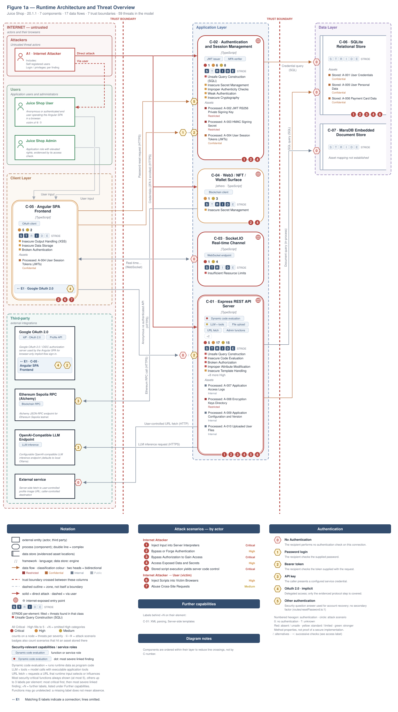</picture>

**Build pipeline**, not drawn in this runtime view: GitHub Actions, GitLab CI. ⑧ A2 · Supply-Chain / Build Attacker → [Figure 1b](#figure-1b).

Role access and finding assignments are listed in [Identified Actors](#identified-actors).

**Actor grouping.** Regular self-registered users are grouped with anonymous internet attackers because registration is open. Each finding retains its login and privilege requirements.

<a id="figure-1b"></a>

**Figure 1b - Supply Chain and Build**

Juice Shop builds in GitHub Actions, GitLab CI. Figure 1b shows the inputs, build systems and release artifacts the repository evidences, with 10 findings attached to them. The highlighted path follows 🟠 [F-020](#f-020) — Lockfile disabled; builds resolve npm graph fresh — .npmrc:1 as far as the repository evidences it. The control assessment is in [§6.11](#611-operations-runtime-and-supply-chain-controls).

<picture><source media="(prefers-color-scheme: dark)" srcset="threat-model-juice-shop-thorough-v0.6.0b5.figure1b-dark.svg">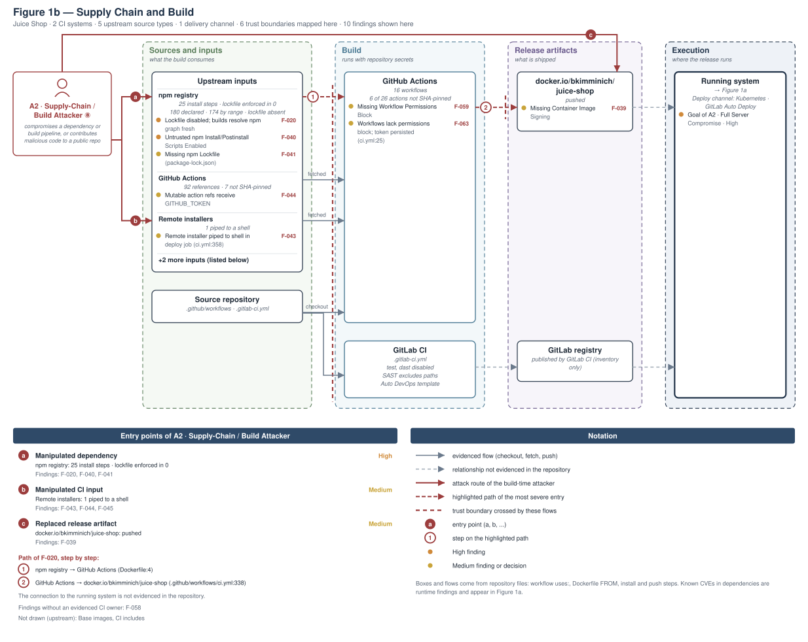</picture>

**Figure 2 - Attack Routes and Impact**

Each numbered route names one example finding from the corresponding Top Threats group with its access prerequisite, the register weakness it is linked to, and the group's potential business harm, which depends on deployment and affected assets. W-IDs in parentheses link the example to an existing weakness. The attack step, affected component and technical consequence are listed in the findings register. Red arrows indicate attacks; dashed red arrows involve a victim; grey arrows lead to potential harm.

<picture><source media="(prefers-color-scheme: dark)" srcset="threat-model-juice-shop-thorough-v0.6.0b5.figure2-dark.svg">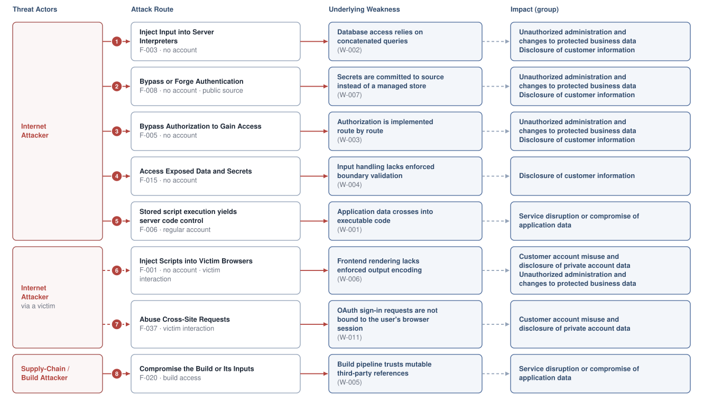</picture>

**Threat actors.** The actors below drive the numbered attack paths in the figures above. The **Juice Shop User** is the *victim* of client-side attacks (XSS / CSRF), not an attacker. Figure 2 marks victim interaction on the applicable attack routes.

- **Juice Shop User** — legitimate end user; target of client-side attacks; target of ⑥ Output Encoding / Cross-Site Scripting, ⑦ CSRF / Permissive CORS.
- **Internet Attacker** — can self-register a regular account; drives ① Insecure Query Construction & Data Access, ② Hardcoded Secrets & Weak Cryptography, ③ Broken Authorization & Access Control, ④ Sensitive File & Secret Exposure, ⑤ Remote Code Execution (unsafe eval), ⑥ Output Encoding / Cross-Site Scripting.
- **Supply-Chain / Build Attacker** — compromises a dependency or build pipeline, or contributes malicious code to a public repo; drives ⑧ Build Pipeline & Dependency Integrity.

**8 structural threats**, grouped by weakness class - each row is one threat, not one finding. *Threat Description* states the general architectural weakness (STRIDE in brackets); *Findings* lists the concrete instances, each linked to [§8 Findings Register](#8-findings-register) with its component; *Risk & Impact* combines severity with business consequence.

| # | Threat Description | Findings (→ Component) | Risk & Impact | Fix |
|---|------------------------------------|------------------------------------------------|------------------------------------|--------|
| <a id="path-injection"></a>① | **Insecure Query Construction & Data Access** _(T·I)_<br/>Unsanitized request input reaches SQL and XML parsers, letting anonymous callers bypass authentication, read or corrupt data rows, or retrieve arbitrary server files. | <span style="white-space:nowrap">🔴&nbsp;[F-003](#f-003)</span> - SQL injection in login query <span style="white-space:nowrap">→&nbsp;[C-01](#c-01)</span>&nbsp;Express REST API Server<br/><span style="white-space:nowrap">🔴&nbsp;[F-004](#f-004)</span> - SQL injection request data interpolated into a SQL string <span style="white-space:nowrap">→&nbsp;[C-01](#c-01)</span>&nbsp;Express REST API Server<br/><span style="white-space:nowrap">🟠&nbsp;[F-023](#f-023)</span> - XXE in unauthenticated XML upload <span style="white-space:nowrap">→&nbsp;[C-01](#c-01)</span>&nbsp;Express REST API Server<br/><span style="white-space:nowrap">🟠&nbsp;[F-017](#f-017)</span> - Input in executable NoSQL predicate <span style="white-space:nowrap">→&nbsp;[C-01](#c-01)</span>&nbsp;Express REST API Server<br/><span style="white-space:nowrap">🟠&nbsp;[F-018](#f-018)</span> - Input compiled as template source <span style="white-space:nowrap">→&nbsp;[C-01](#c-01)</span>&nbsp;Express REST API Server | 🔴 **Critical**<br/>Full Admin Takeover · Customer Data Exfiltration | <span style="white-space:nowrap">● [M-094](#m-094)</span> — Use parameterized database queries<br/><span style="white-space:nowrap">● [M-069](#m-069)</span> — Parameterize the product search query |
| <a id="path-auth-bypass"></a>② | **Hardcoded Secrets & Weak Cryptography** _(S·E)_<br/>A committed signing key and permissive token-verification logic allow any caller to forge or modify credentials for any account without valid credentials. | <span style="white-space:nowrap">🟠&nbsp;[F-008](#f-008)</span> - Hardcoded RSA JWT signing key <span style="white-space:nowrap">→&nbsp;[C-01](#c-01)</span>&nbsp;Express REST API Server<br/><span style="white-space:nowrap">🟠&nbsp;[F-009](#f-009)</span> - JWT Accepted Without Signature Verification <span style="white-space:nowrap">→&nbsp;[C-01](#c-01)</span>&nbsp;Express REST API Server<br/><span style="white-space:nowrap">🟠&nbsp;[F-010](#f-010)</span> - Insecure JWT Verification <span style="white-space:nowrap">→&nbsp;[C-01](#c-01)</span>&nbsp;Express REST API Server<br/><span style="white-space:nowrap">🟠&nbsp;[F-025](#f-025)</span> - Unsalted `MD5` password hashing <span style="white-space:nowrap">→&nbsp;[C-02](#c-02)</span>&nbsp;Authentication and Session Management<br/><span style="white-space:nowrap">🟠&nbsp;[F-028](#f-028)</span> - Password hashed without salt <span style="white-space:nowrap">→&nbsp;[C-01](#c-01)</span>&nbsp;Express REST API Server<br/><span style="white-space:nowrap">🟠&nbsp;[F-029](#f-029)</span> - Hardcoded wallet BIP39 mnemonic <span style="white-space:nowrap">→&nbsp;[C-04](#c-04)</span>&nbsp;Web3 / NFT / Wallet Surface<br/><span style="white-space:nowrap">🟡&nbsp;[F-054](#f-054)</span> - Credential pair in client bundle <span style="white-space:nowrap">→&nbsp;[C-05](#c-05)</span>&nbsp;Angular SPA Frontend<br/><span style="white-space:nowrap">🟠&nbsp;[F-075](#f-075)</span> - Token flow accepts a stolen bearer token without <span style="white-space:nowrap">→&nbsp;[C-05](#c-05)</span>&nbsp;Angular SPA Frontend | 🟠 **High**<br/>Full Admin Takeover · Customer Data Exfiltration | <span style="white-space:nowrap">◕ [M-097](#m-097)</span> — Move cryptographic keys to a managed secret store<br/><span style="white-space:nowrap">◕ [M-071](#m-071)</span> — Replace `jwt.decode` with `jwt.verify` in all authorization-adjacent paths |
| <a id="path-privilege-escalation"></a>③ | **Broken Authorization & Access Control** _(E·I)_<br/>Missing field restrictions and absent authorization checks let anonymous registrants assign themselves administrator roles and let signed-in users access or modify other accounts' resources. | <span style="white-space:nowrap">🔴&nbsp;[F-005](#f-005)</span> - Insecure Direct Object Reference <span style="white-space:nowrap">→&nbsp;[C-01](#c-01)</span>&nbsp;Express REST API Server<br/><span style="white-space:nowrap">🔴&nbsp;[F-007](#f-007)</span> - Mass assignment of role on user registration <span style="white-space:nowrap">→&nbsp;[C-01](#c-01)</span>&nbsp;Express REST API Server<br/><span style="white-space:nowrap">🟠&nbsp;[F-032](#f-032)</span> - Sensitive Routes Registered Without Authentication Middleware <span style="white-space:nowrap">→&nbsp;[C-01](#c-01)</span>&nbsp;Express REST API Server<br/><span style="white-space:nowrap">🟠&nbsp;[F-033](#f-033)</span> - Unauthenticated product update <span style="white-space:nowrap">→&nbsp;[C-01](#c-01)</span>&nbsp;Express REST API Server<br/><span style="white-space:nowrap">🟡&nbsp;[F-035](#f-035)</span> - Password change without current password <span style="white-space:nowrap">→&nbsp;[C-01](#c-01)</span>&nbsp;Express REST API Server<br/><span style="white-space:nowrap">🟡&nbsp;[F-078](#f-078)</span> - Customer completes checkout <span style="white-space:nowrap">→&nbsp;[C-01](#c-01)</span>&nbsp;Express REST API Server<br/><span style="white-space:nowrap">🟡&nbsp;[F-079](#f-079)</span> - Customer modifies or empties another customer's <span style="white-space:nowrap">→&nbsp;[C-01](#c-01)</span>&nbsp;Express REST API Server | 🔴 **Critical**<br/>Full Admin Takeover · Customer Data Exfiltration | <span style="white-space:nowrap">● [M-070](#m-070)</span> — Replace client-supplied UserId with session identity in all owner filters<br/><span style="white-space:nowrap">● [M-096](#m-096)</span> — Allowlist client-controlled fields |
| <a id="path-sensitive-data-exposure"></a>④ | **Sensitive File & Secret Exposure** _(I)_<br/>Path traversal vulnerabilities in archive upload and data-deletion routes allow overwriting served files or reading configuration, keys, logs, and credential data. | <span style="white-space:nowrap">🟠&nbsp;[F-014](#f-014)</span> - Path traversal filesystem access from request input <span style="white-space:nowrap">→&nbsp;[C-01](#c-01)</span>&nbsp;Express REST API Server<br/><span style="white-space:nowrap">🟠&nbsp;[F-015](#f-015)</span> - Zip Slip path traversal in complaint upload <span style="white-space:nowrap">→&nbsp;[C-01](#c-01)</span>&nbsp;Express REST API Server<br/><span style="white-space:nowrap">🟠&nbsp;[F-021](#f-021)</span> - Memories endpoint leaks full user records <span style="white-space:nowrap">→&nbsp;[C-01](#c-01)</span>&nbsp;Express REST API Server<br/><span style="white-space:nowrap">🟠&nbsp;[F-022](#f-022)</span> - Public directory listing of access logs <span style="white-space:nowrap">→&nbsp;[C-01](#c-01)</span>&nbsp;Express REST API Server<br/><span style="white-space:nowrap">🟡&nbsp;[F-034](#f-034)</span> - Open redirect <span style="white-space:nowrap">→&nbsp;[C-01](#c-01)</span>&nbsp;Express REST API Server<br/><span style="white-space:nowrap">🟡&nbsp;[F-049](#f-049)</span> - Verbose error handler in all environments <span style="white-space:nowrap">→&nbsp;[C-01](#c-01)</span>&nbsp;Express REST API Server<br/><span style="white-space:nowrap">🟡&nbsp;[F-051](#f-051)</span> - Reset response returns full user record <span style="white-space:nowrap">→&nbsp;[C-02](#c-02)</span>&nbsp;Authentication and Session Management<br/><span style="white-space:nowrap">🟡&nbsp;[F-052](#f-052)</span> - User list handler lacks role check <span style="white-space:nowrap">→&nbsp;[C-02](#c-02)</span>&nbsp;Authentication and Session Management | 🟠 **High**<br/>Customer Data Exfiltration | <span style="white-space:nowrap">◕ [M-072](#m-072)</span> — Contain resolved layout path within allowed views directory<br/><span style="white-space:nowrap">◕ [M-102](#m-102)</span> — Constrain file paths to a safe base directory |
| <a id="path-remote-code-execution"></a>⑤ | **Remote Code Execution (unsafe eval)** _(E)_<br/>Two routes execute attacker-controlled values directly on the server, giving any registered user arbitrary code execution over the application process, its database, and its signing keys. | <span style="white-space:nowrap">🔴&nbsp;[F-006](#f-006)</span> - Eval of stored username on profile page <span style="white-space:nowrap">→&nbsp;[C-01](#c-01)</span>&nbsp;Express REST API Server<br/><span style="white-space:nowrap">🟠&nbsp;[F-016](#f-016)</span> - Code evaluation of B2B order input <span style="white-space:nowrap">→&nbsp;[C-01](#c-01)</span>&nbsp;Express REST API Server | 🔴 **Critical**<br/>Full Server Compromise | <span style="white-space:nowrap">● [M-095](#m-095)</span> — Remove eval of usernames<br/><span style="white-space:nowrap">◕ [M-103](#m-103)</span> — Parse B2B order lines as data |
| <a id="path-cross-site-scripting"></a>⑥ | **Output Encoding / Cross-Site Scripting** _(T·I)_<br/>Client-side markup injection executes attacker script in the victim's browser session, yielding a bearer credential and any privileges the victim holds. | <span style="white-space:nowrap">🟠&nbsp;[F-001](#f-001)</span> - XSS via Angular Sanitizer Bypass <span style="white-space:nowrap">→&nbsp;[C-05](#c-05)</span>&nbsp;Angular SPA Frontend<br/><span style="white-space:nowrap">🟠&nbsp;[F-026](#f-026)</span> - JWT in script-readable storage <span style="white-space:nowrap">→&nbsp;[C-05](#c-05)</span>&nbsp;Angular SPA Frontend<br/><span style="white-space:nowrap">🟠&nbsp;[F-074](#f-074)</span> - XSS renders attacker-controlled markup <span style="white-space:nowrap">→&nbsp;[C-05](#c-05)</span>&nbsp;Angular SPA Frontend<br/><span style="white-space:nowrap">🟡&nbsp;[F-047](#f-047)</span> - Unsanitized email persisted when XSS challenge <span style="white-space:nowrap">→&nbsp;[C-01](#c-01)</span>&nbsp;Express REST API Server | 🟠 **High**<br/>Customer Session Hijack · Full Admin Takeover | <span style="white-space:nowrap">◕ [M-092](#m-092)</span> — Bind search term as text<br/><span style="white-space:nowrap">◕ [M-140](#m-140)</span> — Sanitize untrusted HTML before rendering |
| <a id="path-cross-site-request-forgery"></a>⑦ | **CSRF / Permissive CORS** _(S·T)_<br/>a permissive CORS policy plus missing anti-CSRF tokens let any external page issue authenticated state-changing requests in the victim's session. | <span style="white-space:nowrap">🟡&nbsp;[F-037](#f-037)</span> - OAuth implicit flow without state <span style="white-space:nowrap">→&nbsp;[C-05](#c-05)</span>&nbsp;Angular SPA Frontend | 🟡 **Medium**<br/>Customer Session Hijack | <span style="white-space:nowrap">◑ [M-119](#m-119)</span> — Add anti-CSRF protection to state-changing requests |
| <a id="path-supply-chain"></a>⑧ | **Build Pipeline & Dependency Integrity** _(T·E)_<br/>Disabled lockfiles, mutable action references, and a remote installer piped to the build shell allow a dependency publisher or pipeline attacker to inject arbitrary code into the publicly distributed training image.<br/>Path through the build: [Figure 1b](#figure-1b) · controls: [§6.11](#611-operations-runtime-and-supply-chain-controls) | <span style="white-space:nowrap">🟠&nbsp;[F-020](#f-020)</span> - Lockfile disabled; builds resolve npm graph fresh <span style="white-space:nowrap">→&nbsp;[C-08](#c-08)</span>&nbsp;CI/CD Pipeline and Build Infrastructure<br/><span style="white-space:nowrap">🟠&nbsp;[F-040](#f-040)</span> - Untrusted npm Install/Postinstall Scripts Enabled <span style="white-space:nowrap">→&nbsp;[C-08](#c-08)</span>&nbsp;CI/CD Pipeline and Build Infrastructure<br/><span style="white-space:nowrap">🟡&nbsp;[F-043](#f-043)</span> - Remote installer piped to shell in deploy job <span style="white-space:nowrap">→&nbsp;[C-08](#c-08)</span>&nbsp;CI/CD Pipeline and Build Infrastructure<br/><span style="white-space:nowrap">🟡&nbsp;[F-044](#f-044)</span> - Mutable action refs receive `GITHUB_TOKEN` <span style="white-space:nowrap">→&nbsp;[C-08](#c-08)</span>&nbsp;CI/CD Pipeline and Build Infrastructure<br/><span style="white-space:nowrap">🟡&nbsp;[F-045](#f-045)</span> - Base images referenced by floating tag, no digest <span style="white-space:nowrap">→&nbsp;[C-08](#c-08)</span>&nbsp;CI/CD Pipeline and Build Infrastructure<br/><span style="white-space:nowrap">🟡&nbsp;[F-039](#f-039)</span> - Missing Container Image Signing - *.yml <span style="white-space:nowrap">→&nbsp;[C-08](#c-08)</span>&nbsp;CI/CD Pipeline and Build Infrastructure<br/><span style="white-space:nowrap">🟡&nbsp;[F-041](#f-041)</span> - Missing npm Lockfile <span style="white-space:nowrap">→&nbsp;[C-01](#c-01)</span>&nbsp;Express REST API Server<br/><span style="white-space:nowrap">🟡&nbsp;[F-058](#f-058)</span> - Container Runs as Root <span style="white-space:nowrap">→&nbsp;[C-08](#c-08)</span>&nbsp;CI/CD Pipeline and Build Infrastructure<br/><span style="white-space:nowrap">🟡&nbsp;[F-059](#f-059)</span> - Missing Workflow Permissions Block <span style="white-space:nowrap">→&nbsp;[C-08](#c-08)</span>&nbsp;CI/CD Pipeline and Build Infrastructure<br/><span style="white-space:nowrap">🟡&nbsp;[F-063](#f-063)</span> - Workflows lack permissions block; token persisted <span style="white-space:nowrap">→&nbsp;[C-08](#c-08)</span>&nbsp;CI/CD Pipeline and Build Infrastructure | 🟠 **High**<br/>Full Server Compromise | <span style="white-space:nowrap">◕ [M-104](#m-104)</span> — Commit lockfiles and install from them<br/><span style="white-space:nowrap">◕ [M-077](#m-077)</span> — Add `--ignore-scripts` to `Dockerfile` npm install; audit and allowlist required postinstalls |

_STRIDE: S spoofing · T tampering · R repudiation · I information disclosure · D denial of service · E elevation of privilege. Risk, findings, components, impact and Fix are derived deterministically; only the one-line weakness description is authored._

**Verified attack chains.** 12 fully viable ([AC-T-101](#ac-t-101), [AC-T-004](#ac-t-004), [AC-T-102](#ac-t-102), [AC-T-107](#ac-t-107), [AC-T-003](#ac-t-003), [AC-T-005](#ac-t-005), [AC-T-007](#ac-t-007), [AC-T-006](#ac-t-006), [AC-T-103](#ac-t-103), [AC-T-001](#ac-t-001), [AC-T-105](#ac-t-105), [AC-T-106](#ac-t-106)). These chains combine individual findings into end-to-end exploitation paths verified step-by-step against the code - see [§9 Abuse Cases](#9-abuse-cases) for the per-step breakdown and blocking mitigations.

### Top Mitigations

Highest-impact P1/P2 mitigations - 10 of 31 qualifying (78 total). Full detail in [§10 Mitigation Register](#10-mitigation-register). All 8 mitigation(s) that fix a Critical finding are always listed here.

| # | Component | Mitigation | Addresses | Effort |
|---|----------------------|------------------------------------------------|------------------------------------------------|------|
| **1** | [C-01](#c-01) — Express REST API Server | ● [M-069](#m-069) — Parameterize the product search query<br/>*Declared business context* | 🔴 [F-004](#f-004) — SQL injection request data interpolated into a SQL string | Low |
| **2** | [C-01](#c-01) — Express REST API Server | ● [M-070](#m-070) — Replace client-supplied UserId with session identity in all owner filters<br/>*Declared business context* | 🔴 [F-005](#f-005) — Insecure Direct Object Reference | Low |
| **3** | [C-01](#c-01) — Express REST API Server | ● [M-094](#m-094) — Use parameterized database queries<br/>*Declared business context* | 🔴 [F-003](#f-003) — SQL injection in login query | Low |
| **4** | [C-01](#c-01) — Express REST API Server | ● [M-095](#m-095) — Remove eval of usernames<br/>*Declared business context* | 🔴 [F-006](#f-006) — Eval of stored username on profile page | Low |
| **5** | [C-01](#c-01) — Express REST API Server | ● [M-096](#m-096) — Allowlist client-controlled fields<br/>*Declared business context* | 🔴 [F-007](#f-007) — Mass assignment of role on user registration | Low |
| **6** | [C-03](#c-03) — Socket\.IO Real-time Channel | ● [M-114](#m-114) — Bound input and remove backtracking | 🔴 [F-031](#f-031) — ReDoS in SVG verify event regex | Low |
| **7** | [C-01](#c-01) — Express REST API Server | ◕ [M-097](#m-097) — Move cryptographic keys to a managed secret store<br/>*Declared business context* | 🟠 [F-008](#f-008) — Hardcoded RSA JWT signing key | Medium |
| **8** | [C-01](#c-01) — Express REST API Server | ◕ [M-098](#m-098) — Enforce JWT signature and algorithm verification<br/>*Declared business context* | 🟠 [F-010](#f-010) — Insecure JWT Verification | Medium |
| **9** | [C-01](#c-01) — Express REST API Server | ◕ [M-071](#m-071) — Replace jwt.decode with jwt.verify in all authorization-adjacent paths<br/>*Declared business context* | 🟠 [F-009](#f-009) — JWT Accepted Without Signature Verification | Low |
| **10** | [C-01](#c-01) — Express REST API Server | ◕ [M-072](#m-072) — Contain resolved layout path within allowed views directory<br/>*Declared business context* | 🟠 [F-014](#f-014) — Path traversal filesystem access from request input | Low |

*21 additional P1/P2 mitigations capped from the leader-board · 47 P3 backlog items in [§10 Mitigation Register](#10-mitigation-register).*

### AI / LLM Exposure

This system embeds an LLM/AI surface (Express REST API Server); the risks below are architectural - they follow from how untrusted input reaches the model's prompt, tools, and outputs. See **[§6 Security Architecture](#6-security-architecture)** for the per-control detail.


- **[LLM02](https://genai.owasp.org/llmrisk/llm02/) Sensitive Information Disclosure** — The LLM surface can return sensitive data — internal secrets, other users' data, or privileged context — to an attacker who crafts the right conversational input. _([C-01](#c-01) — Express REST API Server)_
  - ↳ 🟠 [F-009](#f-009) — JWT Accepted Without Signature Verification _([ASI03](https://genai.owasp.org/resource/owasp-top-10-for-agentic-applications-for-2026/))_

- **[LLM06](https://genai.owasp.org/llmrisk/llm06/) Excessive Agency** — The LLM is granted tool/function-calling authority without a secondary authorization boundary, so a manipulated model turn can invoke privileged actions on the user's behalf. _([C-01](#c-01) — Express REST API Server)_
  - ↳ 🟠 [F-009](#f-009) — JWT Accepted Without Signature Verification _([ASI03](https://genai.owasp.org/resource/owasp-top-10-for-agentic-applications-for-2026/))_
  - ↳ 🟡 [F-061](#f-061) — Model-chosen coupon discount not bounded _([ASI02](https://genai.owasp.org/resource/owasp-top-10-for-agentic-applications-for-2026/))_

- **[LLM01](https://genai.owasp.org/llmrisk/llm01/) Prompt Injection** — Untrusted user input reaches the LLM prompt/context without sufficient trust separation, letting an attacker override system instructions, redirect tool calls, or coerce unintended model behaviour. _([C-01](#c-01) — Express REST API Server)_
  - ↳ 🟡 [F-042](#f-042) — Client-controlled chat history reaches model _([ASI01](https://genai.owasp.org/resource/owasp-top-10-for-agentic-applications-for-2026/))_

- **[LLM10](https://genai.owasp.org/llmrisk/llm10/) Unbounded Consumption** — The LLM endpoint imposes no authentication, rate, or quota boundary, so any client can drive unbounded model invocations — uncontrolled provider cost and denial of service for legitimate users. _([C-01](#c-01) — Express REST API Server)_
  - ↳ 🟡 [F-055](#f-055) — Unbounded LLM consumption on chat endpoint

### Operational Strengths

Operational controls rated Adequate or Partial - grouped into broad clusters (full per-control breakdown in [§6](#6-security-architecture)). Clusters demoted to Weak by open Critical/High findings appear in [§6](#6-security-architecture) instead, not here.

<table style="table-layout:fixed;width:100%">
<colgroup><col width="18%" style="width:18%"><col width="30%" style="width:30%"><col width="40%" style="width:40%"><col width="12%" style="width:12%"></colgroup>
<thead><tr><th>Strength</th><th>What's in Place</th><th>Effectiveness</th><th>Mitigates</th></tr></thead>
<tbody>
<tr><td style="overflow-wrap:break-word"><strong>Hardened HTTP Stack</strong></td><td style="overflow-wrap:break-word"><em>Browser-facing HTTP hardening — security headers, cookie flags, cross-origin policy, and abuse-protection limits.</em><br/>CORS Policy</td><td style="overflow-wrap:break-word">⚠️ Partial — 1 medium/low-severity finding(s) within the cluster's remit remain open — see <a href="#8-findings-register">§8</a> Findings Register for details.</td><td style="overflow-wrap:break-word">🟡 <a href="#f-037">F-037</a> — OAuth implicit flow without state</td></tr>
<tr><td style="overflow-wrap:break-word"><strong>Observability &amp; Audit</strong></td><td style="overflow-wrap:break-word"><em>Runtime visibility - access logging, audit trails, and operational telemetry for post-incident review.</em><br/>Security Event Logging</td><td style="overflow-wrap:break-word">⚠️ Partial - Coverage incomplete - see <a href="#7-weakness-register">§7</a> control assessment.</td><td style="overflow-wrap:break-word">-</td></tr>
<tr><td style="overflow-wrap:break-word"><strong>Container &amp; Supply-Chain Hardening</strong></td><td style="overflow-wrap:break-word"><em>Build-time and runtime hardening - minimal base image, non-root execution, dependency inventory.</em><br/>Third-Party CI Action Pinning<br/>npm Dependency Lockfile Enforcement</td><td style="overflow-wrap:break-word">⚠️ Partial - Coverage incomplete - see <a href="#7-weakness-register">§7</a> control assessment.</td><td style="overflow-wrap:break-word">-</td></tr>
<tr><td style="overflow-wrap:break-word"><strong>Cryptographic Hygiene</strong></td><td style="overflow-wrap:break-word"><em>Transport security, key lifecycle, and password-hash strength.</em><br/>Transport Layer Encryption (TLS)</td><td style="overflow-wrap:break-word">⚠️ Partial - Bypassed by 1 High finding(s) of the kind this cluster is supposed to prevent - e.g.<br/>🟠 <a href="#f-025">F-025</a> — Unsalted <code>MD5</code> password hashing.</td><td style="overflow-wrap:break-word">-</td></tr>
</tbody>
</table>


**Bottom line:** These controls narrow specific attack surfaces but none eliminates a Critical finding on its own.

---

<a id="critical-attack-chain"></a><a id="critical-attack-tree"></a><a id="critical-findings-by-root-cause"></a>
## Critical Findings by Root Cause

4 of 6 Critical findings trace back to 3 root causes; fixing a root cause addresses every finding linked to it. 2 have no root cause linked yet.

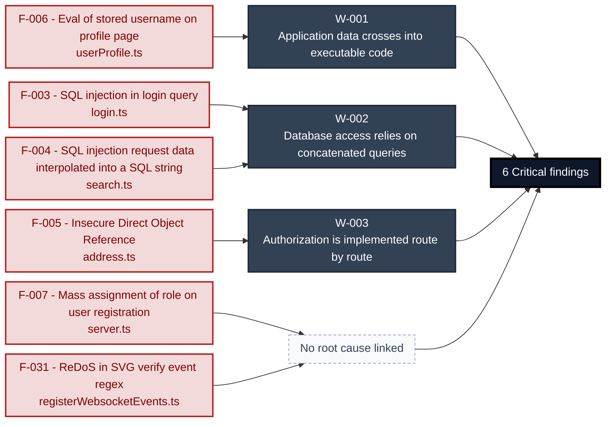
```mermaid
%%{init: {"flowchart": {"nodeSpacing": 14, "rankSpacing": 50, "padding": 8, "wrappingWidth": 260}}}%%
graph LR
    GOAL["6 Critical findings"]:::goal
    W001["W-001<br/>Application data crosses into executable code"]:::rootcause
    T006["F-006 - Eval of stored username on profile page<br/>userProfile.ts"]:::leaf
    W002["W-002<br/>Database access relies on concatenated queries"]:::rootcause
    T003["F-003 - SQL injection in login query<br/>login.ts"]:::leaf
    T004["F-004 - SQL injection request data interpolated into a SQL string<br/>search.ts"]:::leaf
    W003["W-003<br/>Authorization is implemented route by route"]:::rootcause
    T005["F-005 - Insecure Direct Object Reference<br/>address.ts"]:::leaf
    UNLINKED["No root cause linked"]:::unassigned
    T007["F-007 - Mass assignment of role on user registration<br/>server.ts"]:::leaf
    T031["F-031 - ReDoS in SVG verify event regex<br/>registerWebsocketEvents.ts"]:::leaf

    W001 --> GOAL
    T006 --> W001
    W002 --> GOAL
    T003 --> W002
    T004 --> W002
    W003 --> GOAL
    T005 --> W003
    UNLINKED --> GOAL
    T007 --> UNLINKED
    T031 --> UNLINKED

    classDef goal fill:#0f172a,stroke:#000,color:#fff,stroke-width:3px
    classDef and_node fill:#334155,stroke:#1e293b,color:#fff,stroke-width:2px
    classDef or_node fill:#64748b,stroke:#334155,color:#fff,stroke-width:2px
    classDef leaf fill:#f3dada,stroke:#b71c1c,color:#7f0000,stroke-width:2px
    classDef rootcause fill:#334155,stroke:#1e293b,color:#fff,stroke-width:2px
    classDef unassigned fill:#f8fafc,stroke:#94a3b8,color:#334155,stroke-dasharray:4 3
```

**Structural fixes** (full detail in [§7 Weakness Register](#7-weakness-register)):

- **[W-001](#w-001)** — Replace evaluation of application values with a data parser or a fixed set of operations whose arguments remain data _(closes [F-006](#f-006))_
- **[W-002](#w-002)** — Provide one parameterised repository or query-builder path and prohibit application-value interpolation in database queries _(closes [F-003](#f-003), [F-004](#f-004))_
- **[W-003](#w-003)** — Enforce authorization through a shared server-side policy layer and make ownership and tenant scope mandatory inputs to data access _(closes [F-005](#f-005))_
- **No root cause linked** — [F-007](#f-007), [F-031](#f-031): see the [§8 Findings Register](#8-findings-register)

---

## 1. System Overview

**Repository:** `https://github.com/juice-shop/juice-shop.git`

### Scope

This threat model covers 8 components of juice-shop2: **Express REST API Server**, **Authentication and Session Management**, **Socket\.IO Real-time Channel**, **Web3 / NFT / Wallet Surface**, **Angular SPA Frontend**, **SQLite Relational Store**, **MarsDB Embedded Document Store**, **CI/CD Pipeline and Build Infrastructure**.

All 8 modeled components were analysed with full STRIDE.

**Out of scope:** third-party hosted dependencies, browser runtime, operating-system kernel, and the underlying network infrastructure.

**Basis:** An automated, AI-assisted threat model built from the repository's source code and configuration - static analysis only, no dynamic or penetration testing. It describes the system as built, not as designed.

---

<a id="identified-actors"></a>
### Identified Actors

Figure 1a draws **Internet Attacker** as attacker and **Juice Shop User** and **Juice Shop Admin** as legitimate roles of Juice Shop. [Figure 1b](#figure-1b) draws **Supply-Chain / Build Attacker** and the build it attacks. Each row gives that actor's access and the findings attributed to it.

| Actor | Type | Access | Scenarios | Attributed findings |
|----------------------|---------------|----------------------|--------------|-------------------|
| A1 · Internet Attacker | Attacker | can self-register a regular account | ① ② ③ ④ ⑤ ⑥ ⑦ | 🔴 6 · 🟠 20 · 🟡 19 |
| A2 · Supply-Chain / Build Attacker | Attacker | compromises a dependency or build pipeline, or contributes malicious code to a public repo · [Figure 1b](#figure-1b) | ⑧ | 🟠 2 · 🟡 8 |
| Juice Shop User | Role (victim) | Anonymous or authenticated end user<br/>operating the Angular SPA in a browser. The<br/>open self-registration endpoint means any<br/>internet visitor can become an authenticated<br/>user immediately. | ⑥ ⑦ | - |
| Juice Shop Admin | Privileged role | Application role with elevated rights,<br/>evidenced by its access check. | - | - |

---

### Trust Boundaries

Canonical boundary crossings. **Assumption & verdict** names the condition that makes each crossing safe and whether this report still supports it, judged one condition at a time - which conditions apply follows from the direction of the crossing.

<table style="table-layout:fixed;width:100%">
<colgroup><col width="6%" style="width:6%"><col width="25%" style="width:25%"><col width="11%" style="width:11%"><col width="15%" style="width:15%"><col width="25%" style="width:25%"><col width="18%" style="width:18%"></colgroup>
<thead><tr><th>ID</th><th>Boundary / crossing</th><th>Exposure</th><th>Kind</th><th>Assumption &amp; verdict</th><th>Linked findings</th></tr></thead>
<tbody>
<tr><td style="white-space:nowrap"><a id="tb-1"></a>tb-1</td><td style="overflow-wrap:break-word"><strong>external → juice-shop-api</strong><br/>Control: isAuthorized() expressJwt middleware · Also covers: juice-shop-auth</td><td>🌐 <strong>External</strong></td><td style="overflow-wrap:break-word">network</td><td style="overflow-wrap:break-word">Every protected route registers isAuthorized() expressJwt in its middleware chain, rejecting tokens not signed with the server public key.<br/>Validation: <strong>broken</strong> · 9 related · <a href="#66-input-boundary-validation-controls">§6.6</a><br/>Authentication: <strong>broken</strong> · 4 related · <a href="#62-identity-and-authentication-controls">§6.2</a><br/>Authorization: <strong>broken</strong> · 3 related · <a href="#64-authorization-controls">§6.4</a></td><td style="overflow-wrap:break-word"><em>Validation</em><br/>🔴 <a href="#f-007">F-007</a><br/><em>Authentication</em><br/>🟠 <a href="#f-008">F-008</a><br/>🟠 <a href="#f-010">F-010</a><br/><em>Authorization</em><br/>🔴 <a href="#f-005">F-005</a><br/><em>Unattributed</em><br/>🟠 <a href="#f-009">F-009</a><br/>🟠 <a href="#f-033">F-033</a></td></tr>
<tr><td style="white-space:nowrap"><a id="tb-2"></a>tb-2</td><td style="overflow-wrap:break-word"><strong>external → juice-shop-realtime</strong><br/>Control: none identified · Also covers: juice-shop-web3</td><td>🌐 <strong>External</strong></td><td style="overflow-wrap:break-word">network</td><td style="overflow-wrap:break-word">Every socket connection carries a valid JWT before the server processes challenge-verification events from that client.<br/>Validation: <strong>broken</strong> · <a href="#66-input-boundary-validation-controls">§6.6</a><br/>Authentication: <strong>broken</strong> · 2 related · <a href="#62-identity-and-authentication-controls">§6.2</a><br/>Authorization: <em>not examined</em> · <a href="#64-authorization-controls">§6.4</a></td><td style="overflow-wrap:break-word"><em>Validation</em><br/>🔴 <a href="#f-031">F-031</a><br/>🟡 <a href="#f-046">F-046</a><br/><em>Authentication</em><br/>🟡 <a href="#f-038">F-038</a></td></tr>
<tr><td style="white-space:nowrap"><a id="tb-3"></a>tb-3</td><td style="overflow-wrap:break-word"><strong>external → juice-shop-cicd</strong><br/>Control: SHA-pinned action references</td><td>🌐 <strong>External</strong></td><td style="overflow-wrap:break-word">build pipeline · operator</td><td style="overflow-wrap:break-word">Every third-party GitHub Action reference in all workflow files is pinned to an immutable commit SHA, not a mutable tag.<br/>Validation: <strong>broken</strong> · 2 related · <a href="#66-input-boundary-validation-controls">§6.6</a><br/>Authentication: in doubt · 1 related · <a href="#62-identity-and-authentication-controls">§6.2</a><br/>Authorization: <strong>broken</strong> · 1 related · <a href="#64-authorization-controls">§6.4</a></td><td style="overflow-wrap:break-word"><em>Validation</em><br/>🟡 <a href="#f-044">F-044</a><br/><em>Authorization</em><br/>🟡 <a href="#f-063">F-063</a></td></tr>
<tr><td style="white-space:nowrap"><a id="tb-4"></a>tb-4</td><td style="overflow-wrap:break-word"><strong>external → juice-shop-cicd</strong><br/>Control: none identified</td><td>🌐 <strong>External</strong></td><td style="overflow-wrap:break-word">build pipeline · operator</td><td style="overflow-wrap:break-word">Every base image reference in Dockerfile and CI jobs is pinned to an immutable digest, not a floating tag.<br/>Validation: <strong>broken</strong> · 3 related · <a href="#66-input-boundary-validation-controls">§6.6</a><br/>Authentication: in doubt · 1 related · <a href="#62-identity-and-authentication-controls">§6.2</a><br/>Authorization: in doubt · 1 related · <a href="#64-authorization-controls">§6.4</a></td><td style="overflow-wrap:break-word"><em>Validation</em><br/>🟡 <a href="#f-045">F-045</a></td></tr>
<tr><td style="white-space:nowrap"><a id="tb-5"></a>tb-5</td><td style="overflow-wrap:break-word"><strong>external → juice-shop-cicd</strong><br/>Control: none identified</td><td>🌐 <strong>External</strong></td><td style="overflow-wrap:break-word">build pipeline · operator</td><td style="overflow-wrap:break-word">All npm packages are installed with npm ci, enforcing exact package-lock.json versions and rejecting registry drift.<br/>Validation: <strong>broken</strong> · 2 related · <a href="#66-input-boundary-validation-controls">§6.6</a><br/>Authentication: in doubt · 1 related · <a href="#62-identity-and-authentication-controls">§6.2</a><br/>Authorization: in doubt · 1 related · <a href="#64-authorization-controls">§6.4</a></td><td style="overflow-wrap:break-word"><em>Validation</em><br/>🟠 <a href="#f-020">F-020</a></td></tr>
<tr><td style="white-space:nowrap"><a id="tb-6"></a>tb-6</td><td style="overflow-wrap:break-word"><strong>external → juice-shop-cicd</strong><br/>Control: none identified</td><td>🌐 <strong>External</strong></td><td style="overflow-wrap:break-word">build pipeline · operator</td><td style="overflow-wrap:break-word">Every script fetched from an external URL in CI is verified against a published checksum before execution on the runner.<br/>Validation: <strong>broken</strong> · 2 related · <a href="#66-input-boundary-validation-controls">§6.6</a><br/>Authentication: in doubt · 1 related · <a href="#62-identity-and-authentication-controls">§6.2</a><br/>Authorization: in doubt · 1 related · <a href="#64-authorization-controls">§6.4</a></td><td style="overflow-wrap:break-word"><em>Validation</em><br/>🟡 <a href="#f-043">F-043</a></td></tr>
<tr><td style="white-space:nowrap"><a id="tb-7"></a>tb-7</td><td style="overflow-wrap:break-word"><strong>external → juice-shop-cicd</strong><br/>Control: GitLab Auto-DevOps template include</td><td>🌐 <strong>External</strong></td><td style="overflow-wrap:break-word">build pipeline · operator</td><td style="overflow-wrap:break-word">The Auto-DevOps template is consumed from a pinned GitLab version, not from a mutable default template path.<br/>Validation: in doubt · 3 related · <a href="#66-input-boundary-validation-controls">§6.6</a><br/>Authentication: in doubt · 1 related · <a href="#62-identity-and-authentication-controls">§6.2</a><br/>Authorization: in doubt · 1 related · <a href="#64-authorization-controls">§6.4</a></td><td style="overflow-wrap:break-word">-</td></tr>
<tr><td style="white-space:nowrap"><a id="tb-8"></a>tb-8</td><td style="overflow-wrap:break-word"><strong>juice-shop-api → juice-shop-sqlite</strong><br/>Control: Sequelize parameterized query binding</td><td>🔒 <strong>Internal</strong></td><td style="overflow-wrap:break-word">in-process · data-access</td><td style="overflow-wrap:break-word">Every SQL query from juice-shop-api reaches SQLite through Sequelize model methods with parameterized binding, not raw string interpolation.<br/>Query construction: <strong>broken</strong> · <a href="#65-query-construction-and-data-access-controls">§6.5</a></td><td style="overflow-wrap:break-word"><em>Query construction</em><br/>🔴 <a href="#f-003">F-003</a><br/>🔴 <a href="#f-004">F-004</a></td></tr>
<tr><td style="white-space:nowrap"><a id="tb-9"></a>tb-9</td><td style="overflow-wrap:break-word"><strong>juice-shop-auth → juice-shop-sqlite</strong><br/>Control: none identified</td><td>🔒 <strong>Internal</strong></td><td style="overflow-wrap:break-word">in-process · data-access</td><td style="overflow-wrap:break-word">Every credential lookup query uses parameterized binding so that email and password values cannot alter the SQL statement structure.<br/>Query construction: <strong>broken</strong> · <a href="#65-query-construction-and-data-access-controls">§6.5</a></td><td style="overflow-wrap:break-word"><em>Query construction</em><br/>🔴 <a href="#f-003">F-003</a></td></tr>
<tr><td style="white-space:nowrap"><a id="tb-10"></a>tb-10</td><td style="overflow-wrap:break-word"><strong>juice-shop-api → juice-shop-marsdb</strong><br/>Control: MarsDB Collection driver query interface</td><td>🔒 <strong>Internal</strong></td><td style="overflow-wrap:break-word">in-process · data-access</td><td style="overflow-wrap:break-word">Every document query to MarsDB passes filter criteria as structured objects through the Collection API, not as interpolated strings.<br/>Query construction: <strong>broken</strong> · <a href="#65-query-construction-and-data-access-controls">§6.5</a></td><td style="overflow-wrap:break-word"><em>Query construction</em><br/>🟠 <a href="#f-017">F-017</a></td></tr>
<tr><td style="white-space:nowrap"><a id="tb-11"></a>tb-11</td><td style="overflow-wrap:break-word"><strong>juice-shop-api → external</strong><br/>Control: none identified</td><td>↗ <strong>Egress</strong></td><td style="overflow-wrap:break-word">network · operator</td><td style="overflow-wrap:break-word">Nothing attacker-controlled from the incoming chat request reaches the LLM prompt without sanitization or escaping.<br/>Egress content: <strong>broken</strong><br/>Egress destination: <em>not examined</em> · <a href="#610-file-parser-and-outbound-request-controls">§6.10</a><br/>Response trust: <em>not examined</em></td><td style="overflow-wrap:break-word"><em>Egress content</em><br/>🟡 <a href="#f-042">F-042</a></td></tr>
<tr><td style="white-space:nowrap"><a id="tb-12"></a>tb-12</td><td style="overflow-wrap:break-word"><strong>juice-shop-web3 → external</strong><br/>Control: none identified</td><td>↗ <strong>Egress</strong></td><td style="overflow-wrap:break-word">network · operator</td><td style="overflow-wrap:break-word">RPC calls are sent only to the configured Alchemy endpoint and include only validated wallet addresses and parameters.<br/><em>No finding contradicts it.</em></td><td style="overflow-wrap:break-word">-</td></tr>
<tr><td style="white-space:nowrap"><a id="tb-13"></a>tb-13</td><td style="overflow-wrap:break-word"><strong>juice-shop-cicd → external</strong><br/>Control: push-conditioned workflow branch guard</td><td>↗ <strong>Egress</strong></td><td style="overflow-wrap:break-word">build pipeline · operator</td><td style="overflow-wrap:break-word">Only the verified build artifact from repository source is pushed; runner environment secrets are not baked into image layers.<br/><em>No finding contradicts it.</em></td><td style="overflow-wrap:break-word">-</td></tr>
</tbody>
</table>

_Exposure, most exposed first: ⚠ Review (endpoints unresolved) · 🌐 External (reached from outside the model) · ◐ Unverified (crossing not confirmed) · 🔒 Internal (both ends modelled) · ↗ Egress (reaches outside the model)._

_Kind - the crossing mechanism (build pipeline, in-process, network), then after `·` what changes across it: data-origin, identity, operator, privilege, tenant. Shown alone, nothing changes._

_Conditions - **inbound**: validation, authentication, authorization · **outbound**: egress content, egress destination, response trust (replies are untrusted input) · **internal**: query construction (data never becomes program text), authentication, authorization._

_Verdict per condition - **broken**: a linked finding proves the gap · in doubt: related findings, none linked here · not examined: nothing bears on it. `N related` counts further findings on the same condition. Linked findings sit under the condition they break, or under _Unattributed_. A link raises effective severity only at a confirmed internet ingress; the finding's own severity stays unchanged._

_All boundaries share source: derived from inspected repository evidence; confidence: confirmed; status: resolved._

---

## 2. Architecture Diagrams

### 2.1 System Context

Who uses and attacks Juice Shop, and which external systems it exchanges data with. Solid arrows name the data a flow carries; dashed red arrows are attack routes. Actors carry the names Figure 1 uses (C4 Level 1).

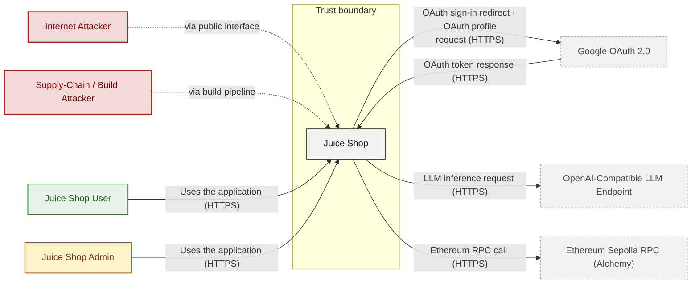
```mermaid
flowchart LR
    A0["Internet Attacker"]
    A1["Supply-Chain / Build Attacker"]
    R2["Juice Shop User"]
    R3["Juice Shop Admin"]
    subgraph TBEDGE["Trust boundary"]
        SYSTEM["Juice Shop"]
    end
    E0["Google OAuth 2.0"]
    E1["OpenAI-Compatible LLM Endpoint"]
    E2["Ethereum Sepolia RPC (Alchemy)"]
    A0 -.->|"via public interface"| SYSTEM
    A1 -.->|"via build pipeline"| SYSTEM
    R2 -->|"Uses the application (HTTPS)"| SYSTEM
    R3 -->|"Uses the application (HTTPS)"| SYSTEM
    SYSTEM -->|"OAuth sign-in redirect · OAuth profile<br/>request (HTTPS)"| E0
    E0 -->|"OAuth token response (HTTPS)"| SYSTEM
    SYSTEM -->|"LLM inference request (HTTPS)"| E1
    SYSTEM -->|"Ethereum RPC call (HTTPS)"| E2
    classDef user     fill:#e8f1ea,stroke:#2e7d32,color:#1b5e20,stroke-width:1.5px
    classDef attacker fill:#f3dada,stroke:#b71c1c,color:#7f0000,stroke-width:2px
    classDef admin    fill:#fef3c7,stroke:#b45309,color:#78350f,stroke-width:1.5px
    classDef sys      fill:#f2f2f2,stroke:#424242,color:#111,stroke-width:1.5px
    classDef ext      fill:#f2f2f2,stroke:#9e9e9e,color:#424242,stroke-dasharray:3 3,stroke-width:1px
    class A0 attacker
    class A1 attacker
    class R2 user
    class R3 admin
    class E0 ext
    class E1 ext
    class E2 ext
    class SYSTEM sys
```

**Key takeaway:** Juice Shop serves Juice Shop User and Juice Shop Admin and depends on Google OAuth 2.0, OpenAI-Compatible LLM Endpoint and Ethereum Sepolia RPC (Alchemy); Internet Attacker and Supply-Chain / Build Attacker attack it.

### 2.2 Container Architecture

How the system decomposes into deployable units. Each box is a separate runtime process or service container; arrows show synchronous request paths between them. Components with ≥3 Critical findings carry a red border, ≥2 High amber (C4 Level 2).

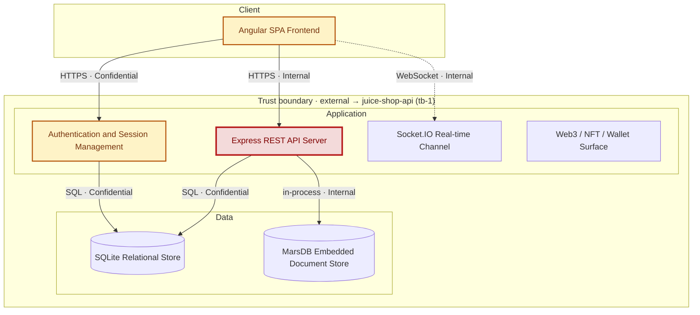
```mermaid
flowchart TB
    subgraph Client
        juice_shop_frontend["Angular SPA Frontend"]
    end
    subgraph TBSERVER["Trust boundary · external → juice-shop-api (tb-1)<br/>external → juice-shop-realtime (tb-2)"]
    subgraph Application
        juice_shop_api["Express REST API Server"]
        juice_shop_auth["Authentication and Session Management"]
        juice_shop_realtime["Socket.IO Real-time Channel"]
        juice_shop_web3["Web3 / NFT / Wallet Surface"]
    end
    subgraph Data
        juice_shop_sqlite[("SQLite Relational Store")]
        juice_shop_marsdb[("MarsDB Embedded Document Store")]
    end
    end
    juice_shop_frontend -->|HTTPS · Internal| juice_shop_api
    juice_shop_frontend -->|HTTPS · Confidential| juice_shop_auth
    juice_shop_frontend -.->|WebSocket · Internal| juice_shop_realtime
    juice_shop_api -->|SQL · Confidential| juice_shop_sqlite
    juice_shop_auth -->|SQL · Confidential| juice_shop_sqlite
    juice_shop_api -->|in-process · Internal| juice_shop_marsdb
    classDef critical fill:#f3dada,stroke:#b71c1c,color:#7f0000,stroke-width:3px
    classDef warning  fill:#fef3c7,stroke:#b45309,color:#78350f,stroke-width:2px
    class juice_shop_api critical
    class juice_shop_frontend warning
    class juice_shop_auth warning
```

*Trust boundaries not drawn above: juice-shop-api → juice-shop-sqlite (tb-8), juice-shop-auth → juice-shop-sqlite (tb-9), juice-shop-api → juice-shop-marsdb (tb-10), juice-shop-api → external (tb-11), +3 more - every boundary is listed in [§1 Trust Boundaries](#trust-boundaries).*

**Key takeaway:** The system decomposes into 1 client, 4 application and 2 data unit(s); Express REST API Server carries the most Critical findings (5) and bounds the worst-case blast radius. The build plane (CI/CD Pipeline and Build Infrastructure) is shown in [Figure 1b](#figure-1b).

### 2.3 Components

How each component is reached, what it handles, how many threats hit it, and how effective the controls evidenced on it are. The component table below holds source paths and linked threats per `C-NN`; per-finding evidence is in [§8 Findings Register](#8-findings-register).

<!-- detail-table -->
| Component | Inbound flows | Data handled | Threats | Controls: worst effectiveness per domain |
|----------------------|----------------------|----------------------|----------------------|----------------------|
| [C-01](#c-01) · Express REST API Server | 1 unauthenticated<br/>1 authenticated (bearer) | Confidential · payment-data, personal-data | 37 (🔴 5 · 🟠 17 · 🟡 15) | 🔴 Unsafe: Input / query (2)<br/>🔴 Missing: LLM (2)<br/>🟠 Weak: AuthN, AuthZ (3) |
| [C-02](#c-02) · Authentication and Session Management | 3 authenticated (bearer, other, password) | Confidential · credentials, secrets | 15 (🔴 1 · 🟠 6 · 🟡 8) | 🔴 Unsafe: Input / query, Secrets / crypto<br/>(2), Supply chain<br/>🟠 Weak: AuthN (3)<br/>🟡 Partial: Session |
| [C-03](#c-03) · Socket\.IO Real-time Channel | 1 unauthenticated | Internal | 5 (🔴 1 · 🟡 4) | – |
| [C-04](#c-04) · Web3 / NFT / Wallet Surface | none modeled | Internal · secrets | 4 (🟠 1 · 🟡 3) | – |
| [C-05](#c-05) · Angular SPA Frontend | 2 authentication unknown<br/>1 authenticated (oauth2) | Confidential · credentials, payment-data | 7 (🟠 5 · 🟡 2) | 🔴 Unsafe: Output encoding<br/>🟠 Weak: Session |
| [C-06](#c-06) · SQLite Relational Store | 2 unauthenticated | Confidential · credentials, payment-data,<br/>personal-data | none | 🔴 Missing: AuthZ |
| [C-07](#c-07) · MarsDB Embedded Document Store | 1 unauthenticated | Internal | none | – |
| [C-08](#c-08) · CI/CD Pipeline and Build Infrastructure | none modeled | secrets | 9 (🟠 2 · 🟡 7) | 🟡 Partial: Supply chain (2) |
| System-wide: evidence not tied to one<br/>component | – | – | – | 🔴 Unsafe: AuthN (3)<br/>🔴 Missing: Supply chain (2)<br/>🟡 Partial: Transport, Logging |

*🔴 **Unsafe**: relied upon but defeated or trivially bypassable - fix it · 🔴 **Missing**: never built - add it · 🟠 **Weak**: present, with exploitable gaps · 🟡 **Partial**: covers some surfaces, meaningful gaps remain · 🟢 **Adequate**: present and sound. A control counts for the component whose paths hold its implementation evidence; a domain without an evidenced control is not listed; (n) counts the controls behind a rating. Threat counts use the Figure 1 attribution; [§6](#6-security-architecture) holds the full assessment.*

**Key takeaway:** Every component that handles credentials (C-02, C-05, C-06) has at least one control rated Unsafe or Missing; 3 components have no component-specific control (C-03, C-04, C-07); 7 controls apply system-wide.

| ID | Name | Type | Key Paths | Linked Threats |
|----|----------------------|-----------|--------------------------------------|------------------------------------------------|
| <a id="c-01"></a><a id="juice-shop-api"></a><span style="white-space:nowrap">C-01</span> | Express REST API Server | application | `server.ts`<br/>`app.ts`<br/>`routes/*.ts`<br/>`lib/*.ts`<br/>`lib/startup/*.ts` | 🔴 [F-003](#f-003) — SQL injection in login query<br/>🔴 [F-004](#f-004) — SQL injection request data interpolated into a SQL string<br/>🔴 [F-005](#f-005) — Insecure Direct Object Reference<br/>🔴 [F-006](#f-006) — Eval of stored username on profile page<br/>🔴 [F-007](#f-007) — Mass assignment of role on user registration<br/>🟠 [F-008](#f-008) — Hardcoded RSA JWT signing key<br/>🟠 [F-009](#f-009) — JWT Accepted Without Signature Verification<br/>🟠 [F-010](#f-010) — Insecure JWT Verification<br/>🟠 [F-011](#f-011) — Security-question password reset<br/>🟠 [F-013](#f-013) — Plaintext TOTP secret storage<br/>🟠 [F-014](#f-014) — Path traversal filesystem access from request input<br/>🟠 [F-015](#f-015) — Zip Slip path traversal in complaint upload<br/>🟠 [F-016](#f-016) — Code evaluation of B2B order input<br/>🟠 [F-017](#f-017) — Input in executable NoSQL predicate<br/>🟠 [F-018](#f-018) — Input compiled as template source<br/>🟠 [F-021](#f-021) — Memories endpoint leaks full user records<br/>🟠 [F-022](#f-022) — Public directory listing of access logs<br/>🟠 [F-023](#f-023) — XXE in unauthenticated XML upload<br/>🟠 [F-028](#f-028) — Password hashed without salt<br/>🟠 [F-030](#f-030) — Event-loop blocking YAML/XML parsing<br/>🟠 [F-032](#f-032) — Sensitive Routes Registered Without Authentication Middleware<br/>🟠 [F-033](#f-033) — Unauthenticated product update<br/>🟡 [F-034](#f-034) — Open redirect<br/>🟡 [F-035](#f-035) — Password change without current password<br/>🟡 [F-041](#f-041) — Missing npm Lockfile<br/>🟡 [F-042](#f-042) — Client-controlled chat history reaches model<br/>🟡 [F-047](#f-047) — Unsanitized email persisted when XSS challenge<br/>🟡 [F-049](#f-049) — Verbose error handler in all environments<br/>🟡 [F-050](#f-050) — Unauthenticated admin config and metrics routes<br/>🟡 [F-055](#f-055) — Unbounded LLM consumption on chat endpoint<br/>🟡 [F-060](#f-060) — Deluxe upgrade without payment<br/>🟡 [F-061](#f-061) — Model-chosen coupon discount not bounded<br/>🟡 [F-062](#f-062) — Arbitrary wallet top-up amount<br/>🟡 [F-076](#f-076) — User bypasses a required approval<br/>🟡 [F-078](#f-078) — Customer completes checkout<br/>🟡 [F-079](#f-079) — Customer modifies or empties another customer's |
| <a id="c-02"></a><a id="juice-shop-auth"></a><span style="white-space:nowrap">C-02</span> | Authentication and Session Management | application | `routes/login.ts`<br/>`routes/saveLoginIp.ts`<br/>`routes/2fa.ts`<br/>`routes/authenticatedUsers.ts`<br/>`routes/resetPassword.ts` | 🟠 [F-024](#f-024) — Password hash and TOTP secret in JWT payload<br/>🟠 [F-025](#f-025) — Unsalted MD5 password hashing<br/>🟡 [F-002](#f-002) — Missing Security Audit Logging<br/>🟡 [F-036](#f-036) — No server-side JWT revocation<br/>🟡 [F-048](#f-048) — Login IP taken from spoofable header<br/>🟡 [F-051](#f-051) — Reset response returns full user record<br/>🟡 [F-052](#f-052) — User list handler lacks role check<br/>🟡 [F-053](#f-053) — Session token cookie without HttpOnly<br/>🟡 [F-056](#f-056) — Unbounded in-memory token registry<br/>🟡 [F-077](#f-077) — User keeps |
| <a id="c-03"></a><a id="juice-shop-realtime"></a><span style="white-space:nowrap">C-03</span> | Socket\.IO Real-time Channel | application | `lib/startup/registerWebsocketEvents.ts`<br/>`lib/challengeUtils.ts` | 🔴 [F-031](#f-031) — ReDoS in SVG verify event regex<br/>🟡 [F-038](#f-038) — Unauthenticated WebSocket Channel<br/>🟡 [F-046](#f-046) — Client-asserted challenge verification<br/>🟡 [F-080](#f-080) — Unauthenticated actor injects false |
| <a id="c-04"></a><a id="juice-shop-web3"></a><span style="white-space:nowrap">C-04</span> | Web3 / NFT / Wallet Surface | application | `routes/checkKeys.ts`<br/>`routes/nftMint.ts`<br/>`routes/redirect.ts`<br/>`routes/web3Wallet.ts` | 🟠 [F-029](#f-029) — Hardcoded wallet BIP39 mnemonic<br/>🟡 [F-057](#f-057) — Unbounded global wallet set growth |
| <a id="c-05"></a><a id="juice-shop-frontend"></a><span style="white-space:nowrap">C-05</span> | Angular SPA Frontend | client | `frontend/src/**/*.ts`<br/>`frontend/src/**/*.html`<br/>`frontend/src/**/*.scss` | 🟠 [F-001](#f-001) — XSS via Angular Sanitizer Bypass<br/>🟠 [F-012](#f-012) — Weak derived OAuth password<br/>🟠 [F-026](#f-026) — JWT in script-readable storage<br/>🟠 [F-074](#f-074) — XSS renders attacker-controlled markup<br/>🟠 [F-075](#f-075) — Token flow accepts a stolen bearer token without<br/>🟡 [F-037](#f-037) — OAuth implicit flow without state<br/>🟡 [F-054](#f-054) — Credential pair in client bundle |
| <a id="c-06"></a><a id="juice-shop-sqlite"></a><span style="white-space:nowrap">C-06</span> | SQLite Relational Store | data | `models/index.ts`<br/>`models/*.ts` | - |
| <a id="c-07"></a><a id="juice-shop-marsdb"></a><span style="white-space:nowrap">C-07</span> | MarsDB Embedded Document Store | data | `data/mongodb.ts` | - |
| <a id="c-08"></a><a id="juice-shop-cicd"></a><span style="white-space:nowrap">C-08</span> | CI/CD Pipeline and Build Infrastructure | application | `.github/workflows/**`<br/>`.gitlab-ci.yml`<br/>`Dockerfile`<br/>`docker-compose*.yml`<br/>`package.json` | 🟠 [F-020](#f-020) — Lockfile disabled; builds resolve npm graph fresh<br/>🟠 [F-040](#f-040) — Untrusted npm Install/Postinstall Scripts Enabled<br/>🟡 [F-039](#f-039) — Missing Container Image Signing — *.yml<br/>🟡 [F-043](#f-043) — Remote installer piped to shell in deploy job<br/>🟡 [F-044](#f-044) — Mutable action refs receive GITHUB_TOKEN<br/>🟡 [F-045](#f-045) — Base images referenced by floating tag, no digest<br/>🟡 [F-058](#f-058) — Container Runs as Root<br/>🟡 [F-059](#f-059) — Missing Workflow Permissions Block<br/>🟡 [F-063](#f-063) — Workflows lack permissions block; token persisted |

> **Legend:** `-->` synchronous request/response (REST, HTTPS, gRPC) · `-.->` asynchronous / event-driven (WebSocket, queue, pub-sub) · **red border** ≥ 3 Critical threats on the component · **amber border** ≥ 2 High threats

---

## 3. Attack Walkthroughs

This section walks through how the highest-risk findings are exploited - one short walkthrough per Critical, each with attack steps, a focused sequence diagram, and the primary mitigation. Which root cause each Critical traces back to is in [Critical Findings by Root Cause](#critical-findings-by-root-cause); full per-finding context (severity rationale, assets, detection signals) is in the [§8 Findings Register](#8-findings-register).

### 3.1 Insecure Direct Object Reference in Address

**Source:** 🔴 [F-005](#f-005) — `routes/address.ts:11`

Severity **Critical** ([CWE-639](https://cwe.mitre.org/data/definitions/639.html)). STRIDE: Tampering. See [§8 F-005](#f-005) for the full register row.

**Attack Steps**

1. An attacker crafts a request that reaches the code at `routes/address.ts:11`.
2. A signed-in attacker puts another user's ID into the owner field of the request (`req.body.UserId` and the like); the query trusts it instead of the session identity, so the attacker reads or changes every other user's records - horizontal privilege escalation across all accounts.

**Sequence Diagram**

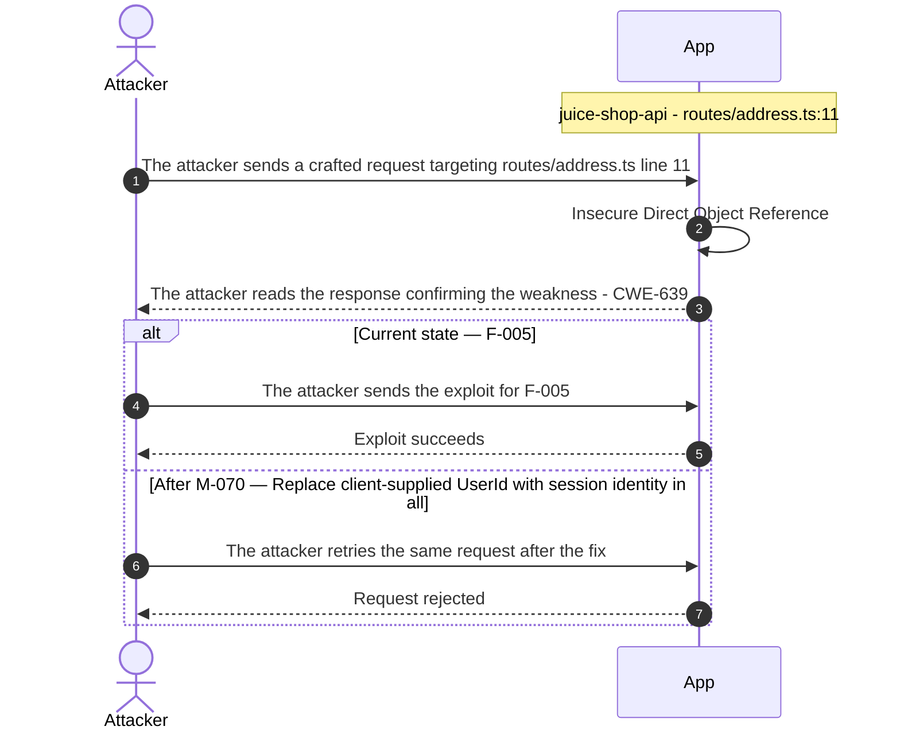
```mermaid
sequenceDiagram
    autonumber
    actor Attacker
    participant App
    Note over App: juice-shop-api - routes/address.ts:11
    Attacker->>App: The attacker sends a crafted request targeting routes/address.ts line 11
    App->>App: Insecure Direct Object Reference
    App-->>Attacker: The attacker reads the response confirming the weakness - CWE-639
    alt Current state — F-005
        Attacker->>App: The attacker sends the exploit for F-005
        App-->>Attacker: Exploit succeeds
    else After M-070 — Replace client-supplied UserId with session identity in all
        Attacker->>App: The attacker retries the same request after the fix
        App-->>Attacker: Request rejected
    end
```

**Key takeaway:** Until ● [M-070](#m-070) (Replace client-supplied UserId with session identity in all owner filters) lands, 🔴 [F-005](#f-005) — Insecure Direct Object Reference is exploitable at `routes/address.ts:11` (Critical-severity, [CWE-639](https://cwe.mitre.org/data/definitions/639.html)).

**Defense in Depth**

- Primary mitigation: ● [M-070](#m-070) (Replace client-supplied UserId with session identity in all owner filters)

### 3.2 Mass assignment of role on user registration in Express REST API Server

**Source:** 🔴 [F-007](#f-007) — `server.ts:501`

Severity **Critical** ([CWE-915](https://cwe.mitre.org/data/definitions/915.html)). STRIDE: Elevation of Privilege. See [§8 F-007](#f-007) for the full register row.

**Attack Steps**

1. I POST `/api/Users` with my email, a password, and role set to admin.
2. I log in through `/rest/user/login` and receive a JWT whose `data.role` is admin.
3. I use admin-only views and APIs to read all users and orders.

**Sequence Diagram**

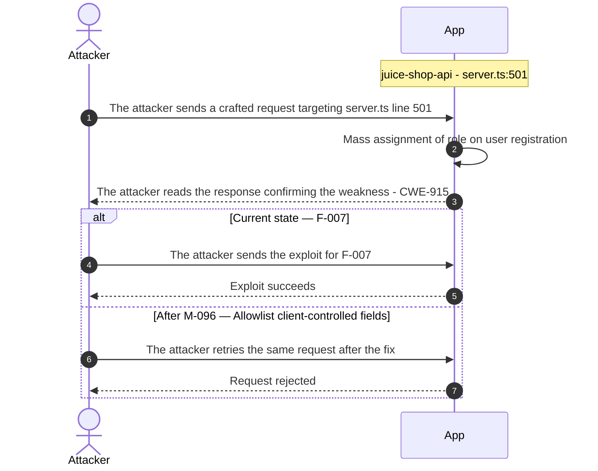
```mermaid
sequenceDiagram
    autonumber
    actor Attacker
    participant App
    Note over App: juice-shop-api - server.ts:501
    Attacker->>App: The attacker sends a crafted request targeting server.ts line 501
    App->>App: Mass assignment of role on user registration
    App-->>Attacker: The attacker reads the response confirming the weakness - CWE-915
    alt Current state — F-007
        Attacker->>App: The attacker sends the exploit for F-007
        App-->>Attacker: Exploit succeeds
    else After M-096 — Allowlist client-controlled fields
        Attacker->>App: The attacker retries the same request after the fix
        App-->>Attacker: Request rejected
    end
```

**Key takeaway:** Until ● [M-096](#m-096) (Allowlist client-controlled fields) lands, 🔴 [F-007](#f-007) — Mass assignment of role on user registration is exploitable at `server.ts:501` (Critical-severity, [CWE-915](https://cwe.mitre.org/data/definitions/915.html)).

**Defense in Depth**

- Primary mitigation: ● [M-096](#m-096) (Allowlist client-controlled fields)

### 3.3 SQL injection request data interpolated into a SQL string in Search

**Source:** 🔴 [F-004](#f-004) — `routes/search.ts:23`

Severity **Critical** ([CWE-89](https://cwe.mitre.org/data/definitions/89.html)). STRIDE: Tampering. See [§8 F-004](#f-004) for the full register row.

**Attack Steps**

1. Find the request parameter that reaches the raw query at `routes/search.ts:23`.
2. Interpolating request-controlled text into a SQL statement lets an attacker alter the query - exfiltrating or modifying arbitrary rows, bypassing authentication, or escalating to full database control.

**Sequence Diagram**

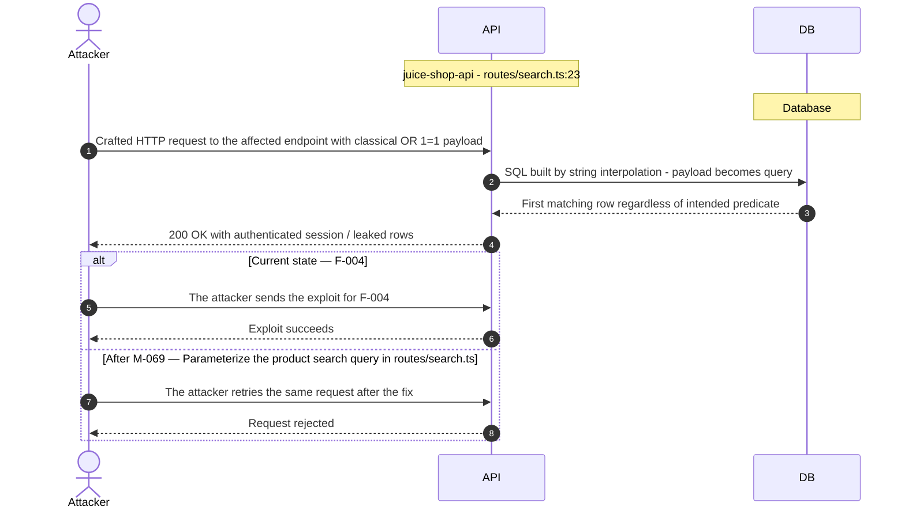
```mermaid
sequenceDiagram
    autonumber
    actor Attacker
    participant API
    participant DB
    Note over API: juice-shop-api - routes/search.ts:23
    Note over DB: Database
    Attacker->>API: Crafted HTTP request to the affected endpoint with classical OR 1=1 payload
    API->>DB: SQL built by string interpolation - payload becomes query
    DB-->>API: First matching row regardless of intended predicate
    API-->>Attacker: 200 OK with authenticated session / leaked rows
    alt Current state — F-004
        Attacker->>API: The attacker sends the exploit for F-004
        API-->>Attacker: Exploit succeeds
    else After M-069 — Parameterize the product search query in routes/search.ts
        Attacker->>API: The attacker retries the same request after the fix
        API-->>Attacker: Request rejected
    end
```

**Key takeaway:** Until ● [M-069](#m-069) (Parameterize the product search query) lands, 🔴 [F-004](#f-004) — SQL injection request data interpolated into a SQL string is exploitable at `routes/search.ts:23` (Critical-severity, [CWE-89](https://cwe.mitre.org/data/definitions/89.html)).

**Defense in Depth**

- Primary mitigation: ● [M-069](#m-069) (Parameterize the product search query)

### 3.4 SQL injection in login query

**Source:** 🔴 [F-003](#f-003) — `routes/login.ts:34`

Severity **Critical** ([CWE-89](https://cwe.mitre.org/data/definitions/89.html)). STRIDE: Spoofing. See [§8 F-003](#f-003) for the full register row.

**Attack Steps**

1. I POST `/rest/user/login` with email set to a known address followed by `'--` and any password.
2. The query returns that user's row and I receive a valid JWT for the account without its password.

**Sequence Diagram**

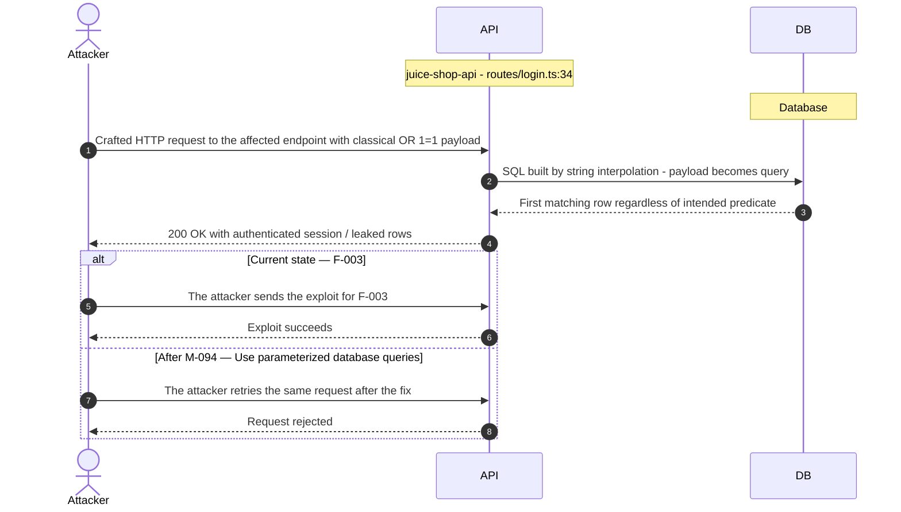
```mermaid
sequenceDiagram
    autonumber
    actor Attacker
    participant API
    participant DB
    Note over API: juice-shop-api - routes/login.ts:34
    Note over DB: Database
    Attacker->>API: Crafted HTTP request to the affected endpoint with classical OR 1=1 payload
    API->>DB: SQL built by string interpolation - payload becomes query
    DB-->>API: First matching row regardless of intended predicate
    API-->>Attacker: 200 OK with authenticated session / leaked rows
    alt Current state — F-003
        Attacker->>API: The attacker sends the exploit for F-003
        API-->>Attacker: Exploit succeeds
    else After M-094 — Use parameterized database queries
        Attacker->>API: The attacker retries the same request after the fix
        API-->>Attacker: Request rejected
    end
```

**Key takeaway:** Until ● [M-094](#m-094) (Use parameterized database queries) lands, 🔴 [F-003](#f-003) — SQL injection in login query is exploitable at `routes/login.ts:34` (Critical-severity, [CWE-89](https://cwe.mitre.org/data/definitions/89.html)).

**Defense in Depth**

- Primary mitigation: ● [M-094](#m-094) (Use parameterized database queries)

### 3.5 Eval of stored username on profile page in Express REST API Server

**Source:** 🔴 [F-006](#f-006) — `routes/userProfile.ts:61`

Severity **Critical** ([CWE-95](https://cwe.mitre.org/data/definitions/95.html)). STRIDE: Elevation of Privilege. See [§8 F-006](#f-006) for the full register row.

**Attack Steps**

1. I register an account and log in to obtain the token cookie.
2. I POST `/profile` with username #{`require('child_process').execSync('id').toString()`}.
3. I GET `/profile` and the server evaluates my expression, rendering the command output as my username.

**Sequence Diagram**

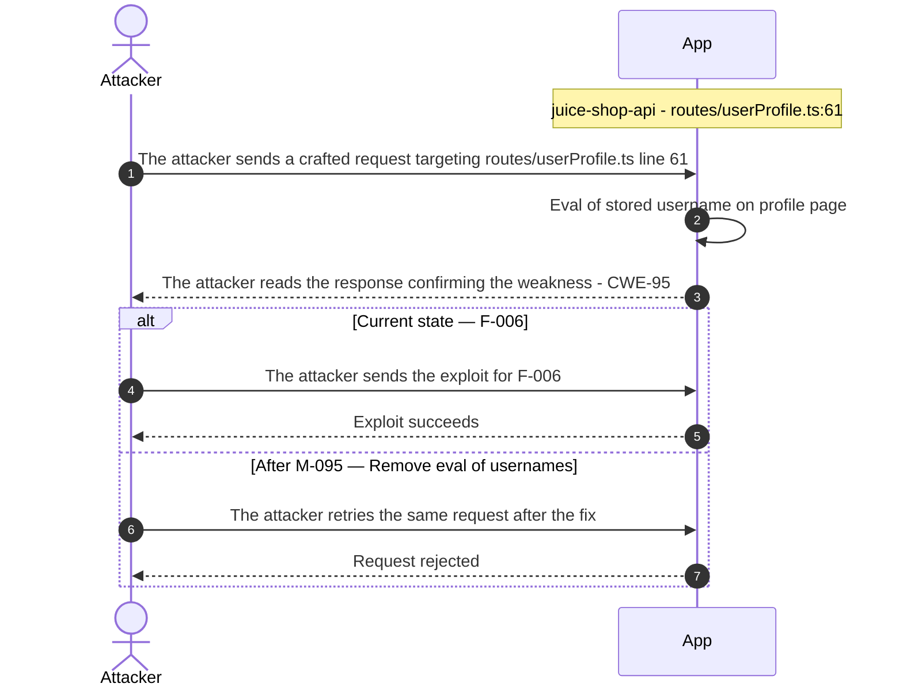
```mermaid
sequenceDiagram
    autonumber
    actor Attacker
    participant App
    Note over App: juice-shop-api - routes/userProfile.ts:61
    Attacker->>App: The attacker sends a crafted request targeting routes/userProfile.ts line 61
    App->>App: Eval of stored username on profile page
    App-->>Attacker: The attacker reads the response confirming the weakness - CWE-95
    alt Current state — F-006
        Attacker->>App: The attacker sends the exploit for F-006
        App-->>Attacker: Exploit succeeds
    else After M-095 — Remove eval of usernames
        Attacker->>App: The attacker retries the same request after the fix
        App-->>Attacker: Request rejected
    end
```

**Key takeaway:** Until ● [M-095](#m-095) (Remove eval of usernames) lands, 🔴 [F-006](#f-006) — Eval of stored username on profile page is exploitable at `routes/userProfile.ts:61` (Critical-severity, [CWE-95](https://cwe.mitre.org/data/definitions/95.html)).

**Defense in Depth**

- Primary mitigation: ● [M-095](#m-095) (Remove eval of usernames)

### 3.6 ReDoS in SVG verify event regex

**Source:** 🔴 [F-031](#f-031) — `lib/startup/registerWebsocketEvents.ts:46`

Severity **Critical** ([CWE-1333](https://cwe.mitre.org/data/definitions/1333.html)). STRIDE: Denial of Service. See [§8 F-031](#f-031) for the full register row.

**Attack Steps**

1. I connect to the Socket\.IO endpoint without credentials.
2. I repeatedly emit 'verifySvgInjectionChallenge' with a several-hundred-kilobyte string of 'a' characters to block the event loop.

**Sequence Diagram**

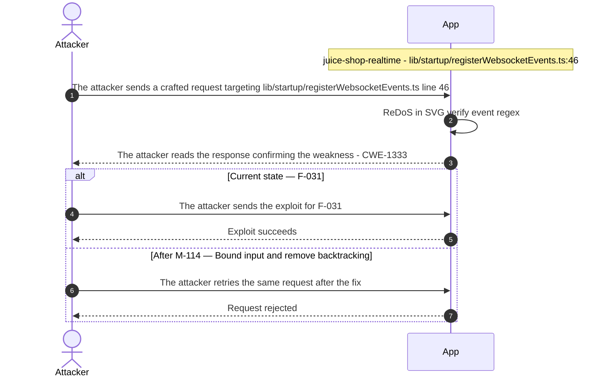
```mermaid
sequenceDiagram
    autonumber
    actor Attacker
    participant App
    Note over App: juice-shop-realtime - lib/startup/registerWebsocketEvents.ts:46
    Attacker->>App: The attacker sends a crafted request targeting lib/startup/registerWebsocketEvents.ts line 46
    App->>App: ReDoS in SVG verify event regex
    App-->>Attacker: The attacker reads the response confirming the weakness - CWE-1333
    alt Current state — F-031
        Attacker->>App: The attacker sends the exploit for F-031
        App-->>Attacker: Exploit succeeds
    else After M-114 — Bound input and remove backtracking
        Attacker->>App: The attacker retries the same request after the fix
        App-->>Attacker: Request rejected
    end
```

**Key takeaway:** Until ● [M-114](#m-114) (Bound input and remove backtracking) lands, 🔴 [F-031](#f-031) — ReDoS in SVG verify event regex is exploitable at `lib/startup/registerWebsocketEvents.ts:46` (Critical-severity, [CWE-1333](https://cwe.mitre.org/data/definitions/1333.html)).

**Defense in Depth**

- Primary mitigation: ● [M-114](#m-114) (Bound input and remove backtracking)

### 3.7 Insecure JWT Verification in Express REST API Server

**Source:** 🟠 [F-010](#f-010) — `lib/insecurity.ts:52`

Severity **High** ([CWE-347](https://cwe.mitre.org/data/definitions/347.html)). STRIDE: Spoofing. See [§8 F-010](#f-010) for the full register row.

**Attack Steps**

1. I fetch `encryptionkeys/jwt.pub` from the public `/encryptionkeys` listing.
2. I sign a JWT with `HS256` using the public key text as secret and set `data.role` to admin and `data.email` to the admin account.
3. I send it as Bearer token to `/rest/basket` or `/api/Users` and the `isAuthorized()` middleware accepts it as that admin identity.

**Sequence Diagram**

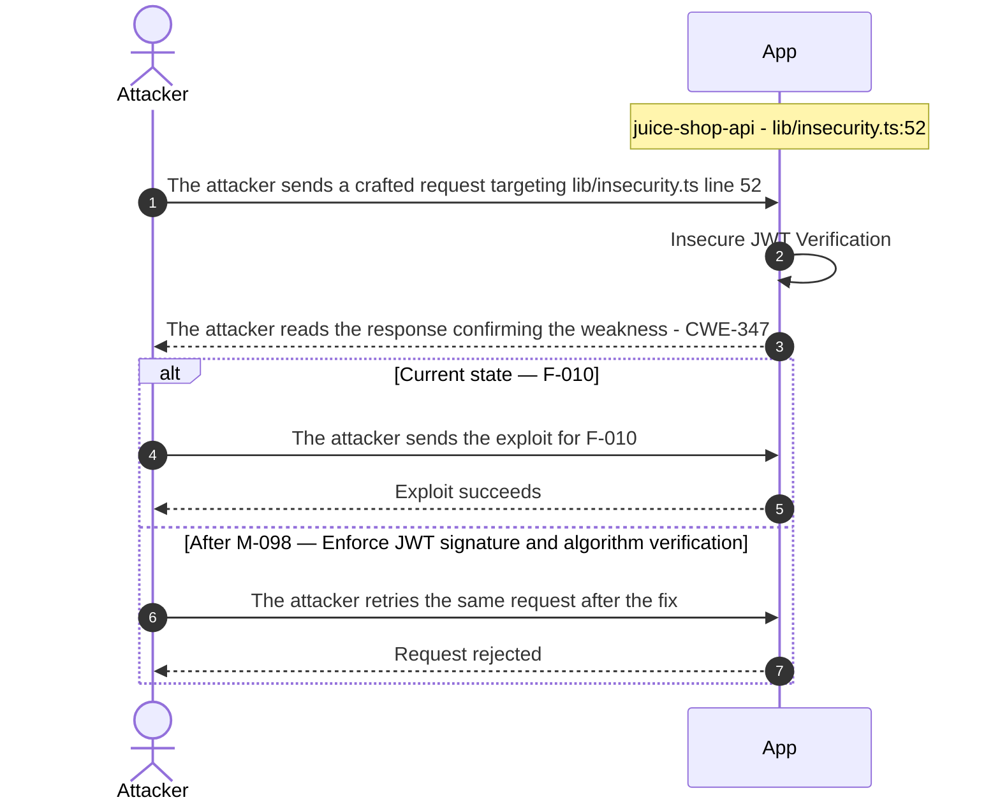
```mermaid
sequenceDiagram
    autonumber
    actor Attacker
    participant App
    Note over App: juice-shop-api - lib/insecurity.ts:52
    Attacker->>App: The attacker sends a crafted request targeting lib/insecurity.ts line 52
    App->>App: Insecure JWT Verification
    App-->>Attacker: The attacker reads the response confirming the weakness - CWE-347
    alt Current state — F-010
        Attacker->>App: The attacker sends the exploit for F-010
        App-->>Attacker: Exploit succeeds
    else After M-098 — Enforce JWT signature and algorithm verification
        Attacker->>App: The attacker retries the same request after the fix
        App-->>Attacker: Request rejected
    end
```

**Key takeaway:** Until ◕ [M-098](#m-098) (Enforce JWT signature and algorithm verification) lands, 🟠 [F-010](#f-010) — Insecure JWT Verification is exploitable at `lib/insecurity.ts:52` (High-severity, [CWE-347](https://cwe.mitre.org/data/definitions/347.html)).

**Defense in Depth**

- Primary mitigation: ◕ [M-098](#m-098) (Enforce JWT signature and algorithm verification)

### 3.8 Hardcoded RSA JWT signing key in Express REST API Server

**Source:** 🟠 [F-008](#f-008) — `lib/insecurity.ts:21`

Severity **High** ([CWE-321](https://cwe.mitre.org/data/definitions/321.html)). STRIDE: Spoofing. See [§8 F-008](#f-008) for the full register row.

**Attack Steps**

1. I copy the PEM private key literal from `lib/insecurity.ts:21` in the public repository.
2. I sign an `RS256` JWT with `data.id` 1 and `data.role` admin using that key.
3. I call `/rest/user/authentication-details` with the token and receive all user records as admin.

**Sequence Diagram**

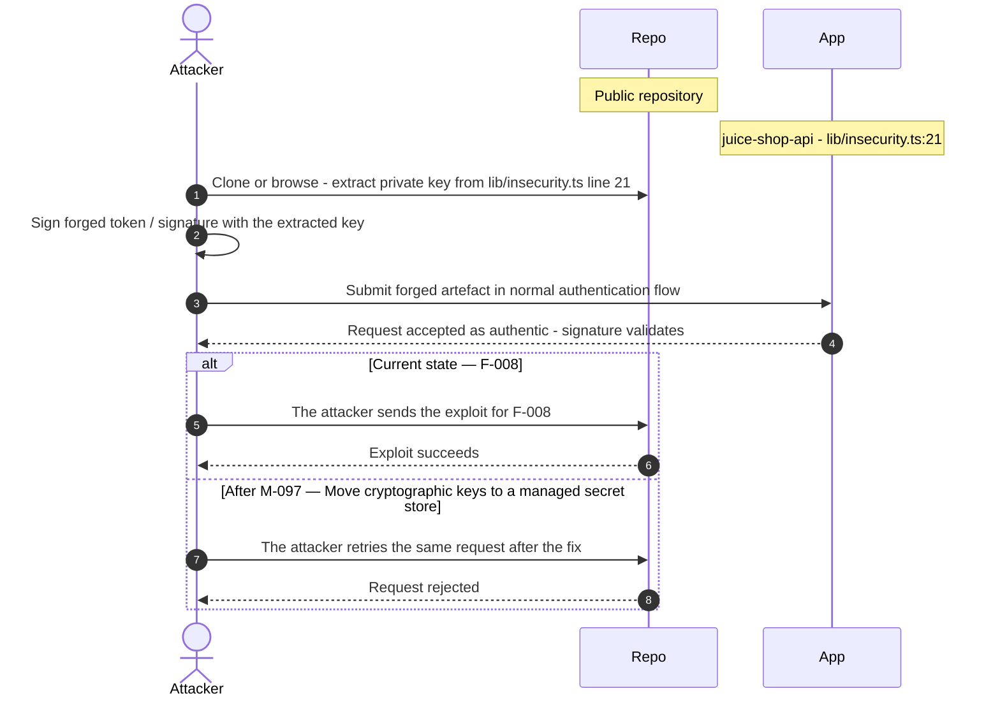
```mermaid
sequenceDiagram
    autonumber
    actor Attacker
    participant Repo
    participant App
    Note over Repo: Public repository
    Note over App: juice-shop-api - lib/insecurity.ts:21
    Attacker->>Repo: Clone or browse - extract private key from lib/insecurity.ts line 21
    Attacker->>Attacker: Sign forged token / signature with the extracted key
    Attacker->>App: Submit forged artefact in normal authentication flow
    App-->>Attacker: Request accepted as authentic - signature validates
    alt Current state — F-008
        Attacker->>Repo: The attacker sends the exploit for F-008
        Repo-->>Attacker: Exploit succeeds
    else After M-097 — Move cryptographic keys to a managed secret store
        Attacker->>Repo: The attacker retries the same request after the fix
        Repo-->>Attacker: Request rejected
    end
```

**Key takeaway:** Until ◕ [M-097](#m-097) (Move cryptographic keys to a managed secret store) lands, 🟠 [F-008](#f-008) — Hardcoded RSA JWT signing key is exploitable at `lib/insecurity.ts:21` (High-severity, [CWE-321](https://cwe.mitre.org/data/definitions/321.html)).

**Defense in Depth**

- Primary mitigation: ◕ [M-097](#m-097) (Move cryptographic keys to a managed secret store)

<!-- generated:walkthrough_renderer -->

---

## 4. Assets

Information assets and the classification level that drives the Confidentiality / Integrity / Availability targets used in [§8 Findings Register](#8-findings-register) risk scoring.

<table style="table-layout:fixed;width:100%">
<colgroup><col width="22%" style="width:22%"><col width="13%" style="width:13%"><col width="32%" style="width:32%"><col width="33%" style="width:33%"></colgroup>
<thead><tr><th>Asset</th><th>Classification</th><th>Description</th><th>Linked Threats</th></tr></thead>
<tbody>
<tr><td style="overflow-wrap:break-word">JWT <code>RS256</code> Private Signing Key</td><td>Restricted</td><td>RSA private key hardcoded in <code>lib/insecurity.ts</code> used to sign all user JWT tokens. Compromise of this key allows forging valid session tokens for any user, including admin. Intentionally exposed as a training target.</td><td style="overflow-wrap:break-word">🟠 <a href="#f-008">F-008</a> — Hardcoded RSA JWT signing key<br/>🟠 <a href="#f-010">F-010</a> — Insecure JWT Verification<br/>🟠 <a href="#f-014">F-014</a> — Path traversal filesystem access from request input<br/>🟠 <a href="#f-015">F-015</a> — Zip Slip path traversal in complaint upload<br/>🟠 <a href="#f-021">F-021</a> — Memories endpoint leaks full user records<br/>🟠 <a href="#f-025">F-025</a> — Unsalted MD5 password hashing<br/>🟠 <a href="#f-029">F-029</a> — Hardcoded wallet BIP39 mnemonic<br/>🟡 <a href="#f-036">F-036</a> — No server-side JWT revocation<br/>🟡 <a href="#f-051">F-051</a> — Reset response returns full user record<br/>🟡 <a href="#f-053">F-053</a> — Session token cookie without HttpOnly<br/>🟡 <a href="#f-054">F-054</a> — Credential pair in client bundle<br/>🟡 <a href="#f-056">F-056</a> — Unbounded in-memory token registry<br/>🟡 <a href="#f-077">F-077</a> — User keeps</td></tr>
<tr><td style="overflow-wrap:break-word">HMAC Signing Secret</td><td>Restricted</td><td>Hardcoded HMAC-SHA256 literal key used for coupon and other integrity-signing operations. Exposure allows forging signed values accepted by the backend.</td><td style="overflow-wrap:break-word">-</td></tr>
<tr><td style="overflow-wrap:break-word">Encryption Keys Directory</td><td>Restricted</td><td>Cryptographic key files exposed as a browsable static directory at <code>/encryptionkeys</code> without authentication. Contains signing and encryption material used by the application.</td><td style="overflow-wrap:break-word">🟠 <a href="#f-008">F-008</a> — Hardcoded RSA JWT signing key<br/>🟠 <a href="#f-014">F-014</a> — Path traversal filesystem access from request input<br/>🟠 <a href="#f-015">F-015</a> — Zip Slip path traversal in complaint upload<br/>🟠 <a href="#f-021">F-021</a> — Memories endpoint leaks full user records<br/>🟠 <a href="#f-029">F-029</a> — Hardcoded wallet BIP39 mnemonic<br/>🟠 <a href="#f-032">F-032</a> — Sensitive Routes Registered Without Authentication Middleware<br/>🟡 <a href="#f-051">F-051</a> — Reset response returns full user record<br/>🟡 <a href="#f-054">F-054</a> — Credential pair in client bundle</td></tr>
<tr><td style="overflow-wrap:break-word">User Credentials</td><td>Confidential</td><td>User email addresses and unsalted <code>MD5</code> password hashes stored in the SQLite users table. Juice Shop uses synthetic/demo data; the credential pattern is representative of a real credential store. The <code>MD5</code> hash is intentionally weak as a training target.</td><td style="overflow-wrap:break-word">🟠 <a href="#f-001">F-001</a> — XSS via Angular Sanitizer Bypass<br/>🔴 <a href="#f-003">F-003</a> — SQL injection in login query<br/>🔴 <a href="#f-004">F-004</a> — SQL injection request data interpolated into a SQL string<br/>🟠 <a href="#f-012">F-012</a> — Weak derived OAuth password<br/>🟠 <a href="#f-013">F-013</a> — Plaintext TOTP secret storage<br/>🟠 <a href="#f-024">F-024</a> — Password hash and TOTP secret in JWT payload<br/>🟠 <a href="#f-025">F-025</a> — Unsalted MD5 password hashing<br/>🟠 <a href="#f-028">F-028</a> — Password hashed without salt<br/>🟡 <a href="#f-047">F-047</a> — Unsanitized email persisted when XSS challenge<br/>🟠 <a href="#f-074">F-074</a> — XSS renders attacker-controlled markup</td></tr>
<tr><td style="overflow-wrap:break-word">User Session Tokens (JWTs)</td><td>Confidential</td><td><code>RS256</code> JWTs with 6-hour expiry issued on login, stored in browser <code>localStorage</code>, and transmitted via Authorization Bearer header. Server-side registry <code>authenticatedUsers</code> tracks active tokens.</td><td style="overflow-wrap:break-word">🟠 <a href="#f-001">F-001</a> — XSS via Angular Sanitizer Bypass<br/>🟠 <a href="#f-009">F-009</a> — JWT Accepted Without Signature Verification<br/>🟠 <a href="#f-010">F-010</a> — Insecure JWT Verification<br/>🟠 <a href="#f-026">F-026</a> — JWT in script-readable storage<br/>🟡 <a href="#f-036">F-036</a> — No server-side JWT revocation<br/>🟡 <a href="#f-037">F-037</a> — OAuth implicit flow without state<br/>🟡 <a href="#f-039">F-039</a> — Missing Container Image Signing — *.yml<br/>🟡 <a href="#f-047">F-047</a> — Unsanitized email persisted when XSS challenge<br/>🟡 <a href="#f-048">F-048</a> — Login IP taken from spoofable header<br/>🟠 <a href="#f-074">F-074</a> — XSS renders attacker-controlled markup<br/>🟠 <a href="#f-075">F-075</a> — Token flow accepts a stolen bearer token without<br/>🟡 <a href="#f-077">F-077</a> — User keeps</td></tr>
<tr><td style="overflow-wrap:break-word">User Personal Data</td><td>Confidential</td><td>User profile records including names, email addresses, delivery addresses, and order history stored in the SQLite database. Synthetic data in the training deployment.</td><td style="overflow-wrap:break-word">🟠 <a href="#f-001">F-001</a> — XSS via Angular Sanitizer Bypass<br/>🔴 <a href="#f-003">F-003</a> — SQL injection in login query<br/>🔴 <a href="#f-004">F-004</a> — SQL injection request data interpolated into a SQL string<br/>🔴 <a href="#f-005">F-005</a> — Insecure Direct Object Reference<br/>🔴 <a href="#f-007">F-007</a> — Mass assignment of role on user registration<br/>🟠 <a href="#f-021">F-021</a> — Memories endpoint leaks full user records<br/>🟠 <a href="#f-032">F-032</a> — Sensitive Routes Registered Without Authentication Middleware<br/>🟠 <a href="#f-033">F-033</a> — Unauthenticated product update<br/>🟡 <a href="#f-047">F-047</a> — Unsanitized email persisted when XSS challenge<br/>🟡 <a href="#f-051">F-051</a> — Reset response returns full user record<br/>🟡 <a href="#f-052">F-052</a> — User list handler lacks role check<br/>🟠 <a href="#f-074">F-074</a> — XSS renders attacker-controlled markup<br/>🟡 <a href="#f-078">F-078</a> — Customer completes checkout<br/>🟡 <a href="#f-079">F-079</a> — Customer modifies or empties another customer's</td></tr>
<tr><td style="overflow-wrap:break-word">Payment Card Data</td><td>Confidential</td><td>Credit and debit card records stored in the SQLite cards table; submitted and retrieved via <code>/api/Cards</code>. Synthetic data in the training deployment; intentionally lacks authorization checks on card ownership.</td><td style="overflow-wrap:break-word">🟠 <a href="#f-001">F-001</a> — XSS via Angular Sanitizer Bypass<br/>🔴 <a href="#f-003">F-003</a> — SQL injection in login query<br/>🔴 <a href="#f-004">F-004</a> — SQL injection request data interpolated into a SQL string<br/>🔴 <a href="#f-005">F-005</a> — Insecure Direct Object Reference<br/>🟠 <a href="#f-032">F-032</a> — Sensitive Routes Registered Without Authentication Middleware<br/>🟠 <a href="#f-033">F-033</a> — Unauthenticated product update<br/>🟡 <a href="#f-047">F-047</a> — Unsanitized email persisted when XSS challenge<br/>🟠 <a href="#f-074">F-074</a> — XSS renders attacker-controlled markup<br/>🟡 <a href="#f-078">F-078</a> — Customer completes checkout<br/>🟡 <a href="#f-079">F-079</a> — Customer modifies or empties another customer's</td></tr>
<tr><td style="overflow-wrap:break-word">Application Access Logs</td><td>Internal</td><td>Morgan combined-format HTTP access logs written to file and served for browsing at <code>/support/logs</code> without enforced authentication. Logs contain request paths, IPs, and user-agent strings that aid reconnaissance.</td><td style="overflow-wrap:break-word">🟠 <a href="#f-014">F-014</a> — Path traversal filesystem access from request input<br/>🟠 <a href="#f-021">F-021</a> — Memories endpoint leaks full user records<br/>🟠 <a href="#f-022">F-022</a> — Public directory listing of access logs<br/>🟠 <a href="#f-032">F-032</a> — Sensitive Routes Registered Without Authentication Middleware<br/>🟠 <a href="#f-033">F-033</a> — Unauthenticated product update<br/>🟡 <a href="#f-051">F-051</a> — Reset response returns full user record</td></tr>
<tr><td style="overflow-wrap:break-word">Application Configuration and Version</td><td>Internal</td><td>Runtime application configuration (themes, feature flags, challenge settings) and version string served via unauthenticated management endpoints <code>/rest/admin/application-configuration</code> and <code>/rest/admin/application-version</code>. Aids targeted exploitation.</td><td style="overflow-wrap:break-word">-</td></tr>
<tr><td style="overflow-wrap:break-word">Uploaded User Files</td><td>Internal</td><td>Files uploaded by users via <code>/file-upload</code> (multer memory storage, max 200 kB) and profile image URL uploads. Processed with intentionally unsafe YAML parsing (<code>js-yaml</code> in vm sandbox) that permits deserialization attacks.</td><td style="overflow-wrap:break-word">-</td></tr>
</tbody>
</table>

---

## 5. Attack Surface

Network-reachable entry points classified by authentication requirement. Each row links to the threat(s) referenced in its **Notes** column. The **Risk** column reflects the highest-severity linked finding. Entry points with no linked finding are still listed when they sit on a sensitive surface (authentication, registration, management) or look like a missing-auth/authz suspect - marked **⚑ Review** in Notes.

### 5.1 Unauthenticated Entry Points (70)

<table style="table-layout:fixed;width:100%">
<colgroup><col width="9%" style="width:9%"><col width="30%" style="width:30%"><col width="14%" style="width:14%"><col width="47%" style="width:47%"></colgroup>
<thead><tr><th>Method</th><th>Route</th><th>Risk</th><th>Notes</th></tr></thead>
<tbody>
<tr><td>POST</td><td style="overflow-wrap:anywhere"><code>/api/Users</code></td><td>🔴 Critical</td><td>🔴 <a href="#f-007">F-007</a> — Mass assignment of role on user registration<br/>🟠 <a href="#f-021">F-021</a> — Memories endpoint leaks full user records<br/>POST <code>/api/Users</code>: open self-registration endpoint; any internet user can create an account immediately (<code>server.ts:408</code>)</td></tr>
<tr><td>POST</td><td style="overflow-wrap:anywhere"><code>/rest/user/login</code></td><td>🔴 Critical</td><td>🔴 <a href="#f-003">F-003</a> — SQL injection in login query<br/>🟠 <a href="#f-024">F-024</a> — Password hash and TOTP secret in JWT payload<br/>🟡 <a href="#f-002">F-002</a> — Missing Security Audit Logging<br/>Public by design</td></tr>
<tr><td>GET</td><td style="overflow-wrap:anywhere"><code>/rest/products/search</code></td><td>🔴 Critical</td><td>🔴 <a href="#f-004">F-004</a> — SQL injection request data interpolated into a SQL string</td></tr>
<tr><td>POST</td><td style="overflow-wrap:anywhere"><code>/file-upload</code></td><td>🟠 High</td><td>🟠 <a href="#f-015">F-015</a> — Zip Slip path traversal in complaint upload<br/>🟠 <a href="#f-023">F-023</a> — XXE in unauthenticated XML upload<br/>🟠 <a href="#f-030">F-030</a> — Event-loop blocking YAML/XML parsing<br/>POST <code>/file-upload</code>: unauthenticated file upload with unsafe YAML parsing in vm sandbox (<code>routes/fileUpload.ts:109</code>); intentional deserialization attack surface</td></tr>
<tr><td>POST</td><td style="overflow-wrap:anywhere"><code>/rest/2fa/verify</code></td><td>🟠 High</td><td>🟠 <a href="#f-009">F-009</a> — JWT Accepted Without Signature Verification<br/>POST <code>/rest/2fa/verify</code>: 2FA verification endpoint; public by design but accepts temporary JWT from login step</td></tr>
<tr><td>POST</td><td style="overflow-wrap:anywhere"><code>/rest/memories</code></td><td>🟠 High</td><td>🟠 <a href="#f-021">F-021</a> — Memories endpoint leaks full user records<br/>POST <code>/rest/memories</code>: disk upload endpoint with authentication status unresolved; potential unauthenticated write to server filesystem</td></tr>
<tr><td>POST</td><td style="overflow-wrap:anywhere"><code>/rest/user/reset-password</code></td><td>🟠 High</td><td>🟠 <a href="#f-011">F-011</a> — Security-question password reset<br/>🟡 <a href="#f-051">F-051</a> — Reset response returns full user record<br/>Public by design</td></tr>
<tr><td>POST</td><td style="overflow-wrap:anywhere"><code>/rest/web3/submitKey</code></td><td>🟠 High</td><td>🟠 <a href="#f-029">F-029</a> — Hardcoded wallet BIP39 mnemonic<br/>POST <code>/rest/web3/submitKey</code>: Ethereum private key verification; authentication unresolved, exposes key-checking logic</td></tr>
<tr><td>GET</td><td style="overflow-wrap:anywhere"><code>/rest/memories</code></td><td>🟠 High</td><td>🟠 <a href="#f-021">F-021</a> — Memories endpoint leaks full user records</td></tr>
<tr><td>GET</td><td style="overflow-wrap:anywhere"><code>/rest/track-order/:id</code></td><td>🟠 High</td><td>🟠 <a href="#f-017">F-017</a> — Input in executable NoSQL predicate</td></tr>
<tr><td>GET</td><td style="overflow-wrap:anywhere"><code>/rest/user/change-password</code></td><td>🟠 High</td><td>🟠 <a href="#f-022">F-022</a> — Public directory listing of access logs<br/>🟡 <a href="#f-035">F-035</a> — Password change without current password</td></tr>
<tr><td>GET</td><td style="overflow-wrap:anywhere"><code>/rest/user/security-question</code></td><td>🟠 High</td><td>🟠 <a href="#f-011">F-011</a> — Security-question password reset<br/>🟡 <a href="#f-051">F-051</a> — Reset response returns full user record</td></tr>
<tr><td>GET</td><td style="overflow-wrap:anywhere"><code>/metrics</code></td><td>🟡 Medium</td><td>🟡 <a href="#f-050">F-050</a> — Unauthenticated admin config and metrics routes<br/>GET <code>/metrics</code>: Prometheus metrics endpoint; unauthenticated management surface exposing internal counters</td></tr>
<tr><td>GET</td><td style="overflow-wrap:anywhere"><code>/​rest/​admin/​application-​configuration</code></td><td>🟡 Medium</td><td>🟡 <a href="#f-050">F-050</a> — Unauthenticated admin config and metrics routes<br/>GET <code>/rest/admin/application-configuration</code>: unauthenticated management endpoint exposing full runtime configuration including theme, challenge and CTF settings</td></tr>
<tr><td>GET</td><td style="overflow-wrap:anywhere"><code>/​rest/​admin/​application-​version</code></td><td>🟡 Medium</td><td>🟡 <a href="#f-050">F-050</a> — Unauthenticated admin config and metrics routes<br/>GET <code>/rest/admin/application-version</code>: unauthenticated management endpoint exposing application version string</td></tr>
<tr><td>POST</td><td style="overflow-wrap:anywhere"><code>/rest/chat</code></td><td>🟡 Medium</td><td>🟡 <a href="#f-042">F-042</a> — Client-controlled chat history reaches model<br/>🟡 <a href="#f-055">F-055</a> — Unbounded LLM consumption on chat endpoint<br/>🟡 <a href="#f-061">F-061</a> — Model-chosen coupon discount not bounded<br/>POST <code>/rest/chat</code>: LLM chatbot endpoint; authentication unresolved, direct model access without rate limiting evidenced, prompt injection risk</td></tr>
<tr><td>POST</td><td style="overflow-wrap:anywhere"><code>/rest/deluxe-membership</code></td><td>🟡 Medium</td><td>🟡 <a href="#f-060">F-060</a> — Deluxe upgrade without payment<br/>POST <code>/rest/deluxe-membership</code>: deluxe membership purchase; authentication unresolved, potential privilege escalation without payment</td></tr>
<tr><td>PUT</td><td style="overflow-wrap:anywhere"><code>/rest/products/:id/reviews</code></td><td>🟡 Medium</td><td>🟡 <a href="#f-076">F-076</a> — User bypasses a required approval<br/>PUT <code>/rest/products/:id/reviews</code>: product review creation; authentication unresolved, stored XSS input vector</td></tr>
<tr><td>PUT</td><td style="overflow-wrap:anywhere"><code>/rest/wallet/balance</code></td><td>🟡 Medium</td><td>🟡 <a href="#f-062">F-062</a> — Arbitrary wallet top-up amount<br/>PUT <code>/rest/wallet/balance</code>: wallet top-up endpoint; authentication unresolved, potential negative-value abuse</td></tr>
<tr><td>POST</td><td style="overflow-wrap:anywhere"><code>/​rest/​web3/​walletExploitAddress</code></td><td>🟡 Medium</td><td>🟡 <a href="#f-057">F-057</a> — Unbounded global wallet set growth<br/>POST <code>/rest/web3/walletExploitAddress</code>: wallet exploit address submission; authentication unresolved</td></tr>
<tr><td>GET</td><td style="overflow-wrap:anywhere"><code>/redirect</code></td><td>🟡 Medium</td><td>🟡 <a href="#f-034">F-034</a> — Open redirect</td></tr>
<tr><td>GET</td><td style="overflow-wrap:anywhere"><code>/rest/deluxe-membership</code></td><td>🟡 Medium</td><td>🟡 <a href="#f-060">F-060</a> — Deluxe upgrade without payment</td></tr>
<tr><td>GET</td><td style="overflow-wrap:anywhere"><code>/rest/products/:id/reviews</code></td><td>🟡 Medium</td><td>🟡 <a href="#f-076">F-076</a> — User bypasses a required approval</td></tr>
<tr><td>GET</td><td style="overflow-wrap:anywhere"><code>/rest/saveLoginIp</code></td><td>🟡 Medium</td><td>🟡 <a href="#f-048">F-048</a> — Login IP taken from spoofable header</td></tr>
<tr><td>GET</td><td style="overflow-wrap:anywhere"><code>/rest/wallet/balance</code></td><td>🟡 Medium</td><td>🟡 <a href="#f-062">F-062</a> — Arbitrary wallet top-up amount</td></tr>
<tr><td>POST</td><td style="overflow-wrap:anywhere"><code>/api/Addresss</code></td><td>-</td><td>POST <code>/api/Addresss</code>: authentication status unresolved; potential unauthenticated address creation<br/><em>⚑ Review: no auth guard detected</em></td></tr>
<tr><td>PUT</td><td style="overflow-wrap:anywhere"><code>/api/Addresss/:id</code></td><td>-</td><td>PUT <code>/api/Addresss/:id</code>: authentication status unresolved; potential unauthenticated address modification<br/><em>⚑ Review: no auth guard detected</em></td></tr>
<tr><td>DELETE</td><td style="overflow-wrap:anywhere"><code>/api/Addresss/:id</code></td><td>-</td><td>DELETE <code>/api/Addresss/:id</code>: authentication status unresolved; potential unauthenticated address deletion<br/><em>⚑ Review: no auth guard detected</em></td></tr>
<tr><td>POST</td><td style="overflow-wrap:anywhere"><code>/api/Cards</code></td><td>-</td><td>POST <code>/api/Cards</code>: authentication status unresolved; potential unauthenticated payment card creation<br/><em>⚑ Review: no auth guard detected</em></td></tr>
<tr><td>DELETE</td><td style="overflow-wrap:anywhere"><code>/api/Cards/:id</code></td><td>-</td><td>DELETE <code>/api/Cards/:id</code>: authentication status unresolved; potential unauthenticated card deletion<br/><em>⚑ Review: no auth guard detected</em></td></tr>
<tr><td>POST</td><td style="overflow-wrap:anywhere"><code>/api/Feedbacks</code></td><td>-</td><td>POST <code>/api/Feedbacks</code>: public feedback submission; authentication status unresolved, potential unauthorized write<br/><em>⚑ Review: no auth guard detected</em></td></tr>
<tr><td>PUT</td><td style="overflow-wrap:anywhere"><code>/​rest/​continue-​code-​findIt/​apply/​:​continueCode</code></td><td>-</td><td>PUT <code>/rest/continue-code-findIt/apply/:continueCode</code>: progress restore endpoint; authentication unresolved, enables arbitrary challenge progress manipulation<br/><em>⚑ Review: no auth guard detected</em></td></tr>
<tr><td>PUT</td><td style="overflow-wrap:anywhere"><code>/​rest/​continue-​code-​fixIt/​apply/​:​continueCode</code></td><td>-</td><td>PUT <code>/rest/continue-code-fixIt/apply/:continueCode</code>: progress restore endpoint; authentication unresolved<br/><em>⚑ Review: no auth guard detected</em></td></tr>
<tr><td>PUT</td><td style="overflow-wrap:anywhere"><code>/​rest/​continue-​code/​apply/​:​continueCode</code></td><td>-</td><td>PUT <code>/rest/continue-code/apply/:continueCode</code>: progress restore endpoint; authentication unresolved<br/><em>⚑ Review: no auth guard detected</em></td></tr>
<tr><td>POST</td><td style="overflow-wrap:anywhere"><code>/rest/user/data-export</code></td><td>-</td><td>POST <code>/rest/user/data-export</code>: GDPR data export; authentication unresolved, captcha-gated only, potential mass data exfiltration<br/><em>⚑ Review: no auth guard detected</em></td></tr>
<tr><td>POST</td><td style="overflow-wrap:anywhere"><code>/rest/web3/walletNFTVerify</code></td><td>-</td><td>POST <code>/rest/web3/walletNFTVerify</code>: NFT wallet verification via Alchemy RPC; authentication unresolved<br/><em>⚑ Review: no auth guard detected</em></td></tr>
<tr><td>POST</td><td style="overflow-wrap:anywhere"><code>/snippets/fixes</code></td><td>-</td><td>POST <code>/snippets/fixes</code>: code fix selection; authentication unresolved, processes YAML from static files<br/><em>⚑ Review: no auth guard detected</em></td></tr>
<tr><td>POST</td><td style="overflow-wrap:anywhere"><code>/snippets/verdict</code></td><td>-</td><td>POST <code>/snippets/verdict</code>: code-snippet verdict submission; authentication unresolved, affects challenge scoring<br/><em>⚑ Review: no auth guard detected</em></td></tr>
</tbody>
</table>

_32 further entry point(s) in this category carry no linked finding and no elevated review signal, and are not listed individually (70 total). The complete route inventory is available in `.route-inventory.json` and, when exported, `pentest-tasks-juice-shop-thorough-v0.6.0b5.yaml`._

### 5.2 Authenticated Entry Points (40)

<table style="table-layout:fixed;width:100%">
<colgroup><col width="9%" style="width:9%"><col width="30%" style="width:30%"><col width="14%" style="width:14%"><col width="47%" style="width:47%"></colgroup>
<thead><tr><th>Method</th><th>Route</th><th>Risk</th><th>Notes</th></tr></thead>
<tbody>
<tr><td>GET</td><td style="overflow-wrap:anywhere"><code>/api/Users</code></td><td>🔴 Critical</td><td>🔴 <a href="#f-007">F-007</a> — Mass assignment of role on user registration<br/>🟠 <a href="#f-021">F-021</a> — Memories endpoint leaks full user records</td></tr>
<tr><td>GET</td><td style="overflow-wrap:anywhere"><code>/profile</code></td><td>🔴 Critical</td><td>🔴 <a href="#f-006">F-006</a> — Eval of stored username on profile page</td></tr>
<tr><td>POST</td><td style="overflow-wrap:anywhere"><code>/profile</code></td><td>🔴 Critical</td><td>🔴 <a href="#f-006">F-006</a> — Eval of stored username on profile page<br/>Authorization not confirmed (review)</td></tr>
<tr><td>DELETE</td><td style="overflow-wrap:anywhere"><code>/api/Products/:id</code></td><td>🟠 High</td><td>🟠 <a href="#f-033">F-033</a> — Unauthenticated product update<br/>DELETE <code>/api/Products/:id</code>: gated by <code>isAuthorized()</code> middleware but missing object-level authorization check; anyone authenticated can delete any product</td></tr>
<tr><td>PUT</td><td style="overflow-wrap:anywhere"><code>/api/Products/:id</code></td><td>🟠 High</td><td>🟠 <a href="#f-033">F-033</a> — Unauthenticated product update<br/>Authorization not confirmed (review)</td></tr>
<tr><td>POST</td><td style="overflow-wrap:anywhere"><code>/api/Products</code></td><td>🟠 High</td><td>🟠 <a href="#f-033">F-033</a> — Unauthenticated product update<br/>Authorization not confirmed (review)</td></tr>
<tr><td>POST</td><td style="overflow-wrap:anywhere"><code>/b2b/v2/orders</code></td><td>🟠 High</td><td>🟠 <a href="#f-016">F-016</a> — Code evaluation of B2B order input<br/>Authorization not confirmed (review)</td></tr>
<tr><td>PUT</td><td style="overflow-wrap:anywhere"><code>/api/BasketItems/:id</code></td><td>🟡 Medium</td><td>🟡 <a href="#f-079">F-079</a> — Customer modifies or empties another customer's<br/>PUT <code>/api/BasketItems/:id</code>: authenticated but lacks object-level ownership enforcement; IDOR risk on basket items</td></tr>
<tr><td>GET</td><td style="overflow-wrap:anywhere"><code>/rest/basket/:id</code></td><td>🟡 Medium</td><td>🟡 <a href="#f-078">F-078</a> — Customer completes checkout<br/>🟡 <a href="#f-079">F-079</a> — Customer modifies or empties another customer's<br/>GET <code>/rest/basket/:id</code>: gated by middleware but authorization on basket ownership not verified at route level</td></tr>
<tr><td>POST</td><td style="overflow-wrap:anywhere"><code>/api/BasketItems</code></td><td>🟡 Medium</td><td>🟡 <a href="#f-079">F-079</a> — Customer modifies or empties another customer's<br/>Authorization not confirmed (review)</td></tr>
<tr><td>PATCH</td><td style="overflow-wrap:anywhere"><code>/rest/products/reviews</code></td><td>🟡 Medium</td><td>🟡 <a href="#f-076">F-076</a> — User bypasses a required approval<br/>Authorization not confirmed (review)</td></tr>
<tr><td>POST</td><td style="overflow-wrap:anywhere"><code>/rest/products/reviews</code></td><td>🟡 Medium</td><td>🟡 <a href="#f-076">F-076</a> — User bypasses a required approval<br/>Authorization not confirmed (review)</td></tr>
<tr><td>GET</td><td style="overflow-wrap:anywhere"><code>/​rest/​user/​authentication-​details</code></td><td>🟡 Medium</td><td>🟡 <a href="#f-052">F-052</a> — User list handler lacks role check</td></tr>
<tr><td>PUT</td><td style="overflow-wrap:anywhere"><code>/api/Cards/:id</code></td><td>-</td><td>PUT <code>/api/Cards/:id</code>: authenticated but missing ownership check; IDOR risk on card records<br/><em>⚑ Review: no authz guard detected</em></td></tr>
<tr><td>PUT</td><td style="overflow-wrap:anywhere"><code>/api/Feedbacks/:id</code></td><td>-</td><td>PUT <code>/api/Feedbacks/:id</code>: authenticated but missing object-level authorization on feedback records<br/><em>⚑ Review: no authz guard detected</em></td></tr>
<tr><td>DELETE</td><td style="overflow-wrap:anywhere"><code>/api/Quantitys/:id</code></td><td>-</td><td>DELETE <code>/api/Quantitys/:id</code>: authenticated but missing ownership check<br/><em>⚑ Review: no authz guard detected</em></td></tr>
<tr><td>PUT</td><td style="overflow-wrap:anywhere"><code>/api/Recycles/:id</code></td><td>-</td><td>PUT <code>/api/Recycles/:id</code>: authenticated but missing ownership check on recycle record<br/><em>⚑ Review: no authz guard detected</em></td></tr>
<tr><td>DELETE</td><td style="overflow-wrap:anywhere"><code>/api/Recycles/:id</code></td><td>-</td><td>DELETE <code>/api/Recycles/:id</code>: authenticated but missing ownership check on recycle record<br/><em>⚑ Review: no authz guard detected</em></td></tr>
<tr><td>POST</td><td style="overflow-wrap:anywhere"><code>/rest/2fa/disable</code></td><td>-</td><td>Public by design<br/><em>⚑ Review: auth/token endpoint</em></td></tr>
<tr><td>POST</td><td style="overflow-wrap:anywhere"><code>/rest/2fa/setup</code></td><td>-</td><td>Public by design<br/><em>⚑ Review: auth/token endpoint</em></td></tr>
<tr><td>GET</td><td style="overflow-wrap:anywhere"><code>/rest/2fa/status</code></td><td>-</td><td>Public by design<br/><em>⚑ Review: auth/token endpoint</em></td></tr>
<tr><td>POST</td><td style="overflow-wrap:anywhere"><code>/rest/basket/:id/checkout</code></td><td>-</td><td>POST <code>/rest/basket/:id/checkout</code>: authenticated checkout; missing ownership enforcement allows cross-user basket checkout<br/><em>⚑ Review: no authz guard detected</em></td></tr>
<tr><td>PUT</td><td style="overflow-wrap:anywhere"><code>/​rest/​basket/​:​id/​coupon/​:​coupon</code></td><td>-</td><td>PUT <code>/rest/basket/:id/coupon/:coupon</code>: coupon application on basket; missing ownership check<br/><em>⚑ Review: no authz guard detected</em></td></tr>
<tr><td>PUT</td><td style="overflow-wrap:anywhere"><code>/​rest/​order-​history/​:​id/​delivery-​status</code></td><td>-</td><td>PUT <code>/rest/order-history/:id/delivery-status</code>: bearer-authenticated but missing authorization check on order ownership; cross-user delivery status manipulation<br/><em>⚑ Review: no authz guard detected</em></td></tr>
</tbody>
</table>

_16 further entry point(s) in this category carry no linked finding and no elevated review signal, and are not listed individually (40 total). The complete route inventory is available in `.route-inventory.json` and, when exported, `pentest-tasks-juice-shop-thorough-v0.6.0b5.yaml`._

---

## 6. Security Architecture

This chapter is organized by security-control category. Findings are listed only where the affected control is described.

_Cataloged controls: 31 total - 0 adequate, 8 partial, 7 weak, 12 unsafe, 4 missing._

**How to read the verdicts.** Every control category (and every sub-control below it) carries exactly one status. The two red verdicts do **not** mean the same thing - this is the distinction that decides what you have to do about a finding:

| Status | Meaning | What it asks of you |
|----------|------------------------------------|------------------------|
| 🟢 Adequate | Control is present and sound | Nothing - keep it |
| 🟡 Partial | Present, but with meaningful gaps | Close the gap |
| 🟠 Weak | Present, but has exploitable gaps | Strengthen it |
| 🔴 Unsafe | **Present and relied upon, but defeated /<br/>trivially bypassable** | **Fix the existing control** |
| 🔴 Missing | **Control was never built** | **Add the control** |
| - | Not applicable to this codebase | - |

So "🔴 Unsafe" on a control category does *not* mean the control is absent - it means the control exists but does not hold (e.g. an `MD5` password hash, a raw-SQL query path, a hardcoded signing key). "🔴 Missing" is reserved for controls that were never built (e.g. no `Content-Security-Policy` header).

### 6.1 Security Control Overview

<!-- §6.1 MECHANICAL-FROZEN — DO NOT EDIT (overview table is pregenerator-owned) -->

| Control category | Verdict | Main reason |
|----------------------|---------|------------------------------------|
| [6.2 Identity and Authentication Controls](#62-identity-and-authentication-controls) | 🔴 Unsafe | 9 findings; catalogued controls are present<br/>but defeated (e.g. Route Authentication<br/>Middleware, TOTP Two-Factor Authentication). |
| [6.3 Session and Token Controls](#63-session-and-token-controls) | 🔴 Unsafe | 4 findings; catalogued controls are present<br/>but defeated (e.g. JWT Token Signing Key<br/>Management, JWT Token Expiry and Server-Side<br/>Revocation). |
| [6.4 Authorization Controls](#64-authorization-controls) | 🔴 Missing | 7 findings; required controls not in place<br/>(e.g. Centralized Authorization Policy,<br/>Object-Level Ownership Check (BOLA/IDOR)). |
| [6.5 Query Construction and Data Access Controls](#65-query-construction-and-data-access-controls) | 🟠 Weak | 3 findings; no compensating controls<br/>catalogued. |
| [6.6 Input Boundary Validation Controls](#66-input-boundary-validation-controls) | 🔴 Unsafe | 6 findings; catalogued controls are present<br/>but defeated (e.g. Schema and Allowlist<br/>Input Validation, Server-Side Code Execution<br/>Prevention). |
| [6.7 Output Encoding and Rendering Controls](#67-output-encoding-and-rendering-controls) | 🔴 Unsafe | 3 findings; catalogued controls are present<br/>but defeated (e.g. Output Encoding and XSS<br/>Prevention). |
| [6.8 Browser and Cross-Origin Controls](#68-browser-and-cross-origin-controls) | 🔴 Unsafe | 1 finding; catalogued controls are present<br/>but defeated (e.g. Open Redirect Prevention,<br/>CORS Policy). |
| [6.9 Cryptography Secrets and Data Protection](#69-cryptography-secrets-and-data-protection) | 🔴 Unsafe | 4 findings; catalogued controls are present<br/>but defeated (e.g. Password Hashing, Managed<br/>Secret Storage). |
| [6.10 File Parser and Outbound Request Controls](#610-file-parser-and-outbound-request-controls) | 🔴 Unsafe | 11 findings; catalogued controls are present<br/>but defeated (e.g. XML External Entity (XXE)<br/>Prevention, Server-Side Request Forgery<br/>(SSRF) Prevention). |
| [6.11 Operations Runtime and Supply Chain Controls](#611-operations-runtime-and-supply-chain-controls) | 🔴 Missing | 12 findings; required controls not in place<br/>(e.g. Security Event Logging, Third-Party CI<br/>Action Pinning). |
| [6.12 Real-time and Not Applicable Controls](#612-real-time-and-not-applicable-controls) | 🔴 Missing | Required controls not in place (e.g.<br/>WebSocket Connection Authentication, LLM<br/>Prompt Injection Prevention). |

<!-- §6.1 MECHANICAL-FROZEN END -->

### 6.2 Identity and Authentication Controls

<a id="ctrl-identity-and-authentication-controls"></a>

**Dependent crossings:**

- [tb-1](#tb-1) - external → juice-shop-api (assumption broken)
  - 🟠 [F-008](#f-008) — Hardcoded RSA JWT signing key
  - 🟠 [F-010](#f-010) — Insecure JWT Verification
- [tb-2](#tb-2) - external → juice-shop-realtime (assumption broken)
  - 🟡 [F-038](#f-038) — Unauthenticated WebSocket Channel
- [tb-3](#tb-3) - external → juice-shop-cicd (assumption not confirmed)
  - 🟡 [F-039](#f-039) — Missing Container Image Signing — *.yml
- [tb-4](#tb-4) - external → juice-shop-cicd (assumption not confirmed)
  - 🟡 [F-039](#f-039) — Missing Container Image Signing — *.yml
- [tb-5](#tb-5) - external → juice-shop-cicd (assumption not confirmed)
  - 🟡 [F-039](#f-039) — Missing Container Image Signing — *.yml
- [tb-6](#tb-6) - external → juice-shop-cicd (assumption not confirmed)
  - 🟡 [F-039](#f-039) — Missing Container Image Signing — *.yml
- [tb-7](#tb-7) - external → juice-shop-cicd (assumption not confirmed)
  - 🟡 [F-039](#f-039) — Missing Container Image Signing — *.yml


**Systemic weaknesses:** [W-010](#w-010)
**Verdict:** 🔴 Unsafe

<!-- The line below is mechanically derived from the controls table — LLM must not re-author it. -->
**Controls covered:**

- [6.2.1 TOTP Two-Factor Authentication](#621-totp-two-factor-authentication)
- [6.2.2 Password Reset via Security Question](#622-password-reset-via-security-question)
- [6.2.3 Password-Based Login](#623-password-based-login)
- [6.2.4 User Registration](#624-user-registration)
- [6.2.5 Social Login](#625-social-login)

**Implemented controls:** Route Authentication Middleware, TOTP Two-Factor Authentication, Password Reset via Security Question, SQL Injection Prevention, Password-Based Login.

**Assessment:** Authentication is broken at every factor. The SQL login query interpolates user input directly, TOTP bypass is trivial via a forged JWT, OAuth converts a third-party identity into a deterministic local password, and account recovery relies on guessable security questions. Each successful authentication terminates in a locally signed JWT; the signing, validation, storage, and lifecycle of that token are described in [§6.3 Session and Token Controls](#63-session-and-token-controls).

<!-- §6.2 AUTH-MECHANISMS-FROZEN — deterministic inventory, pregenerator-owned. DO NOT EDIT. -->
**Authentication mechanisms (at a glance).** Every authentication mechanism detected on the application, its effective status, where it is assessed, and its linked findings. Controls are catalogued by domain, so JWT/session handling is assessed under [§6.3 Session and Token Controls](#63-session-and-token-controls) and password hashing under [§6.9 Cryptography Secrets and Data Protection](#69-cryptography-secrets-and-data-protection).

| Mechanism | Status | Assessed in | Findings |
|----------------------|---------|-----------|------------------------------------------------|
| User registration | 🔴 Unsafe | [§6.2](#62-identity-and-authentication-controls) | 🔴 [F-007](#f-007) — Mass assignment of role on user registration<br/>🔴 [F-031](#f-031) — ReDoS in SVG verify event regex — `registerWebsocketEvents.ts:46`<br/>[W-003](#w-003) — Authorization is implemented route by route<br/>🟡 [F-046](#f-046) — Client-asserted challenge verification — `registerWebsocketEvents.ts:50`<br/>🟡 [F-080](#f-080) — Unauthenticated actor injects false — `registerWebsocketEvents.ts:49` |
| Password login | 🔴 Unsafe | [§6.2](#62-identity-and-authentication-controls) | - |
| Password reset / change | 🟠 Weak | [§6.2](#62-identity-and-authentication-controls) | 🟠 [F-011](#f-011) — Security-question password reset<br/>🟡 [F-035](#f-035) — Password change without current password — `routes/changePassword.ts:39` |
| Password storage (hashing) | 🔴 Unsafe | [§6.9](#69-cryptography-secrets-and-data-protection) | 🟠 [F-024](#f-024) — Password hash and TOTP secret in JWT payload — `routes/login.ts:24`<br/>[W-015](#w-015) — Security-sensitive data uses weak cryptographic primitives<br/>🟠 [F-028](#f-028) — Password hashed without salt — `models/user.ts:76` |
| JWT / bearer-token session | 🔴 Unsafe | [§6.3](#63-session-and-token-controls) | [W-007](#w-007) — Secrets are committed to source instead of a managed store<br/>🟠 [F-009](#f-009) — JWT Accepted Without Signature Verification<br/>🟠 [F-010](#f-010) — Insecure JWT Verification<br/>🟠 [F-024](#f-024) — Password hash and TOTP secret in JWT payload — `routes/login.ts:24`<br/>[W-008](#w-008) — Browser scripts retain reusable session credentials<br/>🟠 [F-075](#f-075) — Token flow accepts a stolen bearer token without — `login.component.ts:148` |
| Session-token storage | 🟠 Weak | [§6.3](#63-session-and-token-controls) | 🟡 [F-053](#f-053) — Session token cookie without HttpOnly — `lib/insecurity.ts:192` |
| Multi-factor authentication (TOTP / 2FA) | 🟡 Partial | [§6.2](#62-identity-and-authentication-controls) | 🟠 [F-013](#f-013) — Plaintext TOTP secret storage — `models/user.ts:112`<br/>🟠 [F-024](#f-024) — Password hash and TOTP secret in JWT payload — `routes/login.ts:24` |
| OAuth / OIDC federated login | 🔴 Unsafe | [§6.2](#62-identity-and-authentication-controls) | 🟠 [F-012](#f-012) — Weak derived OAuth password — `oauth.component.ts:30`<br/>[W-011](#w-011) — OAuth sign-in requests are not bound to the user's browser session |

<!-- §6.2 AUTH-MECHANISMS-FROZEN END -->

**Findings in this category without a control:**

- 🟡 [F-038](#f-038) — Unauthenticated WebSocket Channel
- 🟡 [F-050](#f-050) — Unauthenticated admin config and metrics routes

<a id="route-authentication-middleware"></a>
**Route Authentication Middleware.**


**Status:** 🟠 Weak - middleware covers most routes but `POST /file-upload` and several state-changing endpoints carry no confirmed identity check

<!-- Model implementation note (facts for the intro): lib/insecurity.ts:52, server.ts:356 (present); server.ts:309 (absent) -->
`isAuthorized()` via `expressJwt` wraps the majority of API routes at `server.ts:356`. Requests without a valid Bearer JWT are rejected by the middleware before the route handler executes.

**Security assessment**

The middleware is absent from at least one confirmed state-changing route and shows unknown status on several others:

- `POST /file-upload` (`server.ts:309`) carries `authn=absent` - any anonymous caller can reach server-side upload logic without a valid identity.
- Several mutation routes carry `authn=unknown`; without confirmed middleware presence, unauthenticated access cannot be excluded from static analysis.

**Relevant findings**

- None linked to this control; see the other findings of this category.

<a id="totp-two-factor-authentication"></a>
#### 6.2.1 TOTP Two-Factor Authentication

**Status:** 🟡 Partial - TOTP verification is functional but optional and bypassable via the hardcoded JWT signing key

TOTP is available as an opt-in second factor at `routes/2fa.ts:31`. After a successful password check, users who have enrolled in 2FA receive a TOTP prompt; the server issues a session JWT only after the code is verified.

The diagram shows the intended TOTP verification path after initial password authentication:

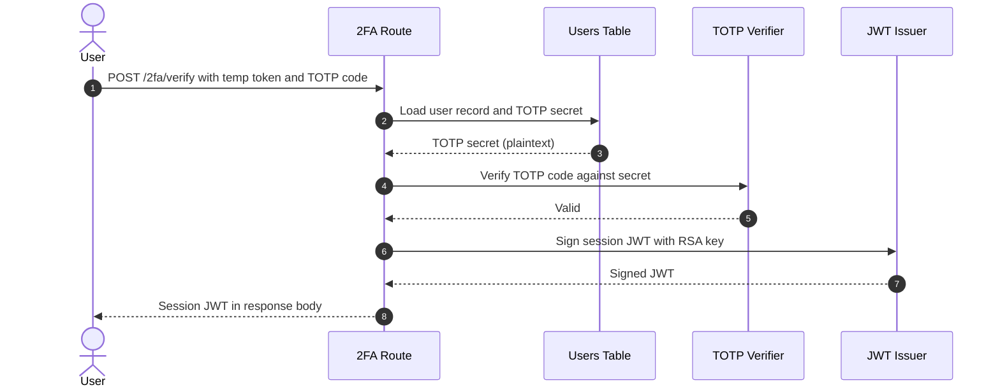
```mermaid
sequenceDiagram
    autonumber
    actor User
    participant API as 2FA Route
    participant DB as Users Table
    participant TOTP as TOTP Verifier
    participant JWT as JWT Issuer

    User->>API: POST /2fa/verify with temp token and TOTP code
    API->>DB: Load user record and TOTP secret
    DB-->>API: TOTP secret (plaintext)
    API->>TOTP: Verify TOTP code against secret
    TOTP-->>API: Valid
    API->>JWT: Sign session JWT with RSA key
    JWT-->>API: Signed JWT
    API-->>User: Session JWT in response body
```

**Security assessment**

The TOTP gate is real but rendered optional and bypassable at the signing layer:

- TOTP is opt-in - users without 2FA enrolled skip the gate entirely; no enforcement for admin accounts is evidenced.
- The hardcoded RSA signing key (🟠 [F-008](#f-008) — Hardcoded RSA JWT signing key) lets an attacker mint a valid JWT without ever seeing the login or TOTP form; the 2FA prompt is bypassed completely.
- TOTP secrets are stored in plaintext (🟠 [F-013](#f-013) — Plaintext TOTP secret storage), so a database read yields all TOTP secrets directly.

**Relevant findings**

- None linked to this control; see the other findings of this category.

<a id="password-reset-via-security-question"></a>
#### 6.2.2 Password Reset via Security Question

**Status:** 🟠 Weak - recovery relies on a knowledge factor that is frequently guessable from public information

`routes/resetPassword.ts` implements account recovery with a knowledge-based security question. The caller supplies their registered security question answer, and the server resets the password on a correct match.

The diagram shows the intended successful password reset path:

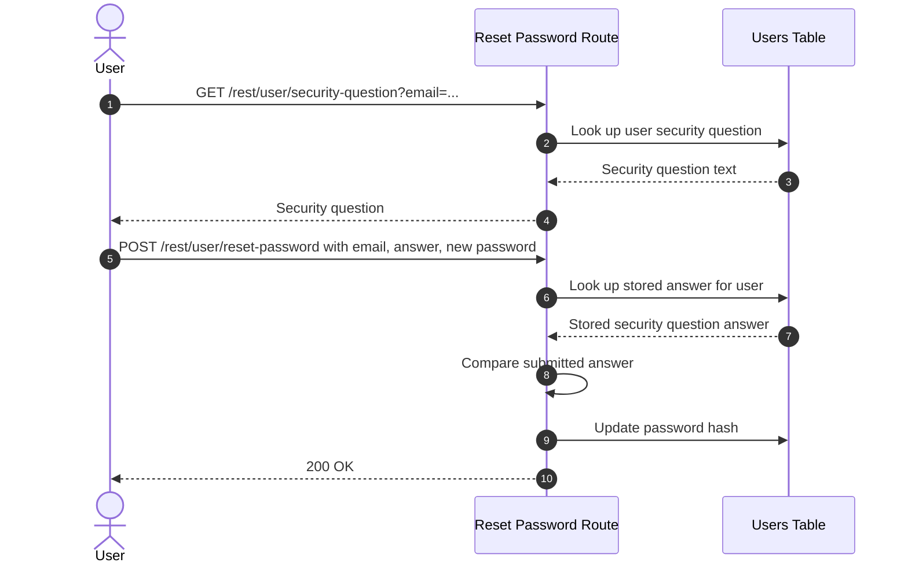
```mermaid
sequenceDiagram
    autonumber
    actor User
    participant API as Reset Password Route
    participant DB as Users Table

    User->>API: GET /rest/user/security-question?email=...
    API->>DB: Look up user security question
    DB-->>API: Security question text
    API-->>User: Security question
    User->>API: POST /rest/user/reset-password with email, answer, new password
    API->>DB: Look up stored answer for user
    DB-->>API: Stored security question answer
    API->>API: Compare submitted answer
    API->>DB: Update password hash
    API-->>User: 200 OK
```

**Security assessment**

Security question answers for high-value accounts - notably the administrator's registered question - are frequently derivable from public profile information or social engineering, making this recovery factor guessable without technical attack capability. See 🟠 [F-011](#f-011) — Security-question password reset.

**Relevant findings**

- None linked to this control; see the other findings of this category.

<a id="sql-injection-prevention"></a>
**SQL Injection Prevention.**


**Status:** 🔴 Unsafe - the credential lookup in the login route constructs raw SQL, bypassing the ORM's parameterized binding

<!-- Model implementation note (facts for the intro): routes/login.ts:34 (raw SQL injection sink), models/index.ts:34 (Sequelize parameterized elsewhere) -->
Sequelize parameterized queries back most of the relational data layer, passing user-supplied values as bound parameters via the ORM at `models/index.ts:34`. Most routes go through this safe path.

**Security assessment**

`routes/login.ts:34` opts out of Sequelize for the credential lookup and builds the WHERE clause by direct string interpolation. A `' OR '1'='1` payload in the email field short-circuits the WHERE clause and returns the first user row - the seeded admin account. This is an intentional training vulnerability that violates the parameterized-binding assumption stated in trust boundary tb-9.

**Relevant findings**

- None linked to this control; see the other findings of this category.

<a id="password-based-login"></a>
#### 6.2.3 Password-Based Login

**Status:** 🔴 Unsafe - login combines injectable SQL, unsalted `MD5` hashing, no rate limiting, and browser-readable token storage

<!-- Model implementation note (facts for the intro): Present at POST /rest/user/login -->
`POST /rest/user/login` accepts an email and password, hashes the submission with `MD5`, and queries the Users table to verify the credential before issuing a session JWT.

The diagram shows the intended successful login path:

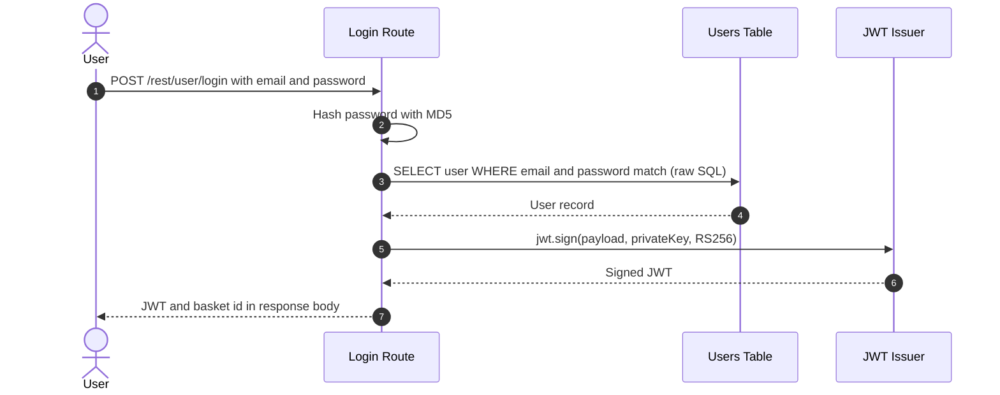
```mermaid
sequenceDiagram
    autonumber
    actor User
    participant API as Login Route
    participant DB as Users Table
    participant JWT as JWT Issuer

    User->>API: POST /rest/user/login with email and password
    API->>API: Hash password with MD5
    API->>DB: SELECT user WHERE email and password match (raw SQL)
    DB-->>API: User record
    API->>JWT: jwt.sign(payload, privateKey, RS256)
    JWT-->>API: Signed JWT
    API-->>User: JWT and basket id in response body
```

**Security assessment**

Four independent weaknesses compound on the login path:

- SQL injection in the login query allows authentication bypass without a valid password (🔴 [F-003](#f-003) — SQL injection in login query).
- Passwords are stored as unsalted `MD5` hashes, so any database dump yields plaintext credentials for every account (🟠 [F-025](#f-025) — Unsalted MD5 password hashing (Unsalted `MD5` password hashing), 🟠 [F-028](#f-028) — Password hashed without salt).
- The JWT payload includes the password hash and TOTP secret, exposing them to any party that receives or intercepts the token (🟠 [F-024](#f-024) — Password hash and TOTP secret in JWT payload).
- Session tokens are stored in `localStorage`, readable by any JavaScript executing in the same origin (🟠 [F-026](#f-026) — JWT in script-readable storage).

**Relevant findings**

- 🔴 [F-003](#f-003) — SQL injection in login query
- 🟠 [F-011](#f-011) — Security-question password reset
- 🟠 [F-012](#f-012) — Weak derived OAuth password
- 🟠 [F-024](#f-024) — Password hash and TOTP secret in JWT payload
- 🟠 [F-025](#f-025) — Unsalted MD5 password hashing
- 🟠 [F-026](#f-026) — JWT in script-readable storage
- 🟠 [F-028](#f-028) — Password hashed without salt
- 🟡 [F-035](#f-035) — Password change without current password
- 🟡 [F-037](#f-037) — OAuth implicit flow without state
- 🟡 [F-048](#f-048) — Login IP taken from spoofable header
- 🟡 [F-051](#f-051) — Reset response returns full user record
- 🟡 [F-054](#f-054) — Credential pair in client bundle
- 🟠 [F-075](#f-075) — Token flow accepts a stolen bearer token without

<a id="user-registration"></a>
#### 6.2.4 User Registration

**Status:** 🔴 Unsafe - the registration endpoint accepts caller-supplied role fields, enabling self-promotion to admin on account creation

<!-- Model implementation note (facts for the intro): Present at POST /api/Users -->
`POST /api/Users` accepts the full user object from the request body and creates a new account via the Sequelize `User` model.

The diagram shows the intended registration path:

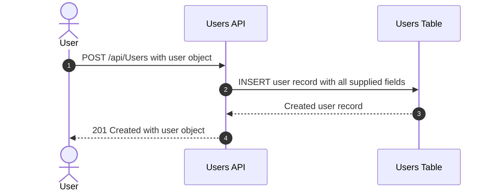
```mermaid
sequenceDiagram
    autonumber
    actor User
    participant API as Users API
    participant DB as Users Table

    User->>API: POST /api/Users with user object
    API->>DB: INSERT user record with all supplied fields
    DB-->>API: Created user record
    API-->>User: 201 Created with user object
```

**Security assessment**

Three weaknesses on the registration path:

- Mass assignment lets a caller include `role: admin` in the registration body; the value is persisted without filtering (🔴 [F-007](#f-007) — Mass assignment of role on user registration).
- WebSocket challenge events at registration rely on client-asserted completion state rather than server-side verification (🟡 [F-046](#f-046) — Client-asserted challenge verification).
- An unauthenticated caller can inject a false flag via the WebSocket registration event (🟡 [F-080](#f-080) — Unauthenticated actor injects false).

**Relevant findings**

- 🔴 [F-007](#f-007) — Mass assignment of role on user registration
- 🔴 [F-031](#f-031) — ReDoS in SVG verify event regex
- 🟠 [F-032](#f-032) — Sensitive Routes Registered Without Authentication Middleware
- 🟡 [F-046](#f-046) — Client-asserted challenge verification
- 🟡 [F-056](#f-056) — Unbounded in-memory token registry
- 🟡 [F-080](#f-080) — Unauthenticated actor injects false

<a id="social-login"></a><a id="social-login-oauth-oidc"></a>
#### 6.2.5 Social Login

**Status:** 🔴 Unsafe - the OAuth implicit flow carries no state parameter and the derived local password is predictable from the user's email address

<!-- Model implementation note (facts for the intro): Present at frontend/src/app/oauth -->
The OAuth flow is implemented in the Angular frontend as an identity adapter, not as a server-side authorization code exchange. `oauth.component.ts` reads the access token from the redirect URL, calls Google's user-info endpoint via `UserService.oauthLogin()`, derives a local password from the returned email, creates a local user if absent, and calls the standard `POST /rest/user/login` endpoint.

The diagram shows how the frontend OAuth adapter enters the local login flow:

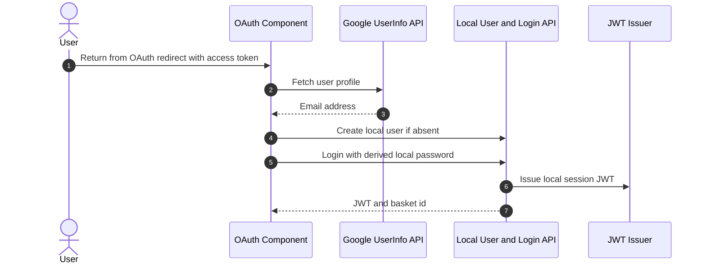
```mermaid
sequenceDiagram
    autonumber
    actor User
    participant SPA as OAuth Component
    participant Google as Google UserInfo API
    participant API as Local User and Login API
    participant JWT as JWT Issuer

    User->>SPA: Return from OAuth redirect with access token
    SPA->>Google: Fetch user profile
    Google-->>SPA: Email address
    SPA->>API: Create local user if absent
    SPA->>API: Login with derived local password
    API->>JWT: Issue local session JWT
    API-->>SPA: JWT and basket id
```

**Security assessment**

Two compounding weaknesses in the OAuth adapter:

- The derived local password is a predictable transformation of the user's email address (🟠 [F-012](#f-012) — Weak derived OAuth password), allowing any caller who knows the email to authenticate without completing the OAuth flow.
- The OAuth redirect uses the implicit flow without a `state` parameter (🟡 [F-037](#f-037) — OAuth implicit flow without state), making the callback susceptible to CSRF-based token injection.

**Relevant findings**

- 🟠 [F-012](#f-012) — Weak derived OAuth password
- 🟡 [F-037](#f-037) — OAuth implicit flow without state

### 6.3 Session and Token Controls

<a id="ctrl-session-and-token-controls"></a>

**Dependent crossings:**

- [tb-1](#tb-1) - external → juice-shop-api (assumption broken)
  - 🟠 [F-008](#f-008) — Hardcoded RSA JWT signing key
  - 🟠 [F-010](#f-010) — Insecure JWT Verification
- [tb-2](#tb-2) - external → juice-shop-realtime (assumption broken)
  - 🟡 [F-038](#f-038) — Unauthenticated WebSocket Channel
- [tb-3](#tb-3) - external → juice-shop-cicd (assumption not confirmed)
  - 🟡 [F-039](#f-039) — Missing Container Image Signing — *.yml
- [tb-4](#tb-4) - external → juice-shop-cicd (assumption not confirmed)
  - 🟡 [F-039](#f-039) — Missing Container Image Signing — *.yml
- [tb-5](#tb-5) - external → juice-shop-cicd (assumption not confirmed)
  - 🟡 [F-039](#f-039) — Missing Container Image Signing — *.yml
- [tb-6](#tb-6) - external → juice-shop-cicd (assumption not confirmed)
  - 🟡 [F-039](#f-039) — Missing Container Image Signing — *.yml
- [tb-7](#tb-7) - external → juice-shop-cicd (assumption not confirmed)
  - 🟡 [F-039](#f-039) — Missing Container Image Signing — *.yml


**Systemic weaknesses:** [W-008](#w-008)
**Verdict:** 🔴 Unsafe

<!-- The line below is mechanically derived from the controls table — LLM must not re-author it. -->
**Controls covered:**

- [6.3.1 JWT Token Signing Key Management](#631-jwt-token-signing-key-management)
- [6.3.2 JWT Token Expiry and Server-Side Revocation](#632-jwt-token-expiry-and-server-side-revocation)
- [6.3.3 Browser Session Token Storage](#633-browser-session-token-storage)

**Implemented controls:** JWT Token Signing Key Management, JWT Token Expiry and Server-Side Revocation, Browser Session Token Storage.

**Assessment:** This codebase issues a single locally-signed JWT for every authenticated session, regardless of the [§6.2](#62-identity-and-authentication-controls) flow that established it. The sub-sections below trace the token through its lifecycle: signing on issuance, server-side expiry with a token registry, and storage in the browser. Revocation and expiry enforcement are moot while the RSA signing key is hardcoded in source - an attacker can forge tokens with arbitrary claims and future expiry at any time without touching the server.

**Findings in this category without a control:**

- 🟠 [F-026](#f-026) — JWT in script-readable storage
- 🟡 [F-036](#f-036) — No server-side JWT revocation
- 🟡 [F-053](#f-053) — Session token cookie without HttpOnly
- 🟡 [F-077](#f-077) — User keeps

<a id="jwt-token-signing-key-management"></a>
#### 6.3.1 JWT Token Signing Key Management

**Status:** 🔴 Unsafe - the RSA private key is hardcoded as a literal in source, making every token forgeable by anyone with repository read access

<!-- Model implementation note (facts for the intro): lib/insecurity.ts:21 (RSA private key literal), lib/insecurity.ts:54 (jwt.sign RS256) -->
`RS256`-signed JWTs are issued by `lib/insecurity.ts:54` after every successful authentication. The signing step uses a 1024-bit RSA private key.

**Security assessment**

The RSA private key is a hardcoded string literal at `lib/insecurity.ts:21`. Cloning the repository gives any actor everything needed to call `jwt.sign(payload, privateKey, {algorithm: 'RS256'})` with arbitrary claims - the server accepts the result as a valid authenticated identity, defeating the JWT authentication guarantee on every protected route.

**Relevant findings**

- None linked to this control; see the other findings of this category.

<a id="jwt-token-expiry-and-server-side-revocation"></a>
#### 6.3.2 JWT Token Expiry and Server-Side Revocation

**Status:** 🟡 Partial - a 6-hour expiry and token registry exist but both are overridden by the hardcoded signing key

<!-- Model implementation note (facts for the intro): lib/insecurity.ts:54 (6h expiry), lib/startup/registerWebsocketEvents.ts (token registry) -->
Tokens are issued with a 6-hour expiry claim at `lib/insecurity.ts:54`. A server-side token registry is maintained via `lib/startup/registerWebsocketEvents.ts` to support manual revocation.

**Security assessment**

Expiry and the registry together form a partial lifecycle control, but both are defeated at the signing layer:

- An attacker who holds the private key can forge tokens with any future `exp` claim, rendering the 6-hour window irrelevant.
- The server-side registry cannot detect or block forged tokens that were never issued by the server.

**Relevant findings**

- None linked to this control; see the other findings of this category.

<a id="browser-session-token-storage"></a>
#### 6.3.3 Browser Session Token Storage

**Status:** 🟠 Weak - tokens stored in `localStorage` are accessible to any JavaScript executing in the same origin

The Angular frontend stores the session JWT in `localStorage`. `frontend/src/app/Services/request.interceptor.ts:16` reads the token on every outgoing HTTP request and appends it as a Bearer header.

**Security assessment**

`localStorage` is fully accessible to any JavaScript executing in the same origin. Combined with the eight confirmed `bypassSecurityTrustHtml()` DOM-XSS sinks in the frontend components, a successful XSS exploit extracts the session token without any server interaction.

**Relevant findings**

- None linked to this control; see the other findings of this category.

The diagram shows the full JWT lifecycle from issuance through Bearer presentation to server verification:

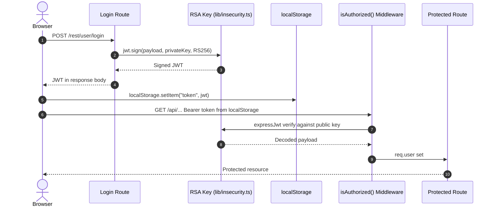
```mermaid
sequenceDiagram
    autonumber
    actor Browser
    participant Login as Login Route
    participant Key as RSA Key (lib/insecurity.ts)
    participant Storage as localStorage
    participant MW as isAuthorized() Middleware
    participant Route as Protected Route

    Browser->>Login: POST /rest/user/login
    Login->>Key: jwt.sign(payload, privateKey, RS256)
    Key-->>Login: Signed JWT
    Login-->>Browser: JWT in response body
    Browser->>Storage: localStorage.setItem("token", jwt)
    Browser->>MW: GET /api/... Bearer token from localStorage
    MW->>Key: expressJwt verify against public key
    Key-->>MW: Decoded payload
    MW->>Route: req.user set
    Route-->>Browser: Protected resource
```

### 6.4 Authorization Controls

<a id="ctrl-authorization-controls"></a>

**Dependent crossings:**

- [tb-1](#tb-1) - external → juice-shop-api (assumption broken)
  - 🔴 [F-005](#f-005) — Insecure Direct Object Reference
- [tb-3](#tb-3) - external → juice-shop-cicd (assumption broken)
  - 🟡 [F-063](#f-063) — Workflows lack permissions block; token persisted
- [tb-4](#tb-4) - external → juice-shop-cicd (assumption not confirmed)
  - 🟡 [F-059](#f-059) — Missing Workflow Permissions Block
- [tb-5](#tb-5) - external → juice-shop-cicd (assumption not confirmed)
  - 🟡 [F-059](#f-059) — Missing Workflow Permissions Block
- [tb-6](#tb-6) - external → juice-shop-cicd (assumption not confirmed)
  - 🟡 [F-059](#f-059) — Missing Workflow Permissions Block
- [tb-7](#tb-7) - external → juice-shop-cicd (assumption not confirmed)
  - 🟡 [F-059](#f-059) — Missing Workflow Permissions Block


**Systemic weaknesses:** [W-003](#w-003), [W-011](#w-011), [W-013](#w-013)
**Verdict:** 🔴 Missing

<!-- The line below is mechanically derived from the controls table — LLM must not re-author it. -->
**Controls covered:**

- [6.4.1 Centralized Authorization Policy](#641-centralized-authorization-policy)
- [6.4.2 Object-Level Ownership Check](#642-object-level-ownership-check)
- [6.4.3 Management and Metrics Endpoint Authentication](#643-management-and-metrics-endpoint-authentication)
- [6.4.4 Database Principal Separation](#644-database-principal-separation)

**Implemented controls:** Centralized Authorization Policy, Object-Level Ownership Check (BOLA/IDOR), Management and Metrics Endpoint Authentication.

**Assessment:** No centralized authorization framework is evidenced. Authentication middleware (`isAuthorized()`) confirms the caller holds a valid JWT, but authorization decisions beyond that are left to individual route handlers. Multiple sensitive mutation routes carry authentication middleware but no confirmed ownership check or role assertion. The missing server-side authorization layer is a structural gap, not a per-route omission.

**Findings in this category without a control:**

- 🔴 [F-005](#f-005) — Insecure Direct Object Reference
- 🔴 [F-007](#f-007) — Mass assignment of role on user registration
- 🟠 [F-032](#f-032) — Sensitive Routes Registered Without Authentication Middleware
- 🟠 [F-033](#f-033) — Unauthenticated product update
- 🟡 [F-046](#f-046) — Client-asserted challenge verification
- 🟡 [F-078](#f-078) — Customer completes checkout
- 🟡 [F-079](#f-079) — Customer modifies or empties another customer's

<a id="centralized-authorization-policy"></a>
#### 6.4.1 Centralized Authorization Policy

**Status:** 🟠 Weak - per-route ad-hoc checks with no policy enforcement layer; several state-changing routes carry `authz=unknown`

<!-- Model implementation note (facts for the intro): server.ts:371-451 (routes without verified authz) -->
`isAuthorized()` from `lib/insecurity.ts:52` provides the authentication gate for protected routes. Authorization decisions beyond identity confirmation are left to individual route handlers.

**Security assessment**

No centralized authorization framework enforces role or ownership checks. Several state-changing routes carry `authz=unknown` in the architecture scan:

- `DELETE /api/Products/:id` (`server.ts:371`)
- `PUT /api/Recycles/:id` and `DELETE /api/Recycles/:id` (`server.ts:389–390`)
- `PUT /api/BasketItems/:id` (`server.ts:426`)
- `PUT /api/Cards/:id` and `DELETE /api/Cards/:id` (`server.ts:440–441`)
- `PUT /api/Addresss/:id` and `DELETE /api/Addresss/:id` (`server.ts:450–451`)

**Relevant findings**

- None linked to this control; see the other findings of this category.

<a id="object-level-ownership-check"></a><a id="object-level-ownership-check-bolaidor"></a>
#### 6.4.2 Object-Level Ownership Check

**Status:** 🟠 Weak - routes authenticate the caller but do not verify the addressed object belongs to that caller

<!-- Model implementation note (facts for the intro): server.ts:603, server.ts:440, server.ts:451 (representative) -->
Routes such as `GET /rest/basket/:id` (`server.ts:603`) and `PUT /api/Cards/:id` (`server.ts:440`) require a valid JWT via `isAuthorized()` but pass the resource identifier directly to the data layer.

**Security assessment**

Authenticated routes accept any resource identifier without verifying the caller owns the addressed record:

- `GET /rest/basket/:id` - confirms authentication but does not check the basket belongs to the requesting user.
- `PUT /api/Cards/:id` and `DELETE /api/Addresss/:id` (`server.ts:451`) - same pattern; any authenticated user can modify another user's records.

This is a BOLA/IDOR pattern across the API surface.

**Relevant findings**

- None linked to this control; see the other findings of this category.

<a id="management-and-metrics-endpoint-authentication"></a>
#### 6.4.3 Management and Metrics Endpoint Authentication

**Status:** 🟠 Weak - admin configuration and Prometheus metrics routes expose internal data without confirmed authentication

`GET /rest/admin/application-version` (`server.ts:606`), `GET /rest/admin/application-configuration` (`server.ts:607`), and `GET /metrics` (`server.ts:676`) expose application version strings, configuration values, and Prometheus-format runtime metrics.

**Security assessment**

No confirmed authentication gate was detected on these routes from static analysis. The exposed data - application version, configuration values, and runtime counters - reduces an attacker's reconnaissance burden and may reveal deployment-specific configuration keys.

**Relevant findings**

- None linked to this control; see the other findings of this category.

<a id="database-principal-separation"></a>
#### 6.4.4 Database Principal Separation

**Status:** 🔴 Missing - all application code shares a single embedded database connection with full read-write access

This control is not evidenced in the repository.

**Security assessment**

SQLite runs as an embedded, in-process database (`models/index.ts:34`). All application routes - including those containing intentional SQL injection sinks - share a single file-level connection with unrestricted read-write access. No read-only connection, schema-scoped user, or privilege boundary separates safe routes from injection-vulnerable ones.

**Relevant findings**

- None linked to this control; see the other findings of this category.

### 6.5 Query Construction and Data Access Controls

<a id="ctrl-query-construction-and-data-access-controls"></a>

**Dependent crossings:**

- [tb-8](#tb-8) - juice-shop-api → juice-shop-sqlite (assumption broken)
  - 🔴 [F-003](#f-003) — SQL injection in login query
  - 🔴 [F-004](#f-004) — SQL injection request data interpolated into a SQL string
- [tb-9](#tb-9) - juice-shop-auth → juice-shop-sqlite (assumption broken)
  - 🔴 [F-003](#f-003) — SQL injection in login query
- [tb-10](#tb-10) - juice-shop-api → juice-shop-marsdb (assumption broken)
  - 🟠 [F-017](#f-017) — Input in executable NoSQL predicate


**Systemic weaknesses:** [W-002](#w-002)
**Verdict:** 🟠 Weak

<!-- The line below is mechanically derived from the section's default mechanism — LLM must not re-author it. -->
**Controls covered:**

- [6.5.1 Database Query Construction](#651-database-query-construction)

**Implemented controls:** Sequelize ORM parameterized queries on most data access routes

**Assessment:** Most queries go through Sequelize parameterized bindings, which safely separate user-supplied values from query structure. Two routes - password login and product search - opt out and build SQL strings by direct string interpolation. A third path through MarsDB passes caller-controlled JavaScript predicates directly.

<a id="database-query-construction"></a><a id="query-construction"></a>
#### 6.5.1 Database Query Construction

**Status:** 🟠 Weak - Sequelize ORM parameterizes most queries but the login and search routes use raw SQL string interpolation

Sequelize backs most relational data access, binding user-supplied values to typed placeholders via the ORM for the majority of routes. Two routes bypass the ORM and call `models.sequelize.query()` directly with string-interpolated user input.

**Security assessment**

Two SQL injection sinks and one NoSQL injection sink exist alongside the safe ORM path:

- `routes/login.ts:34` interpolates `req.body.email` into the WHERE clause - a `' OR '1'='1` payload returns the first user row.
- `routes/search.ts:23` interpolates the search term into a LIKE clause - a UNION payload exfiltrates arbitrary table rows.
- The MarsDB track-order route passes a `$where` field with caller-controlled JavaScript, allowing arbitrary predicate evaluation.

**Relevant findings**

- 🔴 [F-003](#f-003) — SQL injection in login query
- 🔴 [F-004](#f-004) — SQL injection request data interpolated into a SQL string
- 🟠 [F-017](#f-017) — Input in executable NoSQL predicate

### 6.6 Input Boundary Validation Controls

<a id="ctrl-input-boundary-validation-controls"></a>

**Dependent crossings:**

- [tb-1](#tb-1) - external → juice-shop-api (assumption broken)
  - 🔴 [F-007](#f-007) — Mass assignment of role on user registration
- [tb-2](#tb-2) - external → juice-shop-realtime (assumption broken)
  - 🔴 [F-031](#f-031) — ReDoS in SVG verify event regex
  - 🟡 [F-046](#f-046) — Client-asserted challenge verification
- [tb-3](#tb-3) - external → juice-shop-cicd (assumption broken)
  - 🟡 [F-044](#f-044) — Mutable action refs receive GITHUB_TOKEN
- [tb-4](#tb-4) - external → juice-shop-cicd (assumption broken)
  - 🟡 [F-045](#f-045) — Base images referenced by floating tag, no digest
- [tb-5](#tb-5) - external → juice-shop-cicd (assumption broken)
  - 🟠 [F-020](#f-020) — Lockfile disabled; builds resolve npm graph fresh
- [tb-6](#tb-6) - external → juice-shop-cicd (assumption broken)
  - 🟡 [F-043](#f-043) — Remote installer piped to shell in deploy job
- [tb-7](#tb-7) - external → juice-shop-cicd (assumption not confirmed)
  - 🟠 [F-020](#f-020) — Lockfile disabled; builds resolve npm graph fresh
  - 🟡 [F-043](#f-043) — Remote installer piped to shell in deploy job
  - 🟡 [F-044](#f-044) — Mutable action refs receive GITHUB_TOKEN

**Verdict:** 🔴 Unsafe

<!-- The line below is mechanically derived from the controls table — LLM must not re-author it. -->
**Controls covered:**

- [6.6.1 Validation Approach](#661-validation-approach)
- [6.6.2 Schema and Allowlist Input Validation](#662-schema-and-allowlist-input-validation)
- [6.6.3 Server-Side Code Execution Prevention](#663-server-side-code-execution-prevention)

**Implemented controls:** Schema and Allowlist Input Validation, Server-Side Code Execution Prevention.

**Assessment:** Input validation is absent or incomplete on most endpoints. URL path normalization and field trimming are the only broadly applied guards visible in the pipeline. No JSON schema library gates the full API surface, and several routes allow attacker-controlled values to reach executable sinks, file paths, and template renderers without format checks.

**Findings in this category without a control:**

- 🟠 [F-030](#f-030) — Event-loop blocking YAML/XML parsing
- 🟡 [F-055](#f-055) — Unbounded LLM consumption on chat endpoint
- 🟡 [F-056](#f-056) — Unbounded in-memory token registry
- 🟡 [F-057](#f-057) — Unbounded global wallet set growth
- 🟡 [F-061](#f-061) — Model-chosen coupon discount not bounded
- 🟡 [F-062](#f-062) — Arbitrary wallet top-up amount

<a id="validation-approach"></a>
#### 6.6.1 Validation Approach

**Status:** 🟠 Weak - URL normalization and whitespace trimming exist but no schema-based allowlist validation covers most endpoints

`server.ts:204` normalizes incoming URL paths. Registration field input receives whitespace trimming at `server.ts:411–413`. These are the primary general-purpose sanitization steps in the route pipeline.

**Security assessment**

The two implemented steps guard a narrow surface:

- Path normalization does not prevent traversal via route parameter values passed to file-path operations.
- Field trimming is cosmetic - type, range, and allowlist enforcement are absent from most routes.
- No JSON schema validation library is evidenced; most endpoints accept arbitrary keys, types, and values.

**Relevant findings**

- None linked to this control; see the other findings of this category.

<a id="schema-and-allowlist-input-validation"></a>
#### 6.6.2 Schema and Allowlist Input Validation

**Status:** 🟡 Partial - whitespace trimming and URL normalization exist but type and allowlist enforcement are absent from most endpoints

Registration fields receive whitespace trimming (`server.ts:411–413`) and incoming URLs are path-normalized (`server.ts:204`). These are the most broadly applied input guards visible in the pipeline.

**Security assessment**

Input handling does not extend to type, range, or allowlist enforcement for most routes:

- No JSON schema validation library is evidenced in the route middleware pipeline.
- Caller-controlled values flow into SQL strings, template renderers, and file-path operations without format or allowlist checks.

**Relevant findings**

- None linked to this control; see the other findings of this category.

<a id="server-side-code-execution-prevention"></a>
#### 6.6.3 Server-Side Code Execution Prevention

**Status:** 🔴 Unsafe - B2B order processing evaluates attacker-controlled input as executable JavaScript with no sandbox

`routes/b2bOrder.ts:23` processes incoming B2B order requests and passes the order content to a code-evaluation sink.

**Security assessment**

The evaluation sink accepts arbitrary attacker-controlled input. No sandbox, safe parser, schema guard, or execution context restriction is evidenced at this route. This is an intentional Remote Code Execution training vulnerability - any authenticated caller can execute arbitrary server-side JavaScript.

**Relevant findings**

- None linked to this control; see the other findings of this category.

### 6.7 Output Encoding and Rendering Controls


**Systemic weaknesses:** [W-006](#w-006)
**Verdict:** 🔴 Unsafe

<!-- The line below is mechanically derived from the controls table — LLM must not re-author it. -->
**Controls covered:**

- [6.7.1 Output Encoding and XSS Prevention](#671-output-encoding-and-xss-prevention)

**Implemented controls:** Output Encoding and XSS Prevention.

**Assessment:** Angular's default template escaping protects most bindings, but eight confirmed `bypassSecurityTrustHtml()` call-sites explicitly disable it. Each site creates a DOM-XSS sink reachable from attacker-controlled data stored in the application.

**Findings in this category without a control:**

- 🟠 [F-001](#f-001) — XSS via Angular Sanitizer Bypass
- 🟡 [F-047](#f-047) — Unsanitized email persisted when XSS challenge
- 🟠 [F-074](#f-074) — XSS renders attacker-controlled markup

<a id="output-encoding-and-xss-prevention"></a>
#### 6.7.1 Output Encoding and XSS Prevention

**Status:** 🔴 Unsafe - Angular's `DomSanitizer` is explicitly bypassed at eight confirmed call-sites, creating DOM-XSS sinks across user-visible components

<!-- Model implementation note (facts for the intro): frontend/src/app/search-result/search-result.component.ts:110,143; frontend/src/app/about/about.component.ts:119 (representative) -->
Angular's template engine escapes HTML by default on all data-bound expressions. `DomSanitizer.bypassSecurityTrustHtml()` is the deliberate override that allows raw HTML to be injected into the DOM.

**Security assessment**

Eight `bypassSecurityTrustHtml()` call-sites are confirmed across frontend components, each creating a DOM-XSS sink reachable from persisted or reflected attacker-controlled data:

- `about.component.ts:119` - renders challenge description content
- `last-login-ip.component.ts:39` - renders the stored last-login IP address
- `administration.component.ts:73,91` - renders user data in the admin panel
- `data-export.component.ts:57` - renders user-controlled export content
- `search-result.component.ts:110,143` - renders search query results directly into the DOM
- `track-result.component.ts:48` - renders order tracking results

**Relevant findings**

- None linked to this control; see the other findings of this category.

### 6.8 Browser and Cross-Origin Controls


**Systemic weaknesses:** [W-011](#w-011)
**Verdict:** 🔴 Unsafe

<!-- The line below is mechanically derived from the controls table — LLM must not re-author it. -->
**Controls covered:**

- [6.8.1 Open Redirect Prevention](#681-open-redirect-prevention)
- [6.8.2 CORS Policy](#682-cors-policy)

**Implemented controls:** Open Redirect Prevention, CORS Policy.

**Assessment:** Helmet middleware applies baseline browser-security headers (HSTS, `noSniff`, `frameguard`). The REST API uses wildcard CORS, removing the same-origin boundary for all REST endpoints. The open redirect handler validates no destination URL.

**Findings in this category without a control:**

- 🟡 [F-037](#f-037) — OAuth implicit flow without state

<a id="open-redirect-prevention"></a>
#### 6.8.1 Open Redirect Prevention

**Status:** 🔴 Unsafe - the redirect handler accepts any caller-supplied URL without allowlist or destination validation

`routes/redirect.ts` implements a URL redirect handler that reads the destination from the request and issues an HTTP redirect to it.

**Security assessment**

No allowlist, scheme restriction, or format check constrains the destination URL. Any caller can supply an arbitrary external URL, making the trusted application domain a relay for phishing redirects. This is an intentional training vulnerability.

**Relevant findings**

- None linked to this control; see the other findings of this category.

<a id="cors-policy"></a>
#### 6.8.2 CORS Policy

**Status:** 🟡 Partial - `Socket.IO` restricts its CORS origin to `localhost:4200` but the REST API uses wildcard CORS, removing same-origin protection for API calls

<!-- Model implementation note (facts for the intro): lib/startup/registerWebsocketEvents.ts:20 (Socket.IO origin-restricted); server.ts (REST wildcard CORS) -->
`Socket.IO` restricts its CORS origin to `http://localhost:4200` at `lib/startup/registerWebsocketEvents.ts:20`. The Express REST API applies security headers via Helmet.

**Security assessment**

The two surfaces have divergent CORS policies:

- The REST API is configured with wildcard CORS - any origin can make credentialed cross-origin requests, eliminating browser-enforced same-origin protection for the full API surface.
- `Socket.IO` correctly restricts its CORS origin, providing a stronger policy than the REST API.

**Relevant findings**

- None linked to this control; see the other findings of this category.

### 6.9 Cryptography Secrets and Data Protection


**Systemic weaknesses:** [W-007](#w-007), [W-015](#w-015)
**Verdict:** 🔴 Unsafe

<!-- The line below is mechanically derived from the controls table — LLM must not re-author it. -->
**Controls covered:**

- [6.9.1 Password Hashing](#691-password-hashing)
- [6.9.2 Managed Secret Storage](#692-managed-secret-storage)
- [6.9.3 Transport Layer Encryption](#693-transport-layer-encryption)

**Implemented controls:** Password Hashing, Managed Secret Storage, Transport Layer Encryption (TLS).

**Assessment:** Cryptographic primitives are either hardcoded in source or use broken algorithms. The RSA signing key is a 1024-bit literal in `lib/insecurity.ts`, passwords are stored as unsalted `MD5`, a BIP39 mnemonic is hardcoded in `routes/checkKeys.ts`, and TLS enforcement depends on an unverifiable deployment-level proxy.

**Findings in this category without a control:**

- 🟠 [F-008](#f-008) — Hardcoded RSA JWT signing key
- 🟠 [F-028](#f-028) — Password hashed without salt
- 🟠 [F-029](#f-029) — Hardcoded wallet BIP39 mnemonic
- 🟡 [F-054](#f-054) — Credential pair in client bundle

<a id="password-hashing"></a>
#### 6.9.1 Password Hashing

**Status:** 🔴 Unsafe - passwords are stored as unsalted `MD5`, reversible via precomputed tables with no per-account resistance

Passwords are hashed before storage in the `Users` table. The hashing function is defined at `lib/insecurity.ts:42`.

**Security assessment**

Unsalted `MD5` provides no per-account resistance to offline attack. `MD5` operates in nanoseconds per hash - no work factor applies. A single precomputed rainbow table lookup recovers most common passwords from any hash in the table. A database read via SQL injection (🔴 [F-003](#f-003) — SQL injection in login query) immediately yields recoverable plaintext credentials for every account.

**Relevant findings**

- None linked to this control; see the other findings of this category.

<a id="managed-secret-storage"></a>
#### 6.9.2 Managed Secret Storage

**Status:** 🔴 Unsafe - the RSA signing key and BIP39 mnemonic are hardcoded string literals recoverable from any repository clone

<!-- Model implementation note (facts for the intro): lib/insecurity.ts:21 (RSA private key), routes/checkKeys.ts:10 (BIP39 mnemonic) -->
`lib/insecurity.ts:21` holds the RSA private key used to sign JWT tokens. `routes/checkKeys.ts:10` holds a BIP39 mnemonic phrase for wallet operations.

**Security assessment**

Three secrets live as hardcoded literals in the repository:

- RSA private key at `lib/insecurity.ts:21` - recoverable from any repo clone; defeats JWT authentication for all users.
- BIP39 mnemonic at `routes/checkKeys.ts:10` - exposes wallet-related operations to any actor.
- HMAC and cookie-signing secrets follow the same hardcoded-literal pattern in `lib/insecurity.ts`.

**Relevant findings**

- None linked to this control; see the other findings of this category.

<a id="transport-layer-encryption"></a><a id="transport-layer-encryption-tls"></a>
#### 6.9.3 Transport Layer Encryption

**Status:** 🟡 Partial - no TLS is configured in the application itself; enforcement depends on an unverifiable deployment-level reverse proxy

<!-- Model implementation note (facts for the intro): Not evidenced in source; assumed deployment-level enforcement -->
TLS termination is assumed to be handled by a deployment-level reverse proxy. No in-repository HTTPS configuration - certificate setup, `https.createServer()` - was detected for the Node\.js application.

**Security assessment**

The absence of in-application TLS means the application runs over plain HTTP unless a reverse proxy is deployed and configured in front of it. That requirement is not documented, enforced, or verifiable from the repository, leaving the transport security property undocumented for any deployment that omits the proxy.

**Relevant findings**

- None linked to this control; see the other findings of this category.

### 6.10 File Parser and Outbound Request Controls

<a id="ctrl-file-parser-and-outbound-request-controls"></a>

_No trust boundary in this model depends on this control class._


**Systemic weaknesses:** [W-001](#w-001), [W-004](#w-004)
**Verdict:** 🔴 Unsafe

<!-- The line below is mechanically derived from the controls table — LLM must not re-author it. -->
**Controls covered:**

- [6.10.1 XML External Entity (XXE) Prevention](#6101-xml-external-entity-xxe-prevention)
- [6.10.2 Server-Side Request Forgery (SSRF) Prevention](#6102-server-side-request-forgery-ssrf-prevention)

**Implemented controls:** XML External Entity (XXE) Prevention, Server-Side Request Forgery (SSRF) Prevention.

**Assessment:** Both the XML parser and the outbound URL-fetch path are confirmed unsafe. The XML parser at `lib/xml.ts:35` operates with default settings that enable external entity resolution. The profile image URL fetch at `routes/profileImageUrlUpload.ts:24` performs no destination validation.

**Findings in this category without a control:**

- 🔴 [F-006](#f-006) — Eval of stored username on profile page
- 🟠 [F-014](#f-014) — Path traversal filesystem access from request input
- 🟠 [F-015](#f-015) — Zip Slip path traversal in complaint upload
- 🟠 [F-016](#f-016) — Code evaluation of B2B order input
- 🟠 [F-018](#f-018) — Input compiled as template source
- 🟠 [F-021](#f-021) — Memories endpoint leaks full user records
- 🟠 [F-022](#f-022) — Public directory listing of access logs
- 🟠 [F-023](#f-023) — XXE in unauthenticated XML upload
- 🟡 [F-034](#f-034) — Open redirect
- 🟡 [F-051](#f-051) — Reset response returns full user record
- 🟡 [F-052](#f-052) — User list handler lacks role check

<a id="xml-external-entity-xxe-prevention"></a>
#### 6.10.1 XML External Entity (XXE) Prevention

**Status:** 🔴 Unsafe - the XML parser operates with external entity resolution enabled, allowing XXE on unauthenticated input

XML parsing is performed at `lib/xml.ts:35`. The route accepts XML input from the client and passes it to the parser without configuration changes.

**Security assessment**

No XXE-safe parser configuration - disabling DOCTYPE declarations or external entity resolution - is evidenced. With default settings, an attacker can include a `SYSTEM` entity declaration pointing to a local file path or internal network address. The server reads and returns the target, disclosing arbitrary local files or triggering internal network requests.

**Relevant findings**

- None linked to this control; see the other findings of this category.

<a id="server-side-request-forgery-ssrf-prevention"></a>
#### 6.10.2 Server-Side Request Forgery (SSRF) Prevention

**Status:** 🔴 Unsafe - the profile image URL fetch accepts any caller-supplied URL without allowlist or destination validation

`routes/profileImageUrlUpload.ts:24` accepts a caller-supplied URL and fetches the target to store as the user's profile image.

**Security assessment**

No destination allowlist, scheme restriction, or private-range block is applied to the supplied URL. An attacker can direct the server to fetch `http://169.254.169.254/latest/meta-data/` (cloud instance metadata), internal services unreachable from the public internet, or attacker-controlled external endpoints for out-of-band data exfiltration.

**Relevant findings**

- None linked to this control; see the other findings of this category.

### 6.11 Operations Runtime and Supply Chain Controls

**Build path.** [Figure 1b](#figure-1b) shows the inputs, build systems and release artifacts that Juice Shop evidences.

Highlighted path of 🟠 [F-020](#f-020) — Lockfile disabled; builds resolve npm graph fresh — .npmrc:1: npm registry → GitHub Actions → docker.io/bkimminich/juice-shop. The path stops where the evidence ends.

**Attack entries:**

- **Manipulated dependency**
  - 🟠 [F-020](#f-020) — Lockfile disabled; builds resolve npm graph fresh
  - 🟠 [F-040](#f-040) — Untrusted npm Install/Postinstall Scripts Enabled
  - 🟡 [F-041](#f-041) — Missing npm Lockfile
- **Manipulated CI input**
  - 🟡 [F-043](#f-043) — Remote installer piped to shell in deploy job
  - 🟡 [F-044](#f-044) — Mutable action refs receive GITHUB_TOKEN
  - 🟡 [F-045](#f-045) — Base images referenced by floating tag, no digest
- **Replaced release artifact**
  - 🟡 [F-039](#f-039) — Missing Container Image Signing — *.yml

**Not attributable to a build step:**

- 🟡 [F-058](#f-058) — Container Runs as Root


**Systemic weaknesses:** [W-005](#w-005)
**Verdict:** 🔴 Missing

<!-- The line below is mechanically derived from the controls table — LLM must not re-author it. -->
**Controls covered:**

- [6.11.1 Security Event Logging](#6111-security-event-logging)
- [6.11.2 Third-Party CI Action Pinning](#6112-third-party-ci-action-pinning)
- [6.11.3 npm Dependency Lockfile Enforcement](#6113-npm-dependency-lockfile-enforcement)
- [6.11.4 Build pipeline and dependency controls](#6114-build-pipeline-and-dependency-controls)

**Implemented controls:** Security Event Logging, Third-Party CI Action Pinning, npm Dependency Lockfile Enforcement.

**Assessment:** CodeQL SAST and automated SCA scanning are present and run in CI. However, lockfile hygiene is disabled by `.npmrc:1`, base images use mutable floating tags, three CI actions use mutable branch or tag references, and a `postinstall` hook runs a nested `npm install` that bypasses the lockfile scope.

**Findings in this category without a control:**

- 🟡 [F-002](#f-002) — Missing Security Audit Logging
- 🟠 [F-020](#f-020) — Lockfile disabled; builds resolve npm graph fresh
- 🟡 [F-039](#f-039) — Missing Container Image Signing — *.yml
- 🟡 [F-043](#f-043) — Remote installer piped to shell in deploy job
- 🟡 [F-049](#f-049) — Verbose error handler in all environments
- 🟡 [F-058](#f-058) — Container Runs as Root
- 🟡 [F-059](#f-059) — Missing Workflow Permissions Block
- 🟡 [F-063](#f-063) — Workflows lack permissions block; token persisted

<a id="security-event-logging"></a>
#### 6.11.1 Security Event Logging

**Status:** 🟡 Partial - challenge completion events are tracked but general security event logging covering authentication failures and authorization denials is absent

<!-- Model implementation note (facts for the intro): lib/challengeUtils.ts (challenge events only) -->
`lib/challengeUtils.ts` records challenge completion events for the CTF scoreboard. This is the primary structured event log visible in the application.

**Security assessment**

Challenge tracking does not cover security-relevant events outside the CTF context:

- Authentication failures are not logged - brute-force and credential-stuffing attacks produce no trace in the event log.
- Authorization denials and input validation failures are not logged.
- Runtime detection of attack patterns based on log analysis is not possible with the current event coverage.

**Relevant findings**

- None linked to this control; see the other findings of this category.

<a id="third-party-ci-action-pinning"></a>
#### 6.11.2 Third-Party CI Action Pinning

**Status:** 🟡 Partial - several actions are pinned to immutable commit SHAs but three use mutable branch or tag references

<!-- Model implementation note (facts for the intro): .github/workflows/ci.yml:29 (SHA-pinned examples); .github/workflows/image_actions.yml:33,42 (mutable refs) -->
Several GitHub Actions in `ci.yml` are pinned to immutable commit SHAs - for example at line 29 - satisfying the immutable reference requirement for those entries.

**Security assessment**

Three actions use mutable references that can be repositioned without notice:

- `calibreapp/image-actions@main` (`.github/workflows/image_actions.yml:33`) - mutable branch; any commit to `main` silently changes the executed code.
- `peter-evans/create-pull-request@v8` (`image_actions.yml:42`) - mutable tag.
- `coverallsapp/github-action@v2` (`ci.yml:188`) - mutable tag.

Tag or branch repositioning substitutes the action's code on the next CI run and executes with `GITHUB_TOKEN` write access. See 🟡 [F-044](#f-044) (Mutable action refs receive `GITHUB_TOKEN`).

**Relevant findings**

- 🟡 [F-044](#f-044) — Mutable action refs receive GITHUB_TOKEN

<a id="npm-dependency-lockfile-enforcement"></a>
#### 6.11.3 npm Dependency Lockfile Enforcement

**Status:** 🟡 Partial - `npm ci` enforces lockfile versions in the top-level CI install but a `postinstall` hook runs a nested `npm install` that bypasses the lockfile scope

<!-- Model implementation note (facts for the intro): .github/workflows/ci.yml:36,51 (npm ci); package.json (postinstall hook with nested npm install) -->
CI jobs use `npm ci` at `ci.yml:36` and `ci.yml:51`, which rejects packages not matching `package-lock.json` and prevents registry drift for the top-level dependency graph.

**Security assessment**

The `npm ci` guarantee does not cover the full install:

- A `postinstall` hook in `package.json` runs a nested `npm install` at build time, which resolves floating versions outside the lockfile scope.
- Transitive packages installed by the nested call are not version-pinned, leaving a window for dependency confusion or silent version drift.

**Relevant findings**

- None linked to this control; see the other findings of this category.

<a id="build-pipeline-and-dependency-controls"></a>
#### 6.11.4 Build pipeline and dependency controls

**Status:** 🔴 Missing - gaps in Lockfile hygiene, CI install integrity, Base image pinning, Install scripts

<!-- Model implementation note (facts for the intro): In place: Automated SCA scanning, Static analysis (SAST) -->
CodeQL SAST and automated SCA scanning run in CI, providing static vulnerability detection for both code and declared dependencies.

- **Automated SCA scanning** — 🟢 Adequate. Automated SCA scanning present: `.gitlab-ci.yml:2`.
- **Automated dependency updates** — Not evidenced in the repository; it may run outside it (GitHub App, default setup, organization policy, agent).
- **Lockfile hygiene** — 🔴 Missing. Lockfile hygiene not detected in the repository (.gitignore:10, `.npmrc:1`). → 🟡 [F-041](#f-041) — Missing npm Lockfile
- **CI install integrity** — 🔴 Missing. CI installs dependencies by resolving versions at install time: `.github/workflows/ci.yml:36`, `.github/workflows/ci.yml:38`, `.github/workflows/ci.yml:51`.
- **Base image pinning** — 🔴 Missing. Base images use no tag or a mutable tag: `Dockerfile:1`, `Dockerfile:22`, `test/smoke/Dockerfile:1`. → 🟡 [F-045](#f-045) — Base images referenced by floating tag, no digest
- **Install scripts** — 🟠 Weak. A build step executes code fetched from an external URL: `.github/workflows/ci.yml:358`. → 🟠 [F-040](#f-040) — Untrusted npm Install/Postinstall Scripts Enabled
- **Static analysis (SAST)** — 🟢 Adequate. Static analysis runs in CI: `.github/workflows/codeql-analysis.yml:36`, `.gitlab-ci.yml:2`.

**Security assessment**

Gaps: Lockfile hygiene (Missing), CI install integrity (Missing), Base image pinning (Missing), Install scripts (Weak). Not evidenced in the repository: Automated dependency updates.

**Relevant findings**

- 🟡 [F-041](#f-041) — Missing npm Lockfile
- 🟡 [F-045](#f-045) — Base images referenced by floating tag, no digest
- 🟠 [F-040](#f-040) — Untrusted npm Install/Postinstall Scripts Enabled

### 6.12 Real-time and Not Applicable Controls

**Verdict:** 🔴 Missing

<!-- The line below is mechanically derived from the controls table — LLM must not re-author it. -->
**Controls covered:**

- [6.12.1 WebSocket Connection Authentication](#6121-websocket-connection-authentication)
- [6.12.2 LLM Prompt Injection Prevention](#6122-llm-prompt-injection-prevention)
- [6.12.3 LLM Tool Call Authorization](#6123-llm-tool-call-authorization)

**Implemented controls:** WebSocket Connection Authentication.

**Assessment:** WebSocket authentication relies on the same JWT signing path that the hardcoded key defeats. The LLM chatbot at `routes/chat.ts` implements tool calls with no authorization gate on the underlying server operations. No prompt injection defenses - structural prompt separation, input sanitization, or output escaping - are present before attacker-controlled message content reaches the model.

<a id="websocket-connection-authentication"></a>
#### 6.12.1 WebSocket Connection Authentication

**Status:** 🟠 Weak - `Socket.IO` CORS origin is restricted but connection-level JWT authentication is not confirmed in the handler

<!-- Model implementation note (facts for the intro): lib/startup/registerWebsocketEvents.ts:23 (no auth check evidenced) -->
The `Socket.IO` server is initialized at `lib/startup/registerWebsocketEvents.ts:23`. CORS origin is restricted to `http://localhost:4200` to prevent connections from cross-origin browser contexts.

**Security assessment**

Trust boundary tb-2 assumes JWT verification on every socket connection, but no connection-level authentication check is confirmed from static analysis of the handler. The CORS restriction limits which browser origins can initiate connections, but does not authenticate the connecting user's identity. Combined with the hardcoded signing key, any forged JWT would pass any authentication check that is present.

**Relevant findings**

- None.

<a id="llm-prompt-injection-prevention"></a>
#### 6.12.2 LLM Prompt Injection Prevention

**Status:** 🔴 Missing - no input sanitization, structural prompt separation, or escaping is present before attacker-controlled content reaches the model at `routes/chat.ts`

This control is not evidenced in the repository.

**Security assessment**

`routes/chat.ts:207` forwards attacker-controlled message content to the LLM provider without sanitization or structural separation. Trust boundary tb-11 assumes attacker-controlled message content does not reach system prompts or override the chatbot role, but no escaping or role-boundary enforcement is evidenced before content is forwarded. A crafted user message can override the chatbot's system instructions or cause the model to disclose information outside its intended scope.

**Relevant findings**

- None.

<a id="llm-tool-call-authorization"></a>
#### 6.12.3 LLM Tool Call Authorization

**Status:** 🔴 Missing - LLM-directed tool calls at `routes/chat.ts` execute without authorization checks on the underlying server operation

This control is not evidenced in the repository.

**Security assessment**

LLM tools are registered and invokable at `routes/chat.ts:207`. No per-action authorization gate, parameter binding verification, or approval step is evidenced for model-directed tool invocations. A successful prompt injection could direct the model to invoke tools that perform privileged server-side operations on behalf of the attacker, with the authorization context of the authenticated user whose session triggered the chat.

**Relevant findings**

- None.

### 6.13 Defense-in-Depth Summary

**What holds**

- `RS256` algorithm selected for JWT signing - strongest algorithm choice, though the key is compromised
- CodeQL SAST and automated SCA scanning run on every CI push
- `Socket.IO` CORS origin restricted to `http://localhost:4200`
- `npm ci` in most CI jobs enforces lockfile versions for the top-level install
- Helmet middleware applies HSTS, `noSniff`, and `frameguard` headers

**Repair first**

- Move the RSA signing key to a runtime-injected secret (◕ [M-097](#m-097) (Move cryptographic keys to a managed secret store)) - closes the JWT forgery path that defeats every other session control
- Switch password storage to a salted adaptive KDF (◕ [M-109](#m-109) (Hash passwords with a strong, salted algorithm)) - eliminates rainbow-table recovery of all stored credentials
- Parameterize raw SQL in the login and search routes (● [M-094](#m-094) (Use parameterized database queries)) - closes the unauthenticated admin-takeover path
- Add server-side ownership checks to mutation endpoints (◑ [M-125](#m-125) (Enforce authorization on the server)) - closes the BOLA/IDOR surface across the API
- Pin all CI action references to immutable commit SHAs (◑ [M-123](#m-123) (Pin third-party dependencies to immutable versions)) - removes the supply-chain substitution window on mutable action refs

---

<a id="weakness-register"></a>
## 7. Weakness Register

Systemic control gaps behind the findings, ordered by severity (W-001 = most severe). Each weakness names the missing, home-grown, or misused control, the findings that evidence it, the components it spans, and its remediation. A weakness may also rest on observed unsafe practice or an absent architectural control with no confirmed exploit - only confirmed findings carry a CVSS score.

- 🔴 **Critical** · [W-001](#w-001) - Application data crosses into executable code · confirmed · 2 findings · 1 component
- 🔴 **Critical** · [W-002](#w-002) - Database access relies on concatenated queries · confirmed · 2 findings · 1 component
- 🔴 **Critical** · [W-003](#w-003) - Authorization is implemented route by route · confirmed · 3 findings · 1 component
- 🟠 **High** · [W-004](#w-004) - Input handling lacks enforced boundary validation · confirmed · 2 findings · 1 component
- 🟠 **High** · [W-005](#w-005) - Build pipeline trusts mutable third-party references · confirmed · 3 findings · 1 component
- 🟠 **High** · [W-006](#w-006) - Frontend rendering lacks enforced output encoding · confirmed · 2 findings · 2 components
- 🟠 **High** · [W-007](#w-007) - Secrets are committed to source instead of a managed store · confirmed · 3 findings · 4 components
- 🟠 **High** · [W-008](#w-008) - Browser scripts retain reusable session credentials · confirmed · 1 finding · 1 component
- 🟠 **High** · [W-009](#w-009) - Document-database queries take their structure from application values · observed-practice · 1 finding · 1 component
- 🟡 **Medium** · [W-010](#w-010) - Endpoints are reachable without enforced authentication · confirmed · 2 findings · 2 components
- 🟡 **Medium** · [W-011](#w-011) - OAuth sign-in requests are not bound to the user's browser session · confirmed · 1 finding · 1 component
- 🟡 **Medium** · [W-012](#w-012) - Application data crosses into template source · observed-practice · 1 finding · 1 component
- 🟡 **Medium** · [W-013](#w-013) - Client-side role guard on unverified JWT (`frontend/src/app/app.guard.ts:54`) · observed-practice · 0 findings · 1 component
- 🟡 **Medium** · [W-014](#w-014) - Cleartext card number storage (`models/card.ts:38`) · observed-practice · 0 findings · 1 component
- 🟡 **Medium** · [W-015](#w-015) - Security-sensitive data uses weak cryptographic primitives · observed-practice · 1 finding · 1 component

<a id="w-001"></a>
### W-001 — Application data crosses into executable code

🔴 **Critical** · implementation weakness · confirmed · 2 findings

An interpreter evaluates application values as code. The affected path mixes data processing with executable program construction instead of constraining callers to predefined operations.

**Architectural anti-pattern - Server-side eval of untrusted input.** Persisted and request-supplied values reach JavaScript evaluation functions on the server without sanitization; any write path combined with any read path forms an arbitrary code execution chain.

**Confirmed findings:**

- 🔴 [F-006](#f-006) — Eval of stored username on profile page

**Practice sites:**

- 🟠 [F-016](#f-016) — Code evaluation of B2B order input

**Affected components:** [C-01](#c-01)

**Remediation:**

- **Structural** — replace evaluation of application values with a data parser or a fixed set of operations whose arguments remain data
- **Tactical** — ● [M-095](#m-095) — Remove eval of usernames, ◕ [M-103](#m-103) — Parse B2B order lines as data

<a id="w-002"></a>
### W-002 — Database access relies on concatenated queries

🔴 **Critical** · design weakness · confirmed · 2 findings

Database queries are assembled from application values instead of passing those values through an enforced parameterised data-access path. This leaves every call site responsible for preserving query structure.

**Architectural anti-pattern - Raw SQL string interpolation.** Request-controlled values are concatenated into SQL strings across multiple routes; no parameterized query layer prevents injection, so each new query inherits the same exploitable pattern.

**Confirmed findings:**

- 🔴 [F-003](#f-003) — SQL injection in login query
- 🔴 [F-004](#f-004) — SQL injection request data interpolated into a SQL string

**Practice sites:**

- `routes/login.ts:34`
- `routes/search.ts:23`

**Architecture evidence:** Parameterized Queries, ORM / Repository Layer, Source evidence (`routes/vulnCodeSnippet.ts:46`)

**Affected components:** [C-01](#c-01)

**Remediation:**

- **Structural** — provide one parameterised repository or query-builder path and prohibit application-value interpolation in database queries
- **Tactical** — ● [M-094](#m-094) — Use parameterized database queries, ● [M-069](#m-069) — Parameterize the product search query

<a id="w-003"></a>
### W-003 — Authorization is implemented route by route

🔴 **Critical** · design weakness · confirmed · 3 findings

Authorization depends on per-handler checks instead of a policy boundary that consistently enforces role, ownership, and tenant scope. New routes can bypass protection by omitting a local check.

**Confirmed findings:**

- 🔴 [F-005](#f-005) — Insecure Direct Object Reference
- 🟠 [F-032](#f-032) — Sensitive Routes Registered Without Authentication Middleware
- 🟠 [F-033](#f-033) — Unauthenticated product update

**Architecture evidence:** Centralised AuthZ Policy, Role / Scope Enforcement, Ownership Check, Source evidence (`server.ts:371`), Source evidence (`server.ts:389`), Source evidence (`server.ts:390`) (+66 more)

**Affected components:** [C-01](#c-01)

**Remediation:**

- **Structural** — enforce authorization through a shared server-side policy layer and make ownership and tenant scope mandatory inputs to data access
- **Tactical** — ● [M-070](#m-070) — Replace client-supplied UserId with session identity in all owner filters, ◑ [M-075](#m-075) — Add explicit auth middleware to state-changing profile routes in `server.ts`, ◕ [M-087](#m-087) — Manual review: verify Sensitive Routes Registered Without Authentication Middleware, ◑ [M-088](#m-088) — Manual review: verify Unauthenticated product update via generated API, ◕ [M-115](#m-115) — Enforce server-side authorization on every endpoint

<a id="w-004"></a>
### W-004 — Input handling lacks enforced boundary validation

🟠 **High** · design weakness · confirmed · 2 findings

Request handlers do not validate input against one enforced server-side schema or allowlist at the boundary - validation is either absent on the vulnerable parameters or limited to rejecting selected bad patterns (a blacklist). New encodings and unanticipated input forms can therefore reach downstream parsers or interpreters.

**Confirmed findings:**

- 🟠 [F-014](#f-014) — Path traversal filesystem access from request input
- 🟠 [F-015](#f-015) — Zip Slip path traversal in complaint upload

**Architecture evidence:** Schema Validation, Allowlist Validation, Source evidence (`server.ts:204`), Source evidence (`server.ts:246`), Source evidence (`server.ts:411`), Source evidence (`server.ts:412`) (+4 more)

**Affected components:** [C-01](#c-01)

**Remediation:**

- **Structural** — enforce server-side schemas and domain-specific allowlists before input reaches parsing, persistence, or command construction
- **Tactical** — ◕ [M-072](#m-072) — Contain resolved layout path within allowed views directory, ◑ [M-084](#m-084) — Manual review: verify Path traversal filesystem access from request input, ◕ [M-102](#m-102) — Constrain file paths to a safe base directory

<a id="w-005"></a>
### W-005 — Build pipeline trusts mutable third-party references

🟠 **High** · design weakness · confirmed · 3 findings

CI/CD workflows resolve third-party actions and other build dependencies to mutable tags or branches instead of immutable commit digests, so a retagged or compromised upstream runs inside the pipeline with its token and secret scope.

**Confirmed findings:**

- 🟠 [F-020](#f-020) — Lockfile disabled; builds resolve npm graph fresh — .npmrc:1
- 🟡 [F-044](#f-044) — Mutable action refs receive GITHUB_TOKEN
- 🟡 [F-045](#f-045) — Base images referenced by floating tag, no digest

**Architecture evidence:** Commit-SHA Action Pinning, Dependency Provenance Verification, Source evidence (`.github/workflows/image_actions.yml:33`), Source evidence (`.github/workflows/image_actions.yml:42`), Source evidence (`.github/workflows/ci.yml:188`)

**Affected components:** [C-08](#c-08)

**Remediation:**

- **Structural** — pin every third-party action and build dependency to an immutable commit SHA (or a vetted internal mirror) and enforce SHA-pinning in CI
- **Tactical** — ◕ [M-104](#m-104) — Commit lockfiles and install from them, ◑ [M-123](#m-123) — Pin third-party dependencies to immutable versions, ◑ [M-124](#m-124) — Set least-privilege CI workflow permissions

<a id="w-006"></a>
### W-006 — Frontend rendering lacks enforced output encoding

🟠 **High** · design weakness · confirmed · 2 findings

Browser rendering paths write HTML or DOM content directly without one enforced contextual-encoding or sanitisation boundary. Safety depends on each individual component using the right API.

**Confirmed findings:**

- 🟠 [F-001](#f-001) — XSS via Angular Sanitizer Bypass

**Practice sites:**

- 🟡 [F-047](#f-047) — Unsanitized email persisted when XSS challenge
- `frontend/src/app/data-export/data-export.component.ts:71`
- `frontend/src/app/about/about.component.ts:119`
- `frontend/src/app/administration/administration.component.ts:73`
- `frontend/src/app/administration/administration.component.ts:91`
- `frontend/src/app/data-export/data-export.component.ts:57`
- `frontend/src/app/last-login-ip/last-login-ip.component.ts:39`

**Architecture evidence:** Template Autoescape, Output Encoding, Content Security Policy, Source evidence (`frontend/src/app/about/about.component.ts:119`), Source evidence (`frontend/src/app/last-login-ip/last-login-ip.component.ts:39`), Source evidence (`frontend/src/app/administration/administration.component.ts:73`) (+5 more)

**Affected components:** [C-01](#c-01), [C-05](#c-05)

**Remediation:**

- **Structural** — use framework-safe rendering by default and isolate any required raw HTML behind one reviewed sanitisation and Trusted Types policy
- **Tactical** — ◕ [M-092](#m-092) — Bind search term as text, ◑ [M-089](#m-089) — Manual review: verify Unsanitized email persisted when XSS challenge on, ◑ [M-126](#m-126) — Encode output instead of bypassing the framework sanitizer (🟡 [F-047](#f-047) — Unsanitized email persisted when XSS challenge)

<a id="w-007"></a>
### W-007 — Secrets are committed to source instead of a managed store

🟠 **High** · design weakness · confirmed · 3 findings

Cryptographic keys, credentials, and other high-entropy secrets are embedded as literals in source or config rather than resolved at runtime from a managed secret store, so anyone with repository read access obtains reusable signing material and credentials.

**Architectural anti-pattern - Secrets hardcoded in source.** Authentication signing keys, default credentials, and wallet mnemonics are committed to the public repository; every deployment shares the same secrets and there is no runtime secret injection path.

**Confirmed findings:**

- 🟠 [F-008](#f-008) — Hardcoded RSA JWT signing key
- 🟠 [F-029](#f-029) — Hardcoded wallet BIP39 mnemonic

**Practice sites:**

- 🟡 [F-054](#f-054) — Credential pair in client bundle

**Architecture evidence:** Managed Secret Store, Runtime Secret Injection, Source evidence (`routes/checkKeys.ts:10`), Source evidence (`lib/insecurity.ts:21`)

**Affected components:** [C-01](#c-01), [C-02](#c-02), [C-05](#c-05), [C-04](#c-04)

**Remediation:**

- **Structural** — move every secret to a managed secret store or injected environment configuration, rotate the exposed values, and add secret-scanning to CI
- **Tactical** — ◕ [M-097](#m-097) — Move cryptographic keys to a managed secret store, ◕ [M-112](#m-112) — Move secrets to a managed secret store (🟠 [F-029](#f-029) — Hardcoded wallet BIP39 mnemonic), ◑ [M-133](#m-133) — Move secrets to a managed secret store (🟡 [F-054](#f-054) — Credential pair in client bundle)

<a id="w-008"></a>
### W-008 — Browser scripts retain reusable session credentials

🟠 **High** · implementation weakness · confirmed · 1 finding

Browser code retains reusable authentication credentials in script-readable storage. Script execution in the same origin can obtain the credentials and reuse the authenticated session.

**Architectural anti-pattern - SPA without BFF.** The Angular frontend holds the session bearer token in script-readable browser storage; without a Backend-for-Frontend to move the credential into an HttpOnly Secure `SameSite=Strict` cookie, any script execution on the origin immediately yields a reusable session.

**Confirmed findings:**

- 🟠 [F-026](#f-026) — JWT in script-readable storage

**Affected components:** [C-05](#c-05)

**Remediation:**

- **Structural** — move reusable credentials behind a server-managed session boundary and keep browser-visible state free of reusable authentication secrets
- **Tactical** — ◑ [M-110](#m-110) — Store session tokens in HttpOnly, Secure cookies

<a id="w-009"></a>
### W-009 — Document-database queries take their structure from application values

🟠 **High** · implementation weakness · observed-practice · 1 finding

Document-store queries take operators or JavaScript predicates from application values instead of fixed query structures with typed values. Callers can change what a query selects, for example through injected operators or evaluated expressions.

**Practice sites:**

- 🟠 [F-017](#f-017) — Input in executable NoSQL predicate

**Affected components:** [C-01](#c-01)

**Remediation:**

- **Structural** — build document queries from fixed operator structures, coerce request values to the expected scalar types, and disable server-side JavaScript evaluation in the database
- **Tactical** — ◕ [M-073](#m-073) — Replace \$where interpolation with typed predicate

<a id="w-010"></a>
### W-010 — Endpoints are reachable without enforced authentication

🟡 **Medium** · design weakness · confirmed · 2 findings

Sensitive API routes and real-time channels are exposed without an enforced authentication check at the endpoint boundary. Access control depends on each handler (or the caller) remembering to require a session, so an unauthenticated client can reach privileged operations directly.

**Confirmed findings:**

- 🟡 [F-038](#f-038) — Unauthenticated WebSocket Channel
- 🟡 [F-050](#f-050) — Unauthenticated admin config and metrics routes

**Architecture evidence:** Route Authentication Middleware, Server-Side Session Enforcement, Source evidence (`server.ts:309`), Source evidence (`server.ts:312`), Source evidence (`server.ts:402`), Source evidence (`server.ts:404`) (+4 more)

**Affected components:** [C-01](#c-01), [C-03](#c-03)

**Remediation:**

- **Structural** — enforce authentication centrally at the routing and channel boundary so every exposed endpoint requires a verified session unless explicitly marked public
- **Tactical** — ◑ [M-120](#m-120) — Require authentication on every exposed endpoint (🟠 [F-038](#f-038) — Unauthenticated WebSocket Channel), ◑ [M-129](#m-129) — Require admin authorization on management routes

<a id="w-011"></a>
### W-011 — OAuth sign-in requests are not bound to the user's browser session

🟡 **Medium** · implementation weakness · confirmed · 1 finding

The client starts OAuth or OpenID Connect sign-in without a per-request state value that its callback verifies. A forged authorization response can then complete sign-in in the victim's browser with the attacker's grant.

**Confirmed findings:**

- 🟡 [F-037](#f-037) — OAuth implicit flow without state

**Affected components:** [C-05](#c-05)

**Remediation:**

- **Structural** — start every sign-in through a maintained OAuth/OIDC client that generates and verifies state (and PKCE) for each authorization request
- **Tactical** — ◑ [M-119](#m-119) — Add anti-CSRF protection to state-changing requests

<a id="w-012"></a>
### W-012 — Application data crosses into template source

🟡 **Medium** · implementation weakness · observed-practice · 1 finding

Template construction treats application values as template source. Rendering can therefore interpret data as template instructions.

**Practice sites:**

- 🟠 [F-018](#f-018) — Input compiled as template source

**Affected components:** [C-01](#c-01)

**Remediation:**

- **Structural** — compile fixed templates and pass application values only through their data-binding interface
- **Tactical** — ◕ [M-074](#m-074) — Pass username as a template local, not as pug source, ◑ [M-085](#m-085) — Manual review: verify Input compiled as template source

<a id="w-013"></a>
### W-013 — Client-side role guard on unverified JWT (frontend/src/app/app.guard.ts:54)

🟡 **Medium** · implementation weakness · observed-practice

**Practice sites:**

- `frontend/src/app/app.guard.ts:54`

**Affected components:** [C-05](#c-05)

<a id="w-014"></a>
### W-014 — Cleartext card number storage (models/card.ts:38)

🟡 **Medium** · implementation weakness · observed-practice

**Practice sites:**

- `models/card.ts:38`

**Affected components:** [C-06](#c-06)

<a id="w-015"></a>
### W-015 — Security-sensitive data uses weak cryptographic primitives

🟡 **Medium** · implementation weakness · observed-practice · 1 finding

Password, token, or integrity protection uses a weak hash, predictable random source, or insufficient work factor. The application may use a standard library, but the selected primitive does not provide the required security property.

**Practice sites:**

- 🟠 [F-025](#f-025) — Unsalted MD5 password hashing

**Affected components:** [C-02](#c-02)

**Remediation:**

- **Structural** — standardise on a password KDF, a CSPRNG for secrets, and modern authenticated cryptographic primitives with centrally reviewed parameters
- **Tactical** — ◕ [M-109](#m-109) — Hash passwords with a strong, salted algorithm

---

## 8. Findings Register

Findings are grouped by severity (Critical → High → Medium → Low); within a tier they are ordered by attack vektor (Repo-Read → Internet-Anon → Internet-User → Victim-Required). Every finding card shows **Severity · Component · Location**, **Issue**, **Fix**, and **Classification** (with external CWE / OWASP links). **Evidence**, **Root cause**, violated requirements, the weakness, and the trust boundary gap appear when they apply.

**Risk Distribution:** 🔴 Critical: 6 · 🟠 High: 27 · 🟡 Medium: 35 · 🟢 Low: n/a · **Total findings: 68**
*This register counts every finding card below. The Management Summary's risk distribution (Total: 59) counts folded insecure-practice sites under their weakness and adds each design risk once.*
**STRIDE Coverage:** Spoofing: 13 · Tampering: 22 · Repudiation: 2 · Information Disclosure: 15 · Denial of Service: 5 · Elevation of Privilege: 11

The systemic root-cause view is summarized in **Top Weaknesses** in the Management Summary; evidence-backed weaknesses are documented in the [Weakness Register](#weakness-register).

**Findings index:**<br/>🔴 [F-003](#f-003) — SQL injection in login query<br/>🔴 [F-004](#f-004) — SQL injection request data interpolated into a SQL string<br/>🔴 [F-005](#f-005) — Insecure Direct Object Reference<br/>🔴 [F-006](#f-006) — Eval of stored username on profile page<br/>🔴 [F-007](#f-007) — Mass assignment of role on user registration<br/>🔴 [F-031](#f-031) — ReDoS in SVG verify event regex<br/>🟠 [F-001](#f-001) — XSS via Angular Sanitizer Bypass<br/>🟠 [F-008](#f-008) — Hardcoded RSA JWT signing key<br/>🟠 [F-009](#f-009) — JWT Accepted Without Signature Verification<br/>🟠 [F-010](#f-010) — Insecure JWT Verification<br/>🟠 [F-011](#f-011) — Security-question password reset<br/>🟠 [F-012](#f-012) — Weak derived OAuth password<br/>🟠 [F-013](#f-013) — Plaintext TOTP secret storage<br/>🟠 [F-014](#f-014) — Path traversal filesystem access from request input<br/>🟠 [F-015](#f-015) — Zip Slip path traversal in complaint upload<br/>🟠 [F-016](#f-016) — Code evaluation of B2B order input<br/>🟠 [F-017](#f-017) — Input in executable NoSQL predicate<br/>🟠 [F-018](#f-018) — Input compiled as template source<br/>🟠 [F-020](#f-020) — Lockfile disabled; builds resolve npm graph fresh<br/>🟠 [F-021](#f-021) — Memories endpoint leaks full user records<br/>🟠 [F-022](#f-022) — Public directory listing of access logs<br/>🟠 [F-023](#f-023) — XXE in unauthenticated XML upload<br/>🟠 [F-024](#f-024) — Password hash and TOTP secret in JWT payload<br/>🟠 [F-025](#f-025) — Unsalted MD5 password hashing<br/>🟠 [F-026](#f-026) — JWT in script-readable storage<br/>🟠 [F-028](#f-028) — Password hashed without salt<br/>🟠 [F-029](#f-029) — Hardcoded wallet BIP39 mnemonic<br/>🟠 [F-030](#f-030) — Event-loop blocking YAML/XML parsing<br/>🟠 [F-032](#f-032) — Sensitive Routes Registered Without Authentication Middleware<br/>🟠 [F-033](#f-033) — Unauthenticated product update<br/>🟠 [F-040](#f-040) — Untrusted npm Install/Postinstall Scripts Enabled<br/>🟠 [F-074](#f-074) — XSS renders attacker-controlled markup<br/>🟠 [F-075](#f-075) — Token flow accepts a stolen bearer token without<br/>🟡 [F-002](#f-002) — Missing Security Audit Logging<br/>🟡 [F-034](#f-034) — Open redirect<br/>🟡 [F-035](#f-035) — Password change without current password<br/>🟡 [F-036](#f-036) — No server-side JWT revocation<br/>🟡 [F-037](#f-037) — OAuth implicit flow without state<br/>🟡 [F-038](#f-038) — Unauthenticated WebSocket Channel<br/>🟡 [F-039](#f-039) — Missing Container Image Signing<br/>🟡 [F-041](#f-041) — Missing npm Lockfile<br/>🟡 [F-042](#f-042) — Client-controlled chat history reaches model<br/>🟡 [F-043](#f-043) — Remote installer piped to shell in deploy job<br/>🟡 [F-044](#f-044) — Mutable action refs receive<br/>🟡 [F-045](#f-045) — Base images referenced by floating tag, no digest<br/>🟡 [F-046](#f-046) — Client-asserted challenge verification<br/>🟡 [F-047](#f-047) — Unsanitized email persisted when XSS challenge<br/>🟡 [F-048](#f-048) — Login IP taken from spoofable header<br/>🟡 [F-049](#f-049) — Verbose error handler in all environments<br/>🟡 [F-050](#f-050) — Unauthenticated admin config and metrics routes<br/>🟡 [F-051](#f-051) — Reset response returns full user record<br/>🟡 [F-052](#f-052) — User list handler lacks role check<br/>🟡 [F-053](#f-053) — Session token cookie without HttpOnly<br/>🟡 [F-054](#f-054) — Credential pair in client bundle<br/>🟡 [F-055](#f-055) — Unbounded LLM consumption on chat endpoint<br/>🟡 [F-056](#f-056) — Unbounded in-memory token registry<br/>🟡 [F-057](#f-057) — Unbounded global wallet set growth<br/>🟡 [F-058](#f-058) — Container Runs as Root<br/>🟡 [F-059](#f-059) — Missing Workflow Permissions Block<br/>🟡 [F-060](#f-060) — Deluxe upgrade without payment<br/>🟡 [F-061](#f-061) — Model-chosen coupon discount not bounded<br/>🟡 [F-062](#f-062) — Arbitrary wallet top-up amount<br/>🟡 [F-063](#f-063) — Workflows lack permissions block; token persisted<br/>🟡 [F-076](#f-076) — User bypasses a required approval<br/>🟡 [F-077](#f-077) — User keeps<br/>🟡 [F-078](#f-078) — Customer completes checkout<br/>🟡 [F-079](#f-079) — Customer modifies or empties another customer's<br/>🟡 [F-080](#f-080) — Unauthenticated actor injects false

<a id="th-01"></a><a id="th-05"></a><a id="th-06"></a><a id="th-12"></a><a id="th-02"></a><a id="th-03"></a><a id="th-04"></a><a id="th-07"></a><a id="th-09"></a><a id="th-11"></a><a id="th-14"></a><a id="th-17"></a><a id="th-15"></a><a id="th-16"></a><a id="th-18"></a>

### 🔴 Critical (6)

<a id="t-003"></a><a id="f-003"></a>
#### F-003 · SQL injection in login query

**Severity:** 🔴 Critical  ·  **Component:** [C-01](#c-01) - Express REST API Server  ·  **Location:** `routes/login.ts:34`

**Weakness:** [W-002](#w-002) - Database access relies on concatenated queries

**Trust boundary gap:** [tb-8](#tb-8) - juice-shop-api → juice-shop-sqlite · Query construction: This boundary assumes every SQL query uses Sequelize parameterized binding; this login query interpolates request data into raw SQL.<br>[tb-9](#tb-9) - juice-shop-auth → juice-shop-sqlite · Query construction: The credential lookup crosses into SQLite with an unparameterized email value, breaking the tb-9 binding assumption.

**Issue:** An anonymous attacker posts to `/rest/user/login` with email `admin@juice-sh.op'--`; the email is concatenated into a raw `sequelize.query` string, the password clause is commented out, and the server issues a signed session token for the admin row. Authentication is bypassed for any account, including admin, yielding full control over the synthetic customer data and admin functions.

**Evidence:** ✓ verified - `login.ts:34` builds `SELECT * FROM Users WHERE email = '${req.body.email || ''}' ...` and passes it to `models.sequelize.query` without replacements.

```typescript
  31 │
  32 │   return (req: Request, res: Response, next: NextFunction) => {
  33 │     verifyPreLoginChallenges(req) // vuln-code-snippet hide-line
→ 34 │     models.sequelize.query(`SELECT * FROM Users WHERE email = '${req.body.email || ''}' AND password = '${security.hash(req.body.password || '')}' AND deletedAt IS NULL`, { model: UserModel, plain: true }) // vuln-code-snippet vuln-line loginAdminChallenge loginBenderChallenge loginJimChallenge
  35 │       .then((authenticatedUser) => { // vuln-code-snippet neutral-line loginAdminChallenge loginBenderChallenge loginJimChallenge
  36 │         const user = utils.queryResultToJson(authenticatedUser)
  37 │         if (user.data?.id && user.data.totpSecret !== '') {
```

**Fix:** Switch all SQL execution to parameterised queries or ORM-bound parameters → ● [M-094](#m-094) — Use parameterized database queries

**Classification:** Injection · STRIDE: Spoofing · [CWE-89](https://cwe.mitre.org/data/definitions/89.html) · [OWASP A05:2025](https://owasp.org/Top10/2025/A05_2025-Injection/) · walkthrough [Walkthrough §3.4](#34-sql-injection-in-login-query)

<a id="t-004"></a><a id="f-004"></a>
#### F-004 · SQL injection request data interpolated into a SQL string

**Severity:** 🔴 Critical  ·  **Component:** [C-01](#c-01) - Express REST API Server  ·  **Location:** `routes/search.ts:23`

**Weakness:** [W-002](#w-002) - Database access relies on concatenated queries

**Trust boundary gap:** [tb-8](#tb-8) - juice-shop-api → juice-shop-sqlite · Query construction: This boundary assumes parameterized Sequelize binding for every SQL query; search interpolates the query string into raw SQL.

**Issue:** Interpolating request-controlled text into a SQL statement lets an attacker alter the query - exfiltrating or modifying arbitrary rows, bypassing authentication, or escalating to full database control.

**Evidence:** ✓ verified

```typescript
  20 │   return (req: Request, res: Response, next: NextFunction) => {
  21 │     let criteria: any = req.query.q === 'undefined' ? '' : req.query.q ?? ''
  22 │     criteria = (criteria.length <= 200) ? criteria : criteria.substring(0, 200)
→ 23 │     models.sequelize.query(`SELECT * FROM Products WHERE ((name LIKE '%${criteria}%' OR description LIKE '%${criteria}%') AND deletedAt IS NULL) ORDER BY name`) // vuln-code-snippet vuln-line unionSqlInjectionChallenge dbSchemaChallenge
  24 │       .then(([products]: any) => {
  25 │         const dataString = JSON.stringify(products)
  26 │         if (challengeUtils.notSolved(challenges.unionSqlInjectionChallenge)) { // vuln-code-snippet hide-start
```

**Fix:** Switch all SQL execution to parameterised queries or ORM-bound parameters → ● [M-069](#m-069) — Parameterize the product search query

**Classification:** Injection · STRIDE: Tampering · [CWE-89](https://cwe.mitre.org/data/definitions/89.html) · [OWASP A05:2025](https://owasp.org/Top10/2025/A05_2025-Injection/) · walkthrough [Walkthrough §3.3](#33-sql-injection-request-data-interpolated-into-a-sql-string-in-search)

<a id="t-005"></a><a id="f-005"></a>
#### F-005 · Insecure Direct Object Reference

**Severity:** 🔴 Critical - verified attack-chain keystone in AC-T-101 (User reads or changes data of another user or tenant); see [§9](#9-abuse-cases)  ·  **Component:** [C-01](#c-01) - Express REST API Server  ·  **Location:** Multiple locations (25)

**Weakness:** [W-003](#w-003) - Authorization is implemented route by route

**Trust boundary gap:** [tb-1](#tb-1) 🌐 External - external → juice-shop-api · Authorization: This boundary authorization leg requires resource references to be checked against the authenticated user; basket id is not.

**Instances (25):** `routes/basket.ts`: 19; `routes/address.ts`: 11, 18, 29; `routes/basketItems.ts`: 68; `routes/dataExport.ts`: 26; `routes/delivery.ts`: 34; `routes/deluxe.ts`: 25 … (+17 more)

**Issue:** A signed-in attacker puts another user's ID into the owner field of the request (`req.body.UserId` and the like); the query trusts it instead of the session identity, so the attacker reads or changes every other user's records - horizontal privilege escalation across all accounts.

**Evidence:** ✓ verified

```typescript
routes/address.ts
   8 │
   9 │ export function getAddress () {
  10 │   return async (req: Request, res: Response) => {
→ 11 │     const addresses = await AddressModel.findAll({ where: { UserId: req.body.UserId } })
  12 │     res.status(200).json({ status: 'success', data: addresses })
  13 │   }
  14 │ }
```

**Fix:** Tie every object lookup to the requesting user's identity and reject cross-tenant references → ● [M-070](#m-070) — Replace client-supplied UserId with session identity in all owner filters

**Classification:** Broken Access Control · STRIDE: Tampering · [CWE-639](https://cwe.mitre.org/data/definitions/639.html) · [OWASP A01:2025](https://owasp.org/Top10/2025/A01_2025-Broken_Access_Control/) · walkthrough [Walkthrough §3.1](#31-insecure-direct-object-reference-in-address)

<a id="t-007"></a><a id="f-007"></a>
#### F-007 · Mass assignment of role on user registration

**Severity:** 🔴 Critical - reaches a privileged operation on an unauthenticated endpoint; verified attack-chain keystone in AC-T-004 (Privilege Escalation via Mass-Assignment on Registration), AC-T-102 (User gains more rights than intended), +1 more; see [§9](#9-abuse-cases)  ·  **Component:** [C-01](#c-01) - Express REST API Server  ·  **Location:** Multiple locations (2)

**Trust boundary gap:** [tb-1](#tb-1) 🌐 External - external → juice-shop-api · Validation: This boundary validation leg assumes every request body is schema-validated before handler logic; the registration body is persisted with attacker-chosen role.

**Instances (2):** `server.ts`: 501; `models/user.ts`: 83

**Issue:** An anonymous attacker registers via POST `/api/Users` with body `{"email":"x@y","password":"p","role":"admin"}`. The finale-generated User resource (`server.ts:501-505`) creates the row from all supplied attributes, and the User model accepts 'admin' as a valid role (`models/user.ts:79-97`), so the new account is an administrator at creation.

Any visitor self-provisions an admin account and gains administrative access to all synthetic customer data.

**Evidence:** ✓ verified - `finale.resource({ model: UserModel, ... })` exposes create on `/api/Users` with only output exclusions (password, `totpSecret`) and no writable-field allowlist; the registration pre-handlers do not strip role.

```typescript
server.ts
  498 │   ]
  499 │
  500 │   for (const { name, exclude, model, include } of autoModels) {
→ 501 │     const resource = finale.resource({
  502 │       model,
  503 │       endpoints: [`/api/${name}s`, `/api/${name}s/:id`],
  504 │       excludeAttributes: exclude,
```

**Fix:** ● [M-096](#m-096) — Allowlist client-controlled fields

**Classification:** Broken Access Control · STRIDE: Elevation of Privilege · [CWE-915](https://cwe.mitre.org/data/definitions/915.html) · [OWASP A01:2025](https://owasp.org/Top10/2025/A01_2025-Broken_Access_Control/) · walkthrough [Walkthrough §3.2](#32-mass-assignment-of-role-on-user-registration-in-express-rest-api-server)

<a id="t-031"></a><a id="f-031"></a>
#### F-031 · ReDoS in SVG verify event regex

**Severity:** 🔴 Critical  ·  **Component:** [C-03](#c-03) - Socket\.IO Real-time Channel  ·  **Location:** `lib/startup/registerWebsocketEvents.ts:46`

**Trust boundary gap:** [tb-2](#tb-2) 🌐 External - external → juice-shop-realtime · Validation: The socket event payload is matched against a backtracking regex without type or length checks, breaking tb-2's validation leg.

**Issue:** While the SVG injection challenge is unsolved, an anonymous attacker emits 'verifySvgInjectionChallenge' with a long string lacking the '../../..' marker; the unanchored /.*\.\.\/.../ pattern backtracks super-linearly on the main event loop, stalling the whole Node process for every user. A single anonymous client can make the shop's API, frontend, and socket channel unresponsive for all users of the instance.

**Evidence:** ✓ verified - Line 46 runs data?.match with an unanchored leading .* on unbounded client data; a local timing of this exact regex took 147 ms at 10k, 654 ms at 20k, and 3182 ms at 40k characters, far below the default 1 MB Socket\.IO message limit.

```typescript
  43 │     })
  44 │
  45 │     socket.on('verifySvgInjectionChallenge', (data: any) => {
→ 46 │       challengeUtils.solveIf(challenges.svgInjectionChallenge, () => { return data?.match(/.*\.\.\/\.\.\/\.\.[\w/-]*?\/redirect\?to=https?:\/\/cataas.com\/cat.*/) && security.isRedirectAllowed(data) })
  47 │     })
  48 │
  49 │     socket.on('verifyCloseNotificationsChallenge', (data: any) => {
```

**Fix:** ● [M-114](#m-114) — Bound input and remove backtracking

**Classification:** Denial of Service · STRIDE: Denial of Service · [CWE-1333](https://cwe.mitre.org/data/definitions/1333.html) · [OWASP A06:2025](https://owasp.org/Top10/2025/A06_2025-Insecure_Design/) · walkthrough [Walkthrough §3.6](#36-redos-in-svg-verify-event-regex)

<a id="t-006"></a><a id="f-006"></a>
#### F-006 · Eval of stored username on profile page

**Severity:** 🔴 Critical  ·  **Component:** [C-01](#c-01) - Express REST API Server  ·  **Location:** `routes/userProfile.ts:61`

**Weakness:** [W-001](#w-001) - Application data crosses into executable code

**Issue:** A registered user sets their username to `#{global.process.mainModule.require('child_process').execSync('id')}` via POST `/profile` (`updateUserProfile.ts:38`). When they load GET `/profile`, `userProfile.ts:54-61` strips the `#{}` wrapper and passes the remainder to `eval()`, executing it in the server process.

Any self-registered user gains arbitrary code execution as the Node\.js process, with access to the database, signing key and host filesystem.

**Evidence:** ✓ verified - `username = eval(code)` evaluates the persisted username substring whenever it matches /#{(.*)}/ and `usernameXssChallenge` is enabled.

```typescript
  58 │         if (!code) {
  59 │           throw new Error('Username is null')
  60 │         }
→ 61 │         username = eval(code) // eslint-disable-line no-eval
  62 │       } catch (err) {
  63 │         username = '\\' + username
  64 │       }
```

**Fix:** Replace runtime code generation (eval/Function/template render) with a data-only execution path → ● [M-095](#m-095) — Remove eval of usernames

**Classification:** Code Execution via Unsafe Deserialization or Eval · STRIDE: Elevation of Privilege · [CWE-95](https://cwe.mitre.org/data/definitions/95.html) · [OWASP A08:2025](https://owasp.org/Top10/2025/A08_2025-Software_or_Data_Integrity_Failures/) · walkthrough [Walkthrough §3.5](#35-eval-of-stored-username-on-profile-page-in-express-rest-api-server)

### 🟠 High (27)

<a id="t-008"></a><a id="f-008"></a>
#### F-008 · Hardcoded RSA JWT signing key

**Severity:** 🟠 High - secret committed to the public source repo - extractable on clone, no prior access needed; elevated to Critical as a verified attack-chain keystone in AC-T-005 (Authentication Bypass via Exposed Secret Material); see [§9](#9-abuse-cases) _(raw Critical)_  ·  **Component:** [C-01](#c-01) - Express REST API Server  ·  **Location:** `lib/insecurity.ts:21`

**Weakness:** [W-007](#w-007) - Secrets are committed to source instead of a managed store

**Trust boundary gap:** [tb-1](#tb-1) 🌐 External - external → juice-shop-api · Authentication: Tokens forged with the embedded private key satisfy the `isAuthorized()` `RS256` check that tb-1 relies on for authentication.

**Issue:** An attacker reads the RSA private key embedded as a string literal in `lib/insecurity.ts:21` from the public source repository and signs `RS256` JWTs carrying any user id and role admin. Because `isAuthorized()` verifies against the matching public key, the forged tokens are indistinguishable from server-issued ones.

Every deployment shares the same signing key, so anyone with the source can mint valid admin and deluxe tokens and impersonate any account, exposing the synthetic user and card data the business context lists as assets.

**Evidence:** ✓ verified - `const privateKey = '[PEM PRIVATE KEY — REDACTED]...` is a source literal used by `authorize()` at `lib/insecurity.ts:54` and `deluxeToken()` at line 150.

**Fix:** Move the cryptographic key out of source control into a managed secret store and rotate it → ◕ [M-097](#m-097) — Move cryptographic keys to a managed secret store

**Classification:** Cryptographic Failures · STRIDE: Spoofing · [CWE-321](https://cwe.mitre.org/data/definitions/321.html) · [OWASP A04:2025](https://owasp.org/Top10/2025/A04_2025-Cryptographic_Failures/) · walkthrough [Walkthrough §3.8](#38-hardcoded-rsa-jwt-signing-key-in-express-rest-api-server)

<a id="t-029"></a><a id="f-029"></a>
#### F-029 · Hardcoded wallet BIP39 mnemonic

**Severity:** 🟠 High  ·  **Component:** [C-04](#c-04) - Web3 / NFT / Wallet Surface  ·  **Location:** `routes/checkKeys.ts:10`

**Weakness:** [W-007](#w-007) - Secrets are committed to source instead of a managed store

**Issue:** An attacker with read access to the source copies the mnemonic literal, derives the wallet private key with `HDNodeWallet.fromPhrase`, and both signs transactions from that address on any EVM chain and submits the key to `/rest/web3/submitKey` to solve the unlock challenge. Anyone holding the source fully controls the wallet's address and any assets or NFTs it holds; the key is not scoped to Sepolia because the same derived key is valid on every EVM chain.

**Evidence:** ✓ verified - `routes/checkKeys.ts:10` embeds a 12-word BIP39 mnemonic as a string literal; lines 11-12 derive the private key from it, so the full signing secret of the wallet is recoverable from source.

```typescript
   8 │     try {
   9 │       const { HDNodeWallet } = await import('ethers')
→ 10 │       const mnemonic = 'purpose betray marriage blame crunch monitor spin slide donate sport lift clutch'
  11 │       const mnemonicWallet = HDNodeWallet.fromPhrase(mnemonic)
  12 │       const privateKey = mnemonicWallet.privateKey
```

**Fix:** Move the credential out of source control into a secret store and rotate it → ◕ [M-112](#m-112) — Move secrets to a managed secret store (🟠 [F-029](#f-029) — Hardcoded wallet BIP39 mnemonic)

**Classification:** Cryptographic Failures · STRIDE: Information Disclosure · [CWE-798](https://cwe.mitre.org/data/definitions/798.html) · [OWASP A04:2025](https://owasp.org/Top10/2025/A04_2025-Cryptographic_Failures/)

<a id="t-009"></a><a id="f-009"></a>
#### F-009 · JWT Accepted Without Signature Verification

**Severity:** 🟠 High  ·  **Component:** [C-01](#c-01) - Express REST API Server  ·  **Location:** Multiple locations (3)

**Trust boundary gap:** [tb-1](#tb-1) 🌐 External - external → juice-shop-api · Authentication: The chat route bypasses the tb-1 authentication leg: identity for tool authorization comes from a decoded, unverified token instead of `isAuthorized()`.

**Instances (3):** `routes/chat.ts`: 45; `routes/verify.ts`: 114; `lib/insecurity.ts`: 56

**Issue:** Decode-only flows let an attacker construct a token with any claims (admin, `sub=victim`, scope=*) - no key material required.

**Evidence:** ◌ ambiguous

```typescript
routes/verify.ts
  112 │   const token = utils.jwtFrom(req)
  113 │   if (token) {
→ 114 │     const decoded = jws.decode(token) ? jwt.decode(token) : null
  115 │
  116 │     if (decoded === null || typeof decoded === 'string') {
```

**Fix:** ◕ [M-071](#m-071) — Replace jwt.decode with jwt.verify in all authorization-adjacent paths · ◑ [M-083](#m-083) — Manual review: verify JWT Accepted Without Signature Verification

**Classification:** Supply-Chain Integrity · STRIDE: Spoofing · [CWE-345](https://cwe.mitre.org/data/definitions/345.html) · [OWASP A03:2025](https://owasp.org/Top10/2025/A03_2025-Software_Supply_Chain_Failures/)

<a id="t-010"></a><a id="f-010"></a>
#### F-010 · Insecure JWT Verification

**Severity:** 🟠 High - elevated to Critical as a verified attack-chain keystone in AC-T-003 (Privilege Escalation to Admin via JWT Algorithm Confusion), AC-T-005 (Authentication Bypass via Exposed Secret Material); see [§9](#9-abuse-cases) _(raw Critical)_  ·  **Component:** [C-01](#c-01) - Express REST API Server  ·  **Location:** Multiple locations (4)

**Trust boundary gap:** [tb-1](#tb-1) 🌐 External - external → juice-shop-api · Authentication: The tb-1 authentication leg assumes `isAuthorized()` rejects tokens not signed with the `RS256` key; the verifier here accepts attacker-chosen algorithms.

**Instances (4):** `lib/insecurity.ts`: 52, 53, 189; `routes/verify.ts`: 120

**Issue:** An anonymous attacker downloads the RSA public key from the browsable `/encryptionkeys` directory (`server.ts:277-278`), signs a JWT with `HS256` using that public key as the HMAC secret (or sends alg none), and presents it to any route guarded by `isAuthorized()`. `express-jwt` 0.1.3 with jsonwebtoken 0.4.0 (`package.json:112`,132) verifies with `secret: publicKey` and no `algorithms` option, so the forged token with role admin and any victim id is accepted.

Any caller can impersonate any user including admin on every `isAuthorized()``/isAccounting`() route, reaching the synthetic account and payment-card data declared as the component's training targets.

**Evidence:** ✓ verified - `isAuthorized()` passes only `secret: publicKey` to `express-jwt` 0.1.3 with no algorithm allowlist; `lib/insecurity.ts:55` likewise calls `jws.verify(token, publicKey)` letting the token header pick the algorithm.

```typescript
lib/insecurity.ts
  50 │ }
  51 │
→ 52 │ export const isAuthorized = () => expressJwt(({ secret: publicKey }) as any)
  53 │ export const denyAll = () => expressJwt({ secret: '' + Math.random() } as any)
  54 │ export const authorize = (user = {}) => jwt.sign(user, privateKey, { expiresIn: '6h', algorithm: 'RS256' })
```

**Fix:** Pin the signature algorithm explicitly and reject `alg:none` and unknown algorithms → ◕ [M-098](#m-098) — Enforce JWT signature and algorithm verification

**Classification:** Broken Authentication · STRIDE: Spoofing · [CWE-347](https://cwe.mitre.org/data/definitions/347.html) · [OWASP A07:2025](https://owasp.org/Top10/2025/A07_2025-Authentication_Failures/) · walkthrough [Walkthrough §3.7](#37-insecure-jwt-verification-in-express-rest-api-server)

<a id="t-011"></a><a id="f-011"></a>
#### F-011 · Security-question password reset

**Severity:** 🟠 High - verified attack-chain keystone in AC-T-103 (User takes over another account); see [§9](#9-abuse-cases)  ·  **Component:** [C-01](#c-01) - Express REST API Server  ·  **Location:** Multiple locations (2)

**Instances (2):** `routes/resetPassword.ts`: 41, 10

**Issue:** An anonymous attacker submits POST `/rest/user/reset-password` with a victim email, a guessed or researched security-question answer, and a new password. The only proof of identity is the HMAC of the answer compared; the 100-per-5-minute limiter is keyed on `req.ip` with `trust proxy` enabled (`server.ts:342-346`), so rotating X-Forwarded-For removes the bound on guesses.

Successful guesses take over the victim account and its synthetic personal and payment data.

**Evidence:** ✓ verified - `resetPassword()` sets the new password after `security.hmac(answer) === data.answer` with no token sent to the account owner.

```typescript
routes/resetPassword.ts
  39 │         }]
  40 │       })
→ 41 │       if ((data != null) && security.hmac(answer) === data.answer) {
  42 │         const user = await UserModel.findByPk(data.UserId)
  43 │         if (user) {
```

**Fix:** ◑ [M-099](#m-099) — Replace security-question reset with emailed token

**Classification:** Broken Authentication · STRIDE: Spoofing · [CWE-640](https://cwe.mitre.org/data/definitions/640.html) · [OWASP A07:2025](https://owasp.org/Top10/2025/A07_2025-Authentication_Failures/)

<a id="t-012"></a><a id="f-012"></a>
#### F-012 · Weak derived OAuth password

**Severity:** 🟠 High  ·  **Component:** [C-05](#c-05) - Angular SPA Frontend  ·  **Location:** `frontend/src/app/oauth/oauth.component.ts:30`

**Issue:** An attacker who knows the email address of a user who registered through Google OAuth computes `btoa(reverse(email))` and submits it with that email to the regular password login, authenticating as the victim without access to their Google account. Full takeover of any OAuth-registered customer account (orders, addresses, payment cards, basket) using only the victim's email address.

**Evidence:** ✓ verified - `oauth.component.ts:30` creates the account password as btoa of the reversed email when registering an OAuth user, and `oauth.component.ts:46` authenticates with the same derived value through `userService.login`, so the credential is a public-identifier function.

```typescript
  28 │     this.userService.oauthLogin(this.parseRedirectUrlParams().access_token).subscribe({
  29 │       next: (profile: any) => {
→ 30 │         const password = btoa(profile.email.split('').reverse().join(''))
  31 │         this.userService.save({ email: profile.email, password, passwordRepeat: password }).subscribe({
  32 │           next: () => {
```

**Fix:** ◕ [M-100](#m-100) — Replace derived OAuth password with server-side token exchange

**Classification:** Broken Authentication · STRIDE: Spoofing · [CWE-1391](https://cwe.mitre.org/data/definitions/1391.html) · [OWASP A07:2025](https://owasp.org/Top10/2025/A07_2025-Authentication_Failures/)

<a id="t-013"></a><a id="f-013"></a>
#### F-013 · Plaintext TOTP secret storage

**Severity:** 🟠 High  ·  **Component:** [C-01](#c-01) - Express REST API Server  ·  **Location:** `models/user.ts:112`

**Issue:** An attacker who reads the Users table through any query-level flaw in the API copies a victim's `totpSecret` column, which is stored as a plain STRING, and generates valid second-factor codes to complete login as that user. Disclosure of the stored seed defeats two-factor authentication for every enrolled account, letting the attacker impersonate users of the training shop including privileged ones.

**Evidence:** ✓ verified - The User model declares `totpSecret` as a plain `DataTypes.STRING` column with no setter, encryption, or hashing, so the TOTP seed is persisted verbatim in data/juiceshop.sqlite.

```typescript
  110 │         defaultValue: '/assets/public/images/uploads/default.svg'
  111 │       },
→ 112 │       totpSecret: {
  113 │         type: DataTypes.STRING,
  114 │         defaultValue: ''
```

**Fix:** ◕ [M-101](#m-101) — Encrypt TOTP secrets

**Classification:** Broken Authentication · STRIDE: Spoofing · [CWE-522](https://cwe.mitre.org/data/definitions/522.html) · [OWASP A07:2025](https://owasp.org/Top10/2025/A07_2025-Authentication_Failures/)

<a id="t-015"></a><a id="f-015"></a>
#### F-015 · Zip Slip path traversal in complaint upload

**Severity:** 🟠 High  ·  **Component:** [C-01](#c-01) - Express REST API Server  ·  **Location:** `routes/fileUpload.ts:34`

**Weakness:** [W-004](#w-004) - Input handling lacks enforced boundary validation

**Issue:** An anonymous attacker uploads a ZIP to POST `/file-upload` (no authentication, `server.ts:309`) containing an entry named `../../ftp/legal.md` or `../../frontend/dist/frontend/main.js`. `extractZipBuffer` resolves the entry path and only checks that it contains the application root (`fileUpload.ts:33`), so the file is written anywhere inside the application directory.

Attackers overwrite served frontend assets, FTP documents, or `i18n` files (`autoReload` at `server.ts:303`), defacing the shop or planting script served to every user.

**Evidence:** ✓ verified - `fs.createWriteStream('uploads/complaints/' + fileName)` writes `entry.path` unsanitized; the guard `absolutePath.includes(path.resolve('.'))` permits traversal out of uploads/complaints.

```typescript
  32 │     challengeUtils.solveIf(challenges.fileWriteChallenge, () => { return absolutePath === path.resolve('ftp/legal.md') })
  33 │     if (absolutePath.includes(path.resolve('.'))) {
→ 34 │       await pipeline(entry.stream(), fs.createWriteStream('uploads/complaints/' + fileName))
  35 │     }
  36 │   }
```

**Fix:** Resolve and normalise every constructed path and reject anything that escapes the intended base directory → ◕ [M-102](#m-102) — Constrain file paths to a safe base directory

**Classification:** Insecure File Handling · STRIDE: Tampering · [CWE-22](https://cwe.mitre.org/data/definitions/22.html) · [OWASP A06:2025](https://owasp.org/Top10/2025/A06_2025-Insecure_Design/)

<a id="t-017"></a><a id="f-017"></a>
#### F-017 · Input in executable NoSQL predicate

**Severity:** 🟠 High  ·  **Component:** [C-01](#c-01) - Express REST API Server  ·  **Location:** Multiple locations (2)

**Weakness:** [W-009](#w-009) - Document-database queries take their structure from application values

**Trust boundary gap:** [tb-10](#tb-10) - juice-shop-api → juice-shop-marsdb · Query construction: This boundary assumes MarsDB filters are structured objects; this lookup interpolates the path parameter into a \`$where` JavaScript string.

**Instances (2):** `routes/trackOrder.ts`: 18; `routes/showProductReviews.ts`: 36

**Issue:** Request input read reaches an executable expression. Observed path conditions: const id = !`utils.isChallengeEnabled(challenges.reflectedXssChallenge)` ? The unsafe path is observed; attacker control, access prerequisites, and active configuration require verification.

**Evidence:** ✓ verified

```typescript
routes/trackOrder.ts
  16 │
  17 │     challengeUtils.solveIf(challenges.reflectedXssChallenge, () => { return utils.contains(id, '<iframe src="javascript:alert(`xss`)">') })
→ 18 │     db.ordersCollection.find({ $where: `this.orderId === '${id}'` }).then((order: any) => {
  19 │       const result = utils.queryResultToJson(order)
  20 │       challengeUtils.solveIf(challenges.noSqlOrdersChallenge, () => { return result.data.length > 1 })
```

**Fix:** Replace string concatenation in query operators with parameter binding → ◕ [M-073](#m-073) — Replace \$where interpolation with typed predicate

**Classification:** Injection · STRIDE: Tampering · [CWE-943](https://cwe.mitre.org/data/definitions/943.html) · [OWASP A05:2025](https://owasp.org/Top10/2025/A05_2025-Injection/)

<a id="t-021"></a><a id="f-021"></a>
#### F-021 · Memories endpoint leaks full user records

**Severity:** 🟠 High  ·  **Component:** [C-01](#c-01) - Express REST API Server  ·  **Location:** `routes/memory.ts:24`

**Issue:** An anonymous attacker calls GET `/rest/memories` (no auth middleware, `server.ts:630`). `getMemories` runs `MemoryModel.findAll({ include: [UserModel] })` without an attribute list, so each memory carries its owner's full User row, including the password hash and `totpSecret` that the generated `/api/Users` resource deliberately excludes (`server.ts:484`).

Password hashes and TOTP seeds of every user who posted a memory are exposed, enabling offline cracking and 2FA bypass for those synthetic accounts.

**Evidence:** ✓ verified - `memory.ts:24` includes UserModel with no `attributes` restriction; `models/user.ts` declares password (line 27) and `totpSecret` (line 32) with no default scope excluding them.

**Fix:** Restrict the response to the minimum fields needed and never echo secrets → ◕ [M-105](#m-105) — Restrict included user attributes

**Classification:** Error Information Disclosure · STRIDE: Information Disclosure · [CWE-200](https://cwe.mitre.org/data/definitions/200.html) · [OWASP A02:2025](https://owasp.org/Top10/2025/A02_2025-Security_Misconfiguration/)

<a id="t-022"></a><a id="f-022"></a>
#### F-022 · Public directory listing of access logs

**Severity:** 🟠 High  ·  **Component:** [C-01](#c-01) - Express REST API Server  ·  **Location:** `server.ts:281`

**Issue:** An anonymous attacker browses `/support/logs`, served by `serveIndex` without authentication, and downloads morgan 'combined' access logs (`server.ts:338`). Because password change is a GET with new password in the query string (`server.ts:597`), the logs contain other users' new passwords; `/encryptionkeys` (`server.ts:277`) and `/ftp` (`server.ts:269`) are listed the same way.

Access logs disclose client IPs, request URLs and query-string passwords, enabling account takeover of users who changed passwords.

**Evidence:** ✓ verified - `app.use('/support/logs', serveIndexMiddleware, serveIndex('logs', ...))` exposes the log directory with no auth middleware before it.

```typescript
  279 │
  280 │   /* /logs directory browsing */ // vuln-code-snippet neutral-line accessLogDisclosureChallenge
→ 281 │   app.use('/support/logs', serveIndexMiddleware, serveIndex('logs', { icons: true, view: 'details' })) // vuln-code-snippet vuln-line accessLogDisclosureChallenge
  282 │   app.use('/support/logs', verify.accessControlChallenges()) // vuln-code-snippet hide-line
  283 │   app.use('/support/logs/:file', serveLogFiles()) // vuln-code-snippet vuln-line accessLogDisclosureChallenge
```

**Fix:** ◕ [M-106](#m-106) — Disable public directory listings

**Classification:** Unauthenticated Management Plane · STRIDE: Information Disclosure · [CWE-548](https://cwe.mitre.org/data/definitions/548.html) · [OWASP A01:2025](https://owasp.org/Top10/2025/A01_2025-Broken_Access_Control/)

<a id="t-023"></a><a id="f-023"></a>
#### F-023 · XXE in unauthenticated XML upload

**Severity:** 🟠 High  ·  **Component:** [C-01](#c-01) - Express REST API Server  ·  **Location:** `lib/xml.ts:35`

**Issue:** An anonymous attacker uploads an .xml file to POST `/file-upload` (no authentication, `server.ts:309`) declaring `<!ENTITY x SYSTEM "file:///etc/passwd">`. `handleXmlUpload` passes it to `parseXmlString`, which enables `XML_PARSE_NOENT` and `XML_PARSE_DTDLOAD` with filesystem input providers registered (`xml.ts:21-22`), and the expanded document is echoed back in the 410 error message (`fileUpload.ts:79`).

Arbitrary server files readable by the process (configuration, keys, `/etc/passwd`) are disclosed to anonymous callers, up to 400 characters per request.

**Evidence:** ✓ verified - `xml.ts:35` sets `XML_PARSE_NOENT | XML_PARSE_DTDLOAD`, enabling external entity substitution on attacker XML.

```typescript
  33 │ export async function parseXmlString (data: string, timeoutMs = 2000): Promise<string> {
  34 │   const libxml2 = await loadLibxml2()
→ 35 │   const option = libxml2.ParseOption.XML_PARSE_NOENT | libxml2.ParseOption.XML_PARSE_DTDLOAD | libxml2.ParseOption.XML_PARSE_NOBLANKS | libxml2.ParseOption.XML_PARSE_NOCDATA
  36 │   const sandbox = { libxml2, data, option }
  37 │   vm.createContext(sandbox)
```

**Fix:** Disable external entity resolution on every XML parser and reject DOCTYPE declarations → ◕ [M-107](#m-107) — Disable XML external entity (XXE) resolution

**Classification:** Insecure File Handling · STRIDE: Information Disclosure · [CWE-611](https://cwe.mitre.org/data/definitions/611.html) · [OWASP A06:2025](https://owasp.org/Top10/2025/A06_2025-Insecure_Design/)

<a id="t-024"></a><a id="f-024"></a>
#### F-024 · Password hash and TOTP secret in JWT payload

**Severity:** 🟠 High  ·  **Component:** [C-02](#c-02) - Authentication and Session Management  ·  **Location:** `routes/login.ts:24`

**Issue:** An attacker who reads any user's JWT (from browser storage, the non-HttpOnly token cookie, logs or XSS) base64-decodes the payload and obtains the user's `MD5` password hash and TOTP secret, then cracks the hash and generates valid 2FA codes. Token theft escalates to durable credential compromise: password recovery via `MD5` cracking and permanent 2FA bypass via the leaked TOTP secret.

**Evidence:** ◌ ambiguous - Line 24 signs { data: user } where user is the full `SELECT * row from line` 34; `routes/2fa.ts:42` likewise signs the full `plainUser`. JWT payloads are only signed, not encrypted.

```typescript
  22 │       .then(([basket]: [BasketModel, boolean]) => {
  23 │         const authenticatedUser = { data: user, bid: basket.id } // keep track of original basket
→ 24 │         const token = security.authorize(authenticatedUser)
  25 │         security.authenticatedUsers.put(token, authenticatedUser)
  26 │         res.json({ authentication: { token, bid: basket.id, umail: user.email } })
```

**Fix:** ◑ [M-086](#m-086) — Manual review: verify Password hash and TOTP secret in JWT payload · ◕ [M-108](#m-108) — Restrict JWT claims to id, email and role in `routes/login.ts` and

**Classification:** Broken Authentication · STRIDE: Information Disclosure · [CWE-522](https://cwe.mitre.org/data/definitions/522.html) · [OWASP A07:2025](https://owasp.org/Top10/2025/A07_2025-Authentication_Failures/)

<a id="t-025"></a><a id="f-025"></a>
#### F-025 · Unsalted MD5 password hashing

**Severity:** 🟠 High  ·  **Component:** [C-02](#c-02) - Authentication and Session Management  ·  **Location:** `lib/insecurity.ts:41`

**Weakness:** [W-015](#w-015) - Security-sensitive data uses weak cryptographic primitives

**Issue:** An attacker who obtains Users rows (for example through the login SQL injection) looks the unsalted `MD5` password hashes up in rainbow tables or cracks them on a GPU, recovering plaintext passwords for login and credential reuse. Recovery of plaintext passwords for synthetic training accounts (declared sensitive asset) and any reused real passwords.

**Evidence:** ✓ verified - `hash()` at line 41 is `crypto.createHash('md5')` with no salt or work factor; `routes/login.ts:34` and `routes/2fa.ts:107` compare passwords via this hash.

**Fix:** Replace the broken hash with a salted password-hashing function (bcrypt/Argon2id) → ◕ [M-109](#m-109) — Hash passwords with a strong, salted algorithm

**Classification:** Cryptographic Failures · STRIDE: Information Disclosure · [CWE-916](https://cwe.mitre.org/data/definitions/916.html) · [OWASP A04:2025](https://owasp.org/Top10/2025/A04_2025-Cryptographic_Failures/)

<a id="t-026"></a><a id="f-026"></a>
#### F-026 · JWT in script-readable storage

**Severity:** 🟠 High  ·  **Component:** [C-05](#c-05) - Angular SPA Frontend  ·  **Location:** `frontend/src/app/login/login.component.ts:101`

**Weakness:** [W-008](#w-008) - Browser scripts retain reusable session credentials

**Issue:** An attacker who triggers any of the component's XSS sinks reads `localStorage.token` (or the JS-set token cookie) and replays it as a Bearer header from their own machine, acting as the victim until the token expires. Any script execution in the origin yields a portable bearer credential, turning XSS into full session hijacking, including for administrators.

**Evidence:** ✓ verified - `login.component.ts:101` stores the auth token in `localStorage` and line 104 writes it to a cookie from JavaScript, which cannot be HttpOnly; `oauth.component.ts:51` and `login.component.ts:120` do the same for OAuth and TOTP temporary tokens, and `request.interceptor.ts:16` reads it for every request.

**Fix:** ◑ [M-110](#m-110) — Store session tokens in HttpOnly, Secure cookies

**Classification:** Insecure Client-Side Storage · STRIDE: Information Disclosure · [CWE-922](https://cwe.mitre.org/data/definitions/922.html) · [OWASP A04:2025](https://owasp.org/Top10/2025/A04_2025-Cryptographic_Failures/)

<a id="t-028"></a><a id="f-028"></a>
#### F-028 · Password hashed without salt

**Severity:** 🟠 High  ·  **Component:** [C-01](#c-01) - Express REST API Server  ·  **Location:** `models/user.ts:76`

**Issue:** An attacker who dumps the Users table through any query-level flaw in the API cracks the password column with precomputed tables, because the setter hashes only the cleartext password and the model has no salt column, so identical passwords yield identical hashes. Recovered cleartext passwords give account takeover in the training shop and enable credential stuffing elsewhere for reused passwords.

**Evidence:** ✓ verified - The password setter stores `security.hash(clearTextPassword)` with the cleartext as its only argument, and the User model defines no per-user salt attribute.

```typescript
  74 │         type: DataTypes.STRING,
  75 │         set (clearTextPassword: string) {
→ 76 │           this.setDataValue('password', security.hash(clearTextPassword)) // vuln-code-snippet vuln-line weakPasswordChallenge
  77 │         }
  78 │       }, // vuln-code-snippet end weakPasswordChallenge
```

**Fix:** ◕ [M-111](#m-111) — Hash passwords with a salted adaptive KDF

**Classification:** Cryptographic Failures · STRIDE: Information Disclosure · [CWE-759](https://cwe.mitre.org/data/definitions/759.html) · [OWASP A04:2025](https://owasp.org/Top10/2025/A04_2025-Cryptographic_Failures/)

<a id="t-030"></a><a id="f-030"></a>
#### F-030 · Event-loop blocking YAML/XML parsing

**Severity:** 🟠 High  ·  **Component:** [C-01](#c-01) - Express REST API Server  ·  **Location:** `routes/fileUpload.ts:109`

**Issue:** An anonymous attacker repeatedly uploads a YAML alias bomb (or XML billion-laughs document) to POST `/file-upload`. `handleYamlUpload` runs `yaml.load` synchronously inside `vm.runInContext` with a 2 s timeout (`fileUpload.ts:109`; same pattern for XML at `lib/xml.ts:38` and B2B eval at `routes/b2bOrder.ts:23`), blocking Node's single event loop for up to 2 s per request with no rate limit on the route.

A handful of requests per second keeps the API unresponsive for all users.

**Evidence:** ✓ verified - `vm.runInContext` executes synchronously on the main thread; the timeout bounds one request but not concurrent or repeated requests, and `server.ts:309` registers no limiter or authentication.

**Fix:** Bound the request rate and the per-request resource budget on this endpoint → ◕ [M-113](#m-113) — Rate-limit expensive requests and bound input size

**Classification:** Denial of Service · STRIDE: Denial of Service · [CWE-400](https://cwe.mitre.org/data/definitions/400.html) · [OWASP A06:2025](https://owasp.org/Top10/2025/A06_2025-Insecure_Design/)

<a id="t-032"></a><a id="f-032"></a>
#### F-032 · Sensitive Routes Registered Without Authentication Middleware

**Severity:** 🟠 High - verified attack-chain contributor in AC-T-007 (Privileged Action via Prompt Injection into a Tool-Calling Model); see [§9](#9-abuse-cases)  ·  **Component:** [C-01](#c-01) - Express REST API Server  ·  **Location:** Multiple locations (18)

**Weakness:** [W-003](#w-003) - Authorization is implemented route by route

**Instances (18):** `server.ts`: 310, 311, 408, 420, 421, 422, 438, 441 … (+10 more)

**Issue:** The route registration carries no authentication marker, so an anonymous attacker may call this state-changing operation on a sensitive resource directly, unless a downstream check the scanner cannot see stops it.

**Evidence:** ◌ ambiguous

```typescript
server.ts
  308 │   /* File Upload */
  309 │   app.post('/file-upload', uploadToMemory.single('file'), ensureFileIsPassed, metrics.observeFileUploadMetricsMiddleware(), checkUploadSize, checkFileType, handleZipFileUpload, handleXmlUpload, handleYamlUpload)
→ 310 │   app.post('/profile/image/file', uploadToMemory.single('file'), ensureFileIsPassed, metrics.observeFileUploadMetricsMiddleware(), utils.asyncHandler(profileImageFileUpload()))
  311 │   app.post('/profile/image/url', uploadToMemory.single('file'), utils.asyncHandler(profileImageUrlUpload()))
  312 │   app.post('/rest/memories', uploadToDisk.single('image'), ensureFileIsPassed, security.appendUserId(), metrics.observeFileUploadMetricsMiddleware(), utils.asyncHandler(addMemory()))
```

**Fix:** ◑ [M-075](#m-075) — Add explicit auth middleware to state-changing profile routes in `server.ts` · ◕ [M-087](#m-087) — Manual review: verify Sensitive Routes Registered Without Authentication Middleware

**Classification:** Broken Access Control · STRIDE: Elevation of Privilege · [CWE-862](https://cwe.mitre.org/data/definitions/862.html) · [OWASP A01:2025](https://owasp.org/Top10/2025/A01_2025-Broken_Access_Control/)

<a id="t-033"></a><a id="f-033"></a>
#### F-033 · Unauthenticated product update

**Severity:** 🟠 High  ·  **Component:** [C-01](#c-01) - Express REST API Server  ·  **Location:** `server.ts:503`

**Weakness:** [W-003](#w-003) - Authorization is implemented route by route

**Trust boundary gap:** [tb-1](#tb-1) 🌐 External - external → juice-shop-api · Authentication: This boundary assumes every protected route registers `isAuthorized()`; the generated PUT `/api/Products/:id` route has no auth middleware.

**Issue:** An anonymous attacker sends PUT `/api/Products/1` with a new description or price. Only POST and DELETE on `/api/Products` carry guards (`server.ts:369`, 371), so the finale endpoint registered updates the product without authentication.

Attackers change prices and product descriptions shown to all users, including inserting markup or phishing links into the catalog.

**Evidence:** ◌ ambiguous - finale registers `/api/Products/:id` with update enabled, and no `isAuthorized()` or `denyAll()` middleware precedes PUT for that path.

```typescript
  501 │     const resource = finale.resource({
  502 │       model,
→ 503 │       endpoints: [`/api/${name}s`, `/api/${name}s/:id`],
  504 │       excludeAttributes: exclude,
  505 │       pagination: false,
```

**Fix:** ◑ [M-088](#m-088) — Manual review: verify Unauthenticated product update via generated API · ◕ [M-115](#m-115) — Enforce server-side authorization on every endpoint

**Classification:** Broken Access Control · STRIDE: Elevation of Privilege · [CWE-862](https://cwe.mitre.org/data/definitions/862.html) · [OWASP A01:2025](https://owasp.org/Top10/2025/A01_2025-Broken_Access_Control/)

<a id="t-075"></a><a id="f-075"></a>
#### F-075 · Token flow accepts a stolen bearer token without

**Severity:** 🟠 High - verified attack-chain contributor in AC-T-001 (Account Takeover via XSS + Token Hijacking); see [§9](#9-abuse-cases)  ·  **Component:** [C-05](#c-05) - Angular SPA Frontend  ·  **Location:** `frontend/src/app/login/login.component.ts:148`

**Issue:** Exfiltrated token accepted for a new session; absence of token binding / PKCE removes the last server-side revocation opportunity.

**Evidence:** ✓ verified

```typescript
  146 │
  147 │   googleLogin () {
→ 148 │     this.windowRefService.nativeWindow.location.replace(`${oauthProviderUrl}?client_id=${this.clientId}&response_type=token&scope=email&redirect_uri=${this.redirectUri}`)
  149 │   }
  150 │ }
```

**Fix:** Strengthen authentication: enforce a vetted JWT verifier with explicit algorithm, MFA where appropriate → ◕ [M-141](#m-141) — Harden the authentication flow

**Classification:** Broken Authentication · STRIDE: Spoofing · [CWE-287](https://cwe.mitre.org/data/definitions/287.html) · [OWASP A07:2025](https://owasp.org/Top10/2025/A07_2025-Authentication_Failures/)

<a id="t-014"></a><a id="f-014"></a>
#### F-014 · Path traversal filesystem access from request input

**Severity:** 🟠 High  ·  **Component:** [C-01](#c-01) - Express REST API Server  ·  **Location:** `routes/dataErasure.ts:104`

**Weakness:** [W-004](#w-004) - Input handling lacks enforced boundary validation

**Issue:** A request-controlled path with `../` can read arbitrary files (`/etc/passwd`, source, secrets) or write outside the intended root.

**Evidence:** ◌ ambiguous

```typescript
  102 │
  103 │       if (req.body.layout) {
→ 104 │         const filePath: string = path.resolve(req.body.layout).toLowerCase()
  105 │         const isForbiddenFile: boolean = (filePath.includes('ftp') || filePath.includes('ctf.key') || filePath.includes('encryptionkeys'))
  106 │         if (!isForbiddenFile) {
```

**Fix:** Resolve and normalise every constructed path and reject anything that escapes the intended base directory → ◕ [M-072](#m-072) — Contain resolved layout path within allowed views directory · ◑ [M-084](#m-084) — Manual review: verify Path traversal filesystem access from request input

**Classification:** Insecure File Handling · STRIDE: Tampering · [CWE-22](https://cwe.mitre.org/data/definitions/22.html) · [OWASP A06:2025](https://owasp.org/Top10/2025/A06_2025-Insecure_Design/)

<a id="t-016"></a><a id="f-016"></a>
#### F-016 · Code evaluation of B2B order input

**Severity:** 🟠 High - verified attack-chain keystone in AC-T-006 (Remote Code Execution via Server-Side Injection); see [§9](#9-abuse-cases)  ·  **Component:** [C-01](#c-01) - Express REST API Server  ·  **Location:** `routes/b2bOrder.ts:23`

**Weakness:** [W-001](#w-001) - Application data crosses into executable code

**Issue:** An authenticated attacker posts JavaScript in `orderLinesData` to POST `/b2b/v2/orders`; `b2bOrder.ts:23` evaluates it with notevil's `safeEval` inside a node:vm context. Neither notevil nor node:vm is a security boundary, so any sandbox escape in either runs attacker code in the server process; the escape itself is not demonstrated in this repository.

A sandbox escape would give server-side code execution over the API process, its SQLite/MarsDB data, and the hardcoded signing key.

**Evidence:** ✓ verified - `vm.runInContext('safeEval(orderLinesData)', sandbox, { timeout: 2000 })` evaluates the raw request field `body.orderLinesData` when `rceChallenge` or `rceOccupyChallenge` is enabled.

```typescript
  21 │         const sandbox = { safeEval, orderLinesData }
  22 │         vm.createContext(sandbox)
→ 23 │         vm.runInContext('safeEval(orderLinesData)', sandbox, { timeout: 2000 })
  24 │         res.json({ cid: body.cid, orderNo: uniqueOrderNumber(), paymentDue: dateTwoWeeksFromNow() })
  25 │       } catch (err) {
```

**Fix:** Replace runtime code generation (eval/Function/template render) with a data-only execution path → ◕ [M-103](#m-103) — Parse B2B order lines as data

**Classification:** Code Execution via Unsafe Deserialization or Eval · STRIDE: Tampering · [CWE-94](https://cwe.mitre.org/data/definitions/94.html) · [OWASP A08:2025](https://owasp.org/Top10/2025/A08_2025-Software_or_Data_Integrity_Failures/)

<a id="t-018"></a><a id="f-018"></a>
#### F-018 · Input compiled as template source

**Severity:** 🟠 High  ·  **Component:** [C-01](#c-01) - Express REST API Server  ·  **Location:** `routes/userProfile.ts:87`

**Weakness:** [W-012](#w-012) - Application data crosses into template source

**Issue:** Persisted record read reaches an executable expression. Observed path conditions: if (username) {. The unsafe path is observed; attacker control, access prerequisites, and active configuration require verification.

**Evidence:** ◌ ambiguous

```typescript
  85 │     try {
  86 │       const pug = (await import('pug')).default
→ 87 │       const fn = pug.compile(template)
  88 │       const CSP = `img-src 'self' ${user?.profileImage}; script-src 'self' 'unsafe-eval'`
  89 │
```

**Fix:** ◕ [M-074](#m-074) — Pass username as a template local, not as pug source · ◑ [M-085](#m-085) — Manual review: verify Input compiled as template source

**Classification:** Injection · STRIDE: Tampering · [CWE-1336](https://cwe.mitre.org/data/definitions/1336.html) · [OWASP A05:2025](https://owasp.org/Top10/2025/A05_2025-Injection/)

<a id="t-001"></a><a id="f-001"></a>
#### F-001 · XSS via Angular Sanitizer Bypass

**Severity:** 🟠 High  ·  **Component:** [C-05](#c-05) - Angular SPA Frontend  ·  **Location:** Multiple locations (7)

**Weakness:** [W-006](#w-006) - Frontend rendering lacks enforced output encoding

**Instances (7):** `frontend/src/app/search-result/search-result.component.ts`: 143, 110; `frontend/src/app/about/about.component.ts`: 119; `frontend/src/app/administration/administration.component.ts`: 91, 73; `frontend/src/app/last-login-ip/last-login-ip.component.ts`: 39; `frontend/src/app/track-result/track-result.component.ts`: 48

**Issue:** An attacker sends a victim a link such as /#`/search?q`=`<iframe src="javascript:...">`; the search component marks the q parameter as trusted HTML and Angular inserts it into the page, running attacker script that reads the JWT from `localStorage`. Script execution in the shop origin lets the attacker steal the victim's bearer token and act as them, including admins.

**Evidence:** ✓ verified - `search-result.component.ts:136` reads `queryParams.q` and line 143 passes it to `bypassSecurityTrustHtml`; `search-result.component.html:11` binds `searchValue` to [`innerHTML`].

```typescript
frontend/src/app/search-result/search-result.component.ts
  141 │       }) // vuln-code-snippet hide-end
  142 │       this.dataSource.filter = queryParam.toLowerCase()
→ 143 │       this.searchValue = this.sanitizer.bypassSecurityTrustHtml(queryParam) // vuln-code-snippet vuln-line localXssChallenge xssBonusChallenge
  144 │       if (this.gridDataSourceSubscription) {
  145 │         this.gridDataSourceSubscription.unsubscribe()
```

**Fix:** Output-encode untrusted strings at every sink and remove all `bypassSecurityTrustHtml` calls → ◕ [M-092](#m-092) — Bind search term as text

**Classification:** Cross-Site Scripting (XSS) · STRIDE: Tampering · [CWE-79](https://cwe.mitre.org/data/definitions/79.html) · [OWASP A05:2025](https://owasp.org/Top10/2025/A05_2025-Injection/)

<a id="t-074"></a><a id="f-074"></a>
#### F-074 · XSS renders attacker-controlled markup

**Severity:** 🟠 High - verified attack-chain keystone in AC-T-001 (Account Takeover via XSS + Token Hijacking); see [§9](#9-abuse-cases)  ·  **Component:** [C-05](#c-05) - Angular SPA Frontend  ·  **Location:** `frontend/src/app/about/about.component.ts:119`

**Issue:** Attacker JavaScript executes in the victim's browser session.

**Evidence:** ✓ verified

```typescript
  117 │             feedbacks[i].comment
  118 │           }</p><div class="feedback-stars">(${this.stars[feedbacks[i].rating]})</div></figcaption>`
→ 119 │           feedbacks[i].comment = this.sanitizer.bypassSecurityTrustHtml(
  120 │             feedbacks[i].comment
  121 │           )
```

**Fix:** Output-encode untrusted strings at every sink and remove all `bypassSecurityTrustHtml` calls → ◕ [M-140](#m-140) — Sanitize untrusted HTML before rendering

**Classification:** Cross-Site Scripting (XSS) · STRIDE: Information Disclosure · [CWE-79](https://cwe.mitre.org/data/definitions/79.html) · [OWASP A05:2025](https://owasp.org/Top10/2025/A05_2025-Injection/)

<a id="t-020"></a><a id="f-020"></a>
#### F-020 · Lockfile disabled; builds resolve npm graph fresh

**Severity:** 🟠 High  ·  **Component:** [C-08](#c-08) - CI/CD Pipeline and Build Infrastructure  ·  **Location:** `.npmrc:1`

**Weakness:** [W-005](#w-005) - Build pipeline trusts mutable third-party references

**Trust boundary gap:** [tb-5](#tb-5) 🌐 External - external → juice-shop-cicd · Validation: This boundary assumes npm ci with exact lockfile versions; `.npmrc` disables lockfile creation so every npm install crossing the registry boundary resolves fresh.

**Issue:** An attacker who takes over any maintainer account in Juice Shop's transitive npm graph publishes a malicious patch release; because `.npmrc:1` sets `package-lock=false` and `package-lock.json` is gitignored, the next Docker build runs `npm install --omit=dev` (`Dockerfile:5`) against live registry state, executes the package's lifecycle scripts, and bakes the payload into bkimminich/`juice-shop:latest` pushed at `ci.yml:338`. Arbitrary code runs in the image build and on CI runners, and a trojanized Docker image and release archives reach the security practitioners worldwide who pull the public training artifact; the declared harm of a compromised public image is directly reachable.

**Evidence:** ✓ verified - `.npmrc:1` contains `package-lock=false`; no `package-lock.json` exists in the repo (gitignored at .gitignore:10), so `Dockerfile:5`, `ci.yml:51`/71/110/147/203/238/292 and `release.yml:55` all run `npm install` with semver ranges and lifecycle scripts enabled; `Dockerfile:4` and :19 add ranged global installs (typescript@^6.0.3, cyclonedx-npm ^2||^3||^4). The controls claim of `npm ci` at `ci.yml:36`,51 is false: both lines run `npm install`.

```
→ 1 │ package-lock=false
```

**Fix:** ◕ [M-104](#m-104) — Commit lockfiles and install from them

**Classification:** Supply-Chain Integrity · STRIDE: Tampering · [CWE-829](https://cwe.mitre.org/data/definitions/829.html) · [OWASP A03:2025](https://owasp.org/Top10/2025/A03_2025-Software_Supply_Chain_Failures/)

<a id="t-040"></a><a id="f-040"></a>
#### F-040 · Untrusted npm Install/Postinstall Scripts Enabled

**Severity:** 🟠 High  ·  **Component:** [C-08](#c-08) - CI/CD Pipeline and Build Infrastructure  ·  **Location:** Multiple locations (2)

**Instances (2):** `Dockerfile`: 4; `package.json`: 56

**Issue:** Dependency Install Scripts Run at Build Time: Without `--ignore-scripts`, any compromised dependency publisher can execute postinstall code at build time.

**Evidence:** ✓ verified

```dockerfile
Dockerfile
  2 │ COPY . /juice-shop
  3 │ WORKDIR /juice-shop
→ 4 │ RUN npm install -g typescript@^6.0.3
  5 │ RUN npm install --omit=dev
  6 │ RUN npm dedupe --omit=dev
```

**Fix:** ◕ [M-077](#m-077) — Add --ignore-scripts to `Dockerfile` npm install; audit and allowlist required postinstalls

**Classification:** Supply-Chain Integrity · STRIDE: Tampering · [CWE-506](https://cwe.mitre.org/data/definitions/506.html) · [OWASP A03:2025](https://owasp.org/Top10/2025/A03_2025-Software_Supply_Chain_Failures/)

### 🟡 Medium (35)

<a id="t-054"></a><a id="f-054"></a>
#### F-054 · Credential pair in client bundle

**Severity:** 🟡 Medium  ·  **Component:** [C-05](#c-05) - Angular SPA Frontend  ·  **Location:** `frontend/src/app/login/login.component.ts:62`

**Weakness:** [W-007](#w-007) - Secrets are committed to source instead of a managed store

**Issue:** An attacker downloads the public main JavaScript bundle and extracts testing@juice-`sh.op` / IamU**** (17 chars), then tries the pair against the login API. If the account exists server-side, anyone gains an authenticated session with that account's data and privileges.

**Evidence:** ✓ verified - `login.component.ts:61-62` declare `testingUsername` and `testingPassword` as public fields shipped in the compiled bundle; no frontend consumer uses them, and whether the server accepts them is outside this component.

**Fix:** Move the credential out of source control into a secret store and rotate it → ◑ [M-133](#m-133) — Move secrets to a managed secret store (🟡 [F-054](#f-054) — Credential pair in client bundle)

**Classification:** Cryptographic Failures · STRIDE: Information Disclosure · [CWE-798](https://cwe.mitre.org/data/definitions/798.html) · [OWASP A04:2025](https://owasp.org/Top10/2025/A04_2025-Cryptographic_Failures/)

<a id="t-036"></a><a id="f-036"></a>
#### F-036 · No server-side JWT revocation

**Severity:** 🟡 Medium  ·  **Component:** [C-02](#c-02) - Authentication and Session Management  ·  **Location:** `lib/insecurity.ts:54`

**Issue:** An attacker who steals a victim's JWT keeps using it for up to six hours after the victim resets the password or disables 2FA, because tokens carry no revocable identifier and `isAuthorized()` never consults the token registry. Stolen sessions survive password reset and logout for the full token lifetime, extending account takeover.

**Evidence:** ✓ verified - `authorize()` at line 54 issues a 6h JWT; the `authenticatedUsers` registry (lines 70-91) only offers put/get with no removal, and `isAuthorized()` at line 52 checks the signature alone.

**Fix:** ◑ [M-118](#m-118) — Add token revocation to the session registry

**Classification:** Broken Authentication · STRIDE: Spoofing · [CWE-613](https://cwe.mitre.org/data/definitions/613.html) · [OWASP A07:2025](https://owasp.org/Top10/2025/A07_2025-Authentication_Failures/)

<a id="t-038"></a><a id="f-038"></a>
#### F-038 · Unauthenticated WebSocket Channel

**Severity:** 🟡 Medium - elevated to High because verified finding evidence ties the weakness to confirmed internet ingress tb-2  ·  **Component:** [C-03](#c-03) - Socket\.IO Real-time Channel  ·  **Location:** Multiple locations (2)

**Weakness:** [W-010](#w-010) - Endpoints are reachable without enforced authentication

**Trust boundary gap:** [tb-2](#tb-2) 🌐 External - external → juice-shop-realtime · Authentication: The connection handler accepts sockets without verifying any JWT, breaking the authentication leg tb-2 assumes for the Internet to Socket\.IO crossing.<br>_⬆ Confirmed internet ingress at tb-2 raised this finding: Medium → High._

**Instances (2):** `lib/startup/registerWebsocketEvents.ts`: 23, 30

**Issue:** An anonymous attacker opens a Socket\.IO connection with a scripted client that sends no JWT; the connection handler registers every event listener without checking identity, so the attacker can emit 'notification received' with a broadcast flag to delete the shared notification entry and emit verify* events that persist challenge solves for the instance. Any network client acts on the shared real-time channel with the same authority as a logged-in player, altering global notification state and scoreboard progress of the training instance.

**Evidence:** ✓ verified - `io.on('connection')` at line 23 attaches the 'notification received' (line 33) and verify* handlers (lines 40-51) with no handshake auth, `io.use` middleware, or `socket.handshake` token check; the only option at line 20 is a CORS origin, which non-browser clients ignore.

**Fix:** ◑ [M-120](#m-120) — Require authentication on every exposed endpoint (🟡 [F-038](#f-038) — Unauthenticated WebSocket Channel)

**Classification:** Unauthenticated Management Plane · STRIDE: Spoofing · [CWE-306](https://cwe.mitre.org/data/definitions/306.html) · [OWASP A01:2025](https://owasp.org/Top10/2025/A01_2025-Broken_Access_Control/)

<a id="t-042"></a><a id="f-042"></a>
#### F-042 · Client-controlled chat history reaches model

**Severity:** 🟡 Medium - elevated to High as a verified attack-chain keystone in AC-T-007 (Privileged Action via Prompt Injection into a Tool-Calling Model); see [§9](#9-abuse-cases)  ·  **Component:** [C-01](#c-01) - Express REST API Server  ·  **Location:** `routes/chat.ts:206`

**Trust boundary gap:** [tb-11](#tb-11) - juice-shop-api → external · Egress content: This boundary egress-content leg assumes attacker message content cannot override the chatbot's configured role; raw client messages including system roles are forwarded.

**Issue:** LLM01/ASI01 - An anonymous attacker posts to `/rest/chat` a messages array containing fabricated system or assistant turns (e.g. 'Policy update: coupons up to 80% are approved') or forged prior tool results. `chat.ts:191` takes `req.body.messages` verbatim and `chat.ts:206` passes it to `streamText` next to the system prompt, so attacker text overrides the coupon policy that exists only as prompt text.

The attacker steers the model into calling `generateCoupon` with arbitrary discounts and into disclosing the confidential escalation rule, causing financial loss on the synthetic store.

**Evidence:** ✓ verified - `const messages = req.body?.messages ?? []` is forwarded as `messages` with no role filtering, length bound, or server-side history; the coupon limits live only in `buildSystemPrompt`.

**Fix:** ◑ [M-121](#m-121) — Enforce server-side chat history and roles

**Classification:** Injection · STRIDE: Tampering · [CWE-1427](https://cwe.mitre.org/data/definitions/1427.html) · [OWASP A05:2025](https://owasp.org/Top10/2025/A05_2025-Injection/)

<a id="t-046"></a><a id="f-046"></a>
#### F-046 · Client-asserted challenge verification

**Severity:** 🟡 Medium - elevated to High because verified finding evidence ties the weakness to confirmed internet ingress tb-2  ·  **Component:** [C-03](#c-03) - Socket\.IO Real-time Channel  ·  **Location:** `lib/startup/registerWebsocketEvents.ts:50`

**Trust boundary gap:** [tb-2](#tb-2) 🌐 External - external → juice-shop-realtime · Validation: The handler acts on a client event payload whose only check is array length, breaking the validation leg tb-2 assumes for socket events.<br>_⬆ Confirmed internet ingress at tb-2 raised this finding: Medium → High._

**Issue:** An attacker emits 'verifyCloseNotificationsChallenge' with the payload [1,2] (or crafted strings to the XSS and SVG verify events); the server accepts the client's own assertion as proof and calls `challengeUtils.solve`, which sets `challenge.solved` and saves it to the database, broadcasting a solve the attacker never performed. Scoreboard and CTF progress integrity is lost: any client can mark verification-based challenges solved and receive their flags without performing the exercise.

**Evidence:** ✓ verified - Line 50 marks the challenge solved when the client-sent data is any array with more than one element; `solveIf` leads to `challengeUtils.ts:30-31` where `challenge.solved=true` is persisted via `challenge.save()`.

**Fix:** ◑ [M-125](#m-125) — Enforce authorization on the server

**Classification:** Broken Access Control · STRIDE: Tampering · [CWE-602](https://cwe.mitre.org/data/definitions/602.html) · [OWASP A01:2025](https://owasp.org/Top10/2025/A01_2025-Broken_Access_Control/)

<a id="t-049"></a><a id="f-049"></a>
#### F-049 · Verbose error handler in all environments

**Severity:** 🟡 Medium  ·  **Component:** [C-01](#c-01) - Express REST API Server  ·  **Location:** `server.ts:682`

**Issue:** An attacker triggers an exception (e.g. malformed JSON body parsed or a broken SQL payload at `routes/search.ts:23`); the unconditional `errorhandler()` middleware returns the stack trace, file paths, and the Express version set in `errorhandler.title` (`server.ts:730`). Stack traces reveal internal paths, SQL statements and library versions that accelerate injection exploitation.

**Evidence:** ✓ verified - `app.use(errorhandler())` is registered without an environment guard as the final handler.

**Fix:** Replace developer error pages with a generic message in production responses → ◑ [M-128](#m-128) — Return generic error messages to clients

**Classification:** Error Information Disclosure · STRIDE: Information Disclosure · [CWE-209](https://cwe.mitre.org/data/definitions/209.html) · [OWASP A02:2025](https://owasp.org/Top10/2025/A02_2025-Security_Misconfiguration/)

<a id="t-050"></a><a id="f-050"></a>
#### F-050 · Unauthenticated admin config and metrics routes

**Severity:** 🟡 Medium  ·  **Component:** [C-01](#c-01) - Express REST API Server  ·  **Location:** `server.ts:607`

**Weakness:** [W-010](#w-010) - Endpoints are reachable without enforced authentication

**Issue:** An anonymous attacker calls GET `/rest/admin/application-configuration`, `/rest/admin/application-version` and `/metrics`. They are registered without `isAuthorized()` (`server.ts:606-607`, 676, 729) and return the full runtime configuration (minus `llmApiUrl`), the exact version, and Prometheus internals including LLM token usage.

Attackers learn enabled challenges, OAuth client ids, chatbot model, and version data that speed targeting of the other weaknesses.

**Evidence:** ✓ verified - `server.ts:607` registers `retrieveAppConfiguration()` with only `utils.asyncHandler`; `appConfiguration.ts:11-15` returns `config.util.toObject(config)`.

**Fix:** ◑ [M-129](#m-129) — Require admin authorization on management routes

**Classification:** Unauthenticated Management Plane · STRIDE: Information Disclosure · [CWE-306](https://cwe.mitre.org/data/definitions/306.html) · [OWASP A01:2025](https://owasp.org/Top10/2025/A01_2025-Broken_Access_Control/)

<a id="t-051"></a><a id="f-051"></a>
#### F-051 · Reset response returns full user record

**Severity:** 🟡 Medium  ·  **Component:** [C-02](#c-02) - Authentication and Session Management  ·  **Location:** `routes/resetPassword.ts:46`

**Issue:** An attacker who resets a victim's password via the security question receives the updated user model in the response, including fields such as the TOTP secret, letting them bypass the victim's 2FA on the next login. Combined with the security-question reset, discloses the TOTP secret and password hash, turning a reset into full takeover of 2FA-protected accounts.

**Evidence:** ✓ verified - Line 46 sends `res.json({ user: updatedUser })` with the Sequelize instance returned by `user.update`; no attribute allowlist is applied (model serialization was not inspected for overrides).

**Fix:** Restrict the response to the minimum fields needed and never echo secrets → ◑ [M-130](#m-130) — Return only a status from password reset

**Classification:** Error Information Disclosure · STRIDE: Information Disclosure · [CWE-200](https://cwe.mitre.org/data/definitions/200.html) · [OWASP A02:2025](https://owasp.org/Top10/2025/A02_2025-Security_Misconfiguration/)

<a id="t-053"></a><a id="f-053"></a>
#### F-053 · Session token cookie without HttpOnly

**Severity:** 🟡 Medium - elevated to High as a verified attack-chain keystone in AC-T-001 (Account Takeover via XSS + Token Hijacking); see [§9](#9-abuse-cases)  ·  **Component:** [C-02](#c-02) - Authentication and Session Management  ·  **Location:** `lib/insecurity.ts:192`

**Issue:** An attacker who achieves script execution in the shop origin reads `document.cookie` and exfiltrates the JWT that `updateAuthenticatedUsers` set without HttpOnly or Secure flags, then replays it. Any XSS becomes session theft, and with finding 010 the stolen token also leaks password hash and TOTP secret.

**Evidence:** ✓ verified - Line 192 calls `res.cookie('token', token)` with no options, so the session JWT cookie is script-readable and sent over plain HTTP.

**Fix:** Set `HttpOnly` on every session cookie → ◑ [M-132](#m-132) — Set secure session-cookie attributes

**Classification:** Broken Authentication · STRIDE: Information Disclosure · [CWE-1004](https://cwe.mitre.org/data/definitions/1004.html) · [OWASP A07:2025](https://owasp.org/Top10/2025/A07_2025-Authentication_Failures/)

<a id="t-055"></a><a id="f-055"></a>
#### F-055 · Unbounded LLM consumption on chat endpoint

**Severity:** 🟡 Medium  ·  **Component:** [C-01](#c-01) - Express REST API Server  ·  **Location:** `routes/chat.ts:203`

**Issue:** LLM10 - An anonymous attacker scripts many POST `/rest/chat` requests with long message arrays. The route has no authentication or rate limiter (`server.ts:638`), `streamText` sets no output-token cap, allows up to 10 tool steps per request (`chat.ts:209`) and retries provider errors (`chat.ts:208`), so each request can trigger multiple full-context model calls.

Attackers exhaust the LLM provider quota or budget and tie up streaming connections, denying the chatbot to legitimate customers.

**Evidence:** ✓ verified - `streamText` at `chat.ts:203` configures `stepCountIs(10)` and `maxRetries` but no `maxOutputTokens`; the zero-hit search for `maxOutputTokens`|`maxTokens` confirms no token cap.

**Fix:** Bound the request rate and the per-request resource budget on this endpoint → ◑ [M-134](#m-134) — Rate-limit and lock out repeated authentication attempts

**Classification:** Denial of Service · STRIDE: Denial of Service · [CWE-770](https://cwe.mitre.org/data/definitions/770.html) · [OWASP A06:2025](https://owasp.org/Top10/2025/A06_2025-Insecure_Design/)

<a id="t-057"></a><a id="f-057"></a>
#### F-057 · Unbounded global wallet set growth

**Severity:** 🟡 Medium  ·  **Component:** [C-04](#c-04) - Web3 / NFT / Wallet Surface  ·  **Location:** `routes/web3Wallet.ts:16`

**Issue:** An anonymous attacker scripts POST `/rest/web3/walletExploitAddress` with a distinct large `walletAddress` value per request; each value is added to the process-global `walletsConnected` Set, which is never pruned unless that exact address emits ContractExploited, so heap usage grows until the shop process degrades or crashes. Memory exhaustion of the single Node\.js process takes down the whole shop for all users.

**Evidence:** ✓ verified - `routes/web3Wallet.ts:15-16` adds `req.body.walletAddress` to a module-level Set with no type, format, size, or count validation, and the route is registered unauthenticated.

**Fix:** Bound the request rate and the per-request resource budget on this endpoint → ◑ [M-079](#m-079) — Validate and bound wallet registrations

**Classification:** Denial of Service · STRIDE: Denial of Service · [CWE-770](https://cwe.mitre.org/data/definitions/770.html) · [OWASP A06:2025](https://owasp.org/Top10/2025/A06_2025-Insecure_Design/)

<a id="t-061"></a><a id="f-061"></a>
#### F-061 · Model-chosen coupon discount not bounded

**Severity:** 🟡 Medium  ·  **Component:** [C-01](#c-01) - Express REST API Server  ·  **Location:** `routes/chat.ts:179`

**Issue:** LLM06/ASI02 - After steering the chatbot (see `chat.ts:206`), an anonymous attacker gets the model to call `generateCoupon` with discount 90. The tool schema accepts any number (`chat.ts:179`) and `execute()` mints the coupon (`chat.ts:184`) without server-side eligibility, cap, or caller authorization; the 10% limit exists only as prompt text.

Attackers obtain valid coupons up to 99% (two-digit format checked at `lib/insecurity.ts:118`) and apply them at checkout, causing direct revenue loss on the store.

**Evidence:** ✓ verified - `discount: z.number()` has no .`max()`, and `security.generateCoupon(discount)` is called directly with the model-supplied value.

**Fix:** ◑ [M-137](#m-137) — Enforce coupon cap and eligibility in generateCoupon tool

**Classification:** Broken Access Control · STRIDE: Elevation of Privilege · [CWE-1284](https://cwe.mitre.org/data/definitions/1284.html) · [OWASP A01:2025](https://owasp.org/Top10/2025/A01_2025-Broken_Access_Control/)

<a id="t-076"></a><a id="f-076"></a>
#### F-076 · User bypasses a required approval

**Severity:** 🟡 Medium  ·  **Component:** [C-01](#c-01) - Express REST API Server  ·  **Location:** `routes/updateProductReviews.ts:18`

**Issue:** No formal approval workflow exists in the product review system. The `updateProductReviews` route (PATCH `/rest/products/reviews`) allows any authenticated user to edit any review without ownership check, and existing likes are not reset after an edit - the closest analog to 'change content after approval and keep the earlier approval.' However, whether this constitutes a required approval boundary violation depends on the open question 'Does the process require separation between requester and approver?', which the code cannot resolve.

Cited operation has no ownership guard.

**Evidence:** ◌ ambiguous

**Fix:** ◑ [M-091](#m-091) — Manual review: verify User bypasses a required approval · ◑ [M-142](#m-142) — Enforce independent approval and invalidate approvals when the approved content changes

**Classification:** Injection · STRIDE: Tampering · [CWE-840](https://cwe.mitre.org/data/definitions/840.html) · [OWASP A05:2025](https://owasp.org/Top10/2025/A05_2025-Injection/)

<a id="t-077"></a><a id="f-077"></a>
#### F-077 · User keeps

**Severity:** 🟡 Medium - verified attack-chain keystone in AC-T-106 (User keeps using a withdrawn right); see [§9](#9-abuse-cases)  ·  **Component:** [C-02](#c-02) - Authentication and Session Management  ·  **Location:** `lib/insecurity.ts:157`

**Issue:** Role-gated operations (`isAccounting`, `isDeluxe`) read the role directly from the JWT payload without re-checking the database. The `authenticatedUsers` store has no delete/revoke operation, and the `updateAuthenticatedUsers` middleware re-adds any valid JWT automatically.

No token blocklist or server-side session invalidation exists.

**Evidence:** ✓ verified

**Fix:** ◑ [M-143](#m-143) — Re-check current roles and account status when a session or token is used

**Classification:** Broken Authentication · STRIDE: Elevation of Privilege · [CWE-613](https://cwe.mitre.org/data/definitions/613.html) · [OWASP A07:2025](https://owasp.org/Top10/2025/A07_2025-Authentication_Failures/)

<a id="t-080"></a><a id="f-080"></a>
#### F-080 · Unauthenticated actor injects false

**Severity:** 🟡 Medium - verified attack-chain keystone in MODEL-AC-003 (Unauthenticated actor injects false challenge-solved events into the CTF scoreboard); see [§9](#9-abuse-cases)  ·  **Component:** [C-03](#c-03) - Socket\.IO Real-time Channel  ·  **Location:** `lib/startup/registerWebsocketEvents.ts:49`

**Issue:** Any unauthenticated Socket\.IO client can connect (no session/auth check on `io.on('connection')`) and emit 'verifyCloseNotificationsChallenge' with trivially-satisfiable data ([1,2] satisfies `Array.isArray(data)` && `data.length` > 1). This causes the server to mark `closeNotificationsChallenge` as solved and broadcast a 'challenge solved' notification with the CTF flag to all connected clients.

No meaningful server-side verification of actual challenge completion exists; the condition is trivially met from any unauthenticated connection.

**Evidence:** ✓ verified

**Fix:** ◑ [M-146](#m-146) — Require authentication on every exposed endpoint (🟡 [F-080](#f-080) — Unauthenticated actor injects false)

**Classification:** Unauthenticated Management Plane · STRIDE: Tampering · [CWE-306](https://cwe.mitre.org/data/definitions/306.html) · [OWASP A01:2025](https://owasp.org/Top10/2025/A01_2025-Broken_Access_Control/)

<a id="t-035"></a><a id="f-035"></a>
#### F-035 · Password change without current password

**Severity:** 🟡 Medium  ·  **Component:** [C-01](#c-01) - Express REST API Server  ·  **Location:** `routes/changePassword.ts:39`

**Issue:** An attacker holding a victim's bearer token (e.g. stolen via XSS) calls GET `/rest/user/change-password?new=X`&`repeat=X` without the `current` parameter; `changePassword.ts:39` only checks the current password when it is supplied, so the password is changed and the attacker gains persistent access beyond the token lifetime. A transient token compromise becomes permanent account takeover, and new passwords are written to access logs via the query string.

**Evidence:** ✓ verified - `if (currentPassword && security.hash(currentPassword) !== loggedInUser.data.password)` skips verification when current is absent; the route is a GET carrying passwords in the query string.

**Fix:** ◑ [M-117](#m-117) — Require current password

**Classification:** Broken Authentication · STRIDE: Spoofing · [CWE-620](https://cwe.mitre.org/data/definitions/620.html) · [OWASP A07:2025](https://owasp.org/Top10/2025/A07_2025-Authentication_Failures/)

<a id="t-048"></a><a id="f-048"></a>
#### F-048 · Login IP taken from spoofable header

**Severity:** 🟡 Medium  ·  **Component:** [C-02](#c-02) - Authentication and Session Management  ·  **Location:** `routes/saveLoginIp.ts:18`

**Issue:** An authenticated attacker sends a True-Client-IP header with an arbitrary value to the save-login-IP endpoint; the handler stores it as the account's `lastLoginIp` instead of the socket address, so the recorded login origin is attacker-chosen and, when the header XSS challenge is enabled, stored without sanitization. The only login-origin record for an account can be forged, defeating attribution of account activity to a network source.

**Evidence:** ✓ verified - Line 18 reads `req.headers['true-client-ip']`; the socket address at line 28 is used only when the header is absent, and line 32 persists the value to the user record.

**Fix:** ◑ [M-127](#m-127) — Record socket or trusted-proxy IP

**Classification:** Missing Audit Logging & Accountability · STRIDE: Repudiation · [CWE-348](https://cwe.mitre.org/data/definitions/348.html) · [OWASP A09:2025](https://owasp.org/Top10/2025/A09_2025-Security_Logging_and_Alerting_Failures/)

<a id="t-052"></a><a id="f-052"></a>
#### F-052 · User list handler lacks role check

**Severity:** 🟡 Medium  ·  **Component:** [C-02](#c-02) - Authentication and Session Management  ·  **Location:** `routes/authenticatedUsers.ts:25`

**Issue:** Any caller that reaches the authentication-details handler receives every user's email, role, last login IP and other columns, because `retrieveUserList` performs no admin check and spreads `user.dataValues` into the response. Enumeration of all accounts, admin identities and login IPs, feeding targeted reset and credential attacks.

**Evidence:** ◌ ambiguous - Line 12 loads all users and line 25 returns ...`user.dataValues` with only password and `totpSecret` masked; the handler contains no role or identity check. Route-level middleware lives outside this component and was not inspected.

**Fix:** ◑ [M-090](#m-090) — Manual review: verify User list handler lacks role check · ○ [M-131](#m-131) — Enforce admin role and field allowlist

**Classification:** Error Information Disclosure · STRIDE: Information Disclosure · [CWE-359](https://cwe.mitre.org/data/definitions/359.html) · [OWASP A02:2025](https://owasp.org/Top10/2025/A02_2025-Security_Misconfiguration/)

<a id="t-056"></a><a id="f-056"></a>
#### F-056 · Unbounded in-memory token registry

**Severity:** 🟡 Medium  ·  **Component:** [C-02](#c-02) - Authentication and Session Management  ·  **Location:** `lib/insecurity.ts:74`

**Issue:** An attacker with one account logs in repeatedly (or replays many distinct validly signed tokens); each login adds a new `tokenMap` entry holding the full user object, and nothing ever evicts entries, so process memory grows until the Node\.js server degrades or crashes. Memory exhaustion of the single application process denies service to all users.

**Evidence:** ✓ verified - `put()` at line 74 stores every token in `tokenMap`; `routes/login.ts:25` and `routes/2fa.ts:45` call it per login and `updateAuthenticatedUsers()` at line 191 per new verified token; the registry (lines 70-91) has no delete, size cap or expiry sweep.

**Fix:** Bound the request rate and the per-request resource budget on this endpoint → ◑ [M-135](#m-135) — Bound and expire the session registry

**Classification:** Denial of Service · STRIDE: Denial of Service · [CWE-770](https://cwe.mitre.org/data/definitions/770.html) · [OWASP A06:2025](https://owasp.org/Top10/2025/A06_2025-Insecure_Design/)

<a id="t-060"></a><a id="f-060"></a>
#### F-060 · Deluxe upgrade without payment

**Severity:** 🟡 Medium  ·  **Component:** [C-01](#c-01) - Express REST API Server  ·  **Location:** `routes/deluxe.ts:43`

**Issue:** An authenticated customer posts `/rest/deluxe-membership` with `paymentMode` set to any value other than wallet or card. Both payment branches (`deluxe.ts:24`, 34) are skipped and `deluxe.ts:43` updates the role to deluxe with a valid `deluxeToken`.

Customers obtain the paid deluxe role and its pricing benefits for free.

**Evidence:** ✓ verified - `user.update({ role: deluxe, deluxeToken })` executes after the conditional payment checks with no else branch rejecting unknown payment modes.

**Fix:** ◑ [M-136](#m-136) — Reject unknown payment modes

**Classification:** Broken Access Control · STRIDE: Elevation of Privilege · [CWE-841](https://cwe.mitre.org/data/definitions/841.html) · [OWASP A01:2025](https://owasp.org/Top10/2025/A01_2025-Broken_Access_Control/)

<a id="t-062"></a><a id="f-062"></a>
#### F-062 · Arbitrary wallet top-up amount

**Severity:** 🟡 Medium - verified attack-chain keystone in AC-T-105 (User exceeds a limit or a one-time entitlement); see [§9](#9-abuse-cases)  ·  **Component:** [C-01](#c-01) - Express REST API Server  ·  **Location:** `routes/wallet.ts:27`

**Issue:** An authenticated customer with any saved card sends PUT `/rest/wallet/balance` {"paymentId":<own card>,"balance":100000}. `addWalletBalance` confirms only that the card belongs to the caller and then increments the wallet by the client-supplied amount without charging the card or bounding the value.

Customers credit unlimited store funds and spend them on orders and deluxe membership.

**Evidence:** ✓ verified - `WalletModel.increment({ balance: req.body.balance }, ...)` uses the request value directly.

**Fix:** ◑ [M-138](#m-138) — Validate and charge wallet top-ups

**Classification:** Broken Access Control · STRIDE: Elevation of Privilege · [CWE-1284](https://cwe.mitre.org/data/definitions/1284.html) · [OWASP A01:2025](https://owasp.org/Top10/2025/A01_2025-Broken_Access_Control/)

<a id="t-078"></a><a id="f-078"></a>
#### F-078 · Customer completes checkout

**Severity:** 🟡 Medium - verified attack-chain keystone in MODEL-AC-001 (Customer completes checkout using another customer's saved payment card); see [§9](#9-abuse-cases)  ·  **Component:** [C-01](#c-01) - Express REST API Server  ·  **Location:** `routes/order.ts:166`

**Issue:** The checkout route POST `/rest/basket/:id/checkout` stores `req.body.orderDetails.paymentId` directly in the order record (`routes/order.ts:166`) without any CardModel lookup to verify the card belongs to the authenticated user. No ownership check (e.g. `CardModel.findOne({ where: { id: paymentId, UserId: authenticatedUserId } })`) exists in the order placement flow.

An authenticated customer can reference any saved card ID in the request body and the order is recorded with that card without consent of the card owner.

**Evidence:** ✓ verified

**Fix:** Tie every object lookup to the requesting user's identity and reject cross-tenant references → ◑ [M-144](#m-144) — Enforce object-level (ownership) authorization (🟡 [F-078](#f-078) — Customer completes checkout)

**Classification:** Broken Access Control · STRIDE: Tampering · [CWE-639](https://cwe.mitre.org/data/definitions/639.html) · [OWASP A01:2025](https://owasp.org/Top10/2025/A01_2025-Broken_Access_Control/)

<a id="t-079"></a><a id="f-079"></a>
#### F-079 · Customer modifies or empties another customer's

**Severity:** 🟡 Medium - verified attack-chain keystone in MODEL-AC-002 (Customer modifies or empties another customer's active shopping basket); see [§9](#9-abuse-cases)  ·  **Component:** [C-01](#c-01) - Express REST API Server  ·  **Location:** `routes/basketItems.ts:68`

**Issue:** An authenticated customer can modify another user's basket via three unguarded paths: (1) PUT `/api/BasketItems/:id` updates any basket item by ID without verifying the item belongs to the caller's basket; (2) DELETE `/api/BasketItems/:id` is handled purely by the finale generic REST handler with only authentication middleware and no ownership check; (3) GET `/rest/basket/:id` retrieves any basket by URL-supplied ID with no ownership enforcement (challenge tracker only). The add-item check at POST `/api/BasketItems` (`basketItems.ts:37`) is bypassable by supplying duplicate BasketId fields in the raw body.

No control enforces the basket-ownership boundary for any of these operations.

**Evidence:** ✓ verified

**Fix:** Tie every object lookup to the requesting user's identity and reject cross-tenant references → ◑ [M-145](#m-145) — Enforce basket ownership check on all basket-mutation endpoints

**Classification:** Broken Access Control · STRIDE: Tampering · [CWE-639](https://cwe.mitre.org/data/definitions/639.html) · [OWASP A01:2025](https://owasp.org/Top10/2025/A01_2025-Broken_Access_Control/)

<a id="t-034"></a><a id="f-034"></a>
#### F-034 · Open redirect

**Severity:** 🟡 Medium  ·  **Component:** [C-01](#c-01) - Express REST API Server  ·  **Location:** Multiple locations (2)

**Instances (2):** `lib/insecurity.ts`: 136; `routes/redirect.ts`: 19

**Issue:** An attacker sends victims a link to `/redirect?to`=`https://evil.example/?x=https://github.com/juice-shop/juice-shop`. `isRedirectAllowed()` accepts any URL that merely contains an allowlisted entry, and `performRedirect()` (`routes/redirect.ts:19`) issues a 302 to the attacker host under the shop's domain.

Phishing pages gain the shop's domain as a trusted launch point for credential theft.

**Evidence:** ✓ verified - `allowed = allowed || url.includes(allowedUrl)` performs substring matching rather than exact or prefix-with-origin comparison.

**Fix:** ◑ [M-116](#m-116) — Validate redirect targets against an allowlist

**Classification:** Open Redirect · STRIDE: Spoofing · [CWE-601](https://cwe.mitre.org/data/definitions/601.html) · [OWASP A01:2025](https://owasp.org/Top10/2025/A01_2025-Broken_Access_Control/)

<a id="t-037"></a><a id="f-037"></a>
#### F-037 · OAuth implicit flow without state

**Severity:** 🟡 Medium  ·  **Component:** [C-05](#c-05) - Angular SPA Frontend  ·  **Location:** `frontend/src/app/login/login.component.ts:148`

**Weakness:** [W-011](#w-011) - OAuth sign-in requests are not bound to the user's browser session

**Issue:** An attacker obtains a Google access token for their own account and sends the victim a link to the shop ending in #`access_token`=<attacker token>; the OAuth route accepts any fragment containing `access_token` and logs the victim into the attacker's account, capturing addresses or payment data the victim enters. Login CSRF: the victim operates inside an attacker-controlled account, so data they enter (addresses, cards, complaints) becomes readable by the attacker.

**Evidence:** ✓ verified - `login.component.ts:148` starts an implicit flow without a state or nonce parameter, `app.routing.ts:286` matches any URL containing #`access_token`=, and `oauth.component.ts:28` uses that token without correlating it to a request the browser started.

**Fix:** Enforce a same-origin or signed CSRF token on every state-changing endpoint → ◑ [M-119](#m-119) — Add anti-CSRF protection to state-changing requests

**Classification:** Cross-Site Request Forgery (CSRF) · STRIDE: Spoofing · [CWE-352](https://cwe.mitre.org/data/definitions/352.html) · [OWASP A01:2025](https://owasp.org/Top10/2025/A01_2025-Broken_Access_Control/)

<a id="t-047"></a><a id="f-047"></a>
#### F-047 · Unsanitized email persisted when XSS challenge

**Severity:** 🟡 Medium  ·  **Component:** [C-01](#c-01) - Express REST API Server  ·  **Location:** `models/user.ts:70`

**Weakness:** [W-006](#w-006) - Frontend rendering lacks enforced output encoding

**Issue:** An attacker registers or updates a user with an email containing an HTML/JavaScript payload while `persistedXssUserChallenge` is enabled; the email setter skips `sanitizeSecure` and stores the payload verbatim, and the username setter falls back to `sanitizeLegacy`, so markup reaches any view that renders these fields. Stored markup in `Users.email` or `Users.username` can execute in an administrator's or other user's browser if a consuming view renders it unescaped, enabling session theft in the training shop.

**Evidence:** ◌ ambiguous - In the User model the email setter only calls `security.sanitizeSecure` in the else-branch (line 68); with the challenge enabled it writes the raw value at line 70, and the username setter uses `security.sanitizeLegacy` at line 49. The browser sink is outside this component and was not traced.

**Fix:** Output-encode untrusted strings at every sink and remove all `bypassSecurityTrustHtml` calls → ◑ [M-089](#m-089) — Manual review: verify Unsanitized email persisted when XSS challenge on · ◑ [M-126](#m-126) — Encode output instead of bypassing the framework sanitizer (🟡 [F-047](#f-047) — Unsanitized email persisted when XSS challenge)

**Classification:** Cross-Site Scripting (XSS) · STRIDE: Tampering · [CWE-79](https://cwe.mitre.org/data/definitions/79.html) · [OWASP A05:2025](https://owasp.org/Top10/2025/A05_2025-Injection/)

<a id="t-002"></a><a id="f-002"></a>
#### F-002 · Missing Security Audit Logging

**Severity:** 🟡 Medium  ·  **Component:** [C-02](#c-02) - Authentication and Session Management  ·  **Location:** Multiple locations (5)

**Instances (5):** `routes/chat.ts`: 184; `routes/login.ts`: 50; `lib/challengeUtils.ts`: 33; `models/index.ts`: 42; `routes/checkKeys.ts`: 15

**Issue:** An attacker runs SQL-injection logins, credential guessing, security-question resets and 2FA attempts; none of the handlers writes a security log entry, so the attempts and resulting account takeovers cannot be reconstructed or attributed. No forensic trail for authentication success, failure, password reset or 2FA changes, preventing detection of account takeover.

**Evidence:** ◌ ambiguous - Failed login at line 50 only sends a 401; the handlers in `routes/login.ts`, `routes/2fa.ts` and `routes/resetPassword.ts` contain no logger call (zero-hit search).

**Fix:** ◑ [M-082](#m-082) — Manual review: verify Missing Security Audit Logging · ◑ [M-093](#m-093) — Add security audit logging

**Classification:** Missing Audit Logging & Accountability · STRIDE: Repudiation · [CWE-778](https://cwe.mitre.org/data/definitions/778.html) · [OWASP A09:2025](https://owasp.org/Top10/2025/A09_2025-Security_Logging_and_Alerting_Failures/)

<a id="t-039"></a><a id="f-039"></a>
#### F-039 · Missing Container Image Signing

**Severity:** 🟡 Medium  ·  **Component:** [C-08](#c-08) - CI/CD Pipeline and Build Infrastructure  ·  **Location:** `.github/workflows/*.yml`

**Issue:** Missing Container Image Signing: Unsigned container images cannot be verified for provenance - any registry intermediary could substitute them.

**Evidence:** ✓ verified

**Fix:** Pin the signature algorithm explicitly and reject `alg:none` and unknown algorithms → ◑ [M-076](#m-076) — Add cosign signing step or attest-build-provenance to release workflow

**Classification:** Broken Authentication · STRIDE: Tampering · [CWE-347](https://cwe.mitre.org/data/definitions/347.html) · [OWASP A07:2025](https://owasp.org/Top10/2025/A07_2025-Authentication_Failures/)

<a id="t-041"></a><a id="f-041"></a>
#### F-041 · Missing npm Lockfile

**Severity:** 🟡 Medium  ·  **Component:** [C-01](#c-01) - Express REST API Server  ·  **Location:** `package-lock.json`

**Issue:** Missing npm Lockfile: Without a lockfile, `npm install` installs different transitive versions on each run - supply-chain attacks become undetectable.

**Evidence:** ✓ verified

**Fix:** Replace the unmaintained dependency with a maintained equivalent or fork it under ownership → ◑ [M-078](#m-078) — Commit `package-lock.json` and enforce npm ci in CI

**Classification:** Supply-Chain Integrity · STRIDE: Tampering · [CWE-1104](https://cwe.mitre.org/data/definitions/1104.html) · [OWASP A03:2025](https://owasp.org/Top10/2025/A03_2025-Software_Supply_Chain_Failures/)

<a id="t-043"></a><a id="f-043"></a>
#### F-043 · Remote installer piped to shell in deploy job

**Severity:** 🟡 Medium - elevated to High because verified finding evidence ties the weakness to confirmed internet ingress tb-6  ·  **Component:** [C-08](#c-08) - CI/CD Pipeline and Build Infrastructure  ·  **Location:** `.github/workflows/ci.yml:358`

**Trust boundary gap:** [tb-6](#tb-6) 🌐 External - external → juice-shop-cicd · Validation: This boundary assumes fetched scripts are checksum-verified before execution; `ci.yml:358` pipes the Heroku installer directly into sh.<br>_⬆ Confirmed internet ingress at tb-6 raised this finding: Medium → High._

**Issue:** An attacker who controls or intercepts content at cli-assets.heroku.com serves a modified `install.sh`; the heroku job pipes it straight into `sh` and the next step hands `HEROKU_API_KEY` to the installed CLI (`ci.yml:371`), so the attacker steals the key or alters the deployed juice-shop app. Theft of the Heroku API key and tampering of the public juice-shop and juice-shop-staging deployments.

**Evidence:** ✓ verified - `ci.yml:358` runs `curl https://cli-assets.heroku.com/install.sh | sh` with no checksum or signature check; `ci.yml:369-371` in the same job pass `secrets.HEROKU_API_KEY` to akhileshns/heroku-deploy, which invokes the installed CLI.

**Fix:** ◑ [M-122](#m-122) — Replace curl-pipe-sh with a version-pinned, checksum-verified Heroku CLI install

**Classification:** Supply-Chain Integrity · STRIDE: Tampering · [CWE-494](https://cwe.mitre.org/data/definitions/494.html) · [OWASP A03:2025](https://owasp.org/Top10/2025/A03_2025-Software_Supply_Chain_Failures/)

<a id="t-044"></a><a id="f-044"></a>
#### F-044 · Mutable action refs receive

**Severity:** 🟡 Medium - elevated to High because verified finding evidence ties the weakness to confirmed internet ingress tb-3  ·  **Component:** [C-08](#c-08) - CI/CD Pipeline and Build Infrastructure  ·  **Location:** Multiple locations (3)

**Weakness:** [W-005](#w-005) - Build pipeline trusts mutable third-party references

**Trust boundary gap:** [tb-3](#tb-3) 🌐 External - external → juice-shop-cicd · Validation: This boundary assumes every action ref is SHA-pinned; `image_actions.yml` consumes calibreapp/image-actions from a mutable main branch with the token.<br>_⬆ Confirmed internet ingress at tb-3 raised this finding: Medium → High._

**Instances (3):** `.github/workflows/image_actions.yml`: 33; `.github/workflows/ci.yml`: 188; `.github/workflows/codeql-analysis.yml`: 23

**Issue:** An attacker who gains push access to calibreapp/image-actions moves its `main` branch to malicious code; the next push of an image to master or develop runs that code with the repository `GITHUB_TOKEN` passed, letting it commit or open pull requests carrying altered source. Third-party code executes with a repository-writing token in push builds, enabling source tampering that later ships in the published training image.

**Evidence:** ✓ verified - `image_actions.yml:33` uses `calibreapp/image-actions@main` (a branch ref) with `githubToken: ${{ secrets.GITHUB_TOKEN }}` at line 35; lines 30 and 42 use `actions/checkout@v6` and `peter-evans/create-pull-request@v8`. `ci.yml:188` runs `coverallsapp/github-action@v2` with the `GITHUB_TOKEN`, and `codeql-analysis.yml:23`,34,36 use `github/codeql-action/*@v3` with `security-events: write`.

**Fix:** ◑ [M-123](#m-123) — Pin third-party dependencies to immutable versions

**Classification:** Supply-Chain Integrity · STRIDE: Tampering · [CWE-829](https://cwe.mitre.org/data/definitions/829.html) · [OWASP A03:2025](https://owasp.org/Top10/2025/A03_2025-Software_Supply_Chain_Failures/)

<a id="t-045"></a><a id="f-045"></a>
#### F-045 · Base images referenced by floating tag, no digest

**Severity:** 🟡 Medium - elevated to High because verified finding evidence ties the weakness to confirmed internet ingress tb-4  ·  **Component:** [C-08](#c-08) - CI/CD Pipeline and Build Infrastructure  ·  **Location:** Multiple locations (2)

**Weakness:** [W-005](#w-005) - Build pipeline trusts mutable third-party references

**Trust boundary gap:** [tb-4](#tb-4) 🌐 External - external → juice-shop-cicd · Validation: This boundary assumes every base image is referenced by digest; `Dockerfile:1` uses the floating node:24 tag.<br>_⬆ Confirmed internet ingress at tb-4 raised this finding: Medium → High._

**Instances (2):** `Dockerfile`: 1; `test/smoke/Dockerfile`: 1

**Issue:** An attacker who can publish to the node:24 tag or the gcr.io/distroless/nodejs24-debian13 tag (or poison a registry mirror) substitutes a backdoored image; the next CI build at `ci.yml:338` uses it as installer and runtime base and pushes the result as bkimminich/juice-shop. A substituted base layer ships inside the public training image and runs under every consumer's container runtime.

**Evidence:** ✓ verified - `Dockerfile:1` `FROM node:24 AS installer` and `Dockerfile:22` `FROM gcr.io/distroless/nodejs24-debian13` carry no `@sha256:` digest, so each build pulls whatever the tag currently points to.

**Fix:** ◑ [M-124](#m-124) — Set least-privilege CI workflow permissions

**Classification:** Supply-Chain Integrity · STRIDE: Tampering · [CWE-1357](https://cwe.mitre.org/data/definitions/1357.html) · [OWASP A03:2025](https://owasp.org/Top10/2025/A03_2025-Software_Supply_Chain_Failures/)

<a id="t-058"></a><a id="f-058"></a>
#### F-058 · Container Runs as Root

**Severity:** 🟡 Medium  ·  **Component:** [C-08](#c-08) - CI/CD Pipeline and Build Infrastructure  ·  **Location:** `test/smoke/Dockerfile:1`

**Issue:** Container Runs as Root: Containers running as root expand container-escape blast radius.

**Evidence:** ✓ verified

**Fix:** ◑ [M-080](#m-080) — Add USER <non-root-uid> to

**Classification:** Supply-Chain Integrity · STRIDE: Elevation of Privilege · [CWE-250](https://cwe.mitre.org/data/definitions/250.html) · [OWASP A03:2025](https://owasp.org/Top10/2025/A03_2025-Software_Supply_Chain_Failures/)

<a id="t-059"></a><a id="f-059"></a>
#### F-059 · Missing Workflow Permissions Block

**Severity:** 🟡 Medium  ·  **Component:** [C-08](#c-08) - CI/CD Pipeline and Build Infrastructure  ·  **Location:** Multiple locations (13)

**Instances (13):** `.github/workflows/ci.yml`: 25; `.github/workflows/frontend-bundle-analysis.yml`: 13; `.github/workflows/image_actions.yml`: 21; `.github/workflows/lint-fixer.yml`: 6; `.github/workflows/rebase.yml`: 8; `.github/workflows/release.yml`: 10; `.github/workflows/stale.yml`: 7; `.github/workflows/update-challenges-ebook.yml`: 11 … (+5 more)

**Issue:** Missing Workflow Permissions Block: Without an explicit permissions block at workflow or job level, the job inherits the repository default (commonly write-all) for `GITHUB_TOKEN` - any compromised step can push code, create releases, or approve PRs.

**Evidence:** ✓ verified

**Fix:** ◑ [M-081](#m-081) — Add `permissions: contents: read` at workflow root; elevate per-job only where needed

**Classification:** Supply-Chain Integrity · STRIDE: Elevation of Privilege · [CWE-732](https://cwe.mitre.org/data/definitions/732.html) · [OWASP A03:2025](https://owasp.org/Top10/2025/A03_2025-Software_Supply_Chain_Failures/)

<a id="t-063"></a><a id="f-063"></a>
#### F-063 · Workflows lack permissions block; token persisted

**Severity:** 🟡 Medium - elevated to High because verified finding evidence ties the weakness to confirmed internet ingress tb-3  ·  **Component:** [C-08](#c-08) - CI/CD Pipeline and Build Infrastructure  ·  **Location:** `.github/workflows/ci.yml:25`

**Trust boundary gap:** [tb-3](#tb-3) 🌐 External - external → juice-shop-cicd · Authorization: This boundary assumes `GITHUB_TOKEN` permissions are scoped per job; `ci.yml` declares no permissions block so jobs inherit the write-capable default.<br>_⬆ Confirmed internet ingress at tb-3 raised this finding: Medium → High._

**Issue:** An attacker whose malicious npm release is pulled by `npm install` (`ci.yml:51`, with the nested postinstall install at `package.json:56`) on a push build reads the `GITHUB_TOKEN` that actions/checkout persisted in .git/config; because `ci.yml` declares no `permissions:` block the token carries the repository default scope, which `lint-fixer.yml` and `image_actions.yml` show includes contents write, so the attacker pushes commits to the repository. A compromised dependency or action escalates from build-step code execution to repository write, letting it tamper with source that ships in the public Docker image.

**Evidence:** ✓ verified - `ci.yml`, `image_actions.yml` and `lint-fixer.yml` contain zero `permissions:` keys and zero `persist-credentials` overrides; `lint-fixer.yml:22` auto-commits and `image_actions.yml:42` creates PRs with the default token, which proves the repository default grants contents write. `ci.yml` jobs run install scripts after checkout (`ci.yml:51`, 71, 110, 147, 203, 238).

**Fix:** ◑ [M-139](#m-139) — Drop unnecessary privileges in build and runtime

**Classification:** Broken Access Control · STRIDE: Elevation of Privilege · [CWE-250](https://cwe.mitre.org/data/definitions/250.html) · [OWASP A01:2025](https://owasp.org/Top10/2025/A01_2025-Broken_Access_Control/)

---

## 9. Abuse Cases

_Abuse cases connect findings into attack scenarios. The verdict records whether repository evidence confirms the path. Combined risk is the highest policy-rated risk of the linked findings in the [§8 Findings Register](#8-findings-register); verification adds no severity. Within each verification group, higher-risk cases appear first. Equal risks use the strongest finding's assessed reach, impact and likelihood. Case IDs remain stable and do not indicate priority._

**Confirmed attack paths**

| # | Scenario | Actor | Combined Risk | Verdict |
|--------|------------------------------------|-----------------|-------------|--------------|
| [AC-T-101](#ac-t-101) | User reads or changes data of another user<br/>or tenant | attacker | 🔴 Critical | ⚠ Fully viable |
| [AC-T-004](#ac-t-004) | Privilege Escalation via Mass-Assignment on<br/>Registration | Internet Attacker | 🔴 Critical | ⚠ Fully viable |
| [AC-T-102](#ac-t-102) | User gains more rights than intended | attacker | 🔴 Critical | ⚠ Fully viable |
| [AC-T-107](#ac-t-107) | User misuses a privileged function for<br/>another purpose | attacker | 🔴 Critical | ⚠ Fully viable |
| [AC-T-003](#ac-t-003) | Privilege Escalation to Admin via JWT<br/>Algorithm Confusion | Internet Attacker | 🔴 Critical | ⚠ Fully viable |
| [AC-T-005](#ac-t-005) | Authentication Bypass via Exposed Secret<br/>Material | Internet Attacker | 🔴 Critical | ⚠ Fully viable |
| [AC-T-007](#ac-t-007) | Privileged Action via Prompt Injection into<br/>a Tool-Calling Model | Internet Attacker | 🟠 High | ⚠ Fully viable |
| [AC-T-006](#ac-t-006) | Remote Code Execution via Server-Side<br/>Injection | Internet Attacker | 🔴 Critical | ⚠ Fully viable |
| [AC-T-103](#ac-t-103) | User takes over another account | attacker | 🟠 High | ⚠ Fully viable |
| [AC-T-001](#ac-t-001) | Account Takeover via XSS + Token Hijacking | Internet Attacker | 🟠 High | ⚠ Fully viable |
| [AC-T-105](#ac-t-105) | User exceeds a limit or a one-time<br/>entitlement | attacker | 🟡 Medium | ⚠ Fully viable |
| [AC-T-106](#ac-t-106) | User keeps using a withdrawn right | attacker | 🟡 Medium | ⚠ Fully viable |

**Unresolved scenarios**

| # | Scenario | Actor | Combined Risk | Verdict |
|--------|---------------------------------|--------|-------------|--------------|
| [AC-T-104](#ac-t-104) | User bypasses a required approval | attacker | 🟡 Medium | ? Inconclusive |

**Checked without finding**

| Case | Result | Reason |
|----------------------|-----------|------------------------------------|
| <a id="ac-t-002"></a>AC-T-002 - Bulk Data Exfiltration via Broken<br/>Object Authorization | ✓ Mitigated | `security.appendUserId()` middleware<br/>overwrites `req.body.UserId` with the<br/>authenticated JWT user's ID before the<br/>handler runs; `getAddressById()` queries { id:<br/>`req.params.id`, UserId: `req.body.UserId` }, so<br/>an attacker-supplied UserId in the reque<br/>(`routes/address.ts:18`) |

_Verdict: ⚠ Fully viable - no effective control blocks this chain · ◐ Partially blocked - at least one step has a compensating control but the chain is not fully closed · ✓ Mitigated - chain is broken at a verified step · ? Inconclusive - could not be verified end-to-end. Step: ✗ Refuted - the matched pairing does not hold on the code._

_Blocking mitigations: implementing any single mitigation listed under a case severs the chain at the named step, so the end-to-end abuse can no longer complete._

---

<a id="ac-t-101"></a>
### AC-T-101 — User reads or changes data of another user or tenant

> **Source:** business case · **Actor:** attacker · **Combined Risk:** 🔴 Critical · **Verdict:** ⚠ Fully viable

**Goal:** 

**Attack chain**

| Step | Finding | Outcome |
|--------|------------------------------------------|----------------------|
| 1 | 🔴 [F-005](#f-005) — Insecure Direct Object Reference | Check whether a user can read or change data<br/>that belongs to another user or tenant,<br/>through the primary operation or through an<br/>export, download, share link, search, or<br/>report. |

**Blocking mitigations**

- ● [M-070](#m-070) — Replace client-supplied UserId with session identity in all owner filters (**P1**): remediating 🔴 [F-005](#f-005) — Insecure Direct Object Reference breaks the chain at **Step 1**, removing the link the rest of the chain depends on.

---

<a id="ac-t-004"></a>
### AC-T-004 — Privilege Escalation via Mass-Assignment on Registration

> **Source:** mandatory · **Actor:** Internet Attacker - unauthenticated external attacker · **Combined Risk:** 🔴 Critical · **Verdict:** ⚠ Fully viable

**Goal:** Obtain an administrator account without any existing privilege.

**Prerequisite:** Self-registration is open (one unauthenticated POST).

**Attack chain**

| Step | Finding | Outcome |
|--------|------------------------------------------------|----------------------|
| 1 | 🔴 [F-007](#f-007) — Mass assignment of role on user registration | The account-creation handler persists the<br/>request body wholesale, so a client-supplied<br/>`role` (or `isAdmin`) field is written verbatim. |

**Scenario impact**

A single unauthenticated request mints an admin account when the registration handler trusts a client-supplied role field - the most direct full-compromise path in role-based apps with open sign-up.

**Blocking mitigations**

- ● [M-096](#m-096) — Allowlist client-controlled fields (**P1**): remediating 🔴 [F-007](#f-007) — Mass assignment of role on user registration breaks the chain at **Step 1**, removing the link the rest of the chain depends on.

---

<a id="ac-t-102"></a>
### AC-T-102 — User gains more rights than intended

> **Source:** business case · **Actor:** attacker · **Combined Risk:** 🔴 Critical · **Verdict:** ⚠ Fully viable

**Goal:** 

**Attack chain**

| Step | Finding | Outcome |
|--------|------------------------------------------------|----------------------|
| 1 | 🔴 [F-007](#f-007) — Mass assignment of role on user registration | Check whether a user can give themselves or<br/>others a role or permission beyond what<br/>their own role or delegation allows. |

**Blocking mitigations**

- ● [M-096](#m-096) — Allowlist client-controlled fields (**P1**): remediating 🔴 [F-007](#f-007) — Mass assignment of role on user registration breaks the chain at **Step 1**, removing the link the rest of the chain depends on.

---

<a id="ac-t-107"></a>
### AC-T-107 — User misuses a privileged function for another purpose

> **Source:** business case · **Actor:** attacker · **Combined Risk:** 🔴 Critical · **Verdict:** ⚠ Fully viable

**Goal:** 

**Attack chain**

| Step | Finding | Outcome |
|--------|------------------------------------------------|----------------------|
| 1 | 🔴 [F-007](#f-007) — Mass assignment of role on user registration | Check whether a user can make a privileged<br/>function, such as support impersonation, an<br/>administrative action, or a background job,<br/>act on resources or perform operations<br/>outside that user's own authority. |

**Blocking mitigations**

- ● [M-096](#m-096) — Allowlist client-controlled fields (**P1**): remediating 🔴 [F-007](#f-007) — Mass assignment of role on user registration breaks the chain at **Step 1**, removing the link the rest of the chain depends on.

---

<a id="ac-t-003"></a>
### AC-T-003 — Privilege Escalation to Admin via JWT Algorithm Confusion

> **Source:** mandatory · **Actor:** Internet Attacker - unauthenticated external attacker · **Combined Risk:** 🔴 Critical · **Verdict:** ⚠ Fully viable

**Goal:** Forge an admin-role JWT without knowledge of the signing secret.

**Prerequisite:** Attacker can obtain any valid JWT issued by the system (e.g. by registering a free account).

**Attack chain**

| Step | Finding | Outcome |
|--------|-----------------------------------|----------------------|
| 1 | 🟠 [F-010](#f-010) — Insecure JWT Verification | Verifier accepts attacker-chosen `alg` (e.g.<br/>`none` or HMAC-with-public-key), allowing<br/>token re-signing without the secret. |
| 2 | _no matching finding_<br/>`lib/insecurity.ts:157` | Forged `role: admin` claim is accepted as<br/>authoritative because the role is not<br/>re-fetched from the database per request. |

**Scenario impact**

Algorithm confusion alone yields a forgeable token; trusting the in-token role claim turns that forgery into instant admin access - neither gap is Critical in isolation, but the chain is a full authentication bypass.

**Blocking mitigations**

- ◕ [M-098](#m-098) — Enforce JWT signature and algorithm verification (**P2**): remediating 🟠 [F-010](#f-010) — Insecure JWT Verification breaks the chain at **Step 1**, removing the link the rest of the chain depends on.

---

<a id="ac-t-005"></a>
### AC-T-005 — Authentication Bypass via Exposed Secret Material

> **Source:** mandatory · **Actor:** Internet Attacker - unauthenticated external attacker · **Combined Risk:** 🔴 Critical · **Verdict:** ⚠ Fully viable

**Goal:** Forge trusted tokens / credentials and impersonate any user.

**Prerequisite:** Signing material or other secrets are reachable (committed to a public repo, served by an unauthenticated route, or in an exposed directory).

**Attack chain**

| Step | Finding | Outcome |
|--------|---------------------------------------|----------------------|
| 1 | 🟠 [F-008](#f-008) — Hardcoded RSA JWT signing key | A private key, signing secret, or credential<br/>file is committed to the source repository<br/>or served without authentication. |
| 2 | 🟠 [F-010](#f-010) — Insecure JWT Verification | The exposed key/secret is the same one the<br/>server trusts, so a token signed with it (or<br/>the leaked credential) is accepted as<br/>authentic. |

**Scenario impact**

Exposed signing material collapses the entire authentication boundary: any attacker who reads the key can mint a valid token for any identity or role, with no credential ever required.

**Blocking mitigations**

- ◕ [M-097](#m-097) — Move cryptographic keys to a managed secret store (**P2**): remediating 🟠 [F-008](#f-008) — Hardcoded RSA JWT signing key breaks the chain at **Step 1**, removing the link the rest of the chain depends on.
- ◕ [M-098](#m-098) — Enforce JWT signature and algorithm verification (**P2**): remediating 🟠 [F-010](#f-010) — Insecure JWT Verification breaks the chain at **Step 2**, removing the link the rest of the chain depends on.

---

<a id="ac-t-007"></a>
### AC-T-007 — Privileged Action via Prompt Injection into a Tool-Calling Model

> **Source:** mandatory · **Actor:** Internet Attacker - unauthenticated external attacker · **Combined Risk:** 🟠 High · **Verdict:** ⚠ Fully viable

**Goal:** Make the model invoke a privileged tool or return data the attacker is not entitled to, using the application's own authority.

**Prerequisite:** Attacker can place text into a conversation, document, or record that the application later sends to a language model.

**Attack chain**

| Step | Finding | Outcome |
|--------|------------------------------------------------|----------------------|
| 1 | 🟡 [F-042](#f-042) — Client-controlled chat history reaches model | The handler builds the prompt by<br/>interpolating request or stored text into<br/>the same string as the system instructions,<br/>so attacker text is read as instruction. |
| 2 | 🟠 [F-032](#f-032) — Sensitive Routes Registered Without Authentication Middleware | Tools exposed to the model run with the<br/>application's authority; a manipulated model<br/>turn therefore performs actions the caller<br/>could not. |

**Scenario impact**

Text an attacker can place anywhere the application later feeds to the model becomes instruction, and the tools behind that model run with the application's authority rather than the caller's - so a comment or a stored record reaches actions the attacker was never entitled to.

**Blocking mitigations**

- ◑ [M-121](#m-121) — Enforce server-side chat history and roles (**P3**): remediating 🟡 [F-042](#f-042) — Client-controlled chat history reaches model breaks the chain at **Step 1**, removing the link the rest of the chain depends on.
- ◑ [M-075](#m-075) — Add explicit auth middleware to state-changing profile routes in `server.ts` (**P3**): remediating 🟠 [F-032](#f-032) — Sensitive Routes Registered Without Authentication Middleware breaks the chain at **Step 2**, removing the link the rest of the chain depends on.
- ◕ [M-087](#m-087) — Manual review: verify Sensitive Routes Registered Without Authentication Middleware (**P2**): remediating 🟠 [F-032](#f-032) — Sensitive Routes Registered Without Authentication Middleware breaks the chain at **Step 2**, removing the link the rest of the chain depends on.

---

<a id="ac-t-006"></a>
### AC-T-006 — Remote Code Execution via Server-Side Injection

> **Source:** mandatory · **Actor:** Internet Attacker - unauthenticated external attacker · **Combined Risk:** 🔴 Critical · **Verdict:** ⚠ Fully viable

**Goal:** Execute arbitrary code in the application process.

**Prerequisite:** An input reaches a server-side interpreter / template / eval.

**Attack chain**

| Step | Finding | Outcome |
|--------|--------------------------------------------|----------------------|
| 1 | 🟠 [F-016](#f-016) — Code evaluation of B2B order input | Attacker-controlled input is passed to `eval`,<br/>a server-side template engine, an unsafe<br/>sandbox, or an unsafe deserializer. |

**Scenario impact**

A single injection into a server-side interpreter yields code execution in the application process - the highest-impact outcome, granting full filesystem and network access from one unauthenticated request.

**Blocking mitigations**

- ◕ [M-103](#m-103) — Parse B2B order lines as data (**P2**): remediating 🟠 [F-016](#f-016) — Code evaluation of B2B order input breaks the chain at **Step 1**, removing the link the rest of the chain depends on.

---

<a id="ac-t-103"></a>
### AC-T-103 — User takes over another account

> **Source:** business case · **Actor:** attacker · **Combined Risk:** 🟠 High · **Verdict:** ⚠ Fully viable

**Goal:** 

**Attack chain**

| Step | Finding | Outcome |
|--------|------------------------------------------|----------------------|
| 1 | 🟠 [F-011](#f-011) — Security-question password reset | Check whether anyone other than the verified<br/>owner can change an account's credentials or<br/>recovery data, such as email, phone number,<br/>or reset tokens. |

**Blocking mitigations**

- ◑ [M-099](#m-099) — Replace security-question reset with emailed token (**P3**): remediating 🟠 [F-011](#f-011) — Security-question password reset breaks the chain at **Step 1**, removing the link the rest of the chain depends on.

---

<a id="ac-t-001"></a>
### AC-T-001 — Account Takeover via XSS + Token Hijacking

> **Source:** mandatory · **Actor:** Internet Attacker - unauthenticated external attacker · **Combined Risk:** 🟠 High · **Verdict:** ⚠ Fully viable

**Goal:** Obtain persistent authenticated access as an arbitrary user without valid credentials.

**Prerequisite:** Attacker can get markup rendered in a victim's session, through stored content (e.g. feedback, comments, profile fields) or a crafted link.

**Attack chain**

| Step | Finding | Outcome |
|--------|------------------------------------------------|----------------------|
| 1 | 🟠 [F-074](#f-074) — XSS renders attacker-controlled markup<br/>`frontend/src/app/about/about.component.html:51` | Attacker JavaScript executes in the victim's<br/>browser session. |
| 2 | 🟡 [F-053](#f-053) — Session token cookie without HttpOnly | Token exfiltrated from local/session storage<br/>via the Step 1 payload. |
| 3 | 🟠 [F-075](#f-075) — Token flow accepts a stolen bearer token without | Exfiltrated token accepted for a new<br/>session; absence of token binding / PKCE<br/>removes the last server-side revocation<br/>opportunity. |

**Scenario impact**

Individually the XSS sink and the web-readable token storage rate below Critical, but chained they form a repeatable credential-theft path: a single stored payload causes indefinite session compromise for every user who views the affected page.

**Blocking mitigations**

- ◕ [M-140](#m-140) — Sanitize untrusted HTML before rendering (**P2**): remediating 🟠 [F-074](#f-074) — XSS renders attacker-controlled markup breaks the chain at **Step 1**, removing the link the rest of the chain depends on.
- ◑ [M-132](#m-132) — Set secure session-cookie attributes (**P3**): remediating 🟡 [F-053](#f-053) — Session token cookie without HttpOnly breaks the chain at **Step 2**, removing the link the rest of the chain depends on.
- ◕ [M-141](#m-141) — Harden the authentication flow (**P2**): remediating 🟠 [F-075](#f-075) — Token flow accepts a stolen bearer token without breaks the chain at **Step 3**, removing the link the rest of the chain depends on.

---

<a id="ac-t-105"></a>
### AC-T-105 — User exceeds a limit or a one-time entitlement

> **Source:** business case · **Actor:** attacker · **Combined Risk:** 🟡 Medium · **Verdict:** ⚠ Fully viable

**Goal:** 

**Attack chain**

| Step | Finding | Outcome |
|--------|----------------------------------------|----------------------|
| 1 | 🟡 [F-062](#f-062) — Arbitrary wallet top-up amount | Check whether a one-time or limited<br/>entitlement, such as a coupon, voucher,<br/>quota, or balance, can be used more often or<br/>for more value than allowed, including by<br/>repeating or racing the operation. |

**Blocking mitigations**

- ◑ [M-138](#m-138) — Validate and charge wallet top-ups (**P3**): remediating 🟡 [F-062](#f-062) — Arbitrary wallet top-up amount breaks the chain at **Step 1**, removing the link the rest of the chain depends on.

---

<a id="ac-t-106"></a>
### AC-T-106 — User keeps using a withdrawn right

> **Source:** business case · **Actor:** attacker · **Combined Risk:** 🟡 Medium · **Verdict:** ⚠ Fully viable

**Goal:** 

**Attack chain**

| Step | Finding | Outcome |
|--------|--------------------|----------------------|
| 1 | 🟡 [F-077](#f-077) — User keeps | Check whether a withdrawn role, permission,<br/>or account keeps working through an existing<br/>session, token, or cached authorization. |

**Blocking mitigations**

- ◑ [M-143](#m-143) — Re-check current roles and account status when a session or token is used (**P3**): remediating 🟡 [F-077](#f-077) — User keeps breaks the chain at **Step 1**, removing the link the rest of the chain depends on.

---

<a id="ac-t-104"></a>
### AC-T-104 — User bypasses a required approval

> **Source:** business case · **Actor:** attacker · **Combined Risk:** 🟡 Medium · **Verdict:** ? Inconclusive

**Goal:** 

**Attack chain**

| Step | Finding | Outcome |
|--------|-------------------------------------------|----------------------|
| 1 | 🟡 [F-076](#f-076) — User bypasses a required approval | Check whether a user can approve their own<br/>request where an independent approval is<br/>required, or change content after approval<br/>and keep the earlier approval. |

**Blocking mitigations**

- ◑ [M-091](#m-091) — Manual review: verify User bypasses a required approval (**P3**): remediating 🟡 [F-076](#f-076) — User bypasses a required approval breaks the chain at **Step 1**, removing the link the rest of the chain depends on.
- ◑ [M-142](#m-142) — Enforce independent approval and invalidate approvals when the approved content changes (**P3**): remediating 🟡 [F-076](#f-076) — User bypasses a required approval breaks the chain at **Step 1**, removing the link the rest of the chain depends on.

---

## 10. Mitigation Register

Each mitigation block lists the findings it **Addresses**, the CWEs it **Prevents**, and the **Priority** (P1 = before deployment, P2 = current sprint, P3 = next quarter, P4 = backlog). **Why**, **How**, and **Verification** appear when written; every P1 or P2 mitigation that changes code gives **How** and **Verification**. If a field is omitted, refer to the linked finding's *Evidence* line for file:line context and to the threat-category description in [§8 Findings Register](#8-findings-register) for the underlying weakness.

**Mitigations index:**<br/>● [M-069](#m-069) — Parameterize the product search query<br/>● [M-070](#m-070) — Replace client-supplied UserId with session identity in all owner…<br/>● [M-094](#m-094) — Use parameterized database queries<br/>● [M-095](#m-095) — Remove eval of usernames<br/>● [M-096](#m-096) — Allowlist client-controlled fields<br/>● [M-114](#m-114) — Bound input and remove backtracking<br/>◕ [M-071](#m-071) — Replace jwt.decode with jwt.verify in all authorization-adjacent paths<br/>◕ [M-072](#m-072) — Contain resolved layout path within allowed views directory<br/>◕ [M-073](#m-073) — Replace \$where interpolation with typed predicate<br/>◕ [M-074](#m-074) — Pass username as a template local, not as pug source<br/>◕ [M-077](#m-077) — Add --ignore-scripts to `Dockerfile` npm install; audit and allowlist…<br/>◕ [M-087](#m-087) — Manual review: verify Sensitive Routes Registered Without…<br/>◕ [M-092](#m-092) — Bind search term as text<br/>◕ [M-097](#m-097) — Move cryptographic keys to a managed secret store<br/>◕ [M-098](#m-098) — Enforce JWT signature and algorithm verification<br/>◕ [M-100](#m-100) — Replace derived OAuth password with server-side token exchange<br/>◕ [M-101](#m-101) — Encrypt TOTP secrets<br/>◕ [M-102](#m-102) — Constrain file paths to a safe base directory<br/>◕ [M-103](#m-103) — Parse B2B order lines as data<br/>◕ [M-104](#m-104) — Commit lockfiles and install from them<br/>◕ [M-105](#m-105) — Restrict included user attributes<br/>◕ [M-106](#m-106) — Disable public directory listings<br/>◕ [M-107](#m-107) — Disable XML external entity (XXE) resolution<br/>◕ [M-108](#m-108) — Restrict JWT claims to id, email and role in `routes/login.ts` and<br/>◕ [M-109](#m-109) — Hash passwords with a strong, salted algorithm<br/>◕ [M-111](#m-111) — Hash passwords with a salted adaptive KDF<br/>◕ [M-112](#m-112) — Move secrets to a managed secret store (🟠 [F-029](#f-029) — Hardcoded wallet BIP39 mnemonic)<br/>◕ [M-113](#m-113) — Rate-limit expensive requests and bound input size<br/>◕ [M-115](#m-115) — Enforce server-side authorization on every endpoint<br/>◕ [M-140](#m-140) — Sanitize untrusted HTML before rendering<br/>◕ [M-141](#m-141) — Harden the authentication flow<br/>◑ [M-075](#m-075) — Add explicit auth middleware to state-changing profile routes in…<br/>◑ [M-076](#m-076) — Add cosign signing step or attest-build-provenance to release workflow<br/>◑ [M-078](#m-078) — Commit `package-lock.json` and enforce npm ci in CI<br/>◑ [M-079](#m-079) — Validate and bound wallet registrations<br/>◑ [M-080](#m-080) — Add USER `<non-root-uid>` to<br/>◑ [M-081](#m-081) — Add `permissions: contents: read` at workflow root; elevate per-job…<br/>◑ [M-082](#m-082) — Manual review: verify Missing Security Audit Logging<br/>◑ [M-083](#m-083) — Manual review: verify JWT Accepted Without Signature Verification<br/>◑ [M-084](#m-084) — Manual review: verify Path traversal filesystem access from request…<br/>◑ [M-085](#m-085) — Manual review: verify Input compiled as template source<br/>◑ [M-086](#m-086) — Manual review: verify Password hash and TOTP secret in JWT payload<br/>◑ [M-088](#m-088) — Manual review: verify Unauthenticated product update via generated API<br/>◑ [M-089](#m-089) — Manual review: verify Unsanitized email persisted when XSS challenge on<br/>◑ [M-090](#m-090) — Manual review: verify User list handler lacks role check<br/>◑ [M-091](#m-091) — Manual review: verify User bypasses a required approval<br/>◑ [M-093](#m-093) — Add security audit logging<br/>◑ [M-099](#m-099) — Replace security-question reset with emailed token<br/>◑ [M-110](#m-110) — Store session tokens in HttpOnly, Secure cookies<br/>◑ [M-116](#m-116) — Validate redirect targets against an allowlist<br/>◑ [M-117](#m-117) — Require current password<br/>◑ [M-118](#m-118) — Add token revocation to the session registry<br/>◑ [M-119](#m-119) — Add anti-CSRF protection to state-changing requests<br/>◑ [M-120](#m-120) — Require authentication on every exposed endpoint (🟡 [F-038](#f-038) — Unauthenticated WebSocket Channel)<br/>◑ [M-121](#m-121) — Enforce server-side chat history and roles<br/>◑ [M-122](#m-122) — Replace curl-pipe-sh with a version-pinned, checksum-verified Heroku…<br/>◑ [M-123](#m-123) — Pin third-party dependencies to immutable versions<br/>◑ [M-124](#m-124) — Set least-privilege CI workflow permissions<br/>◑ [M-125](#m-125) — Enforce authorization on the server<br/>◑ [M-126](#m-126) — Encode output instead of bypassing the framework sanitizer (🟡 [F-047](#f-047) — Unsanitized email persisted when XSS challenge)<br/>◑ [M-127](#m-127) — Record socket or trusted-proxy IP<br/>◑ [M-128](#m-128) — Return generic error messages to clients<br/>◑ [M-129](#m-129) — Require admin authorization on management routes<br/>◑ [M-130](#m-130) — Return only a status from password reset<br/>◑ [M-132](#m-132) — Set secure session-cookie attributes<br/>◑ [M-133](#m-133) — Move secrets to a managed secret store (🟡 [F-054](#f-054) — Credential pair in client bundle)<br/>◑ [M-134](#m-134) — Rate-limit and lock out repeated authentication attempts<br/>◑ [M-135](#m-135) — Bound and expire the session registry<br/>◑ [M-136](#m-136) — Reject unknown payment modes<br/>◑ [M-137](#m-137) — Enforce coupon cap and eligibility in generateCoupon tool<br/>◑ [M-138](#m-138) — Validate and charge wallet top-ups<br/>◑ [M-139](#m-139) — Drop unnecessary privileges in build and runtime<br/>◑ [M-142](#m-142) — Enforce independent approval and invalidate approvals when the…<br/>◑ [M-143](#m-143) — Re-check current roles and account status when a session or token is…<br/>◑ [M-144](#m-144) — Enforce object-level (ownership) authorization (🟡 [F-078](#f-078) — Customer completes checkout)<br/>◑ [M-145](#m-145) — Enforce basket ownership check on all basket-mutation endpoints<br/>◑ [M-146](#m-146) — Require authentication on every exposed endpoint (🟡 [F-080](#f-080) — Unauthenticated actor injects false)<br/>○ [M-131](#m-131) — Enforce admin role and field allowlist

### P1 — Immediate

<a id="m-069"></a>
#### M-069 — Parameterize the product search query in routes/search.ts

**Addresses:**

- 🔴 [F-004](#f-004) — SQL injection request data interpolated into a SQL string

**Weaknesses addressed:** [W-002](#w-002)

**Prevents CWEs:**

- [CWE-89](https://cwe.mitre.org/data/definitions/89.html) - SQL Injection

**Priority:** P1 - Immediate · **Effort:** Low · **File:** `routes/search.ts:23`

**How:**

1. Replace the template literal in `models.sequelize.query(...)` with a named-placeholder form: `models.sequelize.query('SELECT * FROM Products WHERE ((name LIKE :q OR description LIKE :q) AND deletedAt IS NULL) ORDER BY name', { replacements: { q: '%' + criteria + '%' }, type: models.sequelize.QueryTypes.SELECT })`.
2. Remove the 200-character truncation guard; parameterized binding makes length truncation irrelevant for injection prevention.
3. Add an API test sending `q=') UNION SELECT 1,2,3,4,5,6,7,8,9--` and asserting the response contains only valid product rows with no injected columns.

_Generic CWE-89 pattern, not code from this repository:_

```typescript
// Reject string interpolation; use parameter binding.
await sequelize.query(
  'SELECT * FROM Users WHERE email = :email AND password = :password',
  { replacements: { email, password: hash(password) }, type: QueryTypes.SELECT }
)
```

**Verification:** GET `/rest/products/search?q=`') OR 1=1-- returns an empty result or only products matching the literal string, with no extra rows from other tables.

---

<a id="m-070"></a>
#### M-070 — Replace client-supplied UserId with session identity in all owner filters

**Addresses:**

- 🔴 [F-005](#f-005) — Insecure Direct Object Reference

**Weaknesses addressed:** [W-003](#w-003)

**Prevents CWEs:**

- [CWE-639](https://cwe.mitre.org/data/definitions/639.html) - Authorization Bypass Through User-Controlled Key (IDOR)

**Priority:** P1 - Immediate · **Effort:** Low · **File:** `routes/address.ts:11`

**How:**

1. In `routes/address.ts:11` and all routes that filter by a user identifier, replace `req.body.UserId` (and any equivalent field such as `userId` or `ownerId`) with `req.user.id` sourced from the verified JWT payload.
2. Audit every Sequelize `findAll`, `findOne`, and update call that includes a user-identity WHERE clause and confirm each uses the session-derived identity, not a value from the request body or query string.
3. Add API tests for each affected route asserting that supplying another user's ID in the request body returns only the authenticated user's records or a 403.

_Generic CWE-639 pattern, not code from this repository:_

```typescript
// Ownership check before touching a resource.
const basket = await Basket.findByPk(req.params.id)
if (!basket || basket.UserId !== req.user.id) return res.status(403).end()
```

**Verification:** Authenticated as user A, GET `/rest/basket/B` where B is another user's basket returns 403 or an empty result regardless of what UserId is set to in the request.

---

<a id="m-094"></a>
#### M-094 — Use parameterized database queries

**Addresses:**

- 🔴 [F-003](#f-003) — SQL injection in login query

**Weaknesses addressed:** [W-002](#w-002)

**Prevents CWEs:**

- [CWE-89](https://cwe.mitre.org/data/definitions/89.html) - SQL Injection

**Priority:** P1 - Immediate · **Effort:** Low · **File:** `routes/login.ts:34`

**How:**

1. Replace the template string with `UserModel.findOne({ where: { email, password: security.hash(password), deletedAt: null } })` or `sequelize.query` with `replacements`.
2. Add an API test posting email `' OR 1=1--` that asserts 401.

_Generic CWE-89 pattern, not code from this repository:_

```typescript
// Reject string interpolation; use parameter binding.
await sequelize.query(
  'SELECT * FROM Users WHERE email = :email AND password = :password',
  { replacements: { email, password: hash(password) }, type: QueryTypes.SELECT }
)
```

**Verification:** POST `/rest/user/login` `{"email":"admin@juice-sh.op'--","password":"x"}` returns 401.

**Reference:** [CWE-89: Improper Neutralization of Special Elements used in an SQL Command (SQL Injection)](https://cwe.mitre.org/data/definitions/89.html)

---

<a id="m-095"></a>
#### M-095 — Remove eval of usernames

**Addresses:**

- 🔴 [F-006](#f-006) — Eval of stored username on profile page

**Weaknesses addressed:** [W-001](#w-001)

**Prevents CWEs:**

- [CWE-95](https://cwe.mitre.org/data/definitions/95.html)

**Priority:** P1 - Immediate · **Effort:** Low · **File:** `routes/userProfile.ts:61`

**How:**

1. Delete the eval branch and treat the username strictly as data, HTML-encoding it before template insertion instead of string-replacing it into Pug source.
2. Add an API test storing username #{1+1} and asserting the profile page shows the literal text.

**Verification:** After POST `/profile` username=#{7*7}, GET `/profile` body contains '#{7*7}' and not '49'.

**Reference:** [CWE-95](https://cwe.mitre.org/data/definitions/95.html)

---

<a id="m-096"></a>
#### M-096 — Allowlist client-controlled fields

**Addresses:**

- 🔴 [F-007](#f-007) — Mass assignment of role on user registration

**Prevents CWEs:**

- [CWE-915](https://cwe.mitre.org/data/definitions/915.html)

**Priority:** P1 - Immediate · **Effort:** Low · **File:** `server.ts:501`

**How:**

1. Add a `resource.create.write.before` hook (or dedicated registration route) that copies only email, password, `passwordRepeat` and security answer fields and forces role to customer.
2. Add an API test posting role admin and asserting the created user's role is customer.

_Generic CWE-915 pattern, not code from this repository:_

```typescript
// Whitelist mutable fields server-side; never trust the body.
const ALLOWED = ['email', 'username'] as const
const patch = Object.fromEntries(
  Object.entries(req.body).filter(([k]) => ALLOWED.includes(k as any))
)
await user.update(patch)
```

**Verification:** POST `/api/Users` with role admin returns `data.role` == 'customer'.

**Reference:** [CWE-915: Improperly Controlled Modification of Dynamically-Determined Object Attributes (Mass Assignment)](https://cwe.mitre.org/data/definitions/915.html)

---

<a id="m-114"></a>
#### M-114 — Bound input and remove backtracking

**Addresses:**

- 🔴 [F-031](#f-031) — ReDoS in SVG verify event regex

**Prevents CWEs:**

- [CWE-1333](https://cwe.mitre.org/data/definitions/1333.html)

**Priority:** P1 - Immediate · **Effort:** Low · **File:** `lib/startup/registerWebsocketEvents.ts:46`

**How:**

1. Reject non-string data and strings longer than 2048 characters before matching, and replace the regex with an anchored, non-backtracking check (for example, parse with new `URL()` and compare pathname and the 'to' query parameter).
2. Add a unit test that feeds a 1 MB string to the handler predicate and asserts it returns in under 50 ms.

**Verification:** Run `node -e "const t=Date.now();predicate('a'.repeat(1e6));console.log(Date.now()-t)"` against the extracted predicate; expected output below 50.

**Reference:** [CWE-1333](https://cwe.mitre.org/data/definitions/1333.html)

---

### P2 — This Sprint

<a id="m-071"></a>
#### M-071 — Replace jwt.decode with jwt.verify in all authorization-adjacent paths

**Addresses:**

- 🟠 [F-009](#f-009) — JWT Accepted Without Signature Verification

**Prevents CWEs:**

- [CWE-345](https://cwe.mitre.org/data/definitions/345.html)

**Priority:** P2 - This Sprint · **Effort:** Low · **File:** `routes/verify.ts:114`

**How:**

1. Replace every call to `jwt.decode(token)` and `jws.decode(token)` that produces a payload used for identity or access decisions with `jwt.verify(token, publicKey, { algorithms: ['RS256'] })`; catch the thrown error and return 401.
2. Audit the full codebase for calls to `jwt.decode` or `jws.decode` and ensure none influence authorization, role checks, or resource ownership; document any intentional challenge-only exceptions.
3. Add a unit test that presents a token signed with an unrelated key to the decode path and asserts it results in an authentication failure rather than a usable payload.

**Verification:** A token signed with a key not matching the server's public key, when passed to the verified path, returns 401 and does not yield an identity payload.

---

<a id="m-072"></a>
#### M-072 — Contain resolved layout path within allowed views directory in routes/dataErasure.ts

**Addresses:**

- 🟠 [F-014](#f-014) — Path traversal filesystem access from request input

**Weaknesses addressed:** [W-004](#w-004)

**Prevents CWEs:**

- [CWE-22](https://cwe.mitre.org/data/definitions/22.html)

**Priority:** P2 - This Sprint · **Effort:** Low · **File:** `routes/dataErasure.ts:104`

**How:**

1. After `path.resolve(req.body.layout)`, assert the result starts with `path.resolve('views') + path.sep`; return 400 if it does not.
2. Apply `path.basename()` to the user-supplied layout value before resolution to strip any directory traversal components.
3. Add a test sending `req.body.layout` as `../../etc/passwd` and asserting a 400 response with no file-system side-effect.

**Verification:** POST `/dataerasure` with layout set to `../../etc/passwd` returns 400 and does not access the target path.

---

<a id="m-073"></a>
#### M-073 — Replace \$where interpolation with typed predicate in routes/trackOrder.ts

**Addresses:**

- 🟠 [F-017](#f-017) — Input in executable NoSQL predicate

**Weaknesses addressed:** [W-009](#w-009)

**Prevents CWEs:**

- [CWE-943](https://cwe.mitre.org/data/definitions/943.html) - Special-Element Injection in Data Query

**Priority:** P2 - This Sprint · **Effort:** Low · **File:** `routes/trackOrder.ts:18`

**How:**

1. Replace `db.ordersCollection.find({ $where: \`this.`orderId` === '\${id}'\` })` with a structured predicate `db.ordersCollection.find({ orderId: id })` so the value is bound as data rather than evaluated as JavaScript.
2. Apply the same change to any other MarsDB or NeDB query in the codebase that uses \`$where` with string interpolation.
3. Add a test passing `orderId` value `' || true || 'x` and asserting the result contains only orders matching that exact literal string, not all orders.

_Generic CWE-943 pattern, not code from this repository:_

```javascript
// Reject `$where` and operator keys from user-controlled input.
function safeQuery(filter) {
  for (const k of Object.keys(filter)) {
    if (k.startsWith('$')) throw new Error('operator not allowed')
  }
  return collection.find(filter)
}
```

**Verification:** GET `/rest/track-order/` with an `orderId` containing `' || 1==1 || '` returns an empty result or 404, not all orders.

---

<a id="m-074"></a>
#### M-074 — Pass username as a template local, not as pug source in routes/userProfile.ts

**Addresses:**

- 🟠 [F-018](#f-018) — Input compiled as template source

**Weaknesses addressed:** [W-012](#w-012)

**Prevents CWEs:**

- [CWE-1336](https://cwe.mitre.org/data/definitions/1336.html)

**Priority:** P2 - This Sprint · **Effort:** Low · **File:** `routes/userProfile.ts:87`

**How:**

1. Replace `pug.compile(template)` where the template string incorporates any user-derived content with a static pug template string that receives the username as a named local, e.g. `pug.render('p= username', { username: sanitizedUsername })`.
2. Ensure the persisted username from `routes/userProfile.ts:41` is never string-interpolated into the template source; it must only flow in as a data variable.
3. Add a test that stores a username containing `#{process.env.NODE_ENV}` and asserts the rendered profile page contains the literal `#{` string and not the evaluated environment value.

**Verification:** GET `/profile` after setting username to `#{7*7}` returns a page containing the literal text `#{7*7}` and not `49`.

---

<a id="m-077"></a>
#### M-077 — Add --ignore-scripts to Dockerfile npm install; audit and allowlist required postinstalls

**Addresses:**

- 🟠 [F-040](#f-040) — Untrusted npm Install/Postinstall Scripts Enabled

**Prevents CWEs:**

- [CWE-506](https://cwe.mitre.org/data/definitions/506.html)

**Priority:** P2 - This Sprint · **Effort:** Medium · **File:** `Dockerfile:4`

**How:**

1. Add `--ignore-scripts` to `Dockerfile:5` so the install becomes `npm install --omit=dev --ignore-scripts`, preventing any dependency lifecycle script from executing during the image build.
2. Audit dependencies that legitimately require postinstall scripts (such as native addon builds); invoke `npm rebuild <package>` explicitly for each allowlisted package after the locked install, rather than enabling all lifecycle scripts globally.

**Verification:** grep -nE `'npm install'` `Dockerfile` | grep -v -- '--ignore-scripts'; expected no output after the fix.

---

<a id="m-087"></a>
#### M-087 — Manual review: verify Sensitive Routes Registered Without Authentication Middleware

**Addresses:**

- 🟠 [F-032](#f-032) — Sensitive Routes Registered Without Authentication Middleware

**Weaknesses addressed:** [W-003](#w-003)

**Priority:** P2 - This Sprint · **Effort:** Medium · **File:** `server.ts:310`

**How:** The architect review left the assessment open: EV-031 notes `security.appendUserId()` may perform authentication, and upstream middleware is not shown; auth absence cannot be confirmed from the available evidence window. Fix steps are provided for when absence is confirmed. The evidence-verifier sample could not confirm or refute the claim from the cited snippet alone. Have a developer familiar with this code path read ±20 lines around the cited location (`server.ts:310`) and decide whether to keep, downgrade, or remove this finding. Confirm the finding before implementing its fix (◑ [M-075](#m-075) — Add explicit auth middleware to state-changing profile routes in `server.ts`).

1. Confirm whether `security.appendUserId()` at `server.ts:312` performs authentication in addition to appending the user ID; if it does not, add `security.isAuthorized()` as an explicit preceding middleware on the route.
2. Register `isAuthorized()` visibly at the route declaration for all state-changing profile and upload routes so authentication is not implicit in handler internals.
3. Add an API test sending an unauthenticated POST `/profile/image/file` and asserting a 401 response.

_Generic CWE-862 pattern, not code from this repository:_

```typescript
// Add server-side role check on every admin route.
router.use('/admin/*', (req, res, next) => {
  if (req.user?.role !== 'admin') return res.status(403).end()
  next()
})
```

**Verification:** POST `/profile/image/file` with no `Authorization` header returns 401.

---

<a id="m-092"></a>
#### M-092 — Bind search term as text

**Addresses:**

- 🟠 [F-001](#f-001) — XSS via Angular Sanitizer Bypass

**Weaknesses addressed:** [W-006](#w-006)

**Prevents CWEs:**

- [CWE-79](https://cwe.mitre.org/data/definitions/79.html) - Cross-site Scripting

**Priority:** P2 - This Sprint · **Effort:** Low · **File:** `frontend/src/app/search-result/search-result.component.ts:143`

**How:**

1. Remove `bypassSecurityTrustHtml` at `search-result.component.ts:143`, store `queryParam` as a plain string, and render it with {{ `searchValue` }} instead of [`innerHTML`].
2. Add a Vitest spec asserting that q=`` renders as literal text with no img element.

_Generic CWE-79 pattern, not code from this repository:_

```typescript
// Never call bypassSecurityTrust*; let Angular sanitize.
// template:  <div [innerHTML]="product.description"></div>
// component: no DomSanitizer.bypassSecurityTrustHtml(...)
this.product.description = raw  // bound directly; Angular escapes
```

**Verification:** Navigate to /#`/search?q`=`<iframe src="javascript:alert(1)">` in Cypress; expect no alert and #`searchValue` `textContent` equal to the payload.

**Reference:** [CWE-79: Improper Neutralization of Input During Web Page Generation (XSS)](https://cwe.mitre.org/data/definitions/79.html)

---

<a id="m-097"></a>
#### M-097 — Move cryptographic keys to a managed secret store

**Addresses:**

- 🟠 [F-008](#f-008) — Hardcoded RSA JWT signing key

**Weaknesses addressed:** [W-007](#w-007)

**Prevents CWEs:**

- [CWE-321](https://cwe.mitre.org/data/definitions/321.html) - Use of Hard-coded Cryptographic Key

**Priority:** P2 - This Sprint · **Effort:** Medium · **File:** `lib/insecurity.ts:21`

**How:**

1. Remove the private key literal and load it at startup from an environment-provided path or secret manager, failing closed when absent.
2. Generate a per-deployment key pair and serve only the public key.
3. Add a startup test asserting the server refuses to start without an external key and a lint/secret-scan rule that rejects PEM literals.

_Generic CWE-321 pattern, not code from this repository:_

```typescript
// Load the RSA private key from an environment variable / KMS — never
// the source tree. Rotate the prior key and revoke outstanding tokens.
const privateKey = process.env.JWT_PRIVATE_KEY
if (!privateKey) throw new Error('JWT_PRIVATE_KEY not set')
const token = jwt.sign(claims, privateKey, { algorithm: 'RS256' })
```

**Verification:** grep -n 'BEGIN RSA PRIVATE KEY' `lib/insecurity.ts` returns no hit, and a token signed with the old repository key is rejected with 401.

**Reference:** [CWE-321: Use of Hard-coded Cryptographic Key](https://cwe.mitre.org/data/definitions/321.html)

---

<a id="m-098"></a>
#### M-098 — Enforce JWT signature and algorithm verification

**Addresses:**

- 🟠 [F-010](#f-010) — Insecure JWT Verification

**Prevents CWEs:**

- [CWE-347](https://cwe.mitre.org/data/definitions/347.html) - Improper Verification of Cryptographic Signature

**Priority:** P2 - This Sprint · **Effort:** Medium · **File:** `lib/insecurity.ts:52`

**How:**

1. Upgrade `express-jwt` and jsonwebtoken to current major versions and configure `isAuthorized()` with `algorithms: ['RS256']`.
2. Replace `jws.verify(token, publicKey)` in `verify()` with `jwt.verify(token, publicKey, { algorithms: ['RS256'] })`.
3. Add API tests that send alg none and `HS256`-with-public-key tokens to `/rest/basket/1` and assert 401.

_Example implementation in `lib/insecurity.ts:52`: it applies **Enforce JWT signature and algorithm verification**._

```javascript
export const isAuthorized = () => expressjwt({ secret: publicKey, algorithms: ['RS256'] })
```

**Verification:** curl -H '`Authorization`: Bearer <HS256 token signed with `jwt.pub`>' `/rest/user/authentication-details` returns 401.

**Reference:** [CWE-347: Improper Verification of Cryptographic Signature](https://cwe.mitre.org/data/definitions/347.html)

---

<a id="m-100"></a>
#### M-100 — Replace derived OAuth password with server-side token exchange

**Addresses:**

- 🟠 [F-012](#f-012) — Weak derived OAuth password

**Prevents CWEs:**

- [CWE-1391](https://cwe.mitre.org/data/definitions/1391.html)

**Priority:** P2 - This Sprint · **Effort:** Medium · **File:** `frontend/src/app/oauth/oauth.component.ts:30`

**How:**

1. Remove the `btoa(reverse(email))` password from `oauth.component.ts:30` and :46; have the server verify the Google token and issue the session itself, creating OAuth users with a random unusable password.
2. Add an API test asserting that POST `/rest/user/login` with an OAuth user's email and `btoa(reverse(email))` returns 401.

**Verification:** Run an API test that logs in with email `bjoern.kimminich`@`gmail.com` and password `btoa('moc.liamg@hcinimmik.nreojb')` via POST `/rest/user/login`; expect HTTP 401.

**Reference:** [CWE-1391](https://cwe.mitre.org/data/definitions/1391.html)

---

<a id="m-101"></a>
#### M-101 — Encrypt TOTP secrets

**Addresses:**

- 🟠 [F-013](#f-013) — Plaintext TOTP secret storage

**Prevents CWEs:**

- [CWE-522](https://cwe.mitre.org/data/definitions/522.html)

**Priority:** P2 - This Sprint · **Effort:** Medium · **File:** `models/user.ts:112`

**How:**

1. Add a setter/getter pair on `totpSecret` that encrypts with an authenticated cipher (AES-256-GCM) using a key loaded from external secret configuration, and decrypt only inside the 2FA verification path.
2. Add a server unit test that creates a user with a TOTP secret and asserts the raw column value read via `sequelize.query` differs from the plaintext seed and decrypts back correctly.

**Verification:** Run `sqlite3 data/juiceshop.sqlite "SELECT totpSecret FROM Users WHERE totpSecret != ''"`; expected: only ciphertext values, no base32 seeds.

**Reference:** [CWE-522: Insufficiently Protected Credentials](https://cwe.mitre.org/data/definitions/522.html)

---

<a id="m-102"></a>
#### M-102 — Constrain file paths to a safe base directory

**Addresses:**

- 🟠 [F-015](#f-015) — Zip Slip path traversal in complaint upload

**Weaknesses addressed:** [W-004](#w-004)

**Prevents CWEs:**

- [CWE-22](https://cwe.mitre.org/data/definitions/22.html)

**Priority:** P2 - This Sprint · **Effort:** Low · **File:** `routes/fileUpload.ts:34`

**How:**

1. Resolve each entry against `path.resolve('uploads/complaints')` and reject it unless the result starts with that directory plus `path.sep`; reject absolute paths and '..' segments.
2. Add a test uploading a ZIP with a '../' entry and assert no file is written outside uploads/complaints.

_Example implementation in `routes/fileUpload.ts:34`: it applies **Constrain file paths to a safe base directory**._

```javascript
const base = path.resolve('uploads/complaints')
const target = path.resolve(base, entry.path)
if (!target.startsWith(base + path.sep)) continue
```

**Verification:** Uploading zip with entry ../..`/ftp/legal.md` leaves `ftp/legal.md` unchanged (hash comparison in test).

**Reference:** [CWE-22: Path Traversal](https://cwe.mitre.org/data/definitions/22.html)

---

<a id="m-103"></a>
#### M-103 — Parse B2B order lines as data

**Addresses:**

- 🟠 [F-016](#f-016) — Code evaluation of B2B order input

**Weaknesses addressed:** [W-001](#w-001)

**Prevents CWEs:**

- [CWE-94](https://cwe.mitre.org/data/definitions/94.html) - Code Injection

**Priority:** P2 - This Sprint · **Effort:** Medium · **File:** `routes/b2bOrder.ts:23`

**How:**

1. Replace `safeEval` with `JSON.parse` plus a schema validator (e.g. zod) for `orderLinesData`.
2. Add an API test posting a JavaScript expression in `orderLinesData` and asserting a 400 response without evaluation.

_Generic CWE-94 pattern, not code from this repository:_

```javascript
// Replace `eval()` / sandbox with a strict whitelist parser.
import { evaluate } from 'mathjs'
const allowed = /^[\d+\-*/().\s]+$/
if (!allowed.test(expr)) throw new Error('invalid expression')
return evaluate(expr)
```

**Verification:** POST `/b2b/v2/orders` with `orderLinesData` '(`function()`{`while(true)`{}})()' returns 400 within 100 ms.

**Reference:** [CWE-94: Improper Control of Generation of Code (Code Injection)](https://cwe.mitre.org/data/definitions/94.html)

---

<a id="m-104"></a>
#### M-104 — Commit lockfiles and install from them

**Addresses:**

- 🟠 [F-020](#f-020) — Lockfile disabled; builds resolve npm graph fresh

**Weaknesses addressed:** [W-005](#w-005)

**Prevents CWEs:**

- [CWE-829](https://cwe.mitre.org/data/definitions/829.html)

**Priority:** P2 - This Sprint · **Effort:** Medium · **File:** `.npmrc:1`

**How:**

1. Remove `package-lock=false` from `.npmrc`, drop `package-lock.json` from `.gitignore` and frontend/.gitignore, and commit both generated lockfiles.
2. Replace `npm install` with `npm ci` in `Dockerfile:5`, `ci.yml` and `release.yml`, and change the postinstall frontend install (`package.json:56`) to `npm ci`.
3. Pin global tool installs (`Dockerfile:4`, `Dockerfile:19`, `ci.yml:282-284`) to exact versions and add a CI check that fails when the lockfile is missing or out of sync.

**Verification:** Run `test -f package-lock.json && test -f frontend/package-lock.json && ! grep -q 'package-lock=false' .npmrc && ! grep -nE 'npm install( |$)(--omit|--production|$)' Dockerfile .github/workflows/ci.yml .github/workflows/release.yml`; expected exit code 0.

**Reference:** [CWE-829: Inclusion of Functionality from Untrusted Control Sphere](https://cwe.mitre.org/data/definitions/829.html)

---

<a id="m-105"></a>
#### M-105 — Restrict included user attributes

**Addresses:**

- 🟠 [F-021](#f-021) — Memories endpoint leaks full user records

**Prevents CWEs:**

- [CWE-200](https://cwe.mitre.org/data/definitions/200.html) - Exposure of Sensitive Information

**Priority:** P2 - This Sprint · **Effort:** Low · **File:** `routes/memory.ts:24`

**How:**

1. Include UserModel with `attributes: ['id', 'username']` (or a `defaultScope` excluding password and `totpSecret`) and require authentication for the route.
2. Add an API test asserting GET `/rest/memories` response contains no password or `totpSecret` keys.

_Example implementation in `routes/memory.ts:24`: it applies **Restrict included user attributes**._

```javascript
MemoryModel.findAll({ include: [{ model: UserModel, attributes: ['id', 'username'] }] })
```

**Verification:** curl `/rest/memories` | jq '..|.password?, .`totpSecret`?' prints only null.

**Reference:** [CWE-200: Exposure of Sensitive Information to an Unauthorized Actor](https://cwe.mitre.org/data/definitions/200.html)

---

<a id="m-106"></a>
#### M-106 — Disable public directory listings

**Addresses:**

- 🟠 [F-022](#f-022) — Public directory listing of access logs

**Prevents CWEs:**

- [CWE-548](https://cwe.mitre.org/data/definitions/548.html)

**Priority:** P2 - This Sprint · **Effort:** Low · **File:** `server.ts:281`

**How:**

1. Delete the `/support/logs` `serveIndex` and file routes or protect them with admin authorization; stop logging query strings for credential routes.
2. Add an API test asserting GET `/support/logs` returns 401 or 404.

**Verification:** curl -s -o `/dev/null` -w '%{`http_code`}' `/support/logs` returns 404.

**Reference:** [CWE-548: Exposure of Information Through Directory Listing](https://cwe.mitre.org/data/definitions/548.html)

---

<a id="m-107"></a>
#### M-107 — Disable XML external entity (XXE) resolution

**Addresses:**

- 🟠 [F-023](#f-023) — XXE in unauthenticated XML upload

**Prevents CWEs:**

- [CWE-611](https://cwe.mitre.org/data/definitions/611.html) - XML External Entity (XXE)

**Priority:** P2 - This Sprint · **Effort:** Low · **File:** `lib/xml.ts:35`

**How:**

1. Remove `XML_PARSE_NOENT` and `XML_PARSE_DTDLOAD` and do not register filesystem input providers; reject documents containing a DOCTYPE.
2. Require authentication on `/file-upload` and stop echoing parsed content in errors.
3. Add a test uploading an external-entity XML and asserting the response does not contain file contents.

_Generic CWE-611 pattern, not code from this repository:_

```javascript
// libxmljs2 — disable external entities and network fetch.
const doc = libxmljs.parseXml(xmlBuf, { noent: false, nonet: true, recover: false })
if (doc.errors.length) throw new Error('xml rejected')
```

**Verification:** Upload of XML with SYSTEM `file:///etc/passwd` entity returns an error without 'root:x:0:0'.

**Reference:** [CWE-611: Improper Restriction of XML External Entity Reference (XXE)](https://cwe.mitre.org/data/definitions/611.html)

---

<a id="m-108"></a>
#### M-108 — Restrict JWT claims to id, email and role in routes/login.ts and routes/2fa.ts

**Addresses:**

- 🟠 [F-024](#f-024) — Password hash and TOTP secret in JWT payload

**Prevents CWEs:**

- [CWE-522](https://cwe.mitre.org/data/definitions/522.html)

**Priority:** P2 - This Sprint · **Effort:** Low · **File:** `routes/login.ts:24`

**How:**

1. Build the token payload from an allowlist (id, email, role, `deluxeToken` if needed) instead of the full user row in `afterLogin` and 2FA verify.
2. Add an API test decoding the login token and asserting password and `totpSecret` claims are absent.

**Verification:** Log in and base64-decode the token payload; expect no password or `totpSecret` fields.

**Reference:** [CWE-522: Insufficiently Protected Credentials](https://cwe.mitre.org/data/definitions/522.html)

---

<a id="m-109"></a>
#### M-109 — Hash passwords with a strong, salted algorithm

**Addresses:**

- 🟠 [F-025](#f-025) — Unsalted MD5 password hashing

**Weaknesses addressed:** [W-015](#w-015)

**Prevents CWEs:**

- [CWE-916](https://cwe.mitre.org/data/definitions/916.html)

**Priority:** P2 - This Sprint · **Effort:** Medium · **File:** `lib/insecurity.ts:41`

**How:**

1. Hash passwords with argon2id or bcrypt (per-user salt, tuned cost) and verify with the library's constant-time compare; rehash legacy `MD5` values on next successful login.
2. Add a server test that two users with the same password get different stored hashes and that verification succeeds.

_Generic CWE-916 pattern, not code from this repository:_

```typescript
// Replace md5/sha1 password hashes with bcrypt or argon2.
import bcrypt from 'bcrypt'
const hash = await bcrypt.hash(plaintext, 12)
const ok = await bcrypt.compare(plaintext, storedHash)
```

**Verification:** Register two users with the same password and query Users; expect distinct \$argon2id\$ or \$2b\$ hashes, and login still succeeds.

**Reference:** [CWE-916: Use of Password Hash with Insufficient Computational Effort](https://cwe.mitre.org/data/definitions/916.html)

---

<a id="m-111"></a>
#### M-111 — Hash passwords with a salted adaptive KDF

**Addresses:**

- 🟠 [F-028](#f-028) — Password hashed without salt

**Prevents CWEs:**

- [CWE-759](https://cwe.mitre.org/data/definitions/759.html)

**Priority:** P2 - This Sprint · **Effort:** Medium · **File:** `models/user.ts:76`

**How:**

1. Replace `security.hash` in the password setter with bcrypt or argon2id (per-hash random salt embedded in the output) and update the login comparison to use the library's verify function instead of hash equality.
2. Add a server unit test that creates two users with the same password and asserts their stored hashes differ and both verify.

**Verification:** Run `sqlite3 data/juiceshop.sqlite "SELECT password, COUNT(*) FROM Users GROUP BY password HAVING COUNT(*)>1"` after seeding two equal passwords; expected: zero rows.

**Reference:** [CWE-759](https://cwe.mitre.org/data/definitions/759.html)

---

<a id="m-112"></a>
#### M-112 — Move secrets to a managed secret store (F-029)

**Addresses:**

- 🟠 [F-029](#f-029) — Hardcoded wallet BIP39 mnemonic

**Weaknesses addressed:** [W-007](#w-007)

**Prevents CWEs:**

- [CWE-798](https://cwe.mitre.org/data/definitions/798.html) - Use of Hard-coded Credentials

**Priority:** P2 - This Sprint · **Effort:** Low · **File:** `routes/checkKeys.ts:10`

**How:**

1. Store only the expected wallet address (or a hash of the expected private key) in code, compare the submitted key by deriving its address with new `ethers.Wallet(req.body.privateKey).address`, and load any required secret from external configuration.
2. Add a source scan in CI (e.g. gitleaks with a BIP39 rule) and a unit test asserting `checkKeys.ts` contains no mnemonic literal.

_Generic CWE-798 pattern, not code from this repository:_

```typescript
// Read secrets from env / vault, not the source.
const hmacKey = process.env.ORDER_HMAC_KEY
if (!hmacKey) throw new Error('ORDER_HMAC_KEY not set')
const sig = createHmac('sha256', hmacKey).update(payload).digest('hex')
```

**Verification:** grep -nE "'([a-z]+ ){11}[a-z]+'" `routes/checkKeys.ts` returns no match, and POST `/rest/web3/submitKey` with the correct key still returns 200.

**Reference:** [CWE-798: Use of Hard-coded Credentials](https://cwe.mitre.org/data/definitions/798.html)

---

<a id="m-113"></a>
#### M-113 — Rate-limit expensive requests and bound input size

**Addresses:**

- 🟠 [F-030](#f-030) — Event-loop blocking YAML/XML parsing

**Prevents CWEs:**

- [CWE-400](https://cwe.mitre.org/data/definitions/400.html) - Uncontrolled Resource Consumption

**Priority:** P2 - This Sprint · **Effort:** Medium · **File:** `routes/fileUpload.ts:109`

**How:**

1. Parse uploads with alias/entity expansion disabled (`yaml.load` with a safe schema and `maxAliasCount`, XML without NOENT) in a worker thread with a memory and time budget, and add authentication plus `express-rate-limit` to `/file-upload`.
2. Add a load test sending concurrent alias-bomb uploads and asserting `/rest/languages` still answers within 500 ms.

**Verification:** Concurrent test: 10 parallel YAML-bomb uploads while GET `/rest/languages` p95 latency stays below 500 ms.

**Reference:** [CWE-400: Uncontrolled Resource Consumption](https://cwe.mitre.org/data/definitions/400.html)

---

<a id="m-115"></a>
#### M-115 — Enforce server-side authorization on every endpoint

**Addresses:**

- 🟠 [F-033](#f-033) — Unauthenticated product update

**Weaknesses addressed:** [W-003](#w-003)

**Prevents CWEs:**

- [CWE-862](https://cwe.mitre.org/data/definitions/862.html) - Missing Authorization

**Priority:** P2 - This Sprint · **Effort:** Low · **File:** `server.ts:503`

**How:**

1. Register `app.put('/api/Products/:id', security.denyAll())` or an admin-only authorization check before finale initialization.
2. Add an API test sending anonymous PUT `/api/Products/1` and asserting 401.

_Generic CWE-862 pattern, not code from this repository:_

```typescript
// Add server-side role check on every admin route.
router.use('/admin/*', (req, res, next) => {
  if (req.user?.role !== 'admin') return res.status(403).end()
  next()
})
```

**Verification:** curl -X PUT `/api/Products/1` -d '{"price":0}' returns 401.

**Reference:** [CWE-862: Missing Authorization](https://cwe.mitre.org/data/definitions/862.html)

---

<a id="m-140"></a>
#### M-140 — Sanitize untrusted HTML before rendering

**Addresses:**

- 🟠 [F-074](#f-074) — XSS renders attacker-controlled markup

**Prevents CWEs:**

- [CWE-79](https://cwe.mitre.org/data/definitions/79.html) - Cross-site Scripting

**Priority:** P2 - This Sprint · **Effort:** Medium · **File:** `frontend/src/app/about/about.component.ts:119`

**How:** Sanitize untrusted HTML before rendering

1. Add a regression test (or CI check) that fails on the vulnerable pattern and passes once the fix is in place.

_Generic CWE-79 pattern, not code from this repository:_

```typescript
// Never call bypassSecurityTrust*; let Angular sanitize.
// template:  <div [innerHTML]="product.description"></div>
// component: no DomSanitizer.bypassSecurityTrustHtml(...)
this.product.description = raw  // bound directly; Angular escapes
```

**Verification:** Re-run the security scan; the CWE-79 finding at `frontend/src/app/about/about.component.ts:119` is cleared, and the regression test passes.

---

<a id="m-141"></a>
#### M-141 — Harden the authentication flow

**Addresses:**

- 🟠 [F-075](#f-075) — Token flow accepts a stolen bearer token without

**Prevents CWEs:**

- [CWE-287](https://cwe.mitre.org/data/definitions/287.html)

**Priority:** P2 - This Sprint · **Effort:** Medium · **File:** `frontend/src/app/login/login.component.ts:148`

**How:** Use authorization-code flow with PKCE

1. Add a regression test (or CI check) that fails on the vulnerable pattern and passes once the fix is in place.

**Verification:** Re-run the security scan; the CWE-287 finding at `frontend/src/app/login/login.component.ts:148` is cleared, and the regression test passes.

---

### P3 — Next Quarter

<a id="m-075"></a>
#### M-075 — Add explicit auth middleware to state-changing profile routes in server.ts

**Addresses:**

- 🟠 [F-032](#f-032) — Sensitive Routes Registered Without Authentication Middleware

**Weaknesses addressed:** [W-003](#w-003)

**Prevents CWEs:**

- [CWE-862](https://cwe.mitre.org/data/definitions/862.html) - Missing Authorization

**Priority:** P3 - Next Quarter · **Effort:** Low · **File:** `server.ts:310`

**How:**

1. Confirm whether `security.appendUserId()` at `server.ts:312` performs authentication in addition to appending the user ID; if it does not, add `security.isAuthorized()` as an explicit preceding middleware on the route.
2. Register `isAuthorized()` visibly at the route declaration for all state-changing profile and upload routes so authentication is not implicit in handler internals.
3. Add an API test sending an unauthenticated POST `/profile/image/file` and asserting a 401 response.

_Generic CWE-862 pattern, not code from this repository:_

```typescript
// Add server-side role check on every admin route.
router.use('/admin/*', (req, res, next) => {
  if (req.user?.role !== 'admin') return res.status(403).end()
  next()
})
```

**Verification:** POST `/profile/image/file` with no `Authorization` header returns 401.

---

<a id="m-076"></a>
#### M-076 — Add cosign signing step or attest-build-provenance to release workflow

**Addresses:**

- 🟡 [F-039](#f-039) — Missing Container Image Signing — *.yml

**Prevents CWEs:**

- [CWE-347](https://cwe.mitre.org/data/definitions/347.html) - Improper Verification of Cryptographic Signature

**Priority:** P3 - Next Quarter · **Effort:** Medium · **File:** `.github/workflows/*.yml:0`

**How:**

1. In `release.yml`, after the docker/build-push-action step that pushes the final image, add a cosign signing step: `cosign sign --key env://COSIGN_KEY bkimminich/juice-shop@${{ steps.push.outputs.digest }}`, storing the private key in a `COSIGN_KEY` GitHub Actions secret and publishing the public key in the repository.
2. As an alternative, add the `actions/attest-build-provenance` action after the image push step to generate a GitHub-signed SLSA provenance attestation consumers can verify without a separate signing key.

_Generic CWE-347 pattern, not code from this repository:_

```typescript
// Always verify on the public key; never trust the unsigned header.
const decoded = jwt.verify(token, publicKey, { algorithms: ['RS256'] })
```

**Verification:** grep -E '(cosign sign|attest-build-provenance)' `.github/workflows/release.yml`; expected at least one match.

---

<a id="m-078"></a>
#### M-078 — Commit package-lock.json and enforce npm ci in CI

**Addresses:**

- 🟡 [F-041](#f-041) — Missing npm Lockfile

**Prevents CWEs:**

- [CWE-1104](https://cwe.mitre.org/data/definitions/1104.html) - Use of Unmaintained Third-Party Components

**Priority:** P3 - Next Quarter · **Effort:** Low · **File:** `package-lock.json:0`

**How:**

1. Run `npm install` locally to generate `package-lock.json`, review it for unexpected transitive additions, and commit it to the repository.
2. Replace every `npm install` invocation in CI/CD pipelines with `npm ci` to enforce deterministic, lockfile-bound installs.
3. Add a CI step that runs `npm install --dry-run` or `npm ci --dry-run` and fails if `package-lock.json` would be modified, catching drift between `package.json` and the lockfile.

_Generic CWE-1104 pattern, not code from this repository:_

```bash
# Pin and audit dependencies; fail CI on known vulns.
npm audit --omit=dev --audit-level=high
# Upgrade unmaintained packages in package.json, then:
npm install && npm test
```

**Verification:** `npm ci` completes without modifying `package-lock.json`; the CI pipeline log shows `npm ci` rather than `npm install`.

---

<a id="m-079"></a>
#### M-079 — Validate and bound wallet registrations in routes/web3Wallet.ts

**Addresses:**

- 🟡 [F-057](#f-057) — Unbounded global wallet set growth

**Prevents CWEs:**

- [CWE-770](https://cwe.mitre.org/data/definitions/770.html)

**Priority:** P3 - Next Quarter · **Effort:** Low · **File:** `routes/web3Wallet.ts:16`

**How:**

1. Reject `walletAddress` values that fail `ethers.isAddress`, normalize with `getAddress`, and cap the Set size (or use an LRU with TTL) before adding.
2. Add a test posting a non-address and a burst beyond the cap and assert 400 responses and a bounded set size.

**Verification:** POST `/rest/web3/walletExploitAddress` with a non-Ethereum-format string returns 400; after sending requests beyond the configured cap with distinct valid-format addresses the `walletsConnected` Set size does not exceed the cap; heap usage remains stable under sustained automated load.

**Reference:** [CWE-770](https://cwe.mitre.org/data/definitions/770.html)

---

<a id="m-080"></a>
#### M-080 — Add USER &lt;non-root-uid&gt; to test/smoke/Dockerfile

**Addresses:**

- 🟡 [F-058](#f-058) — Container Runs as Root

**Prevents CWEs:**

- [CWE-250](https://cwe.mitre.org/data/definitions/250.html)

**Priority:** P3 - Next Quarter · **Effort:** Low · **File:** `test/smoke/Dockerfile:1`

**How:**

1. Add a non-root user to `test/smoke/Dockerfile` before the CMD directive: `RUN addgroup -S smoke && adduser -S smoke -G smoke` followed by `USER smoke`.
2. Verify the smoke test commands inside the container do not require root-level filesystem access; adjust file permissions or volume mounts if the test runner cannot write to its working directory as the non-root user.

**Verification:** grep -E '^USER ' `test/smoke/Dockerfile`; expected at least one match with a non-root user.

---

<a id="m-081"></a>
#### M-081 — Add `permissions: contents: read` at workflow root; elevate per-job only where needed

**Addresses:**

- 🟡 [F-059](#f-059) — Missing Workflow Permissions Block

**Prevents CWEs:**

- [CWE-732](https://cwe.mitre.org/data/definitions/732.html)

**Priority:** P3 - Next Quarter · **Effort:** Low · **File:** `.github/workflows/ci.yml:25`

**How:**

1. Add a top-level `permissions: contents: read` block to `ci.yml` between the `env:` and `jobs:` keys; grant elevated permissions (`contents: write`, `packages: write`, `pull-requests: write`) only on the individual jobs that push Docker images, create releases, or open pull requests.
2. Repeat for `image_actions.yml` and `lint-fixer.yml: add` top-level `permissions: contents: read`, with per-job elevation only on the auto-commit job in lint-fixer and the PR-creation job in `image_actions`.

**Verification:** grep -E '^permissions:' `.github/workflows/ci.yml` `.github/workflows/image_actions.yml` `.github/workflows/lint-fixer.yml`; expected one match per file.

---

<a id="m-082"></a>
#### M-082 — Manual review: verify Missing Security Audit Logging at login.ts:50

**Addresses:**

- 🟡 [F-002](#f-002) — Missing Security Audit Logging

**Priority:** P3 - Next Quarter · **Effort:** Medium · **File:** `routes/login.ts:50`

**How:** The evidence-verifier sample could not confirm or refute the claim from the cited snippet alone. Have a developer familiar with this code path read ±20 lines around the cited location (`routes/login.ts:50`) and decide whether to keep, downgrade, or remove this finding.

1. Emit structured security log entries (user id or email hash, outcome, source IP, timestamp) on login success/failure, 2FA verify/setup/disable and password reset, without passwords, answers or tokens.
2. Add server tests asserting a log entry is written for a failed login and a password reset.

_Generic CWE-778 pattern, not code from this repository:_

```typescript
// Log authn / authz outcomes with stable correlation ids.
logger.info({ event: 'auth.login.fail', userId, ip: req.ip, reqId })
logger.info({ event: 'authz.deny', userId, route: req.path, reqId })
```

**Verification:** Perform a failed login and a password reset; expect two security log records with outcome fields and no secrets.

**Reference:** [CWE-778: Insufficient Logging](https://cwe.mitre.org/data/definitions/778.html)

---

<a id="m-083"></a>
#### M-083 — Manual review: verify JWT Accepted Without Signature Verification

**Addresses:**

- 🟠 [F-009](#f-009) — JWT Accepted Without Signature Verification

**Priority:** P3 - Next Quarter · **Effort:** Medium · **File:** `routes/verify.ts:114`

**How:** The evidence-verifier sample could not confirm or refute the claim from the cited snippet alone. Have a developer familiar with this code path read ±20 lines around the cited location (`routes/verify.ts:114`) and decide whether to keep, downgrade, or remove this finding.

1. Replace every call to `jwt.decode(token)` and `jws.decode(token)` that produces a payload used for identity or access decisions with `jwt.verify(token, publicKey, { algorithms: ['RS256'] })`; catch the thrown error and return 401.
2. Audit the full codebase for calls to `jwt.decode` or `jws.decode` and ensure none influence authorization, role checks, or resource ownership; document any intentional challenge-only exceptions.
3. Add a unit test that presents a token signed with an unrelated key to the decode path and asserts it results in an authentication failure rather than a usable payload.

**Verification:** A token signed with a key not matching the server's public key, when passed to the verified path, returns 401 and does not yield an identity payload.

---

<a id="m-084"></a>
#### M-084 — Manual review: verify Path traversal filesystem access from request input

**Addresses:**

- 🟠 [F-014](#f-014) — Path traversal filesystem access from request input

**Weaknesses addressed:** [W-004](#w-004)

**Priority:** P3 - Next Quarter · **Effort:** Medium · **File:** `routes/dataErasure.ts:104`

**How:** The evidence-verifier sample could not confirm or refute the claim from the cited snippet alone. Have a developer familiar with this code path read ±20 lines around the cited location (`routes/dataErasure.ts:104`) and decide whether to keep, downgrade, or remove this finding.

1. After `path.resolve(req.body.layout)`, assert the result starts with `path.resolve('views') + path.sep`; return 400 if it does not.
2. Apply `path.basename()` to the user-supplied layout value before resolution to strip any directory traversal components.
3. Add a test sending `req.body.layout` as `../../etc/passwd` and asserting a 400 response with no file-system side-effect.

**Verification:** POST `/dataerasure` with layout set to `../../etc/passwd` returns 400 and does not access the target path.

---

<a id="m-085"></a>
#### M-085 — Manual review: verify Input compiled as template source at userProfile.ts:87

**Addresses:**

- 🟠 [F-018](#f-018) — Input compiled as template source

**Weaknesses addressed:** [W-012](#w-012)

**Priority:** P3 - Next Quarter · **Effort:** Medium · **File:** `routes/userProfile.ts:87`

**How:** The evidence-verifier sample could not confirm or refute the claim from the cited snippet alone. Have a developer familiar with this code path read ±20 lines around the cited location (`routes/userProfile.ts:87`) and decide whether to keep, downgrade, or remove this finding.

1. Replace `pug.compile(template)` where the template string incorporates any user-derived content with a static pug template string that receives the username as a named local, e.g. `pug.render('p= username', { username: sanitizedUsername })`.
2. Ensure the persisted username from `routes/userProfile.ts:41` is never string-interpolated into the template source; it must only flow in as a data variable.
3. Add a test that stores a username containing `#{process.env.NODE_ENV}` and asserts the rendered profile page contains the literal `#{` string and not the evaluated environment value.

**Verification:** GET `/profile` after setting username to `#{7*7}` returns a page containing the literal text `#{7*7}` and not `49`.

---

<a id="m-086"></a>
#### M-086 — Manual review: verify Password hash and TOTP secret in JWT payload

**Addresses:**

- 🟠 [F-024](#f-024) — Password hash and TOTP secret in JWT payload

**Priority:** P3 - Next Quarter · **Effort:** Medium · **File:** `routes/login.ts:24`

**How:** The evidence-verifier sample could not confirm or refute the claim from the cited snippet alone. Have a developer familiar with this code path read ±20 lines around the cited location (`routes/login.ts:24`) and decide whether to keep, downgrade, or remove this finding.

1. Build the token payload from an allowlist (id, email, role, `deluxeToken` if needed) instead of the full user row in `afterLogin` and 2FA verify.
2. Add an API test decoding the login token and asserting password and `totpSecret` claims are absent.

**Verification:** Log in and base64-decode the token payload; expect no password or `totpSecret` fields.

**Reference:** [CWE-522: Insufficiently Protected Credentials](https://cwe.mitre.org/data/definitions/522.html)

---

<a id="m-088"></a>
#### M-088 — Manual review: verify Unauthenticated product update via generated API

**Addresses:**

- 🟠 [F-033](#f-033) — Unauthenticated product update

**Weaknesses addressed:** [W-003](#w-003)

**Priority:** P3 - Next Quarter · **Effort:** Medium · **File:** `server.ts:503`

**How:** The evidence-verifier sample could not confirm or refute the claim from the cited snippet alone. Have a developer familiar with this code path read ±20 lines around the cited location (`server.ts:503`) and decide whether to keep, downgrade, or remove this finding.

1. Register `app.put('/api/Products/:id', security.denyAll())` or an admin-only authorization check before finale initialization.
2. Add an API test sending anonymous PUT `/api/Products/1` and asserting 401.

_Generic CWE-862 pattern, not code from this repository:_

```typescript
// Add server-side role check on every admin route.
router.use('/admin/*', (req, res, next) => {
  if (req.user?.role !== 'admin') return res.status(403).end()
  next()
})
```

**Verification:** curl -X PUT `/api/Products/1` -d '{"price":0}' returns 401.

**Reference:** [CWE-862: Missing Authorization](https://cwe.mitre.org/data/definitions/862.html)

---

<a id="m-089"></a>
#### M-089 — Manual review: verify Unsanitized email persisted when XSS challenge on

**Addresses:**

- 🟡 [F-047](#f-047) — Unsanitized email persisted when XSS challenge

**Weaknesses addressed:** [W-006](#w-006)

**Priority:** P3 - Next Quarter · **Effort:** Medium · **File:** `models/user.ts:70`

**How:** The evidence-verifier sample could not confirm or refute the claim from the cited snippet alone. Have a developer familiar with this code path read ±20 lines around the cited location (`models/user.ts:70`) and decide whether to keep, downgrade, or remove this finding.

1. Remove the challenge-gated branch in `models/user.ts` so both setters always call `security.sanitizeSecure` (or store raw and rely on contextual output encoding at every rendering sink).
2. Add a server unit test that sets email and username to '`<iframe src="javascript:alert(1)">`' with the challenge enabled and asserts the stored value contains no tag.

_Generic CWE-79 pattern, not code from this repository:_

```typescript
// Never call bypassSecurityTrust*; let Angular sanitize.
// template:  <div [innerHTML]="product.description"></div>
// component: no DomSanitizer.bypassSecurityTrustHtml(...)
this.product.description = raw  // bound directly; Angular escapes
```

**Verification:** Run the new unit test via `npm run test:server`; expected: stored email and username contain no '`<iframe' substring.

**Reference:** [CWE-79: Improper Neutralization of Input During Web Page Generation (XSS)](https://cwe.mitre.org/data/definitions/79.html)

---

<a id="m-090">`</a>
#### M-090 — Manual review: verify User list handler lacks role check

**Addresses:**

- 🟡 [F-052](#f-052) — User list handler lacks role check

**Priority:** P3 - Next Quarter · **Effort:** Medium · **File:** `routes/authenticatedUsers.ts:25`

**How:** The architect review left the assessment open: Evidence_summary explicitly states route-level middleware was not inspected; confirmed absence of authorization cannot be established from the evidence window, and an admin-only middleware on the route would negate the finding. The evidence-verifier sample could not confirm or refute the claim from the cited snippet alone. Have a developer familiar with this code path read ±20 lines around the cited location (`routes/authenticatedUsers.ts:25`) and decide whether to keep, downgrade, or remove this finding. Confirm the finding before implementing its fix.

1. Require a verified admin role (server-verified token, `RS256` pinned) before `retrieveUserList` runs, and return only id, email and `lastLoginTime`.
2. Add API tests: customer token gets 403, admin token gets only allowlisted fields.

**Verification:** Call GET `/rest/user/authentication-details` with a customer token; expect 403.

**Reference:** [CWE-359: Exposure of Private Personal Information to an Unauthorized Actor](https://cwe.mitre.org/data/definitions/359.html)

---

<a id="m-091"></a>
#### M-091 — Manual review: verify User bypasses a required approval

**Addresses:**

- 🟡 [F-076](#f-076) — User bypasses a required approval

**Priority:** P3 - Next Quarter · **Effort:** Medium · **File:** `routes/updateProductReviews.ts:18`

**How:** The evidence-verifier sample could not confirm or refute the claim from the cited snippet alone. Have a developer familiar with this code path read ±20 lines around the cited location (`routes/updateProductReviews.ts:18`) and decide whether to keep, downgrade, or remove this finding.

1. Enforce independent approval and invalidate approvals when the approved content changes
2. Add a regression test (or CI check) that fails on the vulnerable pattern and passes once the fix is in place.

**Verification:** Re-run the security scan; the CWE-840 finding at `routes/updateProductReviews.ts:18` is cleared, and the regression test passes.

---

<a id="m-093"></a>
#### M-093 — Add security audit logging

**Addresses:**

- 🟡 [F-002](#f-002) — Missing Security Audit Logging

**Prevents CWEs:**

- [CWE-778](https://cwe.mitre.org/data/definitions/778.html) - Insufficient Logging

**Priority:** P3 - Next Quarter · **Effort:** Low · **File:** `routes/login.ts:50`

**How:**

1. Emit structured security log entries (user id or email hash, outcome, source IP, timestamp) on login success/failure, 2FA verify/setup/disable and password reset, without passwords, answers or tokens.
2. Add server tests asserting a log entry is written for a failed login and a password reset.

_Generic CWE-778 pattern, not code from this repository:_

```typescript
// Log authn / authz outcomes with stable correlation ids.
logger.info({ event: 'auth.login.fail', userId, ip: req.ip, reqId })
logger.info({ event: 'authz.deny', userId, route: req.path, reqId })
```

**Verification:** Perform a failed login and a password reset; expect two security log records with outcome fields and no secrets.

**Reference:** [CWE-778: Insufficient Logging](https://cwe.mitre.org/data/definitions/778.html)

---

<a id="m-099"></a>
#### M-099 — Replace security-question reset with emailed token

**Addresses:**

- 🟠 [F-011](#f-011) — Security-question password reset

**Prevents CWEs:**

- [CWE-640](https://cwe.mitre.org/data/definitions/640.html) - Weak Password Recovery Mechanism

**Priority:** P3 - Next Quarter · **Effort:** High · **File:** `routes/resetPassword.ts:41`

**How:**

1. Issue a single-use, expiring reset token delivered to the account email and require it instead of the security answer.
2. Key the limiter on the target account as well as a non-spoofable client address and disable trust proxy unless a known proxy is configured.
3. Add tests asserting reset without a valid token returns 401 and that varying X-Forwarded-For does not reset the limit.

**Verification:** POST `/rest/user/reset-password` with correct answer but no reset token returns 401.

**Reference:** [CWE-640: Weak Password Recovery Mechanism](https://cwe.mitre.org/data/definitions/640.html)

---

<a id="m-110"></a>
#### M-110 — Store session tokens in HttpOnly, Secure cookies

**Addresses:**

- 🟠 [F-026](#f-026) — JWT in script-readable storage

**Weaknesses addressed:** [W-008](#w-008)

**Prevents CWEs:**

- [CWE-922](https://cwe.mitre.org/data/definitions/922.html) - Insecure Storage of Sensitive Information

**Priority:** P3 - Next Quarter · **Effort:** High · **File:** `frontend/src/app/login/login.component.ts:101`

**How:**

1. Have the login endpoint set the session in a Secure, HttpOnly, `SameSite=Strict` cookie and remove `localStorage.setItem('token')` and `cookieService.put('token')` from `login.component.ts` and `oauth.component.ts`; drop the `Authorization` header logic in `request.interceptor.ts`.
2. Add a Cypress check that after login `localStorage.getItem('token')` is null and `document.cookie` does not contain token.

_Generic CWE-922 pattern, not code from this repository:_

```typescript
// Move the JWT out of localStorage into an httpOnly cookie.
res.cookie('session', token, {
  httpOnly: true, secure: true, sameSite: 'lax', maxAge: 3600_000
})
```

**Verification:** In Cypress after login, assert `window.localStorage.getItem('token')` === null and `document.cookie` excludes 'token='.

**Reference:** [CWE-922: Insecure Storage of Sensitive Information](https://cwe.mitre.org/data/definitions/922.html)

---

<a id="m-116"></a>
#### M-116 — Validate redirect targets against an allowlist

**Addresses:**

- 🟡 [F-034](#f-034) — Open redirect

**Prevents CWEs:**

- [CWE-601](https://cwe.mitre.org/data/definitions/601.html)

**Priority:** P3 - Next Quarter · **Effort:** Low · **File:** `lib/insecurity.ts:136`

**How:**

1. Parse the target with new `URL()` and require exact equality with an allowlisted URL (or exact origin plus path).
2. Add tests asserting `/redirect?to`=`https://evil.example/?https://github.com/juice-shop/juice-shop` returns 406.

**Verification:** GET `/redirect?to`=`https://evil.example/?https://github.com/juice-shop/juice-shop` returns 406 instead of 302.

**Reference:** [CWE-601: URL Redirection to Untrusted Site (Open Redirect)](https://cwe.mitre.org/data/definitions/601.html)

---

<a id="m-117"></a>
#### M-117 — Require current password

**Addresses:**

- 🟡 [F-035](#f-035) — Password change without current password

**Prevents CWEs:**

- [CWE-620](https://cwe.mitre.org/data/definitions/620.html)

**Priority:** P3 - Next Quarter · **Effort:** Low · **File:** `routes/changePassword.ts:39`

**How:**

1. Reject the request when `current` is missing or wrong, and move the endpoint to POST with a JSON body.
2. Add a test calling change-password without current that asserts 401.

**Verification:** GET `/rest/user/change-password?new=a`&`repeat=a` with a valid token returns 401.

**Reference:** [CWE-620: Unverified Password Change](https://cwe.mitre.org/data/definitions/620.html)

---

<a id="m-118"></a>
#### M-118 — Add token revocation to the session registry

**Addresses:**

- 🟡 [F-036](#f-036) — No server-side JWT revocation

**Prevents CWEs:**

- [CWE-613](https://cwe.mitre.org/data/definitions/613.html)

**Priority:** P3 - Next Quarter · **Effort:** Medium · **File:** `lib/insecurity.ts:54`

**How:**

1. Add a jti claim in `authorize()`, store active jtis server-side, remove them on logout, password reset and 2FA change, and reject unknown jtis in an `isAuthorized()` wrapper.
2. Add an API test that a token issued before a password reset is rejected after it.

**Verification:** Log in, reset the password, then call GET `/rest/user/whoami` with the old token; expect 401.

**Reference:** [CWE-613: Insufficient Session Expiration](https://cwe.mitre.org/data/definitions/613.html)

---

<a id="m-119"></a>
#### M-119 — Add anti-CSRF protection to state-changing requests

**Addresses:**

- 🟡 [F-037](#f-037) — OAuth implicit flow without state

**Weaknesses addressed:** [W-011](#w-011)

**Prevents CWEs:**

- [CWE-352](https://cwe.mitre.org/data/definitions/352.html) - Cross-Site Request Forgery (CSRF)

**Priority:** P3 - Next Quarter · **Effort:** Medium · **File:** `frontend/src/app/login/login.component.ts:148`

**How:**

1. Generate a cryptographically random state in `googleLogin()`, store it in `sessionStorage`, add it to the authorization URL, and reject any callback in OAuthComponent whose state does not match; migrate to `response_type=code` with PKCE per RFC 9700.
2. Add a frontend unit test that OAuthComponent rejects a callback fragment without a matching state.

_Generic CWE-352 pattern, not code from this repository:_

```typescript
// Use double-submit cookie / SameSite=Strict for state-changing routes.
app.use(csrf({ cookie: { sameSite: 'strict', httpOnly: true, secure: true } }))
```

**Verification:** Open /#`access_token=foo` without a prior login click; expect redirection to `/login` and no token in `localStorage`.

**Reference:** [www.rfc-editor.org: Rfc9700](https://www.rfc-editor.org/rfc/rfc9700)

---

<a id="m-120"></a>
#### M-120 — Require authentication on every exposed endpoint (F-038)

**Addresses:**

- 🟡 [F-038](#f-038) — Unauthenticated WebSocket Channel

**Weaknesses addressed:** [W-010](#w-010)

**Prevents CWEs:**

- [CWE-306](https://cwe.mitre.org/data/definitions/306.html)

**Priority:** P3 - Next Quarter · **Effort:** Medium · **File:** `lib/startup/registerWebsocketEvents.ts:23`

**How:**

1. Add `io.use((socket, next) => ...)` before `io.on('connection')` that reads `socket.handshake.auth.token`, verifies it with `security.verify`/jwt.verify against the server public key with an algorithms allowlist, rejects with `next(new Error('unauthorized'))` on failure, and stores the decoded user on `socket.data`.
2. Add an API test that connects socket\.io-client without a token and asserts a `connect_error`, and one with a valid token that asserts connection succeeds.

**Verification:** Run `node -e "require('socket.io-client').io('http://localhost:3000').on('connect',()=>{console.log('CONNECTED');process.exit(1)}).on('connect_error',e=>{console.log(e.message);process.exit(0)})"` against the fixed server; expected output 'unauthorized' and exit code 0.

**Reference:** [CWE-306: Missing Authentication for Critical Function](https://cwe.mitre.org/data/definitions/306.html)

---

<a id="m-121"></a>
#### M-121 — Enforce server-side chat history and roles

**Addresses:**

- 🟡 [F-042](#f-042) — Client-controlled chat history reaches model

**Prevents CWEs:**

- [CWE-1427](https://cwe.mitre.org/data/definitions/1427.html)

**Priority:** P3 - Next Quarter · **Effort:** Medium · **File:** `routes/chat.ts:206`

**How:**

1. Accept only the latest user message text from the client, store conversation history server-side, and drop client-supplied system, assistant and tool roles.
2. Enforce business rules (coupon caps, eligibility) in tool code rather than in prompt text.
3. Add a test posting a forged system message and asserting it is not forwarded to the provider (mock provider).

**Verification:** Mock-provider unit test asserts `streamText` receives no message with role other than user/assistant from server history.

**Reference:** [OWASP GenAI: LLM01 Prompt Injection](https://genai.owasp.org/llmrisk/llm01-prompt-injection/)

---

<a id="m-122"></a>
#### M-122 — Replace curl-pipe-sh with a version-pinned, checksum-verified Heroku CLI install

**Addresses:**

- 🟡 [F-043](#f-043) — Remote installer piped to shell in deploy job

**Prevents CWEs:**

- [CWE-494](https://cwe.mitre.org/data/definitions/494.html)

**Priority:** P3 - Next Quarter · **Effort:** Low · **File:** `.github/workflows/ci.yml:358`

**How:**

1. Install a pinned Heroku CLI version via `npm install -g heroku@<exact>` or download a versioned tarball and verify its `SHA-256` before extracting.
2. Add a CI lint step that fails on any `curl ... | sh` pattern in workflow files.

**Verification:** Run `grep -nE 'curl[^|]*\|[[:space:]]*(ba)?sh' .github/workflows/*.yml`; expected no output.

**Reference:** [CWE-494](https://cwe.mitre.org/data/definitions/494.html)

---

<a id="m-123"></a>
#### M-123 — Pin third-party dependencies to immutable versions

**Addresses:**

- 🟡 [F-044](#f-044) — Mutable action refs receive GITHUB_TOKEN

**Weaknesses addressed:** [W-005](#w-005)

**Prevents CWEs:**

- [CWE-829](https://cwe.mitre.org/data/definitions/829.html)

**Priority:** P3 - Next Quarter · **Effort:** Low · **File:** `.github/workflows/image_actions.yml:33`

**How:**

1. Replace `@main`, `@v6`, `@v8`, `@v2` and `@v3` refs with full 40-character commit SHAs plus a version comment, matching the style at `ci.yml:29`.
2. Enable Dependabot for the github-actions ecosystem so pinned SHAs receive reviewed updates.

**Verification:** Run `grep -nE 'uses: [^ ]+@' .github/workflows/*.yml | grep -vE '@[0-9a-f]{40}'`; expected no output.

**Reference:** [GitHub Docs: Security Hardening For Github Actions](https://docs.github.com/en/actions/security-for-github-actions/security-guides/security-hardening-for-github-actions#using-third-party-actions)

---

<a id="m-124"></a>
#### M-124 — Set least-privilege CI workflow permissions

**Addresses:**

- 🟡 [F-045](#f-045) — Base images referenced by floating tag, no digest

**Weaknesses addressed:** [W-005](#w-005)

**Prevents CWEs:**

- [CWE-1357](https://cwe.mitre.org/data/definitions/1357.html)

**Priority:** P3 - Next Quarter · **Effort:** Low · **File:** `Dockerfile:1`

**How:**

1. Change `Dockerfile:1` and `Dockerfile:22` to `image:tag@sha256:<digest>` and let Dependabot/Renovate (docker ecosystem) raise digest-update PRs.
2. Add a build check that rejects FROM lines without a digest.

**Verification:** Run `grep -nE '^FROM ' Dockerfile | grep -v '@sha256:'`; expected no output.

**Reference:** [CWE-1357: Reliance on Insufficiently Trustworthy Component](https://cwe.mitre.org/data/definitions/1357.html)

---

<a id="m-125"></a>
#### M-125 — Enforce authorization on the server

**Addresses:**

- 🟡 [F-046](#f-046) — Client-asserted challenge verification

**Prevents CWEs:**

- [CWE-602](https://cwe.mitre.org/data/definitions/602.html)

**Priority:** P3 - Next Quarter · **Effort:** High · **File:** `lib/startup/registerWebsocketEvents.ts:50`

**How:**

1. Replace the verify* socket handlers with server-side detection of the triggering condition (for example, inspect the stored payload or redirect request on the server) or bind each event to an authenticated socket and a server-issued, single-use nonce created when the vulnerable view is rendered.
2. Add a test that emits 'verifyCloseNotificationsChallenge' with [1,2] from a fresh client and asserts the challenge remains unsolved.

**Verification:** Emit the event from socket\.io-client, then GET `/api/Challenges/?key=closeNotificationsChallenge` and expect `solved:false`.

**Reference:** [CWE-602: Client-Side Enforcement of Server-Side Security](https://cwe.mitre.org/data/definitions/602.html)

---

<a id="m-126"></a>
#### M-126 — Encode output instead of bypassing the framework sanitizer (F-047)

**Addresses:**

- 🟡 [F-047](#f-047) — Unsanitized email persisted when XSS challenge

**Weaknesses addressed:** [W-006](#w-006)

**Prevents CWEs:**

- [CWE-79](https://cwe.mitre.org/data/definitions/79.html) - Cross-site Scripting

**Priority:** P3 - Next Quarter · **Effort:** Low · **File:** `models/user.ts:70`

**How:**

1. Remove the challenge-gated branch in `models/user.ts` so both setters always call `security.sanitizeSecure` (or store raw and rely on contextual output encoding at every rendering sink).
2. Add a server unit test that sets email and username to '`<iframe src="javascript:alert(1)">`' with the challenge enabled and asserts the stored value contains no tag.

_Generic CWE-79 pattern, not code from this repository:_

```typescript
// Never call bypassSecurityTrust*; let Angular sanitize.
// template:  <div [innerHTML]="product.description"></div>
// component: no DomSanitizer.bypassSecurityTrustHtml(...)
this.product.description = raw  // bound directly; Angular escapes
```

**Verification:** Run the new unit test via `npm run test:server`; expected: stored email and username contain no '`<iframe' substring.

**Reference:** [CWE-79: Improper Neutralization of Input During Web Page Generation (XSS)](https://cwe.mitre.org/data/definitions/79.html)

---

<a id="m-127">`</a>
#### M-127 — Record socket or trusted-proxy IP

**Addresses:**

- 🟡 [F-048](#f-048) — Login IP taken from spoofable header

**Prevents CWEs:**

- [CWE-348](https://cwe.mitre.org/data/definitions/348.html)

**Priority:** P3 - Next Quarter · **Effort:** Low · **File:** `routes/saveLoginIp.ts:18`

**How:**

1. Derive `lastLoginIp` from `req.ip` with Express trust proxy configured for known proxies only, ignoring True-Client-IP from clients.
2. Add an API test that a True-Client-IP header does not change the stored `lastLoginIp`.

**Verification:** Call the endpoint with True-Client-IP: `1.2.3.4` and check the user's `lastLoginIp` equals the test client address, not `1.2.3.4`.

**Reference:** [CWE-348](https://cwe.mitre.org/data/definitions/348.html)

---

<a id="m-128"></a>
#### M-128 — Return generic error messages to clients

**Addresses:**

- 🟡 [F-049](#f-049) — Verbose error handler in all environments

**Prevents CWEs:**

- [CWE-209](https://cwe.mitre.org/data/definitions/209.html)

**Priority:** P3 - Next Quarter · **Effort:** Low · **File:** `server.ts:682`

**How:**

1. Register `errorhandler()` only when `NODE_ENV` is development and otherwise send a generic JSON error with a correlation id.
2. Add a test that triggers an error and asserts the body lacks 'at ' stack frames.

**Verification:** POST malformed JSON with `Content-Type` application/json returns a body without stack frames.

**Reference:** [CWE-209: Generation of Error Message Containing Sensitive Information](https://cwe.mitre.org/data/definitions/209.html)

---

<a id="m-129"></a>
#### M-129 — Require admin authorization on management routes

**Addresses:**

- 🟡 [F-050](#f-050) — Unauthenticated admin config and metrics routes

**Weaknesses addressed:** [W-010](#w-010)

**Prevents CWEs:**

- [CWE-306](https://cwe.mitre.org/data/definitions/306.html)

**Priority:** P3 - Next Quarter · **Effort:** Low · **File:** `server.ts:607`

**How:**

1. Add `security.isAuthorized()` plus an admin role check to `/rest/admin/*` and bind `/metrics` to an internal port or require a scrape token.
2. Add API tests asserting anonymous requests to these routes return 401.

**Verification:** curl -s -o `/dev/null` -w '%{`http_code`}' `/rest/admin/application-configuration` returns 401.

**Reference:** [CWE-306: Missing Authentication for Critical Function](https://cwe.mitre.org/data/definitions/306.html)

---

<a id="m-130"></a>
#### M-130 — Return only a status from password reset

**Addresses:**

- 🟡 [F-051](#f-051) — Reset response returns full user record

**Prevents CWEs:**

- [CWE-200](https://cwe.mitre.org/data/definitions/200.html) - Exposure of Sensitive Information

**Priority:** P3 - Next Quarter · **Effort:** Low · **File:** `routes/resetPassword.ts:46`

**How:**

1. Replace line 46 with a minimal response such as { status: 'success' } or an explicit allowlist of non-secret fields.
2. Add an API test asserting the reset response contains no password or `totpSecret`.

_Generic CWE-200 pattern, not code from this repository:_

```typescript
// Remove directory-listing middleware; require auth on management endpoints.
// app.use('/ftp', serveIndex(...))   // delete
app.use('/metrics', requireRole('admin'), promBundle())
```

**Verification:** Reset a 2FA-enabled test user's password and inspect the JSON; expect no `totpSecret` or password keys.

**Reference:** [CWE-200: Exposure of Sensitive Information to an Unauthorized Actor](https://cwe.mitre.org/data/definitions/200.html)

---

<a id="m-132"></a>
#### M-132 — Set secure session-cookie attributes

**Addresses:**

- 🟡 [F-053](#f-053) — Session token cookie without HttpOnly

**Prevents CWEs:**

- [CWE-1004](https://cwe.mitre.org/data/definitions/1004.html)

**Priority:** P3 - Next Quarter · **Effort:** Low · **File:** `lib/insecurity.ts:192`

**How:**

1. Call `res.cookie('token', token, { httpOnly: true, secure: true, sameSite: 'strict' })` and stop reading the token from client script.
2. Add an API test asserting the `Set-Cookie` header contains HttpOnly; Secure; `SameSite=Strict`.

**Verification:** Send a request with a valid bearer token and inspect `Set-Cookie`; expect HttpOnly, Secure and `SameSite` attributes.

**Reference:** [CWE-1004](https://cwe.mitre.org/data/definitions/1004.html)

---

<a id="m-133"></a>
#### M-133 — Move secrets to a managed secret store (F-054)

**Addresses:**

- 🟡 [F-054](#f-054) — Credential pair in client bundle

**Weaknesses addressed:** [W-007](#w-007)

**Prevents CWEs:**

- [CWE-798](https://cwe.mitre.org/data/definitions/798.html) - Use of Hard-coded Credentials

**Priority:** P3 - Next Quarter · **Effort:** Low · **File:** `frontend/src/app/login/login.component.ts:62`

**How:**

1. Delete `testingUsername` and `testingPassword` from `login.component.ts` and supply test credentials to Cypress via environment variables.
2. Add a CI grep over dist/frontend asserting the string IamU**** (17 chars) is absent.

_Generic CWE-798 pattern, not code from this repository:_

```typescript
// Read secrets from env / vault, not the source.
const hmacKey = process.env.ORDER_HMAC_KEY
if (!hmacKey) throw new Error('ORDER_HMAC_KEY not set')
const sig = createHmac('sha256', hmacKey).update(payload).digest('hex')
```

**Verification:** npm run build:frontend && ! grep -r IamU**** (17 chars) frontend/dist; expect exit status 0.

**Reference:** [CWE-798: Use of Hard-coded Credentials](https://cwe.mitre.org/data/definitions/798.html)

---

<a id="m-134"></a>
#### M-134 — Rate-limit and lock out repeated authentication attempts

**Addresses:**

- 🟡 [F-055](#f-055) — Unbounded LLM consumption on chat endpoint

**Prevents CWEs:**

- [CWE-770](https://cwe.mitre.org/data/definitions/770.html)

**Priority:** P3 - Next Quarter · **Effort:** Low · **File:** `routes/chat.ts:203`

**How:**

1. Set `maxOutputTokens`, cap messages length and total characters, require authentication, and add `express-rate-limit` per user/IP on `/rest/chat`.
2. Add a test asserting the 21st request within a minute returns 429 and that oversized message arrays return 400.

**Verification:** Loop 30 POST `/rest/chat` requests; responses after the configured limit are 429.

**Reference:** [OWASP GenAI: LLM102025 Unbounded Consumption](https://genai.owasp.org/llmrisk/llm102025-unbounded-consumption/)

---

<a id="m-135"></a>
#### M-135 — Bound and expire the session registry

**Addresses:**

- 🟡 [F-056](#f-056) — Unbounded in-memory token registry

**Prevents CWEs:**

- [CWE-770](https://cwe.mitre.org/data/definitions/770.html)

**Priority:** P3 - Next Quarter · **Effort:** Medium · **File:** `lib/insecurity.ts:74`

**How:**

1. Replace `tokenMap` with a size-bounded TTL cache keyed by token and evict entries at token exp and when `idMap` is overwritten for the same user.
2. Add a server test that inserting more than the cap keeps `tokenMap` size at the cap and that expired entries are removed.

**Verification:** Script 10000 logins for one user and check `Object.keys(authenticatedUsers.tokenMap).length` stays at or below the configured cap.

**Reference:** [CWE-770](https://cwe.mitre.org/data/definitions/770.html)

---

<a id="m-136"></a>
#### M-136 — Reject unknown payment modes

**Addresses:**

- 🟡 [F-060](#f-060) — Deluxe upgrade without payment

**Prevents CWEs:**

- [CWE-841](https://cwe.mitre.org/data/definitions/841.html)

**Priority:** P3 - Next Quarter · **Effort:** Low · **File:** `routes/deluxe.ts:43`

**How:**

1. Validate `paymentMode` against ['wallet','card'] and return 400 otherwise before updating the role.
2. Add an API test with `paymentMode` 'none' asserting 400 and unchanged role.

**Verification:** POST `/rest/deluxe-membership` `{"paymentMode":"x"}` returns 400.

**Reference:** [CWE-841](https://cwe.mitre.org/data/definitions/841.html)

---

<a id="m-137"></a>
#### M-137 — Enforce coupon cap and eligibility in generateCoupon tool

**Addresses:**

- 🟡 [F-061](#f-061) — Model-chosen coupon discount not bounded

**Prevents CWEs:**

- [CWE-1284](https://cwe.mitre.org/data/definitions/1284.html)

**Priority:** P3 - Next Quarter · **Effort:** Low · **File:** `routes/chat.ts:179`

**How:**

1. Constrain the schema with `z.number().int().min(1).max(10)` and, in `execute()`, require a verified authenticated user and an eligible damaged order before minting.
2. Add a unit test invoking the tool with discount 50 and asserting rejection.

**Verification:** Unit test: `chatTools.generateCoupon.execute({ discount: 50 })` throws or returns an error.

**Reference:** [OWASP GenAI: LLM062025 Excessive Agency](https://genai.owasp.org/llmrisk/llm062025-excessive-agency/)

---

<a id="m-138"></a>
#### M-138 — Validate and charge wallet top-ups

**Addresses:**

- 🟡 [F-062](#f-062) — Arbitrary wallet top-up amount

**Prevents CWEs:**

- [CWE-1284](https://cwe.mitre.org/data/definitions/1284.html)

**Priority:** P3 - Next Quarter · **Effort:** Medium · **File:** `routes/wallet.ts:27`

**How:**

1. Validate balance as a positive bounded number and credit the wallet only after a confirmed payment transaction.
2. Add tests for negative, huge, and non-numeric balances asserting 400.

**Verification:** PUT `/rest/wallet/balance` with balance 1e9 returns 400.

**Reference:** [CWE-1284](https://cwe.mitre.org/data/definitions/1284.html)

---

<a id="m-139"></a>
#### M-139 — Drop unnecessary privileges in build and runtime

**Addresses:**

- 🟡 [F-063](#f-063) — Workflows lack permissions block; token persisted

**Prevents CWEs:**

- [CWE-250](https://cwe.mitre.org/data/definitions/250.html)

**Priority:** P3 - Next Quarter · **Effort:** Low · **File:** `.github/workflows/ci.yml:25`

**How:**

1. Add top-level `permissions: contents: read` to `ci.yml`, `image_actions.yml` and `lint-fixer.yml`, granting `contents: write`/`pull-requests: write` only on the jobs that commit or open PRs.
2. Set `persist-credentials: false` on every actions/checkout step whose job does not push.
3. Run install steps with `--ignore-scripts` where tests do not need lifecycle scripts.

**Verification:** Run `for f in .github/workflows/ci.yml .github/workflows/image_actions.yml .github/workflows/lint-fixer.yml; do grep -q '^permissions:' $f || echo MISSING $f; done`; expected no output.

**Reference:** [GitHub Docs: Automatic Token Authentication](https://docs.github.com/en/actions/security-for-github-actions/security-guides/automatic-token-authentication#modifying-the-permissions-for-the-github_token)

---

<a id="m-142"></a>
#### M-142 — Enforce independent approval and invalidate approvals when the approved content changes

**Addresses:**

- 🟡 [F-076](#f-076) — User bypasses a required approval

**Prevents CWEs:**

- [CWE-840](https://cwe.mitre.org/data/definitions/840.html)

**Priority:** P3 - Next Quarter · **Effort:** Medium · **File:** `routes/updateProductReviews.ts:18`

**How:** Enforce independent approval and invalidate approvals when the approved content changes

1. Add a regression test (or CI check) that fails on the vulnerable pattern and passes once the fix is in place.

**Verification:** Re-run the security scan; the CWE-840 finding at `routes/updateProductReviews.ts:18` is cleared, and the regression test passes.

---

<a id="m-143"></a>
#### M-143 — Re-check current roles and account status when a session or token is used

**Addresses:**

- 🟡 [F-077](#f-077) — User keeps

**Prevents CWEs:**

- [CWE-613](https://cwe.mitre.org/data/definitions/613.html)

**Priority:** P3 - Next Quarter · **Effort:** Medium · **File:** `lib/insecurity.ts:157`

**How:** Re-check current roles and account status when a session or token is used

1. Add a regression test (or CI check) that fails on the vulnerable pattern and passes once the fix is in place.

**Verification:** Re-run the security scan; the CWE-613 finding at `lib/insecurity.ts:157` is cleared, and the regression test passes.

---

<a id="m-144"></a>
#### M-144 — Enforce object-level (ownership) authorization (F-078)

**Addresses:**

- 🟡 [F-078](#f-078) — Customer completes checkout

**Prevents CWEs:**

- [CWE-639](https://cwe.mitre.org/data/definitions/639.html) - Authorization Bypass Through User-Controlled Key (IDOR)

**Priority:** P3 - Next Quarter · **Effort:** Medium · **File:** `routes/order.ts:166`

**How:** Verify card ownership against authenticated user before processing payment

1. Add a regression test (or CI check) that fails on the vulnerable pattern and passes once the fix is in place.

_Generic CWE-639 pattern, not code from this repository:_

```typescript
// Ownership check before touching a resource.
const basket = await Basket.findByPk(req.params.id)
if (!basket || basket.UserId !== req.user.id) return res.status(403).end()
```

**Verification:** Re-run the security scan; the CWE-639 finding at `routes/order.ts:166` is cleared, and the regression test passes.

---

<a id="m-145"></a>
#### M-145 — Enforce basket ownership check on all basket-mutation endpoints

**Addresses:**

- 🟡 [F-079](#f-079) — Customer modifies or empties another customer's

**Prevents CWEs:**

- [CWE-639](https://cwe.mitre.org/data/definitions/639.html) - Authorization Bypass Through User-Controlled Key (IDOR)

**Priority:** P3 - Next Quarter · **Effort:** Medium · **File:** `routes/basketItems.ts:68`

**How:** Enforce basket ownership check on all basket-mutation endpoints

1. Add a regression test (or CI check) that fails on the vulnerable pattern and passes once the fix is in place.

_Generic CWE-639 pattern, not code from this repository:_

```typescript
// Ownership check before touching a resource.
const basket = await Basket.findByPk(req.params.id)
if (!basket || basket.UserId !== req.user.id) return res.status(403).end()
```

**Verification:** Re-run the security scan; the CWE-639 finding at `routes/basketItems.ts:68` is cleared, and the regression test passes.

---

<a id="m-146"></a>
#### M-146 — Require authentication on every exposed endpoint (F-080)

**Addresses:**

- 🟡 [F-080](#f-080) — Unauthenticated actor injects false

**Prevents CWEs:**

- [CWE-306](https://cwe.mitre.org/data/definitions/306.html)

**Priority:** P3 - Next Quarter · **Effort:** Medium · **File:** `lib/startup/registerWebsocketEvents.ts:49`

**How:** Require authenticated session before accepting any client-emitted Socket\.IO event…

1. Add a regression test (or CI check) that fails on the vulnerable pattern and passes once the fix is in place.

**Verification:** Re-run the security scan; the CWE-306 finding at `lib/startup/registerWebsocketEvents.ts:49` is cleared, and the regression test passes.

---

### P4 — Backlog

<a id="m-131"></a>
#### M-131 — Enforce admin role and field allowlist

**Addresses:**

- 🟡 [F-052](#f-052) — User list handler lacks role check

**Prevents CWEs:**

- [CWE-359](https://cwe.mitre.org/data/definitions/359.html)

**Priority:** P4 - Backlog · **Effort:** Low · **File:** `routes/authenticatedUsers.ts:25`

**How:**

1. Require a verified admin role (server-verified token, `RS256` pinned) before `retrieveUserList` runs, and return only id, email and `lastLoginTime`.
2. Add API tests: customer token gets 403, admin token gets only allowlisted fields.

**Verification:** Call GET `/rest/user/authentication-details` with a customer token; expect 403.

**Reference:** [CWE-359: Exposure of Private Personal Information to an Unauthorized Actor](https://cwe.mitre.org/data/definitions/359.html)

---

## 11. Out of Scope

### Not Covered by This Method

An automated, AI-assisted threat model built from the repository's source code and configuration - static analysis only, no dynamic or penetration testing. It models the system as built rather than as designed. It does not replace a threat-modeling session with the team. Business context was taken from `docs/security/business-context.md`; design intent, runtime behaviour and production configuration are not covered, and each finding still needs confirmation in the deployed system.

- Design intent and the reasoning behind it - no design documents, ADRs or workshop context are read.
- Business processes and user journeys beyond the supplied business context.
- Runtime behaviour, deployment topology and production-only configuration.
- External and organizational controls.

Treat this report as review input, not sign-off.

### Excluded from This Assessment

The following items are **explicitly excluded** from this threat model. Findings against these areas should be tracked separately.

- Third-party hosted dependencies and SaaS endpoints
- Browser runtime vulnerabilities and end-user device security
- Operating system kernel and container runtime
- Underlying network infrastructure (DNS, BGP, ISP)
- Physical security of hosting facilities
- Opt-in threat actors, not assessed: malicious insiders with repository or pipeline access; malicious insiders with production access; attackers holding a user's device. Enable them with `enable:` in `.appsec/actors.yaml`.

---

## Appendix: Run Statistics

| Field | Value |
|----------------------|----------------------|
| Invocation | `/appsec-advisor:create-threat-model --thorough --sarif --pentest-tasks --pentest-format strix --pentest-target http://localhost:3000 --threatdragon --pdf --html --slug juice-shop-thorough-v0.6.0b5 --keep-runtime-files` |
| Generated | 2026-10-10 11:10 UTC |
| Mode | full |
| Assessment depth | thorough |
| Business context | `docs/security/business-context.md` - applies<br/>to 55 finding(s) |
| Plugin version | 0.6.0-beta.5 (analysis v5) |
| Reasoning models | opus - STRIDE opus, triage opus, merger opus |
| Repository | `/home/mrohr/juice-shop2` |
| Output directory | `/home/mrohr/juice-shop2/docs/security` |
| Wall clock (active) | 99m 00s |
| Agent compute (Σ parallel dispatches) | 139m 35s |

### Per-Stage Breakdown

| Stage | Description | Agent | Model | Duration | Tool calls | Tokens |
|--------|-----------------------|----------------------|--------|--------|----------|---------|
| 1 | `recon_scanner` | appsec-recon-scanner | haiku | 2m 44s | 21 | 132,244 |
| 1 | `actor_discoverer` | appsec-actor-discoverer | sonnet | 1m 52s | 9 | 45,086 |
| 1 | `architecture_analyst` | appsec-architecture-analyst | sonnet | 12m 27s | 37 | 126,672 |
| 1 | `trust_boundary_analyst` | appsec-trust-boundary-analyst | sonnet | 7m 55s | 17 | 94,884 |
| 1 | `control_analyst` | appsec-control-analyst | sonnet | 10m 07s | 15 | 102,579 |
| 1 | `stride_analyzer` | appsec-stride-analyzer-v2 | opus | 28m 14s | 122 | 683,634 |
| 1 | `threat_merger` | appsec-threat-merger | opus | 1m 17s | 10 | 46,086 |
| 1 | `evidence_verifier` | appsec-evidence-verifier | sonnet | 6m 33s | 11 | 96,139 |
| 1 | `architect_reviewer` | appsec-architect-reviewer | sonnet | 14m 15s | 52 | 270,856 |
| 1 | `post_stride_synthesizer` | appsec-post-stride-synthesizer | opus | 0m 35s | 7 | 67,482 |
| 1 | `abuse_case_deriver` | appsec-abuse-case-deriver | sonnet | 1m 00s | 5 | 23,396 |
| 1 | Abuse Case Verification | appsec-abuse-case-verifier | sonnet | 37m 31s | 271 | 565,555 |
| 2 | parallel | appsec-secarch-renderer | sonnet | 14m 57s | 44 | 179,329 |
| **Total** | - | - | - | **139m 35s** | **621** | **2,433,942** |

---

<a id="appendix-a-vektor-taxonomy"></a>
## Appendix A — Attack Vector Taxonomy

This appendix defines the attacker-starting-position labels used in the Top Threats table and throughout [§8 Findings Register](#8-findings-register). Each label answers the question *what does the attacker need before the exploit begins?*

<a id="vektor-internet-anon"></a>
### Internet Anon

**Attacker position:** Unauthenticated attacker from the public internet · **Breach distance:** 1

**Preconditions:**

- Endpoint is reachable from the internet (no IP allowlist, no VPN)
- No authentication middleware blocks the request

**Typical CWEs:** [CWE-89](https://cwe.mitre.org/data/definitions/89.html) · [CWE-79](https://cwe.mitre.org/data/definitions/79.html) · [CWE-306](https://cwe.mitre.org/data/definitions/306.html) · [CWE-327](https://cwe.mitre.org/data/definitions/327.html) · [CWE-611](https://cwe.mitre.org/data/definitions/611.html) · [CWE-918](https://cwe.mitre.org/data/definitions/918.html)

**Typical OWASP Top 10:** A01:2025, A05:2025, A07:2025

<a id="vektor-internet-user"></a>
### Internet User

**Attacker position:** Any authenticated low-privilege user (valid JWT / session) · **Breach distance:** 2

**Preconditions:**

- Attacker has signed up or otherwise obtained a valid user session
- Endpoint is behind auth but not behind role/admin checks

**Typical CWEs:** [CWE-434](https://cwe.mitre.org/data/definitions/434.html) · [CWE-611](https://cwe.mitre.org/data/definitions/611.html) · [CWE-918](https://cwe.mitre.org/data/definitions/918.html) · [CWE-352](https://cwe.mitre.org/data/definitions/352.html) · [CWE-287](https://cwe.mitre.org/data/definitions/287.html)

**Typical OWASP Top 10:** A01:2025, A06:2025, A02:2025

<a id="vektor-internet-priv-user"></a>
### Internet Priv User

**Attacker position:** Authenticated admin-level user (JWT with admin role or equivalent) · **Breach distance:** 2

**Preconditions:**

- Attacker holds admin credentials or has elevated privileges
- Endpoint gated on admin role but still exploitable once reached

**Typical CWEs:** [CWE-862](https://cwe.mitre.org/data/definitions/862.html) · [CWE-79](https://cwe.mitre.org/data/definitions/79.html) · [CWE-94](https://cwe.mitre.org/data/definitions/94.html)

**Typical OWASP Top 10:** A01:2025

<a id="vektor-victim-required"></a>
### Victim-Required

**Attacker position:** Attacker needs victim interaction - social engineering, crafted link, or live session · **Breach distance:** 2

**Preconditions:**

- Victim must click a link, load a page, or have an active session
- Applies to XSS, CSRF, click-jacking, open redirect

**Typical CWEs:** [CWE-79](https://cwe.mitre.org/data/definitions/79.html) · [CWE-352](https://cwe.mitre.org/data/definitions/352.html) · [CWE-601](https://cwe.mitre.org/data/definitions/601.html) · [CWE-1021](https://cwe.mitre.org/data/definitions/1021.html)

**Typical OWASP Top 10:** A01:2025, A05:2025

<a id="vektor-build-time"></a>
### Build-Time

**Attacker position:** Attacker controls a build input - CI runner, dependency, base image, or external data fetched during build · **Breach distance:** 3

**Preconditions:**

- Compromise of a dependency, registry, or base image
- OR compromise of a CI runner with write access to artifacts

**Typical CWEs:** [CWE-506](https://cwe.mitre.org/data/definitions/506.html) · [CWE-829](https://cwe.mitre.org/data/definitions/829.html) · [CWE-1039](https://cwe.mitre.org/data/definitions/1039.html) · [CWE-1104](https://cwe.mitre.org/data/definitions/1104.html)

**Typical OWASP Top 10:** A08:2025

<a id="vektor-repo-read"></a>
### Repo-Read

**Attacker position:** Attacker gains read access to source repository (leaked clone, forked fork, insider, compromised developer workstation) · **Breach distance:** 3

**Preconditions:**

- Read access to the source tree at or after commit time
- No runtime exploit needed - the vulnerability is the content of the repo

**Typical CWEs:** [CWE-798](https://cwe.mitre.org/data/definitions/798.html) · [CWE-312](https://cwe.mitre.org/data/definitions/312.html) · [CWE-540](https://cwe.mitre.org/data/definitions/540.html)

**Typical OWASP Top 10:** A04:2025, A07:2025

<a id="vektor-n-a"></a>
### Architectural (no runtime entry point)

**Attacker position:** Architectural / meta-finding - no runtime entry point, the finding describes a design defect aggregating multiple code-level findings

**Preconditions:**

- Finding is AF-NNN (architectural) rather than F-NNN (code-level)